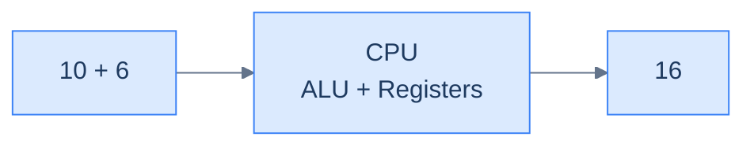
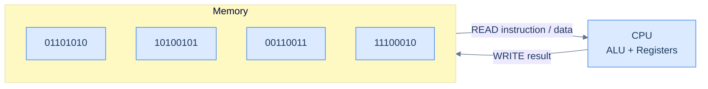
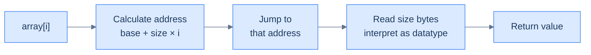

# 1. Introduction to arrays

This section introduces the core ideas behind arrays and builds the mental model you need before working with array operations and patterns.

## Table of contents

1. [Understanding the memory model](#understanding-the-memory-model)
2. [Understanding the problem](#understanding-the-problem)
3. [Exploring a possible solution](#exploring-a-possible-solution)
4. [Overview of supported operations](#overview-of-supported-operations)
5. [Internal mechanics of arrays](#internal-mechanics-of-arrays)
6. [Working example](#working-example)

***

# Understanding the Memory Model

Before diving into data structures like arrays, we need to answer a surprisingly important question: **how does a computer actually store and retrieve data?**

What is computer memory? Why does it exist? How does a program even run? These fundamentals are what make everything else — arrays, pointers, data structures — click into place. In this lesson, we'll build a simple mental model of memory that works across almost all programming languages.

---

## Memory

Let's start with a concrete example. You ask the CPU to compute `10 + 6`. It does the math and produces `16`. Simple enough.

But here's the real question: **where does `16` go?**



<p align="center"><strong>The CPU can add two numbers and produce the result — but where is that result stored?</strong></p>

The CPU uses tiny internal slots called **registers** to hold values during computation. But registers are extremely limited in number. For data that needs to persist beyond a single instruction, we need something bigger: **computer memory (RAM)**.

RAM is its own chip on your motherboard. It doesn't compute anything — that's the CPU's job. Its entire purpose is to **store data** so it can be retrieved and updated later.

```d2
direction: right

cpu: CPU chip {
  ALU
  Registers
}

ram: RAM chip {
  grid-columns: 5
  c0: ""
  c1: ""
  c2: ""
  c3: ""
  c4: ""
}

cpu <-> ram: separate chips, different jobs
```

<p align="center"><strong>CPU computes. RAM stores. They are two separate chips on your motherboard.</strong></p>

---

### Everything is Binary

RAM is a chip, and chips work with electrical signals — high voltage (1) and low voltage (0). That means **everything stored in memory must be represented as 0s and 1s**.

Fortunately, this is easier than it sounds:

- **Numbers** → convert to base 2 (binary)
- **Text, images, etc.** → first encoded as numbers, then converted to binary

This is called the **binary form** of data. Every piece of information your program uses — integers, characters, floats, strings — lives in memory as a sequence of bits.

> **Memory trick:** Think of each bit as a light switch. On = 1, Off = 0. RAM is just a huge wall of light switches.

---

## The Memory Model

When writing real software, you don't want to think about voltage levels and transistors. That's where the **memory model** comes in.

A memory model is an abstraction — a simplified way to think about how memory works so you can reason about your code without getting lost in hardware details.

The mental model is dead simple:

> Imagine memory as a **long chain of numbered boxes**, starting at `0` and ending at `n - 1`, where `n` is the total number of boxes. That's it. This picture covers 99% of what you need when writing software.

```d2
mem: Memory {
  grid-columns: 8
  grid-gap: 0
  b0: "0"
  b1: "1"
  b2: "2"
  b3: "3"
  b4: "4"
  b5: "5"
  b6: "6"
  b7: "n-1"
}
```

<p align="center"><strong>Memory can be visualized as a linear sequence of numbered blocks.</strong></p>

---

### Bits and Bytes

Each box in that chain holds exactly **8 bits**. A group of 8 bits is called a **byte** — the basic unit of memory, like a meter is the basic unit of distance.

| Unit | What it is |
|------|------------|
| **Bit** | A single binary digit — either `0` or `1` |
| **Byte** | A group of 8 bits |

So when you hear "this integer takes 4 bytes", it means 4 consecutive boxes in memory, holding 32 bits total.

---

### Addresses

Storing data is easy. But how do you *find* it again?

Each byte has a unique identifier based on its position — its **address**. It's just the index of the box, counting from 0.

```d2
mem: Memory {
  grid-columns: 6
  grid-gap: 0
  b0: "0"
  b1: "1"
  b2: "2"
  b3: "3" {style.fill: "#fde68a"; style.stroke: "#d97706"}
  b4: "4"
  b5: "5"
}
```

<p align="center"><strong>Each cell is 1 byte (8 bits); its position number is its address. Highlighted cell sits at <code>address = 3</code>.</strong></p>

> **Address in memory:** The address of data is the position of the **first byte** where that data starts.

If you store a 4-byte integer starting at address `3`, its address is `3` — even though it occupies boxes `3`, `4`, `5`, and `6`.

The CPU uses these addresses to read and write data with pinpoint precision. No searching required — it jumps straight to the right box.

> **Analogy:** Memory addresses are like house numbers on a street. You don't walk the entire street to find a house — you go directly to the number.

---

## Program Execution

Now let's zoom out and see how memory fits into the bigger picture of running a program.

When you run a program:
1. The compiler translates your source code into **machine code**
2. That machine code is **loaded into memory** in full
3. The CPU reads instructions from memory **sequentially**, starting at the first address
4. As it executes, the CPU reads data from memory, processes it, and writes results back



<p align="center"><strong>The CPU and memory are in constant conversation during execution.</strong></p>

Think of it like the human brain: one part breaks down complex problems (CPU), another part retains intermediate information (memory). They work together — neither can do much without the other.

Memory stores two kinds of things during a program's lifetime:
- **The program itself** (the machine code instructions)
- **The data** the program creates and manipulates

---

## Why This Matters for Arrays

This memory model is the foundation for understanding arrays — and nearly every other data structure.

- Arrays occupy a **contiguous sequence** of memory addresses
- Every element starts at a **predictable address** (calculable from the base address + element size)
- The CPU can jump to any element instantly because it knows the exact address

Once you have this mental picture — memory as a numbered line of bytes, each accessible by address — arrays become completely intuitive.

But there's still a question we haven't answered: when you write `array[3]`, what *exactly* happens between that source line and the value coming back? We'll trace it byte by byte before this lesson ends.

---

## Key Takeaways

- RAM is a storage chip; the CPU is a computation chip — they're separate and work together
- Everything in memory is stored as **binary (0s and 1s)**
- Memory = a long sequence of numbered **bytes** (each byte = 8 bits)
- Each byte has a unique **address** (its index from 0)
- The **address of data** = the first byte where it starts
- During execution, the CPU constantly reads instructions and data from memory and writes results back

***

# Understanding the Problem

To understand arrays and why we need them, let's look at a real problem that programmers run into all the time when designing software systems.

When writing a program, we often need to store a **collection of related data items** that can be accessed sequentially. For example, imagine storing the ages of all the students in a class.

If there are only a few students, storing them in separate variables feels fine:

```d2
grid-columns: 3
grid-gap: 24
a: "ageStudent1 = 12"
b: "ageStudent2 = 13"
c: "ageStudent3 = 13"
```

<p align="center"><strong>Using variables to store the ages of 3 students.</strong></p>

Easy enough. Three students, three variables. Done.

But what happens when the class has **hundreds of students**? Now you need hundreds of variables:

```d2
grid-columns: 4
grid-gap: 16
s1: "ageStudent1 = 12"
s2: "ageStudent2 = 13"
s3: "ageStudent3 = 13"
s4: "ageStudent4 = 11"
s5: "ageStudent5 = 11"
s6: "ageStudent6 = 12"
s7: "ageStudent7 = 12"
s8: "ageStudent8 = 13"
s9: "......"
s10: "......"
s11: "......"
s12: "......"
s13: "ageStudent105 = 13"
s14: "ageStudent106 = 11"
s15: "ageStudent107 = 13"
s16: "ageStudent108 = 11"
```

<p align="center"><strong>Using variables to store ages of 108 students.</strong></p>

While this technically works, storing and managing hundreds of values across hundreds of individually named variables is **error-prone and not scalable**.

> *Before reading on — picture the code that prints every student's age. With 108 separately-named variables, what would the loop body even look like? You'd need 108 hard-coded `print()` lines. There's no `i` to loop over.*

That last observation is the hidden cost — variables don't just multiply names, they kill loops.

---

## Limitations of Using Variables

Variables are incredibly useful for holding individual pieces of data. But when you try to use them to store a *collection* of related data, they start to break down fast.

Here's why:

- **A variable can store only one value at a time.**
- **Different variables that store the same type of information must have different names.** You can't call two things `ageStudent` — one has to be `ageStudent1`, another `ageStudent2`, and so on forever.
- **Too many variables complicate the source code and the programming logic**, making it error-prone.
- **Using variables to store lots of data is not scalable.** What happens when the class size changes? You'd need to add or remove variable declarations manually.

> **The real problem:** Variables are designed for individual values. They were never meant to handle collections.

---

## Why This Matters

Computers are designed to solve problems **at scale** — managing large amounts of data that would be impossible for humans to handle manually. Problems like these (storing and processing collections) are extremely common, even in the simplest software.

That's why even the **lowest-level programming languages**, such as assembly, inherently support a data structure for storing multiple values together.

That data structure is what we're about to learn: the **array**.

---

## Key Takeaway

| Approach | Works for | Breaks when |
|---|---|---|
| Separate variables | 2–3 values | Data grows, or you need to loop over it |
| Arrays | Any number of values | (Rarely — this is exactly what they're built for) |

The moment you find yourself typing `variable1`, `variable2`, `variable3`... stop. You need an array.

***

# Exploring a Possible Solution

Now that we understand the limitations of using variables and how they prevent us from designing solutions at scale, we can look at the data structure designed to address these problems.

---

## Enter the Array

> An array is a **contiguous segment of memory** that can store multiple data items simultaneously. In its simplest form, an array has a **fixed size** and can store only a fixed number of data items. All items in an array must be of the **same type**.

Let's break that definition down:

- **Contiguous** — all elements sit next to each other in memory, no gaps
- **Fixed size** — you decide how many items it holds when you create it
- **Same type** — you can't mix integers and strings in the same array

Visually, an array looks like a row of labelled boxes, all the same size, sitting side by side:

```d2
direction: right

arr: array {
  grid-columns: 7
  grid-gap: 0
  v1: value1
  v2: value2
  v3: value3
  v4: value4
  v5: value5
  v6: value6
  v7: value7
}

size: "◄────── size ──────►" {
  shape: text
}
size -> arr: "" {style.stroke-dash: 3}
```

<p align="center"><strong>An array data structure.</strong></p>

The `size` is fixed at creation time. Every cell holds one value of the same type, and every cell is the same width in memory.

---

## Solving the Student Ages Problem

Remember the problem from last lesson — storing ages for an entire class? With separate variables it fell apart at scale. An array solves this cleanly.

Instead of:
```
ageStudent1 = 12
ageStudent2 = 13
ageStudent3 = 13
... (×108)
```

You create **one** array that holds all the ages:

```d2
ages: ages {
  grid-columns: 7
  grid-gap: 0
  a1: age1
  a2: age2
  a3: age3
  a4: age4
  a5: age5
  a6: age6
  a7: age7
}
```

<p align="center"><strong>Storing the ages of students in a class in an array.</strong></p>

One name. One structure. All the values.

---

## Why This Works

| Problem with variables | How arrays fix it |
|---|---|
| One value per variable | One array holds all values |
| Hundreds of different names | One name, access by index |
| Can't loop over them easily | Loop with `i` from `0` to `n-1` |
| Not scalable | Resize once, logic stays the same |

> **Key insight:** Instead of naming every value, you name the *collection* once and refer to items by their **position (index)**.

---

## Key Takeaway

An array is the simplest, most fundamental solution to the "store a collection of same-type values" problem. It trades flexibility (fixed size, fixed type) for speed and simplicity (instant access by index, compact in memory).

Every data structure you'll learn after this is either built on top of arrays or exists to solve a limitation of arrays.

***

# Overview of Supported Operations

Now that we know the logical representation of an array, let's examine how to **create**, **access**, **modify**, and **traverse** one. Almost all major programming languages support arrays in some form.

---

## Creating an Array

The syntax and rules for creating an array depend on the programming language. An array with a fixed size cannot be modified after creation, and all data items in an array must be of the same type.

```d2
arr: array {
  grid-columns: 5
  grid-gap: 0
  v1: value1
  v2: value2
  v3: value3
  v4: value4
  v5: value5
}
```

<p align="center"><strong>Creating an array of fixed size and datatype.</strong></p>

Higher-level languages like Python inherently provide a **list** instead of a raw array. A list behaves like an array but has a dynamic size and can store elements of different types. However, the underlying machine-level implementation still uses basic arrays as the core data structure, which has a fixed size and type.

```python run
from typing import List

# Python lists are dynamic and can grow or shrink at runtime

# Declaring an array (list) of fixed size with default values
numbers: List[int] = [0] * 5

# Declaring and initializing an array
numbers2: List[int] = [1, 2, 3, 4, 5]

# Creating an array of size N
size_n: int = 5
numbers3: List[int] = [0] * size_n

# Creating and initializing using list comprehension
numbers4: List[int] = [i for i in range(5)]

print(numbers, numbers2, numbers3, numbers4)
```

```java run
public class Main {
    public static void main(String[] args) {
        // Java arrays are fixed-size; the size is part of the type and locked at allocation.

        // Declaring an array of fixed size with default values (int defaults to 0).
        int[] numbers = new int[5];

        // Declaring and initializing an array literal.
        int[] numbers2 = {1, 2, 3, 4, 5};

        // Creating an array of size N.
        int sizeN = 5;
        int[] numbers3 = new int[sizeN];

        // Creating and initializing in a loop (Java has no list comprehension).
        int[] numbers4 = new int[5];
        for (int i = 0; i < 5; i++) numbers4[i] = i;

        System.out.println(java.util.Arrays.toString(numbers));
        System.out.println(java.util.Arrays.toString(numbers2));
        System.out.println(java.util.Arrays.toString(numbers3));
        System.out.println(java.util.Arrays.toString(numbers4));
    }
}
```

```c run
#include <stdio.h>

int main() {
    /* C arrays are fixed-size. Size must be a compile-time constant or a VLA size. */

    /* Default-initialise to zero by giving an empty initializer list. */
    int numbers[5] = {0};

    /* Declaring and initialising. */
    int numbers2[5] = {1, 2, 3, 4, 5};

    /* Creating an array of size N (here a constant — runtime sizes need VLA or malloc). */
    const int size_n = 5;
    int numbers3[size_n];
    for (int i = 0; i < size_n; i++) numbers3[i] = 0;

    /* Initialise with a loop. */
    int numbers4[5];
    for (int i = 0; i < 5; i++) numbers4[i] = i;

    for (int i = 0; i < 5; i++) printf("%d ", numbers4[i]);
    printf("\n");
    return 0;
}
```

```cpp run
#include <iostream>
#include <vector>

int main() {
    // std::vector is the dynamic-array equivalent of a Python list.

    // Fixed size with default values (0 for int).
    std::vector<int> numbers(5, 0);

    // Initialiser-list construction.
    std::vector<int> numbers2 = {1, 2, 3, 4, 5};

    // Size known at runtime — vectors grow naturally.
    int size_n = 5;
    std::vector<int> numbers3(size_n, 0);

    // Fill with computed values.
    std::vector<int> numbers4(5);
    for (int i = 0; i < 5; i++) numbers4[i] = i;

    for (int v : numbers4) std::cout << v << " ";
    std::cout << "\n";
}
```

```scala run
object Main extends App {
  // Scala Array is a fixed-size, JVM-backed primitive array.

  // Fixed size with default values (Int defaults to 0).
  val numbers: Array[Int] = new Array[Int](5)

  // Declaring and initialising.
  val numbers2: Array[Int] = Array(1, 2, 3, 4, 5)

  // Size known at runtime.
  val sizeN = 5
  val numbers3: Array[Int] = new Array[Int](sizeN)

  // Comprehension-style initialisation via tabulate.
  val numbers4: Array[Int] = Array.tabulate(5)(i => i)

  println(numbers.mkString(", "))
  println(numbers2.mkString(", "))
  println(numbers3.mkString(", "))
  println(numbers4.mkString(", "))
}
```

```javascript run
// JavaScript arrays are dynamic — closer to Python lists than to fixed-size C arrays.

// Fixed-length pre-fill with a default value.
const numbers = new Array(5).fill(0);

// Array literal — declare and initialise in one go.
const numbers2 = [1, 2, 3, 4, 5];

// Size known at runtime.
const sizeN = 5;
const numbers3 = new Array(sizeN).fill(0);

// Comprehension-style: Array.from with a generator function.
const numbers4 = Array.from({ length: 5 }, (_, i) => i);

console.log(numbers, numbers2, numbers3, numbers4);
```

```typescript run
// TypeScript adds type annotations on top of JavaScript's dynamic arrays.

// Fixed-length pre-fill.
const numbers: number[] = new Array(5).fill(0);

// Array literal.
const numbers2: number[] = [1, 2, 3, 4, 5];

// Size known at runtime.
const sizeN: number = 5;
const numbers3: number[] = new Array(sizeN).fill(0);

// Comprehension-style with Array.from.
const numbers4: number[] = Array.from({ length: 5 }, (_, i) => i);

console.log(numbers, numbers2, numbers3, numbers4);
```

```go run
package main

import "fmt"

func main() {
    // Go has both fixed-size arrays and dynamic slices. Slices are the everyday choice.

    // Fixed-size array with zero values.
    var numbers [5]int

    // Declare and initialise (slice literal — preferred over fixed arrays).
    numbers2 := []int{1, 2, 3, 4, 5}

    // Size known at runtime — make creates a slice of that length, zero-initialised.
    sizeN := 5
    numbers3 := make([]int, sizeN)

    // Loop-fill (Go has no comprehension).
    numbers4 := make([]int, 5)
    for i := 0; i < 5; i++ {
        numbers4[i] = i
    }

    fmt.Println(numbers, numbers2, numbers3, numbers4)
}
```

```kotlin run
fun main() {
    // Kotlin distinguishes IntArray (primitive) from Array<Int> (boxed).

    // Fixed size with default values (IntArray defaults to 0).
    val numbers = IntArray(5)

    // Declare and initialise.
    val numbers2 = intArrayOf(1, 2, 3, 4, 5)

    // Size known at runtime.
    val sizeN = 5
    val numbers3 = IntArray(sizeN)

    // Comprehension-style: IntArray(size) { initializer-by-index }.
    val numbers4 = IntArray(5) { i -> i }

    println(numbers.toList())
    println(numbers2.toList())
    println(numbers3.toList())
    println(numbers4.toList())
}
```

```rust run
fn main() {
    // Rust arrays are fixed-size and stack-allocated. Vec is the heap-backed dynamic version.

    // Fixed size with default values.
    let numbers: [i32; 5] = [0; 5];

    // Declare and initialise.
    let numbers2: [i32; 5] = [1, 2, 3, 4, 5];

    // Size known at runtime — use Vec because array length must be a const.
    let size_n = 5;
    let numbers3: Vec<i32> = vec![0; size_n];

    // Comprehension-style with iterator + collect.
    let numbers4: Vec<i32> = (0..5).collect();

    println!("{:?} {:?} {:?} {:?}", numbers, numbers2, numbers3, numbers4);
}
```


> **Tip:** In Python, annotating with `List[int]` is just a hint — the runtime won't enforce it. But it's good practice to document your intent, especially for DSA problems.

---

## Accessing Elements in an Array

An array is a collection of data items stored in **contiguous memory**. This layout allows us to access any element directly using its **index** via the subscript operator `[]`.

> **Why do array indices start from 0 instead of 1?**
>
> Array indices represent an element's **relative** position from the array's beginning. The first element is 0 steps away from the start, the second is 1 step away, and so on. This is not a convention — it's a direct reflection of how address arithmetic works in memory.

```d2
arr: array {
  grid-rows: 2
  grid-columns: 5
  grid-gap: 0
  v1: value1
  v2: value2
  v3: value3
  v4: value4
  v5: value5
  i0: "[0]"
  i1: "[1]"
  i2: "[2]"
  i3: "[3]"
  i4: "[4]"
}
```

<p align="center"><strong>Array elements are accessed via their indices.</strong></p>

Different languages have different syntax, but the underlying access mechanism is the same for all.

```python run
from typing import List

numbers: List[int] = [1, 2, 3, 4, 5]

# Subscript [] — direct O(1) access by index.
print("1st value:", numbers[0])   # → 1
print("5th value:", numbers[4])   # → 5

# Negative indexing — Python-only sugar for "from the end."
print("Last value:", numbers[-1]) # → 5
```

```java run
public class Main {
    public static void main(String[] args) {
        int[] numbers = {1, 2, 3, 4, 5};

        // Subscript [] — direct O(1) access by index.
        System.out.println("1st value: " + numbers[0]);   // → 1
        System.out.println("5th value: " + numbers[4]);   // → 5

        // Java has no negative indexing — compute it from length.
        System.out.println("Last value: " + numbers[numbers.length - 1]);
    }
}
```

```c run
#include <stdio.h>

int main() {
    int numbers[] = {1, 2, 3, 4, 5};
    int n = sizeof(numbers) / sizeof(numbers[0]);

    /* Subscript [] — direct O(1) access by index. */
    printf("1st value: %d\n", numbers[0]);   /* → 1 */
    printf("5th value: %d\n", numbers[4]);   /* → 5 */

    /* No negative indexing in C — compute n - 1 manually. */
    printf("Last value: %d\n", numbers[n - 1]);
    return 0;
}
```

```cpp run
#include <iostream>
#include <vector>

int main() {
    std::vector<int> numbers = {1, 2, 3, 4, 5};

    // Subscript [] — direct O(1) access by index.
    std::cout << "1st value: " << numbers[0] << "\n";   // → 1
    std::cout << "5th value: " << numbers[4] << "\n";   // → 5

    // No negative indexing — use back() or size() - 1.
    std::cout << "Last value: " << numbers.back() << "\n";
}
```

```scala run
object Main extends App {
  val numbers = Array(1, 2, 3, 4, 5)

  // arr(i) is Scala's subscript — same O(1) access by index.
  println(s"1st value: ${numbers(0)}")   // → 1
  println(s"5th value: ${numbers(4)}")   // → 5

  // Use length - 1 for the last element.
  println(s"Last value: ${numbers(numbers.length - 1)}")
}
```

```javascript run
const numbers = [1, 2, 3, 4, 5];

// Subscript [] — direct O(1) access by index.
console.log("1st value:", numbers[0]);   // → 1
console.log("5th value:", numbers[4]);   // → 5

// JS has no negative indexing on arrays — use .at(-1) (modern) or length - 1.
console.log("Last value:", numbers.at(-1));
```

```typescript run
const numbers: number[] = [1, 2, 3, 4, 5];

// Subscript [] — direct O(1) access by index.
console.log("1st value:", numbers[0]);   // → 1
console.log("5th value:", numbers[4]);   // → 5

// .at(-1) returns the last element; matches Python's numbers[-1] semantics.
console.log("Last value:", numbers.at(-1));
```

```go run
package main

import "fmt"

func main() {
    numbers := []int{1, 2, 3, 4, 5}

    // Subscript [] — direct O(1) access by index.
    fmt.Println("1st value:", numbers[0])   // → 1
    fmt.Println("5th value:", numbers[4])   // → 5

    // No negative indexing in Go — len() - 1 is the idiom.
    fmt.Println("Last value:", numbers[len(numbers)-1])
}
```

```kotlin run
fun main() {
    val numbers = intArrayOf(1, 2, 3, 4, 5)

    // Subscript [] — direct O(1) access by index.
    println("1st value: ${numbers[0]}")   // → 1
    println("5th value: ${numbers[4]}")   // → 5

    // .last() returns the final element; or numbers[numbers.size - 1].
    println("Last value: ${numbers.last()}")
}
```

```rust run
fn main() {
    let numbers = [1, 2, 3, 4, 5];

    // Subscript [] — direct O(1) access by index. Out-of-bounds panics.
    println!("1st value: {}", numbers[0]);   // → 1
    println!("5th value: {}", numbers[4]);   // → 5

    // No negative indexing — use len() - 1, or .last() which returns Option.
    println!("Last value: {}", numbers.last().unwrap());
}
```


> **Common mistake:** Accessing `numbers[5]` in a 5-element array raises an `IndexError`. Valid indices are `0` to `len(numbers) - 1`.

---

## Modifying Elements in an Array

Elements in an array can be modified in place, just like variables. To update a value, use `array[index]` on the left side of the assignment operator.

```d2
arr: array {
  grid-rows: 2
  grid-columns: 5
  grid-gap: 0
  v1: value1
  v2: value2 {style.fill: "#fde68a"; style.stroke: "#d97706"}
  v3: value3 {style.fill: "#fde68a"; style.stroke: "#d97706"}
  v4: value4
  v5: value5
  i0: "[0]"
  i1: "[1]" {style.fill: "#fde68a"; style.stroke: "#d97706"}
  i2: "[2]" {style.fill: "#fde68a"; style.stroke: "#d97706"}
  i3: "[3]"
  i4: "[4]"
}
```

<p align="center"><strong>Array elements can be modified via their indices (highlighted = being updated).</strong></p>

```python run
from typing import List

numbers: List[int] = [1, 2, 3, 4, 5]

# Subscript [] on the LHS of = overwrites the slot in place.
numbers[0] = 10
numbers[2] = 30
numbers[4] = 50

print("1st value:", numbers[0])   # → 10
print("3rd value:", numbers[2])   # → 30
print("5th value:", numbers[4])   # → 50
```

```java run
public class Main {
    public static void main(String[] args) {
        int[] numbers = {1, 2, 3, 4, 5};

        // Subscript [] on the LHS overwrites the slot in place.
        numbers[0] = 10;
        numbers[2] = 30;
        numbers[4] = 50;

        System.out.println("1st value: " + numbers[0]);   // → 10
        System.out.println("3rd value: " + numbers[2]);   // → 30
        System.out.println("5th value: " + numbers[4]);   // → 50
    }
}
```

```c run
#include <stdio.h>

int main() {
    int numbers[] = {1, 2, 3, 4, 5};

    /* Subscript [] on the LHS overwrites the slot in place. */
    numbers[0] = 10;
    numbers[2] = 30;
    numbers[4] = 50;

    printf("1st value: %d\n", numbers[0]);   /* → 10 */
    printf("3rd value: %d\n", numbers[2]);   /* → 30 */
    printf("5th value: %d\n", numbers[4]);   /* → 50 */
    return 0;
}
```

```cpp run
#include <iostream>
#include <vector>

int main() {
    std::vector<int> numbers = {1, 2, 3, 4, 5};

    // Subscript [] on the LHS overwrites the slot in place.
    numbers[0] = 10;
    numbers[2] = 30;
    numbers[4] = 50;

    std::cout << "1st value: " << numbers[0] << "\n";   // → 10
    std::cout << "3rd value: " << numbers[2] << "\n";   // → 30
    std::cout << "5th value: " << numbers[4] << "\n";   // → 50
}
```

```scala run
object Main extends App {
  val numbers = Array(1, 2, 3, 4, 5)

  // arr(i) = x — Scala's in-place update syntax (Array is mutable).
  numbers(0) = 10
  numbers(2) = 30
  numbers(4) = 50

  println(s"1st value: ${numbers(0)}")   // → 10
  println(s"3rd value: ${numbers(2)}")   // → 30
  println(s"5th value: ${numbers(4)}")   // → 50
}
```

```javascript run
const numbers = [1, 2, 3, 4, 5];

// Subscript [] on the LHS overwrites the slot in place.
numbers[0] = 10;
numbers[2] = 30;
numbers[4] = 50;

console.log("1st value:", numbers[0]);   // → 10
console.log("3rd value:", numbers[2]);   // → 30
console.log("5th value:", numbers[4]);   // → 50
```

```typescript run
const numbers: number[] = [1, 2, 3, 4, 5];

// Subscript [] on the LHS overwrites the slot in place.
numbers[0] = 10;
numbers[2] = 30;
numbers[4] = 50;

console.log("1st value:", numbers[0]);   // → 10
console.log("3rd value:", numbers[2]);   // → 30
console.log("5th value:", numbers[4]);   // → 50
```

```go run
package main

import "fmt"

func main() {
    numbers := []int{1, 2, 3, 4, 5}

    // Subscript [] on the LHS overwrites the slot in place.
    numbers[0] = 10
    numbers[2] = 30
    numbers[4] = 50

    fmt.Println("1st value:", numbers[0])   // → 10
    fmt.Println("3rd value:", numbers[2])   // → 30
    fmt.Println("5th value:", numbers[4])   // → 50
}
```

```kotlin run
fun main() {
    val numbers = intArrayOf(1, 2, 3, 4, 5)

    // arr[i] = x — IntArray is mutable even when the reference is `val`.
    numbers[0] = 10
    numbers[2] = 30
    numbers[4] = 50

    println("1st value: ${numbers[0]}")   // → 10
    println("3rd value: ${numbers[2]}")   // → 30
    println("5th value: ${numbers[4]}")   // → 50
}
```

```rust run
fn main() {
    // `mut` is required to allow in-place mutation of the array.
    let mut numbers = [1, 2, 3, 4, 5];

    // Subscript [] on the LHS overwrites the slot in place.
    numbers[0] = 10;
    numbers[2] = 30;
    numbers[4] = 50;

    println!("1st value: {}", numbers[0]);   // → 10
    println!("3rd value: {}", numbers[2]);   // → 30
    println!("5th value: {}", numbers[4]);   // → 50
}
```


Different languages implement this differently at the syntax level, but the underlying mechanism — overwriting a memory location at a known address — is the same everywhere.

---

## Traversing an Array

Traversal is one of the most common operations on an array. It is the **only** way to search for a value in an array and is implemented using a loop control variable as an index, starting from `0`. To traverse safely, the size of the array must be known.

The pointer starts at index `0` and steps forward one cell at a time until it reaches the end:

<div class="array-stepper" data-values="1, 2, 3, 4, 5" data-label="index"></div>

<p align="center"><strong>Traversing an array using a loop control variable <code>index</code>. Click Next/Prev to step through, or use the ←/→ keys when the widget is focused.</strong></p>

Higher-level languages have built-in functions to get the array's length. For lower-level languages like C/C++, the programmer needs to track the array's size manually.

```python run
from typing import List

numbers: List[int] = [1, 2, 3, 4, 5]

# 1. Index-based for — useful when you need the index itself.
for index in range(len(numbers)):
    print(numbers[index])

# 2. For-each — shorter when only the value matters.
for value in numbers:
    print(value)

# 3. enumerate — index + value together, no len() / subscript needed.
for index, value in enumerate(numbers):
    print(index, value)

# 4. While loop — finer control (skip indices, step by 2, break early).
index: int = 0
while index < len(numbers):
    print(numbers[index])
    index += 1
```

```java run
public class Main {
    public static void main(String[] args) {
        int[] numbers = {1, 2, 3, 4, 5};

        // 1. Index-based for — pairs naturally with arr.length.
        for (int index = 0; index < numbers.length; index++) {
            System.out.println(numbers[index]);
        }

        // 2. Enhanced for (for-each) — when the index isn't needed.
        for (int value : numbers) {
            System.out.println(value);
        }

        // 3. Index + value together — Java has no enumerate, so loop with both.
        for (int i = 0; i < numbers.length; i++) {
            System.out.println(i + " " + numbers[i]);
        }

        // 4. While loop — finer control over advancement.
        int i = 0;
        while (i < numbers.length) {
            System.out.println(numbers[i]);
            i++;
        }
    }
}
```

```c run
#include <stdio.h>

int main() {
    int numbers[] = {1, 2, 3, 4, 5};
    int n = sizeof(numbers) / sizeof(numbers[0]);

    /* 1. Index-based for. */
    for (int index = 0; index < n; index++) {
        printf("%d\n", numbers[index]);
    }

    /* 2. C has no for-each — index-based is the only built-in form. */
    for (int i = 0; i < n; i++) {
        printf("%d\n", numbers[i]);
    }

    /* 3. Index + value together. */
    for (int i = 0; i < n; i++) {
        printf("%d %d\n", i, numbers[i]);
    }

    /* 4. While loop. */
    int i = 0;
    while (i < n) {
        printf("%d\n", numbers[i]);
        i++;
    }
    return 0;
}
```

```cpp run
#include <iostream>
#include <vector>

int main() {
    std::vector<int> numbers = {1, 2, 3, 4, 5};

    // 1. Index-based for.
    for (size_t index = 0; index < numbers.size(); index++) {
        std::cout << numbers[index] << "\n";
    }

    // 2. Range-based for (C++11+) — direct values.
    for (int value : numbers) {
        std::cout << value << "\n";
    }

    // 3. Index + value together — no enumerate, loop with index.
    for (size_t i = 0; i < numbers.size(); i++) {
        std::cout << i << " " << numbers[i] << "\n";
    }

    // 4. While loop.
    size_t i = 0;
    while (i < numbers.size()) {
        std::cout << numbers[i] << "\n";
        i++;
    }
}
```

```scala run
object Main extends App {
  val numbers = Array(1, 2, 3, 4, 5)

  // 1. Index-based for — `arr.indices` gives the valid index range.
  for (index <- numbers.indices) println(numbers(index))

  // 2. For-each — direct value iteration.
  for (value <- numbers) println(value)

  // 3. zipWithIndex pairs each value with its position.
  for ((value, index) <- numbers.zipWithIndex) println(s"$index $value")

  // 4. While loop.
  var i = 0
  while (i < numbers.length) {
    println(numbers(i))
    i += 1
  }
}
```

```javascript run
const numbers = [1, 2, 3, 4, 5];

// 1. Index-based for.
for (let index = 0; index < numbers.length; index++) {
    console.log(numbers[index]);
}

// 2. for...of — direct values.
for (const value of numbers) {
    console.log(value);
}

// 3. .entries() yields [index, value] pairs — JS's enumerate.
for (const [index, value] of numbers.entries()) {
    console.log(index, value);
}

// 4. While loop.
let i = 0;
while (i < numbers.length) {
    console.log(numbers[i]);
    i++;
}
```

```typescript run
const numbers: number[] = [1, 2, 3, 4, 5];

// 1. Index-based for.
for (let index = 0; index < numbers.length; index++) {
    console.log(numbers[index]);
}

// 2. for...of — direct values.
for (const value of numbers) {
    console.log(value);
}

// 3. .entries() yields [index, value] pairs.
for (const [index, value] of numbers.entries()) {
    console.log(index, value);
}

// 4. While loop.
let i: number = 0;
while (i < numbers.length) {
    console.log(numbers[i]);
    i++;
}
```

```go run
package main

import "fmt"

func main() {
    numbers := []int{1, 2, 3, 4, 5}

    // 1. Index-based for (Go's only `for` form, generalised).
    for index := 0; index < len(numbers); index++ {
        fmt.Println(numbers[index])
    }

    // 2. For-each via range (drop the index with _).
    for _, value := range numbers {
        fmt.Println(value)
    }

    // 3. range yields (index, value) pairs natively.
    for index, value := range numbers {
        fmt.Println(index, value)
    }

    // 4. While loop — Go reuses `for` with just a condition.
    i := 0
    for i < len(numbers) {
        fmt.Println(numbers[i])
        i++
    }
}
```

```kotlin run
fun main() {
    val numbers = intArrayOf(1, 2, 3, 4, 5)

    // 1. Index-based for — `indices` is a built-in IntRange.
    for (index in numbers.indices) println(numbers[index])

    // 2. For-each — direct value iteration.
    for (value in numbers) println(value)

    // 3. .withIndex() pairs each value with its position.
    for ((index, value) in numbers.withIndex()) println("$index $value")

    // 4. While loop.
    var i = 0
    while (i < numbers.size) {
        println(numbers[i])
        i++
    }
}
```

```rust run
fn main() {
    let numbers = [1, 2, 3, 4, 5];

    // 1. Index-based for — explicit range over indices.
    for index in 0..numbers.len() {
        println!("{}", numbers[index]);
    }

    // 2. For-each — borrow each element.
    for value in &numbers {
        println!("{}", value);
    }

    // 3. .iter().enumerate() yields (index, &value) pairs — Rust's enumerate.
    for (index, value) in numbers.iter().enumerate() {
        println!("{} {}", index, value);
    }

    // 4. While loop.
    let mut i = 0;
    while i < numbers.len() {
        println!("{}", numbers[i]);
        i += 1;
    }
}
```


> **Which to use?**
> - Use `for value in numbers` when you only need the value
> - Use `for index, value in enumerate(numbers)` when you need both
> - Use `while` when you need finer control (e.g. skip indices, step by 2)

---

## Summary

| Operation | Syntax | Time Complexity |
|---|---|---|
| **Create** | `numbers = [0] * n` | O(n) |
| **Access** | `numbers[i]` | O(1) |
| **Modify** | `numbers[i] = x` | O(1) |
| **Traverse** | `for i in range(len(numbers))` | O(n) |

Access and modify are **O(1)** because the CPU computes the exact memory address directly from the index — no searching required. Traversal is **O(n)** because every element must be visited.

***

# Internal Mechanics of Arrays

So far, we learned what an array is and how it solves problems where we need to store and manipulate large-scale data easily. We can now look at **how the array data structure works under the hood** and what makes it so fast and easy to use.

---

## Memory Addresses

Array elements are accessed using indices because arrays are stored **contiguously** in memory. To understand why, let's revisit the memory model.

> **Note:** This is how an array data structure is stored at the lowest level. Higher-level programming languages abstract all this from the user, but at their core, use the same mechanism.

Memory in RAM is logically organized as a sequence of blocks, each **1 byte (8 bits)** long. Every block has a unique identifier — its **address** — which is simply its relative position from the start (starting from 0).

```d2
mem: Memory {
  grid-columns: 8
  grid-gap: 0
  b0: "0"
  b1: "1"
  b2: "2"
  b3: "3" {style.fill: "#fde68a"; style.stroke: "#d97706"}
  b4: "4"
  b5: "5"
  b6: "6"
  b7: "7"
}
```

<p align="center"><strong>Memory is logically organized as a linear sequence of byte-sized cells. Highlighted cell sits at <code>address = 3</code>.</strong></p>

---

## Layout in Memory

An array is just a **continuous** segment of memory that stores data of a single type. Each element in the array has a fixed size equal to the size of its data type. So:

> **Total size of array** = size of datatype × number of elements

The address of the memory block where an array starts is called the array's **base address**.

> **Base address:** The address of the block of memory where an array starts. The base address, along with the index, is used to access data items in an array.

Here's what an array of 5 integers looks like in memory, with a base address of `2` and each `int` occupying **4 bytes**:

```d2
arr: array {
  grid-rows: 3
  grid-columns: 5
  grid-gap: 0
  v0: value1 {style.fill: "#fde68a"; style.stroke: "#d97706"}
  v1: value2
  v2: value3
  v3: value4
  v4: value5
  i0: "[0]"
  i1: "[1]"
  i2: "[2]"
  i3: "[3]"
  i4: "[4]"
  a0: "2→5"
  a1: "6→9"
  a2: "10→13"
  a3: "14→17"
  a4: "18→21"
}
```

<p align="center"><strong>Structure of an array in memory — base address = <code>2</code>, each <code>int</code> spans 4 bytes. The first element starts at the base address (highlighted).</strong></p>

Key observations:
- Elements are laid out **back to back** with no gaps
- Each element spans exactly `size_of_datatype` bytes
- The next element always starts exactly `size_of_datatype` bytes after the previous one

---

## Accessing Data Items

Now that we know how an array maps into continuous memory, we can derive a simple formula to calculate the address of **any element**, given:
- the **base address** (where the array starts)
- the **size of the datatype** (bytes per element)
- the **index** (which element we want)

> *Before reading on — try writing the formula yourself. Given base `2`, int size `4`, and index `3`, where does element 3 live? What arithmetic gets you there from base?*

> $$\text{address}(index) = base\_address + (size\_of\_datatype \times index)$$

Let's verify with our example (base address = `2`, int = `4` bytes):

| Index | Formula | Address |
|-------|---------|---------|
| 0 | 2 + (4 × 0) | **2** |
| 1 | 2 + (4 × 1) | **6** |
| 2 | 2 + (4 × 2) | **10** |
| 3 | 2 + (4 × 3) | **14** |
| 4 | 2 + (4 × 4) | **18** |

This matches the layout exactly.

> **This is why array indices start at 0, not 1.**
>
> Think of the index not as a position number, but as a **how many elements to skip** count.
>
> - To reach the first element — skip **0** elements → index `0`
> - To reach the second element — skip **1** element → index `1`
> - To reach the third element — skip **2** elements → index `2`
>
> The formula makes this concrete. With base address `2` and int size `4`:
>
> - `index 0` → 2 + (4 × **0**) = **2** ✓ lands exactly at the first element
> - `index 1` → 2 + (4 × **1**) = **6** ✓ lands exactly at the second element
>
> If indices started at `1` instead, `index 1` would give address `6` — jumping straight past the first element at address `2`, which would never be reachable. You'd need a messy correction like `base + (size × (index − 1))`. Starting at `0` keeps the formula clean and direct.

The CPU computes this address **instantly** using a single multiplication and addition — no iteration, no searching. That's why array access is O(1).

---

## Key Takeaway

The power of arrays comes from this formula. Once you know the base address and the datatype size, you can jump to any element in constant time. The CPU doesn't need to scan from the beginning — it does one arithmetic operation and lands exactly at the right memory address.

```python run
# Simulate the subscript-operator's address arithmetic for an int array of length 5.
base_address = 2
size_of_int = 4  # bytes

def address_of(index: int) -> int:
    return base_address + (size_of_int * index)

for i in range(5):
    print(f"value{i+1} at index {i} → address {address_of(i)}")
```

```java run
public class Main {
    static final int BASE_ADDRESS = 2;
    static final int SIZE_OF_INT = 4;

    static int addressOf(int index) {
        return BASE_ADDRESS + SIZE_OF_INT * index;
    }

    public static void main(String[] args) {
        for (int i = 0; i < 5; i++) {
            System.out.println("value" + (i + 1) + " at index " + i + " → address " + addressOf(i));
        }
    }
}
```

```c run
#include <stdio.h>

#define BASE_ADDRESS 2
#define SIZE_OF_INT  4

int address_of(int index) {
    return BASE_ADDRESS + SIZE_OF_INT * index;
}

int main() {
    for (int i = 0; i < 5; i++) {
        printf("value%d at index %d → address %d\n", i + 1, i, address_of(i));
    }
    return 0;
}
```

```cpp run
#include <iostream>

constexpr int BASE_ADDRESS = 2;
constexpr int SIZE_OF_INT  = 4;

int address_of(int index) {
    return BASE_ADDRESS + SIZE_OF_INT * index;
}

int main() {
    for (int i = 0; i < 5; i++) {
        std::cout << "value" << (i + 1) << " at index " << i
                  << " → address " << address_of(i) << "\n";
    }
}
```

```scala run
object Main extends App {
  val baseAddress = 2
  val sizeOfInt   = 4

  def addressOf(index: Int): Int = baseAddress + sizeOfInt * index

  for (i <- 0 until 5) {
    println(s"value${i + 1} at index $i → address ${addressOf(i)}")
  }
}
```

```javascript run
const BASE_ADDRESS = 2;
const SIZE_OF_INT  = 4;

function addressOf(index) {
    return BASE_ADDRESS + SIZE_OF_INT * index;
}

for (let i = 0; i < 5; i++) {
    console.log(`value${i + 1} at index ${i} → address ${addressOf(i)}`);
}
```

```typescript run
const BASE_ADDRESS: number = 2;
const SIZE_OF_INT: number  = 4;

function addressOf(index: number): number {
    return BASE_ADDRESS + SIZE_OF_INT * index;
}

for (let i: number = 0; i < 5; i++) {
    console.log(`value${i + 1} at index ${i} → address ${addressOf(i)}`);
}
```

```go run
package main

import "fmt"

const baseAddress = 2
const sizeOfInt   = 4

func addressOf(index int) int {
    return baseAddress + sizeOfInt*index
}

func main() {
    for i := 0; i < 5; i++ {
        fmt.Printf("value%d at index %d → address %d\n", i+1, i, addressOf(i))
    }
}
```

```kotlin run
const val BASE_ADDRESS = 2
const val SIZE_OF_INT  = 4

fun addressOf(index: Int): Int = BASE_ADDRESS + SIZE_OF_INT * index

fun main() {
    for (i in 0 until 5) {
        println("value${i + 1} at index $i → address ${addressOf(i)}")
    }
}
```

```rust run
const BASE_ADDRESS: i32 = 2;
const SIZE_OF_INT:  i32 = 4;

fn address_of(index: i32) -> i32 {
    BASE_ADDRESS + SIZE_OF_INT * index
}

fn main() {
    for i in 0..5 {
        println!("value{} at index {} → address {}", i + 1, i, address_of(i));
    }
}
```


***

# Working Example

Now that we know how an array is stored in memory, let's walk through a **complete end-to-end example** — from logical representation all the way down to how the CPU locates and reads a value using the subscript operator `[]`.

Given below is the logical representation of an integer array with 5 data items:

```d2
direction: right

decl: "array[5]" {
  shape: oval
}

arr: array {
  grid-columns: 5
  grid-gap: 0
  v1: value1
  v2: value2
  v3: value3
  v4: value4
  v5: value5
}

decl -> arr: logical representation
```

<p align="center"><strong>Logical representation of an integer array with 5 data items.</strong></p>

---

## Layout in Memory

We map the array into memory starting at **base address 2**. Because this is an integer array, we consider the size of each data item to be **4 bytes** for this example.

```d2
arr: array {
  grid-rows: 3
  grid-columns: 5
  grid-gap: 0
  v0: value1 {style.fill: "#fde68a"; style.stroke: "#d97706"}
  v1: value2
  v2: value3
  v3: value4
  v4: value5
  i0: "[0]"
  i1: "[1]"
  i2: "[2]"
  i3: "[3]"
  i4: "[4]"
  a0: "2→5"
  a1: "6→9"
  a2: "10→13"
  a3: "14→17"
  a4: "18→21"
}
```

<p align="center"><strong>An array of 5 integers mapped into continuous memory starting at address <code>2</code> (highlighted = base).</strong></p>

Each element occupies exactly 4 consecutive bytes. The elements are laid out back to back with no gaps — that's what "contiguous" means.

---

## Calculating the Address of Data Items

When we write `array[2]` or `array[3]`, the program uses the formula we learned to calculate the exact memory address of that element:

> `address(index) = base_address + (size_of_datatype × index)`

The program already knows the base address and the size of the data type — this is all it needs. Let's see it in action for two accesses:

```d2
c2: |md
  **array[2]**<br/>`2 + (2 × 4) = 10`
| {style.fill: "#fef9c3"; style.stroke: "#d97706"}

c3: |md
  **array[3]**<br/>`2 + (3 × 4) = 14`
| {style.fill: "#dcfce7"; style.stroke: "#16a34a"}

arr: array {
  grid-rows: 2
  grid-columns: 5
  grid-gap: 0
  v0: value1
  v1: value2
  v2: value3 {style.fill: "#fef9c3"; style.stroke: "#d97706"}
  v3: value4 {style.fill: "#dcfce7"; style.stroke: "#16a34a"}
  v4: value5
  a0: "addr 2"
  a1: "addr 6"
  a2: "addr 10" {style.fill: "#fef9c3"; style.stroke: "#d97706"}
  a3: "addr 14" {style.fill: "#dcfce7"; style.stroke: "#16a34a"}
  a4: "addr 18"
}

c2 -> arr.v2
c3 -> arr.v3
```

<p align="center"><strong>Calculating the address for <code>array[2]</code> and <code>array[3]</code> using the subscript operator.</strong></p>

The CPU performs one multiplication and one addition — and it's done. No scanning, no searching. That's why access is always **O(1)**, regardless of array size.

---

## Dereferencing the Value

Calculating the address is only **half** the work. The next step is to actually read the value stored there — this is called **dereferencing**.

The program knows the type of data stored in the array (integer, in our case). So starting from the calculated address, it reads exactly `size_of_datatype` bytes (4 bytes for an int) and interprets them as the value.

> **Dereferencing:** Accessing the value stored at the memory address held by a pointer. The pointer's data type determines how many bytes to read and how to interpret them.

```d2
direction: right

a2: "array[2] = 10" {style.fill: "#fef9c3"; style.stroke: "#d97706"}
v3: value3 {style.fill: "#fef9c3"; style.stroke: "#d97706"}
a2 -> v3: read 4 bytes at addr 10

a3: "array[3] = 14" {style.fill: "#dcfce7"; style.stroke: "#16a34a"}
v4: value4 {style.fill: "#dcfce7"; style.stroke: "#16a34a"}
a3 -> v4: read 4 bytes at addr 14
```

<p align="center"><strong>Dereferencing: reading the value at the calculated address using the datatype to determine how many bytes to interpret.</strong></p>

> **Note:** Lower-level languages like C and C++ expose this mechanism directly through **pointers** — variables that store memory addresses and let you read or manipulate any part of a contiguous memory segment. In Python and most high-level languages, this all happens invisibly.

---

## Putting It All Together

Here's the full sequence of what happens every time you write `array[i]`:



<p align="center"><strong>The full pipeline for a single array element access.</strong></p>

> **We used 4-byte integers in this example, but the underlying mechanism is identical for any datatype** — 1-byte chars, 8-byte doubles, or any custom struct. The formula stays the same; only `size_of_datatype` changes.

All of this happens automatically under the hood in modern programming languages. As a programmer, you just write `array[i]` — the language handles the address arithmetic and dereferencing for you.

---

## Key Takeaway

The subscript operator `array[i]` is not magic — it's one multiplication, one addition, and one memory read. The CPU knows exactly where to go, reads exactly the right number of bytes, and hands the value back. That's what makes arrays so fast and so fundamental.

```python run
# Full subscript pipeline: address = base + size × index, then read 4 bytes.
base_address = 2
size_of_int = 4

def access(index: int) -> str:
    addr = base_address + (size_of_int * index)
    return f"array[{index}] → address {addr} → value{index + 1}"

for i in range(5):
    print(access(i))
```

```java run
public class Main {
    static final int BASE = 2;
    static final int SIZE = 4;

    static String access(int index) {
        int addr = BASE + SIZE * index;
        return "array[" + index + "] → address " + addr + " → value" + (index + 1);
    }

    public static void main(String[] args) {
        for (int i = 0; i < 5; i++) System.out.println(access(i));
    }
}
```

```c run
#include <stdio.h>

#define BASE 2
#define SIZE 4

void access_(int index) {
    int addr = BASE + SIZE * index;
    printf("array[%d] → address %d → value%d\n", index, addr, index + 1);
}

int main() {
    for (int i = 0; i < 5; i++) access_(i);
    return 0;
}
```

```cpp run
#include <iostream>
#include <string>

constexpr int BASE = 2;
constexpr int SIZE = 4;

std::string access(int index) {
    int addr = BASE + SIZE * index;
    return "array[" + std::to_string(index) + "] → address " + std::to_string(addr)
         + " → value" + std::to_string(index + 1);
}

int main() {
    for (int i = 0; i < 5; i++) std::cout << access(i) << "\n";
}
```

```scala run
object Main extends App {
  val base = 2
  val size = 4

  def access(index: Int): String = {
    val addr = base + size * index
    s"array[$index] → address $addr → value${index + 1}"
  }

  for (i <- 0 until 5) println(access(i))
}
```

```javascript run
const BASE = 2;
const SIZE = 4;

function access(index) {
    const addr = BASE + SIZE * index;
    return `array[${index}] → address ${addr} → value${index + 1}`;
}

for (let i = 0; i < 5; i++) console.log(access(i));
```

```typescript run
const BASE: number = 2;
const SIZE: number = 4;

function access(index: number): string {
    const addr = BASE + SIZE * index;
    return `array[${index}] → address ${addr} → value${index + 1}`;
}

for (let i = 0; i < 5; i++) console.log(access(i));
```

```go run
package main

import "fmt"

const base = 2
const size = 4

func access(index int) string {
    addr := base + size*index
    return fmt.Sprintf("array[%d] → address %d → value%d", index, addr, index+1)
}

func main() {
    for i := 0; i < 5; i++ {
        fmt.Println(access(i))
    }
}
```

```kotlin run
const val BASE = 2
const val SIZE = 4

fun access(index: Int): String {
    val addr = BASE + SIZE * index
    return "array[$index] → address $addr → value${index + 1}"
}

fun main() {
    for (i in 0 until 5) println(access(i))
}
```

```rust run
const BASE: i32 = 2;
const SIZE: i32 = 4;

fn access(index: i32) -> String {
    let addr = BASE + SIZE * index;
    format!("array[{}] → address {} → value{}", index, addr, index + 1)
}

fn main() {
    for i in 0..5 {
        println!("{}", access(i));
    }
}
```
