# 2. Multidimensional arrays

This section extends the array model to grids and matrix-like structures while introducing row-major and column-major traversal.

## Table of contents

1. [Understanding the problem](#understanding-the-problem)
2. [Defining dimensions for arrays](#defining-dimensions-for-arrays)
3. [Exploring a possible solution](#exploring-a-possible-solution)
4. [Overview of supported operations](#overview-of-supported-operations)
5. [Internal mechanics of multidimensional arrays](#internal-mechanics-of-multidimensional-arrays)
6. [Understanding row major order](#understanding-row-major-order)
7. [Example of row major order](#example-of-row-major-order)
8. [Row major traversal](#row-major-traversal)
9. [Understanding column major order](#understanding-column-major-order)
10. [Example of column major](#example-of-column-major-order)
11. [Column major traversal](#column-major-traversal)

***

# Understanding the Problem

A 1D array fixed the "too many variables" problem. But the moment your data has **two natural axes** — classes and students, rows and columns, pixels in a row and pixels in a column — a single 1D array stops scaling. You end up naming arrays the same way you used to name variables, and the original problem comes back through the side door.

Let's see exactly where the wall is.

---

## The School Classes Problem

We'll build on the student ages example from before. This time, consider a scenario where we need to store the ages of students for **every class in a school**. The school has classes ranging from 1st to 4th standard, and each class has 60 students.

The natural first instinct: create four separate integer arrays of size 60, one per class.

```d2
arrays: {
  grid-rows: 4
  grid-columns: 2
  grid-gap: 0
  l1: "class1"
  v1: "6, 6, 7, 7, 6, ..., 6, 7, 6, 6"
  l2: "class2"
  v2: "7, 7, 8, 8, 7, ..., 8, 8, 7, 8"
  l3: "class3"
  v3: "8, 8, 9, 8, 9, ..., 9, 8, 9, 9"
  l4: "class4"
  v4: "9, 9, 10, 9, 9, ..., 9, 9, 9, 10"
}
```

<p align="center"><strong>Four separately-named arrays — one per class — each storing 60 student ages.</strong></p>

Four classes, four arrays. Manageable — barely.

---

## What If There Were 12 Classes?

This approach works for a small number of classes, but what if there were **12 classes** instead of four? We'd need 12 separate arrays. While this technically solves the problem, storing and managing so many arrays across multiple variables would be cumbersome. This would bring us back to square one and undermine the very purpose of using arrays.

```d2
arrays: {
  grid-columns: 6
  grid-gap: 12
  c1: class1
  c2: class2
  c3: class3
  c4: class4
  c5: class5
  c6: class6
  c7: class7
  c8: class8
  c9: class9
  c10: class10
  c11: class11
  c12: class12
}
arrays.c12.style.fill: "#fee2e2"
arrays.c12.style.stroke: "#ef4444"
```

<p align="center"><strong>Creating 12 arrays to store the ages of students in 12 classes — one per variable.</strong></p>

Each of those 12 nodes is a separate named variable holding 60 values. And what if the school grows to 50 classes next year? 100? The approach doesn't scale.

---

## Limitations of Single-Dimensional Arrays

A lot can be done using simple 1D arrays. But when data is naturally **structured in multiple dimensions** — rows and columns, classes and students, grids and matrices — single-dimensional arrays hit a wall.

Here's why:

- **Different arrays holding the same type of data must have unique names** — `class1`, `class2`, ... `class12` are all just differently-named variables
- **Using multiple arrays to store related data is not scalable** — adding a new class means adding a new variable and updating every loop manually
- **Having too many arrays makes the code complex and error-prone** — keeping track of which array belongs to which class is entirely the programmer's problem
- **Data relationships are harder to represent when spread across separate arrays** — you lose the natural structure of "row = class, column = student"

> **The pattern repeats.** We saw this exact problem before — when variables couldn't scale to hold many values, arrays solved it. Now, when single arrays can't scale to hold many related arrays, we need the next step up: **multidimensional arrays**.

Computers are designed to solve problems at scale, and challenges like these arise even in the simplest software. That's why even low-level programming languages provide built-in support for adding multiple dimensions to arrays.

---

## Key Takeaway

| Situation | Right tool |
|---|---|
| Store many values of the same type | 1D array |
| Store many related groups of values | 2D (multidimensional) array |
| Store a grid / matrix / table of values | 2D (multidimensional) array |

When you find yourself naming arrays `data1`, `data2`, `data3`... you need a multidimensional array.

> **Coming up:** what does adding a second dimension actually *look like*? How do you address a single value when there are two axes instead of one? That's the next section.

***

# Defining Dimensions for Arrays

The fix is to add a second axis. But what is an "axis," and how does the language know which value you mean when there are now two of them? In this section we'll define **dimension**, see how rows and columns map to two indices, and write the first 2D array in Python.

---

## What Is a Dimension?

Think of a **dimension** as an axis of organisation.

- A **1D array** has one axis: position along a line. You need **one index** to pinpoint an element.
- A **2D array** has two axes: rows and columns. You need **two indices** to pinpoint an element.

The moment you add a second axis, you get a grid — and a grid is exactly the right structure for data that has a natural "rows and columns" shape: classes and students, pixels on a screen, cells in a spreadsheet, entries in a matrix.

```d2
direction: right

one: "1D Array — 1 axis" {
  arr: {
    grid-columns: 5
    grid-gap: 0
    a0: "0"
    a1: "1"
    a2: "2"
    a3: "3"
    a4: "4"
  }
}

two: "2D Array — 2 axes" {
  grid: {
    grid-columns: 3
    grid-gap: 0
    r0c0: "[0][0]"
    r0c1: "[0][1]"
    r0c2: "[0][2]"
    r1c0: "[1][0]"
    r1c1: "[1][1]"
    r1c2: "[1][2]"
    r2c0: "[2][0]"
    r2c1: "[2][1]"
    r2c2: "[2][2]"
  }
}
```

<p align="center"><strong>1D array needs one index. 2D array needs two indices — one for the row, one for the column.</strong></p>

---

## Rows and Columns

A 2D array is defined by two numbers:

- **Number of rows** — how many groups (e.g. classes)
- **Number of columns** — how many items per group (e.g. students per class)

```d2
grid: "4 × 5 grid" {
  grid-columns: 5
  grid-gap: 0
  r0c0: "[0][0]"
  r0c1: "[0][1]"
  r0c2: "[0][2]"
  r0c3: "[0][3]"
  r0c4: "[0][4]"
  r1c0: "[1][0]"
  r1c1: "[1][1]"
  r1c2: "[1][2]"
  r1c3: "[1][3]"
  r1c4: "[1][4]"
  r2c0: "[2][0]"
  r2c1: "[2][1]"
  r2c2: "[2][2]"
  r2c3: "[2][3]"
  r2c4: "[2][4]"
  r3c0: "[3][0]"
  r3c1: "[3][1]"
  r3c2: "[3][2]"
  r3c3: "[3][3]"
  r3c4: "[3][4]"
}
```

<p align="center"><strong>A 2D array with 4 rows and 5 columns. Total elements = 4 × 5 = 20.</strong></p>

The **total number of elements** in a 2D array is always:

> **Total elements** = number of rows × number of columns

---

## Solving the School Classes Problem

Remember the school with 4 classes and 60 students each? Instead of 4 separate arrays, we define a single 2D array:

```d2
ages: "ages — 4 rows (classes), 60 columns (students)" {
  grid-rows: 4
  grid-gap: 6
  r0: |md
    **class 0** → `ages[0][0]  ages[0][1]  ages[0][2]  ...  ages[0][59]`
  |
  r1: |md
    **class 1** → `ages[1][0]  ages[1][1]  ages[1][2]  ...  ages[1][59]`
  |
  r2: |md
    **class 2** → `ages[2][0]  ages[2][1]  ages[2][2]  ...  ages[2][59]`
  |
  r3: |md
    **class 3** → `ages[3][0]  ages[3][1]  ages[3][2]  ...  ages[3][59]`
  |
}
```

<p align="center"><strong>A 4 × 60 two-dimensional array replacing four separate arrays.</strong></p>

One name. One structure. All the data — and accessing the age of student 12 in class 2 is just `ages[2][12]`.

---

## Accessing Elements — Two Indices

With a 2D array, every element needs **exactly two indices**:

```
array[row_index][column_index]
```

- **First index** → which row (which class)
- **Second index** → which column (which student in that class)

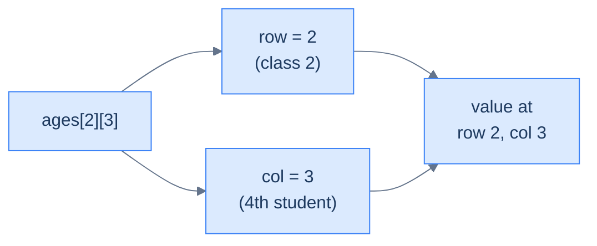

<p align="center"><strong>Two indices locate a single element: first selects the row, second selects the column.</strong></p>

> **Think of it like a map coordinate.** Row first, column second — just like "row 3, seat 5" in a cinema. The row gets you to the right group, and the column gets you to the right item within that group.

---

## Declaring a 2D Array in Python

```python run
from typing import List

# 4 classes (rows) of 5 students each (cols) — 5 instead of 60 keeps the demo readable.
rows: int = 4
cols: int = 5

# List comprehension creates rows independently. The `for _ in range(rows)` runs `rows`
# times, and each iteration evaluates `[0] * cols` afresh — so we get `rows` distinct
# inner lists, not 4 references to the same one. (See the "Common trap" note below.)
ages: List[List[int]] = [[0] * cols for _ in range(rows)]

# Two indices: ages[row][col] → ages[class][student].
ages[0][0] = 6
ages[1][2] = 8
ages[3][4] = 10

print("Class 1, Student 3:", ages[1][2])   # → 8

# Iterating the outer dimension hands you each inner list (one full row at a time).
for row_index in range(rows):
    print(f"Class {row_index}:", ages[row_index])
```

```java run
import java.util.Arrays;

public class Main {
    public static void main(String[] args) {
        int rows = 4;
        int cols = 5;

        // `new int[rows][cols]` allocates a true 2D rectangular grid, default 0.
        int[][] ages = new int[rows][cols];

        ages[0][0] = 6;
        ages[1][2] = 8;
        ages[3][4] = 10;

        System.out.println("Class 1, Student 3: " + ages[1][2]);   // → 8

        for (int rowIndex = 0; rowIndex < rows; rowIndex++) {
            System.out.println("Class " + rowIndex + ": " + Arrays.toString(ages[rowIndex]));
        }
    }
}
```

```c run
#include <stdio.h>

int main() {
    int rows = 4, cols = 5;

    /* True 2D fixed-size array, default 0 thanks to the {0} initializer. */
    int ages[4][5] = {0};

    ages[0][0] = 6;
    ages[1][2] = 8;
    ages[3][4] = 10;

    printf("Class 1, Student 3: %d\n", ages[1][2]);   /* → 8 */

    for (int rowIndex = 0; rowIndex < rows; rowIndex++) {
        printf("Class %d: ", rowIndex);
        for (int j = 0; j < cols; j++) printf("%d ", ages[rowIndex][j]);
        printf("\n");
    }
    return 0;
}
```

```cpp run
#include <iostream>
#include <vector>

int main() {
    int rows = 4, cols = 5;

    // vector<vector<int>>(rows, vector<int>(cols, 0)) — each row constructed separately,
    // so unlike the Python "*" trap, all rows are guaranteed independent.
    std::vector<std::vector<int>> ages(rows, std::vector<int>(cols, 0));

    ages[0][0] = 6;
    ages[1][2] = 8;
    ages[3][4] = 10;

    std::cout << "Class 1, Student 3: " << ages[1][2] << "\n";   // → 8

    for (int rowIndex = 0; rowIndex < rows; rowIndex++) {
        std::cout << "Class " << rowIndex << ": ";
        for (int v : ages[rowIndex]) std::cout << v << " ";
        std::cout << "\n";
    }
}
```

```scala run
object Main extends App {
  val rows = 4
  val cols = 5

  // Array.ofDim builds a true rectangular 2D array with each row independent.
  val ages: Array[Array[Int]] = Array.ofDim[Int](rows, cols)

  ages(0)(0) = 6
  ages(1)(2) = 8
  ages(3)(4) = 10

  println(s"Class 1, Student 3: ${ages(1)(2)}")   // → 8

  for (rowIndex <- 0 until rows) {
    println(s"Class $rowIndex: ${ages(rowIndex).mkString(", ")}")
  }
}
```

```javascript run
const rows = 4;
const cols = 5;

// Array.from with a factory function — each row is built independently (no shared refs).
const ages = Array.from({ length: rows }, () => new Array(cols).fill(0));

ages[0][0] = 6;
ages[1][2] = 8;
ages[3][4] = 10;

console.log("Class 1, Student 3:", ages[1][2]);   // → 8

for (let rowIndex = 0; rowIndex < rows; rowIndex++) {
    console.log(`Class ${rowIndex}:`, ages[rowIndex]);
}
```

```typescript run
const rows: number = 4;
const cols: number = 5;

// Array.from with a factory function — each row is built independently.
const ages: number[][] = Array.from({ length: rows }, () => new Array(cols).fill(0));

ages[0][0] = 6;
ages[1][2] = 8;
ages[3][4] = 10;

console.log("Class 1, Student 3:", ages[1][2]);   // → 8

for (let rowIndex = 0; rowIndex < rows; rowIndex++) {
    console.log(`Class ${rowIndex}:`, ages[rowIndex]);
}
```

```go run
package main

import "fmt"

func main() {
    rows, cols := 4, 5

    // make a slice of slices; each inner slice is allocated separately.
    ages := make([][]int, rows)
    for i := range ages {
        ages[i] = make([]int, cols)
    }

    ages[0][0] = 6
    ages[1][2] = 8
    ages[3][4] = 10

    fmt.Println("Class 1, Student 3:", ages[1][2])   // → 8

    for rowIndex := 0; rowIndex < rows; rowIndex++ {
        fmt.Printf("Class %d: %v\n", rowIndex, ages[rowIndex])
    }
}
```

```kotlin run
fun main() {
    val rows = 4
    val cols = 5

    // Array(rows) { IntArray(cols) } — the lambda runs once per row, yielding
    // independent inner arrays (mirrors Python's list-comprehension form).
    val ages = Array(rows) { IntArray(cols) }

    ages[0][0] = 6
    ages[1][2] = 8
    ages[3][4] = 10

    println("Class 1, Student 3: ${ages[1][2]}")   // → 8

    for (rowIndex in 0 until rows) {
        println("Class $rowIndex: ${ages[rowIndex].toList()}")
    }
}
```

```rust run
fn main() {
    let rows = 4usize;
    let cols = 5usize;

    // vec![vec![0; cols]; rows] — vec!'s repeat form clones the inner vec,
    // but Vec<T> clones produce independent buffers (no aliasing surprise).
    let mut ages: Vec<Vec<i32>> = vec![vec![0; cols]; rows];

    ages[0][0] = 6;
    ages[1][2] = 8;
    ages[3][4] = 10;

    println!("Class 1, Student 3: {}", ages[1][2]);   // → 8

    for row_index in 0..rows {
        println!("Class {}: {:?}", row_index, ages[row_index]);
    }
}
```


> **Common trap — don't use `[[0] * cols] * rows`!**
>
> This looks like it creates 4 independent rows, but it actually creates 4 references to the **same** row. Editing `ages[0][1]` would change every row. Always use the list comprehension form: `[[0] * cols for _ in range(rows)]`.

---

## Key Takeaway

| Concept | Detail |
|---|---|
| Dimension | An axis of organisation — 1D = line, 2D = grid |
| 2D array size | Defined as **rows × columns** |
| Access syntax | `array[row][col]` — row first, column second |
| Total elements | `rows × columns` |
| Benefit over 1D | Naturally represents tabular / grouped data |

When your data has two levels of grouping (classes → students, rows → columns, X → Y), define those two levels as the two dimensions of a 2D array.

> **But what about three levels?** Classes → students is two. Schools → classes → students is three. Cities → schools → classes → students is four. The pattern keeps going — and the next section shows the mechanic that makes it scale to any depth.

***

# Exploring a Possible Solution

We've seen *where* a single-dimensional array fails. Now we need a structure that scales with the depth of the data — one axis per level of grouping, no matter how deep — and the trick that makes it work is one of the most reused recursive ideas in programming.

---

## Multidimensional Arrays

> A **multidimensional array** is an array of arrays. It is just a regular array, but instead of storing a primitive or user-defined datatype as its data item, it stores **another array** (single or multidimensional). The depth to which this nesting goes is called the **dimension** of the array.

There is no theoretical limit to how deep the nesting can go:

- **Single-dimension array** — an array of non-array datatype
- **Two-dimension array** — an array of arrays of non-array datatype
- **Three-dimension array** — an array of arrays of arrays of non-array datatype
- And this can go on...

> *Before reading on — if a 2D array is "an array of 1D arrays" and a 3D array is "an array of 2D arrays," what is a **4D** array? How many `[]` would you need to chain to reach a single value? Lock in your answer before scrolling.*

Here's what each looks like logically:

**Single-dimension array** — a flat row of values, accessed with one index:

```d2
direction: right

arr: array {
  grid-columns: 4
  grid-gap: 0
  v1: value1
  v2: value2
  v3: value3
  vn: "· · ·"
}

size: "◄────────── size ──────────►" {
  shape: text
}
size -> arr: "" {style.stroke-dash: 3}
```

<p align="center"><strong>Single-dimension array — one row of elements, one index to access any element.</strong></p>

**Two-dimensional array** — a grid of rows and columns, accessed with two indices `[row][col]`:

```d2
grid: {
  grid-columns: 4
  grid-gap: 0
  r0c0: value1
  r0c1: value2
  r0c2: value3
  r0c3: "· · ·"
  r1c0: value4
  r1c1: value5
  r1c2: value6
  r1c3: "· · ·"
  r2c0: value7
  r2c1: value8
  r2c2: value9
  r2c3: "· · ·"
  r3c0: "· · ·"
  r3c1: "· · ·"
  r3c2: "· · ·"
  r3c3: valueN
}
```

<p align="center"><strong>Two-dimensional array — a grid of <code>size2</code> rows × <code>size1</code> columns.</strong></p>

**Three-dimensional array** — a stack of 2D grids (layers), accessed with three indices `[layer][row][col]`:

```d2
direction: right

L0: "Layer 0  (a full size2 × size1 grid)" {
  grid-columns: 4
  grid-gap: 0
  a: value1
  b: value2
  c: value3
  d: "· · ·"
  e: value4
  f: value5
  g: value6
  h: "· · ·"
  i: "· · ·"
  j: "· · ·"
  k: "· · ·"
  l: valueN
}
L1: "Layer 1  (a full size2 × size1 grid)" {
  grid-columns: 4
  grid-gap: 0
  a: value1
  b: value2
  c: value3
  d: "· · ·"
  e: value4
  f: value5
  g: value6
  h: "· · ·"
  i: "· · ·"
  j: "· · ·"
  k: "· · ·"
  l: valueN
}
LN: "Layer N (...)" {
  a: "· · ·"
}

L0 -> L1: "" {style.stroke-dash: 3}
L1 -> LN: "" {style.stroke-dash: 3}
```

<p align="center"><strong>Three-dimensional array — <code>size3</code> layers, each a full <code>size2 × size1</code> two-dimensional grid.</strong></p>

Each additional dimension is just one more level of nesting — a 3D array is an array whose items are 2D arrays, just as a 2D array is an array whose items are 1D arrays.

---

## Importance of Multidimensional Arrays

To understand how multidimensional arrays are useful and what a dimension represents, let us revisit the problem of storing the ages of all students in a class.

---

### One-Dimensional Array

Instead of storing each student's age in a separate variable, we can use a regular (one-dimensional) array to store all this data under a single variable. The size of the array is equal to the number of students in the class (`size1`).

```d2
direction: right

age: age {
  grid-columns: 7
  grid-gap: 0
  a1: value1
  a2: value2
  a3: value3
  a4: value4
  a5: value5
  a6: value6
  a7: value7
}

span: "◄── number of students in a class (size1) ──►" {
  shape: text
}
span -> age: "" {style.stroke-dash: 3}
```

<p align="center"><strong>Storing the age of students in a single class in a single-dimension array.</strong></p>

One array, one class. Simple and clean — as long as we only have one class.

---

### Two-Dimensional Array

Let's extend this problem to **all classes** (`size2`) in the school. We could store each class in a separate 1D array, but that won't scale if we have hundreds of classes. A two-dimensional array solves this cleanly.

The idea: create an array of arrays where
- the **inner array** stores the ages of all students in one class (size `size1`)
- the **outer array** is a collection of those inner arrays, one per class (size `size2`)

```d2
direction: right

age: age {
  grid-rows: 6
  grid-gap: 6
  c0: |md
    **class 0** → `value1 │ value2 │ value3 │ · · · │ valueN`
  |
  c1: |md
    **class 1** → `· · · │ · · · │ · · · │ · · · │ · · ·`
  |
  c2: |md
    **class 2** → `· · · │ · · · │ · · · │ · · · │ · · ·`
  |
  c3: |md
    **class 3** → `· · · │ · · · │ · · · │ · · · │ · · ·`
  |
  c4: |md
    **class 4** → `· · · │ · · · │ · · · │ · · · │ · · ·`
  |
  cn: |md
    **class N** → `· · · │ · · · │ · · · │ valueX │ valueZ`
  |
}

note_h: "◄────── size1: number of students in a class ──────►" {
  shape: text
}
note_v: "size2: classes" {
  shape: text
}
note_h -> age: "" {style.stroke-dash: 3}
note_v -> age: "" {style.stroke-dash: 3}
```

<p align="center"><strong>Storing the age of students in all classes in a two-dimensional array.</strong></p>

The outer dimension (`size2`) represents how many classes there are. The inner dimension (`size1`) represents how many students are in each class. Together, `size2 × size1` is the total number of values stored.

---

### Three-Dimensional Array

Extending this further — what if we need to store the age of all students across **all classes** in **all schools in a city** (`size3`)?

Instead of creating multiple 2D arrays (one per school), we create a single **three-dimensional array**:
- Size `size3` (number of schools) at the outermost level
- Each item is a 2D array of size `size2` (classes)
- Each item inside that is a 1D array of size `size1` (students per class)

```d2
direction: right

s0: "School 0  (one 2D array of size size2 × size1)" {
  grid-rows: 3
  grid-gap: 6
  r0: |md
    **class 0** → `value1 │ value2 │ value3 │ · · · │ valueN`
  |
  r1: |md
    **class 1** → `· · · │ · · · │ · · · │ · · · │ · · ·`
  |
  rn: |md
    **class N** → `· · · │ · · · │ · · · │ valueX │ valueZ`
  |
}
s1: "School 1  (one 2D array of size size2 × size1)" {
  grid-rows: 3
  grid-gap: 6
  r0: |md
    **class 0** → `value5 │ value7 │ value8 │ · · · │ · · ·`
  |
  r1: |md
    **class 1** → `· · · │ · · · │ · · · │ · · · │ · · ·`
  |
  rn: |md
    **class N** → `· · · │ · · · │ · · · │ · · · │ · · ·`
  |
}
sn: "School N (...)" {
  a: "· · ·"
}

note: "size3: number of schools" {
  shape: text
}
note -> s0: "" {style.stroke-dash: 3}
s0 -> s1: "" {style.stroke-dash: 3}
s1 -> sn: "" {style.stroke-dash: 3}
```

<p align="center"><strong>Storing the age of students across all classes in all schools in a three-dimensional array.</strong></p>

The three dimensions map directly onto the three levels of the real-world problem:

| Dimension | Size | Represents |
|---|---|---|
| 1st (innermost) | `size1` | students per class |
| 2nd | `size2` | classes per school |
| 3rd (outermost) | `size3` | schools in the city |

Access: `age[school][class][student]` — one index per dimension, from outermost to innermost.

---

## Key Takeaway

A multidimensional array is nothing exotic — it's just the natural next step. Every time you have a new level of grouping in your data, you add another dimension:

> **1 level of grouping → 1D array**
> **2 levels of grouping → 2D array**
> **3 levels of grouping → 3D array**

Each new dimension is an outer array that holds the previous structure as its items. The total number of elements is always the product of all dimension sizes: `size1 × size2 × ... × sizeN`.

> **The structure is settled — but how do you actually *use* it?** How do you create one in code, read a value, change it, or visit every element? Those four operations are next.

***

# Overview of Supported Operations

A 2D array supports the same four operations as a 1D array — **create, access, modify, traverse** — with one twist: every operation now takes one *more* index per dimension. The mechanics carry over almost verbatim, so the time you've spent on 1D arrays already pays for most of this section.

---

## Construction

Almost all major programming languages support adding more dimensions to a regular array in one form or another. Since a multidimensional array is just an array, it has a **fixed size** that cannot be modified after creation. All data items in the array must be of the **same data type**.

```d2
arr: {
  grid-columns: 3
  grid-gap: 0
  a: value1
  b: value2
  c: value3
  d: value4
  e: value5
  f: value6
  g: value7
  h: value8
  i: value9
}
```

<p align="center"><strong>Creating a multidimensional array of fixed size and datatype.</strong></p>

Higher-level languages like Python and JavaScript inherently provide a **list** instead of a raw array. A list has a dynamic size and can store elements of different types — so the programmer doesn't need to provide a size when declaring or initializing a multidimensional array.

```python run
from typing import List

# 2D = list of lists; 3D = list of lists of lists. The shape is implied by nesting.
numbers2d: List[List[int]] = [
    [1, 2, 3],
    [4, 5, 6]
]

numbers3d: List[List[List[int]]] = [
    [ [1, 2], [3, 4], [5, 6] ],
    [ [7, 8], [9, 10], [11, 12] ]
]

print("2D array:", numbers2d)
print("3D array:", numbers3d)
```

```java run
import java.util.Arrays;

public class Main {
    public static void main(String[] args) {
        // 2D rectangular array literal.
        int[][] numbers2d = {
            {1, 2, 3},
            {4, 5, 6}
        };

        // 3D array literal — nesting depth matches dimension count.
        int[][][] numbers3d = {
            { {1, 2}, {3, 4}, {5, 6} },
            { {7, 8}, {9, 10}, {11, 12} }
        };

        System.out.println("2D array: " + Arrays.deepToString(numbers2d));
        System.out.println("3D array: " + Arrays.deepToString(numbers3d));
    }
}
```

```c run
#include <stdio.h>

int main() {
    /* Fixed-shape 2D and 3D arrays — sizes baked into the type. */
    int numbers2d[2][3] = {
        {1, 2, 3},
        {4, 5, 6}
    };

    int numbers3d[2][3][2] = {
        { {1, 2}, {3, 4}, {5, 6} },
        { {7, 8}, {9, 10}, {11, 12} }
    };

    printf("2D array:\n");
    for (int i = 0; i < 2; i++) {
        for (int j = 0; j < 3; j++) printf("%d ", numbers2d[i][j]);
        printf("\n");
    }
    printf("3D array:\n");
    for (int i = 0; i < 2; i++)
        for (int j = 0; j < 3; j++) {
            for (int k = 0; k < 2; k++) printf("%d ", numbers3d[i][j][k]);
            printf("| ");
        }
    printf("\n");
    return 0;
}
```

```cpp run
#include <iostream>
#include <vector>

int main() {
    // Nested vectors mirror Python's nested lists exactly.
    std::vector<std::vector<int>> numbers2d = {
        {1, 2, 3},
        {4, 5, 6}
    };

    std::vector<std::vector<std::vector<int>>> numbers3d = {
        { {1, 2}, {3, 4}, {5, 6} },
        { {7, 8}, {9, 10}, {11, 12} }
    };

    std::cout << "2D array:\n";
    for (auto& row : numbers2d) {
        for (int v : row) std::cout << v << " ";
        std::cout << "\n";
    }
    std::cout << "3D array dims: "
              << numbers3d.size() << " x " << numbers3d[0].size()
              << " x " << numbers3d[0][0].size() << "\n";
}
```

```scala run
object Main extends App {
  // Array literals nest naturally; each level is its own Array.
  val numbers2d: Array[Array[Int]] = Array(
    Array(1, 2, 3),
    Array(4, 5, 6)
  )

  val numbers3d: Array[Array[Array[Int]]] = Array(
    Array(Array(1, 2), Array(3, 4), Array(5, 6)),
    Array(Array(7, 8), Array(9, 10), Array(11, 12))
  )

  println("2D array: " + numbers2d.map(_.mkString("[", ",", "]")).mkString("[", ",", "]"))
  println("3D first layer first row: " + numbers3d(0)(0).mkString(", "))
}
```

```javascript run
// JavaScript arrays nest with no separate type declaration.
const numbers2d = [
    [1, 2, 3],
    [4, 5, 6]
];

const numbers3d = [
    [ [1, 2], [3, 4], [5, 6] ],
    [ [7, 8], [9, 10], [11, 12] ]
];

console.log("2D array:", numbers2d);
console.log("3D array:", numbers3d);
```

```typescript run
// number[][] and number[][][] make the shape explicit at the type level.
const numbers2d: number[][] = [
    [1, 2, 3],
    [4, 5, 6]
];

const numbers3d: number[][][] = [
    [ [1, 2], [3, 4], [5, 6] ],
    [ [7, 8], [9, 10], [11, 12] ]
];

console.log("2D array:", numbers2d);
console.log("3D array:", numbers3d);
```

```go run
package main

import "fmt"

func main() {
    // [][]int is "slice of int-slices" — Go's idiomatic 2D structure.
    numbers2d := [][]int{
        {1, 2, 3},
        {4, 5, 6},
    }

    numbers3d := [][][]int{
        { {1, 2}, {3, 4}, {5, 6} },
        { {7, 8}, {9, 10}, {11, 12} },
    }

    fmt.Println("2D array:", numbers2d)
    fmt.Println("3D array:", numbers3d)
}
```

```kotlin run
fun main() {
    // arrayOf nests naturally; each level produces an Array of arrays.
    val numbers2d: Array<IntArray> = arrayOf(
        intArrayOf(1, 2, 3),
        intArrayOf(4, 5, 6)
    )

    val numbers3d: Array<Array<IntArray>> = arrayOf(
        arrayOf(intArrayOf(1, 2), intArrayOf(3, 4), intArrayOf(5, 6)),
        arrayOf(intArrayOf(7, 8), intArrayOf(9, 10), intArrayOf(11, 12))
    )

    println("2D array: " + numbers2d.map { it.toList() })
    println("3D array first layer: " + numbers3d[0].map { it.toList() })
}
```

```rust run
fn main() {
    // Fixed-size nested arrays — the type carries every dimension's length.
    let numbers2d: [[i32; 3]; 2] = [
        [1, 2, 3],
        [4, 5, 6]
    ];

    let numbers3d: [[[i32; 2]; 3]; 2] = [
        [ [1, 2], [3, 4], [5, 6] ],
        [ [7, 8], [9, 10], [11, 12] ]
    ];

    println!("2D array: {:?}", numbers2d);
    println!("3D array: {:?}", numbers3d);
}
```


> **Tip:** In Python, there's no built-in multidimensional array type — you nest lists inside lists. The type annotation `List[List[int]]` is just a hint, but it clearly communicates the intended shape.

---

## Accessing Elements

We can access data items in a multidimensional array just like a regular array — using the subscript operator `[]` and an index. Since every data item in a multidimensional array is itself an array, we **chain the subscript operator** to drill into each dimension. We keep chaining until we reach a non-array data item.

```d2
arr: {
  grid-columns: 3
  grid-gap: 0
  a: |md
    `[0,0]` value1
  |
  b: |md
    `[0,1]` value2
  |
  c: |md
    `[0,2]` value3
  |
  d: |md
    `[1,0]` value4
  |
  e: |md
    `[1,1]` value5
  |
  f: |md
    `[1,2]` value6
  |
  g: |md
    `[2,0]` value7
  |
  h: |md
    `[2,1]` value8
  |
  i: |md
    `[2,2]` value9
  |
}
```

<p align="center"><strong>Multidimensional array elements can be accessed using indices for all dimensions.</strong></p>

The pattern generalises naturally:
- **2D:** `array[row][col]`
- **3D:** `array[depth][row][col]`
- **N-D:** keep chaining `[index]` for each additional dimension

Different programming languages have different syntax, but the underlying access mechanism is the same.

```python run
from typing import List

numbers2d: List[List[int]] = [
    [1, 2, 3],
    [4, 5, 6]
]

# Chain [] once per dimension to reach the value.
print("Element at (0,0):", numbers2d[0][0])  # → 1
print("Element at (1,2):", numbers2d[1][2])  # → 6

numbers3d: List[List[List[int]]] = [
    [ [1, 2], [3, 4], [5, 6] ],
    [ [7, 8], [9, 10], [11, 12] ]
]

print("Element at (0,1,1):", numbers3d[0][1][1])  # → 4
print("Element at (1,2,0):", numbers3d[1][2][0])  # → 11
```

```java run
public class Main {
    public static void main(String[] args) {
        int[][] numbers2d = {
            {1, 2, 3},
            {4, 5, 6}
        };

        // Chain [] once per dimension.
        System.out.println("Element at (0,0): " + numbers2d[0][0]);  // → 1
        System.out.println("Element at (1,2): " + numbers2d[1][2]);  // → 6

        int[][][] numbers3d = {
            { {1, 2}, {3, 4}, {5, 6} },
            { {7, 8}, {9, 10}, {11, 12} }
        };

        System.out.println("Element at (0,1,1): " + numbers3d[0][1][1]);  // → 4
        System.out.println("Element at (1,2,0): " + numbers3d[1][2][0]);  // → 11
    }
}
```

```c run
#include <stdio.h>

int main() {
    int numbers2d[2][3] = {
        {1, 2, 3},
        {4, 5, 6}
    };

    /* Chain [] once per dimension. */
    printf("Element at (0,0): %d\n", numbers2d[0][0]);  /* → 1 */
    printf("Element at (1,2): %d\n", numbers2d[1][2]);  /* → 6 */

    int numbers3d[2][3][2] = {
        { {1, 2}, {3, 4}, {5, 6} },
        { {7, 8}, {9, 10}, {11, 12} }
    };

    printf("Element at (0,1,1): %d\n", numbers3d[0][1][1]);  /* → 4 */
    printf("Element at (1,2,0): %d\n", numbers3d[1][2][0]);  /* → 11 */
    return 0;
}
```

```cpp run
#include <iostream>
#include <vector>

int main() {
    std::vector<std::vector<int>> numbers2d = {
        {1, 2, 3},
        {4, 5, 6}
    };

    std::cout << "Element at (0,0): " << numbers2d[0][0] << "\n";  // → 1
    std::cout << "Element at (1,2): " << numbers2d[1][2] << "\n";  // → 6

    std::vector<std::vector<std::vector<int>>> numbers3d = {
        { {1, 2}, {3, 4}, {5, 6} },
        { {7, 8}, {9, 10}, {11, 12} }
    };

    std::cout << "Element at (0,1,1): " << numbers3d[0][1][1] << "\n";  // → 4
    std::cout << "Element at (1,2,0): " << numbers3d[1][2][0] << "\n";  // → 11
}
```

```scala run
object Main extends App {
  val numbers2d = Array(
    Array(1, 2, 3),
    Array(4, 5, 6)
  )

  // arr(i)(j) chains the apply method once per dimension.
  println(s"Element at (0,0): ${numbers2d(0)(0)}")  // → 1
  println(s"Element at (1,2): ${numbers2d(1)(2)}")  // → 6

  val numbers3d = Array(
    Array(Array(1, 2), Array(3, 4), Array(5, 6)),
    Array(Array(7, 8), Array(9, 10), Array(11, 12))
  )

  println(s"Element at (0,1,1): ${numbers3d(0)(1)(1)}")  // → 4
  println(s"Element at (1,2,0): ${numbers3d(1)(2)(0)}")  // → 11
}
```

```javascript run
const numbers2d = [
    [1, 2, 3],
    [4, 5, 6]
];

console.log("Element at (0,0):", numbers2d[0][0]);  // → 1
console.log("Element at (1,2):", numbers2d[1][2]);  // → 6

const numbers3d = [
    [ [1, 2], [3, 4], [5, 6] ],
    [ [7, 8], [9, 10], [11, 12] ]
];

console.log("Element at (0,1,1):", numbers3d[0][1][1]);  // → 4
console.log("Element at (1,2,0):", numbers3d[1][2][0]);  // → 11
```

```typescript run
const numbers2d: number[][] = [
    [1, 2, 3],
    [4, 5, 6]
];

console.log("Element at (0,0):", numbers2d[0][0]);  // → 1
console.log("Element at (1,2):", numbers2d[1][2]);  // → 6

const numbers3d: number[][][] = [
    [ [1, 2], [3, 4], [5, 6] ],
    [ [7, 8], [9, 10], [11, 12] ]
];

console.log("Element at (0,1,1):", numbers3d[0][1][1]);  // → 4
console.log("Element at (1,2,0):", numbers3d[1][2][0]);  // → 11
```

```go run
package main

import "fmt"

func main() {
    numbers2d := [][]int{
        {1, 2, 3},
        {4, 5, 6},
    }

    fmt.Println("Element at (0,0):", numbers2d[0][0])  // → 1
    fmt.Println("Element at (1,2):", numbers2d[1][2])  // → 6

    numbers3d := [][][]int{
        { {1, 2}, {3, 4}, {5, 6} },
        { {7, 8}, {9, 10}, {11, 12} },
    }

    fmt.Println("Element at (0,1,1):", numbers3d[0][1][1])  // → 4
    fmt.Println("Element at (1,2,0):", numbers3d[1][2][0])  // → 11
}
```

```kotlin run
fun main() {
    val numbers2d = arrayOf(
        intArrayOf(1, 2, 3),
        intArrayOf(4, 5, 6)
    )

    // arr[i][j] chains the indexer once per dimension.
    println("Element at (0,0): ${numbers2d[0][0]}")  // → 1
    println("Element at (1,2): ${numbers2d[1][2]}")  // → 6

    val numbers3d = arrayOf(
        arrayOf(intArrayOf(1, 2), intArrayOf(3, 4), intArrayOf(5, 6)),
        arrayOf(intArrayOf(7, 8), intArrayOf(9, 10), intArrayOf(11, 12))
    )

    println("Element at (0,1,1): ${numbers3d[0][1][1]}")  // → 4
    println("Element at (1,2,0): ${numbers3d[1][2][0]}")  // → 11
}
```

```rust run
fn main() {
    let numbers2d: [[i32; 3]; 2] = [
        [1, 2, 3],
        [4, 5, 6]
    ];

    println!("Element at (0,0): {}", numbers2d[0][0]);  // → 1
    println!("Element at (1,2): {}", numbers2d[1][2]);  // → 6

    let numbers3d: [[[i32; 2]; 3]; 2] = [
        [ [1, 2], [3, 4], [5, 6] ],
        [ [7, 8], [9, 10], [11, 12] ]
    ];

    println!("Element at (0,1,1): {}", numbers3d[0][1][1]);  // → 4
    println!("Element at (1,2,0): {}", numbers3d[1][2][0]);  // → 11
}
```


> **Think of it as unpacking layers.** `numbers2d[1]` gives you the entire second row (an array). `numbers2d[1][2]` then picks the third element from that row. Each `[]` unwraps one layer.

---

## Modifying Elements

We can modify data items in a multidimensional array in place, just like a regular array. Chain the subscript operator as many times as there are dimensions to reach the target element, then assign the new value on the right-hand side.

```d2
arr: {
  grid-columns: 3
  grid-gap: 0
  a: |md
    `[0,0]` value1
  |
  b: |md
    `[0,1]` value2
  |
  c: |md
    `[0,2]` value3
  |
  d: |md
    `[1,0]` value4
  |
  e: |md
    `[1,1]` value5
  |
  f: |md
    `[1,2]` value6
  |
  g: |md
    `[2,0]` value7
  |
  h: |md
    `[2,1]` value8
  |
  i: |md
    `[2,2]` value9
  |
}
arr.e.style.fill: "#fde68a"
arr.e.style.stroke: "#d97706"
arr.i.style.fill: "#fde68a"
arr.i.style.stroke: "#d97706"
```

<p align="center"><strong>Multidimensional array elements can be modified using indices for all dimensions (highlighted = being updated).</strong></p>

```python run
from typing import List

numbers2d: List[List[int]] = [
    [1, 2, 3],
    [4, 5, 6]
]

# arr[i][j] = x — overwrite the slot in place.
numbers2d[1][1] = 60
print("Modified 2D array:", numbers2d)  # → [[1, 2, 3], [4, 60, 6]]

numbers3d: List[List[List[int]]] = [
    [ [1, 2], [3, 4], [5, 6] ],
    [ [7, 8], [9, 10], [11, 12] ]
]

numbers3d[0][1][1] = 40
numbers3d[1][1][1] = 110
print("Modified 3D array:", numbers3d)
```

```java run
import java.util.Arrays;

public class Main {
    public static void main(String[] args) {
        int[][] numbers2d = {
            {1, 2, 3},
            {4, 5, 6}
        };

        // arr[i][j] = x — overwrite the slot in place.
        numbers2d[1][1] = 60;
        System.out.println("Modified 2D array: " + Arrays.deepToString(numbers2d));

        int[][][] numbers3d = {
            { {1, 2}, {3, 4}, {5, 6} },
            { {7, 8}, {9, 10}, {11, 12} }
        };

        numbers3d[0][1][1] = 40;
        numbers3d[1][1][1] = 110;
        System.out.println("Modified 3D array: " + Arrays.deepToString(numbers3d));
    }
}
```

```c run
#include <stdio.h>

int main() {
    int numbers2d[2][3] = {
        {1, 2, 3},
        {4, 5, 6}
    };

    /* arr[i][j] = x — overwrite the slot in place. */
    numbers2d[1][1] = 60;
    printf("Modified 2D array:\n");
    for (int i = 0; i < 2; i++) {
        for (int j = 0; j < 3; j++) printf("%d ", numbers2d[i][j]);
        printf("\n");
    }

    int numbers3d[2][3][2] = {
        { {1, 2}, {3, 4}, {5, 6} },
        { {7, 8}, {9, 10}, {11, 12} }
    };

    numbers3d[0][1][1] = 40;
    numbers3d[1][1][1] = 110;
    printf("3D[0][1][1] = %d, 3D[1][1][1] = %d\n",
           numbers3d[0][1][1], numbers3d[1][1][1]);
    return 0;
}
```

```cpp run
#include <iostream>
#include <vector>

int main() {
    std::vector<std::vector<int>> numbers2d = {
        {1, 2, 3},
        {4, 5, 6}
    };

    numbers2d[1][1] = 60;
    std::cout << "Modified 2D array:\n";
    for (auto& row : numbers2d) {
        for (int v : row) std::cout << v << " ";
        std::cout << "\n";
    }

    std::vector<std::vector<std::vector<int>>> numbers3d = {
        { {1, 2}, {3, 4}, {5, 6} },
        { {7, 8}, {9, 10}, {11, 12} }
    };

    numbers3d[0][1][1] = 40;
    numbers3d[1][1][1] = 110;
    std::cout << "3D[0][1][1] = " << numbers3d[0][1][1]
              << ", 3D[1][1][1] = " << numbers3d[1][1][1] << "\n";
}
```

```scala run
object Main extends App {
  val numbers2d = Array(
    Array(1, 2, 3),
    Array(4, 5, 6)
  )

  // arr(i)(j) = x — Scala's update form for nested arrays.
  numbers2d(1)(1) = 60
  println("Modified 2D array: " + numbers2d.map(_.mkString("[", ",", "]")).mkString("[", ",", "]"))

  val numbers3d = Array(
    Array(Array(1, 2), Array(3, 4), Array(5, 6)),
    Array(Array(7, 8), Array(9, 10), Array(11, 12))
  )

  numbers3d(0)(1)(1) = 40
  numbers3d(1)(1)(1) = 110
  println(s"3D(0)(1)(1) = ${numbers3d(0)(1)(1)}, 3D(1)(1)(1) = ${numbers3d(1)(1)(1)}")
}
```

```javascript run
const numbers2d = [
    [1, 2, 3],
    [4, 5, 6]
];

numbers2d[1][1] = 60;
console.log("Modified 2D array:", numbers2d);

const numbers3d = [
    [ [1, 2], [3, 4], [5, 6] ],
    [ [7, 8], [9, 10], [11, 12] ]
];

numbers3d[0][1][1] = 40;
numbers3d[1][1][1] = 110;
console.log("Modified 3D array:", numbers3d);
```

```typescript run
const numbers2d: number[][] = [
    [1, 2, 3],
    [4, 5, 6]
];

numbers2d[1][1] = 60;
console.log("Modified 2D array:", numbers2d);

const numbers3d: number[][][] = [
    [ [1, 2], [3, 4], [5, 6] ],
    [ [7, 8], [9, 10], [11, 12] ]
];

numbers3d[0][1][1] = 40;
numbers3d[1][1][1] = 110;
console.log("Modified 3D array:", numbers3d);
```

```go run
package main

import "fmt"

func main() {
    numbers2d := [][]int{
        {1, 2, 3},
        {4, 5, 6},
    }

    numbers2d[1][1] = 60
    fmt.Println("Modified 2D array:", numbers2d)

    numbers3d := [][][]int{
        { {1, 2}, {3, 4}, {5, 6} },
        { {7, 8}, {9, 10}, {11, 12} },
    }

    numbers3d[0][1][1] = 40
    numbers3d[1][1][1] = 110
    fmt.Println("Modified 3D array:", numbers3d)
}
```

```kotlin run
fun main() {
    val numbers2d = arrayOf(
        intArrayOf(1, 2, 3),
        intArrayOf(4, 5, 6)
    )

    numbers2d[1][1] = 60
    println("Modified 2D array: " + numbers2d.map { it.toList() })

    val numbers3d = arrayOf(
        arrayOf(intArrayOf(1, 2), intArrayOf(3, 4), intArrayOf(5, 6)),
        arrayOf(intArrayOf(7, 8), intArrayOf(9, 10), intArrayOf(11, 12))
    )

    numbers3d[0][1][1] = 40
    numbers3d[1][1][1] = 110
    println("3D[0][1][1] = ${numbers3d[0][1][1]}, 3D[1][1][1] = ${numbers3d[1][1][1]}")
}
```

```rust run
fn main() {
    // Mutability is required to update slots.
    let mut numbers2d: [[i32; 3]; 2] = [
        [1, 2, 3],
        [4, 5, 6]
    ];

    numbers2d[1][1] = 60;
    println!("Modified 2D array: {:?}", numbers2d);

    let mut numbers3d: [[[i32; 2]; 3]; 2] = [
        [ [1, 2], [3, 4], [5, 6] ],
        [ [7, 8], [9, 10], [11, 12] ]
    ];

    numbers3d[0][1][1] = 40;
    numbers3d[1][1][1] = 110;
    println!("Modified 3D array: {:?}", numbers3d);
}
```


Different languages implement the syntax differently, but the result is the same — overwrite the value at the memory location identified by chaining the indices.

---

## Traversal

To traverse a multidimensional array, we need **nested loops** — one loop for each dimension. The logic is a direct extension of single-dimensional traversal: each loop iterates over the indices of one dimension.

> *Before stepping through the slideshow — for a 2 × 3 array with rows 0–1 and columns 0–2, write down the order in which a `for row in ...: for col in ...:` loop visits each cell. Six cells, predict the sequence, then run the slideshow to check.*

<div
  class="d2-array-traversal"
  data-caption="Step through nested-loop traversal of a 2 × 3 array."
  data-rows="2"
  data-cols="3"
  data-values="value1, value2, value3, value4, value5, value6"></div>

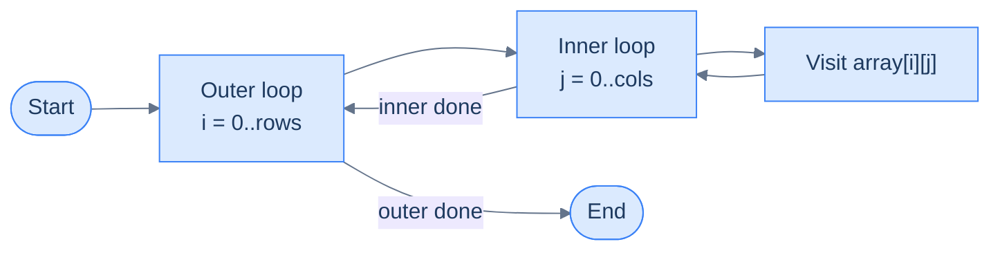

<p align="center"><strong>Traversing a 2D array requires two nested loops — one per dimension.</strong></p>

```python run
from typing import List

numbers2d: List[List[int]] = [
    [1, 2, 3],
    [4, 5, 6]
]

# Style 1 — index-based: when you need (i, j) themselves (writes, neighbours, grid graphs).
print("2D array traversal (index-based):")
for i in range(len(numbers2d)):
    for j in range(len(numbers2d[i])):
        print(numbers2d[i][j], end=" ")
    print()

# Style 2 — for-each: shorter, no index. Best when only values matter.
print("2D array traversal (for-each):")
for row in numbers2d:
    for value in row:
        print(value, end=" ")
    print()
```

```java run
public class Main {
    public static void main(String[] args) {
        int[][] numbers2d = {
            {1, 2, 3},
            {4, 5, 6}
        };

        // Style 1 — index-based.
        System.out.println("2D array traversal (index-based):");
        for (int i = 0; i < numbers2d.length; i++) {
            for (int j = 0; j < numbers2d[i].length; j++) {
                System.out.print(numbers2d[i][j] + " ");
            }
            System.out.println();
        }

        // Style 2 — enhanced for (for-each).
        System.out.println("2D array traversal (for-each):");
        for (int[] row : numbers2d) {
            for (int value : row) System.out.print(value + " ");
            System.out.println();
        }
    }
}
```

```c run
#include <stdio.h>

int main() {
    int numbers2d[2][3] = {
        {1, 2, 3},
        {4, 5, 6}
    };
    int rows = 2, cols = 3;

    /* Style 1 — index-based. */
    printf("2D array traversal (index-based):\n");
    for (int i = 0; i < rows; i++) {
        for (int j = 0; j < cols; j++) {
            printf("%d ", numbers2d[i][j]);
        }
        printf("\n");
    }

    /* C has no built-in for-each — index-based is the only built-in form. */
    printf("2D array traversal (no for-each in C — same loop):\n");
    for (int i = 0; i < rows; i++) {
        for (int j = 0; j < cols; j++) printf("%d ", numbers2d[i][j]);
        printf("\n");
    }
    return 0;
}
```

```cpp run
#include <iostream>
#include <vector>

int main() {
    std::vector<std::vector<int>> numbers2d = {
        {1, 2, 3},
        {4, 5, 6}
    };

    // Style 1 — index-based.
    std::cout << "2D array traversal (index-based):\n";
    for (size_t i = 0; i < numbers2d.size(); i++) {
        for (size_t j = 0; j < numbers2d[i].size(); j++) {
            std::cout << numbers2d[i][j] << " ";
        }
        std::cout << "\n";
    }

    // Style 2 — range-based for (C++11+).
    std::cout << "2D array traversal (for-each):\n";
    for (auto& row : numbers2d) {
        for (int value : row) std::cout << value << " ";
        std::cout << "\n";
    }
}
```

```scala run
object Main extends App {
  val numbers2d = Array(
    Array(1, 2, 3),
    Array(4, 5, 6)
  )

  // Style 1 — index-based.
  println("2D array traversal (index-based):")
  for (i <- numbers2d.indices) {
    for (j <- numbers2d(i).indices) print(s"${numbers2d(i)(j)} ")
    println()
  }

  // Style 2 — for-each.
  println("2D array traversal (for-each):")
  for (row <- numbers2d) {
    for (value <- row) print(s"$value ")
    println()
  }
}
```

```javascript run
const numbers2d = [
    [1, 2, 3],
    [4, 5, 6]
];

// Style 1 — index-based.
console.log("2D array traversal (index-based):");
for (let i = 0; i < numbers2d.length; i++) {
    let line = "";
    for (let j = 0; j < numbers2d[i].length; j++) {
        line += numbers2d[i][j] + " ";
    }
    console.log(line);
}

// Style 2 — for...of.
console.log("2D array traversal (for-each):");
for (const row of numbers2d) {
    console.log(row.join(" "));
}
```

```typescript run
const numbers2d: number[][] = [
    [1, 2, 3],
    [4, 5, 6]
];

// Style 1 — index-based.
console.log("2D array traversal (index-based):");
for (let i = 0; i < numbers2d.length; i++) {
    let line: string = "";
    for (let j = 0; j < numbers2d[i].length; j++) {
        line += numbers2d[i][j] + " ";
    }
    console.log(line);
}

// Style 2 — for...of.
console.log("2D array traversal (for-each):");
for (const row of numbers2d) {
    console.log(row.join(" "));
}
```

```go run
package main

import "fmt"

func main() {
    numbers2d := [][]int{
        {1, 2, 3},
        {4, 5, 6},
    }

    // Style 1 — index-based.
    fmt.Println("2D array traversal (index-based):")
    for i := 0; i < len(numbers2d); i++ {
        for j := 0; j < len(numbers2d[i]); j++ {
            fmt.Print(numbers2d[i][j], " ")
        }
        fmt.Println()
    }

    // Style 2 — range-based.
    fmt.Println("2D array traversal (for-each):")
    for _, row := range numbers2d {
        for _, value := range row {
            fmt.Print(value, " ")
        }
        fmt.Println()
    }
}
```

```kotlin run
fun main() {
    val numbers2d = arrayOf(
        intArrayOf(1, 2, 3),
        intArrayOf(4, 5, 6)
    )

    // Style 1 — index-based.
    println("2D array traversal (index-based):")
    for (i in numbers2d.indices) {
        for (j in numbers2d[i].indices) print("${numbers2d[i][j]} ")
        println()
    }

    // Style 2 — for-each.
    println("2D array traversal (for-each):")
    for (row in numbers2d) {
        for (value in row) print("$value ")
        println()
    }
}
```

```rust run
fn main() {
    let numbers2d: [[i32; 3]; 2] = [
        [1, 2, 3],
        [4, 5, 6]
    ];

    // Style 1 — index-based.
    println!("2D array traversal (index-based):");
    for i in 0..numbers2d.len() {
        for j in 0..numbers2d[i].len() {
            print!("{} ", numbers2d[i][j]);
        }
        println!();
    }

    // Style 2 — for-each via iterator.
    println!("2D array traversal (for-each):");
    for row in &numbers2d {
        for value in row {
            print!("{} ", value);
        }
        println!();
    }
}
```


For a 3D array, just add one more nesting level:

```python run
from typing import List

numbers3d: List[List[List[int]]] = [
    [ [1, 2], [3, 4], [5, 6] ],
    [ [7, 8], [9, 10], [11, 12] ]
]

# Three nested loops — one per dimension. The innermost loop walks values.
print("3D array traversal:")
for matrix in numbers3d:
    for row in matrix:
        for value in row:
            print(value, end=" ")
        print(" ", end="")
    print()
```

```java run
public class Main {
    public static void main(String[] args) {
        int[][][] numbers3d = {
            { {1, 2}, {3, 4}, {5, 6} },
            { {7, 8}, {9, 10}, {11, 12} }
        };

        // One enhanced for per dimension.
        System.out.println("3D array traversal:");
        for (int[][] matrix : numbers3d) {
            for (int[] row : matrix) {
                for (int value : row) System.out.print(value + " ");
                System.out.print("  ");
            }
            System.out.println();
        }
    }
}
```

```c run
#include <stdio.h>

int main() {
    int numbers3d[2][3][2] = {
        { {1, 2}, {3, 4}, {5, 6} },
        { {7, 8}, {9, 10}, {11, 12} }
    };

    /* Three nested index-based loops. */
    printf("3D array traversal:\n");
    for (int i = 0; i < 2; i++) {
        for (int j = 0; j < 3; j++) {
            for (int k = 0; k < 2; k++) printf("%d ", numbers3d[i][j][k]);
            printf("  ");
        }
        printf("\n");
    }
    return 0;
}
```

```cpp run
#include <iostream>
#include <vector>

int main() {
    std::vector<std::vector<std::vector<int>>> numbers3d = {
        { {1, 2}, {3, 4}, {5, 6} },
        { {7, 8}, {9, 10}, {11, 12} }
    };

    // Three nested range-based for loops.
    std::cout << "3D array traversal:\n";
    for (auto& matrix : numbers3d) {
        for (auto& row : matrix) {
            for (int value : row) std::cout << value << " ";
            std::cout << "  ";
        }
        std::cout << "\n";
    }
}
```

```scala run
object Main extends App {
  val numbers3d = Array(
    Array(Array(1, 2), Array(3, 4), Array(5, 6)),
    Array(Array(7, 8), Array(9, 10), Array(11, 12))
  )

  println("3D array traversal:")
  for (matrix <- numbers3d) {
    for (row <- matrix) {
      for (value <- row) print(s"$value ")
      print("  ")
    }
    println()
  }
}
```

```javascript run
const numbers3d = [
    [ [1, 2], [3, 4], [5, 6] ],
    [ [7, 8], [9, 10], [11, 12] ]
];

console.log("3D array traversal:");
for (const matrix of numbers3d) {
    let line = "";
    for (const row of matrix) {
        for (const value of row) line += value + " ";
        line += "  ";
    }
    console.log(line);
}
```

```typescript run
const numbers3d: number[][][] = [
    [ [1, 2], [3, 4], [5, 6] ],
    [ [7, 8], [9, 10], [11, 12] ]
];

console.log("3D array traversal:");
for (const matrix of numbers3d) {
    let line: string = "";
    for (const row of matrix) {
        for (const value of row) line += value + " ";
        line += "  ";
    }
    console.log(line);
}
```

```go run
package main

import "fmt"

func main() {
    numbers3d := [][][]int{
        { {1, 2}, {3, 4}, {5, 6} },
        { {7, 8}, {9, 10}, {11, 12} },
    }

    fmt.Println("3D array traversal:")
    for _, matrix := range numbers3d {
        for _, row := range matrix {
            for _, value := range row {
                fmt.Print(value, " ")
            }
            fmt.Print("  ")
        }
        fmt.Println()
    }
}
```

```kotlin run
fun main() {
    val numbers3d = arrayOf(
        arrayOf(intArrayOf(1, 2), intArrayOf(3, 4), intArrayOf(5, 6)),
        arrayOf(intArrayOf(7, 8), intArrayOf(9, 10), intArrayOf(11, 12))
    )

    println("3D array traversal:")
    for (matrix in numbers3d) {
        for (row in matrix) {
            for (value in row) print("$value ")
            print("  ")
        }
        println()
    }
}
```

```rust run
fn main() {
    let numbers3d: [[[i32; 2]; 3]; 2] = [
        [ [1, 2], [3, 4], [5, 6] ],
        [ [7, 8], [9, 10], [11, 12] ]
    ];

    println!("3D array traversal:");
    for matrix in &numbers3d {
        for row in matrix {
            for value in row {
                print!("{} ", value);
            }
            print!("  ");
        }
        println!();
    }
}
```


> **Important:** The order of these loops affects performance depending on the order in which array items are stored in memory. We'll explore this in detail when we cover how a multidimensional array is laid out in memory (row-major vs column-major order).

---

## Summary

| Operation | Syntax (2D) | Time Complexity |
|---|---|---|
| **Create** | `arr = [[0]*cols for _ in range(rows)]` | O(n) |
| **Access** | `arr[row][col]` | O(1) |
| **Modify** | `arr[row][col] = x` | O(1) |
| **Traverse** | nested `for` loops | O(n) |

Access and modify are **O(1)** — the CPU computes the exact memory address from the indices directly, no searching required. Traversal is **O(n)** because every element must be visited.

> **"Computes the exact memory address from the indices."** That phrase is doing a lot of work. *How*, exactly? RAM is a flat 1D ribbon — there is no "row 2" to jump to. The next section opens that black box.

***

# Internal mechanics of multidimensional arrays

A 2D array is a *logical* picture — rows and columns sitting in a grid. Memory is **physically** a 1D ribbon of bytes. There is no "second axis" inside the chip. So either the picture is a lie, or the language is doing arithmetic behind the scenes to flatten one onto the other. (Spoiler: it's the second one.)

This section opens that black box.

---

## Memory addresses

Let us revisit our memory model before diving deeper into how multidimensional arrays are stored in memory.

Memory is logically organized in RAM as a **linear/single-dimensional** sequence of blocks. Every block has a unique identifier that serves as its address and can be used to locate it in memory. Data in memory can only be accessed if its address is known.

```d2
mem: "Linear memory" {
  grid-rows: 2
  grid-columns: 8
  grid-gap: 0
  a0: "0"
  a1: "1"
  a2: "2"
  a3: "3"
  a4: "4"
  a5: "5"
  a6: "6"
  a7: "7"
  s0: "8 bits"
  s1: "8 bits"
  s2: "8 bits"
  s3: "8 bits"
  s4: "8 bits"
  s5: "8 bits"
  s6: "8 bits"
  s7: "8 bits"
}
mem.a3.style.fill: "#fde68a"
mem.a3.style.stroke: "#d97706"
```

<p align="center"><strong>Memory is a linear sequence of 1-byte blocks; each block's position number is its address. Highlighted block sits at <code>address = 3</code>.</strong></p>

## Storing multidimensional arrays

Remember, computer memory is organized as a one-dimensional, linear sequence of blocks, so multidimensional arrays cannot be stored directly. To represent an N-dimensional array in memory, we must map it onto a one-dimensional array.

```d2
direction: right

logical: "Logical N-dimensional space" {
  grid-rows: 4
  grid-gap: 6
  l0: |md
    **Layer 0** — value1 ... value9
  |
  l1: |md
    **Layer 1** — value10 ... value18
  |
  l2: |md
    **Layer 2** — value20 ... value27
  |
  dims: |md
    `D1 = columns`  ·  `D2 = rows`  ·  `D3 = layers`
  |
}

map: "Map N indices to one single index" {
  shape: oval
}

memory: "Single-dimensional memory" {
  grid-rows: 2
  grid-columns: 6
  grid-gap: 0
  a1: "1"
  a2: "2"
  a3: "3"
  ad: "..."
  a26: "26"
  a27: "27"
  v1: "value1"
  v2: "value2"
  v3: "value3"
  vd: "..."
  v26: "value26"
  v27: "value27"
}

logical -> map -> memory
```

<p align="center"><strong>Multidimensional arrays have to be mapped to a single-dimensional memory</strong></p>

For a programmer, data is logically stored in an N-dimensional space, so it is accessed using N indices that represent its coordinates in the N-dimensional space. However, since the data is physically stored in memory (which is single-dimensional), there must be very fast and efficient ways to convert the N-dimensional indices to a single index where the data is stored in memory.

> **What are serialization and deserialization?**
>
> **Serialization** converts data objects from one form to another to make storage and transmission easier while preserving state information. **Deserialization** converts the serialized data back to the original data objects in their original form.

Different techniques can be used to map an N-dimensional array into a single-dimensional memory. The most common techniques are given below.

- Row major ordering
- Column major ordering

In the next lessons, we will examine these ordering techniques in depth and the programming languages that use these orderings for storing multidimensional arrays.

***

# Understanding Row Major Order

## What Is Row-Major Order?

Row-major order is one of the two fundamental strategies for **serialising** a multi-dimensional array — that is, for flattening its logical table structure into the single linear strip of memory that hardware actually provides.

The rule is one sentence:

> **Store every element of a row together, then move to the next row.**

Languages like **C, C++, Objective-C, Python, Java, and Go** all store their multi-dimensional arrays this way. If you've ever written a nested loop over a 2D array, you've already relied on row-major order without knowing it.

---

## Generic Representation in Memory

Let's make this concrete. Take a 3×4 array (3 rows, 4 columns). Logically it looks like a table:

```d2
grid: {
  grid-rows: 3
  grid-gap: 0
  a: "[0][0]"
  b: "[0][1]"
  c: "[0][2]"
  d: "[0][3]"
  e: "[1][0]"
  f: "[1][1]"
  g: "[1][2]"
  h: "[1][3]"
  i: "[2][0]"
  j: "[2][1]"
  k: "[2][2]"
  l: "[2][3]"
}
```

<p align="center"><strong>The logical 2D view — 3 rows, 4 columns, 12 elements.</strong></p>

In memory there are no rows or columns — only one long ribbon of slots. Row-major order places these elements into that ribbon **one full row at a time**:

```d2
direction: right

R0: "Row 0" {
  grid-columns: 4
  grid-gap: 0
  a: "[0][0]"
  b: "[0][1]"
  c: "[0][2]"
  d: "[0][3]"
}
R1: "Row 1" {
  grid-columns: 4
  grid-gap: 0
  a: "[1][0]"
  b: "[1][1]"
  c: "[1][2]"
  d: "[1][3]"
}
R2: "Row 2" {
  grid-columns: 4
  grid-gap: 0
  a: "[2][0]"
  b: "[2][1]"
  c: "[2][2]"
  d: "[2][3]"
}

R0 -> R1
R1 -> R2
```

<p align="center"><strong>Generic representation of a two-dimensional array in row-major order in memory — Row 0 is placed first, Row 1 immediately after, then Row 2. Rows sit back-to-back.</strong></p>

Think of reading a book — you finish the first line completely before starting the second. That's exactly row-major order.

---

## Layout in Memory — The N-Dimensional Case

The concept scales cleanly to any number of dimensions. Consider a general N-dimensional array with sizes:

```
Dn × Dn-1 × Dn-2 × ... × D1
```

where `D1` is the **innermost (lowest) dimension** and `Dn` is the **outermost (highest) dimension**.

Row-major order serialises this array by a single governing rule:

> **The lowest dimension index moves the fastest. The highest dimension index moves the slowest.**

Think of it like an odometer. The rightmost digit (lowest dimension) ticks up on every step. The digits to the left (higher dimensions) only increment when the ones to their right overflow.

For a **3 × 4** array (D2=3, D1=4), the indices progress like this:

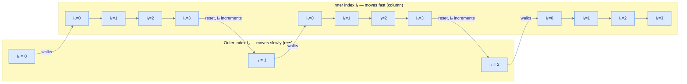

<p align="center"><strong>Row major order lays out elements by moving the lowest dimension the fastest — I₁ (column) races through 0→1→2→3, then I₂ (row) increments by one.</strong></p>

The memory ribbon therefore fills up in this exact sequence:

```
[0][0]  [0][1]  [0][2]  [0][3]  [1][0]  [1][1]  [1][2]  [1][3]  [2][0]  [2][1]  [2][2]  [2][3]
  ↑ I₁ sprints across →          ↑ I₁ sprints across →           ↑ I₁ sprints across →
```

You can verify this yourself — run the code below and watch the order elements are visited:

```python run
arr = [
    [10, 20, 30, 40],  # Row 0
    [50, 60, 70, 80],  # Row 1
    [90, 11, 12, 13],  # Row 2
]

# Outer loop = rows (slow), inner loop = columns (fast) — matches row-major memory order.
print("Row-major traversal order:")
for i in range(3):
    for j in range(4):
        print(f"arr[{i}][{j}] = {arr[i][j]}")
```

```java run
public class Main {
    public static void main(String[] args) {
        int[][] arr = {
            {10, 20, 30, 40},
            {50, 60, 70, 80},
            {90, 11, 12, 13}
        };

        System.out.println("Row-major traversal order:");
        for (int i = 0; i < 3; i++) {
            for (int j = 0; j < 4; j++) {
                System.out.println("arr[" + i + "][" + j + "] = " + arr[i][j]);
            }
        }
    }
}
```

```c run
#include <stdio.h>

int main() {
    int arr[3][4] = {
        {10, 20, 30, 40},
        {50, 60, 70, 80},
        {90, 11, 12, 13}
    };

    printf("Row-major traversal order:\n");
    for (int i = 0; i < 3; i++) {
        for (int j = 0; j < 4; j++) {
            printf("arr[%d][%d] = %d\n", i, j, arr[i][j]);
        }
    }
    return 0;
}
```

```cpp run
#include <iostream>
#include <vector>

int main() {
    std::vector<std::vector<int>> arr = {
        {10, 20, 30, 40},
        {50, 60, 70, 80},
        {90, 11, 12, 13}
    };

    std::cout << "Row-major traversal order:\n";
    for (int i = 0; i < 3; i++) {
        for (int j = 0; j < 4; j++) {
            std::cout << "arr[" << i << "][" << j << "] = " << arr[i][j] << "\n";
        }
    }
}
```

```scala run
object Main extends App {
  val arr = Array(
    Array(10, 20, 30, 40),
    Array(50, 60, 70, 80),
    Array(90, 11, 12, 13)
  )

  println("Row-major traversal order:")
  for (i <- 0 until 3; j <- 0 until 4) {
    println(s"arr($i)($j) = ${arr(i)(j)}")
  }
}
```

```javascript run
const arr = [
    [10, 20, 30, 40],
    [50, 60, 70, 80],
    [90, 11, 12, 13]
];

console.log("Row-major traversal order:");
for (let i = 0; i < 3; i++) {
    for (let j = 0; j < 4; j++) {
        console.log(`arr[${i}][${j}] = ${arr[i][j]}`);
    }
}
```

```typescript run
const arr: number[][] = [
    [10, 20, 30, 40],
    [50, 60, 70, 80],
    [90, 11, 12, 13]
];

console.log("Row-major traversal order:");
for (let i: number = 0; i < 3; i++) {
    for (let j: number = 0; j < 4; j++) {
        console.log(`arr[${i}][${j}] = ${arr[i][j]}`);
    }
}
```

```go run
package main

import "fmt"

func main() {
    arr := [][]int{
        {10, 20, 30, 40},
        {50, 60, 70, 80},
        {90, 11, 12, 13},
    }

    fmt.Println("Row-major traversal order:")
    for i := 0; i < 3; i++ {
        for j := 0; j < 4; j++ {
            fmt.Printf("arr[%d][%d] = %d\n", i, j, arr[i][j])
        }
    }
}
```

```kotlin run
fun main() {
    val arr = arrayOf(
        intArrayOf(10, 20, 30, 40),
        intArrayOf(50, 60, 70, 80),
        intArrayOf(90, 11, 12, 13)
    )

    println("Row-major traversal order:")
    for (i in 0 until 3) {
        for (j in 0 until 4) {
            println("arr[$i][$j] = ${arr[i][j]}")
        }
    }
}
```

```rust run
fn main() {
    let arr = [
        [10, 20, 30, 40],
        [50, 60, 70, 80],
        [90, 11, 12, 13]
    ];

    println!("Row-major traversal order:");
    for i in 0..3 {
        for j in 0..4 {
            println!("arr[{}][{}] = {}", i, j, arr[i][j]);
        }
    }
}
```


---

## Accessing Elements — The Address Formula

Now that you know the layout, let's derive **how the CPU computes the memory address of any element**.

> *Before reading on — for the 3×4 array above, find the offset of `arr[2][1]` yourself. Hint: how many *full rows* must you skip before you even land on row 2, and how many positions do you walk into that row? Lock in a number, then read on.*

### Building the Formula

For an N-dimensional array `Dn × Dn-1 × ... × D1` with an element at index `(In, In-1, ..., I1)`:

To reach a specific element, you skip over:
- `In` complete "slabs" of size `Dn-1 × Dn-2 × ... × D1`
- `In-1` complete "slices" of size `Dn-2 × ... × D1`
- … and so on, down to `I1` individual elements

The full **offset** (in number of elements from the start):

```
offset = In × (Dn-1 × Dn-2 × ... × D1)
       + In-1 × (Dn-2 × ... × D1)
       + ...
       + I2 × D1
       + I1
```

The **memory address** is then:

```
address = base_address + offset × element_size
```

### For a 2D Array

For the common 2D case (N=2), dimensions D2 × D1 (rows × cols), element at `(i, j)`:

```
offset  = i × D1 + j
        = i × num_cols + j

address = base_address + (i × num_cols + j) × element_size
```

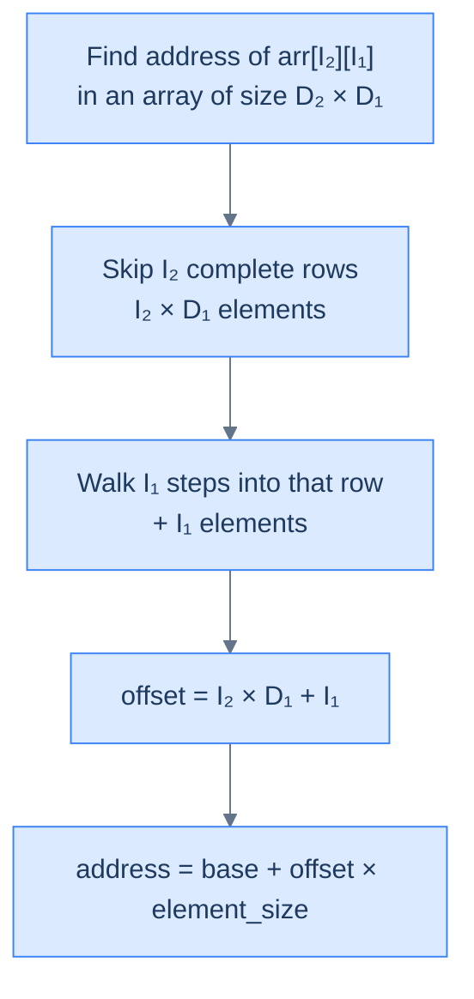

<p align="center"><strong>Calculating the base address of the value at <code>(I₂, I₁)</code> — skip whole rows, then step into the target row.</strong></p>

### Worked Example

3×4 array, `base_address = 1000`, `element_size = 4` bytes. Find `arr[2][1]`:

```
offset  = 2 × 4 + 1  =  9
address = 1000 + 9 × 4  =  1036
```

Verify by counting: Row 0 → offsets 0–3 · Row 1 → offsets 4–7 · Row 2 → offsets 8–11.
The element at `[2][1]` is the 2nd element (j=1) inside Row 2, which starts at offset 8. So offset = 8 + 1 = **9**. ✓

```python run
# Reproduce the address formula by hand for a 3 x 4 array.
base_address = 1000
element_size = 4
num_cols     = 4      # D1 — the stride: how many elements wide each row is

i, j = 2, 1           # Target element: arr[2][1]

# Skip i full rows, then walk j into the current row. num_cols is the row width.
offset  = i * num_cols + j
address = base_address + offset * element_size
print(f"arr[{i}][{j}] is at offset {offset}, memory address {address}")
# Expected: offset = 9, address = 1036
```

```java run
public class Main {
    public static void main(String[] args) {
        int baseAddress = 1000;
        int elementSize = 4;
        int numCols = 4;

        int i = 2, j = 1;

        int offset  = i * numCols + j;
        int address = baseAddress + offset * elementSize;
        System.out.println("arr[" + i + "][" + j + "] is at offset " + offset
                         + ", memory address " + address);
    }
}
```

```c run
#include <stdio.h>

int main() {
    int base_address = 1000;
    int element_size = 4;
    int num_cols = 4;

    int i = 2, j = 1;

    int offset  = i * num_cols + j;
    int address = base_address + offset * element_size;
    printf("arr[%d][%d] is at offset %d, memory address %d\n", i, j, offset, address);
    return 0;
}
```

```cpp run
#include <iostream>

int main() {
    int base_address = 1000;
    int element_size = 4;
    int num_cols = 4;

    int i = 2, j = 1;

    int offset  = i * num_cols + j;
    int address = base_address + offset * element_size;
    std::cout << "arr[" << i << "][" << j << "] is at offset " << offset
              << ", memory address " << address << "\n";
}
```

```scala run
object Main extends App {
  val baseAddress = 1000
  val elementSize = 4
  val numCols     = 4

  val i = 2
  val j = 1

  val offset  = i * numCols + j
  val address = baseAddress + offset * elementSize
  println(s"arr($i)($j) is at offset $offset, memory address $address")
}
```

```javascript run
const baseAddress = 1000;
const elementSize = 4;
const numCols = 4;

const i = 2, j = 1;

const offset  = i * numCols + j;
const address = baseAddress + offset * elementSize;
console.log(`arr[${i}][${j}] is at offset ${offset}, memory address ${address}`);
```

```typescript run
const baseAddress: number = 1000;
const elementSize: number = 4;
const numCols: number = 4;

const i: number = 2, j: number = 1;

const offset  = i * numCols + j;
const address = baseAddress + offset * elementSize;
console.log(`arr[${i}][${j}] is at offset ${offset}, memory address ${address}`);
```

```go run
package main

import "fmt"

func main() {
    baseAddress := 1000
    elementSize := 4
    numCols := 4

    i, j := 2, 1

    offset  := i*numCols + j
    address := baseAddress + offset*elementSize
    fmt.Printf("arr[%d][%d] is at offset %d, memory address %d\n", i, j, offset, address)
}
```

```kotlin run
fun main() {
    val baseAddress = 1000
    val elementSize = 4
    val numCols = 4

    val i = 2
    val j = 1

    val offset  = i * numCols + j
    val address = baseAddress + offset * elementSize
    println("arr[$i][$j] is at offset $offset, memory address $address")
}
```

```rust run
fn main() {
    let base_address = 1000;
    let element_size = 4;
    let num_cols = 4;

    let i = 2;
    let j = 1;

    let offset  = i * num_cols + j;
    let address = base_address + offset * element_size;
    println!("arr[{}][{}] is at offset {}, memory address {}", i, j, offset, address);
}
```


---

## Why the Formula Uses `num_cols`, Not `num_rows`

This trips up a lot of beginners. Why multiply by the number of **columns**, not the number of rows?

**Mental model:** The index `i` tells you how many complete rows to jump over. Each row contains `num_cols` elements. So to jump one row, you move `num_cols` positions forward in memory. That's the stride.

`num_rows` never appears because rows tell you *how many* rows exist — they don't tell you *how wide* each row is. The width (stride) is always `num_cols`.

If you accidentally used `num_rows = 3` in our example:

```
offset = 2 × 3 + 1 = 7   ← WRONG
```

Offset 7 points to `arr[1][3] = 80` — completely the wrong element.

---

## Key Takeaways

| Concept | Summary |
|---|---|
| **Definition** | Store every element of a row together, then move to the next row |
| **Index movement** | Lowest (innermost) dimension index moves fastest |
| **2D offset formula** | `i × num_cols + j` |
| **General address** | `base + (i × num_cols + j) × element_size` |
| **Languages** | C, C++, Objective-C, Python, Java, Go |
| **The stride** | `num_cols` — how many elements wide each row is in memory |

Row-major is the reason a simple nested loop can be either blazingly fast or painfully slow. Understanding this layout is the first step toward writing cache-efficient code — which you'll explore in the traversal lessons ahead.

***

# Example of Row Major Order

The 2D rule was easy to picture; the formula has only two terms. The real test is whether the pattern survives **another layer of nesting**. So we'll use a **three-dimensional array** — one dimension more than you're used to — and watch the same odometer rule pin every element to a specific address.

---

## The Array: 2 × 2 × 3

Consider a 3D integer array with these dimensions:

| Dimension | Symbol | Size |
|---|---|---|
| Outermost (layer) | D₃ | 2 |
| Middle (row) | D₂ | 2 |
| Innermost (column) | D₁ | 3 |

Think of it as **2 layers**, each layer being a **2×3 grid**. The logical representation looks like this:

```d2
L0: "Layer 0  ── D₃ = 0" {
  R00: "D₂ = 0" {
    grid-columns: 3
    grid-gap: 0
    a: "[0][0][0]"
    b: "[0][0][1]"
    c: "[0][0][2]"
  }
  R01: "D₂ = 1" {
    grid-columns: 3
    grid-gap: 0
    a: "[0][1][0]"
    b: "[0][1][1]"
    c: "[0][1][2]"
  }
}
L1: "Layer 1  ── D₃ = 1" {
  R10: "D₂ = 0" {
    grid-columns: 3
    grid-gap: 0
    a: "[1][0][0]"
    b: "[1][0][1]"
    c: "[1][0][2]"
  }
  R11: "D₂ = 1" {
    grid-columns: 3
    grid-gap: 0
    a: "[1][1][0]"
    b: "[1][1][1]"
    c: "[1][1][2]"
  }
}
```

<p align="center"><strong>Logical representation of the 3D array (D₃=2, D₂=2, D₁=3) — 2 layers, each a 2×3 grid, totalling 12 elements.</strong></p>

Each element is identified by three indices: **[layer][row][column]**, or **[I₃][I₂][I₁]**.

---

## Layout in Memory

Now we flatten this 3D structure into a single linear strip. Row-major order applies the same rule as always:

> **The lowest dimension (D₁ — column) moves the fastest. The highest dimension (D₃ — layer) moves the slowest.**

Think of the three indices as an odometer with three digits. The rightmost digit (D₁ — column) ticks up on every step. The middle digit (D₂ — row) only increments when the column overflows. The leftmost digit (D₃ — layer) only increments when both column and row overflow.

The complete traversal order looks like this:

```mermaid
---
config:
  theme: base
  themeVariables:
    primaryColor: "#dbeafe"
    primaryBorderColor: "#3b82f6"
    primaryTextColor: "#1e3a5f"
    lineColor: "#64748b"
    secondaryColor: "#ede9fe"
    tertiaryColor: "#fef9c3"
---
flowchart LR
  subgraph L0["Layer 0  (D₃=0)"]
    direction LR
    subgraph L0R0["D₂=0  —  D₁ races 0→1→2"]
      direction LR
      a000["[0][0][0]"] --> a001["[0][0][1]"] --> a002["[0][0][2]"]
    end
    subgraph L0R1["D₂=1  —  D₁ races 0→1→2"]
      direction LR
      a010["[0][1][0]"] --> a011["[0][1][1]"] --> a012["[0][1][2]"]
    end
    a002 -->|"D₂ increments"| a010
  end
  subgraph L1["Layer 1  (D₃=1)"]
    direction LR
    subgraph L1R0["D₂=0  —  D₁ races 0→1→2"]
      direction LR
      a100["[1][0][0]"] --> a101["[1][0][1]"] --> a102["[1][0][2]"]
    end
    subgraph L1R1["D₂=1  —  D₁ races 0→1→2"]
      direction LR
      a110["[1][1][0]"] --> a111["[1][1][1]"] --> a112["[1][1][2]"]
    end
    a102 -->|"D₂ increments"| a110
  end
  a012 -->|"D₃ increments"| a100
```

<p align="center"><strong>The lowest dimension D₁ moves the fastest in row-major order — it completes a full sweep before D₂ ticks up, and D₂ completes a full sweep before D₃ ticks up.</strong></p>

The resulting serialisation order is:

```
[0][0][0] → [0][0][1] → [0][0][2] → [0][1][0] → [0][1][1] → [0][1][2]
→ [1][0][0] → [1][0][1] → [1][0][2] → [1][1][0] → [1][1][1] → [1][1][2]
```

Twelve elements, one after another, lowest dimension cycling fastest.

---

## Structure in Memory

Let's now map this onto actual memory. Assume:
- **Base address = 2**
- **Element size = 4 bytes** (integer)

Each element occupies 4 bytes. The address of the element at offset `k` is:

```
address = 2 + k × 4
```

Here is exactly what the array looks like in memory, laid out slot by slot:

```d2
mem: {
  grid-rows: 4
  grid-columns: 6
  grid-gap: 0
  i0: "[0][0][0]"
  i1: "[0][0][1]"
  i2: "[0][0][2]"
  i3: "[0][1][0]"
  i4: "[0][1][1]"
  i5: "[0][1][2]"
  a0: "addr 2"
  a1: "addr 6"
  a2: "addr 10"
  a3: "addr 14"
  a4: "addr 18"
  a5: "addr 22"
  i6: "[1][0][0]"
  i7: "[1][0][1]"
  i8: "[1][0][2]"
  i9: "[1][1][0]"
  i10: "[1][1][1]"
  i11: "[1][1][2]"
  a6: "addr 26"
  a7: "addr 30"
  a8: "addr 34"
  a9: "addr 38"
  a10: "addr 42"
  a11: "addr 46"
}
```

<p align="center"><strong>Row-major layout in memory — 12 elements, base address 2, each element 4 bytes wide. Each address row sits directly under its index row, so reading down a column gives the (index, address) pair for one element.</strong></p>

Notice the pattern: Layer 0 occupies addresses 2–22, Layer 1 occupies 26–46. Within each layer, Row 0 comes first, Row 1 second. Within each row, the column index climbs 0→1→2.

```python run
# Print offset + address of every element in a 2 x 2 x 3 row-major array.
base = 2
element_size = 4
D3, D2, D1 = 2, 2, 3

print(f"{'Index':<16} {'Offset':>6} {'Address':>8}")
print("-" * 32)

# D3 outermost (slowest), D1 innermost (fastest) — matches row-major storage,
# so offset increases by exactly 1 per step.
for i3 in range(D3):
    for i2 in range(D2):
        for i1 in range(D1):
            offset  = i3 * (D2 * D1) + i2 * D1 + i1
            address = base + offset * element_size
            print(f"[{i3}][{i2}][{i1}]          {offset:>6}    {address:>6}")
```

```java run
public class Main {
    public static void main(String[] args) {
        int base = 2;
        int elementSize = 4;
        int D3 = 2, D2 = 2, D1 = 3;

        System.out.printf("%-16s %6s %8s%n", "Index", "Offset", "Address");
        System.out.println("--------------------------------");
        for (int i3 = 0; i3 < D3; i3++) {
            for (int i2 = 0; i2 < D2; i2++) {
                for (int i1 = 0; i1 < D1; i1++) {
                    int offset  = i3 * (D2 * D1) + i2 * D1 + i1;
                    int address = base + offset * elementSize;
                    System.out.printf("[%d][%d][%d]          %6d    %6d%n", i3, i2, i1, offset, address);
                }
            }
        }
    }
}
```

```c run
#include <stdio.h>

int main() {
    int base = 2;
    int element_size = 4;
    int D3 = 2, D2 = 2, D1 = 3;

    printf("%-16s %6s %8s\n", "Index", "Offset", "Address");
    printf("--------------------------------\n");
    for (int i3 = 0; i3 < D3; i3++) {
        for (int i2 = 0; i2 < D2; i2++) {
            for (int i1 = 0; i1 < D1; i1++) {
                int offset  = i3 * (D2 * D1) + i2 * D1 + i1;
                int address = base + offset * element_size;
                printf("[%d][%d][%d]          %6d    %6d\n", i3, i2, i1, offset, address);
            }
        }
    }
    return 0;
}
```

```cpp run
#include <cstdio>

int main() {
    int base = 2;
    int element_size = 4;
    int D3 = 2, D2 = 2, D1 = 3;

    std::printf("%-16s %6s %8s\n", "Index", "Offset", "Address");
    std::printf("--------------------------------\n");
    for (int i3 = 0; i3 < D3; i3++) {
        for (int i2 = 0; i2 < D2; i2++) {
            for (int i1 = 0; i1 < D1; i1++) {
                int offset  = i3 * (D2 * D1) + i2 * D1 + i1;
                int address = base + offset * element_size;
                std::printf("[%d][%d][%d]          %6d    %6d\n", i3, i2, i1, offset, address);
            }
        }
    }
}
```

```scala run
object Main extends App {
  val base = 2
  val elementSize = 4
  val D3 = 2; val D2 = 2; val D1 = 3

  println(f"${"Index"}%-16s ${"Offset"}%6s ${"Address"}%8s")
  println("-" * 32)
  for (i3 <- 0 until D3; i2 <- 0 until D2; i1 <- 0 until D1) {
    val offset  = i3 * (D2 * D1) + i2 * D1 + i1
    val address = base + offset * elementSize
    println(f"[$i3][$i2][$i1]          $offset%6d    $address%6d")
  }
}
```

```javascript run
const base = 2;
const elementSize = 4;
const [D3, D2, D1] = [2, 2, 3];

console.log("Index            Offset  Address");
console.log("--------------------------------");
for (let i3 = 0; i3 < D3; i3++) {
    for (let i2 = 0; i2 < D2; i2++) {
        for (let i1 = 0; i1 < D1; i1++) {
            const offset  = i3 * (D2 * D1) + i2 * D1 + i1;
            const address = base + offset * elementSize;
            console.log(`[${i3}][${i2}][${i1}]          ${String(offset).padStart(6)}    ${String(address).padStart(6)}`);
        }
    }
}
```

```typescript run
const base: number = 2;
const elementSize: number = 4;
const [D3, D2, D1]: [number, number, number] = [2, 2, 3];

console.log("Index            Offset  Address");
console.log("--------------------------------");
for (let i3 = 0; i3 < D3; i3++) {
    for (let i2 = 0; i2 < D2; i2++) {
        for (let i1 = 0; i1 < D1; i1++) {
            const offset  = i3 * (D2 * D1) + i2 * D1 + i1;
            const address = base + offset * elementSize;
            console.log(`[${i3}][${i2}][${i1}]          ${String(offset).padStart(6)}    ${String(address).padStart(6)}`);
        }
    }
}
```

```go run
package main

import "fmt"

func main() {
    base := 2
    elementSize := 4
    D3, D2, D1 := 2, 2, 3

    fmt.Printf("%-16s %6s %8s\n", "Index", "Offset", "Address")
    fmt.Println("--------------------------------")
    for i3 := 0; i3 < D3; i3++ {
        for i2 := 0; i2 < D2; i2++ {
            for i1 := 0; i1 < D1; i1++ {
                offset  := i3*(D2*D1) + i2*D1 + i1
                address := base + offset*elementSize
                fmt.Printf("[%d][%d][%d]          %6d    %6d\n", i3, i2, i1, offset, address)
            }
        }
    }
}
```

```kotlin run
fun main() {
    val base = 2
    val elementSize = 4
    val D3 = 2; val D2 = 2; val D1 = 3

    println("%-16s %6s %8s".format("Index", "Offset", "Address"))
    println("--------------------------------")
    for (i3 in 0 until D3) {
        for (i2 in 0 until D2) {
            for (i1 in 0 until D1) {
                val offset  = i3 * (D2 * D1) + i2 * D1 + i1
                val address = base + offset * elementSize
                println("[$i3][$i2][$i1]          %6d    %6d".format(offset, address))
            }
        }
    }
}
```

```rust run
fn main() {
    let base = 2;
    let element_size = 4;
    let (d3, d2, d1) = (2, 2, 3);

    println!("{:<16} {:>6} {:>8}", "Index", "Offset", "Address");
    println!("--------------------------------");
    for i3 in 0..d3 {
        for i2 in 0..d2 {
            for i1 in 0..d1 {
                let offset  = i3 * (d2 * d1) + i2 * d1 + i1;
                let address = base + offset * element_size;
                println!("[{}][{}][{}]          {:>6}    {:>6}", i3, i2, i1, offset, address);
            }
        }
    }
}
```


---

## Calculating the Address of Elements

When you write `array[0][0][2]` or `array[1][1][2]` in code, the subscript operator silently computes the memory address using the formula we derived in the previous lesson — now extended to three dimensions:

```
offset  = I₃ × (D₂ × D₁)  +  I₂ × D₁  +  I₁
address = base + offset × element_size
```

Each term in the offset formula represents one "level" of skipping:
- **I₃ × (D₂ × D₁)** — skip past I₃ complete layers, each of size D₂ × D₁
- **I₂ × D₁** — skip past I₂ complete rows within the current layer, each of size D₁
- **I₁** — step I₁ positions into the current row

> *Before reading on — for `array[1][1][2]` (the very last element), what offset do you expect? With 12 elements numbered 0..11, only one answer makes sense. Lock it in, then verify with the worked example below.*

Let's work through both examples:

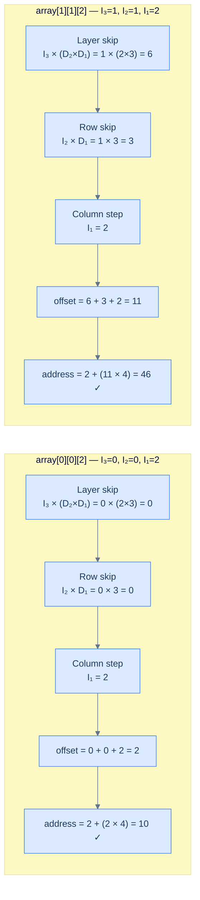

<p align="center"><strong>Calculating the base address for <code>array[0][0][2]</code> (offset 2, address 10) and <code>array[1][1][2]</code> (offset 11, address 46) using the subscript operator formula.</strong></p>

Cross-check against the memory layout diagram above: `array[0][0][2]` is at address **10** ✓ and `array[1][1][2]` is the very last element at address **46** ✓.

```python run
# Reproduce the subscript operator for a 2 x 2 x 3 row-major array.
base = 2
element_size = 4
D2, D1 = 2, 3      # One layer = D2 * D1 slots.

def address_of(i3, i2, i1):
    offset = i3 * (D2 * D1) + i2 * D1 + i1
    return base + offset * element_size, offset

addr, offset = address_of(0, 0, 2)
print(f"array[0][0][2] → offset={offset}, address={addr}")   # expect 2, 10

addr, offset = address_of(1, 1, 2)
print(f"array[1][1][2] → offset={offset}, address={addr}")   # expect 11, 46
```

```java run
public class Main {
    static final int BASE = 2;
    static final int SIZE = 4;
    static final int D2   = 2;
    static final int D1   = 3;

    static int[] addressOf(int i3, int i2, int i1) {
        int offset = i3 * (D2 * D1) + i2 * D1 + i1;
        return new int[] { BASE + offset * SIZE, offset };
    }

    public static void main(String[] args) {
        int[] r1 = addressOf(0, 0, 2);
        System.out.println("array[0][0][2] → offset=" + r1[1] + ", address=" + r1[0]);
        int[] r2 = addressOf(1, 1, 2);
        System.out.println("array[1][1][2] → offset=" + r2[1] + ", address=" + r2[0]);
    }
}
```

```c run
#include <stdio.h>

#define BASE 2
#define SIZE 4
#define D2   2
#define D1   3

void address_of(int i3, int i2, int i1, int* addr, int* offset) {
    *offset = i3 * (D2 * D1) + i2 * D1 + i1;
    *addr   = BASE + (*offset) * SIZE;
}

int main() {
    int addr, offset;
    address_of(0, 0, 2, &addr, &offset);
    printf("array[0][0][2] → offset=%d, address=%d\n", offset, addr);
    address_of(1, 1, 2, &addr, &offset);
    printf("array[1][1][2] → offset=%d, address=%d\n", offset, addr);
    return 0;
}
```

```cpp run
#include <iostream>
#include <utility>

constexpr int BASE = 2;
constexpr int SIZE = 4;
constexpr int D2   = 2;
constexpr int D1   = 3;

std::pair<int,int> address_of(int i3, int i2, int i1) {
    int offset = i3 * (D2 * D1) + i2 * D1 + i1;
    return {BASE + offset * SIZE, offset};
}

int main() {
    auto [addr1, off1] = address_of(0, 0, 2);
    std::cout << "array[0][0][2] → offset=" << off1 << ", address=" << addr1 << "\n";
    auto [addr2, off2] = address_of(1, 1, 2);
    std::cout << "array[1][1][2] → offset=" << off2 << ", address=" << addr2 << "\n";
}
```

```scala run
object Main extends App {
  val base = 2
  val size = 4
  val D2   = 2
  val D1   = 3

  def addressOf(i3: Int, i2: Int, i1: Int): (Int, Int) = {
    val offset = i3 * (D2 * D1) + i2 * D1 + i1
    (base + offset * size, offset)
  }

  val (a1, o1) = addressOf(0, 0, 2)
  println(s"array[0][0][2] → offset=$o1, address=$a1")
  val (a2, o2) = addressOf(1, 1, 2)
  println(s"array[1][1][2] → offset=$o2, address=$a2")
}
```

```javascript run
const BASE = 2;
const SIZE = 4;
const D2   = 2;
const D1   = 3;

function addressOf(i3, i2, i1) {
    const offset = i3 * (D2 * D1) + i2 * D1 + i1;
    return [BASE + offset * SIZE, offset];
}

let [addr, offset] = addressOf(0, 0, 2);
console.log(`array[0][0][2] → offset=${offset}, address=${addr}`);
[addr, offset] = addressOf(1, 1, 2);
console.log(`array[1][1][2] → offset=${offset}, address=${addr}`);
```

```typescript run
const BASE: number = 2;
const SIZE: number = 4;
const D2: number   = 2;
const D1: number   = 3;

function addressOf(i3: number, i2: number, i1: number): [number, number] {
    const offset = i3 * (D2 * D1) + i2 * D1 + i1;
    return [BASE + offset * SIZE, offset];
}

let [addr, offset] = addressOf(0, 0, 2);
console.log(`array[0][0][2] → offset=${offset}, address=${addr}`);
[addr, offset] = addressOf(1, 1, 2);
console.log(`array[1][1][2] → offset=${offset}, address=${addr}`);
```

```go run
package main

import "fmt"

const base = 2
const size = 4
const D2   = 2
const D1   = 3

func addressOf(i3, i2, i1 int) (int, int) {
    offset := i3*(D2*D1) + i2*D1 + i1
    return base + offset*size, offset
}

func main() {
    addr, offset := addressOf(0, 0, 2)
    fmt.Printf("array[0][0][2] → offset=%d, address=%d\n", offset, addr)
    addr, offset = addressOf(1, 1, 2)
    fmt.Printf("array[1][1][2] → offset=%d, address=%d\n", offset, addr)
}
```

```kotlin run
const val BASE = 2
const val SIZE = 4
const val D2   = 2
const val D1   = 3

fun addressOf(i3: Int, i2: Int, i1: Int): Pair<Int, Int> {
    val offset = i3 * (D2 * D1) + i2 * D1 + i1
    return Pair(BASE + offset * SIZE, offset)
}

fun main() {
    var (addr, offset) = addressOf(0, 0, 2)
    println("array[0][0][2] → offset=$offset, address=$addr")
    val r = addressOf(1, 1, 2)
    println("array[1][1][2] → offset=${r.second}, address=${r.first}")
}
```

```rust run
const BASE: i32 = 2;
const SIZE: i32 = 4;
const D2:   i32 = 2;
const D1:   i32 = 3;

fn address_of(i3: i32, i2: i32, i1: i32) -> (i32, i32) {
    let offset = i3 * (D2 * D1) + i2 * D1 + i1;
    (BASE + offset * SIZE, offset)
}

fn main() {
    let (addr, offset) = address_of(0, 0, 2);
    println!("array[0][0][2] → offset={}, address={}", offset, addr);
    let (addr, offset) = address_of(1, 1, 2);
    println!("array[1][1][2] → offset={}, address={}", offset, addr);
}
```


---

## Dereferencing the Value

Once the subscript operator resolves the address, the program still needs to **read the actual value** stored there. This step is called **dereferencing**.

The language already knows two things:
1. **The starting address** — computed by the formula above
2. **The datatype size** — for `int`, that's 4 bytes

It simply reads `element_size` consecutive bytes starting at that address and interprets the bit pattern as the stored datatype:

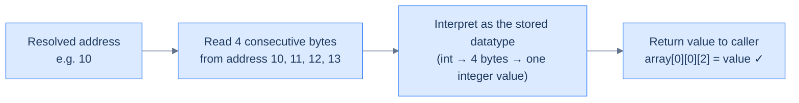

<p align="center"><strong>Dereferencing — once the address is known, the language reads <code>element_size</code> bytes starting there and interprets them according to the stored datatype.</strong></p>

The same mechanism works for any datatype — `float`, `double`, `char`, or even a struct. The only thing that changes is how many bytes are read and how those bytes are interpreted. The array indexing formula itself stays identical.

---

## Key Takeaways

- A 3D array `D₃ × D₂ × D₁` is flattened layer by layer, row by row, column by column
- **D₁ (innermost) moves fastest; D₃ (outermost) moves slowest** — same odometer rule for any N dimensions
- The 3D address formula: `base + (I₃ × D₂ × D₁  +  I₂ × D₁  +  I₁) × element_size`
- After the address is computed, the language reads `element_size` bytes from that address and interprets them as the stored type — this is dereferencing
- All of this happens invisibly every time you write `arr[i][j][k]` — the subscript operator does the maths for you

> **You now know how the CPU finds *one* element. The next problem: visit every element exactly once, in the order memory lays them out. That single decision is the difference between a cache-friendly loop and a slow one.**

***

# Row Major Traversal

## The Problem

Given a 2D matrix, collect all of its elements in **row-major order** — left to right across each row, one row at a time — and return them as a flat list.

```
Input:  matrix = [[1, 2, 3],
                  [4, 5, 6],
                  [7, 8, 9]]

Output: [1, 2, 3, 4, 5, 6, 7, 8, 9]
```

This is the direct application of everything learned in the previous two lessons. If you've understood row-major memory layout, the traversal code writes itself.

---

## Examples

**Example 1 — 3×3 matrix**

```
Input:  [[1, 2, 3], [4, 5, 6], [7, 8, 9]]
Output: [1, 2, 3, 4, 5, 6, 7, 8, 9]
```

**Example 2 — 2×4 matrix**

```
Input:  [[3, 2, 1, 7], [0, 6, 3, 2]]
Output: [3, 2, 1, 7, 0, 6, 3, 2]
```

**Example 3 — 1×1 matrix (edge case)**

```
Input:  [[1]]
Output: [1]
```

---

## Intuition

Row-major traversal is exactly the path your eye naturally takes when reading a grid — left to right along the first row, then drop down and repeat for the next row, and so on.

More importantly, this is the **same order elements are stored in memory** for row-major languages. Traversing in this order means every access hits the next slot in memory — no jumping, no cache misses. It's the fastest possible way to touch every element.

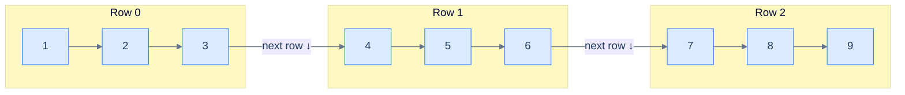

<p align="center"><strong>Row-major traversal of a 3×3 matrix — finish each row completely before dropping to the next.</strong></p>

The collected output is a flat 1D list of all elements in visit order:

```d2
out: {
  grid-columns: 9
  grid-gap: 0
  a: "1"
  b: "2"
  c: "3"
  d: "4"
  e: "5"
  f: "6"
  g: "7"
  h: "8"
  i: "9"
}
```

<p align="center"><strong>Output — all 9 elements in row-major order, as a flat list.</strong></p>

---

## The Approach

The key observation is simple:

> **Outer loop = rows (slow). Inner loop = columns (fast).**

That's it. The outer loop picks a row, the inner loop walks across every column in that row. Append each element as you go.

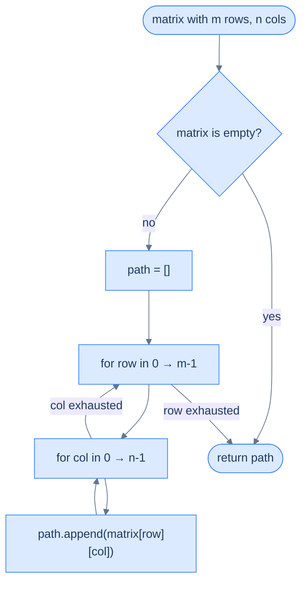

<p align="center"><strong>Algorithm flow — the inner loop exhausts all columns before the outer loop advances to the next row.</strong></p>

---

## Solution

```python run
from typing import List

class Solution:
    def row_major_traversal(self, matrix: List[List[int]]) -> List[int]:
        if not matrix:
            return []

        rows: int = len(matrix)
        cols: int = len(matrix[0])
        path: List[int] = []

        # Outer = rows (slow), inner = cols (fast) → row-major visit order.
        for row in range(rows):
            for col in range(cols):
                path.append(matrix[row][col])
        return path


s = Solution()
print("Example 1:", s.row_major_traversal([[1,2,3],[4,5,6],[7,8,9]]))
print("Example 2:", s.row_major_traversal([[3,2,1,7],[0,6,3,2]]))
print("Example 3:", s.row_major_traversal([[1]]))
print("Empty:    ", s.row_major_traversal([]))
```

```java run
import java.util.*;

public class Main {
    static List<Integer> rowMajorTraversal(int[][] matrix) {
        List<Integer> path = new ArrayList<>();
        if (matrix.length == 0) return path;
        int rows = matrix.length, cols = matrix[0].length;
        // Outer = rows (slow), inner = cols (fast).
        for (int row = 0; row < rows; row++) {
            for (int col = 0; col < cols; col++) {
                path.add(matrix[row][col]);
            }
        }
        return path;
    }

    public static void main(String[] args) {
        System.out.println("Example 1: " + rowMajorTraversal(new int[][]{{1,2,3},{4,5,6},{7,8,9}}));
        System.out.println("Example 2: " + rowMajorTraversal(new int[][]{{3,2,1,7},{0,6,3,2}}));
        System.out.println("Example 3: " + rowMajorTraversal(new int[][]{{1}}));
        System.out.println("Empty:     " + rowMajorTraversal(new int[][]{}));
    }
}
```

```c run
#include <stdio.h>

void row_major_traversal(int rows, int cols, int matrix[rows][cols]) {
    /* Outer = rows (slow), inner = cols (fast). */
    for (int row = 0; row < rows; row++) {
        for (int col = 0; col < cols; col++) {
            printf("%d ", matrix[row][col]);
        }
    }
    printf("\n");
}

int main() {
    int m1[3][3] = {{1,2,3},{4,5,6},{7,8,9}};
    int m2[2][4] = {{3,2,1,7},{0,6,3,2}};
    int m3[1][1] = {{1}};

    printf("Example 1: "); row_major_traversal(3, 3, m1);
    printf("Example 2: "); row_major_traversal(2, 4, m2);
    printf("Example 3: "); row_major_traversal(1, 1, m3);
    return 0;
}
```

```cpp run
#include <iostream>
#include <vector>

std::vector<int> row_major_traversal(const std::vector<std::vector<int>>& matrix) {
    std::vector<int> path;
    if (matrix.empty()) return path;
    int rows = matrix.size(), cols = matrix[0].size();
    for (int row = 0; row < rows; row++) {
        for (int col = 0; col < cols; col++) {
            path.push_back(matrix[row][col]);
        }
    }
    return path;
}

int main() {
    auto print = [](const std::vector<int>& v) {
        std::cout << "[";
        for (size_t i = 0; i < v.size(); i++) std::cout << v[i] << (i + 1 < v.size() ? ", " : "");
        std::cout << "]\n";
    };
    print(row_major_traversal({{1,2,3},{4,5,6},{7,8,9}}));
    print(row_major_traversal({{3,2,1,7},{0,6,3,2}}));
    print(row_major_traversal({{1}}));
    print(row_major_traversal({}));
}
```

```scala run
object Main extends App {
  def rowMajorTraversal(matrix: Array[Array[Int]]): List[Int] = {
    if (matrix.isEmpty) return Nil
    val buf = scala.collection.mutable.ListBuffer.empty[Int]
    for (row <- matrix.indices; col <- matrix(row).indices) {
      buf += matrix(row)(col)
    }
    buf.toList
  }

  println("Example 1: " + rowMajorTraversal(Array(Array(1,2,3), Array(4,5,6), Array(7,8,9))))
  println("Example 2: " + rowMajorTraversal(Array(Array(3,2,1,7), Array(0,6,3,2))))
  println("Example 3: " + rowMajorTraversal(Array(Array(1))))
  println("Empty:     " + rowMajorTraversal(Array.empty[Array[Int]]))
}
```

```javascript run
function rowMajorTraversal(matrix) {
    const path = [];
    if (!matrix.length) return path;
    const rows = matrix.length, cols = matrix[0].length;
    for (let row = 0; row < rows; row++) {
        for (let col = 0; col < cols; col++) {
            path.push(matrix[row][col]);
        }
    }
    return path;
}

console.log("Example 1:", rowMajorTraversal([[1,2,3],[4,5,6],[7,8,9]]));
console.log("Example 2:", rowMajorTraversal([[3,2,1,7],[0,6,3,2]]));
console.log("Example 3:", rowMajorTraversal([[1]]));
console.log("Empty:    ", rowMajorTraversal([]));
```

```typescript run
function rowMajorTraversal(matrix: number[][]): number[] {
    const path: number[] = [];
    if (!matrix.length) return path;
    const rows = matrix.length, cols = matrix[0].length;
    for (let row = 0; row < rows; row++) {
        for (let col = 0; col < cols; col++) {
            path.push(matrix[row][col]);
        }
    }
    return path;
}

console.log("Example 1:", rowMajorTraversal([[1,2,3],[4,5,6],[7,8,9]]));
console.log("Example 2:", rowMajorTraversal([[3,2,1,7],[0,6,3,2]]));
console.log("Example 3:", rowMajorTraversal([[1]]));
console.log("Empty:    ", rowMajorTraversal([]));
```

```go run
package main

import "fmt"

func rowMajorTraversal(matrix [][]int) []int {
    path := []int{}
    if len(matrix) == 0 {
        return path
    }
    rows, cols := len(matrix), len(matrix[0])
    for row := 0; row < rows; row++ {
        for col := 0; col < cols; col++ {
            path = append(path, matrix[row][col])
        }
    }
    return path
}

func main() {
    fmt.Println("Example 1:", rowMajorTraversal([][]int{{1,2,3},{4,5,6},{7,8,9}}))
    fmt.Println("Example 2:", rowMajorTraversal([][]int{{3,2,1,7},{0,6,3,2}}))
    fmt.Println("Example 3:", rowMajorTraversal([][]int{{1}}))
    fmt.Println("Empty:    ", rowMajorTraversal([][]int{}))
}
```

```kotlin run
fun rowMajorTraversal(matrix: Array<IntArray>): List<Int> {
    if (matrix.isEmpty()) return emptyList()
    val path = mutableListOf<Int>()
    for (row in matrix.indices) {
        for (col in matrix[row].indices) {
            path.add(matrix[row][col])
        }
    }
    return path
}

fun main() {
    println("Example 1: " + rowMajorTraversal(arrayOf(intArrayOf(1,2,3), intArrayOf(4,5,6), intArrayOf(7,8,9))))
    println("Example 2: " + rowMajorTraversal(arrayOf(intArrayOf(3,2,1,7), intArrayOf(0,6,3,2))))
    println("Example 3: " + rowMajorTraversal(arrayOf(intArrayOf(1))))
    println("Empty:     " + rowMajorTraversal(emptyArray()))
}
```

```rust run
fn row_major_traversal(matrix: &[Vec<i32>]) -> Vec<i32> {
    let mut path = Vec::new();
    if matrix.is_empty() { return path; }
    for row in matrix {
        for &v in row {
            path.push(v);
        }
    }
    path
}

fn main() {
    println!("Example 1: {:?}", row_major_traversal(&vec![vec![1,2,3], vec![4,5,6], vec![7,8,9]]));
    println!("Example 2: {:?}", row_major_traversal(&vec![vec![3,2,1,7], vec![0,6,3,2]]));
    println!("Example 3: {:?}", row_major_traversal(&vec![vec![1]]));
    println!("Empty:     {:?}", row_major_traversal(&Vec::<Vec<i32>>::new()));
}
```


---

## Dry Run — Example 2

> *Before reading the trace — for `[[3, 2, 1, 7], [0, 6, 3, 2]]`, write down the output you expect. Eight elements, in the order the nested loop visits them. Then check the trace below.*

Let's trace through `[[3, 2, 1, 7], [0, 6, 3, 2]]` step by step.

`rows = 2`, `cols = 4`, `path = []`

| Step | `row` | `col` | Element appended | `path` so far |
|---|---|---|---|---|
| 1 | 0 | 0 | 3 | `[3]` |
| 2 | 0 | 1 | 2 | `[3, 2]` |
| 3 | 0 | 2 | 1 | `[3, 2, 1]` |
| 4 | 0 | 3 | 7 | `[3, 2, 1, 7]` |
| 5 | 1 | 0 | 0 | `[3, 2, 1, 7, 0]` |
| 6 | 1 | 1 | 6 | `[3, 2, 1, 7, 0, 6]` |
| 7 | 1 | 2 | 3 | `[3, 2, 1, 7, 0, 6, 3]` |
| 8 | 1 | 3 | 2 | `[3, 2, 1, 7, 0, 6, 3, 2]` |

**Return:** `[3, 2, 1, 7, 0, 6, 3, 2]` ✓

---

## Complexity Analysis

**Time complexity: O(m × n)**

Every element in the matrix is visited exactly once. With `m` rows and `n` columns, that's `m × n` total steps — no wasted work.

**Space complexity: O(m × n)**

The output list `path` holds every element — it's the same size as the input. If you're only asked to *process* elements without storing them, space drops to O(1) (just the two loop counters).

> **Cache bonus:** Because row-major traversal accesses elements in the exact order they're stored in memory, every access is a cache hit. In practice this means large matrices traverse significantly faster than the equivalent column-major loop, even though the big-O complexity is identical.

---

## Edge Cases

| Scenario | Input | Output | Why |
|---|---|---|---|
| Empty matrix | `[]` | `[]` | Guard clause returns immediately |
| Single element | `[[5]]` | `[5]` | One row, one col — one iteration |
| Single row | `[[1, 2, 3, 4]]` | `[1, 2, 3, 4]` | Outer loop runs once, inner runs 4 times |
| Single column | `[[1], [2], [3]]` | `[1, 2, 3]` | Inner loop runs once per outer — same result as column traversal here |

---

## Key Takeaway

Row-major traversal is two nested loops — outer over rows, inner over columns. It's cache-optimal, it matches memory layout, and it's the pattern the hardware was designed to reward. Whenever you traverse a 2D array in a row-major language, this is the loop order you want.

> **But not every language stores arrays this way.** Fortran, MATLAB, Julia, and R do the exact opposite — and the same code that's blazing fast in Python becomes the slow path there. To understand why, we need to look at row-major's mirror image.

***

# Understanding Column Major Order

## The Mirror Image of Row-Major

You've seen that row-major order flattens a 2D array **row by row**. Column-major order does the exact opposite — it flattens the array **column by column**.

> **Column-major:** store all elements of column 0 top to bottom, then column 1, then column 2, and so on.

Think of reading a Chinese newspaper — you start at the top of a column and read downward, then move to the next column. That's column-major order.

Languages like **Fortran, MATLAB, Julia, and R** store their arrays this way. This matters enormously when you're calling numerical libraries or exchanging data between ecosystems.

---

## Side-by-Side: What Changes

Take the same 3×4 array from the previous lessons:

```
arr = [
  [10, 20, 30, 40],   ← Row 0
  [50, 60, 70, 80],   ← Row 1
  [90, 11, 12, 13],   ← Row 2
]
```

| | Flat memory sequence |
|---|---|
| **Row-major** | 10, 20, 30, 40, 50, 60, 70, 80, 90, 11, 12, 13 |
| **Column-major** | 10, 50, 90, 20, 60, 11, 30, 70, 12, 40, 80, 13 |

The 2D grid is identical. The only thing that changes is **which elements end up next to each other in memory**.

---

## Visualising Column-Major Order

Here's the same 3×4 logical grid:

```d2
grid: {
  grid-columns: 4
  grid-gap: 0
  a: |md
    `[0][0]` = **10**
  |
  b: |md
    `[0][1]` = **20**
  |
  c: |md
    `[0][2]` = **30**
  |
  d: |md
    `[0][3]` = **40**
  |
  e: |md
    `[1][0]` = **50**
  |
  f: |md
    `[1][1]` = **60**
  |
  g: |md
    `[1][2]` = **70**
  |
  h: |md
    `[1][3]` = **80**
  |
  i: |md
    `[2][0]` = **90**
  |
  j: |md
    `[2][1]` = **11**
  |
  k: |md
    `[2][2]` = **12**
  |
  l: |md
    `[2][3]` = **13**
  |
}
```

<p align="center"><strong>The logical 2D view — same 3×4 grid as before. What changes is the memory layout below.</strong></p>

In column-major order, this is flattened **one complete column at a time** — top to bottom within each column:

```d2
direction: right

C0: "Column 0" {
  grid-rows: 3
  grid-gap: 0
  a: "10"
  b: "50"
  c: "90"
}
C1: "Column 1" {
  grid-rows: 3
  grid-gap: 0
  a: "20"
  b: "60"
  c: "11"
}
C2: "Column 2" {
  grid-rows: 3
  grid-gap: 0
  a: "30"
  b: "70"
  c: "12"
}
C3: "Column 3" {
  grid-rows: 3
  grid-gap: 0
  a: "40"
  b: "80"
  c: "13"
}

C0 -> C1
C1 -> C2
C2 -> C3
```

<p align="center"><strong>Generic representation of the 2D array in column-major order in memory — Column 0 is placed first (top to bottom), then Column 1, then Column 2, then Column 3.</strong></p>

Notice how neighbours in memory are now **vertically adjacent** in the grid, not horizontally. `10` (addr 0) is next to `50` (addr 1), not `20`.

---

## The N-Dimensional Rule

For a general N-dimensional array with sizes `Dₙ × Dₙ₋₁ × ... × D₁`:

> **Column-major: the highest dimension index (Dₙ) moves the fastest. The lowest dimension index (D₁) moves the slowest.**

This is the exact reverse of row-major (where D₁ moves fastest). Think of it as flipping the odometer — the leftmost digit now ticks, and the rightmost digit is the slowest.

For the 3×4 array (D₂=3, D₁=4), the indices progress like this:

```mermaid
---
config:
  theme: base
  themeVariables:
    primaryColor: "#dbeafe"
    primaryBorderColor: "#3b82f6"
    primaryTextColor: "#1e3a5f"
    lineColor: "#64748b"
    secondaryColor: "#ede9fe"
    tertiaryColor: "#fef9c3"
---
flowchart LR
  subgraph Col0["Column 0  (D₁=0)  —  D₂ races 0→1→2"]
    direction TB
    r00["[0][0]"] --> r10["[1][0]"] --> r20["[2][0]"]
  end
  subgraph Col1["Column 1  (D₁=1)  —  D₂ races 0→1→2"]
    direction TB
    r01["[0][1]"] --> r11["[1][1]"] --> r21["[2][1]"]
  end
  subgraph Col2["Column 2  (D₁=2)  —  D₂ races 0→1→2"]
    direction TB
    r02["[0][2]"] --> r12["[1][2]"] --> r22["[2][2]"]
  end
  subgraph Col3["Column 3  (D₁=3)  —  D₂ races 0→1→2"]
    direction TB
    r03["[0][3]"] --> r13["[1][3]"] --> r23["[2][3]"]
  end
  r20 -->|"D₁ increments"| r01
  r21 -->|"D₁ increments"| r02
  r22 -->|"D₁ increments"| r03
```

<p align="center"><strong>Column-major order lays out elements by moving the highest dimension the fastest — D₂ (row index) races 0→1→2 within each column; D₁ (column index) only increments when the column is exhausted.</strong></p>

The full memory sequence for our 3×4 array:

```
[0][0] → [1][0] → [2][0] → [0][1] → [1][1] → [2][1] → [0][2] → [1][2] → [2][2] → [0][3] → [1][3] → [2][3]
  ↑ D₂ races ↓         ↑ D₂ races ↓         ↑ D₂ races ↓         ↑ D₂ races ↓
```

---

## The Address Formula

> *Before reading the derivation — flip your row-major instinct. To reach `arr[1][2]` in column-major order, how many full **columns** must you skip first, and how far do you walk down into the column you land on? Try the arithmetic before scrolling.*

### Reframe the Mental Model

In row-major, you think of skipping *rows*. In column-major, you think of skipping *columns*.

To reach element `arr[i][j]` in a matrix with `num_rows` rows and `num_cols` columns:

1. **Skip past `j` complete columns** — each column has `num_rows` elements, so skip `j × num_rows` elements
2. **Walk `i` steps down into the current column** — add `i` more

The **offset** from the start of the array:

```
offset = j × num_rows + i
```

The **memory address**:

```
address = base_address + (j × num_rows + i) × element_size
```

Compare this directly with row-major:

| | Formula | What you multiply by |
|---|---|---|
| **Row-major** | `i × num_cols + j` | Row index × **column count** |
| **Column-major** | `j × num_rows + i` | Column index × **row count** |

The structure is symmetric. Row-major uses `num_cols` as the stride; column-major uses `num_rows` as the stride.

### Walk Through It With Exact Numbers

Let's find `arr[1][2]` in our 3×4 array (`base_address = 1000`, `element_size = 4` bytes, `num_rows = 3`):

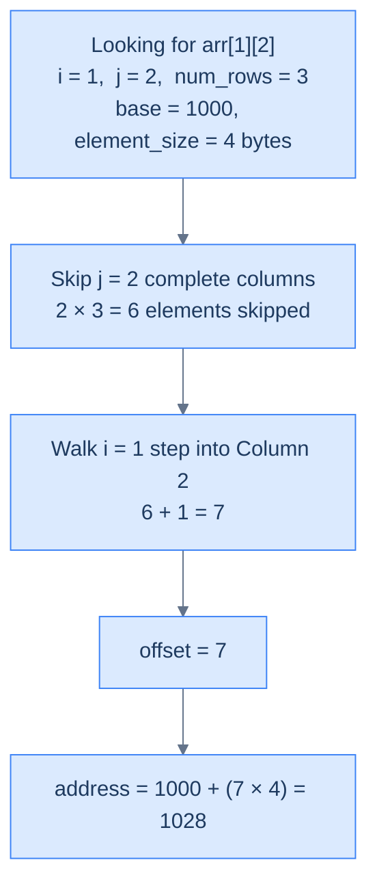

<p align="center"><strong>Calculating the base address of <code>arr[1][2]</code> in column-major order — skip 2 complete columns (6 elements), then step 1 into the current column.</strong></p>

Contrast with row-major for the same element:
```
Row-major offset  = 1 × 4 + 2 = 6   → address 1024
Column-major offset = 2 × 3 + 1 = 7  → address 1028
```

The same logical element `arr[1][2]` lives at **different memory addresses** depending on the storage order. This is why mixing row-major and column-major code (e.g., calling a Fortran library from C) requires explicit transposition.

```python run
# Same arr[1][2] — different addresses depending on storage order.
base = 1000
element_size = 4
num_rows, num_cols = 3, 4

i, j = 1, 2

# Multiplier is the stride in the direction you're skipping.
row_major_offset  = i * num_cols + j      # skip i rows, walk j columns
col_major_offset  = j * num_rows + i      # skip j cols, walk i rows

print(f"arr[{i}][{j}]")
print(f"  Row-major:    offset={row_major_offset}, address={base + row_major_offset * element_size}")
print(f"  Column-major: offset={col_major_offset}, address={base + col_major_offset * element_size}")
```

```java run
public class Main {
    public static void main(String[] args) {
        int base = 1000;
        int elementSize = 4;
        int numRows = 3, numCols = 4;
        int i = 1, j = 2;

        int rowMajorOffset = i * numCols + j;
        int colMajorOffset = j * numRows + i;

        System.out.println("arr[" + i + "][" + j + "]");
        System.out.println("  Row-major:    offset=" + rowMajorOffset
            + ", address=" + (base + rowMajorOffset * elementSize));
        System.out.println("  Column-major: offset=" + colMajorOffset
            + ", address=" + (base + colMajorOffset * elementSize));
    }
}
```

```c run
#include <stdio.h>

int main() {
    int base = 1000, element_size = 4;
    int num_rows = 3, num_cols = 4;
    int i = 1, j = 2;

    int row_major_offset = i * num_cols + j;
    int col_major_offset = j * num_rows + i;

    printf("arr[%d][%d]\n", i, j);
    printf("  Row-major:    offset=%d, address=%d\n",
           row_major_offset, base + row_major_offset * element_size);
    printf("  Column-major: offset=%d, address=%d\n",
           col_major_offset, base + col_major_offset * element_size);
    return 0;
}
```

```cpp run
#include <iostream>

int main() {
    int base = 1000, element_size = 4;
    int num_rows = 3, num_cols = 4;
    int i = 1, j = 2;

    int row_major_offset = i * num_cols + j;
    int col_major_offset = j * num_rows + i;

    std::cout << "arr[" << i << "][" << j << "]\n";
    std::cout << "  Row-major:    offset=" << row_major_offset
              << ", address=" << (base + row_major_offset * element_size) << "\n";
    std::cout << "  Column-major: offset=" << col_major_offset
              << ", address=" << (base + col_major_offset * element_size) << "\n";
}
```

```scala run
object Main extends App {
  val base = 1000
  val elementSize = 4
  val numRows = 3
  val numCols = 4
  val i = 1
  val j = 2

  val rowMajorOffset = i * numCols + j
  val colMajorOffset = j * numRows + i

  println(s"arr($i)($j)")
  println(s"  Row-major:    offset=$rowMajorOffset, address=${base + rowMajorOffset * elementSize}")
  println(s"  Column-major: offset=$colMajorOffset, address=${base + colMajorOffset * elementSize}")
}
```

```javascript run
const base = 1000;
const elementSize = 4;
const numRows = 3, numCols = 4;
const i = 1, j = 2;

const rowMajorOffset = i * numCols + j;
const colMajorOffset = j * numRows + i;

console.log(`arr[${i}][${j}]`);
console.log(`  Row-major:    offset=${rowMajorOffset}, address=${base + rowMajorOffset * elementSize}`);
console.log(`  Column-major: offset=${colMajorOffset}, address=${base + colMajorOffset * elementSize}`);
```

```typescript run
const base: number = 1000;
const elementSize: number = 4;
const numRows: number = 3, numCols: number = 4;
const i: number = 1, j: number = 2;

const rowMajorOffset = i * numCols + j;
const colMajorOffset = j * numRows + i;

console.log(`arr[${i}][${j}]`);
console.log(`  Row-major:    offset=${rowMajorOffset}, address=${base + rowMajorOffset * elementSize}`);
console.log(`  Column-major: offset=${colMajorOffset}, address=${base + colMajorOffset * elementSize}`);
```

```go run
package main

import "fmt"

func main() {
    base := 1000
    elementSize := 4
    numRows, numCols := 3, 4
    i, j := 1, 2

    rowMajorOffset := i*numCols + j
    colMajorOffset := j*numRows + i

    fmt.Printf("arr[%d][%d]\n", i, j)
    fmt.Printf("  Row-major:    offset=%d, address=%d\n",
        rowMajorOffset, base+rowMajorOffset*elementSize)
    fmt.Printf("  Column-major: offset=%d, address=%d\n",
        colMajorOffset, base+colMajorOffset*elementSize)
}
```

```kotlin run
fun main() {
    val base = 1000
    val elementSize = 4
    val numRows = 3
    val numCols = 4
    val i = 1
    val j = 2

    val rowMajorOffset = i * numCols + j
    val colMajorOffset = j * numRows + i

    println("arr[$i][$j]")
    println("  Row-major:    offset=$rowMajorOffset, address=${base + rowMajorOffset * elementSize}")
    println("  Column-major: offset=$colMajorOffset, address=${base + colMajorOffset * elementSize}")
}
```

```rust run
fn main() {
    let base = 1000;
    let element_size = 4;
    let (num_rows, num_cols) = (3, 4);
    let (i, j) = (1, 2);

    let row_major_offset = i * num_cols + j;
    let col_major_offset = j * num_rows + i;

    println!("arr[{}][{}]", i, j);
    println!("  Row-major:    offset={}, address={}",
        row_major_offset, base + row_major_offset * element_size);
    println!("  Column-major: offset={}, address={}",
        col_major_offset, base + col_major_offset * element_size);
}
```


---

## What Breaks If You Mix Them Up?

Imagine you store a 3×4 matrix in column-major order (like MATLAB does), then access it with row-major indexing (like C does):

```
You want arr[0][1] = 20
Row-major formula gives:    offset = 0 × 4 + 1 = 1  → reads 50  ✗  (actually arr[1][0])
Column-major formula gives: offset = 1 × 3 + 0 = 3  → reads 20  ✓
```

The wrong formula silently gives you the **wrong value with no error**. This is one of the most insidious bugs in scientific computing — it doesn't crash, it just produces subtly incorrect results.

---

## Cache Performance: The Column-Major Flip

In the previous lesson you saw that row-major traversal is cache-friendly in row-major languages. Column-major languages (Fortran, MATLAB, Julia) flip this completely:

| Language family | Storage | Cache-friendly loop | Cache-unfriendly loop |
|---|---|---|---|
| C, C++, Python, Java | Row-major | Outer=row, inner=col | Outer=col, inner=row |
| Fortran, MATLAB, Julia | Column-major | Outer=col, inner=row | Outer=row, inner=col |

> **The rule:** always iterate in the direction that matches how the data is stored in memory. The hardware rewards sequential access and punishes random jumps.

---

## Key Takeaways

| Concept | Row-Major | Column-Major |
|---|---|---|
| **Strategy** | Row by row, left to right | Column by column, top to bottom |
| **Index that moves fastest** | D₁ — lowest (column) | Dₙ — highest (row) |
| **2D offset formula** | `i × num_cols + j` | `j × num_rows + i` |
| **Stride** | `num_cols` | `num_rows` |
| **Languages** | C, C++, Python, Java, Go | Fortran, MATLAB, Julia, R |
| **Cache-friendly inner loop** | column index `j` | row index `i` |

Column-major is not better or worse than row-major — it's a different convention with equally sound reasoning. The danger only appears when you assume one and the data is stored in the other.

> **Now let's prove it concretely.** The next section takes the same 3D array we used for the row-major example and serialises it column-major — so you can see, slot for slot, exactly how the addresses shift.

***

# Example of Column Major Order

Now that you understand how column-major order works conceptually, let's make it concrete with the **same 3D array** we used for the row-major example — so you can see exactly how the memory layout differs.

---

## The Array: 2 × 2 × 3 (Same as Before)

| Dimension | Symbol | Size |
|---|---|---|
| Outermost (highest) | D₃ | 2 |
| Middle | D₂ | 2 |
| Innermost (lowest) | D₁ | 3 |

The logical shape hasn't changed — 2 layers, each a 2×3 grid. Only the way it's serialised into memory is different.

```d2
L0: "Layer 0  ── D₃ = 0" {
  R00: "D₂ = 0" {
    grid-columns: 3
    grid-gap: 0
    a: "[0][0][0]"
    b: "[0][0][1]"
    c: "[0][0][2]"
  }
  R01: "D₂ = 1" {
    grid-columns: 3
    grid-gap: 0
    a: "[0][1][0]"
    b: "[0][1][1]"
    c: "[0][1][2]"
  }
}
L1: "Layer 1  ── D₃ = 1" {
  R10: "D₂ = 0" {
    grid-columns: 3
    grid-gap: 0
    a: "[1][0][0]"
    b: "[1][0][1]"
    c: "[1][0][2]"
  }
  R11: "D₂ = 1" {
    grid-columns: 3
    grid-gap: 0
    a: "[1][1][0]"
    b: "[1][1][1]"
    c: "[1][1][2]"
  }
}
```

<p align="center"><strong>Logical representation of the 3D array (D₃=2, D₂=2, D₁=3) — 2 layers, each a 2×3 grid, 12 elements total. The logical shape is identical to the row-major example.</strong></p>

---

## Layout in Memory

This is where column-major and row-major diverge completely.

Column-major rule:

> **The highest dimension (D₃) moves the fastest. The lowest dimension (D₁) moves the slowest.**

Think of it as a counter where the leftmost digit ticks fastest. D₃ sprints through 0→1, then D₂ increments, D₃ resets and sprints again. D₁ only changes when both D₂ and D₃ have completed full cycles.

```mermaid
---
config:
  theme: base
  themeVariables:
    primaryColor: "#dbeafe"
    primaryBorderColor: "#3b82f6"
    primaryTextColor: "#1e3a5f"
    lineColor: "#64748b"
    secondaryColor: "#ede9fe"
    tertiaryColor: "#fef9c3"
---
flowchart LR
  subgraph S0["D₁ = 0  (slowest — changes last)"]
    direction LR
    subgraph S0R0["D₂ = 0"]
      a000["[0][0][0]"] -->|"D₃ ↑"| a100["[1][0][0]"]
    end
    subgraph S0R1["D₂ = 1"]
      a010["[0][1][0]"] -->|"D₃ ↑"| a110["[1][1][0]"]
    end
    a100 -->|"D₂ ↑"| a010
  end
  subgraph S1["D₁ = 1"]
    direction LR
    subgraph S1R0["D₂ = 0"]
      a001["[0][0][1]"] -->|"D₃ ↑"| a101["[1][0][1]"]
    end
    subgraph S1R1["D₂ = 1"]
      a011["[0][1][1]"] -->|"D₃ ↑"| a111["[1][1][1]"]
    end
    a101 -->|"D₂ ↑"| a011
  end
  subgraph S2["D₁ = 2  (slowest — changes last)"]
    direction LR
    subgraph S2R0["D₂ = 0"]
      a002["[0][0][2]"] -->|"D₃ ↑"| a102["[1][0][2]"]
    end
    subgraph S2R1["D₂ = 1"]
      a012["[0][1][2]"] -->|"D₃ ↑"| a112["[1][1][2]"]
    end
    a102 -->|"D₂ ↑"| a012
  end
  a110 -->|"D₁ ↑"| a001
  a111 -->|"D₁ ↑"| a002
```

<p align="center"><strong>The highest dimension D₃ moves the fastest in column-major order — D₃ races 0→1 at every step; D₂ only increments after D₃ overflows; D₁ (lowest) only increments last of all.</strong></p>

The full serialisation order for our 2×2×3 array:

```
[0][0][0] → [1][0][0] → [0][1][0] → [1][1][0] →
[0][0][1] → [1][0][1] → [0][1][1] → [1][1][1] →
[0][0][2] → [1][0][2] → [0][1][2] → [1][1][2]
```

Compare this to row-major (where D₁ moved fastest):
```
[0][0][0] → [0][0][1] → [0][0][2] → [0][1][0] → ... ← row-major
[0][0][0] → [1][0][0] → [0][1][0] → [1][1][0] → ... ← column-major
```

The same 12 elements — entirely different order.

---

## Structure in Memory

With `base_address = 2` and `element_size = 4` bytes (integers), here is the column-major physical layout:

```d2
mem: {
  grid-rows: 4
  grid-columns: 6
  grid-gap: 0
  i0: "[0][0][0]"
  i1: "[1][0][0]"
  i2: "[0][1][0]"
  i3: "[1][1][0]"
  i4: "[0][0][1]"
  i5: "[1][0][1]"
  a0: "addr 2"
  a1: "addr 6"
  a2: "addr 10"
  a3: "addr 14"
  a4: "addr 18"
  a5: "addr 22"
  i6: "[0][1][1]"
  i7: "[1][1][1]"
  i8: "[0][0][2]"
  i9: "[1][0][2]"
  i10: "[0][1][2]"
  i11: "[1][1][2]"
  a6: "addr 26"
  a7: "addr 30"
  a8: "addr 34"
  a9: "addr 38"
  a10: "addr 42"
  a11: "addr 46"
}
```

<p align="center"><strong>Column-major layout in memory — base address 2, element size 4 bytes. Adjacent slots differ only in their D₃ index (0↔1 flip in every neighbouring pair) — that's the signature of D₃ moving fastest.</strong></p>

Notice how adjacent slots in memory always differ only in their D₃ index (0 or 1). That's the signature of D₃ moving fastest.

```python run
# Column-major offsets + addresses for a 2 x 2 x 3 array.
base = 2
element_size = 4
D3, D2, D1 = 2, 2, 3

print(f"{'Index':<16} {'Offset':>6} {'Address':>8}")
print("-" * 32)

# Loop nesting flipped vs row-major: D1 slowest (outer), D3 fastest (inner).
for i1 in range(D1):
    for i2 in range(D2):
        for i3 in range(D3):
            offset  = i1 * (D2 * D3) + i2 * D3 + i3
            address = base + offset * element_size
            print(f"[{i3}][{i2}][{i1}]          {offset:>6}    {address:>6}")
```

```java run
public class Main {
    public static void main(String[] args) {
        int base = 2, elementSize = 4;
        int D3 = 2, D2 = 2, D1 = 3;

        System.out.printf("%-16s %6s %8s%n", "Index", "Offset", "Address");
        System.out.println("--------------------------------");
        for (int i1 = 0; i1 < D1; i1++) {
            for (int i2 = 0; i2 < D2; i2++) {
                for (int i3 = 0; i3 < D3; i3++) {
                    int offset  = i1 * (D2 * D3) + i2 * D3 + i3;
                    int address = base + offset * elementSize;
                    System.out.printf("[%d][%d][%d]          %6d    %6d%n", i3, i2, i1, offset, address);
                }
            }
        }
    }
}
```

```c run
#include <stdio.h>

int main() {
    int base = 2, element_size = 4;
    int D3 = 2, D2 = 2, D1 = 3;

    printf("%-16s %6s %8s\n", "Index", "Offset", "Address");
    printf("--------------------------------\n");
    for (int i1 = 0; i1 < D1; i1++) {
        for (int i2 = 0; i2 < D2; i2++) {
            for (int i3 = 0; i3 < D3; i3++) {
                int offset  = i1 * (D2 * D3) + i2 * D3 + i3;
                int address = base + offset * element_size;
                printf("[%d][%d][%d]          %6d    %6d\n", i3, i2, i1, offset, address);
            }
        }
    }
    return 0;
}
```

```cpp run
#include <cstdio>

int main() {
    int base = 2, element_size = 4;
    int D3 = 2, D2 = 2, D1 = 3;

    std::printf("%-16s %6s %8s\n", "Index", "Offset", "Address");
    std::printf("--------------------------------\n");
    for (int i1 = 0; i1 < D1; i1++) {
        for (int i2 = 0; i2 < D2; i2++) {
            for (int i3 = 0; i3 < D3; i3++) {
                int offset  = i1 * (D2 * D3) + i2 * D3 + i3;
                int address = base + offset * element_size;
                std::printf("[%d][%d][%d]          %6d    %6d\n", i3, i2, i1, offset, address);
            }
        }
    }
}
```

```scala run
object Main extends App {
  val base = 2
  val elementSize = 4
  val D3 = 2; val D2 = 2; val D1 = 3

  println(f"${"Index"}%-16s ${"Offset"}%6s ${"Address"}%8s")
  println("-" * 32)
  for (i1 <- 0 until D1; i2 <- 0 until D2; i3 <- 0 until D3) {
    val offset  = i1 * (D2 * D3) + i2 * D3 + i3
    val address = base + offset * elementSize
    println(f"[$i3][$i2][$i1]          $offset%6d    $address%6d")
  }
}
```

```javascript run
const base = 2, elementSize = 4;
const [D3, D2, D1] = [2, 2, 3];

console.log("Index            Offset  Address");
console.log("--------------------------------");
for (let i1 = 0; i1 < D1; i1++) {
    for (let i2 = 0; i2 < D2; i2++) {
        for (let i3 = 0; i3 < D3; i3++) {
            const offset  = i1 * (D2 * D3) + i2 * D3 + i3;
            const address = base + offset * elementSize;
            console.log(`[${i3}][${i2}][${i1}]          ${String(offset).padStart(6)}    ${String(address).padStart(6)}`);
        }
    }
}
```

```typescript run
const base: number = 2, elementSize: number = 4;
const [D3, D2, D1]: [number, number, number] = [2, 2, 3];

console.log("Index            Offset  Address");
console.log("--------------------------------");
for (let i1 = 0; i1 < D1; i1++) {
    for (let i2 = 0; i2 < D2; i2++) {
        for (let i3 = 0; i3 < D3; i3++) {
            const offset  = i1 * (D2 * D3) + i2 * D3 + i3;
            const address = base + offset * elementSize;
            console.log(`[${i3}][${i2}][${i1}]          ${String(offset).padStart(6)}    ${String(address).padStart(6)}`);
        }
    }
}
```

```go run
package main

import "fmt"

func main() {
    base, elementSize := 2, 4
    D3, D2, D1 := 2, 2, 3

    fmt.Printf("%-16s %6s %8s\n", "Index", "Offset", "Address")
    fmt.Println("--------------------------------")
    for i1 := 0; i1 < D1; i1++ {
        for i2 := 0; i2 < D2; i2++ {
            for i3 := 0; i3 < D3; i3++ {
                offset  := i1*(D2*D3) + i2*D3 + i3
                address := base + offset*elementSize
                fmt.Printf("[%d][%d][%d]          %6d    %6d\n", i3, i2, i1, offset, address)
            }
        }
    }
}
```

```kotlin run
fun main() {
    val base = 2
    val elementSize = 4
    val D3 = 2; val D2 = 2; val D1 = 3

    println("%-16s %6s %8s".format("Index", "Offset", "Address"))
    println("--------------------------------")
    for (i1 in 0 until D1) {
        for (i2 in 0 until D2) {
            for (i3 in 0 until D3) {
                val offset  = i1 * (D2 * D3) + i2 * D3 + i3
                val address = base + offset * elementSize
                println("[$i3][$i2][$i1]          %6d    %6d".format(offset, address))
            }
        }
    }
}
```

```rust run
fn main() {
    let base = 2;
    let element_size = 4;
    let (d3, d2, d1) = (2, 2, 3);

    println!("{:<16} {:>6} {:>8}", "Index", "Offset", "Address");
    println!("--------------------------------");
    for i1 in 0..d1 {
        for i2 in 0..d2 {
            for i3 in 0..d3 {
                let offset  = i1 * (d2 * d3) + i2 * d3 + i3;
                let address = base + offset * element_size;
                println!("[{}][{}][{}]          {:>6}    {:>6}", i3, i2, i1, offset, address);
            }
        }
    }
}
```


---

## Calculating the Address of Elements

For an N-dimensional array in column-major order, the offset formula is the mirror image of row-major:

```
offset  = I₁ × (D₂ × D₃ × ... × Dₙ)
        + I₂ × (D₃ × ... × Dₙ)
        + ...
        + Iₙ₋₁ × Dₙ
        + Iₙ

address = base + offset × element_size
```

For our 3D array (Dₙ = D₃, D₂, D₁):

```
offset = I₁ × (D₂ × D₃)  +  I₂ × D₃  +  I₃
```

Let's compute both elements from the problem statement:

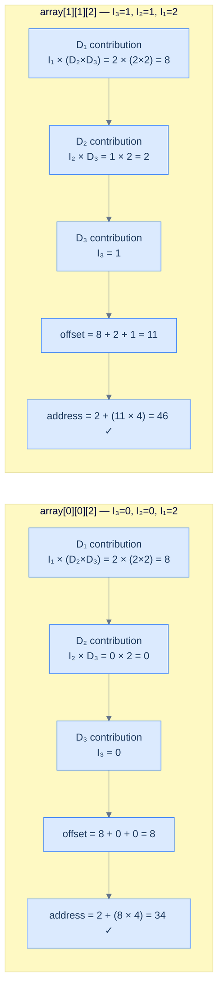

<p align="center"><strong>Calculating the base address for <code>array[0][0][2]</code> (offset 8, address 34) and <code>array[1][1][2]</code> (offset 11, address 46) using the column-major subscript operator formula.</strong></p>

Cross-check against the memory layout: `array[0][0][2]` is at position 8 → address **34** ✓. `array[1][1][2]` is the last element at position 11 → address **46** ✓.

Now compare these offsets with the row-major results from the previous chapter:

| Element | Row-major offset | Column-major offset |
|---|---|---|
| `array[0][0][2]` | 2 | 8 |
| `array[1][1][2]` | 11 | 11 |

`array[1][1][2]` lands at offset 11 in *both* orderings — because it's the last element regardless of how you count. `array[0][0][2]`, however, is at offset 2 in row-major (early) but offset 8 in column-major (late). The storage order completely reshuffles the positions.

```python run
# Same (i3, i2, i1), two orderings → typically two offsets.
D3, D2, D1 = 2, 2, 3

def row_major_offset(i3, i2, i1):
    return i3 * (D2 * D1) + i2 * D1 + i1

def col_major_offset(i3, i2, i1):
    return i1 * (D2 * D3) + i2 * D3 + i3

for elem in [(0, 0, 2), (1, 1, 2)]:
    i3, i2, i1 = elem
    rm = row_major_offset(i3, i2, i1)
    cm = col_major_offset(i3, i2, i1)
    print(f"array[{i3}][{i2}][{i1}]: row-major offset={rm}, col-major offset={cm}")
```

```java run
public class Main {
    static final int D3 = 2, D2 = 2, D1 = 3;

    static int rowMajorOffset(int i3, int i2, int i1) {
        return i3 * (D2 * D1) + i2 * D1 + i1;
    }
    static int colMajorOffset(int i3, int i2, int i1) {
        return i1 * (D2 * D3) + i2 * D3 + i3;
    }

    public static void main(String[] args) {
        int[][] coords = {{0,0,2}, {1,1,2}};
        for (int[] c : coords) {
            int i3 = c[0], i2 = c[1], i1 = c[2];
            System.out.println("array[" + i3 + "][" + i2 + "][" + i1 + "]: row-major offset="
                + rowMajorOffset(i3, i2, i1) + ", col-major offset=" + colMajorOffset(i3, i2, i1));
        }
    }
}
```

```c run
#include <stdio.h>

#define D3 2
#define D2 2
#define D1 3

int row_major_offset(int i3, int i2, int i1) { return i3 * (D2 * D1) + i2 * D1 + i1; }
int col_major_offset(int i3, int i2, int i1) { return i1 * (D2 * D3) + i2 * D3 + i3; }

int main() {
    int coords[2][3] = {{0,0,2}, {1,1,2}};
    for (int k = 0; k < 2; k++) {
        int i3 = coords[k][0], i2 = coords[k][1], i1 = coords[k][2];
        printf("array[%d][%d][%d]: row-major offset=%d, col-major offset=%d\n",
            i3, i2, i1, row_major_offset(i3, i2, i1), col_major_offset(i3, i2, i1));
    }
    return 0;
}
```

```cpp run
#include <iostream>

constexpr int D3 = 2, D2 = 2, D1 = 3;

int row_major_offset(int i3, int i2, int i1) { return i3 * (D2 * D1) + i2 * D1 + i1; }
int col_major_offset(int i3, int i2, int i1) { return i1 * (D2 * D3) + i2 * D3 + i3; }

int main() {
    int coords[2][3] = {{0,0,2}, {1,1,2}};
    for (auto& c : coords) {
        int i3 = c[0], i2 = c[1], i1 = c[2];
        std::cout << "array[" << i3 << "][" << i2 << "][" << i1
                  << "]: row-major offset=" << row_major_offset(i3, i2, i1)
                  << ", col-major offset=" << col_major_offset(i3, i2, i1) << "\n";
    }
}
```

```scala run
object Main extends App {
  val D3 = 2; val D2 = 2; val D1 = 3
  def rowMajor(i3: Int, i2: Int, i1: Int) = i3 * (D2 * D1) + i2 * D1 + i1
  def colMajor(i3: Int, i2: Int, i1: Int) = i1 * (D2 * D3) + i2 * D3 + i3

  for ((i3, i2, i1) <- Seq((0,0,2), (1,1,2))) {
    println(s"array($i3)($i2)($i1): row-major offset=${rowMajor(i3,i2,i1)}, col-major offset=${colMajor(i3,i2,i1)}")
  }
}
```

```javascript run
const [D3, D2, D1] = [2, 2, 3];
const rowMajor = (i3, i2, i1) => i3 * (D2 * D1) + i2 * D1 + i1;
const colMajor = (i3, i2, i1) => i1 * (D2 * D3) + i2 * D3 + i3;

for (const [i3, i2, i1] of [[0,0,2], [1,1,2]]) {
    console.log(`array[${i3}][${i2}][${i1}]: row-major offset=${rowMajor(i3,i2,i1)}, col-major offset=${colMajor(i3,i2,i1)}`);
}
```

```typescript run
const [D3, D2, D1]: [number, number, number] = [2, 2, 3];
const rowMajor = (i3: number, i2: number, i1: number): number => i3 * (D2 * D1) + i2 * D1 + i1;
const colMajor = (i3: number, i2: number, i1: number): number => i1 * (D2 * D3) + i2 * D3 + i3;

for (const [i3, i2, i1] of [[0,0,2], [1,1,2]]) {
    console.log(`array[${i3}][${i2}][${i1}]: row-major offset=${rowMajor(i3,i2,i1)}, col-major offset=${colMajor(i3,i2,i1)}`);
}
```

```go run
package main

import "fmt"

const D3 = 2
const D2 = 2
const D1 = 3

func rowMajor(i3, i2, i1 int) int { return i3*(D2*D1) + i2*D1 + i1 }
func colMajor(i3, i2, i1 int) int { return i1*(D2*D3) + i2*D3 + i3 }

func main() {
    for _, c := range [][3]int{{0,0,2}, {1,1,2}} {
        i3, i2, i1 := c[0], c[1], c[2]
        fmt.Printf("array[%d][%d][%d]: row-major offset=%d, col-major offset=%d\n",
            i3, i2, i1, rowMajor(i3,i2,i1), colMajor(i3,i2,i1))
    }
}
```

```kotlin run
const val D3 = 2
const val D2 = 2
const val D1 = 3

fun rowMajor(i3: Int, i2: Int, i1: Int) = i3 * (D2 * D1) + i2 * D1 + i1
fun colMajor(i3: Int, i2: Int, i1: Int) = i1 * (D2 * D3) + i2 * D3 + i3

fun main() {
    for ((i3, i2, i1) in listOf(Triple(0,0,2), Triple(1,1,2))) {
        println("array[$i3][$i2][$i1]: row-major offset=${rowMajor(i3,i2,i1)}, col-major offset=${colMajor(i3,i2,i1)}")
    }
}
```

```rust run
const D3: i32 = 2;
const D2: i32 = 2;
const D1: i32 = 3;

fn row_major(i3: i32, i2: i32, i1: i32) -> i32 { i3 * (D2 * D1) + i2 * D1 + i1 }
fn col_major(i3: i32, i2: i32, i1: i32) -> i32 { i1 * (D2 * D3) + i2 * D3 + i3 }

fn main() {
    for &(i3, i2, i1) in &[(0,0,2), (1,1,2)] {
        println!("array[{}][{}][{}]: row-major offset={}, col-major offset={}",
            i3, i2, i1, row_major(i3,i2,i1), col_major(i3,i2,i1));
    }
}
```


---

## Dereferencing the Value

Once the address is resolved, the final step — dereferencing — is identical in both orderings. The language reads `element_size` bytes from the resolved address and interprets them as the stored type.

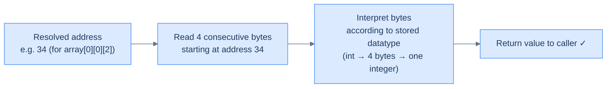

<p align="center"><strong>Dereferencing is storage-order agnostic — once the address is known, the language reads <code>element_size</code> bytes from that point and interprets them as the declared type, regardless of whether the array is row-major or column-major.</strong></p>

The subscript operator hides all of this arithmetic. When you write `array[i3][i2][i1]`, the language silently:
1. Applies the correct formula (row-major or column-major) for its storage convention
2. Multiplies the offset by `element_size`
3. Reads `element_size` bytes from the resulting address
4. Returns the interpreted value

As a programmer, you write `array[i][j]` the same way for both orderings — but the bytes your CPU reads are in completely different positions.

---

## Key Takeaways

- Column-major serialises the same 3D array in a completely different order to row-major
- **D₃ (highest) moves fastest; D₁ (lowest) moves slowest** — the exact reverse of row-major
- The 3D column-major formula: `base + (I₁ × D₂ × D₃  +  I₂ × D₃  +  I₃) × element_size`
- Dereferencing (reading the value) is identical regardless of storage order — only the address differs
- Mixing row-major and column-major conventions silently produces wrong values — never wrong addresses

> **One last thing to nail down.** Row-major traversal was outer-row, inner-column. Flipping the storage order flips the cache-friendly loop too — and the change in code is exactly *one* swap. The next section makes that swap, and shows what it costs you in a row-major language like Python.

***

# Column Major Traversal

## The Problem

Given a 2D matrix, collect all of its elements in **column-major order** — top to bottom within each column, one column at a time — and return them as a flat list.

```
Input:  matrix = [[1, 2, 3],
                  [4, 5, 6],
                  [7, 8, 9]]

Output: [1, 4, 7, 2, 5, 8, 3, 6, 9]
```

This is the mirror of row-major traversal. Instead of racing across rows, you race down columns.

---

## Examples

**Example 1 — 3×3 matrix**

```
Input:  [[1, 2, 3], [4, 5, 6], [7, 8, 9]]
Output: [1, 4, 7, 2, 5, 8, 3, 6, 9]
```

**Example 2 — 2×4 matrix**

```
Input:  [[3, 2, 1, 7], [0, 6, 3, 2]]
Output: [3, 0, 2, 6, 1, 3, 7, 2]
```

**Example 3 — 1×1 matrix (edge case)**

```
Input:  [[1]]
Output: [1]
```

---

## Intuition

In row-major traversal, the column index (`j`) was in the inner loop — it moved fastest. Here we flip that completely:

> **Outer loop = columns (slow). Inner loop = rows (fast).**

The outer loop picks a column. The inner loop walks from the top of that column to the bottom, collecting every element. Then the outer loop advances to the next column.

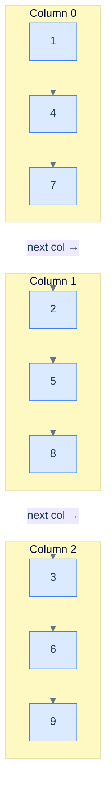

<p align="center"><strong>Column-major traversal of a 3×3 matrix — drain each column top to bottom before moving to the next column.</strong></p>

Visit order annotated directly on the grid:

```d2
grid: {
  grid-rows: 6
  grid-columns: 3
  grid-gap: 0
  v00: "1"
  v01: "2"
  v02: "3"
  o00: "1st"
  o01: "4th"
  o02: "7th"
  v10: "4"
  v11: "5"
  v12: "6"
  o10: "2nd"
  o11: "5th"
  o12: "8th"
  v20: "7"
  v21: "8"
  v22: "9"
  o20: "3rd"
  o21: "6th"
  o22: "9th"
}
```

<p align="center"><strong>Visit order in column-major traversal — each value sits directly above its visit-order label. The column index changes once every 3 visits; the row index changes on every visit.</strong></p>

The collected output:

```d2
out: {
  grid-columns: 9
  grid-gap: 0
  a: "1"
  b: "4"
  c: "7"
  d: "2"
  e: "5"
  f: "8"
  g: "3"
  h: "6"
  i: "9"
}
```

<p align="center"><strong>Output — all 9 elements in column-major order as a flat list. Compare with row-major: [1, 2, 3, 4, 5, 6, 7, 8, 9].</strong></p>

---

## The Approach

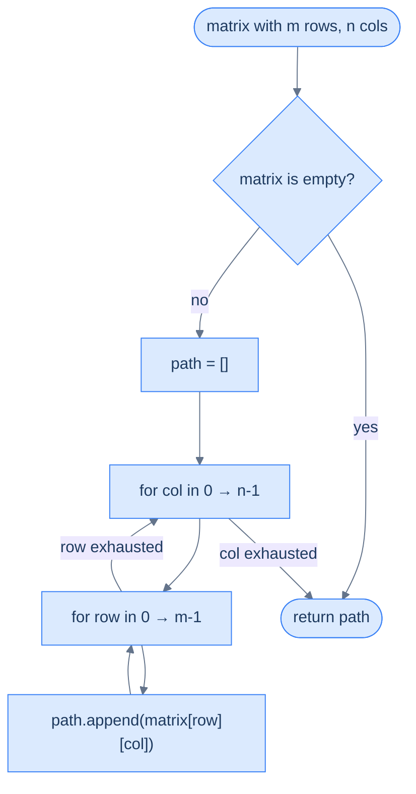

<p align="center"><strong>Algorithm flow — the inner loop exhausts all rows in the current column before the outer loop advances to the next column.</strong></p>

The one critical change vs. row-major: **`col` is the outer loop variable, `row` is the inner loop variable**. Swap those two and you go from column-major to row-major.

---

## Solution

```python run
from typing import List

class Solution:
    def column_major_traversal(self, matrix: List[List[int]]) -> List[int]:
        if not matrix:
            return []

        rows: int = len(matrix)
        cols: int = len(matrix[0])
        path: List[int] = []

        # Swap of row-major: cols outer (slow), rows inner (fast).
        for col in range(cols):
            for row in range(rows):
                path.append(matrix[row][col])
        return path


s = Solution()
print("Example 1:", s.column_major_traversal([[1,2,3],[4,5,6],[7,8,9]]))
print("Example 2:", s.column_major_traversal([[3,2,1,7],[0,6,3,2]]))
print("Example 3:", s.column_major_traversal([[1]]))
print("Empty:    ", s.column_major_traversal([]))
```

```java run
import java.util.*;

public class Main {
    static List<Integer> columnMajorTraversal(int[][] matrix) {
        List<Integer> path = new ArrayList<>();
        if (matrix.length == 0) return path;
        int rows = matrix.length, cols = matrix[0].length;
        for (int col = 0; col < cols; col++) {
            for (int row = 0; row < rows; row++) {
                path.add(matrix[row][col]);
            }
        }
        return path;
    }

    public static void main(String[] args) {
        System.out.println("Example 1: " + columnMajorTraversal(new int[][]{{1,2,3},{4,5,6},{7,8,9}}));
        System.out.println("Example 2: " + columnMajorTraversal(new int[][]{{3,2,1,7},{0,6,3,2}}));
        System.out.println("Example 3: " + columnMajorTraversal(new int[][]{{1}}));
        System.out.println("Empty:     " + columnMajorTraversal(new int[][]{}));
    }
}
```

```c run
#include <stdio.h>

void column_major_traversal(int rows, int cols, int matrix[rows][cols]) {
    /* cols outer (slow), rows inner (fast). */
    for (int col = 0; col < cols; col++) {
        for (int row = 0; row < rows; row++) {
            printf("%d ", matrix[row][col]);
        }
    }
    printf("\n");
}

int main() {
    int m1[3][3] = {{1,2,3},{4,5,6},{7,8,9}};
    int m2[2][4] = {{3,2,1,7},{0,6,3,2}};
    int m3[1][1] = {{1}};

    printf("Example 1: "); column_major_traversal(3, 3, m1);
    printf("Example 2: "); column_major_traversal(2, 4, m2);
    printf("Example 3: "); column_major_traversal(1, 1, m3);
    return 0;
}
```

```cpp run
#include <iostream>
#include <vector>

std::vector<int> column_major_traversal(const std::vector<std::vector<int>>& matrix) {
    std::vector<int> path;
    if (matrix.empty()) return path;
    int rows = matrix.size(), cols = matrix[0].size();
    for (int col = 0; col < cols; col++) {
        for (int row = 0; row < rows; row++) {
            path.push_back(matrix[row][col]);
        }
    }
    return path;
}

int main() {
    auto print = [](const std::vector<int>& v) {
        std::cout << "[";
        for (size_t i = 0; i < v.size(); i++) std::cout << v[i] << (i + 1 < v.size() ? ", " : "");
        std::cout << "]\n";
    };
    print(column_major_traversal({{1,2,3},{4,5,6},{7,8,9}}));
    print(column_major_traversal({{3,2,1,7},{0,6,3,2}}));
    print(column_major_traversal({{1}}));
    print(column_major_traversal({}));
}
```

```scala run
object Main extends App {
  def columnMajorTraversal(matrix: Array[Array[Int]]): List[Int] = {
    if (matrix.isEmpty) return Nil
    val rows = matrix.length
    val cols = matrix(0).length
    val buf = scala.collection.mutable.ListBuffer.empty[Int]
    for (col <- 0 until cols; row <- 0 until rows) buf += matrix(row)(col)
    buf.toList
  }

  println("Example 1: " + columnMajorTraversal(Array(Array(1,2,3), Array(4,5,6), Array(7,8,9))))
  println("Example 2: " + columnMajorTraversal(Array(Array(3,2,1,7), Array(0,6,3,2))))
  println("Example 3: " + columnMajorTraversal(Array(Array(1))))
  println("Empty:     " + columnMajorTraversal(Array.empty[Array[Int]]))
}
```

```javascript run
function columnMajorTraversal(matrix) {
    const path = [];
    if (!matrix.length) return path;
    const rows = matrix.length, cols = matrix[0].length;
    for (let col = 0; col < cols; col++) {
        for (let row = 0; row < rows; row++) {
            path.push(matrix[row][col]);
        }
    }
    return path;
}

console.log("Example 1:", columnMajorTraversal([[1,2,3],[4,5,6],[7,8,9]]));
console.log("Example 2:", columnMajorTraversal([[3,2,1,7],[0,6,3,2]]));
console.log("Example 3:", columnMajorTraversal([[1]]));
console.log("Empty:    ", columnMajorTraversal([]));
```

```typescript run
function columnMajorTraversal(matrix: number[][]): number[] {
    const path: number[] = [];
    if (!matrix.length) return path;
    const rows = matrix.length, cols = matrix[0].length;
    for (let col = 0; col < cols; col++) {
        for (let row = 0; row < rows; row++) {
            path.push(matrix[row][col]);
        }
    }
    return path;
}

console.log("Example 1:", columnMajorTraversal([[1,2,3],[4,5,6],[7,8,9]]));
console.log("Example 2:", columnMajorTraversal([[3,2,1,7],[0,6,3,2]]));
console.log("Example 3:", columnMajorTraversal([[1]]));
console.log("Empty:    ", columnMajorTraversal([]));
```

```go run
package main

import "fmt"

func columnMajorTraversal(matrix [][]int) []int {
    path := []int{}
    if len(matrix) == 0 {
        return path
    }
    rows, cols := len(matrix), len(matrix[0])
    for col := 0; col < cols; col++ {
        for row := 0; row < rows; row++ {
            path = append(path, matrix[row][col])
        }
    }
    return path
}

func main() {
    fmt.Println("Example 1:", columnMajorTraversal([][]int{{1,2,3},{4,5,6},{7,8,9}}))
    fmt.Println("Example 2:", columnMajorTraversal([][]int{{3,2,1,7},{0,6,3,2}}))
    fmt.Println("Example 3:", columnMajorTraversal([][]int{{1}}))
    fmt.Println("Empty:    ", columnMajorTraversal([][]int{}))
}
```

```kotlin run
fun columnMajorTraversal(matrix: Array<IntArray>): List<Int> {
    if (matrix.isEmpty()) return emptyList()
    val rows = matrix.size
    val cols = matrix[0].size
    val path = mutableListOf<Int>()
    for (col in 0 until cols) {
        for (row in 0 until rows) {
            path.add(matrix[row][col])
        }
    }
    return path
}

fun main() {
    println("Example 1: " + columnMajorTraversal(arrayOf(intArrayOf(1,2,3), intArrayOf(4,5,6), intArrayOf(7,8,9))))
    println("Example 2: " + columnMajorTraversal(arrayOf(intArrayOf(3,2,1,7), intArrayOf(0,6,3,2))))
    println("Example 3: " + columnMajorTraversal(arrayOf(intArrayOf(1))))
    println("Empty:     " + columnMajorTraversal(emptyArray()))
}
```

```rust run
fn column_major_traversal(matrix: &[Vec<i32>]) -> Vec<i32> {
    let mut path = Vec::new();
    if matrix.is_empty() { return path; }
    let rows = matrix.len();
    let cols = matrix[0].len();
    for col in 0..cols {
        for row in 0..rows {
            path.push(matrix[row][col]);
        }
    }
    path
}

fn main() {
    println!("Example 1: {:?}", column_major_traversal(&vec![vec![1,2,3], vec![4,5,6], vec![7,8,9]]));
    println!("Example 2: {:?}", column_major_traversal(&vec![vec![3,2,1,7], vec![0,6,3,2]]));
    println!("Example 3: {:?}", column_major_traversal(&vec![vec![1]]));
    println!("Empty:     {:?}", column_major_traversal(&Vec::<Vec<i32>>::new()));
}
```


---

## Dry Run — Example 2

> *Before reading the trace — same matrix as the row-major dry run, `[[3, 2, 1, 7], [0, 6, 3, 2]]`. With the loops swapped (col outer, row inner), what's the new output? Eight elements, predict the order.*

Trace through `[[3, 2, 1, 7], [0, 6, 3, 2]]`:

`rows = 2`, `cols = 4`, `path = []`

| Step | `col` | `row` | Element appended | `path` so far |
|---|---|---|---|---|
| 1 | 0 | 0 | 3 | `[3]` |
| 2 | 0 | 1 | 0 | `[3, 0]` |
| 3 | 1 | 0 | 2 | `[3, 0, 2]` |
| 4 | 1 | 1 | 6 | `[3, 0, 2, 6]` |
| 5 | 2 | 0 | 1 | `[3, 0, 2, 6, 1]` |
| 6 | 2 | 1 | 3 | `[3, 0, 2, 6, 1, 3]` |
| 7 | 3 | 0 | 7 | `[3, 0, 2, 6, 1, 3, 7]` |
| 8 | 3 | 1 | 2 | `[3, 0, 2, 6, 1, 3, 7, 2]` |

**Return:** `[3, 0, 2, 6, 1, 3, 7, 2]` ✓

---

## Row-Major vs Column-Major — The Full Comparison

```python run
# Same matrix, same indexing — only the loop order differs.
matrix = [[1, 2, 3], [4, 5, 6], [7, 8, 9]]
rows = len(matrix)
cols = len(matrix[0])

# Leftmost `for` in a comprehension = outer loop.
row_major = [matrix[r][c] for r in range(rows) for c in range(cols)]  # r outer (slow)
col_major = [matrix[r][c] for c in range(cols) for r in range(rows)]  # c outer (slow)

print("Row-major:    ", row_major)   # [1, 2, 3, 4, 5, 6, 7, 8, 9]
print("Column-major: ", col_major)   # [1, 4, 7, 2, 5, 8, 3, 6, 9]
```

```java run
import java.util.*;

public class Main {
    public static void main(String[] args) {
        int[][] matrix = {{1,2,3},{4,5,6},{7,8,9}};
        int rows = matrix.length, cols = matrix[0].length;

        List<Integer> rowMajor = new ArrayList<>();
        for (int r = 0; r < rows; r++)
            for (int c = 0; c < cols; c++)
                rowMajor.add(matrix[r][c]);

        List<Integer> colMajor = new ArrayList<>();
        for (int c = 0; c < cols; c++)
            for (int r = 0; r < rows; r++)
                colMajor.add(matrix[r][c]);

        System.out.println("Row-major:    " + rowMajor);
        System.out.println("Column-major: " + colMajor);
    }
}
```

```c run
#include <stdio.h>

int main() {
    int matrix[3][3] = {{1,2,3},{4,5,6},{7,8,9}};
    int rows = 3, cols = 3;

    printf("Row-major:    ");
    for (int r = 0; r < rows; r++)
        for (int c = 0; c < cols; c++) printf("%d ", matrix[r][c]);
    printf("\n");

    printf("Column-major: ");
    for (int c = 0; c < cols; c++)
        for (int r = 0; r < rows; r++) printf("%d ", matrix[r][c]);
    printf("\n");
    return 0;
}
```

```cpp run
#include <iostream>
#include <vector>

int main() {
    std::vector<std::vector<int>> matrix = {{1,2,3},{4,5,6},{7,8,9}};
    int rows = matrix.size(), cols = matrix[0].size();

    std::cout << "Row-major:    ";
    for (int r = 0; r < rows; r++)
        for (int c = 0; c < cols; c++) std::cout << matrix[r][c] << " ";
    std::cout << "\n";

    std::cout << "Column-major: ";
    for (int c = 0; c < cols; c++)
        for (int r = 0; r < rows; r++) std::cout << matrix[r][c] << " ";
    std::cout << "\n";
}
```

```scala run
object Main extends App {
  val matrix = Array(Array(1,2,3), Array(4,5,6), Array(7,8,9))
  val rows = matrix.length
  val cols = matrix(0).length

  val rowMajor = for (r <- 0 until rows; c <- 0 until cols) yield matrix(r)(c)
  val colMajor = for (c <- 0 until cols; r <- 0 until rows) yield matrix(r)(c)

  println("Row-major:    " + rowMajor.mkString(", "))
  println("Column-major: " + colMajor.mkString(", "))
}
```

```javascript run
const matrix = [[1,2,3],[4,5,6],[7,8,9]];
const rows = matrix.length, cols = matrix[0].length;

const rowMajor = [];
for (let r = 0; r < rows; r++)
    for (let c = 0; c < cols; c++) rowMajor.push(matrix[r][c]);

const colMajor = [];
for (let c = 0; c < cols; c++)
    for (let r = 0; r < rows; r++) colMajor.push(matrix[r][c]);

console.log("Row-major:    ", rowMajor);
console.log("Column-major: ", colMajor);
```

```typescript run
const matrix: number[][] = [[1,2,3],[4,5,6],[7,8,9]];
const rows = matrix.length, cols = matrix[0].length;

const rowMajor: number[] = [];
for (let r = 0; r < rows; r++)
    for (let c = 0; c < cols; c++) rowMajor.push(matrix[r][c]);

const colMajor: number[] = [];
for (let c = 0; c < cols; c++)
    for (let r = 0; r < rows; r++) colMajor.push(matrix[r][c]);

console.log("Row-major:    ", rowMajor);
console.log("Column-major: ", colMajor);
```

```go run
package main

import "fmt"

func main() {
    matrix := [][]int{{1,2,3},{4,5,6},{7,8,9}}
    rows, cols := len(matrix), len(matrix[0])

    rowMajor := []int{}
    for r := 0; r < rows; r++ {
        for c := 0; c < cols; c++ {
            rowMajor = append(rowMajor, matrix[r][c])
        }
    }

    colMajor := []int{}
    for c := 0; c < cols; c++ {
        for r := 0; r < rows; r++ {
            colMajor = append(colMajor, matrix[r][c])
        }
    }

    fmt.Println("Row-major:    ", rowMajor)
    fmt.Println("Column-major: ", colMajor)
}
```

```kotlin run
fun main() {
    val matrix = arrayOf(intArrayOf(1,2,3), intArrayOf(4,5,6), intArrayOf(7,8,9))
    val rows = matrix.size
    val cols = matrix[0].size

    val rowMajor = mutableListOf<Int>()
    for (r in 0 until rows) for (c in 0 until cols) rowMajor.add(matrix[r][c])

    val colMajor = mutableListOf<Int>()
    for (c in 0 until cols) for (r in 0 until rows) colMajor.add(matrix[r][c])

    println("Row-major:    $rowMajor")
    println("Column-major: $colMajor")
}
```

```rust run
fn main() {
    let matrix = [[1,2,3], [4,5,6], [7,8,9]];
    let rows = matrix.len();
    let cols = matrix[0].len();

    let mut row_major = Vec::new();
    for r in 0..rows { for c in 0..cols { row_major.push(matrix[r][c]); } }

    let mut col_major = Vec::new();
    for c in 0..cols { for r in 0..rows { col_major.push(matrix[r][c]); } }

    println!("Row-major:    {:?}", row_major);
    println!("Column-major: {:?}", col_major);
}
```


The entire difference is **one loop swap**. That's all that separates row-major from column-major traversal in code.

---

## Complexity Analysis

**Time complexity: O(m × n)**

Every element is visited exactly once — identical to row-major traversal.

**Space complexity: O(m × n)**

The output list holds all elements. If you're processing without storing, it's O(1) extra space.

> **Cache note:** In Python and other row-major languages, column-major traversal accesses memory with a stride of `num_cols` between consecutive visits. Each step jumps `num_cols` elements forward in memory instead of 1. For large matrices this causes frequent cache misses and is measurably slower than row-major traversal — even though both are O(m × n).

---

## Edge Cases

| Scenario | Input | Output | Note |
|---|---|---|---|
| Empty matrix | `[]` | `[]` | Guard clause returns immediately |
| Single element | `[[5]]` | `[5]` | One col, one row — one iteration |
| Single row | `[[1, 2, 3, 4]]` | `[1, 2, 3, 4]` | Outer runs 4 times, inner runs once — same result as row-major here |
| Single column | `[[1], [2], [3]]` | `[1, 2, 3]` | Outer runs once, inner runs 3 times |

---

## Key Takeaway

Column-major traversal is row-major traversal with the two loop variables swapped: `col` goes outer (slow), `row` goes inner (fast). The algorithm, complexity, and guard clauses are identical — only the access order changes. And in a row-major language like Python, that one swap is enough to turn every access into a cache miss on large matrices.
