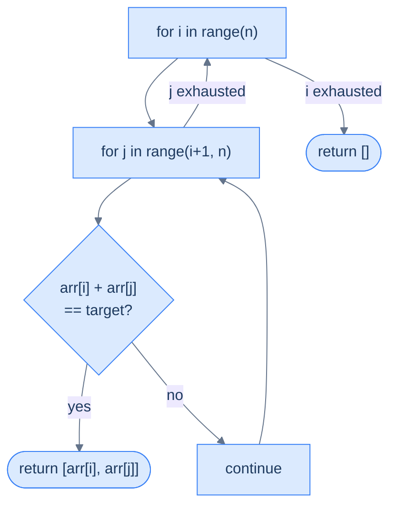
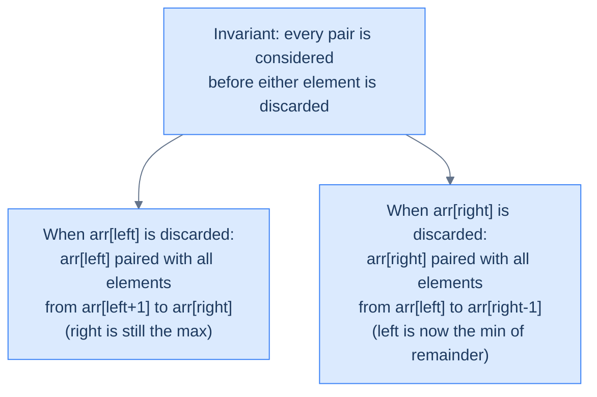
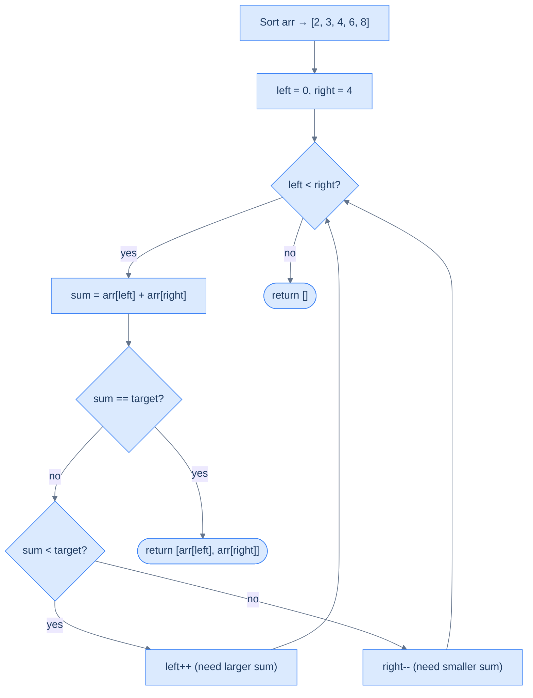
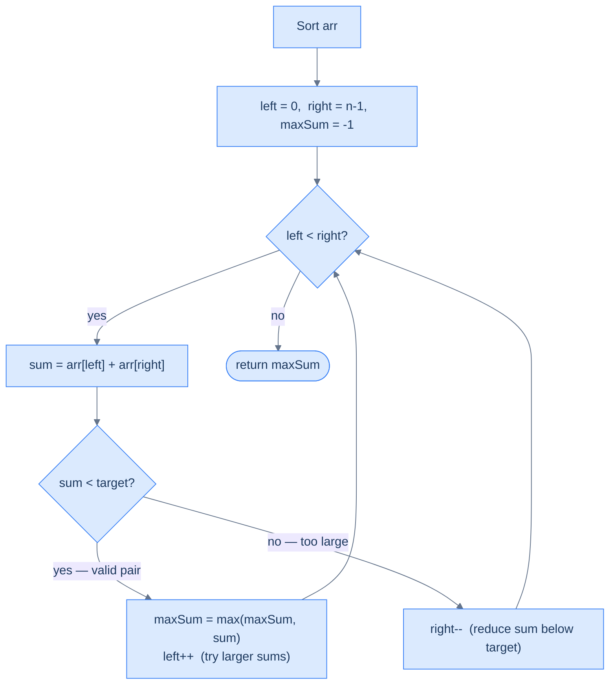
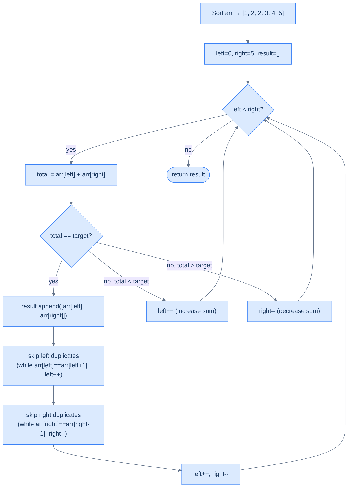
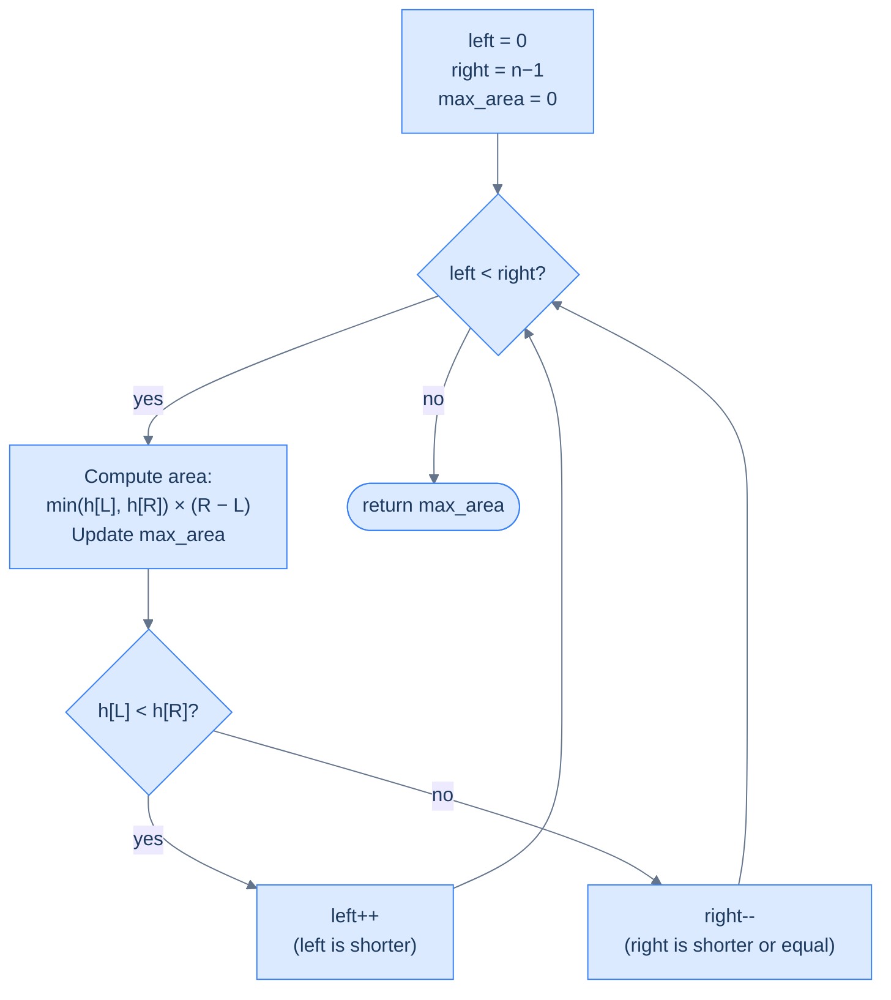
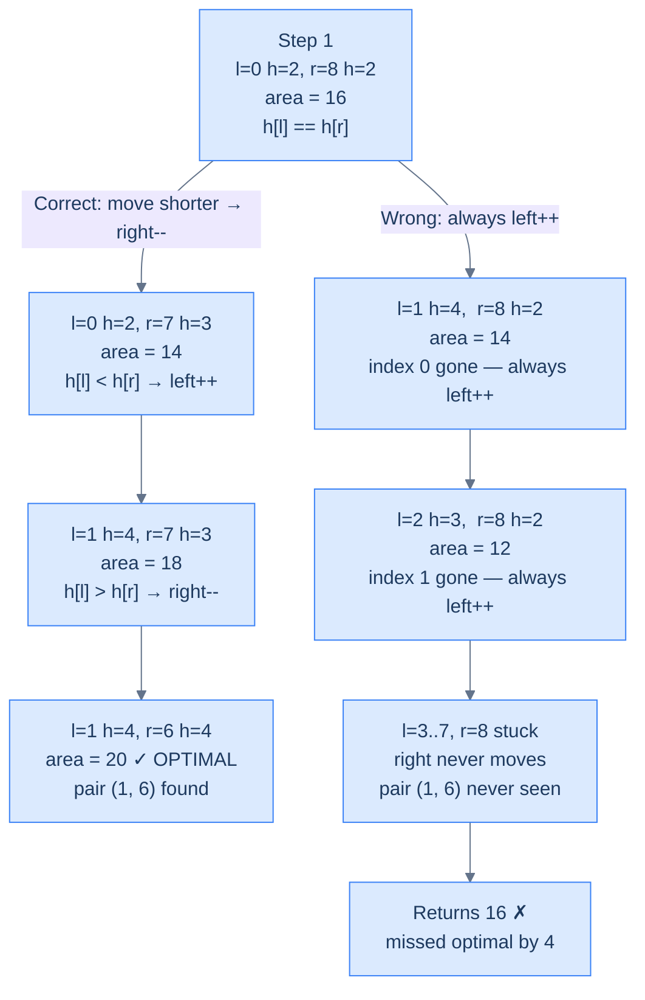

# 4. Pattern: Two pointers (Reduction)

This section focuses on reduction-style two-pointer problems where the search space is narrowed from both ends.

## Table of contents

1. [Identifying two pointer reduction](#identifying-two-pointer-reduction)
2. [Two sum](#two-sum)
3. [Target limited two sum](#target-limited-two-sum)
4. [Duplicate aware two sum](#duplicate-aware-two-sum)
5. [Largest container](#largest-container)

***

# Identifying Two Pointer Reduction

## When Direct Application Isn't Enough

The direct two-pointer technique works perfectly when the problem already fits the template — traverse from both ends, do some work, converge. But some problems don't fit that template in their original form. They need to be **transformed first**.

The key idea: if the problem can be reduced to an equivalent problem that *does* fit the two-pointer template, and the solution to the reduced problem is guaranteed to be the solution to the original — then we're good.

This transformation is called a **reduction**.

---

## The Diagnostic Questions

Before attempting a reduction, run through these four questions:

| Question | What it tests |
|---|---|
| **Q1.** Does the order of items matter? | If no, sorting is allowed — a huge enabler |
| **Q2.** Do we need two items simultaneously? | Two pointers need two active positions |
| **Q3.** Does traversing from both ends give us something special? | On a sorted array, left gives minimum, right gives maximum |
| **Q4.** Can we reduce to a simpler problem and re-ask Q1–Q3? | Chained reductions are possible |

If sorting unlocks Q3 (traversal from both ends becomes meaningful), you almost certainly have a two-pointer reduction problem.

---

## The Example: Two Sum

**Problem:** Given an array `arr` of integers and a target, find two elements whose sum equals the target.

Let's use `arr = [3, 5, 2, 8, 7, 1, 9, 4]`, target = 13.

```d2
direction: right

arr: "arr = [3, 5, 2, 8, 7, 1, 9, 4],  target = 13" {
  grid-columns: 8
  grid-gap: 0
  a0: "3"
  a1: "5" {style.fill: "#fde68a"; style.stroke: "#d97706"}
  a2: "2"
  a3: "8" {style.fill: "#fde68a"; style.stroke: "#d97706"}
  a4: "7"
  a5: "1"
  a6: "9" {style.fill: "#dcfce7"; style.stroke: "#16a34a"}
  a7: "4" {style.fill: "#dcfce7"; style.stroke: "#16a34a"}
}

p1: "5 + 8 = 13" {style.fill: "#fde68a"; style.stroke: "#d97706"}
p2: "4 + 9 = 13" {style.fill: "#dcfce7"; style.stroke: "#16a34a"}

p1 -> arr.a1
p1 -> arr.a3
p2 -> arr.a6
p2 -> arr.a7
```

<p align="center"><strong>Find two numbers with the given sum (13) in the array — pairs (5,8) and (4,9) both qualify.</strong></p>

---

## Brute Force: O(n²)

The naive solution checks every pair with nested loops:



<p align="center"><strong>Brute-force nested loops check every pair — O(n²) time, correct but slow. For n=8 that's 28 pairs checked.</strong></p>

```python run
from typing import List

def two_sum_brute(arr: List[int], target: int) -> List[int]:
    for i in range(len(arr)):
        # Start j at i+1: same-element use is forbidden, and (i,j) ≡ (j,i) — skip duplicates.
        for j in range(i + 1, len(arr)):
            if arr[i] + arr[j] == target:
                return [arr[i], arr[j]]
    return []

print(two_sum_brute([3, 5, 2, 8, 7, 1, 9, 4], 13))  # [5, 8]
```

```java run
import java.util.Arrays;

public class Main {
    static int[] twoSumBrute(int[] arr, int target) {
        for (int i = 0; i < arr.length; i++) {
            for (int j = i + 1; j < arr.length; j++) {
                if (arr[i] + arr[j] == target) {
                    return new int[] { arr[i], arr[j] };
                }
            }
        }
        return new int[0];
    }

    public static void main(String[] args) {
        System.out.println(Arrays.toString(twoSumBrute(new int[]{3,5,2,8,7,1,9,4}, 13)));
    }
}
```

```c run
#include <stdio.h>

void two_sum_brute(int* arr, int n, int target, int* out, int* found) {
    for (int i = 0; i < n; i++) {
        for (int j = i + 1; j < n; j++) {
            if (arr[i] + arr[j] == target) {
                out[0] = arr[i];
                out[1] = arr[j];
                *found = 1;
                return;
            }
        }
    }
    *found = 0;
}

int main() {
    int arr[] = {3, 5, 2, 8, 7, 1, 9, 4};
    int out[2], found = 0;
    two_sum_brute(arr, 8, 13, out, &found);
    if (found) printf("[%d, %d]\n", out[0], out[1]);
    else       printf("[]\n");
    return 0;
}
```

```cpp run
#include <iostream>
#include <vector>

std::vector<int> twoSumBrute(const std::vector<int>& arr, int target) {
    for (size_t i = 0; i < arr.size(); i++) {
        for (size_t j = i + 1; j < arr.size(); j++) {
            if (arr[i] + arr[j] == target) {
                return { arr[i], arr[j] };
            }
        }
    }
    return {};
}

int main() {
    auto r = twoSumBrute({3,5,2,8,7,1,9,4}, 13);
    std::cout << "[";
    for (size_t i = 0; i < r.size(); i++) std::cout << r[i] << (i + 1 < r.size() ? ", " : "");
    std::cout << "]\n";
}
```

```scala run
object Main extends App {
  def twoSumBrute(arr: Array[Int], target: Int): Array[Int] = {
    for (i <- arr.indices; j <- (i + 1) until arr.length) {
      if (arr(i) + arr(j) == target) return Array(arr(i), arr(j))
    }
    Array.empty[Int]
  }

  println(twoSumBrute(Array(3,5,2,8,7,1,9,4), 13).mkString("[", ", ", "]"))
}
```

```javascript run
function twoSumBrute(arr, target) {
    for (let i = 0; i < arr.length; i++) {
        for (let j = i + 1; j < arr.length; j++) {
            if (arr[i] + arr[j] === target) return [arr[i], arr[j]];
        }
    }
    return [];
}

console.log(twoSumBrute([3,5,2,8,7,1,9,4], 13));
```

```typescript run
function twoSumBrute(arr: number[], target: number): number[] {
    for (let i = 0; i < arr.length; i++) {
        for (let j = i + 1; j < arr.length; j++) {
            if (arr[i] + arr[j] === target) return [arr[i], arr[j]];
        }
    }
    return [];
}

console.log(twoSumBrute([3,5,2,8,7,1,9,4], 13));
```

```go run
package main

import "fmt"

func twoSumBrute(arr []int, target int) []int {
    for i := 0; i < len(arr); i++ {
        for j := i + 1; j < len(arr); j++ {
            if arr[i]+arr[j] == target {
                return []int{arr[i], arr[j]}
            }
        }
    }
    return []int{}
}

func main() {
    fmt.Println(twoSumBrute([]int{3,5,2,8,7,1,9,4}, 13))
}
```

```kotlin run
fun twoSumBrute(arr: IntArray, target: Int): IntArray {
    for (i in arr.indices) {
        for (j in (i + 1) until arr.size) {
            if (arr[i] + arr[j] == target) return intArrayOf(arr[i], arr[j])
        }
    }
    return intArrayOf()
}

fun main() {
    println(twoSumBrute(intArrayOf(3,5,2,8,7,1,9,4), 13).toList())
}
```

```rust run
fn two_sum_brute(arr: &[i32], target: i32) -> Vec<i32> {
    for i in 0..arr.len() {
        for j in (i + 1)..arr.len() {
            if arr[i] + arr[j] == target {
                return vec![arr[i], arr[j]];
            }
        }
    }
    Vec::new()
}

fn main() {
    println!("{:?}", two_sum_brute(&[3,5,2,8,7,1,9,4], 13));
}
```


<details>
<summary><strong>Trace — arr = [3, 5, 2, 8, 7, 1, 9, 4],  target = 13  (brute force)</strong></summary>

```
arr = [3, 5, 2, 8, 7, 1, 9, 4],  target = 13

i=0 (3):
  j=1 (5): 3+5= 8 ≠ 13
  j=2 (2): 3+2= 5 ≠ 13
  j=3 (8): 3+8=11 ≠ 13
  j=4 (7): 3+7=10 ≠ 13
  j=5 (1): 3+1= 4 ≠ 13
  j=6 (9): 3+9=12 ≠ 13
  j=7 (4): 3+4= 7 ≠ 13

i=1 (5):
  j=2 (2): 5+2= 7 ≠ 13
  j=3 (8): 5+8=13 == 13 → return [5, 8] ✓

Total pairs checked: 10 out of 28 possible (got lucky — answer found early)
Worst case: all 28 pairs checked → O(n²)
```

</details>

---

## Applying the Diagnostic Questions

| Question | Answer |
|---|---|
| **Q1.** Does order matter? | **No** — we just need the pair, not their positions |
| **Q2.** Do we need two items? | **Yes** — always summing a pair |
| **Q3.** Does traversing from both ends have special characteristics? (Unsorted) | **No** — order is arbitrary, no decisive direction |
| **Q4.** Reduced problem: what if we sort first? | Q3 flips to **Yes** — now traversal has a decisive direction |

---

### Q1 — Why "order doesn't matter here"?

**WHAT:** The problem asks for the *values* of the two elements that sum to `target` — it doesn't care which indices they lived at originally.

**WHY it matters:** Order being irrelevant is the permission slip to sort. Sorting rearranges elements, which normally destroys positional information — but since we don't need positions here, we lose nothing.

**Concrete check:** `arr = [3, 5, 2, 8, 7, 1, 9, 4]`, target = 13. The pair `(5, 8)` is valid whether the array is unsorted or sorted as `[1, 2, 3, 4, 5, 7, 8, 9]`. The answer stays the same.

**What breaks if order DID matter?** If the problem asked for the *indices* of the pair (like LeetCode Two Sum), sorting would shuffle elements and invalidate any index-based answer. You'd need a hash map instead — sorting is off the table.


> **Memory trick:**
>
> Q1 is your sorting gate.
>
> - If order matters → no sort → no two-pointer reduction.
> - If order doesn't matter → sort is free → reduction is possible.

---

### Q2 — Why "we always need two items simultaneously"?

**WHAT:** Two-pointer requires exactly two active cursor positions — one tracking the "left candidate" and one tracking the "right candidate" at every step.

**WHY it matters for this problem:** Summing a pair means we must hold two elements at once. There's no way to answer "do two numbers sum to target?" by looking at one element at a time — you always need a partner for comparison.

**Concrete check:** At any given moment, we have `arr[left]` and `arr[right]` in hand. We compute `arr[left] + arr[right]` and decide which pointer to move. If we only tracked one pointer, we'd have no way to evaluate the sum.

**What breaks without Q2?** If the problem were "find one element equal to target", a single pointer suffices — no two-pointer needed. Q2 is the check that ensures the two-pointer structure is actually necessary.

---

### Q3 — Why "No" on the unsorted array, and why sorting flips it to "Yes"?

This is the most important question — it's the one that unlocks (or blocks) the entire reduction.

**On the unsorted array — Why "No":**

On `[3, 5, 2, 8, 7, 1, 9, 4]`, `arr[0] = 3` and `arr[7] = 4` have no special relationship. Left isn't smallest, right isn't largest — they're just two arbitrary elements.

If `3 + 4 = 7 < 13`, should you move `left` or `right`? You genuinely don't know. Moving `left` could give you a smaller number (e.g. `arr[2] = 2`), making things worse. There's no *decisive direction* — every move is a guess.

**After sorting — Why "Yes":**

Sort to `[1, 2, 3, 4, 5, 7, 8, 9]`. Now:
- `arr[left]` is **always the minimum** of all remaining elements
- `arr[right]` is **always the maximum** of all remaining elements

This gives you decisive power at every step:

| Situation | Reasoning | Action |
|---|---|---|
| `sum < target` | `arr[right]` is already the max — nothing to the right can help. Only moving `left` rightward can increase sum | `left++` |
| `sum > target` | `arr[left]` is already the min — nothing to the left can help. Only moving `right` leftward can decrease sum | `right--` |
| `sum == target` | Found it | return |

**Concrete trace** (target = 13):
- `left=0, right=7`: `1 + 9 = 10 < 13` → `left++`
- `left=1, right=7`: `2 + 9 = 11 < 13` → `left++`
- `left=2, right=7`: `3 + 9 = 12 < 13` → `left++`
- `left=3, right=7`: `4 + 9 = 13 == 13` → found `(4, 9)` ✓

**What breaks if you run two pointers on the unsorted array?** You'd miss valid pairs. On `[3, 5, 2, 8, 7, 1, 9, 4]`, `left=0, right=7` gives `3 + 4 = 7 < 13`, so you'd move `left` to index 1. But `arr[1] = 5` and moving left was wrong — the valid pair `(5, 8)` is at indices 1 and 3, nowhere near the ends. Without sorted order, "move left" has no guaranteed meaning.

---

### Q4 — Why "chained reduction" is the key unlock?

**WHAT:** Q4 is the "what if?" question — when the direct answers to Q1–Q3 don't immediately enable two pointers, ask whether a *transformation* of the problem does.

**WHY it works here:** The original problem fails Q3 (unsorted, no decisive direction). But sorting is a legal transformation because Q1 tells us order doesn't matter. After sorting, Q3 becomes Yes. The problem is now solvable with two pointers.

The chain:
> Original problem → *sort (allowed because Q1=No)* → Sorted problem → Q3=Yes → two-pointer applies

**HOW to apply Q4 in general:** whenever Q3 is No, ask:
- Can I sort? (Is Q1 = No?)
- Can I preprocess in another way (hash map, prefix sum, frequency count) that creates a useful structure?

If yes to either, you may be able to reduce the problem into something two-pointer-friendly. Sort is the most common such transformation.

The critical observation: sorting establishes a special relationship between items when traversed from both ends — the left pointer always sees the minimum of what's left, the right pointer always sees the maximum. Because of this, every pointer move has a guaranteed effect: moving `left` right always increases the sum, moving `right` left always decreases it. No guessing, no backtracking.

---

---

## Two-Pointer Solution

```d2
direction: right

arr: "Sorted: [1, 2, 3, 4, 5, 7, 8, 9],  target = 13" {
  grid-columns: 8
  grid-gap: 0
  a0: "1" {style.fill: "#fde68a"; style.stroke: "#d97706"}
  a1: "2"
  a2: "3"
  a3: "4"
  a4: "5"
  a5: "7"
  a6: "8"
  a7: "9" {style.fill: "#dcfce7"; style.stroke: "#16a34a"}
}

L: "left = 0" {shape: oval; style.fill: "#fde68a"; style.stroke: "#d97706"}
R: "right = 7" {shape: oval; style.fill: "#dcfce7"; style.stroke: "#16a34a"}

L -> arr.a0
R -> arr.a7
```

<p align="center"><strong>Sorted array with two pointers — <code>left = 0</code> points at the smallest element, <code>right = n−1</code> points at the largest.</strong></p>

```python run
from typing import List

def two_sum(arr: List[int], target: int) -> List[int]:
    # Reduction step: sort so arr[left] is always the min, arr[right] always the max
    # of remaining elements. Safe because indices don't matter (Q1 = No).
    arr.sort()
    left, right = 0, len(arr) - 1

    while left < right:
        current_sum = arr[left] + arr[right]
        if current_sum == target:
            return [arr[left], arr[right]]
        elif current_sum < target:
            # arr[right] is the MAX — left's only chance to grow the sum is to move right.
            left += 1
        else:
            # arr[left] is the MIN — right's only chance to shrink the sum is to move left.
            right -= 1

    return []

print(two_sum([3, 5, 2, 8, 7, 1, 9, 4], 13))  # [4, 9]
```

```java run
import java.util.Arrays;

public class Main {
    static int[] twoSum(int[] arr, int target) {
        Arrays.sort(arr);
        int left = 0, right = arr.length - 1;

        while (left < right) {
            int currentSum = arr[left] + arr[right];
            if (currentSum == target) return new int[] { arr[left], arr[right] };
            else if (currentSum < target) left++;
            else                          right--;
        }
        return new int[0];
    }

    public static void main(String[] args) {
        System.out.println(Arrays.toString(twoSum(new int[]{3,5,2,8,7,1,9,4}, 13)));
    }
}
```

```c run
#include <stdio.h>
#include <stdlib.h>

int cmp(const void* a, const void* b) {
    return (*(int*)a) - (*(int*)b);
}

void two_sum(int* arr, int n, int target, int* out, int* found) {
    qsort(arr, n, sizeof(int), cmp);
    int left = 0, right = n - 1;
    while (left < right) {
        int sum = arr[left] + arr[right];
        if (sum == target) {
            out[0] = arr[left];
            out[1] = arr[right];
            *found = 1;
            return;
        }
        if (sum < target) left++;
        else              right--;
    }
    *found = 0;
}

int main() {
    int arr[] = {3, 5, 2, 8, 7, 1, 9, 4};
    int out[2], found = 0;
    two_sum(arr, 8, 13, out, &found);
    if (found) printf("[%d, %d]\n", out[0], out[1]);
    else       printf("[]\n");
    return 0;
}
```

```cpp run
#include <iostream>
#include <vector>
#include <algorithm>

std::vector<int> twoSum(std::vector<int> arr, int target) {
    std::sort(arr.begin(), arr.end());
    int left = 0, right = (int)arr.size() - 1;

    while (left < right) {
        int sum = arr[left] + arr[right];
        if (sum == target)  return { arr[left], arr[right] };
        else if (sum < target) left++;
        else                   right--;
    }
    return {};
}

int main() {
    auto r = twoSum({3,5,2,8,7,1,9,4}, 13);
    std::cout << "[";
    for (size_t i = 0; i < r.size(); i++) std::cout << r[i] << (i + 1 < r.size() ? ", " : "");
    std::cout << "]\n";
}
```

```scala run
object Main extends App {
  def twoSum(arr: Array[Int], target: Int): Array[Int] = {
    val sorted = arr.sorted
    var left = 0
    var right = sorted.length - 1

    while (left < right) {
      val sum = sorted(left) + sorted(right)
      if (sum == target) return Array(sorted(left), sorted(right))
      else if (sum < target) left  += 1
      else                   right -= 1
    }
    Array.empty[Int]
  }

  println(twoSum(Array(3,5,2,8,7,1,9,4), 13).mkString("[", ", ", "]"))
}
```

```javascript run
function twoSum(arr, target) {
    arr.sort((a, b) => a - b);   // ascending numeric sort — JS default sort is lexicographic
    let left = 0, right = arr.length - 1;

    while (left < right) {
        const sum = arr[left] + arr[right];
        if (sum === target) return [arr[left], arr[right]];
        else if (sum < target) left++;
        else                   right--;
    }
    return [];
}

console.log(twoSum([3,5,2,8,7,1,9,4], 13));
```

```typescript run
function twoSum(arr: number[], target: number): number[] {
    arr.sort((a, b) => a - b);
    let left = 0, right = arr.length - 1;

    while (left < right) {
        const sum = arr[left] + arr[right];
        if (sum === target) return [arr[left], arr[right]];
        else if (sum < target) left++;
        else                   right--;
    }
    return [];
}

console.log(twoSum([3,5,2,8,7,1,9,4], 13));
```

```go run
package main

import (
    "fmt"
    "sort"
)

func twoSum(arr []int, target int) []int {
    sort.Ints(arr)
    left, right := 0, len(arr)-1

    for left < right {
        sum := arr[left] + arr[right]
        switch {
        case sum == target:
            return []int{arr[left], arr[right]}
        case sum < target:
            left++
        default:
            right--
        }
    }
    return []int{}
}

func main() {
    fmt.Println(twoSum([]int{3,5,2,8,7,1,9,4}, 13))
}
```

```kotlin run
fun twoSum(arr: IntArray, target: Int): IntArray {
    arr.sort()
    var left = 0
    var right = arr.size - 1

    while (left < right) {
        val sum = arr[left] + arr[right]
        when {
            sum == target  -> return intArrayOf(arr[left], arr[right])
            sum  < target  -> left++
            else           -> right--
        }
    }
    return intArrayOf()
}

fun main() {
    println(twoSum(intArrayOf(3,5,2,8,7,1,9,4), 13).toList())
}
```

```rust run
fn two_sum(arr: &mut [i32], target: i32) -> Vec<i32> {
    arr.sort();
    let mut left = 0usize;
    let mut right = arr.len() - 1;

    while left < right {
        let sum = arr[left] + arr[right];
        if sum == target { return vec![arr[left], arr[right]]; }
        else if sum < target { left  += 1; }
        else                 { right -= 1; }
    }
    Vec::new()
}

fn main() {
    let mut arr = [3, 5, 2, 8, 7, 1, 9, 4];
    println!("{:?}", two_sum(&mut arr, 13));
}
```


<details>
<summary><strong>Trace — arr = [3, 5, 2, 8, 7, 1, 9, 4],  target = 13  (two-pointer)</strong></summary>

```
Original:  [3, 5, 2, 8, 7, 1, 9, 4]
After sort: [1, 2, 3, 4, 5, 7, 8, 9]   left = 0,  right = 7

Step 1 │ left=0 (1),  right=7 (9) │  1+ 9=10 < 13 │ 9 is the MAX — 1 can never reach 13 → left++
Step 2 │ left=1 (2),  right=7 (9) │  2+ 9=11 < 13 │ 9 is the MAX — 2 can never reach 13 → left++
Step 3 │ left=2 (3),  right=7 (9) │  3+ 9=12 < 13 │ 9 is the MAX — 3 can never reach 13 → left++
Step 4 │ left=3 (4),  right=7 (9) │  4+ 9=13 == 13 → return [4, 9] ✓

Total steps: 4 vs 10+ in brute force.
Each step discards one element permanently — no re-visiting, no wasted work.
```

</details>

---

## Proof of Correctness

This is the crucial part. Why is it safe to discard elements?

**Case 1: `arr[left] + arr[right] < target` → discard `arr[left]`**

`arr[right]` is the maximum value available. If even the maximum can't make `arr[left]` reach `target`, no other element can either. Every pair containing `arr[left]` has already been virtually checked — all have sum < target.

```d2
direction: right

arr: "[1, 2, 3, 4, 5, 7, 8, 9],  target = 13" {
  grid-columns: 8
  grid-gap: 0
  a0: "1" {style.fill: "#fde68a"; style.stroke: "#d97706"}
  a1: "2"
  a2: "3"
  a3: "4"
  a4: "5"
  a5: "7"
  a6: "8"
  a7: "9" {style.fill: "#dcfce7"; style.stroke: "#16a34a"}
}

L: "left = 0" {shape: oval; style.fill: "#fde68a"; style.stroke: "#d97706"}
R: "right = 7" {shape: oval; style.fill: "#dcfce7"; style.stroke: "#16a34a"}
note: |md
  `1 + 9 = 10 < 13`

  `arr[right]=9` is the **MAX**

  All pairs with 1 have sum < 13

  Safely discard 1
|

L -> arr.a0
R -> arr.a7
arr.a0 -> note: "all pairs < 13" {style.stroke-dash: 3}
```

<p align="center"><strong>All pairs containing <code>arr[left]</code> have sum &lt; target — discard <code>arr[left]</code> by incrementing <code>left</code>.</strong></p>

```d2
direction: right

arr: "After left++:  [✗, 2, 3, 4, 5, 7, 8, 9]" {
  grid-columns: 8
  grid-gap: 0
  a0: "1 ✗" {style.fill: "#f1f5f9"; style.stroke: "#94a3b8"; style.font-color: "#94a3b8"}
  a1: "2" {style.fill: "#fde68a"; style.stroke: "#d97706"}
  a2: "3"
  a3: "4"
  a4: "5"
  a5: "7"
  a6: "8"
  a7: "9" {style.fill: "#dcfce7"; style.stroke: "#16a34a"}
}

L: "left = 1" {shape: oval; style.fill: "#fde68a"; style.stroke: "#d97706"}
R: "right = 7" {shape: oval; style.fill: "#dcfce7"; style.stroke: "#16a34a"}

L -> arr.a1
R -> arr.a7
```

<p align="center"><strong>Discard <code>arr[left]</code> by incrementing <code>left</code> — the discarded element is never considered again.</strong></p>

**Case 2: `arr[left] + arr[right] > target` → discard `arr[right]`**

`arr[left]` is the minimum of all remaining elements. If even the minimum makes `arr[right]` exceed `target`, no other element will do better. Every pair containing `arr[right]` exceeds `target`.

```d2
direction: right

arr: "Remaining: [2, 3, 4, 5, 7, 8, 9],  target = 13" {
  grid-columns: 7
  grid-gap: 0
  a0: "2" {style.fill: "#fde68a"; style.stroke: "#d97706"}
  a1: "3"
  a2: "4"
  a3: "5"
  a4: "7"
  a5: "8"
  a6: "9" {style.fill: "#dcfce7"; style.stroke: "#16a34a"}
}

L: "left = 1" {shape: oval; style.fill: "#fde68a"; style.stroke: "#d97706"}
R: "right = 7" {shape: oval; style.fill: "#dcfce7"; style.stroke: "#16a34a"}

note: |md
  `2 + 9 = 11 < 13` → discard 2

  `3 + 9 = 12 < 13` → discard 3

  `4 + 9 = 13 == target` → ✓ found!
|

L -> arr.a0
R -> arr.a6
arr.a0 -> note {style.stroke-dash: 3}
```

<p align="center"><strong>All pairs of previously discarded elements were already considered before discarding — the invariant is maintained throughout all iterations.</strong></p>

**The invariant:** we only discard `arr[right]` after confirming that every remaining element (those not yet discarded) pairs with `arr[right]` to give a sum > target. The previously discarded elements were already paired with `arr[right]` and considered before being discarded.



<p align="center"><strong>Discard <code>arr[right]</code> by decrementing <code>right</code> — the invariant guarantees no valid pair is missed.</strong></p>

---

## Problems in This Category

| Problem | Reduction step |
|---|---|
| **Two Sum** | Sort → two-pointer sum search |
| **Target Limited Two Sum** | Sort → two-pointer, track max valid sum |
| **Duplicate Aware Two Sum** | Sort → two-pointer, skip duplicates after match |
| **Largest Container** | No sort needed — greedy choice drives pointer movement |

All are medium-difficulty problems because the reduction step (sorting + insight) is non-obvious.

***

# Two Sum

## The Problem

Given an integer array `arr` and a target integer, find two distinct elements in the array whose sum equals the target. Return them as a pair. If no such pair exists, return an empty array.

It is guaranteed that **at most one answer exists**.

```
Input:  arr = [2, 8, 3, 6, 4],  target = 7
Output: [3, 4]

Input:  arr = [2, -1, 5, -4, 3],  target = 34
Output: []
```

---

## Examples

**Example 1**
```
Input:  arr = [2, 8, 3, 6, 4],  target = 7
Output: [3, 4]
Explanation: 3 + 4 = 7
```

**Example 2**
```
Input:  arr = [2, -1, 5, -4, 3],  target = 34
Output: []
Explanation: No pair sums to 34.
```

**Example 3**
```
Input:  arr = [2],  target = 2
Output: []
Explanation: Only one element — can't form a pair.
```

---

## Intuition

The brute-force approach checks every pair: O(n²). The reduction insight is:

> **Order doesn't matter → we can sort. Sorted array → two-pointer works.**

After sorting, the array has a useful property: `arr[left]` is the smallest remaining element and `arr[right]` is the largest. Their sum gives us directional information:

- **Sum too small?** Only increasing `left` can raise the sum.
- **Sum too large?** Only decreasing `right` can lower the sum.
- **Sum exact?** Found it.



<p align="center"><strong>Two-pointer Two Sum — sort once, then converge from both ends in O(n).</strong></p>

---

## Applying the Diagnostic Questions

| Question | Answer |
|---|---|
| **Q1.** Does the order of items matter? | **No** — the problem asks for two values whose sum equals the target; original positions are irrelevant, sorting is permitted |
| **Q2.** Do we need two items simultaneously? | **Yes** — we're evaluating a pair `(a, b)` where `a + b = target` at every step |
| **Q3.** Does traversing from both ends give something special? | **Yes** — after sorting, `arr[left]` is always the minimum and `arr[right]` the maximum of the remaining window; every pointer move has a decisive, guaranteed effect on the sum |
| **Q4.** Can we reduce further? | **No** — we're at the Two Sum base case; the problem is solved directly in one pass |

### Q1 — Why "order doesn't matter, so sorting is permitted"?

**Mental model:** The output is a pair of values — `[3, 4]` — not a pair of indices. The problem says nothing about the positions those values came from. A pair `(3, 4)` summing to 7 is valid whether 3 appeared before or after 4 in the original array. When the answer depends only on values, sorting cannot invalidate a correct answer — and it gives us a structure we can exploit.

**Concrete impact:** `arr = [2, 8, 3, 6, 4]`, target = 7. Unsorted, the pair `(3, 4)` sits at non-adjacent indices 2 and 4 — invisible without checking every combination. After sorting to `[2, 3, 4, 6, 8]`, `3` and `4` are adjacent and the min/max structure guides the search directly.

**What breaks if position mattered?** If the problem asked "find a pair at consecutive positions" or "the second element must appear after the first in the original array," sorting would destroy the positional information needed. Here there is no such constraint — position-independence is the prerequisite for the sorting reduction.

### Q3 — Why "both ends give decisive direction after sorting"?

**Mental model:** After sorting, `arr[left]` is the minimum of the unexamined window and `arr[right]` is the maximum. This gives every pointer move a guaranteed effect: moving `left` right replaces the minimum with a larger value — the sum strictly increases. Moving `right` left replaces the maximum with a smaller value — the sum strictly decreases. That decisive direction is what eliminates one element per step with a provable reason.

**Concrete trace:** sorted `[2, 3, 4, 6, 8]`, target = 7:
- `left=0 (2), right=4 (8)`: sum 10 > 7 → `arr[right]=8` is too large for any remaining left partner (min is 2, so best sum with 8 is already 10) → discard `arr[right]`, `right--`
- `left=0 (2), right=3 (6)`: sum 8 > 7 → same reasoning → `right--`
- `left=0 (2), right=2 (4)`: sum 6 < 7 → `arr[left]=2` can never reach target with any remaining right partner (max is 4, best sum 6 < 7) → discard `arr[left]`, `left++`
- `left=1 (3), right=2 (4)`: sum 7 == target ✓

**What breaks on an unsorted array?** Without sorting, moving `left` right might land on a smaller value — the sum could decrease instead of increase. The decisive direction disappears, and you'd need to try every combination: O(n²).

---

## Solution

```python run
from typing import List

class Solution:
    def two_sum(self, arr: List[int], target: int) -> List[int]:
        arr.sort()                       # Reduction step: enables left=min, right=max.
        left, right = 0, len(arr) - 1

        while left < right:
            current = arr[left] + arr[right]
            if current == target:
                return [arr[left], arr[right]]
            elif current < target:
                left += 1                # Sum too small — left's the only one that can grow it.
            else:
                right -= 1               # Sum too large — right's the only one that can shrink it.
        return []


sol = Solution()
print(sol.two_sum([2, 8, 3, 6, 4], 7))           # [3, 4]
print(sol.two_sum([2, -1, 5, -4, 3], 34))        # []
print(sol.two_sum([2], 2))                        # []
print(sol.two_sum([-3, -1, 0, 2, 4, 6], 3))       # [-3, 6]
```

```java run
import java.util.Arrays;

public class Main {
    static class Solution {
        int[] twoSum(int[] arr, int target) {
            Arrays.sort(arr);
            int left = 0, right = arr.length - 1;
            while (left < right) {
                int current = arr[left] + arr[right];
                if (current == target) return new int[]{ arr[left], arr[right] };
                else if (current < target) left++;
                else                       right--;
            }
            return new int[0];
        }
    }

    public static void main(String[] args) {
        Solution s = new Solution();
        System.out.println(Arrays.toString(s.twoSum(new int[]{2,8,3,6,4}, 7)));
        System.out.println(Arrays.toString(s.twoSum(new int[]{2,-1,5,-4,3}, 34)));
        System.out.println(Arrays.toString(s.twoSum(new int[]{2}, 2)));
        System.out.println(Arrays.toString(s.twoSum(new int[]{-3,-1,0,2,4,6}, 3)));
    }
}
```

```c run
#include <stdio.h>
#include <stdlib.h>

int cmp(const void* a, const void* b) { return (*(int*)a) - (*(int*)b); }

void two_sum(int* arr, int n, int target, int* out, int* found) {
    qsort(arr, n, sizeof(int), cmp);
    int left = 0, right = n - 1;
    while (left < right) {
        int sum = arr[left] + arr[right];
        if (sum == target) { out[0] = arr[left]; out[1] = arr[right]; *found = 1; return; }
        if (sum  < target) left++;
        else               right--;
    }
    *found = 0;
}

void run(int* arr, int n, int target) {
    int out[2], found = 0;
    two_sum(arr, n, target, out, &found);
    if (found) printf("[%d, %d]\n", out[0], out[1]);
    else       printf("[]\n");
}

int main() {
    int a1[] = {2,8,3,6,4};      run(a1, 5, 7);
    int a2[] = {2,-1,5,-4,3};    run(a2, 5, 34);
    int a3[] = {2};              run(a3, 1, 2);
    int a4[] = {-3,-1,0,2,4,6};  run(a4, 6, 3);
    return 0;
}
```

```cpp run
#include <iostream>
#include <vector>
#include <algorithm>

class Solution {
public:
    std::vector<int> twoSum(std::vector<int> arr, int target) {
        std::sort(arr.begin(), arr.end());
        int left = 0, right = (int)arr.size() - 1;
        while (left < right) {
            int sum = arr[left] + arr[right];
            if (sum == target) return { arr[left], arr[right] };
            else if (sum < target) left++;
            else                   right--;
        }
        return {};
    }
};

void run(Solution& s, std::vector<int> arr, int target) {
    auto r = s.twoSum(arr, target);
    std::cout << "[";
    for (size_t i = 0; i < r.size(); i++) std::cout << r[i] << (i + 1 < r.size() ? ", " : "");
    std::cout << "]\n";
}

int main() {
    Solution s;
    run(s, {2,8,3,6,4}, 7);
    run(s, {2,-1,5,-4,3}, 34);
    run(s, {2}, 2);
    run(s, {-3,-1,0,2,4,6}, 3);
}
```

```scala run
object Main extends App {
  class Solution {
    def twoSum(arr: Array[Int], target: Int): Array[Int] = {
      val sorted = arr.sorted
      var left = 0
      var right = sorted.length - 1
      while (left < right) {
        val sum = sorted(left) + sorted(right)
        if (sum == target) return Array(sorted(left), sorted(right))
        else if (sum < target) left  += 1
        else                   right -= 1
      }
      Array.empty[Int]
    }
  }

  val sol = new Solution
  println(sol.twoSum(Array(2,8,3,6,4), 7).mkString("[", ", ", "]"))
  println(sol.twoSum(Array(2,-1,5,-4,3), 34).mkString("[", ", ", "]"))
  println(sol.twoSum(Array(2), 2).mkString("[", ", ", "]"))
  println(sol.twoSum(Array(-3,-1,0,2,4,6), 3).mkString("[", ", ", "]"))
}
```

```javascript run
class Solution {
    twoSum(arr, target) {
        arr.sort((a, b) => a - b);
        let left = 0, right = arr.length - 1;
        while (left < right) {
            const sum = arr[left] + arr[right];
            if (sum === target) return [arr[left], arr[right]];
            else if (sum < target) left++;
            else                   right--;
        }
        return [];
    }
}

const sol = new Solution();
console.log(sol.twoSum([2,8,3,6,4], 7));
console.log(sol.twoSum([2,-1,5,-4,3], 34));
console.log(sol.twoSum([2], 2));
console.log(sol.twoSum([-3,-1,0,2,4,6], 3));
```

```typescript run
class Solution {
    twoSum(arr: number[], target: number): number[] {
        arr.sort((a, b) => a - b);
        let left = 0, right = arr.length - 1;
        while (left < right) {
            const sum = arr[left] + arr[right];
            if (sum === target) return [arr[left], arr[right]];
            else if (sum < target) left++;
            else                   right--;
        }
        return [];
    }
}

const sol = new Solution();
console.log(sol.twoSum([2,8,3,6,4], 7));
console.log(sol.twoSum([2,-1,5,-4,3], 34));
console.log(sol.twoSum([2], 2));
console.log(sol.twoSum([-3,-1,0,2,4,6], 3));
```

```go run
package main

import (
    "fmt"
    "sort"
)

func twoSum(arr []int, target int) []int {
    sort.Ints(arr)
    left, right := 0, len(arr)-1
    for left < right {
        sum := arr[left] + arr[right]
        switch {
        case sum == target:
            return []int{arr[left], arr[right]}
        case sum < target:
            left++
        default:
            right--
        }
    }
    return []int{}
}

func main() {
    fmt.Println(twoSum([]int{2,8,3,6,4}, 7))
    fmt.Println(twoSum([]int{2,-1,5,-4,3}, 34))
    fmt.Println(twoSum([]int{2}, 2))
    fmt.Println(twoSum([]int{-3,-1,0,2,4,6}, 3))
}
```

```kotlin run
class Solution {
    fun twoSum(arr: IntArray, target: Int): IntArray {
        arr.sort()
        var left = 0
        var right = arr.size - 1
        while (left < right) {
            val sum = arr[left] + arr[right]
            when {
                sum == target -> return intArrayOf(arr[left], arr[right])
                sum  < target -> left++
                else          -> right--
            }
        }
        return intArrayOf()
    }
}

fun main() {
    val sol = Solution()
    println(sol.twoSum(intArrayOf(2,8,3,6,4), 7).toList())
    println(sol.twoSum(intArrayOf(2,-1,5,-4,3), 34).toList())
    println(sol.twoSum(intArrayOf(2), 2).toList())
    println(sol.twoSum(intArrayOf(-3,-1,0,2,4,6), 3).toList())
}
```

```rust run
struct Solution;

impl Solution {
    fn two_sum(&self, arr: &mut [i32], target: i32) -> Vec<i32> {
        arr.sort();
        let mut left = 0usize;
        let mut right = arr.len().saturating_sub(1);
        while left < right {
            let sum = arr[left] + arr[right];
            if sum == target { return vec![arr[left], arr[right]]; }
            else if sum < target { left  += 1; }
            else                 { right -= 1; }
        }
        Vec::new()
    }
}

fn main() {
    let s = Solution;
    let mut a1 = [2, 8, 3, 6, 4];           println!("{:?}", s.two_sum(&mut a1, 7));
    let mut a2 = [2, -1, 5, -4, 3];         println!("{:?}", s.two_sum(&mut a2, 34));
    let mut a3 = [2];                       println!("{:?}", s.two_sum(&mut a3, 2));
    let mut a4 = [-3, -1, 0, 2, 4, 6];      println!("{:?}", s.two_sum(&mut a4, 3));
}
```


---

## Dry Run — Example 1

`arr = [2, 8, 3, 6, 4]`, target = 7

After sort: `[2, 3, 4, 6, 8]`

| Step | `left` | `right` | `arr[left]` | `arr[right]` | sum | Action |
|---|---|---|---|---|---|---|
| 1 | 0 | 4 | 2 | 8 | 10 | 10 > 7 → `right--` |
| 2 | 0 | 3 | 2 | 6 | 8 | 8 > 7 → `right--` |
| 3 | 0 | 2 | 2 | 4 | 6 | 6 < 7 → `left++` |
| 4 | 1 | 2 | 3 | 4 | 7 | 7 == 7 → **return [3, 4]** ✓ |

---

## Complexity Analysis

| | Complexity | Reasoning |
|---|---|---|
| **Time** | O(n log n) | Dominated by the sort; the two-pointer pass is O(n) |
| **Space** | O(1) | Sorting in-place; only two pointer variables |

> If the array were already sorted, the solution would be O(n) time and O(1) space — the sort is the only overhead.

---

## Edge Cases

| Scenario | Input | Output | Note |
|---|---|---|---|
| Single element | `[5]`, target=5 | `[]` | Can't form a pair from one element |
| Two elements, match | `[3, 4]`, target=7 | `[3, 4]` | One comparison |
| Two elements, no match | `[1, 2]`, target=10 | `[]` | Loop exits immediately |
| All negatives | `[-5, -3, -1]`, target=-4 | `[-3, -1]` | Works identically after sort |
| Duplicates | `[2, 2, 3]`, target=4 | `[2, 2]` | Valid — two distinct *positions* |

---

## Key Takeaway

Two Sum is the canonical two-pointer reduction problem. The reduction step — sort so that the array becomes directionally meaningful — is the key insight. Once sorted, the two-pointer pass eliminates one element per step with a guaranteed correct reason, giving O(n log n) total instead of O(n²).

***

# Target Limited Two Sum

## The Problem

Given an array of non-negative integers and a target, find the **largest possible sum of two distinct elements** that is **strictly less than the target**. If no such pair exists, return `-1`.

```
Input:  arr = [34, 23, 1, 24, 75, 33, 54, 8],  target = 60
Output: 58
Explanation: 34 + 24 = 58 < 60  (best valid sum)

Input:  arr = [10, 20, 30],  target = 15
Output: -1
Explanation: smallest pair sum is 10+20=30 ≥ 15
```

---

## Examples

**Example 1**
```
Input:  arr = [34, 23, 1, 24, 75, 33, 54, 8],  target = 60
Output: 58
Explanation: 34 + 24 = 58 < 60. No pair sums to 59 or higher while staying under 60.
```

**Example 2**
```
Input:  arr = [34, 23, 1, 24, 75, 33, 54, 8],  target = 36
Output: 35
Explanation: 34 + 1 = 35 < 36.
```

**Example 3**
```
Input:  arr = [10, 20, 30],  target = 15
Output: -1
Explanation: All pairs sum to ≥ 30, which is ≥ 15.
```

---

## Intuition

This is Two Sum with a twist: instead of finding an exact match, we want the **closest valid sum from below**. The same reduction applies — sort first, then use two pointers — but the decision logic changes slightly.

After sorting:
- If `arr[left] + arr[right] < target` → this is a valid sum. Record it as a candidate max. Then move `left` forward to try to find a **larger** valid sum.
- If `arr[left] + arr[right] >= target` → this pair is invalid. Move `right` backward to reduce the sum.

The key insight: when a pair is valid (`sum < target`), we've already found the largest possible sum involving `arr[left]` (because `arr[right]` is the max of what's left). So we greedily move `left` forward to explore larger pairs.



<p align="center"><strong>Target Limited Two Sum — record the best valid sum on each match, then push <code>left</code> forward to search for something even larger.</strong></p>

---

## Applying the Diagnostic Questions

| Question | Answer |
|---|---|
| **Q1.** Does the order of items matter? | **No** — the answer is a sum value, not an index-pair; original positions are irrelevant, sorting is permitted |
| **Q2.** Do we need two items simultaneously? | **Yes** — we evaluate a pair `(a, b)` against the `< target` constraint at every step |
| **Q3.** Does traversing from both ends give something special? | **Yes** — after sorting, when a valid pair is found, `arr[right]` is already the largest possible partner for `arr[left]`; there is no better match for `arr[left]`, so moving `left` forward is the correct greedy step |
| **Q4.** Can we reduce further? | **No** — the problem reduces cleanly to a single two-pointer pass on a sorted array |

### Q1 — Why "order doesn't matter, so sorting is permitted"?

**Mental model:** The problem asks for the largest sum under a threshold. That depends entirely on values — which two values combine to produce the best result within the constraint. A pair `(24, 34)` giving sum 58 is valid regardless of whether 24 appeared before or after 34 in the input. The answer is a sum, not a position pair.

**What breaks if you assumed position mattered?** If the problem said "the pair must come from two different halves of the array" or "the second element must appear after the first," sorting would destroy those positional constraints. Here there is no such constraint — which is why the reduction is safe.

### Q3 — Why "both ends give the greedy argument for the largest valid sum"?

**Mental model:** After sorting, `arr[left]` is the smallest element and `arr[right]` is the largest in the remaining window. When `arr[left] + arr[right] < target` (a valid sum), `arr[right]` is already the **best possible partner** for `arr[left]` — no larger right partner exists. This means `arr[left]` has already seen its maximum achievable valid sum. Pairing it with any smaller element can only produce a worse result. So record the current sum and move `left` forward to try a larger anchor.

**Concrete trace:** sorted `[1, 8, 23, 24, 33, 34, 54, 75]`, target = 60, at step `left=3 (24), right=5 (34)`: sum = 58 < 60. `arr[right]=34` is the largest value available for pairing with 24. Moving `left` to try `33` with `34` gives 67 ≥ 60 — invalid. But 58 was the ceiling for `arr[left]=24`. Advancing `left` to 33 asks: "can 33 find a partner that beats 58 while staying under 60?" `33+34=67` — no. Moving right to 33: `33+33` is not possible. The scan continues until pointers cross, having recorded 58 as the best.

**What breaks without sorting?** Without sorted order, when you find a valid pair you cannot know whether `arr[right]` is the largest available partner — a larger value might be elsewhere in the unsorted array. The greedy advance of `left` would be wrong because you'd be discarding `arr[left]` without knowing it had exhausted its best option. You'd need to scan all remaining values for each `left`, reverting to O(n²).

---

## Solution

```python run
from typing import List

class Solution:
    def target_limited_two_sum(self, arr: List[int], target: int) -> int:
        arr.sort()                       # Reduction: enables left=min, right=max.
        left, right = 0, len(arr) - 1
        max_sum = -1                     # Sentinel: no valid pair found yet.

        while left < right:
            total = arr[left] + arr[right]
            if total < target:
                max_sum = max(max_sum, total)   # Valid; try a larger one.
                left += 1
            else:
                right -= 1                       # Too big — shrink from max side.
        return max_sum


sol = Solution()
print(sol.target_limited_two_sum([34, 23, 1, 24, 75, 33, 54, 8], 60))  # 58
print(sol.target_limited_two_sum([34, 23, 1, 24, 75, 33, 54, 8], 36))  # 35
print(sol.target_limited_two_sum([10, 20, 30], 15))                     # -1
print(sol.target_limited_two_sum([1, 2], 10))                           # 3
```

```java run
import java.util.Arrays;

public class Main {
    static class Solution {
        int targetLimitedTwoSum(int[] arr, int target) {
            Arrays.sort(arr);
            int left = 0, right = arr.length - 1, maxSum = -1;
            while (left < right) {
                int total = arr[left] + arr[right];
                if (total < target) {
                    maxSum = Math.max(maxSum, total);
                    left++;
                } else {
                    right--;
                }
            }
            return maxSum;
        }
    }

    public static void main(String[] args) {
        Solution s = new Solution();
        System.out.println(s.targetLimitedTwoSum(new int[]{34,23,1,24,75,33,54,8}, 60));
        System.out.println(s.targetLimitedTwoSum(new int[]{34,23,1,24,75,33,54,8}, 36));
        System.out.println(s.targetLimitedTwoSum(new int[]{10,20,30}, 15));
        System.out.println(s.targetLimitedTwoSum(new int[]{1,2}, 10));
    }
}
```

```c run
#include <stdio.h>
#include <stdlib.h>

int cmp(const void* a, const void* b) { return (*(int*)a) - (*(int*)b); }

int target_limited_two_sum(int* arr, int n, int target) {
    qsort(arr, n, sizeof(int), cmp);
    int left = 0, right = n - 1, max_sum = -1;
    while (left < right) {
        int total = arr[left] + arr[right];
        if (total < target) {
            if (total > max_sum) max_sum = total;
            left++;
        } else {
            right--;
        }
    }
    return max_sum;
}

int main() {
    int a1[] = {34,23,1,24,75,33,54,8};
    int a2[] = {34,23,1,24,75,33,54,8};
    int a3[] = {10,20,30};
    int a4[] = {1,2};

    printf("%d\n", target_limited_two_sum(a1, 8, 60));
    printf("%d\n", target_limited_two_sum(a2, 8, 36));
    printf("%d\n", target_limited_two_sum(a3, 3, 15));
    printf("%d\n", target_limited_two_sum(a4, 2, 10));
    return 0;
}
```

```cpp run
#include <iostream>
#include <vector>
#include <algorithm>

class Solution {
public:
    int targetLimitedTwoSum(std::vector<int> arr, int target) {
        std::sort(arr.begin(), arr.end());
        int left = 0, right = (int)arr.size() - 1, maxSum = -1;
        while (left < right) {
            int total = arr[left] + arr[right];
            if (total < target) {
                maxSum = std::max(maxSum, total);
                left++;
            } else {
                right--;
            }
        }
        return maxSum;
    }
};

int main() {
    Solution s;
    std::cout << s.targetLimitedTwoSum({34,23,1,24,75,33,54,8}, 60) << "\n";
    std::cout << s.targetLimitedTwoSum({34,23,1,24,75,33,54,8}, 36) << "\n";
    std::cout << s.targetLimitedTwoSum({10,20,30}, 15) << "\n";
    std::cout << s.targetLimitedTwoSum({1,2}, 10) << "\n";
}
```

```scala run
object Main extends App {
  class Solution {
    def targetLimitedTwoSum(arr: Array[Int], target: Int): Int = {
      val sorted = arr.sorted
      var left = 0
      var right = sorted.length - 1
      var maxSum = -1
      while (left < right) {
        val total = sorted(left) + sorted(right)
        if (total < target) {
          if (total > maxSum) maxSum = total
          left += 1
        } else {
          right -= 1
        }
      }
      maxSum
    }
  }

  val sol = new Solution
  println(sol.targetLimitedTwoSum(Array(34,23,1,24,75,33,54,8), 60))
  println(sol.targetLimitedTwoSum(Array(34,23,1,24,75,33,54,8), 36))
  println(sol.targetLimitedTwoSum(Array(10,20,30), 15))
  println(sol.targetLimitedTwoSum(Array(1,2), 10))
}
```

```javascript run
class Solution {
    targetLimitedTwoSum(arr, target) {
        arr.sort((a, b) => a - b);
        let left = 0, right = arr.length - 1, maxSum = -1;
        while (left < right) {
            const total = arr[left] + arr[right];
            if (total < target) {
                if (total > maxSum) maxSum = total;
                left++;
            } else {
                right--;
            }
        }
        return maxSum;
    }
}

const sol = new Solution();
console.log(sol.targetLimitedTwoSum([34,23,1,24,75,33,54,8], 60));
console.log(sol.targetLimitedTwoSum([34,23,1,24,75,33,54,8], 36));
console.log(sol.targetLimitedTwoSum([10,20,30], 15));
console.log(sol.targetLimitedTwoSum([1,2], 10));
```

```typescript run
class Solution {
    targetLimitedTwoSum(arr: number[], target: number): number {
        arr.sort((a, b) => a - b);
        let left = 0, right = arr.length - 1, maxSum = -1;
        while (left < right) {
            const total = arr[left] + arr[right];
            if (total < target) {
                if (total > maxSum) maxSum = total;
                left++;
            } else {
                right--;
            }
        }
        return maxSum;
    }
}

const sol = new Solution();
console.log(sol.targetLimitedTwoSum([34,23,1,24,75,33,54,8], 60));
console.log(sol.targetLimitedTwoSum([34,23,1,24,75,33,54,8], 36));
console.log(sol.targetLimitedTwoSum([10,20,30], 15));
console.log(sol.targetLimitedTwoSum([1,2], 10));
```

```go run
package main

import (
    "fmt"
    "sort"
)

func targetLimitedTwoSum(arr []int, target int) int {
    sort.Ints(arr)
    left, right, maxSum := 0, len(arr)-1, -1
    for left < right {
        total := arr[left] + arr[right]
        if total < target {
            if total > maxSum {
                maxSum = total
            }
            left++
        } else {
            right--
        }
    }
    return maxSum
}

func main() {
    fmt.Println(targetLimitedTwoSum([]int{34,23,1,24,75,33,54,8}, 60))
    fmt.Println(targetLimitedTwoSum([]int{34,23,1,24,75,33,54,8}, 36))
    fmt.Println(targetLimitedTwoSum([]int{10,20,30}, 15))
    fmt.Println(targetLimitedTwoSum([]int{1,2}, 10))
}
```

```kotlin run
class Solution {
    fun targetLimitedTwoSum(arr: IntArray, target: Int): Int {
        arr.sort()
        var left = 0
        var right = arr.size - 1
        var maxSum = -1
        while (left < right) {
            val total = arr[left] + arr[right]
            if (total < target) {
                if (total > maxSum) maxSum = total
                left++
            } else {
                right--
            }
        }
        return maxSum
    }
}

fun main() {
    val sol = Solution()
    println(sol.targetLimitedTwoSum(intArrayOf(34,23,1,24,75,33,54,8), 60))
    println(sol.targetLimitedTwoSum(intArrayOf(34,23,1,24,75,33,54,8), 36))
    println(sol.targetLimitedTwoSum(intArrayOf(10,20,30), 15))
    println(sol.targetLimitedTwoSum(intArrayOf(1,2), 10))
}
```

```rust run
struct Solution;

impl Solution {
    fn target_limited_two_sum(&self, arr: &mut [i32], target: i32) -> i32 {
        arr.sort();
        let mut left = 0usize;
        let mut right = arr.len().saturating_sub(1);
        let mut max_sum = -1i32;
        while left < right {
            let total = arr[left] + arr[right];
            if total < target {
                if total > max_sum { max_sum = total; }
                left += 1;
            } else {
                right -= 1;
            }
        }
        max_sum
    }
}

fn main() {
    let s = Solution;
    let mut a1 = [34,23,1,24,75,33,54,8]; println!("{}", s.target_limited_two_sum(&mut a1, 60));
    let mut a2 = [34,23,1,24,75,33,54,8]; println!("{}", s.target_limited_two_sum(&mut a2, 36));
    let mut a3 = [10,20,30];              println!("{}", s.target_limited_two_sum(&mut a3, 15));
    let mut a4 = [1,2];                   println!("{}", s.target_limited_two_sum(&mut a4, 10));
}
```


---

## Dry Run — Example 1

`arr = [34, 23, 1, 24, 75, 33, 54, 8]`, target = 60

After sort: `[1, 8, 23, 24, 33, 34, 54, 75]`

| Step | `left` | `right` | `arr[l]` | `arr[r]` | sum | < 60? | maxSum | Action |
|---|---|---|---|---|---|---|---|---|
| 1 | 0 | 7 | 1 | 75 | 76 | ❌ | -1 | `right--` |
| 2 | 0 | 6 | 1 | 54 | 55 | ✅ | 55 | `left++` |
| 3 | 1 | 6 | 8 | 54 | 62 | ❌ | 55 | `right--` |
| 4 | 1 | 5 | 8 | 34 | 42 | ✅ | 55 | `left++` |
| 5 | 2 | 5 | 23 | 34 | 57 | ✅ | 57 | `left++` |
| 6 | 3 | 5 | 24 | 34 | 58 | ✅ | **58** | `left++` |
| 7 | 4 | 5 | 33 | 34 | 67 | ❌ | 58 | `right--` |
| — | 4 | 4 | — | — | — | — | — | `left ≥ right` → stop |

**Return `58`** ✓

---

## Complexity Analysis

| | Complexity | Reasoning |
|---|---|---|
| **Time** | O(n log n) | Dominated by sort; two-pointer pass is O(n) |
| **Space** | O(1) | In-place sort, two pointer variables, one result variable |

---

## Edge Cases

| Scenario | Input | Output | Note |
|---|---|---|---|
| No valid pair | `[10, 20, 30]`, target=15 | `-1` | All sums ≥ smallest possible pair |
| All pairs valid | `[1, 2, 3]`, target=100 | `5` | Best is 2+3=5 |
| Two elements, valid | `[1, 5]`, target=10 | `6` | Only one pair to check |
| Two elements, invalid | `[5, 10]`, target=5 | `-1` | 5+10=15 ≥ 5 |

---

## Key Takeaway

Target Limited Two Sum shows that the two-pointer pattern is not just for equality — it works for **inequality constraints** too. The trick is in the move direction when a valid pair is found: always push `left` forward (not `right`) to hunt for a larger valid sum. Moving `right` backward when invalid reduces the sum toward the valid region.

***

# Duplicate Aware Two Sum

## The Problem

Given an integer array `arr` and a target, find **all unique pairs** of elements whose sum equals the target. Return every pair exactly once — no duplicates in the result.

```
Input:  arr = [1, 2, 2, 3, 4, 5],  target = 6
Output: [[1, 5], [2, 4]]
```

This differs from basic Two Sum in two ways:
1. **Multiple pairs** may exist (not just one)
2. **Duplicate values** in the input must not produce duplicate pairs in the output

---

## Examples

**Example 1**
```
Input:  arr = [1, 2, 2, 3, 4, 5],  target = 6
Output: [[1, 5], [2, 4]]
Explanation: 1+5=6, 2+4=6. Note: even though there are two 2s, the pair [2,4] appears only once.
```

**Example 2**
```
Input:  arr = [1, 2, 2, 2, 2],  target = 3
Output: [[1, 2]]
Explanation: Only 1+2=3 is valid. Multiple 2s don't produce multiple [1,2] pairs.
```

**Example 3**
```
Input:  arr = [2],  target = 2
Output: []
Explanation: Can't form a pair from one element.
```

---

## Intuition

Start with the standard Two Sum approach — sort, then two-pointer. The problem becomes: what happens when we find a valid pair and there are duplicates near `left` or `right`?

Without duplicate handling:
- `arr = [1, 2, 2, 3, 4, 5]`, target=6
- When left=1 (value 2) and right=4 (value 4) match: record [2, 4]
- Increment left → left=2, still value 2. Decrement right → right=3, still value 4
- Record [2, 4] again! ❌ Duplicate in result.

**The fix:** after recording a match, skip all consecutive duplicates on both sides before moving the pointers. This ensures each unique value is only used once as a pair anchor.



<p align="center"><strong>Duplicate Aware Two Sum — after each match, exhaust all consecutive duplicates on both sides before advancing the pointers.</strong></p>

---

## Applying the Diagnostic Questions

| Question | Answer |
|---|---|
| **Q1.** Does the order of items matter? | **No** — the output is a list of value-pairs, not index-pairs; original positions are irrelevant, sorting is permitted |
| **Q2.** Do we need two items simultaneously? | **Yes** — we evaluate a pair `(a, b)` against the target at every step and collect all matching value-pairs |
| **Q3.** Does traversing from both ends give something special? | **Yes** — after sorting, the decisive-direction property holds exactly as in Two Sum; the added complication is that consecutive equal values at either pointer produce duplicate results |
| **Q4.** Can we reduce further? | **No** — this is Two Sum extended with a post-match duplicate-skip; same pass, same pointer movement, one extra clean-up step |

### Q1 — Why "order doesn't matter, and sorting additionally enables deduplication"?

**Mental model:** The output pairs are value-pairs — `[[1, 5], [2, 4]]` — not index-pairs. A pair `[2, 4]` is valid regardless of where the `2`s and `4`s sat in the original array. Since the answer depends only on values, sorting cannot invalidate any correct pair.

**What sorting additionally enables:** duplicate detection. After sorting, all copies of the same value are adjacent. When you want to skip duplicate instances of a matched value (to avoid recording the same pair twice), a sorted array makes this trivial: scan forward or backward until the value changes. On an unsorted array, duplicates could be scattered anywhere — deduplication would require a hash set O(n) extra space per match instead of a simple in-place scan.

**Concrete impact:** `arr = [1, 2, 2, 3, 4, 5]`. After sorting, the two `2`s at indices 1 and 2 are adjacent. When `left=1` matches at target 6, skipping forward while `arr[left] == arr[left+1]` exhausts both `2`s in one scan. Without sorting, the second `2` might be at index 5 — you'd need a hash set to know you'd already seen a `2` as a left anchor.

### Q3 — Why "both ends give decisive direction, with duplicate-skip added after each match"?

**Mental model:** The decisive-direction argument from Two Sum applies unchanged: after sorting, `arr[left]` is the current minimum, `arr[right]` the current maximum. `sum < target` → only `left++` can increase the sum. `sum > target` → only `right--` can decrease it. When `sum == target`, both the current left value and right value form a valid pair — record it, then eliminate all copies of both values before continuing.

**Why must you skip duplicates before continuing?** After recording `[arr[left], arr[right]]`, the very next step moves to `arr[left+1]` and `arr[right-1]`. If `arr[left+1] == arr[left]`, you've found the same pair value again — the result would contain a duplicate. The skip burns through all consecutive copies so the next unique value pair is what gets evaluated next.

**Concrete trace:** `arr = [1, 2, 2, 3, 4, 5]`, target = 6. At `left=1 (2), right=4 (4)`: match, record `[2, 4]`. Skip left: `arr[1]==arr[2]` (both 2) → `left++` → left=2; `arr[2]!=arr[3]` → stop; return `left+1 = 3`. Skip right: `arr[4]!=arr[3]` → no skip; return `right-1 = 3`. Now `left=3, right=3`: `left >= right` → done. Exactly one `[2, 4]` recorded.

**What breaks if you skip the duplicate-skip step?** For `arr = [2, 2, 2, 2]`, target = 4: without skipping, every `(left, right)` pair where both values are 2 produces `[2, 2]` — that's 4 × 4 = 16 recordings for a single unique pair. The skip step enforces "each unique value combination appears exactly once in the output."

---

## Solution

```python run
from typing import List

class Solution:
    def _skip_left(self, arr, left, right):
        while left < right and arr[left] == arr[left + 1]:
            left += 1
        return left + 1

    def _skip_right(self, arr, left, right):
        while left < right and arr[right] == arr[right - 1]:
            right -= 1
        return right - 1

    def duplicate_aware_two_sum(self, arr: List[int], target: int) -> List[List[int]]:
        arr.sort()
        result = []
        left, right = 0, len(arr) - 1

        while left < right:
            total = arr[left] + arr[right]
            if total == target:
                result.append([arr[left], arr[right]])
                # Slide both pointers past their runs of duplicates so each pair appears once.
                left  = self._skip_left(arr, left, right)
                right = self._skip_right(arr, left, right)
            elif total < target:
                left += 1
            else:
                right -= 1
        return result


sol = Solution()
print(sol.duplicate_aware_two_sum([1, 2, 2, 3, 4, 5], 6))   # [[1,5],[2,4]]
print(sol.duplicate_aware_two_sum([1, 2, 2, 2, 2], 3))       # [[1,2]]
print(sol.duplicate_aware_two_sum([2], 2))                    # []
print(sol.duplicate_aware_two_sum([3, 3, 3], 6))              # [[3,3]]
```

```java run
import java.util.*;

public class Main {
    static class Solution {
        int skipLeft(int[] arr, int left, int right) {
            while (left < right && arr[left] == arr[left + 1]) left++;
            return left + 1;
        }
        int skipRight(int[] arr, int left, int right) {
            while (left < right && arr[right] == arr[right - 1]) right--;
            return right - 1;
        }

        List<List<Integer>> duplicateAwareTwoSum(int[] arr, int target) {
            Arrays.sort(arr);
            List<List<Integer>> result = new ArrayList<>();
            int left = 0, right = arr.length - 1;
            while (left < right) {
                int total = arr[left] + arr[right];
                if (total == target) {
                    result.add(Arrays.asList(arr[left], arr[right]));
                    left  = skipLeft(arr, left, right);
                    right = skipRight(arr, left, right);
                } else if (total < target) {
                    left++;
                } else {
                    right--;
                }
            }
            return result;
        }
    }

    public static void main(String[] args) {
        Solution s = new Solution();
        System.out.println(s.duplicateAwareTwoSum(new int[]{1,2,2,3,4,5}, 6));
        System.out.println(s.duplicateAwareTwoSum(new int[]{1,2,2,2,2}, 3));
        System.out.println(s.duplicateAwareTwoSum(new int[]{2}, 2));
        System.out.println(s.duplicateAwareTwoSum(new int[]{3,3,3}, 6));
    }
}
```

```c run
#include <stdio.h>
#include <stdlib.h>

int cmp(const void* a, const void* b) { return (*(int*)a) - (*(int*)b); }

void duplicate_aware_two_sum(int* arr, int n, int target) {
    qsort(arr, n, sizeof(int), cmp);
    int left = 0, right = n - 1;
    printf("[");
    int first = 1;
    while (left < right) {
        int total = arr[left] + arr[right];
        if (total == target) {
            if (!first) printf(", ");
            printf("[%d, %d]", arr[left], arr[right]);
            first = 0;
            while (left < right && arr[left]  == arr[left + 1])  left++;
            while (left < right && arr[right] == arr[right - 1]) right--;
            left++;
            right--;
        } else if (total < target) {
            left++;
        } else {
            right--;
        }
    }
    printf("]\n");
}

int main() {
    int a1[] = {1,2,2,3,4,5}; duplicate_aware_two_sum(a1, 6, 6);
    int a2[] = {1,2,2,2,2};   duplicate_aware_two_sum(a2, 5, 3);
    int a3[] = {2};           duplicate_aware_two_sum(a3, 1, 2);
    int a4[] = {3,3,3};       duplicate_aware_two_sum(a4, 3, 6);
    return 0;
}
```

```cpp run
#include <iostream>
#include <vector>
#include <algorithm>

class Solution {
public:
    std::vector<std::vector<int>> duplicateAwareTwoSum(std::vector<int> arr, int target) {
        std::sort(arr.begin(), arr.end());
        std::vector<std::vector<int>> result;
        int left = 0, right = (int)arr.size() - 1;
        while (left < right) {
            int total = arr[left] + arr[right];
            if (total == target) {
                result.push_back({arr[left], arr[right]});
                while (left < right && arr[left]  == arr[left + 1])  left++;
                while (left < right && arr[right] == arr[right - 1]) right--;
                left++;
                right--;
            } else if (total < target) {
                left++;
            } else {
                right--;
            }
        }
        return result;
    }
};

void print(const std::vector<std::vector<int>>& v) {
    std::cout << "[";
    for (size_t i = 0; i < v.size(); i++) {
        std::cout << "[" << v[i][0] << ", " << v[i][1] << "]" << (i + 1 < v.size() ? ", " : "");
    }
    std::cout << "]\n";
}

int main() {
    Solution s;
    print(s.duplicateAwareTwoSum({1,2,2,3,4,5}, 6));
    print(s.duplicateAwareTwoSum({1,2,2,2,2}, 3));
    print(s.duplicateAwareTwoSum({2}, 2));
    print(s.duplicateAwareTwoSum({3,3,3}, 6));
}
```

```scala run
object Main extends App {
  class Solution {
    def duplicateAwareTwoSum(arr: Array[Int], target: Int): List[List[Int]] = {
      val sorted = arr.sorted
      val result = scala.collection.mutable.ListBuffer.empty[List[Int]]
      var left = 0
      var right = sorted.length - 1
      while (left < right) {
        val total = sorted(left) + sorted(right)
        if (total == target) {
          result += List(sorted(left), sorted(right))
          while (left < right && sorted(left)  == sorted(left + 1))  left  += 1
          while (left < right && sorted(right) == sorted(right - 1)) right -= 1
          left  += 1
          right -= 1
        } else if (total < target) left  += 1
        else                       right -= 1
      }
      result.toList
    }
  }

  val sol = new Solution
  println(sol.duplicateAwareTwoSum(Array(1,2,2,3,4,5), 6))
  println(sol.duplicateAwareTwoSum(Array(1,2,2,2,2), 3))
  println(sol.duplicateAwareTwoSum(Array(2), 2))
  println(sol.duplicateAwareTwoSum(Array(3,3,3), 6))
}
```

```javascript run
class Solution {
    duplicateAwareTwoSum(arr, target) {
        arr.sort((a, b) => a - b);
        const result = [];
        let left = 0, right = arr.length - 1;
        while (left < right) {
            const total = arr[left] + arr[right];
            if (total === target) {
                result.push([arr[left], arr[right]]);
                while (left < right && arr[left]  === arr[left + 1])  left++;
                while (left < right && arr[right] === arr[right - 1]) right--;
                left++;
                right--;
            } else if (total < target) {
                left++;
            } else {
                right--;
            }
        }
        return result;
    }
}

const sol = new Solution();
console.log(sol.duplicateAwareTwoSum([1,2,2,3,4,5], 6));
console.log(sol.duplicateAwareTwoSum([1,2,2,2,2], 3));
console.log(sol.duplicateAwareTwoSum([2], 2));
console.log(sol.duplicateAwareTwoSum([3,3,3], 6));
```

```typescript run
class Solution {
    duplicateAwareTwoSum(arr: number[], target: number): number[][] {
        arr.sort((a, b) => a - b);
        const result: number[][] = [];
        let left = 0, right = arr.length - 1;
        while (left < right) {
            const total = arr[left] + arr[right];
            if (total === target) {
                result.push([arr[left], arr[right]]);
                while (left < right && arr[left]  === arr[left + 1])  left++;
                while (left < right && arr[right] === arr[right - 1]) right--;
                left++;
                right--;
            } else if (total < target) {
                left++;
            } else {
                right--;
            }
        }
        return result;
    }
}

const sol = new Solution();
console.log(sol.duplicateAwareTwoSum([1,2,2,3,4,5], 6));
console.log(sol.duplicateAwareTwoSum([1,2,2,2,2], 3));
console.log(sol.duplicateAwareTwoSum([2], 2));
console.log(sol.duplicateAwareTwoSum([3,3,3], 6));
```

```go run
package main

import (
    "fmt"
    "sort"
)

func duplicateAwareTwoSum(arr []int, target int) [][]int {
    sort.Ints(arr)
    var result [][]int
    left, right := 0, len(arr)-1
    for left < right {
        total := arr[left] + arr[right]
        switch {
        case total == target:
            result = append(result, []int{arr[left], arr[right]})
            for left < right && arr[left] == arr[left+1] {
                left++
            }
            for left < right && arr[right] == arr[right-1] {
                right--
            }
            left++
            right--
        case total < target:
            left++
        default:
            right--
        }
    }
    return result
}

func main() {
    fmt.Println(duplicateAwareTwoSum([]int{1,2,2,3,4,5}, 6))
    fmt.Println(duplicateAwareTwoSum([]int{1,2,2,2,2}, 3))
    fmt.Println(duplicateAwareTwoSum([]int{2}, 2))
    fmt.Println(duplicateAwareTwoSum([]int{3,3,3}, 6))
}
```

```kotlin run
class Solution {
    fun duplicateAwareTwoSum(arr: IntArray, target: Int): List<List<Int>> {
        arr.sort()
        val result = mutableListOf<List<Int>>()
        var left = 0
        var right = arr.size - 1
        while (left < right) {
            val total = arr[left] + arr[right]
            when {
                total == target -> {
                    result.add(listOf(arr[left], arr[right]))
                    while (left < right && arr[left]  == arr[left + 1])  left++
                    while (left < right && arr[right] == arr[right - 1]) right--
                    left++
                    right--
                }
                total < target -> left++
                else           -> right--
            }
        }
        return result
    }
}

fun main() {
    val sol = Solution()
    println(sol.duplicateAwareTwoSum(intArrayOf(1,2,2,3,4,5), 6))
    println(sol.duplicateAwareTwoSum(intArrayOf(1,2,2,2,2), 3))
    println(sol.duplicateAwareTwoSum(intArrayOf(2), 2))
    println(sol.duplicateAwareTwoSum(intArrayOf(3,3,3), 6))
}
```

```rust run
struct Solution;

impl Solution {
    fn duplicate_aware_two_sum(&self, arr: &mut [i32], target: i32) -> Vec<Vec<i32>> {
        arr.sort();
        let mut result = Vec::new();
        let mut left = 0i32;
        let mut right = arr.len() as i32 - 1;
        while left < right {
            let total = arr[left as usize] + arr[right as usize];
            if total == target {
                result.push(vec![arr[left as usize], arr[right as usize]]);
                while left < right && arr[left  as usize] == arr[(left  + 1) as usize] { left  += 1; }
                while left < right && arr[right as usize] == arr[(right - 1) as usize] { right -= 1; }
                left  += 1;
                right -= 1;
            } else if total < target {
                left += 1;
            } else {
                right -= 1;
            }
        }
        result
    }
}

fn main() {
    let s = Solution;
    let mut a1 = [1,2,2,3,4,5]; println!("{:?}", s.duplicate_aware_two_sum(&mut a1, 6));
    let mut a2 = [1,2,2,2,2];   println!("{:?}", s.duplicate_aware_two_sum(&mut a2, 3));
    let mut a3 = [2];           println!("{:?}", s.duplicate_aware_two_sum(&mut a3, 2));
    let mut a4 = [3,3,3];       println!("{:?}", s.duplicate_aware_two_sum(&mut a4, 6));
}
```


---

## Dry Run — Example 1

`arr = [1, 2, 2, 3, 4, 5]`, target = 6

After sort: `[1, 2, 2, 3, 4, 5]`

| Step | `left` | `right` | `arr[l]` | `arr[r]` | total | Action |
|---|---|---|---|---|---|---|
| 1 | 0 | 5 | 1 | 5 | 6 | ✅ record [1,5]; skip_left → l=1; skip_right → r=4 |
| 2 | 1 | 4 | 2 | 4 | 6 | ✅ record [2,4]; skip_left (arr[1]==arr[2]=2) → l=3; skip_right → r=3 |
| — | 3 | 3 | — | — | — | `left ≥ right` → stop |

**Return `[[1, 5], [2, 4]]`** ✓

**What skip_duplicates_left does at step 2 (left=1, right=4):**
- `arr[1] == arr[2]` (both 2) → `left++` → left=2
- `arr[2] != arr[3]` → stop, return `left + 1 = 3`

So left jumps to 3, skipping both the 2s. The pair [2,4] appears exactly once.

---

## Complexity Analysis

| | Complexity | Reasoning |
|---|---|---|
| **Time** | O(n log n) | Sort dominates; the pointer pass is still O(n) total across all iterations (each element visited once) |
| **Space** | O(k) | `k` = number of unique valid pairs returned; O(1) extra working space |

---

## Edge Cases

| Scenario | Input | Output | Note |
|---|---|---|---|
| No valid pair | `[1, 3, 5]`, target=10 | `[]` | Pointers converge with no match |
| All duplicates | `[3, 3, 3]`, target=6 | `[[3, 3]]` | One unique pair, not three |
| Single pair | `[1, 5]`, target=6 | `[[1, 5]]` | Identical to basic Two Sum |
| Many duplicates of same pair | `[2, 2, 2, 2]`, target=4 | `[[2, 2]]` | Skip logic collapses all to one result |

---

## Key Takeaway

Duplicate Aware Two Sum extends Two Sum with a single post-match clean-up step: skip all consecutive duplicates on both sides before continuing. This O(n) skip is what prevents the result from containing repeated pairs. The pattern — do the work, then skip duplicates, then advance — recurs in Three Sum and Four Sum.

***

# Largest Container

## The Problem

You are given an array `heights` where `heights[i]` represents the height of a wall at position `i`. Find two walls that, together with the x-axis, form a container holding the **maximum amount of water**, and return that area.

```
Area = min(heights[i], heights[j]) × (j − i)
```

The container's height is limited by the **shorter** of the two walls. Its width is the distance between them.

```
Input:  heights = [2, 4, 3, 3, 5, 2, 4, 3, 2]
Output: 20
```

---

## Examples

**Example 1**
```
Input:  heights = [2, 4, 3, 3, 5, 2, 4, 3, 2]
Output: 20
Explanation: walls at index 1 (height 4) and index 6 (height 4)
             area = min(4,4) × (6-1) = 4 × 5 = 20
```

**Example 2**
```
Input:  heights = [1, 8, 6, 2, 5, 4, 8, 3, 7]
Output: 49
Explanation: walls at index 1 (height 8) and index 8 (height 7)
             area = min(8,7) × (8-1) = 7 × 7 = 49
```

**Example 3**
```
Input:  heights = [1, 1]
Output: 1
Explanation: Only two walls — area = min(1,1) × 1 = 1
```

---

## Visualising the Container

```d2
walls: "heights = [2, 4, 3, 3, 5, 2, 4, 3, 2]" {
  grid-columns: 9
  grid-gap: 0
  w0: |md
    h=2

    pos `0`
  |
  w1: |md
    h=4

    pos `1`
  | {style.fill: "#fde68a"; style.stroke: "#d97706"}
  w2: |md
    h=3

    pos `2`
  |
  w3: |md
    h=3

    pos `3`
  |
  w4: |md
    h=5

    pos `4`
  |
  w5: |md
    h=2

    pos `5`
  |
  w6: |md
    h=4

    pos `6`
  | {style.fill: "#fde68a"; style.stroke: "#d97706"}
  w7: |md
    h=3

    pos `7`
  |
  w8: |md
    h=2

    pos `8`
  |
}

best: |md
  **Best container**

  walls at pos 1 (h=4) and pos 6 (h=4)

  width  = 6 − 1 = 5

  height = min(4, 4) = 4

  area   = 4 × 5 = 20
| {style.fill: "#fde68a"; style.stroke: "#d97706"}

walls.w1 -> best: "optimal pair" {style.stroke-dash: 3}
walls.w6 -> best: "optimal pair" {style.stroke-dash: 3}
```

<p align="center"><strong>The largest container uses walls at positions 1 and 6 — both height 4, width 5, area 20. All taller walls (h=5 at pos 4) have a narrower span.</strong></p>

---

## Applying the Diagnostic Questions

Run the same four questions from the identifying lesson against this problem.

| Question | Answer |
|---|---|
| **Q1.** Does the order of items matter? | **Yes** — positions determine width; sorting destroys the formula |
| **Q2.** Do we need two items simultaneously? | **Yes** — area always requires two walls at once |
| **Q3.** Does traversing from both ends give something special? | **Yes** — `left=0, right=n-1` starts at the maximum possible width |
| **Q4.** Can we create a decisive direction without sorting? | **Yes** — the area formula itself tells us which pointer to move with certainty |

---

### Q1 — Why "order matters here" — and why that blocks sorting

**WHAT:** The width in the formula is `j − i`, the literal distance between indices. Positions are baked into the formula itself.

**WHY it matters:** Sorting rearranges elements to new positions, which changes every `j − i` value. Walls that were far apart become adjacent. Walls that were adjacent get pulled apart. The formula gives completely different — and meaningless — results on a sorted array.

**Concrete check:** `heights = [2, 4, 3, 3, 5, 2, 4, 3, 2]`. The optimal pair is index 1 (h=4) and index 6 (h=4) — width = 5, area = 20. After sorting to `[2, 2, 2, 3, 3, 3, 4, 4, 5]`, those same two walls (h=4, h=4) end up at indices 6 and 7 — width = 1, area = 4. The formula produces a completely wrong answer.

**What this means for the pattern:** Unlike Two Sum, sorting is forbidden here. But this problem still belongs in the two-pointer reduction category — it just reaches the decisive direction through a different mechanism.

> **Key contrast with Two Sum:**
> - Two Sum: Q1 = No → sorting is free → sorting creates the decisive direction.
> - Largest Container: Q1 = Yes → sorting is forbidden → the area formula creates the decisive direction.

---

### Q2 — Why "we always need two items simultaneously"

**Same reasoning as Two Sum**. The area formula `min(h[i], h[j]) × (j − i)` requires two wall positions at once — there is no way to evaluate it with a single pointer. Q2 is always the easy yes for pair-based problems.

---

### Q3 — Why traversing from both ends is already "special" here

**WHAT:** Starting with `left = 0` and `right = n-1` gives the **maximum possible width** for any container. Every other starting pair has a strictly smaller span.

**WHY it matters:** Width only ever shrinks as pointers move inward. Starting at maximum width means you begin at the point where the width advantage is at its peak — the only question is whether the heights are tall enough to make it count.

**Concrete check:** `heights = [2, 4, 3, 3, 5, 2, 4, 3, 2]`, n=9. Starting width = 8. Every other pair has width ≤ 8. If the answer were a very wide, short container, starting from both ends finds it immediately at step 1.

**What breaks without this?** If you started two pointers somewhere in the middle, you'd skip all wide containers without ever checking them. The "start at max width" invariant is what allows you to shrink the search space one pointer move at a time without missing the answer.

---

### Q4 — How the area formula creates decisive direction without sorting

This is the core insight that makes Largest Container a two-pointer reduction problem despite sorting being forbidden.

In **Two Sum Problem**, sorting created a guarantee: `arr[left]` is always the minimum of remaining elements, `arr[right]` is always the maximum. That guarantee made every pointer move decisive — moving `left` right always increases the sum, moving `right` left always decreases it.

Here, sorting is forbidden — but the area formula creates an **equivalent guarantee** through a different mechanism.

**The decisive guarantee — worked out concretely:**

Suppose at some step `h[left] < h[right]`. The current area is:

```
area = h[left] × (right - left)
```

The height is **capped at `h[left]`** because the shorter wall is the bottleneck. Now ask: what happens if we move `right` inward?

```
new area = min(h[left], h[right-1]) × (right - left - 1)
         ≤ h[left]                  × (right - left - 1)    ← height still capped by h[left], or even lower
         < h[left]                  × (right - left)         ← width strictly decreased by 1
         = current area
```

Moving `right` inward is **provably useless**: width shrinks by 1, and the height is still capped by `h[left]` (the bottleneck hasn't changed). Area can only get smaller.

Moving `left` inward *might* find a taller wall — raising the height cap enough to compensate for the lost width. It's not guaranteed to improve things, but it's **the only move that can possibly improve** the area.

**What breaks if you move the taller pointer anyway?** You'd miss optimal pairs. On `heights = [2, 4, 3, 3, 5, 2, 4, 3, 2]`, at step 3 you have `left=1 (h=4)` and `right=7 (h=3)`. Moving `right` to index 6 is the only hope of improvement — if you moved `left` instead (the taller wall), you'd skip the optimal pair `(1, 6)` where area = 20.

**The parallel with Two Sum:**

| | Two Sum (after sorting) | Largest Container |
|---|---|---|
| **Source of decisive direction** | Sorted order: left = min, right = max | Area formula: shorter wall = height cap |
| **When to discard left** | `sum < target` and right is the MAX — no partner for left can reach target | `h[left] < h[right]` — moving right provably shrinks area; left is the only hope |
| **When to discard right** | `sum > target` and left is the MIN — right overshoots with every partner | `h[left] >= h[right]` — moving left provably shrinks area; right is the only hope |
| **Proof of safety** | "The max partner can't push left to target — nothing smaller can either" | "Width is already at its maximum for this left wall. Height is capped by h[left]. No future container with this left wall can be larger — discard it." |

Both use the **same proof structure**: at every step, one element has already seen its best possible result. Discarding it cannot miss the optimal answer. The only difference is what creates the guarantee — sorted order for Two Sum, the structure of the formula for Largest Container.

---

## How to identify this type of problem

Two-pointer reduction via greedy formula has a specific fingerprint:

1. **O(n²) brute force exists** — you're searching over all pairs of positions
2. **Order matters** — you cannot sort (positions are part of the formula)
3. **Starting from both ends maximises something** — maximum width here, maximum span in other problems
4. **One element is provably useless at each step** — not "might not help", but "mathematically cannot help"

The last point is the decisive test. Ask yourself: *"If I hold `left` fixed and move `right` inward, can the result ever improve? If I hold `right` fixed and move `left` inward, can the result ever improve?"*

If one of those answers is provably No at every step, you have a greedy decisive direction — and two pointers apply without sorting.

---

## Intuition: The Greedy Choice

Start with the widest possible container: `left = 0`, `right = n−1`. This gives maximum width. Now, how do we decide which pointer to move inward?

**Key insight:** the area is bounded by `min(heights[left], heights[right])`. Moving the **taller** wall inward can only decrease or maintain the height limit — the shorter wall still caps us. It cannot improve the area.

Moving the **shorter** wall inward *might* find a taller wall, potentially increasing the height limit enough to compensate for the width loss.

> **Greedy rule: always move the pointer sitting on the shorter wall.**

This replaces sorting as the source of decisive direction. Sorting gave Two Sum a structural guarantee about min and max. Here the area formula gives Largest Container a structural guarantee about which wall is the bottleneck — and moving the non-bottleneck wall can only make things worse.



<p align="center"><strong>Largest Container algorithm — compute area at each step, then move the shorter wall's pointer inward.</strong></p>

---

## Solution

```python run
from typing import List

class Solution:
    def largest_container(self, heights: List[int]) -> int:
        left, right = 0, len(heights) - 1
        max_area = 0

        while left < right:
            width  = right - left
            height = min(heights[left], heights[right])
            max_area = max(max_area, width * height)

            # Move the shorter wall inward — only the bottleneck can improve the area.
            if heights[left] < heights[right]:
                left += 1
            else:
                right -= 1
        return max_area


sol = Solution()
print(sol.largest_container([2, 4, 3, 3, 5, 2, 4, 3, 2]))   # 20
print(sol.largest_container([1, 8, 6, 2, 5, 4, 8, 3, 7]))   # 49
print(sol.largest_container([1, 1]))                          # 1
print(sol.largest_container([4, 3, 2, 1, 4]))                 # 16
```

```java run
public class Main {
    static class Solution {
        int largestContainer(int[] heights) {
            int left = 0, right = heights.length - 1, maxArea = 0;
            while (left < right) {
                int width  = right - left;
                int height = Math.min(heights[left], heights[right]);
                maxArea = Math.max(maxArea, width * height);
                if (heights[left] < heights[right]) left++;
                else                                right--;
            }
            return maxArea;
        }
    }

    public static void main(String[] args) {
        Solution s = new Solution();
        System.out.println(s.largestContainer(new int[]{2,4,3,3,5,2,4,3,2}));
        System.out.println(s.largestContainer(new int[]{1,8,6,2,5,4,8,3,7}));
        System.out.println(s.largestContainer(new int[]{1,1}));
        System.out.println(s.largestContainer(new int[]{4,3,2,1,4}));
    }
}
```

```c run
#include <stdio.h>

int min(int a, int b) { return a < b ? a : b; }
int max(int a, int b) { return a > b ? a : b; }

int largest_container(int* heights, int n) {
    int left = 0, right = n - 1, max_area = 0;
    while (left < right) {
        int width  = right - left;
        int height = min(heights[left], heights[right]);
        max_area   = max(max_area, width * height);
        if (heights[left] < heights[right]) left++;
        else                                right--;
    }
    return max_area;
}

int main() {
    int a1[] = {2,4,3,3,5,2,4,3,2}; printf("%d\n", largest_container(a1, 9));
    int a2[] = {1,8,6,2,5,4,8,3,7}; printf("%d\n", largest_container(a2, 9));
    int a3[] = {1,1};               printf("%d\n", largest_container(a3, 2));
    int a4[] = {4,3,2,1,4};         printf("%d\n", largest_container(a4, 5));
    return 0;
}
```

```cpp run
#include <iostream>
#include <vector>
#include <algorithm>

class Solution {
public:
    int largestContainer(const std::vector<int>& heights) {
        int left = 0, right = (int)heights.size() - 1, maxArea = 0;
        while (left < right) {
            int width  = right - left;
            int height = std::min(heights[left], heights[right]);
            maxArea    = std::max(maxArea, width * height);
            if (heights[left] < heights[right]) left++;
            else                                right--;
        }
        return maxArea;
    }
};

int main() {
    Solution s;
    std::cout << s.largestContainer({2,4,3,3,5,2,4,3,2}) << "\n";
    std::cout << s.largestContainer({1,8,6,2,5,4,8,3,7}) << "\n";
    std::cout << s.largestContainer({1,1})               << "\n";
    std::cout << s.largestContainer({4,3,2,1,4})         << "\n";
}
```

```scala run
object Main extends App {
  class Solution {
    def largestContainer(heights: Array[Int]): Int = {
      var left = 0
      var right = heights.length - 1
      var maxArea = 0
      while (left < right) {
        val width  = right - left
        val height = math.min(heights(left), heights(right))
        maxArea    = math.max(maxArea, width * height)
        if (heights(left) < heights(right)) left  += 1
        else                                right -= 1
      }
      maxArea
    }
  }

  val sol = new Solution
  println(sol.largestContainer(Array(2,4,3,3,5,2,4,3,2)))
  println(sol.largestContainer(Array(1,8,6,2,5,4,8,3,7)))
  println(sol.largestContainer(Array(1,1)))
  println(sol.largestContainer(Array(4,3,2,1,4)))
}
```

```javascript run
class Solution {
    largestContainer(heights) {
        let left = 0, right = heights.length - 1, maxArea = 0;
        while (left < right) {
            const width  = right - left;
            const height = Math.min(heights[left], heights[right]);
            maxArea = Math.max(maxArea, width * height);
            if (heights[left] < heights[right]) left++;
            else                                right--;
        }
        return maxArea;
    }
}

const sol = new Solution();
console.log(sol.largestContainer([2,4,3,3,5,2,4,3,2]));
console.log(sol.largestContainer([1,8,6,2,5,4,8,3,7]));
console.log(sol.largestContainer([1,1]));
console.log(sol.largestContainer([4,3,2,1,4]));
```

```typescript run
class Solution {
    largestContainer(heights: number[]): number {
        let left = 0, right = heights.length - 1, maxArea = 0;
        while (left < right) {
            const width  = right - left;
            const height = Math.min(heights[left], heights[right]);
            maxArea = Math.max(maxArea, width * height);
            if (heights[left] < heights[right]) left++;
            else                                right--;
        }
        return maxArea;
    }
}

const sol = new Solution();
console.log(sol.largestContainer([2,4,3,3,5,2,4,3,2]));
console.log(sol.largestContainer([1,8,6,2,5,4,8,3,7]));
console.log(sol.largestContainer([1,1]));
console.log(sol.largestContainer([4,3,2,1,4]));
```

```go run
package main

import "fmt"

func minInt(a, b int) int { if a < b { return a }; return b }
func maxInt(a, b int) int { if a > b { return a }; return b }

func largestContainer(heights []int) int {
    left, right, maxArea := 0, len(heights)-1, 0
    for left < right {
        width  := right - left
        height := minInt(heights[left], heights[right])
        maxArea = maxInt(maxArea, width*height)
        if heights[left] < heights[right] {
            left++
        } else {
            right--
        }
    }
    return maxArea
}

func main() {
    fmt.Println(largestContainer([]int{2,4,3,3,5,2,4,3,2}))
    fmt.Println(largestContainer([]int{1,8,6,2,5,4,8,3,7}))
    fmt.Println(largestContainer([]int{1,1}))
    fmt.Println(largestContainer([]int{4,3,2,1,4}))
}
```

```kotlin run
class Solution {
    fun largestContainer(heights: IntArray): Int {
        var left = 0
        var right = heights.size - 1
        var maxArea = 0
        while (left < right) {
            val width  = right - left
            val height = minOf(heights[left], heights[right])
            maxArea    = maxOf(maxArea, width * height)
            if (heights[left] < heights[right]) left++
            else                                right--
        }
        return maxArea
    }
}

fun main() {
    val sol = Solution()
    println(sol.largestContainer(intArrayOf(2,4,3,3,5,2,4,3,2)))
    println(sol.largestContainer(intArrayOf(1,8,6,2,5,4,8,3,7)))
    println(sol.largestContainer(intArrayOf(1,1)))
    println(sol.largestContainer(intArrayOf(4,3,2,1,4)))
}
```

```rust run
struct Solution;

impl Solution {
    fn largest_container(&self, heights: &[i32]) -> i32 {
        let mut left = 0usize;
        let mut right = heights.len() - 1;
        let mut max_area = 0i32;
        while left < right {
            let width  = (right - left) as i32;
            let height = heights[left].min(heights[right]);
            max_area   = max_area.max(width * height);
            if heights[left] < heights[right] { left  += 1; }
            else                              { right -= 1; }
        }
        max_area
    }
}

fn main() {
    let s = Solution;
    println!("{}", s.largest_container(&[2,4,3,3,5,2,4,3,2]));
    println!("{}", s.largest_container(&[1,8,6,2,5,4,8,3,7]));
    println!("{}", s.largest_container(&[1,1]));
    println!("{}", s.largest_container(&[4,3,2,1,4]));
}
```


---

## Dry Run — Example 1

`heights = [2, 4, 3, 3, 5, 2, 4, 3, 2]`, n=9

| Step | l | r | h[l] | h[r] | width | area | max | Action |
|---|---|---|---|---|---|---|---|---|
| 1 | 0 | 8 | 2 | 2 | 8 | 16 | 16 | h[l]==h[r] → `right--` |
| 2 | 0 | 7 | 2 | 3 | 7 | 14 | 16 | h[l] < h[r] → `left++` |
| 3 | 1 | 7 | 4 | 3 | 6 | 18 | 18 | h[l] > h[r] → `right--` |
| 4 | 1 | 6 | 4 | 4 | 5 | **20** | **20** | h[l]==h[r] → `right--` |
| 5 | 1 | 5 | 4 | 2 | 4 | 8 | 20 | h[l] > h[r] → `right--` |
| 6 | 1 | 4 | 4 | 5 | 3 | 12 | 20 | h[l] < h[r] → `left++` |
| 7 | 2 | 4 | 3 | 5 | 2 | 6 | 20 | h[l] < h[r] → `left++` |
| 8 | 3 | 4 | 3 | 5 | 1 | 3 | 20 | l<r → `left++` |
| — | 4 | 4 | — | — | — | — | — | `left ≥ right` → stop |

**Return `20`** ✓

---

## Why Not Just Move Either Pointer?

**The claim:** when `h[left] ≤ h[right]`, we can permanently discard `left` and move `left++` without missing the optimal answer.

**Why this is true — one wall at a time:**

When we're at `(left, right)` and `h[left] ≤ h[right]`, ask: is there any other container using `left` as one wall that could beat the current area?

The only possible partners for `left` are positions `j` where `left < j < right` — everything outside the current window has already been discarded. For any such `j`:

```
area(left, j) = min(h[left], h[j]) × (j − left)
              ≤ h[left]             × (j − left)    ← height capped by h[left] regardless of h[j]
              < h[left]             × (right − left) ← width is strictly smaller (j < right)
              = area(left, right)                    ← the current area
```

Every possible partner for `left` — every `j` between the two pointers — produces an area that is **strictly smaller** than what we just computed. Width shrinks because `j` is closer than `right`. Height cannot grow above `h[left]` because `left` is the shorter wall and it caps every container it forms.

So `area(left, right)` is already the **best container that `left` can ever be part of**. There is no reason to keep `left` in consideration — discard it.

**What breaks if you always move `left` instead:**

Let's run both strategies on `heights = [2, 4, 3, 3, 5, 2, 4, 3, 2]` and watch them diverge.

**Correct — move the shorter wall:**

| Step | l | r | h[l] | h[r] | area | max | Action |
|---|---|---|---|---|---|---|---|
| 1 | 0 | 8 | 2 | 2 | 16 | 16 | h[l] == h[r] → `right--` |
| 2 | 0 | 7 | 2 | 3 | 14 | 16 | h[l] < h[r] → `left++` |
| 3 | 1 | 7 | 4 | 3 | 18 | 18 | h[l] > h[r] → `right--` |
| 4 | 1 | 6 | 4 | 4 | **20** | **20** | h[l] == h[r] → `right--` |
| ... | | | | | | | converges, returns **20** ✓ |

**Wrong — always `left++`:**

| Step | l | r | h[l] | h[r] | area | max | Action |
|---|---|---|---|---|---|---|---|
| 1 | 0 | 8 | 2 | 2 | 16 | 16 | `left++` (right never moves) |
| 2 | 1 | 8 | 4 | 2 | 14 | 16 | `left++` |
| 3 | 2 | 8 | 3 | 2 | 12 | 16 | `left++` |
| 4 | 3 | 8 | 3 | 2 | 10 | 16 | `left++` |
| 5 | 4 | 8 | 5 | 2 | 8 | 16 | `left++` |
| 6 | 5 | 8 | 2 | 2 | 6 | 16 | `left++` |
| 7 | 6 | 8 | 4 | 2 | 4 | 16 | `left++` |
| 8 | 7 | 8 | 3 | 2 | 2 | 16 | `left++` |
| — | 8 | 8 | — | — | — | — | stop → returns **16** ✗ |

The pair `(1, 6)` — h=4, h=4, area=**20** — is never checked. `right` is stuck at index 8 the entire time. Index 6 is never the right pointer, so that container simply does not exist in the wrong run.

**Divergence tree:**



<p align="center"><strong>Correct rule reaches pair (1, 6) in 4 steps. Wrong rule locks <code>right</code> at index 8 permanently — the optimal pair is never reachable.</strong></p>

The root of the failure: at step 1, `h[left] = h[right] = 2`. Both walls are equally short. The correct rule says "move the shorter (or equal) wall" — that's `right`. The wrong rule blindly moves `left`, which advances past index 0 and locks `right` at index 8 for the rest of the run. Once `left` is at index 1 with `right` stuck at 8, index 1 gets discarded at step 2 — and the pair `(1, 6)` becomes unreachable forever.

---

## Dry Run — Example 2

`heights = [1, 8, 6, 2, 5, 4, 8, 3, 7]`, n=9

| Step | l | r | h[l] | h[r] | width | area | max | Action |
|---|---|---|---|---|---|---|---|---|
| 1 | 0 | 8 | 1 | 7 | 8 | 8 | 8 | h[l] < h[r] → `left++` |
| 2 | 1 | 8 | 8 | 7 | 7 | **49** | **49** | h[l] > h[r] → `right--` |
| 3 | 1 | 7 | 8 | 3 | 6 | 18 | 49 | h[l] > h[r] → `right--` |
| 4 | 1 | 6 | 8 | 8 | 5 | 40 | 49 | h[l] == h[r] → `right--` |
| 5 | 1 | 5 | 8 | 4 | 4 | 16 | 49 | h[l] > h[r] → `right--` |
| 6 | 1 | 4 | 8 | 5 | 3 | 15 | 49 | h[l] > h[r] → `right--` |
| 7 | 1 | 3 | 8 | 2 | 2 | 4 | 49 | h[l] > h[r] → `right--` |
| 8 | 1 | 2 | 8 | 6 | 1 | 6 | 49 | h[l] > h[r] → `right--` |
| — | 1 | 1 | — | — | — | — | — | `left ≥ right` → stop |

**Return `49`** ✓

### Using Example 2 to understand "move the shorter wall"

Step 2 is the critical moment. `left=1 (h=8)`, `right=8 (h=7)`. `h[right] < h[left]` — so the right wall is shorter and the rule says `right--`.

**Why is it safe to discard `right=8` here?**

`right=8 (h=7)` is the bottleneck. Any future partner `j` for index 8 must lie between the two pointers, i.e. `1 < j < 8`. For any such `j`:

```
area(j, 8) = min(h[j], 7) × (8 − j)
           ≤ 7             × (8 − j)    ← height capped at 7 (h[right]) no matter how tall h[j] is
           < 7             × 7          ← width shrinks because j > 1, so (8 − j) < (8 − 1) = 7
           = 49                         ← the area we already recorded at step 2
```

The current container `(1, 8)` with area 49 is already the **best result that index 8 (h=7) can ever produce**. Width is at its maximum for this right wall right now — every future partner is closer, so width only shrinks. Height is capped at 7 regardless of what partner we pick. Nothing can beat 49. Discard `right`.

**What breaks if you move `left` at step 2 instead:**

Suppose at step 2 you incorrectly move `left++` (advancing the taller wall):

| Step | l | r | h[l] | h[r] | width | area | max | Action |
|---|---|---|---|---|---|---|---|---|
| 1 | 0 | 8 | 1 | 7 | 8 | 8 | 8 | h[l] < h[r] → `left++` |
| 2 (**wrong**) | 1 | 8 | 8 | 7 | 7 | 49 | 49 | moved `left++` instead of `right--` |
| 3 | 2 | 8 | 6 | 7 | 6 | 36 | 49 | h[l] < h[r] → `left++` |
| 4 | 3 | 8 | 2 | 7 | 5 | 10 | 49 | h[l] < h[r] → `left++` |
| ... | | | | | | | | keeps moving left, never revisits index 1 |

In this case the answer happens to be 49 anyway — but only by accident, because step 2 still computed area 49 before moving the wrong pointer. The real danger is what you miss in the steps that follow.

Consider a slight variation: `heights = [1, 8, 6, 2, 5, 4, 8, 10, 7]` (changed index 7 from 3 to 10).

The correct algorithm would find the pair `(7, 8)`: `min(10, 7) × 1 = 7` — not useful.
But `(1, 7)`: `min(8, 10) × 6 = 48` is a strong candidate.
And `(1, 8)`: `min(8, 7) × 7 = 49` is still the winner.

Now if at step 2 we moved `left` instead of `right`:
- `left` advances past index 1 forever
- The pair `(1, 7)` with area 48 is never checked
- We might still get 49, but only because of this specific input — the algorithm's correctness guarantee is broken

The rule is not "we might get lucky" — it is "we provably never skip a better answer." Moving the taller pointer breaks that proof.

---

## Complexity Analysis

| | Complexity | Reasoning |
|---|---|---|
| **Time** | O(n) | No sort needed; single two-pointer pass |
| **Space** | O(1) | Only pointer and result variables |

Largest Container is the only problem in this section that doesn't require sorting — the greedy pointer-movement rule replaces the need for sorted order.

---

## Edge Cases

| Scenario | Input | Output | Note |
|---|---|---|---|
| Two walls | `[1, 1]` | `1` | Only one container possible |
| All equal heights | `[3, 3, 3, 3]` | `9` | Widest container wins: 3×3=9 |
| Decreasing heights | `[5, 4, 3, 2, 1]` | `6` | Best is `(0,3)`: min(5,2)×3=6 |
| One tall wall | `[1, 100, 1]` | `2` | Tall middle wall doesn't help either edge |

---

## Key Takeaway

Largest Container teaches a different flavour of the two-pointer reduction: instead of sorting to establish order, the greedy rule "always move the shorter wall" gives the pointer direction at each step. The reasoning is: the current container is the best we can do with the shorter wall, so the shorter wall can be safely advanced. This greedy argument replaces the sorted-array invariant from Two Sum.
