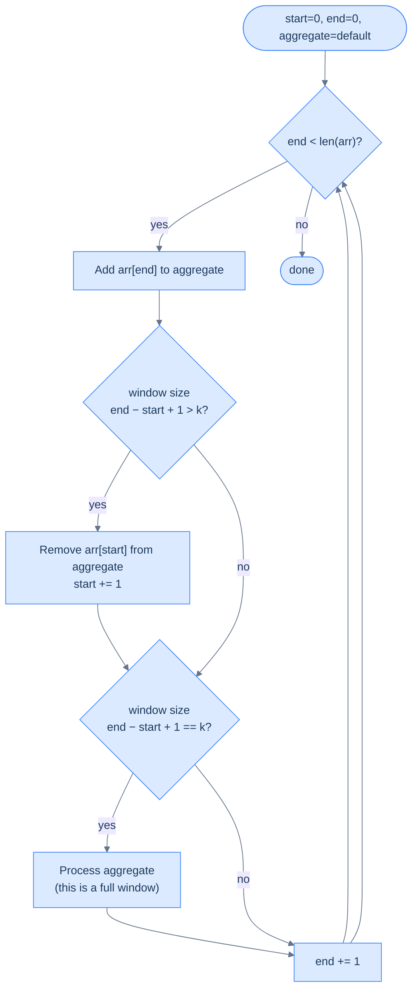
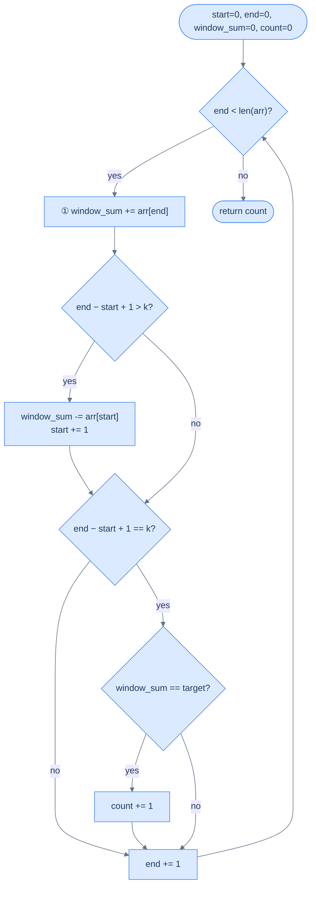
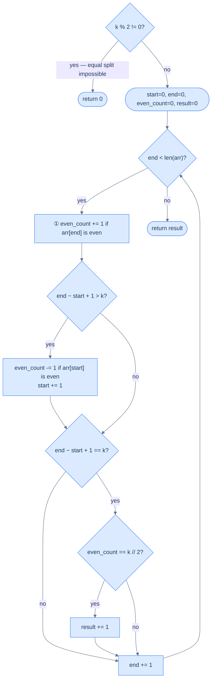

# 7. Pattern: Fixed sized sliding window

This section introduces fixed-size window problems where the window length stays constant while it slides across the array.

## Table of contents

1. [Understanding the fixed sized sliding window pattern](#understanding-the-fixed-sliding-window-pattern)
2. [Identifying the fixed sized sliding window pattern](#understanding-the-fixed-sliding-window-pattern)
3. [Subarray size equals K](#subarray-size-equals-k)
4. [Maximum ones](#maximum-ones)
5. [Negative window](#negative-window)
6. [Even odd count](#even-odd-count)

***

# Understanding the Fixed Sliding Window Pattern

## The Best Subarrays Always Move Together

Here's a deceptively simple question: given an array of numbers, what's the maximum sum of any 3 consecutive elements?

The obvious answer: try every possible window of size 3, sum each one, keep the largest. That's three passes through most of the array, just to produce each new sum.

But notice something. When you move the window one step to the right, the new window shares **two elements** with the old one. You recomputed those two elements from scratch — and you'll do the same thing 500,000 more times on a large array. You're recalculating the same data over and over.

What if you could slide the window forward in one subtraction and one addition?

---

## The Mental Model

Picture a train car moving along a track. The car has a fixed number of seats — say, four. As the train inches forward, one new passenger boards at the front door and one passenger exits at the back door. The total passenger count shifts by exactly those two people — you never need to recount every seat.

```d2
direction: right

arr: "Before slide" {
  grid-columns: 6
  grid-gap: 0
  a0: "2" {style.fill: "#fde68a"; style.stroke: "#d97706"}
  a1: "5" {style.fill: "#fde68a"; style.stroke: "#d97706"}
  a2: "1" {style.fill: "#fde68a"; style.stroke: "#d97706"}
  a3: "3" {style.fill: "#fde68a"; style.stroke: "#d97706"}
  a4: "7"
  a5: "4"
}

s: "▲ start = 0" {shape: oval; style.fill: "#fde68a"; style.stroke: "#d97706"}
e: "▲ end = 3" {shape: oval; style.fill: "#fde68a"; style.stroke: "#d97706"}

s -> arr.a0
e -> arr.a3
```

<p align="center"><strong>Window [2, 5, 1, 3] — <code>start=0</code>, <code>end=3</code>, sum = 11.</strong></p>

```d2
direction: right

arr: "After one slide" {
  grid-columns: 6
  grid-gap: 0
  a0: "2"
  a1: "5" {style.fill: "#fde68a"; style.stroke: "#d97706"}
  a2: "1" {style.fill: "#fde68a"; style.stroke: "#d97706"}
  a3: "3" {style.fill: "#fde68a"; style.stroke: "#d97706"}
  a4: "7" {style.fill: "#fde68a"; style.stroke: "#d97706"}
  a5: "4"
}

s: "▲ start = 1" {shape: oval; style.fill: "#fde68a"; style.stroke: "#d97706"}
e: "▲ end = 4" {shape: oval; style.fill: "#fde68a"; style.stroke: "#d97706"}

s -> arr.a1
e -> arr.a4
```

<p align="center"><strong>Slide right — subtract <code>arr[start]=2</code>, add <code>arr[new end]=7</code>. New sum = 11 − 2 + 7 = 16. No recount needed.</strong></p>

The key insight is the **incremental update**: instead of recomputing the aggregate from scratch each time, you maintain a running value and perform one removal and one addition per slide. Two pointer variables — `start` and `end` — mark the boundaries of the current window, and an `aggregate` variable holds the current result.

---

## What Makes a Function Slidable?

Not every aggregate function can use this trick. The whole point of sliding window is to avoid recomputing the window's result from scratch on every step — instead you **maintain** a running value by applying one cheap update. For that to work, the function must support two operations:

- An **addition operation** — cheaply include a new element as it enters the window from the right
- A **removal operation** — cheaply exclude an element as it exits the window from the left

"Cheaply" means O(1) per update. If either operation costs O(k) — proportional to the window size — you've lost the benefit entirely, because you'd be doing O(k) work per step across O(N) steps, which is exactly what brute force costs.

### Functions That Qualify

| Function | Add operation | Remove operation | Why it's O(1) |
|---|---|---|---|
| Sum | `aggregate += arr[end]` | `aggregate -= arr[start]` | Addition and subtraction are single arithmetic operations |
| Product | `aggregate *= arr[end]` | `aggregate //= arr[start]` | Multiplication and division are single arithmetic operations |
| Count of X | `aggregate += (arr[end] == X)` | `aggregate -= (arr[start] == X)` | A single comparison produces 0 or 1; no scan needed |
| Frequency map | `freq[arr[end]] += 1` | `freq[arr[start]] -= 1` | Hash map update at a single key is O(1) amortized |

Each of these works because the "contribution" of a single element to the aggregate can be added or removed in constant time, independently of all other elements in the window.

### Functions That Do Not Qualify — And Why

#### Median

The median is the middle value of a sorted sequence. To find it, the window's elements must be in sorted order.

**The problem:** when the window slides — one element leaves and one enters — you can't update a sorted structure in O(1). You have to re-sort, or use a balanced BST / two-heap structure to maintain order. Both cost O(log k) per update.

**Concretely:** window `[1, 3, 5, 7, 9]` (k=5), median = `5`. New window is `[3, 5, 7, 9, 2]`. The new element `2` needs to be inserted in the right sorted position, and `1` needs to be removed from it. With a plain sorted list, finding where `2` goes requires scanning up to k elements — O(k). You can't just "subtract 1 and add 2" to get the new median, because median depends on *relative rank*, not on a simple arithmetic formula.

**What breaks if you try it naively:** `median([1,3,5,7,9]) = 5`. Remove `1`, add `2` — naive arithmetic gives you no way to know the new median is `5` again. You must re-sort the window: O(k log k), not O(1).

**Can it still use a window structure?** Yes — with two heaps (a max-heap for the lower half and a min-heap for the upper half), you can maintain the median in O(log k) per slide. So a "sliding window median" is solvable in O(N log k), but it no longer uses the simple fixed-window template — it requires a more complex data structure.

---

#### Mode (Most Frequent Element)

The mode is the element that appears most often in the window.

**The problem:** tracking the mode requires knowing the frequency of *every* element in the window. When one element leaves, its frequency drops by one — and that might dethrone it as the mode. When a new element enters, it might become the new mode. You need to know the current maximum frequency at all times.

**Concretely:** window `[3, 1, 3, 2, 3]` (k=5), mode = `3` (appears 3 times). New window is `[1, 3, 2, 3, 3]` — `3` removed from left, another `3` added from right. Mode is still `3`. Easy case.

Now try: window `[3, 3, 3, 1, 2]`, mode = `3` (3 times). Slide to `[3, 3, 1, 2, 1]` — one `3` leaves, one `1` enters. Now `3` appears twice, `1` appears twice — it's a tie. Was `3` still mode? Or `1`? You can't know without scanning the full frequency map to find the current max.

**What breaks if you try it naively:** You can maintain a frequency map in O(1) per update (that part works). But finding *which element has the highest frequency* after each update requires scanning the entire frequency map — O(k) in the worst case. There's no O(1) way to track "which key currently has the maximum value" in a hash map as values change.

**Can it still be made efficient?** Partially. With a frequency map plus a separate "max frequency" counter, you can get O(1) *amortized* for some problems (like "longest subarray with at most one distinct element"), but the general mode-of-window problem cannot be solved with the simple template.

---

#### Maximum / Minimum

The maximum (or minimum) of a window seems simple — surely you can just track the current max?

**The problem:** when the *maximum element exits the window*, you have no way to know the new maximum without scanning the remaining k−1 elements. There's no arithmetic inverse for "remove a maximum from a set" the way there is for sum.

**Concretely:** window `[2, 8, 5, 3]`, max = `8`. Slide: `8` exits, `6` enters → new window `[5, 3, 6]`. What's the new max? You can't compute it from `8` alone — you have to look at all remaining elements. If the outgoing element was not the max, you're fine. But you never know in advance which slides will evict the max.

**What breaks if you try it naively:** keep a variable `current_max`. When `arr[end]` enters, update `current_max = max(current_max, arr[end])` — easy. When `arr[start]` exits: if `arr[start] != current_max`, do nothing. But if `arr[start] == current_max`, you now have to scan the entire window to find the new max — O(k) per such step.

In a worst-case array like `[9, 8, 7, 6, 5, 4, 3, 2, 1]`, the max exits on every single slide, meaning every step triggers a full O(k) scan — total cost O(N × k), same as brute force.

**Can it still use a window structure?** Yes — a **monotonic deque** (a double-ended queue that maintains elements in decreasing order) gives you O(1) amortized max/min per slide. This is a classic technique, but it's a different and more complex data structure than the simple `aggregate` variable in the basic template. The `f_remove` operation is no longer a single arithmetic step.

---

### The Core Rule

The dividing line is this: a function is O(1)-slidable if and only if **the contribution of a single element to the aggregate can be undone in constant time, regardless of what other elements are in the window**.

- Sum: contribution of element `x` is exactly `x` — trivially undone by `aggregate -= x`.
- Product: contribution is exactly `x` — undone by `aggregate /= x` (with a caveat for zeros).
- Max: contribution of element `x` depends on whether it's larger than all others — that relationship cannot be expressed independently of the rest of the window.
- Median: contribution of element `x` depends on its *rank* among all other elements — inherently relational, not independent.

If removing one element forces you to look at other elements to restore the aggregate, the function is not O(1)-slidable with a plain variable.

---

## The Mechanics — Step by Step

Let's make this concrete. You have an array and a window size `k`. You want to evaluate some function `f` over every subarray of size exactly `k`.

Here's how the window moves:



<p align="center"><strong>Fixed sliding window flow — <code>end</code> expands the window each iteration; once window exceeds <code>k</code>, <code>start</code> contracts it from the left; once window equals <code>k</code>, process the aggregate.</strong></p>

Notice the design: `end` always moves forward every iteration, so the total number of iterations is exactly `n`. `start` only moves when the window would exceed `k`. Every element is added exactly once and removed at most once — that's what gives you O(n).

---

## The Algorithm

The generic fixed-sized sliding window algorithm is given below. It uses two variables `start` and `end` to maintain the window boundaries and a variable `aggregate` that always holds the result of function `f` computed over the current window `arr[start..end]`.

> **Step 1:** Initialize two variables, `start` and `end` to 0.
>
> **Step 2:** Create a variable `aggregate` to store the aggregated value of a window and initialize it to some default value dictated by the problem.
>
> **Step 3:** Loop while `end` < `arr.size()` and do the following:
>
> - **Step 3.1:** Add the contribution of `arr[end]` to `aggregate`
>
> - **Step 3.2:** If the size of the current window (`end` − `start` + 1) is greater than `k`, remove the contribution of `arr[start]` from `aggregate` and increment `start` by 1
>
> - **Step 3.3:** If the size of the current window (`end` − `start` + 1) equals `k`, process `aggregate`
>
> - **Step 3.4:** Increment `end` by 1

The order of steps 3.1 → 3.2 → 3.3 → 3.4 is not arbitrary — it is the only correct ordering. Here's why each position matters:

- **Step 3.1 must come first:** `arr[end]` must be added to `aggregate` before any size checks, because the size check in Step 3.2 determines whether this newly-added element pushed the window past `k`.
- **Step 3.2 must come before 3.3:** If you process before trimming, you may process a window that is one element too large. The window must be trimmed to exactly `k` before being evaluated.
- **Step 3.4 must come last:** `end` is incremented after all processing. If you increment first, you'd process the wrong index.

Three things to supply when solving a specific problem:
1. **`f_add`** — how to include `arr[end]` (e.g. `aggregate += arr[end]` for sum)
2. **`f_remove`** — how to exclude `arr[start]` (e.g. `aggregate -= arr[start]` for sum)
3. **`process`** — what to do with the window's aggregate (e.g. record max, check condition)

---

## A Concrete Walkthrough — Window of Size 4

Array: `[2, 5, 1, 3, 7, 4]`, window size `k = 4`, function `f` = sum.

```d2
arr: "end=0 — add arr[0]=2 → window=[2], size=1 < 4, skip process" {
  grid-columns: 6
  grid-gap: 0
  a0: "2" {style.fill: "#fde68a"; style.stroke: "#d97706"}
  a1: "5"
  a2: "1"
  a3: "3"
  a4: "7"
  a5: "4"
}
```

```d2
arr: "end=3 — add arr[3]=3 → window=[2,5,1,3], size=4 == k → process sum=11" {
  grid-columns: 6
  grid-gap: 0
  a0: "2" {style.fill: "#fde68a"; style.stroke: "#d97706"}
  a1: "5" {style.fill: "#fde68a"; style.stroke: "#d97706"}
  a2: "1" {style.fill: "#fde68a"; style.stroke: "#d97706"}
  a3: "3" {style.fill: "#fde68a"; style.stroke: "#d97706"}
  a4: "7"
  a5: "4"
}
```

```d2
arr: "end=4 — add 7 → size=5 > 4 → remove arr[0]=2, start=1 → window=[5,1,3,7], size=4 → process sum=16" {
  grid-columns: 6
  grid-gap: 0
  a0: "2"
  a1: "5" {style.fill: "#fde68a"; style.stroke: "#d97706"}
  a2: "1" {style.fill: "#fde68a"; style.stroke: "#d97706"}
  a3: "3" {style.fill: "#fde68a"; style.stroke: "#d97706"}
  a4: "7" {style.fill: "#fde68a"; style.stroke: "#d97706"}
  a5: "4"
}
```

```d2
arr: "end=5 — add 4 → size=5 > 4 → remove arr[1]=5, start=2 → window=[1,3,7,4], size=4 → process sum=15" {
  grid-columns: 6
  grid-gap: 0
  a0: "2"
  a1: "5"
  a2: "1" {style.fill: "#fde68a"; style.stroke: "#d97706"}
  a3: "3" {style.fill: "#fde68a"; style.stroke: "#d97706"}
  a4: "7" {style.fill: "#fde68a"; style.stroke: "#d97706"}
  a5: "4" {style.fill: "#fde68a"; style.stroke: "#d97706"}
}
```

<p align="center"><strong>Complete execution on <code>[2, 5, 1, 3, 7, 4]</code> with <code>k=4</code>. Three windows of size 4 are processed: sums 11, 16, 15. Each window is derived from the previous with one subtraction and one addition.</strong></p>

Sums computed: `11, 16, 15`. The maximum is `16` (window `[5, 1, 3, 7]`). And you never recounted the middle elements.

---

## Implementation

Given below is the generic code implementation of the fixed-sized sliding window technique. It maps directly to the four steps in the algorithm above — Step 3.1 (add), Step 3.2 (trim if oversized), Step 3.3 (process if full), Step 3.4 (advance `end`):


```pseudocode
# Generic fixed-window template — four steps per iteration: expand, contract, process, advance.
function fixedSizeSlidingWindow(arr, k):
    start ← 0; end ← 0
    aggregate ← 0
    while end < length(arr):
        aggregate ← fAdd(aggregate, arr[end])         # 1. expand right edge
        if end − start + 1 > k:                       # 2. contract from left if oversized
            aggregate ← fRemove(aggregate, arr[start])
            start ← start + 1
        if end − start + 1 = k:                       # 3. process when window is exactly k
            process(aggregate)
        end ← end + 1                                  # 4. advance right edge
```

```python run
from typing import List

def f_add(agg, x): return agg + x
def f_remove(agg, x): return agg - x
def process(agg): pass

def fixed_size_sliding_window(arr: List[int], k: int) -> None:
    start = end = 0
    aggregate = 0

    while end < len(arr):
        aggregate = f_add(aggregate, arr[end])             # Step 3.1: extend right.

        if end - start + 1 > k:                            # Step 3.2: trim oversize.
            aggregate = f_remove(aggregate, arr[start])
            start += 1

        if end - start + 1 == k:                           # Step 3.3: process full window.
            process(aggregate)

        end += 1                                           # Step 3.4: advance right.
```

```java run
public class Main {
    static int fAdd(int agg, int x)    { return agg + x; }
    static int fRemove(int agg, int x) { return agg - x; }
    static void process(int agg)       { /* problem-specific */ }

    static void fixedSizeSlidingWindow(int[] arr, int k) {
        int start = 0, end = 0, aggregate = 0;
        while (end < arr.length) {
            aggregate = fAdd(aggregate, arr[end]);

            if (end - start + 1 > k) {
                aggregate = fRemove(aggregate, arr[start]);
                start++;
            }

            if (end - start + 1 == k) process(aggregate);

            end++;
        }
    }

    public static void main(String[] args) {
        fixedSizeSlidingWindow(new int[]{1, 2, 3, 4, 5}, 3);
        System.out.println("Template ran.");
    }
}
```

```c run
#include <stdio.h>

int  f_add(int agg, int x)    { return agg + x; }
int  f_remove(int agg, int x) { return agg - x; }
void process(int agg)         { (void)agg; }

void fixed_size_sliding_window(int* arr, int n, int k) {
    int start = 0, end = 0, aggregate = 0;
    while (end < n) {
        aggregate = f_add(aggregate, arr[end]);
        if (end - start + 1 > k) {
            aggregate = f_remove(aggregate, arr[start]);
            start++;
        }
        if (end - start + 1 == k) process(aggregate);
        end++;
    }
}

int main() {
    int arr[] = {1, 2, 3, 4, 5};
    fixed_size_sliding_window(arr, 5, 3);
    printf("Template ran.\n");
    return 0;
}
```

```cpp run
#include <iostream>
#include <vector>

int  fAdd(int agg, int x)    { return agg + x; }
int  fRemove(int agg, int x) { return agg - x; }
void process(int)            { /* problem-specific */ }

void fixedSizeSlidingWindow(const std::vector<int>& arr, int k) {
    int start = 0, end = 0, aggregate = 0;
    while (end < (int)arr.size()) {
        aggregate = fAdd(aggregate, arr[end]);
        if (end - start + 1 > k) {
            aggregate = fRemove(aggregate, arr[start]);
            start++;
        }
        if (end - start + 1 == k) process(aggregate);
        end++;
    }
}

int main() {
    fixedSizeSlidingWindow({1, 2, 3, 4, 5}, 3);
    std::cout << "Template ran.\n";
}
```

```scala run
object Main extends App {
  def fAdd(agg: Int, x: Int): Int    = agg + x
  def fRemove(agg: Int, x: Int): Int = agg - x
  def process(agg: Int): Unit = ()

  def fixedSizeSlidingWindow(arr: Array[Int], k: Int): Unit = {
    var start = 0
    var end = 0
    var aggregate = 0
    while (end < arr.length) {
      aggregate = fAdd(aggregate, arr(end))
      if (end - start + 1 > k) {
        aggregate = fRemove(aggregate, arr(start))
        start += 1
      }
      if (end - start + 1 == k) process(aggregate)
      end += 1
    }
  }

  fixedSizeSlidingWindow(Array(1, 2, 3, 4, 5), 3)
  println("Template ran.")
}
```

```typescript run
const fAdd    = (agg: number, x: number): number => agg + x;
const fRemove = (agg: number, x: number): number => agg - x;
const process = (_: number): void => { /* problem-specific */ };

function fixedSizeSlidingWindow(arr: number[], k: number): void {
    let start = 0, end = 0, aggregate = 0;
    while (end < arr.length) {
        aggregate = fAdd(aggregate, arr[end]);
        if (end - start + 1 > k) {
            aggregate = fRemove(aggregate, arr[start]);
            start++;
        }
        if (end - start + 1 === k) process(aggregate);
        end++;
    }
}

fixedSizeSlidingWindow([1, 2, 3, 4, 5], 3);
console.log("Template ran.");
```

```go run
package main

import "fmt"

func fAdd(agg, x int) int    { return agg + x }
func fRemove(agg, x int) int { return agg - x }
func process(agg int)        { _ = agg }

func fixedSizeSlidingWindow(arr []int, k int) {
    start, end, aggregate := 0, 0, 0
    for end < len(arr) {
        aggregate = fAdd(aggregate, arr[end])
        if end-start+1 > k {
            aggregate = fRemove(aggregate, arr[start])
            start++
        }
        if end-start+1 == k {
            process(aggregate)
        }
        end++
    }
}

func main() {
    fixedSizeSlidingWindow([]int{1, 2, 3, 4, 5}, 3)
    fmt.Println("Template ran.")
}
```

```rust run
fn f_add(agg: i32, x: i32) -> i32    { agg + x }
fn f_remove(agg: i32, x: i32) -> i32 { agg - x }
fn process(_agg: i32)                {}

fn fixed_size_sliding_window(arr: &[i32], k: usize) {
    let mut start = 0usize;
    let mut end = 0usize;
    let mut aggregate = 0i32;
    while end < arr.len() {
        aggregate = f_add(aggregate, arr[end]);
        if end - start + 1 > k {
            aggregate = f_remove(aggregate, arr[start]);
            start += 1;
        }
        if end - start + 1 == k { process(aggregate); }
        end += 1;
    }
}

fn main() {
    fixed_size_sliding_window(&[1, 2, 3, 4, 5], 3);
    println!("Template ran.");
}
```


---

## Complexity

| | Time | Space |
|---|---|---|
| Best and worst case | O(N) | O(1) |

**Why O(N):** `end` sweeps from `0` to `N-1` — exactly N iterations. `start` only moves forward and can never pass `end`. Every element is added once and removed once. Total work: 2N → O(N). This holds as long as `f_add` and `f_remove` are O(1) operations.

**Why O(1):** No new data structure grows with input size. Only `start`, `end`, and `aggregate` are used regardless of array length.

**Brute force comparison:** A naive nested loop recomputes the sum of every window from scratch — that's O(k) work per window, and there are O(N) windows, giving O(N × k). For `k = 1000` and `N = 1,000,000`, the difference between O(N) and O(N × k) is the difference between milliseconds and minutes.

---

Later in the course, you'll see specific problems where the aggregate is a sum, a character frequency map, and a count of distinct elements — each one plugging different `f_add` / `f_remove` logic into this same template while the structure stays identical.

***

# Identifying the Fixed Sliding Window Pattern

## The Diagnostic Questions

| Question | What it tests |
|---|---|
| **Q1.** Does the problem ask for a value computed over all (or the best) subarray of a **fixed** size k? | Confirms the window size never needs to grow or shrink — it's always exactly k |
| **Q2.** Can the aggregate update in O(1) when one element enters and one leaves? | Confirms the O(N) sliding window is achievable — not just O(N × k) |

If yes to both, you have a fixed sliding window problem.

---

## The Example: Maximum Average Subarray

**Problem:** Given an array `arr` and an integer `k`, find the maximum average of any contiguous subarray of size exactly `k`.

```
arr = [1, 12, -5, -6, 50, 3],  k = 4

Subarrays of size 4:
  [1,  12, -5, -6]  →  sum =  2,  avg = 0.50
  [12, -5, -6, 50]  →  sum = 51,  avg = 12.75  ← maximum
  [-5, -6, 50,  3]  →  sum = 42,  avg = 10.50

Answer: 12.75
```

```d2
direction: right

w1: "Window 1: [1, 12, -5, -6]  avg = 0.50" {
  grid-columns: 6
  grid-gap: 0
  a0: "1" {style.fill: "#fde68a"; style.stroke: "#d97706"}
  a1: "12" {style.fill: "#fde68a"; style.stroke: "#d97706"}
  a2: "-5" {style.fill: "#fde68a"; style.stroke: "#d97706"}
  a3: "-6" {style.fill: "#fde68a"; style.stroke: "#d97706"}
  a4: "50"
  a5: "3"
}

w2: "Window 2: [12, -5, -6, 50]  avg = 12.75 ★" {
  grid-columns: 6
  grid-gap: 0
  b0: "1 ✗" {style.fill: "#f1f5f9"; style.stroke: "#94a3b8"}
  b1: "12" {style.fill: "#dcfce7"; style.stroke: "#16a34a"}
  b2: "-5" {style.fill: "#dcfce7"; style.stroke: "#16a34a"}
  b3: "-6" {style.fill: "#dcfce7"; style.stroke: "#16a34a"}
  b4: "50" {style.fill: "#dcfce7"; style.stroke: "#16a34a"}
  b5: "3"
}

w3: "Window 3: [-5, -6, 50, 3]  avg = 10.50" {
  grid-columns: 6
  grid-gap: 0
  c0: "1 ✗" {style.fill: "#f1f5f9"; style.stroke: "#94a3b8"}
  c1: "12 ✗" {style.fill: "#f1f5f9"; style.stroke: "#94a3b8"}
  c2: "-5" {style.fill: "#fde68a"; style.stroke: "#d97706"}
  c3: "-6" {style.fill: "#fde68a"; style.stroke: "#d97706"}
  c4: "50" {style.fill: "#fde68a"; style.stroke: "#d97706"}
  c5: "3" {style.fill: "#fde68a"; style.stroke: "#d97706"}
}

w1 -> w2: "remove 1, add 50"
w2 -> w3: "remove 12, add 3"
```

<p align="center"><strong>Three windows of size k=4 slide through the array. Each slide removes one element from the left and adds one from the right — the sum updates in O(1) each time.</strong></p>

---

## Applying the Diagnostic Questions

| Question | Answer |
|---|---|
| **Q1.** Fixed size subarray? | **Yes** — exactly k=4 elements, every time. The window never grows or shrinks to satisfy a condition |
| **Q2.** O(1) add and remove? | **Yes** — `sum += arr[end]` to add, `sum -= arr[start]` to remove. Both are O(1) arithmetic |

---

### Q1 — Why "fixed size" matters here?

**WHAT:** The problem asks for the maximum average over subarrays of size *exactly* k. The window size is a fixed constraint, not a goal to satisfy. Every valid subarray has the same size.

**WHY "fixed" is the key qualifier:** A fixed window never needs logic to decide whether to grow or shrink based on a condition. You just slide it. This is what separates fixed sliding window from variable sliding window — in the variable version, the window size changes dynamically to satisfy a condition (e.g., "smallest subarray with sum ≥ target"). Here, the size is always k. No condition checking needed to adjust the window.

**Concrete check:** With `k=4` and `n=6`, there are exactly `n − k + 1 = 3` valid windows. Each has exactly 4 elements. The brute force computes the sum of 4 elements, 3 times — that's 12 additions. The sliding window computes the initial window once (4 additions) and then 2 slides (2 additions + 2 subtractions = 4 more operations) — 8 total. As k grows, this advantage compounds dramatically.

**What breaks if you use variable sliding window logic here:** A variable window expands and contracts based on whether a condition is satisfied. With a fixed target size, there's no condition to check — every window of size k is valid. Using variable logic would add unnecessary complexity without any benefit.

---

### Q2 — Why "O(1) add and remove" is required?

**WHAT:** When the window slides right by 1:
- `arr[end]` enters the window → `sum += arr[end]`
- `arr[start]` leaves the window → `sum -= arr[start]`

Both operations are O(1) arithmetic on a single variable.

**WHY this is the condition that makes sliding window faster than brute force:** Brute force recomputes the sum of k elements from scratch for every window — O(k) per window, O(N × k) total. Sliding window reuses the previous sum and updates it in O(1) — O(N) total. The update must be O(1), or the sliding window gains nothing over brute force.

**What doesn't have O(1) remove:** "Maximum element in window" — when the maximum element leaves the window, you need to find the new maximum from the remaining k−1 elements. That's O(k), not O(1). Fixed sliding window doesn't apply; you'd need a monotonic deque instead. "Sum of squares" could be O(1) (`+= end²`, `-= start²`), so it does apply. Always verify both add AND remove are O(1) before using this pattern.

---

## Brute Force: Nested Loops, O(N × k)

Fix a starting index `i`, compute the sum of `k` elements starting there, check if it beats the current max:


```pseudocode
# Brute force — recompute the sum of every k-window. O(n × k).
function kSubarrayMaxAverageBrute(arr, k):
    n ← length(arr)
    maxAverage ← −∞
    for i from 0 to n − k:
        currentSum ← 0
        for j from 0 to k − 1:
            currentSum ← currentSum + arr[i + j]
        maxAverage ← max(maxAverage, currentSum / k)
    return maxAverage
```

```python run
from typing import List

def k_subarray_max_average_brute(arr: List[int], k: int) -> float:
    n = len(arr)
    max_average = float('-inf')

    for i in range(n - k + 1):
        current_sum = 0
        # Inner loop recomputes arr[i+1..i+k-1] each time — the O(n*k) cost.
        for j in range(k):
            current_sum += arr[i + j]
        max_average = max(max_average, current_sum / k)
    return max_average

print(k_subarray_max_average_brute([1, 12, -5, -6, 50, 3], 4))  # 12.75
```

```java run
public class Main {
    static double kSubarrayMaxAverageBrute(int[] arr, int k) {
        int n = arr.length;
        double maxAverage = Double.NEGATIVE_INFINITY;
        for (int i = 0; i <= n - k; i++) {
            double currentSum = 0;
            for (int j = 0; j < k; j++) currentSum += arr[i + j];
            maxAverage = Math.max(maxAverage, currentSum / k);
        }
        return maxAverage;
    }

    public static void main(String[] args) {
        System.out.println(kSubarrayMaxAverageBrute(new int[]{1, 12, -5, -6, 50, 3}, 4));
    }
}
```

```c run
#include <stdio.h>
#include <float.h>

double k_subarray_max_average_brute(int* arr, int n, int k) {
    double max_average = -DBL_MAX;
    for (int i = 0; i <= n - k; i++) {
        double sum = 0;
        for (int j = 0; j < k; j++) sum += arr[i + j];
        double avg = sum / k;
        if (avg > max_average) max_average = avg;
    }
    return max_average;
}

int main() {
    int arr[] = {1, 12, -5, -6, 50, 3};
    printf("%.2f\n", k_subarray_max_average_brute(arr, 6, 4));
    return 0;
}
```

```cpp run
#include <iostream>
#include <vector>
#include <limits>
#include <algorithm>

double kSubarrayMaxAverageBrute(const std::vector<int>& arr, int k) {
    int n = (int)arr.size();
    double maxAverage = -std::numeric_limits<double>::infinity();
    for (int i = 0; i <= n - k; i++) {
        double sum = 0;
        for (int j = 0; j < k; j++) sum += arr[i + j];
        maxAverage = std::max(maxAverage, sum / k);
    }
    return maxAverage;
}

int main() {
    std::cout << kSubarrayMaxAverageBrute({1, 12, -5, -6, 50, 3}, 4) << "\n";
}
```

```scala run
object Main extends App {
  def kSubarrayMaxAverageBrute(arr: Array[Int], k: Int): Double = {
    val n = arr.length
    var maxAverage = Double.NegativeInfinity
    for (i <- 0 to n - k) {
      var sum = 0.0
      for (j <- 0 until k) sum += arr(i + j)
      maxAverage = math.max(maxAverage, sum / k)
    }
    maxAverage
  }

  println(kSubarrayMaxAverageBrute(Array(1, 12, -5, -6, 50, 3), 4))
}
```

```typescript run
function kSubarrayMaxAverageBrute(arr: number[], k: number): number {
    const n = arr.length;
    let maxAverage = -Infinity;
    for (let i = 0; i <= n - k; i++) {
        let sum = 0;
        for (let j = 0; j < k; j++) sum += arr[i + j];
        maxAverage = Math.max(maxAverage, sum / k);
    }
    return maxAverage;
}

console.log(kSubarrayMaxAverageBrute([1, 12, -5, -6, 50, 3], 4));
```

```go run
package main

import (
    "fmt"
    "math"
)

func kSubarrayMaxAverageBrute(arr []int, k int) float64 {
    n := len(arr)
    maxAverage := math.Inf(-1)
    for i := 0; i <= n-k; i++ {
        sum := 0.0
        for j := 0; j < k; j++ {
            sum += float64(arr[i+j])
        }
        avg := sum / float64(k)
        if avg > maxAverage {
            maxAverage = avg
        }
    }
    return maxAverage
}

func main() {
    fmt.Println(kSubarrayMaxAverageBrute([]int{1, 12, -5, -6, 50, 3}, 4))
}
```

```rust run
fn k_subarray_max_average_brute(arr: &[i32], k: usize) -> f64 {
    let n = arr.len();
    let mut max_average = f64::NEG_INFINITY;
    for i in 0..=(n - k) {
        let mut sum = 0.0;
        for j in 0..k { sum += arr[i + j] as f64; }
        let avg = sum / k as f64;
        if avg > max_average { max_average = avg; }
    }
    max_average
}

fn main() {
    println!("{}", k_subarray_max_average_brute(&[1, 12, -5, -6, 50, 3], 4));
}
```


<details>
<summary><strong>Trace — arr = [1, 12, -5, -6, 50, 3],  k = 4  (brute force)</strong></summary>

```
n=6,  valid starting positions: i = 0, 1, 2  (n - k + 1 = 3)

i=0: j=0..3 → 1 + 12 + (-5) + (-6) = 2    → avg = 0.50   max_avg = 0.50
i=1: j=0..3 → 12 + (-5) + (-6) + 50 = 51  → avg = 12.75  max_avg = 12.75
              Note: 12, -5, -6 were already summed in i=0 — recomputed here
i=2: j=0..3 → (-5) + (-6) + 50 + 3 = 42   → avg = 10.50  max_avg = 12.75
              Note: -5, -6, 50 were already summed in i=1 — recomputed again

Return: 12.75 ✓

Total additions: 3 windows × 4 elements = 12 additions
Sliding window would do: 4 (initial) + 2×2 (slides) = 8 operations
```

</details>

---

## Fixed Sliding Window Solution: One Pass, O(N)

We apply the fixed sliding window algorithm directly. We initialise `start = 0`, `end = 0`, and a running `window_sum = 0`. In each iteration we follow the four steps:

- **Step 3.1:** Add `arr[end]` to `window_sum`
- **Step 3.2:** If window size exceeds `k`, remove `arr[start]` and advance `start`
- **Step 3.3:** If window size equals `k`, evaluate the average against `max_average`
- **Step 3.4:** Advance `end`


```pseudocode
# Sliding window — each element added and removed exactly once. O(n).
function kSubarrayMaxAverage(arr, k):
    n ← length(arr)
    start ← 0; end ← 0
    windowSum ← 0; maxAverage ← −∞
    while end < n:
        windowSum ← windowSum + arr[end]              # expand
        if end − start + 1 > k:                       # contract
            windowSum ← windowSum − arr[start]
            start ← start + 1
        if end − start + 1 = k:                       # process
            maxAverage ← max(maxAverage, windowSum / k)
        end ← end + 1
    return maxAverage
```

```python run
from typing import List

class Solution:
    def k_subarray_max_average(self, arr: List[int], k: int) -> float:
        n = len(arr)
        start = end = 0
        window_sum = 0
        max_average = float('-inf')

        while end < n:
            window_sum += arr[end]                          # Step 3.1: extend.
            if end - start + 1 > k:                         # Step 3.2: trim.
                window_sum -= arr[start]
                start += 1
            if end - start + 1 == k:                        # Step 3.3: process.
                max_average = max(max_average, window_sum / k)
            end += 1                                         # Step 3.4: advance.
        return max_average


print(Solution().k_subarray_max_average([1, 12, -5, -6, 50, 3], 4))  # 12.75
```

```java run
public class Main {
    static class Solution {
        double kSubarrayMaxAverage(int[] arr, int k) {
            int n = arr.length, start = 0, end = 0;
            long windowSum = 0;
            double maxAverage = Double.NEGATIVE_INFINITY;
            while (end < n) {
                windowSum += arr[end];
                if (end - start + 1 > k) {
                    windowSum -= arr[start];
                    start++;
                }
                if (end - start + 1 == k) {
                    maxAverage = Math.max(maxAverage, windowSum / (double) k);
                }
                end++;
            }
            return maxAverage;
        }
    }

    public static void main(String[] args) {
        System.out.println(new Solution().kSubarrayMaxAverage(new int[]{1, 12, -5, -6, 50, 3}, 4));
    }
}
```

```c run
#include <stdio.h>
#include <float.h>

double k_subarray_max_average(int* arr, int n, int k) {
    int start = 0, end = 0;
    long window_sum = 0;
    double max_average = -DBL_MAX;
    while (end < n) {
        window_sum += arr[end];
        if (end - start + 1 > k) {
            window_sum -= arr[start];
            start++;
        }
        if (end - start + 1 == k) {
            double avg = (double) window_sum / k;
            if (avg > max_average) max_average = avg;
        }
        end++;
    }
    return max_average;
}

int main() {
    int arr[] = {1, 12, -5, -6, 50, 3};
    printf("%.2f\n", k_subarray_max_average(arr, 6, 4));
    return 0;
}
```

```cpp run
#include <iostream>
#include <vector>
#include <limits>
#include <algorithm>

class Solution {
public:
    double kSubarrayMaxAverage(const std::vector<int>& arr, int k) {
        int n = (int)arr.size(), start = 0, end = 0;
        long windowSum = 0;
        double maxAverage = -std::numeric_limits<double>::infinity();
        while (end < n) {
            windowSum += arr[end];
            if (end - start + 1 > k) {
                windowSum -= arr[start];
                start++;
            }
            if (end - start + 1 == k) {
                maxAverage = std::max(maxAverage, (double) windowSum / k);
            }
            end++;
        }
        return maxAverage;
    }
};

int main() {
    std::cout << Solution().kSubarrayMaxAverage({1, 12, -5, -6, 50, 3}, 4) << "\n";
}
```

```scala run
object Main extends App {
  class Solution {
    def kSubarrayMaxAverage(arr: Array[Int], k: Int): Double = {
      val n = arr.length
      var start = 0
      var end = 0
      var windowSum = 0L
      var maxAverage = Double.NegativeInfinity
      while (end < n) {
        windowSum += arr(end)
        if (end - start + 1 > k) {
          windowSum -= arr(start)
          start += 1
        }
        if (end - start + 1 == k) {
          maxAverage = math.max(maxAverage, windowSum.toDouble / k)
        }
        end += 1
      }
      maxAverage
    }
  }

  println(new Solution().kSubarrayMaxAverage(Array(1, 12, -5, -6, 50, 3), 4))
}
```

```typescript run
class Solution {
    kSubarrayMaxAverage(arr: number[], k: number): number {
        const n = arr.length;
        let start = 0, end = 0, windowSum = 0;
        let maxAverage = -Infinity;
        while (end < n) {
            windowSum += arr[end];
            if (end - start + 1 > k) {
                windowSum -= arr[start];
                start++;
            }
            if (end - start + 1 === k) {
                maxAverage = Math.max(maxAverage, windowSum / k);
            }
            end++;
        }
        return maxAverage;
    }
}

console.log(new Solution().kSubarrayMaxAverage([1, 12, -5, -6, 50, 3], 4));
```

```go run
package main

import (
    "fmt"
    "math"
)

func kSubarrayMaxAverage(arr []int, k int) float64 {
    n, start, end := len(arr), 0, 0
    windowSum := 0
    maxAverage := math.Inf(-1)
    for end < n {
        windowSum += arr[end]
        if end-start+1 > k {
            windowSum -= arr[start]
            start++
        }
        if end-start+1 == k {
            avg := float64(windowSum) / float64(k)
            if avg > maxAverage {
                maxAverage = avg
            }
        }
        end++
    }
    return maxAverage
}

func main() {
    fmt.Println(kSubarrayMaxAverage([]int{1, 12, -5, -6, 50, 3}, 4))
}
```

```rust run
struct Solution;

impl Solution {
    fn k_subarray_max_average(&self, arr: &[i32], k: usize) -> f64 {
        let n = arr.len();
        let mut start = 0usize;
        let mut end = 0usize;
        let mut window_sum: i64 = 0;
        let mut max_average = f64::NEG_INFINITY;
        while end < n {
            window_sum += arr[end] as i64;
            if end - start + 1 > k {
                window_sum -= arr[start] as i64;
                start += 1;
            }
            if end - start + 1 == k {
                let avg = window_sum as f64 / k as f64;
                if avg > max_average { max_average = avg; }
            }
            end += 1;
        }
        max_average
    }
}

fn main() {
    let s = Solution;
    println!("{}", s.k_subarray_max_average(&[1, 12, -5, -6, 50, 3], 4));
}
```


<details>
<summary><strong>Trace — arr = [1, 12, -5, -6, 50, 3],  k = 4  (sliding window)</strong></summary>

```
start=0, end=0, window_sum=0, max_average=-inf

end=0: window_sum += arr[0]=1  → sum=1.  size=1, not k=4.
end=1: window_sum += arr[1]=12 → sum=13. size=2.
end=2: window_sum += arr[2]=-5 → sum=8.  size=3.
end=3: window_sum += arr[3]=-6 → sum=2.  size=4 == k → avg=2/4=0.50.   max_avg=0.50.
end=4: window_sum += arr[4]=50 → sum=52. size=5 > k → remove arr[0]=1: sum=51, start=1.
       size=4 == k → avg=51/4=12.75. max_avg=12.75.
end=5: window_sum += arr[5]=3  → sum=54. size=5 > k → remove arr[1]=12: sum=42, start=2.
       size=4 == k → avg=42/4=10.50. max_avg=12.75.
end=6: end >= n=6 → loop exits.

Return: 12.75 ✓

Total operations: 6 adds + 2 removes = 8 (vs 12 for brute force on this input)
Every element added exactly once, removed at most once.
```

</details>

---

## Problems in This Category

| Problem | Aggregate | Add operation | Remove operation |
|---|---|---|---|
| **Maximum Average Subarray** | Sum (then ÷ k) | `sum += arr[end]` | `sum -= arr[start]` |
| **Subarray of Size k** | Count / sum | `sum += arr[end]` | `sum -= arr[start]` |
| **Maximum Ones** | Count of 1s | `+= 1 if arr[end]==1` | `-= 1 if arr[start]==1` |
| **Negative Window** | Count of negatives | `+= 1 if arr[end]<0` | `-= 1 if arr[start]<0` |
| **Even/Odd Count** | Count of evens or odds | `+= 1 if even` | `-= 1 if even` |

All follow the same template — the only thing that changes is the add and remove logic in steps ① and ②.

***

# Subarray Size Equals K

## The Problem

Given an integer array `arr`, an integer `k`, and a target integer `target`, count the number of contiguous subarrays of size **exactly `k`** whose elements sum to exactly `target`.

```
arr = [1, 2, 3, 4, 5],  k = 3,  target = 9   →  1   ([2, 3, 4])
arr = [1, 1, 1, 1, 1],  k = 2,  target = 2   →  4   ([1,1],[1,1],[1,1],[1,1])
arr = [3, 1, 4, 1, 5],  k = 2,  target = 5   →  2   ([1,4],[4,1])
arr = [1, 2, 3],         k = 4,  target = 6   →  0   (no window of size 4 exists)
```

---

## Examples

**Example 1**
```
Input:  arr = [1, 2, 3, 4, 5],  k = 3,  target = 9
Output: 1
Explanation: Only [2, 3, 4] sums to 9.
```

**Example 2**
```
Input:  arr = [1, 1, 1, 1, 1],  k = 2,  target = 2
Output: 4
Explanation: Every adjacent pair [1,1] sums to 2, and there are 4 such pairs.
```

**Example 3**
```
Input:  arr = [3, 1, 4, 1, 5],  k = 2,  target = 5
Output: 2
Explanation: [1,4] at indices 1-2 and [4,1] at indices 2-3 both sum to 5.
```

---

## Intuition

There are exactly `n − k + 1` windows of size `k` in an array of length `n`. The brute force sums each window from scratch — recomputing `k − 1` shared elements every time a window slides.

The fixed sliding window fixes this: maintain a running `window_sum`. When the window slides right by one step, subtract the element leaving from the left and add the element entering from the right. One subtraction + one addition replaces an entire inner loop.

For this problem, after each slide we simply check: does `window_sum == target`? If yes, increment the count.



<p align="center"><strong>Subarray Size Equals K — expand, contract if oversized, then check the sum when the window reaches exactly size k.</strong></p>

---

## Brute Force: Nested Loops, O(N × k)


```pseudocode
# Brute force — recompute every k-window's sum. O(n × k).
function countSubarraysBrute(arr, k, target):
    n ← length(arr)
    count ← 0
    for i from 0 to n − k:
        windowSum ← 0
        for j from 0 to k − 1:
            windowSum ← windowSum + arr[i + j]
        if windowSum = target:
            count ← count + 1
    return count
```

```python run
from typing import List

def count_subarrays_brute(arr: List[int], k: int, target: int) -> int:
    n = len(arr)
    count = 0
    for i in range(n - k + 1):
        window_sum = 0
        for j in range(k):
            window_sum += arr[i + j]      # Re-summed each window — that's the O(n*k) cost.
        if window_sum == target:
            count += 1
    return count

print(count_subarrays_brute([1, 2, 3, 4, 5], 3, 9))  # 1
print(count_subarrays_brute([1, 1, 1, 1, 1], 2, 2))  # 4
```

```java run
public class Main {
    static int countSubarraysBrute(int[] arr, int k, int target) {
        int n = arr.length, count = 0;
        for (int i = 0; i <= n - k; i++) {
            int windowSum = 0;
            for (int j = 0; j < k; j++) windowSum += arr[i + j];
            if (windowSum == target) count++;
        }
        return count;
    }

    public static void main(String[] args) {
        System.out.println(countSubarraysBrute(new int[]{1, 2, 3, 4, 5}, 3, 9));
        System.out.println(countSubarraysBrute(new int[]{1, 1, 1, 1, 1}, 2, 2));
    }
}
```

```c run
#include <stdio.h>

int count_subarrays_brute(int* arr, int n, int k, int target) {
    int count = 0;
    for (int i = 0; i <= n - k; i++) {
        int window_sum = 0;
        for (int j = 0; j < k; j++) window_sum += arr[i + j];
        if (window_sum == target) count++;
    }
    return count;
}

int main() {
    int a1[] = {1, 2, 3, 4, 5};
    int a2[] = {1, 1, 1, 1, 1};
    printf("%d\n", count_subarrays_brute(a1, 5, 3, 9));
    printf("%d\n", count_subarrays_brute(a2, 5, 2, 2));
    return 0;
}
```

```cpp run
#include <iostream>
#include <vector>

int countSubarraysBrute(const std::vector<int>& arr, int k, int target) {
    int n = (int)arr.size(), count = 0;
    for (int i = 0; i <= n - k; i++) {
        int windowSum = 0;
        for (int j = 0; j < k; j++) windowSum += arr[i + j];
        if (windowSum == target) count++;
    }
    return count;
}

int main() {
    std::cout << countSubarraysBrute({1, 2, 3, 4, 5}, 3, 9) << "\n";
    std::cout << countSubarraysBrute({1, 1, 1, 1, 1}, 2, 2) << "\n";
}
```

```scala run
object Main extends App {
  def countSubarraysBrute(arr: Array[Int], k: Int, target: Int): Int = {
    val n = arr.length
    var count = 0
    for (i <- 0 to n - k) {
      var sum = 0
      for (j <- 0 until k) sum += arr(i + j)
      if (sum == target) count += 1
    }
    count
  }

  println(countSubarraysBrute(Array(1, 2, 3, 4, 5), 3, 9))
  println(countSubarraysBrute(Array(1, 1, 1, 1, 1), 2, 2))
}
```

```typescript run
function countSubarraysBrute(arr: number[], k: number, target: number): number {
    const n = arr.length;
    let count = 0;
    for (let i = 0; i <= n - k; i++) {
        let sum = 0;
        for (let j = 0; j < k; j++) sum += arr[i + j];
        if (sum === target) count++;
    }
    return count;
}

console.log(countSubarraysBrute([1, 2, 3, 4, 5], 3, 9));
console.log(countSubarraysBrute([1, 1, 1, 1, 1], 2, 2));
```

```go run
package main

import "fmt"

func countSubarraysBrute(arr []int, k, target int) int {
    n := len(arr)
    count := 0
    for i := 0; i <= n-k; i++ {
        sum := 0
        for j := 0; j < k; j++ {
            sum += arr[i+j]
        }
        if sum == target {
            count++
        }
    }
    return count
}

func main() {
    fmt.Println(countSubarraysBrute([]int{1, 2, 3, 4, 5}, 3, 9))
    fmt.Println(countSubarraysBrute([]int{1, 1, 1, 1, 1}, 2, 2))
}
```

```rust run
fn count_subarrays_brute(arr: &[i32], k: usize, target: i32) -> i32 {
    let n = arr.len();
    let mut count = 0;
    for i in 0..=(n - k) {
        let mut sum = 0;
        for j in 0..k { sum += arr[i + j]; }
        if sum == target { count += 1; }
    }
    count
}

fn main() {
    println!("{}", count_subarrays_brute(&[1, 2, 3, 4, 5], 3, 9));
    println!("{}", count_subarrays_brute(&[1, 1, 1, 1, 1], 2, 2));
}
```


<details>
<summary><strong>Trace — arr = [1, 2, 3, 4, 5],  k = 3,  target = 9  (brute force)</strong></summary>

```
n=5,  valid windows: i = 0, 1, 2  (n - k + 1 = 3)

i=0: 1+2+3 = 6  ≠ 9
i=1: 2+3+4 = 9  == 9 → count=1   (2 and 3 were already summed in i=0 — recomputed)
i=2: 3+4+5 = 12 ≠ 9              (3 and 4 were already summed in i=1 — recomputed again)

Return: 1 ✓  —  total additions: 9 (3 windows × 3 elements)
```

</details>

---

## Solution


```pseudocode
function countSubarraysWithSum(arr, k, target):
    start ← 0; end ← 0
    windowSum ← 0; count ← 0
    while end < length(arr):
        windowSum ← windowSum + arr[end]              # expand
        if end − start + 1 > k:                       # contract
            windowSum ← windowSum − arr[start]
            start ← start + 1
        if end − start + 1 = k AND windowSum = target:
            count ← count + 1                         # process
        end ← end + 1
    return count
```

```python run
from typing import List

class Solution:
    def count_subarrays_with_sum(self, arr: List[int], k: int, target: int) -> int:
        start = end = 0
        window_sum = count = 0
        while end < len(arr):
            window_sum += arr[end]                     # ① expand
            if end - start + 1 > k:                    # ② contract
                window_sum -= arr[start]
                start += 1
            if end - start + 1 == k and window_sum == target:
                count += 1                              # ③ process
            end += 1
        return count


sol = Solution()
print(sol.count_subarrays_with_sum([1, 2, 3, 4, 5], 3, 9))   # 1
print(sol.count_subarrays_with_sum([1, 1, 1, 1, 1], 2, 2))   # 4
print(sol.count_subarrays_with_sum([3, 1, 4, 1, 5], 2, 5))   # 2
print(sol.count_subarrays_with_sum([1, 2, 3], 4, 6))          # 0
print(sol.count_subarrays_with_sum([5], 1, 5))                # 1
```

```java run
public class Main {
    static class Solution {
        int countSubarraysWithSum(int[] arr, int k, int target) {
            int start = 0, end = 0, windowSum = 0, count = 0;
            while (end < arr.length) {
                windowSum += arr[end];
                if (end - start + 1 > k) {
                    windowSum -= arr[start];
                    start++;
                }
                if (end - start + 1 == k && windowSum == target) count++;
                end++;
            }
            return count;
        }
    }

    public static void main(String[] args) {
        Solution sol = new Solution();
        System.out.println(sol.countSubarraysWithSum(new int[]{1, 2, 3, 4, 5}, 3, 9));
        System.out.println(sol.countSubarraysWithSum(new int[]{1, 1, 1, 1, 1}, 2, 2));
        System.out.println(sol.countSubarraysWithSum(new int[]{3, 1, 4, 1, 5}, 2, 5));
        System.out.println(sol.countSubarraysWithSum(new int[]{1, 2, 3}, 4, 6));
        System.out.println(sol.countSubarraysWithSum(new int[]{5}, 1, 5));
    }
}
```

```c run
#include <stdio.h>

int count_subarrays_with_sum(int* arr, int n, int k, int target) {
    int start = 0, end = 0, window_sum = 0, count = 0;
    while (end < n) {
        window_sum += arr[end];
        if (end - start + 1 > k) {
            window_sum -= arr[start];
            start++;
        }
        if (end - start + 1 == k && window_sum == target) count++;
        end++;
    }
    return count;
}

int main() {
    int a1[] = {1, 2, 3, 4, 5};
    int a2[] = {1, 1, 1, 1, 1};
    int a3[] = {3, 1, 4, 1, 5};
    int a4[] = {1, 2, 3};
    int a5[] = {5};
    printf("%d\n", count_subarrays_with_sum(a1, 5, 3, 9));
    printf("%d\n", count_subarrays_with_sum(a2, 5, 2, 2));
    printf("%d\n", count_subarrays_with_sum(a3, 5, 2, 5));
    printf("%d\n", count_subarrays_with_sum(a4, 3, 4, 6));
    printf("%d\n", count_subarrays_with_sum(a5, 1, 1, 5));
    return 0;
}
```

```cpp run
#include <iostream>
#include <vector>

class Solution {
public:
    int countSubarraysWithSum(const std::vector<int>& arr, int k, int target) {
        int start = 0, end = 0, windowSum = 0, count = 0;
        while (end < (int)arr.size()) {
            windowSum += arr[end];
            if (end - start + 1 > k) {
                windowSum -= arr[start];
                start++;
            }
            if (end - start + 1 == k && windowSum == target) count++;
            end++;
        }
        return count;
    }
};

int main() {
    Solution sol;
    std::cout << sol.countSubarraysWithSum({1, 2, 3, 4, 5}, 3, 9) << "\n";
    std::cout << sol.countSubarraysWithSum({1, 1, 1, 1, 1}, 2, 2) << "\n";
    std::cout << sol.countSubarraysWithSum({3, 1, 4, 1, 5}, 2, 5) << "\n";
    std::cout << sol.countSubarraysWithSum({1, 2, 3}, 4, 6)       << "\n";
    std::cout << sol.countSubarraysWithSum({5}, 1, 5)              << "\n";
}
```

```scala run
object Main extends App {
  class Solution {
    def countSubarraysWithSum(arr: Array[Int], k: Int, target: Int): Int = {
      var start = 0
      var end = 0
      var windowSum = 0
      var count = 0
      while (end < arr.length) {
        windowSum += arr(end)
        if (end - start + 1 > k) {
          windowSum -= arr(start)
          start += 1
        }
        if (end - start + 1 == k && windowSum == target) count += 1
        end += 1
      }
      count
    }
  }

  val sol = new Solution
  println(sol.countSubarraysWithSum(Array(1, 2, 3, 4, 5), 3, 9))
  println(sol.countSubarraysWithSum(Array(1, 1, 1, 1, 1), 2, 2))
  println(sol.countSubarraysWithSum(Array(3, 1, 4, 1, 5), 2, 5))
  println(sol.countSubarraysWithSum(Array(1, 2, 3), 4, 6))
  println(sol.countSubarraysWithSum(Array(5), 1, 5))
}
```

```typescript run
class Solution {
    countSubarraysWithSum(arr: number[], k: number, target: number): number {
        let start = 0, end = 0, windowSum = 0, count = 0;
        while (end < arr.length) {
            windowSum += arr[end];
            if (end - start + 1 > k) {
                windowSum -= arr[start];
                start++;
            }
            if (end - start + 1 === k && windowSum === target) count++;
            end++;
        }
        return count;
    }
}

const sol = new Solution();
console.log(sol.countSubarraysWithSum([1, 2, 3, 4, 5], 3, 9));
console.log(sol.countSubarraysWithSum([1, 1, 1, 1, 1], 2, 2));
console.log(sol.countSubarraysWithSum([3, 1, 4, 1, 5], 2, 5));
console.log(sol.countSubarraysWithSum([1, 2, 3], 4, 6));
console.log(sol.countSubarraysWithSum([5], 1, 5));
```

```go run
package main

import "fmt"

func countSubarraysWithSum(arr []int, k, target int) int {
    start, end, windowSum, count := 0, 0, 0, 0
    for end < len(arr) {
        windowSum += arr[end]
        if end-start+1 > k {
            windowSum -= arr[start]
            start++
        }
        if end-start+1 == k && windowSum == target {
            count++
        }
        end++
    }
    return count
}

func main() {
    fmt.Println(countSubarraysWithSum([]int{1, 2, 3, 4, 5}, 3, 9))
    fmt.Println(countSubarraysWithSum([]int{1, 1, 1, 1, 1}, 2, 2))
    fmt.Println(countSubarraysWithSum([]int{3, 1, 4, 1, 5}, 2, 5))
    fmt.Println(countSubarraysWithSum([]int{1, 2, 3}, 4, 6))
    fmt.Println(countSubarraysWithSum([]int{5}, 1, 5))
}
```

```rust run
struct Solution;

impl Solution {
    fn count_subarrays_with_sum(&self, arr: &[i32], k: usize, target: i32) -> i32 {
        let mut start = 0usize;
        let mut end = 0usize;
        let mut window_sum: i32 = 0;
        let mut count = 0;
        while end < arr.len() {
            window_sum += arr[end];
            if end - start + 1 > k {
                window_sum -= arr[start];
                start += 1;
            }
            if end - start + 1 == k && window_sum == target { count += 1; }
            end += 1;
        }
        count
    }
}

fn main() {
    let s = Solution;
    println!("{}", s.count_subarrays_with_sum(&[1, 2, 3, 4, 5], 3, 9));
    println!("{}", s.count_subarrays_with_sum(&[1, 1, 1, 1, 1], 2, 2));
    println!("{}", s.count_subarrays_with_sum(&[3, 1, 4, 1, 5], 2, 5));
    println!("{}", s.count_subarrays_with_sum(&[1, 2, 3], 4, 6));
    println!("{}", s.count_subarrays_with_sum(&[5], 1, 5));
}
```


---

## Dry Run — Example 2

`arr = [1, 1, 1, 1, 1]`, `k = 2`, `target = 2`

<details>
<summary><strong>Trace — arr = [1, 1, 1, 1, 1],  k = 2,  target = 2</strong></summary>

```
start=0, end=0, window_sum=0, count=0

end=0: ① sum += arr[0]=1 → sum=1. size=1, not k=2.
end=1: ① sum += arr[1]=1 → sum=2. size=2==k → sum==target=2 → count=1.
end=2: ① sum += arr[2]=1 → sum=3. ② size=3>k → sum-=arr[0]=1 → sum=2, start=1.
       ③ size=2==k → sum==target=2 → count=2.
end=3: ① sum += arr[3]=1 → sum=3. ② size=3>k → sum-=arr[1]=1 → sum=2, start=2.
       ③ size=2==k → sum==target=2 → count=3.
end=4: ① sum += arr[4]=1 → sum=3. ② size=3>k → sum-=arr[2]=1 → sum=2, start=3.
       ③ size=2==k → sum==target=2 → count=4.
end=5: end >= n=5 → loop exits.

Return: 4 ✓

Every adjacent pair [1,1] sums to 2.
Each iteration: add right, remove left, check — all in O(1).
```

</details>

---

## Complexity Analysis

| | Complexity | Reasoning |
|---|---|---|
| **Time** | O(N) | `end` visits each element once; `start` moves at most N times total |
| **Space** | O(1) | Only two pointer variables and a running sum |

Versus brute force O(N × k) — the sliding window replaces the inner loop of k additions with 2 operations (one add, one subtract).

---

## Edge Cases

| Scenario | Input | Output | Note |
|---|---|---|---|
| k > n | `[1,2]`, k=5, target=3 | `0` | No window of size k can form |
| k == n | `[1,2,3]`, k=3, target=6 | `1` | Only one window: the whole array |
| No matching window | `[1,2,3]`, k=2, target=10 | `0` | No window sums to target |
| All windows match | `[1,1,1,1]`, k=2, target=2 | `3` | Every adjacent pair qualifies |
| Single element | `[5]`, k=1, target=5 | `1` | One window, one element |
| Negative elements | `[-1, 2, -1, 2]`, k=2, target=1 | `2` | Works identically — sums can be negative |

---

## Key Takeaway

Subarray Size Equals K is the simplest fixed sliding window problem: maintain a running sum, add on expand, subtract on contract, check on full-size. The count increments every time the window sum hits the target. The time drops from O(N × k) to O(N) because the shared elements between adjacent windows are updated in O(1) instead of recomputed.

***

# Maximum Ones

## The Problem

Given a **binary** array `arr` (containing only `0`s and `1`s) and an integer `k`, return the **maximum number of `1`s** found in any contiguous subarray of size exactly `k`.

```
arr = [1, 0, 1, 1, 0, 1, 1, 0],  k = 4  →  3
arr = [1, 1, 1, 1, 1],            k = 3  →  3
arr = [0, 0, 0, 0],               k = 2  →  0
arr = [1, 0, 1, 0, 1, 0, 1],     k = 3  →  2
```

---

## Examples

**Example 1**
```
Input:  arr = [1, 0, 1, 1, 0, 1, 1, 0],  k = 4
Output: 3
Explanation: Subarrays of size 4:
  [1,0,1,1] → 3 ones   ← best
  [0,1,1,0] → 2 ones
  [1,1,0,1] → 3 ones   ← also 3
  [1,0,1,1] → 3 ones
  [0,1,1,0] → 2 ones
```

**Example 2**
```
Input:  arr = [1, 1, 1, 1, 1],  k = 3
Output: 3
Explanation: Any window of 3 consecutive 1s gives the maximum of 3.
```

**Example 3**
```
Input:  arr = [0, 0, 0, 0],  k = 2
Output: 0
Explanation: No 1s in the array — every window has 0 ones.
```

---

## Intuition

Each element is either a `1` or a `0`. The aggregate we care about is the **count of `1`s** in the current window, not the sum of all elements. When the window slides:
- A `1` enters from the right → `ones_count += 1`
- A `1` leaves from the left → `ones_count -= 1`
- A `0` entering or leaving changes nothing

This is the fixed sliding window template with a count aggregate instead of a sum aggregate. The mechanics are identical — only the add and remove operations differ.

```d2
direction: right

w1: "Window [1,0,1,1]: ones=3" {
  grid-columns: 8
  grid-gap: 0
  a0: "1" {style.fill: "#fde68a"; style.stroke: "#d97706"}
  a1: "0" {style.fill: "#fde68a"; style.stroke: "#d97706"}
  a2: "1" {style.fill: "#fde68a"; style.stroke: "#d97706"}
  a3: "1" {style.fill: "#fde68a"; style.stroke: "#d97706"}
  a4: "0"
  a5: "1"
  a6: "1"
  a7: "0"
}

w2: "Window [0,1,1,0]: ones=2" {
  grid-columns: 8
  grid-gap: 0
  b0: "1 ✗" {style.fill: "#f1f5f9"; style.stroke: "#94a3b8"}
  b1: "0" {style.fill: "#dcfce7"; style.stroke: "#16a34a"}
  b2: "1" {style.fill: "#dcfce7"; style.stroke: "#16a34a"}
  b3: "1" {style.fill: "#dcfce7"; style.stroke: "#16a34a"}
  b4: "0" {style.fill: "#dcfce7"; style.stroke: "#16a34a"}
  b5: "1"
  b6: "1"
  b7: "0"
}

w1 -> w2: "remove arr[0]=1 (-1), add arr[4]=0 (+0) → ones=2"
```

<p align="center"><strong>Sliding the window right: remove the outgoing element's contribution to the ones count, add the incoming element's contribution. The max ones count is tracked across all windows.</strong></p>

---

## Brute Force: Nested Loops, O(N × k)


```pseudocode
function maxOnesBrute(arr, k):
    n ← length(arr)
    maxOnes ← 0
    for i from 0 to n − k:
        ones ← 0
        for j from 0 to k − 1:
            if arr[i + j] = 1:
                ones ← ones + 1
        maxOnes ← max(maxOnes, ones)
    return maxOnes
```

```python run
from typing import List

def max_ones_brute(arr: List[int], k: int) -> int:
    n = len(arr)
    max_ones = 0
    for i in range(n - k + 1):
        ones = 0
        for j in range(k):
            if arr[i + j] == 1:
                ones += 1
        max_ones = max(max_ones, ones)
    return max_ones

print(max_ones_brute([1, 0, 1, 1, 0, 1, 1, 0], 4))  # 3
print(max_ones_brute([1, 1, 1, 1, 1], 3))            # 3
```

```java run
public class Main {
    static int maxOnesBrute(int[] arr, int k) {
        int n = arr.length, maxOnes = 0;
        for (int i = 0; i <= n - k; i++) {
            int ones = 0;
            for (int j = 0; j < k; j++) if (arr[i + j] == 1) ones++;
            maxOnes = Math.max(maxOnes, ones);
        }
        return maxOnes;
    }

    public static void main(String[] args) {
        System.out.println(maxOnesBrute(new int[]{1, 0, 1, 1, 0, 1, 1, 0}, 4));
        System.out.println(maxOnesBrute(new int[]{1, 1, 1, 1, 1}, 3));
    }
}
```

```c run
#include <stdio.h>

int max_ones_brute(int* arr, int n, int k) {
    int max_ones = 0;
    for (int i = 0; i <= n - k; i++) {
        int ones = 0;
        for (int j = 0; j < k; j++) if (arr[i + j] == 1) ones++;
        if (ones > max_ones) max_ones = ones;
    }
    return max_ones;
}

int main() {
    int a1[] = {1, 0, 1, 1, 0, 1, 1, 0};
    int a2[] = {1, 1, 1, 1, 1};
    printf("%d\n", max_ones_brute(a1, 8, 4));
    printf("%d\n", max_ones_brute(a2, 5, 3));
    return 0;
}
```

```cpp run
#include <iostream>
#include <vector>
#include <algorithm>

int maxOnesBrute(const std::vector<int>& arr, int k) {
    int n = (int)arr.size(), maxOnes = 0;
    for (int i = 0; i <= n - k; i++) {
        int ones = 0;
        for (int j = 0; j < k; j++) if (arr[i + j] == 1) ones++;
        maxOnes = std::max(maxOnes, ones);
    }
    return maxOnes;
}

int main() {
    std::cout << maxOnesBrute({1, 0, 1, 1, 0, 1, 1, 0}, 4) << "\n";
    std::cout << maxOnesBrute({1, 1, 1, 1, 1}, 3)          << "\n";
}
```

```scala run
object Main extends App {
  def maxOnesBrute(arr: Array[Int], k: Int): Int = {
    val n = arr.length
    var maxOnes = 0
    for (i <- 0 to n - k) {
      var ones = 0
      for (j <- 0 until k) if (arr(i + j) == 1) ones += 1
      maxOnes = math.max(maxOnes, ones)
    }
    maxOnes
  }

  println(maxOnesBrute(Array(1, 0, 1, 1, 0, 1, 1, 0), 4))
  println(maxOnesBrute(Array(1, 1, 1, 1, 1), 3))
}
```

```typescript run
function maxOnesBrute(arr: number[], k: number): number {
    const n = arr.length;
    let maxOnes = 0;
    for (let i = 0; i <= n - k; i++) {
        let ones = 0;
        for (let j = 0; j < k; j++) if (arr[i + j] === 1) ones++;
        maxOnes = Math.max(maxOnes, ones);
    }
    return maxOnes;
}

console.log(maxOnesBrute([1, 0, 1, 1, 0, 1, 1, 0], 4));
console.log(maxOnesBrute([1, 1, 1, 1, 1], 3));
```

```go run
package main

import "fmt"

func maxOnesBrute(arr []int, k int) int {
    n := len(arr)
    maxOnes := 0
    for i := 0; i <= n-k; i++ {
        ones := 0
        for j := 0; j < k; j++ {
            if arr[i+j] == 1 {
                ones++
            }
        }
        if ones > maxOnes {
            maxOnes = ones
        }
    }
    return maxOnes
}

func main() {
    fmt.Println(maxOnesBrute([]int{1, 0, 1, 1, 0, 1, 1, 0}, 4))
    fmt.Println(maxOnesBrute([]int{1, 1, 1, 1, 1}, 3))
}
```

```rust run
fn max_ones_brute(arr: &[i32], k: usize) -> i32 {
    let n = arr.len();
    let mut max_ones = 0;
    for i in 0..=(n - k) {
        let mut ones = 0;
        for j in 0..k { if arr[i + j] == 1 { ones += 1; } }
        if ones > max_ones { max_ones = ones; }
    }
    max_ones
}

fn main() {
    println!("{}", max_ones_brute(&[1, 0, 1, 1, 0, 1, 1, 0], 4));
    println!("{}", max_ones_brute(&[1, 1, 1, 1, 1], 3));
}
```


---

## Solution


```pseudocode
function maxOnesInWindow(arr, k):
    start ← 0; end ← 0
    ones ← 0; maxOnes ← 0
    while end < length(arr):
        if arr[end] = 1: ones ← ones + 1              # expand
        if end − start + 1 > k:                       # contract
            if arr[start] = 1: ones ← ones − 1
            start ← start + 1
        if end − start + 1 = k:                       # process
            maxOnes ← max(maxOnes, ones)
        end ← end + 1
    return maxOnes
```

```python run
from typing import List

class Solution:
    def max_ones_in_window(self, arr: List[int], k: int) -> int:
        start = end = 0
        ones = max_ones = 0
        while end < len(arr):
            if arr[end] == 1:
                ones += 1                              # ① expand
            if end - start + 1 > k:                    # ② contract
                if arr[start] == 1:
                    ones -= 1
                start += 1
            if end - start + 1 == k:                   # ③ process
                max_ones = max(max_ones, ones)
            end += 1
        return max_ones


sol = Solution()
print(sol.max_ones_in_window([1, 0, 1, 1, 0, 1, 1, 0], 4))  # 3
print(sol.max_ones_in_window([1, 1, 1, 1, 1], 3))            # 3
print(sol.max_ones_in_window([0, 0, 0, 0], 2))               # 0
print(sol.max_ones_in_window([1, 0, 1, 0, 1, 0, 1], 3))      # 2
print(sol.max_ones_in_window([1], 1))                        # 1
```

```java run
public class Main {
    static class Solution {
        int maxOnesInWindow(int[] arr, int k) {
            int start = 0, end = 0, ones = 0, maxOnes = 0;
            while (end < arr.length) {
                if (arr[end] == 1) ones++;
                if (end - start + 1 > k) {
                    if (arr[start] == 1) ones--;
                    start++;
                }
                if (end - start + 1 == k) maxOnes = Math.max(maxOnes, ones);
                end++;
            }
            return maxOnes;
        }
    }

    public static void main(String[] args) {
        Solution sol = new Solution();
        System.out.println(sol.maxOnesInWindow(new int[]{1, 0, 1, 1, 0, 1, 1, 0}, 4));
        System.out.println(sol.maxOnesInWindow(new int[]{1, 1, 1, 1, 1}, 3));
        System.out.println(sol.maxOnesInWindow(new int[]{0, 0, 0, 0}, 2));
        System.out.println(sol.maxOnesInWindow(new int[]{1, 0, 1, 0, 1, 0, 1}, 3));
        System.out.println(sol.maxOnesInWindow(new int[]{1}, 1));
    }
}
```

```c run
#include <stdio.h>

int max_ones_in_window(int* arr, int n, int k) {
    int start = 0, end = 0, ones = 0, max_ones = 0;
    while (end < n) {
        if (arr[end] == 1) ones++;
        if (end - start + 1 > k) {
            if (arr[start] == 1) ones--;
            start++;
        }
        if (end - start + 1 == k && ones > max_ones) max_ones = ones;
        end++;
    }
    return max_ones;
}

int main() {
    int a1[] = {1, 0, 1, 1, 0, 1, 1, 0};
    int a2[] = {1, 1, 1, 1, 1};
    int a3[] = {0, 0, 0, 0};
    int a4[] = {1, 0, 1, 0, 1, 0, 1};
    int a5[] = {1};
    printf("%d\n", max_ones_in_window(a1, 8, 4));
    printf("%d\n", max_ones_in_window(a2, 5, 3));
    printf("%d\n", max_ones_in_window(a3, 4, 2));
    printf("%d\n", max_ones_in_window(a4, 7, 3));
    printf("%d\n", max_ones_in_window(a5, 1, 1));
    return 0;
}
```

```cpp run
#include <iostream>
#include <vector>
#include <algorithm>

class Solution {
public:
    int maxOnesInWindow(const std::vector<int>& arr, int k) {
        int start = 0, end = 0, ones = 0, maxOnes = 0;
        int n = (int)arr.size();
        while (end < n) {
            if (arr[end] == 1) ones++;
            if (end - start + 1 > k) {
                if (arr[start] == 1) ones--;
                start++;
            }
            if (end - start + 1 == k) maxOnes = std::max(maxOnes, ones);
            end++;
        }
        return maxOnes;
    }
};

int main() {
    Solution sol;
    std::cout << sol.maxOnesInWindow({1, 0, 1, 1, 0, 1, 1, 0}, 4) << "\n";
    std::cout << sol.maxOnesInWindow({1, 1, 1, 1, 1}, 3)          << "\n";
    std::cout << sol.maxOnesInWindow({0, 0, 0, 0}, 2)             << "\n";
    std::cout << sol.maxOnesInWindow({1, 0, 1, 0, 1, 0, 1}, 3)    << "\n";
    std::cout << sol.maxOnesInWindow({1}, 1)                      << "\n";
}
```

```scala run
object Main extends App {
  class Solution {
    def maxOnesInWindow(arr: Array[Int], k: Int): Int = {
      var start = 0
      var end = 0
      var ones = 0
      var maxOnes = 0
      while (end < arr.length) {
        if (arr(end) == 1) ones += 1
        if (end - start + 1 > k) {
          if (arr(start) == 1) ones -= 1
          start += 1
        }
        if (end - start + 1 == k) maxOnes = math.max(maxOnes, ones)
        end += 1
      }
      maxOnes
    }
  }

  val sol = new Solution
  println(sol.maxOnesInWindow(Array(1, 0, 1, 1, 0, 1, 1, 0), 4))
  println(sol.maxOnesInWindow(Array(1, 1, 1, 1, 1), 3))
  println(sol.maxOnesInWindow(Array(0, 0, 0, 0), 2))
  println(sol.maxOnesInWindow(Array(1, 0, 1, 0, 1, 0, 1), 3))
  println(sol.maxOnesInWindow(Array(1), 1))
}
```

```typescript run
class Solution {
    maxOnesInWindow(arr: number[], k: number): number {
        let start = 0, end = 0, ones = 0, maxOnes = 0;
        while (end < arr.length) {
            if (arr[end] === 1) ones++;
            if (end - start + 1 > k) {
                if (arr[start] === 1) ones--;
                start++;
            }
            if (end - start + 1 === k) maxOnes = Math.max(maxOnes, ones);
            end++;
        }
        return maxOnes;
    }
}

const sol = new Solution();
console.log(sol.maxOnesInWindow([1, 0, 1, 1, 0, 1, 1, 0], 4));
console.log(sol.maxOnesInWindow([1, 1, 1, 1, 1], 3));
console.log(sol.maxOnesInWindow([0, 0, 0, 0], 2));
console.log(sol.maxOnesInWindow([1, 0, 1, 0, 1, 0, 1], 3));
console.log(sol.maxOnesInWindow([1], 1));
```

```go run
package main

import "fmt"

func maxOnesInWindow(arr []int, k int) int {
    start, end, ones, maxOnes := 0, 0, 0, 0
    for end < len(arr) {
        if arr[end] == 1 {
            ones++
        }
        if end-start+1 > k {
            if arr[start] == 1 {
                ones--
            }
            start++
        }
        if end-start+1 == k && ones > maxOnes {
            maxOnes = ones
        }
        end++
    }
    return maxOnes
}

func main() {
    fmt.Println(maxOnesInWindow([]int{1, 0, 1, 1, 0, 1, 1, 0}, 4))
    fmt.Println(maxOnesInWindow([]int{1, 1, 1, 1, 1}, 3))
    fmt.Println(maxOnesInWindow([]int{0, 0, 0, 0}, 2))
    fmt.Println(maxOnesInWindow([]int{1, 0, 1, 0, 1, 0, 1}, 3))
    fmt.Println(maxOnesInWindow([]int{1}, 1))
}
```

```rust run
struct Solution;

impl Solution {
    fn max_ones_in_window(&self, arr: &[i32], k: usize) -> i32 {
        let mut start = 0usize;
        let mut end = 0usize;
        let mut ones = 0i32;
        let mut max_ones = 0i32;
        while end < arr.len() {
            if arr[end] == 1 { ones += 1; }
            if end - start + 1 > k {
                if arr[start] == 1 { ones -= 1; }
                start += 1;
            }
            if end - start + 1 == k && ones > max_ones { max_ones = ones; }
            end += 1;
        }
        max_ones
    }
}

fn main() {
    let s = Solution;
    println!("{}", s.max_ones_in_window(&[1, 0, 1, 1, 0, 1, 1, 0], 4));
    println!("{}", s.max_ones_in_window(&[1, 1, 1, 1, 1], 3));
    println!("{}", s.max_ones_in_window(&[0, 0, 0, 0], 2));
    println!("{}", s.max_ones_in_window(&[1, 0, 1, 0, 1, 0, 1], 3));
    println!("{}", s.max_ones_in_window(&[1], 1));
}
```


---

## Dry Run — Example 1

`arr = [1, 0, 1, 1, 0, 1, 1, 0]`, `k = 4`

<details>
<summary><strong>Trace — arr = [1, 0, 1, 1, 0, 1, 1, 0],  k = 4</strong></summary>

```
start=0, end=0, ones=0, max_ones=0

end=0: ① arr[0]=1 → ones=1. size=1, not k.
end=1: ① arr[1]=0 → ones=1. size=2, not k.
end=2: ① arr[2]=1 → ones=2. size=3, not k.
end=3: ① arr[3]=1 → ones=3. ③ size=4==k → max_ones=3.
end=4: ① arr[4]=0 → ones=3. ② size=5>k → arr[0]=1 → ones=2, start=1. ③ size=4==k → max_ones=3.
end=5: ① arr[5]=1 → ones=3. ② size=5>k → arr[1]=0 → ones=3, start=2. ③ size=4==k → max_ones=3.
end=6: ① arr[6]=1 → ones=4. ② size=5>k → arr[2]=1 → ones=3, start=3. ③ size=4==k → max_ones=3.
end=7: ① arr[7]=0 → ones=3. ② size=5>k → arr[3]=1 → ones=2, start=4. ③ size=4==k → max_ones=3.
end=8: end >= n=8 → loop exits.

Return: 3 ✓

Windows checked: [1,0,1,1]=3, [0,1,1,0]=2, [1,1,0,1]=3, [1,0,1,1]=3, [0,1,1,0]=2
Max is 3, found in three different windows.
```

</details>

---

## Complexity Analysis

| | Complexity | Reasoning |
|---|---|---|
| **Time** | O(N) | `end` visits each element once; `start` moves at most N times total |
| **Space** | O(1) | Two pointer variables plus a count variable |

Versus brute force O(N × k) — the ones count updates in O(1) per slide because only one element enters and one leaves.

---

## Edge Cases

| Scenario | Input | Output | Note |
|---|---|---|---|
| All zeros | `[0,0,0,0]`, k=2 | `0` | No 1s anywhere — max stays 0 |
| All ones | `[1,1,1,1]`, k=3 | `3` | Every window is full of 1s |
| k == n | `[1,0,1]`, k=3 | `2` | One window: the whole array |
| k == 1 | `[1,0,1,0]`, k=1 | `1` | Best single-element window is a 1 |
| Single element | `[1]`, k=1 | `1` | One window, one 1 |

---

## Key Takeaway

Maximum Ones shows that the fixed sliding window aggregate doesn't have to be a sum — it can be a count. The add and remove operations are now conditional on the element's value (`if arr[end] == 1` / `if arr[start] == 1`), but the three-step template (expand → contract → process) is identical. Whenever an aggregate can update in O(1) per slide, fixed sliding window applies.

***

# Negative Window

## The Problem

Given an integer array `arr` and an integer `k`, return a list where each element represents the **count of negative numbers** in the corresponding window of size `k` as it slides from left to right. The result has `n − k + 1` elements — one per window position.

```
arr = [-1, 2, -3, 4, -5],  k = 3  →  [2, 1, 2]
arr = [1, 2, 3, 4],         k = 2  →  [0, 0, 0]
arr = [-1, -2, -3],         k = 2  →  [2, 2]
arr = [-5, 1, -1, 2, -3],  k = 3  →  [2, 1, 2]
```

---

## Examples

**Example 1**
```
Input:  arr = [-1, 2, -3, 4, -5],  k = 3
Output: [2, 1, 2]
Explanation:
  Window 1: [-1, 2, -3] → 2 negatives
  Window 2: [2, -3, 4]  → 1 negative
  Window 3: [-3, 4, -5] → 2 negatives
```

**Example 2**
```
Input:  arr = [1, 2, 3, 4],  k = 2
Output: [0, 0, 0]
Explanation: No negatives in any window.
```

**Example 3**
```
Input:  arr = [-1, -2, -3],  k = 2
Output: [2, 2]
Explanation: Every window of size 2 contains 2 negatives.
```

---

## Intuition

The aggregate here is the **count of negative numbers** in the current window. When the window slides one step:
- If the element entering from the right is negative → `neg_count += 1`
- If the element leaving from the left is negative → `neg_count -= 1`
- Non-negative elements entering or leaving don't affect the count

Unlike Maximum Ones (which tracked the best count) or Subarray Size Equals K (which tracked a match count), this problem records the count for **every** window position. The result is an array, not a single number.

```d2
direction: right

w1: "Window [-1, 2, -3]: neg_count=2" {
  grid-columns: 5
  grid-gap: 0
  a0: "-1" {style.fill: "#fde68a"; style.stroke: "#d97706"}
  a1: "2" {style.fill: "#fde68a"; style.stroke: "#d97706"}
  a2: "-3" {style.fill: "#fde68a"; style.stroke: "#d97706"}
  a3: "4"
  a4: "-5"
}

w2: "Window [2, -3, 4]: neg_count=1" {
  grid-columns: 5
  grid-gap: 0
  b0: "-1 ✗" {style.fill: "#f1f5f9"; style.stroke: "#94a3b8"}
  b1: "2" {style.fill: "#dcfce7"; style.stroke: "#16a34a"}
  b2: "-3" {style.fill: "#dcfce7"; style.stroke: "#16a34a"}
  b3: "4" {style.fill: "#dcfce7"; style.stroke: "#16a34a"}
  b4: "-5"
}

w3: "Window [-3, 4, -5]: neg_count=2" {
  grid-columns: 5
  grid-gap: 0
  c0: "-1 ✗" {style.fill: "#f1f5f9"; style.stroke: "#94a3b8"}
  c1: "2 ✗" {style.fill: "#f1f5f9"; style.stroke: "#94a3b8"}
  c2: "-3" {style.fill: "#fde68a"; style.stroke: "#d97706"}
  c3: "4" {style.fill: "#fde68a"; style.stroke: "#d97706"}
  c4: "-5" {style.fill: "#fde68a"; style.stroke: "#d97706"}
}

w1 -> w2: "remove -1 (-1), add 4 (+0) → neg=1"
w2 -> w3: "remove 2 (+0), add -5 (+1) → neg=2"
```

<p align="center"><strong>Each slide removes the outgoing element's contribution and adds the incoming one. The count updates in O(1) — one conditional check per side per step.</strong></p>

---

## Solution


```pseudocode
# For every k-window, record how many elements are negative.
function countNegativesPerWindow(arr, k):
    start ← 0; end ← 0
    negCount ← 0; result ← empty list
    while end < length(arr):
        if arr[end] < 0: negCount ← negCount + 1      # expand
        if end − start + 1 > k:                       # contract
            if arr[start] < 0: negCount ← negCount − 1
            start ← start + 1
        if end − start + 1 = k:                       # process
            append negCount to result
        end ← end + 1
    return result
```

```python run
from typing import List

class Solution:
    def count_negatives_per_window(self, arr: List[int], k: int) -> List[int]:
        start = end = 0
        neg_count = 0
        result = []
        while end < len(arr):
            if arr[end] < 0:
                neg_count += 1                          # ① expand
            if end - start + 1 > k:                     # ② contract
                if arr[start] < 0:
                    neg_count -= 1
                start += 1
            if end - start + 1 == k:                    # ③ process
                result.append(neg_count)
            end += 1
        return result


sol = Solution()
print(sol.count_negatives_per_window([-1, 2, -3, 4, -5], 3))   # [2, 1, 2]
print(sol.count_negatives_per_window([1, 2, 3, 4], 2))          # [0, 0, 0]
print(sol.count_negatives_per_window([-1, -2, -3], 2))          # [2, 2]
print(sol.count_negatives_per_window([-5, 1, -1, 2, -3], 3))   # [2, 1, 2]
print(sol.count_negatives_per_window([-3], 1))                  # [1]
```

```java run
import java.util.*;

public class Main {
    static class Solution {
        List<Integer> countNegativesPerWindow(int[] arr, int k) {
            int start = 0, end = 0, negCount = 0;
            List<Integer> result = new ArrayList<>();
            while (end < arr.length) {
                if (arr[end] < 0) negCount++;
                if (end - start + 1 > k) {
                    if (arr[start] < 0) negCount--;
                    start++;
                }
                if (end - start + 1 == k) result.add(negCount);
                end++;
            }
            return result;
        }
    }

    public static void main(String[] args) {
        Solution sol = new Solution();
        System.out.println(sol.countNegativesPerWindow(new int[]{-1, 2, -3, 4, -5}, 3));
        System.out.println(sol.countNegativesPerWindow(new int[]{1, 2, 3, 4}, 2));
        System.out.println(sol.countNegativesPerWindow(new int[]{-1, -2, -3}, 2));
        System.out.println(sol.countNegativesPerWindow(new int[]{-5, 1, -1, 2, -3}, 3));
        System.out.println(sol.countNegativesPerWindow(new int[]{-3}, 1));
    }
}
```

```c run
#include <stdio.h>

int main_loop(int* arr, int n, int k, int* out) {
    int start = 0, end = 0, neg = 0, idx = 0;
    while (end < n) {
        if (arr[end] < 0) neg++;
        if (end - start + 1 > k) {
            if (arr[start] < 0) neg--;
            start++;
        }
        if (end - start + 1 == k) out[idx++] = neg;
        end++;
    }
    return idx;
}

void print_arr(int* a, int n) {
    printf("[");
    for (int i = 0; i < n; i++) printf("%d%s", a[i], i + 1 < n ? ", " : "");
    printf("]\n");
}

int main() {
    int a1[] = {-1, 2, -3, 4, -5}; int o1[10]; int n1 = main_loop(a1, 5, 3, o1); print_arr(o1, n1);
    int a2[] = {1, 2, 3, 4};       int o2[10]; int n2 = main_loop(a2, 4, 2, o2); print_arr(o2, n2);
    int a3[] = {-1, -2, -3};       int o3[10]; int n3 = main_loop(a3, 3, 2, o3); print_arr(o3, n3);
    int a4[] = {-5, 1, -1, 2, -3}; int o4[10]; int n4 = main_loop(a4, 5, 3, o4); print_arr(o4, n4);
    int a5[] = {-3};               int o5[10]; int n5 = main_loop(a5, 1, 1, o5); print_arr(o5, n5);
    return 0;
}
```

```cpp run
#include <iostream>
#include <vector>

class Solution {
public:
    std::vector<int> countNegativesPerWindow(const std::vector<int>& arr, int k) {
        int start = 0, end = 0, negCount = 0;
        std::vector<int> result;
        int n = (int)arr.size();
        while (end < n) {
            if (arr[end] < 0) negCount++;
            if (end - start + 1 > k) {
                if (arr[start] < 0) negCount--;
                start++;
            }
            if (end - start + 1 == k) result.push_back(negCount);
            end++;
        }
        return result;
    }
};

void print(const std::vector<int>& v) {
    std::cout << "[";
    for (size_t i = 0; i < v.size(); i++) std::cout << v[i] << (i + 1 < v.size() ? ", " : "");
    std::cout << "]\n";
}

int main() {
    Solution sol;
    print(sol.countNegativesPerWindow({-1, 2, -3, 4, -5}, 3));
    print(sol.countNegativesPerWindow({1, 2, 3, 4}, 2));
    print(sol.countNegativesPerWindow({-1, -2, -3}, 2));
    print(sol.countNegativesPerWindow({-5, 1, -1, 2, -3}, 3));
    print(sol.countNegativesPerWindow({-3}, 1));
}
```

```scala run
object Main extends App {
  class Solution {
    def countNegativesPerWindow(arr: Array[Int], k: Int): List[Int] = {
      var start = 0
      var end = 0
      var negCount = 0
      val result = scala.collection.mutable.ListBuffer.empty[Int]
      while (end < arr.length) {
        if (arr(end) < 0) negCount += 1
        if (end - start + 1 > k) {
          if (arr(start) < 0) negCount -= 1
          start += 1
        }
        if (end - start + 1 == k) result += negCount
        end += 1
      }
      result.toList
    }
  }

  val sol = new Solution
  println(sol.countNegativesPerWindow(Array(-1, 2, -3, 4, -5), 3))
  println(sol.countNegativesPerWindow(Array(1, 2, 3, 4), 2))
  println(sol.countNegativesPerWindow(Array(-1, -2, -3), 2))
  println(sol.countNegativesPerWindow(Array(-5, 1, -1, 2, -3), 3))
  println(sol.countNegativesPerWindow(Array(-3), 1))
}
```

```typescript run
class Solution {
    countNegativesPerWindow(arr: number[], k: number): number[] {
        let start = 0, end = 0, negCount = 0;
        const result: number[] = [];
        while (end < arr.length) {
            if (arr[end] < 0) negCount++;
            if (end - start + 1 > k) {
                if (arr[start] < 0) negCount--;
                start++;
            }
            if (end - start + 1 === k) result.push(negCount);
            end++;
        }
        return result;
    }
}

const sol = new Solution();
console.log(sol.countNegativesPerWindow([-1, 2, -3, 4, -5], 3));
console.log(sol.countNegativesPerWindow([1, 2, 3, 4], 2));
console.log(sol.countNegativesPerWindow([-1, -2, -3], 2));
console.log(sol.countNegativesPerWindow([-5, 1, -1, 2, -3], 3));
console.log(sol.countNegativesPerWindow([-3], 1));
```

```go run
package main

import "fmt"

func countNegativesPerWindow(arr []int, k int) []int {
    start, end, negCount := 0, 0, 0
    var result []int
    for end < len(arr) {
        if arr[end] < 0 {
            negCount++
        }
        if end-start+1 > k {
            if arr[start] < 0 {
                negCount--
            }
            start++
        }
        if end-start+1 == k {
            result = append(result, negCount)
        }
        end++
    }
    return result
}

func main() {
    fmt.Println(countNegativesPerWindow([]int{-1, 2, -3, 4, -5}, 3))
    fmt.Println(countNegativesPerWindow([]int{1, 2, 3, 4}, 2))
    fmt.Println(countNegativesPerWindow([]int{-1, -2, -3}, 2))
    fmt.Println(countNegativesPerWindow([]int{-5, 1, -1, 2, -3}, 3))
    fmt.Println(countNegativesPerWindow([]int{-3}, 1))
}
```

```rust run
struct Solution;

impl Solution {
    fn count_negatives_per_window(&self, arr: &[i32], k: usize) -> Vec<i32> {
        let mut start = 0usize;
        let mut end = 0usize;
        let mut neg = 0i32;
        let mut result: Vec<i32> = Vec::new();
        while end < arr.len() {
            if arr[end] < 0 { neg += 1; }
            if end - start + 1 > k {
                if arr[start] < 0 { neg -= 1; }
                start += 1;
            }
            if end - start + 1 == k { result.push(neg); }
            end += 1;
        }
        result
    }
}

fn main() {
    let s = Solution;
    println!("{:?}", s.count_negatives_per_window(&[-1, 2, -3, 4, -5], 3));
    println!("{:?}", s.count_negatives_per_window(&[1, 2, 3, 4], 2));
    println!("{:?}", s.count_negatives_per_window(&[-1, -2, -3], 2));
    println!("{:?}", s.count_negatives_per_window(&[-5, 1, -1, 2, -3], 3));
    println!("{:?}", s.count_negatives_per_window(&[-3], 1));
}
```


---

## Dry Run — Example 1

`arr = [-1, 2, -3, 4, -5]`, `k = 3`

<details>
<summary><strong>Trace — arr = [-1, 2, -3, 4, -5],  k = 3</strong></summary>

```
start=0, end=0, neg_count=0, result=[]

end=0: ① arr[0]=-1 < 0 → neg=1. size=1, not k.
end=1: ① arr[1]=2 ≥ 0  → neg=1. size=2, not k.
end=2: ① arr[2]=-3 < 0 → neg=2. ③ size=3==k → result=[2].
end=3: ① arr[3]=4 ≥ 0  → neg=2. ② size=4>k → arr[0]=-1 < 0 → neg=1, start=1.
       ③ size=3==k → result=[2, 1].
end=4: ① arr[4]=-5 < 0 → neg=2. ② size=4>k → arr[1]=2 ≥ 0 → neg=2, start=2.
       ③ size=3==k → result=[2, 1, 2].
end=5: end >= n=5 → loop exits.

Return: [2, 1, 2] ✓

Window [-1,2,-3] → 2 negatives: -1 and -3
Window [2,-3,4]  → 1 negative:  -3
Window [-3,4,-5] → 2 negatives: -3 and -5
```

</details>

---

## Result Size

The result always has exactly `n − k + 1` elements — one per valid window. For `n=5, k=3`: `5 − 3 + 1 = 3` windows, 3 results. This is consistent with all fixed sliding window "report per window" problems.

---

## Complexity Analysis

| | Complexity | Reasoning |
|---|---|---|
| **Time** | O(N) | `end` visits each element once; `start` moves at most N times total |
| **Space** | O(N − k + 1) | The result array holds one entry per window; O(1) working space beyond that |

---

## Edge Cases

| Scenario | Input | Output | Note |
|---|---|---|---|
| No negatives | `[1,2,3,4]`, k=2 | `[0,0,0]` | All counts are zero |
| All negatives | `[-1,-2,-3]`, k=2 | `[2,2]` | Every window is all negative |
| k == n | `[-1,2,-3]`, k=3 | `[2]` | One window: the whole array, 2 negatives |
| k == 1 | `[-1,2,-3]`, k=1 | `[1,0,1]` | Each element is its own window |
| Single element positive | `[5]`, k=1 | `[0]` | One window, zero negatives |
| Single element negative | `[-5]`, k=1 | `[1]` | One window, one negative |

---

## Key Takeaway

Negative Window demonstrates recording per-window results rather than a single aggregate maximum or count. The aggregate (count of negatives) still updates in O(1) per slide via a conditional increment/decrement. The result array grows by one entry each time the window reaches full size — this is the ③ process step of the template, here recording instead of comparing.

***

# Even Odd Count

## The Problem

Given an integer array `arr` and an integer `k`, count the number of contiguous subarrays of size exactly `k` that contain an **equal number of even and odd integers**.

A window of size `k` can only have an equal even/odd split when `k` is even (half even, half odd). If `k` is odd, an equal split is impossible — return `0` immediately.

```
arr = [2, 3, 4, 5, 6],  k = 4  →  2
arr = [1, 2, 3, 4],     k = 2  →  3
arr = [1, 1, 1],        k = 2  →  0
arr = [2, 4, 6, 8],     k = 2  →  0
arr = [1, 2, 3, 4, 5],  k = 3  →  0   (k is odd — impossible)
```

---

## Examples

**Example 1**
```
Input:  arr = [2, 3, 4, 5, 6],  k = 4
Output: 2
Explanation:
  Window [2,3,4,5]: 2 even (2,4), 2 odd (3,5)  ✓
  Window [3,4,5,6]: 2 even (4,6), 2 odd (3,5)  ✓
```

**Example 2**
```
Input:  arr = [1, 2, 3, 4],  k = 2
Output: 3
Explanation:
  Window [1,2]: 1 even, 1 odd  ✓
  Window [2,3]: 1 even, 1 odd  ✓
  Window [3,4]: 1 even, 1 odd  ✓
```

**Example 3**
```
Input:  arr = [1, 1, 1],  k = 2
Output: 0
Explanation: Every window has 0 even and 2 odd — no equal split.
```

---

## Intuition

Track the count of **even numbers** in the current window. A window has an equal split when exactly `k // 2` elements are even (and therefore `k // 2` are odd).

The add/remove logic:
- Element entering is even → `even_count += 1`
- Element leaving is even → `even_count -= 1`
- Odd elements entering or leaving → no change

At each full-size window, check if `even_count == k // 2`. If yes, increment the result counter.

One important pre-check: if `k` is odd, return `0` immediately. You can't split an odd number into equal halves — it's mathematically impossible regardless of the array contents.



<p align="center"><strong>Even Odd Count — pre-check k for odd/even feasibility, then track even count per window. A window qualifies when even_count equals exactly k // 2.</strong></p>

---

## Solution


```pseudocode
# Count windows of size k that contain k/2 even and k/2 odd elements.
function countEqualEvenOddWindows(arr, k):
    if k mod 2 ≠ 0: return 0                          # odd k can't split evenly

    start ← 0; end ← 0
    evenCount ← 0; result ← 0
    while end < length(arr):
        if arr[end] mod 2 = 0: evenCount ← evenCount + 1     # expand
        if end − start + 1 > k:                              # contract
            if arr[start] mod 2 = 0: evenCount ← evenCount − 1
            start ← start + 1
        if end − start + 1 = k:                              # process
            if evenCount = k ÷ 2:
                result ← result + 1
        end ← end + 1
    return result
```

```python run
from typing import List

class Solution:
    def count_equal_even_odd_windows(self, arr: List[int], k: int) -> int:
        if k % 2 != 0:
            return 0                                    # Odd k can't split evenly.

        start = end = 0
        even_count = result = 0
        while end < len(arr):
            if arr[end] % 2 == 0:
                even_count += 1                         # ① expand
            if end - start + 1 > k:                     # ② contract
                if arr[start] % 2 == 0:
                    even_count -= 1
                start += 1
            if end - start + 1 == k:                    # ③ process
                if even_count == k // 2:
                    result += 1
            end += 1
        return result


sol = Solution()
print(sol.count_equal_even_odd_windows([2, 3, 4, 5, 6], 4))   # 2
print(sol.count_equal_even_odd_windows([1, 2, 3, 4], 2))       # 3
print(sol.count_equal_even_odd_windows([1, 1, 1], 2))          # 0
print(sol.count_equal_even_odd_windows([2, 4, 6, 8], 2))       # 0
print(sol.count_equal_even_odd_windows([1, 2, 3, 4, 5], 3))   # 0  (k is odd)
print(sol.count_equal_even_odd_windows([1, 2], 2))             # 1
```

```java run
public class Main {
    static class Solution {
        int countEqualEvenOddWindows(int[] arr, int k) {
            if (k % 2 != 0) return 0;
            int start = 0, end = 0, evenCount = 0, result = 0;
            while (end < arr.length) {
                if (arr[end] % 2 == 0) evenCount++;
                if (end - start + 1 > k) {
                    if (arr[start] % 2 == 0) evenCount--;
                    start++;
                }
                if (end - start + 1 == k && evenCount == k / 2) result++;
                end++;
            }
            return result;
        }
    }

    public static void main(String[] args) {
        Solution sol = new Solution();
        System.out.println(sol.countEqualEvenOddWindows(new int[]{2, 3, 4, 5, 6}, 4));
        System.out.println(sol.countEqualEvenOddWindows(new int[]{1, 2, 3, 4}, 2));
        System.out.println(sol.countEqualEvenOddWindows(new int[]{1, 1, 1}, 2));
        System.out.println(sol.countEqualEvenOddWindows(new int[]{2, 4, 6, 8}, 2));
        System.out.println(sol.countEqualEvenOddWindows(new int[]{1, 2, 3, 4, 5}, 3));
        System.out.println(sol.countEqualEvenOddWindows(new int[]{1, 2}, 2));
    }
}
```

```c run
#include <stdio.h>

int count_equal_even_odd_windows(int* arr, int n, int k) {
    if (k % 2 != 0) return 0;
    int start = 0, end = 0, even_count = 0, result = 0;
    while (end < n) {
        if (arr[end] % 2 == 0) even_count++;
        if (end - start + 1 > k) {
            if (arr[start] % 2 == 0) even_count--;
            start++;
        }
        if (end - start + 1 == k && even_count == k / 2) result++;
        end++;
    }
    return result;
}

int main() {
    int a1[] = {2, 3, 4, 5, 6};    printf("%d\n", count_equal_even_odd_windows(a1, 5, 4));
    int a2[] = {1, 2, 3, 4};       printf("%d\n", count_equal_even_odd_windows(a2, 4, 2));
    int a3[] = {1, 1, 1};          printf("%d\n", count_equal_even_odd_windows(a3, 3, 2));
    int a4[] = {2, 4, 6, 8};       printf("%d\n", count_equal_even_odd_windows(a4, 4, 2));
    int a5[] = {1, 2, 3, 4, 5};    printf("%d\n", count_equal_even_odd_windows(a5, 5, 3));
    int a6[] = {1, 2};             printf("%d\n", count_equal_even_odd_windows(a6, 2, 2));
    return 0;
}
```

```cpp run
#include <iostream>
#include <vector>

class Solution {
public:
    int countEqualEvenOddWindows(const std::vector<int>& arr, int k) {
        if (k % 2 != 0) return 0;
        int start = 0, end = 0, evenCount = 0, result = 0;
        int n = (int)arr.size();
        while (end < n) {
            if (arr[end] % 2 == 0) evenCount++;
            if (end - start + 1 > k) {
                if (arr[start] % 2 == 0) evenCount--;
                start++;
            }
            if (end - start + 1 == k && evenCount == k / 2) result++;
            end++;
        }
        return result;
    }
};

int main() {
    Solution sol;
    std::cout << sol.countEqualEvenOddWindows({2, 3, 4, 5, 6}, 4) << "\n";
    std::cout << sol.countEqualEvenOddWindows({1, 2, 3, 4}, 2)    << "\n";
    std::cout << sol.countEqualEvenOddWindows({1, 1, 1}, 2)       << "\n";
    std::cout << sol.countEqualEvenOddWindows({2, 4, 6, 8}, 2)    << "\n";
    std::cout << sol.countEqualEvenOddWindows({1, 2, 3, 4, 5}, 3) << "\n";
    std::cout << sol.countEqualEvenOddWindows({1, 2}, 2)          << "\n";
}
```

```scala run
object Main extends App {
  class Solution {
    def countEqualEvenOddWindows(arr: Array[Int], k: Int): Int = {
      if (k % 2 != 0) return 0
      var start = 0
      var end = 0
      var evenCount = 0
      var result = 0
      while (end < arr.length) {
        if (arr(end) % 2 == 0) evenCount += 1
        if (end - start + 1 > k) {
          if (arr(start) % 2 == 0) evenCount -= 1
          start += 1
        }
        if (end - start + 1 == k && evenCount == k / 2) result += 1
        end += 1
      }
      result
    }
  }

  val sol = new Solution
  println(sol.countEqualEvenOddWindows(Array(2, 3, 4, 5, 6), 4))
  println(sol.countEqualEvenOddWindows(Array(1, 2, 3, 4), 2))
  println(sol.countEqualEvenOddWindows(Array(1, 1, 1), 2))
  println(sol.countEqualEvenOddWindows(Array(2, 4, 6, 8), 2))
  println(sol.countEqualEvenOddWindows(Array(1, 2, 3, 4, 5), 3))
  println(sol.countEqualEvenOddWindows(Array(1, 2), 2))
}
```

```typescript run
class Solution {
    countEqualEvenOddWindows(arr: number[], k: number): number {
        if (k % 2 !== 0) return 0;
        let start = 0, end = 0, evenCount = 0, result = 0;
        while (end < arr.length) {
            if (arr[end] % 2 === 0) evenCount++;
            if (end - start + 1 > k) {
                if (arr[start] % 2 === 0) evenCount--;
                start++;
            }
            if (end - start + 1 === k && evenCount === k / 2) result++;
            end++;
        }
        return result;
    }
}

const sol = new Solution();
console.log(sol.countEqualEvenOddWindows([2, 3, 4, 5, 6], 4));
console.log(sol.countEqualEvenOddWindows([1, 2, 3, 4], 2));
console.log(sol.countEqualEvenOddWindows([1, 1, 1], 2));
console.log(sol.countEqualEvenOddWindows([2, 4, 6, 8], 2));
console.log(sol.countEqualEvenOddWindows([1, 2, 3, 4, 5], 3));
console.log(sol.countEqualEvenOddWindows([1, 2], 2));
```

```go run
package main

import "fmt"

func countEqualEvenOddWindows(arr []int, k int) int {
    if k%2 != 0 {
        return 0
    }
    start, end, evenCount, result := 0, 0, 0, 0
    for end < len(arr) {
        if arr[end]%2 == 0 {
            evenCount++
        }
        if end-start+1 > k {
            if arr[start]%2 == 0 {
                evenCount--
            }
            start++
        }
        if end-start+1 == k && evenCount == k/2 {
            result++
        }
        end++
    }
    return result
}

func main() {
    fmt.Println(countEqualEvenOddWindows([]int{2, 3, 4, 5, 6}, 4))
    fmt.Println(countEqualEvenOddWindows([]int{1, 2, 3, 4}, 2))
    fmt.Println(countEqualEvenOddWindows([]int{1, 1, 1}, 2))
    fmt.Println(countEqualEvenOddWindows([]int{2, 4, 6, 8}, 2))
    fmt.Println(countEqualEvenOddWindows([]int{1, 2, 3, 4, 5}, 3))
    fmt.Println(countEqualEvenOddWindows([]int{1, 2}, 2))
}
```

```rust run
struct Solution;

impl Solution {
    fn count_equal_even_odd_windows(&self, arr: &[i32], k: usize) -> i32 {
        if k % 2 != 0 { return 0; }
        let mut start = 0usize;
        let mut end = 0usize;
        let mut even_count = 0i32;
        let mut result = 0i32;
        while end < arr.len() {
            if arr[end] % 2 == 0 { even_count += 1; }
            if end - start + 1 > k {
                if arr[start] % 2 == 0 { even_count -= 1; }
                start += 1;
            }
            if end - start + 1 == k && even_count == (k / 2) as i32 { result += 1; }
            end += 1;
        }
        result
    }
}

fn main() {
    let s = Solution;
    println!("{}", s.count_equal_even_odd_windows(&[2, 3, 4, 5, 6], 4));
    println!("{}", s.count_equal_even_odd_windows(&[1, 2, 3, 4], 2));
    println!("{}", s.count_equal_even_odd_windows(&[1, 1, 1], 2));
    println!("{}", s.count_equal_even_odd_windows(&[2, 4, 6, 8], 2));
    println!("{}", s.count_equal_even_odd_windows(&[1, 2, 3, 4, 5], 3));
    println!("{}", s.count_equal_even_odd_windows(&[1, 2], 2));
}
```


---

## Dry Run — Example 1

`arr = [2, 3, 4, 5, 6]`, `k = 4`

<details>
<summary><strong>Trace — arr = [2, 3, 4, 5, 6],  k = 4</strong></summary>

```
k=4 is even → proceed.
start=0, end=0, even_count=0, result=0

end=0: ① arr[0]=2, even → even=1. size=1, not k.
end=1: ① arr[1]=3, odd  → even=1. size=2, not k.
end=2: ① arr[2]=4, even → even=2. size=3, not k.
end=3: ① arr[3]=5, odd  → even=2. ③ size=4==k.
       even=2 == k//2=2 → result=1.   Window [2,3,4,5]: 2 even (2,4), 2 odd (3,5) ✓
end=4: ① arr[4]=6, even → even=3. ② size=5>k → arr[0]=2, even → even=2, start=1.
       ③ size=4==k. even=2 == k//2=2 → result=2.  Window [3,4,5,6]: 2 even (4,6), 2 odd (3,5) ✓
end=5: end >= n=5 → loop exits.

Return: 2 ✓
```

</details>

---

## Why k Odd Returns 0

If `k` is odd, you'd need `k // 2` even numbers and `k // 2` odd numbers. But `k // 2 + k // 2 = k - 1` (integer division floors), leaving one element unaccounted for. You can't partition `k` elements into two equal halves when `k` is odd — the check `even_count == k // 2` would pass only if there are `(k-1)/2` evens and `(k+1)/2` odds (or vice versa), which is not a balanced split. Catching this early saves unnecessary work.

---

## Complexity Analysis

| | Complexity | Reasoning |
|---|---|---|
| **Time** | O(N) | `end` visits each element once; `start` moves at most N times total. O(1) if k is odd |
| **Space** | O(1) | Only pointer variables and a count; no result array needed |

---

## Edge Cases

| Scenario | Input | Output | Note |
|---|---|---|---|
| k is odd | `[1,2,3,4,5]`, k=3 | `0` | Pre-check fires immediately |
| All even | `[2,4,6,8]`, k=2 | `0` | Every window has 2 even, 0 odd — never balanced |
| All odd | `[1,3,5,7]`, k=2 | `0` | Every window has 0 even, 2 odd — never balanced |
| Alternating | `[1,2,1,2,1,2]`, k=2 | `3` | Every window has 1 even, 1 odd |
| k == n (even) | `[1,2,3,4]`, k=4 | `1` | One window: 2 even, 2 odd ✓ |
| k == 2 | `[1,2]`, k=2 | `1` | One window: 1 even, 1 odd ✓ |

---

## Comparison: All Four Fixed Sliding Window Problems

| Problem | Aggregate | Add operation | Remove operation | Process step |
|---|---|---|---|---|
| **Subarray Size = k** | Sum | `+= arr[end]` | `-= arr[start]` | `if sum == target: count++` |
| **Maximum Ones** | Count of 1s | `+= 1 if arr[end]==1` | `-= 1 if arr[start]==1` | `max_ones = max(max_ones, ones)` |
| **Negative Window** | Count of negatives | `+= 1 if arr[end]<0` | `-= 1 if arr[start]<0` | `result.append(neg_count)` |
| **Even Odd Count** | Count of evens | `+= 1 if arr[end]%2==0` | `-= 1 if arr[start]%2==0` | `if even==k//2: result++` |

All four use the same template. Only the aggregate definition and the process step differ.

---

## Key Takeaway

Even Odd Count shows the fixed sliding window pattern applied to a parity check. Track even count, slide in O(1), and check the balance condition at each full-size window. The pre-check for odd `k` is the only problem-specific guard — without it, the `even_count == k // 2` condition would never fire for odd k (since `k//2 + k//2 < k`), silently returning 0 anyway. Adding it explicitly makes the reasoning clear.
