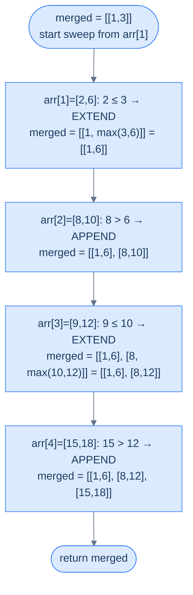
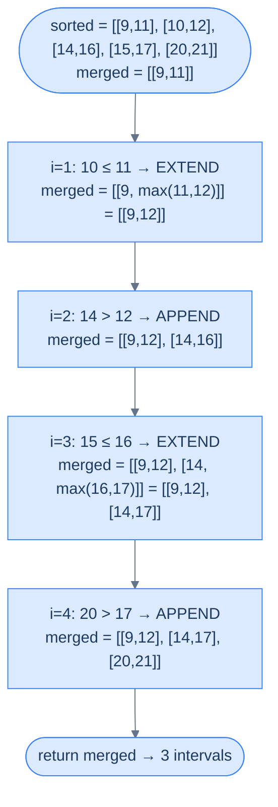
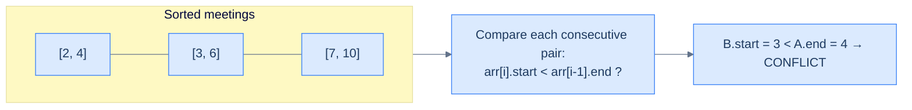
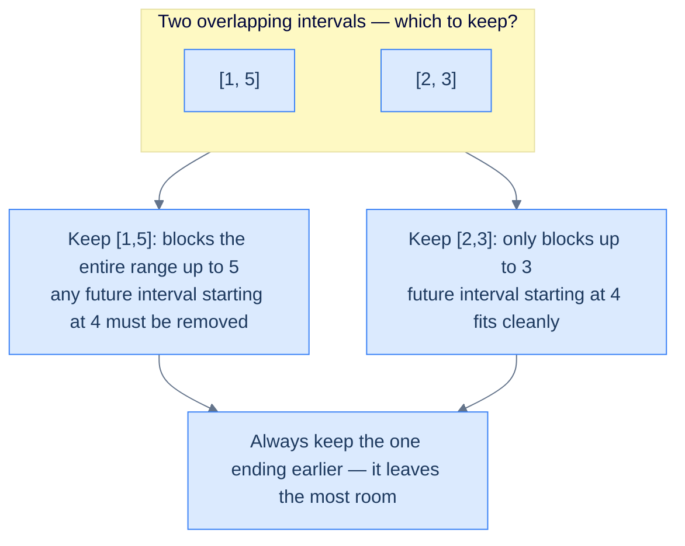
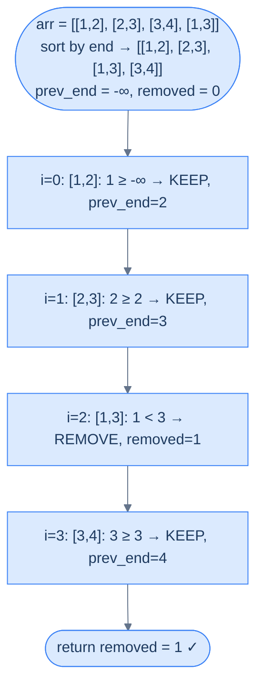

# 9. Pattern: Interval Merging

This section introduces the **line sweep** technique and the **interval merging** pattern — two ideas that take the sliding-window mindset off raw values and apply it to *intervals* on a number line. Once you see overlap problems through this lens, an entire family of "schedule", "calendar", "range", and "time window" problems collapses into one mechanical recipe.

## Table of Contents

1. [Understanding the Line Sweep Technique](#understanding-the-line-sweep-technique)
2. [Understanding the Interval Merging Pattern](#understanding-the-interval-merging-pattern)
3. [Identifying the Interval Merging Pattern](#identifying-the-interval-merging-pattern)
4. [Verify Schedule](#verify-schedule)
5. [Overlap Reduction](#overlap-reduction)
6. [Employee Free Time](#employee-free-time)
7. [Insert Interval](#insert-interval)

***

# Understanding the Line Sweep Technique

## The Hook

Imagine a thousand events scattered across a single day — flights landing, meetings booked, server requests arriving. Your task: find every moment two events overlap. The naive answer compares **every pair** — a million comparisons for a thousand events, a billion for ten thousand. There's a smarter way that does it in roughly the time it takes to *sort* the events. Once you see the trick, you'll never reach for nested loops on interval problems again.

The trick has a name. Computational geometers call it the **line sweep**, and it powers everything from collision detection in games to query planning in databases. Today you're going to learn it from first principles.

---

## The World — A Vertical Line Walking Across Your Data

Picture an x-axis stretched out before you. Every event in your input — every meeting, every flight, every request — gets placed on it as a small horizontal segment. The segment's left edge is its **start time**, the right edge its **end time**.

```d2
plane: "An interval on the x-axis" {
  grid-columns: 4
  grid-gap: 0
  s: "start" {style.fill: "#dcfce7"; style.stroke: "#16a34a"}
  m1: "•"
  m2: "•"
  e: "end" {style.fill: "#fde68a"; style.stroke: "#d97706"}
}

lbl: |md
  `interval = [start, end]`
|

plane -> lbl: "" {style.stroke-dash: 3}
```

<p align="center"><strong>An interval is just two points on a number line — a <code>start</code> and an <code>end</code>. The "axis" represents whatever scalar matters: time, distance, kilometres, frequency.</strong></p>

Now imagine a tall vertical line standing at the very left of the axis. You walk it slowly to the right. Every time the line *crosses* an event boundary — entering an interval or leaving one — something happens: a counter increments, a set updates, an answer gets recorded. The line is your cursor; the events are landmarks; the algorithm is the bookkeeping you do at each landmark.

That walking line is the **sweep line**. You're not comparing pairs anymore — you're processing events in a single ordered pass.

> *Before you read on — what would happen if the events arrived in random order? Could you still sweep the line meaningfully?*

You couldn't. The whole power of the sweep depends on visiting events in a deterministic order — almost always **sorted by start coordinate** (with end as a tiebreaker, or vice versa). Without sorting, the "line" has no axis to walk along.

---

## Step 1 — Sort the Events

Sorting is the price of admission. Intervals are usually sorted **by start coordinate ascending**, and ties broken by end coordinate ascending. The sorted order makes traversal of the array equivalent to walking left-to-right on the x-axis.

```d2
direction: right

unsorted: "Unsorted: arbitrary positions on the axis" {
  grid-columns: 4
  grid-gap: 16
  u1: "[6,8]"
  u2: "[1,3]"
  u3: "[4,7]"
  u4: "[2,5]"
}

sorted: "After sorting by (start, end)" {
  grid-columns: 4
  grid-gap: 16
  s1: "[1,3]" {style.fill: "#dcfce7"; style.stroke: "#16a34a"}
  s2: "[2,5]" {style.fill: "#dcfce7"; style.stroke: "#16a34a"}
  s3: "[4,7]" {style.fill: "#dcfce7"; style.stroke: "#16a34a"}
  s4: "[6,8]" {style.fill: "#dcfce7"; style.stroke: "#16a34a"}
}

unsorted -> sorted
```

<p align="center"><strong>Sort the interval array by <code>start</code> ascending; break ties by <code>end</code> ascending. Iterating the sorted array is now equivalent to scanning the x-axis left-to-right.</strong></p>

Why sort by start first, then by end? Because the sweep advances by start position — the start tells you *when* an event becomes relevant. If two events share a start, the end tiebreaker keeps the smaller, fully-contained one before the longer one. That subtle ordering matters for problems like "merge all overlapping intervals" — we'll see why in a moment.

```d2
tiebreak: "Tiebreak: same start, sort by end ascending" {
  grid-columns: 3
  grid-gap: 16
  t1: "[2,4]" {style.fill: "#dcfce7"; style.stroke: "#16a34a"}
  t2: "[2,7]"
  t3: "[2,9]"
}

note: |md
  Smaller, contained intervals come first

  so the sweep sees them before their longer siblings
|

tiebreak -> note: "" {style.stroke-dash: 3}
```

<p align="center"><strong>Ties on <code>start</code> are broken by <code>end</code> ascending — shorter intervals come first so they fold into the longer one as the sweep continues.</strong></p>

---

## Step 2 — Sweep the Line

With the array sorted, traversing it from left to right *is* the sweep. As you visit each interval, you maintain some piece of state — a counter, a "currently active" set, the last interval you kept. That state encodes the answer-so-far. As the sweep crosses each event, you update the state in O(1) and continue.

```d2
direction: right

axis: "Sorted intervals on the x-axis" {
  grid-columns: 4
  grid-gap: 0
  a: "[1,3]"
  b: "[2,5]"
  c: "[4,7]"
  d: "[6,8]"
}

sweep: "▲ sweep line walks left → right" {style.fill: "#fde68a"; style.stroke: "#d97706"}

state: |md
  **State:** depends on problem

  (active count, merged list, last end seen, ...)
|

axis -> sweep
sweep -> state
```

<p align="center"><strong>The sweep visits each interval in sorted order, updating shared state in O(1). One pass — no nested loops.</strong></p>

The state is **the algorithm**. Different problems need different state:
- **Merge overlaps** → keep the last merged interval and stretch its end forward
- **Maximum concurrent events** → maintain a running count of active intervals
- **Detect any overlap** → remember the largest end seen so far
- **Find gaps** → record any moment where current start > previous end

The sweep itself is universal; the state machine on top is what makes each problem unique.

---

## Complexity Analysis

| | Time | Space |
|---|---|---|
| **Best case (sort in place)** | O(N log N) | O(1) |
| **Worst case (sorted copy)** | O(N log N) | O(N) |

The work breakdown is mechanical:
- **Sorting** — O(N log N), and there's no way around it; the sweep depends on order.
- **Single pass** — O(N) after sorting; each interval handled exactly once with O(1) state updates.

So the total is dominated by the sort: **O(N log N)** in any case. Space is O(1) when you can sort the input in place; O(N) when the problem requires preserving the original order or working on an immutable input.

---

> Sorting + one pass + a small piece of state. That is the entire shape of a sweep. The next section takes this skeleton and grows the most common state machine on top of it: **interval merging**.

***

# Understanding the Interval Merging Pattern

## The Hook

You've got a calendar with 47 overlapping bookings. You want a clean list — no duplicates, no fragments — just the *blocks* of busy time. A reasonable first idea is "compare every pair, merge if they overlap, repeat until stable" — and that's O(N³) on a bad day. The line sweep collapses it to a single left-to-right scan that *can never miss* an overlap. Once you've seen the trick, you'll start spotting interval-merging in problems that don't even mention intervals.

This is the **interval merging pattern** — the most common application of the sweep line on the planet, and the workhorse behind half the "calendar", "ranges", and "schedule" interview questions you'll ever see.

---

## The World — Sweeping a Highlighter Across a Number Line

Picture every interval as a colored stripe drawn on a long sheet of paper. Some stripes overlap, some sit alone. Your job: produce one cleaned-up sheet where overlapping stripes have been **fused** into single, longer stripes, and isolated stripes are left alone.

```d2
direction: right

before: "Before: 5 raw intervals (some overlap)" {
  grid-columns: 5
  grid-gap: 16
  a1: "[1,3]"
  a2: "[2,6]"
  a3: "[8,10]"
  a4: "[9,12]"
  a5: "[15,18]"
}

after: "After: 3 merged intervals" {
  grid-columns: 3
  grid-gap: 16
  b1: "[1,6]" {style.fill: "#dcfce7"; style.stroke: "#16a34a"}
  b2: "[8,12]" {style.fill: "#dcfce7"; style.stroke: "#16a34a"}
  b3: "[15,18]" {style.fill: "#dcfce7"; style.stroke: "#16a34a"}
}

before -> after
```

<p align="center"><strong>Merging fuses overlapping intervals into the smallest set of disjoint intervals that covers all the original ones — like running a highlighter and never lifting it through any overlap.</strong></p>

The mental shortcut: **sweep with a single highlighter**. Whenever the next stripe touches the current one, extend the highlighter rightward. Whenever the next stripe is completely past the current one, lift the pen, start a new stripe.

That mental model *is* the algorithm.

---

## Step 1 — Sort by Start Coordinate

Sorting comes first, as always for a sweep.

```d2
direction: right

in_arr: "arr (unsorted)" {
  grid-columns: 5
  grid-gap: 16
  i1: "[8,10]"
  i2: "[1,3]"
  i3: "[15,18]"
  i4: "[2,6]"
  i5: "[9,12]"
}

out_arr: "arr (sorted by start, then end)" {
  grid-columns: 5
  grid-gap: 16
  o1: "[1,3]" {style.fill: "#dcfce7"; style.stroke: "#16a34a"}
  o2: "[2,6]" {style.fill: "#dcfce7"; style.stroke: "#16a34a"}
  o3: "[8,10]" {style.fill: "#dcfce7"; style.stroke: "#16a34a"}
  o4: "[9,12]" {style.fill: "#dcfce7"; style.stroke: "#16a34a"}
  o5: "[15,18]" {style.fill: "#dcfce7"; style.stroke: "#16a34a"}
}

in_arr -> out_arr
```

<p align="center"><strong>After sorting, intervals appear in left-to-right order on the x-axis. The sweep can now process them in a single pass.</strong></p>

Why start coordinate? Because **two intervals overlap iff the one starting later has its start inside the one starting earlier**. Sorting by start guarantees the "earlier-starting" interval is always the one you've already seen — exactly the one sitting at the back of your `merged` list.

> *Pause and predict — what would go wrong if you sorted by **end** coordinate instead?*

You could lose overlaps. Consider `[[1, 10], [2, 4]]`. Sorted by end: `[[2, 4], [1, 10]]`. Now when you process `[1, 10]`, its start (1) is **before** the previous interval's start (2) — your "is this overlapping the last merged interval?" check no longer makes sense, because the new interval doesn't sit cleanly to the right of the last one. Sorting by start eliminates this whole class of bookkeeping.

---

## Step 2 — Initialize `merged` With the First Interval

Create an output list `merged` and seed it with the first sorted interval. The "current highlighter stripe" is always **the last item in `merged`** — that's the only interval the sweep can extend.

```d2
sorted: "Sorted arr" {
  grid-columns: 5
  grid-gap: 0
  s1: "[1,3]" {style.fill: "#fde68a"; style.stroke: "#d97706"}
  s2: "[2,6]"
  s3: "[8,10]"
  s4: "[9,12]"
  s5: "[15,18]"
}

init: |md
  `merged = [ [1,3] ]`

  (seeded with arr[0])
| {style.fill: "#fde68a"; style.stroke: "#d97706"}

sorted -> init
```

<p align="center"><strong>Seed <code>merged</code> with the first interval. From now on, every new interval is compared only against <code>merged.last</code> — never the entire list.</strong></p>

This is a crucial invariant: **`merged` always contains pairwise disjoint, sorted intervals**. Because the input is sorted, any new overlap can only reach back to the most recent merged interval. We never need to scan further.

---

## Step 3 — Sweep and Decide: Extend or Append

For each subsequent interval `arr[i]`, ask one yes/no question:

> *Does `arr[i]`'s start lie inside or touch the last merged interval's end?*

- **Yes** (`arr[i].start <= merged.last.end`) → **extend** the highlighter. Update `merged.last.end = max(merged.last.end, arr[i].end)`. The `max` matters because `arr[i]` could be entirely contained within the last merged interval — never shrink an interval you've already grown.
- **No** (`arr[i].start > merged.last.end`) → **lift the pen**. Append `arr[i]` to `merged` as a fresh stripe.



<p align="center"><strong>Each iteration peeks at <code>merged.last</code> and either extends its end or appends a fresh interval. The sweep visits every input exactly once.</strong></p>

The `<=` vs `<` distinction is the only edge-case knob. If your problem treats touching intervals like `[1, 3]` and `[3, 5]` as overlapping (e.g. continuous busy time), use `<=`. If it treats them as adjacent-but-distinct (e.g. discrete sessions), use `<`. The whole algorithm is otherwise identical.

---

## Why Only the Last Merged Interval?

Because the input is sorted by start, any interval we process from this point forward has a start coordinate `≥ arr[i].start`. The intervals already inside `merged` (excluding the last) all have **end coordinates that come before `merged.last.start`** — otherwise they would have been merged into `merged.last` themselves. So they cannot possibly overlap with anything still to come.

```d2
direction: right

m: "merged so far" {
  grid-columns: 3
  grid-gap: 0
  m1: "[1,6]"
  m2: "[8,12]"
  m3: "[15,18] ← last" {style.fill: "#fde68a"; style.stroke: "#d97706"}
}

future: |md
  Any future `arr[i]` has `start ≥ 15`<br/>(input is sorted)
|

conc: |md
  Future intervals can ONLY touch or extend `[15,18]` — never `[1,6]` or `[8,12]`
| {style.fill: "#dcfce7"; style.stroke: "#16a34a"}

m -> future
future -> conc
```

<p align="center"><strong>The "compare only against the last" trick works because sorted input plus the merged-so-far invariant guarantee earlier intervals are forever sealed.</strong></p>

That's why the algorithm is O(N) after sorting — every interval is compared against exactly one other interval, ever.

---

## Algorithm Summary

> **Step 1.** Sort `arr` by start coordinate ascending; break ties by end ascending.
>
> **Step 2.** Initialize `merged = [arr[0]]`.
>
> **Step 3.** For `i` from 1 to `len(arr) - 1`:
>
> - **3.1.** If `arr[i].start <= merged.last.end` → set `merged.last.end = max(merged.last.end, arr[i].end)` (extend).
> - **3.2.** Else → append `arr[i]` to `merged` (lift the pen).
>
> **Step 4.** Return `merged`.

The whole pattern — every "merge intervals" problem on every interview prep site — is *that*. Four steps. One pass after sorting.

---

## Implementation

The generic merge function below uses `<=` so touching intervals are merged. Flip it to `<` if your problem treats touching as non-overlapping.


```pseudocode
# Sort by start, then sweep left-to-right merging overlapping intervals into the previous one.
function mergeOverlapping(arr):
    if arr is empty: return empty list
    sort arr by start ascending (tiebreak by end ascending)
    merged ← [copy of arr[0]]
    for i from 1 to length(arr) − 1:
        last ← last element of merged
        if arr[i].start ≤ last.end:                   # overlap (or touch) — extend
            last.end ← max(last.end, arr[i].end)
        else:
            append copy of arr[i] to merged           # disjoint — start a new run
    return merged
```

```python run
from typing import List

def merge_overlapping(arr: List[List[int]]) -> List[List[int]]:
    if not arr:
        return []

    # Sort by start ascending; Python's sort is stable so ties on start
    # naturally break by the original order, but for safety we sort by both.
    arr.sort(key=lambda x: (x[0], x[1]))

    # Seed with the first interval — merged.last is the active highlighter stripe
    merged = [arr[0][:]]   # copy so we don't mutate input

    # Single-pass sweep — compare each interval against the LAST merged one
    for i in range(1, len(arr)):
        last = merged[-1]
        # '<=' treats touching intervals as overlapping. Use '<' to treat
        # touching intervals (e.g. [1,3] and [3,5]) as separate.
        if arr[i][0] <= last[1]:
            # Extend: never shrink — the new interval may sit fully inside last
            last[1] = max(last[1], arr[i][1])
        else:
            # Lift the pen and start a fresh stripe
            merged.append(arr[i][:])

    return merged


print(merge_overlapping([[1, 3], [2, 6], [8, 10], [15, 18]]))   # [[1,6],[8,10],[15,18]]
print(merge_overlapping([[1, 4], [4, 5]]))                       # [[1,5]]
print(merge_overlapping([[1, 4], [2, 3]]))                       # [[1,4]]  (contained)
```

```java run
import java.util.*;

class Solution {
    public int[][] mergeOverlapping(int[][] arr) {
        if (arr.length == 0) return new int[0][];

        // Sort by start ascending; ties broken by end ascending
        Arrays.sort(arr, (a, b) -> a[0] != b[0] ? Integer.compare(a[0], b[0])
                                                : Integer.compare(a[1], b[1]));

        List<int[]> merged = new ArrayList<>();
        merged.add(arr[0].clone());   // copy to avoid mutating input row

        for (int i = 1; i < arr.length; i++) {
            int[] last = merged.get(merged.size() - 1);
            if (arr[i][0] <= last[1]) {
                // Extend the active stripe; never shrink — arr[i] may be contained
                last[1] = Math.max(last[1], arr[i][1]);
            } else {
                // Lift the pen and start a new stripe
                merged.add(arr[i].clone());
            }
        }
        return merged.toArray(new int[merged.size()][]);
    }
}
```

```c run
#include <stdio.h>
#include <stdlib.h>

// Comparator: sort by start ascending, then by end ascending
int cmp(const void* a, const void* b) {
    int* x = *(int**)a;
    int* y = *(int**)b;
    if (x[0] != y[0]) return x[0] - y[0];
    return x[1] - y[1];
}

// Returns a newly-allocated array of merged intervals; *outSize gets the count
int** mergeOverlapping(int** arr, int n, int* outSize) {
    if (n == 0) { *outSize = 0; return NULL; }

    qsort(arr, n, sizeof(int*), cmp);

    int** merged = (int**)malloc(sizeof(int*) * n);
    int  count   = 0;

    // Seed with a copy of the first interval
    merged[count] = (int*)malloc(sizeof(int) * 2);
    merged[count][0] = arr[0][0];
    merged[count][1] = arr[0][1];
    count++;

    for (int i = 1; i < n; i++) {
        int* last = merged[count - 1];
        if (arr[i][0] <= last[1]) {
            // Extend — guard against shrinking when arr[i] is contained
            if (arr[i][1] > last[1]) last[1] = arr[i][1];
        } else {
            merged[count] = (int*)malloc(sizeof(int) * 2);
            merged[count][0] = arr[i][0];
            merged[count][1] = arr[i][1];
            count++;
        }
    }
    *outSize = count;
    return merged;
}
```

```cpp run
#include <algorithm>
#include <vector>
using namespace std;

class Solution {
public:
    vector<vector<int>> mergeOverlapping(vector<vector<int>>& arr) {
        if (arr.empty()) return {};

        // Sort by start ascending; ties broken by end ascending
        sort(arr.begin(), arr.end());

        vector<vector<int>> merged;
        merged.push_back(arr[0]);   // seed with the first interval

        for (int i = 1; i < (int)arr.size(); i++) {
            // '<=' treats touching intervals as overlapping
            if (arr[i][0] <= merged.back()[1]) {
                // Extend — max() handles fully-contained intervals correctly
                merged.back()[1] = max(merged.back()[1], arr[i][1]);
            } else {
                // Append — start a fresh stripe
                merged.push_back(arr[i]);
            }
        }
        return merged;
    }
};
```

```scala run
object Solution {
  def mergeOverlapping(arr: Array[Array[Int]]): Array[Array[Int]] = {
    if (arr.isEmpty) return Array.empty

    // Sort by start ascending; ties broken by end ascending
    val sorted = arr.sortWith((a, b) => if (a(0) != b(0)) a(0) < b(0) else a(1) < b(1))
    val merged = scala.collection.mutable.ArrayBuffer[Array[Int]](sorted(0).clone())

    for (i <- 1 until sorted.length) {
      val last = merged.last
      if (sorted(i)(0) <= last(1)) {
        // Extend — last(1) might already be larger than sorted(i)(1) (containment)
        last(1) = math.max(last(1), sorted(i)(1))
      } else {
        merged += sorted(i).clone()
      }
    }
    merged.toArray
  }
}
```

```typescript run
function mergeOverlapping(arr: number[][]): number[][] {
    if (arr.length === 0) return [];

    // Sort by start ascending; ties broken by end ascending
    arr.sort((a, b) => a[0] - b[0] || a[1] - b[1]);

    const merged: number[][] = [arr[0].slice()];

    for (let i = 1; i < arr.length; i++) {
        const last = merged[merged.length - 1];
        if (arr[i][0] <= last[1]) {
            // Extend the active stripe; max() handles fully-contained intervals
            last[1] = Math.max(last[1], arr[i][1]);
        } else {
            merged.push(arr[i].slice());
        }
    }
    return merged;
}
```

```go run
package main

import (
    "fmt"
    "sort"
)

func mergeOverlapping(arr [][]int) [][]int {
    if len(arr) == 0 {
        return [][]int{}
    }

    // Sort by start ascending; ties broken by end ascending
    sort.Slice(arr, func(i, j int) bool {
        if arr[i][0] != arr[j][0] {
            return arr[i][0] < arr[j][0]
        }
        return arr[i][1] < arr[j][1]
    })

    merged := [][]int{{arr[0][0], arr[0][1]}}   // seed copy

    for i := 1; i < len(arr); i++ {
        last := merged[len(merged)-1]
        if arr[i][0] <= last[1] {
            // Extend; guard against shrinking when arr[i] is contained
            if arr[i][1] > last[1] {
                last[1] = arr[i][1]
            }
        } else {
            merged = append(merged, []int{arr[i][0], arr[i][1]})
        }
    }
    return merged
}

func main() {
    fmt.Println(mergeOverlapping([][]int{{1, 3}, {2, 6}, {8, 10}, {15, 18}}))
}
```

```rust run
fn merge_overlapping(mut arr: Vec<Vec<i32>>) -> Vec<Vec<i32>> {
    if arr.is_empty() {
        return Vec::new();
    }

    // Sort by start ascending; ties broken by end ascending
    arr.sort_by(|a, b| a[0].cmp(&b[0]).then(a[1].cmp(&b[1])));

    let mut merged: Vec<Vec<i32>> = vec![arr[0].clone()];

    for i in 1..arr.len() {
        let last_idx = merged.len() - 1;
        if arr[i][0] <= merged[last_idx][1] {
            // Extend; max() handles the contained-interval case
            merged[last_idx][1] = merged[last_idx][1].max(arr[i][1]);
        } else {
            merged.push(arr[i].clone());
        }
    }
    merged
}

fn main() {
    println!("{:?}", merge_overlapping(vec![vec![1,3], vec![2,6], vec![8,10], vec![15,18]]));
}
```


---

## Complexity Analysis

| | Time | Space |
|---|---|---|
| **Best case (all merge into one)** | O(N log N) | O(1) extra (output is one interval) |
| **Worst case (no overlap)** | O(N log N) | O(N) extra (output equals input) |

Sorting dominates at **O(N log N)**. The sweep itself is O(N). Space depends on the output: best case is one big merged interval (O(1)), worst case is N disjoint intervals (O(N)).

---

> The pattern is mechanical, but identifying *when* to apply it is the real skill. The next section gives you a template for spotting interval-merging problems in disguise — and walks through a concrete example end to end.

***

# Identifying the Interval Merging Pattern

## The Hook

You won't always see the word "merge" in the problem statement. You'll see "find the minimum number of meeting rooms", "verify the schedule has no conflicts", "compress the busy intervals", "find the gaps". All of these are interval merging in costume. The trick is recognizing the underlying shape: **a set of intervals + a question whose answer becomes obvious once overlaps are merged**.

This section gives you a one-line template for spotting it, and then walks a full example from problem statement → solution.

---

## The Identification Template

> Given an array of intervals, **merge all overlapping intervals**, and the merged form either *is* the answer or makes the answer trivially derivable.

If you can rephrase the problem so that step one is "merge overlapping intervals", you have a candidate. After merging, you should be able to read off the answer with one more O(N) pass — counting, summing lengths, finding gaps, picking the first or last, etc.

If the rephrased problem requires *not* merging — for example, "count the maximum number of overlapping intervals at any moment" — then this is **not** an interval-merging problem. That belongs to the maximum-overlap pattern (next section). Most "schedule" problems are easy or medium difficulty.

---

## A Worked Example — Delivery Intervals

> **Problem statement:** A delivery service expects a sequence of deliveries throughout the day, each described by a `[start, end]` time window. Find the **minimum number of non-overlapping time intervals** during which at least one delivery is expected at every moment.

```d2
direction: right

input_arr: "Raw delivery windows" {
  grid-columns: 5
  grid-gap: 16
  i1: "[9, 11]"
  i2: "[10, 12]"
  i3: "[14, 16]"
  i4: "[15, 17]"
  i5: "[20, 21]"
}

output_arr: "Minimum non-overlapping busy intervals" {
  grid-columns: 3
  grid-gap: 16
  o1: "[9, 12]" {style.fill: "#dcfce7"; style.stroke: "#16a34a"}
  o2: "[14, 17]" {style.fill: "#dcfce7"; style.stroke: "#16a34a"}
  o3: "[20, 21]" {style.fill: "#dcfce7"; style.stroke: "#16a34a"}
}

input_arr -> output_arr
```

<p align="center"><strong>Find the minimum set of non-overlapping windows that cover every delivery — equivalently, "merge all overlapping deliveries". The merged count <em>is</em> the answer.</strong></p>

---

### Does It Fit the Template?

Apply the template:
- "Given an array of intervals" → ✓ delivery windows.
- "Merge all overlapping intervals" → ✓ the question literally asks for the smallest set of non-overlapping intervals covering everything.
- "Answer trivially derivable" → ✓ the merged list is itself the answer; we just return it (or its length).

This is a textbook interval-merging problem. We can solve it by running the generic merge directly.

---

### The Solution



<p align="center"><strong>The sweep extends the highlighter twice and lifts it twice. Final answer: three non-overlapping busy windows.</strong></p>


```pseudocode
# Identical algorithm to mergeOverlapping — re-listed here for the delivery scenario.
function deliveryIntervals(times):
    if times is empty: return empty list
    sort times by start ascending (tiebreak by end ascending)
    merged ← [copy of times[0]]
    for i from 1 to length(times) − 1:
        last ← last element of merged
        if times[i].start ≤ last.end:
            last.end ← max(last.end, times[i].end)
        else:
            append copy of times[i] to merged
    return merged
```

```python run
from typing import List

def delivery_intervals(times: List[List[int]]) -> List[List[int]]:
    if not times:
        return []

    times.sort(key=lambda x: (x[0], x[1]))   # sort by start, then end
    merged = [times[0][:]]                    # seed with a copy

    for i in range(1, len(times)):
        last = merged[-1]
        if times[i][0] <= last[1]:
            # Overlap — extend the current busy window
            last[1] = max(last[1], times[i][1])
        else:
            # Gap — start a fresh busy window
            merged.append(times[i][:])

    return merged


print(delivery_intervals([[9, 11], [10, 12], [14, 16], [15, 17], [20, 21]]))
# [[9, 12], [14, 17], [20, 21]]
```

```java run
import java.util.*;

class Solution {
    public int[][] deliveryIntervals(int[][] times) {
        if (times.length == 0) return new int[0][];

        Arrays.sort(times, (a, b) -> a[0] != b[0] ? Integer.compare(a[0], b[0])
                                                  : Integer.compare(a[1], b[1]));

        List<int[]> merged = new ArrayList<>();
        merged.add(times[0].clone());

        for (int i = 1; i < times.length; i++) {
            int[] last = merged.get(merged.size() - 1);
            if (times[i][0] <= last[1]) {
                last[1] = Math.max(last[1], times[i][1]);
            } else {
                merged.add(times[i].clone());
            }
        }
        return merged.toArray(new int[merged.size()][]);
    }
}
```

```c run
#include <stdio.h>
#include <stdlib.h>

int cmp(const void* a, const void* b) {
    int* x = *(int**)a;
    int* y = *(int**)b;
    if (x[0] != y[0]) return x[0] - y[0];
    return x[1] - y[1];
}

int** deliveryIntervals(int** times, int n, int* outSize) {
    if (n == 0) { *outSize = 0; return NULL; }
    qsort(times, n, sizeof(int*), cmp);

    int** merged = (int**)malloc(sizeof(int*) * n);
    int  count = 0;

    merged[count] = (int*)malloc(sizeof(int) * 2);
    merged[count][0] = times[0][0];
    merged[count][1] = times[0][1];
    count++;

    for (int i = 1; i < n; i++) {
        int* last = merged[count - 1];
        if (times[i][0] <= last[1]) {
            if (times[i][1] > last[1]) last[1] = times[i][1];
        } else {
            merged[count] = (int*)malloc(sizeof(int) * 2);
            merged[count][0] = times[i][0];
            merged[count][1] = times[i][1];
            count++;
        }
    }
    *outSize = count;
    return merged;
}
```

```cpp run
#include <algorithm>
#include <vector>
using namespace std;

class Solution {
public:
    vector<vector<int>> deliveryIntervals(vector<vector<int>>& times) {
        if (times.empty()) return {};

        sort(times.begin(), times.end());

        vector<vector<int>> merged;
        merged.push_back(times[0]);

        for (int i = 1; i < (int)times.size(); i++) {
            if (times[i][0] <= merged.back()[1]) {
                merged.back()[1] = max(merged.back()[1], times[i][1]);
            } else {
                merged.push_back(times[i]);
            }
        }
        return merged;
    }
};
```

```scala run
object Solution {
  def deliveryIntervals(times: Array[Array[Int]]): Array[Array[Int]] = {
    if (times.isEmpty) return Array.empty
    val sorted = times.sortWith((a, b) => if (a(0) != b(0)) a(0) < b(0) else a(1) < b(1))
    val merged = scala.collection.mutable.ArrayBuffer[Array[Int]](sorted(0).clone())
    for (i <- 1 until sorted.length) {
      val last = merged.last
      if (sorted(i)(0) <= last(1)) last(1) = math.max(last(1), sorted(i)(1))
      else merged += sorted(i).clone()
    }
    merged.toArray
  }
}
```

```typescript run
function deliveryIntervals(times: number[][]): number[][] {
    if (times.length === 0) return [];
    times.sort((a, b) => a[0] - b[0] || a[1] - b[1]);
    const merged: number[][] = [times[0].slice()];
    for (let i = 1; i < times.length; i++) {
        const last = merged[merged.length - 1];
        if (times[i][0] <= last[1]) last[1] = Math.max(last[1], times[i][1]);
        else merged.push(times[i].slice());
    }
    return merged;
}
```

```go run
package main

import "sort"

func deliveryIntervals(times [][]int) [][]int {
    if len(times) == 0 {
        return [][]int{}
    }
    sort.Slice(times, func(i, j int) bool {
        if times[i][0] != times[j][0] {
            return times[i][0] < times[j][0]
        }
        return times[i][1] < times[j][1]
    })
    merged := [][]int{{times[0][0], times[0][1]}}
    for i := 1; i < len(times); i++ {
        last := merged[len(merged)-1]
        if times[i][0] <= last[1] {
            if times[i][1] > last[1] {
                last[1] = times[i][1]
            }
        } else {
            merged = append(merged, []int{times[i][0], times[i][1]})
        }
    }
    return merged
}
```

```rust run
fn delivery_intervals(mut times: Vec<Vec<i32>>) -> Vec<Vec<i32>> {
    if times.is_empty() { return Vec::new(); }
    times.sort_by(|a, b| a[0].cmp(&b[0]).then(a[1].cmp(&b[1])));
    let mut merged: Vec<Vec<i32>> = vec![times[0].clone()];
    for i in 1..times.len() {
        let j = merged.len() - 1;
        if times[i][0] <= merged[j][1] {
            merged[j][1] = merged[j][1].max(times[i][1]);
        } else {
            merged.push(times[i].clone());
        }
    }
    merged
}
```


The pattern fits, the algorithm is the generic merge, the answer is `merged` itself. **O(N log N)** time, **O(N)** space for the output.

---

## Example Problems

The four problems in this section all reduce to interval merging — sometimes in disguise. We'll work through each one with the same template.

- **Verify Schedule** — given meeting intervals, can a single person attend all of them?
- **Overlap Reduction** — given intervals, find the minimum number to remove so the rest are non-overlapping.
- **Employee Free Time** — given each employee's busy intervals, find the time windows when *every* employee is free.
- **Insert Interval** — given a sorted, non-overlapping list, insert a new interval and re-merge.

The first two are variations on plain merging. The last two stress your understanding of the *invariant* — what the merged list represents and how to update it without doing a full re-merge.

***

# Verify Schedule

## The Hook

You're scheduling assistant for a busy executive. Given a day's worth of meeting requests as `[start, end]` intervals, your one job is to answer: **can they attend every meeting?** Miss a single overlap and your reputation is gone. Brute force compares every pair (O(N²)). The right answer comes from the same line-sweep idea you just learned — and runs in O(N log N).

## The Problem

> Given an array of meeting time intervals `arr` where `arr[i] = [start_i, end_i]`, return `true` if a single person can attend **all** meetings without conflict, and `false` otherwise. Treat touching intervals (like `[1, 3]` and `[3, 5]`) as **non-conflicting** — back-to-back meetings are fine.

```
Input:  arr = [[0, 30], [5, 10], [15, 20]]
Output: false        ([0,30] overlaps both [5,10] and [15,20])

Input:  arr = [[7, 10], [2, 4]]
Output: true         (no overlap; sorted view is [[2,4], [7,10]])

Input:  arr = [[1, 3], [3, 6]]
Output: true         (touching, not overlapping — back-to-back is allowed)

Input:  arr = []
Output: true         (no meetings → no conflicts)
```

---

## What Does "Conflict" Mean?

Two meetings conflict iff one starts **strictly before** the other ends. After sorting by start, the only conflict that can possibly exist between meeting `i` and any earlier meeting is between `arr[i]` and `arr[i-1]` — because `arr[i-1]` has the largest end of any earlier meeting *we care about* (the one that could still be running when `arr[i]` begins).



<p align="center"><strong>After sorting by start, a conflict can only happen between consecutive intervals. We never need to compare further back.</strong></p>

> *Pause and predict — does sorting by end work too? Try `[[7,10], [2,4]]` sorted by end → `[[2,4], [7,10]]`. Does the consecutive-pair check still detect every conflict?*

It happens to work for this example, but consider `[[1, 10], [2, 3]]`. Sorted by end: `[[2, 3], [1, 10]]`. Now `arr[1].start = 1 < arr[0].end = 3` — looks like a conflict (correct), but the **reason** is now muddled because `arr[1]` actually starts *before* `arr[0]`. The clean "compare consecutive" logic only holds when sorted by start.

---

## The Solution

After sorting, sweep left-to-right and check that **each meeting starts no earlier than the previous one ends**. The first time the check fails, return `false`. If the loop completes, no conflicts — return `true`.


```pseudocode
# After sorting by start, conflicts can only exist between consecutive pairs.
# Strict < — touching intervals like [1,3] and [3,5] don't conflict.
function canAttendAll(arr):
    if length(arr) < 2: return true
    sort arr by start ascending
    for i from 1 to length(arr) − 1:
        if arr[i].start < arr[i − 1].end:
            return false
    return true
```

```python run
from typing import List

def can_attend_all(arr: List[List[int]]) -> bool:
    # Empty or single meeting can never have a conflict
    if len(arr) < 2:
        return True

    # Sort by start ascending — conflicts can only exist between consecutive pairs
    arr.sort(key=lambda x: x[0])

    for i in range(1, len(arr)):
        # Strict '<' because touching meetings ([1,3] and [3,5]) are allowed
        if arr[i][0] < arr[i - 1][1]:
            return False
    return True


print(can_attend_all([[0, 30], [5, 10], [15, 20]]))   # False
print(can_attend_all([[7, 10], [2, 4]]))              # True
print(can_attend_all([[1, 3], [3, 6]]))               # True (touching ok)
print(can_attend_all([]))                              # True
```

```java run
import java.util.*;

class Solution {
    public boolean canAttendAll(int[][] arr) {
        if (arr.length < 2) return true;

        // Sort by start ascending
        Arrays.sort(arr, (a, b) -> Integer.compare(a[0], b[0]));

        for (int i = 1; i < arr.length; i++) {
            // '<' so touching meetings are allowed
            if (arr[i][0] < arr[i - 1][1]) return false;
        }
        return true;
    }
}
```

```c run
#include <stdbool.h>
#include <stdlib.h>

int cmp(const void* a, const void* b) {
    return (*(int**)a)[0] - (*(int**)b)[0];
}

bool canAttendAll(int** arr, int n) {
    if (n < 2) return true;
    qsort(arr, n, sizeof(int*), cmp);
    for (int i = 1; i < n; i++) {
        if (arr[i][0] < arr[i - 1][1]) return false;
    }
    return true;
}
```

```cpp run
#include <algorithm>
#include <vector>
using namespace std;

class Solution {
public:
    bool canAttendAll(vector<vector<int>>& arr) {
        if (arr.size() < 2) return true;
        sort(arr.begin(), arr.end());   // sort by start ascending
        for (int i = 1; i < (int)arr.size(); i++) {
            if (arr[i][0] < arr[i - 1][1]) return false;
        }
        return true;
    }
};
```

```scala run
object Solution {
  def canAttendAll(arr: Array[Array[Int]]): Boolean = {
    if (arr.length < 2) return true
    val sorted = arr.sortBy(_(0))
    for (i <- 1 until sorted.length) {
      if (sorted(i)(0) < sorted(i - 1)(1)) return false
    }
    true
  }
}
```

```typescript run
function canAttendAll(arr: number[][]): boolean {
    if (arr.length < 2) return true;
    arr.sort((a, b) => a[0] - b[0]);
    for (let i = 1; i < arr.length; i++) {
        if (arr[i][0] < arr[i - 1][1]) return false;
    }
    return true;
}
```

```go run
package main

import "sort"

func canAttendAll(arr [][]int) bool {
    if len(arr) < 2 {
        return true
    }
    sort.Slice(arr, func(i, j int) bool { return arr[i][0] < arr[j][0] })
    for i := 1; i < len(arr); i++ {
        if arr[i][0] < arr[i-1][1] {
            return false
        }
    }
    return true
}
```

```rust run
fn can_attend_all(mut arr: Vec<Vec<i32>>) -> bool {
    if arr.len() < 2 { return true; }
    arr.sort_by_key(|x| x[0]);
    for i in 1..arr.len() {
        if arr[i][0] < arr[i - 1][1] { return false; }
    }
    true
}

fn main() {
    println!("{}", can_attend_all(vec![vec![0,30], vec![5,10], vec![15,20]])); // false
    println!("{}", can_attend_all(vec![vec![1,3], vec![3,6]]));                // true
}
```


<details>
<summary><strong>Trace — arr = [[0, 30], [5, 10], [15, 20]]</strong></summary>

```
After sort by start: [[0, 30], [5, 10], [15, 20]]

i=1: arr[1].start = 5  < arr[0].end = 30  → CONFLICT, return false

Result: false ✓   ([0,30] swallows the entire morning)
```

</details>

<details>
<summary><strong>Trace — arr = [[1, 3], [3, 6]]</strong></summary>

```
After sort by start: [[1, 3], [3, 6]]

i=1: arr[1].start = 3  < arr[0].end = 3  →  3 < 3 is FALSE → ok

Loop completes → return true ✓
The strict '<' is what allows touching meetings. With '<=' this would return false.
```

</details>

---

## Complexity Analysis

| | Complexity | Reasoning |
|---|---|---|
| **Time** | O(N log N) | Dominated by sorting; the sweep is O(N) |
| **Space** | O(1) extra (in-place sort) or O(log N) for sort recursion stack | No extra structure built |

---

## Edge Cases

| Case | Example | Expected | Reasoning |
|---|---|---|---|
| Empty input | `[]` | `true` | No meetings means no conflict by vacuous truth |
| Single meeting | `[[5, 10]]` | `true` | Loop body never runs |
| Touching at boundary | `[[1, 3], [3, 6]]` | `true` | `<` strict — back-to-back is allowed |
| Identical start times | `[[1, 5], [1, 4]]` | `false` | After sort, `arr[1].start = 1 < arr[0].end = 5` → conflict |
| Out-of-order input | `[[7, 10], [2, 4]]` | `true` | Sort fixes order before sweep |
| Fully contained | `[[1, 10], [3, 5]]` | `false` | After sort, `arr[1].start = 3 < arr[0].end = 10` |

---

## Final Takeaway

Verify Schedule is the smallest possible interval-merging problem — you don't even need to *build* the merged list, just **detect** the first overlap during the sweep. The `<` vs `<=` choice is the only domain-specific knob, and it captures whether your problem treats touching as overlapping. When you next see a problem with the words "can attend", "schedule conflict", "double-booking", or "compatible meetings", reach for sort + consecutive-pair check.

> **Transfer Challenge:** Modify the function to return the *first conflicting pair* of meetings (their original indices), not just `true`/`false`.
>
> <details><summary><strong>Solution hint</strong></summary>
>
> Pair each meeting with its original index before sorting (e.g. tuples `(start, end, idx)`). When the check fires, return `(arr[i-1].idx, arr[i].idx)`. Sorting now needs to be on `start` only, but storage stays O(N).
>
> </details>

***

# Overlap Reduction

## The Hook

A conference room is double-booked. Three meetings overlap; you need to **cancel as few as possible** so the survivors don't conflict. Naively, this looks like a brutal combinatorial search — try every subset, check if it's conflict-free, take the largest. Exponential. The clean answer is a single sort + sweep that picks the right victims using one decision rule, and you'll see the rule emerge naturally from the line-sweep mindset.

## The Problem

> Given an array of intervals `arr`, return the **minimum number of intervals to remove** so that the remaining intervals are pairwise non-overlapping. Touching intervals (`[1, 2]` and `[2, 3]`) are considered **non-overlapping**.

```
Input:  arr = [[1, 2], [2, 3], [3, 4], [1, 3]]
Output: 1            (remove [1,3] → survivors [[1,2],[2,3],[3,4]] are non-overlapping)

Input:  arr = [[1, 2], [1, 2], [1, 2]]
Output: 2            (keep only one of the duplicates)

Input:  arr = [[1, 2], [2, 3]]
Output: 0            (touching, no removal needed)

Input:  arr = []
Output: 0            (nothing to remove)
```

---

## The Greedy Insight — Sort by End, Not by Start

Most interval problems sort by start. This one is the famous exception: **sort by end ascending**. The reasoning is the heart of the algorithm.

> *Pause and predict — when two intervals overlap and you must remove one, which one do you keep?*

You keep the one that **ends earlier**, because it leaves the most room for future intervals to slot in conflict-free. The interval ending later "sticks out further" and is more likely to collide with whatever comes next.



<p align="center"><strong>Greedy choice: when two intervals collide, keep the one ending sooner. Sorting by end ascending makes this choice automatic for the entire sweep.</strong></p>

This is a classic **greedy algorithm** — the activity selection problem in disguise.

---

## The Algorithm

> **Step 1.** Sort `arr` by **end coordinate ascending**.
>
> **Step 2.** Track `prev_end` — the end of the most recently kept interval. Initialize to `-infinity`.
>
> **Step 3.** Initialize `removed = 0`.
>
> **Step 4.** For each interval `[s, e]` in sorted order:
> - If `s >= prev_end` → keep it; update `prev_end = e`.
> - Else → it overlaps with the kept one; **remove** it (`removed += 1`).
>
> **Step 5.** Return `removed`.



<p align="center"><strong>Sort by end. Keep an interval iff its start lies at or after the last kept end. Every removed interval was provably the right victim.</strong></p>

---

## The Solution


```pseudocode
# Greedy: sort by END ascending, keep early-ending intervals.
# Each kept interval leaves the most room for future ones.
function eraseOverlapIntervals(arr):
    if length(arr) < 2: return 0
    sort arr by end ascending
    removed ← 0
    prevEnd ← −∞
    for each (s, e) in arr:
        if s ≥ prevEnd:                               # disjoint with the last kept → keep
            prevEnd ← e
        else:
            removed ← removed + 1                     # overlaps; this one ends later → drop
    return removed
```

```python run
from typing import List

def erase_overlap_intervals(arr: List[List[int]]) -> int:
    if len(arr) < 2:
        return 0

    # Sort by END ascending — the greedy "keep early-ending intervals" rule
    arr.sort(key=lambda x: x[1])

    removed  = 0
    prev_end = float('-inf')   # nothing kept yet → any start is acceptable

    for s, e in arr:
        if s >= prev_end:
            # Non-overlapping with the last kept interval → keep it
            prev_end = e
        else:
            # Overlap — remove this one (it ends later than the kept one
            # because the array is sorted by end ascending)
            removed += 1

    return removed


print(erase_overlap_intervals([[1, 2], [2, 3], [3, 4], [1, 3]]))   # 1
print(erase_overlap_intervals([[1, 2], [1, 2], [1, 2]]))           # 2
print(erase_overlap_intervals([[1, 2], [2, 3]]))                   # 0
```

```java run
import java.util.*;

class Solution {
    public int eraseOverlapIntervals(int[][] arr) {
        if (arr.length < 2) return 0;

        // Sort by END ascending
        Arrays.sort(arr, (a, b) -> Integer.compare(a[1], b[1]));

        int removed  = 0;
        int prevEnd  = Integer.MIN_VALUE;

        for (int[] iv : arr) {
            if (iv[0] >= prevEnd) {
                prevEnd = iv[1];   // keep
            } else {
                removed++;          // overlap → remove
            }
        }
        return removed;
    }
}
```

```c run
#include <stdlib.h>
#include <limits.h>

int cmp(const void* a, const void* b) {
    return (*(int**)a)[1] - (*(int**)b)[1];
}

int eraseOverlapIntervals(int** arr, int n) {
    if (n < 2) return 0;
    qsort(arr, n, sizeof(int*), cmp);

    int removed = 0;
    int prevEnd = INT_MIN;

    for (int i = 0; i < n; i++) {
        if (arr[i][0] >= prevEnd) prevEnd = arr[i][1];
        else removed++;
    }
    return removed;
}
```

```cpp run
#include <algorithm>
#include <vector>
#include <climits>
using namespace std;

class Solution {
public:
    int eraseOverlapIntervals(vector<vector<int>>& arr) {
        if (arr.size() < 2) return 0;

        // Sort by end ascending
        sort(arr.begin(), arr.end(),
             [](const vector<int>& a, const vector<int>& b) { return a[1] < b[1]; });

        int removed = 0;
        int prevEnd = INT_MIN;

        for (auto& iv : arr) {
            if (iv[0] >= prevEnd) prevEnd = iv[1];
            else removed++;
        }
        return removed;
    }
};
```

```scala run
object Solution {
  def eraseOverlapIntervals(arr: Array[Array[Int]]): Int = {
    if (arr.length < 2) return 0
    val sorted = arr.sortBy(_(1))
    var removed = 0
    var prevEnd = Int.MinValue
    for (iv <- sorted) {
      if (iv(0) >= prevEnd) prevEnd = iv(1) else removed += 1
    }
    removed
  }
}
```

```typescript run
function eraseOverlapIntervals(arr: number[][]): number {
    if (arr.length < 2) return 0;
    arr.sort((a, b) => a[1] - b[1]);

    let removed = 0;
    let prevEnd = -Infinity;

    for (const [s, e] of arr) {
        if (s >= prevEnd) prevEnd = e;
        else removed++;
    }
    return removed;
}
```

```go run
package main

import (
    "math"
    "sort"
)

func eraseOverlapIntervals(arr [][]int) int {
    if len(arr) < 2 {
        return 0
    }
    sort.Slice(arr, func(i, j int) bool { return arr[i][1] < arr[j][1] })

    removed := 0
    prevEnd := math.MinInt32

    for _, iv := range arr {
        if iv[0] >= prevEnd {
            prevEnd = iv[1]
        } else {
            removed++
        }
    }
    return removed
}
```

```rust run
fn erase_overlap_intervals(mut arr: Vec<Vec<i32>>) -> i32 {
    if arr.len() < 2 { return 0; }
    arr.sort_by_key(|x| x[1]);

    let mut removed = 0;
    let mut prev_end = i32::MIN;

    for iv in &arr {
        if iv[0] >= prev_end { prev_end = iv[1]; }
        else { removed += 1; }
    }
    removed
}
```


<details>
<summary><strong>Trace — arr = [[1, 2], [2, 3], [3, 4], [1, 3]]</strong></summary>

```
Sort by end ascending: [[1,2], [2,3], [1,3], [3,4]]
prev_end = -∞, removed = 0

iv=[1,2]: 1 ≥ -∞ → KEEP    | prev_end=2 | removed=0
iv=[2,3]: 2 ≥  2 → KEEP    | prev_end=3 | removed=0
iv=[1,3]: 1 <  3 → REMOVE  | prev_end=3 | removed=1
iv=[3,4]: 3 ≥  3 → KEEP    | prev_end=4 | removed=1

Result: 1 ✓   (the [1,3] is the unavoidable victim)
```

</details>

---

## Why Greedy Works — The Exchange Argument

Suppose the optimal solution keeps interval `X` while our greedy keeps a different interval `Y` (with `Y.end <= X.end`). Anything that fits after `X` also fits after `Y` (because `Y` ends earlier or at the same point). So we can **swap `X` for `Y`** in the optimal solution without losing any other intervals — proving our greedy choice is always at least as good. Apply this argument inductively across the whole sweep, and the greedy solution matches the optimum.

This is the same exchange argument that powers the **activity selection problem** in algorithm textbooks.

---

## Complexity Analysis

| | Complexity | Reasoning |
|---|---|---|
| **Time** | O(N log N) | Sort dominates; sweep is O(N) |
| **Space** | O(1) extra (or O(log N) for sort stack) | No auxiliary structure |

---

## Edge Cases

| Case | Example | Expected | Reasoning |
|---|---|---|---|
| Empty | `[]` | `0` | Nothing to remove |
| Single | `[[1, 5]]` | `0` | One interval cannot conflict |
| All identical | `[[1,2],[1,2],[1,2]]` | `2` | Keep one, remove the other two |
| Touching (no overlap) | `[[1,2],[2,3]]` | `0` | `s >= prev_end` includes equality |
| Fully nested | `[[1,10],[2,3],[4,5]]` | `1` | Sort by end → `[[2,3],[4,5],[1,10]]`; the wide `[1,10]` is the removal |
| Already disjoint | `[[1,2],[3,4],[5,6]]` | `0` | Greedy keeps everything |

---

## The Relationship — Why End-Sort Beats Start-Sort Here

| Sort key | Verify Schedule (Q1) | Overlap Reduction (Q2) |
|---|---|---|
| **By start** | ✓ correct | ✗ wrong — picks the wrong victims |
| **By end** | ✗ awkward (needs extra bookkeeping) | ✓ optimal greedy |

Verify Schedule cares about **detection** (is there *any* overlap?), so the natural left-to-right sweep on starts works. Overlap Reduction cares about **selection** (keep the most intervals possible), and selection benefits from "always commit to the choice that closes earliest". This is the same reason CPU scheduling, classroom assignments, and bandwidth packing all use end-time greedy strategies.

---

## Final Takeaway

Overlap Reduction is your introduction to **greedy interval algorithms**. The pivot from "sort by start" to "sort by end" is the lesson that pays the highest dividends elsewhere — activity selection, minimum number of arrows to burst balloons, classroom assignment. Whenever the question is *minimize removals* or *maximize keeps* on a set of intervals, reach for sort-by-end-ascending plus the greedy keep-or-skip rule.

> **Transfer Challenge:** Given a set of intervals, return the **maximum number you can keep** such that the survivors are pairwise non-overlapping (instead of the count to remove).
>
> <details><summary><strong>Solution hint</strong></summary>
>
> The two answers are complementary: `maximum_kept = N - removed`. Your greedy already counts the kept intervals implicitly — just `return N - removed`. Or rewrite the loop to count `kept` instead. Same algorithm, different return statement.
>
> </details>

***

# Employee Free Time

## The Hook

You're scheduling a meeting between three engineers. Each one's calendar is a sorted list of busy intervals. You want every block of time when **all three are free simultaneously** — the moments when a meeting could actually happen. Naively, you'd intersect schedules pairwise, which gets ugly fast. The clean approach is to **flatten everyone's busy time onto one number line**, merge all the overlapping busy blocks, then read off the gaps. Sweep + merge + complement.

## The Problem

> You are given a list of `K` employees, where each employee's schedule is a sorted, non-overlapping list of busy intervals. Return the list of **finite intervals** during which **all employees are simultaneously free**, sorted in ascending order. Touching intervals are considered overlapping (no zero-length free blocks). Free time before the earliest busy moment or after the latest busy moment is **not** included — only intervals bounded on both sides by busy time.

```
Input:  schedules = [[[1, 3], [6, 7]],
                     [[2, 4]],
                     [[2, 5], [9, 12]]]

Step 1 — flatten busy times:  [[1,3], [6,7], [2,4], [2,5], [9,12]]
Step 2 — merge overlaps:      [[1,5], [6,7], [9,12]]
Step 3 — gaps between merged: [[5,6], [7,9]]

Output: [[5, 6], [7, 9]]


Input:  schedules = [[[1, 2], [5, 6]],
                     [[1, 3]],
                     [[4, 10]]]

Flatten:  [[1,2],[5,6],[1,3],[4,10]]
Merge:    [[1,3],[4,10]]
Gaps:     [[3,4]]

Output: [[3, 4]]
```

---

## The Insight — Free Time Is the Complement of Merged Busy Time

A moment is "everyone free" iff it is **not inside any employee's busy interval**. So if you take the union of all busy intervals across all employees, the gaps between consecutive merged intervals are exactly the moments when nobody is busy.

```d2
direction: right

step1: "Step 1: Flatten everyone's busy times into one array" {
  grid-columns: 5
  grid-gap: 16
  f1: "[1,3]"
  f2: "[6,7]"
  f3: "[2,4]"
  f4: "[2,5]"
  f5: "[9,12]"
}

step2: "Step 2: Sort + merge into disjoint busy blocks" {
  grid-columns: 3
  grid-gap: 16
  m1: "[1,5]" {style.fill: "#fde68a"; style.stroke: "#d97706"}
  m2: "[6,7]" {style.fill: "#fde68a"; style.stroke: "#d97706"}
  m3: "[9,12]" {style.fill: "#fde68a"; style.stroke: "#d97706"}
}

step3: "Step 3: Read off gaps between consecutive merged blocks" {
  grid-columns: 2
  grid-gap: 16
  g1: "[5,6]" {style.fill: "#dcfce7"; style.stroke: "#16a34a"}
  g2: "[7,9]" {style.fill: "#dcfce7"; style.stroke: "#16a34a"}
}

step1 -> step2
step2 -> step3
```

<p align="center"><strong>Three steps: flatten, merge, complement. The gaps between consecutive merged busy blocks are precisely the common free time.</strong></p>

> *Before reading the code — what defines a "gap" between two consecutive merged intervals `[a, b]` and `[c, d]`?*

The gap is `[b, c]` — start at where the previous busy block ends, end where the next one begins. It exists as a non-zero free window iff `b < c`. (If `b == c` the busy blocks touch and there's no breathing room.)

---

## The Algorithm

> **Step 1.** Flatten all employees' busy intervals into one big array.
>
> **Step 2.** Sort by start ascending; tiebreak by end ascending.
>
> **Step 3.** Run the standard interval merge (`<=` because touching busy times means no free moment).
>
> **Step 4.** Walk the merged list; for each consecutive pair `(prev, curr)`, emit `[prev.end, curr.start]` if `prev.end < curr.start`.

The key observation: once you merge, you've completely forgotten *who* was busy — only *when* anyone was busy. That's exactly what the problem asks about.

---

## The Solution


```pseudocode
# 1) Flatten everyone's busy intervals. 2) Merge overlaps. 3) Gaps between merged blocks = free time.
function employeeFreeTime(schedules):
    busy ← empty list
    for each schedule in schedules:
        for each interval in schedule:
            append interval to busy
    if length(busy) < 2: return empty list
    sort busy by start (tiebreak by end)

    merged ← [copy of busy[0]]
    for i from 1 to length(busy) − 1:
        last ← last element of merged
        if busy[i].start ≤ last.end:
            last.end ← max(last.end, busy[i].end)
        else:
            append copy of busy[i] to merged

    free ← empty list
    for i from 1 to length(merged) − 1:
        if merged[i − 1].end < merged[i].start:       # strict < → only positive-length gaps
            append [merged[i − 1].end, merged[i].start] to free
    return free
```

```python run
from typing import List

def employee_free_time(schedules: List[List[List[int]]]) -> List[List[int]]:
    # Step 1: flatten everyone's busy intervals into one array
    busy = [iv for sched in schedules for iv in sched]
    if len(busy) < 2:
        return []

    # Step 2: sort by start; tiebreak by end (standard merge prep)
    busy.sort(key=lambda x: (x[0], x[1]))

    # Step 3: merge overlapping busy blocks. '<=' so touching busy times count
    # as continuous busy — no zero-length free window will be emitted.
    merged = [busy[0][:]]
    for i in range(1, len(busy)):
        last = merged[-1]
        if busy[i][0] <= last[1]:
            last[1] = max(last[1], busy[i][1])
        else:
            merged.append(busy[i][:])

    # Step 4: gaps between consecutive merged busy blocks are the free time
    free = []
    for i in range(1, len(merged)):
        # Strict '<' guarantees we only emit free windows of positive length
        if merged[i - 1][1] < merged[i][0]:
            free.append([merged[i - 1][1], merged[i][0]])
    return free


print(employee_free_time([[[1, 3], [6, 7]], [[2, 4]], [[2, 5], [9, 12]]]))
# [[5, 6], [7, 9]]

print(employee_free_time([[[1, 2], [5, 6]], [[1, 3]], [[4, 10]]]))
# [[3, 4]]

print(employee_free_time([[[1, 4]], [[2, 5]], [[3, 6]]]))
# [] (busy blocks all merge into one — no internal gaps)
```

```java run
import java.util.*;

class Solution {
    public int[][] employeeFreeTime(int[][][] schedules) {
        // Step 1: flatten
        List<int[]> busy = new ArrayList<>();
        for (int[][] sched : schedules) {
            for (int[] iv : sched) busy.add(iv);
        }
        if (busy.size() < 2) return new int[0][];

        // Step 2: sort by start, tiebreak by end
        busy.sort((a, b) -> a[0] != b[0] ? Integer.compare(a[0], b[0])
                                         : Integer.compare(a[1], b[1]));

        // Step 3: merge
        List<int[]> merged = new ArrayList<>();
        merged.add(busy.get(0).clone());
        for (int i = 1; i < busy.size(); i++) {
            int[] last = merged.get(merged.size() - 1);
            int[] cur  = busy.get(i);
            if (cur[0] <= last[1]) last[1] = Math.max(last[1], cur[1]);
            else merged.add(cur.clone());
        }

        // Step 4: gaps
        List<int[]> free = new ArrayList<>();
        for (int i = 1; i < merged.size(); i++) {
            int gapStart = merged.get(i - 1)[1];
            int gapEnd   = merged.get(i)[0];
            if (gapStart < gapEnd) free.add(new int[]{gapStart, gapEnd});
        }
        return free.toArray(new int[free.size()][]);
    }
}
```

```c run
#include <stdio.h>
#include <stdlib.h>

int cmp(const void* a, const void* b) {
    int* x = *(int**)a;
    int* y = *(int**)b;
    if (x[0] != y[0]) return x[0] - y[0];
    return x[1] - y[1];
}

// schedules: array of (intervals[], count) pairs
int** employeeFreeTime(int*** schedules, int* schedSizes, int K, int* outSize) {
    int total = 0;
    for (int i = 0; i < K; i++) total += schedSizes[i];
    if (total < 2) { *outSize = 0; return NULL; }

    // Flatten
    int** busy = (int**)malloc(sizeof(int*) * total);
    int t = 0;
    for (int i = 0; i < K; i++)
        for (int j = 0; j < schedSizes[i]; j++)
            busy[t++] = schedules[i][j];

    qsort(busy, total, sizeof(int*), cmp);

    // Merge
    int** merged = (int**)malloc(sizeof(int*) * total);
    int   mc = 0;
    merged[mc] = (int*)malloc(sizeof(int) * 2);
    merged[mc][0] = busy[0][0]; merged[mc][1] = busy[0][1];
    mc++;
    for (int i = 1; i < total; i++) {
        int* last = merged[mc - 1];
        if (busy[i][0] <= last[1]) {
            if (busy[i][1] > last[1]) last[1] = busy[i][1];
        } else {
            merged[mc] = (int*)malloc(sizeof(int) * 2);
            merged[mc][0] = busy[i][0]; merged[mc][1] = busy[i][1];
            mc++;
        }
    }

    // Gaps
    int** free = (int**)malloc(sizeof(int*) * mc);
    int  fc = 0;
    for (int i = 1; i < mc; i++) {
        if (merged[i - 1][1] < merged[i][0]) {
            free[fc] = (int*)malloc(sizeof(int) * 2);
            free[fc][0] = merged[i - 1][1];
            free[fc][1] = merged[i][0];
            fc++;
        }
    }
    *outSize = fc;
    return free;
}
```

```cpp run
#include <algorithm>
#include <vector>
using namespace std;

class Solution {
public:
    vector<vector<int>> employeeFreeTime(vector<vector<vector<int>>>& schedules) {
        vector<vector<int>> busy;
        for (auto& sched : schedules)
            for (auto& iv : sched) busy.push_back(iv);
        if (busy.size() < 2) return {};

        sort(busy.begin(), busy.end());

        vector<vector<int>> merged{busy[0]};
        for (int i = 1; i < (int)busy.size(); i++) {
            if (busy[i][0] <= merged.back()[1])
                merged.back()[1] = max(merged.back()[1], busy[i][1]);
            else
                merged.push_back(busy[i]);
        }

        vector<vector<int>> free;
        for (int i = 1; i < (int)merged.size(); i++) {
            if (merged[i - 1][1] < merged[i][0])
                free.push_back({merged[i - 1][1], merged[i][0]});
        }
        return free;
    }
};
```

```scala run
object Solution {
  def employeeFreeTime(schedules: Array[Array[Array[Int]]]): Array[Array[Int]] = {
    val busy = schedules.flatten
    if (busy.length < 2) return Array.empty

    val sorted = busy.sortWith((a, b) => if (a(0) != b(0)) a(0) < b(0) else a(1) < b(1))
    val merged = scala.collection.mutable.ArrayBuffer[Array[Int]](sorted(0).clone())
    for (i <- 1 until sorted.length) {
      val last = merged.last
      if (sorted(i)(0) <= last(1)) last(1) = math.max(last(1), sorted(i)(1))
      else merged += sorted(i).clone()
    }

    val free = scala.collection.mutable.ArrayBuffer[Array[Int]]()
    for (i <- 1 until merged.length) {
      if (merged(i - 1)(1) < merged(i)(0))
        free += Array(merged(i - 1)(1), merged(i)(0))
    }
    free.toArray
  }
}
```

```typescript run
function employeeFreeTime(schedules: number[][][]): number[][] {
    const busy: number[][] = schedules.flat();
    if (busy.length < 2) return [];
    busy.sort((a, b) => a[0] - b[0] || a[1] - b[1]);

    const merged: number[][] = [busy[0].slice()];
    for (let i = 1; i < busy.length; i++) {
        const last = merged[merged.length - 1];
        if (busy[i][0] <= last[1]) last[1] = Math.max(last[1], busy[i][1]);
        else merged.push(busy[i].slice());
    }

    const free: number[][] = [];
    for (let i = 1; i < merged.length; i++) {
        if (merged[i - 1][1] < merged[i][0]) {
            free.push([merged[i - 1][1], merged[i][0]]);
        }
    }
    return free;
}
```

```go run
package main

import "sort"

func employeeFreeTime(schedules [][][]int) [][]int {
    var busy [][]int
    for _, sched := range schedules {
        busy = append(busy, sched...)
    }
    if len(busy) < 2 {
        return [][]int{}
    }

    sort.Slice(busy, func(i, j int) bool {
        if busy[i][0] != busy[j][0] {
            return busy[i][0] < busy[j][0]
        }
        return busy[i][1] < busy[j][1]
    })

    merged := [][]int{{busy[0][0], busy[0][1]}}
    for i := 1; i < len(busy); i++ {
        last := merged[len(merged)-1]
        if busy[i][0] <= last[1] {
            if busy[i][1] > last[1] {
                last[1] = busy[i][1]
            }
        } else {
            merged = append(merged, []int{busy[i][0], busy[i][1]})
        }
    }

    var free [][]int
    for i := 1; i < len(merged); i++ {
        if merged[i-1][1] < merged[i][0] {
            free = append(free, []int{merged[i-1][1], merged[i][0]})
        }
    }
    return free
}
```

```rust run
fn employee_free_time(schedules: Vec<Vec<Vec<i32>>>) -> Vec<Vec<i32>> {
    let mut busy: Vec<Vec<i32>> = schedules.into_iter().flatten().collect();
    if busy.len() < 2 { return Vec::new(); }

    busy.sort_by(|a, b| a[0].cmp(&b[0]).then(a[1].cmp(&b[1])));

    let mut merged: Vec<Vec<i32>> = vec![busy[0].clone()];
    for i in 1..busy.len() {
        let j = merged.len() - 1;
        if busy[i][0] <= merged[j][1] {
            merged[j][1] = merged[j][1].max(busy[i][1]);
        } else {
            merged.push(busy[i].clone());
        }
    }

    let mut free = Vec::new();
    for i in 1..merged.len() {
        if merged[i - 1][1] < merged[i][0] {
            free.push(vec![merged[i - 1][1], merged[i][0]]);
        }
    }
    free
}
```


<details>
<summary><strong>Trace — schedules = [[[1, 3], [6, 7]], [[2, 4]], [[2, 5], [9, 12]]]</strong></summary>

```
Step 1 (flatten):
  busy = [[1,3], [6,7], [2,4], [2,5], [9,12]]

Step 2 (sort by start, tiebreak end):
  busy = [[1,3], [2,4], [2,5], [6,7], [9,12]]

Step 3 (merge):
  init     merged = [[1,3]]
  [2,4]: 2 ≤ 3 → extend → merged = [[1, max(3,4)]] = [[1,4]]
  [2,5]: 2 ≤ 4 → extend → merged = [[1, max(4,5)]] = [[1,5]]
  [6,7]: 6 > 5 → append → merged = [[1,5], [6,7]]
  [9,12]: 9 > 7 → append → merged = [[1,5], [6,7], [9,12]]

Step 4 (gaps):
  pair ([1,5], [6,7]):  5 < 6 → emit [5, 6]
  pair ([6,7], [9,12]): 7 < 9 → emit [7, 9]

Result: [[5, 6], [7, 9]] ✓
```

</details>

---

## Complexity Analysis

Let `M` be the **total** number of intervals across all employees (`M = sum of len(schedule_i)`).

| | Complexity | Reasoning |
|---|---|---|
| **Time** | O(M log M) | Sorting the flattened array dominates |
| **Space** | O(M) | The flattened array, the merged list, and the output |

A more advanced technique uses a min-heap of one interval per employee for O(M log K) time (`K` employees), trading sort overhead for heap overhead. The flatten-and-merge approach above is simpler, just as correct, and almost always fast enough.

---

## Edge Cases

| Case | Example | Expected | Reasoning |
|---|---|---|---|
| All employees fully overlap | `[[[1,5]], [[2,4]], [[3,6]]]` | `[]` | Merge → `[[1,6]]`; only one block, no internal gaps |
| Empty input | `[]` | `[]` | No busy intervals to compute against |
| Single employee, multiple intervals | `[[[1,2],[5,6]]]` | `[[2,5]]` | Single merged list of 2 → one gap |
| Touching busy intervals | `[[[1,3]], [[3,5]]]` | `[]` | `<=` merges them into `[1,5]` — no gap |
| Outside-the-range gaps excluded | `[[[3,5]], [[7,9]]]` | `[[5,7]]` | Time before 3 and after 9 is *not* reported |

---

## Final Takeaway

Employee Free Time is interval merging applied to the **complement**. Any time you see "find common free moments", "find unused capacity", or "find gaps between events", remember the recipe: flatten everyone, merge, then read off the gaps. The algorithm forgets *who* was busy and only remembers *when* anyone was — which is exactly the abstraction the problem needs.

> **Transfer Challenge:** Modify the function to also return the **total** amount of free time (sum of gap lengths) along with the gap intervals.
>
> <details><summary><strong>Solution hint</strong></summary>
>
> While building the `free` list, also accumulate `total += gap_end - gap_start`. Return both. No extra pass needed.
>
> </details>

***

# Insert Interval

## The Hook

You manage a calendar that's already been carefully merged — every entry sits in sorted order, and none overlap. A new event comes in. Naively you could append it and re-run the full merge for an `O(N log N)` rebuild. But you've been handed a **gift**: the existing list is already sorted and disjoint. The right algorithm exploits that and finishes in a single linear pass — **O(N)**, no sort. This is the cleanest possible expression of the interval-merging idea, and it shows up in calendar libraries, schedule builders, and version-control merge tools everywhere.

## The Problem

> You are given an array `intervals` of non-overlapping intervals, sorted by start coordinate ascending, and a new interval `newInterval = [s, e]`. Insert `newInterval` into `intervals` and return the resulting array, **still sorted and still non-overlapping** (merging where necessary). Touching intervals are merged.

```
Input:  intervals = [[1, 3], [6, 9]],          newInterval = [2, 5]
Output: [[1, 5], [6, 9]]               ([2,5] eats into [1,3])

Input:  intervals = [[1, 2], [3, 5], [6, 7], [8, 10], [12, 16]],   newInterval = [4, 8]
Output: [[1, 2], [3, 10], [12, 16]]    ([4,8] swallows [3,5], [6,7], [8,10])

Input:  intervals = [],                        newInterval = [5, 7]
Output: [[5, 7]]

Input:  intervals = [[1, 5]],                  newInterval = [6, 8]
Output: [[1, 5], [6, 8]]               (no overlap → just append in the right place)

Input:  intervals = [[3, 5], [12, 15]],        newInterval = [6, 10]
Output: [[3, 5], [6, 10], [12, 15]]    (slots cleanly between)
```

---

## The Three-Phase Sweep

The single linear pass partitions the existing intervals into **three groups** relative to `newInterval`:

1. **Strictly before** `newInterval` — keep them as-is.
2. **Overlap with** `newInterval` — absorb them into `newInterval` by stretching its `start` and `end`.
3. **Strictly after** `newInterval` — keep them as-is.

```d2
direction: right

input_arr: "intervals = [[1,2], [3,5], [6,7], [8,10], [12,16]],  newInterval = [4, 8]" {
  grid-columns: 5
  grid-gap: 16
  i1: "[1,2]" {style.fill: "#dcfce7"; style.stroke: "#16a34a"}
  i2: "[3,5]" {style.fill: "#fde68a"; style.stroke: "#d97706"}
  i3: "[6,7]" {style.fill: "#fde68a"; style.stroke: "#d97706"}
  i4: "[8,10]" {style.fill: "#fde68a"; style.stroke: "#d97706"}
  i5: "[12,16]" {style.fill: "#dbeafe"; style.stroke: "#3b82f6"}
}

phase1: "Phase 1 — strictly before [4,8]" {
  p1: "[1,2]" {style.fill: "#dcfce7"; style.stroke: "#16a34a"}
}

phase2: "Phase 2 — overlapping [4,8] → absorb" {
  grid-rows: 2
  grid-gap: 16
  p2a: "[3,5]" {style.fill: "#fde68a"; style.stroke: "#d97706"}
  p2b: "[6,7]" {style.fill: "#fde68a"; style.stroke: "#d97706"}
  p2c: "[8,10]" {style.fill: "#fde68a"; style.stroke: "#d97706"}
  note: "newInterval grows: [4,8] → [3,8] → [3,8] → [3,10]"
}

phase3: "Phase 3 — strictly after [3,10]" {
  p3: "[12,16]" {style.fill: "#dbeafe"; style.stroke: "#3b82f6"}
}

result: "Output = [[1,2], [3,10], [12,16]]"

input_arr -> phase1
input_arr -> phase2
input_arr -> phase3
phase1 -> result
phase2 -> result
phase3 -> result
```

<p align="center"><strong>Three contiguous groups: copy-as-is, absorb, copy-as-is. The middle group collapses into a single grown <code>newInterval</code> before being appended.</strong></p>

The "copy / absorb / copy" structure is what makes the algorithm linear. Because the input is sorted, the three groups appear in order — once you leave group 1 you never go back, once you leave group 2 you never go back. A single index walks left-to-right.

---

## The Decision Rules

For each `iv` in `intervals`:
- **Phase 1 (`iv.end < newInterval.start`)** → strictly before; copy to output.
- **Phase 3 (`iv.start > newInterval.end`)** → strictly after; copy to output (but make sure `newInterval` itself has been pushed first).
- **Otherwise** → overlapping with `newInterval`; absorb by `newInterval = [min(starts), max(ends)]`.

> *Predict — what happens if `intervals = [[1, 5]]` and `newInterval = [2, 3]` (fully contained)?*
>
> `iv = [1,5]`: not strictly before (`5 ≥ 2`), not strictly after (`1 ≤ 3`) → absorb. `newInterval` becomes `[min(1,2), max(5,3)] = [1, 5]`. We push `[1,5]`. Result: `[[1,5]]`. The `min/max` formulation handles containment automatically.

---

## The Solution


```pseudocode
# Insert a new interval into a sorted, non-overlapping list. Three sequential phases.
function insert(intervals, newInterval):
    result ← empty list
    i ← 0; n ← length(intervals)
    newStart ← newInterval.start
    newEnd   ← newInterval.end

    # Phase 1 — copy intervals that end strictly before newInterval starts.
    while i < n AND intervals[i].end < newStart:
        append intervals[i] to result
        i ← i + 1

    # Phase 2 — absorb every interval that overlaps newInterval into newInterval itself.
    while i < n AND intervals[i].start ≤ newEnd:
        newStart ← min(newStart, intervals[i].start)
        newEnd   ← max(newEnd,   intervals[i].end)
        i ← i + 1
    append [newStart, newEnd] to result               # push the (possibly grown) merged interval

    # Phase 3 — copy the rest (all start strictly after newEnd).
    while i < n:
        append intervals[i] to result
        i ← i + 1
    return result
```

```python run
from typing import List

def insert(intervals: List[List[int]], newInterval: List[int]) -> List[List[int]]:
    result = []
    i, n  = 0, len(intervals)
    new_start, new_end = newInterval

    # Phase 1: copy intervals that end strictly before newInterval starts
    while i < n and intervals[i][1] < new_start:
        result.append(intervals[i])
        i += 1

    # Phase 2: absorb every interval that overlaps newInterval into newInterval itself
    # Loop condition: current interval starts at or before newInterval ends.
    # Touching intervals (start == new_end) are absorbed because '<=' here.
    while i < n and intervals[i][0] <= new_end:
        new_start = min(new_start, intervals[i][0])
        new_end   = max(new_end,   intervals[i][1])
        i += 1
    # Push the (possibly grown) newInterval exactly once, after Phase 2 ends
    result.append([new_start, new_end])

    # Phase 3: copy the rest — they all start strictly after newInterval's grown end
    while i < n:
        result.append(intervals[i])
        i += 1

    return result


print(insert([[1, 3], [6, 9]], [2, 5]))
# [[1, 5], [6, 9]]

print(insert([[1, 2], [3, 5], [6, 7], [8, 10], [12, 16]], [4, 8]))
# [[1, 2], [3, 10], [12, 16]]

print(insert([], [5, 7]))
# [[5, 7]]
```

```java run
import java.util.*;

class Solution {
    public int[][] insert(int[][] intervals, int[] newInterval) {
        List<int[]> result = new ArrayList<>();
        int i = 0, n = intervals.length;
        int ns = newInterval[0], ne = newInterval[1];

        // Phase 1: strictly before
        while (i < n && intervals[i][1] < ns) {
            result.add(intervals[i++]);
        }
        // Phase 2: overlap → absorb into [ns, ne]
        while (i < n && intervals[i][0] <= ne) {
            ns = Math.min(ns, intervals[i][0]);
            ne = Math.max(ne, intervals[i][1]);
            i++;
        }
        result.add(new int[]{ns, ne});

        // Phase 3: strictly after
        while (i < n) result.add(intervals[i++]);

        return result.toArray(new int[result.size()][]);
    }
}
```

```c run
#include <stdlib.h>

int** insert(int** intervals, int n, int* newInterval, int* outSize) {
    int** result = (int**)malloc(sizeof(int*) * (n + 1));
    int  rc = 0, i = 0;
    int  ns = newInterval[0], ne = newInterval[1];

    // Phase 1
    while (i < n && intervals[i][1] < ns) {
        result[rc++] = intervals[i++];
    }
    // Phase 2: absorb overlapping
    while (i < n && intervals[i][0] <= ne) {
        if (intervals[i][0] < ns) ns = intervals[i][0];
        if (intervals[i][1] > ne) ne = intervals[i][1];
        i++;
    }
    result[rc] = (int*)malloc(sizeof(int) * 2);
    result[rc][0] = ns; result[rc][1] = ne;
    rc++;

    // Phase 3
    while (i < n) result[rc++] = intervals[i++];
    *outSize = rc;
    return result;
}
```

```cpp run
#include <vector>
#include <algorithm>
using namespace std;

class Solution {
public:
    vector<vector<int>> insert(vector<vector<int>>& intervals, vector<int>& newInterval) {
        vector<vector<int>> result;
        int i = 0, n = intervals.size();
        int ns = newInterval[0], ne = newInterval[1];

        // Phase 1: copy intervals strictly before
        while (i < n && intervals[i][1] < ns) result.push_back(intervals[i++]);

        // Phase 2: absorb overlapping intervals
        while (i < n && intervals[i][0] <= ne) {
            ns = min(ns, intervals[i][0]);
            ne = max(ne, intervals[i][1]);
            i++;
        }
        result.push_back({ns, ne});

        // Phase 3: copy intervals strictly after
        while (i < n) result.push_back(intervals[i++]);
        return result;
    }
};
```

```scala run
object Solution {
  def insert(intervals: Array[Array[Int]], newInterval: Array[Int]): Array[Array[Int]] = {
    val result = scala.collection.mutable.ArrayBuffer[Array[Int]]()
    var i  = 0
    val n  = intervals.length
    var ns = newInterval(0)
    var ne = newInterval(1)

    while (i < n && intervals(i)(1) < ns) { result += intervals(i); i += 1 }
    while (i < n && intervals(i)(0) <= ne) {
      ns = math.min(ns, intervals(i)(0))
      ne = math.max(ne, intervals(i)(1))
      i += 1
    }
    result += Array(ns, ne)
    while (i < n) { result += intervals(i); i += 1 }
    result.toArray
  }
}
```

```typescript run
function insert(intervals: number[][], newInterval: number[]): number[][] {
    const result: number[][] = [];
    let i = 0, n = intervals.length;
    let [ns, ne] = newInterval;

    while (i < n && intervals[i][1] < ns) result.push(intervals[i++]);
    while (i < n && intervals[i][0] <= ne) {
        ns = Math.min(ns, intervals[i][0]);
        ne = Math.max(ne, intervals[i][1]);
        i++;
    }
    result.push([ns, ne]);
    while (i < n) result.push(intervals[i++]);

    return result;
}
```

```go run
package main

func insert(intervals [][]int, newInterval []int) [][]int {
    result := [][]int{}
    i, n   := 0, len(intervals)
    ns, ne := newInterval[0], newInterval[1]

    // Phase 1
    for i < n && intervals[i][1] < ns {
        result = append(result, intervals[i])
        i++
    }
    // Phase 2: absorb
    for i < n && intervals[i][0] <= ne {
        if intervals[i][0] < ns { ns = intervals[i][0] }
        if intervals[i][1] > ne { ne = intervals[i][1] }
        i++
    }
    result = append(result, []int{ns, ne})

    // Phase 3
    for i < n {
        result = append(result, intervals[i])
        i++
    }
    return result
}
```

```rust run
fn insert(intervals: Vec<Vec<i32>>, new_interval: Vec<i32>) -> Vec<Vec<i32>> {
    let mut result: Vec<Vec<i32>> = Vec::new();
    let mut i = 0;
    let n = intervals.len();
    let mut ns = new_interval[0];
    let mut ne = new_interval[1];

    while i < n && intervals[i][1] < ns {
        result.push(intervals[i].clone());
        i += 1;
    }
    while i < n && intervals[i][0] <= ne {
        ns = ns.min(intervals[i][0]);
        ne = ne.max(intervals[i][1]);
        i += 1;
    }
    result.push(vec![ns, ne]);
    while i < n {
        result.push(intervals[i].clone());
        i += 1;
    }
    result
}
```


<details>
<summary><strong>Trace — intervals = [[1, 2], [3, 5], [6, 7], [8, 10], [12, 16]], newInterval = [4, 8]</strong></summary>

```
ns = 4, ne = 8

Phase 1 (end < ns=4):
  i=0: [1,2]: 2 < 4 → copy.       result = [[1,2]]
  i=1: [3,5]: 5 < 4 is FALSE → exit phase 1.

Phase 2 (start <= ne, absorbing):
  i=1: [3,5]: 3 ≤ 8 → ns=min(4,3)=3, ne=max(8,5)=8.   ns=3, ne=8
  i=2: [6,7]: 6 ≤ 8 → ns=min(3,6)=3, ne=max(8,7)=8.   ns=3, ne=8
  i=3: [8,10]:8 ≤ 8 → ns=min(3,8)=3, ne=max(8,10)=10. ns=3, ne=10
  i=4: [12,16]: 12 ≤ 10 is FALSE → exit phase 2.
  Push grown [ns, ne] = [3, 10].   result = [[1,2], [3,10]]

Phase 3 (rest):
  i=4: [12,16] → copy.            result = [[1,2], [3,10], [12,16]]

Result: [[1,2], [3,10], [12,16]] ✓
The grown new interval absorbed three originals — note how the absorb loop
extended ne from 8 → 10 thanks to [8,10] sneaking in via the touch at start=8.
```

</details>

<details>
<summary><strong>Trace — intervals = [[1, 5]], newInterval = [6, 8]  (no overlap)</strong></summary>

```
ns = 6, ne = 8

Phase 1: i=0: [1,5]: 5 < 6 → copy.     result = [[1,5]]
Phase 2: i=1 = n, loop doesn't run. Push [6,8]. result = [[1,5], [6,8]]
Phase 3: nothing left.

Result: [[1,5], [6,8]] ✓
```

</details>

---

## Complexity Analysis

| | Complexity | Reasoning |
|---|---|---|
| **Time** | O(N) | Single linear pass; index `i` only moves forward |
| **Space** | O(N) | Output array (no extra working storage beyond the result) |

Notice what's **not** in this table: there is **no sort**. We exploit the precondition that `intervals` is already sorted and disjoint to skip the O(N log N) step entirely. This is the structural reward for a well-prepared input.

---

## Edge Cases

| Case | Example | Expected | Reasoning |
|---|---|---|---|
| Empty input | `intervals=[]`, `new=[5,7]` | `[[5,7]]` | All three phases skip; only the push runs |
| New before everything | `[[3,5]]`, `[1,2]` | `[[1,2],[3,5]]` | Phase 1 empty; Phase 2 empty; Phase 3 copies |
| New after everything | `[[1,2]]`, `[5,7]` | `[[1,2],[5,7]]` | Phase 1 copies; Phase 2 empty; Phase 3 empty |
| Touching at left | `[[1,3],[6,9]]`, `[3,4]` | `[[1,4],[6,9]]` | `intervals[0].end=3 < ns=3` is **false**; absorbed |
| Touching at right | `[[1,3],[6,9]]`, `[3,6]` | `[[1,9]]` | Both originals absorb into the new |
| New fully contained | `[[1,10]]`, `[3,4]` | `[[1,10]]` | Phase 2 absorbs; `min/max` keeps original bounds |
| New swallows everything | `[[2,3],[5,6]]`, `[1,10]` | `[[1,10]]` | Both originals absorbed |

---

## Why Not Just Append + Re-Merge?

It would be **correct**, but slower:

| Approach | Time | Space | Notes |
|---|---|---|---|
| **Append + sort + merge** | O(N log N) | O(N) | Throws away the precondition |
| **Three-phase sweep** | **O(N)** | O(N) | Exploits sorted+disjoint invariant |

For a single insert this difference matters; for *streaming* inserts (many in a row), it matters enormously — the three-phase sweep can be the difference between a snappy calendar UI and a sluggish one.

---

## Final Takeaway

Insert Interval is the cleanest demonstration of why structural preconditions matter. When you know your input is sorted *and* disjoint, you trade the universal `O(N log N)` merge for a tailor-made `O(N)` three-phase sweep. The pattern — **copy / absorb / copy** — generalizes to any "insert into a maintained invariant" problem: range trees, interval databases, even some merge-step optimizations in mergesort variants. Whenever you find yourself sorting an already-sorted input, stop and ask: is there a single linear pass that respects the existing order? Often the answer is yes.

> **Transfer Challenge:** Suppose the input list is the same (sorted and disjoint), but you receive a **batch** of `K` new intervals to insert (in any order). Design an algorithm better than calling `insert` `K` times. What's your best time complexity?
>
> <details><summary><strong>Solution hint</strong></summary>
>
> Sort the K new intervals by start (O(K log K)). Now you have two sorted, possibly-overlapping streams: original (`N`) and new (`K`). Merge them in a single pass like the merge step of mergesort, then run the standard interval-merge over the combined sorted output (one more O(N+K) pass). Total: **O(N + K log K)** — beating the naive `K × O(N) = O(NK)` whenever `K log K < NK`, which is essentially always.
>
> </details>

---

You've now seen four problems that all reduce to the same core idea: **sort, then sweep with a single piece of state**. The state was the merged list (Verify, Overlap, Free Time), or the growing newInterval (Insert), or just the previous end (Verify). Once you internalize sort-then-sweep, every "interval" or "schedule" problem on the rest of this course — and on most interview whiteboards — yields to the same two-step dance.

The next section, **maximum overlap**, takes the sweep idea one step further: instead of merging, it *counts* — how many intervals overlap at any single point in time? The data structure changes (a counter, sometimes a heap), but the sweep is the same shape you've internalized here.
