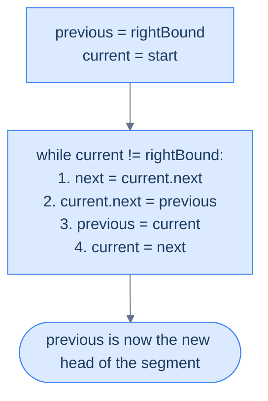
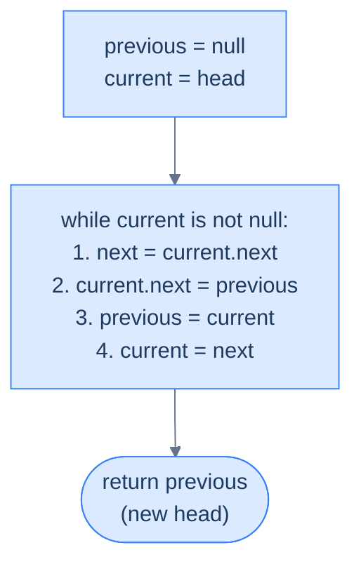

# 6. Pattern: Reversal

## The Hook

Reversing a linked list is the single most-asked question in technical interviews — and not because it's hard, but because it **reveals** everything about you. The clueless candidate allocates a new list and copies values backward: O(n) time, O(n) space, misses the point entirely. The candidate who's read the textbook writes a recursive solution in six lines and blows the stack on a 10-million-node list. The *interview-ready* candidate writes the iterative three-pointer reversal — in-place, O(n) time, O(1) space, six lines — and can explain why every line is necessary.

The reversal pattern is this three-pointer dance: `previous`, `current`, `next`. You'll use it to reverse the whole list, reverse just the first K nodes, reverse the last K nodes, reverse an arbitrary segment, and chain into reorderings and palindrome checks that seem impossible until you see them built out of small reversals. Master the six-line loop once. Every problem in this lesson (and the next) is a thin layer on top of it.

---

## Table of contents

1. [Understanding the reversal pattern](#understanding-the-reversal-pattern)
2. [Identifying direct application](#identifying-direct-application)
3. [Reverse a list](#reverse-a-list)
4. [Reverse first K nodes](#reverse-first-k-nodes)
5. [Reverse last K nodes](#reverse-last-k-nodes)
6. [Reverse the given segment](#reverse-the-given-segment)

***

# Understanding the reversal pattern

Many linked list problems require us to reverse the entire list or a part of it. For some problems, we may have to perform a reversal many times along with other more complex operations. While we can reverse a linked list using loops in multiple passes, it is not the best way to do it, as the code is complicated and error-prone. The most concise and efficient way to reverse a linked list is to use a single-pass in-place reversal algorithm, which is a very simple four-line algorithm.

The reversal pattern is a classification of linked list problems that can be solved using the linked list reversal algorithm.

```d2
direction: down

before: "Before — segment [start, end]" {
  direction: right
  a: {grid-columns: 2; grid-gap: 0; value: a; next}
  s: {grid-columns: 2; grid-gap: 0; value: start; next; style.fill: "#fde68a"; style.stroke: "#d97706"}
  m: {grid-columns: 2; grid-gap: 0; value: "..."; next}
  e: {grid-columns: 2; grid-gap: 0; value: end; next; style.fill: "#fde68a"; style.stroke: "#d97706"}
  z: {grid-columns: 2; grid-gap: 0; value: z; next}
  a.next -> s.value
  s.next -> m.value
  m.next -> e.value
  e.next -> z.value
}

after: "After — segment reversed in place" {
  direction: right
  a: {grid-columns: 2; grid-gap: 0; value: a; next}
  e: {grid-columns: 2; grid-gap: 0; value: end; next; style.fill: "#dcfce7"; style.stroke: "#16a34a"}
  m: {grid-columns: 2; grid-gap: 0; value: "..."; next}
  s: {grid-columns: 2; grid-gap: 0; value: start; next; style.fill: "#dcfce7"; style.stroke: "#16a34a"}
  z: {grid-columns: 2; grid-gap: 0; value: z; next}
  a.next -> e.value
  e.next -> m.value
  m.next -> s.value
  s.next -> z.value
}

before -> after: "flip each next pointer within the segment"
```

<p align="center"><strong>The reversal pattern flips a contiguous segment <code>[start, end]</code> in place — the nodes before <code>start</code> and after <code>end</code> remain untouched. Stitch the reversed segment back to its neighbours and you're done.</strong></p>

In this course, we will learn more about the linked list reversal algorithm and how to identify a problem as a reversal pattern problem.

## Reversing the entire list

Reversing the entire linked list is a special case of the generic reversal algorithm to reverse a segment between `start` and `end`. We first look at this special case as it has a much simpler implementation and is used in most linked list problems that require a reversal. Consider we are given a linked list denoted by `head` and need to reverse it completely.

```d2
direction: right

before: Before {
  direction: right
  h: head {shape: oval}
  n1: {grid-columns: 2; grid-gap: 0; value: 5; next}
  n2: {grid-columns: 2; grid-gap: 0; value: 7; next}
  n3: {grid-columns: 2; grid-gap: 0; value: 3; next}
  n4: {grid-columns: 2; grid-gap: 0; value: 10; next: "null"}
  h -> n1.value
  n1.next -> n2.value
  n2.next -> n3.value
  n3.next -> n4.value
}

after: After {
  direction: right
  h: head {shape: oval}
  n1: {grid-columns: 2; grid-gap: 0; value: 10; next}
  n2: {grid-columns: 2; grid-gap: 0; value: 3; next}
  n3: {grid-columns: 2; grid-gap: 0; value: 7; next}
  n4: {grid-columns: 2; grid-gap: 0; value: 5; next: "null"}
  h -> n1.value
  n1.next -> n2.value
  n2.next -> n3.value
  n3.next -> n4.value
}

before -> after: "flip every next pointer"
```

<p align="center"><strong>Full-list reversal — the old tail becomes the new head, every node's <code>next</code> points to its former predecessor.</strong></p>

We initialize two references and `current` with `nullptr` and the `head` of the list respectively and traverse the list from the head node using `current`. We save the reference of the node after `current` in a reference variable , set the next section of each node to  and update and `current` for the next iteration.

At the end of all iterations, the entire list will be revered, and the will hold the head of the reversed list.


<p align="center"><strong>The three-pointer reversal loop — <code>previous</code>, <code>current</code>, <code>next</code>. At every tick we save the forward link into <code>next</code>, flip <code>current.next</code> backward, then advance both trailing pointers one step.</strong></p>

### Algorithm

The algorithm below summarizes the reversal of the entire linked list in-place.

> **Algorithm**
>
> -   **Step 1:** Create two references, `previous` and `current`, and initialize them with `nullptr`, and `head` respectively.
> -   **Step 2:** Loop while `current` is not equal to `nullptr`, do the following:
>     -   **Step 2.1:** Initialize a reference `next` to store the reference of the node after the `current` node.
>     -   **Step 2.2:** Update the next section of the `current` node to hold the node held by `previous`.
>     -   **Step 2.3:** Update `previous` to hold the reference of the `current` node.
>     -   **Step 2.4:** Update the `current` to hold the node held by `next`
> -   **Step 3:** Return `previous` as the head of the reversed list.

### Implementation

The full-list reversal in all ten languages. Each version is the same three-pointer loop — `previous`, `current`, `next` — differing only in language syntax.

```python run
from typing import Optional

class ListNode:
    def __init__(self, val=0, next=None):
        self.val = val
        self.next = next

def reverse(head: Optional[ListNode]) -> Optional[ListNode]:
    previous: Optional[ListNode] = None     # behind current; the reversed prefix's head
    current:  Optional[ListNode] = head     # the walker
    while current is not None:
        nxt = current.next                  # save forward link BEFORE we clobber it
        current.next = previous             # flip the pointer backward
        previous = current                  # advance previous to current
        current  = nxt                      # advance current to saved next
    return previous                         # when current is None, previous is the new head
```

```java run
class Solution {
    public ListNode reverse(ListNode head) {
        ListNode previous = null;           // behind current; reversed prefix's head
        ListNode current  = head;           // the walker
        while (current != null) {
            ListNode next = current.next;   // save forward link first
            current.next = previous;        // flip backward
            previous = current;             // advance previous
            current  = next;                // advance current
        }
        return previous;                    // new head of the reversed list
    }
}
```

```c run
typedef struct ListNode { int val; struct ListNode *next; } ListNode;

ListNode* reverse(ListNode *head) {
    ListNode *previous = NULL;              /* behind current */
    ListNode *current  = head;              /* the walker */
    while (current != NULL) {
        ListNode *next = current->next;     /* save forward link */
        current->next = previous;           /* flip backward */
        previous = current;
        current  = next;
    }
    return previous;                        /* new head */
}
```

```cpp run
class Solution {
public:
    ListNode* reverse(ListNode *head) {
        ListNode *previous = nullptr;       // behind current
        ListNode *current  = head;          // the walker
        while (current != nullptr) {
            ListNode *next = current->next; // save forward link
            current->next = previous;       // flip backward
            previous = current;
            current  = next;
        }
        return previous;                    // new head
    }
};
```

```scala run
object Solution {
  def reverse(head: ListNode): ListNode = {
    var previous: ListNode = null           // behind current
    var current:  ListNode = head           // walker
    while (current != null) {
      val next = current.next               // save forward link
      current.next = previous               // flip backward
      previous = current
      current  = next
    }
    previous                                // new head
  }
}
```

```javascript run
function reverse(head) {
    let previous = null;                    // behind current
    let current  = head;                    // the walker
    while (current !== null) {
        const next = current.next;          // save forward link
        current.next = previous;            // flip backward
        previous = current;
        current  = next;
    }
    return previous;                        // new head
}
```

```typescript run
function reverse(head: ListNode | null): ListNode | null {
    let previous: ListNode | null = null;
    let current:  ListNode | null = head;
    while (current !== null) {
        const next: ListNode | null = current.next;
        current.next = previous;
        previous = current;
        current  = next;
    }
    return previous;                        // new head
}
```

```go run
type ListNode struct {
    Val  int
    Next *ListNode
}

func reverse(head *ListNode) *ListNode {
    var previous *ListNode = nil            // behind current
    current := head                         // the walker
    for current != nil {
        next := current.Next                // save forward link
        current.Next = previous             // flip backward
        previous = current
        current  = next
    }
    return previous                         // new head
}
```

```kotlin run
class Solution {
    fun reverse(head: ListNode?): ListNode? {
        var previous: ListNode? = null      // behind current
        var current:  ListNode? = head      // walker
        while (current != null) {
            val next = current.next         // save forward link
            current.next = previous         // flip backward
            previous = current
            current  = next
        }
        return previous                     // new head
    }
}
```

```rust run
struct ListNode {
    val:  i32,
    next: Option<Box<ListNode>>,
}

fn reverse(mut head: Option<Box<ListNode>>) -> Option<Box<ListNode>> {
    let mut previous: Option<Box<ListNode>> = None;
    while let Some(mut node) = head {
        head = node.next.take();            // save forward link (and detach from node)
        node.next = previous;               // flip backward
        previous = Some(node);              // advance previous — current drops out
    }
    previous                                // new head
}
```


### Complexity Analysis

We traverse the entire list to reverse it in place, and so the runtime complexity is linear **O(N) i**n any case.

Since we do not create any new data structure while reversing the list, the space complexity is constant **O(1)** in any case.

> **Best Case** -
>
> -   Space Complexity - **O(1)**
> -   Time Complexity - **O(N)**
>
> **Worst Case**
>
> -   Space Complexity - **O(1)**
> -   Time Complexity - **O(N)**

## Reversing a segment

Reversing a segment between two nodes is the generic case of the reversal algorithm. Consider we are given a singly linked list and references to two nodes, `start` and `end`, and we need to reverse the segment (including `start` and `end`).

For this example, the two references can never be `null` and will always point to some node in the list such that `start` comes before `end` when traversing the list in the forward direction from `head`.

```d2
direction: right

before: "Before — reverse segment [start, end] inclusive" {
  direction: right
  h: head {shape: oval}
  p: "·"
  s: start {style.fill: "#fde68a"; style.stroke: "#d97706"}
  m: "·"
  e: end {style.fill: "#fde68a"; style.stroke: "#d97706"}
  q: "·"
  h -> p
  p -> s
  s -> m
  m -> e
  e -> q
}

after: "After — segment flipped, outer nodes intact" {
  direction: right
  h: head {shape: oval}
  p: "·"
  e: end {style.fill: "#dcfce7"; style.stroke: "#16a34a"}
  m: "·"
  s: start {style.fill: "#dcfce7"; style.stroke: "#16a34a"}
  q: "·"
  h -> p
  p -> e
  e -> m
  m -> s
  s -> q
}

before -> after
```

<p align="center"><strong>Both endpoints are included. After reversal, the outer list structure is preserved — only the order of nodes inside <code>[start, end]</code> is flipped.</strong></p>

To connect the first node of the segment back to the list after reversal, we need to know the node after `end`. We create a reference variable `rightBound` and initialize it with the node after `end`.

```d2
direction: right
h: head {shape: oval}
p: "·"
s: start
m: "·"
e: end
rb: |md
  **rightBound**

  (= end.next)
| {style.fill: "#fde68a"; style.stroke: "#d97706"}
q: "·"
h -> p
p -> s
s -> m
m -> e
e -> rb
rb -> q
```

<p align="center"><strong>Cache <code>rightBound = end.next</code> <em>before</em> reversing. During reversal we walk from <code>start</code> and stop the moment <code>current == rightBound</code> — the sentinel that tells us we've exhausted the segment.</strong></p>

Next, we initialize two references and `current` with the `rightBound` and `start` respectively and traverse the list from `start` to `end` using `current`.

In each iteration, we save the reference to the node after `current` in a reference  to use it later. We then set the next section of `current` node to .  We then set to `current` and `current` to for the next iteration. At the end of all iterations, the node held in becomes the new head of the reversed segment.



<p align="center"><strong>Same three-pointer loop as full-list reversal — with two tweaks: initialise <code>previous</code> to <code>rightBound</code> (so the reversed segment's tail points to the correct successor), and stop when <code>current == rightBound</code> instead of <code>null</code>.</strong></p>

The last step is to connect the reversed head back to the list. As we will see later when solving problems that use the reversal technique, this is generally done by the caller of the reverse algorithm, which has the references to the node before `start`. 

```d2
direction: right
h: head {shape: oval}
p: predecessor of start
new: |md
  **end**

  (new segment head)
| {style.fill: "#fde68a"; style.stroke: "#d97706"}
m: "·"
s: |md
  **start**

  (new segment tail)
|
rb: rightBound
q: "·"
h -> p
p -> new: "predecessor.next = new head of segment"
new -> m
m -> s
s -> rb
rb -> q
```

<p align="center"><strong>Final stitch — the predecessor of the original <code>start</code> now points at the reversed segment's new head (<code>end</code>). The reversed segment's tail (<code>start</code>) already points at <code>rightBound</code> thanks to our <code>previous = rightBound</code> initialisation.</strong></p>

### Algorithm

The algorithm given below summarizes the linked list reversal between start and end.

> **Algorithm**
>
> -   **Step 1:** Create three references, `previous`, `current`, and `rightBound` and initialize them with `end.next`, `start`, and `end.next` respectively.
> -   **Step 2:** Loop while `current` is not equal to `rightBound`, do the following:
>     -   **Step 2.1:** Initialize a reference `next` to store the reference of the node after the `current` node.
>     -   **Step 2.2:** Update the next section of the `current` node to hold the node held by `previous`.
>     -   **Step 2.3:** Update `previous` to hold the reference of the `current` node.
>     -   **Step 2.4:** Update the `current` to hold the node held by `next`
> -   **Step 3:** Return `previous` as the new head of the list and connect the node before `start` to this new head in the caller of this reverse function.

### Implementation

Segment reversal in all ten languages. The skeleton is the same three-pointer loop as full-list reversal — with two tweaks: initialise `previous` to `rightBound` (so the reversed tail points to the correct successor automatically) and stop when `current == rightBound` instead of `null`.

```python run
from typing import Optional

class ListNode:
    def __init__(self, val=0, next=None):
        self.val = val
        self.next = next

def reverse(start: ListNode, end: ListNode) -> ListNode:
    # Cache rightBound BEFORE reversing — once we flip pointers inside the segment,
    # the link to the post-segment suffix is gone.
    right_bound = end.next
    previous    = right_bound           # reversed tail will point here automatically
    current     = start
    while current is not right_bound:
        nxt = current.next              # save forward link
        current.next = previous         # flip backward
        previous = current
        current  = nxt
    return previous                     # new head of the reversed segment (was `end`)
```

```java run
class Solution {
    public ListNode reverse(ListNode start, ListNode end) {
        ListNode rightBound = end.next;           // cache before flipping anything
        ListNode previous   = rightBound;         // reversed tail auto-links here
        ListNode current    = start;
        while (current != rightBound) {
            ListNode next = current.next;         // save forward link
            current.next = previous;              // flip backward
            previous = current;
            current  = next;
        }
        return previous;                          // new segment head (was `end`)
    }
}
```

```c run
typedef struct ListNode { int val; struct ListNode *next; } ListNode;

ListNode* reverseSegment(ListNode *start, ListNode *end) {
    ListNode *rightBound = end->next;             /* cache before flipping */
    ListNode *previous   = rightBound;
    ListNode *current    = start;
    while (current != rightBound) {
        ListNode *next = current->next;           /* save forward link */
        current->next = previous;                 /* flip backward */
        previous = current;
        current  = next;
    }
    return previous;                              /* new segment head */
}
```

```cpp run
class Solution {
public:
    ListNode* reverse(ListNode *start, ListNode *end) {
        ListNode *rightBound = end->next;         // cache before flipping
        ListNode *previous   = rightBound;
        ListNode *current    = start;
        while (current != rightBound) {
            ListNode *next = current->next;       // save forward link
            current->next = previous;             // flip backward
            previous = current;
            current  = next;
        }
        return previous;                          // new segment head
    }
};
```

```scala run
object Solution {
  def reverse(start: ListNode, end: ListNode): ListNode = {
    val rightBound: ListNode = end.next           // cache before flipping
    var previous:   ListNode = rightBound
    var current:    ListNode = start
    while (current ne rightBound) {
      val next = current.next                     // save forward link
      current.next = previous                     // flip backward
      previous = current
      current  = next
    }
    previous                                      // new segment head
  }
}
```

```javascript run
function reverse(start, end) {
    const rightBound = end.next;                  // cache before flipping
    let   previous   = rightBound;
    let   current    = start;
    while (current !== rightBound) {
        const next = current.next;                // save forward link
        current.next = previous;                  // flip backward
        previous = current;
        current  = next;
    }
    return previous;                              // new segment head
}
```

```typescript run
function reverse(start: ListNode, end: ListNode): ListNode {
    const rightBound: ListNode | null = end.next;
    let   previous:   ListNode | null = rightBound;
    let   current:    ListNode | null = start;
    while (current !== rightBound) {
        const next: ListNode | null = current!.next;
        current!.next = previous;
        previous = current;
        current  = next;
    }
    return previous!;                             // new segment head
}
```

```go run
type ListNode struct {
    Val  int
    Next *ListNode
}

func reverseSegment(start, end *ListNode) *ListNode {
    rightBound := end.Next                        // cache before flipping
    var previous *ListNode = rightBound
    current := start
    for current != rightBound {
        next := current.Next                      // save forward link
        current.Next = previous                   // flip backward
        previous = current
        current  = next
    }
    return previous                               // new segment head
}
```

```kotlin run
class Solution {
    fun reverse(start: ListNode, end: ListNode): ListNode {
        val rightBound: ListNode? = end.next      // cache before flipping
        var previous:   ListNode? = rightBound
        var current:    ListNode? = start
        while (current !== rightBound) {
            val next = current!!.next             // save forward link
            current.next = previous               // flip backward
            previous = current
            current  = next
        }
        return previous!!                         // new segment head
    }
}
```

```rust run
// Rust's Box ownership makes pointer-identity segment reversal awkward.
// Idiomatic Rust detaches the segment first, applies full-list reversal,
// and re-stitches — composing the simpler primitive.

struct ListNode {
    val:  i32,
    next: Option<Box<ListNode>>,
}

fn reverse_segment(mut segment_head: Option<Box<ListNode>>) -> Option<Box<ListNode>> {
    let mut previous: Option<Box<ListNode>> = None;
    while let Some(mut node) = segment_head {
        segment_head = node.next.take();
        node.next = previous;
        previous = Some(node);
    }
    previous
}
```


### Complexity Analysis

We only traverse the linked list between the `start` and `end` to reverse the segment. In the worst case `start` and `end` maybe the beginning and the end of the list, so we will have to traverse the entire list, which takes linear **O(N)** time. In the best case, however, `start` and `end` maybe the same node, and we won't traverse at all, leading to constant **O(1)** time.

Since we do not create any new data structure while reversing the list, the space complexity is constant **O(1)** in any case.

> **Best Case** - start and end are the same node.
>
> -   Space Complexity - **O(1)**
> -   Time Complexity - **O(1)**
>
> **Worst Case** - start and end are the head and tail of the list.
>
> -   Space Complexity - **O(1)**
> -   Time Complexity - **O(N)**

## Applications

Many linked problems may be classified as reversal pattern problems. Some may be solved by directly applying the reversal algorithm, while others may comprise one or more subproblems that can be solved using the reversal algorithm. We further classify the reversal pattern problems as follows.

> -   Direct application
> -   Subproblems

Later in the course, we will examine techniques for identifying all categories of the reversal pattern problems.

***

# Identifying direct application

The linked list reversal algorithm can only be directly applied to specific problems that fall under the reversal pattern. These are generally **easy** problems where we must revere the entire list of a part of it to solve. If the problem statement or its solution follows the generic template below, it can be solved by using the linked list reversal algorithm directly.

**Template**: Given a linked and two nodes `start` and `end`, reverse the linked list between these two nodes.

## Example

To better understand the problems that can be solved by directly applying the linked list reversal algorithm, let's consider the following problem and see how we can identify it as a direct application.

> **Problem statement:** Given a singly linked list, reverse it in place

```d2
direction: right

before: Input {
  direction: right
  n1: {grid-columns: 2; grid-gap: 0; value: 5; next}
  n2: {grid-columns: 2; grid-gap: 0; value: 7; next}
  n3: {grid-columns: 2; grid-gap: 0; value: 3; next}
  n4: {grid-columns: 2; grid-gap: 0; value: 10; next: "null"}
  n1.next -> n2.value
  n2.next -> n3.value
  n3.next -> n4.value
}

after: "Output (in-place reversal)" {
  direction: right
  n1: {grid-columns: 2; grid-gap: 0; value: 10; next}
  n2: {grid-columns: 2; grid-gap: 0; value: 3; next}
  n3: {grid-columns: 2; grid-gap: 0; value: 7; next}
  n4: {grid-columns: 2; grid-gap: 0; value: 5; next: "null"}
  n1.next -> n2.value
  n2.next -> n3.value
  n3.next -> n4.value
}

before -> after
```

<p align="center"><strong>"In place" means no auxiliary list is built — the same nodes are rewired, not copied. O(1) extra space.</strong></p>

### Linked list reversal algorithm

The problem description fits the template for the direct application of the reversal pattern we learned earlier.

**Template**:

Given a linked and two nodes `start` (`head` of the list) and `end` (tail of the list) reverse the linked list between these two nodes.

The complete reversal of the singly linked list is a special case of the reversal algorithm that we learned earlier. We initialize two references `current` and with `head` and `nullptr` respectively and traverse the list from the `head` using `current`. In each iteration, we save the reference to the node in a new reference variable, set the the next section of the node to , and update the `current` and for the next iteration. At the end of all iterations, will be the head of the reversed list.



<p align="center"><strong>The three-pointer reversal loop — <code>previous</code>, <code>current</code>, <code>next</code>. At every tick we save the forward link into <code>next</code>, flip <code>current.next</code> backward, then advance both trailing pointers one step.</strong></p>

The implementation of the reversal algorithm to reverse the entire list, in all ten languages:

```python run
from typing import Optional

class ListNode:
    def __init__(self, val=0, next=None):
        self.val = val
        self.next = next

class Solution:
    def reverse_a_list(self, head: Optional[ListNode]) -> Optional[ListNode]:
        previous: Optional[ListNode] = None     # behind current; reversed prefix's head
        current:  Optional[ListNode] = head     # the walker
        while current is not None:
            nxt = current.next                  # save forward link
            current.next = previous             # flip backward
            previous = current
            current  = nxt
        return previous                         # new head
```

```java run
class Solution {
    public ListNode reverseAList(ListNode head) {
        ListNode previous = null;
        ListNode current  = head;
        while (current != null) {
            ListNode next = current.next;       // save forward link
            current.next = previous;            // flip backward
            previous = current;
            current  = next;
        }
        return previous;                        // new head
    }
}
```

```c run
typedef struct ListNode { int val; struct ListNode *next; } ListNode;

ListNode* reverseAList(ListNode *head) {
    ListNode *previous = NULL;
    ListNode *current  = head;
    while (current != NULL) {
        ListNode *next = current->next;         /* save forward link */
        current->next = previous;               /* flip backward */
        previous = current;
        current  = next;
    }
    return previous;                            /* new head */
}
```

```cpp run
class Solution {
public:
    ListNode* reverseAList(ListNode *head) {
        ListNode *previous = nullptr;
        ListNode *current  = head;
        while (current != nullptr) {
            ListNode *next = current->next;     // save forward link
            current->next = previous;           // flip backward
            previous = current;
            current  = next;
        }
        return previous;                        // new head
    }
};
```

```scala run
object Solution {
  def reverseAList(head: ListNode): ListNode = {
    var previous: ListNode = null
    var current:  ListNode = head
    while (current != null) {
      val next = current.next                   // save forward link
      current.next = previous                   // flip backward
      previous = current
      current  = next
    }
    previous                                    // new head
  }
}
```

```javascript run
function reverseAList(head) {
    let previous = null;
    let current  = head;
    while (current !== null) {
        const next = current.next;              // save forward link
        current.next = previous;                // flip backward
        previous = current;
        current  = next;
    }
    return previous;                            // new head
}
```

```typescript run
function reverseAList(head: ListNode | null): ListNode | null {
    let previous: ListNode | null = null;
    let current:  ListNode | null = head;
    while (current !== null) {
        const next: ListNode | null = current.next;
        current.next = previous;
        previous = current;
        current  = next;
    }
    return previous;                            // new head
}
```

```go run
func reverseAList(head *ListNode) *ListNode {
    var previous *ListNode = nil
    current := head
    for current != nil {
        next := current.Next                    // save forward link
        current.Next = previous                 // flip backward
        previous = current
        current  = next
    }
    return previous                             // new head
}
```

```kotlin run
class Solution {
    fun reverseAList(head: ListNode?): ListNode? {
        var previous: ListNode? = null
        var current:  ListNode? = head
        while (current != null) {
            val next = current.next             // save forward link
            current.next = previous             // flip backward
            previous = current
            current  = next
        }
        return previous                         // new head
    }
}
```

```rust run
fn reverse_a_list(mut head: Option<Box<ListNode>>) -> Option<Box<ListNode>> {
    let mut previous: Option<Box<ListNode>> = None;
    while let Some(mut node) = head {
        head = node.next.take();                // save forward link (detach from node)
        node.next = previous;                   // flip backward
        previous = Some(node);
    }
    previous                                    // new head
}
```


## Example Problems

Most problems that fall under this category are**easy**problems; a list of a few is given below.

> -   **[Reverse a list](#reverse-a-list)**
> -   **[Reverse first K nodes](#reverse-first-k-nodes)**
> -   **[Reverse last K nodes](#reverse-last-k-nodes)**
> -   **[Reverse the given segment](#reverse-the-given-segment)**

We will now solve these problems to understand the direct application of this pattern better.

***

# Reverse a list

## Problem Statement

Given the **head** of a singly linked list, write a function to reverse the list and return the head of the reversed list.

You need to reverse the list in place.

### Example

> -   **Input:** head = \[5, 7, 3, 10\]
> -   **Output:** \[10, 3, 7, 5\]

## Solution

```python run
class ListNode:
    def __init__(self, val=0, next=None):
        self.val = val
        self.next = next

def reverse_a_list(head):
    current = head
    previous = None  # Will become the new tail (points to None at end)

    while current is not None:
        next_node = current.next   # Save next before we overwrite it
        current.next = previous    # Redirect arrow backward
        previous = current         # Advance previous to current node
        current = next_node        # Step forward through the original list

    # previous now points to the old tail — the new head
    return previous

def print_list(head):
    parts = []
    while head:
        parts.append(str(head.val))
        head = head.next
    print(" -> ".join(parts))

# Driver: [5, 7, 3, 10] -> [10, 3, 7, 5]
n1 = ListNode(5); n2 = ListNode(7); n3 = ListNode(3); n4 = ListNode(10)
n1.next = n2; n2.next = n3; n3.next = n4

result = reverse_a_list(n1)
print_list(result)  # 10 -> 3 -> 7 -> 5
```

```java run
public class ReverseAList {
    static class ListNode {
        int val;
        ListNode next;
        ListNode(int v) { val = v; }
        ListNode(int v, ListNode n) { val = v; next = n; }
    }

    static ListNode reverseAList(ListNode head) {
        ListNode current = head;
        ListNode previous = null; // Starts as null — becomes the new tail

        while (current != null) {
            ListNode next = current.next;  // Save next before overwriting
            current.next = previous;       // Redirect arrow backward
            previous = current;            // Advance previous
            current = next;               // Step forward
        }

        return previous; // Old tail is now the new head
    }

    static void printList(ListNode head) {
        StringBuilder sb = new StringBuilder();
        while (head != null) {
            sb.append(head.val);
            if (head.next != null) sb.append(" -> ");
            head = head.next;
        }
        System.out.println(sb);
    }

    public static void main(String[] args) {
        // [5, 7, 3, 10] -> [10, 3, 7, 5]
        ListNode n1 = new ListNode(5); ListNode n2 = new ListNode(7);
        ListNode n3 = new ListNode(3); ListNode n4 = new ListNode(10);
        n1.next = n2; n2.next = n3; n3.next = n4;

        printList(reverseAList(n1)); // 10 -> 3 -> 7 -> 5
    }
}
```

```c run
#include <stdio.h>
#include <stdlib.h>

typedef struct ListNode {
    int val;
    struct ListNode *next;
} ListNode;

ListNode* newNode(int v) {
    ListNode *n = malloc(sizeof *n);
    n->val = v; n->next = NULL;
    return n;
}

ListNode* reverseAList(ListNode *head) {
    ListNode *current = head;
    ListNode *previous = NULL; /* Will become the new tail */

    while (current != NULL) {
        ListNode *next = current->next; /* Save next before overwriting */
        current->next = previous;       /* Redirect arrow backward */
        previous = current;             /* Advance previous */
        current = next;                 /* Step forward */
    }

    return previous; /* Old tail is the new head */
}

void printList(ListNode *head) {
    while (head) {
        printf("%d", head->val);
        if (head->next) printf(" -> ");
        head = head->next;
    }
    printf("\n");
}

int main() {
    /* [5, 7, 3, 10] -> [10, 3, 7, 5] */
    ListNode *n1 = newNode(5); ListNode *n2 = newNode(7);
    ListNode *n3 = newNode(3); ListNode *n4 = newNode(10);
    n1->next = n2; n2->next = n3; n3->next = n4;

    printList(reverseAList(n1)); /* 10 -> 3 -> 7 -> 5 */
    return 0;
}
```

```cpp run
#include <iostream>
using namespace std;

struct ListNode {
    int val;
    ListNode *next;
    ListNode(int v) : val(v), next(nullptr) {}
};

ListNode* reverseAList(ListNode *head) {
    ListNode *current = head;
    ListNode *previous = nullptr; // Grows from null into the new reversed list

    while (current != nullptr) {
        ListNode *next = current->next; // Save next before we break the link
        current->next = previous;       // Flip the arrow
        previous = current;             // Advance previous
        current = next;                 // Step forward through original list
    }

    return previous; // previous is now at the old tail — the new head
}

void printList(ListNode *head) {
    while (head) {
        cout << head->val;
        if (head->next) cout << " -> ";
        head = head->next;
    }
    cout << endl;
}

int main() {
    // [5, 7, 3, 10] -> [10, 3, 7, 5]
    ListNode *n1 = new ListNode(5); ListNode *n2 = new ListNode(7);
    ListNode *n3 = new ListNode(3); ListNode *n4 = new ListNode(10);
    n1->next = n2; n2->next = n3; n3->next = n4;

    printList(reverseAList(n1)); // 10 -> 3 -> 7 -> 5
    return 0;
}
```

```scala run
class ListNode(var v: Int, var next: ListNode = null)

object ReverseAList {
  def reverseAList(head: ListNode): ListNode = {
    var current = head
    var previous: ListNode = null // Grows backward into the reversed list

    while (current != null) {
      val next = current.next  // Save next before overwriting
      current.next = previous  // Flip the arrow
      previous = current       // Advance previous
      current = next           // Step forward
    }

    previous // Old tail is now the new head
  }

  def printList(head: ListNode): Unit = {
    var cur = head
    val parts = scala.collection.mutable.ListBuffer[String]()
    while (cur != null) { parts += cur.v.toString; cur = cur.next }
    println(parts.mkString(" -> "))
  }

  def main(args: Array[String]): Unit = {
    // [5, 7, 3, 10] -> [10, 3, 7, 5]
    val n1 = new ListNode(5); val n2 = new ListNode(7)
    val n3 = new ListNode(3); val n4 = new ListNode(10)
    n1.next = n2; n2.next = n3; n3.next = n4

    printList(reverseAList(n1)) // 10 -> 3 -> 7 -> 5
  }
}
```

```javascript run
class ListNode {
  constructor(val, next = null) {
    this.val = val;
    this.next = next;
  }
}

function reverseAList(head) {
  let current = head;
  let previous = null; // Will become the new tail

  while (current !== null) {
    const next = current.next; // Save next before breaking the link
    current.next = previous;   // Flip the arrow
    previous = current;        // Advance previous
    current = next;            // Step forward
  }

  return previous; // Old tail is the new head
}

function printList(head) {
  const parts = [];
  while (head) { parts.push(head.val); head = head.next; }
  console.log(parts.join(" -> "));
}

// [5, 7, 3, 10] -> [10, 3, 7, 5]
const n1 = new ListNode(5); const n2 = new ListNode(7);
const n3 = new ListNode(3); const n4 = new ListNode(10);
n1.next = n2; n2.next = n3; n3.next = n4;

printList(reverseAList(n1)); // 10 -> 3 -> 7 -> 5
```

```typescript run
class ListNode {
  constructor(public val: number, public next: ListNode | null = null) {}
}

function reverseAList(head: ListNode | null): ListNode | null {
  let current = head;
  let previous: ListNode | null = null; // Grows into the reversed list

  while (current !== null) {
    const next = current.next; // Save next before we overwrite it
    current.next = previous;   // Flip the arrow
    previous = current;        // Advance previous
    current = next;            // Step forward
  }

  return previous; // Old tail — now the new head
}

function printList(head: ListNode | null): void {
  const parts: number[] = [];
  while (head) { parts.push(head.val); head = head.next; }
  console.log(parts.join(" -> "));
}

// [5, 7, 3, 10] -> [10, 3, 7, 5]
const n1 = new ListNode(5); const n2 = new ListNode(7);
const n3 = new ListNode(3); const n4 = new ListNode(10);
n1.next = n2; n2.next = n3; n3.next = n4;

printList(reverseAList(n1)); // 10 -> 3 -> 7 -> 5
```

```go run
package main

import "fmt"

type ListNode struct {
	Val  int
	Next *ListNode
}

func reverseAList(head *ListNode) *ListNode {
	var previous *ListNode // Starts nil — becomes the new tail
	current := head

	for current != nil {
		next := current.Next    // Save next before breaking the link
		current.Next = previous // Flip the arrow
		previous = current      // Advance previous
		current = next          // Step forward
	}

	return previous // Old tail is the new head
}

func printList(head *ListNode) {
	for head != nil {
		fmt.Print(head.Val)
		if head.Next != nil {
			fmt.Print(" -> ")
		}
		head = head.Next
	}
	fmt.Println()
}

func main() {
	// [5, 7, 3, 10] -> [10, 3, 7, 5]
	n1 := &ListNode{Val: 5}; n2 := &ListNode{Val: 7}
	n3 := &ListNode{Val: 3}; n4 := &ListNode{Val: 10}
	n1.Next = n2; n2.Next = n3; n3.Next = n4

	printList(reverseAList(n1)) // 10 -> 3 -> 7 -> 5
}
```

```kotlin run
class ListNode(var `val`: Int, var next: ListNode? = null)

fun reverseAList(head: ListNode?): ListNode? {
    var current = head
    var previous: ListNode? = null // Grows backward into reversed list

    while (current != null) {
        val next = current.next   // Save next before overwriting
        current.next = previous   // Flip the arrow
        previous = current        // Advance previous
        current = next            // Step forward
    }

    return previous // Old tail is the new head
}

fun printList(head: ListNode?) {
    var cur = head
    val parts = mutableListOf<String>()
    while (cur != null) { parts.add(cur.`val`.toString()); cur = cur.next }
    println(parts.joinToString(" -> "))
}

fun main() {
    // [5, 7, 3, 10] -> [10, 3, 7, 5]
    val n1 = ListNode(5); val n2 = ListNode(7)
    val n3 = ListNode(3); val n4 = ListNode(10)
    n1.next = n2; n2.next = n3; n3.next = n4

    printList(reverseAList(n1)) // 10 -> 3 -> 7 -> 5
}
```

```rust run
#[derive(Debug)]
struct ListNode {
    val: i32,
    next: Option<Box<ListNode>>,
}

impl ListNode {
    fn new(val: i32) -> Self {
        ListNode { val, next: None }
    }
}

fn reverse_a_list(head: Option<Box<ListNode>>) -> Option<Box<ListNode>> {
    let mut previous: Option<Box<ListNode>> = None;
    let mut current = head;

    while let Some(mut node) = current {
        current = node.next.take(); // Detach next — ownership moves to current
        node.next = previous;       // Flip the arrow
        previous = Some(node);      // Advance previous
    }

    previous // Old tail is now the head
}

fn print_list(head: &Option<Box<ListNode>>) {
    let mut cur = head;
    let mut parts = vec![];
    while let Some(node) = cur {
        parts.push(node.val.to_string());
        cur = &node.next;
    }
    println!("{}", parts.join(" -> "));
}

fn main() {
    // Build [5, 7, 3, 10]
    let mut n1 = Box::new(ListNode::new(5));
    let mut n2 = Box::new(ListNode::new(7));
    let mut n3 = Box::new(ListNode::new(3));
    let n4 = Box::new(ListNode::new(10));
    n3.next = Some(n4);
    n2.next = Some(n3);
    n1.next = Some(n2);

    let reversed = reverse_a_list(Some(n1));
    print_list(&reversed); // 10 -> 3 -> 7 -> 5
}
```


***

# Reverse first K nodes

## Problem Statement

Given the **head** of a singly linked list and a non-negative integer **k**, write a function to reverse the first k nodes of the list and return the head of the reversed list.

You need to reverse the list in place.

### Example

> -   **Input:** head = \[5, 7, 3, 10\], k = 2
> -   **Output:** \[7, 5, 3, 10\]

## Solution

```python run
from typing import Optional

class ListNode:
    def __init__(self, val=0, next=None):
        self.val = val
        self.next = next

class Solution:
    def reverse_first_k_nodes(self, head: Optional[ListNode], k: int) -> Optional[ListNode]:
        if k <= 0 or head is None:
            return head

        previous: Optional[ListNode] = None
        current:  Optional[ListNode] = head
        count = 0

        # Three-pointer reversal — but capped at k iterations
        while current is not None and count < k:
            nxt = current.next
            current.next = previous
            previous = current
            current  = nxt
            count   += 1

        # The original head is now the k-th node of the reversed prefix → tail of reversed portion.
        # Stitch it to the unreversed suffix (pointed to by `current`).
        head.next = current
        return previous   # new head of the whole list (the k-th original node)
```

```java run
class Solution {
    public ListNode reverseFirstKNodes(ListNode head, int k) {
        if (k <= 0 || head == null) return head;

        ListNode previous = null;
        ListNode current  = head;
        int count = 0;

        while (current != null && count < k) {
            ListNode next = current.next;
            current.next = previous;
            previous = current;
            current  = next;
            count++;
        }

        // Stitch original head (now tail of reversed prefix) to unreversed suffix
        head.next = current;
        return previous;
    }
}
```

```c run
typedef struct ListNode { int val; struct ListNode *next; } ListNode;

ListNode* reverseFirstKNodes(ListNode *head, int k) {
    if (k <= 0 || head == NULL) return head;

    ListNode *previous = NULL;
    ListNode *current  = head;
    int count = 0;

    while (current != NULL && count < k) {
        ListNode *next = current->next;
        current->next = previous;
        previous = current;
        current  = next;
        count++;
    }

    head->next = current;         /* stitch reversed prefix to unreversed suffix */
    return previous;
}
```

```cpp run
class Solution {
public:
    ListNode* reverseFirstKNodes(ListNode *head, int k) {
        if (k <= 0 || head == nullptr) return head;

        ListNode *previous = nullptr;
        ListNode *current  = head;
        int count = 0;

        while (current != nullptr && count < k) {
            ListNode *next = current->next;
            current->next = previous;
            previous = current;
            current  = next;
            count++;
        }

        head->next = current;     // stitch reversed prefix to unreversed suffix
        return previous;
    }
};
```

```scala run
object Solution {
  def reverseFirstKNodes(head: ListNode, k: Int): ListNode = {
    if (k <= 0 || head == null) return head

    var previous: ListNode = null
    var current:  ListNode = head
    var count = 0

    while (current != null && count < k) {
      val next = current.next
      current.next = previous
      previous = current
      current  = next
      count   += 1
    }

    head.next = current           // stitch
    previous
  }
}
```

```javascript run
function reverseFirstKNodes(head, k) {
    if (k <= 0 || head === null) return head;

    let previous = null;
    let current  = head;
    let count = 0;

    while (current !== null && count < k) {
        const next = current.next;
        current.next = previous;
        previous = current;
        current  = next;
        count++;
    }

    head.next = current;          // stitch
    return previous;
}
```

```typescript run
function reverseFirstKNodes(head: ListNode | null, k: number): ListNode | null {
    if (k <= 0 || head === null) return head;

    let previous: ListNode | null = null;
    let current:  ListNode | null = head;
    let count = 0;

    while (current !== null && count < k) {
        const next: ListNode | null = current.next;
        current.next = previous;
        previous = current;
        current  = next;
        count++;
    }

    head.next = current;
    return previous;
}
```

```go run
func reverseFirstKNodes(head *ListNode, k int) *ListNode {
    if k <= 0 || head == nil {
        return head
    }

    var previous *ListNode = nil
    current := head
    count := 0

    for current != nil && count < k {
        next := current.Next
        current.Next = previous
        previous = current
        current  = next
        count++
    }

    head.Next = current          // stitch reversed prefix to unreversed suffix
    return previous
}
```

```kotlin run
class Solution {
    fun reverseFirstKNodes(head: ListNode?, k: Int): ListNode? {
        if (k <= 0 || head == null) return head

        var previous: ListNode? = null
        var current:  ListNode? = head
        var count = 0

        while (current != null && count < k) {
            val next = current.next
            current.next = previous
            previous = current
            current  = next
            count++
        }

        head.next = current      // stitch
        return previous
    }
}
```

```rust run
fn reverse_first_k_nodes(mut head: Option<Box<ListNode>>, k: i32) -> Option<Box<ListNode>> {
    if k <= 0 || head.is_none() { return head; }

    let mut previous: Option<Box<ListNode>> = None;
    let mut count = 0;
    while let Some(mut node) = head {
        if count >= k {
            // We've reversed k nodes. `node` is now the (k+1)-th original node.
            // Walk previous to find its tail (the original head), stitch, done.
            let mut tail = previous.as_deref_mut().unwrap();
            while tail.next.is_some() { tail = tail.next.as_deref_mut().unwrap(); }
            tail.next = Some(node);
            return previous;
        }
        head = node.next.take();
        node.next = previous;
        previous = Some(node);
        count += 1;
    }
    previous                      // k >= length → whole list reversed
}
```


***

# Reverse last K nodes

## Problem Statement

Given the **head** of a singly linked list and a non-negative integer **k**, write a function to reverse the last k nodes of the list and return the head of the reversed list.

You need to reverse the list in place.

### Example

> -   **Input:** head = \[5, 7, 3, 10\], k = 2
> -   **Output:** \[5, 7, 10, 3\]

## Solution

```python run
from typing import Optional

class Solution:
    def _length(self, head: Optional[ListNode]) -> int:
        n = 0
        while head:
            n += 1
            head = head.next
        return n

    def _reverse_all(self, head: Optional[ListNode]) -> Optional[ListNode]:
        previous, current = None, head
        while current:
            nxt = current.next
            current.next = previous
            previous, current = current, nxt
        return previous

    def reverse_last_k_nodes(self, head: Optional[ListNode], k: int) -> Optional[ListNode]:
        if k <= 0 or head is None:
            return head

        length = self._length(head)
        if k >= length:
            return self._reverse_all(head)

        # Walk to the (length - k)-th node — the predecessor of the segment to reverse
        current = head
        for _ in range(length - k - 1):
            current = current.next

        # Reverse the tail segment and stitch it back on
        current.next = self._reverse_all(current.next)
        return head
```

```java run
class Solution {
    private int length(ListNode head) {
        int n = 0;
        while (head != null) { n++; head = head.next; }
        return n;
    }

    private ListNode reverseAll(ListNode head) {
        ListNode previous = null, current = head;
        while (current != null) {
            ListNode next = current.next;
            current.next = previous;
            previous = current;
            current  = next;
        }
        return previous;
    }

    public ListNode reverseLastKNodes(ListNode head, int k) {
        if (k <= 0 || head == null) return head;

        int len = length(head);
        if (k >= len) return reverseAll(head);

        ListNode current = head;
        for (int i = 0; i < len - k - 1; i++) current = current.next;
        current.next = reverseAll(current.next);
        return head;
    }
}
```

```c run
static int length_of(ListNode *head) {
    int n = 0;
    while (head) { n++; head = head->next; }
    return n;
}

static ListNode* reverse_all(ListNode *head) {
    ListNode *prev = NULL, *cur = head;
    while (cur) {
        ListNode *nxt = cur->next;
        cur->next = prev;
        prev = cur; cur = nxt;
    }
    return prev;
}

ListNode* reverseLastKNodes(ListNode *head, int k) {
    if (k <= 0 || head == NULL) return head;

    int len = length_of(head);
    if (k >= len) return reverse_all(head);

    ListNode *cur = head;
    for (int i = 0; i < len - k - 1; i++) cur = cur->next;
    cur->next = reverse_all(cur->next);
    return head;
}
```

```cpp run
class Solution {
    int length(ListNode *head) {
        int n = 0;
        while (head) { n++; head = head->next; }
        return n;
    }
    ListNode* reverseAll(ListNode *head) {
        ListNode *prev = nullptr, *cur = head;
        while (cur) {
            ListNode *nxt = cur->next;
            cur->next = prev;
            prev = cur; cur = nxt;
        }
        return prev;
    }
public:
    ListNode* reverseLastKNodes(ListNode *head, int k) {
        if (k <= 0 || head == nullptr) return head;
        int len = length(head);
        if (k >= len) return reverseAll(head);
        ListNode *cur = head;
        for (int i = 0; i < len - k - 1; i++) cur = cur->next;
        cur->next = reverseAll(cur->next);
        return head;
    }
};
```

```scala run
object Solution {
  private def length(h: ListNode): Int = {
    var n = 0; var cur = h
    while (cur != null) { n += 1; cur = cur.next }
    n
  }
  private def reverseAll(h: ListNode): ListNode = {
    var prev: ListNode = null; var cur = h
    while (cur != null) {
      val nxt = cur.next
      cur.next = prev
      prev = cur; cur = nxt
    }
    prev
  }
  def reverseLastKNodes(head: ListNode, k: Int): ListNode = {
    if (k <= 0 || head == null) return head
    val len = length(head)
    if (k >= len) return reverseAll(head)
    var cur = head
    for (_ <- 0 until len - k - 1) cur = cur.next
    cur.next = reverseAll(cur.next)
    head
  }
}
```

```javascript run
function reverseLastKNodes(head, k) {
    if (k <= 0 || head === null) return head;

    function length(h) { let n = 0; while (h) { n++; h = h.next; } return n; }
    function reverseAll(h) {
        let prev = null, cur = h;
        while (cur) { const nxt = cur.next; cur.next = prev; prev = cur; cur = nxt; }
        return prev;
    }

    const len = length(head);
    if (k >= len) return reverseAll(head);

    let cur = head;
    for (let i = 0; i < len - k - 1; i++) cur = cur.next;
    cur.next = reverseAll(cur.next);
    return head;
}
```

```typescript run
function reverseLastKNodes(head: ListNode | null, k: number): ListNode | null {
    if (k <= 0 || head === null) return head;

    const length = (h: ListNode | null): number => {
        let n = 0; while (h !== null) { n++; h = h.next; } return n;
    };
    const reverseAll = (h: ListNode | null): ListNode | null => {
        let prev: ListNode | null = null, cur = h;
        while (cur !== null) { const nxt: ListNode | null = cur.next; cur.next = prev; prev = cur; cur = nxt; }
        return prev;
    };

    const len = length(head);
    if (k >= len) return reverseAll(head);

    let cur: ListNode | null = head;
    for (let i = 0; i < len - k - 1; i++) cur = cur!.next;
    cur!.next = reverseAll(cur!.next);
    return head;
}
```

```go run
func reverseLastKNodes(head *ListNode, k int) *ListNode {
    if k <= 0 || head == nil {
        return head
    }

    length := func(h *ListNode) int {
        n := 0
        for h != nil { n++; h = h.Next }
        return n
    }
    reverseAll := func(h *ListNode) *ListNode {
        var prev *ListNode = nil
        cur := h
        for cur != nil {
            nxt := cur.Next
            cur.Next = prev
            prev = cur
            cur  = nxt
        }
        return prev
    }

    ln := length(head)
    if k >= ln {
        return reverseAll(head)
    }

    cur := head
    for i := 0; i < ln-k-1; i++ {
        cur = cur.Next
    }
    cur.Next = reverseAll(cur.Next)
    return head
}
```

```kotlin run
class Solution {
    private fun length(h: ListNode?): Int {
        var n = 0; var cur = h
        while (cur != null) { n++; cur = cur.next }
        return n
    }
    private fun reverseAll(h: ListNode?): ListNode? {
        var prev: ListNode? = null; var cur = h
        while (cur != null) { val nxt = cur.next; cur.next = prev; prev = cur; cur = nxt }
        return prev
    }
    fun reverseLastKNodes(head: ListNode?, k: Int): ListNode? {
        if (k <= 0 || head == null) return head
        val len = length(head)
        if (k >= len) return reverseAll(head)
        var cur = head
        for (i in 0 until len - k - 1) cur = cur!!.next
        cur!!.next = reverseAll(cur.next)
        return head
    }
}
```

```rust run
fn reverse_last_k_nodes(mut head: Option<Box<ListNode>>, k: i32) -> Option<Box<ListNode>> {
    if k <= 0 || head.is_none() { return head; }

    // Count length
    let mut len = 0;
    {
        let mut cur = head.as_deref();
        while let Some(n) = cur { len += 1; cur = n.next.as_deref(); }
    }

    let reverse_all = |mut h: Option<Box<ListNode>>| -> Option<Box<ListNode>> {
        let mut prev: Option<Box<ListNode>> = None;
        while let Some(mut node) = h {
            h = node.next.take();
            node.next = prev;
            prev = Some(node);
        }
        prev
    };

    if k >= len { return reverse_all(head); }

    // Walk to the (len - k - 1)-th node
    let mut cur = head.as_deref_mut().unwrap();
    for _ in 0..len - k - 1 { cur = cur.next.as_deref_mut().unwrap(); }

    let tail = cur.next.take();
    cur.next = reverse_all(tail);
    head
}
```


***

# Reverse the given segment

## Problem Statement

Given the **head** of a singly linked list and two integers **left** and **right** where **left <= right**. Write a function to reverse the list nodes from the position left to the right and return the head of the reversed list.

### Example 1

> -   **Input:** head = \[5, 7, 3, 10, 6\], left = 2, right = 4
> -   **Output:** \[5, 10, 3, 7, 6\]
> -   **Explanation:** After reversing the sublist from the second node to the fourth node, the list becomes \[5, 10, 3, 7, 6\].

### Example 2

> -   **Input:** head = \[5\], left = 1, right = 1
> -   **Output:** \[5\]
> -   **Explanation:** After reversing the first node of the list, the list becomes \[5\].

## Solution

```python run
from typing import Optional

class Solution:
    def _reverse_segment(self, start, end):
        right_bound = end.next
        previous, current = right_bound, start
        while current is not right_bound:
            nxt = current.next
            current.next = previous
            previous, current = current, nxt
        return previous

    def _node_at(self, head, position):
        cur = head
        for _ in range(position - 1):
            cur = cur.next
        return cur

    def reverse_the_given_segment(self, head: Optional[ListNode], left: int, right: int) -> Optional[ListNode]:
        # Degenerate cases — nothing to reverse
        if head is None or head.next is None or left == right:
            return head

        end = self._node_at(head, right)

        if left == 1:
            # Segment starts at the head; new head is the reversed segment's head
            return self._reverse_segment(head, end)

        # Interior segment — reverse it and stitch leftBound to the new segment head
        left_bound = self._node_at(head, left - 1)
        left_bound.next = self._reverse_segment(left_bound.next, end)
        return head
```

```java run
class Solution {
    private ListNode nodeAt(ListNode head, int position) {
        ListNode cur = head;
        for (int i = 1; i < position; i++) cur = cur.next;
        return cur;
    }

    private ListNode reverseSegment(ListNode start, ListNode end) {
        ListNode rightBound = end.next;
        ListNode previous = rightBound;
        ListNode current  = start;
        while (current != rightBound) {
            ListNode next = current.next;
            current.next = previous;
            previous = current;
            current  = next;
        }
        return previous;
    }

    public ListNode reverseTheGivenSegment(ListNode head, int left, int right) {
        if (head == null || head.next == null || left == right) return head;

        ListNode end = nodeAt(head, right);
        if (left == 1) return reverseSegment(head, end);

        ListNode leftBound = nodeAt(head, left - 1);
        leftBound.next = reverseSegment(leftBound.next, end);
        return head;
    }
}
```

```c run
static ListNode* node_at(ListNode *head, int position) {
    ListNode *cur = head;
    for (int i = 1; i < position; i++) cur = cur->next;
    return cur;
}

static ListNode* reverse_segment(ListNode *start, ListNode *end) {
    ListNode *rightBound = end->next;
    ListNode *prev = rightBound, *cur = start;
    while (cur != rightBound) {
        ListNode *nxt = cur->next;
        cur->next = prev;
        prev = cur; cur = nxt;
    }
    return prev;
}

ListNode* reverseTheGivenSegment(ListNode *head, int left, int right) {
    if (head == NULL || head->next == NULL || left == right) return head;

    ListNode *end = node_at(head, right);
    if (left == 1) return reverse_segment(head, end);

    ListNode *leftBound = node_at(head, left - 1);
    leftBound->next = reverse_segment(leftBound->next, end);
    return head;
}
```

```cpp run
class Solution {
    ListNode* nodeAt(ListNode *head, int position) {
        ListNode *cur = head;
        for (int i = 1; i < position; i++) cur = cur->next;
        return cur;
    }
    ListNode* reverseSegment(ListNode *start, ListNode *end) {
        ListNode *rightBound = end->next;
        ListNode *prev = rightBound, *cur = start;
        while (cur != rightBound) {
            ListNode *nxt = cur->next;
            cur->next = prev;
            prev = cur; cur = nxt;
        }
        return prev;
    }
public:
    ListNode* reverseTheGivenSegment(ListNode *head, int left, int right) {
        if (head == nullptr || head->next == nullptr || left == right) return head;
        ListNode *end = nodeAt(head, right);
        if (left == 1) return reverseSegment(head, end);
        ListNode *leftBound = nodeAt(head, left - 1);
        leftBound->next = reverseSegment(leftBound->next, end);
        return head;
    }
};
```

```scala run
object Solution {
  private def nodeAt(head: ListNode, position: Int): ListNode = {
    var cur = head
    var i = 1; while (i < position) { cur = cur.next; i += 1 }
    cur
  }
  private def reverseSegment(start: ListNode, end: ListNode): ListNode = {
    val rightBound = end.next
    var prev: ListNode = rightBound
    var cur:  ListNode = start
    while (cur ne rightBound) {
      val nxt = cur.next
      cur.next = prev
      prev = cur; cur = nxt
    }
    prev
  }
  def reverseTheGivenSegment(head: ListNode, left: Int, right: Int): ListNode = {
    if (head == null || head.next == null || left == right) return head
    val end = nodeAt(head, right)
    if (left == 1) return reverseSegment(head, end)
    val leftBound = nodeAt(head, left - 1)
    leftBound.next = reverseSegment(leftBound.next, end)
    head
  }
}
```

```javascript run
function reverseTheGivenSegment(head, left, right) {
    if (head === null || head.next === null || left === right) return head;

    const nodeAt = (h, pos) => {
        let cur = h;
        for (let i = 1; i < pos; i++) cur = cur.next;
        return cur;
    };
    const reverseSegment = (start, end) => {
        const rightBound = end.next;
        let prev = rightBound, cur = start;
        while (cur !== rightBound) {
            const nxt = cur.next;
            cur.next = prev;
            prev = cur; cur = nxt;
        }
        return prev;
    };

    const end = nodeAt(head, right);
    if (left === 1) return reverseSegment(head, end);

    const leftBound = nodeAt(head, left - 1);
    leftBound.next = reverseSegment(leftBound.next, end);
    return head;
}
```

```typescript run
function reverseTheGivenSegment(head: ListNode | null, left: number, right: number): ListNode | null {
    if (head === null || head.next === null || left === right) return head;

    const nodeAt = (h: ListNode, pos: number): ListNode => {
        let cur: ListNode = h;
        for (let i = 1; i < pos; i++) cur = cur.next!;
        return cur;
    };
    const reverseSegment = (start: ListNode, end: ListNode): ListNode => {
        const rightBound: ListNode | null = end.next;
        let prev: ListNode | null = rightBound, cur: ListNode | null = start;
        while (cur !== rightBound) {
            const nxt: ListNode | null = cur!.next;
            cur!.next = prev;
            prev = cur; cur = nxt;
        }
        return prev!;
    };

    const end = nodeAt(head, right);
    if (left === 1) return reverseSegment(head, end);

    const leftBound = nodeAt(head, left - 1);
    leftBound.next = reverseSegment(leftBound.next!, end);
    return head;
}
```

```go run
func reverseTheGivenSegment(head *ListNode, left, right int) *ListNode {
    if head == nil || head.Next == nil || left == right {
        return head
    }

    nodeAt := func(h *ListNode, pos int) *ListNode {
        cur := h
        for i := 1; i < pos; i++ { cur = cur.Next }
        return cur
    }
    reverseSegment := func(start, end *ListNode) *ListNode {
        rightBound := end.Next
        var prev *ListNode = rightBound
        cur := start
        for cur != rightBound {
            nxt := cur.Next
            cur.Next = prev
            prev = cur
            cur  = nxt
        }
        return prev
    }

    end := nodeAt(head, right)
    if left == 1 {
        return reverseSegment(head, end)
    }

    leftBound := nodeAt(head, left-1)
    leftBound.Next = reverseSegment(leftBound.Next, end)
    return head
}
```

```kotlin run
class Solution {
    private fun nodeAt(head: ListNode, position: Int): ListNode {
        var cur = head
        for (i in 1 until position) cur = cur.next!!
        return cur
    }
    private fun reverseSegment(start: ListNode, end: ListNode): ListNode {
        val rightBound = end.next
        var prev: ListNode? = rightBound
        var cur:  ListNode? = start
        while (cur !== rightBound) {
            val nxt = cur!!.next
            cur.next = prev
            prev = cur; cur = nxt
        }
        return prev!!
    }
    fun reverseTheGivenSegment(head: ListNode?, left: Int, right: Int): ListNode? {
        if (head == null || head.next == null || left == right) return head
        val end = nodeAt(head, right)
        if (left == 1) return reverseSegment(head, end)
        val leftBound = nodeAt(head, left - 1)
        leftBound.next = reverseSegment(leftBound.next!!, end)
        return head
    }
}
```

```rust run
// Idiomatic Rust: detach the [left, right] segment, reverse it via full-list
// reversal, then stitch it back. Avoids the raw-pointer gymnastics that C/Java use.

fn reverse_the_given_segment(
    head: Option<Box<ListNode>>,
    left: usize,
    right: usize,
) -> Option<Box<ListNode>> {
    if left == right { return head; }

    // Use a dummy sentinel to uniformly handle left == 1
    let mut dummy = Box::new(ListNode { val: 0, next: head });
    {
        let mut cur: &mut Box<ListNode> = &mut dummy;
        for _ in 0..left - 1 { cur = cur.next.as_mut().unwrap(); }
        // `cur` is now the leftBound (node before the segment start)

        // Detach the segment — walk (right - left) more steps to reach `end`
        let mut seg = cur.next.take();   // seg = start ... tail
        {
            let mut walker = seg.as_deref_mut().unwrap();
            for _ in 0..right - left { walker = walker.next.as_deref_mut().unwrap(); }
            let rest = walker.next.take();
            // Reverse seg in place
            let mut prev: Option<Box<ListNode>> = None;
            let mut h = seg.take();
            while let Some(mut node) = h {
                h = node.next.take();
                node.next = prev;
                prev = Some(node);
            }
            // prev is now the reversed segment's head; walk to its tail and attach rest
            seg = prev;
            let mut tail = seg.as_deref_mut().unwrap();
            while tail.next.is_some() { tail = tail.next.as_deref_mut().unwrap(); }
            tail.next = rest;
        }
        cur.next = seg;
    }
    dummy.next.take()
}
```


***

## Final Takeaway

Every reversal problem reduces to the same six-line loop:

```
previous = <appropriate sentinel>
current  = <segment start>
while current != <stop sentinel>:
    next          = current.next   # save forward link BEFORE clobbering it
    current.next  = previous       # flip the pointer
    previous      = current        # advance previous one step
    current       = next           # advance current  one step
```

Three insights to internalise:

1. **Save the forward link first.** The instant you flip `current.next`, the forward path disappears. `next = current.next` is the line that keeps the rest of the list reachable.
2. **Sentinels control scope.** For full-list reversal, the sentinel is `null` on both ends. For segment reversal, the sentinel is `rightBound = end.next` and the initial `previous` is `rightBound` itself (so the reversed tail points to the correct successor automatically).
3. **Reversal composes.** Every problem in the next lesson — reverse first K, reverse last K, reverse in groups, palindrome check — is just this loop wrapped in different sentinel choices and reconnection logic.

When you next see a linked-list problem that mentions "backward", "reverse", "palindrome", "opposite order", or asks you to prove a list has mirror structure — reach for the three-pointer loop first.

> **Transfer Challenge:** Reverse a linked list **recursively** in O(n) time with O(n) stack space. Then explain why the iterative version is strictly preferable in production code.
>
> <details><summary><strong>Answer</strong></summary>
>
> Recursive:
>
> ```
> def reverse(head):
>     if head is None or head.next is None:
>         return head
>     new_head = reverse(head.next)
>     head.next.next = head   # the node just after head now points back to head
>     head.next = None        # head becomes the new tail
>     return new_head
> ```
>
> Why iterative wins in production: recursion costs O(n) stack space, and for a 10-million-node list that blows the default stack limit (~1 MB ≈ 10⁵ frames in most languages). The iterative three-pointer version runs the same algorithm in O(1) extra space and never crashes regardless of input size.
>
> </details>
