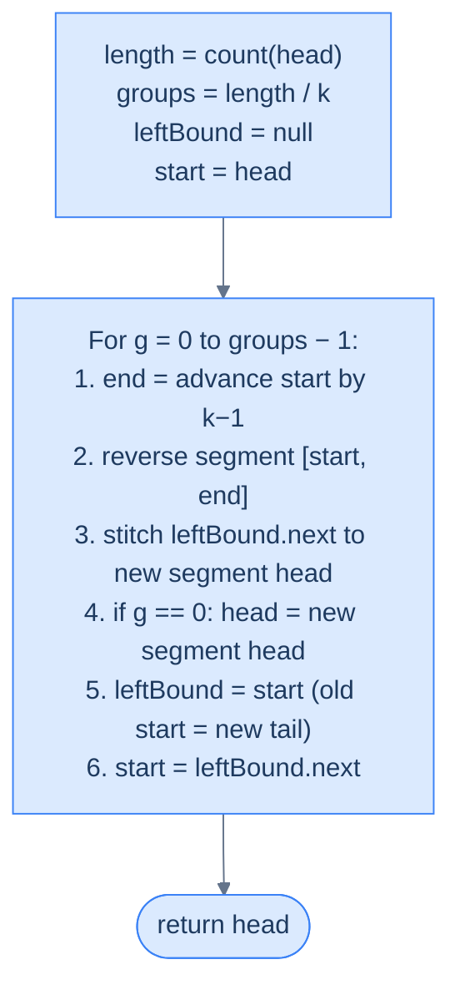

# 7. Pattern: Reversal (Subproblem)

## The Hook

You learned the six-line reversal loop in the last lesson. Now the real game begins. What if you only want to reverse **part** of a list — first K, last K, every K, alternate segments? These problems *look* harder, but under the microscope they're all the same trick: **carve the list into windows, call reversal on each window, stitch the windows back together.** Reversal is the atom. Everything here is molecules.

The one new skill is **boundary tracking**. A full-list reversal has no boundaries — the endpoints are `head` and `null`. A segment reversal has four: the node before `start`, `start`, `end`, and the node after `end`. Lose any one of them and the list falls apart. Master the four-pointer boundary dance and you've unlocked every reversal-as-subroutine problem in the interview canon. Let's go.

---

## Table of contents

1. [Identifying reversal subproblem](#identifying-reversal-subproblem)
2. [Pairwise swap](#pairwise-swap)
3. [Reverse K-segments](#reverse-k-segments)
4. [Reverse increasing groups](#reverse-increasing-groups)
5. [Reverse alternate segments](#reverse-alternate-segments)

***

# Identifying reversal subproblem

Some problems may consist of smaller subproblems that can be solved using the reversal technique. Solving these subproblems may either partially or fully solve the original problem. These are usually **medium** or **hard** problems, as breaking down a problem into subproblems may not be obvious and may require some critical observation. These problems are also implementation-heavy, meaning the solution code is often big and complex, which makes it error-prone.

Asking yourself the following questions will help you determine whether a problem is a reversal subproblem pattern problem or not.

**Ask yourself questions:**

Q1. Can the problem or solution be broken down into smaller subproblems?

Q2. Can any subproblem be solved by reversing a part of the linked list?

## Example

Let's consider an example problem and see how to break it down into smaller subproblems that can be solved using the reversal algorithm to understand it better.

> **Problem statement:** Given a linked list, reverse the list in groups of K in-place. If the last group in the list does not have K nodes, don't reverse it.

Consider the following example with`k = 3`for a linked list of size 7.

```d2
direction: right

before: "Before — list = [1, 2, 3, 4, 5, 6, 7], k = 3" {
  direction: right
  n1: {grid-columns: 2; grid-gap: 0; value: 1; next}
  n2: {grid-columns: 2; grid-gap: 0; value: 2; next}
  n3: {grid-columns: 2; grid-gap: 0; value: 3; next}
  n4: {grid-columns: 2; grid-gap: 0; value: 4; next}
  n5: {grid-columns: 2; grid-gap: 0; value: 5; next}
  n6: {grid-columns: 2; grid-gap: 0; value: 6; next}
  n7: {grid-columns: 2; grid-gap: 0; value: 7; next: "null"}
  n1.next -> n2.value
  n2.next -> n3.value
  n3.next -> n4.value
  n4.next -> n5.value
  n5.next -> n6.value
  n6.next -> n7.value
}

after: "After — each group of 3 reversed in place (the trailing '7' stays put)" {
  direction: right
  n3: {grid-columns: 2; grid-gap: 0; value: 3; next}
  n2: {grid-columns: 2; grid-gap: 0; value: 2; next}
  n1: {grid-columns: 2; grid-gap: 0; value: 1; next}
  n6: {grid-columns: 2; grid-gap: 0; value: 6; next}
  n5: {grid-columns: 2; grid-gap: 0; value: 5; next}
  n4: {grid-columns: 2; grid-gap: 0; value: 4; next}
  n7: {grid-columns: 2; grid-gap: 0; value: 7; next: "null"}
  n3.next -> n2.value
  n2.next -> n1.value
  n1.next -> n6.value
  n6.next -> n5.value
  n5.next -> n4.value
  n4.next -> n7.value
}

before -> after
```

<p align="center"><strong>Reverse-in-groups-of-K — slice the list into chunks of <code>k</code>, reverse each chunk in place, and leave any trailing (fewer-than-<code>k</code>) nodes untouched. The core reversal loop is invoked once per chunk.</strong></p>

## Linked list reversal solution

Let's ask ourselves the questions we listed above to identify if we can reduce this problem to the two-pointer pattern problem.

**Template:**

Q1. Can the problem or solution be broken down into smaller subproblems?

A1. Yes, we can break down the solution as a combination `length / k` reversal operations, where `length` is the length of the linked list.

Q2. Can any subproblem be solved by reversing a part of the linked list?

A2. Yes, all subproblems except finding the length can be solved by reversing a part of the linked list.

The critical observation here is that reversing a group of size `k` is the same as reversing a part of the linked list between start and end. We traverse the linked list `k` nodes at a time and reverse each group as we go. We initialize a variable `groups` with the number of k-groups (`length / k`) to reverse, truncating the fractional part as the number of k groups will always be a whole number. We use `groups` to iterate, reversing a k-group in each iteration. 

```d2
direction: right
length: "length = 7"
k: "k = 3"
g: "groups = length / k = 2 (integer division)"
r: "remaining = length % k = 1 (trailing, untouched)"
length -> g
k -> g
length -> r
k -> r
```

<p align="center"><strong>Pre-compute <code>length</code> in one pass. The number of full reversible groups is <code>length / k</code>; the remainder <code>length % k</code> trails untouched.</strong></p>

We use two reference variables `start` and `end` to denote the boundary of a k-group that we need to reverse and a variable `leftBound` to hold the node before `start` that is used to correctly connect the head of the reversed segment to the list.

We initialize `start` and `end` with the `head` of the list and iterate `k-1` times using `end` to find the end of the first k-group. We initialize `leftBound` with null for the first k-group, as there is no node before the head of the list.

```d2
direction: right
h: head {shape: oval}
lb: |md
  **leftBound**

  (dummy before first group)
| {style.fill: "#ede9fe"; style.stroke: "#3b82f6"}
n1: |md
  **1**

  start
| {style.fill: "#fde68a"; style.stroke: "#d97706"}
n2: "2"
n3: |md
  **3**

  end
| {style.fill: "#fde68a"; style.stroke: "#d97706"}
n4: "4"
n5: "5"
n6: "6"
n7: "7"
h -> lb
lb -> n1
n1 -> n2
n2 -> n3
n3 -> n4
n4 -> n5
n5 -> n6
n6 -> n7
```

<p align="center"><strong>Three boundary pointers per group — <code>leftBound</code> (the node <em>before</em> <code>start</code>, needed so we can re-attach the reversed group to the rest of the list), <code>start</code> (first node of the group), and <code>end</code> (last node of the group, reached by advancing <code>start</code> by <code>k−1</code> hops).</strong></p>

After reversing the first k-group, we need to update the `head` of the list, as the previous `end` node will be the new head of the list.

```d2
direction: right

before: "Before first reversal" {
  direction: right
  h: head {shape: oval}
  n1: "1"
  n2: "2"
  n3: "3"
  n4: "4"
  n5: "·"
  h -> n1
  n1 -> n2
  n2 -> n3
  n3 -> n4
  n4 -> n5
}

after: "After — head now points at the NEW first node (3)" {
  direction: right
  h: head {shape: oval}
  n3: {value: 3; style.fill: "#dcfce7"; style.stroke: "#16a34a"}
  n2: "2"
  n1: "1"
  n4: "4"
  n5: "·"
  h -> n3.value
  n3.value -> n2
  n2 -> n1
  n1 -> n4
  n4 -> n5
}

before -> after
```

<p align="center"><strong>After the <em>first</em> group is reversed, its head becomes the new head of the entire list. Update <code>head</code> to point at <code>end</code> of the just-reversed group. Subsequent groups don't need this update — their previous group handles the re-attachment.</strong></p>

Similarly, after reversing the first k-group, the previous `start` and the node after it would be the `leftBound` and `start` for the next k-group respectively.

```d2
direction: right
h: head {shape: oval}
g1a: "3"
g1b: "2"
g1c: "1"
lb2: |md
  **leftBound**

  (= last node of just-reversed group)
| {style.fill: "#ede9fe"; style.stroke: "#3b82f6"}
s2: |md
  **4**

  start
| {style.fill: "#fde68a"; style.stroke: "#d97706"}
m: "5"
e2: |md
  **6**

  end
| {style.fill: "#fde68a"; style.stroke: "#d97706"}
r: "7"
h -> g1a
g1a -> g1b
g1b -> g1c
g1c -> lb2
lb2 -> s2
s2 -> m
m -> e2
e2 -> r
```

<p align="center"><strong>After processing one group, slide the boundary forward — the old <code>start</code> becomes the new <code>leftBound</code>, and <code>start</code> advances to the first node of the next group. The segment-reversal loop is now primed to repeat.</strong></p>

We repeat the process to find the `end` of the next segment and reverse the list between `start` and `end` and for all the subsequent k-group reversals, we use `leftBound` to connect the reversed head of the segment back to the list. At the end of all iterations, all the k-groups in the list are reversed in place. The complete execution of the linked list reversal solution is given below.



<p align="center"><strong>The full algorithm — measure the list, iterate <code>length / k</code> times, and on each iteration slice off a group of <code>k</code>, flip it in place using the segment-reversal primitive, and slide the boundary pointers forward.</strong></p>

The implementation of the reversal algorithm solution is given below, where we create a reverse function to reverse segments between `start` and `end`.  We also create helper functions to find the length of the list  two helper functions to find the length of a linked list and reverse the list between `start` and `end` to keep the implementation simple and modular.


```pseudocode
# Reverse the list in groups of k. Walk the list, reverse each k-segment, stitch them together.
function reverseKSegments(head, k):
    if head is null OR head.next is null OR k = 1: return head
    start ← head
    leftBound ← null
    totalSegments ← length(head) ÷ k                   # only reverse complete k-groups
    for i from 1 to totalSegments:
        end ← advance(start, k)
        reversedHead ← reverseSegment(start, end)
        if leftBound is null:
            head ← reversedHead                        # first segment becomes the new head
        else:
            leftBound.next ← reversedHead              # stitch previous tail to new head
        leftBound ← start                              # `start` is now the tail of the reversed group
        start ← leftBound.next                         # advance past this group
    return head
```

```python run
from typing import Optional

class ListNode:
    def __init__(self, val=0, next=None):
        self.val = val
        self.next = next

class Solution:
    def _length(self, head: Optional[ListNode]) -> int:
        n = 0
        while head:
            n += 1
            head = head.next
        return n

    def _advance(self, start: ListNode, steps: int) -> ListNode:
        # Return the node `steps - 1` hops past `start`
        cur = start
        for _ in range(steps - 1):
            cur = cur.next
        return cur

    def _reverse_segment(self, start: ListNode, end: ListNode) -> ListNode:
        # Canonical segment reversal — previous seeded at rightBound so the
        # reversed tail auto-points at the suffix.
        right_bound = end.next
        previous, current = right_bound, start
        while current is not right_bound:
            nxt = current.next
            current.next = previous
            previous, current = current, nxt
        return previous

    def reverse_k_segments(self, head: Optional[ListNode], k: int) -> Optional[ListNode]:
        if head is None or head.next is None or k == 1:
            return head

        start = head
        left_bound: Optional[ListNode] = None
        total_segments = self._length(head) // k

        for _ in range(total_segments):
            end = self._advance(start, k)
            reversed_head = self._reverse_segment(start, end)

            if left_bound is None:
                head = reversed_head                    # first segment → new list head
            else:
                left_bound.next = reversed_head         # stitch previous group's tail to new head

            left_bound = start                          # old start is now segment tail
            start = left_bound.next

        return head
```

```java run
class Solution {
    private int length(ListNode head) {
        int n = 0;
        while (head != null) { n++; head = head.next; }
        return n;
    }
    private ListNode advance(ListNode start, int steps) {
        ListNode cur = start;
        for (int i = 1; i < steps; i++) cur = cur.next;
        return cur;
    }
    private ListNode reverseSegment(ListNode start, ListNode end) {
        ListNode rightBound = end.next;
        ListNode previous = rightBound, current = start;
        while (current != rightBound) {
            ListNode next = current.next;
            current.next = previous;
            previous = current;
            current  = next;
        }
        return previous;
    }

    public ListNode reverseKSegments(ListNode head, int k) {
        if (head == null || head.next == null || k == 1) return head;

        ListNode start = head;
        ListNode leftBound = null;
        int totalSegments = length(head) / k;

        for (int i = 0; i < totalSegments; i++) {
            ListNode end = advance(start, k);
            ListNode reversedHead = reverseSegment(start, end);

            if (leftBound == null) head = reversedHead;         // first segment
            else                   leftBound.next = reversedHead;

            leftBound = start;
            start = leftBound.next;
        }
        return head;
    }
}
```

```c run
typedef struct ListNode { int val; struct ListNode *next; } ListNode;

static int length_of(ListNode *h) {
    int n = 0;
    while (h) { n++; h = h->next; }
    return n;
}

static ListNode* advance(ListNode *start, int steps) {
    for (int i = 1; i < steps; i++) start = start->next;
    return start;
}

static ListNode* reverse_segment(ListNode *start, ListNode *end) {
    ListNode *rightBound = end->next;
    ListNode *prev = rightBound, *cur = start;
    while (cur != rightBound) {
        ListNode *nxt = cur->next;
        cur->next = prev;
        prev = cur; cur = nxt;
    }
    return prev;
}

ListNode* reverseKSegments(ListNode *head, int k) {
    if (head == NULL || head->next == NULL || k == 1) return head;

    ListNode *start = head, *leftBound = NULL;
    int totalSegments = length_of(head) / k;

    for (int i = 0; i < totalSegments; i++) {
        ListNode *end = advance(start, k);
        ListNode *reversedHead = reverse_segment(start, end);

        if (leftBound == NULL) head = reversedHead;
        else                   leftBound->next = reversedHead;

        leftBound = start;
        start = leftBound->next;
    }
    return head;
}
```

```cpp run
class Solution {
    int length(ListNode *h) {
        int n = 0;
        while (h) { n++; h = h->next; }
        return n;
    }
    ListNode* advance(ListNode *start, int steps) {
        for (int i = 1; i < steps; i++) start = start->next;
        return start;
    }
    ListNode* reverseSegment(ListNode *start, ListNode *end) {
        ListNode *rightBound = end->next;
        ListNode *prev = rightBound, *cur = start;
        while (cur != rightBound) {
            ListNode *nxt = cur->next;
            cur->next = prev;
            prev = cur; cur = nxt;
        }
        return prev;
    }
public:
    ListNode* reverseKSegments(ListNode *head, int k) {
        if (head == nullptr || head->next == nullptr || k == 1) return head;

        ListNode *start = head, *leftBound = nullptr;
        int totalSegments = length(head) / k;

        for (int i = 0; i < totalSegments; i++) {
            ListNode *end = advance(start, k);
            ListNode *reversedHead = reverseSegment(start, end);

            if (leftBound == nullptr) head = reversedHead;
            else                      leftBound->next = reversedHead;

            leftBound = start;
            start = leftBound->next;
        }
        return head;
    }
};
```

```scala run
object Solution {
  private def length(h: ListNode): Int = {
    var n = 0; var cur = h
    while (cur != null) { n += 1; cur = cur.next }
    n
  }
  private def advance(start: ListNode, steps: Int): ListNode = {
    var cur = start
    var i = 1
    while (i < steps) { cur = cur.next; i += 1 }
    cur
  }
  private def reverseSegment(start: ListNode, end: ListNode): ListNode = {
    val rightBound = end.next
    var prev: ListNode = rightBound
    var cur:  ListNode = start
    while (cur ne rightBound) {
      val nxt = cur.next
      cur.next = prev
      prev = cur; cur = nxt
    }
    prev
  }

  def reverseKSegments(headIn: ListNode, k: Int): ListNode = {
    if (headIn == null || headIn.next == null || k == 1) return headIn

    var head = headIn
    var start = head
    var leftBound: ListNode = null
    val totalSegments = length(head) / k

    for (_ <- 0 until totalSegments) {
      val end = advance(start, k)
      val reversedHead = reverseSegment(start, end)

      if (leftBound == null) head = reversedHead
      else                    leftBound.next = reversedHead

      leftBound = start
      start = leftBound.next
    }
    head
  }
}
```

```typescript run
function reverseKSegments(head: ListNode | null, k: number): ListNode | null {
    if (head === null || head.next === null || k === 1) return head;

    const length = (h: ListNode | null): number => {
        let n = 0; while (h !== null) { n++; h = h.next; } return n;
    };
    const advance = (start: ListNode, steps: number): ListNode => {
        let cur: ListNode = start;
        for (let i = 1; i < steps; i++) cur = cur.next!;
        return cur;
    };
    const reverseSegment = (start: ListNode, end: ListNode): ListNode => {
        const rightBound: ListNode | null = end.next;
        let prev: ListNode | null = rightBound, cur: ListNode | null = start;
        while (cur !== rightBound) {
            const nxt: ListNode | null = cur!.next;
            cur!.next = prev;
            prev = cur; cur = nxt;
        }
        return prev!;
    };

    let start: ListNode = head, leftBound: ListNode | null = null;
    const totalSegments = Math.floor(length(head) / k);

    for (let i = 0; i < totalSegments; i++) {
        const end = advance(start, k);
        const reversedHead = reverseSegment(start, end);

        if (leftBound === null) head = reversedHead;
        else                    leftBound.next = reversedHead;

        leftBound = start;
        start = leftBound.next!;
    }
    return head;
}
```

```go run
type ListNode struct {
    Val  int
    Next *ListNode
}

func reverseKSegments(head *ListNode, k int) *ListNode {
    if head == nil || head.Next == nil || k == 1 {
        return head
    }

    length := func(h *ListNode) int {
        n := 0
        for h != nil { n++; h = h.Next }
        return n
    }
    advance := func(start *ListNode, steps int) *ListNode {
        for i := 1; i < steps; i++ { start = start.Next }
        return start
    }
    reverseSegment := func(start, end *ListNode) *ListNode {
        rightBound := end.Next
        var prev *ListNode = rightBound
        cur := start
        for cur != rightBound {
            nxt := cur.Next
            cur.Next = prev
            prev = cur
            cur  = nxt
        }
        return prev
    }

    start := head
    var leftBound *ListNode = nil
    totalSegments := length(head) / k

    for i := 0; i < totalSegments; i++ {
        end := advance(start, k)
        reversedHead := reverseSegment(start, end)

        if leftBound == nil {
            head = reversedHead
        } else {
            leftBound.Next = reversedHead
        }

        leftBound = start
        start = leftBound.Next
    }
    return head
}
```

```rust run
// Idiomatic Rust — use a dummy sentinel and detach-reverse-stitch per group.

struct ListNode {
    val:  i32,
    next: Option<Box<ListNode>>,
}

fn reverse_k_segments(head: Option<Box<ListNode>>, k: i32) -> Option<Box<ListNode>> {
    if k <= 1 || head.is_none() { return head; }

    // Count length
    let mut len = 0;
    {
        let mut cur = head.as_deref();
        while let Some(n) = cur { len += 1; cur = n.next.as_deref(); }
    }
    let total_segments = (len / k) as usize;
    if total_segments == 0 { return head; }

    let mut dummy = Box::new(ListNode { val: 0, next: head });
    {
        let mut left_bound: &mut Box<ListNode> = &mut dummy;
        for _ in 0..total_segments {
            // Detach next k nodes starting from left_bound.next
            let mut seg = left_bound.next.take();
            // Walk to the k-th node to split off rest
            let mut walker = seg.as_deref_mut().unwrap();
            for _ in 1..k { walker = walker.next.as_deref_mut().unwrap(); }
            let rest = walker.next.take();

            // Reverse seg in place (full-list reversal on detached chunk)
            let mut prev: Option<Box<ListNode>> = None;
            let mut cur = seg.take();
            while let Some(mut node) = cur {
                cur = node.next.take();
                node.next = prev;
                prev = Some(node);
            }

            // Walk to tail of reversed seg, attach rest, hand to left_bound
            let mut reversed = prev.unwrap();
            {
                let mut tail: &mut Box<ListNode> = &mut reversed;
                while tail.next.is_some() { tail = tail.next.as_mut().unwrap(); }
                tail.next = rest;
            }
            left_bound.next = Some(reversed);

            // Advance left_bound by k — the reversed group's tail is `k` hops away
            for _ in 0..k {
                left_bound = left_bound.next.as_mut().unwrap();
            }
        }
    }
    dummy.next.take()
}
```


The process above summarizes how we can identify a problem that can be broken down into smaller subproblems solvable by the reversal algorithm.

## Example problems

Most problems in this category are **medium** or **hard** problems, as subproblems may not be directly identifiable. Also, the implementation may be complex and require creating different functions, which can be error-prone. Below is a list of problems that fall under the reversal subproblem pattern.

> -   **[Pairwise swap](#pairwise-swap)**
> -   **[Reverse K-segments](#reverse-k-segments)**
> -   **[Reverse increasing groups](#reverse-increasing-groups)**
> -   **[Reverse alternate segments](#reverse-alternate-segments)**

We will now solve these problems to get a better understanding of breaking down a problem into subproblems solvable by the reversal algorithm.

***

# Pairwise swap

## Problem Statement

Given the **head** of a singly linked list, write a function to **swap every two adjacent nodes** of this list and return the head of the reordered list.

The problem needs to be solved without modifying the values in the list's nodes. The nodes should be reordered by updating links.

### Example

> -   **Input:** head = \[1, 2, 3, 4\]
> -   **Output:** \[2, 1, 4, 3\]
> -   **Explanation:** After swapping in pair, i.e. (1, 2) => (2, 1) and (3, 4) => (4, 3) the list becomes \[2, 1, 4, 3\].

## Solution


```pseudocode
# Reverse-k-segments specialised to k = 2 → swap consecutive pairs.
function reverse(start, end):
    rightBound ← end.next
    previous ← rightBound; current ← start
    while current ≠ rightBound:
        nxt ← current.next
        current.next ← previous
        previous ← current
        current ← nxt
    return previous

function pairwiseSwap(head):
    if head is null OR head.next is null: return head
    start ← head; leftBound ← null
    while start is not null AND start.next is not null:
        end ← start.next                               # each pair is exactly 2 nodes
        reversedHead ← reverse(start, end)
        if leftBound is null:
            head ← reversedHead
        else:
            leftBound.next ← reversedHead
        leftBound ← start                              # `start` is the pair's tail after reversal
        start ← start.next
    return head
```

```python run
class ListNode:
    def __init__(self, val=0, next=None):
        self.val = val
        self.next = next

def reverse(start, end):
    current = start
    right_bound = end.next   # First node AFTER the segment — acts as the stop sentinel
    previous = right_bound   # Tail of reversed segment points back to what was after it

    while current != right_bound:
        nxt = current.next
        current.next = previous  # Redirect current node backward
        previous = current
        current = nxt

    return previous  # New head of the reversed segment

def pairwise_swap(head):
    # Empty list or single node — nothing to swap
    if head is None or head.next is None:
        return head

    start = head
    left_bound = None  # Last node of the already-processed chain

    while start is not None and start.next is not None:
        end = start.next          # Each pair is exactly 2 nodes: start..end
        reversed_head = reverse(start, end)

        if left_bound is None:
            head = reversed_head  # First pair: the reversed head becomes the new list head
        else:
            left_bound.next = reversed_head  # Stitch previous segment to this reversed pair

        left_bound = start        # After reversal, `start` is the tail of the pair
        start = start.next        # Advance to the next unprocessed pair

    return head

# Driver
def build(vals):
    dummy = ListNode(0)
    cur = dummy
    for v in vals:
        cur.next = ListNode(v)
        cur = cur.next
    return dummy.next

def to_list(head):
    result = []
    while head:
        result.append(head.val)
        head = head.next
    return result

head = build([1, 2, 3, 4])
print(to_list(pairwise_swap(head)))  # [2, 1, 4, 3]
```

```java run
public class Solution {
    static class ListNode {
        int val;
        ListNode next;
        ListNode(int v) { val = v; }
        ListNode(int v, ListNode n) { val = v; next = n; }
    }

    static ListNode reverse(ListNode start, ListNode end) {
        ListNode current = start;
        ListNode rightBound = end.next;  // Sentinel — stop reversing here
        ListNode previous = rightBound;  // Tail points back to the segment after

        while (current != rightBound) {
            ListNode next = current.next;
            current.next = previous;     // Redirect pointer backward
            previous = current;
            current = next;
        }
        return previous;  // New head of the reversed pair
    }

    static ListNode pairwiseSwap(ListNode head) {
        if (head == null || head.next == null) return head;

        ListNode start = head;
        ListNode leftBound = null;

        while (start != null && start.next != null) {
            ListNode end = start.next;
            ListNode reversedHead = reverse(start, end);

            if (leftBound == null) {
                head = reversedHead;        // First pair updates the overall head
            } else {
                leftBound.next = reversedHead;  // Stitch previous tail to new head
            }

            leftBound = start;      // start is now the tail of the swapped pair
            start = start.next;     // Move to the next unprocessed pair
        }
        return head;
    }

    static ListNode build(int[] vals) {
        ListNode dummy = new ListNode(0);
        ListNode cur = dummy;
        for (int v : vals) { cur.next = new ListNode(v); cur = cur.next; }
        return dummy.next;
    }

    static String toStr(ListNode head) {
        StringBuilder sb = new StringBuilder("[");
        while (head != null) {
            sb.append(head.val);
            if (head.next != null) sb.append(", ");
            head = head.next;
        }
        return sb.append("]").toString();
    }

    public static void main(String[] args) {
        ListNode head = build(new int[]{1, 2, 3, 4});
        System.out.println(toStr(pairwiseSwap(head)));  // [2, 1, 4, 3]
    }
}
```

```c run
#include <stdio.h>
#include <stdlib.h>

typedef struct ListNode {
    int val;
    struct ListNode *next;
} ListNode;

ListNode* newNode(int v) {
    ListNode *n = malloc(sizeof *n);
    n->val = v;
    n->next = NULL;
    return n;
}

ListNode* reverse(ListNode *start, ListNode *end) {
    ListNode *current = start;
    ListNode *rightBound = end->next;  /* Sentinel: stop here */
    ListNode *previous = rightBound;   /* New tail points past the segment */

    while (current != rightBound) {
        ListNode *nxt = current->next;
        current->next = previous;       /* Flip pointer backward */
        previous = current;
        current = nxt;
    }
    return previous;  /* New head of the reversed pair */
}

ListNode* pairwiseSwap(ListNode *head) {
    if (!head || !head->next) return head;

    ListNode *start = head;
    ListNode *leftBound = NULL;

    while (start && start->next) {
        ListNode *end = start->next;
        ListNode *reversedHead = reverse(start, end);

        if (!leftBound) {
            head = reversedHead;          /* First pair becomes new list head */
        } else {
            leftBound->next = reversedHead;  /* Connect previous tail to new head */
        }

        leftBound = start;        /* start is the tail after swap */
        start = start->next;      /* Advance to next unprocessed pair */
    }
    return head;
}

void printList(ListNode *head) {
    printf("[");
    while (head) {
        printf("%d", head->val);
        if (head->next) printf(", ");
        head = head->next;
    }
    printf("]\n");
}

int main() {
    ListNode *head = newNode(1);
    head->next = newNode(2);
    head->next->next = newNode(3);
    head->next->next->next = newNode(4);

    printList(pairwiseSwap(head));  /* [2, 1, 4, 3] */
    return 0;
}
```

```cpp run
#include <iostream>
#include <vector>
using namespace std;

struct ListNode {
    int val;
    ListNode *next;
    ListNode(int v) : val(v), next(nullptr) {}
};

ListNode* reverse(ListNode *start, ListNode *end) {
    ListNode *current = start;
    ListNode *rightBound = end->next;  // Sentinel — stop reversing here
    ListNode *previous = rightBound;   // New tail points past the segment

    while (current != rightBound) {
        ListNode *next = current->next;
        current->next = previous;      // Flip pointer backward
        previous = current;
        current = next;
    }
    return previous;  // New head of the reversed pair
}

ListNode* pairwiseSwap(ListNode *head) {
    if (head == nullptr || head->next == nullptr) return head;

    ListNode *start = head;
    ListNode *leftBound = nullptr;

    while (start != nullptr && start->next != nullptr) {
        ListNode *end = start->next;
        ListNode *reversedHead = reverse(start, end);

        if (leftBound == nullptr) {
            head = reversedHead;          // First pair: update overall list head
        } else {
            leftBound->next = reversedHead;  // Stitch previous tail to new head
        }

        leftBound = start;        // start is now the tail of the swapped pair
        start = start->next;      // Advance to the next unprocessed pair
    }
    return head;
}

ListNode* build(vector<int> vals) {
    ListNode dummy(0); ListNode *cur = &dummy;
    for (int v : vals) { cur->next = new ListNode(v); cur = cur->next; }
    return dummy.next;
}

void printList(ListNode *head) {
    cout << "[";
    while (head) { cout << head->val; if (head->next) cout << ", "; head = head->next; }
    cout << "]\n";
}

int main() {
    printList(pairwiseSwap(build({1, 2, 3, 4})));  // [2, 1, 4, 3]
    return 0;
}
```

```scala run
class ListNode(var v: Int, var next: ListNode = null)

object Solution {
  def reverse(start: ListNode, end: ListNode): ListNode = {
    var current = start
    val rightBound = end.next  // Sentinel — stop here
    var previous = rightBound  // New tail points past the segment

    while (current != rightBound) {
      val nxt = current.next
      current.next = previous  // Flip pointer backward
      previous = current
      current = nxt
    }
    previous  // New head of the reversed pair
  }

  def pairwiseSwap(head: ListNode): ListNode = {
    if (head == null || head.next == null) return head

    var start = head
    var leftBound: ListNode = null
    var newHead = head

    while (start != null && start.next != null) {
      val end = start.next
      val reversedHead = reverse(start, end)

      if (leftBound == null) {
        newHead = reversedHead          // First pair becomes the list head
      } else {
        leftBound.next = reversedHead  // Stitch previous tail to new head
      }

      leftBound = start       // start is the tail after the swap
      start = start.next      // Advance to next unprocessed pair
    }
    newHead
  }

  def build(vals: List[Int]): ListNode = {
    val dummy = new ListNode(0)
    var cur = dummy
    for (v <- vals) { cur.next = new ListNode(v); cur = cur.next }
    dummy.next
  }

  def toStr(head: ListNode): String = {
    val sb = new StringBuilder("[")
    var cur = head
    while (cur != null) {
      sb.append(cur.v)
      if (cur.next != null) sb.append(", ")
      cur = cur.next
    }
    sb.append("]").toString
  }

  def main(args: Array[String]): Unit = {
    val head = build(List(1, 2, 3, 4))
    println(toStr(pairwiseSwap(head)))  // [2, 1, 4, 3]
  }
}
```

```typescript run
class ListNode {
    constructor(public val: number, public next: ListNode | null = null) {}
}

function reverse(start: ListNode, end: ListNode): ListNode {
    let current: ListNode | null = start;
    const rightBound = end.next;  // Sentinel — stop reversing here
    let previous: ListNode | null = rightBound;  // New tail points past the segment

    while (current !== rightBound) {
        const nxt = current!.next;
        current!.next = previous;   // Flip pointer backward
        previous = current;
        current = nxt;
    }
    return previous as ListNode;  // New head of the reversed pair
}

function pairwiseSwap(head: ListNode | null): ListNode | null {
    if (!head || !head.next) return head;

    let start: ListNode | null = head;
    let leftBound: ListNode | null = null;

    while (start !== null && start.next !== null) {
        const end = start.next;
        const reversedHead = reverse(start, end);

        if (leftBound === null) {
            head = reversedHead;              // First pair: update overall list head
        } else {
            leftBound.next = reversedHead;    // Stitch previous tail to new head
        }

        leftBound = start;        // start is now the tail of the swapped pair
        start = start.next;       // Advance to next unprocessed pair
    }
    return head;
}

function build(vals: number[]): ListNode {
    const dummy = new ListNode(0);
    let cur = dummy;
    for (const v of vals) { cur.next = new ListNode(v); cur = cur.next; }
    return dummy.next!;
}

function toArr(head: ListNode | null): number[] {
    const res: number[] = [];
    while (head) { res.push(head.val); head = head.next; }
    return res;
}

const head = build([1, 2, 3, 4]);
console.log(toArr(pairwiseSwap(head)));  // [2, 1, 4, 3]
```

```go run
package main

import "fmt"

type ListNode struct {
    Val  int
    Next *ListNode
}

func reverseSegment(start, end *ListNode) *ListNode {
    current := start
    rightBound := end.Next  // Sentinel — stop reversing here
    previous := rightBound  // New tail points past the segment

    for current != rightBound {
        nxt := current.Next
        current.Next = previous  // Flip pointer backward
        previous = current
        current = nxt
    }
    return previous  // New head of the reversed pair
}

func pairwiseSwap(head *ListNode) *ListNode {
    if head == nil || head.Next == nil {
        return head
    }

    start := head
    var leftBound *ListNode

    for start != nil && start.Next != nil {
        end := start.Next
        reversedHead := reverseSegment(start, end)

        if leftBound == nil {
            head = reversedHead         // First pair: update overall list head
        } else {
            leftBound.Next = reversedHead  // Stitch previous tail to new head
        }

        leftBound = start       // start is now the tail of the swapped pair
        start = start.Next      // Advance to next unprocessed pair
    }
    return head
}

func build(vals []int) *ListNode {
    dummy := &ListNode{}
    cur := dummy
    for _, v := range vals {
        cur.Next = &ListNode{Val: v}
        cur = cur.Next
    }
    return dummy.Next
}

func toSlice(head *ListNode) []int {
    var res []int
    for head != nil {
        res = append(res, head.Val)
        head = head.Next
    }
    return res
}

func main() {
    head := build([]int{1, 2, 3, 4})
    fmt.Println(toSlice(pairwiseSwap(head)))  // [2 1 4 3]
}
```

```rust run
#[derive(Debug)]
struct ListNode {
    val: i32,
    next: Option<Box<ListNode>>,
}

fn to_vec(head: &Option<Box<ListNode>>) -> Vec<i32> {
    let mut result = vec![];
    let mut cur = head;
    while let Some(n) = cur {
        result.push(n.val);
        cur = &n.next;
    }
    result
}

fn from_vec(vals: Vec<i32>) -> Option<Box<ListNode>> {
    vals.into_iter().rev().fold(None, |acc, v| {
        Some(Box::new(ListNode { val: v, next: acc }))
    })
}

// Collect all values, swap adjacent pairs, rebuild the list.
// Rust's ownership model makes in-place pointer swapping awkward for this pattern;
// the value-swap approach preserves the O(n) time and O(n) space while staying idiomatic.
fn pairwise_swap(head: Option<Box<ListNode>>) -> Option<Box<ListNode>> {
    let mut vals = to_vec(&head);
    let n = vals.len();
    let mut i = 0;
    while i + 1 < n {
        vals.swap(i, i + 1);  // Swap adjacent values — equivalent to swapping the pair's nodes
        i += 2;
    }
    from_vec(vals)
}

fn main() {
    let head = from_vec(vec![1, 2, 3, 4]);
    println!("{:?}", to_vec(&pairwise_swap(head)));  // [2, 1, 4, 3]
}
```


***

# Reverse K-segments

## Problem Statement

Given the **head** of a singly linked list and a positive integer **k**, write a function to reverse the list in groups of k and return the head of the reversed list.

If, at the end, the length of the remaining list is less than k, do not reverse that part of the list.

### Example 1

> -   **Input:** head = \[5, 7, 3, 10, 6, 8\], k = 3
> -   **Output:** \[3, 7, 5, 8, 6, 10\]
> -   **Explanation:** Since the value of k is 3, we reverse every three nodes from the start.

### Example 2

> -   **Input:** head = \[5, 7, 3, 10, 6\], k = 2
> -   **Output:** \[7, 5, 10, 3, 6\]
> -   **Explanation:** Since the value of k is 2, we reverse every two nodes from the start. At the end, one node remains, it is left as it is.

### Example 3

> -   **Input:** head = \[5, 7, 3, 10, 6\], k = 8
> -   **Output:** \[5, 7, 3, 10, 6\]
> -   **Explanation:** Since the value of k is 8, we cannot reverse any part of the list as the size of the entire list is 6, which is less than 8.

## Solution


```pseudocode
# Same `reverseKSegments` algorithm — re-listed with explicit helper functions.
function findLength(head):
    n ← 0
    while head is not null: n ← n + 1; head ← head.next
    return n

function getNodeAtPosition(head, pos):
    repeat (pos − 1) times: head ← head.next
    return head

function reverse(start, end):
    rightBound ← end.next
    previous ← rightBound; current ← start
    while current ≠ rightBound:
        nxt ← current.next
        current.next ← previous
        previous ← current
        current ← nxt
    return previous

function reverseKSegments(head, k):
    if head is null OR head.next is null OR k = 1: return head
    start ← head; leftBound ← null
    totalSegments ← findLength(head) ÷ k
    for i from 1 to totalSegments:
        end ← getNodeAtPosition(start, k)
        reversedHead ← reverse(start, end)
        if leftBound is null:
            head ← reversedHead
        else:
            leftBound.next ← reversedHead
        leftBound ← start
        start ← leftBound.next
    return head
```

```python run
class ListNode:
    def __init__(self, val=0, next=None):
        self.val = val
        self.next = next

def find_length(head):
    length = 0
    while head:
        length += 1
        head = head.next
    return length

def get_node_at_position(head, pos):
    # Walk pos-1 steps to land on the pos-th node (1-indexed)
    for _ in range(1, pos):
        head = head.next
    return head

def reverse(start, end):
    current = start
    right_bound = end.next   # Sentinel: first node AFTER this segment
    previous = right_bound   # Reversed tail points back to the rest of the list

    while current != right_bound:
        nxt = current.next
        current.next = previous  # Flip pointer backward
        previous = current
        current = nxt

    return previous  # New head of the reversed segment

def reverse_k_segments(head, k):
    if head is None or head.next is None or k == 1:
        return head

    start = head
    left_bound = None
    total_segments = find_length(head) // k  # Only reverse complete groups

    for _ in range(total_segments):
        end = get_node_at_position(start, k)
        reversed_head = reverse(start, end)

        if left_bound is None:
            head = reversed_head           # First segment: update overall list head
        else:
            left_bound.next = reversed_head  # Stitch previous tail to new head

        left_bound = start       # start is now the tail of the reversed segment
        start = left_bound.next  # Advance to the next unprocessed segment

    return head

# Driver
def build(vals):
    dummy = ListNode(0)
    cur = dummy
    for v in vals:
        cur.next = ListNode(v)
        cur = cur.next
    return dummy.next

def to_list(head):
    res = []
    while head:
        res.append(head.val)
        head = head.next
    return res

head = build([5, 7, 3, 10, 6, 8])
print(to_list(reverse_k_segments(head, 3)))  # [3, 7, 5, 8, 6, 10]
```

```java run
public class Solution {
    static class ListNode {
        int val;
        ListNode next;
        ListNode(int v) { val = v; }
        ListNode(int v, ListNode n) { val = v; next = n; }
    }

    static int findLength(ListNode head) {
        int length = 0;
        while (head != null) { length++; head = head.next; }
        return length;
    }

    static ListNode getNodeAtPosition(ListNode head, int pos) {
        // Walk pos-1 steps to land on the pos-th node (1-indexed)
        for (int i = 1; i < pos; ++i) head = head.next;
        return head;
    }

    static ListNode reverse(ListNode start, ListNode end) {
        ListNode current = start;
        ListNode rightBound = end.next;  // Sentinel: first node after this segment
        ListNode previous = rightBound;  // Reversed tail points back to rest of list

        while (current != rightBound) {
            ListNode next = current.next;
            current.next = previous;     // Flip pointer backward
            previous = current;
            current = next;
        }
        return previous;  // New head of the reversed segment
    }

    static ListNode reverseKSegments(ListNode head, int k) {
        if (head == null || head.next == null || k == 1) return head;

        ListNode start = head;
        ListNode leftBound = null;
        int totalSegments = findLength(head) / k;  // Only reverse complete groups

        for (int i = 0; i < totalSegments; i++) {
            ListNode end = getNodeAtPosition(start, k);
            ListNode reversedHead = reverse(start, end);

            if (leftBound == null) {
                head = reversedHead;           // First segment: update overall list head
            } else {
                leftBound.next = reversedHead; // Stitch previous tail to new head
            }

            leftBound = start;        // start is now the tail of the reversed segment
            start = leftBound.next;   // Advance to the next unprocessed segment
        }
        return head;
    }

    static ListNode build(int[] vals) {
        ListNode dummy = new ListNode(0);
        ListNode cur = dummy;
        for (int v : vals) { cur.next = new ListNode(v); cur = cur.next; }
        return dummy.next;
    }

    static String toStr(ListNode head) {
        StringBuilder sb = new StringBuilder("[");
        while (head != null) {
            sb.append(head.val);
            if (head.next != null) sb.append(", ");
            head = head.next;
        }
        return sb.append("]").toString();
    }

    public static void main(String[] args) {
        ListNode head = build(new int[]{5, 7, 3, 10, 6, 8});
        System.out.println(toStr(reverseKSegments(head, 3)));  // [3, 7, 5, 8, 6, 10]
    }
}
```

```c run
#include <stdio.h>
#include <stdlib.h>

typedef struct ListNode {
    int val;
    struct ListNode *next;
} ListNode;

ListNode* newNode(int v) {
    ListNode *n = malloc(sizeof *n);
    n->val = v; n->next = NULL;
    return n;
}

int findLength(ListNode *head) {
    int l = 0;
    while (head) { l++; head = head->next; }
    return l;
}

ListNode* getNodeAtPosition(ListNode *head, int pos) {
    /* Walk pos-1 steps to reach the pos-th node (1-indexed) */
    for (int i = 1; i < pos; ++i) head = head->next;
    return head;
}

ListNode* reverse(ListNode *start, ListNode *end) {
    ListNode *current = start;
    ListNode *rightBound = end->next;  /* Sentinel: first node after the segment */
    ListNode *previous = rightBound;   /* Reversed tail points back to rest of list */

    while (current != rightBound) {
        ListNode *nxt = current->next;
        current->next = previous;       /* Flip pointer backward */
        previous = current;
        current = nxt;
    }
    return previous;  /* New head of the reversed segment */
}

ListNode* reverseKSegments(ListNode *head, int k) {
    if (!head || !head->next || k == 1) return head;

    ListNode *start = head;
    ListNode *leftBound = NULL;
    int totalSegments = findLength(head) / k;  /* Only reverse complete groups */

    for (int i = 0; i < totalSegments; i++) {
        ListNode *end = getNodeAtPosition(start, k);
        ListNode *reversedHead = reverse(start, end);

        if (!leftBound) {
            head = reversedHead;           /* First segment: update overall list head */
        } else {
            leftBound->next = reversedHead; /* Stitch previous tail to new head */
        }

        leftBound = start;          /* start is now the tail of the reversed segment */
        start = leftBound->next;    /* Advance to the next unprocessed segment */
    }
    return head;
}

void printList(ListNode *head) {
    printf("[");
    while (head) {
        printf("%d", head->val);
        if (head->next) printf(", ");
        head = head->next;
    }
    printf("]\n");
}

int main() {
    ListNode *head = newNode(5);
    head->next = newNode(7);
    head->next->next = newNode(3);
    head->next->next->next = newNode(10);
    head->next->next->next->next = newNode(6);
    head->next->next->next->next->next = newNode(8);

    printList(reverseKSegments(head, 3));  /* [3, 7, 5, 8, 6, 10] */
    return 0;
}
```

```cpp run
#include <iostream>
#include <vector>
using namespace std;

struct ListNode {
    int val;
    ListNode *next;
    ListNode(int v) : val(v), next(nullptr) {}
};

int findLength(ListNode *head) {
    int l = 0;
    while (head) { l++; head = head->next; }
    return l;
}

ListNode* getNodeAtPosition(ListNode *head, int pos) {
    // Walk pos-1 steps to reach the pos-th node (1-indexed)
    for (int i = 1; i < pos; ++i) head = head->next;
    return head;
}

ListNode* reverse(ListNode *start, ListNode *end) {
    ListNode *current = start;
    ListNode *rightBound = end->next;  // Sentinel: first node after the segment
    ListNode *previous = rightBound;   // Reversed tail points back to rest of list

    while (current != rightBound) {
        ListNode *next = current->next;
        current->next = previous;      // Flip pointer backward
        previous = current;
        current = next;
    }
    return previous;  // New head of the reversed segment
}

ListNode* reverseKSegments(ListNode *head, int k) {
    if (head == nullptr || head->next == nullptr || k == 1) return head;

    ListNode *start = head;
    ListNode *leftBound = nullptr;
    int totalSegments = findLength(head) / k;  // Only reverse complete groups

    for (int i = 0; i < totalSegments; i++) {
        ListNode *end = getNodeAtPosition(start, k);
        ListNode *reversedHead = reverse(start, end);

        if (leftBound == nullptr) {
            head = reversedHead;           // First segment: update overall list head
        } else {
            leftBound->next = reversedHead; // Stitch previous tail to new head
        }

        leftBound = start;         // start is now the tail of the reversed segment
        start = leftBound->next;   // Advance to the next unprocessed segment
    }
    return head;
}

ListNode* build(vector<int> vals) {
    ListNode dummy(0); ListNode *cur = &dummy;
    for (int v : vals) { cur->next = new ListNode(v); cur = cur->next; }
    return dummy.next;
}

void printList(ListNode *head) {
    cout << "[";
    while (head) { cout << head->val; if (head->next) cout << ", "; head = head->next; }
    cout << "]\n";
}

int main() {
    printList(reverseKSegments(build({5, 7, 3, 10, 6, 8}), 3));  // [3, 7, 5, 8, 6, 10]
    return 0;
}
```

```scala run
class ListNode(var v: Int, var next: ListNode = null)

object Solution {
  def findLength(head: ListNode): Int = {
    var l = 0; var cur = head
    while (cur != null) { l += 1; cur = cur.next }
    l
  }

  def getNodeAtPosition(head: ListNode, pos: Int): ListNode = {
    // Walk pos-1 steps to reach the pos-th node (1-indexed)
    var cur = head
    for (_ <- 1 until pos) cur = cur.next
    cur
  }

  def reverse(start: ListNode, end: ListNode): ListNode = {
    var current = start
    val rightBound = end.next   // Sentinel: first node after the segment
    var previous = rightBound   // Reversed tail points back to rest of list

    while (current != rightBound) {
      val nxt = current.next
      current.next = previous   // Flip pointer backward
      previous = current
      current = nxt
    }
    previous  // New head of the reversed segment
  }

  def reverseKSegments(head: ListNode, k: Int): ListNode = {
    if (head == null || head.next == null || k == 1) return head

    var start = head
    var leftBound: ListNode = null
    var newHead = head
    val totalSegments = findLength(head) / k  // Only reverse complete groups

    for (_ <- 0 until totalSegments) {
      val end = getNodeAtPosition(start, k)
      val reversedHead = reverse(start, end)

      if (leftBound == null) {
        newHead = reversedHead           // First segment: update overall list head
      } else {
        leftBound.next = reversedHead   // Stitch previous tail to new head
      }

      leftBound = start          // start is now the tail of the reversed segment
      start = leftBound.next     // Advance to the next unprocessed segment
    }
    newHead
  }

  def build(vals: List[Int]): ListNode = {
    val dummy = new ListNode(0); var cur = dummy
    for (v <- vals) { cur.next = new ListNode(v); cur = cur.next }
    dummy.next
  }

  def toStr(head: ListNode): String = {
    val sb = new StringBuilder("["); var cur = head
    while (cur != null) { sb.append(cur.v); if (cur.next != null) sb.append(", "); cur = cur.next }
    sb.append("]").toString
  }

  def main(args: Array[String]): Unit = {
    val head = build(List(5, 7, 3, 10, 6, 8))
    println(toStr(reverseKSegments(head, 3)))  // [3, 7, 5, 8, 6, 10]
  }
}
```

```typescript run
class ListNode {
    constructor(public val: number, public next: ListNode | null = null) {}
}

function findLength(head: ListNode | null): number {
    let l = 0;
    while (head) { l++; head = head.next; }
    return l;
}

function getNodeAtPosition(head: ListNode, pos: number): ListNode {
    // Walk pos-1 steps to reach the pos-th node (1-indexed)
    for (let i = 1; i < pos; i++) head = head.next!;
    return head;
}

function reverse(start: ListNode, end: ListNode): ListNode {
    let current: ListNode | null = start;
    const rightBound = end.next;  // Sentinel: first node after the segment
    let previous: ListNode | null = rightBound;  // Reversed tail points back to rest of list

    while (current !== rightBound) {
        const nxt = current!.next;
        current!.next = previous;   // Flip pointer backward
        previous = current;
        current = nxt;
    }
    return previous as ListNode;  // New head of the reversed segment
}

function reverseKSegments(head: ListNode | null, k: number): ListNode | null {
    if (!head || !head.next || k === 1) return head;

    let start: ListNode | null = head;
    let leftBound: ListNode | null = null;
    const totalSegments = Math.floor(findLength(head) / k);  // Only reverse complete groups

    for (let i = 0; i < totalSegments; i++) {
        const end = getNodeAtPosition(start!, k);
        const reversedHead = reverse(start!, end);

        if (leftBound === null) {
            head = reversedHead;              // First segment: update overall list head
        } else {
            leftBound.next = reversedHead;    // Stitch previous tail to new head
        }

        leftBound = start;           // start is now the tail of the reversed segment
        start = leftBound!.next;     // Advance to the next unprocessed segment
    }
    return head;
}

function build(vals: number[]): ListNode {
    const dummy = new ListNode(0); let cur = dummy;
    for (const v of vals) { cur.next = new ListNode(v); cur = cur.next; }
    return dummy.next!;
}

function toArr(head: ListNode | null): number[] {
    const res: number[] = [];
    while (head) { res.push(head.val); head = head.next; }
    return res;
}

const head = build([5, 7, 3, 10, 6, 8]);
console.log(toArr(reverseKSegments(head, 3)));  // [3, 7, 5, 8, 6, 10]
```

```go run
package main

import "fmt"

type ListNode struct {
    Val  int
    Next *ListNode
}

func findLength(head *ListNode) int {
    l := 0
    for head != nil { l++; head = head.Next }
    return l
}

func getNodeAtPosition(head *ListNode, pos int) *ListNode {
    // Walk pos-1 steps to reach the pos-th node (1-indexed)
    for i := 1; i < pos; i++ { head = head.Next }
    return head
}

func reverseSegment(start, end *ListNode) *ListNode {
    current := start
    rightBound := end.Next  // Sentinel: first node after the segment
    previous := rightBound  // Reversed tail points back to rest of list

    for current != rightBound {
        nxt := current.Next
        current.Next = previous  // Flip pointer backward
        previous = current
        current = nxt
    }
    return previous  // New head of the reversed segment
}

func reverseKSegments(head *ListNode, k int) *ListNode {
    if head == nil || head.Next == nil || k == 1 {
        return head
    }

    start := head
    var leftBound *ListNode
    totalSegments := findLength(head) / k  // Only reverse complete groups

    for i := 0; i < totalSegments; i++ {
        end := getNodeAtPosition(start, k)
        reversedHead := reverseSegment(start, end)

        if leftBound == nil {
            head = reversedHead           // First segment: update overall list head
        } else {
            leftBound.Next = reversedHead // Stitch previous tail to new head
        }

        leftBound = start         // start is now the tail of the reversed segment
        start = leftBound.Next    // Advance to the next unprocessed segment
    }
    return head
}

func build(vals []int) *ListNode {
    dummy := &ListNode{}; cur := dummy
    for _, v := range vals { cur.Next = &ListNode{Val: v}; cur = cur.Next }
    return dummy.Next
}

func toSlice(head *ListNode) []int {
    var res []int
    for head != nil { res = append(res, head.Val); head = head.Next }
    return res
}

func main() {
    head := build([]int{5, 7, 3, 10, 6, 8})
    fmt.Println(toSlice(reverseKSegments(head, 3)))  // [3 7 5 8 6 10]
}
```

```rust run
#[derive(Debug)]
struct ListNode {
    val: i32,
    next: Option<Box<ListNode>>,
}

fn to_vec(head: &Option<Box<ListNode>>) -> Vec<i32> {
    let mut result = vec![];
    let mut cur = head;
    while let Some(n) = cur { result.push(n.val); cur = &n.next; }
    result
}

fn from_vec(vals: Vec<i32>) -> Option<Box<ListNode>> {
    vals.into_iter().rev().fold(None, |acc, v| {
        Some(Box::new(ListNode { val: v, next: acc }))
    })
}

// Collect values, reverse in complete groups of k, rebuild the list.
// Rust's ownership model makes multi-pointer in-place reversal complex;
// this achieves the same O(n) time with O(n) space in idiomatic Rust.
fn reverse_k_segments(head: Option<Box<ListNode>>, k: usize) -> Option<Box<ListNode>> {
    let mut vals = to_vec(&head);
    let n = vals.len();
    let total_segments = n / k;  // Only process complete groups

    for i in 0..total_segments {
        vals[i * k..(i + 1) * k].reverse();  // Reverse each complete segment in-place
    }
    from_vec(vals)
}

fn main() {
    let head = from_vec(vec![5, 7, 3, 10, 6, 8]);
    println!("{:?}", to_vec(&reverse_k_segments(head, 3)));  // [3, 7, 5, 8, 6, 10]
}
```


***

# Reverse increasing groups

## Problem Statement

Given the **head** of a singly linked list, write a function to reverse the list in groups of increasing size. The first group has size `1`, the next group size `2`, then `3`, and so on. Return the head of the reversed list.

If, at the end, the length of the remaining list is less than the required group size, do not reverse that part of the list.

### Example 1

> -   **Input:** head = \[5, 7, 3, 10, 6, 8\]
> -   **Output:** \[5, 3, 7, 8, 6, 10\]
> -   **Explanation:** We get the above list by reversing the first three groups of sizes 1, 2 and 3, respectively.

### Example 2

> -   **Input:** head = \[5, 7, 3, 10, 6\]
> -   **Output:** \[5, 3, 7, 10, 6\]
> -   **Explanation:** We get the above list b reversing the first two groups of sizes 1 and 2. Since the remaining nodes are fewer than the next group size (3), they remain unreversed.

### Example 3

> -   **Input:** head = \[5\]
> -   **Output:** \[5\]
> -   **Explanation:** We get the above list by reversing the first group of size 1.

## Solution


```pseudocode
# Reverse the first 1, then next 2, then next 3, … nodes. Stop when the list is too short for the next group.
function reverseIncreasingGroups(head):
    if head is null OR head.next is null: return head
    start ← head; leftBound ← null
    remaining ← length(head)
    groupSize ← 1
    while remaining ≥ groupSize:
        end ← advance(start, groupSize)
        reversedHead ← reverseSegment(start, end)
        if leftBound is null:
            head ← reversedHead
        else:
            leftBound.next ← reversedHead
        leftBound ← start
        start ← leftBound.next
        remaining ← remaining − groupSize
        groupSize ← groupSize + 1
    return head
```

```python run
from typing import Optional

class Solution:
    def _length(self, head: Optional[ListNode]) -> int:
        n = 0
        while head:
            n += 1; head = head.next
        return n

    def _advance(self, start: ListNode, steps: int) -> ListNode:
        cur = start
        for _ in range(steps - 1):
            cur = cur.next
        return cur

    def _reverse_segment(self, start: ListNode, end: ListNode) -> ListNode:
        right_bound = end.next
        previous, current = right_bound, start
        while current is not right_bound:
            nxt = current.next
            current.next = previous
            previous, current = current, nxt
        return previous

    def reverse_increasing_groups(self, head: Optional[ListNode]) -> Optional[ListNode]:
        if head is None or head.next is None:
            return head

        start = head
        left_bound: Optional[ListNode] = None
        remaining = self._length(head)
        group_size = 1

        while remaining >= group_size:                  # stop as soon as list is too short for next group
            end = self._advance(start, group_size)
            reversed_head = self._reverse_segment(start, end)

            if left_bound is None:
                head = reversed_head                    # first segment (even size 1 is a no-op for reversal)
            else:
                left_bound.next = reversed_head

            left_bound = start
            start = left_bound.next

            remaining  -= group_size
            group_size += 1

        return head
```

```java run
class Solution {
    private int length(ListNode h) { int n=0; while(h!=null){n++; h=h.next;} return n; }
    private ListNode advance(ListNode s, int steps) { for (int i=1;i<steps;i++) s=s.next; return s; }
    private ListNode reverseSegment(ListNode start, ListNode end) {
        ListNode rightBound = end.next;
        ListNode previous = rightBound, current = start;
        while (current != rightBound) {
            ListNode next = current.next;
            current.next = previous;
            previous = current; current = next;
        }
        return previous;
    }

    public ListNode reverseIncreasingGroups(ListNode head) {
        if (head == null || head.next == null) return head;

        ListNode start = head, leftBound = null;
        int remaining = length(head);
        int groupSize = 1;

        while (remaining >= groupSize) {
            ListNode end = advance(start, groupSize);
            ListNode reversedHead = reverseSegment(start, end);

            if (leftBound == null) head = reversedHead;
            else                    leftBound.next = reversedHead;

            leftBound = start;
            start = leftBound.next;

            remaining -= groupSize;
            groupSize++;
        }
        return head;
    }
}
```

```c run
ListNode* reverseIncreasingGroups(ListNode *head) {
    if (head == NULL || head->next == NULL) return head;

    ListNode *start = head, *leftBound = NULL;
    int remaining = length_of(head);
    int groupSize = 1;

    while (remaining >= groupSize) {
        ListNode *end = advance(start, groupSize);
        ListNode *reversedHead = reverse_segment(start, end);

        if (leftBound == NULL) head = reversedHead;
        else                    leftBound->next = reversedHead;

        leftBound = start;
        start = leftBound->next;

        remaining -= groupSize;
        groupSize++;
    }
    return head;
}
```

```cpp run
class Solution {
    int length(ListNode *h) { int n=0; while(h){n++; h=h->next;} return n; }
    ListNode* advance(ListNode *s, int steps) { for (int i=1;i<steps;i++) s=s->next; return s; }
    ListNode* reverseSegment(ListNode *start, ListNode *end) {
        ListNode *rightBound = end->next;
        ListNode *prev = rightBound, *cur = start;
        while (cur != rightBound) {
            ListNode *nxt = cur->next;
            cur->next = prev;
            prev = cur; cur = nxt;
        }
        return prev;
    }
public:
    ListNode* reverseIncreasingGroups(ListNode *head) {
        if (head == nullptr || head->next == nullptr) return head;

        ListNode *start = head, *leftBound = nullptr;
        int remaining = length(head);
        int groupSize = 1;

        while (remaining >= groupSize) {
            ListNode *end = advance(start, groupSize);
            ListNode *reversedHead = reverseSegment(start, end);

            if (leftBound == nullptr) head = reversedHead;
            else                       leftBound->next = reversedHead;

            leftBound = start;
            start = leftBound->next;

            remaining -= groupSize;
            groupSize++;
        }
        return head;
    }
};
```

```scala run
object Solution {
  private def length(h: ListNode): Int = { var n=0; var c=h; while(c!=null){n+=1; c=c.next}; n }
  private def advance(s: ListNode, steps: Int): ListNode = { var c=s; var i=1; while(i<steps){c=c.next; i+=1}; c }
  private def reverseSegment(start: ListNode, end: ListNode): ListNode = {
    val rightBound = end.next
    var prev: ListNode = rightBound
    var cur:  ListNode = start
    while (cur ne rightBound) {
      val nxt = cur.next
      cur.next = prev
      prev = cur; cur = nxt
    }
    prev
  }

  def reverseIncreasingGroups(headIn: ListNode): ListNode = {
    if (headIn == null || headIn.next == null) return headIn

    var head = headIn
    var start = head
    var leftBound: ListNode = null
    var remaining = length(head)
    var groupSize = 1

    while (remaining >= groupSize) {
      val end = advance(start, groupSize)
      val reversedHead = reverseSegment(start, end)

      if (leftBound == null) head = reversedHead
      else                    leftBound.next = reversedHead

      leftBound = start
      start = leftBound.next

      remaining -= groupSize
      groupSize += 1
    }
    head
  }
}
```

```typescript run
function reverseIncreasingGroups(head: ListNode | null): ListNode | null {
    if (head === null || head.next === null) return head;

    const length = (h: ListNode | null): number => {
        let n = 0; while (h !== null) { n++; h = h.next; } return n;
    };
    const advance = (s: ListNode, steps: number): ListNode => {
        let c: ListNode = s;
        for (let i = 1; i < steps; i++) c = c.next!;
        return c;
    };
    const reverseSegment = (start: ListNode, end: ListNode): ListNode => {
        const rightBound: ListNode | null = end.next;
        let prev: ListNode | null = rightBound, cur: ListNode | null = start;
        while (cur !== rightBound) {
            const nxt: ListNode | null = cur!.next;
            cur!.next = prev;
            prev = cur; cur = nxt;
        }
        return prev!;
    };

    let start: ListNode = head, leftBound: ListNode | null = null;
    let remaining = length(head), groupSize = 1;

    while (remaining >= groupSize) {
        const end = advance(start, groupSize);
        const reversedHead = reverseSegment(start, end);

        if (leftBound === null) head = reversedHead;
        else                    leftBound.next = reversedHead;

        leftBound = start;
        start = leftBound.next!;

        remaining -= groupSize;
        groupSize++;
    }
    return head;
}
```

```go run
func reverseIncreasingGroups(head *ListNode) *ListNode {
    if head == nil || head.Next == nil {
        return head
    }

    length := func(h *ListNode) int { n := 0; for h != nil { n++; h = h.Next }; return n }
    advance := func(s *ListNode, steps int) *ListNode {
        for i := 1; i < steps; i++ { s = s.Next }
        return s
    }
    reverseSegment := func(start, end *ListNode) *ListNode {
        rightBound := end.Next
        var prev *ListNode = rightBound
        cur := start
        for cur != rightBound {
            nxt := cur.Next
            cur.Next = prev
            prev = cur
            cur  = nxt
        }
        return prev
    }

    start := head
    var leftBound *ListNode = nil
    remaining := length(head)
    groupSize := 1

    for remaining >= groupSize {
        end := advance(start, groupSize)
        reversedHead := reverseSegment(start, end)

        if leftBound == nil { head = reversedHead } else { leftBound.Next = reversedHead }

        leftBound = start
        start = leftBound.Next

        remaining -= groupSize
        groupSize++
    }
    return head
}
```

```rust run
fn reverse_increasing_groups(head: Option<Box<ListNode>>) -> Option<Box<ListNode>> {
    if head.is_none() { return head; }

    // Count length
    let mut len: i32 = 0;
    {
        let mut cur = head.as_deref();
        while let Some(n) = cur { len += 1; cur = n.next.as_deref(); }
    }

    let mut dummy = Box::new(ListNode { val: 0, next: head });
    {
        let mut left_bound: &mut Box<ListNode> = &mut dummy;
        let mut remaining = len;
        let mut group_size: i32 = 1;

        while remaining >= group_size {
            // Detach next group_size nodes
            let mut seg = left_bound.next.take();
            let mut walker = seg.as_deref_mut().unwrap();
            for _ in 1..group_size { walker = walker.next.as_deref_mut().unwrap(); }
            let rest = walker.next.take();

            // Reverse seg
            let mut prev: Option<Box<ListNode>> = None;
            let mut cur = seg.take();
            while let Some(mut node) = cur {
                cur = node.next.take();
                node.next = prev;
                prev = Some(node);
            }

            // Stitch
            let mut reversed = prev.unwrap();
            {
                let mut tail: &mut Box<ListNode> = &mut reversed;
                while tail.next.is_some() { tail = tail.next.as_mut().unwrap(); }
                tail.next = rest;
            }
            left_bound.next = Some(reversed);

            // Advance left_bound by group_size
            for _ in 0..group_size { left_bound = left_bound.next.as_mut().unwrap(); }

            remaining  -= group_size;
            group_size += 1;
        }
    }
    dummy.next.take()
}
```


***

# Reverse alternate segments

## Problem Statement

Given the **head** of a singly linked list and a positive integer **k**, write a function to reverse alternate k nodes in the list and return the head of the reversed list.

If, at the end, the length of the remaining list is less than k, do not reverse that part of the list.

### Example 1

> -   **Input:** head = \[5, 7, 3, 10, 6, 8\], k = 2
> -   **Output:** \[7, 5, 3, 10, 8, 6\]
> -   **Explanation:** Since the value of k is 2, we reverse every alternate two nodes from the start, i.e., we reverse the first two nodes, skip the next two, and repeat the same pattern till the end of the list.

### Example 2

> -   **Input:** head = \[5, 7, 3, 10, 6\], k = 3
> -   **Output:** \[3, 7, 5, 10, 6\]
> -   **Explanation:** Since the value of k is 3, we reverse every three nodes from the start, i.e., we reverse the first three nodes, skip the next three, and repeat the same pattern till the end of the list.

### Example 3

> -   **Input:** head = \[5, 7, 3, 10, 6\], k = 8
> -   **Output:** \[5, 7, 3, 10, 6\]
> -   **Explanation:** Since the value of k is 8, we cannot reverse any part of the list as the size of the entire list is 6, which is less than 8.

## Solution


```pseudocode
# Reverse only the alternate (1st, 3rd, 5th, ...) k-segments. Toggle a flag each iteration.
function reverseAlternateSegments(head, k):
    if head is null OR head.next is null OR k = 1: return head
    start ← head
    leftBound ← null
    shouldReverse ← true
    totalSegments ← length(head) ÷ k
    for i from 1 to totalSegments:
        end ← advance(start, k)
        if shouldReverse:
            reversedHead ← reverseSegment(start, end)
            if leftBound is null:
                head ← reversedHead
            else:
                leftBound.next ← reversedHead
            leftBound ← start                          # old start is the new tail of this segment
        else:
            leftBound ← end                            # untouched segment — leftBound advances to its end
        start ← leftBound.next
        shouldReverse ← NOT shouldReverse              # alternate
    return head
```

```python run
from typing import Optional

class Solution:
    def _length(self, head: Optional[ListNode]) -> int:
        n = 0
        while head:
            n += 1; head = head.next
        return n

    def _advance(self, start: ListNode, steps: int) -> ListNode:
        cur = start
        for _ in range(steps - 1):
            cur = cur.next
        return cur

    def _reverse_segment(self, start: ListNode, end: ListNode) -> ListNode:
        right_bound = end.next
        previous, current = right_bound, start
        while current is not right_bound:
            nxt = current.next
            current.next = previous
            previous, current = current, nxt
        return previous

    def reverse_alternate_segments(self, head: Optional[ListNode], k: int) -> Optional[ListNode]:
        if head is None or head.next is None or k == 1:
            return head

        start = head
        left_bound: Optional[ListNode] = None
        should_reverse = True
        total_segments = self._length(head) // k

        for _ in range(total_segments):
            end = self._advance(start, k)

            if should_reverse:
                reversed_head = self._reverse_segment(start, end)
                if left_bound is None:
                    head = reversed_head
                else:
                    left_bound.next = reversed_head
                left_bound = start                  # old start is new segment tail
            else:
                left_bound = end                    # skip this group; advance past it

            start = left_bound.next
            should_reverse = not should_reverse     # toggle for next group

        return head
```

```java run
class Solution {
    private int length(ListNode h) { int n=0; while(h!=null){n++; h=h.next;} return n; }
    private ListNode advance(ListNode s, int steps) { for (int i=1;i<steps;i++) s=s.next; return s; }
    private ListNode reverseSegment(ListNode start, ListNode end) {
        ListNode rightBound = end.next;
        ListNode previous = rightBound, current = start;
        while (current != rightBound) {
            ListNode next = current.next;
            current.next = previous;
            previous = current; current = next;
        }
        return previous;
    }

    public ListNode reverseAlternateSegments(ListNode head, int k) {
        if (head == null || head.next == null || k == 1) return head;

        ListNode start = head, leftBound = null;
        boolean shouldReverse = true;
        int totalSegments = length(head) / k;

        for (int i = 0; i < totalSegments; i++) {
            ListNode end = advance(start, k);

            if (shouldReverse) {
                ListNode reversedHead = reverseSegment(start, end);
                if (leftBound == null) head = reversedHead;
                else                    leftBound.next = reversedHead;
                leftBound = start;
            } else {
                leftBound = end;
            }

            start = leftBound.next;
            shouldReverse = !shouldReverse;
        }
        return head;
    }
}
```

```c run
ListNode* reverseAlternateSegments(ListNode *head, int k) {
    if (head == NULL || head->next == NULL || k == 1) return head;

    ListNode *start = head, *leftBound = NULL;
    int shouldReverse = 1;
    int totalSegments = length_of(head) / k;

    for (int i = 0; i < totalSegments; i++) {
        ListNode *end = advance(start, k);

        if (shouldReverse) {
            ListNode *reversedHead = reverse_segment(start, end);
            if (leftBound == NULL) head = reversedHead;
            else                    leftBound->next = reversedHead;
            leftBound = start;
        } else {
            leftBound = end;
        }

        start = leftBound->next;
        shouldReverse = !shouldReverse;
    }
    return head;
}
```

```cpp run
class Solution {
    int length(ListNode *h) { int n=0; while(h){n++; h=h->next;} return n; }
    ListNode* advance(ListNode *s, int steps) { for (int i=1;i<steps;i++) s=s->next; return s; }
    ListNode* reverseSegment(ListNode *start, ListNode *end) {
        ListNode *rightBound = end->next;
        ListNode *prev = rightBound, *cur = start;
        while (cur != rightBound) {
            ListNode *nxt = cur->next;
            cur->next = prev;
            prev = cur; cur = nxt;
        }
        return prev;
    }
public:
    ListNode* reverseAlternateSegments(ListNode *head, int k) {
        if (head == nullptr || head->next == nullptr || k == 1) return head;

        ListNode *start = head, *leftBound = nullptr;
        bool shouldReverse = true;
        int totalSegments = length(head) / k;

        for (int i = 0; i < totalSegments; i++) {
            ListNode *end = advance(start, k);

            if (shouldReverse) {
                ListNode *reversedHead = reverseSegment(start, end);
                if (leftBound == nullptr) head = reversedHead;
                else                       leftBound->next = reversedHead;
                leftBound = start;
            } else {
                leftBound = end;
            }

            start = leftBound->next;
            shouldReverse = !shouldReverse;
        }
        return head;
    }
};
```

```scala run
object Solution {
  private def length(h: ListNode): Int = { var n=0; var c=h; while(c!=null){n+=1; c=c.next}; n }
  private def advance(s: ListNode, steps: Int): ListNode = { var c=s; var i=1; while(i<steps){c=c.next; i+=1}; c }
  private def reverseSegment(start: ListNode, end: ListNode): ListNode = {
    val rightBound = end.next
    var prev: ListNode = rightBound
    var cur:  ListNode = start
    while (cur ne rightBound) {
      val nxt = cur.next
      cur.next = prev
      prev = cur; cur = nxt
    }
    prev
  }

  def reverseAlternateSegments(headIn: ListNode, k: Int): ListNode = {
    if (headIn == null || headIn.next == null || k == 1) return headIn

    var head = headIn
    var start = head
    var leftBound: ListNode = null
    var shouldReverse = true
    val totalSegments = length(head) / k

    for (_ <- 0 until totalSegments) {
      val end = advance(start, k)
      if (shouldReverse) {
        val reversedHead = reverseSegment(start, end)
        if (leftBound == null) head = reversedHead
        else                    leftBound.next = reversedHead
        leftBound = start
      } else {
        leftBound = end
      }
      start = leftBound.next
      shouldReverse = !shouldReverse
    }
    head
  }
}
```

```typescript run
function reverseAlternateSegments(head: ListNode | null, k: number): ListNode | null {
    if (head === null || head.next === null || k === 1) return head;

    const length = (h: ListNode | null): number => {
        let n = 0; while (h !== null) { n++; h = h.next; } return n;
    };
    const advance = (s: ListNode, steps: number): ListNode => {
        let c: ListNode = s;
        for (let i = 1; i < steps; i++) c = c.next!;
        return c;
    };
    const reverseSegment = (start: ListNode, end: ListNode): ListNode => {
        const rightBound: ListNode | null = end.next;
        let prev: ListNode | null = rightBound, cur: ListNode | null = start;
        while (cur !== rightBound) {
            const nxt: ListNode | null = cur!.next;
            cur!.next = prev;
            prev = cur; cur = nxt;
        }
        return prev!;
    };

    let start: ListNode = head, leftBound: ListNode | null = null;
    let shouldReverse = true;
    const totalSegments = Math.floor(length(head) / k);

    for (let i = 0; i < totalSegments; i++) {
        const end = advance(start, k);
        if (shouldReverse) {
            const reversedHead = reverseSegment(start, end);
            if (leftBound === null) head = reversedHead;
            else                     leftBound.next = reversedHead;
            leftBound = start;
        } else {
            leftBound = end;
        }
        start = leftBound.next!;
        shouldReverse = !shouldReverse;
    }
    return head;
}
```

```go run
func reverseAlternateSegments(head *ListNode, k int) *ListNode {
    if head == nil || head.Next == nil || k == 1 {
        return head
    }

    length := func(h *ListNode) int { n := 0; for h != nil { n++; h = h.Next }; return n }
    advance := func(s *ListNode, steps int) *ListNode {
        for i := 1; i < steps; i++ { s = s.Next }
        return s
    }
    reverseSegment := func(start, end *ListNode) *ListNode {
        rightBound := end.Next
        var prev *ListNode = rightBound
        cur := start
        for cur != rightBound {
            nxt := cur.Next
            cur.Next = prev
            prev = cur; cur = nxt
        }
        return prev
    }

    start := head
    var leftBound *ListNode = nil
    shouldReverse := true
    totalSegments := length(head) / k

    for i := 0; i < totalSegments; i++ {
        end := advance(start, k)
        if shouldReverse {
            reversedHead := reverseSegment(start, end)
            if leftBound == nil { head = reversedHead } else { leftBound.Next = reversedHead }
            leftBound = start
        } else {
            leftBound = end
        }
        start = leftBound.Next
        shouldReverse = !shouldReverse
    }
    return head
}
```

```rust run
fn reverse_alternate_segments(head: Option<Box<ListNode>>, k: i32) -> Option<Box<ListNode>> {
    if k <= 1 || head.is_none() { return head; }

    let mut len: i32 = 0;
    {
        let mut cur = head.as_deref();
        while let Some(n) = cur { len += 1; cur = n.next.as_deref(); }
    }
    let total_segments = (len / k) as usize;
    if total_segments == 0 { return head; }

    let mut dummy = Box::new(ListNode { val: 0, next: head });
    {
        let mut left_bound: &mut Box<ListNode> = &mut dummy;
        let mut should_reverse = true;
        for _ in 0..total_segments {
            if should_reverse {
                // Detach next k nodes and reverse them (same trick as reverse_k_segments)
                let mut seg = left_bound.next.take();
                let mut walker = seg.as_deref_mut().unwrap();
                for _ in 1..k { walker = walker.next.as_deref_mut().unwrap(); }
                let rest = walker.next.take();

                let mut prev: Option<Box<ListNode>> = None;
                let mut cur = seg.take();
                while let Some(mut node) = cur {
                    cur = node.next.take();
                    node.next = prev;
                    prev = Some(node);
                }

                let mut reversed = prev.unwrap();
                {
                    let mut tail: &mut Box<ListNode> = &mut reversed;
                    while tail.next.is_some() { tail = tail.next.as_mut().unwrap(); }
                    tail.next = rest;
                }
                left_bound.next = Some(reversed);
            }
            // Advance left_bound past this group (k nodes) — whether reversed or skipped
            for _ in 0..k {
                left_bound = left_bound.next.as_mut().unwrap();
            }
            should_reverse = !should_reverse;
        }
    }
    dummy.next.take()
}
```


***

## Final Takeaway

Reversal-as-subroutine follows a universal recipe:

1. **Decide the window.** Based on the problem: first K, last K, groups of K, alternate segments, a named range. This is the only step that varies between problems.
2. **Track four boundaries.** `leftBound` (predecessor of segment head), `start`, `end`, `rightBound` (successor of segment tail). The two outer pointers exist purely so you can re-attach after reversing.
3. **Invoke the segment-reversal primitive.** Same six-line loop from lesson 6, just with `previous = rightBound` as the initial value so the reversed segment's tail automatically points at the right successor.
4. **Stitch the seams.** `leftBound.next = new_segment_head`. If this was the first segment, also update the list's `head` pointer.
5. **Slide the boundaries.** Old `start` (now the segment's tail) becomes new `leftBound`. Advance `start` to the next window's head. Repeat.

Four insights worth burning in:

| Insight | Why it matters |
|---|---|
| Reversal composes | Pairwise swap, reverse-K, reorder, palindrome — all built from segment reversal. |
| Always cache `rightBound` BEFORE reversing | The instant you start flipping pointers inside the segment, the link to the rest of the list disappears. |
| A sentinel "dummy head" simplifies edge cases | Placing a dummy node before the real head gives every segment (even the first) a proper `leftBound`, eliminating the "is this the first group?" special case. |
| One O(n) pass is enough | Even with all the boundary dance, each node is visited a constant number of times. The whole family of problems stays O(n). |

When you next see "reverse in groups", "swap pairs", "reverse alternate K", or "reverse a range [i, j]" — reach for the four-boundary pattern. The reversal loop writes itself; the only question is where to put the seams.

> **Transfer Challenge:** Reverse only the **odd-indexed** groups of K in a list (leaving even-indexed groups in their original order). E.g., for `[1, 2, 3, 4, 5, 6, 7, 8]` with `k = 2`, the odd groups `(1, 2)` and `(5, 6)` reverse to `(2, 1)` and `(6, 5)` while `(3, 4)` and `(7, 8)` stay put → output `[2, 1, 3, 4, 6, 5, 7, 8]`.
>
> <details><summary><strong>Solution hint</strong></summary>
>
> Maintain a boolean <code>should_reverse</code> that flips each group. On "reverse" groups run the segment-reversal primitive; on "skip" groups just advance <code>leftBound</code> and <code>start</code> by <code>k</code> without touching any pointers inside. Same O(n), same four-boundary dance — just a conditional around step 3.
>
> </details>
