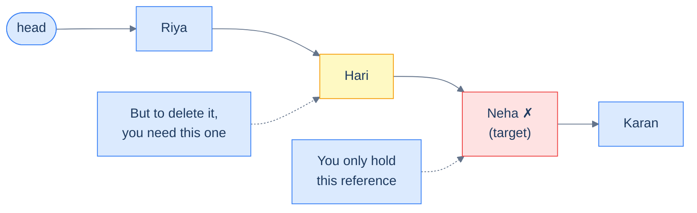
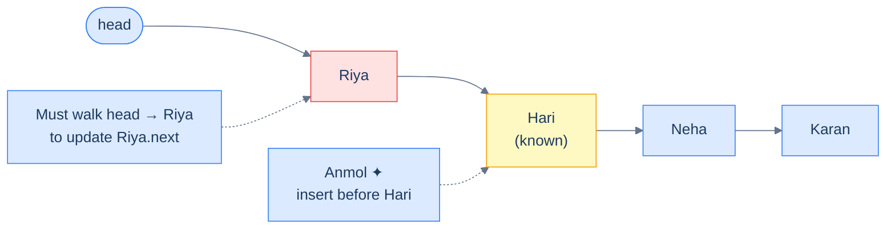
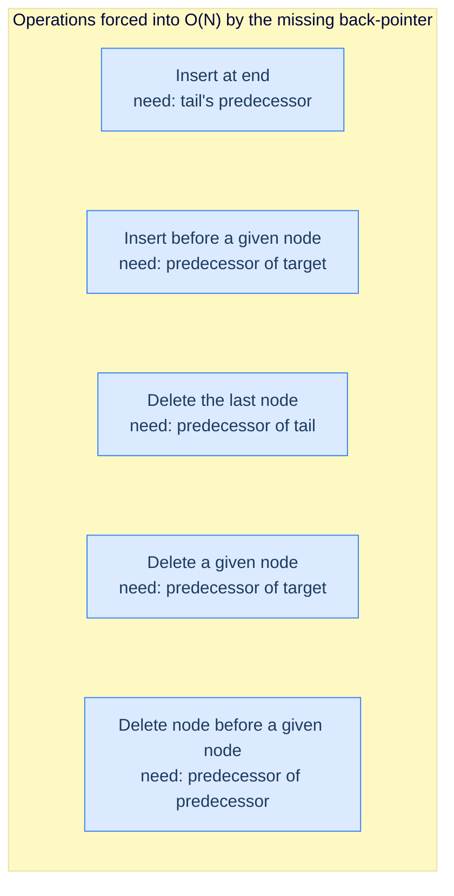
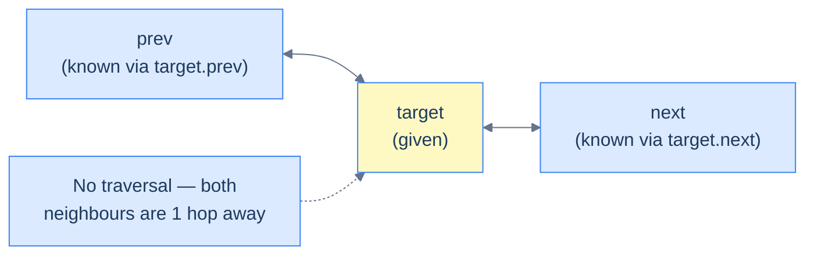
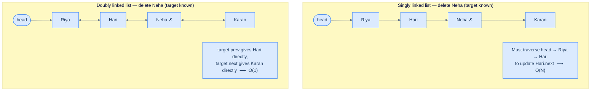
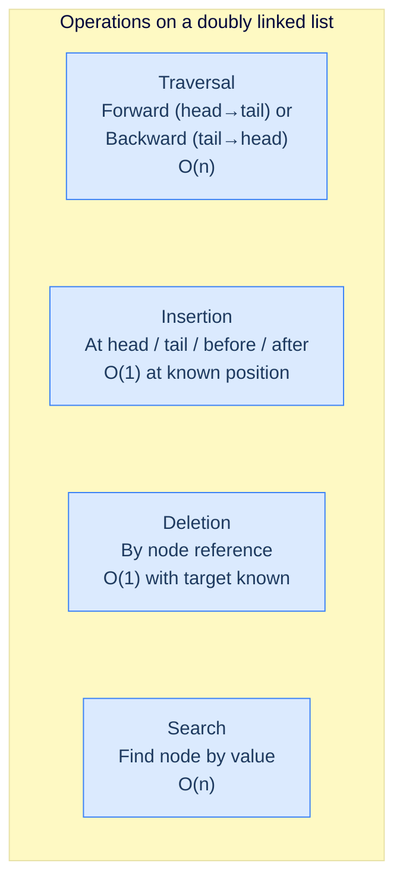

# 1. Introduction to Doubly Linked Lists

## The Hook

You're standing in the middle of a long conga line. The music stops, and someone at the front yells: *"Ravi, step out — and Anmol, slot in just before Hari."* Easy enough… except your line is a **singly linked list**. You know who's *in front of* you. You have **no idea** who's behind. To remove Ravi or place Anmol, somebody has to start from the front of the conga line and shuffle all the way down until they find the person standing right behind the spot you care about. For a thousand-person line, that's a thousand taps on shoulders just to fix one position.

What if every person in the line held *two* hands — one reaching forward, one reaching backward? Then "the person before you" is no longer a mystery hiding `n` steps away — it's the hand on your shoulder. Removing Ravi or inserting Anmol becomes a four-pointer reshuffle done **on the spot**, in constant time.

That's a **doubly linked list**. One extra pointer per node, and three of the singly linked list's worst pain points — *insert before*, *delete here*, *walk backward* — collapse from O(n) to O(1). It's the data structure behind your browser's back/forward buttons, every LRU cache in production, the undo/redo stack in your editor, and the deque inside Python's `collections`. Master it once, and you'll see its silhouette everywhere.

---

## Table of contents

1. [Understanding the problem](#understanding-the-problem)
2. [Exploring a possible solution](#exploring-a-possible-solution)
3. [Defining a node in doubly linked list](#defining-a-node-in-doubly-linked-list)
4. [Structure of a doubly linked list](#structure-of-a-doubly-linked-list)
5. [Overview of supported operations](#overview-of-supported-operations)

***

# Understanding the problem

Despite the many amazing benefits that singly linked lists offer, they still have limitations. To better understand doubly linked lists, let us look at common problems programmers face when using singly linked lists.

Let's revisit our example from the singly linked list course. In that course, we collected the names of all the students in a class and used a singly linked list to represent that information.

```d2
direction: right

head: head {
  shape: oval
}

n1: |md
  **Riya**

  next: ●
|
n2: |md
  **Hari**

  next: ●
|
n3: |md
  **Neha**

  next: ●
|
n4: |md
  **Karan**

  next: null
|

head -> n1
n1 -> n2
n2 -> n3
n3 -> n4
```

<p align="center"><strong>Names of students in the class represented as a singly linked list — each node points only forward, and the list is entered through the <code>head</code> reference.</strong></p>

Consider a scenario where Neha leaves the class and transfers to another school. Even if we have the node storing Neha's information, deleting it is still not easy. To delete a node in a singly linked list, we need access to the node **1 step before** the node that has to be deleted. It is *that* node whose `next` pointer has to be updated to skip Neha. This operation has a worst-case time complexity of **O(N)**, because we might have to traverse the entire list from the head just to land on the node sitting one step before Neha. For very large lists, this is brutally inefficient.



<p align="center"><strong>Deletion in a singly linked list — even with a direct reference to Neha, you cannot delete her without first walking from the head to find the node before her. That walk costs O(N).</strong></p>

Now, consider a case where we have a new student, Anmol, join the class, and we want to insert a node storing her information **before** Hari. Just like deletion, even if we have access to the node storing Hari's information, we still need to traverse the entire list to access the node **1 step before** Hari, because *that* node's `next` pointer has to be redirected to point at Anmol. Again, this operation has a worst-case time complexity of **O(N)** — and again, it's the *backward link we don't have* that costs us.



<p align="center"><strong>Insertion before a known node — the node before Hari (Riya) is the one whose <code>next</code> must change, but a singly linked list provides no shortcut to reach it. Another O(N) traversal.</strong></p>

## Limitations of singly linked lists

Even though we can solve the problem using a singly linked list, it is not the best solution. This is because singly linked lists have a structural blind spot: **every node only knows what's ahead of it, never what's behind**. The moment a task requires reasoning *backward*, we are forced into a full forward traversal from the head.



<p align="center"><strong>Every one of these operations is slow for the same reason — the structure cannot answer "who is behind me?" in O(1).</strong></p>

> The following operations have poor performance in singly linked lists:
>
> -   Insert at end
> -   Insert before a given node
> -   Delete the last node
> -   Delete the given node
> -   Delete node before a given node

What if we had a data structure that could solve the above problem most efficiently? *(Hint: we just need to teach every node a single new fact about itself.)*

***

# Exploring a possible solution

Now that we know the limitations of singly linked lists and the situations where those limitations lead to sub-optimal solutions, we can start to consider a data structure that can be used efficiently in such situations.

## Doubly linked list

A **doubly linked list** is a bidirectional, linear, dynamic data structure that stores data sequentially at random memory locations. The single design change is small but transformative: instead of storing only a `next` pointer, every node *also* stores a `prev` pointer that references the node before it. The chain becomes walkable in **both** directions.

```d2
direction: right

head: head {
  shape: oval
}
tail: tail {
  shape: oval
}

n1: |md
  prev: null

  **Riya**

  next: ●
|
n2: |md
  prev: ●

  **Hari**

  next: ●
|
n3: |md
  prev: ●

  **Neha**

  next: ●
|
n4: |md
  prev: ●

  **Karan**

  next: null
|

head -> n1
n4 <- tail
n1 <-> n2
n2 <-> n3
n3 <-> n4
```

<p align="center"><strong>Abstract representation of a doubly linked list — each node carries two pointers (<code>prev</code> and <code>next</code>), and the list is anchored at both ends by <code>head</code> and <code>tail</code> references.</strong></p>

## Advantages

If the address of a node is given, a doubly linked list guarantees the insertion and deletion of items in **O(1)** time and **O(1)** space. Since it is also bidirectional, it can be traversed in both directions — from the **head** to the **tail**, and equally easily from the **tail** back to the **head**.



<p align="center"><strong>Insertion or deletion before the given node does not require traversal — the predecessor is always exactly one hop away through <code>target.prev</code>.</strong></p>

To understand this better, let us look at an example of deletion in a doubly linked list — and contrast it directly with the same operation in a singly linked list.



<p align="center"><strong>Same task, two structures — the doubly linked list reaches both neighbours of the target in one hop, collapsing an O(N) operation to O(1).</strong></p>

More formally, a doubly linked list has a few advantages over a singly linked list, which are listed below.

> -   **Bidirectional traversal:** A doubly linked list can be walked forward (head → tail) or backward (tail → head) with equal ease.
> -   **Efficient insertion:** Inserting a new node before or after a given node is **O(1)** once the node is known — no scan required to find the predecessor.
> -   **Efficient deletion:** Deleting a given node is **O(1)** for the same reason — `target.prev` is already in hand.

## Limitations

Doubly linked lists are very efficient for certain use cases but also have some limitations.

> -   **Extra memory:** Compared to a singly linked list, every node in a doubly linked list pays the cost of one extra pointer (`prev`). On 64-bit systems that's 8 additional bytes per node — meaningful when the list holds millions of small payloads.
> -   **More bookkeeping:** Because each node now holds *two* pointers, every insertion or deletion has to update **four** links instead of two (the target's `prev`/`next` and the neighbours' `next`/`prev`). One forgotten pointer corrupts the list silently — the chain still walks in one direction but breaks in the other.

***

# Defining a node in doubly linked list

Like singly linked lists, a **node** in a doubly linked list is its fundamental building block. Multiple nodes, when chained together, make up a doubly linked list. All operations performed on the list — inserting, deleting, or updating data items — are performed by manipulating individual nodes and their links.

## Structure of a node

The node of a doubly linked list is a simple yet highly effective extension of the node of a singly linked list. It just has an extra pointer — `prev` — that stores the reference to the node **before** it in the list. This way, we can move **forward** and **backward** from any node, and operations involving reference manipulation become much easier. A doubly linked list node has three sections:

> -   **val:** The actual data item the node holds. This could be of any type.
> -   **prev:** A reference to the previous node in the list (or `null` if this is the head).
> -   **next:** A reference to the next node in the list (or `null` if this is the tail).

```d2
direction: right

node: "A single node" {
  grid-columns: 3
  grid-gap: 0
  prev: |md
    **prev**

    pointer
  |
  val: |md
    **val**

    data
  |
  next: |md
    **next**

    pointer
  |
}

prev_target: |md
  previous node

  or null if head
| {shape: oval}

next_target: |md
  next node

  or null if tail
| {shape: oval}

node.prev -> prev_target: "points to"
node.next -> next_target: "points to"
```

<p align="center"><strong>A doubly linked list node has three fields: <code>prev</code> (address of the predecessor), <code>val</code> (the data), and <code>next</code> (address of the successor). The <code>prev</code> field is the only structural difference from a singly linked node — and it is what unlocks O(1) bidirectional operations.</strong></p>

## Implementing a node

As we already learned, the node of a doubly linked list is just an extension of a singly linked list node. We can implement a doubly linked list node by adding a new pointer to the implementation of a singly linked list node.

```python run
class ListNode:
    def __init__(self, val=0, prev=None, next=None):
        self.val  = val   # The data this node holds
        self.prev = prev  # Reference to the previous node; None if this is the head
        self.next = next  # Reference to the next node;     None if this is the tail

# Usage — wire two nodes together both ways
a = ListNode(5)
b = ListNode(7)
a.next = b   # Forward link a → b
b.prev = a   # Backward link a ← b  (must mirror the forward link!)
print(a.val, "<->", b.val)  # 5 <-> 7
```

```java run
public class Main {
    static class ListNode {
        int      val;
        ListNode prev;   // Predecessor pointer; null if head
        ListNode next;   // Successor   pointer; null if tail

        ListNode() {}                          // Default: val=0, both pointers null
        ListNode(int val) { this.val = val; }  // Pointers stay null until linked
    }

    public static void main(String[] args) {
        ListNode a = new ListNode(5);
        ListNode b = new ListNode(7);
        a.next = b;   // Forward link a → b
        b.prev = a;   // Backward link a ← b — must mirror!
        System.out.println(a.val + " <-> " + b.val);  // 5 <-> 7
    }
}
```

```c run
#include <stdio.h>
#include <stdlib.h>

typedef struct ListNode {
    int               val;
    struct ListNode  *prev;   // Predecessor; NULL if head
    struct ListNode  *next;   // Successor;   NULL if tail
} ListNode;

ListNode* newNode(int val) {
    ListNode *node = (ListNode*)malloc(sizeof(ListNode));
    node->val  = val;
    node->prev = NULL;   // Newly allocated nodes start disconnected on both sides
    node->next = NULL;
    return node;
}

int main() {
    ListNode *a = newNode(5);
    ListNode *b = newNode(7);
    a->next = b;   // Forward link
    b->prev = a;   // Backward link — keep both sides in sync
    printf("%d <-> %d\n", a->val, b->val);   // 5 <-> 7
    free(a);
    free(b);
    return 0;
}
```

```cpp run
#include <iostream>

struct ListNode {
    int       val;
    ListNode *prev;   // Predecessor; nullptr if head
    ListNode *next;   // Successor;   nullptr if tail

    ListNode()
        : val(0),   prev(nullptr), next(nullptr) {}
    ListNode(int val, ListNode* next = nullptr, ListNode* prev = nullptr)
        : val(val), prev(prev),    next(next)    {}
};

int main() {
    ListNode *a = new ListNode(5);
    ListNode *b = new ListNode(7);
    a->next = b;   // Forward
    b->prev = a;   // Backward — mirror the forward link
    std::cout << a->val << " <-> " << b->val << "\n";  // 5 <-> 7
    delete a;
    delete b;
}
```

```scala run
class ListNode(
  var v:    Int      = 0,
  var prev: ListNode = null,   // Predecessor pointer; null if head
  var next: ListNode = null    // Successor   pointer; null if tail
)

object Main extends App {
  val a = new ListNode(5)
  val b = new ListNode(7)
  a.next = b   // Forward
  b.prev = a   // Backward — must be set explicitly to mirror `next`
  println(s"${a.v} <-> ${b.v}")  // 5 <-> 7
}
```

```javascript run
class ListNode {
    constructor(val = 0, prev = null, next = null) {
        this.val  = val;    // The data this node holds
        this.prev = prev;   // Reference to the previous node; null if head
        this.next = next;   // Reference to the next     node; null if tail
    }
}

const a = new ListNode(5);
const b = new ListNode(7);
a.next = b;   // Forward link
b.prev = a;   // Backward link — keep both sides in sync
console.log(a.val + " <-> " + b.val);  // 5 <-> 7
```

```typescript run
class ListNode {
    val:  number;
    prev: ListNode | null;   // Predecessor; null if head
    next: ListNode | null;   // Successor;   null if tail

    constructor(
        val:  number          = 0,
        prev: ListNode | null = null,
        next: ListNode | null = null,
    ) {
        this.val  = val;
        this.prev = prev;
        this.next = next;
    }
}

const a = new ListNode(5);
const b = new ListNode(7);
a.next = b;   // Forward
b.prev = a;   // Backward
console.log(`${a.val} <-> ${b.val}`);  // 5 <-> 7
```

```go run
package main

import "fmt"

type ListNode struct {
    Val  int
    Prev *ListNode   // Predecessor; nil if head
    Next *ListNode   // Successor;   nil if tail
}

func main() {
    a := &ListNode{Val: 5}
    b := &ListNode{Val: 7}
    a.Next = b   // Forward
    b.Prev = a   // Backward — mirror the forward link
    fmt.Printf("%d <-> %d\n", a.Val, b.Val)  // 5 <-> 7
}
```

```kotlin run
class ListNode(
    var `val`: Int       = 0,
    var prev:  ListNode? = null,   // Predecessor; null if head
    var next:  ListNode? = null,   // Successor;   null if tail
)

fun main() {
    val a = ListNode(5)
    val b = ListNode(7)
    a.next = b   // Forward
    b.prev = a   // Backward
    println("${a.`val`} <-> ${b.`val`}")  // 5 <-> 7
}
```

```rust run
// A pedagogical doubly linked node. Production Rust code typically uses
// Rc<RefCell<...>> or raw pointers for true cyclic ownership, but for an
// introduction we model a simple two-node chain owned in one direction.
#[derive(Debug)]
struct ListNode {
    val:  i32,
    next: Option<Box<ListNode>>,   // Owned forward link; None if tail
    // `prev` would create a cycle under Rust's ownership rules — see
    // later lessons for Rc<RefCell<...>> or unsafe-pointer designs.
}

impl ListNode {
    fn new(val: i32) -> Self {
        ListNode { val, next: None }
    }
}

fn main() {
    let mut a = ListNode::new(5);
    let     b = ListNode::new(7);
    a.next = Some(Box::new(b));   // Forward link a → b
    println!("{} <-> {}", a.val, a.next.as_ref().unwrap().val);  // 5 <-> 7
}
```


> *Notice the recurring pattern in every language above: setting `a.next = b` is **not** enough on its own — we must also set `b.prev = a`. **Every link in a doubly linked list is two pointers, not one.** Forgetting the mirror update is the single most common bug in DLL code, and we'll see why it matters the moment we start inserting and deleting in the next lessons.*

***

# Structure of a doubly linked list

Like a singly linked list, a doubly linked list is a chain of nodes — but every link in the chain is now made of **two** pointers pulling in opposite directions, like a row of magnets attracting both neighbours.

```d2
direction: right

n1: |md
  prev: null

  **val: 5**

  next: ●
|
n2: |md
  prev: ●

  **val: 7**

  next: ●
|
n3: |md
  prev: ●

  **val: 3**

  next: ●
|
n4: |md
  prev: ●

  **val: 9**

  next: null
|

n1 <-> n2
n2 <-> n3
n3 <-> n4
```

<p align="center"><strong>A chain of nodes makes up a doubly linked list — each interior node holds a live <code>prev</code> and <code>next</code> reference, while the head's <code>prev</code> and the tail's <code>next</code> are <code>null</code>.</strong></p>

When represented logically in a diagram, these nodes might look sequential (left to right, one after the other), but in reality, they are scattered all around in memory at random locations, and the only way to access a node is by using its address in memory.

```d2
mem: "Physical memory — nodes live at arbitrary addresses" {
  grid-columns: 4
  grid-gap: 16
  n1: |md
    addr 0x1A4

    prev: null

    val: 5

    next: 0x3F2
  |
  n2: |md
    addr 0x3F2

    prev: 0x1A4

    val: 7

    next: 0x0B8
  |
  n3: |md
    addr 0x0B8

    prev: 0x3F2

    val: 3

    next: 0x2C1
  |
  n4: |md
    addr 0x2C1

    prev: 0x0B8

    val: 9

    next: null
  |
  n1 -> n2: "next"
  n2 -> n3: "next"
  n3 -> n4: "next"
  n4 -> n3: "prev"
  n3 -> n2: "prev"
  n2 -> n1: "prev"
}
```

<p align="center"><strong>Doubly linked list in memory — the four nodes are scattered at unrelated addresses; each node stores both the predecessor's and the successor's address so the chain can be walked in either direction.</strong></p>

## Head node

Similar to a singly linked list, the first node of a doubly linked list is also called its **head**. The only difference between a singly and doubly linked list head arises from the fact that a doubly linked node also has a `prev` pointer. The `prev` pointer of the **head** node of a doubly-linked list is `null` — exactly the way the `next` pointer of the **tail** node in a singly linked list is `null`. This signals "there is nothing to walk *backward* into from here." A representation of a doubly linked list with its head highlighted is given below.

```d2
direction: right

null_l: "null" {shape: oval}

h: |md
  prev: null

  **val: 5**

  next: ●
| {style.fill: "#dbeafe"; style.stroke: "#3b82f6"}

n2: |md
  **val: 7**
|

n3: |md
  **val: 3**

  next: null
|

head: head {shape: oval}

null_l -- h
head -> h: "entry from the front"
h <-> n2
n2 <-> n3
```

<p align="center"><strong>Head of a doubly linked list — the head's <code>prev</code> pointer is <code>null</code>, signalling "no predecessor". The <code>head</code> reference is the entry point used for forward traversal.</strong></p>

## Tail node

Similar to a singly linked list, the **last** node of a doubly linked list is also called its **tail**. However, unlike a singly linked list, we can traverse a doubly linked list from the last node all the way back to the first. For this to be useful in O(1), however, we must always keep a reference to the **tail** node — just like we always have a reference to the **head**. Without an explicit `tail` reference, finding the tail still costs O(N), even though *walking backward from it* once we have it is free.

```d2
direction: right

h: |md
  prev: null

  **val: 5**
|

n2: |md
  **val: 7**
|

t: |md
  prev: ●

  **val: 3**

  next: null
| {style.fill: "#fef9c3"; style.stroke: "#3b82f6"}

null_r: "null" {shape: oval}

tail: tail {shape: oval}

h <-> n2
n2 <-> t
t -- null_r
tail -> t: "entry from the back"
```

<p align="center"><strong>Tail of a doubly linked list — the tail's <code>next</code> pointer is <code>null</code>, signalling "no successor". A separate <code>tail</code> reference lets us start a backward traversal in O(1).</strong></p>

> *Quick check before reading on — what if a list of length 1 has only a single node? What do its <code>prev</code> and <code>next</code> pointers look like, and what do <code>head</code> and <code>tail</code> point to?*
>
> Both pointers of the lone node are `null` (no neighbours on either side), and `head` and `tail` reference the same node. This boundary case will keep showing up in every operation lesson — train your eye to spot it now.

***

# Overview of supported operations

Now that we know what an individual node of a doubly-linked list looks like and how these individual nodes link up together to create a doubly-linked list, we can dive deeper and understand the different operations performed on this type of linked list. Just like a singly linked list, we can broadly classify all doubly linked list operations into three categories:

> -   Traversal
> -   Insertion
> -   Deletion

All other complex operations can be implemented by combining or piggybacking on these fundamental operations. Let's examine how these basic operations combine to create more complex actions.



<p align="center"><strong>Some operations on a doubly linked list — search and traversal are still O(n), but every "modification at a known position" operation is now O(1) because each node's <code>prev</code> pointer eliminates the predecessor-finding scan.</strong></p>

Don't worry if you don't understand all of these operations yet. We will explore them in more detail in the upcoming lessons. Each of these operations is built from a combination of basic ones, and once you've mastered the fundamentals, the intuition behind the more complex operations will become clear.

> *Coming up next:* we'll start with **traversal** — and you'll see something surprising. Adding the `prev` pointer doesn't just make backward walks possible; it also subtly changes how we *think* about iteration. The forward loop you wrote a hundred times for singly lists has a mirror twin now, and it's the foundation for every problem in this section.
