# 3. Insertion in Doubly Linked Lists

## The Hook

In a singly linked list, "insert before this node" was a small lie we told ourselves. We *said* "insert before X" but really we had to walk all the way from the head to find the node sitting one step before X — because the list refused to tell us who lived behind any given address. A thousand-node list, a thousand-step walk, just to wedge one node into place.

In a doubly linked list, that walk simply… doesn't happen. Every node already knows who's behind it. "Insert before X" becomes a four-pointer reshuffle done **on the spot**, in O(1). It's the kind of speedup you don't fully appreciate until you watch a million-element insertion that used to take seconds finish in microseconds.

But there's a catch — and it's the catch that catches everyone the first time. **A doubly linked list has twice as many pointers, so every insertion has twice as many ways to go wrong.** Forget one mirror update and your forward chain looks fine while the backward chain quietly snaps. By the end of this lesson, you'll have a checklist drilled into muscle memory: *what point at me?* and *what do I point at?* — answer both, every time, and the list stays correct.

---

## Table of contents

1. [Understanding insertion at beginning](#understanding-insertion-at-beginning)
2. [Insert at beginning](#insert-at-beginning)
3. [Understanding insertion at end](#understanding-insertion-at-end)
4. [Insert at end](#insert-at-end)
5. [Understanding insertion after the given node](#understanding-insertion-after-the-given-node)
6. [Insert after the given node](#insert-after-the-given-node)
7. [Understanding insertion before a given node](#understanding-insertion-before-the-given-node)
8. [Insert before the given node](#insert-before-the-given-node)
9. [Understanding insertion at a given distance](#understanding-insertion-at-a-given-distance)
10. [Insert at given distance](#insert-at-given-distance)

***

# Understanding insertion at beginning

Inserting a node at the beginning of a doubly linked list is similar to inserting a node at the beginning of a singly linked list. The main difference is that a doubly linked list has **two** references stored in each node, and we need to keep track of both. **Every link is two pointers, not one** — break that habit and the list breaks with it. Let's examine the scenarios we need to take into account.

## 1. The list is empty

In this scenario, if the linked list is empty, the **head** will be `null`. We need to initialize the **head** node of the linked list and ensure that the `prev` and `next` pointers of this newly created **head** node are both `null`, because this single node is simultaneously the **head** and the **tail** of the list.

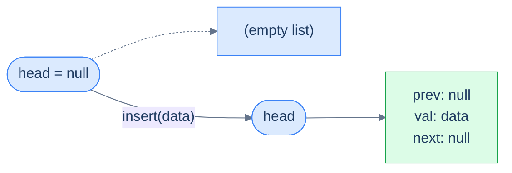

<p align="center"><strong>Insertion into an empty list — the new node becomes the entire list. Both <code>prev</code> and <code>next</code> are <code>null</code> because there are no neighbours on either side.</strong></p>

> **Algorithm**
>
> -   **Step 1:** Create a new node with the given data.
> -   **Step 2:** Set the new node's `next` pointer to `null` since it's the only node.
> -   **Step 3:** Set the new node's `prev` pointer to `null` since it's the only node.
> -   **Step 4:** Return the new node, as this node is also the head node.

## 2. The list is not empty

In this scenario, the linked list already contains some data, so the **head** is not `null` — it is the first node of the linked list. To insert a new node at the beginning of the list, create a new node, set its `next` to point at the old head, set its `prev` to `null` (it's the new head, so nothing precedes it), and **mirror** the link by setting the old head's `prev` to point back at the new node. This last step is the one beginners forget — and it silently corrupts every backward traversal afterward.

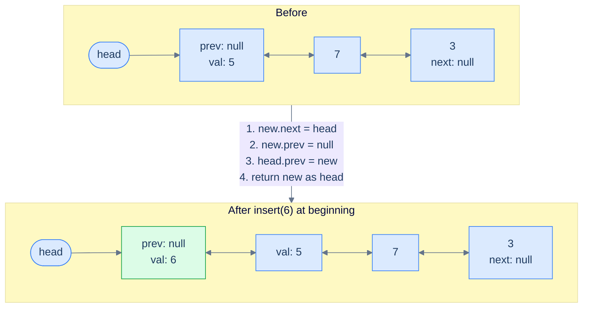

<p align="center"><strong>Insertion at the beginning of a non-empty list — three pointer updates plus the new node returned as the new head. The mirror update <code>head.prev = new</code> is what keeps backward traversal honest.</strong></p>

> **Algorithm**
>
> -   **Step 1:** Create a new node with the given data.
> -   **Step 2:** Set the `next` pointer of the new node to the current head, as the new node will be the new head.
> -   **Step 3:** Set the new node's `prev` pointer to `null` since it's the new head node.
> -   **Step 4:** Set the `prev` pointer of the current head to the new node to restore the bidirectional link.
> -   **Step 5:** Return the new node, as this is the new head.

## Implementation

When implementing the logic for the insert-at-beginning operation, we consider both possible cases (empty / non-empty) and write the code for each in conditional blocks.


```pseudocode
function insertAtBeginning(head, data):
    newNode ← new ListNode(data)
    if head is null:
        newNode.next ← null; newNode.prev ← null      # lone node — both ends
        return newNode
    newNode.next ← head                                # forward link
    newNode.prev ← null                                # new head has no predecessor
    head.prev ← newNode                                # mirror — old head's prev points back
    return newNode
```

```python run
class Solution:
    def insert_at_beginning(self, head, data):
        new_node = ListNode(data)              # 1. Build the new node
        if head is None:                       # Case A: list is empty
            new_node.next = None               #   No successor — it's also the tail
            new_node.prev = None               #   No predecessor — it's the head
            return new_node                    #   Return the lone node as the new head
        new_node.next = head                   # 2. New node's next = old head
        new_node.prev = None                   # 3. New head has no predecessor
        head.prev = new_node                   # 4. Mirror — old head's prev now points back
        return new_node                        # 5. Return the new head
```

```java run
class Solution {
    public ListNode insertAtBeginning(ListNode head, int data) {
        ListNode newNode = new ListNode(data);     // 1. Build the new node
        if (head == null) {                        // Case A: list is empty
            newNode.next = null;                   //   No neighbours on either side
            newNode.prev = null;
            return newNode;
        }
        newNode.next = head;                       // 2. New node's next = old head
        newNode.prev = null;                       // 3. New head has no predecessor
        head.prev = newNode;                       // 4. Mirror — old head's prev now points back
        return newNode;                            // 5. Return the new head
    }
}
```

```c run
ListNode* insertAtBeginning(ListNode *head, int data) {
    ListNode *newNode = newListNode(data);
    if (head == NULL) {                  /* Case A: empty list */
        newNode->next = NULL;
        newNode->prev = NULL;
        return newNode;
    }
    newNode->next = head;                /* New node's next = old head */
    newNode->prev = NULL;                /* New head has no predecessor */
    head->prev   = newNode;              /* Mirror — restore bidirectional link */
    return newNode;
}
```

```cpp run
class Solution {
public:
    ListNode *insertAtBeginning(ListNode *head, int data) {
        ListNode *newNode = new ListNode(data);   // 1. Build the new node
        if (head == nullptr) {                    // Case A: list is empty
            newNode->next = nullptr;
            newNode->prev = nullptr;
            return newNode;
        }
        newNode->next = head;                     // 2. New node's next = old head
        newNode->prev = nullptr;                  // 3. New head has no predecessor
        head->prev    = newNode;                  // 4. Mirror — old head's prev now points back
        return newNode;                           // 5. Return the new head
    }
};
```

```scala run
class Solution {
  def insertAtBeginning(head: ListNode, data: Int): ListNode = {
    val newNode = new ListNode(data)
    if (head == null) {                  // Case A: list is empty
      newNode.next = null
      newNode.prev = null
      return newNode
    }
    newNode.next = head                  // 2. New node's next = old head
    newNode.prev = null                  // 3. New head has no predecessor
    head.prev    = newNode               // 4. Mirror
    newNode                              // 5. Return the new head
  }
}
```

```typescript run
class Solution {
    insertAtBeginning(head: ListNode | null, data: number): ListNode | null {
        const newNode = new ListNode(data);
        if (head === null) {              // Case A: list is empty
            newNode.next = null;
            newNode.prev = null;
            return newNode;
        }
        newNode.next = head;              // 2. New node's next = old head
        newNode.prev = null;              // 3. New head has no predecessor
        head.prev    = newNode;           // 4. Mirror
        return newNode;                   // 5. Return the new head
    }
}
```

```go run
func insertAtBeginning(head *ListNode, data int) *ListNode {
    newNode := &ListNode{Val: data}
    if head == nil {                      // Case A: empty list
        newNode.Next = nil
        newNode.Prev = nil
        return newNode
    }
    newNode.Next = head                   // 2. New node's next = old head
    newNode.Prev = nil                    // 3. New head has no predecessor
    head.Prev    = newNode                // 4. Mirror
    return newNode                        // 5. Return the new head
}
```

```rust run
// Conceptual — production Rust DLLs typically use Rc<RefCell<...>> or
// raw pointers because Rust's ownership rules don't permit two safe
// references in opposite directions. See lesson 09 (Design) for a real
// implementation. The pointer dance below shows the conceptual shape.
//
// fn insert_at_beginning(head: ..., data: i32) -> ... {
//     let new_node = ListNode::new(data);
//     match head {
//         None       => new_node,                    // Case A: empty
//         Some(h)    => { new_node.next = Some(h);
//                         h.prev = Some(&new_node);
//                         new_node },
//     }
// }
```


## Complexity Analysis

The time complexity of the above function does not depend on the list size — we always touch a fixed number of pointers, never traverse. The space complexity is also constant because we only allocate a single new node.

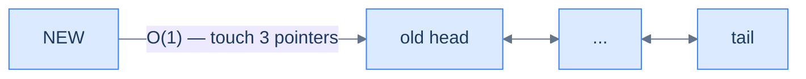

<p align="center"><strong>All cases — insert before the head node touches a constant number of pointers (new.next, new.prev, head.prev). No traversal, no allocation beyond the single new node.</strong></p>

> **Best Case**
>
> -   Space Complexity — **O(1)**
> -   Time Complexity — **O(1)**
>
> **Worst Case**
>
> -   Space Complexity — **O(1)**
> -   Time Complexity — **O(1)**

***

# Insert at beginning

## The Problem

> Given the **head** of a doubly linked list and a **data** value, write a function to insert a new node with the given data value at the beginning of the linked list and return the head of the updated list.

```
Input:  head = [5, 7, 3, 10], data = 6
Output: [6, 5, 7, 3, 10]
```

## The Solution


```pseudocode
# Compact form — `prev` defaults to null on a fresh node.
function insertAtBeginning(head, data):
    newNode ← new ListNode(data)
    if head is null: return newNode
    newNode.next ← head
    head.prev ← newNode                                # mirror the forward link
    return newNode
```

```python run
class Solution:
    def insert_at_beginning(self, head, data):
        new_node = ListNode(data)
        if head is None:
            return new_node               # Empty list → lone node is the new head
        new_node.next = head              # Link new → old head
        head.prev     = new_node          # Mirror — old head ← new
        return new_node                   # New head returned
```

```java run
class Solution {
    public ListNode insertAtBeginning(ListNode head, int data) {
        ListNode newNode = new ListNode(data);
        if (head == null) return newNode;        // Empty list shortcut
        newNode.next = head;                     // Link new → old head
        head.prev    = newNode;                  // Mirror
        return newNode;
    }
}
```

```c run
ListNode* insertAtBeginning(ListNode *head, int data) {
    ListNode *newNode = newListNode(data);
    if (head == NULL) return newNode;
    newNode->next = head;
    head->prev    = newNode;
    return newNode;
}
```

```cpp run
class Solution {
public:
    ListNode *insertAtBeginning(ListNode *head, int data) {
        ListNode *newNode = new ListNode(data);
        if (head == nullptr) return newNode;
        newNode->next = head;
        head->prev    = newNode;
        return newNode;
    }
};
```

```scala run
class Solution {
  def insertAtBeginning(head: ListNode, data: Int): ListNode = {
    val n = new ListNode(data)
    if (head == null) return n
    n.next   = head
    head.prev = n
    n
  }
}
```

```typescript run
class Solution {
    insertAtBeginning(head: ListNode | null, data: number): ListNode {
        const n = new ListNode(data);
        if (head === null) return n;
        n.next    = head;
        head.prev = n;
        return n;
    }
}
```

```go run
func insertAtBeginning(head *ListNode, data int) *ListNode {
    n := &ListNode{Val: data}
    if head == nil { return n }
    n.Next    = head
    head.Prev = n
    return n
}
```

```rust run
// See lesson 09 for a complete Rc<RefCell<...>> implementation.
```


<details>
<summary><strong>Trace — head = [5, 7, 3, 10], data = 6</strong></summary>

```
Initial │ head → 5 ↔ 7 ↔ 3 ↔ 10
Step 1  │ create new(6)        │ new.next = null,  new.prev = null
Step 2  │ new.next = head       │ new(6) → 5 ↔ 7 ↔ 3 ↔ 10
Step 3  │ head.prev = new       │ 6 ↔ 5 ↔ 7 ↔ 3 ↔ 10  (mirror complete)
Step 4  │ return new            │ new head is 6
Result: [6, 5, 7, 3, 10] ✓
```

</details>

***

# Understanding insertion at end

When inserting at the end of a doubly linked list, we must access the linked list's tail node. Fortunately, in a doubly linked list, we routinely keep a direct reference to the tail (much like the head). This makes insertion at the end almost a perfect mirror of insertion at the beginning — just flip every `head` to `tail` and every `next` to `prev`.

## 1. The list is empty

If the linked list is empty, the **tail** will be `null`. We initialize the new node and set both its pointers to `null`, since the new node is simultaneously the head and the tail of a one-element list.

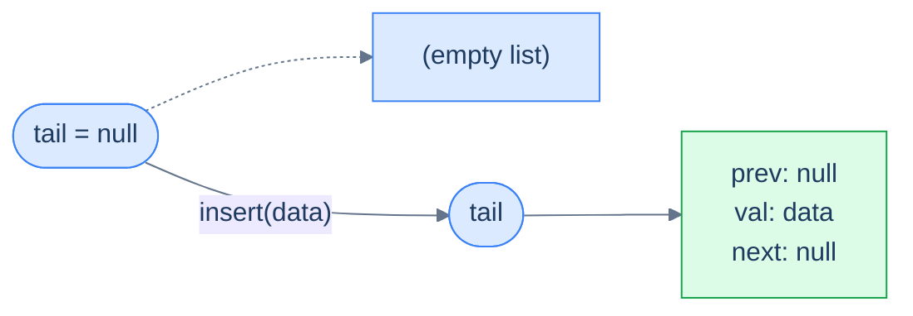

<p align="center"><strong>The list is empty — the new node becomes both the head and the tail. Same single-node case as insert-at-beginning, just entered through a different door.</strong></p>

> **Algorithm**
>
> -   **Step 1:** Create a new node with the given data.
> -   **Step 2:** Set this new node's `next` pointer to `null` since it's the only node.
> -   **Step 3:** Set this new node's `prev` pointer to `null` since it's the only node.
> -   **Step 4:** Return the new node, as this node is also the tail node.

## 2. The list is not empty

The linked list already contains some data, so the **tail** is the last node. We create the new node, link `tail.next = new` so the existing tail now points forward at us, link `new.prev = tail` to mirror that connection, and set `new.next = null` because the new node is now the end of the list.

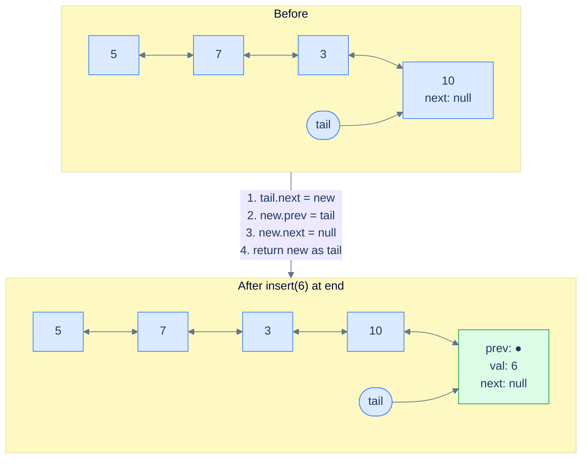

<p align="center"><strong>Insertion at the end of a non-empty list — three pointer updates and the new node becomes the new tail. Mirror image of insertion at the beginning.</strong></p>

> **Algorithm**
>
> -   **Step 1:** Create a new node with the given data.
> -   **Step 2:** Set the current tail's `next` pointer to hold the reference of the new node.
> -   **Step 3:** Set the new node's `prev` pointer to hold the reference of the current tail.
> -   **Step 4:** Set the new node's `next` pointer to `null`.
> -   **Step 5:** Return the new node, as this is the new tail.

## Implementation

We consider both cases and handle them in conditional blocks.


```pseudocode
function insertAtEnd(tail, data):
    newNode ← new ListNode(data)
    if tail is null:
        newNode.next ← null; newNode.prev ← null      # lone node
        return newNode
    tail.next ← newNode                                # old tail points forward
    newNode.prev ← tail                                # mirror — new points back
    newNode.next ← null                                # new tail has no successor
    return newNode
```

```python run
class Solution:
    def insert_at_end(self, tail, data):
        new_node = ListNode(data)
        if tail is None:                         # Case A: empty list
            new_node.next = None
            new_node.prev = None
            return new_node
        tail.next     = new_node                 # 2. Old tail points forward at new
        new_node.prev = tail                     # 3. Mirror — new points back at old tail
        new_node.next = None                     # 4. New node is the new tail
        return new_node                          # 5. Return the new tail
```

```java run
class Solution {
    public ListNode insertAtEnd(ListNode tail, int data) {
        ListNode newNode = new ListNode(data);
        if (tail == null) {                      // Case A: empty list
            newNode.next = null;
            newNode.prev = null;
            return newNode;
        }
        tail.next     = newNode;                 // 2. Old tail → new
        newNode.prev  = tail;                    // 3. Mirror
        newNode.next  = null;                    // 4. New node is the new tail
        return newNode;                          // 5. Return the new tail
    }
}
```

```c run
ListNode* insertAtEnd(ListNode *tail, int data) {
    ListNode *newNode = newListNode(data);
    if (tail == NULL) {
        newNode->next = NULL;
        newNode->prev = NULL;
        return newNode;
    }
    tail->next    = newNode;
    newNode->prev = tail;
    newNode->next = NULL;
    return newNode;
}
```

```cpp run
class Solution {
public:
    ListNode *insertAtEnd(ListNode *tail, int data) {
        ListNode *newNode = new ListNode(data);
        if (tail == nullptr) {                   // Case A: empty list
            newNode->next = nullptr;
            newNode->prev = nullptr;
            return newNode;
        }
        tail->next    = newNode;                 // 2. Old tail → new
        newNode->prev = tail;                    // 3. Mirror
        newNode->next = nullptr;                 // 4. New node is the new tail
        return newNode;                          // 5. Return the new tail
    }
};
```

```scala run
class Solution {
  def insertAtEnd(tail: ListNode, data: Int): ListNode = {
    val n = new ListNode(data)
    if (tail == null) { n.next = null; n.prev = null; return n }
    tail.next = n
    n.prev    = tail
    n.next    = null
    n
  }
}
```

```typescript run
class Solution {
    insertAtEnd(tail: ListNode | null, data: number): ListNode {
        const n = new ListNode(data);
        if (tail === null) { n.next = null; n.prev = null; return n; }
        tail.next = n;
        n.prev    = tail;
        n.next    = null;
        return n;
    }
}
```

```go run
func insertAtEnd(tail *ListNode, data int) *ListNode {
    n := &ListNode{Val: data}
    if tail == nil { return n }
    tail.Next = n
    n.Prev    = tail
    n.Next    = nil
    return n
}
```

```rust run
// See lesson 09 for a complete bidirectional implementation.
```


## Complexity Analysis

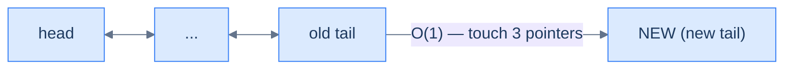

<p align="center"><strong>All cases — insert after the tail node touches a constant number of pointers. Same constant-time guarantee as insert-at-beginning, achieved through the dedicated <code>tail</code> reference.</strong></p>

> **Best Case**
>
> -   Space Complexity — **O(1)**
> -   Time Complexity — **O(1)**
>
> **Worst Case**
>
> -   Space Complexity — **O(1)**
> -   Time Complexity — **O(1)**

***

# Insert at end

## The Problem

> Given the **tail** of a doubly linked list and a **data** value, write a function to insert a new node with the given data value at the end of the linked list and return the tail of the updated list.

```
Input:  head = [5, 7, 3, 10], data = 6
Output: [5, 7, 3, 10, 6]
```

## The Solution


```pseudocode
# Compact form — `next` defaults to null on a fresh node.
function insertAtEnd(tail, data):
    newNode ← new ListNode(data)
    if tail is null: return newNode
    tail.next ← newNode
    newNode.prev ← tail
    return newNode
```

```python run
class Solution:
    def insert_at_end(self, tail, data):
        new_node = ListNode(data)
        if tail is None:
            return new_node                  # Empty list → lone node
        tail.next     = new_node             # Forward link from old tail
        new_node.prev = tail                 # Mirror back-link
        return new_node                      # New tail
```

```java run
class Solution {
    public ListNode insertAtEnd(ListNode tail, int data) {
        ListNode n = new ListNode(data);
        if (tail == null) return n;
        tail.next = n;
        n.prev    = tail;
        return n;
    }
}
```

```c run
ListNode* insertAtEnd(ListNode *tail, int data) {
    ListNode *n = newListNode(data);
    if (tail == NULL) return n;
    tail->next = n;
    n->prev    = tail;
    return n;
}
```

```cpp run
class Solution {
public:
    ListNode *insertAtEnd(ListNode *tail, int data) {
        ListNode *n = new ListNode(data);
        if (tail == nullptr) return n;
        tail->next = n;
        n->prev    = tail;
        return n;
    }
};
```

```scala run
class Solution {
  def insertAtEnd(tail: ListNode, data: Int): ListNode = {
    val n = new ListNode(data)
    if (tail == null) return n
    tail.next = n
    n.prev    = tail
    n
  }
}
```

```typescript run
class Solution {
    insertAtEnd(tail: ListNode | null, data: number): ListNode {
        const n = new ListNode(data);
        if (tail === null) return n;
        tail.next = n;
        n.prev    = tail;
        return n;
    }
}
```

```go run
func insertAtEnd(tail *ListNode, data int) *ListNode {
    n := &ListNode{Val: data}
    if tail == nil { return n }
    tail.Next = n
    n.Prev    = tail
    return n
}
```

```rust run
// See lesson 09 for a complete bidirectional implementation.
```


***

# Understanding insertion after the given node

Inserting a node after a given node is a simple operation. It is similar to inserting after a given node in a singly linked list, with one extra step — we must update the `prev` pointer of the node that comes after the given one (if it exists), so the new node is wired in **both** directions. Let's examine the two cases we need to consider.

## 1. The given node is null

If the given node is `null`, there's no insertion point — we simply return without making any changes. (This is the equivalent of an "empty list" guard for an operation that takes a node reference.)

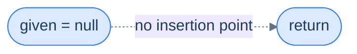

<p align="center"><strong>The list is empty / given node is null — no anchor exists, so we return early without modification.</strong></p>

> **Algorithm**
>
> -   **Step 1:** Return from the function.

## 2. The list is not empty

The new node will be inserted between two existing nodes (the given node and its current successor). We must wire **all four** of the affected pointers, with one twist: if the given node is the *tail*, there is no successor — so the "fix the successor's `prev`" step has to be guarded by a null check.

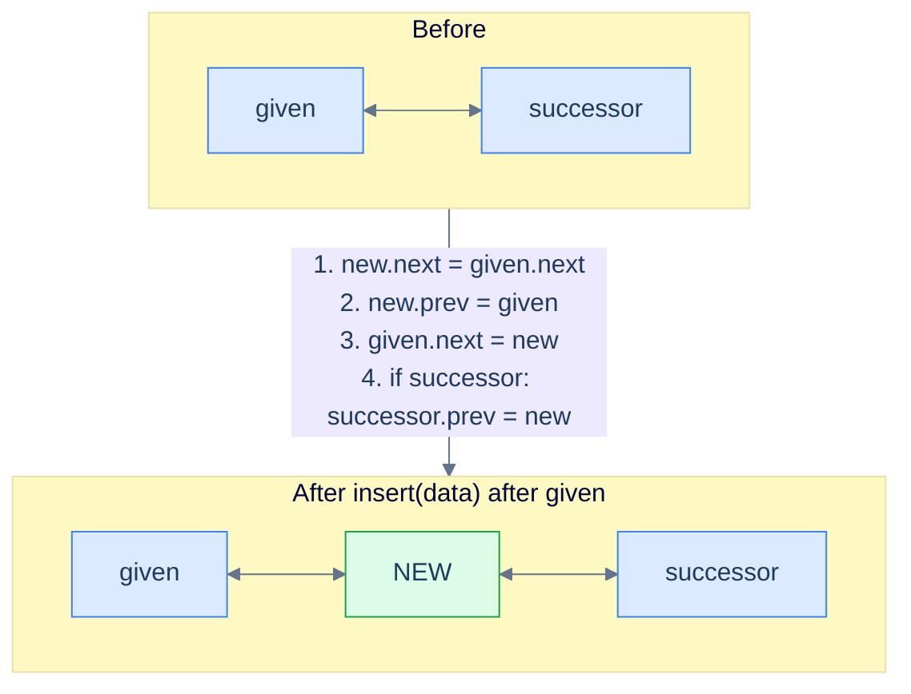

<p align="center"><strong>Insert after the given node — splice the new node between <code>given</code> and <code>given.next</code>. Four pointers updated; the fourth is conditional because the given node may be the tail.</strong></p>

> **Algorithm**
>
> -   **Step 1:** Create a new node with the given data.
> -   **Step 2:** Set the new node's `next` pointer to hold the node's reference stored in the `next` pointer of the `given` node.
> -   **Step 3:** Set the new node's `prev` pointer to hold the reference of the `given` node.
> -   **Step 4:** Set the `given` node's `next` pointer to hold the reference of the new node.
> -   **Step 5:** Set the `prev` pointer of the node after the `given` node (if it exists) to hold the reference of the new node.

## Implementation

We will be given the node, **after** which we will perform the insertion.


```pseudocode
function insertAfterTheGivenNode(node, data):
    if node is null: return
    newNode ← new ListNode(data)
    newNode.next ← node.next                           # save before we clobber
    newNode.prev ← node
    node.next ← newNode
    if newNode.next is not null:                       # `node` may have been the tail
        newNode.next.prev ← newNode                    # mirror — successor's prev = new
```

```python run
class Solution:
    def insert_after_the_given_node(self, node, data):
        if node is None:                     # No anchor → nothing to do
            return
        new_node = ListNode(data)
        new_node.next = node.next            # 2. New node's successor = given's successor
        new_node.prev = node                 # 3. New node's predecessor = given
        node.next     = new_node             # 4. Given's successor = new node
        if new_node.next is not None:        # 5. Conditional — given might have been the tail
            new_node.next.prev = new_node    #    Mirror — successor's predecessor = new
```

```java run
class Solution {
    public void insertAfterTheGivenNode(ListNode node, int data) {
        if (node == null) return;                    // No anchor → nothing to do
        ListNode newNode = new ListNode(data);
        newNode.next = node.next;                    // 2. Successor of new = given's successor
        newNode.prev = node;                         // 3. Predecessor of new = given
        node.next    = newNode;                      // 4. Given's successor = new
        if (newNode.next != null) {                  // 5. Conditional mirror update
            newNode.next.prev = newNode;
        }
    }
}
```

```c run
void insertAfterTheGivenNode(ListNode *node, int data) {
    if (node == NULL) return;
    ListNode *newNode = newListNode(data);
    newNode->next = node->next;
    newNode->prev = node;
    node->next    = newNode;
    if (newNode->next != NULL) {
        newNode->next->prev = newNode;
    }
}
```

```cpp run
class Solution {
public:
    void insertAfterTheGivenNode(ListNode *node, int data) {
        if (node == nullptr) return;                 // No anchor → nothing to do
        ListNode *newNode = new ListNode(data);
        newNode->next = node->next;                  // 2. Successor of new = given's successor
        newNode->prev = node;                        // 3. Predecessor of new = given
        node->next    = newNode;                     // 4. Given's successor = new
        if (newNode->next != nullptr) {              // 5. Conditional mirror update
            newNode->next->prev = newNode;
        }
    }
};
```

```scala run
class Solution {
  def insertAfterTheGivenNode(node: ListNode, data: Int): Unit = {
    if (node == null) return
    val n = new ListNode(data)
    n.next   = node.next
    n.prev   = node
    node.next = n
    if (n.next != null) n.next.prev = n
  }
}
```

```typescript run
class Solution {
    insertAfterTheGivenNode(node: ListNode | null, data: number): void {
        if (node === null) return;
        const n = new ListNode(data);
        n.next    = node.next;
        n.prev    = node;
        node.next = n;
        if (n.next !== null) n.next.prev = n;
    }
}
```

```go run
func insertAfterTheGivenNode(node *ListNode, data int) {
    if node == nil { return }
    n := &ListNode{Val: data}
    n.Next    = node.Next
    n.Prev    = node
    node.Next = n
    if n.Next != nil {
        n.Next.Prev = n
    }
}
```

```rust run
// See lesson 09 for a complete bidirectional implementation.
```


> *Why is the order of those four assignments important? Try mentally swapping step 4 (<code>node.next = new</code>) with step 2 (<code>new.next = node.next</code>) — what reads what before being overwritten?*
>
> If you do step 4 first, `node.next` becomes the new node, and step 2 then reads `node.next` and finds *the new node again*, creating a cycle. **Always copy the old pointers into the new node first, then overwrite the old ones.** This "save before clobber" pattern shows up in every linked-list mutation.

## Complexity Analysis

The time complexity is **O(1)** because we only touch a constant number of pointers — no traversal is required. Space is **O(1)** because we allocate exactly one node.

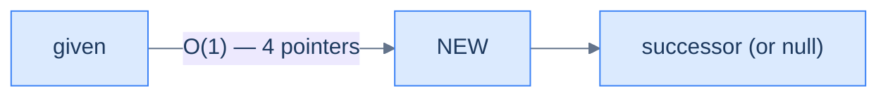

<p align="center"><strong>All cases — insert after the given node touches at most four pointers regardless of list size.</strong></p>

> **Best Case**
>
> -   Space Complexity — **O(1)**
> -   Time Complexity — **O(1)**
>
> **Worst Case**
>
> -   Space Complexity — **O(1)**
> -   Time Complexity — **O(1)**

***

# Insert after the given node

## The Problem

> Given a reference to a **random node** in a doubly linked list and a **data** value, write a function to insert a new node with the given data value after the given node.

```
Input:  head = [5, 7, 3, 10], node = 7, data = 6
Output: [5, 7, 6, 3, 10]
```

## The Solution


```pseudocode
# Same algorithm — re-listed for the second test case.
function insertAfterTheGivenNode(node, data):
    if node is null: return
    newNode ← new ListNode(data)
    newNode.next ← node.next
    newNode.prev ← node
    node.next ← newNode
    if newNode.next is not null:
        newNode.next.prev ← newNode
```

```python run
class Solution:
    def insert_after_the_given_node(self, node, data):
        if node is None:
            return
        new_node = ListNode(data)
        new_node.next = node.next                # Save before clobber
        new_node.prev = node
        node.next     = new_node
        if new_node.next is not None:
            new_node.next.prev = new_node
```

```java run
class Solution {
    public void insertAfterTheGivenNode(ListNode node, int data) {
        if (node == null) return;
        ListNode n = new ListNode(data);
        n.next    = node.next;
        n.prev    = node;
        node.next = n;
        if (n.next != null) n.next.prev = n;
    }
}
```

```c run
void insertAfterTheGivenNode(ListNode *node, int data) {
    if (node == NULL) return;
    ListNode *n = newListNode(data);
    n->next    = node->next;
    n->prev    = node;
    node->next = n;
    if (n->next != NULL) n->next->prev = n;
}
```

```cpp run
class Solution {
public:
    void insertAfterTheGivenNode(ListNode *node, int data) {
        if (node == nullptr) return;
        ListNode *n = new ListNode(data);
        n->next    = node->next;
        n->prev    = node;
        node->next = n;
        if (n->next != nullptr) n->next->prev = n;
    }
};
```

```scala run
class Solution {
  def insertAfterTheGivenNode(node: ListNode, data: Int): Unit = {
    if (node == null) return
    val n = new ListNode(data)
    n.next    = node.next
    n.prev    = node
    node.next = n
    if (n.next != null) n.next.prev = n
  }
}
```

```typescript run
class Solution {
    insertAfterTheGivenNode(node: ListNode | null, data: number): void {
        if (node === null) return;
        const n = new ListNode(data);
        n.next    = node.next;
        n.prev    = node;
        node.next = n;
        if (n.next !== null) n.next.prev = n;
    }
}
```

```go run
func insertAfterTheGivenNode(node *ListNode, data int) {
    if node == nil { return }
    n := &ListNode{Val: data}
    n.Next    = node.Next
    n.Prev    = node
    node.Next = n
    if n.Next != nil { n.Next.Prev = n }
}
```

```rust run
// See lesson 09 for a complete bidirectional implementation.
```


<details>
<summary><strong>Trace — head = [5, 7, 3, 10], given = node(7), data = 6</strong></summary>

```
Initial │ 5 ↔ 7 ↔ 3 ↔ 10
Step 1  │ create new(6)
Step 2  │ new.next = 7.next = node(3)        │ new(6) → 3
Step 3  │ new.prev = node(7)                 │ 7 ← new(6)
Step 4  │ 7.next = new(6)                    │ 5 ↔ 7 → new(6) → 3 ↔ 10
Step 5  │ new.next.prev = new                │ 5 ↔ 7 ↔ 6 ↔ 3 ↔ 10  (mirror complete)
Result: [5, 7, 6, 3, 10] ✓
```

</details>

***

# Understanding insertion before the given node

In linked lists, it is essential to access the node **before** the one being inserted or deleted. In a singly linked list, finding the node before the given one requires traversing from the head — that's the whole reason singly lists are bad at this operation. **In a doubly linked list, that walk vanishes.** The node before the given one is sitting right there at `given.prev`, one hop away. This is the operation where the doubly linked list earns its keep over a singly linked list. Let's examine the three cases we need to consider.

## 1. The list is empty (or given is null)

If the list is empty or the given node is null, there is no insertion point. In such a case, we return the **head** node that was provided as it is.

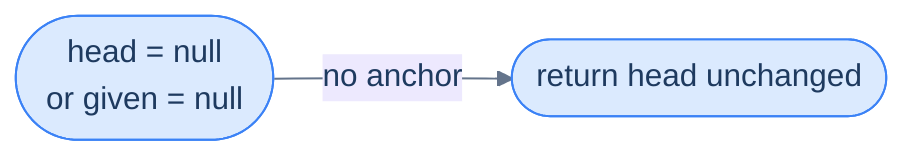

<p align="center"><strong>Empty list or null reference — no insertion point exists, return the original head untouched.</strong></p>

> **Algorithm**
>
> -   **Step 1:** Return the original head node.

## 2. The given node is the first node (the head)

This is exactly the **insert-at-beginning** case we already solved. We detect it by comparing the given node reference to the head — if they're the same, we delegate.

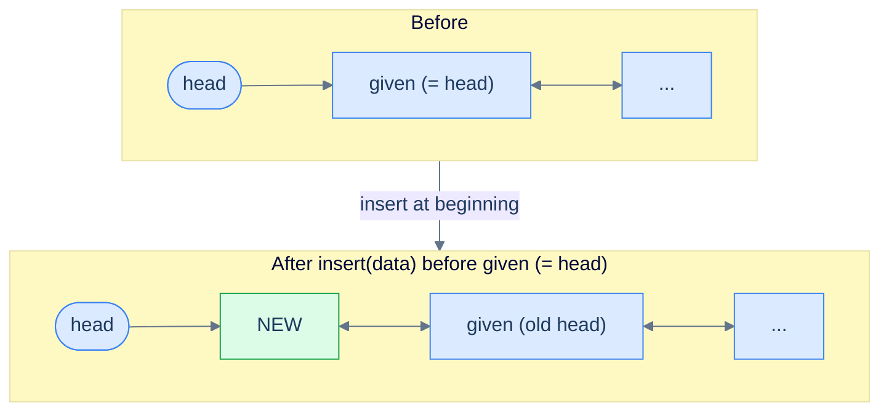

<p align="center"><strong>The given node is the first node — same as inserting at the beginning. The new node becomes the new head.</strong></p>

> **Algorithm**
>
> -   **Step 1:** Create a new node with the given data.
> -   **Step 2:** Set the `next` pointer of the new node to the current head, as the new node will be the new head.
> -   **Step 3:** Set the new node's `prev` pointer to `null` since it's the new head node.
> -   **Step 4:** Set the `prev` pointer of current head to the new node to restore the bidirectional link.
> -   **Step 5:** Return the new node, as this is the new head.

## 3. The given node is not the first node

In this scenario, we use a reference manipulation similar to **inserting after a given node**. However, this time we use the `prev` pointer to find the predecessor — and that's where the doubly linked list shines. The predecessor is `given.prev`, available in O(1).

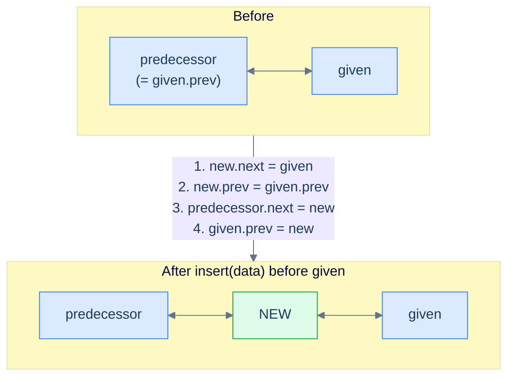

<p align="center"><strong>Insert before a non-head given node — splice the new node between <code>given.prev</code> and <code>given</code>. Four pointers updated, all reachable in O(1).</strong></p>

> **Algorithm**
>
> -   **Step 1:** Create a new node with the given data.
> -   **Step 2:** Set the new node's `next` pointer to hold the reference of the `given` node.
> -   **Step 3:** Set the new node's `prev` pointer to hold the reference of the node before the `given` node.
> -   **Step 4:** Set the `next` pointer of the node before the given node to hold the reference of the new node.
> -   **Step 5:** Set the `given` node's `prev` pointer to hold the reference of the new node.
> -   **Step 6:** Return the original head node.

## Implementation


```pseudocode
# In a DLL, `node.prev` gives O(1) access to the predecessor — no traversal needed.
function insertBeforeTheGivenNode(head, node, data):
    if head is null OR node is null: return head
    newNode ← new ListNode(data)
    if node = head:                                    # special case — insert at head
        newNode.next ← head
        newNode.prev ← null
        head.prev ← newNode
        return newNode
    newNode.next ← node
    newNode.prev ← node.prev                           # O(1) access — DLL's payoff
    if newNode.prev is not null:
        newNode.prev.next ← newNode                    # predecessor → new
    node.prev ← newNode                                # given.prev = new
    return head
```

```python run
class Solution:
    def insert_before_the_given_node(self, head, node, data):
        if head is None or node is None:                # Case 1: no anchor
            return head
        new_node = ListNode(data)
        if node is head:                                # Case 2: given is the head
            new_node.next = head
            new_node.prev = None
            head.prev     = new_node
            return new_node                             # New head
        # Case 3: given is somewhere in the middle (or tail)
        new_node.next  = node                           # 2. New's successor   = given
        new_node.prev  = node.prev                      # 3. New's predecessor = given.prev (the saviour line — O(1) access)
        if new_node.prev is not None:                   #    Defensive — node.prev should not be None here, but guard anyway
            new_node.prev.next = new_node               # 4. Predecessor's next = new
        node.prev = new_node                            # 5. Given's prev      = new
        return head
```

```java run
class Solution {
    public ListNode insertBeforeTheGivenNode(ListNode head, ListNode node, int data) {
        if (head == null || node == null) return head;       // Case 1
        ListNode newNode = new ListNode(data);
        if (node == head) {                                  // Case 2: given is head
            newNode.next = head;
            newNode.prev = null;
            head.prev    = newNode;
            return newNode;
        }
        newNode.next = node;                                 // 2. New's next = given
        newNode.prev = node.prev;                            // 3. New's prev = given.prev (O(1)!)
        if (newNode.prev != null) {
            newNode.prev.next = newNode;                     // 4. Predecessor's next = new
        }
        node.prev = newNode;                                 // 5. Given's prev = new
        return head;
    }
}
```

```c run
ListNode* insertBeforeTheGivenNode(ListNode *head, ListNode *node, int data) {
    if (head == NULL || node == NULL) return head;
    ListNode *newNode = newListNode(data);
    if (node == head) {
        newNode->next = head;
        newNode->prev = NULL;
        head->prev    = newNode;
        return newNode;
    }
    newNode->next = node;
    newNode->prev = node->prev;
    if (newNode->prev != NULL) newNode->prev->next = newNode;
    node->prev = newNode;
    return head;
}
```

```cpp run
class Solution {
public:
    ListNode *insertBeforeTheGivenNode(ListNode *head, ListNode *node, int data) {
        if (head == nullptr || node == nullptr) return head;       // Case 1
        ListNode *newNode = new ListNode(data);
        if (node == head) {                                        // Case 2: given is head
            newNode->next = head;
            newNode->prev = nullptr;
            head->prev    = newNode;
            return newNode;
        }
        newNode->next = node;                                      // 2. New's next = given
        newNode->prev = node->prev;                                // 3. New's prev = given.prev — O(1)!
        if (newNode->prev) {
            newNode->prev->next = newNode;                         // 4. Predecessor's next = new
        }
        node->prev = newNode;                                      // 5. Given's prev = new
        return head;
    }
};
```

```scala run
class Solution {
  def insertBeforeTheGivenNode(head: ListNode, node: ListNode, data: Int): ListNode = {
    if (head == null || node == null) return head
    val n = new ListNode(data)
    if (node eq head) {
      n.next   = head
      n.prev   = null
      head.prev = n
      return n
    }
    n.next = node
    n.prev = node.prev
    if (n.prev != null) n.prev.next = n
    node.prev = n
    head
  }
}
```

```typescript run
class Solution {
    insertBeforeTheGivenNode(head: ListNode | null, node: ListNode | null, data: number): ListNode | null {
        if (head === null || node === null) return head;
        const n = new ListNode(data);
        if (node === head) {
            n.next    = head;
            n.prev    = null;
            head.prev = n;
            return n;
        }
        n.next = node;
        n.prev = node.prev;
        if (n.prev) n.prev.next = n;
        node.prev = n;
        return head;
    }
}
```

```go run
func insertBeforeTheGivenNode(head, node *ListNode, data int) *ListNode {
    if head == nil || node == nil { return head }
    n := &ListNode{Val: data}
    if node == head {
        n.Next    = head
        n.Prev    = nil
        head.Prev = n
        return n
    }
    n.Next = node
    n.Prev = node.Prev
    if n.Prev != nil { n.Prev.Next = n }
    node.Prev = n
    return head
}
```

```rust run
// See lesson 09 for a complete bidirectional implementation.
```


## Complexity Analysis

The time complexity has improved dramatically compared to the singly linked list version of this operation. We no longer need to traverse the list to find the node one step before the given node — `given.prev` gives it to us for free. With a doubly linked list, the time complexity is **O(1)** for inserting anywhere in the list if we have a reference to the node before/after which we want to insert.

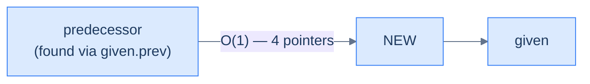

<p align="center"><strong>All cases — insert before the given node touches a constant number of pointers, with the predecessor located in O(1) via <code>given.prev</code>. This is the headline win of the doubly linked list.</strong></p>

This is the main advantage of the doubly linked list. Since we are only creating a single node, the extra space needed for this operation is constant — hence the space complexity is **O(1)**.

> **Best Case**
>
> -   Space Complexity — **O(1)**
> -   Time Complexity — **O(1)**
>
> **Worst Case**
>
> -   Space Complexity — **O(1)**
> -   Time Complexity — **O(1)**

***

# Insert before the given node

## The Problem

> Given the **head** of a doubly linked list, a reference to a **random node** in that linked list, and a **data** value, write a function to insert a new node with the given data before the given node and return the head of the updated list.

```
Input:  head = [5, 7, 3, 10], node = 7, data = 6
Output: [5, 6, 7, 3, 10]
```

## The Solution


```pseudocode
# Compact form — assumes node.prev is non-null when node ≠ head.
function insertBeforeTheGivenNode(head, node, data):
    if head is null OR node is null: return head
    newNode ← new ListNode(data)
    if node = head:
        newNode.next ← head
        head.prev ← newNode
        return newNode
    newNode.next ← node
    newNode.prev ← node.prev
    newNode.prev.next ← newNode
    node.prev ← newNode
    return head
```

```python run
class Solution:
    def insert_before_the_given_node(self, head, node, data):
        if head is None or node is None:
            return head
        new_node = ListNode(data)
        if node is head:                          # Insert-before-head shortcut
            new_node.next = head
            head.prev     = new_node
            return new_node
        new_node.next      = node                 # New is wedged between predecessor and given
        new_node.prev      = node.prev            # Predecessor in O(1) via .prev
        new_node.prev.next = new_node             # Predecessor → new
        node.prev          = new_node             # Given.prev = new
        return head
```

```java run
class Solution {
    public ListNode insertBeforeTheGivenNode(ListNode head, ListNode node, int data) {
        if (head == null || node == null) return head;
        ListNode n = new ListNode(data);
        if (node == head) {
            n.next    = head;
            head.prev = n;
            return n;
        }
        n.next        = node;
        n.prev        = node.prev;
        n.prev.next   = n;
        node.prev     = n;
        return head;
    }
}
```

```c run
ListNode* insertBeforeTheGivenNode(ListNode *head, ListNode *node, int data) {
    if (head == NULL || node == NULL) return head;
    ListNode *n = newListNode(data);
    if (node == head) {
        n->next    = head;
        head->prev = n;
        return n;
    }
    n->next      = node;
    n->prev      = node->prev;
    n->prev->next = n;
    node->prev   = n;
    return head;
}
```

```cpp run
class Solution {
public:
    ListNode *insertBeforeTheGivenNode(ListNode *head, ListNode *node, int data) {
        if (head == nullptr || node == nullptr) return head;
        ListNode *n = new ListNode(data);
        if (node == head) {
            n->next    = head;
            head->prev = n;
            return n;
        }
        n->next        = node;
        n->prev        = node->prev;
        n->prev->next  = n;
        node->prev     = n;
        return head;
    }
};
```

```scala run
class Solution {
  def insertBeforeTheGivenNode(head: ListNode, node: ListNode, data: Int): ListNode = {
    if (head == null || node == null) return head
    val n = new ListNode(data)
    if (node eq head) { n.next = head; head.prev = n; return n }
    n.next      = node
    n.prev      = node.prev
    n.prev.next = n
    node.prev   = n
    head
  }
}
```

```typescript run
class Solution {
    insertBeforeTheGivenNode(head: ListNode | null, node: ListNode | null, data: number): ListNode | null {
        if (head === null || node === null) return head;
        const n = new ListNode(data);
        if (node === head) { n.next = head; head.prev = n; return n; }
        n.next       = node;
        n.prev       = node.prev;
        (n.prev as ListNode).next = n;
        node.prev    = n;
        return head;
    }
}
```

```go run
func insertBeforeTheGivenNode(head, node *ListNode, data int) *ListNode {
    if head == nil || node == nil { return head }
    n := &ListNode{Val: data}
    if node == head { n.Next = head; head.Prev = n; return n }
    n.Next      = node
    n.Prev      = node.Prev
    n.Prev.Next = n
    node.Prev   = n
    return head
}
```

```rust run
// See lesson 09 for a complete bidirectional implementation.
```


<details>
<summary><strong>Trace — head = [5, 7, 3, 10], given = node(7), data = 6</strong></summary>

```
Initial │ 5 ↔ 7 ↔ 3 ↔ 10  ;  given = node(7), node(7).prev = node(5)
Step 1  │ create new(6)
Step 2  │ new.next = node(7)            │ new(6) → 7
Step 3  │ new.prev = node(7).prev = 5   │ 5 ← new(6)         (← O(1), no scan!)
Step 4  │ new.prev.next = new           │ 5 → new(6) → 7 ↔ 3 ↔ 10
Step 5  │ 7.prev = new                  │ 5 ↔ 6 ↔ 7 ↔ 3 ↔ 10  (mirror complete)
Result: [5, 6, 7, 3, 10] ✓
```

The line `new.prev = node.prev` would have cost an O(N) scan in a singly linked list. Here it's a single field read.

</details>

***

# Understanding insertion at a given distance

We have learned how to perform this operation on a singly linked list. However, a doubly linked list does *not* offer a specific advantage in this case — we don't know the address of the node where we want to insert, only an index, so we still have to traverse the list to find it. On top of that, we have *more* pointers to maintain than in a singly linked list. **Sometimes the extra pointer doesn't help.** Let's look at all the cases we need to consider.

## 1. The list is empty and X > 0

Attempting to insert a node at position > 0 in an empty list is invalid — there are no nodes for an "X-th" position to refer to. The only valid position in an empty list is 0 (which becomes a regular insert-at-beginning). For X > 0, we return the existing **head** unchanged.

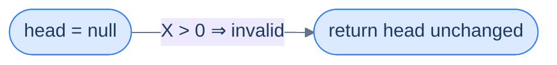

<p align="center"><strong>Empty list with X > 0 — there is no X-th position to target. Return early without modification.</strong></p>

> **Algorithm**
>
> -   **Step 1:** Return the original head node.

## 2. X = 0

This is simply inserting a node at the beginning of the list, which we already covered.

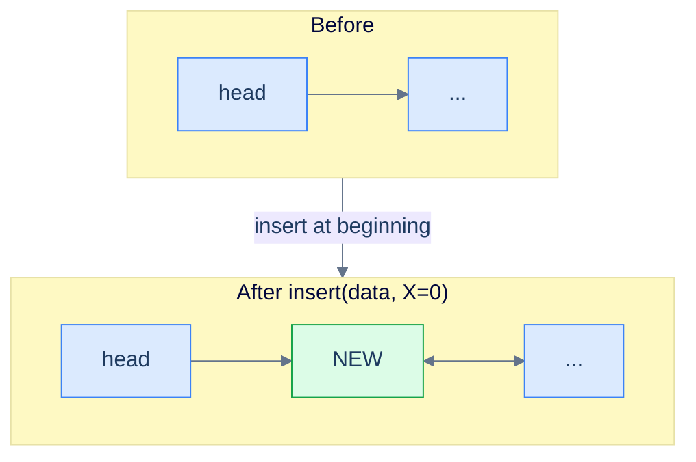

<p align="center"><strong>X = 0 — degenerate case that becomes a vanilla insert-at-beginning.</strong></p>

> **Algorithm**
>
> -   **Step 1:** Create a new node with the given data.
> -   **Step 2:** Set the `next` pointer of the new node to the current head, as the new node will be the new head.
> -   **Step 3:** Set the new node's `prev` pointer to `null` since it's the new head node.
> -   **Step 4:** Set the `prev` pointer of current head to the new node to restore the bidirectional link.
> -   **Step 5:** Return the new node, as this is the new head.

## 3. X ≤ size of the list

For positions inside the list, we traverse forward keeping a counter starting at 0. Every step we increment the counter by 1, stopping when the counter reaches `X - 1` — the node *just before* the position where the new node should go. From there, the problem reduces to **inserting after the given node**, which we already solved.

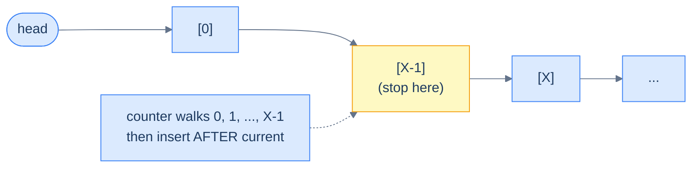

<p align="center"><strong>X ≤ length — walk forward to position X-1, then delegate to "insert after the given node". Total cost: O(X) for the walk + O(1) for the splice.</strong></p>

> **Algorithm**
>
> -   **Step 1:** Create a new node with the given data.
> -   **Step 2:** Traverse the distance X − 1 while keeping track of the `current` node.
> -   **Step 3:** Set the new node's `next` pointer to hold the node's reference stored in the `next` pointer of the `current` node.
> -   **Step 4:** Set the new node's `prev` pointer to hold the reference of the `current` node.
> -   **Step 5:** Set the `current` node's `next` pointer to hold the reference of the new node.
> -   **Step 6:** Set the `prev` pointer of the node after the `current` node (if it exists) to hold the reference of the new node.
> -   **Step 7:** Return the original head node.

## 4. X > size of the list

If `X` is larger than the list's length, the position doesn't exist (e.g. inserting at position 5 in a 3-element list). The traversal will run off the end (`current` becomes `null`), and we return the existing **head** without modification.

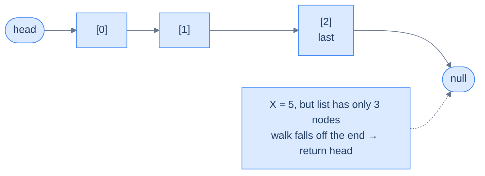

<p align="center"><strong>X > length — the traversal walks off the end and we return the original head unchanged.</strong></p>

> **Algorithm**
>
> -   **Step 1:** Create a new node with the given data.
> -   **Step 2:** Traverse the distance X − 1 while keeping track of the `current` node.
> -   **Step 3:** Return the original head node.

## Implementation

When implementing the logic for insert at a distance `X`, we keep all the possible cases in mind and write the code for each in conditional blocks.


```pseudocode
function insertAtGivenDistance(head, X, data):
    if head is null AND X > 0: return null
    newNode ← new ListNode(data)
    if X = 0:                                          # insert at beginning
        newNode.next ← head
        newNode.prev ← null
        if head is not null: head.prev ← newNode
        return newNode

    # Walk forward to position X − 1.
    current ← head; counter ← 0
    while current is not null AND counter < X − 1:
        current ← current.next
        counter ← counter + 1
    if current is null: return head                    # X exceeds list size

    # Splice newNode after `current`. Update both directions.
    newNode.next ← current.next
    newNode.prev ← current
    current.next ← newNode
    if newNode.next is not null:
        newNode.next.prev ← newNode
    return head
```

```python run
class Solution:
    def insert_at_given_distance(self, head, X, data):
        if head is None and X > 0:                  # Case 1: empty list, invalid X
            return None
        new_node = ListNode(data)
        if X == 0:                                  # Case 2: insert at beginning
            new_node.next = head
            new_node.prev = None
            if head is not None:
                head.prev = new_node                # Mirror update if list was non-empty
            return new_node
        # Case 3 / 4: walk forward to position X-1
        current = head
        counter = 0
        while current is not None and counter < X - 1:
            current  = current.next
            counter += 1
        if current is None:                         # Case 4: ran off the end
            return head
        # Splice new node after current (= position X-1)
        new_node.next = current.next
        new_node.prev = current
        current.next  = new_node
        if new_node.next is not None:
            new_node.next.prev = new_node           # Mirror update on successor
        return head
```

```java run
class Solution {
    public ListNode insertAtGivenDistance(ListNode head, int X, int data) {
        if (head == null && X > 0) return null;          // Case 1
        ListNode newNode = new ListNode(data);
        if (X == 0) {                                    // Case 2
            newNode.next = head;
            newNode.prev = null;
            if (head != null) head.prev = newNode;
            return newNode;
        }
        ListNode current = head;
        int counter = 0;
        while (current != null && counter < X - 1) {     // Walk to position X-1
            current = current.next;
            counter++;
        }
        if (current == null) return head;                // Case 4: ran off
        newNode.next = current.next;
        newNode.prev = current;
        current.next = newNode;
        if (newNode.next != null) newNode.next.prev = newNode;
        return head;
    }
}
```

```c run
ListNode* insertAtGivenDistance(ListNode *head, int X, int data) {
    if (head == NULL && X > 0) return NULL;
    ListNode *newNode = newListNode(data);
    if (X == 0) {
        newNode->next = head;
        newNode->prev = NULL;
        if (head != NULL) head->prev = newNode;
        return newNode;
    }
    ListNode *current = head;
    int counter = 0;
    while (current != NULL && counter < X - 1) {
        current = current->next;
        counter++;
    }
    if (current == NULL) return head;
    newNode->next = current->next;
    newNode->prev = current;
    current->next = newNode;
    if (newNode->next != NULL) newNode->next->prev = newNode;
    return head;
}
```

```cpp run
class Solution {
public:
    ListNode *insertAtGivenDistance(ListNode *head, int X, int data) {
        if (head == nullptr && X > 0) return nullptr;
        ListNode *newNode = new ListNode(data);
        if (X == 0) {
            newNode->next = head;
            newNode->prev = nullptr;
            if (head != nullptr) head->prev = newNode;
            return newNode;
        }
        ListNode *current = head;
        int counter = 0;
        while (current != nullptr && counter < X - 1) {  // Walk to position X-1
            current = current->next;
            counter++;
        }
        if (current == nullptr) return head;             // Case 4
        newNode->next = current->next;
        newNode->prev = current;
        current->next = newNode;
        if (newNode->next != nullptr) newNode->next->prev = newNode;
        return head;
    }
};
```

```scala run
class Solution {
  def insertAtGivenDistance(head: ListNode, X: Int, data: Int): ListNode = {
    if (head == null && X > 0) return null
    val n = new ListNode(data)
    if (X == 0) {
      n.next = head
      n.prev = null
      if (head != null) head.prev = n
      return n
    }
    var current = head
    var counter = 0
    while (current != null && counter < X - 1) {
      current = current.next
      counter += 1
    }
    if (current == null) return head
    n.next       = current.next
    n.prev       = current
    current.next = n
    if (n.next != null) n.next.prev = n
    head
  }
}
```

```typescript run
class Solution {
    insertAtGivenDistance(head: ListNode | null, X: number, data: number): ListNode | null {
        if (head === null && X > 0) return null;
        const n = new ListNode(data);
        if (X === 0) {
            n.next = head;
            n.prev = null;
            if (head !== null) head.prev = n;
            return n;
        }
        let current: ListNode | null = head;
        let counter = 0;
        while (current !== null && counter < X - 1) {
            current = current.next;
            counter++;
        }
        if (current === null) return head;
        n.next        = current.next;
        n.prev        = current;
        current.next  = n;
        if (n.next !== null) n.next.prev = n;
        return head;
    }
}
```

```go run
func insertAtGivenDistance(head *ListNode, X, data int) *ListNode {
    if head == nil && X > 0 { return nil }
    n := &ListNode{Val: data}
    if X == 0 {
        n.Next = head
        n.Prev = nil
        if head != nil { head.Prev = n }
        return n
    }
    current := head
    counter := 0
    for current != nil && counter < X-1 {
        current = current.Next
        counter++
    }
    if current == nil { return head }
    n.Next       = current.Next
    n.Prev       = current
    current.Next = n
    if n.Next != nil { n.Next.Prev = n }
    return head
}
```

```rust run
// See lesson 09 for a complete bidirectional implementation.
```


## Complexity Analysis

The time complexity of insertion at a given distance depends on the position. Linked lists do not support direct random access, so traversal is required before insertion. The cases below describe the algorithm's performance under different conditions.

### Best case

The best case occurs when `X = 0`. In this case, we insert at the beginning, which takes **constant** time regardless of the list's size.

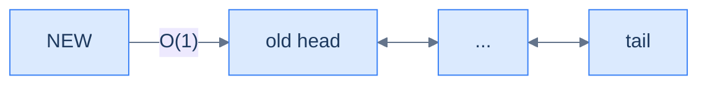

<p align="center"><strong>Best case (X = 0) — direct insert before the head, no traversal.</strong></p>

### Worst case

The worst case occurs when `X` equals the list's length. In this case, we traverse the entire list before inserting, costing **O(N)**.

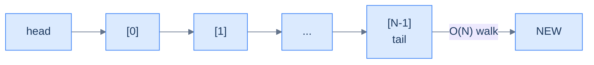

<p align="center"><strong>Worst case (X = length) — walk the entire list, then insert after the tail. The doubly linked list can't shortcut this because the input is an index, not a node reference.</strong></p>

The function's space complexity is constant, as we only allocate a fixed number of variables (one new node and a counter) regardless of list size.

> **Best Case** — X = 0
>
> -   Space Complexity — **O(1)**
> -   Time Complexity — **O(1)**
>
> **Worst Case** — X = length of the list
>
> -   Space Complexity — **O(1)**
> -   Time Complexity — **O(N)**

***

# Insert at given distance

## The Problem

> Given the **head** of a doubly linked list, a distance **X**, and a **data** value, write a function to insert a new node with the given data value at a distance X from the start of the linked list and return the head of the updated list.

```
Input:  head = [5, 7, 3, 10], X = 1, data = 6
Output: [5, 6, 7, 3, 10]
```

## The Solution


```pseudocode
# Compact form — same algorithm.
function insertAtGivenDistance(head, X, data):
    if head is null AND X > 0: return null
    newNode ← new ListNode(data)
    if X = 0:
        newNode.next ← head
        if head is not null: head.prev ← newNode
        return newNode
    current ← head; counter ← 0
    while current is not null AND counter < X − 1:
        current ← current.next; counter ← counter + 1
    if current is null: return head
    newNode.next ← current.next
    newNode.prev ← current
    current.next ← newNode
    if newNode.next is not null: newNode.next.prev ← newNode
    return head
```

```python run
class Solution:
    def insert_at_given_distance(self, head, X, data):
        if head is None and X > 0:                  # Invalid: empty list, X > 0
            return None
        new_node = ListNode(data)
        if X == 0:                                  # Insert-at-beginning shortcut
            new_node.next = head
            if head is not None:
                head.prev = new_node
            return new_node
        current, counter = head, 0
        while current is not None and counter < X - 1:   # Walk to predecessor
            current  = current.next
            counter += 1
        if current is None:                         # X out of range
            return head
        # Splice — same as insert-after-the-given-node
        new_node.next = current.next
        new_node.prev = current
        current.next  = new_node
        if new_node.next is not None:
            new_node.next.prev = new_node
        return head
```

```java run
class Solution {
    public ListNode insertAtGivenDistance(ListNode head, int X, int data) {
        if (head == null && X > 0) return null;
        ListNode n = new ListNode(data);
        if (X == 0) {
            n.next = head;
            if (head != null) head.prev = n;
            return n;
        }
        ListNode current = head;
        int counter = 0;
        while (current != null && counter < X - 1) {
            current = current.next;
            counter++;
        }
        if (current == null) return head;
        n.next       = current.next;
        n.prev       = current;
        current.next = n;
        if (n.next != null) n.next.prev = n;
        return head;
    }
}
```

```c run
ListNode* insertAtGivenDistance(ListNode *head, int X, int data) {
    if (head == NULL && X > 0) return NULL;
    ListNode *n = newListNode(data);
    if (X == 0) {
        n->next = head;
        if (head != NULL) head->prev = n;
        return n;
    }
    ListNode *current = head;
    int counter = 0;
    while (current != NULL && counter < X - 1) {
        current = current->next;
        counter++;
    }
    if (current == NULL) return head;
    n->next       = current->next;
    n->prev       = current;
    current->next = n;
    if (n->next != NULL) n->next->prev = n;
    return head;
}
```

```cpp run
class Solution {
public:
    ListNode *insertAtGivenDistance(ListNode *head, int X, int data) {
        if (head == nullptr && X > 0) return nullptr;
        ListNode *n = new ListNode(data);
        if (X == 0) {
            n->next = head;
            if (head != nullptr) head->prev = n;
            return n;
        }
        ListNode *current = head;
        int counter = 0;
        while (current != nullptr && counter < X - 1) {
            current = current->next;
            counter++;
        }
        if (current == nullptr) return head;
        n->next       = current->next;
        n->prev       = current;
        current->next = n;
        if (n->next != nullptr) n->next->prev = n;
        return head;
    }
};
```

```scala run
class Solution {
  def insertAtGivenDistance(head: ListNode, X: Int, data: Int): ListNode = {
    if (head == null && X > 0) return null
    val n = new ListNode(data)
    if (X == 0) {
      n.next = head
      if (head != null) head.prev = n
      return n
    }
    var current = head
    var counter = 0
    while (current != null && counter < X - 1) {
      current = current.next
      counter += 1
    }
    if (current == null) return head
    n.next       = current.next
    n.prev       = current
    current.next = n
    if (n.next != null) n.next.prev = n
    head
  }
}
```

```typescript run
class Solution {
    insertAtGivenDistance(head: ListNode | null, X: number, data: number): ListNode | null {
        if (head === null && X > 0) return null;
        const n = new ListNode(data);
        if (X === 0) {
            n.next = head;
            if (head !== null) head.prev = n;
            return n;
        }
        let current: ListNode | null = head;
        let counter = 0;
        while (current !== null && counter < X - 1) {
            current = current.next;
            counter++;
        }
        if (current === null) return head;
        n.next       = current.next;
        n.prev       = current;
        current.next = n;
        if (n.next !== null) n.next.prev = n;
        return head;
    }
}
```

```go run
func insertAtGivenDistance(head *ListNode, X, data int) *ListNode {
    if head == nil && X > 0 { return nil }
    n := &ListNode{Val: data}
    if X == 0 {
        n.Next = head
        if head != nil { head.Prev = n }
        return n
    }
    current := head
    counter := 0
    for current != nil && counter < X-1 {
        current = current.Next
        counter++
    }
    if current == nil { return head }
    n.Next       = current.Next
    n.Prev       = current
    current.Next = n
    if n.Next != nil { n.Next.Prev = n }
    return head
}
```

```rust run
// See lesson 09 for a complete bidirectional implementation.
```


<details>
<summary><strong>Trace — head = [5, 7, 3, 10], X = 1, data = 6</strong></summary>

```
Initial │ 5 ↔ 7 ↔ 3 ↔ 10
Step 1  │ X = 1 ≠ 0  → walk to position X-1 = 0
        │ counter=0, current=node(5) — loop condition counter<0 false → stop
Step 2  │ Splice after current (node 5):
        │   new(6).next = 5.next = node(7)
        │   new(6).prev = node(5)
        │   5.next      = new(6)
        │   7.prev      = new(6)
Result: [5, 6, 7, 3, 10] ✓
```

</details>

---

## Final Takeaway

Five insertion variants, one underlying skill: **always update four pointers, in a save-before-clobber order, and always mirror.** The doubly linked list earns its keep when the input is a *node reference* — insert before, insert after, insert at beginning, insert at end all collapse to O(1). When the input is an *index*, you still pay for the walk, just like in a singly linked list — the extra `prev` pointer doesn't help because indices don't dereference.

> **The Insertion Checklist** — every time you splice a node into a doubly linked list, ask yourself the same four questions. Drill them until they're automatic:
>
> 1. **What does the new node's `next` point to?**
> 2. **What does the new node's `prev` point to?**
> 3. **What `next` pointer in the existing list now points to the new node?**
> 4. **What `prev` pointer in the existing list now points to the new node?**
>
> Skip any one and you've corrupted the chain in one direction. The bug will hide until someone walks backward.

> **Transfer challenge:** Given the head of a sorted doubly linked list and a value `v`, write a function that inserts `v` while preserving sorted order. (Hint: use forward traversal to find the insertion point, then *insert before the given node* — your O(1) splice does the rest.)
>
> <details>
> <summary>Solution sketch</summary>
>
> Walk forward until you find the first node whose value is ≥ `v` (or fall off the end). If you fell off, insert at end. If you stopped at the head, insert at beginning. Otherwise, insert before the stopped node. The walk is O(N); the splice is O(1).
>
> </details>

Up next: **deletion**. Same checklist, played in reverse — except now there's a wrinkle. Deleting a node breaks the chain in *two* places, and the same "save before clobber" discipline that kept insertion safe will save us again.
