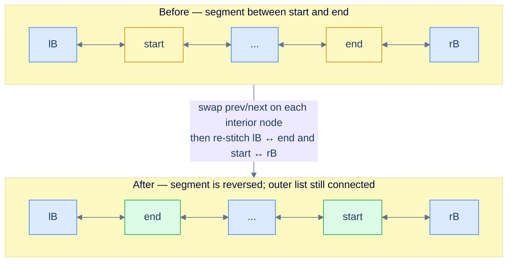
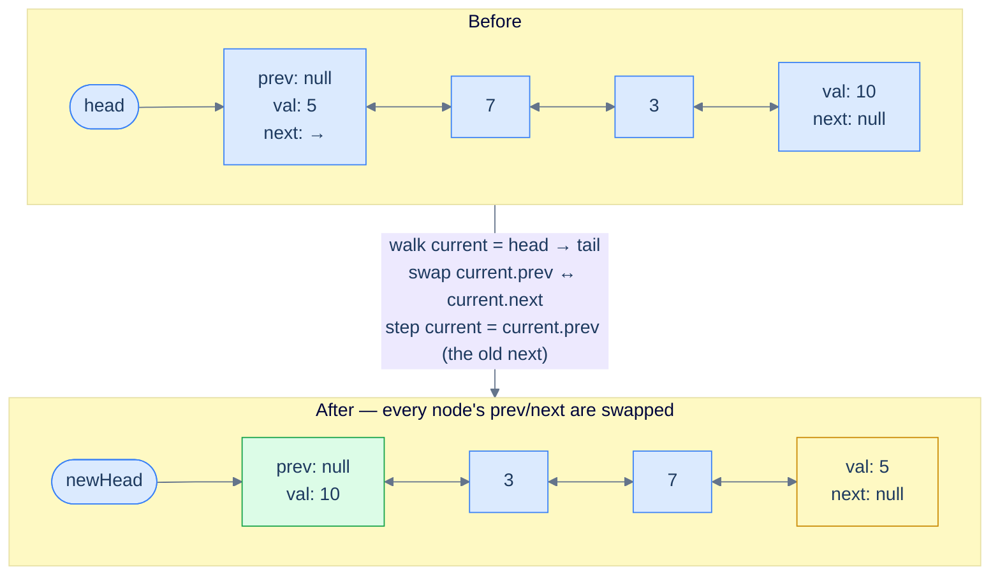
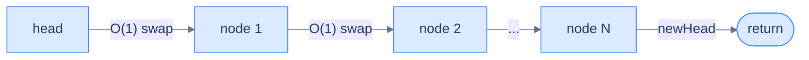
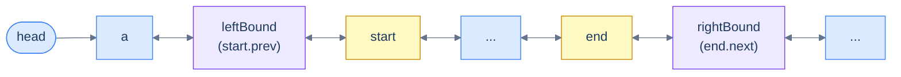
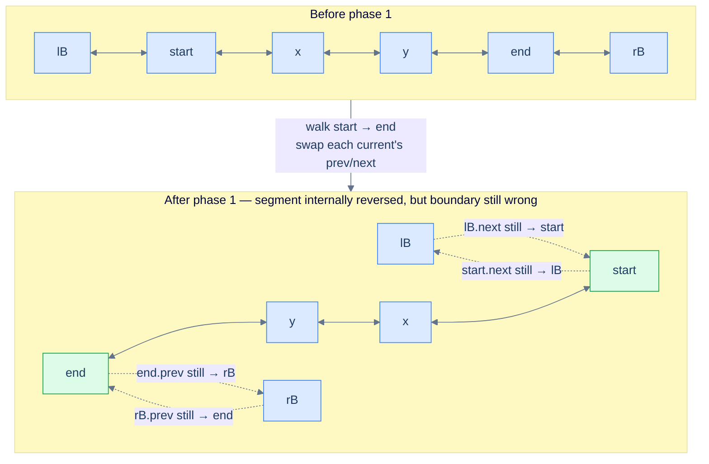
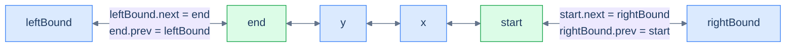
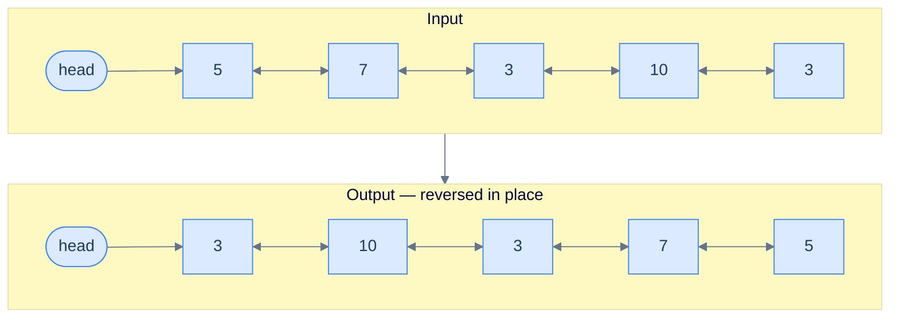

# 5. Pattern: Reversal

## The Hook

In a singly linked list, reversing the list felt like a magic trick — three pointers (`prev`, `curr`, `next`) shuffling around each other in a careful, error-prone choreography, one wrong move and the chain shatters. You probably remember the anxiety. You probably also remember finally getting it to work and feeling slightly proud.

Now bring the same problem to a doubly linked list and a small miracle happens. **There is no pointer chasing.** Each node already knows both of its neighbours. To "reverse" the list, you don't rearrange anything — you walk through every node and **swap its own `prev` and `next` pointers in place**. That's it. One swap per node, no temporaries that span iterations, no fragile three-pointer dance. The list is reversed when the walk ends.

We still finish in O(N) time — every node has to be touched — but the *kind* of work at each step collapses from "rewire three pointers in a careful order" to "swap two fields, take one step, repeat". By the end of this lesson, the same idea will let you reverse the **first K** nodes, the **last K** nodes, or **any segment between two given nodes** with the same swap-and-walk skeleton.

---

## Table of contents

1. [Understanding the reversal pattern](#understanding-the-reversal-pattern)
2. [Reversing a segment](#reversing-a-segment)
3. [Applications](#applications)
4. [Identifying direct application](#identifying-direct-application)
5. [Reverse a list](#reverse-a-list)
6. [Reverse first K nodes](#reverse-first-k-nodes)
7. [Reverse last K nodes](#reverse-last-k-nodes)
8. [Reverse the given segment](#reverse-the-given-segment)

***

# Understanding the reversal pattern

Many doubly linked list problems boil down to one move: **reverse the entire list, or some contiguous segment of it**. Some problems ask for it directly ("reverse the list"). Others hide it inside a larger algorithm — reorder, palindrome-check, k-group rotate, undo-stack rewind. If you can do the reversal cleanly and cheaply, the rest of the problem usually falls out.

The naive instinct is to rebuild the list from scratch — collect values into an array, walk it backwards, allocate fresh nodes. That works, but it costs O(N) extra space and ignores the doubly linked list's biggest advantage. The right approach is **in-place, single pass, O(1) extra space** — and on a DLL it's startlingly short.



<p align="center"><strong>Reversing a segment between <code>start</code> and <code>end</code>. The new boundary is <code>leftBound (lB)</code> ↔ <code>end</code> on one side and <code>start</code> ↔ <code>rightBound (rB)</code> on the other.</strong></p>

The **reversal pattern** is the family of linked list problems that can be solved by applying this single primitive — reverse a list, or a segment of one — possibly multiple times.

> *Before reading on — pause and predict. If every node already stores its `prev`, what is the **minimum** work you need to do at each node to reverse the list? What does each node "look like" after that work?*

## Reversing the entire list

Reversing the whole list is the special case where the segment runs from `head` all the way to the tail. We start with this case because the implementation is shorter — it's the same algorithm with the boundary stitching trivially absorbed.

The mental model is one line: **at each node, swap `prev` and `next`. Then move on.** That's the entire reversal. The reason it works is the symmetry of a doubly linked list — if you flip every node's two pointers, every existing `A → B` link becomes `A ← B`, and every existing `A ← B` link becomes `A → B`. Forward and backward chains *both* get reversed in the same sweep.



<p align="center"><strong>Whole-list reversal. After every node's <code>prev</code> and <code>next</code> are swapped, the original tail becomes the new head and the original head becomes the new tail.</strong></p>

There's one subtle move worth highlighting. After we swap a node's pointers, its old `next` is now sitting in `prev`. So to advance to the next node in the original list, we walk via `current.prev` — because *that field used to be `current.next` half a line ago*. This is the only "trick" in the algorithm, and it stops being tricky the moment you say it out loud.

We track one extra reference, `newHead`, and update it when we land on a node whose `prev` is `null` after the swap — that node is the new head of the reversed list (it was the original tail).

## Algorithm

The algorithm below summarizes the reversal of the entire doubly linked list in-place.

> **Algorithm**
>
> -   **Step 1:** Initialize `newHead` with `null` and `current` with `head`.
> -   **Step 2:** Iterate until `current` hits `null` and in each iteration do the following:
>     -   **Step 2.1:** Swap `current.next` and `current.prev`.
>     -   **Step 2.2:** If `current.prev` is `null` after the swap, set `newHead` to `current` (this node is the new head — its old `next` was `null`, meaning it was the original tail).
>     -   **Step 2.3:** Set `current` to `current.prev` to step to the next node in the *original* order (the field that used to be `next`).
> -   **Step 3:** Return `newHead`.

## Implementation

The code implementation to reverse the entire list is given below.

```python run
class Solution:
    def reverse(self, head):
        # Empty list or single node — already its own reverse
        if head is None or head.next is None:
            return head

        current  = head        # Walk pointer
        new_head = None        # Will land on the original tail

        while current is not None:
            # Swap prev and next on this node — this is the entire reversal
            current.prev, current.next = current.next, current.prev

            # After the swap, prev holds what used to be next.
            # If prev is None now, current was the original tail → new head.
            if current.prev is None:
                new_head = current

            # Walk forward in the *original* order. The original next is now in prev.
            current = current.prev

        return new_head
```

```java run
class Solution {
    public ListNode reverse(ListNode head) {
        // Empty list or single node — already its own reverse
        if (head == null || head.next == null) return head;

        ListNode current  = head;     // Walk pointer
        ListNode newHead  = null;     // Will land on the original tail

        while (current != null) {
            // Swap prev and next on this node — the entire reversal
            ListNode temp = current.prev;
            current.prev  = current.next;
            current.next  = temp;

            // If prev is null after the swap, this node was the original tail
            if (current.prev == null) newHead = current;

            // Walk forward in original order: the old next now lives in prev
            current = current.prev;
        }
        return newHead;
    }
}
```

```c run
ListNode* reverse(ListNode *head) {
    /* Empty list or single node — already its own reverse */
    if (head == NULL || head->next == NULL) return head;

    ListNode *current = head;        /* Walk pointer */
    ListNode *newHead = NULL;        /* Will land on the original tail */

    while (current != NULL) {
        /* Swap prev and next on this node — the entire reversal */
        ListNode *temp = current->prev;
        current->prev  = current->next;
        current->next  = temp;

        /* If prev is NULL now, this node was the original tail */
        if (current->prev == NULL) newHead = current;

        /* Walk forward in original order — old next now lives in prev */
        current = current->prev;
    }
    return newHead;
}
```

```cpp run
class Solution {
public:
    ListNode *reverse(ListNode *head) {
        // Empty list or single node — already its own reverse
        if (head == nullptr || head->next == nullptr) return head;

        ListNode *current = head;     // Walk pointer
        ListNode *newHead = nullptr;  // Will land on the original tail

        while (current != nullptr) {
            // Swap prev and next on this node — the entire reversal
            std::swap(current->prev, current->next);

            // If prev is nullptr after the swap, this node was the original tail
            if (current->prev == nullptr) newHead = current;

            // Walk forward in original order — old next now lives in prev
            current = current->prev;
        }
        return newHead;
    }
};
```

```scala run
class Solution {
  def reverse(head: ListNode): ListNode = {
    // Empty list or single node — already its own reverse
    if (head == null || head.next == null) return head

    var current: ListNode = head
    var newHead: ListNode = null

    while (current != null) {
      // Swap prev and next on this node — the entire reversal
      val temp = current.prev
      current.prev = current.next
      current.next = temp

      // If prev is null after the swap, this node was the original tail
      if (current.prev == null) newHead = current

      // Walk forward in original order — old next lives in prev now
      current = current.prev
    }
    newHead
  }
}
```

```javascript run
class Solution {
    reverse(head) {
        // Empty list or single node — already its own reverse
        if (head === null || head.next === null) return head;

        let current = head;       // Walk pointer
        let newHead = null;       // Will land on the original tail

        while (current !== null) {
            // Swap prev and next on this node — the entire reversal
            const temp   = current.prev;
            current.prev = current.next;
            current.next = temp;

            // If prev is null now, this node was the original tail
            if (current.prev === null) newHead = current;

            // Walk forward in original order — old next now lives in prev
            current = current.prev;
        }
        return newHead;
    }
}
```

```typescript run
class Solution {
    reverse(head: ListNode | null): ListNode | null {
        // Empty list or single node — already its own reverse
        if (head === null || head.next === null) return head;

        let current: ListNode | null = head;
        let newHead: ListNode | null = null;

        while (current !== null) {
            // Swap prev and next on this node — the entire reversal
            const temp: ListNode | null = current.prev;
            current.prev = current.next;
            current.next = temp;

            // If prev is null now, this node was the original tail
            if (current.prev === null) newHead = current;

            // Walk forward in original order — old next now lives in prev
            current = current.prev;
        }
        return newHead;
    }
}
```

```go run
func reverse(head *ListNode) *ListNode {
    // Empty list or single node — already its own reverse
    if head == nil || head.Next == nil { return head }

    var current *ListNode = head     // Walk pointer
    var newHead *ListNode = nil      // Will land on the original tail

    for current != nil {
        // Swap prev and next on this node — the entire reversal
        temp := current.Prev
        current.Prev = current.Next
        current.Next = temp

        // If prev is nil now, this node was the original tail
        if current.Prev == nil { newHead = current }

        // Walk forward in original order — old next now lives in prev
        current = current.Prev
    }
    return newHead
}
```

```kotlin run
class Solution {
    fun reverse(head: ListNode?): ListNode? {
        // Empty list or single node — already its own reverse
        if (head == null || head.next == null) return head

        var current: ListNode? = head
        var newHead: ListNode? = null

        while (current != null) {
            // Swap prev and next on this node — the entire reversal
            val temp = current.prev
            current.prev = current.next
            current.next = temp

            // If prev is null after the swap, this node was the original tail
            if (current.prev == null) newHead = current

            // Walk forward in original order — old next now lives in prev
            current = current.prev
        }
        return newHead
    }
}
```

```rust run
// See lesson 09 for a complete Rc<RefCell<...>> implementation.
// Rust's ownership rules don't permit two safe references in opposite
// directions, so a true bidirectional DLL needs interior mutability.
```


## Complexity Analysis

We visit every node exactly once and do O(1) work at each — a swap and a step. The space is just three local references regardless of list size.



<p align="center"><strong>One linear sweep, constant work per node, constant extra memory.</strong></p>

> **Best Case** — list is empty or has a single node.
>
> -   Space Complexity — **O(1)**
> -   Time Complexity — **O(1)**
>
> **Worst Case** — list has N nodes.
>
> -   Space Complexity — **O(1)**
> -   Time Complexity — **O(N)**

We can reverse the whole list now. But what if the problem only wants a slice — say, "reverse the nodes between position 3 and position 7"? The interior swap is identical; only the boundary plumbing changes. Let's see exactly how.

***

# Reversing a segment

Reversing a segment between two given nodes is the **general** form of the algorithm. The whole-list case is just the version where the segment happens to span everything. Here we are given two references — `start` and `end` — that point to two nodes in the list, with `start` somewhere before `end` in forward traversal order. The job: reverse the chunk from `start` to `end` (inclusive), and leave the rest of the list correctly attached on both sides.

For this lesson, assume `start` and `end` are non-null and that `start` is reachable from `head` and `end` is reachable from `start`.



<p align="center"><strong>Setup — capture <code>leftBound</code> (the node before <code>start</code>) and <code>rightBound</code> (the node after <code>end</code>) <em>before</em> we start swapping. These two references will be used at the end to re-stitch the reversed segment back into the parent list.</strong></p>

We capture two extra references **before any pointer is mutated**:

- `leftBound = start.prev` — the node that sits to the left of the segment
- `rightBound = end.next` — the node that sits to the right of the segment

Either one can be `null` (if the segment touches the head or the tail), so we handle them with null checks at stitching time. The reason we capture them up front is the same save-before-clobber discipline from the deletion lesson: once we start swapping pointers inside the segment, `start.prev` and `end.next` no longer mean what they meant a moment ago.

The algorithm splits cleanly into two phases.

### 1. Swap `next` and `prev` on each segment node

Walk `current` from `start` until it reaches `rightBound`. At each step, swap `current.prev` and `current.next`, then advance to the next node in the *original* order — which, post-swap, is now sitting in `current.prev`.



<p align="center"><strong>After phase 1 the interior is reversed — <code>end</code> is the new head of the segment and <code>start</code> is the new tail — but the boundary pointers are still tangled with their original neighbours. Phase 2 fixes that.</strong></p>

### 2. Re-stitch the reversed segment to the parent list

After phase 1, the reversed segment is dangling — its connections to `leftBound` and `rightBound` are wrong. Specifically, after the swaps, `start.next` now points at the *old* `leftBound`, and `end.prev` now points at the *old* `rightBound`. We fix this in two symmetric strokes.

**Tail of the reversed segment** — `start` is now the last node of the reversed slice. Its `next` should be `rightBound`. Mirror that: `rightBound.prev = start` (if `rightBound` exists).

**Head of the reversed segment** — `end` is now the first node of the reversed slice. Its `prev` should be `leftBound`. Mirror that: `leftBound.next = end` (if `leftBound` exists).



<p align="center"><strong>Final stitch — four pointer assignments (with null guards) reattach the reversed segment to the parent list. Both directions stay consistent.</strong></p>

> *Predict before reading on — what happens if we forget to update `rightBound.prev` after the swap? In which direction would the list look correct, and in which direction would it break?*

If you skip `rightBound.prev = start`, a forward walk from `head` looks fine — `start.next = rightBound` still works going forward. But the moment you walk *backward* from any node beyond the segment, you'll arrive at `rightBound` and follow its stale `prev` pointer right back into the middle of the reversed segment, jumping past `start` entirely. Backward traversal silently corrupts. This is the doubly linked list tax — every link is two pointers, and forgetting the mirror is the most common bug.

## Algorithm

The algorithm below summarizes the doubly linked list segment reversal.

> **Algorithm**
>
> -   **Step 1:** If `start == end`, the segment has one node — nothing to reverse, return.
> -   **Step 2:** Capture `leftBound = start.prev` and `rightBound = end.next` *before* mutating anything (either may be `null`).
> -   **Step 3:** Initialize `current = start` and iterate until `current == rightBound`. In each iteration:
>     -   **Step 3.1:** Swap `current.prev` and `current.next`.
>     -   **Step 3.2:** Advance `current = current.prev` (the old `next`, post-swap).
> -   **Step 4:** Stitch the new tail of the segment to the parent list: set `start.next = rightBound`; if `rightBound` is non-null, set `rightBound.prev = start`.
> -   **Step 5:** Stitch the new head of the segment to the parent list: set `end.prev = leftBound`; if `leftBound` is non-null, set `leftBound.next = end`.

## Implementation

Given below is the code implementation to reverse a doubly linked list segment between `start` and `end`.

```python run
class Solution:
    def reverse(self, start, end):
        # Single-node segment — nothing to reverse
        if start == end:
            return

        # Capture boundary refs BEFORE any swap — they will be invalid after.
        left_bound  = start.prev   # may be None if segment touches the head
        right_bound = end.next     # may be None if segment touches the tail

        # Phase 1 — swap prev/next on every node from start up to (not including) right_bound
        current = start
        while current != right_bound:
            # The entire reversal at this node — flip its two pointers
            current.prev, current.next = current.next, current.prev
            # The original next is now in prev; that's how we advance in source order
            current = current.prev

        # Phase 2 — re-stitch the reversed segment to the parent list

        # New tail of the segment is `start` — connect it to right_bound (mirror both sides)
        start.next = right_bound
        if right_bound is not None:
            right_bound.prev = start

        # New head of the segment is `end` — connect it to left_bound (mirror both sides)
        end.prev = left_bound
        if left_bound is not None:
            left_bound.next = end
```

```java run
class Solution {
    public void reverse(ListNode start, ListNode end) {
        // Single-node segment — nothing to reverse
        if (start == end) return;

        // Capture boundary refs BEFORE any swap — they become invalid after
        ListNode leftBound  = start.prev;  // may be null if segment touches head
        ListNode rightBound = end.next;    // may be null if segment touches tail

        // Phase 1 — swap prev/next on every node from start up to rightBound
        ListNode current = start;
        while (current != rightBound) {
            ListNode temp = current.prev;
            current.prev  = current.next;
            current.next  = temp;
            // Original next is now in prev — that's our walk direction
            current = current.prev;
        }

        // Phase 2 — stitch reversed segment back into the parent list
        start.next = rightBound;                         // new tail of segment → rightBound
        if (rightBound != null) rightBound.prev = start; // mirror

        end.prev = leftBound;                            // new head of segment → leftBound
        if (leftBound != null) leftBound.next = end;     // mirror
    }
}
```

```c run
void reverse(ListNode *start, ListNode *end) {
    /* Single-node segment — nothing to reverse */
    if (start == end) return;

    /* Capture boundary refs BEFORE any swap */
    ListNode *leftBound  = start->prev;   /* may be NULL */
    ListNode *rightBound = end->next;     /* may be NULL */

    /* Phase 1 — swap prev/next on every node from start up to rightBound */
    ListNode *current = start;
    while (current != rightBound) {
        ListNode *temp = current->prev;
        current->prev  = current->next;
        current->next  = temp;
        /* Original next is now in prev — that's our walk direction */
        current = current->prev;
    }

    /* Phase 2 — stitch reversed segment back into the parent list */
    start->next = rightBound;
    if (rightBound != NULL) rightBound->prev = start;

    end->prev = leftBound;
    if (leftBound != NULL) leftBound->next = end;
}
```

```cpp run
class Solution {
public:
    void reverse(ListNode *start, ListNode *end) {
        // Single-node segment — nothing to reverse
        if (start == end) return;

        // Capture boundary refs BEFORE any swap
        ListNode *leftBound  = start->prev;   // may be nullptr
        ListNode *rightBound = end->next;     // may be nullptr

        // Phase 1 — swap prev/next on every node from start up to rightBound
        ListNode *current = start;
        while (current != rightBound) {
            std::swap(current->prev, current->next);
            // Original next is now in prev — that's our walk direction
            current = current->prev;
        }

        // Phase 2 — stitch reversed segment back into the parent list
        start->next = rightBound;
        if (rightBound != nullptr) rightBound->prev = start;

        end->prev = leftBound;
        if (leftBound != nullptr) leftBound->next = end;
    }
};
```

```scala run
class Solution {
  def reverse(start: ListNode, end: ListNode): Unit = {
    // Single-node segment — nothing to reverse
    if (start == end) return

    // Capture boundary refs BEFORE any swap
    val leftBound  = start.prev   // may be null
    val rightBound = end.next     // may be null

    // Phase 1 — swap prev/next on each node from start up to rightBound
    var current: ListNode = start
    while (current != rightBound) {
      val temp = current.prev
      current.prev = current.next
      current.next = temp
      // Original next is now in prev — that's our walk direction
      current = current.prev
    }

    // Phase 2 — stitch reversed segment back into the parent list
    start.next = rightBound
    if (rightBound != null) rightBound.prev = start

    end.prev = leftBound
    if (leftBound != null) leftBound.next = end
  }
}
```

```javascript run
class Solution {
    reverse(start, end) {
        // Single-node segment — nothing to reverse
        if (start === end) return;

        // Capture boundary refs BEFORE any swap
        const leftBound  = start.prev;   // may be null
        const rightBound = end.next;     // may be null

        // Phase 1 — swap prev/next on every node from start up to rightBound
        let current = start;
        while (current !== rightBound) {
            const temp   = current.prev;
            current.prev = current.next;
            current.next = temp;
            // Original next is now in prev — that's our walk direction
            current = current.prev;
        }

        // Phase 2 — stitch reversed segment back into the parent list
        start.next = rightBound;
        if (rightBound !== null) rightBound.prev = start;

        end.prev = leftBound;
        if (leftBound !== null) leftBound.next = end;
    }
}
```

```typescript run
class Solution {
    reverse(start: ListNode, end: ListNode): void {
        // Single-node segment — nothing to reverse
        if (start === end) return;

        // Capture boundary refs BEFORE any swap
        const leftBound:  ListNode | null = start.prev;   // may be null
        const rightBound: ListNode | null = end.next;     // may be null

        // Phase 1 — swap prev/next on every node from start up to rightBound
        let current: ListNode | null = start;
        while (current !== rightBound) {
            const temp: ListNode | null = current!.prev;
            current!.prev = current!.next;
            current!.next = temp;
            // Original next is now in prev — that's our walk direction
            current = current!.prev;
        }

        // Phase 2 — stitch reversed segment back into the parent list
        start.next = rightBound;
        if (rightBound !== null) rightBound.prev = start;

        end.prev = leftBound;
        if (leftBound !== null) leftBound.next = end;
    }
}
```

```go run
func reverseSegment(start, end *ListNode) {
    // Single-node segment — nothing to reverse
    if start == end { return }

    // Capture boundary refs BEFORE any swap
    leftBound  := start.Prev   // may be nil
    rightBound := end.Next     // may be nil

    // Phase 1 — swap prev/next on every node from start up to rightBound
    current := start
    for current != rightBound {
        temp := current.Prev
        current.Prev = current.Next
        current.Next = temp
        // Original next is now in prev — that's our walk direction
        current = current.Prev
    }

    // Phase 2 — stitch reversed segment back into the parent list
    start.Next = rightBound
    if rightBound != nil { rightBound.Prev = start }

    end.Prev = leftBound
    if leftBound != nil { leftBound.Next = end }
}
```

```kotlin run
class Solution {
    fun reverse(start: ListNode, end: ListNode) {
        // Single-node segment — nothing to reverse
        if (start === end) return

        // Capture boundary refs BEFORE any swap
        val leftBound  = start.prev   // may be null
        val rightBound = end.next     // may be null

        // Phase 1 — swap prev/next on every node from start up to rightBound
        var current: ListNode? = start
        while (current !== rightBound) {
            val temp = current!!.prev
            current.prev = current.next
            current.next = temp
            // Original next is now in prev — that's our walk direction
            current = current.prev
        }

        // Phase 2 — stitch reversed segment back into the parent list
        start.next = rightBound
        if (rightBound != null) rightBound.prev = start

        end.prev = leftBound
        if (leftBound != null) leftBound.next = end
    }
}
```

```rust run
// See lesson 09 for a complete Rc<RefCell<...>> implementation.
// Rust's ownership rules don't permit two safe references in opposite
// directions, so a true bidirectional DLL needs interior mutability.
```


## Complexity Analysis

Phase 1 visits each node in the segment exactly once with O(1) work per node. Phase 2 is a fixed four-pointer reattachment. The space cost is two boundary references and one walk pointer — constant.

> **Best Case** — `start == end`.
>
> -   Space Complexity — **O(1)**
> -   Time Complexity — **O(1)**
>
> **Worst Case** — segment spans the entire list.
>
> -   Space Complexity — **O(1)**
> -   Time Complexity — **O(N)**

We have the primitive. Now the more interesting question: when do we *recognise* a problem as a reversal-pattern problem in the first place?

***

# Applications

Many doubly linked list problems can be classified as reversal pattern problems. Some are solved by directly applying the reversal algorithm (the entire problem *is* a reversal), while others embed reversal as a subproblem inside a larger algorithm.

> -   **Direct application** — the problem statement asks for a reversal, possibly with an extra constraint like "first K nodes" or "between positions L and R".
> -   **Subproblem** — the algorithm reverses one or more segments as part of a bigger move (e.g. rotate the list, reorder alternately, group-reverse every K).

We will examine techniques for identifying both categories. Let's start with the easier of the two — the direct applications.

***

# Identifying direct application

The reversal algorithm can be applied directly when the problem reduces to reversing a known segment of the list. These are usually classified as **easy** problems. If a problem statement (or a step in its solution) fits the template below, you can plug the reversal algorithm in directly.

> **Template:** Given a doubly linked list and two nodes `start` and `end`, reverse the segment between them.

Several variants of this template show up over and over:

- "Reverse the entire list" → `start = head`, `end = tail`.
- "Reverse the first K nodes" → `start = head`, `end = the K-th node`.
- "Reverse the last K nodes" → `start = the (N − K + 1)-th node`, `end = tail`.
- "Reverse the segment between positions L and R" → `start = L-th node`, `end = R-th node`.

Once you spot the shape, the work splits into two clean halves: **(a)** locate `start` and `end` (sometimes a small traversal, sometimes free if `head` is given), and **(b)** call the reversal primitive.

## Example

To make the identification concrete, here's a problem and the reasoning that flags it as a direct application.

> **Problem statement:** Given a doubly linked list, reverse it in place.



<p align="center"><strong>Reverse the given linked list in place.</strong></p>

### Linked list reversal algorithm

The problem fits the template with `start = head` and `end = tail` — the segment is the entire list. So this is the whole-list flavour we already saw: walk `current` from `head`, swap `prev` and `next` at every node, capture the new head when `current.prev` becomes `null` after a swap, and return it.

Below is the implementation we built earlier, restated.

```python run
class Solution:
    def reverse(self, head):
        if head is None or head.next is None:
            return head
        current  = head
        new_head = None
        while current is not None:
            current.prev, current.next = current.next, current.prev   # the entire reversal
            if current.prev is None:                                  # original tail = new head
                new_head = current
            current = current.prev                                    # advance via old next
        return new_head
```

```java run
class Solution {
    public ListNode reverse(ListNode head) {
        if (head == null || head.next == null) return head;
        ListNode current = head, newHead = null;
        while (current != null) {
            ListNode temp = current.prev;
            current.prev  = current.next;
            current.next  = temp;
            if (current.prev == null) newHead = current;
            current = current.prev;
        }
        return newHead;
    }
}
```

```c run
ListNode* reverse(ListNode *head) {
    if (head == NULL || head->next == NULL) return head;
    ListNode *current = head, *newHead = NULL;
    while (current != NULL) {
        ListNode *temp = current->prev;
        current->prev  = current->next;
        current->next  = temp;
        if (current->prev == NULL) newHead = current;
        current = current->prev;
    }
    return newHead;
}
```

```cpp run
class Solution {
public:
    ListNode *reverse(ListNode *head) {
        if (head == nullptr || head->next == nullptr) return head;
        ListNode *current = head, *newHead = nullptr;
        while (current != nullptr) {
            std::swap(current->prev, current->next);
            if (current->prev == nullptr) newHead = current;
            current = current->prev;
        }
        return newHead;
    }
};
```

```scala run
class Solution {
  def reverse(head: ListNode): ListNode = {
    if (head == null || head.next == null) return head
    var current: ListNode = head
    var newHead: ListNode = null
    while (current != null) {
      val temp = current.prev; current.prev = current.next; current.next = temp
      if (current.prev == null) newHead = current
      current = current.prev
    }
    newHead
  }
}
```

```javascript run
class Solution {
    reverse(head) {
        if (head === null || head.next === null) return head;
        let current = head, newHead = null;
        while (current !== null) {
            const temp = current.prev;
            current.prev = current.next;
            current.next = temp;
            if (current.prev === null) newHead = current;
            current = current.prev;
        }
        return newHead;
    }
}
```

```typescript run
class Solution {
    reverse(head: ListNode | null): ListNode | null {
        if (head === null || head.next === null) return head;
        let current: ListNode | null = head;
        let newHead: ListNode | null = null;
        while (current !== null) {
            const temp: ListNode | null = current.prev;
            current.prev = current.next;
            current.next = temp;
            if (current.prev === null) newHead = current;
            current = current.prev;
        }
        return newHead;
    }
}
```

```go run
func reverse(head *ListNode) *ListNode {
    if head == nil || head.Next == nil { return head }
    var current, newHead *ListNode = head, nil
    for current != nil {
        temp := current.Prev
        current.Prev = current.Next
        current.Next = temp
        if current.Prev == nil { newHead = current }
        current = current.Prev
    }
    return newHead
}
```

```kotlin run
class Solution {
    fun reverse(head: ListNode?): ListNode? {
        if (head == null || head.next == null) return head
        var current: ListNode? = head
        var newHead: ListNode? = null
        while (current != null) {
            val temp = current.prev; current.prev = current.next; current.next = temp
            if (current.prev == null) newHead = current
            current = current.prev
        }
        return newHead
    }
}
```

```rust run
// See lesson 09 for a complete Rc<RefCell<...>> implementation.
```


## Example Problems

Most direct-application problems are **easy** — the algorithm is the same, only the framing changes. The list below previews the four we'll solve in detail next.

> -   **Reverse a list** — the canonical whole-list reversal.
> -   **Reverse first K nodes** — reverse a prefix, leave the suffix untouched.
> -   **Reverse last K nodes** — reverse a suffix, leave the prefix untouched.
> -   **Reverse the given segment** — reverse a slice between positions `left` and `right`.

We'll now solve each one and watch the same primitive show up in four slightly different costumes.

***

# Reverse a list

## The Problem

> Given the **head** of a doubly linked list, write a function to reverse the list in place and return the head of the reversed list.

```
Input:  head = [5, 7, 3, 10, 3]
Output: [3, 10, 3, 7, 5]
```

## The Solution

This is the whole-list special case. Walk every node, swap its `prev`/`next`, and remember the node whose `prev` becomes `null` after a swap — that's the new head.

```python run
class Solution:
    def reverse_a_list(self, head):
        # Empty list or single node is its own reverse
        if head is None or (head.prev is None and head.next is None):
            return head

        current  = head
        previous = None    # Tracks the most recently-reversed node — ends up at the new head

        while current is not None:
            nxt = current.next                           # Save before the swap clobbers it
            current.prev, current.next = current.next, current.prev   # The reversal
            previous = current                           # Remember the node we just flipped
            current  = nxt                               # Walk forward in original order

        return previous                                  # Original tail is the new head
```

```java run
class Solution {
    public ListNode reverseAList(ListNode head) {
        if (head == null || (head.prev == null && head.next == null)) return head;

        ListNode current  = head;
        ListNode previous = null;          // Lands on the new head (original tail)

        while (current != null) {
            ListNode next = current.next;  // Save before the swap clobbers it
            ListNode temp = current.prev;  // Swap prev/next
            current.prev  = current.next;
            current.next  = temp;
            previous = current;            // Remember the node we just flipped
            current  = next;               // Walk forward in original order
        }
        return previous;
    }
}
```

```c run
ListNode* reverseAList(ListNode *head) {
    if (head == NULL || (head->prev == NULL && head->next == NULL)) return head;

    ListNode *current  = head;
    ListNode *previous = NULL;        /* Lands on the new head */

    while (current != NULL) {
        ListNode *next = current->next;  /* Save before the swap */
        ListNode *temp = current->prev;
        current->prev  = current->next;
        current->next  = temp;
        previous = current;
        current  = next;
    }
    return previous;
}
```

```cpp run
class Solution {
public:
    ListNode *reverseAList(ListNode *head) {
        if (head == nullptr ||
            (head->prev == nullptr && head->next == nullptr)) {
            return head;
        }

        ListNode *current  = head;
        ListNode *previous = nullptr;       // Lands on the new head (original tail)

        while (current != nullptr) {
            ListNode *next = current->next;     // Save before the swap clobbers it
            std::swap(current->prev, current->next);
            previous = current;                 // Remember the node we just flipped
            current  = next;                    // Walk forward in original order
        }
        return previous;
    }
};
```

```scala run
class Solution {
  def reverseAList(head: ListNode): ListNode = {
    if (head == null || (head.prev == null && head.next == null)) return head

    var current: ListNode  = head
    var previous: ListNode = null

    while (current != null) {
      val next = current.next                    // Save before swap
      val tmp  = current.prev
      current.prev = current.next
      current.next = tmp
      previous = current
      current  = next
    }
    previous
  }
}
```

```javascript run
class Solution {
    reverseAList(head) {
        if (head === null || (head.prev === null && head.next === null)) return head;

        let current  = head;
        let previous = null;

        while (current !== null) {
            const next = current.next;            // Save before swap
            const temp = current.prev;
            current.prev = current.next;
            current.next = temp;
            previous = current;
            current  = next;
        }
        return previous;
    }
}
```

```typescript run
class Solution {
    reverseAList(head: ListNode | null): ListNode | null {
        if (head === null || (head.prev === null && head.next === null)) return head;

        let current:  ListNode | null = head;
        let previous: ListNode | null = null;

        while (current !== null) {
            const next: ListNode | null = current.next;
            const temp: ListNode | null = current.prev;
            current.prev = current.next;
            current.next = temp;
            previous = current;
            current  = next;
        }
        return previous;
    }
}
```

```go run
func reverseAList(head *ListNode) *ListNode {
    if head == nil || (head.Prev == nil && head.Next == nil) { return head }

    var current, previous *ListNode = head, nil

    for current != nil {
        next := current.Next            // Save before swap
        temp := current.Prev
        current.Prev = current.Next
        current.Next = temp
        previous = current
        current  = next
    }
    return previous
}
```

```kotlin run
class Solution {
    fun reverseAList(head: ListNode?): ListNode? {
        if (head == null || (head.prev == null && head.next == null)) return head

        var current: ListNode?  = head
        var previous: ListNode? = null

        while (current != null) {
            val next = current.next
            val tmp  = current.prev
            current.prev = current.next
            current.next = tmp
            previous = current
            current  = next
        }
        return previous
    }
}
```

```rust run
// See lesson 09 for a complete Rc<RefCell<...>> implementation.
```


<details>
<summary><strong>Trace — head = [5, 7, 3, 10, 3]</strong></summary>

```
Initial: head → 5 ⇄ 7 ⇄ 3 ⇄ 10 ⇄ 3,   current = 5,   previous = null

Step 1 │ current = 5      │ next = 7  │ swap: 5.prev=7, 5.next=null │ previous = 5,  current = 7
Step 2 │ current = 7      │ next = 3  │ swap: 7.prev=3, 7.next=5    │ previous = 7,  current = 3
Step 3 │ current = 3 (m)  │ next = 10 │ swap: 3.prev=10,3.next=7    │ previous = 3,  current = 10
Step 4 │ current = 10     │ next = 3  │ swap: 10.prev=3,10.next=3   │ previous = 10, current = 3
Step 5 │ current = 3 (t)  │ next = null│ swap: 3.prev=null,3.next=10 │ previous = 3,  current = null
Done   │ current == null — return previous (= 3, original tail)

Result: head → 3 ⇄ 10 ⇄ 3 ⇄ 7 ⇄ 5  ✓
```

The trace shows `previous` walking exactly one step behind `current`, and the moment `current` falls off the end, `previous` is sitting on the original tail — which is the new head.

</details>

***

# Reverse first K nodes

## The Problem

> Given the **head** of a doubly linked list and a non-negative integer **k**, write a function to reverse the **first K** nodes of the list and return the head of the resulting list. Reverse in place.

```
Input:  head = [5, 7, 3, 10, 3], k = 2
Output: [7, 5, 3, 10, 3]
```

The first K nodes form a prefix segment. After reversing it, we have a new list of length K plus an unchanged suffix of length `N − K`. Two stitches matter: the **new head** of the reversed prefix becomes the new head of the whole list, and the **new tail** of the reversed prefix (= the original `head`) must be re-linked to the suffix.

> *Quick prediction — what should the new tail's `prev` look like, and what should the suffix's first node's `prev` look like, after the reversal? Try to draw it before reading on.*

## The Solution

Walk K steps, swap as we go, and stop. After the loop:

- `previous` holds the new head of the reversed prefix (originally the K-th node).
- The original `head` is now the *last* node of the reversed prefix (its `next` currently points outside the prefix because we swapped it from the original `prev = null`).
- `current` is sitting on the (K+1)-th node — the start of the untouched suffix, or `null` if `k >= N`.

We then re-stitch: the original head's `next` becomes `current` (suffix start), `current.prev` becomes the original head (mirror), and the new head's `prev` is set to `null` (it's the head now).

```python run
class Solution:
    def reverse_first_k_nodes(self, head, k):
        # Empty list, single node, or k <= 0 — nothing to reverse
        if head is None or k <= 0:
            return head

        current  = head
        previous = None
        count    = 0

        # Walk at most k steps, swapping as we go
        while current is not None and count < k:
            nxt = current.next                                   # Save before swap clobbers it
            current.prev, current.next = current.next, current.prev   # The reversal
            previous = current
            current  = nxt
            count   += 1

        # After the loop:
        #   previous = new head of reversed prefix (originally k-th node)
        #   head     = new tail of reversed prefix (originally first node)
        #   current  = first node of untouched suffix (or None if k >= N)

        # 1. Connect old head (new tail of prefix) forward to the suffix
        if head is not None:
            head.next = current
        # 2. Mirror — suffix's first node should point back to the new tail
        if current is not None:
            current.prev = head
        # 3. New head of the list has no predecessor
        if previous is not None:
            previous.prev = None

        return previous
```

```java run
class Solution {
    public ListNode reverseFirstKNodes(ListNode head, int k) {
        if (head == null || k <= 0) return head;

        ListNode current  = head;
        ListNode previous = null;
        int count         = 0;

        while (current != null && count < k) {
            ListNode next = current.next;        // Save before swap
            ListNode temp = current.prev;
            current.prev  = current.next;
            current.next  = temp;
            previous = current;
            current  = next;
            count++;
        }

        // Re-stitch the reversed prefix to the untouched suffix
        if (head != null)     head.next     = current;     // old head → first suffix node
        if (current != null)  current.prev  = head;        // mirror
        if (previous != null) previous.prev = null;        // new head has no predecessor

        return previous;
    }
}
```

```c run
ListNode* reverseFirstKNodes(ListNode *head, int k) {
    if (head == NULL || k <= 0) return head;

    ListNode *current  = head;
    ListNode *previous = NULL;
    int count          = 0;

    while (current != NULL && count < k) {
        ListNode *next = current->next;     /* Save before swap */
        ListNode *temp = current->prev;
        current->prev  = current->next;
        current->next  = temp;
        previous = current;
        current  = next;
        count++;
    }

    if (head)     head->next     = current;
    if (current)  current->prev  = head;
    if (previous) previous->prev = NULL;

    return previous;
}
```

```cpp run
class Solution {
public:
    ListNode *reverseFirstKNodes(ListNode *head, int k) {
        if (head == nullptr || k <= 0) return head;

        ListNode *current  = head;
        ListNode *previous = nullptr;
        int count          = 0;

        while (current != nullptr && count < k) {
            ListNode *next = current->next;       // Save before swap clobbers it
            std::swap(current->prev, current->next);
            previous = current;
            current  = next;
            ++count;
        }

        // Re-stitch the reversed prefix to the untouched suffix
        if (head)     head->next     = current;          // old head → first suffix node
        if (current)  current->prev  = head;             // mirror
        if (previous) previous->prev = nullptr;          // new head — no predecessor

        return previous;
    }
};
```

```scala run
class Solution {
  def reverseFirstKNodes(head: ListNode, k: Int): ListNode = {
    if (head == null || k <= 0) return head

    var current: ListNode  = head
    var previous: ListNode = null
    var count = 0

    while (current != null && count < k) {
      val next = current.next                  // Save before swap
      val tmp  = current.prev
      current.prev = current.next
      current.next = tmp
      previous = current
      current  = next
      count   += 1
    }

    if (head != null)     head.next     = current
    if (current != null)  current.prev  = head
    if (previous != null) previous.prev = null

    previous
  }
}
```

```javascript run
class Solution {
    reverseFirstKNodes(head, k) {
        if (head === null || k <= 0) return head;

        let current  = head;
        let previous = null;
        let count    = 0;

        while (current !== null && count < k) {
            const next = current.next;             // Save before swap
            const temp = current.prev;
            current.prev = current.next;
            current.next = temp;
            previous = current;
            current  = next;
            count++;
        }

        if (head)     head.next     = current;
        if (current)  current.prev  = head;
        if (previous) previous.prev = null;

        return previous;
    }
}
```

```typescript run
class Solution {
    reverseFirstKNodes(head: ListNode | null, k: number): ListNode | null {
        if (head === null || k <= 0) return head;

        let current:  ListNode | null = head;
        let previous: ListNode | null = null;
        let count = 0;

        while (current !== null && count < k) {
            const next: ListNode | null = current.next;
            const temp: ListNode | null = current.prev;
            current.prev = current.next;
            current.next = temp;
            previous = current;
            current  = next;
            count++;
        }

        if (head)     head.next     = current;
        if (current)  current.prev  = head;
        if (previous) previous.prev = null;

        return previous;
    }
}
```

```go run
func reverseFirstKNodes(head *ListNode, k int) *ListNode {
    if head == nil || k <= 0 { return head }

    var current, previous *ListNode = head, nil
    count := 0

    for current != nil && count < k {
        next := current.Next                // Save before swap
        temp := current.Prev
        current.Prev = current.Next
        current.Next = temp
        previous = current
        current  = next
        count++
    }

    if head != nil     { head.Next     = current }
    if current != nil  { current.Prev  = head }
    if previous != nil { previous.Prev = nil }

    return previous
}
```

```kotlin run
class Solution {
    fun reverseFirstKNodes(head: ListNode?, k: Int): ListNode? {
        if (head == null || k <= 0) return head

        var current:  ListNode? = head
        var previous: ListNode? = null
        var count = 0

        while (current != null && count < k) {
            val next = current.next
            val tmp  = current.prev
            current.prev = current.next
            current.next = tmp
            previous = current
            current  = next
            count++
        }

        if (head != null)     head.next     = current
        if (current != null)  current.prev  = head
        if (previous != null) previous.prev = null

        return previous
    }
}
```

```rust run
// See lesson 09 for a complete Rc<RefCell<...>> implementation.
```


<details>
<summary><strong>Trace — head = [5, 7, 3, 10, 3], k = 2</strong></summary>

```
Initial: 5 ⇄ 7 ⇄ 3 ⇄ 10 ⇄ 3,   current = 5,  previous = null,  count = 0

Step 1 │ count=0 < k=2 │ current=5  │ next=7  │ swap → 5.prev=7,   5.next=null │ previous=5,  current=7,  count=1
Step 2 │ count=1 < k=2 │ current=7  │ next=3  │ swap → 7.prev=3,   7.next=5    │ previous=7,  current=3,  count=2
Loop exits (count == k).

Stitch:
  head=5 (now the new tail of prefix) → head.next = current = 3
  current=3 → current.prev = head = 5     (mirror)
  previous=7 (new head)               → previous.prev = null

Result: 7 ⇄ 5 ⇄ 3 ⇄ 10 ⇄ 3  ✓
```

The trace shows the prefix `[5, 7]` flipping to `[7, 5]` while the suffix `[3, 10, 3]` is left completely untouched — only its leftmost node has its `prev` updated to mirror the new boundary.

</details>

***

# Reverse last K nodes

## The Problem

> Given the **head** of a doubly linked list and a non-negative integer **k**, write a function to reverse the **last K** nodes of the list and return the head. Reverse in place.

```
Input:  head = [5, 7, 3, 10, 3], k = 2
Output: [5, 7, 3, 3, 10]
```

The last K nodes form a suffix segment. We don't know where the suffix starts without knowing the list length, so the algorithm has three pieces:

1. Compute the length `N` of the list.
2. If `K >= N`, the suffix is the entire list — just call the whole-list reversal.
3. Otherwise, walk to the `(N − K)`-th node, snip the suffix off, reverse it as a standalone list, and re-stitch.

The "snip and reverse" trick is the cleanest way to reuse the whole-list reversal we already have. We disconnect the suffix by setting the `(N − K)`-th node's `next` to `null` and the suffix's first `prev` to `null`, run `reverseAList` on the suffix in isolation, then reattach.

## The Solution

```python run
class Solution:
    def length_of_list(self, head):
        n = 0
        while head is not None:           # Linear walk — O(N)
            n += 1
            head = head.next
        return n

    def reverse_a_list(self, head):
        # Standard whole-list reversal — used as a subroutine
        if head is None:
            return head
        current  = head
        previous = None
        while current is not None:
            nxt = current.next
            current.prev, current.next = current.next, current.prev
            previous = current
            current  = nxt
        return previous

    def reverse_last_k_nodes(self, head, k):
        if k <= 0 or head is None:
            return head

        n = self.length_of_list(head)

        # If k spans the whole list, just reverse everything
        if k >= n:
            return self.reverse_a_list(head)

        # Walk to the (n - k)-th node — the new tail-of-prefix
        current = head
        for _ in range(1, n - k):       # advance (n - k - 1) steps
            current = current.next

        # Snip: detach the suffix from the prefix on both sides
        suffix_head_old = current.next
        if suffix_head_old is not None:
            suffix_head_old.prev = None    # Suffix becomes a standalone list
        current.next = None                # Prefix's last node has no successor (yet)

        # Reverse the suffix as a standalone list
        new_suffix_head = self.reverse_a_list(suffix_head_old)

        # Re-stitch the reversed suffix to the prefix
        current.next = new_suffix_head
        if new_suffix_head is not None:
            new_suffix_head.prev = current   # Mirror

        return head
```

```java run
class Solution {
    int lengthOfList(ListNode head) {
        int n = 0;
        while (head != null) { n++; head = head.next; }
        return n;
    }

    ListNode reverseAList(ListNode head) {
        if (head == null) return head;
        ListNode current = head, previous = null;
        while (current != null) {
            ListNode next = current.next;
            ListNode temp = current.prev;
            current.prev  = current.next;
            current.next  = temp;
            previous = current;
            current  = next;
        }
        return previous;
    }

    public ListNode reverseLastKNodes(ListNode head, int k) {
        if (k <= 0 || head == null) return head;

        int n = lengthOfList(head);
        if (k >= n) return reverseAList(head);

        // Walk to the (n - k)-th node
        ListNode current = head;
        for (int i = 1; i < n - k; i++) current = current.next;

        // Snip the suffix off
        ListNode suffixOld = current.next;
        if (suffixOld != null) suffixOld.prev = null;     // suffix becomes standalone
        current.next = null;                              // prefix end is detached

        // Reverse the suffix in isolation
        ListNode newSuffixHead = reverseAList(suffixOld);

        // Re-stitch
        current.next = newSuffixHead;
        if (newSuffixHead != null) newSuffixHead.prev = current;

        return head;
    }
}
```

```c run
int lengthOfList(ListNode *head) {
    int n = 0;
    while (head) { n++; head = head->next; }
    return n;
}

ListNode* reverseAListC(ListNode *head) {
    if (!head) return head;
    ListNode *current = head, *previous = NULL;
    while (current) {
        ListNode *next = current->next;
        ListNode *temp = current->prev;
        current->prev  = current->next;
        current->next  = temp;
        previous = current;
        current  = next;
    }
    return previous;
}

ListNode* reverseLastKNodes(ListNode *head, int k) {
    if (k <= 0 || head == NULL) return head;

    int n = lengthOfList(head);
    if (k >= n) return reverseAListC(head);

    ListNode *current = head;
    for (int i = 1; i < n - k; ++i) current = current->next;

    ListNode *suffixOld = current->next;
    if (suffixOld) suffixOld->prev = NULL;       /* suffix becomes standalone */
    current->next = NULL;

    ListNode *newSuffixHead = reverseAListC(suffixOld);

    current->next = newSuffixHead;
    if (newSuffixHead) newSuffixHead->prev = current;

    return head;
}
```

```cpp run
class Solution {
public:
    int lengthOfList(ListNode *head) {
        int n = 0;
        while (head) { n++; head = head->next; }
        return n;
    }

    ListNode *reverseAList(ListNode *head) {
        if (head == nullptr) return head;
        ListNode *current = head, *previous = nullptr;
        while (current != nullptr) {
            ListNode *next = current->next;
            std::swap(current->prev, current->next);
            previous = current;
            current  = next;
        }
        return previous;
    }

    ListNode *reverseLastKNodes(ListNode *head, int k) {
        if (k <= 0 || head == nullptr) return head;

        int n = lengthOfList(head);
        if (k >= n) return reverseAList(head);

        // Walk to the (n - k)-th node — the new tail of the prefix
        ListNode *current = head;
        for (int i = 1; i < n - k; ++i) current = current->next;

        // Snip the suffix off on both sides
        ListNode *suffixOld = current->next;
        if (suffixOld) suffixOld->prev = nullptr;
        current->next = nullptr;

        // Reverse the suffix in isolation
        ListNode *newSuffixHead = reverseAList(suffixOld);

        // Re-stitch
        current->next = newSuffixHead;
        if (newSuffixHead) newSuffixHead->prev = current;

        return head;
    }
};
```

```scala run
class Solution {
  def lengthOfList(headIn: ListNode): Int = {
    var n = 0; var h = headIn
    while (h != null) { n += 1; h = h.next }
    n
  }

  def reverseAList(head: ListNode): ListNode = {
    if (head == null) return head
    var current: ListNode = head; var previous: ListNode = null
    while (current != null) {
      val next = current.next
      val tmp  = current.prev
      current.prev = current.next; current.next = tmp
      previous = current; current = next
    }
    previous
  }

  def reverseLastKNodes(head: ListNode, k: Int): ListNode = {
    if (k <= 0 || head == null) return head
    val n = lengthOfList(head)
    if (k >= n) return reverseAList(head)

    var current: ListNode = head
    for (_ <- 1 until n - k) current = current.next

    val suffixOld = current.next
    if (suffixOld != null) suffixOld.prev = null
    current.next = null

    val newSuffixHead = reverseAList(suffixOld)
    current.next = newSuffixHead
    if (newSuffixHead != null) newSuffixHead.prev = current

    head
  }
}
```

```javascript run
class Solution {
    lengthOfList(head) { let n = 0; while (head) { n++; head = head.next; } return n; }

    reverseAList(head) {
        if (head === null) return head;
        let current = head, previous = null;
        while (current !== null) {
            const next = current.next;
            const temp = current.prev;
            current.prev = current.next;
            current.next = temp;
            previous = current;
            current  = next;
        }
        return previous;
    }

    reverseLastKNodes(head, k) {
        if (k <= 0 || head === null) return head;

        const n = this.lengthOfList(head);
        if (k >= n) return this.reverseAList(head);

        let current = head;
        for (let i = 1; i < n - k; i++) current = current.next;

        const suffixOld = current.next;
        if (suffixOld) suffixOld.prev = null;
        current.next = null;

        const newSuffixHead = this.reverseAList(suffixOld);
        current.next = newSuffixHead;
        if (newSuffixHead) newSuffixHead.prev = current;

        return head;
    }
}
```

```typescript run
class Solution {
    lengthOfList(head: ListNode | null): number {
        let n = 0; while (head) { n++; head = head.next; } return n;
    }

    reverseAList(head: ListNode | null): ListNode | null {
        if (head === null) return head;
        let current: ListNode | null = head;
        let previous: ListNode | null = null;
        while (current !== null) {
            const next: ListNode | null = current.next;
            const temp: ListNode | null = current.prev;
            current.prev = current.next;
            current.next = temp;
            previous = current;
            current  = next;
        }
        return previous;
    }

    reverseLastKNodes(head: ListNode | null, k: number): ListNode | null {
        if (k <= 0 || head === null) return head;

        const n = this.lengthOfList(head);
        if (k >= n) return this.reverseAList(head);

        let current: ListNode | null = head;
        for (let i = 1; i < n - k; i++) current = current!.next;

        const suffixOld: ListNode | null = current!.next;
        if (suffixOld) suffixOld.prev = null;
        current!.next = null;

        const newSuffixHead = this.reverseAList(suffixOld);
        current!.next = newSuffixHead;
        if (newSuffixHead) newSuffixHead.prev = current;

        return head;
    }
}
```

```go run
func lengthOfList(head *ListNode) int {
    n := 0
    for head != nil { n++; head = head.Next }
    return n
}

func reverseAListGo(head *ListNode) *ListNode {
    if head == nil { return head }
    var current, previous *ListNode = head, nil
    for current != nil {
        next := current.Next
        temp := current.Prev
        current.Prev = current.Next
        current.Next = temp
        previous = current
        current  = next
    }
    return previous
}

func reverseLastKNodes(head *ListNode, k int) *ListNode {
    if k <= 0 || head == nil { return head }

    n := lengthOfList(head)
    if k >= n { return reverseAListGo(head) }

    current := head
    for i := 1; i < n-k; i++ { current = current.Next }

    suffixOld := current.Next
    if suffixOld != nil { suffixOld.Prev = nil }
    current.Next = nil

    newSuffixHead := reverseAListGo(suffixOld)
    current.Next = newSuffixHead
    if newSuffixHead != nil { newSuffixHead.Prev = current }

    return head
}
```

```kotlin run
class Solution {
    fun lengthOfList(headIn: ListNode?): Int {
        var n = 0; var h = headIn
        while (h != null) { n++; h = h.next }
        return n
    }

    fun reverseAList(head: ListNode?): ListNode? {
        if (head == null) return head
        var current: ListNode? = head
        var previous: ListNode? = null
        while (current != null) {
            val next = current.next
            val tmp  = current.prev
            current.prev = current.next
            current.next = tmp
            previous = current
            current  = next
        }
        return previous
    }

    fun reverseLastKNodes(head: ListNode?, k: Int): ListNode? {
        if (k <= 0 || head == null) return head

        val n = lengthOfList(head)
        if (k >= n) return reverseAList(head)

        var current: ListNode? = head
        for (i in 1 until n - k) current = current!!.next

        val suffixOld = current!!.next
        if (suffixOld != null) suffixOld.prev = null
        current.next = null

        val newSuffixHead = reverseAList(suffixOld)
        current.next = newSuffixHead
        if (newSuffixHead != null) newSuffixHead.prev = current

        return head
    }
}
```

```rust run
// See lesson 09 for a complete Rc<RefCell<...>> implementation.
```


<details>
<summary><strong>Trace — head = [5, 7, 3, 10, 3], k = 2</strong></summary>

```
n = 5,  k = 2,  k < n  → suffix is positions 4..5 = [10, 3]

Walk: current = head, advance (n - k - 1) = 2 steps
  Start  current = 5
  Step 1 current = 7
  Step 2 current = 3   (this is the (n - k)-th = 3rd node)

Snip:
  suffixOld    = current.next = 10
  suffixOld.prev = null              (suffix becomes standalone)
  current.next   = null              (prefix end detached)

  Prefix (standalone): 5 ⇄ 7 ⇄ 3 (next=null)
  Suffix (standalone): 10 ⇄ 3       (prev=null on 10)

Reverse suffix in isolation:
  reverseAList(10 ⇄ 3) → 3 ⇄ 10
  newSuffixHead = 3

Re-stitch:
  current.next = 3                  (prefix tail → new suffix head)
  3.prev       = current = 3        (mirror)

Result: 5 ⇄ 7 ⇄ 3 ⇄ 3 ⇄ 10  ✓
```

The snip-reverse-stitch pattern lets us reuse the whole-list reversal verbatim — no edge-case branching for "where exactly does the segment start". The price is two extra walks (one to count length, one to find the cut).

</details>

***

# Reverse the given segment

## The Problem

> Given the **head** of a doubly linked list and two integers **left** and **right** with **left ≤ right**, reverse the nodes from position **left** to position **right** (1-indexed) and return the head of the resulting list.

```
Example 1:
  Input:  head = [5, 7, 3, 10, 6], left = 2, right = 4
  Output: [5, 10, 3, 7, 6]
  Explanation: positions 2..4 were [7, 3, 10] → reversed to [10, 3, 7].

Example 2:
  Input:  head = [5], left = 1, right = 1
  Output: [5]
  Explanation: a single-node segment is its own reverse.
```

This is the most general direct application — a segment between two arbitrary positions. The work splits cleanly:

1. Walk to position `left` and capture it as `start`.
2. Walk to position `right` and capture it as `end`.
3. Call the segment-reversal primitive on `(start, end)`.
4. If `left == 1`, the new head of the list is `end` (because the reversed segment includes the original head). Otherwise, the head is unchanged.

The fourth step is the only spot where the head reference can shift, so it's the only spot where we have to think carefully about the return value.

## The Solution

```python run
class Solution:
    def get_node_at_position(self, head, position):
        # 1-indexed walk — advance (position - 1) steps from head
        current = head
        for _ in range(1, position):
            current = current.next
        return current

    def reverse(self, start, end):
        # Same segment-reversal primitive from earlier in the lesson
        if start is None or start == end:
            return

        left_bound  = start.prev   # may be None
        right_bound = end.next     # may be None

        current = start
        while current != right_bound:
            current.prev, current.next = current.next, current.prev   # The reversal
            current = current.prev                                    # Walk via old next

        # Re-stitch new tail (start) to right_bound
        start.next = right_bound
        if right_bound is not None:
            right_bound.prev = start

        # Re-stitch new head (end) to left_bound
        end.prev = left_bound
        if left_bound is not None:
            left_bound.next = end

    def reverse_the_given_segment(self, head, left, right):
        # No reversal needed if list is empty/single, or the segment is one node
        if head is None or head.next is None or left == right:
            return head

        start = self.get_node_at_position(head, left)
        end   = self.get_node_at_position(head, right)
        self.reverse(start, end)

        # If the segment included the original head, the new head is `end`
        return end if left == 1 else head
```

```java run
class Solution {
    ListNode getNodeAtPosition(ListNode head, int position) {
        ListNode current = head;
        for (int i = 1; i < position; i++) current = current.next;   // 1-indexed walk
        return current;
    }

    void reverse(ListNode start, ListNode end) {
        if (start == null || start == end) return;

        ListNode leftBound  = start.prev;     // may be null
        ListNode rightBound = end.next;       // may be null

        ListNode current = start;
        while (current != rightBound) {
            ListNode temp = current.prev;
            current.prev  = current.next;
            current.next  = temp;
            current = current.prev;          // walk via old next
        }

        start.next = rightBound;
        if (rightBound != null) rightBound.prev = start;

        end.prev = leftBound;
        if (leftBound != null) leftBound.next = end;
    }

    public ListNode reverseTheGivenSegment(ListNode head, int left, int right) {
        if (head == null || head.next == null || left == right) return head;

        ListNode start = getNodeAtPosition(head, left);
        ListNode end   = getNodeAtPosition(head, right);
        reverse(start, end);

        // If segment included the original head, new head is `end`
        return left == 1 ? end : head;
    }
}
```

```c run
ListNode* getNodeAtPosition(ListNode *head, int position) {
    ListNode *current = head;
    for (int i = 1; i < position; ++i) current = current->next;
    return current;
}

void reverseSegment(ListNode *start, ListNode *end) {
    if (start == NULL || start == end) return;

    ListNode *leftBound  = start->prev;
    ListNode *rightBound = end->next;

    ListNode *current = start;
    while (current != rightBound) {
        ListNode *temp = current->prev;
        current->prev  = current->next;
        current->next  = temp;
        current = current->prev;
    }

    start->next = rightBound;
    if (rightBound) rightBound->prev = start;

    end->prev = leftBound;
    if (leftBound) leftBound->next = end;
}

ListNode* reverseTheGivenSegment(ListNode *head, int left, int right) {
    if (head == NULL || head->next == NULL || left == right) return head;

    ListNode *start = getNodeAtPosition(head, left);
    ListNode *end   = getNodeAtPosition(head, right);
    reverseSegment(start, end);

    return (left == 1) ? end : head;
}
```

```cpp run
class Solution {
public:
    ListNode *getNodeAtPosition(ListNode *head, int position) {
        ListNode *current = head;
        for (int i = 1; i < position; ++i) current = current->next;   // 1-indexed walk
        return current;
    }

    void reverse(ListNode *start, ListNode *end) {
        if (start == nullptr || start == end) return;

        ListNode *leftBound  = start->prev;        // may be nullptr
        ListNode *rightBound = end->next;          // may be nullptr

        ListNode *current = start;
        while (current != rightBound) {
            std::swap(current->prev, current->next);
            current = current->prev;                // walk via old next
        }

        start->next = rightBound;
        if (rightBound) rightBound->prev = start;

        end->prev = leftBound;
        if (leftBound) leftBound->next = end;
    }

    ListNode *reverseTheGivenSegment(ListNode *head, int left, int right) {
        if (head == nullptr || head->next == nullptr || left == right) return head;

        ListNode *start = getNodeAtPosition(head, left);
        ListNode *end   = getNodeAtPosition(head, right);
        reverse(start, end);

        // If segment included the original head, new head is `end`
        return (left == 1) ? end : head;
    }
};
```

```scala run
class Solution {
  def getNodeAtPosition(head: ListNode, position: Int): ListNode = {
    var current = head
    for (_ <- 1 until position) current = current.next
    current
  }

  def reverse(start: ListNode, end: ListNode): Unit = {
    if (start == null || start == end) return
    val leftBound  = start.prev
    val rightBound = end.next
    var current: ListNode = start
    while (current != rightBound) {
      val tmp = current.prev
      current.prev = current.next
      current.next = tmp
      current = current.prev
    }
    start.next = rightBound
    if (rightBound != null) rightBound.prev = start
    end.prev = leftBound
    if (leftBound != null) leftBound.next = end
  }

  def reverseTheGivenSegment(head: ListNode, left: Int, right: Int): ListNode = {
    if (head == null || head.next == null || left == right) return head
    val start = getNodeAtPosition(head, left)
    val end   = getNodeAtPosition(head, right)
    reverse(start, end)
    if (left == 1) end else head
  }
}
```

```javascript run
class Solution {
    getNodeAtPosition(head, position) {
        let current = head;
        for (let i = 1; i < position; i++) current = current.next;
        return current;
    }

    reverse(start, end) {
        if (start === null || start === end) return;
        const leftBound  = start.prev;
        const rightBound = end.next;
        let current = start;
        while (current !== rightBound) {
            const temp = current.prev;
            current.prev = current.next;
            current.next = temp;
            current = current.prev;
        }
        start.next = rightBound;
        if (rightBound) rightBound.prev = start;
        end.prev = leftBound;
        if (leftBound) leftBound.next = end;
    }

    reverseTheGivenSegment(head, left, right) {
        if (head === null || head.next === null || left === right) return head;
        const start = this.getNodeAtPosition(head, left);
        const end   = this.getNodeAtPosition(head, right);
        this.reverse(start, end);
        return left === 1 ? end : head;
    }
}
```

```typescript run
class Solution {
    getNodeAtPosition(head: ListNode | null, position: number): ListNode | null {
        let current: ListNode | null = head;
        for (let i = 1; i < position; i++) current = current!.next;
        return current;
    }

    reverse(start: ListNode | null, end: ListNode | null): void {
        if (start === null || start === end) return;
        const leftBound:  ListNode | null = start.prev;
        const rightBound: ListNode | null = (end as ListNode).next;
        let current: ListNode | null = start;
        while (current !== rightBound) {
            const temp: ListNode | null = current!.prev;
            current!.prev = current!.next;
            current!.next = temp;
            current = current!.prev;
        }
        start.next = rightBound;
        if (rightBound) rightBound.prev = start;
        (end as ListNode).prev = leftBound;
        if (leftBound) leftBound.next = end;
    }

    reverseTheGivenSegment(head: ListNode | null, left: number, right: number): ListNode | null {
        if (head === null || head.next === null || left === right) return head;
        const start = this.getNodeAtPosition(head, left);
        const end   = this.getNodeAtPosition(head, right);
        this.reverse(start, end);
        return left === 1 ? end : head;
    }
}
```

```go run
func getNodeAtPosition(head *ListNode, position int) *ListNode {
    current := head
    for i := 1; i < position; i++ { current = current.Next }
    return current
}

func reverseSeg(start, end *ListNode) {
    if start == nil || start == end { return }
    leftBound  := start.Prev
    rightBound := end.Next
    current := start
    for current != rightBound {
        temp := current.Prev
        current.Prev = current.Next
        current.Next = temp
        current = current.Prev
    }
    start.Next = rightBound
    if rightBound != nil { rightBound.Prev = start }
    end.Prev = leftBound
    if leftBound != nil { leftBound.Next = end }
}

func reverseTheGivenSegment(head *ListNode, left, right int) *ListNode {
    if head == nil || head.Next == nil || left == right { return head }
    start := getNodeAtPosition(head, left)
    end   := getNodeAtPosition(head, right)
    reverseSeg(start, end)
    if left == 1 { return end }
    return head
}
```

```kotlin run
class Solution {
    fun getNodeAtPosition(head: ListNode, position: Int): ListNode {
        var current = head
        for (i in 1 until position) current = current.next!!
        return current
    }

    fun reverse(start: ListNode, end: ListNode) {
        if (start === end) return
        val leftBound  = start.prev
        val rightBound = end.next
        var current: ListNode? = start
        while (current !== rightBound) {
            val tmp = current!!.prev
            current.prev = current.next
            current.next = tmp
            current = current.prev
        }
        start.next = rightBound
        if (rightBound != null) rightBound.prev = start
        end.prev = leftBound
        if (leftBound != null) leftBound.next = end
    }

    fun reverseTheGivenSegment(head: ListNode?, left: Int, right: Int): ListNode? {
        if (head == null || head.next == null || left == right) return head
        val start = getNodeAtPosition(head, left)
        val end   = getNodeAtPosition(head, right)
        reverse(start, end)
        return if (left == 1) end else head
    }
}
```

```rust run
// See lesson 09 for a complete Rc<RefCell<...>> implementation.
```


<details>
<summary><strong>Trace — head = [5, 7, 3, 10, 6], left = 2, right = 4</strong></summary>

```
Locate segment endpoints (1-indexed):
  start = node at position 2 = 7
  end   = node at position 4 = 10

Capture boundaries:
  leftBound  = start.prev = 5      (non-null — segment does NOT touch the head)
  rightBound = end.next   = 6      (non-null — segment does NOT touch the tail)

Phase 1 — swap prev/next on each node from start to rightBound (exclusive):
  current = 7   │ swap 7.prev↔7.next  → 7.prev=3,  7.next=5    │ next current = 3
  current = 3   │ swap 3.prev↔3.next  → 3.prev=10, 3.next=7    │ next current = 10
  current = 10  │ swap 10.prev↔10.next → 10.prev=6, 10.next=3  │ next current = 6
  current == rightBound (6). Stop.

Phase 2 — re-stitch:
  start.next = rightBound  → 7.next = 6
  rightBound.prev = start  → 6.prev = 7
  end.prev = leftBound     → 10.prev = 5
  leftBound.next = end     → 5.next = 10

left != 1 → return original head (5).

Result: 5 ⇄ 10 ⇄ 3 ⇄ 7 ⇄ 6  ✓
```

Notice how the four boundary stitches at the end repair *both* directions of the chain — `5 ↔ 10` on the left and `7 ↔ 6` on the right — using the boundary references we captured before any swap happened. That capture-first discipline is what keeps the algorithm bug-free.

</details>

***

## Final Takeaway

Reversal in a doubly linked list is a one-line idea — **swap `prev` and `next` on every node in the segment, then re-stitch the boundaries** — wrapped in a thin O(N) walk. Compared to a singly linked list, where you needed three pointers locked in a delicate dance, the DLL version is barely an algorithm; it's a habit. The same primitive solves four problems we just saw and a much longer list of indirect ones (rotate-by-K, reorder, palindrome check, undo-stacks, k-group rewinds). Once you recognise a problem as a "reverse this slice" problem, the implementation writes itself.

The two pieces of discipline to internalise:

1. **Save before clobber.** Capture `leftBound` and `rightBound` *before* any swap. Once swaps begin, the meanings of `start.prev` and `end.next` shift under your feet.
2. **Mirror every link.** Every connection in a DLL is two pointers. Set both, every time, or backward traversal silently breaks.

> **Transfer challenge** — Given the head of a doubly linked list and a positive integer K, reverse every consecutive group of K nodes (the last group may be shorter than K and should be reversed as well). Return the head. *Hint: you already have all the pieces.*

<details>
<summary><strong>Solution sketch</strong></summary>

Walk the list. At each step, locate `start` (current group's first node) and `end` (current group's K-th node, or the actual tail if fewer than K nodes remain). Apply the segment-reversal primitive on `(start, end)`. Track whether the very first group included the original head — that group's reversal returns the new head of the entire list. Move `current` to `start.next` (which is now the first node of the next group, post-stitch) and repeat. Each node is touched O(1) times across the whole algorithm, so the total cost is O(N).

The only new thing here is the *bookkeeping*, not the reversal itself — you've already seen that primitive four times.

</details>

Next time you see a problem that asks you to flip a chunk of a linked list — any chunk, anywhere — you won't reach for three pointers and a stack of temporary variables. You'll reach for one swap, one walk, and four boundary stitches. The reversal pattern stops being a trick and becomes a reflex.
