# 6. Pattern: Reversal (Subproblem)

## The Hook

You stare at a problem — "swap every two adjacent nodes", "reverse the list in groups of K", "reverse alternate segments" — and you feel the urge to invent a new algorithm for each. Don't. The trick isn't reversing per se; it's recognising **when a partial reversal is hiding inside a larger problem**. Every one of these problems collapses into the same shape: walk the list once, mark a `start` and `end`, call the reversal you already wrote, and stitch the seams. Once you see this pattern, an entire shelf of "medium" and "hard" linked-list interview questions becomes the same O(N) two-step.

---

## Table of contents

1. [Identifying reversal subproblem](#identifying-reversal-subproblem)
2. [Pairwise swap](#pairwise-swap)
3. [Reverse K-segments](#reverse-k-segments)
4. [Reverse increasing groups](#reverse-increasing-groups)
5. [Reverse alternate segments](#reverse-alternate-segments)

***

# Identifying reversal subproblem

In the previous lesson, the entire problem **was** the reversal. Here, the reversal is the **engine**, but it's not the whole car. These are the medium-and-hard problems where the question seems to be about *grouping*, *swapping*, or *alternating* — but underneath, every step is just "pick a window, reverse it, move on." The hard part is no longer the reversal; it's **deciding the windows** and stitching them back together without breaking the doubly-linked invariants.

These problems share a dangerous trait: they're **implementation-heavy**. The reversal helper alone is twenty lines. Add a head-tracker, a length scan, and a window walker and you're at fifty. One missed `prev` mirror and the backward chain silently dies while the forward chain looks pristine. The good news: every problem in this family answers two diagnostic questions the same way — and once you wire the answer to a template, the implementation writes itself.

## The Two Diagnostic Questions

> **Q1.** Can the problem or solution be broken down into smaller subproblems?
>
> **Q2.** Can any of those subproblems be solved by reversing a part of the linked list?

If the answer to both is **yes**, you're in this pattern. The proof is constructive: the moment you can describe the answer as "a sequence of segment reversals on the original list", you've already found the algorithm — you just have to write the loop that picks each segment.

## Worked example — Reverse in groups of K

Let's apply the diagnostic to a concrete problem before we dive into the catalogue.

> **Problem statement:** Given a doubly linked list, reverse the list in groups of `K` in place. If the last group has fewer than `K` nodes, leave it alone.

Take `k = 3` and a list of size 7. The output is the first three nodes reversed, the next three nodes reversed, and the trailing one node untouched.

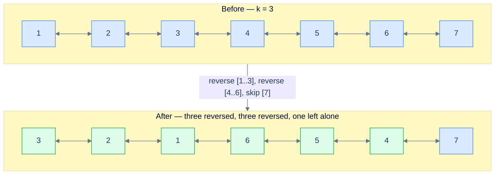

<p align="center"><strong>Reverse the given linked list in groups of <code>k</code>. The trailing fragment shorter than <code>k</code> stays put.</strong></p>

### Q1 — Yes, it splits cleanly

The whole job factors into two pieces: a one-time **length scan** to compute `groups = length / k` (integer division — fractional tail is ignored on purpose), then `groups` independent **segment reversals**. That's it. No backtracking, no recomputation, no auxiliary data structure.

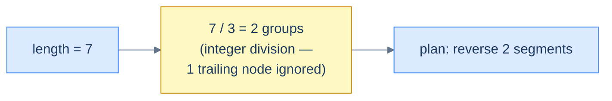

<p align="center"><strong>Calculate the length and the number of groups to reverse. The fractional tail is dropped on purpose so short trailing segments stay un-reversed.</strong></p>

### Q2 — Yes, every subproblem is "reverse between start and end"

Reversing a group of size `k` is exactly the lesson-5 generic reversal: pick a `start` node and a `end` node `k-1` hops later, hand them to `reverse(start, end)`, done. No new algorithm needed.

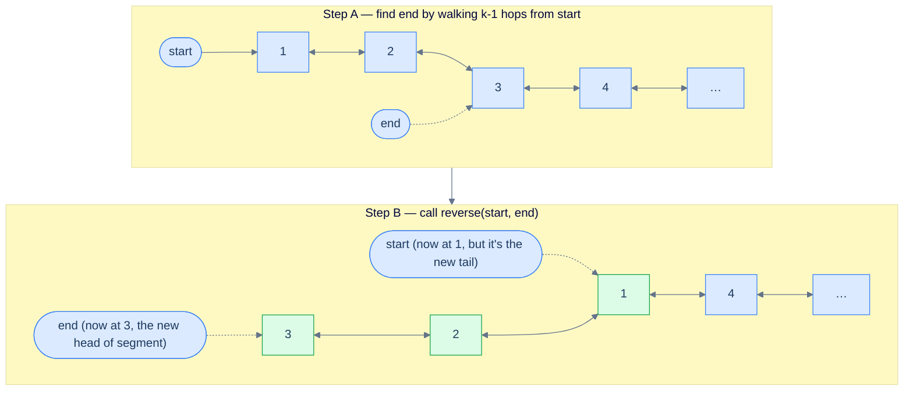

<p align="center"><strong>Reverse the first group between <code>start</code> and <code>end</code> using the reversal algorithm from lesson 5. After the call, <code>end</code> sits where the head of this group lives.</strong></p>

### Tracking the new head

The first reversal is special: it changes the head of the **entire** list. After `reverse(start, end)` runs on the first group, the original `start` is now the segment's tail and `end` is the segment's new head. We detect this by checking `end.prev == null` — the only segment whose new head has no predecessor is the first one.

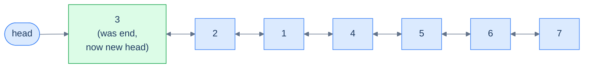

<p align="center"><strong>The reversed head of the first group becomes the new head of the linked list. Detect by <code>end.prev == null</code>.</strong></p>

### Advancing to the next group

After the reversal, `start` (the original first node of the segment) is now the segment's tail. The very next node — `start.next` — is the head of the next group. Move `start` there and loop.

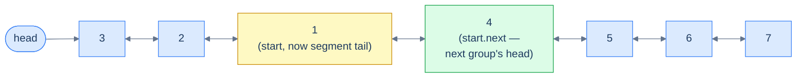

<p align="center"><strong>The node after the current <code>start</code> is the start of the next group. Reassign <code>start = start.next</code>.</strong></p>

> *Friction prompt — before reading on:* what would happen if the loop counter `groups` were computed **inside** the loop instead of once before it? Predict the failure mode.
>
> Answer: each iteration would call `findLength` again (O(N) every time → O(N²) total), and worse, after the first reversal the list's structure has shifted — re-measuring would still give the same total length, but you'd be paying O(N²) for nothing. Compute it once.

### Putting it together — the full execution

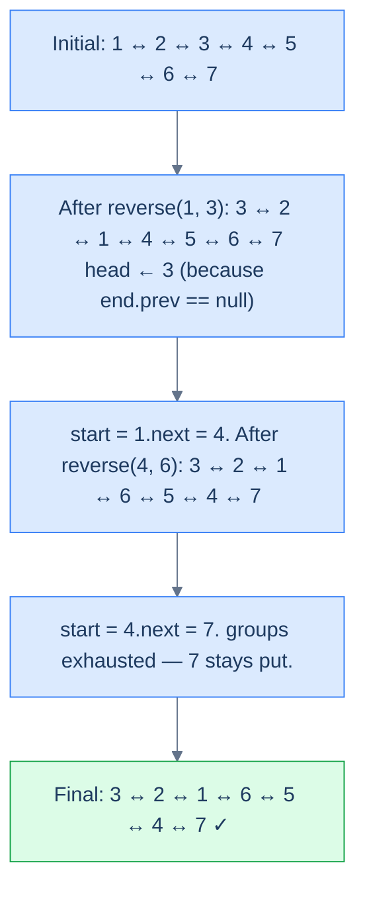

<p align="center"><strong>Reverse the doubly linked list in groups of K — full trace for <code>k = 3</code> on a 7-node list.</strong></p>

### The implementation

The structure is dead simple: a `findLength` helper, a `getNodeAtPosition` helper, the lesson-5 `reverse(start, end)` helper, and a thin driver that picks segments and tracks the new head.

```python run
"""
Definition for doubly-linked list.
class ListNode:
    def __init__(self, val):
        self.val = val
        self.prev = None
        self.next = None
"""
from typing import Optional

class Solution:
    def find_length(self, head: Optional["ListNode"]) -> int:
        # Walk once to learn the count — needed to compute group total.
        length = 0
        while head is not None:
            length += 1
            head = head.next
        return length

    def get_node_at_position(
        self, head: Optional["ListNode"], position: int
    ) -> Optional["ListNode"]:
        # 1-indexed: position=k means walk k-1 forward hops from head.
        current = head
        for _ in range(1, position):
            if current is None:
                break
            current = current.next
        return current

    def reverse(
        self, start: Optional["ListNode"], end: Optional["ListNode"]
    ) -> None:
        # Generic doubly-linked segment reversal from lesson 5.
        if start is None or start == end:
            return
        left_bound  = start.prev                 # Node before segment (may be None)
        right_bound = end.next if end else None  # Node after segment  (may be None)
        current = start
        while current != right_bound:
            next_node = current.next             # Save the old next BEFORE swapping
            current.prev, current.next = current.next, current.prev  # Flip pointers
            current = next_node                  # Walk forward in the original direction
        # Re-stitch seams: start is the new tail, end is the new head of the segment.
        start.next = right_bound
        if right_bound is not None:
            right_bound.prev = start
        end.prev = left_bound
        if left_bound is not None:
            left_bound.next = end

    def reverse_k_segments(
        self, head: Optional["ListNode"], k: int
    ) -> Optional["ListNode"]:
        # Edge cases: nothing to do if 0/1 nodes, or if k=1 (every "group" is itself).
        if head is None or head.next is None or k == 1:
            return head
        start = head                                  # Head of the current segment
        total_segments = self.find_length(head) // k  # Drop fractional tail on purpose
        for _ in range(total_segments):
            end = self.get_node_at_position(start, k) # k-th node from start (1-indexed)
            self.reverse(start, end)                  # Flip the segment in place
            if end and end.prev is None:              # Only the FIRST segment's new head
                head = end                            # has prev == None — promote it.
            start = start.next                        # start is now segment tail; next = next group
        return head
```

```java run
class Solution {
    public int findLength(ListNode head) {
        int length = 0;
        while (head != null) { length++; head = head.next; }
        return length;
    }

    public ListNode getNodeAtPosition(ListNode head, int position) {
        ListNode current = head;
        for (int i = 1; i < position; i++) current = current.next;
        return current;
    }

    public void reverse(ListNode start, ListNode end) {
        if (start == null || start == end) return;
        ListNode leftBound  = start.prev;       // May be null at the head
        ListNode rightBound = end.next;         // May be null at the tail
        ListNode current = start;
        while (current != rightBound) {
            ListNode next = current.next;       // Save before swap
            ListNode tmp  = current.prev;
            current.prev  = current.next;
            current.next  = tmp;
            current = next;
        }
        start.next = rightBound;
        if (rightBound != null) rightBound.prev = start;
        end.prev = leftBound;
        if (leftBound != null) leftBound.next = end;
    }

    public ListNode reverseKSegments(ListNode head, int k) {
        if (head == null || head.next == null || k == 1) return head;
        ListNode start = head;
        int totalSegments = findLength(head) / k;          // Integer division — drop tail
        for (int i = 0; i < totalSegments; i++) {
            ListNode end = getNodeAtPosition(start, k);
            reverse(start, end);
            if (end.prev == null) head = end;              // First segment promotes head
            start = start.next;                            // Now the next group's head
        }
        return head;
    }
}
```

```c run
#include <stdlib.h>

typedef struct ListNode {
    int val;
    struct ListNode *prev;
    struct ListNode *next;
} ListNode;

int findLength(ListNode *head) {
    int length = 0;
    while (head) { length++; head = head->next; }
    return length;
}

ListNode* getNodeAtPosition(ListNode *head, int position) {
    ListNode *current = head;
    for (int i = 1; i < position; ++i) current = current->next;
    return current;
}

void reverse(ListNode *start, ListNode *end) {
    if (!start || start == end) return;
    ListNode *leftBound  = start->prev;
    ListNode *rightBound = end->next;
    ListNode *current = start;
    while (current != rightBound) {
        ListNode *next = current->next;     /* Save before swap */
        ListNode *tmp  = current->prev;
        current->prev  = current->next;
        current->next  = tmp;
        current = next;
    }
    start->next = rightBound;
    if (rightBound) rightBound->prev = start;
    end->prev = leftBound;
    if (leftBound) leftBound->next = end;
}

ListNode* reverseKSegments(ListNode *head, int k) {
    if (!head || !head->next || k == 1) return head;
    ListNode *start = head;
    int totalSegments = findLength(head) / k;
    for (int i = 0; i < totalSegments; i++) {
        ListNode *end = getNodeAtPosition(start, k);
        reverse(start, end);
        if (end->prev == NULL) head = end;   /* First segment owns the new head */
        start = start->next;
    }
    return head;
}
```

```cpp run
class Solution {
public:
    int findLength(ListNode *head) {
        int length = 0;
        while (head) { length++; head = head->next; }
        return length;
    }

    ListNode *getNodeAtPosition(ListNode *head, int position) {
        ListNode *current = head;
        for (int i = 1; i < position; ++i) current = current->next;
        return current;
    }

    void reverse(ListNode *start, ListNode *end) {
        if (!start || start == end) return;
        ListNode *leftBound  = start->prev;
        ListNode *rightBound = end->next;
        ListNode *current = start;
        while (current != rightBound) {
            ListNode *next = current->next;       // Save before swap
            std::swap(current->prev, current->next);
            current = next;
        }
        start->next = rightBound;
        if (rightBound) rightBound->prev = start;
        end->prev = leftBound;
        if (leftBound) leftBound->next = end;
    }

    ListNode *reverseKSegments(ListNode *head, int k) {
        if (!head || !head->next || k == 1) return head;
        ListNode *start = head;
        int totalSegments = findLength(head) / k;       // Integer division
        for (int i = 0; i < totalSegments; i++) {
            ListNode *end = getNodeAtPosition(start, k);
            reverse(start, end);
            if (end->prev == nullptr) head = end;        // First segment promotion
            start = start->next;
        }
        return head;
    }
};
```

```scala run
class Solution {
  def findLength(head: ListNode): Int = {
    var length = 0; var h = head
    while (h != null) { length += 1; h = h.next }
    length
  }

  def getNodeAtPosition(head: ListNode, position: Int): ListNode = {
    var current = head
    for (_ <- 1 until position) current = current.next
    current
  }

  def reverse(start: ListNode, end: ListNode): Unit = {
    if (start == null || start == end) return
    val leftBound  = start.prev
    val rightBound = end.next
    var current = start
    while (current != rightBound) {
      val next = current.next               // Save before swap
      val tmp  = current.prev
      current.prev = current.next
      current.next = tmp
      current = next
    }
    start.next = rightBound
    if (rightBound != null) rightBound.prev = start
    end.prev = leftBound
    if (leftBound  != null) leftBound.next  = end
  }

  def reverseKSegments(head: ListNode, k: Int): ListNode = {
    if (head == null || head.next == null || k == 1) return head
    var h = head; var start = head
    val totalSegments = findLength(head) / k
    for (_ <- 0 until totalSegments) {
      val end = getNodeAtPosition(start, k)
      reverse(start, end)
      if (end.prev == null) h = end          // First segment becomes new head
      start = start.next
    }
    h
  }
}
```

```javascript run
class Solution {
    findLength(head) {
        let length = 0;
        while (head !== null) { length++; head = head.next; }
        return length;
    }

    getNodeAtPosition(head, position) {
        let current = head;
        for (let i = 1; i < position; ++i) current = current.next;
        return current;
    }

    reverse(start, end) {
        if (start === null || start === end) return;
        const leftBound  = start.prev;
        const rightBound = end.next;
        let current = start;
        while (current !== rightBound) {
            const next = current.next;       // Save before swap
            [current.prev, current.next] = [current.next, current.prev];
            current = next;
        }
        start.next = rightBound;
        if (rightBound) rightBound.prev = start;
        end.prev = leftBound;
        if (leftBound)  leftBound.next  = end;
    }

    reverseKSegments(head, k) {
        if (head === null || head.next === null || k === 1) return head;
        let start = head;
        const totalSegments = Math.floor(this.findLength(head) / k);
        for (let i = 0; i < totalSegments; i++) {
            const end = this.getNodeAtPosition(start, k);
            this.reverse(start, end);
            if (end.prev === null) head = end;    // First segment owns the head
            start = start.next;
        }
        return head;
    }
}
```

```typescript run
class Solution {
    findLength(head: ListNode | null): number {
        let length = 0;
        while (head !== null) { length++; head = head.next; }
        return length;
    }

    getNodeAtPosition(head: ListNode | null, position: number): ListNode | null {
        let current = head;
        for (let i = 1; i < position; ++i) {
            if (current === null) break;
            current = current.next;
        }
        return current;
    }

    reverse(start: ListNode | null, end: ListNode | null): void {
        if (start === null || start === end) return;
        const leftBound:  ListNode | null = start.prev;
        const rightBound: ListNode | null = end!.next;
        let current: ListNode | null = start;
        while (current !== rightBound) {
            const next: ListNode | null = current!.next;     // Save before swap
            [current!.prev, current!.next] = [current!.next, current!.prev];
            current = next;
        }
        start.next = rightBound;
        if (rightBound) rightBound.prev = start;
        end!.prev = leftBound;
        if (leftBound)  leftBound.next  = end;
    }

    reverseKSegments(head: ListNode | null, k: number): ListNode | null {
        if (head === null || head.next === null || k === 1) return head;
        let start: ListNode | null = head;
        const totalSegments = Math.floor(this.findLength(head) / k);
        for (let i = 0; i < totalSegments; i++) {
            const end = this.getNodeAtPosition(start, k);
            this.reverse(start, end);
            if (end !== null && end.prev === null) head = end;
            start = start!.next;
        }
        return head;
    }
}
```

```go run
package main

type ListNode struct {
    Val  int
    Prev *ListNode
    Next *ListNode
}

func findLength(head *ListNode) int {
    length := 0
    for head != nil { length++; head = head.Next }
    return length
}

func getNodeAtPosition(head *ListNode, position int) *ListNode {
    current := head
    for i := 1; i < position; i++ { current = current.Next }
    return current
}

func reverse(start, end *ListNode) {
    if start == nil || start == end { return }
    leftBound  := start.Prev
    rightBound := end.Next
    current := start
    for current != rightBound {
        next := current.Next                     // Save before swap
        current.Prev, current.Next = current.Next, current.Prev
        current = next
    }
    start.Next = rightBound
    if rightBound != nil { rightBound.Prev = start }
    end.Prev = leftBound
    if leftBound  != nil { leftBound.Next  = end  }
}

func reverseKSegments(head *ListNode, k int) *ListNode {
    if head == nil || head.Next == nil || k == 1 { return head }
    start := head
    totalSegments := findLength(head) / k
    for i := 0; i < totalSegments; i++ {
        end := getNodeAtPosition(start, k)
        reverse(start, end)
        if end.Prev == nil { head = end }        // First segment promotion
        start = start.Next
    }
    return head
}
```

```kotlin run
class Solution {
    fun findLength(head: ListNode?): Int {
        var length = 0; var h = head
        while (h != null) { length++; h = h.next }
        return length
    }

    fun getNodeAtPosition(head: ListNode?, position: Int): ListNode? {
        var current = head
        for (i in 1 until position) current = current?.next
        return current
    }

    fun reverse(start: ListNode?, end: ListNode?) {
        if (start == null || start == end) return
        val leftBound  = start.prev
        val rightBound = end?.next
        var current: ListNode? = start
        while (current != rightBound) {
            val next = current?.next                     // Save before swap
            val tmp  = current?.prev
            current?.prev = current?.next
            current?.next = tmp
            current = next
        }
        start.next = rightBound
        if (rightBound != null) rightBound.prev = start
        end?.prev = leftBound
        if (leftBound  != null) leftBound.next  = end
    }

    fun reverseKSegments(head: ListNode?, k: Int): ListNode? {
        if (head == null || head.next == null || k == 1) return head
        var h = head; var start: ListNode? = head
        val totalSegments = findLength(head) / k
        for (i in 0 until totalSegments) {
            val end = getNodeAtPosition(start, k)
            reverse(start, end)
            if (end?.prev == null) h = end                // First segment owns head
            start = start?.next
        }
        return h
    }
}
```

```rust run
// See lesson 09 for a complete Rc<RefCell<...>> implementation.
// Sketch — the structure mirrors the other languages exactly:
//   1. find_length(head) walks once.
//   2. get_node_at_position(start, k) walks k-1 hops.
//   3. reverse(start, end) flips prev/next inside [start, end] and re-stitches seams.
//   4. The driver loops total_segments times, calling reverse and detecting the new head
//      via end.prev.is_none(). Doubly-linked lists in safe Rust use Rc<RefCell<Node>> so
//      every pointer flip becomes a borrow_mut() + swap on the inner fields.
fn reverse_k_segments() { /* see lesson 09 */ }
```


<details>
<summary><strong>Trace — head = [1, 2, 3, 4, 5, 6, 7], k = 3</strong></summary>

```
length = 7,  totalSegments = 7 / 3 = 2  (the trailing 1 node is ignored)

Step 1 │ start = node(1)            │ end = node(3)            │ reverse(1, 3)
        │ list: 3 ↔ 2 ↔ 1 ↔ 4 ↔ 5 ↔ 6 ↔ 7
        │ end.prev == null → head = node(3)
        │ start ← start.next = node(4)

Step 2 │ start = node(4)            │ end = node(6)            │ reverse(4, 6)
        │ list: 3 ↔ 2 ↔ 1 ↔ 6 ↔ 5 ↔ 4 ↔ 7
        │ end.prev != null (it's node(1)) → head unchanged
        │ start ← start.next = node(7)

Done   │ 2 segments processed; node(7) left untouched (the fractional tail)
Result: [3, 2, 1, 6, 5, 4, 7] ✓
```

This trace shows the two key tricks: head promotion fires only on segment 1, and the trailing node is silently skipped because `totalSegments` is an integer division.

</details>

The walkthrough above is the entire pattern. Every problem in this lesson is a remix of: **scan the length, pick a window, call reverse, advance, repeat.** The differences come from how the window is chosen — fixed `k = 2`, fixed `k`, growing `k`, or alternating `k` — and one bookkeeping flag for "skip this segment".

## Example problems

Most problems in this category are **medium** or **hard** — not because the reversal itself is hard, but because the windowing and the head-tracking each have their own off-by-one traps. Here's the catalogue we'll work through:

> -   **[Pairwise swap](https://www.codeintuition.io/courses/doubly-linked-list/LloccimoAdOaA5jCVh3LA)**
> -   **[Reverse K-segments](https://www.codeintuition.io/courses/doubly-linked-list/MqIdyjaACWE6lCWQPkbor)**
> -   **[Reverse increasing groups](https://www.codeintuition.io/courses/doubly-linked-list/Bxh830bVxO2vpqteZxgi0)**
> -   **[Reverse alternate segments](https://www.codeintuition.io/courses/doubly-linked-list/6SUHrVVt18Q5cc7NOuJPp)**

Each one bolts onto the template above. Let's see them in order.

***

# Pairwise swap

## The Problem

Given the **head** of a doubly linked list, swap **every two adjacent nodes** and return the head of the reordered list. Solve it without modifying values — only relink pointers.

```
Input : head = [1, 2, 3, 4]
Output:        [2, 1, 4, 3]
Explanation: pairs (1,2) → (2,1) and (3,4) → (4,3).
```

## What Does "Pairwise Swap" Mean?

A pairwise swap is just `reverseKSegments` with `k` hard-coded to `2`. Every window has exactly two nodes; `end` is always `start.next`; no `getNodeAtPosition` walk needed.

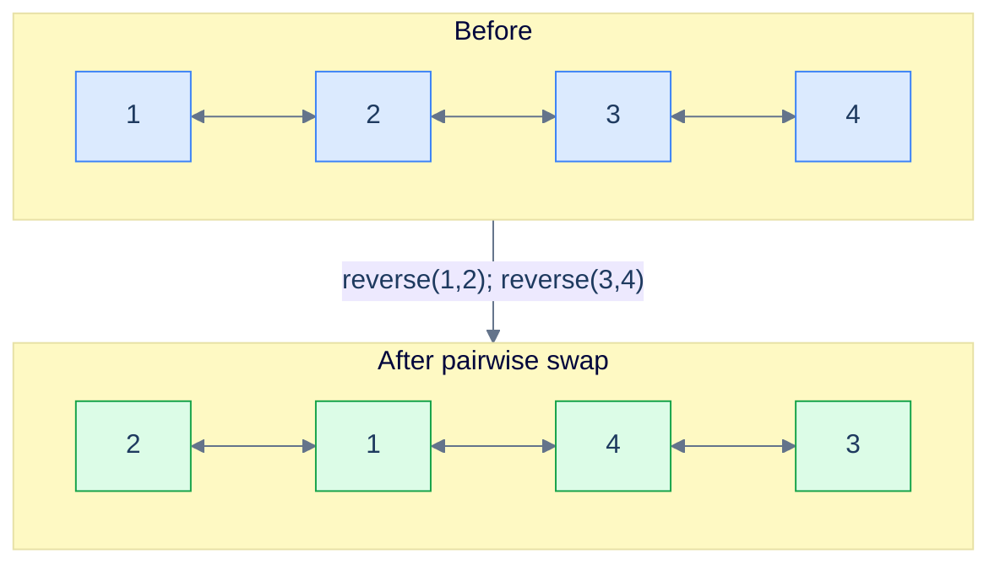

<p align="center"><strong>Pairwise swap — every adjacent pair becomes a length-2 reversal.</strong></p>

## Applying the Diagnostic Questions

| Question | Answer |
|---|---|
| **Q1.** Can the problem be broken into smaller subproblems? | **Yes** — one length-2 reversal per pair |
| **Q2.** Can each subproblem be solved by reversing a part of the list? | **Yes** — reverse(start, start.next) |

### Q1 — Why "one length-2 reversal per pair"?

Mental model: imagine the list as a row of dominos standing in pairs. Each pair is independent — flipping `(1,2)` doesn't affect `(3,4)`. So the whole job is a parade of identical, non-interfering reversals.

Concrete numbers: for `[1, 2, 3, 4, 5, 6]` you do three calls — `reverse(1,2)`, `reverse(3,4)`, `reverse(5,6)`. Three independent O(2) operations = O(N) total.

What breaks if you treat it as one big reversal: you get `[6, 5, 4, 3, 2, 1]` — full reverse, not pairwise. The "subproblem" view is what restricts each flip to a window of 2.

### Q2 — Why "reverse(start, start.next)"?

Mental model: with `k = 2`, the `end` pointer sits one hop away from `start` *by definition*. No length scan, no walker — just `end = start.next`.

Concrete numbers: at `start = 1`, `end = 1.next = 2`. Call `reverse(1, 2)`. After the call, `start` (node 1) is now the segment tail; `start.next` is node 3 — the head of the next pair. Loop.

What breaks if you skip the bidirectional check `start != null && start.next != null`: an odd-length list (e.g. `[1, 2, 3]`) tries to swap the lonely `3` with `null` and crashes.

## The Pairwise Strategy (Visualised)

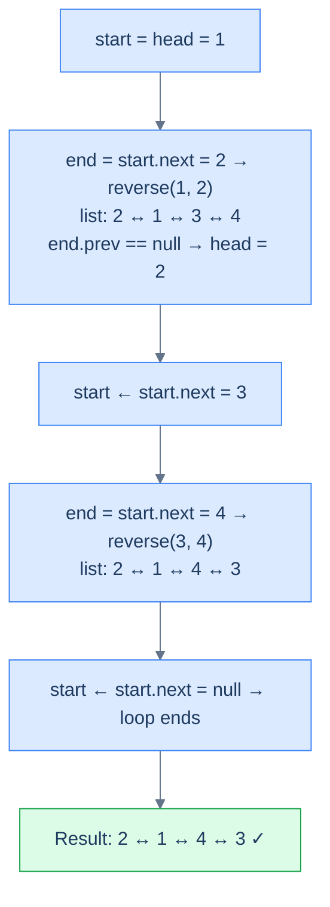

<p align="center"><strong>The Pairwise Strategy — same template as <code>reverseKSegments</code>, with the window hard-pinned to 2.</strong></p>

## The Solution

```python run
from typing import Optional

class Solution:
    def reverse(self, start, end):
        # Generic segment reversal — same helper used everywhere.
        if start is None or start == end: return
        left_bound  = start.prev
        right_bound = end.next if end else None
        current = start
        while current != right_bound:
            next_node = current.next
            current.prev, current.next = current.next, current.prev
            current = next_node
        start.next = right_bound
        if right_bound: right_bound.prev = start
        end.prev = left_bound
        if left_bound: left_bound.next = end

    def pairwise_swap(self, head: Optional["ListNode"]) -> Optional["ListNode"]:
        if head is None or head.next is None:
            return head                          # 0 or 1 nodes — nothing to swap
        start = head
        while start is not None and start.next is not None:
            end = start.next                     # k=2: end is always one hop
            self.reverse(start, end)
            if end.prev is None:                 # First pair owns the new head
                head = end
            start = start.next                   # start became the segment tail
        return head
```

```java run
class Solution {
    public void reverse(ListNode start, ListNode end) {
        if (start == null || start == end) return;
        ListNode leftBound  = start.prev;
        ListNode rightBound = end.next;
        ListNode current = start;
        while (current != rightBound) {
            ListNode next = current.next;
            ListNode tmp  = current.prev;
            current.prev  = current.next;
            current.next  = tmp;
            current = next;
        }
        start.next = rightBound;
        if (rightBound != null) rightBound.prev = start;
        end.prev = leftBound;
        if (leftBound != null) leftBound.next = end;
    }

    public ListNode pairwiseSwap(ListNode head) {
        if (head == null || head.next == null) return head;
        ListNode start = head;
        while (start != null && start.next != null) {
            ListNode end = start.next;       // k=2: end is always start.next
            reverse(start, end);
            if (end.prev == null) head = end;
            start = start.next;              // start is now segment tail
        }
        return head;
    }
}
```

```c run
void reverse(ListNode *start, ListNode *end) {
    if (!start || start == end) return;
    ListNode *leftBound = start->prev, *rightBound = end->next;
    ListNode *current = start;
    while (current != rightBound) {
        ListNode *next = current->next;
        ListNode *tmp  = current->prev;
        current->prev  = current->next;
        current->next  = tmp;
        current = next;
    }
    start->next = rightBound;
    if (rightBound) rightBound->prev = start;
    end->prev = leftBound;
    if (leftBound)  leftBound->next  = end;
}

ListNode* pairwiseSwap(ListNode *head) {
    if (!head || !head->next) return head;
    ListNode *start = head;
    while (start && start->next) {
        ListNode *end = start->next;        /* k=2 */
        reverse(start, end);
        if (end->prev == NULL) head = end;
        start = start->next;
    }
    return head;
}
```

```cpp run
class Solution {
public:
    void reverse(ListNode *start, ListNode *end) {
        if (!start || start == end) return;
        ListNode *leftBound = start->prev, *rightBound = end->next;
        ListNode *current = start;
        while (current != rightBound) {
            ListNode *next = current->next;
            std::swap(current->prev, current->next);
            current = next;
        }
        start->next = rightBound;
        if (rightBound) rightBound->prev = start;
        end->prev = leftBound;
        if (leftBound)  leftBound->next  = end;
    }

    ListNode *pairwiseSwap(ListNode *head) {
        if (!head || !head->next) return head;
        ListNode *start = head;
        while (start && start->next) {
            ListNode *end = start->next;     // k=2
            reverse(start, end);
            if (end->prev == nullptr) head = end;
            start = start->next;
        }
        return head;
    }
};
```

```scala run
class Solution {
  def reverse(start: ListNode, end: ListNode): Unit = {
    if (start == null || start == end) return
    val leftBound  = start.prev
    val rightBound = end.next
    var current = start
    while (current != rightBound) {
      val next = current.next
      val tmp  = current.prev
      current.prev = current.next
      current.next = tmp
      current = next
    }
    start.next = rightBound
    if (rightBound != null) rightBound.prev = start
    end.prev = leftBound
    if (leftBound  != null) leftBound.next  = end
  }

  def pairwiseSwap(head: ListNode): ListNode = {
    if (head == null || head.next == null) return head
    var h = head; var start = head
    while (start != null && start.next != null) {
      val end = start.next                    // k=2
      reverse(start, end)
      if (end.prev == null) h = end
      start = start.next
    }
    h
  }
}
```

```javascript run
class Solution {
    reverse(start, end) {
        if (start === null || start === end) return;
        const leftBound = start.prev, rightBound = end.next;
        let current = start;
        while (current !== rightBound) {
            const next = current.next;
            [current.prev, current.next] = [current.next, current.prev];
            current = next;
        }
        start.next = rightBound;
        if (rightBound) rightBound.prev = start;
        end.prev = leftBound;
        if (leftBound)  leftBound.next  = end;
    }

    pairwiseSwap(head) {
        if (head === null || head.next === null) return head;
        let start = head;
        while (start !== null && start.next !== null) {
            const end = start.next;           // k=2
            this.reverse(start, end);
            if (end.prev === null) head = end;
            start = start.next;
        }
        return head;
    }
}
```

```typescript run
class Solution {
    reverse(start: ListNode | null, end: ListNode | null): void {
        if (start === null || start === end) return;
        const leftBound:  ListNode | null = start.prev;
        const rightBound: ListNode | null = end!.next;
        let current: ListNode | null = start;
        while (current !== rightBound) {
            const next: ListNode | null = current!.next;
            [current!.prev, current!.next] = [current!.next, current!.prev];
            current = next;
        }
        start.next = rightBound;
        if (rightBound) rightBound.prev = start;
        end!.prev = leftBound;
        if (leftBound)  leftBound.next  = end;
    }

    pairwiseSwap(head: ListNode | null): ListNode | null {
        if (head === null || head.next === null) return head;
        let start: ListNode | null = head;
        while (start !== null && start.next !== null) {
            const end = start.next;           // k=2
            this.reverse(start, end);
            if (end !== null && end.prev === null) head = end;
            start = start!.next;
        }
        return head;
    }
}
```

```go run
func reverse(start, end *ListNode) {
    if start == nil || start == end { return }
    leftBound, rightBound := start.Prev, end.Next
    current := start
    for current != rightBound {
        next := current.Next
        current.Prev, current.Next = current.Next, current.Prev
        current = next
    }
    start.Next = rightBound
    if rightBound != nil { rightBound.Prev = start }
    end.Prev = leftBound
    if leftBound  != nil { leftBound.Next  = end  }
}

func pairwiseSwap(head *ListNode) *ListNode {
    if head == nil || head.Next == nil { return head }
    start := head
    for start != nil && start.Next != nil {
        end := start.Next                     // k=2
        reverse(start, end)
        if end.Prev == nil { head = end }
        start = start.Next
    }
    return head
}
```

```kotlin run
class Solution {
    fun reverse(start: ListNode?, end: ListNode?) {
        if (start == null || start == end) return
        val leftBound  = start.prev
        val rightBound = end?.next
        var current: ListNode? = start
        while (current != rightBound) {
            val next = current?.next
            val tmp  = current?.prev
            current?.prev = current?.next
            current?.next = tmp
            current = next
        }
        start.next = rightBound
        if (rightBound != null) rightBound.prev = start
        end?.prev = leftBound
        if (leftBound  != null) leftBound.next  = end
    }

    fun pairwiseSwap(head: ListNode?): ListNode? {
        if (head == null || head.next == null) return head
        var h = head; var start: ListNode? = head
        while (start != null && start.next != null) {
            val end = start.next                  // k=2
            reverse(start, end)
            if (end?.prev == null) h = end
            start = start?.next
        }
        return h
    }
}
```

```rust run
// See lesson 09 for a complete Rc<RefCell<...>> implementation.
// Pairwise swap is reverseKSegments with k = 2: walk in steps of two, call reverse(start, start.next),
// promote head when end.prev is None, advance start to start.next.
fn pairwise_swap() { /* see lesson 09 */ }
```


<details>
<summary><strong>Trace — head = [1, 2, 3, 4]</strong></summary>

```
Step 1 │ start = 1, end = 2 → reverse(1, 2)
        │ list: 2 ↔ 1 ↔ 3 ↔ 4   |  end.prev == null → head = 2
        │ start ← start.next = 3
Step 2 │ start = 3, end = 4 → reverse(3, 4)
        │ list: 2 ↔ 1 ↔ 4 ↔ 3   |  end.prev = node(1) → head unchanged
        │ start ← start.next = null  →  loop ends
Result: [2, 1, 4, 3] ✓
```

</details>

## Complexity Analysis

| Resource | Cost | Why |
|---|---|---|
| Time | **O(N)** | Each node is visited and pointer-flipped exactly once |
| Space | **O(1)** | Three temporary references; no auxiliary structure |

## Edge Cases

| Case | Example | Expected | Reasoning |
|---|---|---|---|
| Empty list | `head = null` | `null` | Guard at the top short-circuits |
| Single node | `[5]` | `[5]` | `head.next == null` guard catches it |
| Odd length | `[1, 2, 3]` | `[2, 1, 3]` | Loop ends when `start.next == null`; trailing 3 stays |
| Two nodes | `[1, 2]` | `[2, 1]` | One reversal, head promoted |

***

# Reverse K-segments

## The Problem

Given the **head** of a doubly linked list and a positive integer **k**, reverse the list in groups of `k`. If the trailing fragment has fewer than `k` nodes, leave it alone.

```
Input : head = [5, 7, 3, 10, 6, 8], k = 3
Output:        [3, 7, 5, 8, 6, 10]
Explanation: groups of 3 each — (5,7,3) → (3,7,5) and (10,6,8) → (8,6,10).

Input : head = [5, 7, 3, 10, 6], k = 2
Output:        [7, 5, 10, 3, 6]
Explanation: pairs reversed; the lonely trailing 6 is too small to form a group, stays.

Input : head = [5, 7, 3, 10, 6], k = 8
Output:        [5, 7, 3, 10, 6]
Explanation: list length 5 < k=8 → no reversal happens.
```

## What Does "Reverse In Groups of K" Mean?

Same template, generalised window. Where pairwise pinned `k = 2`, here `k` is a parameter; the only addition is the `getNodeAtPosition(start, k)` walk to find each segment's `end`, and the integer-division formula `groups = length / k` that drops the short tail.

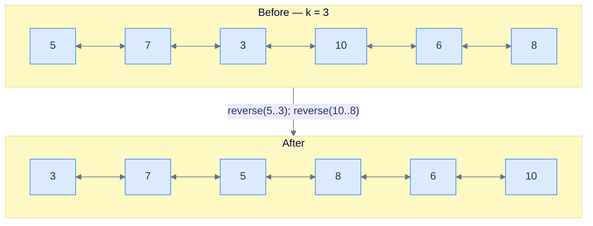

<p align="center"><strong>Reverse K-segments — fixed window of size <code>k</code> repeats until fewer than <code>k</code> nodes remain.</strong></p>

## Applying the Diagnostic Questions

| Question | Answer |
|---|---|
| **Q1.** Can the problem be broken into smaller subproblems? | **Yes** — `length / k` independent reversals |
| **Q2.** Can each subproblem be solved by reversing a part? | **Yes** — reverse the segment from `start` to the k-th node |

### Q1 — Why "length / k independent reversals"?

Mental model: integer division gives you the count of *complete* windows that fit. Anything left over is shorter than `k` and is excluded by definition.

Concrete numbers: `length = 5, k = 2 → 5 / 2 = 2` complete pairs. The 5th node is the leftover — never reversed. `length = 5, k = 8 → 5 / 8 = 0` — zero reversals, the list comes out unchanged.

What breaks if you use the ceiling instead of the floor: you'd try to reverse a partial trailing segment whose `end` is `null`, and `getNodeAtPosition` would walk off the list and crash.

### Q2 — Why "reverse from start to the k-th node"?

Mental model: each window is a contiguous segment defined by two endpoints. With `start` at the front, walking `k-1` hops lands you on the k-th node — that's `end`.

Concrete numbers: `start = node(5)`, `k = 3` → walk 2 hops → `end = node(3)`. Call `reverse(5, 3)`. Segment becomes `(3, 7, 5)`.

What breaks if you skip the head-promotion check `end.prev == null`: after the first reversal, the original head is buried mid-list and the function returns it as the head — the caller traverses the list starting from a non-head node and misses everything before it.

## The K-Segment Strategy (Visualised)

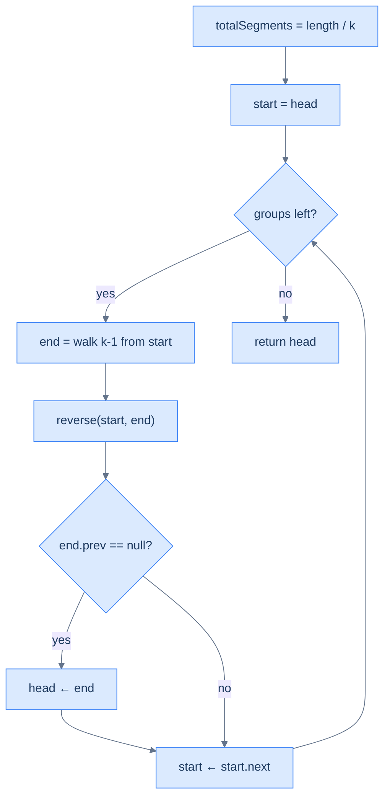

<p align="center"><strong>The K-Segment Strategy — three reusable building blocks: window-pick, reverse, head-track.</strong></p>

> *Friction prompt — before reading on:* what's the answer for `head = [1, 2, 3, 4, 5], k = 5`? Predict before scrolling.
>
> Answer: `length / k = 1` group, the entire list. After one `reverse(1, 5)`: `[5, 4, 3, 2, 1]`. Head promoted because `end.prev == null`. The "fractional tail" rule reduces to "no tail" when `k` divides `length` exactly.

## The Solution

```python run
from typing import Optional

class Solution:
    def find_length(self, head):
        n = 0
        while head: n += 1; head = head.next
        return n

    def get_node_at_position(self, head, position):
        cur = head
        for _ in range(1, position):
            if cur is None: break
            cur = cur.next
        return cur

    def reverse(self, start, end):
        if start is None or start == end: return
        lb, rb = start.prev, (end.next if end else None)
        cur = start
        while cur != rb:
            nxt = cur.next
            cur.prev, cur.next = cur.next, cur.prev
            cur = nxt
        start.next = rb
        if rb: rb.prev = start
        end.prev = lb
        if lb: lb.next = end

    def reverse_k_segments(self, head, k):
        if head is None or head.next is None or k == 1:
            return head                              # Trivial cases — no work
        start = head
        total_segments = self.find_length(head) // k # Floor — drops the short tail
        for _ in range(total_segments):
            end = self.get_node_at_position(start, k)
            self.reverse(start, end)
            if end and end.prev is None:             # First segment promotion
                head = end
            start = start.next                       # start became segment tail
        return head
```

```java run
class Solution {
    public int findLength(ListNode h) { int n = 0; while (h != null) { n++; h = h.next; } return n; }
    public ListNode getNodeAtPosition(ListNode h, int p) {
        ListNode c = h; for (int i = 1; i < p; i++) c = c.next; return c;
    }
    public void reverse(ListNode start, ListNode end) {
        if (start == null || start == end) return;
        ListNode lb = start.prev, rb = end.next, cur = start;
        while (cur != rb) {
            ListNode nxt = cur.next, tmp = cur.prev;
            cur.prev = cur.next; cur.next = tmp; cur = nxt;
        }
        start.next = rb; if (rb != null) rb.prev = start;
        end.prev   = lb; if (lb != null) lb.next  = end;
    }
    public ListNode reverseKSegments(ListNode head, int k) {
        if (head == null || head.next == null || k == 1) return head;
        ListNode start = head;
        int total = findLength(head) / k;          // Integer division → drops short tail
        for (int i = 0; i < total; i++) {
            ListNode end = getNodeAtPosition(start, k);
            reverse(start, end);
            if (end.prev == null) head = end;       // First segment promotion
            start = start.next;
        }
        return head;
    }
}
```

```c run
int findLength(ListNode *h) { int n = 0; while (h) { n++; h = h->next; } return n; }
ListNode* getNodeAtPosition(ListNode *h, int p) {
    ListNode *c = h; for (int i = 1; i < p; i++) c = c->next; return c;
}
void reverse(ListNode *start, ListNode *end) {
    if (!start || start == end) return;
    ListNode *lb = start->prev, *rb = end->next, *cur = start;
    while (cur != rb) {
        ListNode *nxt = cur->next, *tmp = cur->prev;
        cur->prev = cur->next; cur->next = tmp; cur = nxt;
    }
    start->next = rb; if (rb) rb->prev = start;
    end->prev   = lb; if (lb) lb->next  = end;
}
ListNode* reverseKSegments(ListNode *head, int k) {
    if (!head || !head->next || k == 1) return head;
    ListNode *start = head;
    int total = findLength(head) / k;
    for (int i = 0; i < total; i++) {
        ListNode *end = getNodeAtPosition(start, k);
        reverse(start, end);
        if (end->prev == NULL) head = end;
        start = start->next;
    }
    return head;
}
```

```cpp run
class Solution {
public:
    int findLength(ListNode *h) { int n = 0; while (h) { n++; h = h->next; } return n; }
    ListNode *getNodeAtPosition(ListNode *h, int p) {
        ListNode *c = h; for (int i = 1; i < p; ++i) c = c->next; return c;
    }
    void reverse(ListNode *start, ListNode *end) {
        if (!start || start == end) return;
        ListNode *lb = start->prev, *rb = end->next, *cur = start;
        while (cur != rb) {
            ListNode *nxt = cur->next;
            std::swap(cur->prev, cur->next);
            cur = nxt;
        }
        start->next = rb; if (rb) rb->prev = start;
        end->prev   = lb; if (lb) lb->next  = end;
    }
    ListNode *reverseKSegments(ListNode *head, int k) {
        if (!head || !head->next || k == 1) return head;
        ListNode *start = head;
        int total = findLength(head) / k;          // Floor → drops short tail
        for (int i = 0; i < total; i++) {
            ListNode *end = getNodeAtPosition(start, k);
            reverse(start, end);
            if (end->prev == nullptr) head = end;
            start = start->next;
        }
        return head;
    }
};
```

```scala run
class Solution {
  def findLength(head: ListNode): Int = {
    var n = 0; var h = head
    while (h != null) { n += 1; h = h.next }; n
  }
  def getNodeAtPosition(head: ListNode, p: Int): ListNode = {
    var c = head; for (_ <- 1 until p) c = c.next; c
  }
  def reverse(start: ListNode, end: ListNode): Unit = {
    if (start == null || start == end) return
    val lb = start.prev; val rb = end.next
    var cur = start
    while (cur != rb) {
      val nxt = cur.next; val tmp = cur.prev
      cur.prev = cur.next; cur.next = tmp; cur = nxt
    }
    start.next = rb; if (rb != null) rb.prev = start
    end.prev   = lb; if (lb != null) lb.next  = end
  }
  def reverseKSegments(head: ListNode, k: Int): ListNode = {
    if (head == null || head.next == null || k == 1) return head
    var h = head; var start = head
    val total = findLength(head) / k
    for (_ <- 0 until total) {
      val end = getNodeAtPosition(start, k)
      reverse(start, end)
      if (end.prev == null) h = end
      start = start.next
    }
    h
  }
}
```

```javascript run
class Solution {
    findLength(h) { let n = 0; while (h) { n++; h = h.next; } return n; }
    getNodeAtPosition(h, p) { let c = h; for (let i = 1; i < p; i++) c = c.next; return c; }
    reverse(start, end) {
        if (start === null || start === end) return;
        let lb = start.prev, rb = end.next, cur = start;
        while (cur !== rb) {
            const nxt = cur.next;
            [cur.prev, cur.next] = [cur.next, cur.prev];
            cur = nxt;
        }
        start.next = rb; if (rb) rb.prev = start;
        end.prev   = lb; if (lb) lb.next  = end;
    }
    reverseKSegments(head, k) {
        if (head === null || head.next === null || k === 1) return head;
        let start = head;
        const total = Math.floor(this.findLength(head) / k);
        for (let i = 0; i < total; i++) {
            const end = this.getNodeAtPosition(start, k);
            this.reverse(start, end);
            if (end.prev === null) head = end;
            start = start.next;
        }
        return head;
    }
}
```

```typescript run
class Solution {
    findLength(h: ListNode | null): number { let n = 0; while (h) { n++; h = h.next; } return n; }
    getNodeAtPosition(h: ListNode | null, p: number): ListNode | null {
        let c = h; for (let i = 1; i < p; i++) c = c!.next; return c;
    }
    reverse(start: ListNode | null, end: ListNode | null): void {
        if (start === null || start === end) return;
        const lb = start.prev, rb = end!.next;
        let cur: ListNode | null = start;
        while (cur !== rb) {
            const nxt: ListNode | null = cur!.next;
            [cur!.prev, cur!.next] = [cur!.next, cur!.prev];
            cur = nxt;
        }
        start.next = rb; if (rb) rb.prev = start;
        end!.prev  = lb; if (lb) lb.next  = end;
    }
    reverseKSegments(head: ListNode | null, k: number): ListNode | null {
        if (head === null || head.next === null || k === 1) return head;
        let start: ListNode | null = head;
        const total = Math.floor(this.findLength(head) / k);
        for (let i = 0; i < total; i++) {
            const end = this.getNodeAtPosition(start, k);
            this.reverse(start, end);
            if (end !== null && end.prev === null) head = end;
            start = start!.next;
        }
        return head;
    }
}
```

```go run
func findLength(h *ListNode) int { n := 0; for h != nil { n++; h = h.Next }; return n }
func getNodeAtPosition(h *ListNode, p int) *ListNode {
    c := h
    for i := 1; i < p; i++ { c = c.Next }
    return c
}
func reverse(start, end *ListNode) {
    if start == nil || start == end { return }
    lb, rb := start.Prev, end.Next
    cur := start
    for cur != rb {
        nxt := cur.Next
        cur.Prev, cur.Next = cur.Next, cur.Prev
        cur = nxt
    }
    start.Next = rb; if rb != nil { rb.Prev = start }
    end.Prev   = lb; if lb != nil { lb.Next  = end  }
}
func reverseKSegments(head *ListNode, k int) *ListNode {
    if head == nil || head.Next == nil || k == 1 { return head }
    start := head
    total := findLength(head) / k
    for i := 0; i < total; i++ {
        end := getNodeAtPosition(start, k)
        reverse(start, end)
        if end.Prev == nil { head = end }
        start = start.Next
    }
    return head
}
```

```kotlin run
class Solution {
    fun findLength(head: ListNode?): Int {
        var n = 0; var h = head
        while (h != null) { n++; h = h.next }; return n
    }
    fun getNodeAtPosition(head: ListNode?, p: Int): ListNode? {
        var c = head; for (i in 1 until p) c = c?.next; return c
    }
    fun reverse(start: ListNode?, end: ListNode?) {
        if (start == null || start == end) return
        val lb = start.prev; val rb = end?.next
        var cur: ListNode? = start
        while (cur != rb) {
            val nxt = cur?.next; val tmp = cur?.prev
            cur?.prev = cur?.next; cur?.next = tmp; cur = nxt
        }
        start.next = rb; if (rb != null) rb.prev = start
        end?.prev = lb; if (lb != null) lb.next  = end
    }
    fun reverseKSegments(head: ListNode?, k: Int): ListNode? {
        if (head == null || head.next == null || k == 1) return head
        var h = head; var start: ListNode? = head
        val total = findLength(head) / k
        for (i in 0 until total) {
            val end = getNodeAtPosition(start, k)
            reverse(start, end)
            if (end?.prev == null) h = end
            start = start?.next
        }
        return h
    }
}
```

```rust run
// See lesson 09 for a complete Rc<RefCell<...>> implementation.
// Algorithm: total = find_length(head) / k; for each segment, end = walk k-1 from start,
// call reverse(start, end), promote head if end.prev is None, advance start.
fn reverse_k_segments() { /* see lesson 09 */ }
```


<details>
<summary><strong>Trace — head = [5, 7, 3, 10, 6, 8], k = 3</strong></summary>

```
length = 6,  total = 6 / 3 = 2

Step 1 │ start = node(5), end walked 2 hops to node(3) → reverse(5, 3)
        │ list: 3 ↔ 7 ↔ 5 ↔ 10 ↔ 6 ↔ 8
        │ end.prev == null → head = node(3)
        │ start ← start.next = node(10)

Step 2 │ start = node(10), end walked 2 hops to node(8) → reverse(10, 8)
        │ list: 3 ↔ 7 ↔ 5 ↔ 8 ↔ 6 ↔ 10
        │ end.prev = node(5) → head unchanged
        │ start ← start.next = null  →  loop ends

Result: [3, 7, 5, 8, 6, 10] ✓
```

</details>

<details>
<summary><strong>Trace — head = [5, 7, 3, 10, 6], k = 8 (k larger than length)</strong></summary>

```
length = 5,  total = 5 / 8 = 0  → loop never runs
Result: [5, 7, 3, 10, 6] ✓  (list returned unchanged)
```

This trace shows why integer division is the right choice: zero complete windows = zero reversals = no risk of walking off the end.

</details>

## Complexity Analysis

| Resource | Cost | Why |
|---|---|---|
| Time | **O(N)** | One length scan + each node visited once during reversals |
| Space | **O(1)** | Constant working set: a few pointers, no auxiliary structure |

## Edge Cases

| Case | Example | Expected | Reasoning |
|---|---|---|---|
| `k == 1` | `[1, 2, 3], k=1` | `[1, 2, 3]` | Each "group" is a single node; reversing it is a no-op |
| `k > length` | `[1, 2, 3], k=5` | `[1, 2, 3]` | `total = 0`; loop doesn't execute |
| `k == length` | `[1, 2, 3], k=3` | `[3, 2, 1]` | One full reversal; head promoted |
| `length` not multiple of `k` | `[1,2,3,4,5], k=2` | `[2,1,4,3,5]` | Trailing 5 is the dropped fractional tail |

***

# Reverse increasing groups

## The Problem

Given the **head** of a doubly linked list, reverse the list in groups of **increasing size**: first group has size 1, next size 2, then 3, and so on. Return the head of the modified list. If the trailing fragment is shorter than the next required group size, leave it alone.

```
Input : head = [5, 7, 3, 10, 6, 8]
Output:        [5, 3, 7, 8, 6, 10]
Explanation: groups of sizes 1, 2, 3 — (5)→(5), (7,3)→(3,7), (10,6,8)→(8,6,10).

Input : head = [5, 7, 3, 10, 6]
Output:        [5, 3, 7, 10, 6]
Explanation: groups 1 and 2 — (5)→(5), (7,3)→(3,7). The trailing 2 nodes are
             fewer than the next required size of 3 → left unchanged.

Input : head = [5]
Output:        [5]
Explanation: only one group of size 1; reversing it is a no-op.
```

## What Does "Increasing Groups" Mean?

Same template, dynamic window. The K-segments problem fixed `k` for every iteration. Here, `k` grows: 1 on iteration 1, 2 on iteration 2, 3 on iteration 3. The loop guard becomes "do I have at least `groupSize` nodes left?"

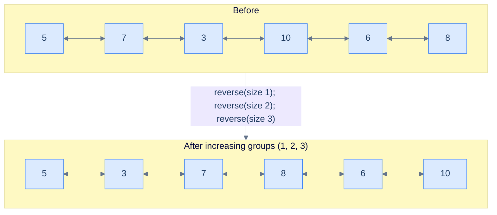

<p align="center"><strong>Reverse increasing groups — group size grows by 1 each iteration. The cumulative coverage is <code>1 + 2 + 3 + … = n(n+1)/2</code>.</strong></p>

## Applying the Diagnostic Questions

| Question | Answer |
|---|---|
| **Q1.** Can the problem be broken into smaller subproblems? | **Yes** — one reversal per growing window |
| **Q2.** Can each subproblem be solved by reversing a part? | **Yes** — same `reverse(start, end)`, with `end` walked `groupSize-1` hops |

### Q1 — Why "one reversal per growing window"?

Mental model: the problem is a parade of independent reversals just like K-segments — but the parade marshal grows the window by one each step. Track a `length` counter that you decrement by `groupSize` after each iteration; stop when `length < groupSize`.

Concrete numbers: `length = 6`. Iter 1: `groupSize = 1`, reverse 1 node, `length = 5`. Iter 2: `groupSize = 2`, reverse 2, `length = 3`. Iter 3: `groupSize = 3`, reverse 3, `length = 0`. Iter 4 would need `groupSize = 4` but `length = 0 < 4` → stop.

What breaks if you don't decrement length: the loop never terminates because `length` stays at 6 forever and every iteration looks fine — until `getNodeAtPosition` walks off the list and crashes.

### Q2 — Why "same reverse, dynamic end"?

Mental model: the only thing changing per iteration is how far `end` is from `start`. Everything else — head promotion, advancing `start`, the reverse helper — is identical to K-segments.

Concrete numbers: at iteration 3 with `start = node(10)`, `groupSize = 3` → walk 2 hops → `end = node(8)`. Call `reverse(10, 8)`. Output segment: `(8, 6, 10)`.

What breaks if you don't increment `groupSize` after each iteration: you've reduced the problem to "reverse every node alone", which is a no-op — output equals input.

## The Increasing-Group Strategy (Visualised)

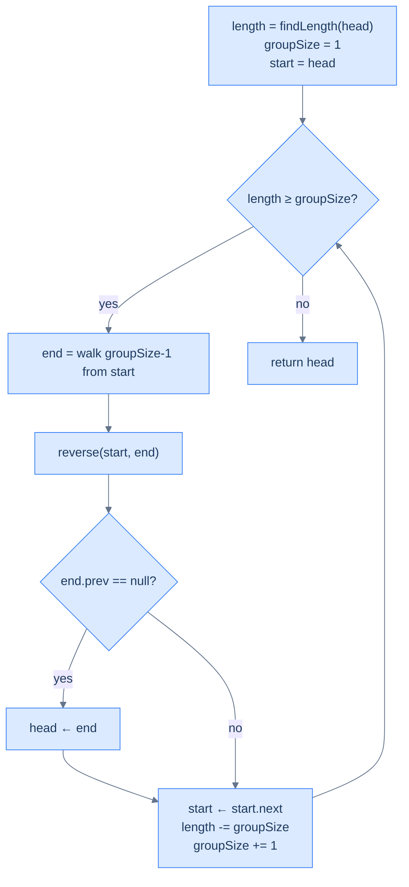

<p align="center"><strong>The Increasing-Group Strategy — same skeleton as K-segments with two new bookkeeping lines: shrink <code>length</code>, grow <code>groupSize</code>.</strong></p>

## The Solution

```python run
from typing import Optional

class Solution:
    def find_length(self, head):
        n = 0
        while head: n += 1; head = head.next
        return n

    def get_node_at_position(self, head, position):
        cur = head
        for _ in range(1, position):
            if cur is None: break
            cur = cur.next
        return cur

    def reverse(self, start, end):
        if start is None or start == end: return
        lb, rb = start.prev, (end.next if end else None)
        cur = start
        while cur != rb:
            nxt = cur.next
            cur.prev, cur.next = cur.next, cur.prev
            cur = nxt
        start.next = rb
        if rb: rb.prev = start
        end.prev = lb
        if lb: lb.next = end

    def reverse_increasing_groups(self, head):
        if head is None or head.next is None:
            return head
        start  = head
        length = self.find_length(head)
        group_size = 1                              # Start with windows of size 1
        while length >= group_size:                 # Stop when remaining < required
            end = self.get_node_at_position(start, group_size)
            self.reverse(start, end)
            if end and end.prev is None:            # Only fires for groupSize=1 first iter
                head = end
            start = start.next                      # Now next group's head
            length    -= group_size                 # Shrink remaining count
            group_size += 1                         # Grow window for next iter
        return head
```

```java run
class Solution {
    public int findLength(ListNode h) { int n = 0; while (h != null) { n++; h = h.next; } return n; }
    public ListNode getNodeAtPosition(ListNode h, int p) {
        ListNode c = h; for (int i = 1; i < p; i++) c = c.next; return c;
    }
    public void reverse(ListNode start, ListNode end) {
        if (start == null || start == end) return;
        ListNode lb = start.prev, rb = end.next, cur = start;
        while (cur != rb) {
            ListNode nxt = cur.next, tmp = cur.prev;
            cur.prev = cur.next; cur.next = tmp; cur = nxt;
        }
        start.next = rb; if (rb != null) rb.prev = start;
        end.prev   = lb; if (lb != null) lb.next  = end;
    }
    public ListNode reverseIncreasingGroups(ListNode head) {
        if (head == null || head.next == null) return head;
        ListNode start = head;
        int length = findLength(head);
        int groupSize = 1;
        while (length >= groupSize) {
            ListNode end = getNodeAtPosition(start, groupSize);
            reverse(start, end);
            if (end.prev == null) head = end;       // Fires once on first iteration
            start = start.next;
            length    -= groupSize;                  // Shrink remaining
            groupSize += 1;                          // Grow window
        }
        return head;
    }
}
```

```c run
int findLength(ListNode *h) { int n = 0; while (h) { n++; h = h->next; } return n; }
ListNode* getNodeAtPosition(ListNode *h, int p) {
    ListNode *c = h; for (int i = 1; i < p; i++) c = c->next; return c;
}
void reverse(ListNode *start, ListNode *end) {
    if (!start || start == end) return;
    ListNode *lb = start->prev, *rb = end->next, *cur = start;
    while (cur != rb) {
        ListNode *nxt = cur->next, *tmp = cur->prev;
        cur->prev = cur->next; cur->next = tmp; cur = nxt;
    }
    start->next = rb; if (rb) rb->prev = start;
    end->prev   = lb; if (lb) lb->next  = end;
}
ListNode* reverseIncreasingGroups(ListNode *head) {
    if (!head || !head->next) return head;
    ListNode *start = head;
    int length = findLength(head);
    int groupSize = 1;
    while (length >= groupSize) {
        ListNode *end = getNodeAtPosition(start, groupSize);
        reverse(start, end);
        if (end->prev == NULL) head = end;
        start = start->next;
        length    -= groupSize;
        groupSize += 1;
    }
    return head;
}
```

```cpp run
class Solution {
public:
    int findLength(ListNode *h) { int n = 0; while (h) { n++; h = h->next; } return n; }
    ListNode *getNodeAtPosition(ListNode *h, int p) {
        ListNode *c = h; for (int i = 1; i < p; ++i) c = c->next; return c;
    }
    void reverse(ListNode *start, ListNode *end) {
        if (!start || start == end) return;
        ListNode *lb = start->prev, *rb = end->next, *cur = start;
        while (cur != rb) {
            ListNode *nxt = cur->next;
            std::swap(cur->prev, cur->next);
            cur = nxt;
        }
        start->next = rb; if (rb) rb->prev = start;
        end->prev   = lb; if (lb) lb->next  = end;
    }
    ListNode *reverseIncreasingGroups(ListNode *head) {
        if (!head || !head->next) return head;
        ListNode *start = head;
        int length = findLength(head);
        int groupSize = 1;
        while (length >= groupSize) {
            ListNode *end = getNodeAtPosition(start, groupSize);
            reverse(start, end);
            if (end->prev == nullptr) head = end;
            start = start->next;
            length    -= groupSize;
            groupSize += 1;
        }
        return head;
    }
};
```

```scala run
class Solution {
  def findLength(head: ListNode): Int = {
    var n = 0; var h = head
    while (h != null) { n += 1; h = h.next }; n
  }
  def getNodeAtPosition(head: ListNode, p: Int): ListNode = {
    var c = head; for (_ <- 1 until p) c = c.next; c
  }
  def reverse(start: ListNode, end: ListNode): Unit = {
    if (start == null || start == end) return
    val lb = start.prev; val rb = end.next
    var cur = start
    while (cur != rb) {
      val nxt = cur.next; val tmp = cur.prev
      cur.prev = cur.next; cur.next = tmp; cur = nxt
    }
    start.next = rb; if (rb != null) rb.prev = start
    end.prev   = lb; if (lb != null) lb.next  = end
  }
  def reverseIncreasingGroups(head: ListNode): ListNode = {
    if (head == null || head.next == null) return head
    var h = head; var start = head
    var length = findLength(head); var groupSize = 1
    while (length >= groupSize) {
      val end = getNodeAtPosition(start, groupSize)
      reverse(start, end)
      if (end.prev == null) h = end
      start = start.next
      length    -= groupSize
      groupSize += 1
    }
    h
  }
}
```

```javascript run
class Solution {
    findLength(h) { let n = 0; while (h) { n++; h = h.next; } return n; }
    getNodeAtPosition(h, p) { let c = h; for (let i = 1; i < p; i++) c = c.next; return c; }
    reverse(start, end) {
        if (start === null || start === end) return;
        let lb = start.prev, rb = end.next, cur = start;
        while (cur !== rb) {
            const nxt = cur.next;
            [cur.prev, cur.next] = [cur.next, cur.prev];
            cur = nxt;
        }
        start.next = rb; if (rb) rb.prev = start;
        end.prev   = lb; if (lb) lb.next  = end;
    }
    reverseIncreasingGroups(head) {
        if (head === null || head.next === null) return head;
        let start = head;
        let length = this.findLength(head);
        let groupSize = 1;
        while (length >= groupSize) {
            const end = this.getNodeAtPosition(start, groupSize);
            this.reverse(start, end);
            if (end.prev === null) head = end;
            start = start.next;
            length    -= groupSize;
            groupSize += 1;
        }
        return head;
    }
}
```

```typescript run
class Solution {
    findLength(h: ListNode | null): number { let n = 0; while (h) { n++; h = h.next; } return n; }
    getNodeAtPosition(h: ListNode | null, p: number): ListNode | null {
        let c = h; for (let i = 1; i < p; i++) c = c!.next; return c;
    }
    reverse(start: ListNode | null, end: ListNode | null): void {
        if (start === null || start === end) return;
        const lb = start.prev, rb = end!.next;
        let cur: ListNode | null = start;
        while (cur !== rb) {
            const nxt: ListNode | null = cur!.next;
            [cur!.prev, cur!.next] = [cur!.next, cur!.prev];
            cur = nxt;
        }
        start.next = rb; if (rb) rb.prev = start;
        end!.prev  = lb; if (lb) lb.next  = end;
    }
    reverseIncreasingGroups(head: ListNode | null): ListNode | null {
        if (head === null || head.next === null) return head;
        let start: ListNode | null = head;
        let length = this.findLength(head);
        let groupSize = 1;
        while (length >= groupSize) {
            const end = this.getNodeAtPosition(start, groupSize);
            this.reverse(start, end);
            if (end !== null && end.prev === null) head = end;
            start = start!.next;
            length    -= groupSize;
            groupSize += 1;
        }
        return head;
    }
}
```

```go run
func reverseIncreasingGroups(head *ListNode) *ListNode {
    if head == nil || head.Next == nil { return head }
    start := head
    length := findLength(head)
    groupSize := 1
    for length >= groupSize {
        end := getNodeAtPosition(start, groupSize)
        reverse(start, end)
        if end.Prev == nil { head = end }
        start = start.Next
        length    -= groupSize
        groupSize += 1
    }
    return head
}
```

```kotlin run
class Solution {
    fun reverseIncreasingGroups(head: ListNode?): ListNode? {
        if (head == null || head.next == null) return head
        var h = head; var start: ListNode? = head
        var length = findLength(head); var groupSize = 1
        while (length >= groupSize) {
            val end = getNodeAtPosition(start, groupSize)
            reverse(start, end)
            if (end?.prev == null) h = end
            start = start?.next
            length    -= groupSize
            groupSize += 1
        }
        return h
    }
    // findLength, getNodeAtPosition, reverse — same as previous problems
    fun findLength(head: ListNode?): Int { var n = 0; var h = head; while (h != null) { n++; h = h.next }; return n }
    fun getNodeAtPosition(head: ListNode?, p: Int): ListNode? { var c = head; for (i in 1 until p) c = c?.next; return c }
    fun reverse(start: ListNode?, end: ListNode?) {
        if (start == null || start == end) return
        val lb = start.prev; val rb = end?.next
        var cur: ListNode? = start
        while (cur != rb) {
            val nxt = cur?.next; val tmp = cur?.prev
            cur?.prev = cur?.next; cur?.next = tmp; cur = nxt
        }
        start.next = rb; if (rb != null) rb.prev = start
        end?.prev = lb; if (lb != null) lb.next  = end
    }
}
```

```rust run
// See lesson 09 for a complete Rc<RefCell<...>> implementation.
// Algorithm: track length and group_size. While length >= group_size, walk group_size-1
// hops to find end, call reverse(start, end), promote head once, advance start, then
// length -= group_size and group_size += 1.
fn reverse_increasing_groups() { /* see lesson 09 */ }
```


<details>
<summary><strong>Trace — head = [5, 7, 3, 10, 6, 8]</strong></summary>

```
length = 6, groupSize = 1, start = node(5)

Iter 1 │ groupSize = 1, length = 6 ≥ 1 ✓
        │ end = walk 0 hops from start = node(5) → reverse(5, 5) is a no-op
        │ end.prev == null → head = node(5) (unchanged)
        │ start ← start.next = node(7);  length = 5;  groupSize = 2

Iter 2 │ groupSize = 2, length = 5 ≥ 2 ✓
        │ end = walk 1 hop from start = node(3) → reverse(7, 3)
        │ list: 5 ↔ 3 ↔ 7 ↔ 10 ↔ 6 ↔ 8
        │ end.prev = node(5) → head unchanged
        │ start ← start.next = node(10);  length = 3;  groupSize = 3

Iter 3 │ groupSize = 3, length = 3 ≥ 3 ✓
        │ end = walk 2 hops from start = node(8) → reverse(10, 8)
        │ list: 5 ↔ 3 ↔ 7 ↔ 8 ↔ 6 ↔ 10
        │ end.prev = node(7) → head unchanged
        │ start ← start.next = null;  length = 0;  groupSize = 4

Iter 4 │ length = 0 < groupSize = 4 → loop exits
Result: [5, 3, 7, 8, 6, 10] ✓
```

This trace shows the only "trick": iteration 1 with `groupSize = 1` is a no-op reverse (start == end), but it still triggers the head-promotion check — which is harmless because the head doesn't actually change.

</details>

## Complexity Analysis

| Resource | Cost | Why |
|---|---|---|
| Time | **O(N)** | Total reversal work is `1 + 2 + 3 + … ≤ N`; total walker work is also O(N) |
| Space | **O(1)** | Three temporaries; no auxiliary structure |

## Edge Cases

| Case | Example | Expected | Reasoning |
|---|---|---|---|
| Single node | `[5]` | `[5]` | Initial guard returns it; even without the guard, group 1 is a no-op |
| Triangular length (1+2+3=6) | `[a,b,c,d,e,f]` | All groups consume the list cleanly | `length` reaches 0 exactly when the next required group exceeds it |
| Non-triangular length | `[5,7,3,10,6]` | Groups 1 and 2 done; trailing 2 left | After 2 iterations, `length = 2` and `groupSize = 3` → loop exits |
| `groupSize = 1` first iter | always | no-op reversal | `start == end`; reverse short-circuits |

***

# Reverse alternate segments

## The Problem

Given the **head** of a doubly linked list and a positive integer **k**, reverse alternate `k`-node segments — reverse the first segment, **skip** the second, reverse the third, skip the fourth, and so on. Return the head. If the trailing fragment has fewer than `k` nodes, leave it.

```
Input : head = [5, 7, 3, 10, 6, 8], k = 2
Output:        [7, 5, 3, 10, 8, 6]
Explanation: reverse (5,7), skip (3,10), reverse (6,8).

Input : head = [5, 7, 3, 10, 6], k = 3
Output:        [3, 7, 5, 10, 6]
Explanation: reverse (5,7,3); next group would be (10,6,?) — only 2 nodes left,
             which is fewer than k=3, so loop ends. The "skip" never gets a turn.

Input : head = [5, 7, 3, 10, 6], k = 8
Output:        [5, 7, 3, 10, 6]
Explanation: list length 5 < k=8 → no reversal happens.
```

## What Does "Alternate Segments" Mean?

Same template as K-segments, plus a boolean flag that flips each iteration. When the flag is `true`, reverse and advance one node (the same `start.next` move as before — because `start` is now the segment tail). When the flag is `false`, **don't** reverse — but still advance `start` past the entire untouched segment, then one more node to land at the next group's head.

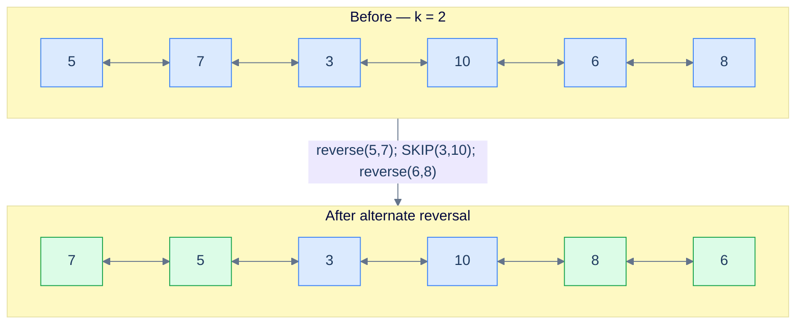

<p align="center"><strong>Reverse alternate segments — green = reversed, plain = skipped. The flag toggles every iteration.</strong></p>

## Applying the Diagnostic Questions

| Question | Answer |
|---|---|
| **Q1.** Can the problem be broken into smaller subproblems? | **Yes** — `length / k` segments, each either reversed or skipped |
| **Q2.** Can each "reverse" subproblem be solved by reversing a part? | **Yes** — same `reverse(start, end)`; "skip" is just a pointer hop |

### Q1 — Why "each segment is reverse-or-skip"?

Mental model: imagine alternating coloured tiles — odd tiles get flipped, even tiles stay. The grid is still defined by the same `length / k` formula; the only new state is "is this an odd or even tile?", tracked by a boolean.

Concrete numbers: `length = 6, k = 2 → 3 segments`. Iter 1: reverse `(5,7)`. Iter 2: skip `(3,10)`. Iter 3: reverse `(6,8)`. Three segments, two reversed, one skipped.

What breaks if the flag isn't toggled: the function reduces to plain `reverseKSegments` (every segment reversed) — wrong output.

### Q2 — Why "skip is a pointer hop"?

Mental model: when we reverse, `start` becomes the segment's *tail*, so `start.next` lands on the next group. When we skip, `start` is still the segment's *head*; we need to walk all the way past `end` ourselves, *then* one more step. That's `start = end.next` (or equivalently, set `start = end` then `start = start.next`).

Concrete numbers: skipping `(3, 10)` with `start = node(3), end = node(10)` → after the skip, `start = node(10).next = node(6)` — the head of the next group.

What breaks if you advance like the reverse case (`start = start.next`) without first moving `start` to `end`: you'd land on the second node of the just-skipped segment instead of past it. The next iteration would slice the list mid-segment and produce garbage.

> *Friction prompt — before reading on:* what's the answer for `head = [1, 2, 3, 4], k = 2` if you toggle the flag wrong (skip first, then reverse)? Predict the output.
>
> Answer: skip `(1, 2)` → list still `[1, 2, 3, 4]`. Reverse `(3, 4)` → `[1, 2, 4, 3]`. Different from "reverse first, skip second" which would give `[2, 1, 3, 4]`. The starting flag value matters — the spec says reverse first.

## The Alternating Strategy (Visualised)

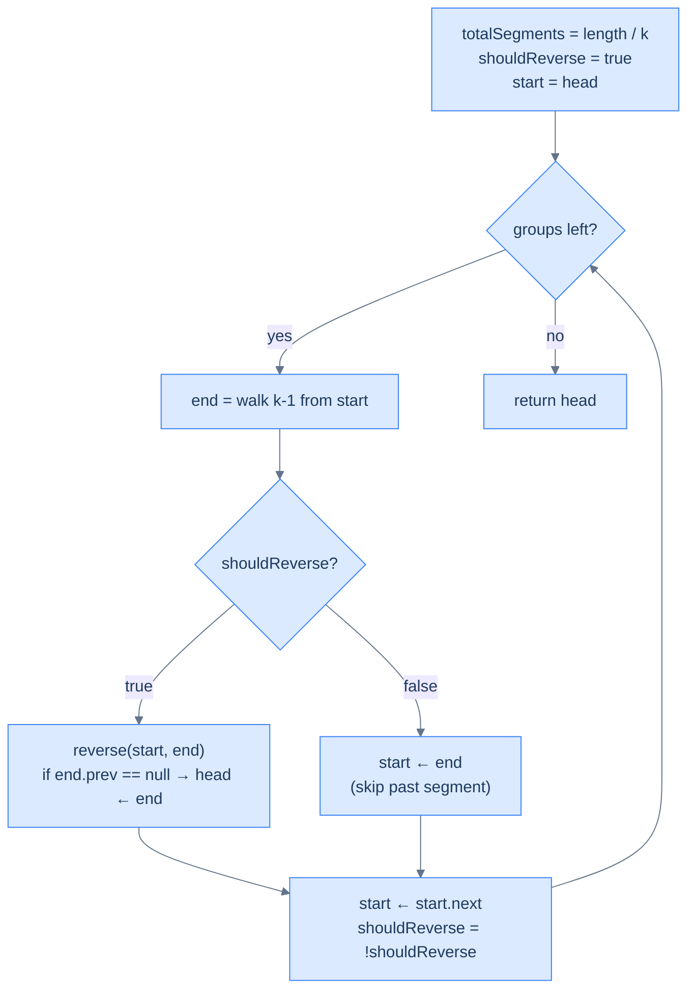

<p align="center"><strong>The Alternating Strategy — the only branch is "reverse vs skip". Both paths end in the same advance-and-toggle.</strong></p>

## The Solution

```python run
from typing import Optional

class Solution:
    def find_length(self, head):
        n = 0
        while head: n += 1; head = head.next
        return n

    def get_node_at_position(self, head, position):
        cur = head
        for _ in range(1, position):
            if cur is None: break
            cur = cur.next
        return cur

    def reverse(self, start, end):
        if start is None or start == end: return
        lb, rb = start.prev, (end.next if end else None)
        cur = start
        while cur != rb:
            nxt = cur.next
            cur.prev, cur.next = cur.next, cur.prev
            cur = nxt
        start.next = rb
        if rb: rb.prev = start
        end.prev = lb
        if lb: lb.next = end

    def reverse_alternate_segments(self, head, k):
        if head is None or head.next is None or k == 1:
            return head
        should_reverse = True                       # First segment IS reversed
        start = head
        total_segments = self.find_length(head) // k
        for _ in range(total_segments):
            end = self.get_node_at_position(start, k)
            if should_reverse:
                self.reverse(start, end)
                if end and end.prev is None:        # First reversed segment owns head
                    head = end
            else:
                start = end                         # Walk past the skipped segment
            start = start.next                      # Advance one node into next group
            should_reverse = not should_reverse     # Toggle for next iter
        return head
```

```java run
class Solution {
    public int findLength(ListNode h) { int n = 0; while (h != null) { n++; h = h.next; } return n; }
    public ListNode getNodeAtPosition(ListNode h, int p) {
        ListNode c = h; for (int i = 1; i < p; i++) c = c.next; return c;
    }
    public void reverse(ListNode start, ListNode end) {
        if (start == null || start == end) return;
        ListNode lb = start.prev, rb = end.next, cur = start;
        while (cur != rb) {
            ListNode nxt = cur.next, tmp = cur.prev;
            cur.prev = cur.next; cur.next = tmp; cur = nxt;
        }
        start.next = rb; if (rb != null) rb.prev = start;
        end.prev   = lb; if (lb != null) lb.next  = end;
    }
    public ListNode reverseAlternateSegments(ListNode head, int k) {
        if (head == null || head.next == null || k == 1) return head;
        boolean shouldReverse = true;                  // First segment IS reversed
        ListNode start = head;
        int total = findLength(head) / k;
        for (int i = 0; i < total; i++) {
            ListNode end = getNodeAtPosition(start, k);
            if (shouldReverse) {
                reverse(start, end);
                if (end.prev == null) head = end;       // First reversed segment owns head
            } else {
                start = end;                            // Skip past the segment
            }
            start = start.next;                         // Advance to next group's head
            shouldReverse = !shouldReverse;             // Toggle
        }
        return head;
    }
}
```

```c run
ListNode* reverseAlternateSegments(ListNode *head, int k) {
    if (!head || !head->next || k == 1) return head;
    int shouldReverse = 1;                /* First segment IS reversed */
    ListNode *start = head;
    int total = findLength(head) / k;
    for (int i = 0; i < total; i++) {
        ListNode *end = getNodeAtPosition(start, k);
        if (shouldReverse) {
            reverse(start, end);
            if (end->prev == NULL) head = end;
        } else {
            start = end;                  /* Skip past the segment */
        }
        start = start->next;
        shouldReverse = !shouldReverse;
    }
    return head;
}
```

```cpp run
class Solution {
public:
    int findLength(ListNode *h) { int n = 0; while (h) { n++; h = h->next; } return n; }
    ListNode *getNodeAtPosition(ListNode *h, int p) {
        ListNode *c = h; for (int i = 1; i < p; ++i) c = c->next; return c;
    }
    void reverse(ListNode *start, ListNode *end) {
        if (!start || start == end) return;
        ListNode *lb = start->prev, *rb = end->next, *cur = start;
        while (cur != rb) {
            ListNode *nxt = cur->next;
            std::swap(cur->prev, cur->next);
            cur = nxt;
        }
        start->next = rb; if (rb) rb->prev = start;
        end->prev   = lb; if (lb) lb->next  = end;
    }
    ListNode *reverseAlternateSegments(ListNode *head, int k) {
        if (!head || !head->next || k == 1) return head;
        bool shouldReverse = true;                       // First segment IS reversed
        ListNode *start = head;
        int total = findLength(head) / k;
        for (int i = 0; i < total; i++) {
            ListNode *end = getNodeAtPosition(start, k);
            if (shouldReverse) {
                reverse(start, end);
                if (end->prev == nullptr) head = end;
            } else {
                start = end;                              // Skip past the segment
            }
            start = start->next;
            shouldReverse = !shouldReverse;
        }
        return head;
    }
};
```

```scala run
class Solution {
  // Helpers same as previous problems — omitted for brevity, included in real impl.
  def findLength(head: ListNode): Int = {
    var n = 0; var h = head
    while (h != null) { n += 1; h = h.next }; n
  }
  def getNodeAtPosition(head: ListNode, p: Int): ListNode = {
    var c = head; for (_ <- 1 until p) c = c.next; c
  }
  def reverse(start: ListNode, end: ListNode): Unit = {
    if (start == null || start == end) return
    val lb = start.prev; val rb = end.next
    var cur = start
    while (cur != rb) {
      val nxt = cur.next; val tmp = cur.prev
      cur.prev = cur.next; cur.next = tmp; cur = nxt
    }
    start.next = rb; if (rb != null) rb.prev = start
    end.prev   = lb; if (lb != null) lb.next  = end
  }
  def reverseAlternateSegments(head: ListNode, k: Int): ListNode = {
    if (head == null || head.next == null || k == 1) return head
    var h = head; var start = head
    var shouldReverse = true                              // First segment IS reversed
    val total = findLength(head) / k
    for (_ <- 0 until total) {
      val end = getNodeAtPosition(start, k)
      if (shouldReverse) {
        reverse(start, end)
        if (end.prev == null) h = end
      } else {
        start = end                                       // Skip past
      }
      start = start.next
      shouldReverse = !shouldReverse
    }
    h
  }
}
```

```javascript run
class Solution {
    findLength(h) { let n = 0; while (h) { n++; h = h.next; } return n; }
    getNodeAtPosition(h, p) { let c = h; for (let i = 1; i < p; i++) c = c.next; return c; }
    reverse(start, end) {
        if (start === null || start === end) return;
        let lb = start.prev, rb = end.next, cur = start;
        while (cur !== rb) {
            const nxt = cur.next;
            [cur.prev, cur.next] = [cur.next, cur.prev];
            cur = nxt;
        }
        start.next = rb; if (rb) rb.prev = start;
        end.prev   = lb; if (lb) lb.next  = end;
    }
    reverseAlternateSegments(head, k) {
        if (head === null || head.next === null || k === 1) return head;
        let shouldReverse = true;                        // First segment IS reversed
        let start = head;
        const total = Math.floor(this.findLength(head) / k);
        for (let i = 0; i < total; i++) {
            const end = this.getNodeAtPosition(start, k);
            if (shouldReverse) {
                this.reverse(start, end);
                if (end.prev === null) head = end;
            } else {
                start = end;                              // Skip past
            }
            start = start.next;
            shouldReverse = !shouldReverse;
        }
        return head;
    }
}
```

```typescript run
class Solution {
    findLength(h: ListNode | null): number { let n = 0; while (h) { n++; h = h.next; } return n; }
    getNodeAtPosition(h: ListNode | null, p: number): ListNode | null {
        let c = h; for (let i = 1; i < p; i++) c = c!.next; return c;
    }
    reverse(start: ListNode | null, end: ListNode | null): void {
        if (start === null || start === end) return;
        const lb = start.prev, rb = end!.next;
        let cur: ListNode | null = start;
        while (cur !== rb) {
            const nxt: ListNode | null = cur!.next;
            [cur!.prev, cur!.next] = [cur!.next, cur!.prev];
            cur = nxt;
        }
        start.next = rb; if (rb) rb.prev = start;
        end!.prev  = lb; if (lb) lb.next  = end;
    }
    reverseAlternateSegments(head: ListNode | null, k: number): ListNode | null {
        if (head === null || head.next === null || k === 1) return head;
        let shouldReverse = true;
        let start: ListNode | null = head;
        const total = Math.floor(this.findLength(head) / k);
        for (let i = 0; i < total; i++) {
            const end = this.getNodeAtPosition(start, k);
            if (shouldReverse) {
                this.reverse(start, end);
                if (end !== null && end.prev === null) head = end;
            } else {
                start = end;
            }
            start = start!.next;
            shouldReverse = !shouldReverse;
        }
        return head;
    }
}
```

```go run
func reverseAlternateSegments(head *ListNode, k int) *ListNode {
    if head == nil || head.Next == nil || k == 1 { return head }
    shouldReverse := true
    start := head
    total := findLength(head) / k
    for i := 0; i < total; i++ {
        end := getNodeAtPosition(start, k)
        if shouldReverse {
            reverse(start, end)
            if end.Prev == nil { head = end }
        } else {
            start = end                       // Skip past
        }
        start = start.Next
        shouldReverse = !shouldReverse
    }
    return head
}
```

```kotlin run
class Solution {
    fun reverseAlternateSegments(head: ListNode?, k: Int): ListNode? {
        if (head == null || head.next == null || k == 1) return head
        var h = head; var start: ListNode? = head
        var shouldReverse = true
        val total = findLength(head) / k
        for (i in 0 until total) {
            val end = getNodeAtPosition(start, k)
            if (shouldReverse) {
                reverse(start, end)
                if (end?.prev == null) h = end
            } else {
                start = end
            }
            start = start?.next
            shouldReverse = !shouldReverse
        }
        return h
    }
    fun findLength(head: ListNode?): Int { var n = 0; var h = head; while (h != null) { n++; h = h.next }; return n }
    fun getNodeAtPosition(head: ListNode?, p: Int): ListNode? { var c = head; for (i in 1 until p) c = c?.next; return c }
    fun reverse(start: ListNode?, end: ListNode?) {
        if (start == null || start == end) return
        val lb = start.prev; val rb = end?.next
        var cur: ListNode? = start
        while (cur != rb) {
            val nxt = cur?.next; val tmp = cur?.prev
            cur?.prev = cur?.next; cur?.next = tmp; cur = nxt
        }
        start.next = rb; if (rb != null) rb.prev = start
        end?.prev = lb; if (lb != null) lb.next  = end
    }
}
```

```rust run
// See lesson 09 for a complete Rc<RefCell<...>> implementation.
// Algorithm: like reverse_k_segments, but with a `should_reverse` boolean toggled each
// iteration. On the "skip" iteration, advance start past `end` (start = end), then one
// more node. On the "reverse" iteration, do the standard reverse + head promotion.
fn reverse_alternate_segments() { /* see lesson 09 */ }
```


<details>
<summary><strong>Trace — head = [5, 7, 3, 10, 6, 8], k = 2</strong></summary>

```
length = 6, total = 6 / 2 = 3, shouldReverse = true, start = node(5)

Iter 1 │ shouldReverse = true. end = node(7) → reverse(5, 7)
        │ list: 7 ↔ 5 ↔ 3 ↔ 10 ↔ 6 ↔ 8
        │ end.prev == null → head = node(7)
        │ start ← start.next = node(3);  shouldReverse = false

Iter 2 │ shouldReverse = false. end = node(10) → SKIP
        │ start ← end = node(10);  start ← start.next = node(6)
        │ list unchanged. shouldReverse = true

Iter 3 │ shouldReverse = true. end = node(8) → reverse(6, 8)
        │ list: 7 ↔ 5 ↔ 3 ↔ 10 ↔ 8 ↔ 6
        │ end.prev = node(10) → head unchanged
        │ start ← start.next = null;  shouldReverse = false

Result: [7, 5, 3, 10, 8, 6] ✓
```

This trace highlights the key asymmetry: on a reversed segment, `start` is now the tail, so a single `start = start.next` advances. On a skipped segment, `start` is still the head, so we first jump it to `end` and then take one more step.

</details>

## Complexity Analysis

| Resource | Cost | Why |
|---|---|---|
| Time | **O(N)** | One length scan + each node touched at most twice (once by walker, once by reverse) |
| Space | **O(1)** | Constant working set |

## Edge Cases

| Case | Example | Expected | Reasoning |
|---|---|---|---|
| `k == 1` | `[1, 2, 3], k=1` | `[1, 2, 3]` | Each "group" is one node; reverse-or-skip is identical for both |
| `k > length` | `[1,2,3,4,5], k=8` | unchanged | `total = 0`; loop doesn't run |
| Length not multiple of `k` | `[5,7,3,10,6], k=3` | `[3,7,5,10,6]` | One reversal, then `length` runs out before the skip can fire |
| Even number of segments | `[1,2,3,4], k=2` | `[2,1,3,4]` | reverse, skip — final list has the second pair untouched |
| Odd number of segments | `[1,2,3,4,5,6], k=2` | `[2,1,3,4,6,5]` | reverse, skip, reverse — flag finishes at `false` |

***

## Final Takeaway

The reversal-subproblem family looks intimidating from the outside — pairwise swap, k-segment reversal, increasing groups, alternate segments — and beginners write a different bespoke loop for each one. Don't. **They are the same algorithm with one knob turned.** Find the length, decide the window (`k = 2`, fixed `k`, growing `k`, or alternating `k`-with-skip), and call `reverse(start, end)` in a loop. Track the new head with the `end.prev == null` trick. That's it. The hardest part isn't the code — it's *seeing the windowing pattern*. Once you see it, dozens of "medium" linked-list problems collapse into a half-page solution you can write from memory.

> **Transfer challenge:** given a doubly linked list and an integer `m`, reverse every block of size `2m`, but **only the second half of each block** (so the first `m` nodes of each `2m`-block stay put, the next `m` nodes get reversed). Return the new head. Stop reversing once fewer than `2m` nodes remain.
>
> <details>
> <summary><strong>Hint</strong></summary>
>
> It's the alternate-segments problem in disguise. Set the effective window size to `m` and start with `shouldReverse = false` (skip the first `m`, reverse the next `m`, repeat). The "skip first half" branch advances `start = end; start = start.next` exactly like the alternate-segments skip path. The reversed-half branch does the usual `reverse(start, end)` + head check — except the head can never change here because every reversed segment lives strictly to the right of an un-reversed one.
>
> </details>

Next time you see a linked-list problem whose statement contains the words "groups", "segments", "alternate", "every other", or "in pairs" — you won't reach for a bespoke loop. You'll reach for **scan, window, reverse, advance**, and you'll know which one of these four templates fits before you've finished reading the problem.
