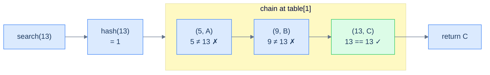
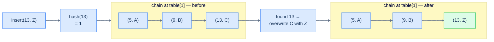
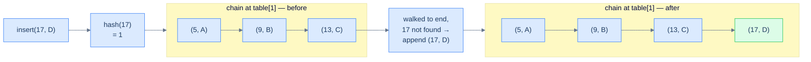
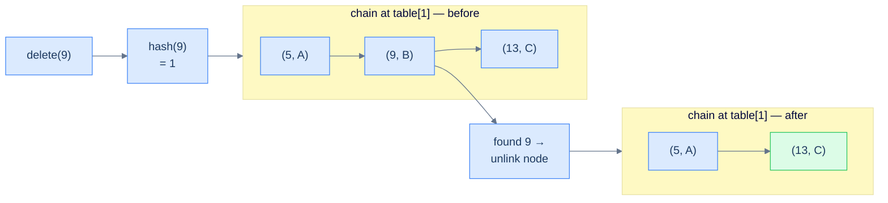
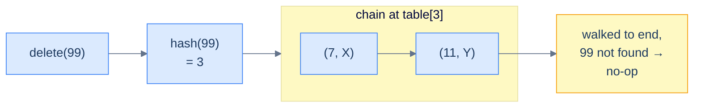

# 2. Separate Chaining

## The Hook

Two of your friends — Hari and Riya — book the *same hotel room* on the same date by accident. The hotel has only one room with that number. What do you do? You don't tear up one of the bookings; you don't pretend the second person doesn't exist. You **add another bed** to the room and let them share it. The room number stays the same; the *capacity* grows on demand.

That, in one sentence, is the soul of **separate chaining**: when two keys collide on the same array slot, don't fight over the slot — extend it. Each "slot" stops being a single seat and becomes a **chain** that can grow as long as it needs to. The hash function still routes you to the right slot in O(1); a tiny linked list inside the slot then mops up whatever fraction of the collision storm landed there.

This is the *most intuitive* way to resolve collisions, the one used inside Java's `HashMap`, Python's `dict` (until very recently — modern CPython uses open addressing, but the conceptual model is still chain-style for teaching), and most language standard libraries. Master it well and you'll have a tool that works under almost any load and never *runs out of slots* — but with a few sharp tradeoffs that we will surface, exploit, and stress-test before the lesson ends.

---

## Table of contents

1. [Introduction to separate chaining](#introduction-to-separate-chaining)
2. [Key components of separate chaining](#key-components-of-separate-chaining)
3. [Implementing the hash table class](#implementing-the-hash-table-class)
4. [Search operation in separate chaining](#search-operation-in-separate-chaining)
5. [Insert operation in separate chaining](#insert-operation-in-separate-chaining)
6. [Delete operation in separate chaining](#delete-operation-in-separate-chaining)
7. [Design a hash table with separate chaining](#design-a-hash-table-with-separate-chaining)

***

# Introduction to separate chaining

Now that we know what a hash table is and the operations it supports, we can dive deeper into how hash tables actually deal with collisions. **Separate chaining** is one of the two great families of collision resolution. The name says it all: when keys collide, we don't try to relocate them — we let them sit at the *same* slot, "separated" only by the order in which they were inserted, all chained together inside that slot.

Concretely: the internal array is no longer an array of `(key, value)` cells. It's an array of **chains** — small, growable containers that can hold many records at the same index. All keys whose hashes collide on index `i` get appended to the chain at `table[i]`. Looking up a key is now a two-stage process: hash to the index, then walk the chain at that index until you find the key (or run out of chain).

```d2
direction: right

tbl: Internal array — each slot is a chain {
  i0: "[0]"
  c00: "('Karan', 4)"
  i1: "[1]" {style.fill: "#fef9c3"; style.stroke: "#d97706"}
  c10: "('Hari', 7)" {style.fill: "#dbeafe"; style.stroke: "#3b82f6"}
  c11: "('Riya', 12)" {style.fill: "#dbeafe"; style.stroke: "#3b82f6"}
  c12: "('Anmol', 19)" {style.fill: "#dbeafe"; style.stroke: "#3b82f6"}
  i2: "[2]"
  e2: "(empty)"
  i3: "[3]"
  c30: "('Neha', 23)"
  c31: "('Karan', 4)"

  i0 -> c00
  i1 -> c10 -> c11 -> c12
  i2 -> e2
  i3 -> c30 -> c31
}
```

<p align="center"><strong>Logical view of separate chaining — every slot is a chain (a small linked list). Index 1 has absorbed three colliding keys; index 2 sits empty; index 3 holds two. The array length never changes, but each slot is free to grow.</strong></p>

The chain itself can be anything that supports "add" and "walk through": a **doubly linked list**, a **dynamic array**, or even a **self-balancing BST** for adversarial workloads (Java 8+ does this once a chain exceeds eight nodes). In this course we'll use a doubly linked list — it's the most pedagogically clean choice and connects directly to what you just learned in the doubly-linked-list section.

> **Aliases worth knowing:** Separate chaining is sometimes called **closed addressing** or **open hashing**. The terminology is unfortunate — the "closed" and "open" descriptors point in *opposite* directions across hashing literature. Just remember the structural property: **the address (slot) is closed (fixed by the hash); the bucket (chain at that address) is open (grows on demand).** The opposite scheme — open addressing — is what we'll meet in the next lesson.

## Advantages

The separate chaining implementation is the most intuitive collision resolution scheme, and it has three properties that make it the safe default:

> -   **Easy to implement:** The mental model is exactly "array of mini-lists." Insertion, deletion, and search are direct adaptations of linked-list operations you already know.
> -   **No size ceiling:** The array's *length* is fixed, but the chains inside the slots can grow without bound. The hash table never runs out of room as long as memory holds.
> -   **Localised collisions:** A pile-up at slot `i` does not affect slots `j` or `k`. Pathological keys all colliding into one bucket leave the rest of the table fast and unaffected.

## Limitations

Three properties cut the other way:

> -   **Unbounded growth = OOM risk:** The same flexibility that lets the table absorb infinite collisions also lets a runaway insert loop balloon memory until the process dies.
> -   **Memory overhead per node:** Every chain entry is a linked-list node, so each record carries the cost of `prev` and `next` pointers (16 extra bytes per node on 64-bit systems) on top of the actual `(key, value)` payload.
> -   **Cache misses everywhere:** Linked-list nodes live at unrelated memory addresses. Walking a chain bounces all over RAM, so the CPU's locality-of-reference advantage — the trick that makes arrays brutally fast in practice — is lost. Open addressing will exploit exactly this gap.

> *Predict before reading on — if I told you the average chain length in a well-tuned hash table is roughly **1.0** (one record per chain), what does that imply about insert and search time complexity? And what happens if I stuff 1,000 keys into a table of size 4?*

***

# Key components of separate chaining

The separate-chaining hash table has three components welded together: a record type for the payload, an internal array of chains, and a hash function that routes keys to chain indices. Let's build each piece in isolation before assembling the full class.

## Record

A **record** is the unit stored inside a chain — the actual `(key, value)` pair the user cares about. Wrapping it in its own type keeps the chain code clean (the chain stores `Record` objects rather than juggling parallel arrays) and lets us extend the record later (e.g. add timestamps, hit counters) without touching the rest of the table.

```d2
direction: right

rec: Record {
  k: |md
    key

    (int)
  |
  v: |md
    value

    (int)
  |
}

node: Doubly-linked-list node holding a record {
  p: prev
  val: "val: Record"
  n: next
}

rec -> node.val: stored inside
```

<p align="center"><strong>The record is the payload, the chain node is the container — every node in the chain holds one record alongside its <code>prev</code> and <code>next</code> pointers.</strong></p>


```pseudocode
class Record:
    key: integer
    value: integer
```

```python run
# Each chain entry is a (key, value) pair. We use a small dataclass-style class
# instead of a raw tuple so the chain code reads cleanly: entry.key, entry.value.
class Record:
    def __init__(self, key: int, value: int):
        self.key   = key      # The lookup key
        self.value = value    # The mapped value

# Demo
r = Record(1, 99)
print(r.key, r.value)   # 1 99
```

```java run
public class Main {
    // Record encapsulates the (key, value) pair stored in each chain node.
    static class Record {
        int key;
        int value;
        Record(int key, int value) {
            this.key   = key;
            this.value = value;
        }
    }

    public static void main(String[] args) {
        Record r = new Record(1, 99);
        System.out.println(r.key + " " + r.value);   // 1 99
    }
}
```

```c run
#include <stdio.h>
#include <stdlib.h>

// Record stored inside each chain node.
typedef struct {
    int key;
    int value;
} Record;

// Doubly linked list node holding one record.
typedef struct ListNode {
    Record val;
    struct ListNode *prev;
    struct ListNode *next;
} ListNode;

int main() {
    Record r = { .key = 1, .value = 99 };
    printf("%d %d\n", r.key, r.value);   // 1 99
    return 0;
}
```

```cpp run
#include <iostream>

// Record stored in each chain entry.
struct Record {
    int key;
    int value;
    Record() = default;
    Record(int key, int value) : key(key), value(value) {}
};

int main() {
    Record r(1, 99);
    std::cout << r.key << " " << r.value << "\n";   // 1 99
}
```

```scala run
// Record is the unit of storage inside each chain.
case class Record(key: Int, var value: Int)

object Main extends App {
  val r = Record(1, 99)
  println(s"${r.key} ${r.value}")   // 1 99
}
```

```typescript run
class Record {
    key:   number;
    value: number;
    constructor(key: number, value: number) {
        this.key   = key;
        this.value = value;
    }
}

const r = new Record(1, 99);
console.log(r.key, r.value);   // 1 99
```

```go run
package main

import "fmt"

// Record encapsulates the (key, value) pair stored in each chain node.
type Record struct {
    Key   int
    Value int
}

func main() {
    r := Record{Key: 1, Value: 99}
    fmt.Println(r.Key, r.Value)   // 1 99
}
```

```rust run
// Record encapsulates a (key, value) entry inside the chain.
#[derive(Clone, Debug)]
struct Record {
    key:   i32,
    value: i32,
}

fn main() {
    let r = Record { key: 1, value: 99 };
    println!("{} {}", r.key, r.value);   // 1 99
}
```


## Internal array

The internal array of a separate-chaining hash table is **an array of chains**. Each cell of the array holds an entire (initially empty) chain. The hash value of a key picks a cell; the chain at that cell stores all records whose keys hash to it.

```d2
direction: right

empty: Empty hash table — capacity 4 {
  e0: "[0]"
  h0: "(empty chain)"
  e1: "[1]"
  h1: "(empty chain)"
  e2: "[2]"
  h2: "(empty chain)"
  e3: "[3]"
  h3: "(empty chain)"

  e0 -> h0
  e1 -> h1
  e2 -> h2
  e3 -> h3
}
```

<p align="center"><strong>An empty separate-chaining hash table — every slot starts as an empty chain. The array's length never changes after construction.</strong></p>

When we insert into the table, the chain at the hashed index grows. The next diagram shows the same table after a series of inserts that produce two collisions (slot 1 collects three records, slot 3 collects two).

```d2
direction: right

populated: "After inserts — chains have grown at colliding slots" {
  e0: "[0]"
  h0: "(empty)"
  e1: "[1]"
  r1: "(5, A)" {style.fill: "#dbeafe"; style.stroke: "#3b82f6"}
  r2: "(9, B)" {style.fill: "#dbeafe"; style.stroke: "#3b82f6"}
  r3: "(13, C)" {style.fill: "#dbeafe"; style.stroke: "#3b82f6"}
  e2: "[2]"
  h2: "(empty)"
  e3: "[3]"
  r4: "(7, D)" {style.fill: "#dbeafe"; style.stroke: "#3b82f6"}
  r5: "(11, E)" {style.fill: "#dbeafe"; style.stroke: "#3b82f6"}

  e0 -> h0
  e1 -> r1 -> r2 -> r3
  e2 -> h2
  e3 -> r4 -> r5
}
```

<p align="center"><strong>The same table after five inserts (capacity = 4, hash = key mod 4) — keys 5, 9, 13 all hash to 1; keys 7, 11 both hash to 3. Notice that the array's length is unchanged; the table simply absorbs collisions by extending the affected chains.</strong></p>

In this course, the chain inside each slot is a **doubly linked list**. To keep the lessons focused on hashing rather than on re-implementing a linked list, we use the standard library's linked-list type wherever the language provides one. (You already built one in the previous section — feel free to swap in your own version once the table works.)

## Hash function

The hash function maps a key to a valid array index. Throughout this section we'll use the simplest possible function — `key mod capacity` — so we can focus all our attention on collision *handling*. A real-world hash table would replace this with a stronger function (the principles of which we covered in [Lesson 1](01-introduction-to-hash-tables.md#examples-of-hash-functions)).

```d2
direction: right

k: "key = 13"
hf: "hash (key mod 4)" {shape: oval}
h: "index = 1"
slot: |md
  table[1] —

  chain to walk
|

k -> hf -> h -> slot
```

<p align="center"><strong>The hash function reduces a key to a valid array index in O(1). For <code>capacity = 4</code> and <code>key = 13</code>, <code>13 mod 4 = 1</code>, so the search continues inside the chain at slot 1.</strong></p>

We'll fold the hash function directly into the hash-table class as a private method, since no caller of the table needs to know how the function is computed.

***

# Implementing the hash table class

Now we wrap everything — the record type, the array of chains, the hash function, and the public operations — into a single class. Encapsulation is what turns a pile of components into something a caller can use without thinking.

```d2
cls: MyHashTable class {
  priv: private (hidden internals) {
    cap: "capacity: int"
    tbl: "table: array of chains"
    hf: "hashFunction(key)"
  }
  pub: public (callable interface) {
    s: "search(key) -> value"
    i: "insert(key, value)"
    r: "remove(key)"
  }
  pub -> priv {style.stroke-dash: 3}
}
```

<p align="center"><strong>The hash-table class — public methods (the only things callers see) sit on top of the private internals (capacity, the array of chains, and the hash function). Encapsulation lets the implementation change later without breaking callers.</strong></p>

## Implementation

Below is the skeleton of the class — the constructor wires up an empty array of chains, but the three operations (`search`, `insert`, `remove`) are stubbed out. We'll fill them in over the next three sections.


```pseudocode
class MyHashTable:
    capacity: integer
    table: array of empty lists   # length = capacity

    function _hash(key): return key mod capacity
    function search(key): ...     # filled in next section
    function insert(key, value): ...
    function remove(key): ...
```

```python run
# Skeleton of the separate-chaining hash table.
# Each "chain" is a Python list of Record objects (idiomatic and runnable).
class Record:
    def __init__(self, key: int, value: int):
        self.key   = key
        self.value = value

class MyHashTable:
    def __init__(self, capacity: int):
        self.capacity = capacity                       # Number of array slots
        # One empty chain per slot; chains grow as collisions accumulate
        self.table    = [[] for _ in range(capacity)]

    def _hash(self, key: int) -> int:
        # Division-method hash — keep keys in the valid index range
        return key % self.capacity

    def search(self, key: int) -> int:
        pass    # filled in next section

    def insert(self, key: int, value: int) -> None:
        pass    # filled in next section

    def remove(self, key: int) -> None:
        pass    # filled in next section

# Demo — instantiate and inspect
h = MyHashTable(4)
print(len(h.table))    # 4 empty chains
```

```java run
import java.util.*;

public class Main {
    static class Record {
        int key;
        int value;
        Record(int key, int value) { this.key = key; this.value = value; }
    }

    static class MyHashTable {
        private final int                       capacity;
        private final List<LinkedList<Record>>  table;     // Array of chains

        MyHashTable(int capacity) {
            this.capacity = capacity;
            this.table    = new ArrayList<>(capacity);
            // Pre-create one empty chain per slot
            for (int i = 0; i < capacity; i++) table.add(new LinkedList<>());
        }

        private int hash(int key) { return key % capacity; }   // Division method

        int  search(int key)              { return -1; }     // filled in next section
        void insert(int key, int value)   {            }     // filled in next section
        void remove(int key)              {            }     // filled in next section
    }

    public static void main(String[] args) {
        MyHashTable h = new MyHashTable(4);
        System.out.println("created table with capacity 4");
    }
}
```

```c run
#include <stdio.h>
#include <stdlib.h>

typedef struct Node {
    int key, value;
    struct Node *next;
} Node;

typedef struct {
    int    capacity;
    Node **table;       // Array of chain heads
} MyHashTable;

int hash_fn(MyHashTable *h, int key) { return key % h->capacity; }

MyHashTable* createTable(int capacity) {
    MyHashTable *h = malloc(sizeof(MyHashTable));
    h->capacity = capacity;
    h->table    = calloc(capacity, sizeof(Node*));   // All chain heads start NULL
    return h;
}

int  search_op(MyHashTable *h, int key)              { return -1; }
void insert_op(MyHashTable *h, int key, int value)   {            }
void remove_op(MyHashTable *h, int key)              {            }

int main() {
    MyHashTable *h = createTable(4);
    printf("created table with capacity %d\n", h->capacity);
    free(h->table); free(h);
    return 0;
}
```

```cpp run
#include <iostream>
#include <list>
#include <vector>

struct Record {
    int key;
    int value;
    Record() = default;
    Record(int key, int value) : key(key), value(value) {}
};

class MyHashTable {
private:
    int                            capacity;
    std::vector<std::list<Record>> table;       // Array of chains

    int hash(int key) { return key % capacity; }

public:
    MyHashTable(int capacity) : capacity(capacity), table(capacity) {}

    int  search(int key)            { return -1; }
    void insert(int key, int value) {            }
    void remove(int key)            {            }
};

int main() {
    MyHashTable h(4);
    std::cout << "created table with capacity 4\n";
}
```

```scala run
import scala.collection.mutable.ListBuffer

case class Record(key: Int, var value: Int)

class MyHashTable(val capacity: Int) {
  // Each slot is a ListBuffer that grows on collision.
  private val table: Array[ListBuffer[Record]] =
    Array.fill(capacity)(ListBuffer.empty[Record])

  private def hash(key: Int): Int = key % capacity

  def search(key: Int):  Int  = -1
  def insert(key: Int, value: Int): Unit = ()
  def remove(key: Int):  Unit = ()
}

object Main extends App {
  val h = new MyHashTable(4)
  println("created table with capacity 4")
}
```

```typescript run
class Record {
    key:   number;
    value: number;
    constructor(key: number, value: number) { this.key = key; this.value = value; }
}

class MyHashTable {
    private capacity: number;
    private table:    Record[][];     // Array of chains

    constructor(capacity: number) {
        this.capacity = capacity;
        this.table    = Array.from({ length: capacity }, () => [] as Record[]);
    }
    private hash(key: number): number { return key % this.capacity; }

    search(key: number):                 number { return -1; }
    insert(key: number, value: number):  void   {            }
    remove(key: number):                 void   {            }
}

const h = new MyHashTable(4);
console.log("created table with capacity 4");
```

```go run
package main

import "fmt"

type Record struct {
    Key   int
    Value int
}

type MyHashTable struct {
    capacity int
    table    [][]Record       // Array of chains
}

func newTable(capacity int) *MyHashTable {
    return &MyHashTable{
        capacity: capacity,
        table:    make([][]Record, capacity),
    }
}

func (h *MyHashTable) hash(key int) int { return key % h.capacity }

func (h *MyHashTable) Search(key int) int                 { return -1 }
func (h *MyHashTable) Insert(key int, value int)          {           }
func (h *MyHashTable) Remove(key int)                     {           }

func main() {
    h := newTable(4)
    fmt.Printf("created table with capacity %d\n", h.capacity)
}
```

```rust run
#[derive(Clone, Debug)]
struct Record { key: i32, value: i32 }

struct MyHashTable {
    capacity: usize,
    table:    Vec<Vec<Record>>,    // Each slot is a Vec acting as the chain
}

impl MyHashTable {
    fn new(capacity: usize) -> Self {
        MyHashTable { capacity, table: vec![Vec::new(); capacity] }
    }
    fn hash(&self, key: i32) -> usize { (key as usize) % self.capacity }

    fn search(&self,     _key: i32)           -> i32  { -1 }
    fn insert(&mut self, _key: i32, _val: i32)        {    }
    fn remove(&mut self, _key: i32)                   {    }
}

fn main() {
    let h = MyHashTable::new(4);
    println!("created table with capacity {}", h.capacity);
}
```


## Using the hash table class

Once the class is defined, callers don't see records, chains, or hash functions. They see three methods: `insert`, `search`, `remove`. The internals can change tomorrow — different chain type, different hash function, different growth policy — and no caller code needs to be touched. This is the discipline that separates a one-off script from a reusable data structure.

```d2
direction: right

user: caller code

api: MyHashTable public API {
  i: insert
  s: search
  r: remove
}

internals: |md
  private internals:

  hash function +

  array of chains
|

user -> api.i: "insert(1, 100)"
user -> api.s: "search(1)"
user -> api.r: "remove(1)"
api -> internals: delegates to {style.stroke-dash: 3}
```

<p align="center"><strong>Encapsulation in action — the caller talks to the public API; the API talks to the private internals. The wall between them is what lets the implementation evolve independently.</strong></p>

With the skeleton in place, we'll now fill in the three operations one at a time — search first (because it's the simplest), then insert (which builds on search), then delete (which builds on both).

***

# Search operation in separate chaining

The search operation is the heartbeat of a hash table. Every other operation either *is* a search (lookup) or *contains* a search (insert and delete both walk the chain to find the key first). Get search right, and the rest falls into place.

## Algorithm

The recipe is two clean steps, plus a careful walk:

1. **Hash the key** to compute its chain's index in the internal array.
2. **Walk the chain** at that index. Compare each record's key to the search key.
3. **Return the value** if a match is found, or a sentinel (`-1`) if the chain is exhausted without a match.



<p align="center"><strong>Search flow — the hash function picks the chain, then the walk inside the chain finds the matching record. If the chain runs out before a match, the operation returns the "not found" sentinel.</strong></p>

> **Algorithm**
>
> -   **Step 1:** Calculate the index (hash code) for the given key.
> -   **Step 2:** Search for the key by walking the chain at the calculated index.
> -   **Step 3:** If the key is found, return its value. Otherwise, return `-1`.

## Implementation


```pseudocode
function search(key):
    index ← _hash(key)
    for entry in table[index]:
        if entry.key = key: return entry.value
    return -1
```

```python run
class Record:
    def __init__(self, key, value):
        self.key, self.value = key, value

class MyHashTable:
    def __init__(self, capacity):
        self.capacity = capacity
        self.table    = [[] for _ in range(capacity)]

    def _hash(self, key):
        return key % self.capacity      # Division-method hash

    def search(self, key):
        index = self._hash(key)         # Step 1: route to the chain
        # Step 2: linear walk through the chain
        for entry in self.table[index]:
            if entry.key == key:        # Match — return the stored value
                return entry.value
        return -1                       # Step 3: chain exhausted, key absent

# Demo — empty table, lookup misses
h = MyHashTable(4)
print(h.search(7))                      # -1
```

```java run
import java.util.*;

public class Main {
    static class Record { int key, value; Record(int k, int v){key=k;value=v;} }

    static class MyHashTable {
        private final int                      capacity;
        private final List<LinkedList<Record>> table;

        MyHashTable(int capacity) {
            this.capacity = capacity;
            this.table    = new ArrayList<>(capacity);
            for (int i = 0; i < capacity; i++) table.add(new LinkedList<>());
        }
        private int hash(int key) { return key % capacity; }

        int search(int key) {
            int index = hash(key);                    // Step 1
            for (Record entry : table.get(index)) {   // Step 2: walk the chain
                if (entry.key == key) return entry.value;
            }
            return -1;                                // Step 3: not found
        }
    }

    public static void main(String[] args) {
        MyHashTable h = new MyHashTable(4);
        System.out.println(h.search(7));   // -1
    }
}
```

```c run
#include <stdio.h>
#include <stdlib.h>

typedef struct Node {
    int key, value;
    struct Node *next;
} Node;

typedef struct { int capacity; Node **table; } MyHashTable;

int hash_fn(MyHashTable *h, int key) { return key % h->capacity; }

int search_op(MyHashTable *h, int key) {
    int index  = hash_fn(h, key);             // Step 1
    Node *cur  = h->table[index];
    while (cur) {                             // Step 2: walk the chain
        if (cur->key == key) return cur->value;
        cur = cur->next;
    }
    return -1;                                // Step 3: not found
}

int main() {
    MyHashTable h = { .capacity = 4, .table = calloc(4, sizeof(Node*)) };
    printf("%d\n", search_op(&h, 7));          // -1
    free(h.table);
    return 0;
}
```

```cpp run
#include <iostream>
#include <list>
#include <vector>

struct Record { int key, value; Record() = default; Record(int k, int v):key(k),value(v){} };

class MyHashTable {
    int                            capacity;
    std::vector<std::list<Record>> table;
    int hash(int key) { return key % capacity; }

public:
    MyHashTable(int cap) : capacity(cap), table(cap) {}

    int search(int key) {
        int index = hash(key);                  // Step 1
        for (auto &entry : table[index]) {      // Step 2: walk the chain
            if (entry.key == key) return entry.value;
        }
        return -1;                              // Step 3
    }
};

int main() {
    MyHashTable h(4);
    std::cout << h.search(7) << "\n";   // -1
}
```

```scala run
import scala.collection.mutable.ListBuffer

case class Record(key: Int, var value: Int)

class MyHashTable(val capacity: Int) {
  private val table: Array[ListBuffer[Record]] =
    Array.fill(capacity)(ListBuffer.empty[Record])

  private def hash(key: Int): Int = key % capacity

  def search(key: Int): Int = {
    val index = hash(key)                        // Step 1
    table(index).find(_.key == key)              // Step 2: walk the chain
                .map(_.value).getOrElse(-1)      // Step 3: -1 if not found
  }
}

object Main extends App {
  val h = new MyHashTable(4)
  println(h.search(7))   // -1
}
```

```typescript run
class Record {
    constructor(public key: number, public value: number) {}
}

class MyHashTable {
    private capacity: number;
    private table:    Record[][];

    constructor(capacity: number) {
        this.capacity = capacity;
        this.table    = Array.from({ length: capacity }, () => [] as Record[]);
    }
    private hash(key: number): number { return key % this.capacity; }

    search(key: number): number {
        const index = this.hash(key);                  // Step 1
        for (const entry of this.table[index]) {       // Step 2
            if (entry.key === key) return entry.value;
        }
        return -1;                                     // Step 3
    }
}

const h = new MyHashTable(4);
console.log(h.search(7));   // -1
```

```go run
package main

import "fmt"

type Record struct{ Key, Value int }

type MyHashTable struct {
    capacity int
    table    [][]Record
}

func newTable(capacity int) *MyHashTable {
    return &MyHashTable{capacity: capacity, table: make([][]Record, capacity)}
}
func (h *MyHashTable) hash(key int) int { return key % h.capacity }

func (h *MyHashTable) Search(key int) int {
    index := h.hash(key)                          // Step 1
    for _, entry := range h.table[index] {        // Step 2
        if entry.Key == key {
            return entry.Value
        }
    }
    return -1                                     // Step 3
}

func main() {
    h := newTable(4)
    fmt.Println(h.Search(7))   // -1
}
```

```rust run
#[derive(Clone, Debug)]
struct Record { key: i32, value: i32 }

struct MyHashTable {
    capacity: usize,
    table:    Vec<Vec<Record>>,
}

impl MyHashTable {
    fn new(capacity: usize) -> Self {
        MyHashTable { capacity, table: vec![Vec::new(); capacity] }
    }
    fn hash(&self, key: i32) -> usize { (key as usize) % self.capacity }

    fn search(&self, key: i32) -> i32 {
        let index = self.hash(key);                        // Step 1
        for entry in &self.table[index] {                  // Step 2
            if entry.key == key { return entry.value; }
        }
        -1                                                 // Step 3
    }
}

fn main() {
    let h = MyHashTable::new(4);
    println!("{}", h.search(7));   // -1
}
```


## Complexity analysis

The hash function is O(1). The total cost of search is therefore the cost of the chain walk at the resulting index. That walk is what determines best, average, and worst case.

```d2
direction: right

best: Best case — chain length 1 {
  direction: right
  b0: "[0]"
  b1: "(k, v)"
  b0 -> b1
}

avg: Average case — well-distributed, chain length ~ 1 {
  direction: right
  a0: "[0]"
  a1: "(k, v)"
  a2: "[1]"
  a3: "(k, v)"
  a4: "[2]"
  a5: "(k, v)"
  a0 -> a1
  a2 -> a3
  a4 -> a5
}

worst: Worst case — every key collides into one chain {
  direction: right
  w0: "[0]"
  w1: "(k1)"
  w2: "(k2)"
  w3: "(k3)"
  w4: "...kN"
  w5: "[1]"
  we1: "(empty)"
  w6: "[2]"
  we2: "(empty)"
  w0 -> w1 -> w2 -> w3 -> w4
  w5 -> we1
  w6 -> we2
}
```

<p align="center"><strong>Search performance is governed by chain length — O(1) when chains are short, O(N) when every key collides into one chain. A good hash function keeps the average chain length close to 1.</strong></p>

The space cost is constant — a few local variables, no new data structures.

> **Best case** — no collision, chain has 0 or 1 nodes
>
> -   Time: **O(1)**
> -   Space: **O(1)**
>
> **Average case** — well-distributed hash values
>
> -   Time: **O(1)**
> -   Space: **O(1)**
>
> **Worst case** — every key collides at the same index
>
> -   Time: **O(N)**
> -   Space: **O(1)**

> *Predict before reading on — when we move to insert, we'll need to detect "key already exists" before adding a new record. Which existing operation does that detection look exactly like? (Yes, search. Insert is going to be search-with-an-extra-step.)*

***

# Insert operation in separate chaining

Insert stores a new `(key, value)` mapping. There's a subtle but important rule baked into the operation: if the key is *already* in the table, insert doesn't add a duplicate — it **updates** the existing value. This makes the hash table behave like a true dictionary, not a multiset.

## Algorithm

Insert is search with a twist: walk the chain looking for the key, then *act* depending on whether the search hit or missed.

### Case 1 — Key is present

If we find a record with the matching key, we don't add a new one — we just overwrite the existing record's `value` with the new value and return.



<p align="center"><strong>Insert when the key already exists — the chain length does not change; only the matching record's <code>value</code> is updated. This guarantees the table never holds two records with the same key.</strong></p>

> **Algorithm — case 1**
>
> -   **Step 1:** Calculate the index for the given key.
> -   **Step 2:** Walk the chain at the calculated index searching for the key.
> -   **Step 3:** If the key is found, update the value of the stored record.

### Case 2 — Key is not present

If we walk the entire chain without finding the key, we know definitively that this is a new mapping. Append a new record to the **end** of the chain.

**Why insert at the end and not the head?**

Two reasons. First, the search loop has already walked the chain to its end, so the tail pointer is essentially "in our hand" — appending is O(1) given a doubly linked list with a tail reference (or the implicit end of an array-backed bucket). Second, appending preserves insertion order, which is occasionally useful for debugging and for data structures that piggyback on the table (LRU caches, ordered dicts, etc.). Some implementations *do* prepend at the head, which is also O(1) — both are correct; the trade-off is between insertion order and the head-update cost.



<p align="center"><strong>Insert when the key is new — the search exhausted the chain, so a fresh record is appended to the tail. The chain grows by one node; the array length is unchanged.</strong></p>

> **Algorithm — case 2**
>
> -   **Step 1:** Calculate the index for the given key.
> -   **Step 2:** Walk the chain at the calculated index searching for the key.
> -   **Step 3:** If the key is not found, append a new record at the end of the chain.

## Implementation


```pseudocode
function insert(key, value):
    index ← _hash(key)
    for entry in table[index]:
        if entry.key = key:
            entry.value ← value   # update in place
            return
    append Record(key, value) to table[index]
```

```python run
class Record:
    def __init__(self, key, value):
        self.key, self.value = key, value

class MyHashTable:
    def __init__(self, capacity):
        self.capacity = capacity
        self.table    = [[] for _ in range(capacity)]

    def _hash(self, key):
        return key % self.capacity

    def search(self, key):
        for entry in self.table[self._hash(key)]:
            if entry.key == key:
                return entry.value
        return -1

    def insert(self, key, value):
        index = self._hash(key)
        # Case 1 — key exists, update its value in place
        for entry in self.table[index]:
            if entry.key == key:
                entry.value = value
                return
        # Case 2 — key not found, append a new record
        self.table[index].append(Record(key, value))

# Demo — insert, search, update, search again
h = MyHashTable(4)
h.insert(1, 10);  h.insert(5, 50)        # 5 % 4 == 1, collision with key 1
print(h.search(5))                       # 50
h.insert(5, 99)                          # update existing
print(h.search(5))                       # 99
```

```java run
import java.util.*;

public class Main {
    static class Record { int key, value; Record(int k, int v){key=k;value=v;} }

    static class MyHashTable {
        private final int capacity;
        private final List<LinkedList<Record>> table;
        MyHashTable(int capacity) {
            this.capacity = capacity;
            this.table    = new ArrayList<>(capacity);
            for (int i = 0; i < capacity; i++) table.add(new LinkedList<>());
        }
        private int hash(int key) { return key % capacity; }

        int search(int key) {
            for (Record entry : table.get(hash(key)))
                if (entry.key == key) return entry.value;
            return -1;
        }

        void insert(int key, int value) {
            int index = hash(key);
            // Case 1 — key already in chain → update
            for (Record entry : table.get(index)) {
                if (entry.key == key) { entry.value = value; return; }
            }
            // Case 2 — key absent → append a new record
            table.get(index).add(new Record(key, value));
        }
    }

    public static void main(String[] args) {
        MyHashTable h = new MyHashTable(4);
        h.insert(1, 10); h.insert(5, 50);
        System.out.println(h.search(5));   // 50
        h.insert(5, 99);
        System.out.println(h.search(5));   // 99
    }
}
```

```c run
#include <stdio.h>
#include <stdlib.h>

typedef struct Node {
    int key, value;
    struct Node *next;
} Node;

typedef struct { int capacity; Node **table; } MyHashTable;

int hash_fn(MyHashTable *h, int key) { return key % h->capacity; }

void insert_op(MyHashTable *h, int key, int value) {
    int index = hash_fn(h, key);
    // Case 1 — update if key exists
    for (Node *cur = h->table[index]; cur; cur = cur->next) {
        if (cur->key == key) { cur->value = value; return; }
    }
    // Case 2 — prepend at head (O(1) without a tail pointer)
    Node *node  = malloc(sizeof(Node));
    node->key   = key;
    node->value = value;
    node->next  = h->table[index];
    h->table[index] = node;
}

int search_op(MyHashTable *h, int key) {
    for (Node *cur = h->table[hash_fn(h, key)]; cur; cur = cur->next)
        if (cur->key == key) return cur->value;
    return -1;
}

int main() {
    MyHashTable h = { .capacity = 4, .table = calloc(4, sizeof(Node*)) };
    insert_op(&h, 1, 10); insert_op(&h, 5, 50);
    printf("%d\n", search_op(&h, 5));   // 50
    insert_op(&h, 5, 99);
    printf("%d\n", search_op(&h, 5));   // 99
    return 0;
}
```

```cpp run
#include <iostream>
#include <list>
#include <vector>

struct Record { int key, value; Record() = default; Record(int k,int v):key(k),value(v){} };

class MyHashTable {
    int                            capacity;
    std::vector<std::list<Record>> table;
    int hash(int key) { return key % capacity; }
public:
    MyHashTable(int cap) : capacity(cap), table(cap) {}

    int search(int key) {
        for (auto &e : table[hash(key)]) if (e.key == key) return e.value;
        return -1;
    }

    void insert(int key, int value) {
        int index = hash(key);
        // Case 1 — update existing record
        for (auto &e : table[index]) if (e.key == key) { e.value = value; return; }
        // Case 2 — append new record at the chain's tail
        table[index].emplace_back(key, value);
    }
};

int main() {
    MyHashTable h(4);
    h.insert(1, 10); h.insert(5, 50);
    std::cout << h.search(5) << "\n";   // 50
    h.insert(5, 99);
    std::cout << h.search(5) << "\n";   // 99
}
```

```scala run
import scala.collection.mutable.ListBuffer

case class Record(key: Int, var value: Int)

class MyHashTable(val capacity: Int) {
  private val table: Array[ListBuffer[Record]] =
    Array.fill(capacity)(ListBuffer.empty[Record])
  private def hash(key: Int): Int = key % capacity

  def search(key: Int): Int =
    table(hash(key)).find(_.key == key).map(_.value).getOrElse(-1)

  def insert(key: Int, value: Int): Unit = {
    val chain = table(hash(key))
    chain.find(_.key == key) match {
      case Some(rec) => rec.value = value             // Case 1 — update
      case None      => chain += Record(key, value)   // Case 2 — append
    }
  }
}

object Main extends App {
  val h = new MyHashTable(4)
  h.insert(1, 10); h.insert(5, 50)
  println(h.search(5))   // 50
  h.insert(5, 99)
  println(h.search(5))   // 99
}
```

```typescript run
class Record {
    constructor(public key: number, public value: number) {}
}

class MyHashTable {
    private capacity: number;
    private table:    Record[][];
    constructor(capacity: number) {
        this.capacity = capacity;
        this.table    = Array.from({ length: capacity }, () => [] as Record[]);
    }
    private hash(key: number): number { return key % this.capacity; }

    search(key: number): number {
        for (const e of this.table[this.hash(key)])
            if (e.key === key) return e.value;
        return -1;
    }

    insert(key: number, value: number): void {
        const index = this.hash(key);
        for (const e of this.table[index]) {
            if (e.key === key) { e.value = value; return; }    // Case 1
        }
        this.table[index].push(new Record(key, value));        // Case 2
    }
}

const h = new MyHashTable(4);
h.insert(1, 10); h.insert(5, 50);
console.log(h.search(5));   // 50
h.insert(5, 99);
console.log(h.search(5));   // 99
```

```go run
package main

import "fmt"

type Record struct{ Key, Value int }

type MyHashTable struct {
    capacity int
    table    [][]Record
}

func newTable(capacity int) *MyHashTable {
    return &MyHashTable{capacity: capacity, table: make([][]Record, capacity)}
}
func (h *MyHashTable) hash(key int) int { return key % h.capacity }

func (h *MyHashTable) Search(key int) int {
    for _, e := range h.table[h.hash(key)] {
        if e.Key == key { return e.Value }
    }
    return -1
}

func (h *MyHashTable) Insert(key, value int) {
    index := h.hash(key)
    // Case 1 — update existing record
    for i, e := range h.table[index] {
        if e.Key == key { h.table[index][i].Value = value; return }
    }
    // Case 2 — append new record
    h.table[index] = append(h.table[index], Record{Key: key, Value: value})
}

func main() {
    h := newTable(4)
    h.Insert(1, 10); h.Insert(5, 50)
    fmt.Println(h.Search(5))   // 50
    h.Insert(5, 99)
    fmt.Println(h.Search(5))   // 99
}
```

```rust run
#[derive(Clone, Debug)]
struct Record { key: i32, value: i32 }

struct MyHashTable {
    capacity: usize,
    table:    Vec<Vec<Record>>,
}

impl MyHashTable {
    fn new(capacity: usize) -> Self {
        MyHashTable { capacity, table: vec![Vec::new(); capacity] }
    }
    fn hash(&self, key: i32) -> usize { (key as usize) % self.capacity }

    fn search(&self, key: i32) -> i32 {
        for e in &self.table[self.hash(key)] {
            if e.key == key { return e.value; }
        }
        -1
    }

    fn insert(&mut self, key: i32, value: i32) {
        let index = self.hash(key);
        // Case 1 — update existing record
        for e in self.table[index].iter_mut() {
            if e.key == key { e.value = value; return; }
        }
        // Case 2 — append new record
        self.table[index].push(Record { key, value });
    }
}

fn main() {
    let mut h = MyHashTable::new(4);
    h.insert(1, 10); h.insert(5, 50);
    println!("{}", h.search(5));   // 50
    h.insert(5, 99);
    println!("{}", h.search(5));   // 99
}
```


## Complexity analysis

Insert pays the same chain-walk cost as search (we have to confirm whether the key is already present), plus an O(1) update or append. The complexity envelope is therefore the same as search.

```d2
direction: right

best: "Best — chain empty, append immediately" {
  direction: right
  b0: "[0]"
  b1: "+ (k, v)"
  b0 -> b1
}

worst: "Worst — chain has all N keys, scan to end, then append" {
  direction: right
  w0: "[0]"
  w1: "k1"
  w2: "k2"
  w3: "..."
  w4: "kN"
  w5: "+ (k, v)"
  w0 -> w1 -> w2 -> w3 -> w4 -> w5
}
```

<p align="center"><strong>Insert performance — best case is appending to an empty chain (O(1)); worst case is scanning a chain holding every key in the table (O(N)) before appending.</strong></p>

> **Best case** — chain at the index is empty
>
> -   Time: **O(1)**
> -   Space: **O(1)**
>
> **Average case** — well-distributed hash values
>
> -   Time: **O(1)**
> -   Space: **O(1)**
>
> **Worst case** — every key collides at one index
>
> -   Time: **O(N)**
> -   Space: **O(1)**

***

# Delete operation in separate chaining

Delete is the cleanest of the three operations. It's just search-then-remove: find the record, unlink it from the chain, and you're done.

## Algorithm

### Case 1 — Key is present

Walk the chain. When you find the record with the matching key, unlink it from the chain (the standard linked-list deletion: rewire the predecessor's `next` and the successor's `prev`).



<p align="center"><strong>Delete when the key exists — the matching node is unlinked from the chain. The array length stays the same; the chain shrinks by one.</strong></p>

> **Algorithm — case 1**
>
> -   **Step 1:** Calculate the index for the given key.
> -   **Step 2:** Walk the chain at the calculated index, searching for the key.
> -   **Step 3:** If found, unlink the node from the chain.

### Case 2 — Key is not present

If the chain is exhausted without a match, the operation is a **no-op** — nothing happens, no error, no exception. The mapping wasn't there; the table is unchanged.



<p align="center"><strong>Delete when the key is absent — the operation completes silently with no change. Most public APIs treat this as success rather than an error.</strong></p>

## Implementation


```pseudocode
function remove(key):
    chain ← table[_hash(key)]
    for i from 0 to length(chain) − 1:
        if chain[i].key = key:
            remove chain[i] from chain
            return
    # key absent — silent no-op
```

```python run
class Record:
    def __init__(self, key, value):
        self.key, self.value = key, value

class MyHashTable:
    def __init__(self, capacity):
        self.capacity = capacity
        self.table    = [[] for _ in range(capacity)]
    def _hash(self, key): return key % self.capacity

    def search(self, key):
        for e in self.table[self._hash(key)]:
            if e.key == key: return e.value
        return -1

    def insert(self, key, value):
        index = self._hash(key)
        for e in self.table[index]:
            if e.key == key: e.value = value; return
        self.table[index].append(Record(key, value))

    def remove(self, key):
        chain = self.table[self._hash(key)]
        for i, e in enumerate(chain):
            if e.key == key:
                chain.pop(i)        # Unlink the matching record
                return
        # Case 2 — key absent → silent no-op

# Demo
h = MyHashTable(4)
h.insert(1, 10); h.insert(5, 50); h.insert(9, 90)   # all hash to 1
h.remove(5)
print(h.search(5))    # -1, gone
print(h.search(9))    # 90, untouched
```

```java run
import java.util.*;

public class Main {
    static class Record { int key, value; Record(int k,int v){key=k;value=v;} }

    static class MyHashTable {
        private final int capacity;
        private final List<LinkedList<Record>> table;
        MyHashTable(int capacity) {
            this.capacity = capacity;
            this.table    = new ArrayList<>(capacity);
            for (int i = 0; i < capacity; i++) table.add(new LinkedList<>());
        }
        private int hash(int key) { return key % capacity; }

        int search(int key) {
            for (Record e : table.get(hash(key))) if (e.key == key) return e.value;
            return -1;
        }
        void insert(int key, int value) {
            int idx = hash(key);
            for (Record e : table.get(idx)) if (e.key == key) { e.value = value; return; }
            table.get(idx).add(new Record(key, value));
        }
        void remove(int key) {
            // removeIf cleanly handles both cases — match → unlink, no match → no-op
            table.get(hash(key)).removeIf(e -> e.key == key);
        }
    }

    public static void main(String[] args) {
        MyHashTable h = new MyHashTable(4);
        h.insert(1, 10); h.insert(5, 50); h.insert(9, 90);
        h.remove(5);
        System.out.println(h.search(5));   // -1
        System.out.println(h.search(9));   // 90
    }
}
```

```c run
#include <stdio.h>
#include <stdlib.h>

typedef struct Node { int key, value; struct Node *next; } Node;
typedef struct { int capacity; Node **table; } MyHashTable;

int hash_fn(MyHashTable *h, int key) { return key % h->capacity; }

void insert_op(MyHashTable *h, int key, int value) {
    int idx = hash_fn(h, key);
    for (Node *c = h->table[idx]; c; c = c->next)
        if (c->key == key) { c->value = value; return; }
    Node *n = malloc(sizeof(Node));
    n->key = key; n->value = value; n->next = h->table[idx];
    h->table[idx] = n;
}
int search_op(MyHashTable *h, int key) {
    for (Node *c = h->table[hash_fn(h, key)]; c; c = c->next)
        if (c->key == key) return c->value;
    return -1;
}

void remove_op(MyHashTable *h, int key) {
    int    idx  = hash_fn(h, key);
    Node **link = &h->table[idx];          // Pointer-to-pointer trick avoids
    while (*link) {                        // a special case for the chain head.
        if ((*link)->key == key) {
            Node *dead = *link;
            *link = dead->next;            // Rewire predecessor → successor
            free(dead);
            return;
        }
        link = &(*link)->next;
    }
    // Case 2 — silent no-op
}

int main() {
    MyHashTable h = { .capacity = 4, .table = calloc(4, sizeof(Node*)) };
    insert_op(&h, 1, 10); insert_op(&h, 5, 50); insert_op(&h, 9, 90);
    remove_op(&h, 5);
    printf("%d %d\n", search_op(&h, 5), search_op(&h, 9));   // -1 90
    return 0;
}
```

```cpp run
#include <iostream>
#include <list>
#include <vector>

struct Record { int key, value; Record() = default; Record(int k,int v):key(k),value(v){} };

class MyHashTable {
    int                            capacity;
    std::vector<std::list<Record>> table;
    int hash(int key) { return key % capacity; }
public:
    MyHashTable(int cap) : capacity(cap), table(cap) {}

    int search(int key) {
        for (auto &e : table[hash(key)]) if (e.key == key) return e.value;
        return -1;
    }
    void insert(int key, int value) {
        int idx = hash(key);
        for (auto &e : table[idx]) if (e.key == key) { e.value = value; return; }
        table[idx].emplace_back(key, value);
    }
    void remove(int key) {
        auto &chain = table[hash(key)];
        for (auto it = chain.begin(); it != chain.end(); ++it) {
            if (it->key == key) { chain.erase(it); return; }
        }
        // Case 2 — silent no-op
    }
};

int main() {
    MyHashTable h(4);
    h.insert(1, 10); h.insert(5, 50); h.insert(9, 90);
    h.remove(5);
    std::cout << h.search(5) << " " << h.search(9) << "\n";   // -1 90
}
```

```scala run
import scala.collection.mutable.ListBuffer

case class Record(key: Int, var value: Int)

class MyHashTable(val capacity: Int) {
  private val table: Array[ListBuffer[Record]] =
    Array.fill(capacity)(ListBuffer.empty[Record])
  private def hash(key: Int): Int = key % capacity

  def search(key: Int): Int =
    table(hash(key)).find(_.key == key).map(_.value).getOrElse(-1)
  def insert(key: Int, value: Int): Unit = {
    val c = table(hash(key))
    c.find(_.key == key) match {
      case Some(r) => r.value = value
      case None    => c += Record(key, value)
    }
  }
  def remove(key: Int): Unit = {
    val c   = table(hash(key))
    val idx = c.indexWhere(_.key == key)
    if (idx >= 0) c.remove(idx)            // Found → unlink; else silent no-op
  }
}

object Main extends App {
  val h = new MyHashTable(4)
  h.insert(1, 10); h.insert(5, 50); h.insert(9, 90)
  h.remove(5)
  println(s"${h.search(5)} ${h.search(9)}")   // -1 90
}
```

```typescript run
class Record { constructor(public key: number, public value: number){} }

class MyHashTable {
    private capacity: number;
    private table:    Record[][];
    constructor(capacity: number) {
        this.capacity = capacity;
        this.table    = Array.from({ length: capacity }, () => [] as Record[]);
    }
    private hash(key: number): number { return key % this.capacity; }

    search(key: number): number {
        for (const e of this.table[this.hash(key)])
            if (e.key === key) return e.value;
        return -1;
    }
    insert(key: number, value: number): void {
        const idx = this.hash(key);
        for (const e of this.table[idx])
            if (e.key === key) { e.value = value; return; }
        this.table[idx].push(new Record(key, value));
    }
    remove(key: number): void {
        const chain = this.table[this.hash(key)];
        const idx   = chain.findIndex(e => e.key === key);
        if (idx !== -1) chain.splice(idx, 1);
    }
}

const h = new MyHashTable(4);
h.insert(1, 10); h.insert(5, 50); h.insert(9, 90);
h.remove(5);
console.log(h.search(5), h.search(9));   // -1 90
```

```go run
package main

import "fmt"

type Record struct{ Key, Value int }
type MyHashTable struct{ capacity int; table [][]Record }

func newTable(capacity int) *MyHashTable { return &MyHashTable{capacity, make([][]Record, capacity)} }
func (h *MyHashTable) hash(key int) int  { return key % h.capacity }

func (h *MyHashTable) Search(key int) int {
    for _, e := range h.table[h.hash(key)] { if e.Key == key { return e.Value } }
    return -1
}
func (h *MyHashTable) Insert(key, value int) {
    idx := h.hash(key)
    for i, e := range h.table[idx] { if e.Key == key { h.table[idx][i].Value = value; return } }
    h.table[idx] = append(h.table[idx], Record{key, value})
}
func (h *MyHashTable) Remove(key int) {
    idx := h.hash(key)
    for i, e := range h.table[idx] {
        if e.Key == key {
            // Unlink by slicing around index i (preserves order)
            h.table[idx] = append(h.table[idx][:i], h.table[idx][i+1:]...)
            return
        }
    }
    // Case 2 — silent no-op
}

func main() {
    h := newTable(4)
    h.Insert(1, 10); h.Insert(5, 50); h.Insert(9, 90)
    h.Remove(5)
    fmt.Println(h.Search(5), h.Search(9))   // -1 90
}
```

```rust run
#[derive(Clone, Debug)]
struct Record { key: i32, value: i32 }

struct MyHashTable { capacity: usize, table: Vec<Vec<Record>> }

impl MyHashTable {
    fn new(capacity: usize) -> Self { MyHashTable { capacity, table: vec![Vec::new(); capacity] } }
    fn hash(&self, key: i32) -> usize { (key as usize) % self.capacity }

    fn search(&self, key: i32) -> i32 {
        for e in &self.table[self.hash(key)] { if e.key == key { return e.value; } }
        -1
    }
    fn insert(&mut self, key: i32, value: i32) {
        let idx = self.hash(key);
        for e in self.table[idx].iter_mut() {
            if e.key == key { e.value = value; return; }
        }
        self.table[idx].push(Record { key, value });
    }
    fn remove(&mut self, key: i32) {
        let idx = self.hash(key);
        if let Some(pos) = self.table[idx].iter().position(|e| e.key == key) {
            self.table[idx].remove(pos);   // Found → unlink
        }
        // Case 2 — silent no-op
    }
}

fn main() {
    let mut h = MyHashTable::new(4);
    h.insert(1, 10); h.insert(5, 50); h.insert(9, 90);
    h.remove(5);
    println!("{} {}", h.search(5), h.search(9));   // -1 90
}
```


## Complexity analysis

Like search and insert, delete walks a single chain. The only extra work — unlinking a node from a doubly linked list, or splicing it out of an array bucket — is O(1) once the node is found.

```d2
direction: right

best: "Best — chain empty or first node matches" {
  direction: right
  b0: "[0]"
  b1: "(k, v) X"
  b0 -> b1
}

worst: "Worst — every key in one chain, target at the very end (or absent)" {
  direction: right
  w0: "[0]"
  w1: "k1"
  w2: "..."
  w3: "target X"
  w0 -> w1 -> w2 -> w3
}
```

<p align="center"><strong>Delete performance — same envelope as search and insert. The cost is the chain walk; the unlink itself is O(1).</strong></p>

> **Best case** — chain empty or first node matches
>
> -   Time: **O(1)**
> -   Space: **O(1)**
>
> **Average case** — well-distributed hash values
>
> -   Time: **O(1)**
> -   Space: **O(1)**
>
> **Worst case** — every key collides at one index
>
> -   Time: **O(N)**
> -   Space: **O(1)**

***

# Design a hash table with separate chaining

Time for the boss fight. You'll now implement a complete hash table with separate chaining from scratch — every operation we've built, plus one new one to flex your understanding.

## Problem Statement

Given the skeleton of a `MyHashTable` class, complete this class by implementing all of the following operations:

> -   **MyHashTable(int capacity)** — Initialises the hash table with the given internal-array capacity.
> -   **search(int key)** — Returns the value mapped to the given key, or `-1` if the key is absent.
> -   **insert(int key, int value)** — Inserts a `(key, value)` pair. If the key already exists, updates its value. Returns `true` on success.
> -   **remove(int key)** — Removes the mapping for the given key; no-op if absent.
> -   **getKeysAtIndex(int index)** — Returns the list of keys currently mapped to the given internal-array index. Useful for testing the chain layout directly.

```d2
cons: Constraints {
  c1: No built-in hash table libraries
  c2: Use separate chaining for collisions
  c3: "Hash function: index = key % capacity"
}
```

<p align="center"><strong>Constraints — implement everything from scratch with separate chaining and the simple division-method hash. The point is to internalise the mechanics, not to use a library.</strong></p>

> The input should adhere to the following rules:
>
> 1.  The input should contain two arrays of the same size.
> 2.  The first array should contain the list of operations, while the second should contain the corresponding operands for those operations.
> 3.  The first index in the first array should contain `MyHashTable`, and the first index in the second array should contain a single positive integer representing the capacity of the hash table. This value is used to initialise the hash table.
> 4.  For each index in the first array that contains the `insert` operation, the corresponding index in the second array should contain a `(key, value)` pair to be inserted.
> 5.  For each index in the first array that contains `search` or `remove` operations, the corresponding index in the second array should contain the key for which that operation will be performed.
> 6.  For each index in the first array that contains the `getKeysAtIndex` operation, the corresponding index in the second array should contain the index for which the operation will be performed.
>
> **Example:**
>
> -   **Input:** `[MyHashTable, insert, insert, search, insert, search, insert, search, search, getKeysAtIndex]`, `[[1], [1, 2], [2, 4], [1], [1, 3], [1], [2, 5], [2], [3], [0]]`
>
> -   **Output:** `[null, true, true, 2, true, 3, true, 5, -1, [1, 2]]`
>
> **Explanation:**
>
> | Operation | Effect | Result |
> |---|---|---|
> | `MyHashTable(1)` | empty table, capacity 1 | `null` |
> | `insert(1, 2)` | `table = [[(1, 2)]]` | `true` |
> | `insert(2, 4)` | `table = [[(1, 2), (2, 4)]]` (collision — both at index 0) | `true` |
> | `search(1)` | found in chain | `2` |
> | `insert(1, 3)` | key exists → update value | `true` |
> | `search(1)` | updated value returned | `3` |
> | `insert(2, 5)` | key exists → update value | `true` |
> | `search(2)` | | `5` |
> | `search(3)` | not in chain | `-1` |
> | `getKeysAtIndex(0)` | inspect chain at index 0 | `[1, 2]` |

## Solution

The full implementation in 10 languages. Notice how `getKeysAtIndex` is just a shallow walk of the chain at the requested index — useful for testing and for any feature that needs to introspect the table's layout (e.g. iteration, cache eviction policies).


```pseudocode
class MyHashTable:
    capacity: integer
    table: array of chains

    function _hash(key): return key mod capacity

    function search(key):
        for e in table[_hash(key)]:
            if e.key = key: return e.value
        return -1

    function insert(key, value):
        idx ← _hash(key)
        for e in table[idx]:
            if e.key = key: e.value ← value; return true
        append Record(key, value) to table[idx]; return true

    function remove(key):
        chain ← table[_hash(key)]
        for i from 0 to length(chain) − 1:
            if chain[i].key = key: remove chain[i]; return

    function getKeysAtIndex(index):
        if index < 0 OR index ≥ capacity: return empty list
        return [e.key for e in table[index]]
```

```python run
class Record:
    def __init__(self, key, value):
        self.key, self.value = key, value

class MyHashTable:
    def __init__(self, capacity):
        self.capacity = capacity
        self.table    = [[] for _ in range(capacity)]

    def _hash(self, key):
        return key % self.capacity

    def search(self, key):
        for e in self.table[self._hash(key)]:
            if e.key == key: return e.value
        return -1

    def insert(self, key, value):
        idx = self._hash(key)
        for e in self.table[idx]:
            if e.key == key: e.value = value; return True
        self.table[idx].append(Record(key, value))
        return True

    def remove(self, key):
        chain = self.table[self._hash(key)]
        for i, e in enumerate(chain):
            if e.key == key: chain.pop(i); return

    def getKeysAtIndex(self, index):
        if index < 0 or index >= self.capacity: return []
        return [e.key for e in self.table[index]]

# Boss-fight demo
h = MyHashTable(1)
h.insert(1, 2);  h.insert(2, 4)
print(h.search(1))                 # 2
h.insert(1, 3)
print(h.search(1))                 # 3
h.insert(2, 5)
print(h.search(2), h.search(3))    # 5 -1
print(h.getKeysAtIndex(0))         # [1, 2]
```

```java run
import java.util.*;

public class Main {
    static class Record { int key, value; Record(int k,int v){key=k;value=v;} }

    static class MyHashTable {
        private final int capacity;
        private final List<LinkedList<Record>> table;
        MyHashTable(int capacity) {
            this.capacity = capacity;
            this.table    = new ArrayList<>(capacity);
            for (int i = 0; i < capacity; i++) table.add(new LinkedList<>());
        }
        private int hash(int key) { return key % capacity; }

        int search(int key) {
            for (Record e : table.get(hash(key))) if (e.key == key) return e.value;
            return -1;
        }
        boolean insert(int key, int value) {
            int idx = hash(key);
            for (Record e : table.get(idx)) if (e.key == key) { e.value = value; return true; }
            table.get(idx).add(new Record(key, value));
            return true;
        }
        void remove(int key) {
            table.get(hash(key)).removeIf(e -> e.key == key);
        }
        List<Integer> getKeysAtIndex(int index) {
            if (index < 0 || index >= capacity) return Collections.emptyList();
            List<Integer> out = new ArrayList<>();
            for (Record e : table.get(index)) out.add(e.key);
            return out;
        }
    }

    public static void main(String[] args) {
        MyHashTable h = new MyHashTable(1);
        h.insert(1, 2); h.insert(2, 4);
        System.out.println(h.search(1));       // 2
        h.insert(1, 3);
        System.out.println(h.search(1));       // 3
        h.insert(2, 5);
        System.out.println(h.search(2) + " " + h.search(3));   // 5 -1
        System.out.println(h.getKeysAtIndex(0));   // [1, 2]
    }
}
```

```c run
#include <stdio.h>
#include <stdlib.h>

typedef struct Node { int key, value; struct Node *next; } Node;
typedef struct { int capacity; Node **table; } MyHashTable;

int hash_fn(MyHashTable *h, int key) { return key % h->capacity; }

int  search_op(MyHashTable *h, int key) {
    for (Node *c = h->table[hash_fn(h,key)]; c; c = c->next)
        if (c->key == key) return c->value;
    return -1;
}
int  insert_op(MyHashTable *h, int key, int value) {
    int idx = hash_fn(h, key);
    for (Node *c = h->table[idx]; c; c = c->next)
        if (c->key == key) { c->value = value; return 1; }
    Node *n = malloc(sizeof(Node));
    n->key = key; n->value = value; n->next = h->table[idx];
    h->table[idx] = n;
    return 1;
}
void remove_op(MyHashTable *h, int key) {
    int idx = hash_fn(h, key);
    Node **link = &h->table[idx];
    while (*link) {
        if ((*link)->key == key) { Node *d = *link; *link = d->next; free(d); return; }
        link = &(*link)->next;
    }
}
void printKeysAtIndex(MyHashTable *h, int index) {
    if (index < 0 || index >= h->capacity) { printf("[]\n"); return; }
    printf("[");
    for (Node *c = h->table[index]; c; c = c->next)
        printf("%d%s", c->key, c->next ? ", " : "");
    printf("]\n");
}

int main() {
    MyHashTable h = { .capacity = 1, .table = calloc(1, sizeof(Node*)) };
    insert_op(&h, 1, 2); insert_op(&h, 2, 4);
    printf("%d\n", search_op(&h, 1));   // 2
    insert_op(&h, 1, 3);
    printf("%d\n", search_op(&h, 1));   // 3
    insert_op(&h, 2, 5);
    printf("%d %d\n", search_op(&h, 2), search_op(&h, 3));   // 5 -1
    printKeysAtIndex(&h, 0);
    return 0;
}
```

```cpp run
#include <iostream>
#include <list>
#include <vector>

struct Record { int key, value; Record() = default; Record(int k,int v):key(k),value(v){} };

class MyHashTable {
    int                            capacity;
    std::vector<std::list<Record>> table;
    int hash(int key) { return key % capacity; }
public:
    MyHashTable(int cap) : capacity(cap), table(cap) {}

    int search(int key) {
        for (auto &e : table[hash(key)]) if (e.key == key) return e.value;
        return -1;
    }
    bool insert(int key, int value) {
        int idx = hash(key);
        for (auto &e : table[idx]) if (e.key == key) { e.value = value; return true; }
        table[idx].emplace_back(key, value);
        return true;
    }
    void remove(int key) {
        auto &c = table[hash(key)];
        for (auto it = c.begin(); it != c.end(); ++it)
            if (it->key == key) { c.erase(it); return; }
    }
    std::vector<int> getKeysAtIndex(int index) {
        if (index < 0 || index >= capacity) return {};
        std::vector<int> keys;
        for (auto &e : table[index]) keys.push_back(e.key);
        return keys;
    }
};

int main() {
    MyHashTable h(1);
    h.insert(1, 2); h.insert(2, 4);
    std::cout << h.search(1) << "\n";   // 2
    h.insert(1, 3);
    std::cout << h.search(1) << "\n";   // 3
    h.insert(2, 5);
    std::cout << h.search(2) << " " << h.search(3) << "\n";   // 5 -1
    auto ks = h.getKeysAtIndex(0);
    std::cout << "["; for (size_t i=0;i<ks.size();++i) std::cout<<ks[i]<<(i+1<ks.size()?", ":""); std::cout<<"]\n";
}
```

```scala run
import scala.collection.mutable.ListBuffer

case class Record(key: Int, var value: Int)

class MyHashTable(val capacity: Int) {
  private val table: Array[ListBuffer[Record]] =
    Array.fill(capacity)(ListBuffer.empty[Record])
  private def hash(key: Int): Int = key % capacity

  def search(key: Int): Int =
    table(hash(key)).find(_.key == key).map(_.value).getOrElse(-1)
  def insert(key: Int, value: Int): Boolean = {
    val c = table(hash(key))
    c.find(_.key == key) match {
      case Some(r) => r.value = value
      case None    => c += Record(key, value)
    }
    true
  }
  def remove(key: Int): Unit = {
    val c = table(hash(key)); val i = c.indexWhere(_.key == key)
    if (i >= 0) c.remove(i)
  }
  def getKeysAtIndex(index: Int): List[Int] =
    if (index < 0 || index >= capacity) Nil
    else table(index).iterator.map(_.key).toList
}

object Main extends App {
  val h = new MyHashTable(1)
  h.insert(1, 2); h.insert(2, 4)
  println(h.search(1))                              // 2
  h.insert(1, 3); println(h.search(1))              // 3
  h.insert(2, 5)
  println(s"${h.search(2)} ${h.search(3)}")         // 5 -1
  println(h.getKeysAtIndex(0))                      // List(1, 2)
}
```

```typescript run
class Record { constructor(public key: number, public value: number){} }

class MyHashTable {
    private capacity: number;
    private table:    Record[][];
    constructor(capacity: number) {
        this.capacity = capacity;
        this.table    = Array.from({ length: capacity }, () => [] as Record[]);
    }
    private hash(key: number): number { return key % this.capacity; }

    search(key: number): number {
        for (const e of this.table[this.hash(key)]) if (e.key === key) return e.value;
        return -1;
    }
    insert(key: number, value: number): boolean {
        const idx = this.hash(key);
        for (const e of this.table[idx]) if (e.key === key) { e.value = value; return true; }
        this.table[idx].push(new Record(key, value));
        return true;
    }
    remove(key: number): void {
        const c = this.table[this.hash(key)];
        const i = c.findIndex(e => e.key === key);
        if (i !== -1) c.splice(i, 1);
    }
    getKeysAtIndex(index: number): number[] {
        if (index < 0 || index >= this.capacity) return [];
        return this.table[index].map(e => e.key);
    }
}

const h = new MyHashTable(1);
h.insert(1, 2); h.insert(2, 4);
console.log(h.search(1));                   // 2
h.insert(1, 3); console.log(h.search(1));   // 3
h.insert(2, 5);
console.log(h.search(2), h.search(3));      // 5 -1
console.log(h.getKeysAtIndex(0));           // [1, 2]
```

```go run
package main

import "fmt"

type Record struct{ Key, Value int }
type MyHashTable struct{ capacity int; table [][]Record }

func newTable(capacity int) *MyHashTable { return &MyHashTable{capacity, make([][]Record, capacity)} }
func (h *MyHashTable) hash(key int) int  { return key % h.capacity }

func (h *MyHashTable) Search(key int) int {
    for _, e := range h.table[h.hash(key)] { if e.Key == key { return e.Value } }
    return -1
}
func (h *MyHashTable) Insert(key, value int) bool {
    idx := h.hash(key)
    for i, e := range h.table[idx] { if e.Key == key { h.table[idx][i].Value = value; return true } }
    h.table[idx] = append(h.table[idx], Record{key, value})
    return true
}
func (h *MyHashTable) Remove(key int) {
    idx := h.hash(key)
    for i, e := range h.table[idx] {
        if e.Key == key {
            h.table[idx] = append(h.table[idx][:i], h.table[idx][i+1:]...)
            return
        }
    }
}
func (h *MyHashTable) GetKeysAtIndex(index int) []int {
    if index < 0 || index >= h.capacity { return []int{} }
    out := make([]int, 0, len(h.table[index]))
    for _, e := range h.table[index] { out = append(out, e.Key) }
    return out
}

func main() {
    h := newTable(1)
    h.Insert(1, 2); h.Insert(2, 4)
    fmt.Println(h.Search(1))                  // 2
    h.Insert(1, 3); fmt.Println(h.Search(1))  // 3
    h.Insert(2, 5)
    fmt.Println(h.Search(2), h.Search(3))     // 5 -1
    fmt.Println(h.GetKeysAtIndex(0))          // [1 2]
}
```

```rust run
#[derive(Clone, Debug)]
struct Record { key: i32, value: i32 }

struct MyHashTable { capacity: usize, table: Vec<Vec<Record>> }

impl MyHashTable {
    fn new(capacity: usize) -> Self { MyHashTable { capacity, table: vec![Vec::new(); capacity] } }
    fn hash(&self, key: i32) -> usize { (key as usize) % self.capacity }

    fn search(&self, key: i32) -> i32 {
        for e in &self.table[self.hash(key)] { if e.key == key { return e.value; } }
        -1
    }
    fn insert(&mut self, key: i32, value: i32) -> bool {
        let idx = self.hash(key);
        for e in self.table[idx].iter_mut() {
            if e.key == key { e.value = value; return true; }
        }
        self.table[idx].push(Record { key, value });
        true
    }
    fn remove(&mut self, key: i32) {
        let idx = self.hash(key);
        if let Some(p) = self.table[idx].iter().position(|e| e.key == key) {
            self.table[idx].remove(p);
        }
    }
    fn get_keys_at_index(&self, index: usize) -> Vec<i32> {
        if index >= self.capacity { return vec![]; }
        self.table[index].iter().map(|e| e.key).collect()
    }
}

fn main() {
    let mut h = MyHashTable::new(1);
    h.insert(1, 2); h.insert(2, 4);
    println!("{}", h.search(1));            // 2
    h.insert(1, 3); println!("{}", h.search(1));  // 3
    h.insert(2, 5);
    println!("{} {}", h.search(2), h.search(3));  // 5 -1
    println!("{:?}", h.get_keys_at_index(0));     // [1, 2]
}
```


## Final Takeaway

You just built a complete, working hash table. The whole structure is **a hash function pointing into an array of chains**, and three operations that all do the same thing — hash to a chain, walk that chain, then either read, write, or remove. Once you see that pattern, every separate-chaining hash table looks the same on the inside.

The two big lessons to carry forward:

1. **Collisions don't have to be a war.** Separate chaining absorbs them by *expanding the slot*, not by *moving the key elsewhere*. Memory grows; behaviour stays predictable; load factor can exceed 1 with no special handling. That's the great strength.
2. **Cache misses are the price of pointer chasing.** Each chain node is a separate heap allocation, scattered across RAM. Walking a long chain is slow not because of `O(N)` operations but because each step is a *cache miss*. If your data is small and your chains are long, a contiguous-memory alternative will outperform separate chaining even at the same complexity class.

> *Coming up — open addressing solves the cache problem by giving up the chain entirely and resolving collisions <strong>inside the same array</strong>. The next three lessons (linear probing, quadratic probing, double hashing) are three different ways of asking the same question: "if my slot is taken, where do I go next?" The first one — linear probing — is the simplest, and also the one with the most surprising failure mode. We'll see why.*
