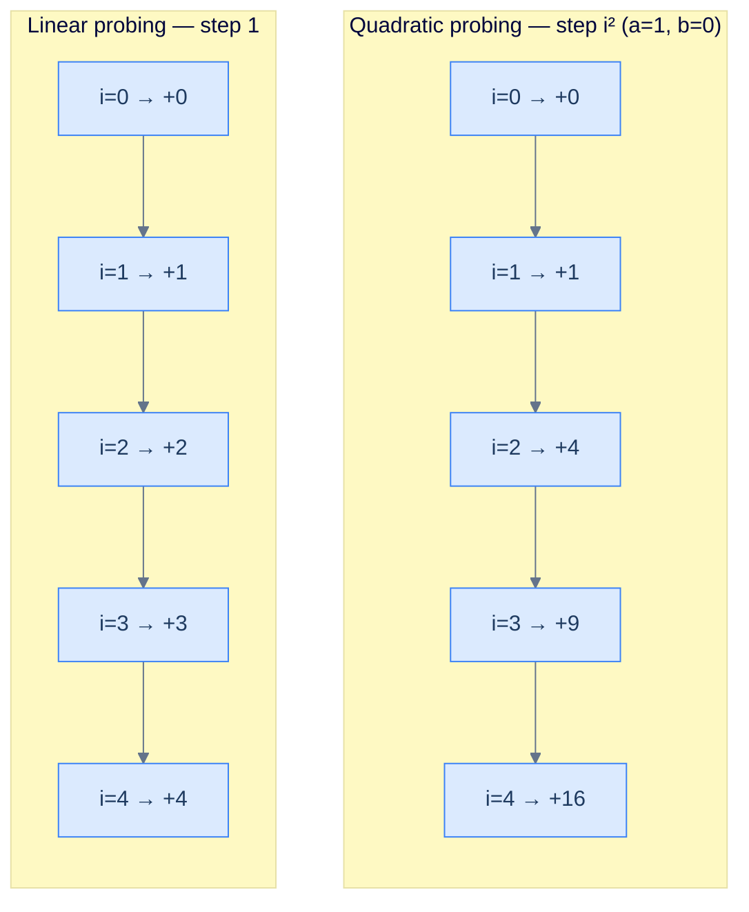
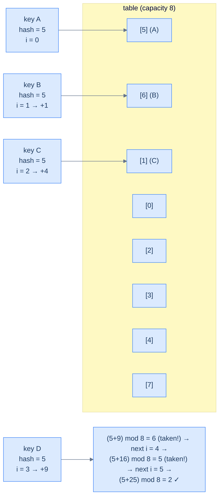
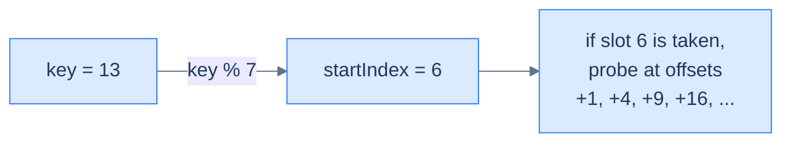
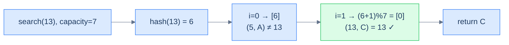
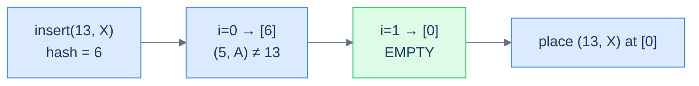
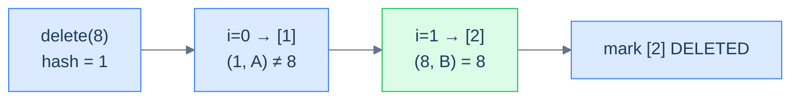

# 4. Quadratic Probing

## The Hook

You've just lived through the linear-probing apocalypse. Drop a few keys that all hash to the same slot, and they pile up *next to each other*. Drop more keys anywhere near that pile, and the pile *absorbs* them — every collision lengthens the cluster, and every nearby insert lengthens it further. By the time the table is 80% full, what should be O(1) lookups have become punishing scans through 20-, 30-, 40-slot clusters.

What if every collision *kicked the next key further away from the cluster*? Not one slot ahead, but **i² slots ahead** — so the second collision lands 1 slot away, the third lands 4 slots away, the fourth lands 9 slots away, the fifth lands 16 slots away. The keys spray themselves across the array instead of huddling together. Clusters can't form at the same hash index because the *second* colliding key has already teleported past where the third would land — collisions disperse instead of compounding.

That's **quadratic probing**. Same array, same three-state record, same O(1) average — but a probe sequence designed to *shatter* primary clusters. We get most of linear probing's cache-friendly speed back, with a far gentler degradation curve as the table fills.

There's still a price (every cure has its bug), and we'll meet it: **secondary clustering**. Two keys that hash to the *same* index will follow the *same* probe path forever, because the probe formula only uses `i`, not the key itself. We'll surface that limitation and tease its fix in the next lesson — double hashing.

---

## Table of contents

1. [Introduction to quadratic probing](#introduction-to-quadratic-probing)
2. [Key components of quadratic probing](#key-components-of-quadratic-probing)
3. [Implementing the hash table class](#implementing-the-hash-table-class)
4. [Search operation in quadratic probing](#search-operation-in-quadratic-probing)
5. [Insert operation in quadratic probing](#insert-operation-in-quadratic-probing)
6. [Delete operation in quadratic probing](#delete-operation-in-quadratic-probing)
7. [Design a hash table with quadratic probing](#design-a-hash-table-with-quadratic-probing)

***

# Introduction to quadratic probing

Now that we've seen linear probing and felt its limitation — primary clustering — let's introduce a small but powerful change to the probe sequence. **Quadratic probing** is an open-addressing scheme that keeps everything else about linear probing the same (single contiguous array, three-state records, cache-friendly storage) but replaces the linear walk with a *quadratic* one: the i-th probe is at `(startIndex + a·i² + b·i) % capacity` for some constants `a` and `b`.

```d2
grid-columns: 8
grid-gap: 0
h0: "[0]" {style.fill: "#fef9c3"; style.stroke: "#d97706"}
h1: "[1]" {style.fill: "#fef9c3"; style.stroke: "#d97706"}
h2: "[2]" {style.fill: "#fef9c3"; style.stroke: "#d97706"}
h3: "[3]" {style.fill: "#fef9c3"; style.stroke: "#d97706"}
h4: "[4]" {style.fill: "#fef9c3"; style.stroke: "#d97706"}
h5: "[5]" {style.fill: "#fef9c3"; style.stroke: "#d97706"}
h6: "[6]" {style.fill: "#fef9c3"; style.stroke: "#d97706"}
h7: "[7]" {style.fill: "#fef9c3"; style.stroke: "#d97706"}
c0: "EMPTY"
c1: "(9, B)" {style.fill: "#dbeafe"; style.stroke: "#3b82f6"}
c2: "EMPTY"
c3: "EMPTY"
c4: "(13, C)" {style.fill: "#dbeafe"; style.stroke: "#3b82f6"}
c5: "(5, A)" {style.fill: "#dbeafe"; style.stroke: "#3b82f6"}
c6: "EMPTY"
c7: "EMPTY"
```

<p align="center"><strong>Logical view of a quadratic-probing hash table — like linear probing, every slot stores one (key, value) pair directly. Unlike linear probing, colliding keys land at <em>scattered</em> positions instead of consecutive ones.</strong></p>

The internal array can be dynamic (resized on demand) in production implementations, but we'll keep it fixed in this lesson to focus on the probing scheme itself.

## Handling collisions

The probe sequence in linear probing is `+1, +2, +3, +4, ...` — the same direction, the same step, every time. The probe sequence in quadratic probing accelerates: `+1, +4, +9, +16, +25, ...` (with the simplest choice `a = 1, b = 0`, where the i-th probe is `+i²`). Each successive collision lands the new key *much further* from the cluster than the last, which is what stops clusters from forming around the original hash index.



<p align="center"><strong>Probe-step comparison — linear probing increases by 1 each step; quadratic probing increases by <em>i²</em>. After 5 collisions, linear is at offset 4 from the start; quadratic is at offset 16 — far enough away to escape any growing cluster around the start.</strong></p>

The first colliding key still lands at the hashed index. Subsequent colliding keys, however, are pushed to indices **far** from each other. Continuing the example with `a = 1, b = 0`, hash index 5, capacity 8:



<p align="center"><strong>Four colliding keys at hash 5, capacity 8 — the probe offsets <code>(5+0, 5+1, 5+4, 5+9, 5+16, 5+25) mod 8</code> visit slots <code>5, 6, 1, 6, 5, 2</code>. The fourth key has to skip past two re-visits before landing — and that <em>revisiting</em> is the secondary clustering we'll need to confront later.</strong></p>

Like linear probing, the quadratic probe runs up to N iterations (N = `capacity`), wrapping with `mod`. The two-step recipe is the same; only the formula for the offset has changed.

> **Insert (sketch)**
>
> -   **Step 1:** Compute the hash for the key.
> -   **Step 2:** Iterate up to N times using the quadratic offset formula until an unoccupied slot is found.
> -   **Step 3:** Place the (key, value) pair at that slot.
>
> **Search (sketch)**
>
> -   **Step 1:** Compute the hash for the key.
> -   **Step 2:** Iterate up to N times using the quadratic offset formula until the key is found or an empty slot is hit.
> -   **Step 3:** Return the value if the key is found.

The quadratic-probing implementation is *almost* identical to linear probing — same data structures, same operations, same EMPTY/DELETED/OCCUPIED state machine. Only the offset calculation changes.

***

# Key components of quadratic probing

A quadratic-probing hash table has the same three components as linear probing — a three-state record, an internal array of records, and a hash function — plus two new constants `a` and `b` that parameterise the probe sequence.

## Record

Identical to linear probing: each slot stores a key, a value, and a state (`EMPTY` / `DELETED` / `OCCUPIED`). The state field plays exactly the same role — `EMPTY` short-circuits searches, `DELETED` keeps probe chains alive after deletions.

```d2
rec: A single Record {
  s: |md
    **state**

    EMPTY / OCCUPIED / DELETED
  | {style.fill: "#fef9c3"; style.stroke: "#d97706"}
  k: key
  v: value
}
```

<p align="center"><strong>Quadratic-probing record — exactly the same shape as linear probing's record. The only difference between the two schemes is in <em>how</em> the probe sequence walks the array.</strong></p>


```pseudocode
enum RecordType: EMPTY = 0, DELETED = 1, OCCUPIED = 2

class Record:
    state: RecordType
    key: integer
    value: integer
    # default: state = EMPTY
```

```python run
from enum import Enum

class RecordType(Enum):
    EMPTY = 0; DELETED = 1; OCCUPIED = 2

class Record:
    def __init__(self, key=None, value=None):
        if key is not None and value is not None:
            self.state, self.key, self.value = RecordType.OCCUPIED, key, value
        else:
            self.state, self.key, self.value = RecordType.EMPTY, 0, 0

# Demo
r = Record(7, 100)
print(r.state, r.key, r.value)
```

```java run
public class Main {
    enum RecordType { EMPTY, DELETED, OCCUPIED }

    static class Record {
        RecordType state = RecordType.EMPTY; int key = 0, value = 0;
        Record() {}
        Record(int k, int v) { state = RecordType.OCCUPIED; key = k; value = v; }
    }

    public static void main(String[] args) {
        Record r = new Record(7, 100);
        System.out.println(r.state + " " + r.key + " " + r.value);
    }
}
```

```c run
#include <stdio.h>

typedef enum { EMPTY = 0, DELETED = 1, OCCUPIED = 2 } RecordType;

typedef struct {
    RecordType state;
    int key, value;
} Record;

int main() {
    Record r = { OCCUPIED, 7, 100 };
    printf("%d %d %d\n", r.state, r.key, r.value);
    return 0;
}
```

```cpp run
#include <iostream>

enum RecordType { EMPTY, DELETED, OCCUPIED };

struct Record {
    RecordType state = EMPTY;
    int key = 0, value = 0;
    Record() = default;
    Record(int k, int v) : state(OCCUPIED), key(k), value(v) {}
};

int main() {
    Record r(7, 100);
    std::cout << r.state << " " << r.key << " " << r.value << "\n";
}
```

```scala run
object RecordType extends Enumeration { val EMPTY, DELETED, OCCUPIED = Value }

class Record(
  var state: RecordType.Value = RecordType.EMPTY,
  var key:   Int              = 0,
  var value: Int              = 0,
) { def this(k: Int, v: Int) = this(RecordType.OCCUPIED, k, v) }

object Main extends App {
  val r = new Record(7, 100); println(s"${r.state} ${r.key} ${r.value}")
}
```

```typescript run
enum RecordType { EMPTY, DELETED, OCCUPIED }

class Record {
    state: RecordType = RecordType.EMPTY;
    key:   number     = 0;
    value: number     = 0;
    constructor(key?: number, value?: number) {
        if (key !== undefined && value !== undefined) {
            this.state = RecordType.OCCUPIED; this.key = key; this.value = value;
        }
    }
}

const r = new Record(7, 100);
console.log(r.state, r.key, r.value);
```

```go run
package main

import "fmt"

type RecordType int
const (EMPTY RecordType = iota; DELETED; OCCUPIED)

type Record struct { State RecordType; Key, Value int }

func main() {
    r := Record{State: OCCUPIED, Key: 7, Value: 100}
    fmt.Println(r.State, r.Key, r.Value)
}
```

```rust run
#[derive(Clone, Copy, Debug, PartialEq)]
enum RecordType { Empty, Deleted, Occupied }

#[derive(Clone, Debug)]
struct Record { state: RecordType, key: i32, value: i32 }

fn main() {
    let r = Record { state: RecordType::Occupied, key: 7, value: 100 };
    println!("{:?} {} {}", r.state, r.key, r.value);
}
```


## Internal array

Identical to linear probing — `capacity` records sitting back-to-back, all `EMPTY` at construction time. The contiguous layout is what gives both schemes their cache-friendly performance.

```d2
grid-columns: 7
grid-gap: 0
h0: "[0]" {style.fill: "#fef9c3"; style.stroke: "#d97706"}
h1: "[1]" {style.fill: "#fef9c3"; style.stroke: "#d97706"}
h2: "[2]" {style.fill: "#fef9c3"; style.stroke: "#d97706"}
h3: "[3]" {style.fill: "#fef9c3"; style.stroke: "#d97706"}
h4: "[4]" {style.fill: "#fef9c3"; style.stroke: "#d97706"}
h5: "[5]" {style.fill: "#fef9c3"; style.stroke: "#d97706"}
h6: "[6]" {style.fill: "#fef9c3"; style.stroke: "#d97706"}
e0: EMPTY
e1: EMPTY
e2: EMPTY
e3: EMPTY
e4: EMPTY
e5: EMPTY
e6: EMPTY
```

<p align="center"><strong>An empty quadratic-probing hash table — same structural layout as linear probing. The behavioural difference shows up only when collisions start happening.</strong></p>

## Hash function

Same `key % capacity` we've used throughout the section. The hash function picks the *starting* probe index; the quadratic step formula does the rest.



<p align="center"><strong>The hash function picks the starting index; the quadratic offset (a·i² + b·i) determines where each subsequent probe lands. The two stages are independent, which is why both schemes can share the same hash function.</strong></p>

***

# Implementing the hash table class

Now we wrap everything into `MyHashTable`. The class signature gains two extra parameters — the quadratic constants `a` and `b` — so the same code can support different probe sequences (`a=1, b=0` for the textbook `i²`, or any other choice the user wants to experiment with).

```d2
cls: MyHashTable class {
  priv: private internals {
    cap: "capacity"
    ab: |md
      **a, b**

      (quadratic constants)
    |
    tbl: "table: Record[]"
    hf: "hashFunction(key)"
    po: "probeForOccupied(key)"
    pe: "probeForFree(start)"
  }
  pub: public API {
    s: "search(key)"
    i: "insert(key, value)"
    r: "remove(key)"
  }
  pub -> priv {style.stroke-dash: 3}
}
```

<p align="center"><strong>The quadratic-probing class adds two private fields (a and b) on top of the linear-probing class. Everything else — the array, the hash function, the public API — is unchanged.</strong></p>

## Implementation


```pseudocode
class MyHashTable:
    capacity: integer
    a: integer   # quadratic coefficient
    b: integer   # linear coefficient
    table: array of Record(state=EMPTY)

    function _hash(key): return key mod capacity
    function _quad_offset(i): return a·i² + b·i
    function search(key): ...
    function insert(key, value): ...
    function remove(key): ...
```

```python run
from enum import Enum

class RecordType(Enum):
    EMPTY = 0; DELETED = 1; OCCUPIED = 2

class Record:
    def __init__(self, key=None, value=None):
        if key is not None and value is not None:
            self.state, self.key, self.value = RecordType.OCCUPIED, key, value
        else:
            self.state, self.key, self.value = RecordType.EMPTY, 0, 0

class MyHashTable:
    def __init__(self, capacity, a=1, b=0):
        # a and b are the constants in the probe formula (a·i² + b·i).
        # a=1, b=0 → classic i² probing.
        self.capacity, self.a, self.b = capacity, a, b
        self.table = [Record() for _ in range(capacity)]

    def _hash(self, key): return key % self.capacity

    def search(self, key):  pass
    def insert(self, key, value): pass
    def remove(self, key):  pass

print("table created with capacity 7, a=1, b=0")
h = MyHashTable(7, 1, 0)
```

```java run
import java.util.*;

public class Main {
    enum RecordType { EMPTY, DELETED, OCCUPIED }

    static class Record {
        RecordType state = RecordType.EMPTY; int key, value;
        Record() {}
        Record(int k, int v) { state = RecordType.OCCUPIED; key = k; value = v; }
    }

    static class MyHashTable {
        protected final int          capacity, a, b;
        protected final List<Record> table;
        MyHashTable(int capacity, int a, int b) {
            this.capacity = capacity; this.a = a; this.b = b;
            this.table = new ArrayList<>(capacity);
            for (int i = 0; i < capacity; i++) table.add(new Record());
        }
        protected int hash(int key) { return key % capacity; }

        int     search(int key)            { return -1;    }
        boolean insert(int key, int value) { return false; }
        void    remove(int key)            {                }
    }

    public static void main(String[] args) {
        MyHashTable h = new MyHashTable(7, 1, 0);
        System.out.println("table created with capacity 7, a=1, b=0");
    }
}
```

```c run
#include <stdio.h>
#include <stdlib.h>

typedef enum { EMPTY = 0, DELETED = 1, OCCUPIED = 2 } RecordType;
typedef struct { RecordType state; int key, value; } Record;
typedef struct { int capacity, a, b; Record *table; } MyHashTable;

MyHashTable* createTable(int capacity, int a, int b) {
    MyHashTable *h = malloc(sizeof(MyHashTable));
    h->capacity = capacity; h->a = a; h->b = b;
    h->table = calloc(capacity, sizeof(Record));
    return h;
}
int  hash_fn(MyHashTable *h, int key) { return key % h->capacity; }
int  search_op(MyHashTable *h, int key)              { return -1; }
int  insert_op(MyHashTable *h, int key, int value)   { return 0;  }
void remove_op(MyHashTable *h, int key)              {            }

int main() {
    MyHashTable *h = createTable(7, 1, 0);
    printf("table created with capacity %d, a=%d, b=%d\n", h->capacity, h->a, h->b);
    free(h->table); free(h);
    return 0;
}
```

```cpp run
#include <iostream>
#include <vector>

enum RecordType { EMPTY, DELETED, OCCUPIED };

struct Record {
    RecordType state = EMPTY; int key = 0, value = 0;
    Record() = default;
    Record(int k, int v) : state(OCCUPIED), key(k), value(v) {}
};

class MyHashTable {
    int capacity, a, b;
    std::vector<Record> table;
    int hash(int key) { return key % capacity; }
public:
    MyHashTable(int cap, int a, int b)
        : capacity(cap), a(a), b(b), table(cap) {}

    int  search(int key)             { return -1; }
    bool insert(int key, int value)  { return false; }
    void remove(int key)             {            }
};

int main() {
    MyHashTable h(7, 1, 0);
    std::cout << "table created with capacity 7, a=1, b=0\n";
}
```

```scala run
object RecordType extends Enumeration { val EMPTY, DELETED, OCCUPIED = Value }

class Record(
  var state: RecordType.Value = RecordType.EMPTY,
  var key:   Int              = 0,
  var value: Int              = 0,
) { def this(k: Int, v: Int) = this(RecordType.OCCUPIED, k, v) }

class MyHashTable(val capacity: Int, val a: Int = 1, val b: Int = 0) {
  protected val table: Array[Record] = Array.fill(capacity)(new Record())
  protected def hash(key: Int): Int  = key % capacity

  def search(key: Int):              Int     = -1
  def insert(key: Int, value: Int):  Boolean = false
  def remove(key: Int):              Unit    = ()
}

object Main extends App {
  val h = new MyHashTable(7, 1, 0)
  println("table created with capacity 7, a=1, b=0")
}
```

```typescript run
enum RecordType { EMPTY, DELETED, OCCUPIED }

class Record {
    state: RecordType = RecordType.EMPTY;
    key:   number     = 0;
    value: number     = 0;
    constructor(key?: number, value?: number) {
        if (key !== undefined && value !== undefined) {
            this.state = RecordType.OCCUPIED; this.key = key; this.value = value;
        }
    }
}

class MyHashTable {
    protected capacity: number;
    protected a: number; protected b: number;
    protected table: Record[];
    constructor(capacity: number, a: number = 1, b: number = 0) {
        this.capacity = capacity; this.a = a; this.b = b;
        this.table    = Array.from({ length: capacity }, () => new Record());
    }
    protected hash(key: number): number { return key % this.capacity; }

    search(key: number):                 number  { return -1; }
    insert(key: number, value: number):  boolean { return false; }
    remove(key: number):                 void    {                }
}

const h = new MyHashTable(7, 1, 0);
console.log("table created with capacity 7, a=1, b=0");
```

```go run
package main

import "fmt"

type RecordType int
const (EMPTY RecordType = iota; DELETED; OCCUPIED)

type Record struct { State RecordType; Key, Value int }
type MyHashTable struct {
    capacity, a, b int
    table          []Record
}

func newTable(capacity, a, b int) *MyHashTable {
    return &MyHashTable{capacity, a, b, make([]Record, capacity)}
}
func (h *MyHashTable) hash(key int) int { return key % h.capacity }

func (h *MyHashTable) Search(key int) int                 { return -1 }
func (h *MyHashTable) Insert(key, value int) bool         { return false }
func (h *MyHashTable) Remove(key int)                     {              }

func main() {
    h := newTable(7, 1, 0)
    fmt.Printf("table created with capacity %d, a=%d, b=%d\n", h.capacity, h.a, h.b)
}
```

```rust run
#[derive(Clone, Copy, Debug, PartialEq)]
enum RecordType { Empty, Deleted, Occupied }

#[derive(Clone, Debug)]
struct Record { state: RecordType, key: i32, value: i32 }
impl Record { fn empty() -> Self { Record { state: RecordType::Empty, key: 0, value: 0 } } }

struct MyHashTable { capacity: usize, a: i32, b: i32, table: Vec<Record> }
impl MyHashTable {
    fn new(capacity: usize, a: i32, b: i32) -> Self {
        MyHashTable { capacity, a, b, table: vec![Record::empty(); capacity] }
    }
    fn hash(&self, key: i32) -> usize { (key as usize) % self.capacity }

    fn search(&self,     _key: i32)              -> i32  { -1 }
    fn insert(&mut self, _key: i32, _val: i32)   -> bool { false }
    fn remove(&mut self, _key: i32)                      {       }
}

fn main() {
    let h = MyHashTable::new(7, 1, 0);
    println!("table created with capacity {}, a={}, b={}", h.capacity, h.a, h.b);
}
```


> *Predict before reading on — with the formula <code>(start + a·i² + b·i) % capacity</code> and constants <code>a=1, b=0</code>, what's the maximum possible probe-step distance after just 5 iterations? And how many slots can quadratic probing reach in a table of capacity 8 — all of them, or only some?*
>
> After 5 iterations the offset is 16; in a capacity-8 table that wraps to 0, so the path crosses itself. **Quadratic probing on capacity 8 cannot reach every slot** — half the array is unreachable depending on the start. This is one of the limitations we'll surface formally; the standard fix is to choose `capacity` to be a prime number, which we'll discuss in the design problem.

***

# Search operation in quadratic probing

Search in quadratic probing is identical to linear probing in *structure* — three cases (key found, EMPTY hit, full traversal) — but the offset between probes is `a·i² + b·i` instead of `i`. We refactor the probe loop into a private helper so insert and delete can reuse it.

## Algorithm

### 1. The key is present

If we land on an `OCCUPIED` slot whose key matches, return the value.



<p align="center"><strong>Successful search — the probe walks through the quadratic sequence, comparing keys, until it lands on a match.</strong></p>

### 2. An EMPTY slot is found

Like linear probing, hitting `EMPTY` proves the key was never inserted (or it would have been placed at this slot or earlier in the probe). Stop, return `-1`.

### 3. The table is fully traversed

After `capacity` iterations, give up.

## Implementation


```pseudocode
function _quad_offset(i): return a·i² + b·i

function _probe_for_occupied(key, start):
    for i from 0 to capacity − 1:
        idx ← (start + _quad_offset(i)) mod capacity
        if table[idx].state = EMPTY: return -1
        if table[idx].state = OCCUPIED AND table[idx].key = key: return idx
    return -1

function search(key):
    idx ← _probe_for_occupied(key, _hash(key))
    if idx = -1: return -1 else: return table[idx].value
```

```python run
from enum import Enum

class RecordType(Enum):
    EMPTY = 0; DELETED = 1; OCCUPIED = 2

class Record:
    def __init__(self, key=None, value=None):
        if key is not None and value is not None:
            self.state, self.key, self.value = RecordType.OCCUPIED, key, value
        else:
            self.state, self.key, self.value = RecordType.EMPTY, 0, 0

class MyHashTable:
    def __init__(self, capacity, a=1, b=0):
        self.capacity, self.a, self.b = capacity, a, b
        self.table = [Record() for _ in range(capacity)]
    def _hash(self, key): return key % self.capacity

    def _quadratic_offset(self, i):
        # i-th probe offset = a·i² + b·i. With a=1, b=0 → i².
        return self.a * i * i + self.b * i

    def _probe_for_occupied(self, key, start):
        for i in range(self.capacity):
            idx = (start + self._quadratic_offset(i)) % self.capacity
            slot = self.table[idx]
            if slot.state == RecordType.EMPTY:                                return -1
            if slot.state == RecordType.OCCUPIED and slot.key == key:         return idx
        return -1

    def search(self, key):
        idx = self._probe_for_occupied(key, self._hash(key))
        return -1 if idx == -1 else self.table[idx].value

# Demo
h = MyHashTable(7, 1, 0)
print(h.search(13))    # -1
```

```java run
import java.util.*;

public class Main {
    enum RecordType { EMPTY, DELETED, OCCUPIED }

    static class Record {
        RecordType state = RecordType.EMPTY; int key, value;
        Record() {}
        Record(int k, int v) { state = RecordType.OCCUPIED; key = k; value = v; }
    }

    static class MyHashTable {
        protected final int          capacity, a, b;
        protected final List<Record> table;
        MyHashTable(int capacity, int a, int b) {
            this.capacity = capacity; this.a = a; this.b = b;
            this.table = new ArrayList<>(capacity);
            for (int i = 0; i < capacity; i++) table.add(new Record());
        }
        protected int hash(int key) { return key % capacity; }
        protected int quadraticOffset(int i) { return a * i * i + b * i; }

        protected int probeForOccupied(int key, int start) {
            for (int i = 0; i < capacity; i++) {
                int idx = ((start + quadraticOffset(i)) % capacity + capacity) % capacity;
                Record s = table.get(idx);
                if (s.state == RecordType.EMPTY) return -1;
                if (s.state == RecordType.OCCUPIED && s.key == key) return idx;
            }
            return -1;
        }

        int search(int key) {
            int idx = probeForOccupied(key, hash(key));
            return idx == -1 ? -1 : table.get(idx).value;
        }
    }

    public static void main(String[] args) {
        MyHashTable h = new MyHashTable(7, 1, 0);
        System.out.println(h.search(13));   // -1
    }
}
```

```c run
#include <stdio.h>
#include <stdlib.h>

typedef enum { EMPTY = 0, DELETED = 1, OCCUPIED = 2 } RecordType;
typedef struct { RecordType state; int key, value; } Record;
typedef struct { int capacity, a, b; Record *table; } MyHashTable;

int hash_fn(MyHashTable *h, int key) { return key % h->capacity; }
int quad_offset(MyHashTable *h, int i) { return h->a * i * i + h->b * i; }

int probe_for_occupied(MyHashTable *h, int key, int start) {
    for (int i = 0; i < h->capacity; i++) {
        int idx = (start + quad_offset(h, i)) % h->capacity;
        if (h->table[idx].state == EMPTY) return -1;
        if (h->table[idx].state == OCCUPIED && h->table[idx].key == key) return idx;
    }
    return -1;
}
int search_op(MyHashTable *h, int key) {
    int idx = probe_for_occupied(h, key, hash_fn(h, key));
    return idx == -1 ? -1 : h->table[idx].value;
}

int main() {
    MyHashTable h = { .capacity = 7, .a = 1, .b = 0,
                      .table = calloc(7, sizeof(Record)) };
    printf("%d\n", search_op(&h, 13));   // -1
    free(h.table);
    return 0;
}
```

```cpp run
#include <iostream>
#include <vector>

enum RecordType { EMPTY, DELETED, OCCUPIED };

struct Record {
    RecordType state = EMPTY; int key = 0, value = 0;
    Record() = default;
    Record(int k, int v) : state(OCCUPIED), key(k), value(v) {}
};

class MyHashTable {
protected:
    int capacity, a, b;
    std::vector<Record> table;
    int hash(int key) { return key % capacity; }
    int quadOffset(int i) { return a * i * i + b * i; }

    int probeForOccupied(int key, int start) {
        for (int i = 0; i < capacity; i++) {
            int idx = (start + quadOffset(i)) % capacity;
            if (table[idx].state == EMPTY) return -1;
            if (table[idx].state == OCCUPIED && table[idx].key == key) return idx;
        }
        return -1;
    }
public:
    MyHashTable(int cap, int a, int b)
        : capacity(cap), a(a), b(b), table(cap) {}

    int search(int key) {
        int idx = probeForOccupied(key, hash(key));
        return idx == -1 ? -1 : table[idx].value;
    }
};

int main() {
    MyHashTable h(7, 1, 0);
    std::cout << h.search(13) << "\n";   // -1
}
```

```scala run
object RecordType extends Enumeration { val EMPTY, DELETED, OCCUPIED = Value }

class Record(
  var state: RecordType.Value = RecordType.EMPTY,
  var key:   Int              = 0,
  var value: Int              = 0,
) { def this(k: Int, v: Int) = this(RecordType.OCCUPIED, k, v) }

class MyHashTable(val capacity: Int, val a: Int = 1, val b: Int = 0) {
  protected val table: Array[Record] = Array.fill(capacity)(new Record())
  protected def hash(key: Int): Int  = key % capacity
  protected def quadOffset(i: Int): Int = a * i * i + b * i

  protected def probeForOccupied(key: Int, start: Int): Int = {
    var i = 0
    while (i < capacity) {
      val idx = (start + quadOffset(i)) % capacity
      val s   = table(idx)
      if (s.state == RecordType.EMPTY) return -1
      if (s.state == RecordType.OCCUPIED && s.key == key) return idx
      i += 1
    }; -1
  }

  def search(key: Int): Int = {
    val idx = probeForOccupied(key, hash(key))
    if (idx == -1) -1 else table(idx).value
  }
}

object Main extends App {
  val h = new MyHashTable(7, 1, 0)
  println(h.search(13))   // -1
}
```

```typescript run
enum RecordType { EMPTY, DELETED, OCCUPIED }

class Record {
    state: RecordType = RecordType.EMPTY;
    key: number = 0; value: number = 0;
    constructor(key?: number, value?: number) {
        if (key !== undefined && value !== undefined) {
            this.state = RecordType.OCCUPIED; this.key = key; this.value = value;
        }
    }
}

class MyHashTable {
    protected capacity: number; protected a: number; protected b: number;
    protected table: Record[];
    constructor(capacity: number, a: number = 1, b: number = 0) {
        this.capacity = capacity; this.a = a; this.b = b;
        this.table    = Array.from({ length: capacity }, () => new Record());
    }
    protected hash(key: number): number { return key % this.capacity; }
    protected quadOffset(i: number): number { return this.a * i * i + this.b * i; }

    protected probeForOccupied(key: number, start: number): number {
        for (let i = 0; i < this.capacity; i++) {
            const idx = (start + this.quadOffset(i)) % this.capacity;
            const s   = this.table[idx];
            if (s.state === RecordType.EMPTY) return -1;
            if (s.state === RecordType.OCCUPIED && s.key === key) return idx;
        }
        return -1;
    }

    search(key: number): number {
        const idx = this.probeForOccupied(key, this.hash(key));
        return idx === -1 ? -1 : this.table[idx].value;
    }
}

const h = new MyHashTable(7, 1, 0);
console.log(h.search(13));   // -1
```

```go run
package main

import "fmt"

type RecordType int
const (EMPTY RecordType = iota; DELETED; OCCUPIED)

type Record struct { State RecordType; Key, Value int }
type MyHashTable struct { capacity, a, b int; table []Record }

func newTable(capacity, a, b int) *MyHashTable {
    return &MyHashTable{capacity, a, b, make([]Record, capacity)}
}
func (h *MyHashTable) hash(key int) int { return key % h.capacity }
func (h *MyHashTable) quadOffset(i int) int { return h.a * i * i + h.b * i }

func (h *MyHashTable) probeForOccupied(key, start int) int {
    for i := 0; i < h.capacity; i++ {
        idx := ((start + h.quadOffset(i)) % h.capacity + h.capacity) % h.capacity
        if h.table[idx].State == EMPTY                                 { return -1 }
        if h.table[idx].State == OCCUPIED && h.table[idx].Key == key   { return idx }
    }
    return -1
}

func (h *MyHashTable) Search(key int) int {
    idx := h.probeForOccupied(key, h.hash(key))
    if idx == -1 { return -1 }; return h.table[idx].Value
}

func main() {
    h := newTable(7, 1, 0)
    fmt.Println(h.Search(13))   // -1
}
```

```rust run
#[derive(Clone, Copy, Debug, PartialEq)]
enum RecordType { Empty, Deleted, Occupied }

#[derive(Clone, Debug)]
struct Record { state: RecordType, key: i32, value: i32 }
impl Record { fn empty() -> Self { Record { state: RecordType::Empty, key: 0, value: 0 } } }

struct MyHashTable { capacity: usize, a: i32, b: i32, table: Vec<Record> }
impl MyHashTable {
    fn new(capacity: usize, a: i32, b: i32) -> Self {
        MyHashTable { capacity, a, b, table: vec![Record::empty(); capacity] }
    }
    fn hash(&self, key: i32) -> usize { (key as usize) % self.capacity }
    fn quad_offset(&self, i: i32) -> i32 { self.a * i * i + self.b * i }

    fn probe_for_occupied(&self, key: i32, start: usize) -> i32 {
        for i in 0..self.capacity as i32 {
            let raw  = start as i32 + self.quad_offset(i);
            let idx  = ((raw.rem_euclid(self.capacity as i32))) as usize;
            match self.table[idx].state {
                RecordType::Empty                                     => return -1,
                RecordType::Occupied if self.table[idx].key == key    => return idx as i32,
                _ => {}
            }
        }
        -1
    }

    fn search(&self, key: i32) -> i32 {
        let idx = self.probe_for_occupied(key, self.hash(key));
        if idx == -1 { -1 } else { self.table[idx as usize].value }
    }
}

fn main() {
    let h = MyHashTable::new(7, 1, 0);
    println!("{}", h.search(13));   // -1
}
```


## Complexity analysis

> **Best case** — first probe matches
>
> -   Time: **O(1)** | Space: **O(1)**
>
> **Average case** — well-distributed hashes
>
> -   Time: **O(1)** | Space: **O(1)**
>
> **Worst case** — heavy collision, full traversal
>
> -   Time: **O(N)** | Space: **O(1)**

***

# Insert operation in quadratic probing

Insert mirrors linear probing's structure: first run the probe to confirm the key isn't already there, then run it again to find the first non-OCCUPIED slot for the new record.

## Algorithm

### 1. Key already exists

Probe finds an `OCCUPIED` slot with the matching key — overwrite the value.

### 2. Free slot found

Probe finds a non-OCCUPIED slot — drop the new record there.

### 3. Table is full

Probe completes a full traversal without finding either — return `false`.



<p align="center"><strong>Insert with a new key — the quadratic probe walks past the colliding occupied slot and lands on the first free slot, where the record is placed.</strong></p>

## Implementation


```pseudocode
function _probe_for_free(start):
    for i from 0 to capacity − 1:
        idx ← (start + _quad_offset(i)) mod capacity
        if table[idx].state ≠ OCCUPIED: return idx
    return -1

function insert(key, value):
    start ← _hash(key)
    occ ← _probe_for_occupied(key, start)
    if occ ≠ -1: table[occ].value ← value; return true
    free ← _probe_for_free(start)
    if free = -1: return false
    table[free] ← Record(key, value, OCCUPIED); return true
```

```python run
from enum import Enum

class RecordType(Enum):
    EMPTY = 0; DELETED = 1; OCCUPIED = 2

class Record:
    def __init__(self, key=None, value=None):
        if key is not None and value is not None:
            self.state, self.key, self.value = RecordType.OCCUPIED, key, value
        else:
            self.state, self.key, self.value = RecordType.EMPTY, 0, 0

class MyHashTable:
    def __init__(self, capacity, a=1, b=0):
        self.capacity, self.a, self.b = capacity, a, b
        self.table = [Record() for _ in range(capacity)]
    def _hash(self, key): return key % self.capacity
    def _quad_offset(self, i): return self.a * i * i + self.b * i

    def _probe_for_occupied(self, key, start):
        for i in range(self.capacity):
            idx = (start + self._quad_offset(i)) % self.capacity
            if self.table[idx].state == RecordType.EMPTY: return -1
            if self.table[idx].state == RecordType.OCCUPIED and self.table[idx].key == key: return idx
        return -1
    def _probe_for_free(self, start):
        for i in range(self.capacity):
            idx = (start + self._quad_offset(i)) % self.capacity
            if self.table[idx].state != RecordType.OCCUPIED: return idx
        return -1

    def search(self, key):
        idx = self._probe_for_occupied(key, self._hash(key))
        return -1 if idx == -1 else self.table[idx].value

    def insert(self, key, value):
        start = self._hash(key)
        occ = self._probe_for_occupied(key, start)
        if occ != -1: self.table[occ].value = value; return True
        free = self._probe_for_free(start)
        if free == -1: return False
        self.table[free] = Record(key, value); return True

# Demo — three keys collide at index 1 (capacity 7, hash = key % 7)
h = MyHashTable(7, 1, 0)
h.insert(1, 10);  h.insert(8, 80);  h.insert(15, 150)   # 1 % 7 = 1, 8 % 7 = 1, 15 % 7 = 1
print(h.search(1), h.search(8), h.search(15))           # 10 80 150
```

```java run
import java.util.*;

public class Main {
    enum RecordType { EMPTY, DELETED, OCCUPIED }
    static class Record {
        RecordType state = RecordType.EMPTY; int key, value;
        Record() {}
        Record(int k, int v) { state = RecordType.OCCUPIED; key = k; value = v; }
    }
    static class MyHashTable {
        protected final int          capacity, a, b;
        protected final List<Record> table;
        MyHashTable(int capacity, int a, int b) {
            this.capacity = capacity; this.a = a; this.b = b;
            this.table = new ArrayList<>(capacity);
            for (int i = 0; i < capacity; i++) table.add(new Record());
        }
        protected int hash(int key) { return key % capacity; }
        protected int quadOffset(int i) { return a * i * i + b * i; }

        protected int probeForOccupied(int key, int start) {
            for (int i = 0; i < capacity; i++) {
                int idx = ((start + quadOffset(i)) % capacity + capacity) % capacity;
                Record s = table.get(idx);
                if (s.state == RecordType.EMPTY) return -1;
                if (s.state == RecordType.OCCUPIED && s.key == key) return idx;
            }
            return -1;
        }
        protected int probeForFree(int start) {
            for (int i = 0; i < capacity; i++) {
                int idx = ((start + quadOffset(i)) % capacity + capacity) % capacity;
                if (table.get(idx).state != RecordType.OCCUPIED) return idx;
            }
            return -1;
        }

        int search(int key) {
            int idx = probeForOccupied(key, hash(key));
            return idx == -1 ? -1 : table.get(idx).value;
        }
        boolean insert(int key, int value) {
            int start = hash(key);
            int occ = probeForOccupied(key, start);
            if (occ != -1) { table.get(occ).value = value; return true; }
            int free = probeForFree(start);
            if (free == -1) return false;
            table.set(free, new Record(key, value));
            return true;
        }
    }

    public static void main(String[] args) {
        MyHashTable h = new MyHashTable(7, 1, 0);
        h.insert(1, 10); h.insert(8, 80); h.insert(15, 150);
        System.out.println(h.search(1) + " " + h.search(8) + " " + h.search(15));
    }
}
```

```c run
#include <stdio.h>
#include <stdlib.h>

typedef enum { EMPTY = 0, DELETED = 1, OCCUPIED = 2 } RecordType;
typedef struct { RecordType state; int key, value; } Record;
typedef struct { int capacity, a, b; Record *table; } MyHashTable;

int hash_fn(MyHashTable *h, int key) { return key % h->capacity; }
int quad_offset(MyHashTable *h, int i) { return h->a * i * i + h->b * i; }

int probe_for_occupied(MyHashTable *h, int key, int start) {
    for (int i = 0; i < h->capacity; i++) {
        int idx = (start + quad_offset(h, i)) % h->capacity;
        if (h->table[idx].state == EMPTY) return -1;
        if (h->table[idx].state == OCCUPIED && h->table[idx].key == key) return idx;
    }
    return -1;
}
int probe_for_free(MyHashTable *h, int start) {
    for (int i = 0; i < h->capacity; i++) {
        int idx = (start + quad_offset(h, i)) % h->capacity;
        if (h->table[idx].state != OCCUPIED) return idx;
    }
    return -1;
}

int search_op(MyHashTable *h, int key) {
    int idx = probe_for_occupied(h, key, hash_fn(h, key));
    return idx == -1 ? -1 : h->table[idx].value;
}
int insert_op(MyHashTable *h, int key, int value) {
    int start = hash_fn(h, key); int occ = probe_for_occupied(h, key, start);
    if (occ != -1) { h->table[occ].value = value; return 1; }
    int free = probe_for_free(h, start); if (free == -1) return 0;
    h->table[free] = (Record){OCCUPIED, key, value};
    return 1;
}

int main() {
    MyHashTable h = { .capacity = 7, .a = 1, .b = 0,
                      .table = calloc(7, sizeof(Record)) };
    insert_op(&h, 1, 10); insert_op(&h, 8, 80); insert_op(&h, 15, 150);
    printf("%d %d %d\n", search_op(&h, 1), search_op(&h, 8), search_op(&h, 15));
    free(h.table); return 0;
}
```

```cpp run
#include <iostream>
#include <vector>

enum RecordType { EMPTY, DELETED, OCCUPIED };

struct Record {
    RecordType state = EMPTY; int key = 0, value = 0;
    Record() = default;
    Record(int k, int v) : state(OCCUPIED), key(k), value(v) {}
};

class MyHashTable {
protected:
    int capacity, a, b;
    std::vector<Record> table;
    int hash(int key) { return key % capacity; }
    int quadOffset(int i) { return a * i * i + b * i; }

    int probeForOccupied(int key, int start) {
        for (int i = 0; i < capacity; i++) {
            int idx = (start + quadOffset(i)) % capacity;
            if (table[idx].state == EMPTY) return -1;
            if (table[idx].state == OCCUPIED && table[idx].key == key) return idx;
        }
        return -1;
    }
    int probeForFree(int start) {
        for (int i = 0; i < capacity; i++) {
            int idx = (start + quadOffset(i)) % capacity;
            if (table[idx].state != OCCUPIED) return idx;
        }
        return -1;
    }
public:
    MyHashTable(int cap, int a, int b)
        : capacity(cap), a(a), b(b), table(cap) {}

    int  search(int key) {
        int idx = probeForOccupied(key, hash(key));
        return idx == -1 ? -1 : table[idx].value;
    }
    bool insert(int key, int value) {
        int start = hash(key); int occ = probeForOccupied(key, start);
        if (occ != -1) { table[occ].value = value; return true; }
        int free = probeForFree(start); if (free == -1) return false;
        table[free] = Record(key, value);
        return true;
    }
};

int main() {
    MyHashTable h(7, 1, 0);
    h.insert(1, 10); h.insert(8, 80); h.insert(15, 150);
    std::cout << h.search(1) << " " << h.search(8) << " " << h.search(15) << "\n";
}
```

```scala run
object RecordType extends Enumeration { val EMPTY, DELETED, OCCUPIED = Value }

class Record(
  var state: RecordType.Value = RecordType.EMPTY,
  var key:   Int              = 0,
  var value: Int              = 0,
) { def this(k: Int, v: Int) = this(RecordType.OCCUPIED, k, v) }

class MyHashTable(val capacity: Int, val a: Int = 1, val b: Int = 0) {
  protected val table: Array[Record] = Array.fill(capacity)(new Record())
  protected def hash(key: Int): Int  = key % capacity
  protected def quadOffset(i: Int): Int = a * i * i + b * i

  protected def probeForOccupied(key: Int, start: Int): Int = {
    var i = 0
    while (i < capacity) {
      val idx = (start + quadOffset(i)) % capacity
      val s   = table(idx)
      if (s.state == RecordType.EMPTY) return -1
      if (s.state == RecordType.OCCUPIED && s.key == key) return idx
      i += 1
    }; -1
  }
  protected def probeForFree(start: Int): Int = {
    var i = 0
    while (i < capacity) {
      val idx = (start + quadOffset(i)) % capacity
      if (table(idx).state != RecordType.OCCUPIED) return idx
      i += 1
    }; -1
  }

  def search(key: Int): Int = {
    val idx = probeForOccupied(key, hash(key))
    if (idx == -1) -1 else table(idx).value
  }
  def insert(key: Int, value: Int): Boolean = {
    val start = hash(key); val occ = probeForOccupied(key, start)
    if (occ != -1) { table(occ).value = value; return true }
    val free = probeForFree(start); if (free == -1) return false
    table(free) = new Record(key, value); true
  }
}

object Main extends App {
  val h = new MyHashTable(7, 1, 0)
  h.insert(1, 10); h.insert(8, 80); h.insert(15, 150)
  println(s"${h.search(1)} ${h.search(8)} ${h.search(15)}")
}
```

```typescript run
enum RecordType { EMPTY, DELETED, OCCUPIED }

class Record {
    state: RecordType = RecordType.EMPTY;
    key: number = 0; value: number = 0;
    constructor(key?: number, value?: number) {
        if (key !== undefined && value !== undefined) {
            this.state = RecordType.OCCUPIED; this.key = key; this.value = value;
        }
    }
}

class MyHashTable {
    protected capacity: number; protected a: number; protected b: number;
    protected table: Record[];
    constructor(capacity: number, a: number = 1, b: number = 0) {
        this.capacity = capacity; this.a = a; this.b = b;
        this.table = Array.from({ length: capacity }, () => new Record());
    }
    protected hash(key: number): number { return key % this.capacity; }
    protected quadOffset(i: number): number { return this.a * i * i + this.b * i; }

    protected probeForOccupied(key: number, start: number): number {
        for (let i = 0; i < this.capacity; i++) {
            const idx = (start + this.quadOffset(i)) % this.capacity;
            const s   = this.table[idx];
            if (s.state === RecordType.EMPTY) return -1;
            if (s.state === RecordType.OCCUPIED && s.key === key) return idx;
        }
        return -1;
    }
    protected probeForFree(start: number): number {
        for (let i = 0; i < this.capacity; i++) {
            const idx = (start + this.quadOffset(i)) % this.capacity;
            if (this.table[idx].state !== RecordType.OCCUPIED) return idx;
        }
        return -1;
    }

    search(key: number): number {
        const idx = this.probeForOccupied(key, this.hash(key));
        return idx === -1 ? -1 : this.table[idx].value;
    }
    insert(key: number, value: number): boolean {
        const start = this.hash(key);
        const occ = this.probeForOccupied(key, start);
        if (occ !== -1) { this.table[occ].value = value; return true; }
        const free = this.probeForFree(start);
        if (free === -1) return false;
        this.table[free] = new Record(key, value);
        return true;
    }
}

const h = new MyHashTable(7, 1, 0);
h.insert(1, 10); h.insert(8, 80); h.insert(15, 150);
console.log(h.search(1), h.search(8), h.search(15));
```

```go run
package main

import "fmt"

type RecordType int
const (EMPTY RecordType = iota; DELETED; OCCUPIED)

type Record struct { State RecordType; Key, Value int }
type MyHashTable struct { capacity, a, b int; table []Record }

func newTable(capacity, a, b int) *MyHashTable {
    return &MyHashTable{capacity, a, b, make([]Record, capacity)}
}
func (h *MyHashTable) hash(key int) int { return key % h.capacity }
func (h *MyHashTable) quadOffset(i int) int { return h.a*i*i + h.b*i }

func (h *MyHashTable) probeForOccupied(key, start int) int {
    for i := 0; i < h.capacity; i++ {
        idx := ((start + h.quadOffset(i)) % h.capacity + h.capacity) % h.capacity
        if h.table[idx].State == EMPTY                                 { return -1 }
        if h.table[idx].State == OCCUPIED && h.table[idx].Key == key   { return idx }
    }
    return -1
}
func (h *MyHashTable) probeForFree(start int) int {
    for i := 0; i < h.capacity; i++ {
        idx := ((start + h.quadOffset(i)) % h.capacity + h.capacity) % h.capacity
        if h.table[idx].State != OCCUPIED { return idx }
    }
    return -1
}

func (h *MyHashTable) Search(key int) int {
    idx := h.probeForOccupied(key, h.hash(key))
    if idx == -1 { return -1 }; return h.table[idx].Value
}
func (h *MyHashTable) Insert(key, value int) bool {
    start := h.hash(key); occ := h.probeForOccupied(key, start)
    if occ != -1 { h.table[occ].Value = value; return true }
    free := h.probeForFree(start); if free == -1 { return false }
    h.table[free] = Record{OCCUPIED, key, value}
    return true
}

func main() {
    h := newTable(7, 1, 0)
    h.Insert(1, 10); h.Insert(8, 80); h.Insert(15, 150)
    fmt.Println(h.Search(1), h.Search(8), h.Search(15))
}
```

```rust run
#[derive(Clone, Copy, Debug, PartialEq)]
enum RecordType { Empty, Deleted, Occupied }

#[derive(Clone, Debug)]
struct Record { state: RecordType, key: i32, value: i32 }
impl Record { fn empty() -> Self { Record { state: RecordType::Empty, key: 0, value: 0 } } }

struct MyHashTable { capacity: usize, a: i32, b: i32, table: Vec<Record> }
impl MyHashTable {
    fn new(capacity: usize, a: i32, b: i32) -> Self {
        MyHashTable { capacity, a, b, table: vec![Record::empty(); capacity] }
    }
    fn hash(&self, key: i32) -> usize { (key as usize) % self.capacity }
    fn quad_offset(&self, i: i32) -> i32 { self.a * i * i + self.b * i }

    fn probe_for_occupied(&self, key: i32, start: usize) -> i32 {
        for i in 0..self.capacity as i32 {
            let raw = start as i32 + self.quad_offset(i);
            let idx = raw.rem_euclid(self.capacity as i32) as usize;
            match self.table[idx].state {
                RecordType::Empty                                   => return -1,
                RecordType::Occupied if self.table[idx].key == key  => return idx as i32,
                _ => {}
            }
        }
        -1
    }
    fn probe_for_free(&self, start: usize) -> i32 {
        for i in 0..self.capacity as i32 {
            let raw = start as i32 + self.quad_offset(i);
            let idx = raw.rem_euclid(self.capacity as i32) as usize;
            if self.table[idx].state != RecordType::Occupied { return idx as i32; }
        }
        -1
    }

    fn search(&self, key: i32) -> i32 {
        let idx = self.probe_for_occupied(key, self.hash(key));
        if idx == -1 { -1 } else { self.table[idx as usize].value }
    }
    fn insert(&mut self, key: i32, value: i32) -> bool {
        let start = self.hash(key); let occ = self.probe_for_occupied(key, start);
        if occ != -1 { self.table[occ as usize].value = value; return true; }
        let free = self.probe_for_free(start); if free == -1 { return false; }
        self.table[free as usize] = Record { state: RecordType::Occupied, key, value };
        true
    }
}

fn main() {
    let mut h = MyHashTable::new(7, 1, 0);
    h.insert(1, 10); h.insert(8, 80); h.insert(15, 150);
    println!("{} {} {}", h.search(1), h.search(8), h.search(15));
}
```


## Complexity analysis

> **Best case** — first probe is the right slot
>
> -   Time: **O(1)** | Space: **O(1)**
>
> **Average case** — well-distributed hashes, low load factor
>
> -   Time: **O(1)** | Space: **O(1)**
>
> **Worst case** — collision-heavy, full traversal
>
> -   Time: **O(N)** | Space: **O(1)**

***

# Delete operation in quadratic probing

Delete works exactly as in linear probing — find the matching `OCCUPIED` slot via the probe, then mark it `DELETED`. The tombstone is just as essential here: removing it would orphan any record whose probe path crossed this slot. The only thing that changes is the path the probe takes.

## Algorithm

### 1. Key is present

Probe finds the matching `OCCUPIED` slot — flip it to `DELETED`.

### 2. Key is not present (EMPTY hit)

Probe hits `EMPTY` first — no-op.

### 3. Table fully scanned

Probe returns without finding the key — no-op.



<p align="center"><strong>Quadratic-probing delete — same end result as linear probing, just with a quadratic step. The DELETED tombstone keeps the probe chain walkable for any record placed past this slot during inserts.</strong></p>

## Implementation


```pseudocode
function remove(key):
    idx ← _probe_for_occupied(key, _hash(key))
    if idx ≠ -1:
        table[idx].state ← DELETED   # tombstone
```

```python run
from enum import Enum

class RecordType(Enum):
    EMPTY = 0; DELETED = 1; OCCUPIED = 2

class Record:
    def __init__(self, key=None, value=None):
        if key is not None and value is not None:
            self.state, self.key, self.value = RecordType.OCCUPIED, key, value
        else:
            self.state, self.key, self.value = RecordType.EMPTY, 0, 0

class MyHashTable:
    def __init__(self, capacity, a=1, b=0):
        self.capacity, self.a, self.b = capacity, a, b
        self.table = [Record() for _ in range(capacity)]
    def _hash(self, key): return key % self.capacity
    def _quad_offset(self, i): return self.a * i * i + self.b * i

    def _probe_for_occupied(self, key, start):
        for i in range(self.capacity):
            idx = (start + self._quad_offset(i)) % self.capacity
            if self.table[idx].state == RecordType.EMPTY: return -1
            if self.table[idx].state == RecordType.OCCUPIED and self.table[idx].key == key: return idx
        return -1
    def _probe_for_free(self, start):
        for i in range(self.capacity):
            idx = (start + self._quad_offset(i)) % self.capacity
            if self.table[idx].state != RecordType.OCCUPIED: return idx
        return -1

    def search(self, key):
        idx = self._probe_for_occupied(key, self._hash(key))
        return -1 if idx == -1 else self.table[idx].value
    def insert(self, key, value):
        start = self._hash(key); occ = self._probe_for_occupied(key, start)
        if occ != -1: self.table[occ].value = value; return True
        free = self._probe_for_free(start); 
        if free == -1: return False
        self.table[free] = Record(key, value); return True
    def remove(self, key):
        idx = self._probe_for_occupied(key, self._hash(key))
        if idx != -1:
            # Tombstone — keeps probes intact for any record placed past this slot
            self.table[idx].state = RecordType.DELETED

# Demo
h = MyHashTable(7, 1, 0)
h.insert(1, 10); h.insert(8, 80); h.insert(15, 150)
h.remove(8)
print(h.search(15))   # 150 — still reachable
print(h.search(8))    # -1
```

```java run
import java.util.*;

public class Main {
    enum RecordType { EMPTY, DELETED, OCCUPIED }
    static class Record {
        RecordType state = RecordType.EMPTY; int key, value;
        Record() {}
        Record(int k, int v) { state = RecordType.OCCUPIED; key = k; value = v; }
    }
    static class MyHashTable {
        protected final int          capacity, a, b;
        protected final List<Record> table;
        MyHashTable(int capacity, int a, int b) {
            this.capacity = capacity; this.a = a; this.b = b;
            this.table = new ArrayList<>(capacity);
            for (int i = 0; i < capacity; i++) table.add(new Record());
        }
        protected int hash(int key) { return key % capacity; }
        protected int quadOffset(int i) { return a * i * i + b * i; }

        protected int probeForOccupied(int key, int start) {
            for (int i = 0; i < capacity; i++) {
                int idx = ((start + quadOffset(i)) % capacity + capacity) % capacity;
                Record s = table.get(idx);
                if (s.state == RecordType.EMPTY) return -1;
                if (s.state == RecordType.OCCUPIED && s.key == key) return idx;
            }
            return -1;
        }
        protected int probeForFree(int start) {
            for (int i = 0; i < capacity; i++) {
                int idx = ((start + quadOffset(i)) % capacity + capacity) % capacity;
                if (table.get(idx).state != RecordType.OCCUPIED) return idx;
            }
            return -1;
        }

        int search(int key) {
            int idx = probeForOccupied(key, hash(key));
            return idx == -1 ? -1 : table.get(idx).value;
        }
        boolean insert(int key, int value) {
            int start = hash(key); int occ = probeForOccupied(key, start);
            if (occ != -1) { table.get(occ).value = value; return true; }
            int free = probeForFree(start); if (free == -1) return false;
            table.set(free, new Record(key, value)); return true;
        }
        void remove(int key) {
            int idx = probeForOccupied(key, hash(key));
            if (idx != -1) table.get(idx).state = RecordType.DELETED;
        }
    }

    public static void main(String[] args) {
        MyHashTable h = new MyHashTable(7, 1, 0);
        h.insert(1, 10); h.insert(8, 80); h.insert(15, 150);
        h.remove(8);
        System.out.println(h.search(15));   // 150
        System.out.println(h.search(8));    // -1
    }
}
```

```c run
#include <stdio.h>
#include <stdlib.h>

typedef enum { EMPTY = 0, DELETED = 1, OCCUPIED = 2 } RecordType;
typedef struct { RecordType state; int key, value; } Record;
typedef struct { int capacity, a, b; Record *table; } MyHashTable;

int hash_fn(MyHashTable *h, int key) { return key % h->capacity; }
int quad_offset(MyHashTable *h, int i) { return h->a*i*i + h->b*i; }

int probe_for_occupied(MyHashTable *h, int key, int start) {
    for (int i = 0; i < h->capacity; i++) {
        int idx = (start + quad_offset(h, i)) % h->capacity;
        if (h->table[idx].state == EMPTY) return -1;
        if (h->table[idx].state == OCCUPIED && h->table[idx].key == key) return idx;
    }
    return -1;
}
int probe_for_free(MyHashTable *h, int start) {
    for (int i = 0; i < h->capacity; i++) {
        int idx = (start + quad_offset(h, i)) % h->capacity;
        if (h->table[idx].state != OCCUPIED) return idx;
    }
    return -1;
}
int  search_op(MyHashTable *h, int key) {
    int idx = probe_for_occupied(h, key, hash_fn(h, key));
    return idx == -1 ? -1 : h->table[idx].value;
}
int  insert_op(MyHashTable *h, int key, int value) {
    int start = hash_fn(h, key); int occ = probe_for_occupied(h, key, start);
    if (occ != -1) { h->table[occ].value = value; return 1; }
    int free = probe_for_free(h, start); if (free == -1) return 0;
    h->table[free] = (Record){OCCUPIED, key, value}; return 1;
}
void remove_op(MyHashTable *h, int key) {
    int idx = probe_for_occupied(h, key, hash_fn(h, key));
    if (idx != -1) h->table[idx].state = DELETED;
}

int main() {
    MyHashTable h = { .capacity = 7, .a = 1, .b = 0,
                      .table = calloc(7, sizeof(Record)) };
    insert_op(&h, 1, 10); insert_op(&h, 8, 80); insert_op(&h, 15, 150);
    remove_op(&h, 8);
    printf("%d %d\n", search_op(&h, 15), search_op(&h, 8));   // 150 -1
    free(h.table); return 0;
}
```

```cpp run
#include <iostream>
#include <vector>

enum RecordType { EMPTY, DELETED, OCCUPIED };

struct Record {
    RecordType state = EMPTY; int key = 0, value = 0;
    Record() = default;
    Record(int k, int v) : state(OCCUPIED), key(k), value(v) {}
};

class MyHashTable {
protected:
    int capacity, a, b;
    std::vector<Record> table;
    int hash(int key) { return key % capacity; }
    int quadOffset(int i) { return a * i * i + b * i; }

    int probeForOccupied(int key, int start) {
        for (int i = 0; i < capacity; i++) {
            int idx = (start + quadOffset(i)) % capacity;
            if (table[idx].state == EMPTY) return -1;
            if (table[idx].state == OCCUPIED && table[idx].key == key) return idx;
        }
        return -1;
    }
    int probeForFree(int start) {
        for (int i = 0; i < capacity; i++) {
            int idx = (start + quadOffset(i)) % capacity;
            if (table[idx].state != OCCUPIED) return idx;
        }
        return -1;
    }
public:
    MyHashTable(int cap, int a, int b)
        : capacity(cap), a(a), b(b), table(cap) {}

    int  search(int key) {
        int idx = probeForOccupied(key, hash(key));
        return idx == -1 ? -1 : table[idx].value;
    }
    bool insert(int key, int value) {
        int start = hash(key); int occ = probeForOccupied(key, start);
        if (occ != -1) { table[occ].value = value; return true; }
        int free = probeForFree(start); if (free == -1) return false;
        table[free] = Record(key, value); return true;
    }
    void remove(int key) {
        int idx = probeForOccupied(key, hash(key));
        if (idx != -1) table[idx].state = DELETED;
    }
};

int main() {
    MyHashTable h(7, 1, 0);
    h.insert(1, 10); h.insert(8, 80); h.insert(15, 150);
    h.remove(8);
    std::cout << h.search(15) << " " << h.search(8) << "\n";   // 150 -1
}
```

```scala run
object RecordType extends Enumeration { val EMPTY, DELETED, OCCUPIED = Value }

class Record(
  var state: RecordType.Value = RecordType.EMPTY,
  var key:   Int              = 0,
  var value: Int              = 0,
) { def this(k: Int, v: Int) = this(RecordType.OCCUPIED, k, v) }

class MyHashTable(val capacity: Int, val a: Int = 1, val b: Int = 0) {
  protected val table: Array[Record] = Array.fill(capacity)(new Record())
  protected def hash(key: Int): Int  = key % capacity
  protected def quadOffset(i: Int): Int = a * i * i + b * i

  protected def probeForOccupied(key: Int, start: Int): Int = {
    var i = 0
    while (i < capacity) {
      val idx = (start + quadOffset(i)) % capacity
      val s   = table(idx)
      if (s.state == RecordType.EMPTY) return -1
      if (s.state == RecordType.OCCUPIED && s.key == key) return idx
      i += 1
    }; -1
  }
  protected def probeForFree(start: Int): Int = {
    var i = 0
    while (i < capacity) {
      val idx = (start + quadOffset(i)) % capacity
      if (table(idx).state != RecordType.OCCUPIED) return idx
      i += 1
    }; -1
  }

  def search(key: Int): Int = {
    val idx = probeForOccupied(key, hash(key))
    if (idx == -1) -1 else table(idx).value
  }
  def insert(key: Int, value: Int): Boolean = {
    val start = hash(key); val occ = probeForOccupied(key, start)
    if (occ != -1) { table(occ).value = value; return true }
    val free = probeForFree(start); if (free == -1) return false
    table(free) = new Record(key, value); true
  }
  def remove(key: Int): Unit = {
    val idx = probeForOccupied(key, hash(key))
    if (idx != -1) table(idx).state = RecordType.DELETED
  }
}

object Main extends App {
  val h = new MyHashTable(7, 1, 0)
  h.insert(1, 10); h.insert(8, 80); h.insert(15, 150)
  h.remove(8)
  println(s"${h.search(15)} ${h.search(8)}")   // 150 -1
}
```

```typescript run
enum RecordType { EMPTY, DELETED, OCCUPIED }

class Record {
    state: RecordType = RecordType.EMPTY;
    key: number = 0; value: number = 0;
    constructor(key?: number, value?: number) {
        if (key !== undefined && value !== undefined) {
            this.state = RecordType.OCCUPIED; this.key = key; this.value = value;
        }
    }
}

class MyHashTable {
    protected capacity: number; protected a: number; protected b: number;
    protected table: Record[];
    constructor(capacity: number, a: number = 1, b: number = 0) {
        this.capacity = capacity; this.a = a; this.b = b;
        this.table = Array.from({ length: capacity }, () => new Record());
    }
    protected hash(key: number): number { return key % this.capacity; }
    protected quadOffset(i: number): number { return this.a * i * i + this.b * i; }

    protected probeForOccupied(key: number, start: number): number {
        for (let i = 0; i < this.capacity; i++) {
            const idx = (start + this.quadOffset(i)) % this.capacity;
            const s   = this.table[idx];
            if (s.state === RecordType.EMPTY) return -1;
            if (s.state === RecordType.OCCUPIED && s.key === key) return idx;
        }
        return -1;
    }
    protected probeForFree(start: number): number {
        for (let i = 0; i < this.capacity; i++) {
            const idx = (start + this.quadOffset(i)) % this.capacity;
            if (this.table[idx].state !== RecordType.OCCUPIED) return idx;
        }
        return -1;
    }

    search(key: number): number {
        const idx = this.probeForOccupied(key, this.hash(key));
        return idx === -1 ? -1 : this.table[idx].value;
    }
    insert(key: number, value: number): boolean {
        const start = this.hash(key);
        const occ = this.probeForOccupied(key, start);
        if (occ !== -1) { this.table[occ].value = value; return true; }
        const free = this.probeForFree(start); if (free === -1) return false;
        this.table[free] = new Record(key, value); return true;
    }
    remove(key: number): void {
        const idx = this.probeForOccupied(key, this.hash(key));
        if (idx !== -1) this.table[idx].state = RecordType.DELETED;
    }
}

const h = new MyHashTable(7, 1, 0);
h.insert(1, 10); h.insert(8, 80); h.insert(15, 150);
h.remove(8);
console.log(h.search(15), h.search(8));   // 150 -1
```

```go run
package main

import "fmt"

type RecordType int
const (EMPTY RecordType = iota; DELETED; OCCUPIED)

type Record struct { State RecordType; Key, Value int }
type MyHashTable struct { capacity, a, b int; table []Record }

func newTable(capacity, a, b int) *MyHashTable { return &MyHashTable{capacity, a, b, make([]Record, capacity)} }
func (h *MyHashTable) hash(key int) int { return key % h.capacity }
func (h *MyHashTable) quadOffset(i int) int { return h.a*i*i + h.b*i }

func (h *MyHashTable) probeForOccupied(key, start int) int {
    for i := 0; i < h.capacity; i++ {
        idx := ((start + h.quadOffset(i)) % h.capacity + h.capacity) % h.capacity
        if h.table[idx].State == EMPTY                                 { return -1 }
        if h.table[idx].State == OCCUPIED && h.table[idx].Key == key   { return idx }
    }
    return -1
}
func (h *MyHashTable) probeForFree(start int) int {
    for i := 0; i < h.capacity; i++ {
        idx := ((start + h.quadOffset(i)) % h.capacity + h.capacity) % h.capacity
        if h.table[idx].State != OCCUPIED { return idx }
    }
    return -1
}

func (h *MyHashTable) Search(key int) int {
    idx := h.probeForOccupied(key, h.hash(key))
    if idx == -1 { return -1 }; return h.table[idx].Value
}
func (h *MyHashTable) Insert(key, value int) bool {
    start := h.hash(key); occ := h.probeForOccupied(key, start)
    if occ != -1 { h.table[occ].Value = value; return true }
    free := h.probeForFree(start); if free == -1 { return false }
    h.table[free] = Record{OCCUPIED, key, value}; return true
}
func (h *MyHashTable) Remove(key int) {
    idx := h.probeForOccupied(key, h.hash(key))
    if idx != -1 { h.table[idx].State = DELETED }
}

func main() {
    h := newTable(7, 1, 0)
    h.Insert(1, 10); h.Insert(8, 80); h.Insert(15, 150)
    h.Remove(8)
    fmt.Println(h.Search(15), h.Search(8))   // 150 -1
}
```

```rust run
#[derive(Clone, Copy, Debug, PartialEq)]
enum RecordType { Empty, Deleted, Occupied }

#[derive(Clone, Debug)]
struct Record { state: RecordType, key: i32, value: i32 }
impl Record { fn empty() -> Self { Record { state: RecordType::Empty, key: 0, value: 0 } } }

struct MyHashTable { capacity: usize, a: i32, b: i32, table: Vec<Record> }
impl MyHashTable {
    fn new(capacity: usize, a: i32, b: i32) -> Self {
        MyHashTable { capacity, a, b, table: vec![Record::empty(); capacity] }
    }
    fn hash(&self, key: i32) -> usize { (key as usize) % self.capacity }
    fn quad_offset(&self, i: i32) -> i32 { self.a * i * i + self.b * i }

    fn probe_for_occupied(&self, key: i32, start: usize) -> i32 {
        for i in 0..self.capacity as i32 {
            let raw = start as i32 + self.quad_offset(i);
            let idx = raw.rem_euclid(self.capacity as i32) as usize;
            match self.table[idx].state {
                RecordType::Empty => return -1,
                RecordType::Occupied if self.table[idx].key == key => return idx as i32,
                _ => {}
            }
        }
        -1
    }
    fn probe_for_free(&self, start: usize) -> i32 {
        for i in 0..self.capacity as i32 {
            let raw = start as i32 + self.quad_offset(i);
            let idx = raw.rem_euclid(self.capacity as i32) as usize;
            if self.table[idx].state != RecordType::Occupied { return idx as i32; }
        }
        -1
    }

    fn search(&self, key: i32) -> i32 {
        let idx = self.probe_for_occupied(key, self.hash(key));
        if idx == -1 { -1 } else { self.table[idx as usize].value }
    }
    fn insert(&mut self, key: i32, value: i32) -> bool {
        let start = self.hash(key); let occ = self.probe_for_occupied(key, start);
        if occ != -1 { self.table[occ as usize].value = value; return true; }
        let free = self.probe_for_free(start); if free == -1 { return false; }
        self.table[free as usize] = Record { state: RecordType::Occupied, key, value };
        true
    }
    fn remove(&mut self, key: i32) {
        let idx = self.probe_for_occupied(key, self.hash(key));
        if idx != -1 { self.table[idx as usize].state = RecordType::Deleted; }
    }
}

fn main() {
    let mut h = MyHashTable::new(7, 1, 0);
    h.insert(1, 10); h.insert(8, 80); h.insert(15, 150);
    h.remove(8);
    println!("{} {}", h.search(15), h.search(8));   // 150 -1
}
```


## Complexity analysis

> **Best case** — first probe is the target
>
> -   Time: **O(1)** | Space: **O(1)**
>
> **Average case** — well-distributed hashes
>
> -   Time: **O(1)** | Space: **O(1)**
>
> **Worst case** — collision-heavy
>
> -   Time: **O(N)** | Space: **O(1)**

***

# Design a hash table with quadratic probing

## Problem Statement

Given the skeleton of a `MyHashTable` class, complete it by implementing:

> -   **MyHashTable(int capacity, int a, int b)** — Initialise with the given capacity and quadratic constants `a` and `b`.
> -   **search(int key)** — Return the value, or `-1`.
> -   **insert(int key, int value)** — Insert or update; return `true` on success, `false` if the table is full.
> -   **remove(int key)** — Remove the mapping (no-op if absent).
> -   **getKeyAtIndex(int index)** — Return the key at `table[index]`, or `-1` if not `OCCUPIED`.

```d2
cons: Constraints {
  c1: "No built-in hash table libraries"
  c2: |md
    Quadratic probing for collisions

    (formula: a*i^2 + b*i, supplied as input)
  |
  c3: "Hash function: index = key % capacity"
}
```

<p align="center"><strong>Constraints — quadratic probing with supplied <code>a</code> and <code>b</code> coefficients. Choosing them well is critical: with the wrong combination, the probe can fail to visit every slot of the array, even when slots are free.</strong></p>

> **Choosing a, b, and capacity (a critical aside):**
>
> Quadratic probing's biggest gotcha is that the probe sequence may not visit every slot. The classic fix: use a **prime capacity** with `a = 1, b = 0` and a load factor under 0.5 — under those conditions, the first `capacity / 2` probes are guaranteed to visit distinct slots. Choose other (`a`, `b`, `capacity`) combinations carefully or you risk a "table-not-full but insert returns false" situation. We accept the parameters as input here so the user can experiment with the consequences directly.

> **Example:**
>
> -   **Input:** `[MyHashTable, insert, insert, search, insert, search, insert, search, search, getKeyAtIndex]`, `[[3, 2, 3], [1, 2], [2, 4], [1], [1, 3], [1], [2, 5], [2], [3], [0]]`
>
> -   **Output:** `[null, true, true, 2, true, 3, true, 5, -1, -1]`
>
> **Explanation:**
>
> | Operation | Effect | Result |
> |---|---|---|
> | `MyHashTable(3, 2, 3)` | empty, capacity 3, a=2, b=3 | `null` |
> | `insert(1, 2)` | 1 % 3 = 1 → `[EMPTY, (1,2), EMPTY]` | `true` |
> | `insert(2, 4)` | 2 % 3 = 2 → `[EMPTY, (1,2), (2,4)]` | `true` |
> | `search(1)` | found at index 1 | `2` |
> | `insert(1, 3)` | update existing | `true` |
> | `search(1)` | | `3` |
> | `insert(2, 5)` | update existing | `true` |
> | `search(2)` | | `5` |
> | `search(3)` | 3 % 3 = 0; index 0 is EMPTY → not found | `-1` |
> | `getKeyAtIndex(0)` | slot 0 is EMPTY | `-1` |

## Solution

The full 10-language implementation. Note that the `Math.floorMod`-style guard `((x % n) + n) % n` is used in the Java/Go/Rust versions to ensure non-negative indices even if `start + offset` overflows or produces a negative value during arithmetic.


```pseudocode
class MyHashTable:
    function _hash(key): return key mod capacity
    function _quad(i): return a·i² + b·i

    function search(key):
        idx ← _probe_for_occupied(key, _hash(key))
        if idx = -1: return -1 else: return table[idx].value

    function insert(key, value):
        occ ← _probe_for_occupied(key, _hash(key))
        if occ ≠ -1: table[occ].value ← value; return true
        free ← _probe_for_free(_hash(key))
        if free = -1: return false
        table[free] ← Record(key, value, OCCUPIED); return true

    function remove(key):
        idx ← _probe_for_occupied(key, _hash(key))
        if idx ≠ -1: table[idx].state ← DELETED

    function getKeyAtIndex(index):
        if table[index].state = OCCUPIED: return table[index].key
        return -1
```

```python run
from enum import Enum

class RecordType(Enum):
    EMPTY = 0; DELETED = 1; OCCUPIED = 2

class Record:
    def __init__(self, key=None, value=None):
        if key is not None and value is not None:
            self.state, self.key, self.value = RecordType.OCCUPIED, key, value
        else:
            self.state, self.key, self.value = RecordType.EMPTY, 0, 0

class MyHashTable:
    def __init__(self, capacity, a, b):
        self.capacity, self.a, self.b = capacity, a, b
        self.table = [Record() for _ in range(capacity)]
    def _hash(self, key): return key % self.capacity
    def _quad(self, i):   return self.a * i * i + self.b * i

    def _probe_for_occupied(self, key, start):
        for i in range(self.capacity):
            idx = (start + self._quad(i)) % self.capacity
            if self.table[idx].state == RecordType.EMPTY: return -1
            if self.table[idx].state == RecordType.OCCUPIED and self.table[idx].key == key: return idx
        return -1
    def _probe_for_free(self, start):
        for i in range(self.capacity):
            idx = (start + self._quad(i)) % self.capacity
            if self.table[idx].state != RecordType.OCCUPIED: return idx
        return -1

    def search(self, key):
        idx = self._probe_for_occupied(key, self._hash(key))
        return -1 if idx == -1 else self.table[idx].value
    def insert(self, key, value):
        start = self._hash(key); occ = self._probe_for_occupied(key, start)
        if occ != -1: self.table[occ].value = value; return True
        free = self._probe_for_free(start); 
        if free == -1: return False
        self.table[free] = Record(key, value); return True
    def remove(self, key):
        idx = self._probe_for_occupied(key, self._hash(key))
        if idx != -1: self.table[idx].state = RecordType.DELETED
    def getKeyAtIndex(self, index):
        if 0 <= index < self.capacity and self.table[index].state == RecordType.OCCUPIED:
            return self.table[index].key
        return -1

# Boss-fight demo
h = MyHashTable(3, 2, 3)
h.insert(1, 2); h.insert(2, 4)
print(h.search(1))                    # 2
h.insert(1, 3); print(h.search(1))    # 3
h.insert(2, 5)
print(h.search(2), h.search(3))       # 5 -1
print(h.getKeyAtIndex(0))             # -1
```

```java run
import java.util.*;

public class Main {
    enum RecordType { EMPTY, DELETED, OCCUPIED }
    static class Record {
        RecordType state = RecordType.EMPTY; int key, value;
        Record() {}
        Record(int k, int v) { state = RecordType.OCCUPIED; key = k; value = v; }
    }
    static class MyHashTable {
        protected final int          capacity, a, b;
        protected final List<Record> table;
        MyHashTable(int capacity, int a, int b) {
            this.capacity = capacity; this.a = a; this.b = b;
            this.table = new ArrayList<>(capacity);
            for (int i = 0; i < capacity; i++) table.add(new Record());
        }
        protected int hash(int key) { return Math.floorMod(key, capacity); }
        protected int quad(int i)   { return a * i * i + b * i; }

        protected int probeForOccupied(int key, int start) {
            for (int i = 0; i < capacity; i++) {
                int idx = Math.floorMod(start + quad(i), capacity);
                Record s = table.get(idx);
                if (s.state == RecordType.EMPTY) return -1;
                if (s.state == RecordType.OCCUPIED && s.key == key) return idx;
            }
            return -1;
        }
        protected int probeForFree(int start) {
            for (int i = 0; i < capacity; i++) {
                int idx = Math.floorMod(start + quad(i), capacity);
                if (table.get(idx).state != RecordType.OCCUPIED) return idx;
            }
            return -1;
        }

        int search(int key) {
            int idx = probeForOccupied(key, hash(key));
            return idx == -1 ? -1 : table.get(idx).value;
        }
        boolean insert(int key, int value) {
            int start = hash(key); int occ = probeForOccupied(key, start);
            if (occ != -1) { table.get(occ).value = value; return true; }
            int free = probeForFree(start); if (free == -1) return false;
            table.set(free, new Record(key, value)); return true;
        }
        void remove(int key) {
            int idx = probeForOccupied(key, hash(key));
            if (idx != -1) table.get(idx).state = RecordType.DELETED;
        }
        int getKeyAtIndex(int index) {
            if (index < 0 || index >= capacity) return -1;
            Record s = table.get(index);
            return s.state == RecordType.OCCUPIED ? s.key : -1;
        }
    }

    public static void main(String[] args) {
        MyHashTable h = new MyHashTable(3, 2, 3);
        h.insert(1, 2); h.insert(2, 4); System.out.println(h.search(1));
        h.insert(1, 3); System.out.println(h.search(1));
        h.insert(2, 5);
        System.out.println(h.search(2) + " " + h.search(3));
        System.out.println(h.getKeyAtIndex(0));
    }
}
```

```c run
#include <stdio.h>
#include <stdlib.h>

typedef enum { EMPTY = 0, DELETED = 1, OCCUPIED = 2 } RecordType;
typedef struct { RecordType state; int key, value; } Record;
typedef struct { int capacity, a, b; Record *table; } MyHashTable;

int hash_fn(MyHashTable *h, int key)   { int r = key % h->capacity; return r < 0 ? r + h->capacity : r; }
int quad_fn(MyHashTable *h, int i)     { return h->a * i * i + h->b * i; }
int wrap(MyHashTable *h, int x)        { int r = x % h->capacity; return r < 0 ? r + h->capacity : r; }

int probe_for_occupied(MyHashTable *h, int key, int start) {
    for (int i = 0; i < h->capacity; i++) {
        int idx = wrap(h, start + quad_fn(h, i));
        if (h->table[idx].state == EMPTY) return -1;
        if (h->table[idx].state == OCCUPIED && h->table[idx].key == key) return idx;
    }
    return -1;
}
int probe_for_free(MyHashTable *h, int start) {
    for (int i = 0; i < h->capacity; i++) {
        int idx = wrap(h, start + quad_fn(h, i));
        if (h->table[idx].state != OCCUPIED) return idx;
    }
    return -1;
}
int  search_op(MyHashTable *h, int key) {
    int idx = probe_for_occupied(h, key, hash_fn(h, key));
    return idx == -1 ? -1 : h->table[idx].value;
}
int  insert_op(MyHashTable *h, int key, int value) {
    int start = hash_fn(h, key); int occ = probe_for_occupied(h, key, start);
    if (occ != -1) { h->table[occ].value = value; return 1; }
    int free = probe_for_free(h, start); if (free == -1) return 0;
    h->table[free] = (Record){OCCUPIED, key, value}; return 1;
}
void remove_op(MyHashTable *h, int key) {
    int idx = probe_for_occupied(h, key, hash_fn(h, key));
    if (idx != -1) h->table[idx].state = DELETED;
}
int  get_key_at_index(MyHashTable *h, int index) {
    if (index < 0 || index >= h->capacity) return -1;
    return h->table[index].state == OCCUPIED ? h->table[index].key : -1;
}

int main() {
    MyHashTable h = { .capacity = 3, .a = 2, .b = 3,
                      .table = calloc(3, sizeof(Record)) };
    insert_op(&h, 1, 2); insert_op(&h, 2, 4); printf("%d\n", search_op(&h, 1));
    insert_op(&h, 1, 3); printf("%d\n", search_op(&h, 1));
    insert_op(&h, 2, 5);
    printf("%d %d\n", search_op(&h, 2), search_op(&h, 3));
    printf("%d\n", get_key_at_index(&h, 0));
    free(h.table); return 0;
}
```

```cpp run
#include <iostream>
#include <vector>

enum RecordType { EMPTY, DELETED, OCCUPIED };

struct Record {
    RecordType state = EMPTY; int key = 0, value = 0;
    Record() = default;
    Record(int k, int v) : state(OCCUPIED), key(k), value(v) {}
};

class MyHashTable {
protected:
    int capacity, a, b;
    std::vector<Record> table;
    int hash(int key) { return ((key % capacity) + capacity) % capacity; }
    int quad(int i)   { return a * i * i + b * i; }
    int wrap(int x)   { return ((x % capacity) + capacity) % capacity; }

    int probeForOccupied(int key, int start) {
        for (int i = 0; i < capacity; i++) {
            int idx = wrap(start + quad(i));
            if (table[idx].state == EMPTY) return -1;
            if (table[idx].state == OCCUPIED && table[idx].key == key) return idx;
        }
        return -1;
    }
    int probeForFree(int start) {
        for (int i = 0; i < capacity; i++) {
            int idx = wrap(start + quad(i));
            if (table[idx].state != OCCUPIED) return idx;
        }
        return -1;
    }
public:
    MyHashTable(int cap, int a, int b)
        : capacity(cap), a(a), b(b), table(cap) {}

    int  search(int key) {
        int idx = probeForOccupied(key, hash(key));
        return idx == -1 ? -1 : table[idx].value;
    }
    bool insert(int key, int value) {
        int start = hash(key); int occ = probeForOccupied(key, start);
        if (occ != -1) { table[occ].value = value; return true; }
        int free = probeForFree(start); if (free == -1) return false;
        table[free] = Record(key, value); return true;
    }
    void remove(int key) {
        int idx = probeForOccupied(key, hash(key));
        if (idx != -1) table[idx].state = DELETED;
    }
    int getKeyAtIndex(int index) {
        if (index < 0 || index >= capacity) return -1;
        return table[index].state == OCCUPIED ? table[index].key : -1;
    }
};

int main() {
    MyHashTable h(3, 2, 3);
    h.insert(1, 2); h.insert(2, 4); std::cout << h.search(1) << "\n";
    h.insert(1, 3); std::cout << h.search(1) << "\n";
    h.insert(2, 5);
    std::cout << h.search(2) << " " << h.search(3) << "\n";
    std::cout << h.getKeyAtIndex(0) << "\n";
}
```

```scala run
object RecordType extends Enumeration { val EMPTY, DELETED, OCCUPIED = Value }

class Record(
  var state: RecordType.Value = RecordType.EMPTY,
  var key:   Int              = 0,
  var value: Int              = 0,
) { def this(k: Int, v: Int) = this(RecordType.OCCUPIED, k, v) }

class MyHashTable(val capacity: Int, val a: Int, val b: Int) {
  protected val table: Array[Record] = Array.fill(capacity)(new Record())
  protected def hash(key: Int): Int  = Math.floorMod(key, capacity)
  protected def quad(i: Int): Int    = a * i * i + b * i

  protected def probeForOccupied(key: Int, start: Int): Int = {
    var i = 0
    while (i < capacity) {
      val idx = Math.floorMod(start + quad(i), capacity)
      val s   = table(idx)
      if (s.state == RecordType.EMPTY) return -1
      if (s.state == RecordType.OCCUPIED && s.key == key) return idx
      i += 1
    }; -1
  }
  protected def probeForFree(start: Int): Int = {
    var i = 0
    while (i < capacity) {
      val idx = Math.floorMod(start + quad(i), capacity)
      if (table(idx).state != RecordType.OCCUPIED) return idx
      i += 1
    }; -1
  }

  def search(key: Int): Int = {
    val idx = probeForOccupied(key, hash(key))
    if (idx == -1) -1 else table(idx).value
  }
  def insert(key: Int, value: Int): Boolean = {
    val start = hash(key); val occ = probeForOccupied(key, start)
    if (occ != -1) { table(occ).value = value; return true }
    val free = probeForFree(start); if (free == -1) return false
    table(free) = new Record(key, value); true
  }
  def remove(key: Int): Unit = {
    val idx = probeForOccupied(key, hash(key))
    if (idx != -1) table(idx).state = RecordType.DELETED
  }
  def getKeyAtIndex(index: Int): Int =
    if (index < 0 || index >= capacity) -1
    else if (table(index).state == RecordType.OCCUPIED) table(index).key
    else -1
}

object Main extends App {
  val h = new MyHashTable(3, 2, 3)
  h.insert(1, 2); h.insert(2, 4); println(h.search(1))
  h.insert(1, 3); println(h.search(1))
  h.insert(2, 5)
  println(s"${h.search(2)} ${h.search(3)}")
  println(h.getKeyAtIndex(0))
}
```

```typescript run
enum RecordType { EMPTY, DELETED, OCCUPIED }

class Record {
    state: RecordType = RecordType.EMPTY;
    key: number = 0; value: number = 0;
    constructor(key?: number, value?: number) {
        if (key !== undefined && value !== undefined) {
            this.state = RecordType.OCCUPIED; this.key = key; this.value = value;
        }
    }
}

class MyHashTable {
    protected capacity: number; protected a: number; protected b: number;
    protected table: Record[];
    constructor(capacity: number, a: number, b: number) {
        this.capacity = capacity; this.a = a; this.b = b;
        this.table = Array.from({ length: capacity }, () => new Record());
    }
    protected hash(key: number): number { return ((key % this.capacity) + this.capacity) % this.capacity; }
    protected quad(i: number): number   { return this.a * i * i + this.b * i; }
    protected wrap(x: number): number   { return ((x % this.capacity) + this.capacity) % this.capacity; }

    protected probeForOccupied(key: number, start: number): number {
        for (let i = 0; i < this.capacity; i++) {
            const idx = this.wrap(start + this.quad(i));
            const s   = this.table[idx];
            if (s.state === RecordType.EMPTY) return -1;
            if (s.state === RecordType.OCCUPIED && s.key === key) return idx;
        }
        return -1;
    }
    protected probeForFree(start: number): number {
        for (let i = 0; i < this.capacity; i++) {
            const idx = this.wrap(start + this.quad(i));
            if (this.table[idx].state !== RecordType.OCCUPIED) return idx;
        }
        return -1;
    }

    search(key: number): number {
        const idx = this.probeForOccupied(key, this.hash(key));
        return idx === -1 ? -1 : this.table[idx].value;
    }
    insert(key: number, value: number): boolean {
        const start = this.hash(key);
        const occ = this.probeForOccupied(key, start);
        if (occ !== -1) { this.table[occ].value = value; return true; }
        const free = this.probeForFree(start); if (free === -1) return false;
        this.table[free] = new Record(key, value); return true;
    }
    remove(key: number): void {
        const idx = this.probeForOccupied(key, this.hash(key));
        if (idx !== -1) this.table[idx].state = RecordType.DELETED;
    }
    getKeyAtIndex(index: number): number {
        if (index < 0 || index >= this.capacity) return -1;
        const s = this.table[index];
        return s.state === RecordType.OCCUPIED ? s.key : -1;
    }
}

const h = new MyHashTable(3, 2, 3);
h.insert(1, 2); h.insert(2, 4); console.log(h.search(1));
h.insert(1, 3); console.log(h.search(1));
h.insert(2, 5);
console.log(h.search(2), h.search(3));
console.log(h.getKeyAtIndex(0));
```

```go run
package main

import "fmt"

type RecordType int
const (EMPTY RecordType = iota; DELETED; OCCUPIED)

type Record struct { State RecordType; Key, Value int }
type MyHashTable struct { capacity, a, b int; table []Record }

func newTable(capacity, a, b int) *MyHashTable { return &MyHashTable{capacity, a, b, make([]Record, capacity)} }
func (h *MyHashTable) wrap(x int) int { r := x % h.capacity; if r < 0 { r += h.capacity }; return r }
func (h *MyHashTable) hash(key int) int { return h.wrap(key) }
func (h *MyHashTable) quad(i int) int   { return h.a*i*i + h.b*i }

func (h *MyHashTable) probeForOccupied(key, start int) int {
    for i := 0; i < h.capacity; i++ {
        idx := h.wrap(start + h.quad(i))
        if h.table[idx].State == EMPTY                                 { return -1 }
        if h.table[idx].State == OCCUPIED && h.table[idx].Key == key   { return idx }
    }
    return -1
}
func (h *MyHashTable) probeForFree(start int) int {
    for i := 0; i < h.capacity; i++ {
        idx := h.wrap(start + h.quad(i))
        if h.table[idx].State != OCCUPIED { return idx }
    }
    return -1
}

func (h *MyHashTable) Search(key int) int {
    idx := h.probeForOccupied(key, h.hash(key))
    if idx == -1 { return -1 }; return h.table[idx].Value
}
func (h *MyHashTable) Insert(key, value int) bool {
    start := h.hash(key); occ := h.probeForOccupied(key, start)
    if occ != -1 { h.table[occ].Value = value; return true }
    free := h.probeForFree(start); if free == -1 { return false }
    h.table[free] = Record{OCCUPIED, key, value}; return true
}
func (h *MyHashTable) Remove(key int) {
    idx := h.probeForOccupied(key, h.hash(key))
    if idx != -1 { h.table[idx].State = DELETED }
}
func (h *MyHashTable) GetKeyAtIndex(index int) int {
    if index < 0 || index >= h.capacity { return -1 }
    s := h.table[index]
    if s.State == OCCUPIED { return s.Key }
    return -1
}

func main() {
    h := newTable(3, 2, 3)
    h.Insert(1, 2); h.Insert(2, 4); fmt.Println(h.Search(1))
    h.Insert(1, 3); fmt.Println(h.Search(1))
    h.Insert(2, 5)
    fmt.Println(h.Search(2), h.Search(3))
    fmt.Println(h.GetKeyAtIndex(0))
}
```

```rust run
#[derive(Clone, Copy, Debug, PartialEq)]
enum RecordType { Empty, Deleted, Occupied }

#[derive(Clone, Debug)]
struct Record { state: RecordType, key: i32, value: i32 }
impl Record { fn empty() -> Self { Record { state: RecordType::Empty, key: 0, value: 0 } } }

struct MyHashTable { capacity: usize, a: i32, b: i32, table: Vec<Record> }
impl MyHashTable {
    fn new(capacity: usize, a: i32, b: i32) -> Self {
        MyHashTable { capacity, a, b, table: vec![Record::empty(); capacity] }
    }
    fn wrap(&self, x: i32) -> usize { x.rem_euclid(self.capacity as i32) as usize }
    fn hash(&self, key: i32) -> usize { self.wrap(key) }
    fn quad(&self, i: i32) -> i32 { self.a * i * i + self.b * i }

    fn probe_for_occupied(&self, key: i32, start: usize) -> i32 {
        for i in 0..self.capacity as i32 {
            let idx = self.wrap(start as i32 + self.quad(i));
            match self.table[idx].state {
                RecordType::Empty => return -1,
                RecordType::Occupied if self.table[idx].key == key => return idx as i32,
                _ => {}
            }
        }
        -1
    }
    fn probe_for_free(&self, start: usize) -> i32 {
        for i in 0..self.capacity as i32 {
            let idx = self.wrap(start as i32 + self.quad(i));
            if self.table[idx].state != RecordType::Occupied { return idx as i32; }
        }
        -1
    }

    fn search(&self, key: i32) -> i32 {
        let idx = self.probe_for_occupied(key, self.hash(key));
        if idx == -1 { -1 } else { self.table[idx as usize].value }
    }
    fn insert(&mut self, key: i32, value: i32) -> bool {
        let start = self.hash(key); let occ = self.probe_for_occupied(key, start);
        if occ != -1 { self.table[occ as usize].value = value; return true; }
        let free = self.probe_for_free(start); if free == -1 { return false; }
        self.table[free as usize] = Record { state: RecordType::Occupied, key, value };
        true
    }
    fn remove(&mut self, key: i32) {
        let idx = self.probe_for_occupied(key, self.hash(key));
        if idx != -1 { self.table[idx as usize].state = RecordType::Deleted; }
    }
    fn get_key_at_index(&self, index: usize) -> i32 {
        if index >= self.capacity { return -1; }
        if self.table[index].state == RecordType::Occupied { self.table[index].key } else { -1 }
    }
}

fn main() {
    let mut h = MyHashTable::new(3, 2, 3);
    h.insert(1, 2); h.insert(2, 4); println!("{}", h.search(1));
    h.insert(1, 3); println!("{}", h.search(1));
    h.insert(2, 5);
    println!("{} {}", h.search(2), h.search(3));
    println!("{}", h.get_key_at_index(0));
}
```


## Final Takeaway

Quadratic probing is the smallest possible change to linear probing — replace the constant-step probe with a quadratic-step probe — and it buys you a substantially gentler degradation curve as load increases. Primary clusters can no longer form around a single hash index because the second collision is already 4 slots away, the third 9 slots away, the fourth 16. Whatever cluster *does* form gets stretched out across the array instead of piled up.

Two big lessons:

1. **The probe sequence shape matters more than its starting point.** Same hash function, same array, same record type — just a different formula for where to look next, and the performance behaviour transforms.
2. **Curing one disease can introduce another — secondary clustering.** Quadratic probing solves primary clustering but introduces a subtler bug. Two keys that hash to the *same* starting slot will follow the *same* probe sequence forever, because the formula `a·i² + b·i` doesn't depend on the key. They never escape each other. A stream of keys that all map to the same starting index forms a collision chain just as long as it would in linear probing — the chain just spreads across non-adjacent slots.

> *Coming up — secondary clustering is fixed by giving each key its own probe sequence. <strong>Double hashing</strong> uses a second hash function to compute a per-key step size, so two keys that share the same starting slot still walk the array in different rhythms. It's the most theoretically elegant of the open-addressing schemes — and the one with the most subtle implementation requirements (in particular, the second hash must never return zero). Let's see it.*
