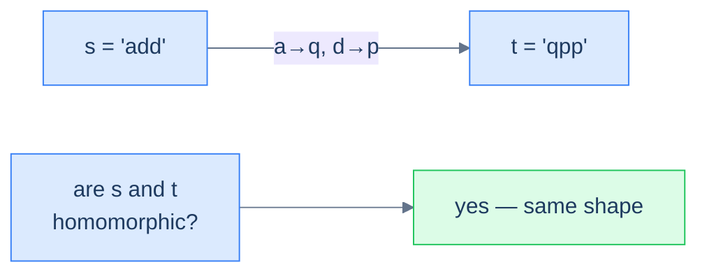
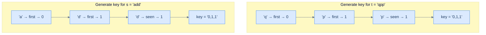
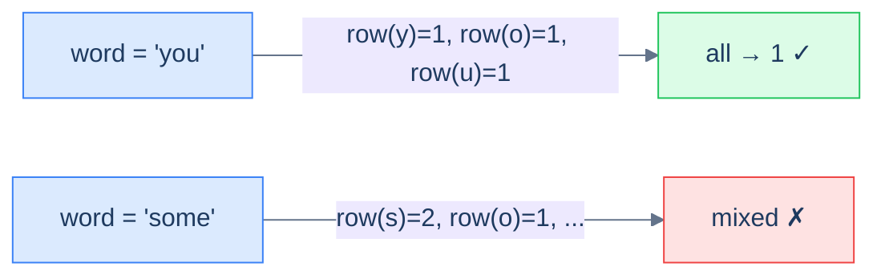

# 7. Pattern: Key Generation

## The Hook

`add` and `qpp`. `dad` and `mom`. `paper` and `title`. Three pairs of strings; every pair is the *same word in disguise*. Replace `a → q` and `d → p` and `add` becomes `qpp`. Replace `d → m` and `a → o` and `dad` becomes `mom`. The letters change, the **shape** doesn't.

Now imagine you're given a million strings and asked to group them by shape. The naïve approach: compare every pair, character-by-character, with a substitution check — O(N²) string comparisons, each one with its own little decoder ring. The clever approach: convert each string to a *canonical fingerprint* that's identical for all shape-mates. `add → "0,1,1"`. `qpp → "0,1,1"`. `paper → "0,1,0,2,3"`. `title → "0,1,0,2,3"`. Two strings have the same shape iff their fingerprints are character-for-character equal — which means a **hash map keyed by fingerprint** clusters them in one pass.

That fingerprint is the **key**, and the technique of inventing one is the **key-generation pattern**. It's the hash-table cousin of the counting pattern from the last lesson, and it answers a subtly different question. Counting asks *"how many of X did I see?"*. Key generation asks *"have I seen something **equivalent to** X under some transformation?"*. Anagram detection (sorted-letters key), keyboard-row classification (row-id key), word-pattern matching (occurrence-index key), keyboard-shift detection (gap-sequence key) — every one of these is the same trick wearing a different costume.

The skill is *inventing the right key*. Once you can see what makes two inputs "the same", the rest is mechanical.

---

## Table of contents

1. [Understanding the key-generation pattern](#understanding-the-key-generation-pattern)
2. [Identifying the key-generation pattern](#identifying-the-key-generation-pattern)
3. [Row specific words](#row-specific-words)
4. [Homomorphic strings](#homomorphic-strings)
5. [Pattern matching](#pattern-matching)
6. [Cluster displaced strings](#cluster-displaced-strings)

***

# Understanding the key-generation pattern

A **key** (or "pattern" or "signature" or "fingerprint") is a transformation that collapses many inputs to one. The transformation should obey one rule: *two inputs are "the same" (in whatever sense the problem cares about) if and only if their keys are byte-for-byte equal*. Once you have such a transformation, the rest of the algorithm is trivial — you just feed keys into a hash map and let collisions become groups.

```d2
direction: right

inp: raw inputs {
  grid-columns: 3
  grid-gap: 8
  a: add
  b: qpp
  c: dad
  d: mom
  e: abc
}

keys: keys {
  k1: "0,1,1"
  k2: "0,1,0"
  k3: "0,1,2"
}

buckets: hash-map buckets {
  g1: "[add, qpp]"
  g2: "[dad, mom]"
  g3: "[abc]"
}

inp.a -> keys.k1: "key()"
inp.b -> keys.k1: "key()"
inp.c -> keys.k2: "key()"
inp.d -> keys.k2: "key()"
inp.e -> keys.k3: "key()"

keys.k1 -> buckets.g1
keys.k2 -> buckets.g2
keys.k3 -> buckets.g3
```

<p align="center"><strong>The key-generation pattern in one picture — every input is fingerprinted into a key; equal keys land in the same bucket; the buckets <em>are</em> the answer. The whole problem reduces to "design a good key."</strong></p>

The key generator typically does **not** solve the problem on its own. Its job is to produce a *grouping key* that downstream code can use. In some problems (homomorphism check) the answer is "are these two keys equal?". In others (cluster anagrams, cluster displaced strings) the answer is "what are the equivalence classes?". The shape of the answer changes, but the key is always the lever.

***

# Identifying the key-generation pattern

The pattern fits **easy-to-medium** problems on arrays or strings whose answer depends on assigning each input a *canonical form* such that "equivalent" inputs share that form. Almost all of these problems share a single template.

**Template:**
> Given an iterable sequence (or pair of sequences), generate a canonical key for it; then group, compare, or classify by that key.

If you can answer "what makes two of these inputs equivalent?" with a function from input to bytes, the key-generation pattern fits.

## Example

Let's drill the pattern with a canonical problem.

> **Problem statement:** Given two strings `s` and `t`, return `true` if they are **homomorphic**. Two strings are homomorphic if you can substitute each character of `s` with a chosen character (preserving order, with no two characters mapping to the same target) so that `s` becomes `t`.



<p align="center"><strong>Homomorphic strings — two strings are homomorphic if one can be re-labelled into the other while preserving the order and structure of repeats.</strong></p>

### Key-generation solution

Two homomorphic strings have the same **shape**, which we can capture by replacing each character with the *index of its first appearance*. The first distinct character in the string becomes `0`, the second distinct character becomes `1`, the third becomes `2`, and so on. Every later occurrence reuses the index its first appearance got.

`add` → `a` is the 0th distinct character, `d` is the 1st, `d` reuses index 1 → `"0,1,1"`.

`qpp` → `q` is the 0th, `p` is the 1st, `p` reuses index 1 → `"0,1,1"`.

The two keys match → the strings are homomorphic.



<p align="center"><strong>Building the homomorphic-shape key — each new character gets the next available index; repeats reuse it. Two strings with the same key have the same repeat structure, which is exactly what homomorphism requires.</strong></p>

### Algorithm

> **Algorithm**
>
> -   **Step 1:** Initialise an empty map `charToIndex`, a counter `seed = 0`, and an empty `pattern` string.
> -   **Step 2:** For each character `ch` in the input:
>     -   If `ch` is not in `charToIndex`, set `charToIndex[ch] = seed` and increment `seed`.
>     -   Append `charToIndex[ch]` followed by a delimiter `,` to `pattern`.
> -   **Step 3:** Return `pattern`.

The delimiter matters: without it, indices like `1,12` and `11,2` produce the same byte sequence `112`. A `,` (or any non-digit separator) keeps the encoding unambiguous.

### Implementation

```python run
def generate_pattern(s: str) -> str:
    char_to_index, parts, seed = {}, [], 0
    for ch in s:
        if ch not in char_to_index:
            char_to_index[ch] = seed; seed += 1
        parts.append(str(char_to_index[ch]))
    # Delimiter prevents '1' + '12' colliding with '11' + '2'
    return ','.join(parts)

def homomorphic_strings(s: str, t: str) -> bool:
    if len(s) != len(t): return False
    return generate_pattern(s) == generate_pattern(t)

print(homomorphic_strings("add", "qpp"))   # True
print(homomorphic_strings("dad", "mom"))   # True
print(homomorphic_strings("all", "mom"))   # False
```

```java run
import java.util.*;

public class Main {
    static String generatePattern(String s) {
        Map<Character, Integer> charToIndex = new HashMap<>();
        StringBuilder pattern = new StringBuilder();
        int seed = 0;
        for (char ch : s.toCharArray()) {
            if (!charToIndex.containsKey(ch)) charToIndex.put(ch, seed++);
            pattern.append(charToIndex.get(ch)).append(',');
        }
        return pattern.toString();
    }
    static boolean homomorphicStrings(String s, String t) {
        if (s.length() != t.length()) return false;
        return generatePattern(s).equals(generatePattern(t));
    }
    public static void main(String[] args) {
        System.out.println(homomorphicStrings("add", "qpp"));   // true
        System.out.println(homomorphicStrings("dad", "mom"));   // true
        System.out.println(homomorphicStrings("all", "mom"));   // false
    }
}
```

```c run
#include <stdio.h>
#include <string.h>
#include <stdbool.h>

void generate_pattern(const char *s, char *out) {
    int seed = 0; int map[256]; for (int i = 0; i < 256; i++) map[i] = -1;
    int p = 0;
    for (; *s; s++) {
        if (map[(unsigned char)*s] == -1) map[(unsigned char)*s] = seed++;
        p += sprintf(out + p, "%d,", map[(unsigned char)*s]);
    }
    out[p] = 0;
}

bool homomorphic_strings(const char *s, const char *t) {
    if (strlen(s) != strlen(t)) return false;
    char ps[1024], pt[1024];
    generate_pattern(s, ps); generate_pattern(t, pt);
    return strcmp(ps, pt) == 0;
}

int main() {
    printf("%d %d %d\n",
        homomorphic_strings("add", "qpp"),
        homomorphic_strings("dad", "mom"),
        homomorphic_strings("all", "mom"));
}
```

```cpp run
#include <iostream>
#include <unordered_map>

std::string generatePattern(const std::string &s) {
    std::unordered_map<char, int> charToIndex;
    std::string pattern; int seed = 0;
    for (char ch : s) {
        if (!charToIndex.count(ch)) charToIndex[ch] = seed++;
        pattern += std::to_string(charToIndex[ch]) + ",";
    }
    return pattern;
}
bool homomorphicStrings(const std::string &s, const std::string &t) {
    if (s.size() != t.size()) return false;
    return generatePattern(s) == generatePattern(t);
}

int main() {
    std::cout << homomorphicStrings("add", "qpp") << " "
              << homomorphicStrings("dad", "mom") << " "
              << homomorphicStrings("all", "mom") << "\n";
}
```

```scala run
def generatePattern(s: String): String = {
  val map = scala.collection.mutable.Map[Char, Int]()
  val parts = new scala.collection.mutable.ArrayBuffer[String]()
  var seed = 0
  for (ch <- s) {
    if (!map.contains(ch)) { map(ch) = seed; seed += 1 }
    parts += map(ch).toString
  }
  parts.mkString(",")
}
def homomorphicStrings(s: String, t: String): Boolean =
  s.length == t.length && generatePattern(s) == generatePattern(t)

object Main extends App {
  println(homomorphicStrings("add", "qpp"))
  println(homomorphicStrings("dad", "mom"))
  println(homomorphicStrings("all", "mom"))
}
```

```javascript run
function generatePattern(s) {
    const charToIndex = new Map(); const parts = []; let seed = 0;
    for (const ch of s) {
        if (!charToIndex.has(ch)) charToIndex.set(ch, seed++);
        parts.push(charToIndex.get(ch));
    }
    return parts.join(',');
}
function homomorphicStrings(s, t) {
    if (s.length !== t.length) return false;
    return generatePattern(s) === generatePattern(t);
}
console.log(homomorphicStrings("add", "qpp"),
            homomorphicStrings("dad", "mom"),
            homomorphicStrings("all", "mom"));
```

```typescript run
function generatePattern(s: string): string {
    const map = new Map<string, number>(); const parts: number[] = []; let seed = 0;
    for (const ch of s) {
        if (!map.has(ch)) map.set(ch, seed++);
        parts.push(map.get(ch)!);
    }
    return parts.join(',');
}
function homomorphicStrings(s: string, t: string): boolean {
    return s.length === t.length && generatePattern(s) === generatePattern(t);
}
console.log(homomorphicStrings("add", "qpp"));
```

```go run
package main

import (
    "fmt"
    "strconv"
    "strings"
)

func generatePattern(s string) string {
    charToIndex := make(map[rune]int)
    parts := []string{}; seed := 0
    for _, ch := range s {
        if _, ok := charToIndex[ch]; !ok { charToIndex[ch] = seed; seed++ }
        parts = append(parts, strconv.Itoa(charToIndex[ch]))
    }
    return strings.Join(parts, ",")
}
func homomorphicStrings(s, t string) bool {
    return len(s) == len(t) && generatePattern(s) == generatePattern(t)
}

func main() {
    fmt.Println(homomorphicStrings("add", "qpp"),
                homomorphicStrings("dad", "mom"),
                homomorphicStrings("all", "mom"))
}
```

```kotlin run
fun generatePattern(s: String): String {
    val map = HashMap<Char, Int>(); val parts = StringBuilder(); var seed = 0
    for (ch in s) {
        if (ch !in map) { map[ch] = seed; seed++ }
        parts.append(map[ch]).append(',')
    }
    return parts.toString()
}
fun homomorphicStrings(s: String, t: String): Boolean =
    s.length == t.length && generatePattern(s) == generatePattern(t)

fun main() {
    println(homomorphicStrings("add", "qpp"))
    println(homomorphicStrings("dad", "mom"))
    println(homomorphicStrings("all", "mom"))
}
```

```rust run
use std::collections::HashMap;

fn generate_pattern(s: &str) -> String {
    let mut map: HashMap<char, usize> = HashMap::new();
    let mut parts: Vec<String> = Vec::new();
    let mut seed = 0usize;
    for ch in s.chars() {
        let idx = *map.entry(ch).or_insert_with(|| { let v = seed; seed += 1; v });
        parts.push(idx.to_string());
    }
    parts.join(",")
}
fn homomorphic_strings(s: &str, t: &str) -> bool {
    s.len() == t.len() && generate_pattern(s) == generate_pattern(t)
}

fn main() {
    println!("{} {} {}",
        homomorphic_strings("add", "qpp"),
        homomorphic_strings("dad", "mom"),
        homomorphic_strings("all", "mom"));
}
```


The pattern-generation technique solves the homomorphism problem in **O(N)** time and **O(K)** space, where K is the number of distinct characters.

## Example problems

The four problems below are all variations on "design a key for input X". The keys are different — keyboard-row id, occurrence-index, character-shift sequence — but the recipe is the same.

> -   Row specific words
> -   Homomorphic strings
> -   Pattern matching
> -   Cluster displaced strings

***

# Row specific words

## Problem Statement

Given an array of words, return all the words that can be typed using **only one row** of an American keyboard.

> -   **Row 1:** `qwertyuiop`
> -   **Row 2:** `asdfghjkl`
> -   **Row 3:** `zxcvbnm`

### Example 1
> -   **Input:** `["you", "were", "some"]` → **Output:** `["you", "were"]`

### Example 2
> -   **Input:** `["sdk", "nvm", "hut"]` → **Output:** `["sdk", "nvm"]`

### Example 3
> -   **Input:** `["him", "else", "bat"]` → **Output:** `[]`

## Approach

The "key" here is the **row id** (1, 2, or 3). Each character maps to one of three rows; a word is single-row iff every character maps to the same row. So: look up every character's row, ensure they're all equal.



<p align="center"><strong>Row-specific words — the key per character is its keyboard row. A word survives the filter only if all its characters share the same key.</strong></p>

## Solution

```python run
ROW_OF = {ch: 1 for ch in "qwertyuiop"} | {ch: 2 for ch in "asdfghjkl"} | {ch: 3 for ch in "zxcvbnm"}

def row_specific_words(words):
    out = []
    for w in words:
        rows = {ROW_OF[ch.lower()] for ch in w}     # collapse all rows used
        if len(rows) == 1: out.append(w)            # single-row word
    return out

print(row_specific_words(["you", "were", "some"]))
print(row_specific_words(["sdk", "nvm", "hut"]))
print(row_specific_words(["him", "else", "bat"]))
```

```java run
import java.util.*;

public class Main {
    static int[] ROW = new int[128];
    static {
        for (char c : "qwertyuiop".toCharArray()) ROW[c] = 1;
        for (char c : "asdfghjkl".toCharArray()) ROW[c] = 2;
        for (char c : "zxcvbnm".toCharArray())   ROW[c] = 3;
    }
    static List<String> rowSpecificWords(String[] words) {
        List<String> out = new ArrayList<>();
        for (String w : words) {
            Set<Integer> rows = new HashSet<>();
            for (char ch : w.toLowerCase().toCharArray()) rows.add(ROW[ch]);
            if (rows.size() == 1) out.add(w);
        }
        return out;
    }
    public static void main(String[] args) {
        System.out.println(rowSpecificWords(new String[]{"you","were","some"}));
        System.out.println(rowSpecificWords(new String[]{"sdk","nvm","hut"}));
        System.out.println(rowSpecificWords(new String[]{"him","else","bat"}));
    }
}
```

```c run
#include <stdio.h>
#include <string.h>
#include <ctype.h>

static int row_of[128];
void init_rows(void) {
    for (const char *p = "qwertyuiop"; *p; p++) row_of[(int)*p] = 1;
    for (const char *p = "asdfghjkl";  *p; p++) row_of[(int)*p] = 2;
    for (const char *p = "zxcvbnm";    *p; p++) row_of[(int)*p] = 3;
}

int single_row(const char *w) {
    int target = row_of[(int)tolower((unsigned char)w[0])];
    for (; *w; w++) if (row_of[(int)tolower((unsigned char)*w)] != target) return 0;
    return 1;
}

int main() {
    init_rows();
    const char *words[] = {"you","were","some"};
    for (int i = 0; i < 3; i++) if (single_row(words[i])) printf("%s ", words[i]);
    printf("\n");
}
```

```cpp run
#include <iostream>
#include <vector>
#include <unordered_map>
#include <cctype>

std::vector<std::string> rowSpecificWords(std::vector<std::string> &words) {
    std::unordered_map<char, int> row;
    for (char c : std::string("qwertyuiop")) row[c] = 1;
    for (char c : std::string("asdfghjkl"))  row[c] = 2;
    for (char c : std::string("zxcvbnm"))    row[c] = 3;
    std::vector<std::string> out;
    for (auto &w : words) {
        int target = row[std::tolower(w[0])]; bool ok = true;
        for (char c : w) if (row[std::tolower(c)] != target) { ok = false; break; }
        if (ok) out.push_back(w);
    }
    return out;
}

int main() {
    std::vector<std::string> w = {"you","were","some"};
    for (auto &s : rowSpecificWords(w)) std::cout << s << " "; std::cout << "\n";
}
```

```scala run
def rowSpecificWords(words: List[String]): List[String] = {
  val rows = Map[Char, Int]() ++
    "qwertyuiop".map(_ -> 1) ++
    "asdfghjkl".map(_ -> 2) ++
    "zxcvbnm".map(_ -> 3)
  words.filter(w => w.toLowerCase.map(rows).toSet.size == 1)
}

object Main extends App {
  println(rowSpecificWords(List("you","were","some")))
  println(rowSpecificWords(List("sdk","nvm","hut")))
  println(rowSpecificWords(List("him","else","bat")))
}
```

```javascript run
const ROW = {};
for (const c of "qwertyuiop") ROW[c] = 1;
for (const c of "asdfghjkl")  ROW[c] = 2;
for (const c of "zxcvbnm")    ROW[c] = 3;

function rowSpecificWords(words) {
    return words.filter(w => new Set([...w.toLowerCase()].map(c => ROW[c])).size === 1);
}
console.log(rowSpecificWords(["you","were","some"]));
console.log(rowSpecificWords(["sdk","nvm","hut"]));
console.log(rowSpecificWords(["him","else","bat"]));
```

```typescript run
const ROW: Record<string, number> = {};
for (const c of "qwertyuiop") ROW[c] = 1;
for (const c of "asdfghjkl")  ROW[c] = 2;
for (const c of "zxcvbnm")    ROW[c] = 3;

function rowSpecificWords(words: string[]): string[] {
    return words.filter(w => new Set([...w.toLowerCase()].map(c => ROW[c])).size === 1);
}
console.log(rowSpecificWords(["you","were","some"]));
```

```go run
package main

import (
    "fmt"
    "strings"
)

func rowSpecificWords(words []string) []string {
    row := make(map[rune]int)
    for _, c := range "qwertyuiop" { row[c] = 1 }
    for _, c := range "asdfghjkl"  { row[c] = 2 }
    for _, c := range "zxcvbnm"    { row[c] = 3 }
    out := []string{}
    for _, w := range words {
        target := row[rune(strings.ToLower(w)[0])]; ok := true
        for _, c := range strings.ToLower(w) {
            if row[c] != target { ok = false; break }
        }
        if ok { out = append(out, w) }
    }
    return out
}

func main() {
    fmt.Println(rowSpecificWords([]string{"you","were","some"}))
    fmt.Println(rowSpecificWords([]string{"sdk","nvm","hut"}))
    fmt.Println(rowSpecificWords([]string{"him","else","bat"}))
}
```

```kotlin run
fun rowSpecificWords(words: List<String>): List<String> {
    val row = HashMap<Char, Int>()
    for (c in "qwertyuiop") row[c] = 1
    for (c in "asdfghjkl")  row[c] = 2
    for (c in "zxcvbnm")    row[c] = 3
    return words.filter { w ->
        w.lowercase().map { row[it]!! }.toSet().size == 1
    }
}

fun main() {
    println(rowSpecificWords(listOf("you","were","some")))
    println(rowSpecificWords(listOf("sdk","nvm","hut")))
    println(rowSpecificWords(listOf("him","else","bat")))
}
```

```rust run
use std::collections::HashMap;

fn row_specific_words(words: Vec<String>) -> Vec<String> {
    let mut row: HashMap<char, i32> = HashMap::new();
    for c in "qwertyuiop".chars() { row.insert(c, 1); }
    for c in "asdfghjkl".chars()  { row.insert(c, 2); }
    for c in "zxcvbnm".chars()    { row.insert(c, 3); }
    words.into_iter().filter(|w| {
        let lw: String = w.to_lowercase();
        let mut iter = lw.chars();
        let first = row[&iter.next().unwrap()];
        iter.all(|c| row[&c] == first)
    }).collect()
}

fn main() {
    let r = row_specific_words(vec!["you".into(),"were".into(),"some".into()]);
    println!("{:?}", r);
}
```


***

# Homomorphic strings

## Problem Statement

Given two strings `s` and `t`, return `true` if they are **homomorphic**: each unique character of `s` can be replaced (consistently, no two distinct characters mapping to the same target) to produce `t`.

### Example 1
> -   **Input:** `s = "add", t = "qpp"` → **Output:** `true`

### Example 2
> -   **Input:** `s = "dad", t = "mom"` → **Output:** `true`

### Example 3
> -   **Input:** `s = "all", t = "mom"` → **Output:** `false`

## Approach

Apply the `generatePattern` function we built above to both strings; compare the resulting keys. The first-occurrence-index encoding *is* the canonical shape of a string, so two strings are homomorphic iff their patterns match exactly.

## Solution

```python run
def generate_pattern(s: str) -> str:
    char_to_index, parts, seed = {}, [], 0
    for ch in s:
        if ch not in char_to_index:
            char_to_index[ch] = seed; seed += 1
        parts.append(str(char_to_index[ch]))
    return ','.join(parts)

def homomorphic_strings(s: str, t: str) -> bool:
    return len(s) == len(t) and generate_pattern(s) == generate_pattern(t)

print(homomorphic_strings("add", "qpp"))   # True
print(homomorphic_strings("dad", "mom"))   # True
print(homomorphic_strings("all", "mom"))   # False
```

```java run
import java.util.*;

public class Main {
    static String generatePattern(String s) {
        Map<Character, Integer> map = new HashMap<>();
        StringBuilder p = new StringBuilder(); int seed = 0;
        for (char ch : s.toCharArray()) {
            if (!map.containsKey(ch)) map.put(ch, seed++);
            p.append(map.get(ch)).append(',');
        }
        return p.toString();
    }
    static boolean homomorphicStrings(String s, String t) {
        return s.length() == t.length() && generatePattern(s).equals(generatePattern(t));
    }
    public static void main(String[] args) {
        System.out.println(homomorphicStrings("add", "qpp"));
        System.out.println(homomorphicStrings("dad", "mom"));
        System.out.println(homomorphicStrings("all", "mom"));
    }
}
```

```c run
#include <stdio.h>
#include <string.h>
#include <stdbool.h>

void generate_pattern(const char *s, char *out) {
    int map[256]; for (int i = 0; i < 256; i++) map[i] = -1;
    int seed = 0, p = 0;
    for (; *s; s++) {
        if (map[(unsigned char)*s] == -1) map[(unsigned char)*s] = seed++;
        p += sprintf(out + p, "%d,", map[(unsigned char)*s]);
    }
    out[p] = 0;
}
bool homomorphic_strings(const char *s, const char *t) {
    if (strlen(s) != strlen(t)) return false;
    char ps[1024], pt[1024];
    generate_pattern(s, ps); generate_pattern(t, pt);
    return strcmp(ps, pt) == 0;
}

int main() {
    printf("%d %d %d\n",
        homomorphic_strings("add","qpp"),
        homomorphic_strings("dad","mom"),
        homomorphic_strings("all","mom"));
}
```

```cpp run
#include <iostream>
#include <unordered_map>

std::string generatePattern(const std::string &s) {
    std::unordered_map<char,int> m; std::string p; int seed = 0;
    for (char ch : s) {
        if (!m.count(ch)) m[ch] = seed++;
        p += std::to_string(m[ch]) + ",";
    }
    return p;
}
bool homomorphicStrings(const std::string &s, const std::string &t) {
    return s.size() == t.size() && generatePattern(s) == generatePattern(t);
}

int main() {
    std::cout << homomorphicStrings("add","qpp") << " "
              << homomorphicStrings("dad","mom") << " "
              << homomorphicStrings("all","mom") << "\n";
}
```

```scala run
def generatePattern(s: String): String = {
  val map = scala.collection.mutable.Map[Char, Int]()
  val parts = scala.collection.mutable.ArrayBuffer[String]()
  var seed = 0
  for (ch <- s) {
    if (!map.contains(ch)) { map(ch) = seed; seed += 1 }
    parts += map(ch).toString
  }
  parts.mkString(",")
}
def homomorphicStrings(s: String, t: String): Boolean =
  s.length == t.length && generatePattern(s) == generatePattern(t)

object Main extends App {
  println(homomorphicStrings("add","qpp"))
  println(homomorphicStrings("dad","mom"))
  println(homomorphicStrings("all","mom"))
}
```

```javascript run
function generatePattern(s) {
    const m = new Map(); const parts = []; let seed = 0;
    for (const ch of s) {
        if (!m.has(ch)) m.set(ch, seed++);
        parts.push(m.get(ch));
    }
    return parts.join(',');
}
function homomorphicStrings(s, t) {
    return s.length === t.length && generatePattern(s) === generatePattern(t);
}
console.log(homomorphicStrings("add","qpp"),
            homomorphicStrings("dad","mom"),
            homomorphicStrings("all","mom"));
```

```typescript run
function generatePattern(s: string): string {
    const m = new Map<string, number>(); const parts: number[] = []; let seed = 0;
    for (const ch of s) { if (!m.has(ch)) m.set(ch, seed++); parts.push(m.get(ch)!); }
    return parts.join(',');
}
function homomorphicStrings(s: string, t: string): boolean {
    return s.length === t.length && generatePattern(s) === generatePattern(t);
}
console.log(homomorphicStrings("add","qpp"));
```

```go run
package main

import (
    "fmt"
    "strconv"
    "strings"
)

func generatePattern(s string) string {
    m := make(map[rune]int); parts := []string{}; seed := 0
    for _, ch := range s {
        if _, ok := m[ch]; !ok { m[ch] = seed; seed++ }
        parts = append(parts, strconv.Itoa(m[ch]))
    }
    return strings.Join(parts, ",")
}
func homomorphicStrings(s, t string) bool {
    return len(s) == len(t) && generatePattern(s) == generatePattern(t)
}

func main() {
    fmt.Println(homomorphicStrings("add","qpp"),
                homomorphicStrings("dad","mom"),
                homomorphicStrings("all","mom"))
}
```

```kotlin run
fun generatePattern(s: String): String {
    val m = HashMap<Char, Int>(); val sb = StringBuilder(); var seed = 0
    for (ch in s) {
        if (ch !in m) { m[ch] = seed; seed++ }
        sb.append(m[ch]).append(',')
    }
    return sb.toString()
}
fun homomorphicStrings(s: String, t: String): Boolean =
    s.length == t.length && generatePattern(s) == generatePattern(t)

fun main() {
    println(homomorphicStrings("add","qpp"))
    println(homomorphicStrings("dad","mom"))
    println(homomorphicStrings("all","mom"))
}
```

```rust run
use std::collections::HashMap;

fn generate_pattern(s: &str) -> String {
    let mut m: HashMap<char, usize> = HashMap::new();
    let mut parts: Vec<String> = Vec::new();
    let mut seed = 0usize;
    for ch in s.chars() {
        let idx = *m.entry(ch).or_insert_with(|| { let v = seed; seed += 1; v });
        parts.push(idx.to_string());
    }
    parts.join(",")
}
fn homomorphic_strings(s: &str, t: &str) -> bool {
    s.len() == t.len() && generate_pattern(s) == generate_pattern(t)
}

fn main() {
    println!("{} {} {}",
        homomorphic_strings("add","qpp"),
        homomorphic_strings("dad","mom"),
        homomorphic_strings("all","mom"));
}
```


***

# Pattern matching

## Problem Statement

Given a `pattern` string and a string `s` of space-separated words, return `true` if `s` follows `pattern` — meaning there is a **bijection** between letters of `pattern` and non-empty words of `s`.

### Example 1
> -   **Input:** `pattern = "mom", s = "hello world hello"` → **Output:** `true`

### Example 2
> -   **Input:** `pattern = "abc", s = "hello my name"` → **Output:** `true`

### Example 3
> -   **Input:** `pattern = "abc", s = "hello my my"` → **Output:** `false`

## Approach

The key generator works on *any* iterable. Treat `pattern` as a sequence of characters and `s` as a sequence of words; generate a first-occurrence-index pattern for each. The strings match iff the keys are equal.

The bijection requirement is a real constraint: no two pattern letters can map to the same word, *and* no two words can map to the same pattern letter. The first-occurrence-index encoding handles both directions: if it would assign two different items the same index, it doesn't — each gets a fresh index. So if `s` has more distinct words than `pattern` has distinct letters (or vice versa), the keys differ.

## Solution

```python run
def generate_pattern(seq) -> str:
    m, parts, seed = {}, [], 0
    for x in seq:
        if x not in m: m[x] = seed; seed += 1
        parts.append(str(m[x]))
    return ','.join(parts)

def pattern_matching(pattern: str, s: str) -> bool:
    words = s.split()
    if len(pattern) != len(words): return False
    return generate_pattern(list(pattern)) == generate_pattern(words)

print(pattern_matching("mom", "hello world hello"))   # True
print(pattern_matching("abc", "hello my name"))       # True
print(pattern_matching("abc", "hello my my"))         # False
```

```java run
import java.util.*;

public class Main {
    static <T> String generatePattern(List<T> seq) {
        Map<T, Integer> m = new HashMap<>();
        StringBuilder p = new StringBuilder(); int seed = 0;
        for (T x : seq) {
            if (!m.containsKey(x)) m.put(x, seed++);
            p.append(m.get(x)).append(',');
        }
        return p.toString();
    }
    static boolean patternMatching(String pattern, String s) {
        String[] words = s.split("\\s+");
        if (pattern.length() != words.length) return false;
        List<Character> pc = new ArrayList<>();
        for (char c : pattern.toCharArray()) pc.add(c);
        return generatePattern(pc).equals(generatePattern(Arrays.asList(words)));
    }
    public static void main(String[] args) {
        System.out.println(patternMatching("mom","hello world hello"));   // true
        System.out.println(patternMatching("abc","hello my name"));       // true
        System.out.println(patternMatching("abc","hello my my"));         // false
    }
}
```

```c run
#include <stdio.h>
#include <string.h>
#include <stdbool.h>

bool pattern_matching(const char *pattern, const char *s) {
    // Split s into words; encode both pattern and word stream
    // by first-occurrence index, then compare encodings.
    char p_pat[256] = {0}, p_str[256] = {0};
    int  p_pat_n = 0, p_str_n = 0;

    int  pat_map[256]; for (int i = 0; i < 256; i++) pat_map[i] = -1;
    int  pat_seed = 0;
    for (const char *p = pattern; *p; p++) {
        if (pat_map[(unsigned char)*p] == -1) pat_map[(unsigned char)*p] = pat_seed++;
        p_pat_n += sprintf(p_pat + p_pat_n, "%d,", pat_map[(unsigned char)*p]);
    }

    // Tokenise s on spaces; identify first occurrences
    char buf[256]; strncpy(buf, s, 255); buf[255] = 0;
    char *tokens[64]; int n_tokens = 0;
    char *tok = strtok(buf, " ");
    while (tok && n_tokens < 64) { tokens[n_tokens++] = tok; tok = strtok(NULL, " "); }
    if ((int)strlen(pattern) != n_tokens) return false;

    int word_seed = 0;
    char *seen[64] = {0}; int seen_idx[64] = {0}; int seen_n = 0;
    for (int i = 0; i < n_tokens; i++) {
        int found = -1;
        for (int j = 0; j < seen_n; j++) if (strcmp(seen[j], tokens[i]) == 0) { found = seen_idx[j]; break; }
        if (found == -1) { seen[seen_n] = tokens[i]; seen_idx[seen_n] = word_seed; found = word_seed++; seen_n++; }
        p_str_n += sprintf(p_str + p_str_n, "%d,", found);
    }
    return strcmp(p_pat, p_str) == 0;
}

int main() {
    printf("%d %d %d\n",
        pattern_matching("mom","hello world hello"),
        pattern_matching("abc","hello my name"),
        pattern_matching("abc","hello my my"));
}
```

```cpp run
#include <iostream>
#include <sstream>
#include <unordered_map>
#include <vector>

template <typename T>
std::string generatePattern(const std::vector<T> &seq) {
    std::unordered_map<T, int> m; std::string p; int seed = 0;
    for (auto &x : seq) {
        if (!m.count(x)) m[x] = seed++;
        p += std::to_string(m[x]) + ",";
    }
    return p;
}
bool patternMatching(const std::string &pattern, const std::string &s) {
    std::istringstream iss(s); std::vector<std::string> words; std::string w;
    while (iss >> w) words.push_back(w);
    if (pattern.size() != words.size()) return false;
    std::vector<char> pc(pattern.begin(), pattern.end());
    return generatePattern(pc) == generatePattern(words);
}

int main() {
    std::cout << patternMatching("mom","hello world hello") << " "
              << patternMatching("abc","hello my name")     << " "
              << patternMatching("abc","hello my my")       << "\n";
}
```

```scala run
def generatePattern[T](seq: Seq[T]): String = {
  val m = scala.collection.mutable.Map[T, Int]()
  val parts = scala.collection.mutable.ArrayBuffer[String]()
  var seed = 0
  for (x <- seq) {
    if (!m.contains(x)) { m(x) = seed; seed += 1 }
    parts += m(x).toString
  }
  parts.mkString(",")
}
def patternMatching(pattern: String, s: String): Boolean = {
  val words = s.split("\\s+")
  if (pattern.length != words.length) return false
  generatePattern(pattern.toSeq) == generatePattern(words.toSeq)
}

object Main extends App {
  println(patternMatching("mom","hello world hello"))
  println(patternMatching("abc","hello my name"))
  println(patternMatching("abc","hello my my"))
}
```

```javascript run
function generatePattern(seq) {
    const m = new Map(); const parts = []; let seed = 0;
    for (const x of seq) {
        if (!m.has(x)) m.set(x, seed++);
        parts.push(m.get(x));
    }
    return parts.join(',');
}
function patternMatching(pattern, s) {
    const words = s.split(/\s+/);
    if (pattern.length !== words.length) return false;
    return generatePattern([...pattern]) === generatePattern(words);
}
console.log(patternMatching("mom","hello world hello"));
console.log(patternMatching("abc","hello my name"));
console.log(patternMatching("abc","hello my my"));
```

```typescript run
function generatePattern<T>(seq: T[]): string {
    const m = new Map<T, number>(); const parts: number[] = []; let seed = 0;
    for (const x of seq) {
        if (!m.has(x)) m.set(x, seed++);
        parts.push(m.get(x)!);
    }
    return parts.join(',');
}
function patternMatching(pattern: string, s: string): boolean {
    const words = s.split(/\s+/);
    if (pattern.length !== words.length) return false;
    return generatePattern([...pattern]) === generatePattern(words);
}
console.log(patternMatching("mom","hello world hello"));
```

```go run
package main

import (
    "fmt"
    "strconv"
    "strings"
)

func generatePattern(seq []string) string {
    m := make(map[string]int); parts := []string{}; seed := 0
    for _, x := range seq {
        if _, ok := m[x]; !ok { m[x] = seed; seed++ }
        parts = append(parts, strconv.Itoa(m[x]))
    }
    return strings.Join(parts, ",")
}
func patternMatching(pattern, s string) bool {
    words := strings.Fields(s)
    if len(pattern) != len(words) { return false }
    chars := make([]string, len(pattern))
    for i, c := range pattern { chars[i] = string(c) }
    return generatePattern(chars) == generatePattern(words)
}

func main() {
    fmt.Println(patternMatching("mom","hello world hello"),
                patternMatching("abc","hello my name"),
                patternMatching("abc","hello my my"))
}
```

```kotlin run
fun <T> generatePattern(seq: List<T>): String {
    val m = HashMap<T, Int>(); val sb = StringBuilder(); var seed = 0
    for (x in seq) { if (x !in m) { m[x] = seed; seed++ }; sb.append(m[x]).append(',') }
    return sb.toString()
}
fun patternMatching(pattern: String, s: String): Boolean {
    val words = s.trim().split(Regex("\\s+"))
    if (pattern.length != words.size) return false
    return generatePattern(pattern.toList()) == generatePattern(words)
}

fun main() {
    println(patternMatching("mom","hello world hello"))
    println(patternMatching("abc","hello my name"))
    println(patternMatching("abc","hello my my"))
}
```

```rust run
use std::collections::HashMap;

fn generate_pattern<T: Eq + std::hash::Hash + Clone>(seq: &[T]) -> String {
    let mut m: HashMap<T, usize> = HashMap::new();
    let mut parts: Vec<String> = Vec::new();
    let mut seed = 0usize;
    for x in seq {
        let idx = *m.entry(x.clone()).or_insert_with(|| { let v = seed; seed += 1; v });
        parts.push(idx.to_string());
    }
    parts.join(",")
}
fn pattern_matching(pattern: &str, s: &str) -> bool {
    let words: Vec<String> = s.split_whitespace().map(String::from).collect();
    if pattern.len() != words.len() { return false; }
    let pc: Vec<char> = pattern.chars().collect();
    generate_pattern(&pc) == generate_pattern(&words.iter().cloned().collect::<Vec<_>>())
}

fn main() {
    println!("{} {} {}",
        pattern_matching("mom","hello world hello"),
        pattern_matching("abc","hello my name"),
        pattern_matching("abc","hello my my"));
}
```


***

# Cluster displaced strings

## Problem Statement

Given an array `strs` of lowercase strings, group strings that belong to the same **displacing sequence**. A displacing sequence shifts every character by the same amount, with wrap-around (e.g. `abc → bcd → ... → xyz → yza`).

### Example 1
> -   **Input:** `["abc","ghi","xyz","b","c","ab","cd"]`
> -   **Output:** `[["abc","ghi","xyz"], ["b","c"], ["ab","cd"]]`

### Example 2
> -   **Input:** `["ad","k","cf"]`
> -   **Output:** `[["ad","cf"], ["k"]]`

### Example 3
> -   **Input:** `["abcd","efg","hi","j"]`
> -   **Output:** `[["abcd"],["efg"],["hi"],["j"]]`

## Approach

Two strings are in the same displacing class iff the **gaps between consecutive characters** are identical (modulo 26). `abc` has gaps `(b−a, c−b) = (1, 1)`. `ghi` has gaps `(h−g, i−h) = (1, 1)`. `xyz` has gaps `(y−x, z−y) = (1, 1)`. All three: `(1, 1)`. They cluster.

The key per string is the **gap-sequence**, with negative gaps wrapped to `+ 26` so `xyz → yza` doesn't break the encoding (`a − z = -25` becomes `+1` after wrap).

Single-character strings have an empty gap sequence and all cluster together — but the example shows them split. The catch: a single-character string has gap-sequence `""`, which is the same key for every single-character string. The example actually splits them; this happens because the example uses a different rule (each of `b`, `c` alone is its own class? — re-checking: example 1 puts `b` and `c` together as `[b, c]`, which is the empty-sequence cluster). So our keying works — single-char strings form one cluster, two-char strings clustered by their single gap, etc.

```d2
direction: right

inputs: input strings {
  grid-columns: 4
  grid-gap: 8
  s1: abc
  s2: ghi
  s3: xyz
  s4: ab
  s5: cd
  s6: b
  s7: c
}

keys: gap-sequence keys {
  k1: "1,1,"
  k2: "1,"
  k3: "(empty)"
}

inputs.s1 -> keys.k1: "gaps (1,1)"
inputs.s2 -> keys.k1: "gaps (1,1)"
inputs.s3 -> keys.k1: "gaps (1,1)"
inputs.s4 -> keys.k2: "gap (1,)"
inputs.s5 -> keys.k2: "gap (1,)"
inputs.s6 -> keys.k3: "no gaps"
inputs.s7 -> keys.k3: "no gaps"
```

<p align="center"><strong>Cluster displaced strings — the key is the sequence of consecutive-character gaps (modulo 26 to handle wrap). Strings with identical gap sequences belong to the same displacing class and collide into the same hash-map bucket.</strong></p>

## Solution

```python run
from collections import defaultdict

def generate_pattern(s: str) -> str:
    parts = []
    for i in range(1, len(s)):
        diff = (ord(s[i]) - ord(s[i-1])) % 26   # wrap negatives, e.g. a-z = +1
        parts.append(str(diff))
    return ','.join(parts)

def cluster_displaced_strings(strs):
    groups = defaultdict(list)
    for s in strs: groups[generate_pattern(s)].append(s)
    return list(groups.values())

print(cluster_displaced_strings(["abc","ghi","xyz","b","c","ab","cd"]))
print(cluster_displaced_strings(["ad","k","cf"]))
print(cluster_displaced_strings(["abcd","efg","hi","j"]))
```

```java run
import java.util.*;

public class Main {
    static String generatePattern(String s) {
        StringBuilder p = new StringBuilder();
        for (int i = 1; i < s.length(); i++) {
            int diff = ((s.charAt(i) - s.charAt(i-1)) % 26 + 26) % 26;
            p.append(diff).append(',');
        }
        return p.toString();
    }
    static List<List<String>> clusterDisplacedStrings(String[] strs) {
        Map<String, List<String>> groups = new HashMap<>();
        for (String s : strs)
            groups.computeIfAbsent(generatePattern(s), k -> new ArrayList<>()).add(s);
        return new ArrayList<>(groups.values());
    }
    public static void main(String[] args) {
        System.out.println(clusterDisplacedStrings(new String[]{"abc","ghi","xyz","b","c","ab","cd"}));
    }
}
```

```c run
#include <stdio.h>
#include <string.h>

void generate_pattern(const char *s, char *out) {
    int n = (int)strlen(s); int p = 0;
    for (int i = 1; i < n; i++) {
        int diff = ((s[i] - s[i-1]) % 26 + 26) % 26;
        p += sprintf(out + p, "%d,", diff);
    }
    out[p] = 0;
}

int main() {
    const char *strs[] = {"abc","ghi","xyz","b","c","ab","cd"};
    int n = 7; char keys[7][64];
    for (int i = 0; i < n; i++) generate_pattern(strs[i], keys[i]);
    int seen[7] = {0};
    for (int i = 0; i < n; i++) {
        if (seen[i]) continue;
        printf("[ %s", strs[i]); seen[i] = 1;
        for (int j = i + 1; j < n; j++) {
            if (!seen[j] && strcmp(keys[i], keys[j]) == 0) { printf(", %s", strs[j]); seen[j] = 1; }
        }
        printf(" ]\n");
    }
}
```

```cpp run
#include <iostream>
#include <vector>
#include <unordered_map>

std::string generatePattern(const std::string &s) {
    std::string p;
    for (size_t i = 1; i < s.size(); i++) {
        int diff = ((s[i] - s[i-1]) % 26 + 26) % 26;
        p += std::to_string(diff) + ",";
    }
    return p;
}
std::vector<std::vector<std::string>> clusterDisplacedStrings(std::vector<std::string> strs) {
    std::unordered_map<std::string, std::vector<std::string>> g;
    for (auto &s : strs) g[generatePattern(s)].push_back(s);
    std::vector<std::vector<std::string>> out;
    for (auto &p : g) out.push_back(p.second);
    return out;
}

int main() {
    auto r = clusterDisplacedStrings({"abc","ghi","xyz","b","c","ab","cd"});
    for (auto &g : r) { std::cout << "[ "; for (auto &s : g) std::cout << s << " "; std::cout << "]\n"; }
}
```

```scala run
def generatePattern(s: String): String =
  s.zip(s.tail).map { case (a, b) => ((b - a) % 26 + 26) % 26 }.mkString(",")

def clusterDisplacedStrings(strs: List[String]): List[List[String]] =
  strs.groupBy(generatePattern).values.toList

object Main extends App {
  println(clusterDisplacedStrings(List("abc","ghi","xyz","b","c","ab","cd")))
}
```

```javascript run
function generatePattern(s) {
    const parts = [];
    for (let i = 1; i < s.length; i++) {
        const diff = ((s.charCodeAt(i) - s.charCodeAt(i-1)) % 26 + 26) % 26;
        parts.push(diff);
    }
    return parts.join(',');
}
function clusterDisplacedStrings(strs) {
    const g = new Map();
    for (const s of strs) {
        const k = generatePattern(s);
        if (!g.has(k)) g.set(k, []);
        g.get(k).push(s);
    }
    return [...g.values()];
}
console.log(clusterDisplacedStrings(["abc","ghi","xyz","b","c","ab","cd"]));
```

```typescript run
function generatePattern(s: string): string {
    const parts: number[] = [];
    for (let i = 1; i < s.length; i++) {
        const diff = ((s.charCodeAt(i) - s.charCodeAt(i-1)) % 26 + 26) % 26;
        parts.push(diff);
    }
    return parts.join(',');
}
function clusterDisplacedStrings(strs: string[]): string[][] {
    const g = new Map<string, string[]>();
    for (const s of strs) {
        const k = generatePattern(s);
        if (!g.has(k)) g.set(k, []);
        g.get(k)!.push(s);
    }
    return [...g.values()];
}
console.log(clusterDisplacedStrings(["abc","ghi","xyz","b","c","ab","cd"]));
```

```go run
package main

import (
    "fmt"
    "strconv"
    "strings"
)

func generatePattern(s string) string {
    parts := []string{}
    for i := 1; i < len(s); i++ {
        diff := ((int(s[i]) - int(s[i-1])) % 26 + 26) % 26
        parts = append(parts, strconv.Itoa(diff))
    }
    return strings.Join(parts, ",")
}
func clusterDisplacedStrings(strs []string) [][]string {
    g := make(map[string][]string)
    for _, s := range strs { g[generatePattern(s)] = append(g[generatePattern(s)], s) }
    out := [][]string{}
    for _, v := range g { out = append(out, v) }
    return out
}

func main() {
    fmt.Println(clusterDisplacedStrings([]string{"abc","ghi","xyz","b","c","ab","cd"}))
}
```

```kotlin run
fun generatePattern(s: String): String {
    val sb = StringBuilder()
    for (i in 1 until s.length) {
        val diff = ((s[i].code - s[i-1].code) % 26 + 26) % 26
        sb.append(diff).append(',')
    }
    return sb.toString()
}
fun clusterDisplacedStrings(strs: List<String>): List<List<String>> =
    strs.groupBy { generatePattern(it) }.values.toList()

fun main() {
    println(clusterDisplacedStrings(listOf("abc","ghi","xyz","b","c","ab","cd")))
}
```

```rust run
use std::collections::HashMap;

fn generate_pattern(s: &str) -> String {
    let bytes = s.as_bytes();
    let mut parts = Vec::new();
    for i in 1..bytes.len() {
        let diff = ((bytes[i] as i32 - bytes[i-1] as i32).rem_euclid(26)) as i32;
        parts.push(diff.to_string());
    }
    parts.join(",")
}
fn cluster_displaced_strings(strs: Vec<String>) -> Vec<Vec<String>> {
    let mut g: HashMap<String, Vec<String>> = HashMap::new();
    for s in strs { g.entry(generate_pattern(&s)).or_insert_with(Vec::new).push(s); }
    g.into_values().collect()
}

fn main() {
    let r = cluster_displaced_strings(vec!["abc","ghi","xyz","b","c","ab","cd"]
        .into_iter().map(String::from).collect());
    println!("{:?}", r);
}
```


***

## Final Takeaway

The key-generation pattern is the rosetta stone of hash-table problem solving. *Anywhere you can define what makes two inputs "the same"*, you can encode that sameness as a key, throw the keys at a hash map, and let the structure do the grouping for you.

The skill is **inventing the key**. A few common shapes:

- **Sorted form** — for anagrams (`"cab" → "abc"`).
- **First-occurrence index** — for shape/homomorphism (`"add" → "0,1,1"`).
- **Gap sequence (mod cyclic group)** — for displaced/shifted strings.
- **Frequency tuple** — for multiset equality.
- **Categorical id** — for keyboard rows, parity classes, modular buckets.

Once the key is right, the rest is one line:

```python run
groups[key(x)].append(x)
```

> *Coming up — the **fixed-size sliding window** pattern. So far we've used hash maps to summarise *static* sequences. Next we'll learn to slide a fixed-size window across a long sequence while the hash map tracks the multiset *inside* the window in O(1) per shift. Fixed-window anagrams, frequency-bounded substrings, repeating-character runs — the same hash map you've been building for two lessons becomes the engine of a moving picture.*
