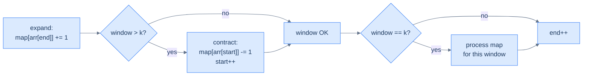
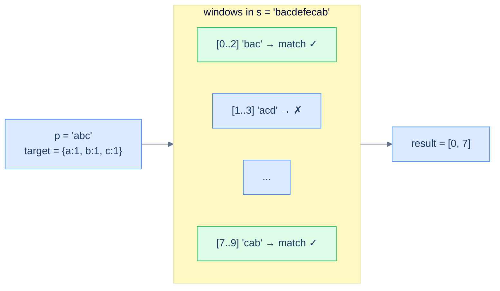

# 8. Pattern: Fixed-Sized Sliding Window

## The Hook

You're a security guard watching a row of CCTV monitors. Every monitor shows the last K seconds of footage from a different camera, and your job is to spot any face that appears *twice* in the same K-second clip. The naive approach: every second, re-watch all K seconds of every monitor — that's K seconds of work per monitor per second. With K = 60 and 3,600 seconds in an hour, that's 216,000 seconds of re-watching for one hour of feed.

Now imagine you keep a **whiteboard** next to each monitor with a tally of every face currently visible. When a new second of footage rolls in, you add a tick mark for the new face. When the oldest second rolls off, you erase a tick. Spotting a duplicate is now a *glance* — anyone with a tally over 1 is a hit. The work per second is **constant**, no matter how big K is.

That whiteboard is a **hash map**. The act of "add the new, drop the old" as the window slides is the **fixed-sized sliding window** technique. Combine the two and a fleet of O(N·K) algorithms collapse to O(N). Anagram detection in a stream, duplicate detection within range, distinct-element counts per window, sliding aggregations — every one of them is the same shape: *one map, slide the window, add to the right edge, subtract from the left*.

This is the first time in this section we use a hash table on a *moving* picture. Once the move clicks, you'll see windows everywhere.

---

## Table of contents

1. [Understanding the fixed-sized sliding window pattern](#understanding-the-fixed-sized-sliding-window-pattern)
2. [Identifying the fixed-sized sliding window pattern](#identifying-the-fixed-sized-sliding-window-pattern)
3. [Duplicate detection](#duplicate-detection)
4. [Subarray distinctness](#subarray-distinctness)
5. [Contains variation](#contains-variation)
6. [Anagram finder](#anagram-finder)

***

# Understanding the fixed-sized sliding window pattern

Some problems hand you a sequence and ask a question about *every contiguous window of size K*: "How many distinct elements?" "Any duplicates?" "Does this match a fixed pattern?" The brute-force answer is to enumerate every window and recompute the answer from scratch — O(N·K) work because each window scan is O(K) and there are N − K + 1 windows.

The sliding-window technique cuts this to **O(N)** by exploiting a beautiful observation: when the window moves one step right, *almost everything inside it stays the same*. Only **two** elements change: the one being added on the right, and the one falling off on the left. If we keep a running summary of the window in a hash map, we can update it in O(1) per shift instead of recomputing from scratch.

```d2
direction: right

arr: input array {
  grid-columns: 7
  grid-gap: 0
  a0: a {style.fill: "#fde68a"; style.stroke: "#d97706"}
  a1: b {style.fill: "#fde68a"; style.stroke: "#d97706"}
  a2: a {style.fill: "#fde68a"; style.stroke: "#d97706"}
  a3: c {style.fill: "#fde68a"; style.stroke: "#d97706"}
  a4: b
  a5: d
  a6: a
}

w1: "window 1: [a, b, a, c]" {style.fill: "#fde68a"; style.stroke: "#d97706"}
w2: "window 2: [b, a, c, b]" {style.fill: "#dbeafe"; style.stroke: "#3b82f6"}

arr -> w1: "positions 0..3"
arr -> w2: "positions 1..4 (slide by 1)"
```

<p align="center"><strong>Sliding by one step — windows 1 and 2 share three elements (b, a, c); only <code>a</code> drops off the left and <code>b</code> arrives on the right. Recomputing from scratch wastes work on the three shared elements; the sliding-window technique avoids it entirely.</strong></p>

We maintain two pointers, `start` and `end`, that mark the window's boundaries. We hold a hash map summarising the window's contents (typically a frequency map). Each step of the algorithm:

1. **Add** the new right-edge element's contribution to the map (`end` advanced).
2. If the window has grown past size K, **subtract** the left-edge element's contribution and advance `start`.
3. When the window is exactly size K, **process** the map to answer the question for this window.



<p align="center"><strong>The fixed-window loop in one picture — the four-line dance of <em>add new, drop old, process if size matches, advance</em>. The whole structure of every problem in this lesson is a variation on these four steps.</strong></p>

## Algorithm

> **Algorithm**
>
> -   **Step 1:** Initialise `start = 0`, `end = 0`, and an empty `map`.
> -   **Step 2:** While `end < arr.length`:
>     -   **Step 2.1:** Add the contribution of `arr[end]` to `map`.
>     -   **Step 2.2:** If `end − start + 1 > k`, remove the contribution of `arr[start]` and increment `start`.
>     -   **Step 2.3:** If `end − start + 1 == k`, process `map` to answer the question for this window.
>     -   **Step 2.4:** Increment `end`.

Note the ordering: *add first, then check size, then process*. This guarantees that by the time we reach step 2.3, the window is exactly `k` elements wide and the map reflects them.

> *Predict before reading on — what would happen if we processed the map BEFORE removing the start element when the window grew past k? The map would contain k+1 entries instead of k for one fleeting moment — and any "process" step would observe stale data. The order of operations is part of the algorithm's correctness.*

## Implementation

The generic skeleton — every problem in this lesson is a one-line change to step 2.3 ("process the map").

```python run
from collections import defaultdict

def fixed_sliding_window(arr, k):
    start, end = 0, 0
    freq = defaultdict(int)
    while end < len(arr):
        freq[arr[end]] += 1                                 # add right edge
        if end - start + 1 > k:                             # window too big?
            freq[arr[start]] -= 1                           #   drop left edge
            if freq[arr[start]] == 0: del freq[arr[start]]
            start += 1
        if end - start + 1 == k:
            # ── process this window ──
            pass
        end += 1

# Demo — uncomment a print inside the process block to see windows
fixed_sliding_window(['a','b','a','c','b','d','a'], 4)
```

```java run
import java.util.*;

public class Main {
    static void fixedSlidingWindow(char[] arr, int k) {
        int start = 0, end = 0;
        Map<Character, Integer> freq = new HashMap<>();
        while (end < arr.length) {
            freq.merge(arr[end], 1, Integer::sum);
            if (end - start + 1 > k) {
                freq.merge(arr[start], -1, Integer::sum);
                if (freq.get(arr[start]) == 0) freq.remove(arr[start]);
                start++;
            }
            if (end - start + 1 == k) {
                // ── process this window ──
            }
            end++;
        }
    }
    public static void main(String[] args) {
        fixedSlidingWindow(new char[]{'a','b','a','c','b','d','a'}, 4);
        System.out.println("done");
    }
}
```

```c run
#include <stdio.h>

void fixed_sliding_window(const char *arr, int n, int k) {
    int freq[128] = {0};
    int start = 0;
    for (int end = 0; end < n; end++) {
        freq[(unsigned char)arr[end]]++;
        if (end - start + 1 > k) { freq[(unsigned char)arr[start]]--; start++; }
        if (end - start + 1 == k) {
            // ── process this window ──
        }
    }
}

int main() {
    const char *arr = "abacbda";
    fixed_sliding_window(arr, 7, 4);
    printf("done\n");
}
```

```cpp run
#include <iostream>
#include <unordered_map>
#include <vector>

void fixedSlidingWindow(const std::vector<char> &arr, int k) {
    std::unordered_map<char, int> freq;
    int start = 0;
    for (int end = 0; end < (int)arr.size(); end++) {
        freq[arr[end]]++;
        if (end - start + 1 > k) {
            freq[arr[start]]--;
            if (freq[arr[start]] == 0) freq.erase(arr[start]);
            start++;
        }
        if (end - start + 1 == k) {
            // ── process this window ──
        }
    }
}

int main() {
    fixedSlidingWindow({'a','b','a','c','b','d','a'}, 4);
    std::cout << "done\n";
}
```

```scala run
import scala.collection.mutable

def fixedSlidingWindow(arr: Array[Char], k: Int): Unit = {
  val freq = mutable.Map[Char, Int]().withDefaultValue(0)
  var start = 0
  for (end <- arr.indices) {
    freq(arr(end)) += 1
    if (end - start + 1 > k) {
      freq(arr(start)) -= 1
      if (freq(arr(start)) == 0) freq -= arr(start)
      start += 1
    }
    if (end - start + 1 == k) {
      // ── process this window ──
    }
  }
}

object Main extends App {
  fixedSlidingWindow(Array('a','b','a','c','b','d','a'), 4)
  println("done")
}
```

```javascript run
function fixedSlidingWindow(arr, k) {
    const freq = new Map();
    let start = 0;
    for (let end = 0; end < arr.length; end++) {
        freq.set(arr[end], (freq.get(arr[end]) || 0) + 1);
        if (end - start + 1 > k) {
            const c = freq.get(arr[start]) - 1;
            if (c === 0) freq.delete(arr[start]); else freq.set(arr[start], c);
            start++;
        }
        if (end - start + 1 === k) {
            // ── process this window ──
        }
    }
}
fixedSlidingWindow(['a','b','a','c','b','d','a'], 4);
console.log("done");
```

```typescript run
function fixedSlidingWindow(arr: string[], k: number): void {
    const freq = new Map<string, number>();
    let start = 0;
    for (let end = 0; end < arr.length; end++) {
        freq.set(arr[end], (freq.get(arr[end]) || 0) + 1);
        if (end - start + 1 > k) {
            const c = (freq.get(arr[start]) || 0) - 1;
            if (c === 0) freq.delete(arr[start]); else freq.set(arr[start], c);
            start++;
        }
        if (end - start + 1 === k) { /* process */ }
    }
}
fixedSlidingWindow(['a','b','a','c','b','d','a'], 4);
console.log("done");
```

```go run
package main

import "fmt"

func fixedSlidingWindow(arr []byte, k int) {
    freq := make(map[byte]int)
    start := 0
    for end := 0; end < len(arr); end++ {
        freq[arr[end]]++
        if end - start + 1 > k {
            freq[arr[start]]--
            if freq[arr[start]] == 0 { delete(freq, arr[start]) }
            start++
        }
        if end - start + 1 == k {
            // ── process this window ──
        }
    }
}

func main() {
    fixedSlidingWindow([]byte("abacbda"), 4)
    fmt.Println("done")
}
```

```kotlin run
fun fixedSlidingWindow(arr: CharArray, k: Int) {
    val freq = HashMap<Char, Int>()
    var start = 0
    for (end in arr.indices) {
        freq[arr[end]] = (freq[arr[end]] ?: 0) + 1
        if (end - start + 1 > k) {
            val c = freq[arr[start]]!! - 1
            if (c == 0) freq.remove(arr[start]) else freq[arr[start]] = c
            start++
        }
        if (end - start + 1 == k) { /* process */ }
    }
}

fun main() {
    fixedSlidingWindow(charArrayOf('a','b','a','c','b','d','a'), 4)
    println("done")
}
```

```rust run
use std::collections::HashMap;

fn fixed_sliding_window(arr: &[char], k: usize) {
    let mut freq: HashMap<char, i32> = HashMap::new();
    let mut start = 0usize;
    for end in 0..arr.len() {
        *freq.entry(arr[end]).or_insert(0) += 1;
        if end + 1 - start > k {
            let c = freq.get_mut(&arr[start]).unwrap();
            *c -= 1;
            if *c == 0 { freq.remove(&arr[start]); }
            start += 1;
        }
        if end + 1 - start == k {
            // ── process this window ──
        }
    }
}

fn main() {
    fixed_sliding_window(&['a','b','a','c','b','d','a'], 4);
    println!("done");
}
```


## Complexity Analysis

We touch each array element exactly twice (once as it enters the window, once as it leaves). Each touch is amortised O(1) hash-map work. Total: **O(N)** time.

The hash map holds at most K entries (the elements currently inside the window), so space is **O(K)**.

> **Best/Average/Worst case** — O(N) time, O(K) space. The whole point of the technique is that worst-case time *is* the average case; we don't pay extra for adversarial input.

***

# Identifying the fixed-sized sliding window pattern

This pattern fits problems with a *fixed window length K* (given in the input or derivable from another input string) where the answer for each window depends on a **summarisable** property — frequencies, distinct counts, sums, products, max/min — that can be maintained incrementally.

**Template:**
> Given a sequence and a window size K, slide a window of size K from left to right while maintaining a hash-map summary of the window's contents in O(1) per shift. Use the summary to answer the question per window.

If the question is *"for each window of size K, …"* and you can answer it from a frequency map, this pattern fits.

## Example — anagram finder

Given a string `s` and a pattern `p`, return all start indices in `s` where a *permutation* of `p` appears. The window size is fixed: `len(p)`. The summary is the frequency map of the current window's characters; an anagram exists iff that map equals the frequency map of `p`.

This is the canonical fixed-window problem — every other problem in this lesson is a simpler shape of it.

## Example problems

> -   Duplicate detection — *is there a duplicate in any window of size k?*
> -   Subarray distinctness — *how many distinct elements per window?*
> -   Contains variation — *does any window match a target frequency map?*
> -   Anagram finder — *which windows are anagrams of a given pattern?*

***

# Duplicate detection

## Problem Statement

Given an integer array `arr` and a positive integer `k`, return `true` if any subarray of size `k` contains a duplicate, `false` otherwise.

### Example 1
> -   **Input:** `arr = [2, 1, 2, 3, 2, 1, 4, 5], k = 5` → **Output:** `true`

### Example 2
> -   **Input:** `arr = [1, 1, 2, 4], k = 3` → **Output:** `true`

### Example 3
> -   **Input:** `arr = [1, 2, 3, 4], k = 2` → **Output:** `false`

## Approach

Slide a window of size `k`; maintain frequencies. The instant any frequency exceeds 1 inside a `k`-window, we have a duplicate — return `true`.

> *Mental shortcut* — duplicate-in-window is "is the size of the window's distinct-set less than k?". Equivalently, "did any insert push a frequency above 1?". The hash map gives both views in O(1).

## Solution

```python run
from collections import defaultdict

def duplicate_detection(arr, k):
    freq = defaultdict(int); start = 0
    for end in range(len(arr)):
        freq[arr[end]] += 1
        # Contract first so the window is at most k wide
        if end - start + 1 > k:
            freq[arr[start]] -= 1
            if freq[arr[start]] == 0: del freq[arr[start]]
            start += 1
        # If the just-added element repeats, the window has a duplicate
        if freq[arr[end]] > 1: return True
    return False

print(duplicate_detection([2,1,2,3,2,1,4,5], 5))   # True
print(duplicate_detection([1,1,2,4], 3))           # True
print(duplicate_detection([1,2,3,4], 2))           # False
```

```java run
import java.util.*;

public class Main {
    static boolean duplicateDetection(int[] arr, int k) {
        Map<Integer, Integer> freq = new HashMap<>();
        int start = 0;
        for (int end = 0; end < arr.length; end++) {
            freq.merge(arr[end], 1, Integer::sum);
            if (end - start + 1 > k) {
                freq.merge(arr[start], -1, Integer::sum);
                if (freq.get(arr[start]) == 0) freq.remove(arr[start]);
                start++;
            }
            if (freq.get(arr[end]) > 1) return true;
        }
        return false;
    }
    public static void main(String[] args) {
        System.out.println(duplicateDetection(new int[]{2,1,2,3,2,1,4,5}, 5));
        System.out.println(duplicateDetection(new int[]{1,1,2,4}, 3));
        System.out.println(duplicateDetection(new int[]{1,2,3,4}, 2));
    }
}
```

```c run
#include <stdio.h>
#include <stdbool.h>
#include <stdlib.h>

// For small int ranges, a fixed-size array is the fastest "hash map".
// For arbitrary ints, use open-addressing or stdlib equivalents.
bool duplicate_detection(int *arr, int n, int k) {
    // Map from value to count; we use a small array assuming values in [0, 1000)
    int freq[1001] = {0};
    int start = 0;
    for (int end = 0; end < n; end++) {
        freq[arr[end]]++;
        if (end - start + 1 > k) { freq[arr[start]]--; start++; }
        if (freq[arr[end]] > 1) return true;
    }
    return false;
}

int main() {
    int a1[] = {2,1,2,3,2,1,4,5}, a2[] = {1,1,2,4}, a3[] = {1,2,3,4};
    printf("%d %d %d\n",
        duplicate_detection(a1, 8, 5),
        duplicate_detection(a2, 4, 3),
        duplicate_detection(a3, 4, 2));
}
```

```cpp run
#include <iostream>
#include <unordered_map>
#include <vector>

bool duplicateDetection(std::vector<int> &arr, int k) {
    std::unordered_map<int, int> freq;
    int start = 0;
    for (int end = 0; end < (int)arr.size(); end++) {
        freq[arr[end]]++;
        if (end - start + 1 > k) {
            freq[arr[start]]--;
            if (freq[arr[start]] == 0) freq.erase(arr[start]);
            start++;
        }
        if (freq[arr[end]] > 1) return true;
    }
    return false;
}

int main() {
    std::vector<int> a1 = {2,1,2,3,2,1,4,5}, a2 = {1,1,2,4}, a3 = {1,2,3,4};
    std::cout << duplicateDetection(a1, 5) << " "
              << duplicateDetection(a2, 3) << " "
              << duplicateDetection(a3, 2) << "\n";
}
```

```scala run
import scala.collection.mutable

def duplicateDetection(arr: Array[Int], k: Int): Boolean = {
  val freq = mutable.Map[Int, Int]().withDefaultValue(0)
  var start = 0
  for (end <- arr.indices) {
    freq(arr(end)) += 1
    if (end - start + 1 > k) {
      freq(arr(start)) -= 1
      if (freq(arr(start)) == 0) freq -= arr(start)
      start += 1
    }
    if (freq(arr(end)) > 1) return true
  }
  false
}

object Main extends App {
  println(duplicateDetection(Array(2,1,2,3,2,1,4,5), 5))
  println(duplicateDetection(Array(1,1,2,4), 3))
  println(duplicateDetection(Array(1,2,3,4), 2))
}
```

```javascript run
function duplicateDetection(arr, k) {
    const freq = new Map(); let start = 0;
    for (let end = 0; end < arr.length; end++) {
        freq.set(arr[end], (freq.get(arr[end]) || 0) + 1);
        if (end - start + 1 > k) {
            const c = freq.get(arr[start]) - 1;
            if (c === 0) freq.delete(arr[start]); else freq.set(arr[start], c);
            start++;
        }
        if (freq.get(arr[end]) > 1) return true;
    }
    return false;
}
console.log(duplicateDetection([2,1,2,3,2,1,4,5], 5));
console.log(duplicateDetection([1,1,2,4], 3));
console.log(duplicateDetection([1,2,3,4], 2));
```

```typescript run
function duplicateDetection(arr: number[], k: number): boolean {
    const freq = new Map<number, number>(); let start = 0;
    for (let end = 0; end < arr.length; end++) {
        freq.set(arr[end], (freq.get(arr[end]) || 0) + 1);
        if (end - start + 1 > k) {
            const c = freq.get(arr[start])! - 1;
            if (c === 0) freq.delete(arr[start]); else freq.set(arr[start], c);
            start++;
        }
        if ((freq.get(arr[end]) || 0) > 1) return true;
    }
    return false;
}
console.log(duplicateDetection([2,1,2,3,2,1,4,5], 5));
```

```go run
package main

import "fmt"

func duplicateDetection(arr []int, k int) bool {
    freq := make(map[int]int); start := 0
    for end := 0; end < len(arr); end++ {
        freq[arr[end]]++
        if end - start + 1 > k {
            freq[arr[start]]--
            if freq[arr[start]] == 0 { delete(freq, arr[start]) }
            start++
        }
        if freq[arr[end]] > 1 { return true }
    }
    return false
}

func main() {
    fmt.Println(duplicateDetection([]int{2,1,2,3,2,1,4,5}, 5))
    fmt.Println(duplicateDetection([]int{1,1,2,4}, 3))
    fmt.Println(duplicateDetection([]int{1,2,3,4}, 2))
}
```

```kotlin run
fun duplicateDetection(arr: IntArray, k: Int): Boolean {
    val freq = HashMap<Int, Int>(); var start = 0
    for (end in arr.indices) {
        freq[arr[end]] = (freq[arr[end]] ?: 0) + 1
        if (end - start + 1 > k) {
            val c = freq[arr[start]]!! - 1
            if (c == 0) freq.remove(arr[start]) else freq[arr[start]] = c
            start++
        }
        if (freq[arr[end]]!! > 1) return true
    }
    return false
}

fun main() {
    println(duplicateDetection(intArrayOf(2,1,2,3,2,1,4,5), 5))
    println(duplicateDetection(intArrayOf(1,1,2,4), 3))
    println(duplicateDetection(intArrayOf(1,2,3,4), 2))
}
```

```rust run
use std::collections::HashMap;

fn duplicate_detection(arr: &[i32], k: usize) -> bool {
    let mut freq: HashMap<i32, i32> = HashMap::new();
    let mut start = 0usize;
    for end in 0..arr.len() {
        *freq.entry(arr[end]).or_insert(0) += 1;
        if end + 1 - start > k {
            let c = freq.get_mut(&arr[start]).unwrap();
            *c -= 1;
            if *c == 0 { freq.remove(&arr[start]); }
            start += 1;
        }
        if *freq.get(&arr[end]).unwrap_or(&0) > 1 { return true; }
    }
    false
}

fn main() {
    println!("{} {} {}",
        duplicate_detection(&[2,1,2,3,2,1,4,5], 5),
        duplicate_detection(&[1,1,2,4], 3),
        duplicate_detection(&[1,2,3,4], 2));
}
```


***

# Subarray distinctness

## Problem Statement

Given `arr` and a positive integer `k`, return an array containing the count of distinct elements in every contiguous subarray of size `k`.

### Example 1
> -   **Input:** `arr = [2,1,2,3,2,1,4,5], k = 5` → **Output:** `[3, 3, 4, 5]`

### Example 2
> -   **Input:** `arr = [1,1,2,4], k = 3` → **Output:** `[2, 3]`

### Example 3
> -   **Input:** `arr = [1,2,3,4], k = 1` → **Output:** `[1, 1, 1, 1]`

## Approach

The number of *distinct* elements in the window is exactly `len(freq_map)` — the number of keys with non-zero count. The trick: when a frequency drops to zero on contraction, **delete the key** from the map so the size reflects only currently-present elements.

```d2
direction: right

w: "window contents" {
  grid-columns: 5
  grid-gap: 0
  a0: "2"
  a1: "1"
  a2: "2"
  a3: "3"
  a4: "2"
}

m: "freq map" {
  m1: "2 -> 3"
  m2: "1 -> 1"
  m3: "3 -> 1"
}

d: |md
  **distinct = len(freq) = 3**
| {style.fill: "#dcfce7"; style.stroke: "#16a34a"}

w -> m
m -> d
```

<p align="center"><strong>Distinct count via map size — every distinct element is one key in the map. Maintain the map's invariant that "count is non-zero" by deleting zero-count keys on contraction, and <code>len(map)</code> is your answer.</strong></p>

## Solution

```python run
from collections import defaultdict

def subarray_distinctness(arr, k):
    freq = defaultdict(int); start = 0; result = []
    for end in range(len(arr)):
        freq[arr[end]] += 1
        if end - start + 1 == k:
            result.append(len(freq))            # distinct count for this window
            freq[arr[start]] -= 1               # then contract for next window
            if freq[arr[start]] == 0: del freq[arr[start]]
            start += 1
    return result

print(subarray_distinctness([2,1,2,3,2,1,4,5], 5))   # [3, 3, 4, 5]
print(subarray_distinctness([1,1,2,4], 3))           # [2, 3]
print(subarray_distinctness([1,2,3,4], 1))           # [1, 1, 1, 1]
```

```java run
import java.util.*;

public class Main {
    static List<Integer> subarrayDistinctness(int[] arr, int k) {
        Map<Integer, Integer> freq = new HashMap<>();
        List<Integer> result = new ArrayList<>();
        int start = 0;
        for (int end = 0; end < arr.length; end++) {
            freq.merge(arr[end], 1, Integer::sum);
            if (end - start + 1 == k) {
                result.add(freq.size());
                freq.merge(arr[start], -1, Integer::sum);
                if (freq.get(arr[start]) == 0) freq.remove(arr[start]);
                start++;
            }
        }
        return result;
    }
    public static void main(String[] args) {
        System.out.println(subarrayDistinctness(new int[]{2,1,2,3,2,1,4,5}, 5));
        System.out.println(subarrayDistinctness(new int[]{1,1,2,4}, 3));
        System.out.println(subarrayDistinctness(new int[]{1,2,3,4}, 1));
    }
}
```

```c run
#include <stdio.h>

void subarray_distinctness(int *arr, int n, int k) {
    int freq[1001] = {0}; int distinct = 0; int start = 0;
    for (int end = 0; end < n; end++) {
        if (freq[arr[end]]++ == 0) distinct++;     // new key entered
        if (end - start + 1 == k) {
            printf("%d ", distinct);
            if (--freq[arr[start]] == 0) distinct--;
            start++;
        }
    }
    printf("\n");
}

int main() {
    int a1[] = {2,1,2,3,2,1,4,5}, a2[] = {1,1,2,4}, a3[] = {1,2,3,4};
    subarray_distinctness(a1, 8, 5);
    subarray_distinctness(a2, 4, 3);
    subarray_distinctness(a3, 4, 1);
}
```

```cpp run
#include <iostream>
#include <unordered_map>
#include <vector>

std::vector<int> subarrayDistinctness(std::vector<int> &arr, int k) {
    std::unordered_map<int, int> freq;
    std::vector<int> result; int start = 0;
    for (int end = 0; end < (int)arr.size(); end++) {
        freq[arr[end]]++;
        if (end - start + 1 == k) {
            result.push_back((int)freq.size());
            if (--freq[arr[start]] == 0) freq.erase(arr[start]);
            start++;
        }
    }
    return result;
}

int main() {
    std::vector<int> a = {2,1,2,3,2,1,4,5};
    auto r = subarrayDistinctness(a, 5);
    for (int x : r) std::cout << x << " "; std::cout << "\n";
}
```

```scala run
import scala.collection.mutable

def subarrayDistinctness(arr: Array[Int], k: Int): List[Int] = {
  val freq = mutable.Map[Int, Int]().withDefaultValue(0)
  val result = mutable.ArrayBuffer[Int]()
  var start = 0
  for (end <- arr.indices) {
    freq(arr(end)) += 1
    if (end - start + 1 == k) {
      result += freq.size
      freq(arr(start)) -= 1
      if (freq(arr(start)) == 0) freq -= arr(start)
      start += 1
    }
  }
  result.toList
}

object Main extends App {
  println(subarrayDistinctness(Array(2,1,2,3,2,1,4,5), 5))
  println(subarrayDistinctness(Array(1,1,2,4), 3))
  println(subarrayDistinctness(Array(1,2,3,4), 1))
}
```

```javascript run
function subarrayDistinctness(arr, k) {
    const freq = new Map(); const result = []; let start = 0;
    for (let end = 0; end < arr.length; end++) {
        freq.set(arr[end], (freq.get(arr[end]) || 0) + 1);
        if (end - start + 1 === k) {
            result.push(freq.size);
            const c = freq.get(arr[start]) - 1;
            if (c === 0) freq.delete(arr[start]); else freq.set(arr[start], c);
            start++;
        }
    }
    return result;
}
console.log(subarrayDistinctness([2,1,2,3,2,1,4,5], 5));
console.log(subarrayDistinctness([1,1,2,4], 3));
console.log(subarrayDistinctness([1,2,3,4], 1));
```

```typescript run
function subarrayDistinctness(arr: number[], k: number): number[] {
    const freq = new Map<number, number>(); const result: number[] = []; let start = 0;
    for (let end = 0; end < arr.length; end++) {
        freq.set(arr[end], (freq.get(arr[end]) || 0) + 1);
        if (end - start + 1 === k) {
            result.push(freq.size);
            const c = freq.get(arr[start])! - 1;
            if (c === 0) freq.delete(arr[start]); else freq.set(arr[start], c);
            start++;
        }
    }
    return result;
}
console.log(subarrayDistinctness([2,1,2,3,2,1,4,5], 5));
```

```go run
package main

import "fmt"

func subarrayDistinctness(arr []int, k int) []int {
    freq := make(map[int]int); result := []int{}; start := 0
    for end := 0; end < len(arr); end++ {
        freq[arr[end]]++
        if end - start + 1 == k {
            result = append(result, len(freq))
            freq[arr[start]]--
            if freq[arr[start]] == 0 { delete(freq, arr[start]) }
            start++
        }
    }
    return result
}

func main() {
    fmt.Println(subarrayDistinctness([]int{2,1,2,3,2,1,4,5}, 5))
    fmt.Println(subarrayDistinctness([]int{1,1,2,4}, 3))
    fmt.Println(subarrayDistinctness([]int{1,2,3,4}, 1))
}
```

```kotlin run
fun subarrayDistinctness(arr: IntArray, k: Int): List<Int> {
    val freq = HashMap<Int, Int>(); val result = mutableListOf<Int>(); var start = 0
    for (end in arr.indices) {
        freq[arr[end]] = (freq[arr[end]] ?: 0) + 1
        if (end - start + 1 == k) {
            result.add(freq.size)
            val c = freq[arr[start]]!! - 1
            if (c == 0) freq.remove(arr[start]) else freq[arr[start]] = c
            start++
        }
    }
    return result
}

fun main() {
    println(subarrayDistinctness(intArrayOf(2,1,2,3,2,1,4,5), 5))
    println(subarrayDistinctness(intArrayOf(1,1,2,4), 3))
    println(subarrayDistinctness(intArrayOf(1,2,3,4), 1))
}
```

```rust run
use std::collections::HashMap;

fn subarray_distinctness(arr: &[i32], k: usize) -> Vec<usize> {
    let mut freq: HashMap<i32, i32> = HashMap::new();
    let mut result = Vec::new();
    let mut start = 0usize;
    for end in 0..arr.len() {
        *freq.entry(arr[end]).or_insert(0) += 1;
        if end + 1 - start == k {
            result.push(freq.len());
            let c = freq.get_mut(&arr[start]).unwrap();
            *c -= 1;
            if *c == 0 { freq.remove(&arr[start]); }
            start += 1;
        }
    }
    result
}

fn main() {
    println!("{:?}", subarray_distinctness(&[2,1,2,3,2,1,4,5], 5));
    println!("{:?}", subarray_distinctness(&[1,1,2,4], 3));
    println!("{:?}", subarray_distinctness(&[1,2,3,4], 1));
}
```


***

# Contains variation

## Problem Statement

Given two strings `s1` and `s2`, return `true` if `s2` contains a permutation of `s1`, else `false`.

### Example 1
> -   **Input:** `s1 = "abc", s2 = "edbaclm"` → **Output:** `true` (`"bac"` is a permutation of `"abc"`)

### Example 2
> -   **Input:** `s1 = "cod", s2 = "intdoce"` → **Output:** `true` (`"doc"`)

### Example 3
> -   **Input:** `s1 = "abc", s2 = "defghiab"` → **Output:** `false`

## Approach

The window size is fixed: `len(s1)`. A window is a permutation of `s1` iff the window's frequency map equals `s1`'s frequency map. Slide the window over `s2`; compare the maps each time the window is the right size.

To avoid O(K) map comparisons every step, you can maintain a counter `matches` of how many distinct characters have *exactly* the right count. We use the simpler `map == map` here for clarity; the optimisation matters only for large K.

## Solution

```python run
from collections import Counter, defaultdict

def contains_variation(s1, s2):
    if len(s1) > len(s2): return False
    target = Counter(s1)
    window = defaultdict(int); start = 0
    for end in range(len(s2)):
        window[s2[end]] += 1
        if end - start + 1 == len(s1):
            # Permutation iff the window's frequency map matches target's
            if all(window.get(ch, 0) == target[ch] for ch in target):
                return True
            window[s2[start]] -= 1
            if window[s2[start]] == 0: del window[s2[start]]
            start += 1
    return False

print(contains_variation("abc", "edbaclm"))    # True
print(contains_variation("cod", "intdoce"))    # True
print(contains_variation("abc", "defghiab"))   # False
```

```java run
import java.util.*;

public class Main {
    static boolean containsVariation(String s1, String s2) {
        if (s1.length() > s2.length()) return false;
        Map<Character, Integer> target = new HashMap<>();
        for (char c : s1.toCharArray()) target.merge(c, 1, Integer::sum);
        Map<Character, Integer> w = new HashMap<>();
        int start = 0;
        for (int end = 0; end < s2.length(); end++) {
            w.merge(s2.charAt(end), 1, Integer::sum);
            if (end - start + 1 == s1.length()) {
                if (w.equals(target)) return true;
                w.merge(s2.charAt(start), -1, Integer::sum);
                if (w.get(s2.charAt(start)) == 0) w.remove(s2.charAt(start));
                start++;
            }
        }
        return false;
    }
    public static void main(String[] args) {
        System.out.println(containsVariation("abc", "edbaclm"));
        System.out.println(containsVariation("cod", "intdoce"));
        System.out.println(containsVariation("abc", "defghiab"));
    }
}
```

```c run
#include <stdio.h>
#include <string.h>
#include <stdbool.h>

bool contains_variation(const char *s1, const char *s2) {
    int n1 = (int)strlen(s1), n2 = (int)strlen(s2);
    if (n1 > n2) return false;
    int target[128] = {0}, win[128] = {0};
    for (const char *p = s1; *p; p++) target[(unsigned char)*p]++;
    int start = 0;
    for (int end = 0; end < n2; end++) {
        win[(unsigned char)s2[end]]++;
        if (end - start + 1 == n1) {
            // Compare frequency vectors
            int match = 1;
            for (int i = 0; i < 128; i++) if (target[i] != win[i]) { match = 0; break; }
            if (match) return true;
            win[(unsigned char)s2[start]]--; start++;
        }
    }
    return false;
}

int main() {
    printf("%d %d %d\n",
        contains_variation("abc", "edbaclm"),
        contains_variation("cod", "intdoce"),
        contains_variation("abc", "defghiab"));
}
```

```cpp run
#include <iostream>
#include <unordered_map>

bool containsVariation(const std::string &s1, const std::string &s2) {
    if (s1.size() > s2.size()) return false;
    std::unordered_map<char, int> target, w;
    for (char c : s1) target[c]++;
    int start = 0;
    for (int end = 0; end < (int)s2.size(); end++) {
        w[s2[end]]++;
        if (end - start + 1 == (int)s1.size()) {
            if (w == target) return true;
            if (--w[s2[start]] == 0) w.erase(s2[start]);
            start++;
        }
    }
    return false;
}

int main() {
    std::cout << containsVariation("abc","edbaclm") << " "
              << containsVariation("cod","intdoce") << " "
              << containsVariation("abc","defghiab") << "\n";
}
```

```scala run
import scala.collection.mutable

def containsVariation(s1: String, s2: String): Boolean = {
  if (s1.length > s2.length) return false
  val target = s1.groupBy(identity).view.mapValues(_.length).toMap
  val w = mutable.Map[Char, Int]().withDefaultValue(0)
  var start = 0
  for (end <- s2.indices) {
    w(s2(end)) += 1
    if (end - start + 1 == s1.length) {
      if (target.forall { case (k, v) => w(k) == v }) return true
      w(s2(start)) -= 1
      if (w(s2(start)) == 0) w -= s2(start)
      start += 1
    }
  }
  false
}

object Main extends App {
  println(containsVariation("abc","edbaclm"))
  println(containsVariation("cod","intdoce"))
  println(containsVariation("abc","defghiab"))
}
```

```javascript run
function mapsEqual(a, b) {
    if (a.size !== b.size) return false;
    for (const [k, v] of a) if (b.get(k) !== v) return false;
    return true;
}
function containsVariation(s1, s2) {
    if (s1.length > s2.length) return false;
    const target = new Map();
    for (const c of s1) target.set(c, (target.get(c) || 0) + 1);
    const w = new Map(); let start = 0;
    for (let end = 0; end < s2.length; end++) {
        w.set(s2[end], (w.get(s2[end]) || 0) + 1);
        if (end - start + 1 === s1.length) {
            if (mapsEqual(w, target)) return true;
            const c = w.get(s2[start]) - 1;
            if (c === 0) w.delete(s2[start]); else w.set(s2[start], c);
            start++;
        }
    }
    return false;
}
console.log(containsVariation("abc","edbaclm"));
console.log(containsVariation("cod","intdoce"));
console.log(containsVariation("abc","defghiab"));
```

```typescript run
function mapsEqual<T>(a: Map<T, number>, b: Map<T, number>): boolean {
    if (a.size !== b.size) return false;
    for (const [k, v] of a) if (b.get(k) !== v) return false;
    return true;
}
function containsVariation(s1: string, s2: string): boolean {
    if (s1.length > s2.length) return false;
    const target = new Map<string, number>();
    for (const c of s1) target.set(c, (target.get(c) || 0) + 1);
    const w = new Map<string, number>(); let start = 0;
    for (let end = 0; end < s2.length; end++) {
        w.set(s2[end], (w.get(s2[end]) || 0) + 1);
        if (end - start + 1 === s1.length) {
            if (mapsEqual(w, target)) return true;
            const c = w.get(s2[start])! - 1;
            if (c === 0) w.delete(s2[start]); else w.set(s2[start], c);
            start++;
        }
    }
    return false;
}
console.log(containsVariation("abc","edbaclm"));
```

```go run
package main

import "fmt"

func mapsEqual(a, b map[byte]int) bool {
    if len(a) != len(b) { return false }
    for k, v := range a { if b[k] != v { return false } }
    return true
}
func containsVariation(s1, s2 string) bool {
    if len(s1) > len(s2) { return false }
    target := make(map[byte]int)
    for i := 0; i < len(s1); i++ { target[s1[i]]++ }
    w := make(map[byte]int); start := 0
    for end := 0; end < len(s2); end++ {
        w[s2[end]]++
        if end - start + 1 == len(s1) {
            if mapsEqual(w, target) { return true }
            w[s2[start]]--; if w[s2[start]] == 0 { delete(w, s2[start]) }
            start++
        }
    }
    return false
}

func main() {
    fmt.Println(containsVariation("abc","edbaclm"),
                containsVariation("cod","intdoce"),
                containsVariation("abc","defghiab"))
}
```

```kotlin run
fun containsVariation(s1: String, s2: String): Boolean {
    if (s1.length > s2.length) return false
    val target = HashMap<Char, Int>()
    for (c in s1) target[c] = (target[c] ?: 0) + 1
    val w = HashMap<Char, Int>(); var start = 0
    for (end in s2.indices) {
        w[s2[end]] = (w[s2[end]] ?: 0) + 1
        if (end - start + 1 == s1.length) {
            if (w == target) return true
            val c = w[s2[start]]!! - 1
            if (c == 0) w.remove(s2[start]) else w[s2[start]] = c
            start++
        }
    }
    return false
}

fun main() {
    println(containsVariation("abc","edbaclm"))
    println(containsVariation("cod","intdoce"))
    println(containsVariation("abc","defghiab"))
}
```

```rust run
use std::collections::HashMap;

fn contains_variation(s1: &str, s2: &str) -> bool {
    if s1.len() > s2.len() { return false; }
    let mut target: HashMap<char, i32> = HashMap::new();
    for c in s1.chars() { *target.entry(c).or_insert(0) += 1; }
    let s2c: Vec<char> = s2.chars().collect();
    let mut w: HashMap<char, i32> = HashMap::new();
    let mut start = 0usize;
    for end in 0..s2c.len() {
        *w.entry(s2c[end]).or_insert(0) += 1;
        if end + 1 - start == s1.len() {
            if w == target { return true; }
            let c = w.get_mut(&s2c[start]).unwrap();
            *c -= 1;
            if *c == 0 { w.remove(&s2c[start]); }
            start += 1;
        }
    }
    false
}

fn main() {
    println!("{} {} {}",
        contains_variation("abc","edbaclm"),
        contains_variation("cod","intdoce"),
        contains_variation("abc","defghiab"));
}
```


***

# Anagram finder

## Problem Statement

Given strings `s` and `p`, return all the start indices in `s` of substrings that are anagrams of `p`.

### Example 1
> -   **Input:** `s = "bacdefecab", p = "abc"` → **Output:** `[0, 7]` (`"bac"` at 0, `"cab"` at 7)

### Example 2
> -   **Input:** `s = "fdef", p = "def"` → **Output:** `[0, 1]` (`"fde"` at 0, `"def"` at 1; both are anagrams of `"def"`)

> *Wait — `"fde"` is an anagram of `"def"`? Yes — same multiset of letters {d, e, f}.*

### Example 3
> -   **Input:** `s = "abcdef", p = "gh"` → **Output:** `[]`

## Approach

`Contains variation` returns the *first* match; `Anagram finder` returns *all* matches. Same scanning pattern, same window size (`len(p)`), same comparison — but instead of returning on the first match, append the start index to the result list and keep going.



<p align="center"><strong>Anagram finder — slide a window of size <code>len(p)</code> across <code>s</code>, recording start indices wherever the window's frequency map matches <code>p</code>'s. Same skeleton as <code>Contains variation</code>, just append-don't-return.</strong></p>

## Solution

```python run
from collections import Counter, defaultdict

def anagram_finder(s, p):
    if len(p) > len(s): return []
    target = Counter(p); window = defaultdict(int)
    out = []; start = 0
    for end in range(len(s)):
        window[s[end]] += 1
        if end - start + 1 == len(p):
            # Compare multisets — match means anagram
            if all(window.get(c, 0) == target[c] for c in target):
                out.append(start)
            window[s[start]] -= 1
            if window[s[start]] == 0: del window[s[start]]
            start += 1
    return out

print(anagram_finder("bacdefecab", "abc"))   # [0, 7]
print(anagram_finder("fdef", "def"))         # [0, 1]
print(anagram_finder("abcdef", "gh"))        # []
```

```java run
import java.util.*;

public class Main {
    static List<Integer> anagramFinder(String s, String p) {
        List<Integer> out = new ArrayList<>();
        if (p.length() > s.length()) return out;
        Map<Character, Integer> target = new HashMap<>();
        for (char c : p.toCharArray()) target.merge(c, 1, Integer::sum);
        Map<Character, Integer> w = new HashMap<>();
        int start = 0;
        for (int end = 0; end < s.length(); end++) {
            w.merge(s.charAt(end), 1, Integer::sum);
            if (end - start + 1 == p.length()) {
                if (w.equals(target)) out.add(start);
                w.merge(s.charAt(start), -1, Integer::sum);
                if (w.get(s.charAt(start)) == 0) w.remove(s.charAt(start));
                start++;
            }
        }
        return out;
    }
    public static void main(String[] args) {
        System.out.println(anagramFinder("bacdefecab", "abc"));
        System.out.println(anagramFinder("fdef", "def"));
        System.out.println(anagramFinder("abcdef", "gh"));
    }
}
```

```c run
#include <stdio.h>
#include <string.h>

void anagram_finder(const char *s, const char *p) {
    int ns = (int)strlen(s), np = (int)strlen(p);
    if (np > ns) { printf("[]\n"); return; }
    int t[128] = {0}, w[128] = {0};
    for (int i = 0; i < np; i++) t[(unsigned char)p[i]]++;
    int start = 0;
    printf("[");
    int first = 1;
    for (int end = 0; end < ns; end++) {
        w[(unsigned char)s[end]]++;
        if (end - start + 1 == np) {
            int match = 1;
            for (int i = 0; i < 128; i++) if (t[i] != w[i]) { match = 0; break; }
            if (match) { printf("%s%d", first ? "" : ", ", start); first = 0; }
            w[(unsigned char)s[start]]--; start++;
        }
    }
    printf("]\n");
}

int main() {
    anagram_finder("bacdefecab", "abc");   // [0, 7]
    anagram_finder("fdef", "def");         // [0, 1]
    anagram_finder("abcdef", "gh");        // []
}
```

```cpp run
#include <iostream>
#include <unordered_map>
#include <vector>

std::vector<int> anagramFinder(const std::string &s, const std::string &p) {
    std::vector<int> out;
    if (p.size() > s.size()) return out;
    std::unordered_map<char, int> t, w;
    for (char c : p) t[c]++;
    int start = 0;
    for (int end = 0; end < (int)s.size(); end++) {
        w[s[end]]++;
        if (end - start + 1 == (int)p.size()) {
            if (w == t) out.push_back(start);
            if (--w[s[start]] == 0) w.erase(s[start]);
            start++;
        }
    }
    return out;
}

int main() {
    auto r = anagramFinder("bacdefecab", "abc");
    for (int x : r) std::cout << x << " "; std::cout << "\n";
}
```

```scala run
import scala.collection.mutable

def anagramFinder(s: String, p: String): List[Int] = {
  if (p.length > s.length) return Nil
  val target = p.groupBy(identity).view.mapValues(_.length).toMap
  val w = mutable.Map[Char, Int]().withDefaultValue(0)
  val out = mutable.ArrayBuffer[Int]()
  var start = 0
  for (end <- s.indices) {
    w(s(end)) += 1
    if (end - start + 1 == p.length) {
      if (target.forall { case (k, v) => w(k) == v }) out += start
      w(s(start)) -= 1
      if (w(s(start)) == 0) w -= s(start)
      start += 1
    }
  }
  out.toList
}

object Main extends App {
  println(anagramFinder("bacdefecab", "abc"))
  println(anagramFinder("fdef", "def"))
  println(anagramFinder("abcdef", "gh"))
}
```

```javascript run
function mapsEqual(a, b) {
    if (a.size !== b.size) return false;
    for (const [k, v] of a) if (b.get(k) !== v) return false;
    return true;
}
function anagramFinder(s, p) {
    const out = [];
    if (p.length > s.length) return out;
    const target = new Map();
    for (const c of p) target.set(c, (target.get(c) || 0) + 1);
    const w = new Map(); let start = 0;
    for (let end = 0; end < s.length; end++) {
        w.set(s[end], (w.get(s[end]) || 0) + 1);
        if (end - start + 1 === p.length) {
            if (mapsEqual(w, target)) out.push(start);
            const c = w.get(s[start]) - 1;
            if (c === 0) w.delete(s[start]); else w.set(s[start], c);
            start++;
        }
    }
    return out;
}
console.log(anagramFinder("bacdefecab", "abc"));   // [0, 7]
console.log(anagramFinder("fdef", "def"));         // [0, 1]
console.log(anagramFinder("abcdef", "gh"));        // []
```

```typescript run
function mapsEqual<T>(a: Map<T, number>, b: Map<T, number>): boolean {
    if (a.size !== b.size) return false;
    for (const [k, v] of a) if (b.get(k) !== v) return false;
    return true;
}
function anagramFinder(s: string, p: string): number[] {
    const out: number[] = [];
    if (p.length > s.length) return out;
    const target = new Map<string, number>();
    for (const c of p) target.set(c, (target.get(c) || 0) + 1);
    const w = new Map<string, number>(); let start = 0;
    for (let end = 0; end < s.length; end++) {
        w.set(s[end], (w.get(s[end]) || 0) + 1);
        if (end - start + 1 === p.length) {
            if (mapsEqual(w, target)) out.push(start);
            const c = w.get(s[start])! - 1;
            if (c === 0) w.delete(s[start]); else w.set(s[start], c);
            start++;
        }
    }
    return out;
}
console.log(anagramFinder("bacdefecab", "abc"));
```

```go run
package main

import "fmt"

func mapsEq(a, b map[byte]int) bool {
    if len(a) != len(b) { return false }
    for k, v := range a { if b[k] != v { return false } }
    return true
}
func anagramFinder(s, p string) []int {
    out := []int{}
    if len(p) > len(s) { return out }
    t := make(map[byte]int)
    for i := 0; i < len(p); i++ { t[p[i]]++ }
    w := make(map[byte]int); start := 0
    for end := 0; end < len(s); end++ {
        w[s[end]]++
        if end - start + 1 == len(p) {
            if mapsEq(w, t) { out = append(out, start) }
            w[s[start]]--; if w[s[start]] == 0 { delete(w, s[start]) }
            start++
        }
    }
    return out
}

func main() {
    fmt.Println(anagramFinder("bacdefecab", "abc"))
    fmt.Println(anagramFinder("fdef", "def"))
    fmt.Println(anagramFinder("abcdef", "gh"))
}
```

```kotlin run
fun anagramFinder(s: String, p: String): List<Int> {
    val out = mutableListOf<Int>()
    if (p.length > s.length) return out
    val target = HashMap<Char, Int>()
    for (c in p) target[c] = (target[c] ?: 0) + 1
    val w = HashMap<Char, Int>(); var start = 0
    for (end in s.indices) {
        w[s[end]] = (w[s[end]] ?: 0) + 1
        if (end - start + 1 == p.length) {
            if (w == target) out.add(start)
            val c = w[s[start]]!! - 1
            if (c == 0) w.remove(s[start]) else w[s[start]] = c
            start++
        }
    }
    return out
}

fun main() {
    println(anagramFinder("bacdefecab", "abc"))
    println(anagramFinder("fdef", "def"))
    println(anagramFinder("abcdef", "gh"))
}
```

```rust run
use std::collections::HashMap;

fn anagram_finder(s: &str, p: &str) -> Vec<usize> {
    let mut out = Vec::new();
    if p.len() > s.len() { return out; }
    let mut target: HashMap<char, i32> = HashMap::new();
    for c in p.chars() { *target.entry(c).or_insert(0) += 1; }
    let sc: Vec<char> = s.chars().collect();
    let mut w: HashMap<char, i32> = HashMap::new();
    let mut start = 0usize;
    for end in 0..sc.len() {
        *w.entry(sc[end]).or_insert(0) += 1;
        if end + 1 - start == p.len() {
            if w == target { out.push(start); }
            let c = w.get_mut(&sc[start]).unwrap();
            *c -= 1;
            if *c == 0 { w.remove(&sc[start]); }
            start += 1;
        }
    }
    out
}

fn main() {
    println!("{:?}", anagram_finder("bacdefecab", "abc"));
    println!("{:?}", anagram_finder("fdef", "def"));
    println!("{:?}", anagram_finder("abcdef", "gh"));
}
```


***

## Final Takeaway

The fixed-sized sliding window is the **moving** version of the counting pattern. The hash map keeps a running summary of the window's contents; the window's size never changes, so the map's overall workload is O(1) per shift. Three lessons worth memorising:

1. **Add right, drop left, process if-size-matches.** The four-line skeleton is identical for every problem; only the "process" step differs.
2. **Delete keys whose count drops to zero.** It's not just hygiene — `len(map)` is a valid distinct-count answer only if you maintain that invariant.
3. **Window-size = len(pattern).** When a problem says "find any anagram of p in s" or "any permutation of p", the window size is *given to you* by the second string. The hardest part is recognising it.

> *Coming up — what if the window can grow and shrink based on a *condition* rather than a fixed size? That's the **variable-sized sliding window**, and it solves a different family of problems: "longest substring with at most K distinct chars", "smallest subarray with sum ≥ S", "longest substring without repeating characters". Same hash-map summary, but the window flexes — and that flexibility unlocks a much wider class of problems.*
