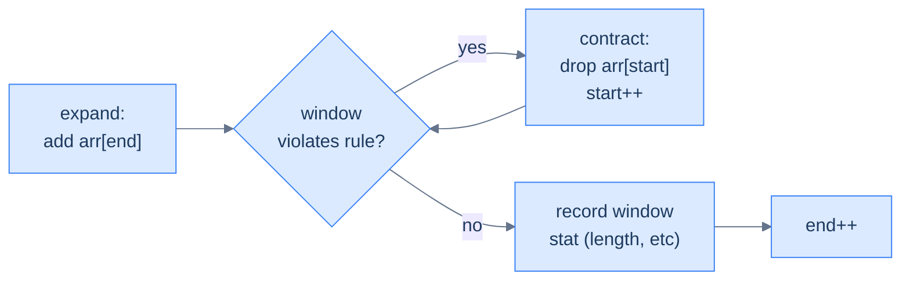

# 9. Pattern: Variable-Sized Sliding Window

## The Hook

Picture an accordion. Squeeze it shut, the air column is short. Pull it open, the air column is long. Push and pull as you play, and the column's length **flexes** in response to what the music needs at this exact moment. Now imagine that accordion is a window walking along an array, expanding when a *condition* is satisfied and contracting when it's *violated*. The fixed-window pattern from the last lesson played one note over and over — *K, K, K, K*. The variable window plays a melody — *expand, expand, contract, expand, contract, contract, expand* — driven by what the data does, not by a fixed parameter.

That accordion is the **variable-sized sliding window**, and it solves a different family of problems than the fixed kind. Instead of "for every window of size K, …" the question becomes "what's the **longest** (or shortest) window that satisfies some property?". *Longest substring with no repeats. Longest substring with at most K distinct characters. Longest run after K character replacements. Smallest subarray with sum ≥ S.* In every case the window grows greedily until it breaks the rule, then shrinks just enough to fit again — and the answer is "the largest size we ever saw legal".

The brute force scans every starting position with a nested inner loop and is O(N²). The variable window does it in O(N) with two pointers and one hash map — because each pointer only ever moves *forward*, so each element is touched at most twice.

This is the most flexible hash-map technique in the section, and once you internalise the *expand-until-broken / contract-until-fixed* rhythm, you'll see it everywhere.

---

## Table of contents

1. [Understanding the variable-sized sliding window pattern](#understanding-the-variable-sized-sliding-window-pattern)
2. [Identifying the variable-sized sliding window pattern](#identifying-the-variable-sized-sliding-window-pattern)
3. [Unique character span](#unique-character-span)
4. [K characters span](#k-characters-span)
5. [Maximal character swap](#maximal-character-swap)
6. [Subarray sum equals k](#subarray-sum-equals-k)
7. [Twin in proximity](#twin-in-proximity)

***

# Understanding the variable-sized sliding window pattern

The window now has **no fixed size**. Two pointers, `start` and `end`, define its boundaries. The window's contents are summarised in a hash map (frequencies, sums, sets — whatever the problem needs). On each iteration:

1. **Expand** by one step on the right: add `arr[end]`'s contribution to the map, then advance `end`.
2. **Contract** from the left **while the window violates the constraint**: subtract `arr[start]`'s contribution and advance `start`. Loop until the constraint is satisfied again.
3. **Record** the window's stat (length, sum, count) — at this moment the window is the largest valid one ending at `end`.



<p align="center"><strong>The variable-window loop — expand on the right, then contract on the left as many times as needed to restore the rule. Notice <code>contract</code> is a <em>while</em> loop, not an <em>if</em>: a single expansion might violate the rule by multiple slots, so we keep contracting until it's fixed.</strong></p>

The performance argument is beautiful: `start` only moves forward, never backward, and never overtakes `end`. Each element is therefore "touched" at most twice — once when `end` passes it (admitting it to the window), once when `start` passes it (evicting it). Total work: **O(N)**.

***

# Identifying the variable-sized sliding window pattern

This pattern fits problems that ask for the **longest** (or shortest) contiguous subsequence satisfying some condition that can be checked from a hash-map summary. The condition's truth-value should change *monotonically* as the window grows or shrinks — typically: extending the window *can only worsen* the condition, and contracting it *can only improve*.

**Template:**
> Given a sequence and a condition, slide a window whose right edge always advances; expand into the next element, then contract from the left until the condition holds; record the resulting window stat.

If the condition is "no duplicates", "at most K distinct", "sum ≤ S", "max-frequency element covers ≥ window − K positions", this template fits.

## Example — longest substring without repeating characters

> **Problem:** Given a string `s`, return the length of the longest substring without any repeating characters.

### Brute force

For each `start`, scan forward with `end`, maintaining a frequency map; stop the moment a duplicate appears. Track the longest run. **O(N²)**.

### Variable-window solution

The same observation that makes brute force O(N²) is also the loophole that makes a single pass possible: **once you've found a duplicate, the start pointer never has to move backward**. Any window that previously contained the duplicate is now disqualified. So we expand `end` greedily, and *whenever* the new character causes a duplicate, we slide `start` forward until the duplicate is gone — never reset, never look back.

```mermaid
---
config:
  theme: base
  themeVariables:
    primaryColor: "#dbeafe"
    primaryBorderColor: "#3b82f6"
    primaryTextColor: "#1e3a5f"
    lineColor: "#64748b"
    secondaryColor: "#ede9fe"
    tertiaryColor: "#fef9c3"
---
flowchart LR
    A["s = 'a b c b e d'"] --> S1["window 'a' → ok, len=1"]
    S1 --> S2["expand 'ab' → ok, len=2"]
    S2 --> S3["expand 'abc' → ok, len=3"]
    S3 --> S4["expand 'abcb' → b dup!<br/>contract until 'cb' → ok, len=2"]
    S4 --> S5["expand 'cbe' → ok, len=3"]
    S5 --> S6["expand 'cbed' → ok, len=4"]
    S6 --> R["maxLength = 4"]
    style R fill:#dcfce7,stroke:#22c55e
```



<p align="center"><strong>Walking through 'abcbed' — the window grows until 'b' duplicates, contracts past the first 'b', then continues growing. <code>start</code> only ever moves forward; <code>end</code> only ever moves forward. Each character is processed at most twice.</strong></p>

### Algorithm

> **Algorithm**
>
> -   **Step 1:** Initialise `start = 0`, `end = 0`, empty `frequency` map, `maxLength = 0`.
> -   **Step 2:** While `end < len(s)`:
>     -   **Step 2.1:** Increment `frequency[s[end]]`.
>     -   **Step 2.2:** While `frequency[s[end]] > 1` (rule violated):
>         -   Decrement `frequency[s[start]]`; if zero, remove the key; advance `start`.
>     -   **Step 2.3:** `maxLength = max(maxLength, end − start + 1)`.
>     -   **Step 2.4:** Advance `end`.

### Implementation


```pseudocode
function unique_character_span(s):
    freq ← empty Map; max_len ← 0; start ← 0
    for end from 0 to length(s) − 1:
        freq[s[end]] ← freq[s[end]] + 1
        while freq[s[end]] > 1:
            freq[s[start]] ← freq[s[start]] − 1
            if freq[s[start]] = 0: remove s[start] from freq
            start ← start + 1
        max_len ← max(max_len, end − start + 1)
    return max_len
```

```python run
def unique_character_span(s: str) -> int:
    freq, max_len, start = {}, 0, 0
    for end in range(len(s)):
        freq[s[end]] = freq.get(s[end], 0) + 1
        # Contract while the rule "no duplicates" is violated
        while freq[s[end]] > 1:
            freq[s[start]] -= 1
            if freq[s[start]] == 0: del freq[s[start]]
            start += 1
        # Window [start..end] is the longest valid window ending at end
        max_len = max(max_len, end - start + 1)
    return max_len

print(unique_character_span("abcbed"))     # 4
print(unique_character_span("aaaaabc"))    # 3
print(unique_character_span("abcdefgh"))   # 8
```

```java run
import java.util.*;

public class Main {
    static int uniqueCharacterSpan(String s) {
        Map<Character, Integer> freq = new HashMap<>();
        int start = 0, max = 0;
        for (int end = 0; end < s.length(); end++) {
            char c = s.charAt(end);
            freq.merge(c, 1, Integer::sum);
            while (freq.get(c) > 1) {
                char sc = s.charAt(start);
                freq.merge(sc, -1, Integer::sum);
                if (freq.get(sc) == 0) freq.remove(sc);
                start++;
            }
            max = Math.max(max, end - start + 1);
        }
        return max;
    }
    public static void main(String[] args) {
        System.out.println(uniqueCharacterSpan("abcbed"));
        System.out.println(uniqueCharacterSpan("aaaaabc"));
        System.out.println(uniqueCharacterSpan("abcdefgh"));
    }
}
```

```c run
#include <stdio.h>
#include <string.h>

int unique_character_span(const char *s) {
    int freq[128] = {0};
    int start = 0, max = 0; int n = (int)strlen(s);
    for (int end = 0; end < n; end++) {
        freq[(unsigned char)s[end]]++;
        while (freq[(unsigned char)s[end]] > 1) {
            freq[(unsigned char)s[start]]--; start++;
        }
        if (end - start + 1 > max) max = end - start + 1;
    }
    return max;
}

int main() {
    printf("%d %d %d\n",
        unique_character_span("abcbed"),
        unique_character_span("aaaaabc"),
        unique_character_span("abcdefgh"));
}
```

```cpp run
#include <iostream>
#include <unordered_map>

int uniqueCharacterSpan(const std::string &s) {
    std::unordered_map<char, int> freq;
    int start = 0, max = 0;
    for (int end = 0; end < (int)s.size(); end++) {
        freq[s[end]]++;
        while (freq[s[end]] > 1) {
            if (--freq[s[start]] == 0) freq.erase(s[start]);
            start++;
        }
        max = std::max(max, end - start + 1);
    }
    return max;
}

int main() {
    std::cout << uniqueCharacterSpan("abcbed") << " "
              << uniqueCharacterSpan("aaaaabc") << " "
              << uniqueCharacterSpan("abcdefgh") << "\n";
}
```

```scala run
import scala.collection.mutable

def uniqueCharacterSpan(s: String): Int = {
  val freq = mutable.Map[Char, Int]().withDefaultValue(0)
  var start = 0; var max = 0
  for (end <- s.indices) {
    freq(s(end)) += 1
    while (freq(s(end)) > 1) {
      freq(s(start)) -= 1
      if (freq(s(start)) == 0) freq -= s(start)
      start += 1
    }
    if (end - start + 1 > max) max = end - start + 1
  }
  max
}

object Main extends App {
  println(uniqueCharacterSpan("abcbed"))
  println(uniqueCharacterSpan("aaaaabc"))
  println(uniqueCharacterSpan("abcdefgh"))
}
```

```typescript run
function uniqueCharacterSpan(s: string): number {
    const freq = new Map<string, number>(); let start = 0, max = 0;
    for (let end = 0; end < s.length; end++) {
        freq.set(s[end], (freq.get(s[end]) || 0) + 1);
        while ((freq.get(s[end]) || 0) > 1) {
            const c = freq.get(s[start])! - 1;
            if (c === 0) freq.delete(s[start]); else freq.set(s[start], c);
            start++;
        }
        max = Math.max(max, end - start + 1);
    }
    return max;
}
console.log(uniqueCharacterSpan("abcbed"));
```

```go run
package main

import "fmt"

func uniqueCharacterSpan(s string) int {
    freq := make(map[byte]int); start, max := 0, 0
    for end := 0; end < len(s); end++ {
        freq[s[end]]++
        for freq[s[end]] > 1 {
            freq[s[start]]--
            if freq[s[start]] == 0 { delete(freq, s[start]) }
            start++
        }
        if end - start + 1 > max { max = end - start + 1 }
    }
    return max
}

func main() {
    fmt.Println(uniqueCharacterSpan("abcbed"),
                uniqueCharacterSpan("aaaaabc"),
                uniqueCharacterSpan("abcdefgh"))
}
```

```rust run
use std::collections::HashMap;

fn unique_character_span(s: &str) -> i32 {
    let chars: Vec<char> = s.chars().collect();
    let mut freq: HashMap<char, i32> = HashMap::new();
    let (mut start, mut max) = (0usize, 0i32);
    for end in 0..chars.len() {
        *freq.entry(chars[end]).or_insert(0) += 1;
        while *freq.get(&chars[end]).unwrap() > 1 {
            let c = freq.get_mut(&chars[start]).unwrap();
            *c -= 1;
            if *c == 0 { freq.remove(&chars[start]); }
            start += 1;
        }
        max = max.max((end - start + 1) as i32);
    }
    max
}

fn main() {
    println!("{} {} {}",
        unique_character_span("abcbed"),
        unique_character_span("aaaaabc"),
        unique_character_span("abcdefgh"));
}
```


A single pass — **O(N)** time, **O(K)** space (K = alphabet size).

## Example problems

> -   Unique character span — longest substring without repeating characters
> -   K characters span — longest substring with at most K distinct characters
> -   Maximal character swap — longest run achievable with K character replacements
> -   Subarray sum equals k — longest subarray summing to K (uses prefix-sum + hash)
> -   Twin in proximity — any duplicate within distance K?

***

# Unique character span

## Problem Statement

Given a string `s`, return the length of the longest substring with **distinct** characters.

### Example 1
> -   **Input:** `s = "abcbed"` → **Output:** `4` (`"cbed"`)

### Example 2
> -   **Input:** `s = "aaaaabc"` → **Output:** `3` (`"abc"`)

### Example 3
> -   **Input:** `s = "abcdefgh"` → **Output:** `8` (the whole string)

## Solution

Already implemented above as the canonical example. The core invariant: when the loop body finishes, the window contains only distinct characters.


```pseudocode
function unique_character_span(s):
    freq ← empty Map; max_len ← 0; start ← 0
    for end from 0 to length(s) − 1:
        freq[s[end]] ← freq[s[end]] + 1
        while freq[s[end]] > 1:
            freq[s[start]] ← freq[s[start]] − 1
            if freq[s[start]] = 0: remove s[start] from freq
            start ← start + 1
        max_len ← max(max_len, end − start + 1)
    return max_len
```

```python run
def unique_character_span(s: str) -> int:
    freq, max_len, start = {}, 0, 0
    for end in range(len(s)):
        freq[s[end]] = freq.get(s[end], 0) + 1
        while freq[s[end]] > 1:
            freq[s[start]] -= 1
            if freq[s[start]] == 0: del freq[s[start]]
            start += 1
        max_len = max(max_len, end - start + 1)
    return max_len

print(unique_character_span("abcbed"))     # 4
print(unique_character_span("aaaaabc"))    # 3
print(unique_character_span("abcdefgh"))   # 8
```

```java run
import java.util.*;

public class Main {
    static int uniqueCharacterSpan(String s) {
        Map<Character, Integer> freq = new HashMap<>();
        int start = 0, max = 0;
        for (int end = 0; end < s.length(); end++) {
            char c = s.charAt(end);
            freq.merge(c, 1, Integer::sum);
            while (freq.get(c) > 1) {
                char sc = s.charAt(start);
                freq.merge(sc, -1, Integer::sum);
                if (freq.get(sc) == 0) freq.remove(sc);
                start++;
            }
            max = Math.max(max, end - start + 1);
        }
        return max;
    }
    public static void main(String[] args) {
        System.out.println(uniqueCharacterSpan("abcbed"));
        System.out.println(uniqueCharacterSpan("aaaaabc"));
        System.out.println(uniqueCharacterSpan("abcdefgh"));
    }
}
```

```c run
#include <stdio.h>
#include <string.h>

int unique_character_span(const char *s) {
    int freq[128] = {0}; int start = 0, max = 0; int n = (int)strlen(s);
    for (int end = 0; end < n; end++) {
        freq[(unsigned char)s[end]]++;
        while (freq[(unsigned char)s[end]] > 1) {
            freq[(unsigned char)s[start]]--; start++;
        }
        if (end - start + 1 > max) max = end - start + 1;
    }
    return max;
}

int main() {
    printf("%d %d %d\n",
        unique_character_span("abcbed"),
        unique_character_span("aaaaabc"),
        unique_character_span("abcdefgh"));
}
```

```cpp run
#include <iostream>
#include <unordered_map>

int uniqueCharacterSpan(const std::string &s) {
    std::unordered_map<char, int> freq;
    int start = 0, max = 0;
    for (int end = 0; end < (int)s.size(); end++) {
        freq[s[end]]++;
        while (freq[s[end]] > 1) {
            if (--freq[s[start]] == 0) freq.erase(s[start]);
            start++;
        }
        max = std::max(max, end - start + 1);
    }
    return max;
}

int main() {
    std::cout << uniqueCharacterSpan("abcbed") << " "
              << uniqueCharacterSpan("aaaaabc") << " "
              << uniqueCharacterSpan("abcdefgh") << "\n";
}
```

```scala run
import scala.collection.mutable

def uniqueCharacterSpan(s: String): Int = {
  val freq = mutable.Map[Char, Int]().withDefaultValue(0)
  var start = 0; var max = 0
  for (end <- s.indices) {
    freq(s(end)) += 1
    while (freq(s(end)) > 1) {
      freq(s(start)) -= 1
      if (freq(s(start)) == 0) freq -= s(start)
      start += 1
    }
    if (end - start + 1 > max) max = end - start + 1
  }
  max
}

object Main extends App {
  println(uniqueCharacterSpan("abcbed"))
}
```

```typescript run
function uniqueCharacterSpan(s: string): number {
    const freq = new Map<string, number>(); let start = 0, max = 0;
    for (let end = 0; end < s.length; end++) {
        freq.set(s[end], (freq.get(s[end]) || 0) + 1);
        while ((freq.get(s[end]) || 0) > 1) {
            const c = freq.get(s[start])! - 1;
            if (c === 0) freq.delete(s[start]); else freq.set(s[start], c);
            start++;
        }
        max = Math.max(max, end - start + 1);
    }
    return max;
}
console.log(uniqueCharacterSpan("abcbed"));
```

```go run
package main

import "fmt"

func uniqueCharacterSpan(s string) int {
    freq := make(map[byte]int); start, max := 0, 0
    for end := 0; end < len(s); end++ {
        freq[s[end]]++
        for freq[s[end]] > 1 {
            freq[s[start]]--
            if freq[s[start]] == 0 { delete(freq, s[start]) }
            start++
        }
        if end - start + 1 > max { max = end - start + 1 }
    }
    return max
}

func main() {
    fmt.Println(uniqueCharacterSpan("abcbed"))
    fmt.Println(uniqueCharacterSpan("aaaaabc"))
    fmt.Println(uniqueCharacterSpan("abcdefgh"))
}
```

```rust run
use std::collections::HashMap;

fn unique_character_span(s: &str) -> i32 {
    let chars: Vec<char> = s.chars().collect();
    let mut freq: HashMap<char, i32> = HashMap::new();
    let (mut start, mut max) = (0usize, 0i32);
    for end in 0..chars.len() {
        *freq.entry(chars[end]).or_insert(0) += 1;
        while *freq.get(&chars[end]).unwrap() > 1 {
            let c = freq.get_mut(&chars[start]).unwrap();
            *c -= 1;
            if *c == 0 { freq.remove(&chars[start]); }
            start += 1;
        }
        max = max.max((end - start + 1) as i32);
    }
    max
}

fn main() {
    println!("{}", unique_character_span("abcbed"));
}
```


***

# K characters span

## Problem Statement

Given a string `s` and integer `k`, return the length of the longest substring with **at most K distinct** characters.

### Example 1
> -   **Input:** `s = "abcbed", k = 2` → **Output:** `3` (`"bcb"`)

### Example 2
> -   **Input:** `s = "aaaaabc", k = 3` → **Output:** `7` (whole string)

### Example 3
> -   **Input:** `s = "abcdefgh", k = 3` → **Output:** `3` (`"abc"`, `"bcd"`, etc.)

## Approach

Same skeleton; the **rule** is now "at most K distinct characters in the window", which is exactly `len(freq_map) ≤ k`. Expand `end` greedily; when the map has more than K keys, contract from the left until it doesn't.

> *Observation* — `len(freq_map)` is the distinct-count *only if* you delete keys whose frequency drops to zero. The boundary work is the same as in the fixed-window pattern; only the rule changed.

## Solution


```pseudocode
function k_characters_span(s, k):
    freq ← empty Map; max_len ← 0; start ← 0
    for end from 0 to length(s) − 1:
        freq[s[end]] ← freq[s[end]] + 1
        while size(freq) > k:
            freq[s[start]] ← freq[s[start]] − 1
            if freq[s[start]] = 0: remove s[start] from freq
            start ← start + 1
        max_len ← max(max_len, end − start + 1)
    return max_len
```

```python run
def k_characters_span(s: str, k: int) -> int:
    freq, max_len, start = {}, 0, 0
    for end in range(len(s)):
        freq[s[end]] = freq.get(s[end], 0) + 1
        # Rule: at most k distinct keys
        while len(freq) > k:
            freq[s[start]] -= 1
            if freq[s[start]] == 0: del freq[s[start]]
            start += 1
        max_len = max(max_len, end - start + 1)
    return max_len

print(k_characters_span("abcbed", 2))     # 3
print(k_characters_span("aaaaabc", 3))    # 7
print(k_characters_span("abcdefgh", 3))   # 3
```

```java run
import java.util.*;

public class Main {
    static int kCharactersSpan(String s, int k) {
        Map<Character, Integer> freq = new HashMap<>();
        int start = 0, max = 0;
        for (int end = 0; end < s.length(); end++) {
            freq.merge(s.charAt(end), 1, Integer::sum);
            while (freq.size() > k) {
                char sc = s.charAt(start);
                freq.merge(sc, -1, Integer::sum);
                if (freq.get(sc) == 0) freq.remove(sc);
                start++;
            }
            max = Math.max(max, end - start + 1);
        }
        return max;
    }
    public static void main(String[] args) {
        System.out.println(kCharactersSpan("abcbed", 2));
        System.out.println(kCharactersSpan("aaaaabc", 3));
        System.out.println(kCharactersSpan("abcdefgh", 3));
    }
}
```

```c run
#include <stdio.h>
#include <string.h>

int k_characters_span(const char *s, int k) {
    int freq[128] = {0}; int distinct = 0, start = 0, max = 0; int n = (int)strlen(s);
    for (int end = 0; end < n; end++) {
        if (freq[(unsigned char)s[end]]++ == 0) distinct++;
        while (distinct > k) {
            if (--freq[(unsigned char)s[start]] == 0) distinct--;
            start++;
        }
        if (end - start + 1 > max) max = end - start + 1;
    }
    return max;
}

int main() {
    printf("%d %d %d\n",
        k_characters_span("abcbed", 2),
        k_characters_span("aaaaabc", 3),
        k_characters_span("abcdefgh", 3));
}
```

```cpp run
#include <iostream>
#include <unordered_map>

int kCharactersSpan(const std::string &s, int k) {
    std::unordered_map<char, int> freq;
    int start = 0, max = 0;
    for (int end = 0; end < (int)s.size(); end++) {
        freq[s[end]]++;
        while ((int)freq.size() > k) {
            if (--freq[s[start]] == 0) freq.erase(s[start]);
            start++;
        }
        max = std::max(max, end - start + 1);
    }
    return max;
}

int main() {
    std::cout << kCharactersSpan("abcbed", 2) << " "
              << kCharactersSpan("aaaaabc", 3) << " "
              << kCharactersSpan("abcdefgh", 3) << "\n";
}
```

```scala run
import scala.collection.mutable

def kCharactersSpan(s: String, k: Int): Int = {
  val freq = mutable.Map[Char, Int]().withDefaultValue(0)
  var start = 0; var max = 0
  for (end <- s.indices) {
    freq(s(end)) += 1
    while (freq.size > k) {
      freq(s(start)) -= 1
      if (freq(s(start)) == 0) freq -= s(start)
      start += 1
    }
    if (end - start + 1 > max) max = end - start + 1
  }
  max
}

object Main extends App {
  println(kCharactersSpan("abcbed", 2))
  println(kCharactersSpan("aaaaabc", 3))
  println(kCharactersSpan("abcdefgh", 3))
}
```

```typescript run
function kCharactersSpan(s: string, k: number): number {
    const freq = new Map<string, number>(); let start = 0, max = 0;
    for (let end = 0; end < s.length; end++) {
        freq.set(s[end], (freq.get(s[end]) || 0) + 1);
        while (freq.size > k) {
            const c = freq.get(s[start])! - 1;
            if (c === 0) freq.delete(s[start]); else freq.set(s[start], c);
            start++;
        }
        max = Math.max(max, end - start + 1);
    }
    return max;
}
console.log(kCharactersSpan("abcbed", 2));
```

```go run
package main

import "fmt"

func kCharactersSpan(s string, k int) int {
    freq := make(map[byte]int); start, max := 0, 0
    for end := 0; end < len(s); end++ {
        freq[s[end]]++
        for len(freq) > k {
            freq[s[start]]--
            if freq[s[start]] == 0 { delete(freq, s[start]) }
            start++
        }
        if end - start + 1 > max { max = end - start + 1 }
    }
    return max
}

func main() {
    fmt.Println(kCharactersSpan("abcbed", 2),
                kCharactersSpan("aaaaabc", 3),
                kCharactersSpan("abcdefgh", 3))
}
```

```rust run
use std::collections::HashMap;

fn k_characters_span(s: &str, k: usize) -> i32 {
    let chars: Vec<char> = s.chars().collect();
    let mut freq: HashMap<char, i32> = HashMap::new();
    let (mut start, mut max) = (0usize, 0i32);
    for end in 0..chars.len() {
        *freq.entry(chars[end]).or_insert(0) += 1;
        while freq.len() > k {
            let c = freq.get_mut(&chars[start]).unwrap();
            *c -= 1;
            if *c == 0 { freq.remove(&chars[start]); }
            start += 1;
        }
        max = max.max((end - start + 1) as i32);
    }
    max
}

fn main() {
    println!("{} {} {}",
        k_characters_span("abcbed", 2),
        k_characters_span("aaaaabc", 3),
        k_characters_span("abcdefgh", 3));
}
```


***

# Maximal character swap

## Problem Statement

Given an uppercase string `s` and integer `k`, you may replace at most `k` characters with any uppercase letters of your choice. Return the length of the longest substring of equal letters achievable.

### Example 1
> -   **Input:** `s = "ABAB", k = 2` → **Output:** `4` (replace either `A`s with `B`s)

### Example 2
> -   **Input:** `s = "ABCDEF", k = 4` → **Output:** `5` (pick a letter, replace 4 others)

### Example 3
> -   **Input:** `s = "A", k = 5` → **Output:** `1`

## Approach

For a window `[start..end]` to be turn-able into all-same-letter with ≤ K replacements, it must satisfy `(window_size − count_of_most_frequent_letter) ≤ k`. The "extra" characters (everything except the dominant letter) are exactly what we'd need to replace.

So slide the window; track frequencies; track `maxFreq` (the highest count any letter has had so far in the window). The rule is `(end − start + 1) − maxFreq > k` → contract.

A subtle but allowed shortcut: when contracting, we *don't* need to shrink `maxFreq` — even a stale `maxFreq` is a valid lower bound, and the answer only cares about the maximum window seen, which only grows when `maxFreq` grows. This makes the algorithm clean and still correct.

```d2
direction: right

w: |md
  **window 'AABA'**

  size 4

  most freq: A -> 3
| {style.fill: "#fef9c3"; style.stroke: "#d97706"}

calc: "replacements needed = 4 - 3 = 1"

ok: "<= k = 2 ? yes -> window valid" {style.fill: "#dcfce7"; style.stroke: "#16a34a"}

w -> calc -> ok
```

<p align="center"><strong>Maximal character swap — replacements needed = window size − count of most frequent letter. As long as that count is ≤ K, the window is achievable.</strong></p>

## Solution


```pseudocode
function maximal_character_swap(s, k):
    freq ← empty Map; start ← 0; max_freq ← 0; max_len ← 0
    for end from 0 to length(s) − 1:
        freq[s[end]] ← freq[s[end]] + 1
        max_freq ← max(max_freq, freq[s[end]])
        # replacements needed = window size − count of most-frequent char
        while end − start + 1 − max_freq > k:
            freq[s[start]] ← freq[s[start]] − 1
            start ← start + 1
        max_len ← max(max_len, end − start + 1)
    return max_len
```

```python run
def maximal_character_swap(s: str, k: int) -> int:
    freq, start, max_freq, max_len = {}, 0, 0, 0
    for end in range(len(s)):
        freq[s[end]] = freq.get(s[end], 0) + 1
        max_freq = max(max_freq, freq[s[end]])
        # Replacements needed = window size - max_freq
        while end - start + 1 - max_freq > k:
            freq[s[start]] -= 1
            start += 1
        max_len = max(max_len, end - start + 1)
    return max_len

print(maximal_character_swap("ABAB", 2))     # 4
print(maximal_character_swap("ABCDEF", 4))   # 5
print(maximal_character_swap("A", 5))        # 1
```

```java run
import java.util.*;

public class Main {
    static int maximalCharacterSwap(String s, int k) {
        Map<Character, Integer> freq = new HashMap<>();
        int start = 0, maxFreq = 0, max = 0;
        for (int end = 0; end < s.length(); end++) {
            freq.merge(s.charAt(end), 1, Integer::sum);
            maxFreq = Math.max(maxFreq, freq.get(s.charAt(end)));
            while (end - start + 1 - maxFreq > k) {
                freq.merge(s.charAt(start), -1, Integer::sum);
                start++;
            }
            max = Math.max(max, end - start + 1);
        }
        return max;
    }
    public static void main(String[] args) {
        System.out.println(maximalCharacterSwap("ABAB", 2));
        System.out.println(maximalCharacterSwap("ABCDEF", 4));
        System.out.println(maximalCharacterSwap("A", 5));
    }
}
```

```c run
#include <stdio.h>
#include <string.h>

int maximal_character_swap(const char *s, int k) {
    int freq[26] = {0}; int start = 0, maxFreq = 0, max = 0; int n = (int)strlen(s);
    for (int end = 0; end < n; end++) {
        freq[s[end] - 'A']++;
        if (freq[s[end] - 'A'] > maxFreq) maxFreq = freq[s[end] - 'A'];
        while (end - start + 1 - maxFreq > k) {
            freq[s[start] - 'A']--; start++;
        }
        if (end - start + 1 > max) max = end - start + 1;
    }
    return max;
}

int main() {
    printf("%d %d %d\n",
        maximal_character_swap("ABAB", 2),
        maximal_character_swap("ABCDEF", 4),
        maximal_character_swap("A", 5));
}
```

```cpp run
#include <iostream>
#include <unordered_map>

int maximalCharacterSwap(const std::string &s, int k) {
    std::unordered_map<char, int> freq;
    int start = 0, maxFreq = 0, max = 0;
    for (int end = 0; end < (int)s.size(); end++) {
        freq[s[end]]++;
        maxFreq = std::max(maxFreq, freq[s[end]]);
        while (end - start + 1 - maxFreq > k) {
            freq[s[start]]--; start++;
        }
        max = std::max(max, end - start + 1);
    }
    return max;
}

int main() {
    std::cout << maximalCharacterSwap("ABAB", 2) << " "
              << maximalCharacterSwap("ABCDEF", 4) << " "
              << maximalCharacterSwap("A", 5) << "\n";
}
```

```scala run
import scala.collection.mutable

def maximalCharacterSwap(s: String, k: Int): Int = {
  val freq = mutable.Map[Char, Int]().withDefaultValue(0)
  var start = 0; var maxFreq = 0; var max = 0
  for (end <- s.indices) {
    freq(s(end)) += 1
    if (freq(s(end)) > maxFreq) maxFreq = freq(s(end))
    while (end - start + 1 - maxFreq > k) { freq(s(start)) -= 1; start += 1 }
    if (end - start + 1 > max) max = end - start + 1
  }
  max
}

object Main extends App {
  println(maximalCharacterSwap("ABAB", 2))
  println(maximalCharacterSwap("ABCDEF", 4))
  println(maximalCharacterSwap("A", 5))
}
```

```typescript run
function maximalCharacterSwap(s: string, k: number): number {
    const freq = new Map<string, number>(); let start = 0, maxFreq = 0, max = 0;
    for (let end = 0; end < s.length; end++) {
        freq.set(s[end], (freq.get(s[end]) || 0) + 1);
        if ((freq.get(s[end]) || 0) > maxFreq) maxFreq = freq.get(s[end])!;
        while (end - start + 1 - maxFreq > k) {
            freq.set(s[start], freq.get(s[start])! - 1); start++;
        }
        max = Math.max(max, end - start + 1);
    }
    return max;
}
console.log(maximalCharacterSwap("ABAB", 2));
```

```go run
package main

import "fmt"

func maximalCharacterSwap(s string, k int) int {
    freq := make(map[byte]int); start, maxFreq, max := 0, 0, 0
    for end := 0; end < len(s); end++ {
        freq[s[end]]++
        if freq[s[end]] > maxFreq { maxFreq = freq[s[end]] }
        for end - start + 1 - maxFreq > k { freq[s[start]]--; start++ }
        if end - start + 1 > max { max = end - start + 1 }
    }
    return max
}

func main() {
    fmt.Println(maximalCharacterSwap("ABAB", 2),
                maximalCharacterSwap("ABCDEF", 4),
                maximalCharacterSwap("A", 5))
}
```

```rust run
use std::collections::HashMap;

fn maximal_character_swap(s: &str, k: i32) -> i32 {
    let chars: Vec<char> = s.chars().collect();
    let mut freq: HashMap<char, i32> = HashMap::new();
    let (mut start, mut max_freq, mut max) = (0usize, 0i32, 0i32);
    for end in 0..chars.len() {
        let f = freq.entry(chars[end]).or_insert(0);
        *f += 1;
        if *f > max_freq { max_freq = *f; }
        while (end - start + 1) as i32 - max_freq > k {
            *freq.get_mut(&chars[start]).unwrap() -= 1;
            start += 1;
        }
        max = max.max((end - start + 1) as i32);
    }
    max
}

fn main() {
    println!("{} {} {}",
        maximal_character_swap("ABAB", 2),
        maximal_character_swap("ABCDEF", 4),
        maximal_character_swap("A", 5));
}
```


***

# Subarray sum equals k

## Problem Statement

Given an integer array `arr` and target `k`, return the maximum length of a subarray whose elements sum to `k`. Return `0` if no such subarray exists.

### Example 1
> -   **Input:** `arr = [4, 4, 2, 6, 4], k = 10` → **Output:** `3` (`[4, 4, 2]`)

### Example 2
> -   **Input:** `arr = [2, 2, 1, 2, 4, 3], k = 7` → **Output:** `4` (`[2, 2, 1, 2]`)

### Example 3
> -   **Input:** `arr = [2, 3, 1, 2, 4, 3], k = 100` → **Output:** `0`

## Approach

> *A small detour from sliding windows* — when the array can contain negatives, the window-shrinking-on-violation trick fails (extending might *decrease* the sum, and shrinking might *increase* it; the rule isn't monotonic). The right tool here is a **prefix-sum + hash map**, which the next lesson covers in full. We touch on it here as a preview.

The trick: for each prefix sum `P[i]`, we want to find an earlier index `j` with `P[j] = P[i] − k` — because then the subarray `arr[j+1..i]` sums to exactly `k`. Maintain a hash map `firstIndex[prefixSum] → earliest index`; for each new prefix sum, look up `prefixSum − k` and compute the length.

This is technically a hash-table technique, not a sliding window, but the original course groups it here.

## Solution


```pseudocode
function subarray_sum_equals_k(arr, k):
    first_index ← empty Map; s ← 0; max_len ← 0
    for end from 0 to length(arr) − 1:
        s ← s + arr[end]
        if s = k: max_len ← end + 1
        if (s − k) is in first_index:
            max_len ← max(max_len, end − first_index[s − k])
        if s is not in first_index: first_index[s] ← end
    return max_len
```

```python run
def subarray_sum_equals_k(arr, k):
    first_index = {}                # prefix-sum → earliest index seen
    s = 0; max_len = 0
    for end, x in enumerate(arr):
        s += x
        # Whole prefix sums to k
        if s == k: max_len = end + 1
        # Look for an earlier prefix that "absorbs" the excess
        if (s - k) in first_index:
            max_len = max(max_len, end - first_index[s - k])
        # Only store the FIRST time a prefix sum appears (longest subarray)
        if s not in first_index: first_index[s] = end
    return max_len

print(subarray_sum_equals_k([4,4,2,6,4], 10))      # 3
print(subarray_sum_equals_k([2,2,1,2,4,3], 7))     # 4
print(subarray_sum_equals_k([2,3,1,2,4,3], 100))   # 0
```

```java run
import java.util.*;

public class Main {
    static int subarraySumEqualsK(int[] arr, int k) {
        Map<Integer, Integer> firstIndex = new HashMap<>();
        int sum = 0, max = 0;
        for (int end = 0; end < arr.length; end++) {
            sum += arr[end];
            if (sum == k) max = end + 1;
            if (firstIndex.containsKey(sum - k))
                max = Math.max(max, end - firstIndex.get(sum - k));
            firstIndex.putIfAbsent(sum, end);
        }
        return max;
    }
    public static void main(String[] args) {
        System.out.println(subarraySumEqualsK(new int[]{4,4,2,6,4}, 10));
        System.out.println(subarraySumEqualsK(new int[]{2,2,1,2,4,3}, 7));
        System.out.println(subarraySumEqualsK(new int[]{2,3,1,2,4,3}, 100));
    }
}
```

```c run
#include <stdio.h>

// O(n^2) for brevity in C; in real code use a hash map for O(n).
int subarray_sum_equals_k(int *arr, int n, int k) {
    int max = 0;
    for (int start = 0; start < n; start++) {
        int sum = 0;
        for (int end = start; end < n; end++) {
            sum += arr[end];
            if (sum == k && end - start + 1 > max) max = end - start + 1;
        }
    }
    return max;
}

int main() {
    int a1[] = {4,4,2,6,4}, a2[] = {2,2,1,2,4,3}, a3[] = {2,3,1,2,4,3};
    printf("%d %d %d\n",
        subarray_sum_equals_k(a1, 5, 10),
        subarray_sum_equals_k(a2, 6, 7),
        subarray_sum_equals_k(a3, 6, 100));
}
```

```cpp run
#include <iostream>
#include <unordered_map>
#include <vector>

int subarraySumEqualsK(std::vector<int> &arr, int k) {
    std::unordered_map<int, int> firstIndex;
    int sum = 0, max = 0;
    for (int end = 0; end < (int)arr.size(); end++) {
        sum += arr[end];
        if (sum == k) max = end + 1;
        if (firstIndex.count(sum - k))
            max = std::max(max, end - firstIndex[sum - k]);
        if (!firstIndex.count(sum)) firstIndex[sum] = end;
    }
    return max;
}

int main() {
    std::vector<int> a = {4,4,2,6,4};
    std::cout << subarraySumEqualsK(a, 10) << "\n";
}
```

```scala run
import scala.collection.mutable

def subarraySumEqualsK(arr: Array[Int], k: Int): Int = {
  val firstIndex = mutable.Map[Int, Int]()
  var sum = 0; var max = 0
  for (end <- arr.indices) {
    sum += arr(end)
    if (sum == k) max = end + 1
    firstIndex.get(sum - k).foreach(j => if (end - j > max) max = end - j)
    if (!firstIndex.contains(sum)) firstIndex(sum) = end
  }
  max
}

object Main extends App {
  println(subarraySumEqualsK(Array(4,4,2,6,4), 10))
  println(subarraySumEqualsK(Array(2,2,1,2,4,3), 7))
  println(subarraySumEqualsK(Array(2,3,1,2,4,3), 100))
}
```

```typescript run
function subarraySumEqualsK(arr: number[], k: number): number {
    const firstIndex = new Map<number, number>(); let sum = 0, max = 0;
    for (let end = 0; end < arr.length; end++) {
        sum += arr[end];
        if (sum === k) max = end + 1;
        if (firstIndex.has(sum - k))
            max = Math.max(max, end - firstIndex.get(sum - k)!);
        if (!firstIndex.has(sum)) firstIndex.set(sum, end);
    }
    return max;
}
console.log(subarraySumEqualsK([4,4,2,6,4], 10));
```

```go run
package main

import "fmt"

func subarraySumEqualsK(arr []int, k int) int {
    firstIndex := make(map[int]int); sum, max := 0, 0
    for end := 0; end < len(arr); end++ {
        sum += arr[end]
        if sum == k { max = end + 1 }
        if j, ok := firstIndex[sum - k]; ok {
            if end - j > max { max = end - j }
        }
        if _, ok := firstIndex[sum]; !ok { firstIndex[sum] = end }
    }
    return max
}

func main() {
    fmt.Println(subarraySumEqualsK([]int{4,4,2,6,4}, 10))
    fmt.Println(subarraySumEqualsK([]int{2,2,1,2,4,3}, 7))
    fmt.Println(subarraySumEqualsK([]int{2,3,1,2,4,3}, 100))
}
```

```rust run
use std::collections::HashMap;

fn subarray_sum_equals_k(arr: &[i32], k: i32) -> i32 {
    let mut first_index: HashMap<i32, i32> = HashMap::new();
    let (mut sum, mut max) = (0i32, 0i32);
    for end in 0..arr.len() {
        sum += arr[end];
        if sum == k { max = (end + 1) as i32; }
        if let Some(&j) = first_index.get(&(sum - k)) {
            if end as i32 - j > max { max = end as i32 - j; }
        }
        first_index.entry(sum).or_insert(end as i32);
    }
    max
}

fn main() {
    println!("{} {} {}",
        subarray_sum_equals_k(&[4,4,2,6,4], 10),
        subarray_sum_equals_k(&[2,2,1,2,4,3], 7),
        subarray_sum_equals_k(&[2,3,1,2,4,3], 100));
}
```


> *Spoiler* — this is the prefix-sum pattern, the topic of the next lesson. Read it as a preview; the full treatment is one click away.

***

# Twin in proximity

## Problem Statement

Given an array `arr` and integer `k`, return `true` if there are two distinct indices `i` and `j` with `arr[i] == arr[j]` and `|i − j| ≤ k`. Otherwise return `false`.

### Example 1
> -   **Input:** `arr = [1,2,3,4,1], k = 5` → **Output:** `true` (indices 0, 4; distance 4 ≤ 5)

### Example 2
> -   **Input:** `arr = [1,2,3,4,5,6,1], k = 5` → **Output:** `false` (closest twin is distance 6)

### Example 3
> -   **Input:** `arr = [1,7], k = 5` → **Output:** `false`

## Approach

A sliding **set** (size at most `k+1`) of recent values: when adding `arr[end]`, if it's already in the set, we've found a twin within distance `k`. Otherwise, add it; if the set has grown past size `k`, evict the leftmost element.

```d2
direction: right

inp: "arr = [1, 2, 3, 4, 1], k = 5"

s: "set after [1, 2, 3, 4]" {
  grid-columns: 4
  grid-gap: 0
  e1: "1"
  e2: "2"
  e3: "3"
  e4: "4"
}

check: "read 1 -> already in set"

r: "return true" {style.fill: "#dcfce7"; style.stroke: "#16a34a"}

inp -> s -> check -> r
```

<p align="center"><strong>Twin in proximity — maintain a set of the last <code>k+1</code> values; if the new element is already in the set, a twin exists within distance <code>k</code>.</strong></p>

## Solution


```pseudocode
function twin_in_proximity(arr, k):
    seen ← empty set
    for end from 0 to length(arr) − 1:
        if arr[end] is in seen: return true
        add arr[end] to seen
        if end ≥ k: remove arr[end − k] from seen
    return false
```

```python run
def twin_in_proximity(arr, k):
    seen = set()                          # last k+1 elements
    for end in range(len(arr)):
        if arr[end] in seen: return True   # twin within k positions
        seen.add(arr[end])
        if end >= k:                       # window outgrew k+1 elements
            seen.discard(arr[end - k])     # evict leftmost
    return False

print(twin_in_proximity([1,2,3,4,1], 5))         # True
print(twin_in_proximity([1,2,3,4,5,6,1], 5))     # False
print(twin_in_proximity([1,7], 5))                # False
```

```java run
import java.util.*;

public class Main {
    static boolean twinInProximity(int[] arr, int k) {
        Set<Integer> seen = new HashSet<>();
        for (int end = 0; end < arr.length; end++) {
            if (seen.contains(arr[end])) return true;
            seen.add(arr[end]);
            if (end >= k) seen.remove(arr[end - k]);
        }
        return false;
    }
    public static void main(String[] args) {
        System.out.println(twinInProximity(new int[]{1,2,3,4,1}, 5));
        System.out.println(twinInProximity(new int[]{1,2,3,4,5,6,1}, 5));
        System.out.println(twinInProximity(new int[]{1,7}, 5));
    }
}
```

```c run
#include <stdio.h>
#include <stdbool.h>

bool twin_in_proximity(int *arr, int n, int k) {
    // For arbitrary ints, use a real hash set; here, simple O(n*k) for clarity.
    for (int i = 0; i < n; i++) {
        int upper = i + k < n ? i + k : n - 1;
        for (int j = i + 1; j <= upper; j++)
            if (arr[i] == arr[j]) return true;
    }
    return false;
}

int main() {
    int a1[] = {1,2,3,4,1}, a2[] = {1,2,3,4,5,6,1}, a3[] = {1,7};
    printf("%d %d %d\n",
        twin_in_proximity(a1, 5, 5),
        twin_in_proximity(a2, 7, 5),
        twin_in_proximity(a3, 2, 5));
}
```

```cpp run
#include <iostream>
#include <unordered_set>
#include <vector>

bool twinInProximity(std::vector<int> &arr, int k) {
    std::unordered_set<int> seen;
    for (int end = 0; end < (int)arr.size(); end++) {
        if (seen.count(arr[end])) return true;
        seen.insert(arr[end]);
        if (end >= k) seen.erase(arr[end - k]);
    }
    return false;
}

int main() {
    std::vector<int> a1 = {1,2,3,4,1}, a2 = {1,2,3,4,5,6,1}, a3 = {1,7};
    std::cout << twinInProximity(a1, 5) << " "
              << twinInProximity(a2, 5) << " "
              << twinInProximity(a3, 5) << "\n";
}
```

```scala run
import scala.collection.mutable

def twinInProximity(arr: Array[Int], k: Int): Boolean = {
  val seen = mutable.Set[Int]()
  for (end <- arr.indices) {
    if (seen(arr(end))) return true
    seen += arr(end)
    if (end >= k) seen -= arr(end - k)
  }
  false
}

object Main extends App {
  println(twinInProximity(Array(1,2,3,4,1), 5))
  println(twinInProximity(Array(1,2,3,4,5,6,1), 5))
  println(twinInProximity(Array(1,7), 5))
}
```

```typescript run
function twinInProximity(arr: number[], k: number): boolean {
    const seen = new Set<number>();
    for (let end = 0; end < arr.length; end++) {
        if (seen.has(arr[end])) return true;
        seen.add(arr[end]);
        if (end >= k) seen.delete(arr[end - k]);
    }
    return false;
}
console.log(twinInProximity([1,2,3,4,1], 5));
```

```go run
package main

import "fmt"

func twinInProximity(arr []int, k int) bool {
    seen := make(map[int]struct{})
    for end := 0; end < len(arr); end++ {
        if _, ok := seen[arr[end]]; ok { return true }
        seen[arr[end]] = struct{}{}
        if end >= k { delete(seen, arr[end - k]) }
    }
    return false
}

func main() {
    fmt.Println(twinInProximity([]int{1,2,3,4,1}, 5))
    fmt.Println(twinInProximity([]int{1,2,3,4,5,6,1}, 5))
    fmt.Println(twinInProximity([]int{1,7}, 5))
}
```

```rust run
use std::collections::HashSet;

fn twin_in_proximity(arr: &[i32], k: usize) -> bool {
    let mut seen: HashSet<i32> = HashSet::new();
    for end in 0..arr.len() {
        if seen.contains(&arr[end]) { return true; }
        seen.insert(arr[end]);
        if end >= k { seen.remove(&arr[end - k]); }
    }
    false
}

fn main() {
    println!("{} {} {}",
        twin_in_proximity(&[1,2,3,4,1], 5),
        twin_in_proximity(&[1,2,3,4,5,6,1], 5),
        twin_in_proximity(&[1,7], 5));
}
```


***

## Final Takeaway

The variable-sized sliding window is the most flexible hash-table technique in this section. It handles a vast family of "find the longest/shortest contiguous something with property P" problems in **O(N)**, replacing nested-loop brute force with a single pass of two pointers.

Three lessons:

1. **Expand greedily, contract conditionally.** The right pointer always moves forward by one. The left pointer moves forward *only when the rule is violated*, and as far as needed to restore it. This asymmetry is what gives the algorithm its O(N) bound.
2. **`while`, not `if`.** Contract until the rule is satisfied — not just by one step. A single expansion can blow past the rule by many slots; the loop has to drain all of them before the next expansion.
3. **The map summarises the window.** Frequencies, distinct-counts, max-counts, sums — the map is whatever the rule needs to check in O(1). Pick the *smallest* summary that lets you decide expand-vs-contract; bigger summaries are wasted work.

> *Coming up — the **prefix-sum + hash** pattern. Sliding windows fail when the rule is non-monotonic (think arrays with negatives, or "exact sum equals K"). The prefix-sum trick rescues these problems by transforming "subarray sum" into "difference of two prefix sums" — and a hash map of prefix sums turns that into a single-pass O(N) algorithm. We saw a teaser in the subarray-sum-equals-k problem above; the next lesson opens the toolbox.*
