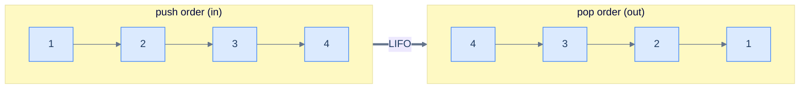
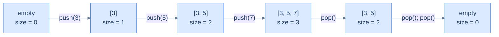

# 1. Introduction to Stacks

## The Hook

You hit Ctrl-Z. The last word you typed disappears. Hit it again — the previous word is back. Again — the punctuation you'd just changed reverts. Each press undoes *exactly the most recent* thing, and never anything else. The first word you typed today is still safely behind every other change, waiting at the very bottom of the pile, accessible only after every later change has been undone.

That ordered "most recent first" behaviour is everywhere in computing once you start looking. Your browser's **back** button. Your editor's **undo** stack. The **call stack** the CPU uses to remember which function called which. The bracket matcher in your IDE. Function-return addresses. Recursion itself. Every one of them is the same idea wearing a different costume: **last in, first out** — *LIFO*.

The data structure that makes all of these work is called, fittingly, a **stack**. It's so simple it feels like cheating: a container that lets you add to one end (the **top**) and remove from one end (the same top), and that's it. No "insert in the middle". No "remove from the back". No "search by index". Just push and pop. Out of those two operations falls a *cascade* of programs that would be a nightmare to write any other way.

This is the easiest data structure in the entire course, and the one whose ideas — *recency matters, deferred work belongs on a stack, the most-recent thing has the highest priority* — surface in more interview questions, parser implementations, and CPU architectures than almost any other. Master it cold; the next ten lessons will weaponise it.

---

## Table of contents

1. [Understanding the problem](#understanding-the-problem)
2. [Exploring a possible solution](#exploring-a-possible-solution)
3. [Key properties of a stack](#key-properties-of-a-stack)
4. [Overview of supported operations](#overview-of-supported-operations)

***

# Understanding the problem

Some problems demand that data be processed in **reverse order of arrival**. Whatever went in last must come out first; whatever went in first must wait until everything above it has been dealt with. The technical name for this is **Last In, First Out (LIFO)** — sometimes equivalently called **First In, Last Out (FILO)**. They mean the same thing, just emphasising different ends.



<p align="center"><strong>LIFO in one picture — items 1, 2, 3, 4 went in <em>in that order</em>; they come out in the <em>reverse</em> order. The most recent insertion is always the next one out.</strong></p>

> **Last In, First Out (LIFO)** — also called **First In, Last Out (FILO)** — is a discipline of processing data in the reverse order of insertion. The item added last is the first one removed.

Why does anyone need this? Three real-world examples that almost certainly run on your computer right now.

## Web browsers

The **back** button is a LIFO machine. Every time you click a link, the new page is pushed onto a hidden stack of "places I've been". Every time you click *back*, the top page is popped off and you land on the previous one. Click *back* again — pop again. The pages return in the *exact reverse* of the order in which you visited them.

```d2
direction: right

before: "after visiting home → blog → article" {
  grid-rows: 3
  grid-gap: 0
  s0: "article ← top"
  s1: "blog"
  s2: "home ← bot"
}

after: "after one click of back" {
  grid-rows: 2
  grid-gap: 0
  t0: "blog ← top"
  t1: "home ← bot"
}

before -> after: "pop"
```

<p align="center"><strong>Web browser history — every page visit is a push; every <em>back</em> click is a pop. The most recently visited page is always at the top, and that's exactly the page <em>back</em> needs to return.</strong></p>

## Text editors

Ctrl-Z is the same machine in disguise. Every keystroke you make pushes a "what changed" record onto an undo stack. Every Ctrl-Z pops the most recent record and reverts that change. You can't skip backwards over recent edits to undo something from five minutes ago without first undoing everything since — exactly the LIFO contract.

```d2
direction: right

stk: "undo stack" {
  grid-rows: 4
  grid-gap: 0
  e0: "typed '!' ← top"
  e1: "typed 'world'"
  e2: "typed 'hello'"
  e3: "opened file ← bot"
}

after: "top now: typed 'world'" {
  shape: text
}

stk -> after: "Ctrl-Z pops 'typed !'"
```

<p align="center"><strong>Text editor undo — every action is a push; <em>Ctrl-Z</em> is a pop. The very first action of the session sits at the bottom and only surfaces after everything above it is undone.</strong></p>

## Nested function calls

The deepest example of all. When function `A` calls function `B`, and `B` calls function `C`, the CPU has to remember to return to `B` after `C` finishes, and to `A` after `B` finishes. That memory is kept on **the call stack** — a real, hardware-supported stack of "where to go next". Each `call` instruction pushes a return address; each `ret` pops one. Recursion, exception handling, async-await unwinding — all of it sits on top of this one structure.

```d2
call: "call stack while inside C()" {
  grid-rows: 3
  grid-gap: 0
  f0: "C() ← top (currently executing)"
  f1: "B()"
  f2: "A() ← bot (root caller)"
}

note: |md
  When C returns, B resumes (top is popped).

  When B returns, A resumes.

  Same machine, different costume.
|

note -> call: "" {style.stroke-dash: 3}
```

<p align="center"><strong>The call stack — every function call is a push; every <em>return</em> is a pop. The CPU literally uses a register (<code>rsp</code> on x86-64) that points to the top of this stack. Every program you run, in every language, leans on this.</strong></p>

These three are tip-of-the-iceberg examples. Bracket matching, expression evaluation, depth-first traversal, infinite undo, history navigation, parser stacks, the JVM operand stack — once you spot the pattern, you'll see it weekly. The data structure that makes all of them tractable is the **stack**.

***

# Exploring a possible solution

A stack is a **linear container** with one ruthless restriction: data may be added or removed only at **one end**. That end is called the *top*. The opposite end (the *bottom*) is sealed — you cannot read it, modify it, or even reach it without first emptying everything above. The restriction is what *creates* the LIFO property; without it, we'd have a list, not a stack.

## Stack of plates

The image is right there in the kitchen. A stack of clean plates on a countertop:

- You place new plates **on top**. (push)
- You take plates **from the top**. (pop)
- You can't slide a plate out of the middle without lifting everything above it. (no random access)

```d2
plates: stack of plates {
  grid-rows: 5
  grid-gap: 0
  p5: "plate 5 ← top (last placed)" {style.fill: "#fef9c3"; style.stroke: "#f59e0b"}
  p4: "plate 4"
  p3: "plate 3"
  p2: "plate 2"
  p1: "plate 1 ← bottom (first placed)"
}
```

<p align="center"><strong>A stack of plates follows the LIFO rule by physical necessity — gravity makes the top accessible and the bottom unreachable. The data-structure version of a stack enforces the same restriction by design.</strong></p>

The kitchen analogy is more than cute — it predicts every property of the data structure. The plate placed last is the one in your hand. To get to the plate at the bottom, you have to go through every plate above it. Add a plate, the stack gets taller; remove one, the stack gets shorter. We're going to translate every one of those facts into code.

## Stack data structure

A **stack** is a linear data structure that stores items in an ordered sequence and permits two operations on them: **push** (add to top) and **pop** (remove from top). Auxiliary read-only operations (peek at the top, ask for the size) are conventional but neither inserts nor reorders the data. The whole interface fits on the back of a napkin.

```d2
direction: right

push: "push(7)" { shape: oval }
pop: "pop() → 7" { shape: oval }
peek: "peek() → 7" { shape: oval }
size: "size() → 1" { shape: oval }

stk: "stack [3, 5, 7] (top is right)" {
  grid-columns: 3
  grid-gap: 0
  b: "3"
  m: "5"
  t: "7 ← top" {style.fill: "#fef9c3"; style.stroke: "#f59e0b"}
}

push -> stk
pop -> stk
peek -> stk
size -> stk
```

<p align="center"><strong>Stack interface in one diagram — only <code>push</code> changes the data; <code>pop</code> changes data and returns the removed item; <code>peek</code> and <code>size</code> just inspect. Four operations, total.</strong></p>

In memory, a stack is conventionally drawn vertically with the top at the *top* of the page (matching the kitchen analogy), but in code you'll see it stored as a horizontal array where the *last index* is the top. The orientation is just notation; the LIFO contract is unchanged.

```d2
arr: stack as array {
  grid-columns: 4
  grid-gap: 0
  v0: |md
    **3**

    `0`
  |
  v1: |md
    **5**

    `1`
  |
  v2: |md
    **7**

    `2`
  |
  v3: |md
    **9 ← top**

    `3`
  | {style.fill: "#fef9c3"; style.stroke: "#f59e0b"}
}
```

<p align="center"><strong>Same stack laid out as an array — the rightmost element is the top. <code>push(11)</code> would extend the array to index 4; <code>pop()</code> would shrink it back to index 2.</strong></p>

> *Predict before reading on — if "the top is just the last element of an array", what's the time complexity of push and pop on a dynamic-array-backed stack? And what's the cost of <em>peeking</em> at the bottom of the stack?*
>
> Push and pop are amortised O(1) — appending to the end of a dynamic array and removing from the end are both constant-time on average. Peeking at the *bottom* is O(1) too in principle (just read index 0), but it's *not part of the stack interface* — the data structure refuses to expose it, on principle. The restriction is what makes it a stack.

***

# Key properties of a stack

A stack has three quantities worth naming. None of them surprise you after the kitchen analogy.

## Capacity

The stack's **capacity** is the maximum number of items it can hold. Two flavours:

- **Bounded** stack — capacity is fixed at construction. Pushing onto a full bounded stack is an error (often called *stack overflow* — yes, that's where the website name comes from).
- **Unbounded** stack — capacity grows on demand, limited only by available memory. Most language standard-library stacks are unbounded.

```d2
direction: right

bnd: "bounded stack — capacity 4" {
  grid-rows: 5
  grid-gap: 0
  b3: "[3] 9 ← top"
  b2: "[2] 7"
  b1: "[1] 5"
  b0: "[0] 3"
  cap: "push next → OVERFLOW" {style.fill: "#fee2e2"; style.stroke: "#ef4444"}
}

unb: "unbounded stack — capacity = memory" {
  grid-rows: 5
  grid-gap: 0
  u3: "..."
  u2: "[2] 7"
  u1: "[1] 5"
  u0: "[0] 3"
  cap: "push next → grow & continue" {style.fill: "#dcfce7"; style.stroke: "#16a34a"}
}
```

<p align="center"><strong>Bounded vs. unbounded — bounded stacks reject overflow; unbounded stacks lazily expand. The choice depends on whether the upper bound is known and whether you can afford the resize cost. Most container library stacks (<code>std::stack</code>, Java <code>Deque</code>, Python <code>list</code>) are unbounded.</strong></p>

## Size

The **size** is the number of items currently in the stack. It's bounded above by the capacity. Push increments it by 1; pop decrements it by 1; size is independent of the type or value of the data inside.

A size of zero means the stack is **empty**. Calling `pop` or `peek` on an empty stack is a programming error in most implementations — you must check `size > 0` (or `isEmpty()`) first.



<p align="center"><strong>Size tracks the number of items — it goes up on push, down on pop. <code>size == 0</code> is the canonical "empty" check; pop on empty is undefined and must be guarded against.</strong></p>

## Top

The **top** is the most recently inserted item — the only item the stack will let you read or remove. If the stack is empty, the top is undefined.

The top is what makes a stack a stack. Every operation, without exception, manipulates the top: push *creates* a new top; pop *removes* the current top; peek *reports* the current top.

```d2
stk: stack {
  grid-rows: 4
  grid-gap: 0
  t1: "9 ← top" {style.fill: "#fef9c3"; style.stroke: "#f59e0b"}
  t2: "7"
  t3: "5"
  t4: "3 ← bot"
}
```

<p align="center"><strong>The top is the only window into a stack — every operation is defined relative to it. The bottom exists, but the data structure deliberately gives no way to reach it directly.</strong></p>

***

# Overview of supported operations

A stack exposes a tiny, sharp interface. Two **mutators** (push, pop) and two **inspectors** (size, peek). That's the whole API. Whole books on parser theory, expression evaluation, and graph algorithms are built on these four operations.

## Push

`push(x)` adds `x` to the top of the stack. The size increases by 1. `x` becomes the new top.

```d2
direction: right

before: "before push(9)" {
  grid-rows: 3
  grid-gap: 0
  b1: "7 ← top"
  b2: "5"
  b3: "3 ← bot"
}

after: "after push(9)" {
  grid-rows: 4
  grid-gap: 0
  a1: "9 ← top" {style.fill: "#dcfce7"; style.stroke: "#22c55e"}
  a2: "7"
  a3: "5"
  a4: "3 ← bot"
}

before -> after: "push(9)"
```

<p align="center"><strong>Push — the new item lands on top, and the stack's size grows by one. Everything that was already in the stack stays where it was; only the top moves.</strong></p>

> **Why doesn't a stack support insertion in the middle, like a linked list?**
>
> Because the *whole point* of a stack is the LIFO contract. The moment you allow "insert at position k", you have a list, not a stack. The restriction isn't a missing feature — it's the feature. It's what guarantees that the next pop returns the most recent push, and what lets every algorithm built on a stack rely on that guarantee.

## Pop

`pop()` removes and returns the item at the top. The size decreases by 1. The previous second-from-top becomes the new top.

```d2
direction: right

before: "before pop()" {
  grid-rows: 4
  grid-gap: 0
  b1: "9 ← top" {style.fill: "#fee2e2"; style.stroke: "#ef4444"}
  b2: "7"
  b3: "5"
  b4: "3 ← bot"
}

after: "after pop() → 9" {
  grid-rows: 3
  grid-gap: 0
  a1: "7 ← top"
  a2: "5"
  a3: "3 ← bot"
}

before -> after: "pop()"
```

<p align="center"><strong>Pop — removes and returns the top item. Calling <code>pop()</code> on an empty stack is an error; always check <code>size > 0</code> first.</strong></p>

> **Why doesn't a stack support removing from the middle?**
>
> Same reason as push — the LIFO contract demands that the *only* removable item is the most recent one. Allowing arbitrary removal turns a stack into a deque or list. Production stacks deliberately refuse the operation to *prevent* well-meaning callers from breaking algorithms that rely on the LIFO order.

## Size

`size()` returns the number of items currently on the stack. Always O(1) — implementations typically maintain a counter that's updated by push and pop.

```d2
direction: right

stk: "[3, 5, 7]" { shape: oval }
res: "3" { shape: oval; style.fill: "#dcfce7"; style.stroke: "#22c55e" }

stk -> res: "size()"
```

<p align="center"><strong>Size — a constant-time read. Mostly used as the predicate for <code>isEmpty()</code> (size == 0) or for guarding pop/peek calls (size &gt; 0).</strong></p>

## Top (peek)

`peek()` (sometimes `top()`) returns the value at the top **without removing it**. Useful when you want to look at the most recent item but aren't ready to consume it yet — pattern-matching parsers do this constantly.

```d2
direction: right

stk: "[3, 5, 7, 9]" { shape: oval }
res: "9" { shape: oval; style.fill: "#dcfce7"; style.stroke: "#22c55e" }

stk -> res: "peek()"
note: "stack is unchanged after peek" {shape: text}
note -> stk: "" {style.stroke-dash: 3}
```

<p align="center"><strong>Peek — returns the top without removing it. The stack is still <code>[3, 5, 7, 9]</code> after the call. <code>pop</code> = peek + remove; sometimes you only need the peek.</strong></p>

> **Why doesn't a stack support traversal, like a linked list?**
>
> A stack and a linked list serve different purposes. A linked list is a *sequence* — its job is to expose every element in order. A stack is a *workspace* — its job is to remember which item to deal with next. Iterating over a stack would violate the abstraction the data structure is selling: that the only meaningful element is the top. (In practice, some standard libraries *do* let you iterate a stack — for debugging — but the algorithms you'll write on top of stacks should never rely on it.)

***

## Final Takeaway

A stack is the simplest non-trivial data structure in the course, and arguably the most pervasive. Three things to walk away with:

1. **LIFO is a discipline, not a side effect.** The stack's restrictions exist *to enforce* the contract that the next pop returns the most recent push. Any operation that breaks that contract — insert in the middle, remove from the bottom — is forbidden by design.
2. **Push and pop are O(1).** The whole interface is constant-time. The only nuance is around capacity: a fixed-size stack overflows on push when full; an unbounded stack pays an occasional O(N) resize when its underlying storage grows.
3. **Stacks model deferred work.** Anywhere you find yourself thinking *"I'll deal with this later, after I finish the more recent thing"*, you're describing a stack. Bracket matching, function calls, undo, depth-first search, expression evaluation — all the same shape.

> *Coming up — implementations. The next lesson builds a stack on top of a **dynamic array** (the natural choice when capacity is bounded or when you want cache locality), and the lesson after on top of a **linked list** (the natural choice when push/pop must be guaranteed O(1) without amortisation). Both implement the same interface; the trade-offs are subtle and worth knowing.*
