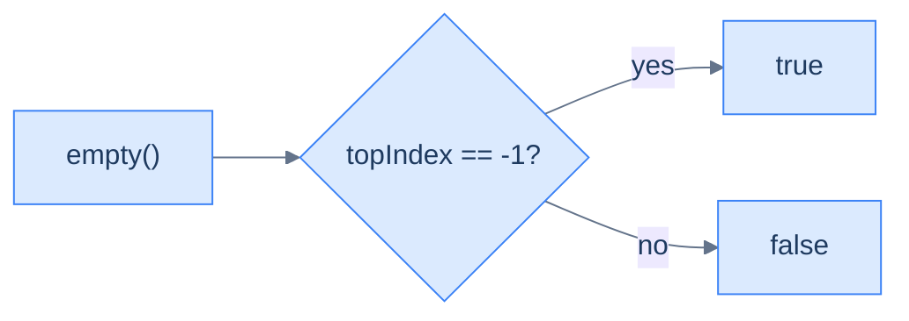
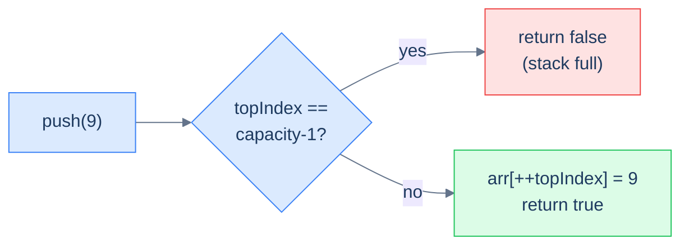

# 2. Array Implementation of Stacks

## The Hook

A stack needs to push, pop, and peek in **O(1)** — and you already own the perfect tool: an array. Treat the *last index* of the array as the top, and every stack operation collapses to a one-liner. Push? Write to `arr[topIndex+1]` and bump `topIndex`. Pop? Read `arr[topIndex]` and decrement. Peek? Read `arr[topIndex]`. Size? `topIndex + 1`. The whole stack interface, three integers and a one-dimensional buffer, no allocator dance per operation, no pointer chasing — just contiguous memory the CPU's prefetcher loves.

Two reasons array-backed stacks dominate in practice: **cache locality** (sequential access patterns blow linked-list stacks out of the water on real hardware), and **predictable cost** (no per-operation `malloc`, no fragmentation). The trade-off is a fixed capacity: once the array fills, you either reject new pushes (a *bounded* stack — what we'll build) or pay an occasional O(N) cost to copy into a larger buffer (a *growable* stack — what `std::stack`, Java's `ArrayDeque`, and Python's `list` do under the hood).

This lesson builds the bounded version end-to-end in 10 languages, then closes with a beautiful interview question — *can you fit two stacks into a single array of length N without wasting any slots?* The answer is yes, and the trick is one of those "wait, that's clever" moments worth carrying around.

---

## Table of contents

1. [Structure of an array-based stack](#structure-of-an-array-based-stack)
2. [Implementing the stack class](#implementing-the-stack-class)
3. [Determining the size of the stack](#determining-the-size-of-the-stack)
4. [Checking if the stack is empty](#checking-if-the-stack-is-empty)
5. [Accessing the top of the stack](#accessing-the-top-of-the-stack)
6. [Pushing an item onto the stack](#pushing-an-item-onto-the-stack)
7. [Popping an item from the stack](#popping-an-item-from-the-stack)
8. [Design a stack using an array](#design-a-stack-using-an-array)
9. [Design two stacks in an array](#design-two-stacks-in-an-array)

***

# Structure of an array-based stack

Three fields and a buffer. That's it.

```d2
cls: "Stack (array-backed)" {
  grid-rows: 3
  grid-gap: 0
  a: "arr: fixed-size array of capacity slots"
  t: "topIndex: index of the topmost item (−1 if empty)"
  c: "capacity: max items the stack can hold"
}
```

<p align="center"><strong>An array-backed stack is just three things — the buffer, the top-of-stack index, and the buffer's capacity. Everything else (size, empty, push, pop, peek) is computed from these.</strong></p>

## State information

### Top index

`topIndex` points at the array slot that currently holds the top of the stack. The convention used everywhere in this lesson:

- **Empty** stack ⇒ `topIndex = -1` (no valid index points at anything).
- **One element** stack ⇒ `topIndex = 0`.
- **Full** stack ⇒ `topIndex = capacity - 1`.

```d2
direction: right

arr: "capacity-4 array" {
  grid-columns: 4
  grid-gap: 0
  v0: |md
    **3**

    `0`
  |
  v1: |md
    **5**

    `1`
  |
  v2: |md
    **7**

    `2`
  | {style.fill: "#fef9c3"; style.stroke: "#f59e0b"}
  v3: |md
    **—**

    `3`
  |
}

tip: "topIndex = 2" {
  shape: oval
}
tip -> arr.v2
```

<p align="center"><strong>Capacity-4 array, three items stored — <code>topIndex = 2</code>. The slot at index 3 is unused but allocated. Push will write at index 3 and bump <code>topIndex</code> to 3; pop will read index 2 and drop <code>topIndex</code> to 1.</strong></p>

### Size

The number of currently-stored items is **`topIndex + 1`**. A separate counter is unnecessary — the index already tells us. This is the single most common identity in array-backed stacks; if it doesn't feel obvious yet, pause and run the numbers on a few example states until it does.

### Capacity

`capacity` is the length of the underlying buffer — the maximum number of items the stack can ever hold. Fixed at construction; checked on every push to detect overflow.

> *Predict before reading on — if <code>topIndex == capacity − 1</code>, what does the next push attempt do? And if <code>topIndex == −1</code>, what does <code>pop()</code> return?*
>
> Push on a full stack rejects (returns false / throws). Pop on an empty stack returns the sentinel `-1` (or throws, depending on convention). These two boundary checks are the only "interesting" code in the entire implementation; everything else is a one-liner.

## Representation in memory

Stacks drawn vertically in textbook diagrams are stored *horizontally* in memory — a single contiguous buffer where the rightmost-used index is the top. This compactness is the whole performance argument: pushing or popping touches one cache line; iterating an N-item stack iterates N adjacent bytes; `realloc` can grow the buffer in place if the OS has room behind it.

```d2
mem: "Memory layout — capacity 6, 3 items" {
  grid-columns: 6
  grid-gap: 0
  m0: |md
    `@1000`

    **3**
  |
  m1: |md
    `@1004`

    **5**
  |
  m2: |md
    `@1008`

    **7**
  | {style.fill: "#fef9c3"; style.stroke: "#f59e0b"}
  m3: |md
    `@1012`

    **—**
  |
  m4: |md
    `@1016`

    **—**
  |
  m5: |md
    `@1020`

    **—**
  |
}

note: |md
  topIndex = 2 → @1008.

  Adjacent bytes; CPU prefetches them for free.
|
note -> mem.m2: "" {style.stroke-dash: 3}
```

<p align="center"><strong>An array-backed stack in actual memory — six 4-byte int slots laid out contiguously. The CPU loads cache lines of 64 bytes, so 16 ints come along for the ride on every push or pop. This is why array stacks beat linked-list stacks in wall-clock time despite identical asymptotic complexity.</strong></p>

***

# Implementing the stack class

We'll build the class incrementally — first the skeleton (constructor + stub methods), then fill in size, empty, top, push, pop in order. Each operation is a one-liner; the only "logic" is the boundary checks for empty and full.

```d2
cls: "Stack class" {
  grid-columns: 2
  grid-gap: 24
  pub: "public API" {
    grid-rows: 5
    grid-gap: 0
    s: "size()"
    e: "empty()"
    p: "top()"
    psh: "push(val) → bool"
    pop: "pop() → val"
  }
  priv: "private internals" {
    grid-rows: 3
    grid-gap: 0
    a: "arr"
    t: "topIndex"
    c: "capacity"
  }
}
```

<p align="center"><strong>The class as we'll build it — three private fields, five public methods. Encapsulation hides <code>topIndex</code>; callers see only the operations.</strong></p>

## Stack class — skeleton


```pseudocode
function Stack(capacity):
    arr      ← empty list of capacity slots
    topIndex ← −1      # −1 means empty
    cap      ← capacity

function size(stack):
    return stack.topIndex + 1

function empty(stack):
    return stack.topIndex = −1

function top(stack):
    if empty(stack): return −1
    return stack.arr[stack.topIndex]

function push(stack, val):
    if stack.topIndex = stack.cap − 1: return false
    stack.topIndex ← stack.topIndex + 1
    stack.arr[stack.topIndex] ← val
    return true

function pop(stack):
    if empty(stack): return −1
    val ← stack.arr[stack.topIndex]
    stack.topIndex ← stack.topIndex − 1
    return val
```

```python run
class Stack:
    def __init__(self, capacity: int):
        self.capacity = capacity
        self.arr      = [0] * capacity      # fixed-size buffer
        self.top_idx  = -1                  # -1 = empty

    def size(self):  pass
    def empty(self): pass
    def top(self):   pass
    def push(self, val): pass
    def pop(self):   pass

s = Stack(4)
print("created stack with capacity 4")
```

```java run
public class Main {
    static class Stack {
        private int[] arr;
        private int   capacity;
        private int   topIndex;
        Stack(int capacity) {
            this.capacity = capacity;
            this.arr      = new int[capacity];
            this.topIndex = -1;
        }
        int     size()  { return 0; }
        boolean empty() { return true; }
        int     top()   { return -1; }
        boolean push(int val) { return false; }
        int     pop()   { return -1; }
    }
    public static void main(String[] args) {
        Stack s = new Stack(4);
        System.out.println("created stack with capacity 4");
    }
}
```

```c run
#include <stdio.h>
#include <stdlib.h>
#include <stdbool.h>

typedef struct {
    int *arr;
    int  capacity;
    int  topIndex;     // -1 = empty
} Stack;

Stack* stack_create(int capacity) {
    Stack *s = malloc(sizeof(Stack));
    s->arr      = malloc(sizeof(int) * capacity);
    s->capacity = capacity;
    s->topIndex = -1;
    return s;
}

int  stack_size (Stack *s)              { return 0; }
bool stack_empty(Stack *s)              { return true; }
int  stack_top  (Stack *s)              { return -1; }
bool stack_push (Stack *s, int val)     { return false; }
int  stack_pop  (Stack *s)              { return -1; }

int main() {
    Stack *s = stack_create(4);
    printf("created stack with capacity %d\n", s->capacity);
    free(s->arr); free(s);
}
```

```cpp run
#include <iostream>
#include <vector>

class Stack {
    std::vector<int> arr;
    int              topIndex;
    int              capacity;
public:
    Stack(int cap) : arr(cap), topIndex(-1), capacity(cap) {}

    int  size()  { return 0;     }
    bool empty() { return true;  }
    int  top()   { return -1;    }
    bool push(int val) { return false; }
    int  pop()   { return -1;    }
};

int main() {
    Stack s(4);
    std::cout << "created stack with capacity 4\n";
}
```

```scala run
class Stack(val capacity: Int) {
  protected val arr     = new Array[Int](capacity)
  protected var topIdx  = -1

  def size:  Int     = 0
  def empty: Boolean = true
  def top:   Int     = -1
  def push(v: Int): Boolean = false
  def pop:   Int     = -1
}

object Main extends App {
  val s = new Stack(4)
  println("created stack with capacity 4")
}
```

```typescript run
class Stack {
    protected capacity: number;
    protected arr:      number[];
    protected topIndex: number;
    constructor(capacity: number) {
        this.capacity = capacity;
        this.arr      = new Array(capacity).fill(0);
        this.topIndex = -1;
    }
    size():  number  { return 0; }
    empty(): boolean { return true; }
    top():   number  { return -1; }
    push(val: number): boolean { return false; }
    pop():   number  { return -1; }
}

const s = new Stack(4);
console.log("created stack with capacity 4");
```

```go run
package main

import "fmt"

type Stack struct {
    arr      []int
    capacity int
    topIndex int
}

func NewStack(capacity int) *Stack {
    return &Stack{arr: make([]int, capacity), capacity: capacity, topIndex: -1}
}

func (s *Stack) Size()  int  { return 0 }
func (s *Stack) Empty() bool { return true }
func (s *Stack) Top()   int  { return -1 }
func (s *Stack) Push(val int) bool { return false }
func (s *Stack) Pop()   int  { return -1 }

func main() {
    s := NewStack(4)
    fmt.Printf("created stack with capacity %d\n", s.capacity)
}
```

```rust run
pub struct Stack {
    arr:       Vec<i32>,
    capacity:  usize,
    top_index: i32,    // -1 = empty
}

impl Stack {
    pub fn new(capacity: usize) -> Self {
        Stack { arr: vec![0; capacity], capacity, top_index: -1 }
    }
    pub fn size(&self)  -> i32  { 0 }
    pub fn empty(&self) -> bool { true }
    pub fn top(&self)   -> i32  { -1 }
    pub fn push(&mut self, _v: i32) -> bool { false }
    pub fn pop(&mut self) -> i32 { -1 }
}

fn main() {
    let s = Stack::new(4);
    println!("created stack with capacity {}", s.capacity);
}
```


***

# Determining the size of the stack

The cleverness of `topIndex = -1 means empty` pays off here: **`size() = topIndex + 1`**. No counter, no traversal, no allocation. One add, return.

```d2
direction: right

e1: |md
  topIndex = -1

  (empty)
|
s1: "size = 0"
e1 -> s1

e2: |md
  topIndex = 0

  (one item)
|
s2: "size = 1"
e2 -> s2

e3: |md
  topIndex = 3

  (four items)
|
s3: "size = 4"
e3 -> s3
```

<p align="center"><strong>Why <code>size() = topIndex + 1</code> works — the indices 0..topIndex hold valid data, so the count of valid entries is <code>topIndex + 1</code>. The −1 sentinel for empty makes the formula uniform across all states (including empty, where 0 + (−1) = 0).</strong></p>

> **Algorithm**
>
> -   **Step 1:** Return `topIndex + 1`.

## Implementation


```pseudocode
function size(stack):
    return stack.topIndex + 1
```

```python run
class Stack:
    def __init__(self, capacity):
        self.capacity, self.arr, self.top_idx = capacity, [0]*capacity, -1
    def size(self): return self.top_idx + 1

s = Stack(4); print(s.size())   # 0
```

```java run
public class Main {
    static class Stack {
        private final int[] arr; private int topIndex;
        Stack(int cap) { arr = new int[cap]; topIndex = -1; }
        int size() { return topIndex + 1; }
    }
    public static void main(String[] args) {
        System.out.println(new Stack(4).size());   // 0
    }
}
```

```c run
#include <stdio.h>
#include <stdlib.h>
typedef struct { int *arr; int capacity, topIndex; } Stack;

Stack* stack_create(int c) { Stack *s = malloc(sizeof(*s)); s->arr = malloc(sizeof(int)*c); s->capacity=c; s->topIndex=-1; return s; }
int    stack_size  (Stack *s) { return s->topIndex + 1; }

int main() { Stack *s = stack_create(4); printf("%d\n", stack_size(s)); free(s->arr); free(s); }
```

```cpp run
#include <iostream>
#include <vector>

class Stack {
    std::vector<int> arr; int topIndex; int capacity;
public:
    Stack(int cap) : arr(cap), topIndex(-1), capacity(cap) {}
    int size() { return topIndex + 1; }
};

int main() { std::cout << Stack(4).size() << "\n"; }
```

```scala run
class Stack(val capacity: Int) {
  protected val arr    = new Array[Int](capacity)
  protected var topIdx = -1
  def size: Int = topIdx + 1
}

object Main extends App { println(new Stack(4).size) }
```

```typescript run
class Stack {
    protected capacity: number; protected arr: number[]; protected topIndex: number;
    constructor(c: number) { this.capacity = c; this.arr = new Array(c).fill(0); this.topIndex = -1; }
    size(): number { return this.topIndex + 1; }
}
console.log(new Stack(4).size());
```

```go run
package main
import "fmt"

type Stack struct{ arr []int; capacity, topIndex int }
func NewStack(c int) *Stack { return &Stack{make([]int, c), c, -1} }
func (s *Stack) Size() int  { return s.topIndex + 1 }

func main() { fmt.Println(NewStack(4).Size()) }
```

```rust run
pub struct Stack { arr: Vec<i32>, capacity: usize, top_index: i32 }
impl Stack {
    pub fn new(c: usize) -> Self { Stack { arr: vec![0; c], capacity: c, top_index: -1 } }
    pub fn size(&self) -> i32 { self.top_index + 1 }
}
fn main() { println!("{}", Stack::new(4).size()); }
```


## Complexity Analysis

> **All cases**
>
> -   Time: **O(1)** | Space: **O(1)**

***

# Checking if the stack is empty

A direct application of the size formula. The stack is empty iff `size() == 0`, equivalently iff `topIndex == -1`.



<p align="center"><strong>Empty check — one comparison. Most callers use this as a guard before <code>top()</code> or <code>pop()</code> to avoid the empty-stack sentinel.</strong></p>

> **Algorithm**
>
> -   **Step 1:** Return `topIndex == -1`.

## Implementation


```pseudocode
function empty(stack):
    return stack.topIndex = −1
```

```python run
class Stack:
    def __init__(self, c): self.capacity, self.arr, self.top_idx = c, [0]*c, -1
    def empty(self): return self.top_idx == -1

s = Stack(4); print(s.empty())   # True
```

```java run
public class Main {
    static class Stack {
        private final int[] arr; private int topIndex;
        Stack(int c) { arr = new int[c]; topIndex = -1; }
        boolean empty() { return topIndex == -1; }
    }
    public static void main(String[] args) { System.out.println(new Stack(4).empty()); }
}
```

```c run
#include <stdio.h>
#include <stdlib.h>
#include <stdbool.h>
typedef struct { int *arr; int capacity, topIndex; } Stack;
Stack* stack_create(int c) { Stack *s=malloc(sizeof(*s)); s->arr=malloc(sizeof(int)*c); s->capacity=c; s->topIndex=-1; return s; }
bool   stack_empty(Stack *s) { return s->topIndex == -1; }

int main() { Stack *s = stack_create(4); printf("%d\n", stack_empty(s)); free(s->arr); free(s); }
```

```cpp run
#include <iostream>
#include <vector>

class Stack {
    std::vector<int> arr; int topIndex; int capacity;
public:
    Stack(int c) : arr(c), topIndex(-1), capacity(c) {}
    bool empty() { return topIndex == -1; }
};

int main() { std::cout << Stack(4).empty() << "\n"; }
```

```scala run
class Stack(val capacity: Int) {
  protected val arr = new Array[Int](capacity); protected var topIdx = -1
  def empty: Boolean = topIdx == -1
}
object Main extends App { println(new Stack(4).empty) }
```

```typescript run
class Stack {
    protected capacity: number; protected arr: number[]; protected topIndex: number;
    constructor(c: number){ this.capacity=c; this.arr=new Array(c).fill(0); this.topIndex=-1; }
    empty(): boolean { return this.topIndex === -1; }
}
console.log(new Stack(4).empty());
```

```go run
package main
import "fmt"
type Stack struct{ arr []int; capacity, topIndex int }
func NewStack(c int) *Stack { return &Stack{make([]int, c), c, -1} }
func (s *Stack) Empty() bool { return s.topIndex == -1 }

func main() { fmt.Println(NewStack(4).Empty()) }
```

```rust run
pub struct Stack { arr: Vec<i32>, capacity: usize, top_index: i32 }
impl Stack {
    pub fn new(c: usize) -> Self { Stack { arr: vec![0; c], capacity: c, top_index: -1 } }
    pub fn empty(&self) -> bool { self.top_index == -1 }
}
fn main() { println!("{}", Stack::new(4).empty()); }
```


## Complexity Analysis

> **All cases** — Time: **O(1)** | Space: **O(1)**

***

# Accessing the top of the stack

`top()` reads the top element *without removing it*. Two cases:

## 1. Stack is empty

`topIndex == -1`. Return the sentinel `-1` (or throw, depending on the API). There's no top to return.

## 2. Stack is not empty

`topIndex >= 0`. Return `arr[topIndex]`. One memory read, done.

```mermaid
---
config:
  theme: base
  themeVariables:
    primaryColor: "#dbeafe"
    primaryBorderColor: "#3b82f6"
    primaryTextColor: "#1e3a5f"
    lineColor: "#64748b"
    secondaryColor: "#ede9fe"
    tertiaryColor: "#fef9c3"
---
flowchart LR
    Q["top()"] --> E{"empty?"}
    E -->|"yes"| R1["return -1"]
    E -->|"no"|  R2["return arr[topIndex]"]
```

<p align="center"><strong>Top — one branch on the empty case, one array read on the populated case. Constant-time peek; the stack's contents are unchanged after the call.</strong></p>

> **Algorithm**
>
> -   **Step 1:** If `empty()` is true, return `-1`.
> -   **Step 2:** Return `arr[topIndex]`.

## Implementation


```pseudocode
function top(stack):
    if empty(stack): return −1
    return stack.arr[stack.topIndex]
```

```python run
class Stack:
    def __init__(self, c): self.capacity, self.arr, self.top_idx = c, [0]*c, -1
    def empty(self): return self.top_idx == -1
    def top(self):
        if self.empty(): return -1
        return self.arr[self.top_idx]
```

```java run
public class Main {
    static class Stack {
        private final int[] arr; private int topIndex;
        Stack(int c){ arr = new int[c]; topIndex = -1; }
        boolean empty() { return topIndex == -1; }
        int top() {
            if (empty()) return -1;
            return arr[topIndex];
        }
    }
}
```

```c run
#include <stdio.h>
#include <stdlib.h>
#include <stdbool.h>
typedef struct { int *arr; int capacity, topIndex; } Stack;
bool stack_empty(Stack *s) { return s->topIndex == -1; }
int  stack_top  (Stack *s) { return stack_empty(s) ? -1 : s->arr[s->topIndex]; }
```

```cpp run
#include <vector>
class Stack {
    std::vector<int> arr; int topIndex; int capacity;
public:
    Stack(int c) : arr(c), topIndex(-1), capacity(c) {}
    bool empty() { return topIndex == -1; }
    int  top()   { return empty() ? -1 : arr[topIndex]; }
};
```

```scala run
class Stack(val capacity: Int) {
  protected val arr = new Array[Int](capacity); protected var topIdx = -1
  def empty: Boolean = topIdx == -1
  def top:   Int     = if (empty) -1 else arr(topIdx)
}
```

```typescript run
class Stack {
    protected capacity: number; protected arr: number[]; protected topIndex: number;
    constructor(c: number){ this.capacity=c; this.arr=new Array(c).fill(0); this.topIndex=-1; }
    empty(): boolean { return this.topIndex === -1; }
    top(): number { return this.empty() ? -1 : this.arr[this.topIndex]; }
}
```

```go run
package main
type Stack struct{ arr []int; capacity, topIndex int }
func (s *Stack) Empty() bool { return s.topIndex == -1 }
func (s *Stack) Top() int    { if s.Empty() { return -1 }; return s.arr[s.topIndex] }
```

```rust run
pub struct Stack { arr: Vec<i32>, capacity: usize, top_index: i32 }
impl Stack {
    pub fn empty(&self) -> bool { self.top_index == -1 }
    pub fn top(&self)   -> i32  { if self.empty() { -1 } else { self.arr[self.top_index as usize] } }
}
```


## Complexity Analysis

> **All cases** — Time: **O(1)** | Space: **O(1)**

***

# Pushing an item onto the stack

Push adds an item to the top. Two cases:

## 1. Stack is full

`topIndex == capacity - 1`. Reject the push — return `false`. Bounded stacks don't grow.

## 2. Stack is not full

Increment `topIndex` and write into the new slot. One increment, one write. Return `true`.



<p align="center"><strong>Push — one boundary check, one pre-incremented write. The pre-increment <code>++topIndex</code> bumps the index <em>before</em> using it, which is exactly the right slot to write into.</strong></p>

> **Algorithm**
>
> -   **Step 1:** If `topIndex == capacity - 1`, return `false`.
> -   **Step 2:** Increment `topIndex`, set `arr[topIndex] = val`, return `true`.

## Implementation


```pseudocode
function push(stack, val):
    if stack.topIndex = stack.cap − 1: return false
    stack.topIndex ← stack.topIndex + 1
    stack.arr[stack.topIndex] ← val
    return true
```

```python run
class Stack:
    def __init__(self, c): self.capacity, self.arr, self.top_idx = c, [0]*c, -1
    def push(self, val):
        if self.top_idx == self.capacity - 1: return False
        self.top_idx += 1
        self.arr[self.top_idx] = val
        return True

s = Stack(2); print(s.push(7), s.push(9), s.push(11))   # True True False
```

```java run
public class Main {
    static class Stack {
        private final int[] arr; private final int capacity; private int topIndex;
        Stack(int c){ this.capacity = c; arr = new int[c]; topIndex = -1; }
        boolean push(int val) {
            if (topIndex == capacity - 1) return false;
            arr[++topIndex] = val;
            return true;
        }
    }
    public static void main(String[] args) {
        Stack s = new Stack(2);
        System.out.println(s.push(7) + " " + s.push(9) + " " + s.push(11));
    }
}
```

```c run
#include <stdio.h>
#include <stdlib.h>
#include <stdbool.h>
typedef struct { int *arr; int capacity, topIndex; } Stack;
Stack* stack_create(int c){ Stack *s=malloc(sizeof(*s)); s->arr=malloc(sizeof(int)*c); s->capacity=c; s->topIndex=-1; return s; }
bool stack_push(Stack *s, int val){
    if (s->topIndex == s->capacity - 1) return false;
    s->arr[++s->topIndex] = val;
    return true;
}

int main() {
    Stack *s = stack_create(2);
    printf("%d %d %d\n", stack_push(s,7), stack_push(s,9), stack_push(s,11));
    free(s->arr); free(s);
}
```

```cpp run
#include <iostream>
#include <vector>
class Stack {
    std::vector<int> arr; int topIndex; int capacity;
public:
    Stack(int c) : arr(c), topIndex(-1), capacity(c) {}
    bool push(int val) {
        if (topIndex == capacity - 1) return false;
        arr[++topIndex] = val;
        return true;
    }
};
int main() {
    Stack s(2);
    std::cout << s.push(7) << " " << s.push(9) << " " << s.push(11) << "\n";
}
```

```scala run
class Stack(val capacity: Int) {
  protected val arr = new Array[Int](capacity); protected var topIdx = -1
  def push(v: Int): Boolean = {
    if (topIdx == capacity - 1) return false
    topIdx += 1; arr(topIdx) = v
    true
  }
}
object Main extends App {
  val s = new Stack(2)
  println(s"${s.push(7)} ${s.push(9)} ${s.push(11)}")
}
```

```typescript run
class Stack {
    protected capacity: number; protected arr: number[]; protected topIndex: number;
    constructor(c: number){ this.capacity=c; this.arr=new Array(c).fill(0); this.topIndex=-1; }
    push(val: number): boolean {
        if (this.topIndex === this.capacity - 1) return false;
        this.arr[++this.topIndex] = val;
        return true;
    }
}
const s = new Stack(2);
console.log(s.push(7), s.push(9), s.push(11));
```

```go run
package main
import "fmt"

type Stack struct{ arr []int; capacity, topIndex int }
func NewStack(c int) *Stack { return &Stack{make([]int, c), c, -1} }
func (s *Stack) Push(val int) bool {
    if s.topIndex == s.capacity - 1 { return false }
    s.topIndex++; s.arr[s.topIndex] = val
    return true
}

func main() {
    s := NewStack(2)
    fmt.Println(s.Push(7), s.Push(9), s.Push(11))
}
```

```rust run
pub struct Stack { arr: Vec<i32>, capacity: usize, top_index: i32 }
impl Stack {
    pub fn new(c: usize) -> Self { Stack { arr: vec![0; c], capacity: c, top_index: -1 } }
    pub fn push(&mut self, val: i32) -> bool {
        if self.top_index == self.capacity as i32 - 1 { return false; }
        self.top_index += 1;
        self.arr[self.top_index as usize] = val;
        true
    }
}
fn main() {
    let mut s = Stack::new(2);
    println!("{} {} {}", s.push(7), s.push(9), s.push(11));
}
```


## Complexity Analysis

> **All cases** — Time: **O(1)** | Space: **O(1)**

***

# Popping an item from the stack

Pop removes and returns the top item. Two cases:

## 1. Stack is empty

`topIndex == -1`. Return the sentinel `-1`.

## 2. Stack is not empty

Read `arr[topIndex]`, decrement `topIndex`, return the read value. The slot we just "freed" is still in memory — there's nothing to physically erase. The next push will overwrite it.

```mermaid
---
config:
  theme: base
  themeVariables:
    primaryColor: "#dbeafe"
    primaryBorderColor: "#3b82f6"
    primaryTextColor: "#1e3a5f"
    lineColor: "#64748b"
    secondaryColor: "#ede9fe"
    tertiaryColor: "#fef9c3"
---
flowchart LR
    Q["pop()"] --> E{"empty?"}
    E -->|"yes"| R["return -1"]
    E -->|"no"|  ACT["v = arr[topIndex]<br/>topIndex--<br/>return v"]
    style ACT fill:#dcfce7,stroke:#22c55e
```

<p align="center"><strong>Pop — read the slot, decrement the index. The stale value at the old top stays in the buffer but is now <em>logically gone</em> (size and topIndex no longer cover it). Next push overwrites it.</strong></p>

> **Algorithm**
>
> -   **Step 1:** If `empty()`, return `-1`.
> -   **Step 2:** Return `arr[topIndex--]` (read at old top, then decrement).

## Implementation


```pseudocode
function pop(stack):
    if empty(stack): return −1
    val ← stack.arr[stack.topIndex]
    stack.topIndex ← stack.topIndex − 1
    return val
```

```python run
class Stack:
    def __init__(self, c): self.capacity, self.arr, self.top_idx = c, [0]*c, -1
    def empty(self): return self.top_idx == -1
    def push(self, v):
        if self.top_idx == self.capacity - 1: return False
        self.top_idx += 1; self.arr[self.top_idx] = v
        return True
    def pop(self):
        if self.empty(): return -1
        v = self.arr[self.top_idx]; self.top_idx -= 1
        return v

s = Stack(3)
s.push(1); s.push(2); s.push(3)
print(s.pop(), s.pop(), s.pop(), s.pop())   # 3 2 1 -1
```

```java run
public class Main {
    static class Stack {
        private final int[] arr; private final int capacity; private int topIndex;
        Stack(int c){ this.capacity = c; arr = new int[c]; topIndex = -1; }
        boolean empty() { return topIndex == -1; }
        boolean push(int v) {
            if (topIndex == capacity - 1) return false;
            arr[++topIndex] = v;
            return true;
        }
        int pop() {
            if (empty()) return -1;
            return arr[topIndex--];
        }
    }
    public static void main(String[] args) {
        Stack s = new Stack(3);
        s.push(1); s.push(2); s.push(3);
        System.out.println(s.pop() + " " + s.pop() + " " + s.pop() + " " + s.pop());
    }
}
```

```c run
#include <stdio.h>
#include <stdlib.h>
#include <stdbool.h>
typedef struct { int *arr; int capacity, topIndex; } Stack;
Stack* stack_create(int c){ Stack *s=malloc(sizeof(*s)); s->arr=malloc(sizeof(int)*c); s->capacity=c; s->topIndex=-1; return s; }
bool stack_empty(Stack *s){ return s->topIndex == -1; }
bool stack_push(Stack *s, int v){
    if (s->topIndex == s->capacity - 1) return false;
    s->arr[++s->topIndex] = v; return true;
}
int  stack_pop (Stack *s){
    if (stack_empty(s)) return -1;
    return s->arr[s->topIndex--];
}

int main() {
    Stack *s = stack_create(3);
    stack_push(s,1); stack_push(s,2); stack_push(s,3);
    printf("%d %d %d %d\n", stack_pop(s), stack_pop(s), stack_pop(s), stack_pop(s));
    free(s->arr); free(s);
}
```

```cpp run
#include <iostream>
#include <vector>
class Stack {
    std::vector<int> arr; int topIndex; int capacity;
public:
    Stack(int c) : arr(c), topIndex(-1), capacity(c) {}
    bool empty() { return topIndex == -1; }
    bool push(int v) { if (topIndex == capacity - 1) return false; arr[++topIndex] = v; return true; }
    int  pop()       { return empty() ? -1 : arr[topIndex--]; }
};
int main() {
    Stack s(3);
    s.push(1); s.push(2); s.push(3);
    std::cout << s.pop() << " " << s.pop() << " " << s.pop() << " " << s.pop() << "\n";
}
```

```scala run
class Stack(val capacity: Int) {
  protected val arr = new Array[Int](capacity); protected var topIdx = -1
  def empty: Boolean = topIdx == -1
  def push(v: Int): Boolean = {
    if (topIdx == capacity - 1) return false
    topIdx += 1; arr(topIdx) = v
    true
  }
  def pop: Int = {
    if (empty) return -1
    val v = arr(topIdx); topIdx -= 1; v
  }
}
object Main extends App {
  val s = new Stack(3); s.push(1); s.push(2); s.push(3)
  println(s"${s.pop} ${s.pop} ${s.pop} ${s.pop}")
}
```

```typescript run
class Stack {
    protected capacity: number; protected arr: number[]; protected topIndex: number;
    constructor(c: number){ this.capacity=c; this.arr=new Array(c).fill(0); this.topIndex=-1; }
    empty(): boolean { return this.topIndex === -1; }
    push(v: number): boolean { if (this.topIndex === this.capacity - 1) return false; this.arr[++this.topIndex] = v; return true; }
    pop(): number { if (this.empty()) return -1; const v = this.arr[this.topIndex]; this.topIndex--; return v; }
}
const s = new Stack(3);
s.push(1); s.push(2); s.push(3);
console.log(s.pop(), s.pop(), s.pop(), s.pop());
```

```go run
package main
import "fmt"
type Stack struct{ arr []int; capacity, topIndex int }
func NewStack(c int) *Stack { return &Stack{make([]int, c), c, -1} }
func (s *Stack) Empty() bool { return s.topIndex == -1 }
func (s *Stack) Push(v int) bool {
    if s.topIndex == s.capacity - 1 { return false }
    s.topIndex++; s.arr[s.topIndex] = v; return true
}
func (s *Stack) Pop() int {
    if s.Empty() { return -1 }
    v := s.arr[s.topIndex]; s.topIndex--
    return v
}

func main() {
    s := NewStack(3)
    s.Push(1); s.Push(2); s.Push(3)
    fmt.Println(s.Pop(), s.Pop(), s.Pop(), s.Pop())
}
```

```rust run
pub struct Stack { arr: Vec<i32>, capacity: usize, top_index: i32 }
impl Stack {
    pub fn new(c: usize) -> Self { Stack { arr: vec![0; c], capacity: c, top_index: -1 } }
    pub fn empty(&self) -> bool { self.top_index == -1 }
    pub fn push(&mut self, v: i32) -> bool {
        if self.top_index == self.capacity as i32 - 1 { return false; }
        self.top_index += 1; self.arr[self.top_index as usize] = v;
        true
    }
    pub fn pop(&mut self) -> i32 {
        if self.empty() { return -1; }
        let v = self.arr[self.top_index as usize]; self.top_index -= 1;
        v
    }
}
fn main() {
    let mut s = Stack::new(3);
    s.push(1); s.push(2); s.push(3);
    println!("{} {} {} {}", s.pop(), s.pop(), s.pop(), s.pop());
}
```


## Complexity Analysis

> **All cases** — Time: **O(1)** | Space: **O(1)**

***

# Design a stack using an array

## Problem Statement

Implement a `Stack` class with the operations from this lesson, backed by an array.

> -   **`Stack(int capacity)`** — initialise with the given capacity.
> -   **`size()`** — current size.
> -   **`empty()`** — is the stack empty?
> -   **`top()`** — value at the top, or `-1` if empty.
> -   **`push(int val)`** — push onto the top; return `true` on success, `false` if full.
> -   **`pop()`** — pop and return the top, or `-1` if empty.

> **Constraint:** Use an **array** as the internal data structure.

> **Example:**
>
> -   **Input ops:** `[Stack, push, push, top, empty, pop, top, push, push, empty]`
> -   **Input args:** `[[2], [2], [3], [], [], [], [], [8], [9], []]`
> -   **Output:** `[null, true, true, 3, false, 3, 2, true, false, false]`

## Solution

The full implementation is exactly what we built incrementally above, in 10 languages.


```pseudocode
function Stack(capacity):
    arr      ← empty list of capacity slots
    topIndex ← −1
    cap      ← capacity

function size(stack):    return stack.topIndex + 1
function empty(stack):   return stack.topIndex = −1
function top(stack):     if empty(stack): return −1  else return stack.arr[stack.topIndex]

function push(stack, val):
    if stack.topIndex = stack.cap − 1: return false
    stack.topIndex ← stack.topIndex + 1
    stack.arr[stack.topIndex] ← val
    return true

function pop(stack):
    if empty(stack): return −1
    val ← stack.arr[stack.topIndex]
    stack.topIndex ← stack.topIndex − 1
    return val
```

```python run
class Stack:
    def __init__(self, capacity):
        self.capacity = capacity
        self.arr      = [0] * capacity
        self.top_idx  = -1

    def size(self):       return self.top_idx + 1
    def empty(self):      return self.top_idx == -1
    def top(self):        return -1 if self.empty() else self.arr[self.top_idx]
    def push(self, val):
        if self.top_idx == self.capacity - 1: return False
        self.top_idx += 1; self.arr[self.top_idx] = val
        return True
    def pop(self):
        if self.empty(): return -1
        v = self.arr[self.top_idx]; self.top_idx -= 1
        return v

# Boss-fight demo
s = Stack(2)
print(s.push(2), s.push(3))      # True True
print(s.top(), s.empty())        # 3 False
print(s.pop())                   # 3
print(s.top())                   # 2
print(s.push(8), s.push(9))      # True False (capacity is 2)
print(s.empty())                 # False
```

```java run
public class Main {
    static class Stack {
        private final int[] arr;
        private final int   capacity;
        private int         topIndex = -1;
        Stack(int capacity) {
            this.capacity = capacity;
            this.arr      = new int[capacity];
        }
        int     size()  { return topIndex + 1; }
        boolean empty() { return topIndex == -1; }
        int     top()   { return empty() ? -1 : arr[topIndex]; }
        boolean push(int v) {
            if (topIndex == capacity - 1) return false;
            arr[++topIndex] = v; return true;
        }
        int pop() { return empty() ? -1 : arr[topIndex--]; }
    }
    public static void main(String[] args) {
        Stack s = new Stack(2);
        System.out.println(s.push(2) + " " + s.push(3));
        System.out.println(s.top() + " " + s.empty());
        System.out.println(s.pop());
        System.out.println(s.top());
        System.out.println(s.push(8) + " " + s.push(9));
        System.out.println(s.empty());
    }
}
```

```c run
#include <stdio.h>
#include <stdlib.h>
#include <stdbool.h>

typedef struct { int *arr; int capacity, topIndex; } Stack;

Stack* stack_create(int c){ Stack *s=malloc(sizeof(*s)); s->arr=malloc(sizeof(int)*c); s->capacity=c; s->topIndex=-1; return s; }
int    stack_size  (Stack *s){ return s->topIndex + 1; }
bool   stack_empty (Stack *s){ return s->topIndex == -1; }
int    stack_top   (Stack *s){ return stack_empty(s) ? -1 : s->arr[s->topIndex]; }
bool   stack_push  (Stack *s, int v){
    if (s->topIndex == s->capacity - 1) return false;
    s->arr[++s->topIndex] = v; return true;
}
int    stack_pop   (Stack *s){
    if (stack_empty(s)) return -1;
    return s->arr[s->topIndex--];
}

int main() {
    Stack *s = stack_create(2);
    printf("%d %d\n", stack_push(s,2), stack_push(s,3));
    printf("%d %d\n", stack_top(s), stack_empty(s));
    printf("%d\n", stack_pop(s));
    printf("%d\n", stack_top(s));
    printf("%d %d\n", stack_push(s,8), stack_push(s,9));
    printf("%d\n", stack_empty(s));
    free(s->arr); free(s);
}
```

```cpp run
#include <iostream>
#include <vector>

class Stack {
    std::vector<int> arr;
    int              topIndex = -1;
    int              capacity;
public:
    Stack(int c) : arr(c), capacity(c) {}
    int  size()  { return topIndex + 1; }
    bool empty() { return topIndex == -1; }
    int  top()   { return empty() ? -1 : arr[topIndex]; }
    bool push(int v) {
        if (topIndex == capacity - 1) return false;
        arr[++topIndex] = v; return true;
    }
    int pop() { return empty() ? -1 : arr[topIndex--]; }
};

int main() {
    Stack s(2);
    std::cout << s.push(2) << " " << s.push(3) << "\n";
    std::cout << s.top() << " " << s.empty() << "\n";
    std::cout << s.pop() << "\n";
    std::cout << s.top() << "\n";
    std::cout << s.push(8) << " " << s.push(9) << "\n";
    std::cout << s.empty() << "\n";
}
```

```scala run
class Stack(val capacity: Int) {
  private val arr  = new Array[Int](capacity)
  private var top_ = -1

  def size:  Int     = top_ + 1
  def empty: Boolean = top_ == -1
  def top:   Int     = if (empty) -1 else arr(top_)
  def push(v: Int): Boolean = {
    if (top_ == capacity - 1) return false
    top_ += 1; arr(top_) = v; true
  }
  def pop: Int = {
    if (empty) return -1
    val v = arr(top_); top_ -= 1; v
  }
}

object Main extends App {
  val s = new Stack(2)
  println(s"${s.push(2)} ${s.push(3)}")
  println(s"${s.top} ${s.empty}")
  println(s.pop)
  println(s.top)
  println(s"${s.push(8)} ${s.push(9)}")
  println(s.empty)
}
```

```typescript run
class Stack {
    private capacity: number;
    private arr: number[];
    private topIndex = -1;
    constructor(capacity: number) {
        this.capacity = capacity;
        this.arr      = new Array(capacity).fill(0);
    }
    size():  number  { return this.topIndex + 1; }
    empty(): boolean { return this.topIndex === -1; }
    top():   number  { return this.empty() ? -1 : this.arr[this.topIndex]; }
    push(v: number): boolean {
        if (this.topIndex === this.capacity - 1) return false;
        this.arr[++this.topIndex] = v; return true;
    }
    pop():   number  { return this.empty() ? -1 : this.arr[this.topIndex--]; }
}

const s = new Stack(2);
console.log(s.push(2), s.push(3));
console.log(s.top(), s.empty());
console.log(s.pop());
console.log(s.top());
console.log(s.push(8), s.push(9));
console.log(s.empty());
```

```go run
package main
import "fmt"

type Stack struct{ arr []int; capacity, topIndex int }

func NewStack(c int) *Stack { return &Stack{make([]int, c), c, -1} }
func (s *Stack) Size()  int  { return s.topIndex + 1 }
func (s *Stack) Empty() bool { return s.topIndex == -1 }
func (s *Stack) Top()   int  { if s.Empty() { return -1 }; return s.arr[s.topIndex] }
func (s *Stack) Push(v int) bool {
    if s.topIndex == s.capacity - 1 { return false }
    s.topIndex++; s.arr[s.topIndex] = v; return true
}
func (s *Stack) Pop() int {
    if s.Empty() { return -1 }
    v := s.arr[s.topIndex]; s.topIndex--; return v
}

func main() {
    s := NewStack(2)
    fmt.Println(s.Push(2), s.Push(3))
    fmt.Println(s.Top(), s.Empty())
    fmt.Println(s.Pop())
    fmt.Println(s.Top())
    fmt.Println(s.Push(8), s.Push(9))
    fmt.Println(s.Empty())
}
```

```rust run
pub struct Stack {
    arr:       Vec<i32>,
    capacity:  usize,
    top_index: i32,
}

impl Stack {
    pub fn new(capacity: usize) -> Self {
        Stack { arr: vec![0; capacity], capacity, top_index: -1 }
    }
    pub fn size(&self)  -> i32  { self.top_index + 1 }
    pub fn empty(&self) -> bool { self.top_index == -1 }
    pub fn top(&self)   -> i32  {
        if self.empty() { -1 } else { self.arr[self.top_index as usize] }
    }
    pub fn push(&mut self, v: i32) -> bool {
        if self.top_index == self.capacity as i32 - 1 { return false; }
        self.top_index += 1;
        self.arr[self.top_index as usize] = v;
        true
    }
    pub fn pop(&mut self) -> i32 {
        if self.empty() { return -1; }
        let v = self.arr[self.top_index as usize];
        self.top_index -= 1;
        v
    }
}

fn main() {
    let mut s = Stack::new(2);
    println!("{} {}", s.push(2), s.push(3));
    println!("{} {}", s.top(), s.empty());
    println!("{}", s.pop());
    println!("{}", s.top());
    println!("{} {}", s.push(8), s.push(9));
    println!("{}", s.empty());
}
```


***

# Design two stacks in an array

## Problem Statement

Pack **two stacks** into a single shared array. The two stacks together must use no more total capacity than the array provides — and ideally, neither stack should run out of room while the *other* one still has free slots.

> -   **`TwoStack(int capacity)`** — initialise; total capacity shared between the two stacks.
> -   **`top1()`, `top2()`** — read the top of stack 1 / stack 2 (or `-1` if empty).
> -   **`push1(int val)`, `push2(int val)`** — push onto stack 1 / stack 2; return `false` if no room.
> -   **`pop1()`, `pop2()`** — pop from stack 1 / stack 2; return `-1` if empty.

> **Constraint:** Use a **single array** to back both stacks. No second array, no linked nodes — one buffer, two stacks.

## The Twist — *grow them toward each other*

The naïve approach is to split the array down the middle: stack 1 owns indices `[0..N/2-1]`, stack 2 owns `[N/2..N-1]`. That works, but it wastes capacity — if stack 1 is full and stack 2 is empty, you can't push onto stack 1 even though half the array is free.

The clever approach: let stack 1 grow **rightward from index 0** (top1 starts at −1) and stack 2 grow **leftward from index capacity−1** (top2 starts at `capacity`). They meet in the middle, but only when the *combined* size hits the array's length. Either stack can use up to N − 1 of the slots, as long as the other stays small.

```d2
direction: right

arr: "two stacks in one array (capacity 5)" {
  grid-columns: 5
  grid-gap: 0
  v0: |md
    **3**

    `0`
  | {style.fill: "#dbeafe"; style.stroke: "#3b82f6"}
  v1: |md
    **5**

    `1`
  | {style.fill: "#dbeafe"; style.stroke: "#3b82f6"}
  v2: |md
    **—**

    `2`
  |
  v3: |md
    **7**

    `3`
  | {style.fill: "#ede9fe"; style.stroke: "#7c3aed"}
  v4: |md
    **11**

    `4`
  | {style.fill: "#ede9fe"; style.stroke: "#7c3aed"}
}

t1: "top1 = 1" { shape: oval; style.fill: "#dbeafe"; style.stroke: "#3b82f6" }
t2: "top2 = 3" { shape: oval; style.fill: "#ede9fe"; style.stroke: "#7c3aed" }

t1 -> arr.v1
t2 -> arr.v3
```

<p align="center"><strong>Two stacks in one array — stack 1 (blue) grows right from index 0; stack 2 (purple) grows left from index capacity−1. They collide only when <code>top1 + 1 == top2</code>, which means the array is genuinely full.</strong></p>

The "full" check changes from "is *my* stack full?" to "are the two tops about to overlap?":

- **`push1` is rejected when** `topIndex1 + 1 >= topIndex2` (no room to advance into).
- **`push2` is rejected when** `topIndex2 - 1 <= topIndex1` (same condition, mirrored).

Initial sentinels:
- `topIndex1 = -1` → stack 1 empty (would-write at index 0 next).
- `topIndex2 = capacity` → stack 2 empty (would-write at index capacity−1 next).

> *Predict before reading on — with capacity 6, all 6 in stack 1, none in stack 2: top1 = ?, top2 = ?, and what does push2 do?*
>
> top1 = 5, top2 = 6 (still its empty sentinel). push2 checks `top2 - 1 <= top1` → `5 <= 5` → true → reject. The array is fully consumed by stack 1, so stack 2 has no room. The check is exactly the same shape as a single-stack "full" check, generalised to the meeting point of two stacks.

## Solution


```pseudocode
function TwoStack(capacity):
    arr  ← empty list of capacity slots
    top1 ← −1           # stack 1 grows right from index 0
    top2 ← capacity     # stack 2 grows left from capacity−1

function push1(ts, val):
    if ts.top1 + 1 ≥ ts.top2: return false   # stacks would collide
    ts.top1 ← ts.top1 + 1
    ts.arr[ts.top1] ← val
    return true

function push2(ts, val):
    if ts.top2 − 1 ≤ ts.top1: return false
    ts.top2 ← ts.top2 − 1
    ts.arr[ts.top2] ← val
    return true

function pop1(ts):
    if ts.top1 < 0: return −1
    val ← ts.arr[ts.top1]; ts.top1 ← ts.top1 − 1; return val

function pop2(ts):
    if ts.top2 = length(ts.arr): return −1
    val ← ts.arr[ts.top2]; ts.top2 ← ts.top2 + 1; return val
```

```python run
class TwoStack:
    def __init__(self, capacity):
        self.capacity = capacity
        self.arr      = [0] * capacity
        self.top1     = -1               # stack 1 grows right from index 0
        self.top2     = capacity         # stack 2 grows left from capacity-1

    def top1_(self): return -1 if self.top1 == -1            else self.arr[self.top1]
    def top2_(self): return -1 if self.top2 == self.capacity else self.arr[self.top2]

    def push1(self, v):
        if self.top1 + 1 >= self.top2: return False           # collide
        self.top1 += 1; self.arr[self.top1] = v
        return True
    def push2(self, v):
        if self.top2 - 1 <= self.top1: return False           # collide
        self.top2 -= 1; self.arr[self.top2] = v
        return True
    def pop1(self):
        if self.top1 == -1: return -1
        v = self.arr[self.top1]; self.top1 -= 1
        return v
    def pop2(self):
        if self.top2 == self.capacity: return -1
        v = self.arr[self.top2]; self.top2 += 1
        return v

# Boss-fight demo
s = TwoStack(6)
print(s.push1(2), s.push2(3))     # True True
print(s.pop1(), s.pop2())         # 2 3
print(s.top1_(), s.top2_())       # -1 -1
print(s.push1(8), s.push1(9))     # True True
print(s.top1_())                  # 9
```

```java run
public class Main {
    static class TwoStack {
        private final int[] arr;
        private final int   capacity;
        private int         topIndex1, topIndex2;
        TwoStack(int capacity) {
            this.capacity  = capacity;
            this.arr       = new int[capacity];
            this.topIndex1 = -1;
            this.topIndex2 = capacity;
        }
        int top1() { return topIndex1 == -1       ? -1 : arr[topIndex1]; }
        int top2() { return topIndex2 == capacity ? -1 : arr[topIndex2]; }
        boolean push1(int v) {
            if (topIndex1 + 1 >= topIndex2) return false;
            arr[++topIndex1] = v; return true;
        }
        boolean push2(int v) {
            if (topIndex2 - 1 <= topIndex1) return false;
            arr[--topIndex2] = v; return true;
        }
        int pop1() { return topIndex1 == -1       ? -1 : arr[topIndex1--]; }
        int pop2() { return topIndex2 == capacity ? -1 : arr[topIndex2++]; }
    }
    public static void main(String[] args) {
        TwoStack s = new TwoStack(6);
        System.out.println(s.push1(2) + " " + s.push2(3));
        System.out.println(s.pop1()   + " " + s.pop2());
        System.out.println(s.top1()   + " " + s.top2());
        System.out.println(s.push1(8) + " " + s.push1(9));
        System.out.println(s.top1());
    }
}
```

```c run
#include <stdio.h>
#include <stdlib.h>
#include <stdbool.h>

typedef struct {
    int *arr;
    int  capacity, top1, top2;
} TwoStack;

TwoStack* twostack_create(int c) {
    TwoStack *s = malloc(sizeof(*s));
    s->arr = malloc(sizeof(int) * c);
    s->capacity = c; s->top1 = -1; s->top2 = c;
    return s;
}
int  ts_top1(TwoStack *s){ return s->top1 == -1         ? -1 : s->arr[s->top1]; }
int  ts_top2(TwoStack *s){ return s->top2 == s->capacity ? -1 : s->arr[s->top2]; }
bool ts_push1(TwoStack *s, int v){
    if (s->top1 + 1 >= s->top2) return false;
    s->arr[++s->top1] = v; return true;
}
bool ts_push2(TwoStack *s, int v){
    if (s->top2 - 1 <= s->top1) return false;
    s->arr[--s->top2] = v; return true;
}
int  ts_pop1(TwoStack *s){ return s->top1 == -1         ? -1 : s->arr[s->top1--]; }
int  ts_pop2(TwoStack *s){ return s->top2 == s->capacity ? -1 : s->arr[s->top2++]; }

int main() {
    TwoStack *s = twostack_create(6);
    printf("%d %d\n", ts_push1(s,2), ts_push2(s,3));
    printf("%d %d\n", ts_pop1(s), ts_pop2(s));
    printf("%d %d\n", ts_top1(s), ts_top2(s));
    printf("%d %d\n", ts_push1(s,8), ts_push1(s,9));
    printf("%d\n", ts_top1(s));
    free(s->arr); free(s);
}
```

```cpp run
#include <iostream>
#include <vector>

class TwoStack {
    std::vector<int> arr;
    int              capacity, topIndex1, topIndex2;
public:
    TwoStack(int c) : arr(c), capacity(c), topIndex1(-1), topIndex2(c) {}
    int  top1() { return topIndex1 == -1       ? -1 : arr[topIndex1]; }
    int  top2() { return topIndex2 == capacity ? -1 : arr[topIndex2]; }
    bool push1(int v) {
        if (topIndex1 + 1 >= topIndex2) return false;
        arr[++topIndex1] = v; return true;
    }
    bool push2(int v) {
        if (topIndex2 - 1 <= topIndex1) return false;
        arr[--topIndex2] = v; return true;
    }
    int  pop1() { return topIndex1 == -1       ? -1 : arr[topIndex1--]; }
    int  pop2() { return topIndex2 == capacity ? -1 : arr[topIndex2++]; }
};

int main() {
    TwoStack s(6);
    std::cout << s.push1(2) << " " << s.push2(3) << "\n";
    std::cout << s.pop1()   << " " << s.pop2()   << "\n";
    std::cout << s.top1()   << " " << s.top2()   << "\n";
    std::cout << s.push1(8) << " " << s.push1(9) << "\n";
    std::cout << s.top1() << "\n";
}
```

```scala run
class TwoStack(val capacity: Int) {
  private val arr  = new Array[Int](capacity)
  private var t1   = -1
  private var t2   = capacity

  def top1: Int = if (t1 == -1)       -1 else arr(t1)
  def top2: Int = if (t2 == capacity) -1 else arr(t2)
  def push1(v: Int): Boolean = {
    if (t1 + 1 >= t2) return false
    t1 += 1; arr(t1) = v; true
  }
  def push2(v: Int): Boolean = {
    if (t2 - 1 <= t1) return false
    t2 -= 1; arr(t2) = v; true
  }
  def pop1: Int = { if (t1 == -1)       return -1; val v = arr(t1); t1 -= 1; v }
  def pop2: Int = { if (t2 == capacity) return -1; val v = arr(t2); t2 += 1; v }
}

object Main extends App {
  val s = new TwoStack(6)
  println(s"${s.push1(2)} ${s.push2(3)}")
  println(s"${s.pop1} ${s.pop2}")
  println(s"${s.top1} ${s.top2}")
  println(s"${s.push1(8)} ${s.push1(9)}")
  println(s.top1)
}
```

```typescript run
class TwoStack {
    private capacity: number;
    private arr:      number[];
    private t1:       number;
    private t2:       number;
    constructor(capacity: number) {
        this.capacity = capacity;
        this.arr      = new Array(capacity).fill(0);
        this.t1       = -1;
        this.t2       = capacity;
    }
    top1():  number  { return this.t1 === -1            ? -1 : this.arr[this.t1]; }
    top2():  number  { return this.t2 === this.capacity ? -1 : this.arr[this.t2]; }
    push1(v: number): boolean { if (this.t1 + 1 >= this.t2) return false; this.arr[++this.t1] = v; return true; }
    push2(v: number): boolean { if (this.t2 - 1 <= this.t1) return false; this.arr[--this.t2] = v; return true; }
    pop1():  number  { return this.t1 === -1            ? -1 : this.arr[this.t1--]; }
    pop2():  number  { return this.t2 === this.capacity ? -1 : this.arr[this.t2++]; }
}

const s = new TwoStack(6);
console.log(s.push1(2), s.push2(3));
console.log(s.pop1(),   s.pop2());
console.log(s.top1(),   s.top2());
console.log(s.push1(8), s.push1(9));
console.log(s.top1());
```

```go run
package main
import "fmt"

type TwoStack struct {
    arr            []int
    capacity, t1, t2 int
}

func NewTwoStack(c int) *TwoStack {
    return &TwoStack{arr: make([]int, c), capacity: c, t1: -1, t2: c}
}
func (s *TwoStack) Top1() int  { if s.t1 == -1         { return -1 }; return s.arr[s.t1] }
func (s *TwoStack) Top2() int  { if s.t2 == s.capacity { return -1 }; return s.arr[s.t2] }
func (s *TwoStack) Push1(v int) bool {
    if s.t1 + 1 >= s.t2 { return false }
    s.t1++; s.arr[s.t1] = v; return true
}
func (s *TwoStack) Push2(v int) bool {
    if s.t2 - 1 <= s.t1 { return false }
    s.t2--; s.arr[s.t2] = v; return true
}
func (s *TwoStack) Pop1() int { if s.t1 == -1         { return -1 }; v := s.arr[s.t1]; s.t1--; return v }
func (s *TwoStack) Pop2() int { if s.t2 == s.capacity { return -1 }; v := s.arr[s.t2]; s.t2++; return v }

func main() {
    s := NewTwoStack(6)
    fmt.Println(s.Push1(2), s.Push2(3))
    fmt.Println(s.Pop1(),   s.Pop2())
    fmt.Println(s.Top1(),   s.Top2())
    fmt.Println(s.Push1(8), s.Push1(9))
    fmt.Println(s.Top1())
}
```

```rust run
pub struct TwoStack {
    arr:       Vec<i32>,
    capacity:  i32,
    t1:        i32,
    t2:        i32,
}

impl TwoStack {
    pub fn new(capacity: i32) -> Self {
        TwoStack { arr: vec![0; capacity as usize], capacity, t1: -1, t2: capacity }
    }
    pub fn top1(&self) -> i32 { if self.t1 == -1            { -1 } else { self.arr[self.t1 as usize] } }
    pub fn top2(&self) -> i32 { if self.t2 == self.capacity { -1 } else { self.arr[self.t2 as usize] } }
    pub fn push1(&mut self, v: i32) -> bool {
        if self.t1 + 1 >= self.t2 { return false; }
        self.t1 += 1; self.arr[self.t1 as usize] = v; true
    }
    pub fn push2(&mut self, v: i32) -> bool {
        if self.t2 - 1 <= self.t1 { return false; }
        self.t2 -= 1; self.arr[self.t2 as usize] = v; true
    }
    pub fn pop1(&mut self) -> i32 {
        if self.t1 == -1 { return -1; }
        let v = self.arr[self.t1 as usize]; self.t1 -= 1; v
    }
    pub fn pop2(&mut self) -> i32 {
        if self.t2 == self.capacity { return -1; }
        let v = self.arr[self.t2 as usize]; self.t2 += 1; v
    }
}

fn main() {
    let mut s = TwoStack::new(6);
    println!("{} {}", s.push1(2), s.push2(3));
    println!("{} {}", s.pop1(),   s.pop2());
    println!("{} {}", s.top1(),   s.top2());
    println!("{} {}", s.push1(8), s.push1(9));
    println!("{}", s.top1());
}
```


***

## Final Takeaway

An array-backed stack is the most straightforward data-structure implementation you'll ever write — *every* operation is O(1), the entire interface fits in one screen, and the buffer's contiguity gives you cache locality the linked-list version can't match.

Three lessons:

1. **Treat the last index as the top.** With `topIndex = -1` for empty, `size = topIndex + 1` is the universal identity that drives every other formula.
2. **Boundary checks are the only logic.** Pop-on-empty and push-on-full are the only conditions that aren't trivially constant time. Everything else is one increment, one read or write.
3. **Bidirectional growth is the trick that packs two stacks into one array.** Stack 1 rightward from 0, stack 2 leftward from N−1, both end at the meeting point. The single shared array lets either stack consume up to N−1 of the slots as long as the other stays small — far more flexible than splitting the array in halves.

> *Coming up — the **linked-list implementation**. The trade-off flips: no fixed capacity (push never fails for "full"), no resize cost ever, but every node is its own allocation and the memory layout is whatever the heap gives you. The same five operations, the same complexities, but a different set of trade-offs and a different "default choice" for different use cases.*
