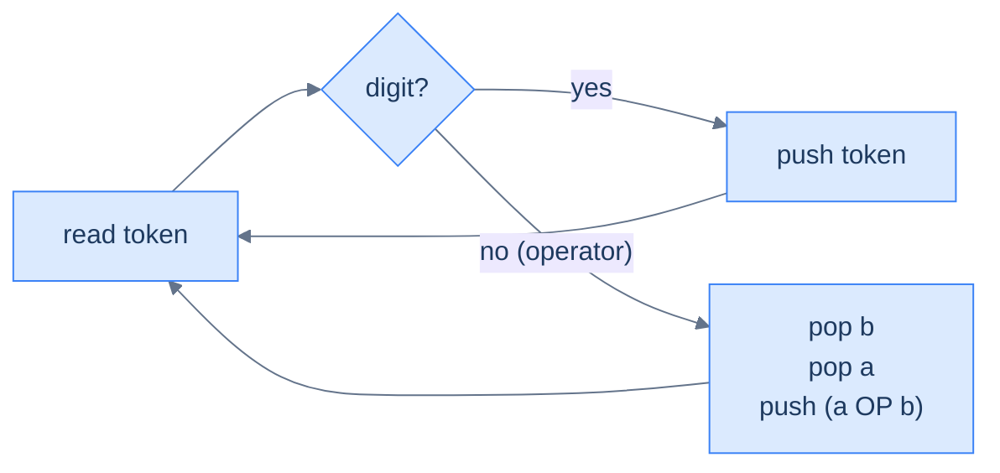
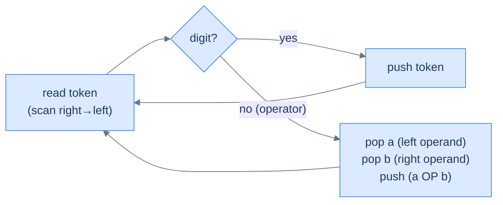
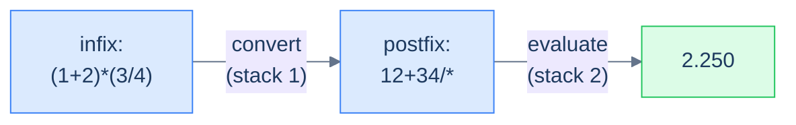

# 5. Evaluating Expressions Using a Stack

## The Hook

We just learned that postfix and prefix encode the order of operations *by position alone* — no parentheses, no precedence rules. That's a beautiful property, but it's only useful if we can actually *evaluate* such expressions efficiently. The good news: with a stack in our toolbox, the evaluator is one of the cleanest, most satisfying algorithms in the whole course. **Single pass over the string. One stack. No look-ahead. No backtracking. No special cases.** Push when you see an operand; pop two and push the result when you see an operator. The final number sitting alone on the stack is your answer.

That's it. Twelve lines of code. Linear time. Constant code complexity. The same pattern that runs inside every Reverse-Polish HP calculator, the inner loop of Forth interpreters, and the operand stack of the JVM.

This lesson builds three evaluators:

1. **Postfix evaluator** — the canonical one; left-to-right scan.
2. **Prefix evaluator** — same idea, scan right-to-left (or reverse the string and reuse the postfix logic with operand-order flipped).
3. **Infix evaluator** — the cheat: convert to postfix using the algorithm from the next lesson, then evaluate. Two stacks total, but each one is doing one thing well.

By the end you'll have a calculator core that handles `(2+3)*(4/2)` with the same code path as `23*4/+`. Same engine, three input dialects.

---

## Table of contents

1. [Understanding the evaluation of postfix expressions](#understanding-the-evaluation-of-postfix-expressions)
2. [Evaluate a postfix expression](#evaluate-a-postfix-expression)
3. [Understanding the evaluation of prefix expressions](#understanding-the-evaluation-of-prefix-expressions)
4. [Evaluate a prefix expression](#evaluate-a-prefix-expression)
5. [Evaluate an infix expression](#evaluate-an-infix-expression)

***

# Understanding the evaluation of postfix expressions

The recipe — three sentences:

1. Walk the string left to right.
2. If the token is an **operand**, push it onto the stack.
3. If the token is an **operator**, pop the top two values, apply the operator, push the result.

When the walk ends, the lone item on the stack is the answer.



<p align="center"><strong>Postfix evaluator — every iteration is either a push (operand) or a pop-two-push-one (operator). At end-of-input, the stack holds exactly one element: the result.</strong></p>

> **Crucial: operand order matters.**
>
> When you see `a b -` and pop in order, the *first* value popped is `b` (it was pushed second, so it's on top), and the *second* value popped is `a` (pushed first, now exposed). The operation is `a − b`, not `b − a`. Convention: name them `operand2 = stack.pop()` (popped first), then `operand1 = stack.pop()` (popped second), and call `op(operand1, operand2)`. For commutative operators (`+`, `*`) the order doesn't matter; for `-`, `/`, `^` it does, and getting it backwards silently produces wrong answers.

## Walkthrough — `2 3 1 * + 9 -`

The input is the postfix form of `(2 + 3*1) - 9 = -4`. Walk it:

| Step | Token | Action | Stack (top right) |
|---:|:---:|---|---|
| 1 | `2` | push | `[2]` |
| 2 | `3` | push | `[2, 3]` |
| 3 | `1` | push | `[2, 3, 1]` |
| 4 | `*` | pop 1, pop 3, push `3*1=3` | `[2, 3]` |
| 5 | `+` | pop 3, pop 2, push `2+3=5` | `[5]` |
| 6 | `9` | push | `[5, 9]` |
| 7 | `-` | pop 9, pop 5, push `5-9=-4` | `[-4]` |
| — | end | result is the lone item | **`-4`** |

<p align="center"><strong>Walking <code>2 3 1 * + 9 -</code> step by step — every operator collapses two stack entries into one, so the stack never grows past O(operands). The final element is the answer.</strong></p>

## Algorithm

> **Algorithm**
>
> -   **Step 1:** Initialise an empty stack.
> -   **Step 2:** For each character `ch` in the postfix string, left to right:
>     -   **2.1** If `ch` is a digit, push its numeric value.
>     -   **2.2** Else (`ch` is an operator):
>         -   `op2 = stack.pop()` (popped first → right operand)
>         -   `op1 = stack.pop()` (popped second → left operand)
>         -   push `apply(op1, ch, op2)`
> -   **Step 3:** Return `stack.top()`.

## Implementation

```python run
def perform(a: float, b: float, op: str) -> float:
    if op == '+': return a + b
    if op == '-': return a - b
    if op == '*': return a * b
    if op == '/': return a / b
    return 0.0

def evaluate_postfix(postfix: str) -> float:
    stack = []
    for ch in postfix:
        if ch.isdigit():
            stack.append(float(ch))
        else:
            b = stack.pop()                    # popped first → right operand
            a = stack.pop()                    # popped second → left operand
            stack.append(perform(a, b, ch))
    return stack[-1]

print(evaluate_postfix("231*+9-"))    # -4.0
print(evaluate_postfix("23*"))        # 6.0
print(evaluate_postfix("234*+"))      # 14.0  (== 2 + 3*4)
```

```java run
import java.util.*;

public class Main {
    static float perform(float a, float b, char op) {
        switch (op) {
            case '+': return a + b;
            case '-': return a - b;
            case '*': return a * b;
            case '/': return a / b;
            default:  return 0;
        }
    }
    static float evaluatePostfix(String postfix) {
        Deque<Float> st = new ArrayDeque<>();
        for (char ch : postfix.toCharArray()) {
            if (Character.isDigit(ch)) st.push((float)(ch - '0'));
            else {
                float b = st.pop(), a = st.pop();
                st.push(perform(a, b, ch));
            }
        }
        return st.peek();
    }
    public static void main(String[] args) {
        System.out.println(evaluatePostfix("231*+9-"));   // -4.0
        System.out.println(evaluatePostfix("23*"));       // 6.0
        System.out.println(evaluatePostfix("234*+"));     // 14.0
    }
}
```

```c run
#include <stdio.h>
#include <ctype.h>
#include <string.h>

static float perform_op(float a, float b, char op) {
    switch (op) {
        case '+': return a + b;
        case '-': return a - b;
        case '*': return a * b;
        case '/': return a / b;
        default:  return 0;
    }
}

float evaluate_postfix(const char *postfix) {
    float stack[256]; int top = -1;
    for (const char *p = postfix; *p; p++) {
        if (isdigit((unsigned char)*p)) stack[++top] = (float)(*p - '0');
        else {
            float b = stack[top--];
            float a = stack[top--];
            stack[++top] = perform_op(a, b, *p);
        }
    }
    return stack[top];
}

int main() {
    printf("%.1f\n", evaluate_postfix("231*+9-"));   // -4.0
    printf("%.1f\n", evaluate_postfix("23*"));       // 6.0
    printf("%.1f\n", evaluate_postfix("234*+"));     // 14.0
}
```

```cpp run
#include <iostream>
#include <stack>
#include <string>
#include <cctype>

float perform(float a, float b, char op) {
    switch (op) { case '+': return a+b; case '-': return a-b;
                  case '*': return a*b; case '/': return a/b; default: return 0; }
}
float evaluatePostfix(const std::string &postfix) {
    std::stack<float> st;
    for (char ch : postfix) {
        if (isdigit((unsigned char)ch)) st.push((float)(ch - '0'));
        else {
            float b = st.top(); st.pop();
            float a = st.top(); st.pop();
            st.push(perform(a, b, ch));
        }
    }
    return st.top();
}

int main() {
    std::cout << evaluatePostfix("231*+9-") << "\n";
    std::cout << evaluatePostfix("23*")     << "\n";
    std::cout << evaluatePostfix("234*+")   << "\n";
}
```

```scala run
import scala.collection.mutable

def perform(a: Float, b: Float, op: Char): Float = op match {
  case '+' => a + b; case '-' => a - b
  case '*' => a * b; case '/' => a / b
  case _   => 0.0f
}
def evaluatePostfix(postfix: String): Float = {
  val st = mutable.Stack[Float]()
  for (ch <- postfix) {
    if (ch.isDigit) st.push((ch - '0').toFloat)
    else {
      val b = st.pop(); val a = st.pop()
      st.push(perform(a, b, ch))
    }
  }
  st.top
}

object Main extends App {
  println(evaluatePostfix("231*+9-"))
  println(evaluatePostfix("23*"))
  println(evaluatePostfix("234*+"))
}
```

```javascript run
function perform(a, b, op) {
    switch (op) {
        case '+': return a + b;
        case '-': return a - b;
        case '*': return a * b;
        case '/': return a / b;
    }
    return 0;
}
function evaluatePostfix(postfix) {
    const st = [];
    for (const ch of postfix) {
        if (/\d/.test(ch)) st.push(Number(ch));
        else {
            const b = st.pop(), a = st.pop();
            st.push(perform(a, b, ch));
        }
    }
    return st.pop();
}
console.log(evaluatePostfix("231*+9-"));   // -4
console.log(evaluatePostfix("23*"));       // 6
console.log(evaluatePostfix("234*+"));     // 14
```

```typescript run
function perform(a: number, b: number, op: string): number {
    switch (op) {
        case '+': return a + b;
        case '-': return a - b;
        case '*': return a * b;
        case '/': return a / b;
    }
    return 0;
}
function evaluatePostfix(postfix: string): number {
    const st: number[] = [];
    for (const ch of postfix) {
        if (/\d/.test(ch)) st.push(Number(ch));
        else {
            const b = st.pop()!, a = st.pop()!;
            st.push(perform(a, b, ch));
        }
    }
    return st.pop()!;
}
console.log(evaluatePostfix("231*+9-"));
console.log(evaluatePostfix("23*"));
console.log(evaluatePostfix("234*+"));
```

```go run
package main

import "fmt"

func perform(a, b float64, op byte) float64 {
    switch op {
        case '+': return a + b
        case '-': return a - b
        case '*': return a * b
        case '/': return a / b
    }
    return 0
}
func evaluatePostfix(postfix string) float64 {
    st := []float64{}
    for i := 0; i < len(postfix); i++ {
        ch := postfix[i]
        if ch >= '0' && ch <= '9' {
            st = append(st, float64(ch - '0'))
        } else {
            b := st[len(st)-1]; st = st[:len(st)-1]
            a := st[len(st)-1]; st = st[:len(st)-1]
            st = append(st, perform(a, b, ch))
        }
    }
    return st[len(st)-1]
}

func main() {
    fmt.Println(evaluatePostfix("231*+9-"))
    fmt.Println(evaluatePostfix("23*"))
    fmt.Println(evaluatePostfix("234*+"))
}
```

```kotlin run
fun perform(a: Float, b: Float, op: Char): Float = when (op) {
    '+' -> a + b; '-' -> a - b
    '*' -> a * b; '/' -> a / b
    else -> 0f
}
fun evaluatePostfix(postfix: String): Float {
    val st = ArrayDeque<Float>()
    for (ch in postfix) {
        if (ch.isDigit()) st.addLast((ch - '0').toFloat())
        else {
            val b = st.removeLast()
            val a = st.removeLast()
            st.addLast(perform(a, b, ch))
        }
    }
    return st.last()
}

fun main() {
    println(evaluatePostfix("231*+9-"))
    println(evaluatePostfix("23*"))
    println(evaluatePostfix("234*+"))
}
```

```rust run
fn perform(a: f32, b: f32, op: char) -> f32 {
    match op { '+' => a+b, '-' => a-b, '*' => a*b, '/' => a/b, _ => 0.0 }
}
fn evaluate_postfix(postfix: &str) -> f32 {
    let mut st: Vec<f32> = Vec::new();
    for ch in postfix.chars() {
        if ch.is_ascii_digit() {
            st.push((ch as u8 - b'0') as f32);
        } else {
            let b = st.pop().unwrap();
            let a = st.pop().unwrap();
            st.push(perform(a, b, ch));
        }
    }
    *st.last().unwrap()
}

fn main() {
    println!("{}", evaluate_postfix("231*+9-"));
    println!("{}", evaluate_postfix("23*"));
    println!("{}", evaluate_postfix("234*+"));
}
```


## Complexity Analysis

Every character is processed once. Each operator triggers at most three stack operations (two pops, one push). The stack's maximum depth is bounded by the number of operands, which is bounded by the input length.

> **All cases** — Time: **O(N)** | Space: **O(N)**

***

# Evaluate a postfix expression

## Problem Statement

Given a string `postfix` representing a postfix expression with single-digit operands and the operators `+`, `-`, `*`, `/`, evaluate it and return the result as a float.

### Example

> -   **Input:** `postfix = "231*+9-"`
> -   **Output:** `-4.000`
> -   **Explanation:** Equivalent infix is `(2 + 3*1) - 9 = -4`.

## Solution

The full evaluator from above, written compactly. Same code, just packaged as the answer to the problem.

```python run
def evaluate_postfix(postfix: str) -> float:
    OPS = { '+': lambda a, b: a + b,
            '-': lambda a, b: a - b,
            '*': lambda a, b: a * b,
            '/': lambda a, b: a / b }
    stack = []
    for ch in postfix:
        if ch.isdigit(): stack.append(float(ch))
        else:
            b = stack.pop(); a = stack.pop()
            stack.append(OPS[ch](a, b))
    return stack[-1]

print(evaluate_postfix("231*+9-"))   # -4.0
```

```java run
public class Main {
    static float evaluatePostfix(String postfix) {
        java.util.Deque<Float> st = new java.util.ArrayDeque<>();
        for (char ch : postfix.toCharArray()) {
            if (Character.isDigit(ch)) st.push((float)(ch - '0'));
            else {
                float b = st.pop(), a = st.pop();
                st.push(switch (ch) {
                    case '+' -> a + b; case '-' -> a - b;
                    case '*' -> a * b; case '/' -> a / b;
                    default  -> 0;
                });
            }
        }
        return st.peek();
    }
    public static void main(String[] args) {
        System.out.println(evaluatePostfix("231*+9-"));
    }
}
```

```c run
#include <stdio.h>
#include <ctype.h>

float evaluate_postfix(const char *postfix) {
    float st[256]; int top = -1;
    for (const char *p = postfix; *p; p++) {
        if (isdigit((unsigned char)*p)) st[++top] = (float)(*p - '0');
        else {
            float b = st[top--], a = st[top--];
            switch (*p) {
                case '+': st[++top] = a + b; break;
                case '-': st[++top] = a - b; break;
                case '*': st[++top] = a * b; break;
                case '/': st[++top] = a / b; break;
            }
        }
    }
    return st[top];
}

int main() { printf("%.3f\n", evaluate_postfix("231*+9-")); }
```

```cpp run
#include <iostream>
#include <stack>
#include <cctype>

float evaluatePostfix(const std::string &postfix) {
    std::stack<float> st;
    for (char ch : postfix) {
        if (isdigit((unsigned char)ch)) st.push((float)(ch - '0'));
        else {
            float b = st.top(); st.pop();
            float a = st.top(); st.pop();
            switch (ch) {
                case '+': st.push(a + b); break;
                case '-': st.push(a - b); break;
                case '*': st.push(a * b); break;
                case '/': st.push(a / b); break;
            }
        }
    }
    return st.top();
}
int main() { std::cout << evaluatePostfix("231*+9-") << "\n"; }
```

```scala run
import scala.collection.mutable

def evaluatePostfix(postfix: String): Float = {
  val st = mutable.Stack[Float]()
  for (ch <- postfix) {
    if (ch.isDigit) st.push((ch - '0').toFloat)
    else {
      val b = st.pop(); val a = st.pop()
      st.push(ch match {
        case '+' => a + b; case '-' => a - b
        case '*' => a * b; case '/' => a / b
      })
    }
  }
  st.top
}

object Main extends App { println(evaluatePostfix("231*+9-")) }
```

```javascript run
function evaluatePostfix(postfix) {
    const st = [];
    const ops = {'+':(a,b)=>a+b, '-':(a,b)=>a-b, '*':(a,b)=>a*b, '/':(a,b)=>a/b};
    for (const ch of postfix) {
        if (/\d/.test(ch)) st.push(Number(ch));
        else { const b = st.pop(), a = st.pop(); st.push(ops[ch](a, b)); }
    }
    return st.pop();
}
console.log(evaluatePostfix("231*+9-"));
```

```typescript run
function evaluatePostfix(postfix: string): number {
    const st: number[] = [];
    const ops: Record<string, (a: number, b: number) => number> = {
        '+': (a, b) => a + b, '-': (a, b) => a - b,
        '*': (a, b) => a * b, '/': (a, b) => a / b,
    };
    for (const ch of postfix) {
        if (/\d/.test(ch)) st.push(Number(ch));
        else { const b = st.pop()!, a = st.pop()!; st.push(ops[ch](a, b)); }
    }
    return st.pop()!;
}
console.log(evaluatePostfix("231*+9-"));
```

```go run
package main
import "fmt"

func evaluatePostfix(postfix string) float64 {
    st := []float64{}
    for i := 0; i < len(postfix); i++ {
        ch := postfix[i]
        if ch >= '0' && ch <= '9' { st = append(st, float64(ch - '0')); continue }
        b := st[len(st)-1]; a := st[len(st)-2]; st = st[:len(st)-2]
        switch ch {
            case '+': st = append(st, a + b)
            case '-': st = append(st, a - b)
            case '*': st = append(st, a * b)
            case '/': st = append(st, a / b)
        }
    }
    return st[len(st)-1]
}
func main() { fmt.Println(evaluatePostfix("231*+9-")) }
```

```kotlin run
fun evaluatePostfix(postfix: String): Float {
    val st = ArrayDeque<Float>()
    for (ch in postfix) {
        if (ch.isDigit()) st.addLast((ch - '0').toFloat())
        else {
            val b = st.removeLast(); val a = st.removeLast()
            st.addLast(when (ch) {
                '+' -> a + b; '-' -> a - b
                '*' -> a * b; '/' -> a / b
                else -> 0f
            })
        }
    }
    return st.last()
}
fun main() { println(evaluatePostfix("231*+9-")) }
```

```rust run
fn evaluate_postfix(postfix: &str) -> f32 {
    let mut st: Vec<f32> = Vec::new();
    for ch in postfix.chars() {
        if ch.is_ascii_digit() {
            st.push((ch as u8 - b'0') as f32);
        } else {
            let b = st.pop().unwrap();
            let a = st.pop().unwrap();
            st.push(match ch { '+' => a+b, '-' => a-b, '*' => a*b, '/' => a/b, _ => 0.0 });
        }
    }
    *st.last().unwrap()
}
fn main() { println!("{}", evaluate_postfix("231*+9-")); }
```


***

# Understanding the evaluation of prefix expressions

Prefix is postfix's mirror. Same algorithm with two changes:

1. **Scan right to left** instead of left to right.
2. **Operand order is flipped.** When we hit an operator, the *first* value popped is the *left* operand (because under right-to-left scan, the most recently seen operand is the leftmost one), and the second pop is the *right* operand. This is the opposite of postfix.



<p align="center"><strong>Prefix evaluator — same shape as postfix; only the scan direction and the operand-pop order change. Easiest to implement by reversing the input string and reusing the postfix loop, taking care to flip the order of operand assignment.</strong></p>

## Walkthrough — `- + 8 / 6 3 2`

Equivalent infix: `(8 + 6/3) - 2 = 8`. Reversed string: `2 3 6 / 8 + -`. Walk the reversed string left-to-right, treating the first pop as the left operand:

| Step | Token | Action (first pop = left operand) | Stack (top right) |
|---:|:---:|---|---|
| 1 | `2` | push | `[2]` |
| 2 | `3` | push | `[2, 3]` |
| 3 | `6` | push | `[2, 3, 6]` |
| 4 | `/` | pop a=6, pop b=3, push `6/3=2` | `[2, 2]` |
| 5 | `8` | push | `[2, 2, 8]` |
| 6 | `+` | pop a=8, pop b=2, push `8+2=10` | `[2, 10]` |
| 7 | `-` | pop a=10, pop b=2, push `10-2=8` | `[8]` |
| — | end | result is the lone item | **`8`** |

<p align="center"><strong>Prefix evaluation, after reversing the input — same single-pass shape as postfix, but the first pop is the <em>left</em> operand. Notice <code>6/3=2</code>, not <code>3/6</code>; the operand order matters and the swap is the only thing that's changed from postfix.</strong></p>

***

# Evaluate a prefix expression

## Problem Statement

Given a string `prefix` (single-digit operands, operators `+`, `-`, `*`, `/`), evaluate and return the result.

### Example

> -   **Input:** `prefix = "-+8/632"`
> -   **Output:** `8.000`
> -   **Explanation:** Equivalent infix is `(8 + 6/3) - 2 = 8`.

## Solution

```python run
def perform(a: float, b: float, op: str) -> float:
    if op == '+': return a + b
    if op == '-': return a - b
    if op == '*': return a * b
    if op == '/': return a / b
    return 0.0

def evaluate_prefix(prefix: str) -> float:
    stack = []
    for ch in reversed(prefix):                # scan right → left
        if ch.isdigit():
            stack.append(float(ch))
        else:
            a = stack.pop()                    # popped first → LEFT operand
            b = stack.pop()                    # popped second → RIGHT operand
            stack.append(perform(a, b, ch))
    return stack[-1]

print(evaluate_prefix("-+8/632"))    # 8.0
print(evaluate_prefix("+23"))        # 5.0
print(evaluate_prefix("*+23-41"))    # 15.0  (== (2+3) * (4-1))
```

```java run
public class Main {
    static float perform(float a, float b, char op) {
        switch (op) {
            case '+': return a + b; case '-': return a - b;
            case '*': return a * b; case '/': return a / b;
            default:  return 0;
        }
    }
    static float evaluatePrefix(String prefix) {
        java.util.Deque<Float> st = new java.util.ArrayDeque<>();
        for (int i = prefix.length() - 1; i >= 0; i--) {
            char ch = prefix.charAt(i);
            if (Character.isDigit(ch)) st.push((float)(ch - '0'));
            else {
                float a = st.pop();    // LEFT operand
                float b = st.pop();    // RIGHT operand
                st.push(perform(a, b, ch));
            }
        }
        return st.peek();
    }
    public static void main(String[] args) {
        System.out.println(evaluatePrefix("-+8/632"));
        System.out.println(evaluatePrefix("+23"));
        System.out.println(evaluatePrefix("*+23-41"));
    }
}
```

```c run
#include <stdio.h>
#include <ctype.h>
#include <string.h>

static float perform_op(float a, float b, char op) {
    switch (op) { case '+': return a+b; case '-': return a-b;
                  case '*': return a*b; case '/': return a/b; default: return 0; }
}

float evaluate_prefix(const char *prefix) {
    float st[256]; int top = -1;
    int n = (int)strlen(prefix);
    for (int i = n - 1; i >= 0; i--) {
        char ch = prefix[i];
        if (isdigit((unsigned char)ch)) st[++top] = (float)(ch - '0');
        else {
            float a = st[top--];   // LEFT
            float b = st[top--];   // RIGHT
            st[++top] = perform_op(a, b, ch);
        }
    }
    return st[top];
}

int main() {
    printf("%.3f\n", evaluate_prefix("-+8/632"));
    printf("%.3f\n", evaluate_prefix("+23"));
    printf("%.3f\n", evaluate_prefix("*+23-41"));
}
```

```cpp run
#include <iostream>
#include <stack>
#include <cctype>

float perform(float a, float b, char op) {
    switch (op) { case '+': return a+b; case '-': return a-b;
                  case '*': return a*b; case '/': return a/b; default: return 0; }
}
float evaluatePrefix(const std::string &prefix) {
    std::stack<float> st;
    for (int i = (int)prefix.size() - 1; i >= 0; i--) {
        char ch = prefix[i];
        if (isdigit((unsigned char)ch)) st.push((float)(ch - '0'));
        else {
            float a = st.top(); st.pop();
            float b = st.top(); st.pop();
            st.push(perform(a, b, ch));
        }
    }
    return st.top();
}
int main() {
    std::cout << evaluatePrefix("-+8/632") << "\n";
    std::cout << evaluatePrefix("+23")     << "\n";
    std::cout << evaluatePrefix("*+23-41") << "\n";
}
```

```scala run
import scala.collection.mutable

def perform(a: Float, b: Float, op: Char): Float = op match {
  case '+' => a + b; case '-' => a - b
  case '*' => a * b; case '/' => a / b
  case _   => 0f
}
def evaluatePrefix(prefix: String): Float = {
  val st = mutable.Stack[Float]()
  for (ch <- prefix.reverse) {
    if (ch.isDigit) st.push((ch - '0').toFloat)
    else { val a = st.pop(); val b = st.pop(); st.push(perform(a, b, ch)) }
  }
  st.top
}

object Main extends App {
  println(evaluatePrefix("-+8/632"))
  println(evaluatePrefix("+23"))
  println(evaluatePrefix("*+23-41"))
}
```

```javascript run
function perform(a, b, op) {
    switch (op) {
        case '+': return a + b; case '-': return a - b;
        case '*': return a * b; case '/': return a / b;
    }
    return 0;
}
function evaluatePrefix(prefix) {
    const st = [];
    for (let i = prefix.length - 1; i >= 0; i--) {
        const ch = prefix[i];
        if (/\d/.test(ch)) st.push(Number(ch));
        else {
            const a = st.pop(), b = st.pop();   // a = LEFT, b = RIGHT
            st.push(perform(a, b, ch));
        }
    }
    return st.pop();
}
console.log(evaluatePrefix("-+8/632"));
console.log(evaluatePrefix("+23"));
console.log(evaluatePrefix("*+23-41"));
```

```typescript run
function perform(a: number, b: number, op: string): number {
    switch (op) {
        case '+': return a + b; case '-': return a - b;
        case '*': return a * b; case '/': return a / b;
    }
    return 0;
}
function evaluatePrefix(prefix: string): number {
    const st: number[] = [];
    for (let i = prefix.length - 1; i >= 0; i--) {
        const ch = prefix[i];
        if (/\d/.test(ch)) st.push(Number(ch));
        else {
            const a = st.pop()!, b = st.pop()!;
            st.push(perform(a, b, ch));
        }
    }
    return st.pop()!;
}
console.log(evaluatePrefix("-+8/632"));
console.log(evaluatePrefix("+23"));
console.log(evaluatePrefix("*+23-41"));
```

```go run
package main
import "fmt"

func perform(a, b float64, op byte) float64 {
    switch op {
        case '+': return a + b; case '-': return a - b
        case '*': return a * b; case '/': return a / b
    }
    return 0
}
func evaluatePrefix(prefix string) float64 {
    st := []float64{}
    for i := len(prefix) - 1; i >= 0; i-- {
        ch := prefix[i]
        if ch >= '0' && ch <= '9' { st = append(st, float64(ch - '0')); continue }
        a := st[len(st)-1]; b := st[len(st)-2]; st = st[:len(st)-2]
        st = append(st, perform(a, b, ch))
    }
    return st[len(st)-1]
}
func main() {
    fmt.Println(evaluatePrefix("-+8/632"))
    fmt.Println(evaluatePrefix("+23"))
    fmt.Println(evaluatePrefix("*+23-41"))
}
```

```kotlin run
fun perform(a: Float, b: Float, op: Char): Float = when (op) {
    '+' -> a + b; '-' -> a - b
    '*' -> a * b; '/' -> a / b
    else -> 0f
}
fun evaluatePrefix(prefix: String): Float {
    val st = ArrayDeque<Float>()
    for (i in prefix.length - 1 downTo 0) {
        val ch = prefix[i]
        if (ch.isDigit()) st.addLast((ch - '0').toFloat())
        else {
            val a = st.removeLast(); val b = st.removeLast()
            st.addLast(perform(a, b, ch))
        }
    }
    return st.last()
}
fun main() {
    println(evaluatePrefix("-+8/632"))
    println(evaluatePrefix("+23"))
    println(evaluatePrefix("*+23-41"))
}
```

```rust run
fn perform(a: f32, b: f32, op: char) -> f32 {
    match op { '+' => a+b, '-' => a-b, '*' => a*b, '/' => a/b, _ => 0.0 }
}
fn evaluate_prefix(prefix: &str) -> f32 {
    let mut st: Vec<f32> = Vec::new();
    for ch in prefix.chars().rev() {
        if ch.is_ascii_digit() {
            st.push((ch as u8 - b'0') as f32);
        } else {
            let a = st.pop().unwrap();    // LEFT
            let b = st.pop().unwrap();    // RIGHT
            st.push(perform(a, b, ch));
        }
    }
    *st.last().unwrap()
}
fn main() {
    println!("{}", evaluate_prefix("-+8/632"));
    println!("{}", evaluate_prefix("+23"));
    println!("{}", evaluate_prefix("*+23-41"));
}
```


> **Algorithm**
>
> -   **Step 1:** Initialise an empty stack.
> -   **Step 2:** For each character `ch` in the prefix string, **right to left**:
>     -   **2.1** If `ch` is a digit, push its numeric value.
>     -   **2.2** Else: `op1 = stack.pop()` (LEFT), `op2 = stack.pop()` (RIGHT), push `apply(op1, ch, op2)`.
> -   **Step 3:** Return `stack.top()`.

## Complexity Analysis

> **All cases** — Time: **O(N)** | Space: **O(N)**

***

# Evaluate an infix expression

## Problem Statement

Given an infix expression like `(1+2)*(3/4)`, evaluate it and return the result.

### Example

> -   **Input:** `infix = "(1+2)*(3/4)"`
> -   **Output:** `2.250`

## Approach

The trick: **don't evaluate infix directly** — *convert it to postfix* (using the algorithm in the next lesson, which uses one stack), and then evaluate the postfix (using the algorithm we just built, which uses one stack). Two passes; two stacks; same overall O(N).

The full conversion from infix to postfix gets its own lesson because there's quite a bit of nuance — operator precedence comparisons, parentheses handling, the fact that `^` is right-associative while `*` and `/` are left-associative. We'll show the converter inline below for completeness, but the *teaching* of how it works is in lesson 6.



<p align="center"><strong>Infix evaluator — convert first (lesson 6 covers the converter), then evaluate. Each stage is a simple single-stack algorithm; combined, they handle parentheses, precedence, and associativity in two linear passes.</strong></p>

## Solution

```python run
PREC = {'^': 3, '*': 2, '/': 2, '+': 1, '-': 1}

def is_op(ch): return ch in PREC

def infix_to_postfix(infix: str) -> str:
    st, out = [], []
    for ch in infix:
        if ch.isalnum():            out.append(ch)
        elif ch == '(':              st.append(ch)
        elif ch == ')':
            while st and st[-1] != '(': out.append(st.pop())
            if st and st[-1] == '(':    st.pop()
        elif is_op(ch):
            while st and st[-1] != '(' and PREC.get(st[-1], 0) >= PREC[ch]:
                out.append(st.pop())
            st.append(ch)
    while st: out.append(st.pop())
    return ''.join(out)

def perform(a, b, op):
    if op == '+': return a + b
    if op == '-': return a - b
    if op == '*': return a * b
    if op == '/': return a / b
    return 0.0

def evaluate_postfix(postfix: str) -> float:
    st = []
    for ch in postfix:
        if ch.isdigit(): st.append(float(ch))
        else:
            b = st.pop(); a = st.pop()
            st.append(perform(a, b, ch))
    return st[-1]

def evaluate_infix(infix: str) -> float:
    return evaluate_postfix(infix_to_postfix(infix))

print(evaluate_infix("(1+2)*(3/4)"))   # 2.25
print(evaluate_infix("2+3*4"))         # 14.0
print(evaluate_infix("(2+3)*4"))       # 20.0
```

```java run
import java.util.*;

public class Main {
    static int prec(char op) {
        switch (op) { case '^': return 3; case '*': case '/': return 2;
                      case '+': case '-': return 1; default: return 0; }
    }
    static boolean isOp(char ch) { return "+-*/^".indexOf(ch) >= 0; }

    static String infixToPostfix(String infix) {
        Deque<Character> st = new ArrayDeque<>();
        StringBuilder out = new StringBuilder();
        for (char ch : infix.toCharArray()) {
            if (Character.isLetterOrDigit(ch)) out.append(ch);
            else if (ch == '(') st.push(ch);
            else if (ch == ')') {
                while (!st.isEmpty() && st.peek() != '(') out.append(st.pop());
                if (!st.isEmpty()) st.pop();
            } else if (isOp(ch)) {
                while (!st.isEmpty() && st.peek() != '(' && prec(st.peek()) >= prec(ch))
                    out.append(st.pop());
                st.push(ch);
            }
        }
        while (!st.isEmpty()) out.append(st.pop());
        return out.toString();
    }

    static float perform(float a, float b, char op) {
        switch (op) { case '+': return a+b; case '-': return a-b;
                      case '*': return a*b; case '/': return a/b; default: return 0; }
    }
    static float evaluatePostfix(String postfix) {
        Deque<Float> st = new ArrayDeque<>();
        for (char ch : postfix.toCharArray()) {
            if (Character.isDigit(ch)) st.push((float)(ch - '0'));
            else { float b = st.pop(), a = st.pop(); st.push(perform(a, b, ch)); }
        }
        return st.peek();
    }

    static float evaluateInfix(String infix) { return evaluatePostfix(infixToPostfix(infix)); }

    public static void main(String[] args) {
        System.out.println(evaluateInfix("(1+2)*(3/4)"));
        System.out.println(evaluateInfix("2+3*4"));
        System.out.println(evaluateInfix("(2+3)*4"));
    }
}
```

```c run
#include <stdio.h>
#include <string.h>
#include <ctype.h>

int prec(char op) { switch(op){case '^':return 3;case '*':case '/':return 2;case '+':case '-':return 1;default:return 0;} }
int is_op(char c) { return c == '+'||c == '-'||c == '*'||c == '/'||c == '^'; }

void infix_to_postfix(const char *infix, char *out) {
    char st[256]; int top = -1; int o = 0;
    for (const char *p = infix; *p; p++) {
        char c = *p;
        if (isalnum((unsigned char)c)) out[o++] = c;
        else if (c == '(') st[++top] = c;
        else if (c == ')') {
            while (top >= 0 && st[top] != '(') out[o++] = st[top--];
            if (top >= 0) top--;
        } else if (is_op(c)) {
            while (top >= 0 && st[top] != '(' && prec(st[top]) >= prec(c)) out[o++] = st[top--];
            st[++top] = c;
        }
    }
    while (top >= 0) out[o++] = st[top--];
    out[o] = 0;
}

float perform_op(float a, float b, char op) { switch(op){case '+':return a+b;case '-':return a-b;case '*':return a*b;case '/':return a/b;default:return 0;} }

float evaluate_postfix(const char *postfix) {
    float st[256]; int top = -1;
    for (const char *p = postfix; *p; p++) {
        if (isdigit((unsigned char)*p)) st[++top] = (float)(*p - '0');
        else { float b = st[top--], a = st[top--]; st[++top] = perform_op(a, b, *p); }
    }
    return st[top];
}

float evaluate_infix(const char *infix) { char buf[256]; infix_to_postfix(infix, buf); return evaluate_postfix(buf); }

int main() {
    printf("%.3f\n", evaluate_infix("(1+2)*(3/4)"));
    printf("%.3f\n", evaluate_infix("2+3*4"));
    printf("%.3f\n", evaluate_infix("(2+3)*4"));
}
```

```cpp run
#include <iostream>
#include <stack>
#include <cctype>
#include <string>

int prec(char op){switch(op){case '^':return 3;case '*':case '/':return 2;case '+':case '-':return 1;default:return 0;}}
bool isOp(char c){return c == '+'||c == '-'||c == '*'||c == '/'||c == '^';}

std::string infixToPostfix(const std::string &infix) {
    std::stack<char> st; std::string out;
    for (char c : infix) {
        if (isalnum((unsigned char)c)) out += c;
        else if (c == '(') st.push(c);
        else if (c == ')') {
            while (!st.empty() && st.top() != '(') { out += st.top(); st.pop(); }
            if (!st.empty()) st.pop();
        } else if (isOp(c)) {
            while (!st.empty() && st.top() != '(' && prec(st.top()) >= prec(c)) { out += st.top(); st.pop(); }
            st.push(c);
        }
    }
    while (!st.empty()) { out += st.top(); st.pop(); }
    return out;
}

float perform(float a, float b, char op){switch(op){case '+':return a+b;case '-':return a-b;case '*':return a*b;case '/':return a/b;default:return 0;}}

float evaluatePostfix(const std::string &postfix) {
    std::stack<float> st;
    for (char c : postfix) {
        if (isdigit((unsigned char)c)) st.push((float)(c - '0'));
        else { float b = st.top(); st.pop(); float a = st.top(); st.pop(); st.push(perform(a, b, c)); }
    }
    return st.top();
}

float evaluateInfix(const std::string &infix) { return evaluatePostfix(infixToPostfix(infix)); }

int main() {
    std::cout << evaluateInfix("(1+2)*(3/4)") << "\n";
    std::cout << evaluateInfix("2+3*4")       << "\n";
    std::cout << evaluateInfix("(2+3)*4")     << "\n";
}
```

```scala run
import scala.collection.mutable

def prec(op: Char): Int = op match { case '^' => 3; case '*' | '/' => 2; case '+' | '-' => 1; case _ => 0 }
def isOp(c: Char): Boolean = "+-*/^".contains(c)

def infixToPostfix(infix: String): String = {
  val st = mutable.Stack[Char](); val out = new StringBuilder
  for (c <- infix) {
    if (c.isLetterOrDigit) out.append(c)
    else if (c == '(') st.push(c)
    else if (c == ')') {
      while (st.nonEmpty && st.top != '(') out.append(st.pop())
      if (st.nonEmpty) st.pop()
    } else if (isOp(c)) {
      while (st.nonEmpty && st.top != '(' && prec(st.top) >= prec(c)) out.append(st.pop())
      st.push(c)
    }
  }
  while (st.nonEmpty) out.append(st.pop())
  out.toString
}

def perform(a: Float, b: Float, op: Char): Float = op match { case '+' => a+b; case '-' => a-b; case '*' => a*b; case '/' => a/b; case _ => 0 }

def evaluatePostfix(postfix: String): Float = {
  val st = mutable.Stack[Float]()
  for (c <- postfix) {
    if (c.isDigit) st.push((c - '0').toFloat)
    else { val b = st.pop(); val a = st.pop(); st.push(perform(a, b, c)) }
  }
  st.top
}

def evaluateInfix(infix: String): Float = evaluatePostfix(infixToPostfix(infix))

object Main extends App {
  println(evaluateInfix("(1+2)*(3/4)"))
  println(evaluateInfix("2+3*4"))
  println(evaluateInfix("(2+3)*4"))
}
```

```javascript run
const PREC = { '^': 3, '*': 2, '/': 2, '+': 1, '-': 1 };
const isOp = c => c in PREC;

function infixToPostfix(infix) {
    const st = [], out = [];
    for (const c of infix) {
        if (/[a-zA-Z0-9]/.test(c)) out.push(c);
        else if (c === '(') st.push(c);
        else if (c === ')') {
            while (st.length && st[st.length-1] !== '(') out.push(st.pop());
            if (st.length) st.pop();
        } else if (isOp(c)) {
            while (st.length && st[st.length-1] !== '(' && PREC[st[st.length-1]] >= PREC[c])
                out.push(st.pop());
            st.push(c);
        }
    }
    while (st.length) out.push(st.pop());
    return out.join('');
}
function perform(a, b, op) { switch (op) { case '+': return a+b; case '-': return a-b; case '*': return a*b; case '/': return a/b; } return 0; }
function evaluatePostfix(postfix) {
    const st = [];
    for (const c of postfix) {
        if (/\d/.test(c)) st.push(Number(c));
        else { const b = st.pop(), a = st.pop(); st.push(perform(a, b, c)); }
    }
    return st.pop();
}
function evaluateInfix(infix) { return evaluatePostfix(infixToPostfix(infix)); }

console.log(evaluateInfix("(1+2)*(3/4)"));   // 2.25
console.log(evaluateInfix("2+3*4"));         // 14
console.log(evaluateInfix("(2+3)*4"));       // 20
```

```typescript run
const PREC: Record<string, number> = { '^': 3, '*': 2, '/': 2, '+': 1, '-': 1 };
const isOp = (c: string) => c in PREC;

function infixToPostfix(infix: string): string {
    const st: string[] = []; const out: string[] = [];
    for (const c of infix) {
        if (/[a-zA-Z0-9]/.test(c)) out.push(c);
        else if (c === '(') st.push(c);
        else if (c === ')') {
            while (st.length && st[st.length - 1] !== '(') out.push(st.pop()!);
            if (st.length) st.pop();
        } else if (isOp(c)) {
            while (st.length && st[st.length - 1] !== '(' && PREC[st[st.length - 1]] >= PREC[c])
                out.push(st.pop()!);
            st.push(c);
        }
    }
    while (st.length) out.push(st.pop()!);
    return out.join('');
}
function perform(a: number, b: number, op: string): number { switch (op) { case '+': return a+b; case '-': return a-b; case '*': return a*b; case '/': return a/b; } return 0; }
function evaluatePostfix(postfix: string): number {
    const st: number[] = [];
    for (const c of postfix) {
        if (/\d/.test(c)) st.push(Number(c));
        else { const b = st.pop()!, a = st.pop()!; st.push(perform(a, b, c)); }
    }
    return st.pop()!;
}
function evaluateInfix(infix: string): number { return evaluatePostfix(infixToPostfix(infix)); }

console.log(evaluateInfix("(1+2)*(3/4)"));
console.log(evaluateInfix("2+3*4"));
console.log(evaluateInfix("(2+3)*4"));
```

```go run
package main
import "fmt"

func prec(op byte) int { switch op {case '^':return 3;case '*','/':return 2;case '+','-':return 1;}; return 0 }
func isOp(c byte) bool { return c == '+'||c == '-'||c == '*'||c == '/'||c == '^' }

func infixToPostfix(infix string) string {
    st := []byte{}; out := []byte{}
    for i := 0; i < len(infix); i++ {
        c := infix[i]
        if (c >= 'a' && c <= 'z') || (c >= 'A' && c <= 'Z') || (c >= '0' && c <= '9') { out = append(out, c)
        } else if c == '(' { st = append(st, c)
        } else if c == ')' {
            for len(st) > 0 && st[len(st)-1] != '(' { out = append(out, st[len(st)-1]); st = st[:len(st)-1] }
            if len(st) > 0 { st = st[:len(st)-1] }
        } else if isOp(c) {
            for len(st) > 0 && st[len(st)-1] != '(' && prec(st[len(st)-1]) >= prec(c) {
                out = append(out, st[len(st)-1]); st = st[:len(st)-1]
            }
            st = append(st, c)
        }
    }
    for len(st) > 0 { out = append(out, st[len(st)-1]); st = st[:len(st)-1] }
    return string(out)
}
func perform(a, b float64, op byte) float64 { switch op {case '+':return a+b;case '-':return a-b;case '*':return a*b;case '/':return a/b;}; return 0 }
func evaluatePostfix(postfix string) float64 {
    st := []float64{}
    for i := 0; i < len(postfix); i++ {
        c := postfix[i]
        if c >= '0' && c <= '9' { st = append(st, float64(c - '0')); continue }
        b := st[len(st)-1]; a := st[len(st)-2]; st = st[:len(st)-2]
        st = append(st, perform(a, b, c))
    }
    return st[len(st)-1]
}
func evaluateInfix(infix string) float64 { return evaluatePostfix(infixToPostfix(infix)) }

func main() {
    fmt.Println(evaluateInfix("(1+2)*(3/4)"))
    fmt.Println(evaluateInfix("2+3*4"))
    fmt.Println(evaluateInfix("(2+3)*4"))
}
```

```kotlin run
fun prec(op: Char): Int = when (op) { '^' -> 3; '*', '/' -> 2; '+', '-' -> 1; else -> 0 }
fun isOp(c: Char): Boolean = "+-*/^".contains(c)

fun infixToPostfix(infix: String): String {
    val st = ArrayDeque<Char>(); val out = StringBuilder()
    for (c in infix) {
        when {
            c.isLetterOrDigit() -> out.append(c)
            c == '(' -> st.addLast(c)
            c == ')' -> {
                while (st.isNotEmpty() && st.last() != '(') out.append(st.removeLast())
                if (st.isNotEmpty()) st.removeLast()
            }
            isOp(c) -> {
                while (st.isNotEmpty() && st.last() != '(' && prec(st.last()) >= prec(c))
                    out.append(st.removeLast())
                st.addLast(c)
            }
        }
    }
    while (st.isNotEmpty()) out.append(st.removeLast())
    return out.toString()
}
fun perform(a: Float, b: Float, op: Char): Float = when (op) { '+' -> a+b; '-' -> a-b; '*' -> a*b; '/' -> a/b; else -> 0f }

fun evaluatePostfix(postfix: String): Float {
    val st = ArrayDeque<Float>()
    for (c in postfix) {
        if (c.isDigit()) st.addLast((c - '0').toFloat())
        else { val b = st.removeLast(); val a = st.removeLast(); st.addLast(perform(a, b, c)) }
    }
    return st.last()
}
fun evaluateInfix(infix: String): Float = evaluatePostfix(infixToPostfix(infix))

fun main() {
    println(evaluateInfix("(1+2)*(3/4)"))
    println(evaluateInfix("2+3*4"))
    println(evaluateInfix("(2+3)*4"))
}
```

```rust run
fn prec(op: char) -> i32 { match op { '^' => 3, '*' | '/' => 2, '+' | '-' => 1, _ => 0 } }
fn is_op(c: char) -> bool { "+-*/^".contains(c) }

fn infix_to_postfix(infix: &str) -> String {
    let mut st: Vec<char> = Vec::new();
    let mut out: String = String::new();
    for c in infix.chars() {
        if c.is_alphanumeric() { out.push(c); }
        else if c == '(' { st.push(c); }
        else if c == ')' {
            while let Some(&top) = st.last() { if top == '(' { break; } out.push(st.pop().unwrap()); }
            if st.last() == Some(&'(') { st.pop(); }
        } else if is_op(c) {
            while let Some(&top) = st.last() {
                if top == '(' || prec(top) < prec(c) { break; }
                out.push(st.pop().unwrap());
            }
            st.push(c);
        }
    }
    while let Some(top) = st.pop() { out.push(top); }
    out
}
fn perform(a: f32, b: f32, op: char) -> f32 { match op { '+' => a+b, '-' => a-b, '*' => a*b, '/' => a/b, _ => 0.0 } }
fn evaluate_postfix(postfix: &str) -> f32 {
    let mut st: Vec<f32> = Vec::new();
    for c in postfix.chars() {
        if c.is_ascii_digit() { st.push((c as u8 - b'0') as f32); }
        else { let b = st.pop().unwrap(); let a = st.pop().unwrap(); st.push(perform(a, b, c)); }
    }
    *st.last().unwrap()
}
fn evaluate_infix(infix: &str) -> f32 { evaluate_postfix(&infix_to_postfix(infix)) }

fn main() {
    println!("{}", evaluate_infix("(1+2)*(3/4)"));
    println!("{}", evaluate_infix("2+3*4"));
    println!("{}", evaluate_infix("(2+3)*4"));
}
```


***

## Final Takeaway

Three evaluators, one architecture: **a stack of operands plus a left-to-right or right-to-left scan**. The differences between the three notations collapse to a few lines of code.

Three lessons:

1. **The stack is the working memory.** Every partial result lives there until the next operator consumes it. The maximum stack depth is bounded by the number of nested operations; for sane expressions, that's tiny.
2. **Operand order matters for non-commutative operators.** Postfix: first pop = right operand. Prefix: first pop = left operand. Get this backwards and `+` and `*` will still be correct, but `-` and `/` will silently produce wrong answers.
3. **Infix is a wrapper, not a primitive.** Real infix evaluators don't try to evaluate infix directly — they convert to postfix (or to an AST, which is just a tree-shaped postfix) and evaluate that. Two simple stages compose into a calculator that handles arbitrary precedence and parentheses.

> *Coming up — the **infix-to-postfix converter** that this lesson skipped over. Lesson 6 is the formal Shunting-Yard algorithm: one stack of operators, one output buffer, careful precedence comparisons, parentheses handling. It's the algorithm Edsger Dijkstra invented in 1961 and that every serious calculator and parser still uses today. Once you have it, you have a complete arithmetic evaluator.*
