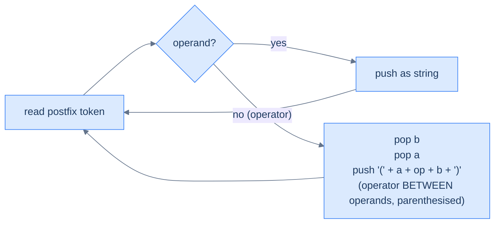
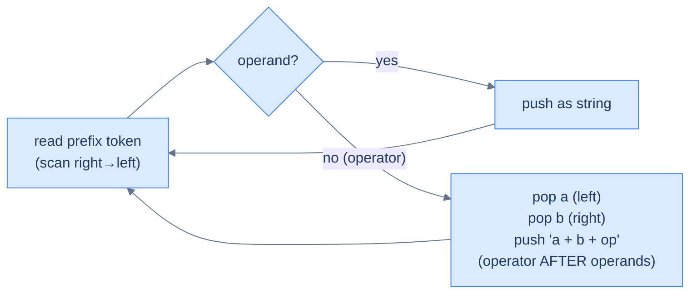
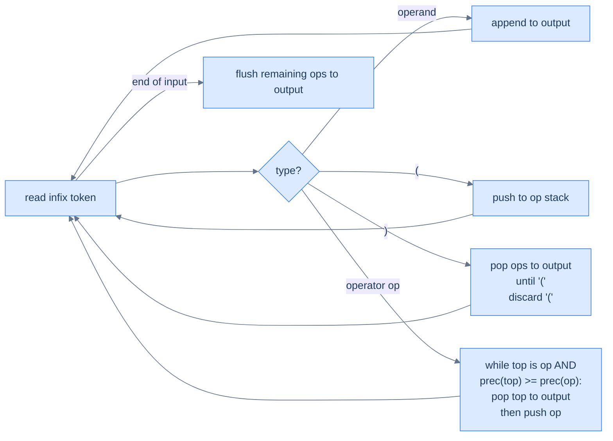
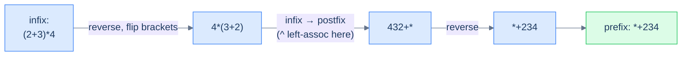

# 6. Converting Expressions Using a Stack

## The Hook

Three notations, six possible conversions. You might *expect* that converting between them is a six-different-algorithms ordeal. **It's not.** Once you see the pattern, all six conversions reduce to two ideas, each of which uses one stack:

1. **Postfix-or-prefix → anything else**: scan the source linearly (left-to-right for postfix, right-to-left for prefix), push operands onto a *string* stack, and on every operator pop two strings and glue them together with the operator between (or before, or after) them. The operator placement determines the output notation; the scanning direction determines whether you're reading postfix or prefix.

2. **Infix → postfix**: a slightly cleverer dance called the **Shunting-Yard algorithm** (Edsger Dijkstra, 1961), where operators wait on a stack until something with lower-or-equal precedence shows up to push them out into the output. Parentheses become temporary "fences" that block this eviction. Once you have infix→postfix, infix→prefix is one extra reverse-and-flip-brackets trick away.

The same handful of moves — *push operand, pop-two-and-combine, peek-and-compare-precedence, flush-on-paren* — appears in every parser, every compiler, and every spreadsheet evaluator you'll ever read about. This lesson is the most code-dense in the entire stack section, but the patterns recur enough that by the third conversion you'll be writing the fourth from memory.

---

## Table of contents

1. [Postfix → Prefix](#understanding-postfix-to-prefix-conversion)
2. [Convert postfix to prefix](#convert-postfix-to-prefix)
3. [Postfix → Infix](#understanding-postfix-to-infix-conversion)
4. [Convert postfix to infix](#convert-postfix-to-infix)
5. [Prefix → Postfix](#understanding-prefix-to-postfix-conversion)
6. [Convert prefix to postfix](#convert-prefix-to-postfix)
7. [Prefix → Infix](#understanding-prefix-to-infix-conversion)
8. [Convert prefix to infix](#convert-prefix-to-infix)
9. [Infix → Postfix](#understanding-infix-to-postfix-conversion)
10. [Convert infix to postfix](#convert-infix-to-postfix)
11. [Infix → Prefix](#understanding-infix-to-prefix-conversion)
12. [Convert infix to prefix](#convert-infix-to-prefix)

***

# Understanding postfix to prefix conversion

Postfix and prefix look like mirror images, but **simply reversing a postfix string does not produce the equivalent prefix string**. Reversing `2 3 1 * + 9 -` gives `9 - + * 1 3 2`, which isn't a valid prefix expression — the operands and operators are now in the wrong relative pairing. Operator–operand grouping must be preserved across the conversion, and a stack of *partial expressions* is the tool that does it.


<p align="center"><strong>Postfix → prefix — same loop shape as the postfix evaluator, but the stack holds <em>strings</em> (sub-expressions in prefix form) rather than numbers, and an operator combines them with itself <em>at the front</em>.</strong></p>

## Walkthrough — `2 3 1 * + 9 -`

| Step | Token | Action | Stack (top right) |
|---:|:---:|---|---|
| 1 | `2` | push `'2'` | `['2']` |
| 2 | `3` | push `'3'` | `['2','3']` |
| 3 | `1` | push `'1'` | `['2','3','1']` |
| 4 | `*` | pop `'1'`, pop `'3'`, push `'*31'` | `['2','*31']` |
| 5 | `+` | pop `'*31'`, pop `'2'`, push `'+2*31'` | `['+2*31']` |
| 6 | `9` | push `'9'` | `['+2*31','9']` |
| 7 | `-` | pop `'9'`, pop `'+2*31'`, push `'-+2*319'` | `['-+2*319']` |
| — | end | result is the lone item | **`-+2*319`** |

<p align="center"><strong>Postfix <code>231*+9-</code> → prefix <code>-+2*319</code>. The stack is a <em>string</em> stack — every operator combines two existing prefix sub-expressions into a larger one. Operand order: first pop is right; second pop is left.</strong></p>

## Algorithm

> -   **Step 1:** Initialise an empty string stack.
> -   **Step 2:** For each character of the postfix string left to right:
>     -   If operand, push it (as a one-character string).
>     -   Else (operator): `b = pop()`, `a = pop()`, push `op + a + b`.
> -   **Step 3:** Return the lone string on the stack.

***

# Convert postfix to prefix

## Problem Statement

Given a postfix expression `postfix`, return the equivalent prefix expression. Operands are single-character (digit or letter); operators are `+`, `-`, `*`, `/`, `^`.

### Example
> -   **Input:** `postfix = "231*+9-"` → **Output:** `"-+2*319"`

## Solution

```python run
def is_op(c: str) -> bool: return c in "+-*/^"

def postfix_to_prefix(postfix: str) -> str:
    st = []
    for ch in postfix:
        if not is_op(ch):
            st.append(ch)
        else:
            b = st.pop(); a = st.pop()
            st.append(ch + a + b)        # operator BEFORE operands
    return st[-1]

print(postfix_to_prefix("231*+9-"))     # -+2*319
print(postfix_to_prefix("ab+cd-*"))     # *+ab-cd
```

```java run
import java.util.*;

public class Main {
    static boolean isOp(char c) { return "+-*/^".indexOf(c) >= 0; }
    static String postfixToPrefix(String postfix) {
        Deque<String> st = new ArrayDeque<>();
        for (char ch : postfix.toCharArray()) {
            if (!isOp(ch)) st.push(String.valueOf(ch));
            else {
                String b = st.pop(), a = st.pop();
                st.push(ch + a + b);
            }
        }
        return st.peek();
    }
    public static void main(String[] args) {
        System.out.println(postfixToPrefix("231*+9-"));
        System.out.println(postfixToPrefix("ab+cd-*"));
    }
}
```

```c run
#include <stdio.h>
#include <string.h>
#include <stdlib.h>

int is_op(char c) { return c == '+'||c == '-'||c == '*'||c == '/'||c == '^'; }

char *postfix_to_prefix(const char *postfix) {
    char *st[256]; int top = -1;
    for (const char *p = postfix; *p; p++) {
        if (!is_op(*p)) {
            char *s = malloc(2); s[0] = *p; s[1] = 0; st[++top] = s;
        } else {
            char *b = st[top--]; char *a = st[top--];
            char *r = malloc(strlen(a) + strlen(b) + 2);
            r[0] = *p; r[1] = 0; strcat(r, a); strcat(r, b);
            free(a); free(b); st[++top] = r;
        }
    }
    return st[top];
}

int main() {
    char *r = postfix_to_prefix("231*+9-");
    printf("%s\n", r); free(r);
    r = postfix_to_prefix("ab+cd-*"); printf("%s\n", r); free(r);
}
```

```cpp run
#include <iostream>
#include <stack>
#include <string>

bool isOp(char c) { return std::string("+-*/^").find(c) != std::string::npos; }

std::string postfixToPrefix(const std::string &postfix) {
    std::stack<std::string> st;
    for (char ch : postfix) {
        if (!isOp(ch)) st.push(std::string(1, ch));
        else {
            auto b = st.top(); st.pop();
            auto a = st.top(); st.pop();
            st.push(std::string(1, ch) + a + b);
        }
    }
    return st.top();
}

int main() {
    std::cout << postfixToPrefix("231*+9-") << "\n";
    std::cout << postfixToPrefix("ab+cd-*") << "\n";
}
```

```scala run
import scala.collection.mutable

def isOp(c: Char): Boolean = "+-*/^".contains(c)

def postfixToPrefix(postfix: String): String = {
  val st = mutable.Stack[String]()
  for (ch <- postfix) {
    if (!isOp(ch)) st.push(ch.toString)
    else {
      val b = st.pop(); val a = st.pop()
      st.push(s"$ch$a$b")
    }
  }
  st.top
}

object Main extends App {
  println(postfixToPrefix("231*+9-"))
  println(postfixToPrefix("ab+cd-*"))
}
```

```javascript run
const isOp = c => "+-*/^".includes(c);

function postfixToPrefix(postfix) {
    const st = [];
    for (const ch of postfix) {
        if (!isOp(ch)) st.push(ch);
        else {
            const b = st.pop(), a = st.pop();
            st.push(ch + a + b);
        }
    }
    return st.pop();
}
console.log(postfixToPrefix("231*+9-"));
console.log(postfixToPrefix("ab+cd-*"));
```

```typescript run
const isOp = (c: string) => "+-*/^".includes(c);

function postfixToPrefix(postfix: string): string {
    const st: string[] = [];
    for (const ch of postfix) {
        if (!isOp(ch)) st.push(ch);
        else {
            const b = st.pop()!, a = st.pop()!;
            st.push(ch + a + b);
        }
    }
    return st.pop()!;
}
console.log(postfixToPrefix("231*+9-"));
console.log(postfixToPrefix("ab+cd-*"));
```

```go run
package main
import "fmt"

func isOp(c byte) bool { return c == '+'||c == '-'||c == '*'||c == '/'||c == '^' }

func postfixToPrefix(postfix string) string {
    st := []string{}
    for i := 0; i < len(postfix); i++ {
        ch := postfix[i]
        if !isOp(ch) { st = append(st, string(ch)); continue }
        b := st[len(st)-1]; a := st[len(st)-2]; st = st[:len(st)-2]
        st = append(st, string(ch) + a + b)
    }
    return st[len(st)-1]
}

func main() {
    fmt.Println(postfixToPrefix("231*+9-"))
    fmt.Println(postfixToPrefix("ab+cd-*"))
}
```

```kotlin run
fun isOp(c: Char) = "+-*/^".contains(c)

fun postfixToPrefix(postfix: String): String {
    val st = ArrayDeque<String>()
    for (ch in postfix) {
        if (!isOp(ch)) st.addLast(ch.toString())
        else {
            val b = st.removeLast(); val a = st.removeLast()
            st.addLast("$ch$a$b")
        }
    }
    return st.last()
}
fun main() {
    println(postfixToPrefix("231*+9-"))
    println(postfixToPrefix("ab+cd-*"))
}
```

```rust run
fn is_op(c: char) -> bool { "+-*/^".contains(c) }

fn postfix_to_prefix(postfix: &str) -> String {
    let mut st: Vec<String> = Vec::new();
    for ch in postfix.chars() {
        if !is_op(ch) {
            st.push(ch.to_string());
        } else {
            let b = st.pop().unwrap();
            let a = st.pop().unwrap();
            st.push(format!("{}{}{}", ch, a, b));
        }
    }
    st.pop().unwrap()
}
fn main() {
    println!("{}", postfix_to_prefix("231*+9-"));
    println!("{}", postfix_to_prefix("ab+cd-*"));
}
```


> **All cases** — Time: **O(N²)** worst-case (string concatenation), Space: **O(N²)** worst-case. With efficient string-builders this drops to **O(N)** time and **O(N)** space.

***

# Understanding postfix to infix conversion

Same algorithm — only the combine step changes. Where prefix wrote `op + a + b`, **infix wraps the operator in parentheses around the two operands**: `( a + op + b )`. The parentheses are necessary because we don't track precedence inside the stack — they ensure the produced expression evaluates the same way regardless of where it gets nested.



<p align="center"><strong>Postfix → infix — operand pops as before, but the combine step wraps the result in parentheses to preserve precedence. The output may have <em>more</em> parentheses than strictly needed, but it's always correct.</strong></p>

## Algorithm

> -   **Step 1:** Initialise an empty string stack.
> -   **Step 2:** For each character of the postfix string left to right:
>     -   If operand, push it.
>     -   Else: `b = pop()`, `a = pop()`, push `(a + op + b)`.
> -   **Step 3:** Return the lone string on the stack.

***

# Convert postfix to infix

## Example
> -   **Input:** `postfix = "231*+9-"` → **Output:** `"((2+(3*1))-9)"`

## Solution

```python run
def is_op(c): return c in "+-*/^"

def postfix_to_infix(postfix: str) -> str:
    st = []
    for ch in postfix:
        if not is_op(ch): st.append(ch)
        else:
            b = st.pop(); a = st.pop()
            st.append(f"({a}{ch}{b})")     # parenthesised infix
    return st[-1]

print(postfix_to_infix("231*+9-"))     # ((2+(3*1))-9)
print(postfix_to_infix("ab+cd-*"))     # ((a+b)*(c-d))
```

```java run
import java.util.*;

public class Main {
    static boolean isOp(char c){return "+-*/^".indexOf(c) >= 0;}
    static String postfixToInfix(String postfix) {
        Deque<String> st = new ArrayDeque<>();
        for (char ch : postfix.toCharArray()) {
            if (!isOp(ch)) st.push(String.valueOf(ch));
            else {
                String b = st.pop(), a = st.pop();
                st.push("(" + a + ch + b + ")");
            }
        }
        return st.peek();
    }
    public static void main(String[] args) {
        System.out.println(postfixToInfix("231*+9-"));
        System.out.println(postfixToInfix("ab+cd-*"));
    }
}
```

```c run
#include <stdio.h>
#include <string.h>
#include <stdlib.h>

int is_op(char c){return c=='+'||c=='-'||c=='*'||c=='/'||c=='^';}

char *postfix_to_infix(const char *postfix) {
    char *st[256]; int top = -1;
    for (const char *p = postfix; *p; p++) {
        if (!is_op(*p)) { char *s=malloc(2); s[0]=*p; s[1]=0; st[++top]=s; }
        else {
            char *b = st[top--]; char *a = st[top--];
            char *r = malloc(strlen(a)+strlen(b)+4);
            sprintf(r, "(%s%c%s)", a, *p, b);
            free(a); free(b); st[++top]=r;
        }
    }
    return st[top];
}
int main() {
    char *r = postfix_to_infix("231*+9-"); printf("%s\n", r); free(r);
    r = postfix_to_infix("ab+cd-*"); printf("%s\n", r); free(r);
}
```

```cpp run
#include <iostream>
#include <stack>
#include <string>

bool isOp(char c){return std::string("+-*/^").find(c)!=std::string::npos;}
std::string postfixToInfix(const std::string &postfix) {
    std::stack<std::string> st;
    for (char ch : postfix) {
        if (!isOp(ch)) st.push(std::string(1, ch));
        else {
            auto b = st.top(); st.pop();
            auto a = st.top(); st.pop();
            st.push("(" + a + ch + b + ")");
        }
    }
    return st.top();
}
int main() {
    std::cout << postfixToInfix("231*+9-") << "\n";
    std::cout << postfixToInfix("ab+cd-*") << "\n";
}
```

```scala run
import scala.collection.mutable
def isOp(c: Char) = "+-*/^".contains(c)
def postfixToInfix(postfix: String): String = {
  val st = mutable.Stack[String]()
  for (ch <- postfix) {
    if (!isOp(ch)) st.push(ch.toString)
    else { val b = st.pop(); val a = st.pop(); st.push(s"($a$ch$b)") }
  }
  st.top
}
object Main extends App {
  println(postfixToInfix("231*+9-"))
  println(postfixToInfix("ab+cd-*"))
}
```

```javascript run
const isOp = c => "+-*/^".includes(c);
function postfixToInfix(postfix) {
    const st = [];
    for (const ch of postfix) {
        if (!isOp(ch)) st.push(ch);
        else { const b = st.pop(), a = st.pop(); st.push(`(${a}${ch}${b})`); }
    }
    return st.pop();
}
console.log(postfixToInfix("231*+9-"));
console.log(postfixToInfix("ab+cd-*"));
```

```typescript run
const isOp = (c: string) => "+-*/^".includes(c);
function postfixToInfix(postfix: string): string {
    const st: string[] = [];
    for (const ch of postfix) {
        if (!isOp(ch)) st.push(ch);
        else { const b = st.pop()!, a = st.pop()!; st.push(`(${a}${ch}${b})`); }
    }
    return st.pop()!;
}
console.log(postfixToInfix("231*+9-"));
console.log(postfixToInfix("ab+cd-*"));
```

```go run
package main
import "fmt"
func isOp(c byte) bool {return c=='+'||c=='-'||c=='*'||c=='/'||c=='^'}
func postfixToInfix(postfix string) string {
    st := []string{}
    for i := 0; i < len(postfix); i++ {
        ch := postfix[i]
        if !isOp(ch) { st = append(st, string(ch)); continue }
        b := st[len(st)-1]; a := st[len(st)-2]; st = st[:len(st)-2]
        st = append(st, "(" + a + string(ch) + b + ")")
    }
    return st[len(st)-1]
}
func main() {
    fmt.Println(postfixToInfix("231*+9-"))
    fmt.Println(postfixToInfix("ab+cd-*"))
}
```

```kotlin run
fun isOp(c: Char) = "+-*/^".contains(c)
fun postfixToInfix(postfix: String): String {
    val st = ArrayDeque<String>()
    for (ch in postfix) {
        if (!isOp(ch)) st.addLast(ch.toString())
        else { val b = st.removeLast(); val a = st.removeLast(); st.addLast("($a$ch$b)") }
    }
    return st.last()
}
fun main() {
    println(postfixToInfix("231*+9-"))
    println(postfixToInfix("ab+cd-*"))
}
```

```rust run
fn is_op(c: char) -> bool { "+-*/^".contains(c) }
fn postfix_to_infix(postfix: &str) -> String {
    let mut st: Vec<String> = Vec::new();
    for ch in postfix.chars() {
        if !is_op(ch) { st.push(ch.to_string()); }
        else { let b = st.pop().unwrap(); let a = st.pop().unwrap(); st.push(format!("({}{}{})", a, ch, b)); }
    }
    st.pop().unwrap()
}
fn main() {
    println!("{}", postfix_to_infix("231*+9-"));
    println!("{}", postfix_to_infix("ab+cd-*"));
}
```


> **Complexity** — Time: **O(N²)** with naïve string concat, **O(N)** with builders; Space: **O(N²)** / **O(N)** respectively.

***

# Understanding prefix to postfix conversion

Mirror image of postfix → prefix. Same idea, but **scan the input right-to-left** (because in prefix the operator appears *before* its operands, so we encounter the operands first when scanning backwards), and the combine step puts the operator **after** the operands.



<p align="center"><strong>Prefix → postfix — right-to-left scan; first pop is the LEFT operand; combine step appends the operator at the end.</strong></p>

## Algorithm

> -   **Step 1:** Initialise an empty string stack.
> -   **Step 2:** For each character of the prefix string **right to left**:
>     -   If operand, push it.
>     -   Else: `a = pop()` (LEFT), `b = pop()` (RIGHT), push `a + b + op`.
> -   **Step 3:** Return the lone string on the stack.

***

# Convert prefix to postfix

## Example
> -   **Input:** `prefix = "-+2*319"` → **Output:** `"231*+9-"`

## Solution

```python run
def is_op(c): return c in "+-*/^"

def prefix_to_postfix(prefix: str) -> str:
    st = []
    for ch in reversed(prefix):
        if not is_op(ch): st.append(ch)
        else:
            a = st.pop(); b = st.pop()       # a = LEFT, b = RIGHT
            st.append(a + b + ch)
    return st[-1]

print(prefix_to_postfix("-+2*319"))     # 231*+9-
print(prefix_to_postfix("*+ab-cd"))     # ab+cd-*
```

```java run
import java.util.*;
public class Main {
    static boolean isOp(char c){return "+-*/^".indexOf(c) >= 0;}
    static String prefixToPostfix(String prefix) {
        Deque<String> st = new ArrayDeque<>();
        for (int i = prefix.length()-1; i >= 0; i--) {
            char ch = prefix.charAt(i);
            if (!isOp(ch)) st.push(String.valueOf(ch));
            else {
                String a = st.pop(), b = st.pop();
                st.push(a + b + ch);
            }
        }
        return st.peek();
    }
    public static void main(String[] args) {
        System.out.println(prefixToPostfix("-+2*319"));
        System.out.println(prefixToPostfix("*+ab-cd"));
    }
}
```

```c run
#include <stdio.h>
#include <string.h>
#include <stdlib.h>
int is_op(char c){return c=='+'||c=='-'||c=='*'||c=='/'||c=='^';}
char *prefix_to_postfix(const char *prefix) {
    char *st[256]; int top = -1; int n = (int)strlen(prefix);
    for (int i = n-1; i >= 0; i--) {
        char ch = prefix[i];
        if (!is_op(ch)) { char *s=malloc(2); s[0]=ch; s[1]=0; st[++top]=s; }
        else {
            char *a = st[top--]; char *b = st[top--];
            char *r = malloc(strlen(a)+strlen(b)+2);
            strcpy(r, a); strcat(r, b); int rl = (int)strlen(r); r[rl]=ch; r[rl+1]=0;
            free(a); free(b); st[++top]=r;
        }
    }
    return st[top];
}
int main() {
    char *r = prefix_to_postfix("-+2*319"); printf("%s\n", r); free(r);
    r = prefix_to_postfix("*+ab-cd"); printf("%s\n", r); free(r);
}
```

```cpp run
#include <iostream>
#include <stack>
#include <string>
bool isOp(char c){return std::string("+-*/^").find(c)!=std::string::npos;}
std::string prefixToPostfix(const std::string &prefix) {
    std::stack<std::string> st;
    for (int i = (int)prefix.size()-1; i >= 0; i--) {
        char ch = prefix[i];
        if (!isOp(ch)) st.push(std::string(1, ch));
        else {
            auto a = st.top(); st.pop();
            auto b = st.top(); st.pop();
            st.push(a + b + ch);
        }
    }
    return st.top();
}
int main() {
    std::cout << prefixToPostfix("-+2*319") << "\n";
    std::cout << prefixToPostfix("*+ab-cd") << "\n";
}
```

```scala run
import scala.collection.mutable
def isOp(c: Char) = "+-*/^".contains(c)
def prefixToPostfix(prefix: String): String = {
  val st = mutable.Stack[String]()
  for (ch <- prefix.reverse) {
    if (!isOp(ch)) st.push(ch.toString)
    else { val a = st.pop(); val b = st.pop(); st.push(a + b + ch) }
  }
  st.top
}
object Main extends App {
  println(prefixToPostfix("-+2*319"))
  println(prefixToPostfix("*+ab-cd"))
}
```

```javascript run
const isOp = c => "+-*/^".includes(c);
function prefixToPostfix(prefix) {
    const st = [];
    for (let i = prefix.length-1; i >= 0; i--) {
        const ch = prefix[i];
        if (!isOp(ch)) st.push(ch);
        else { const a = st.pop(), b = st.pop(); st.push(a + b + ch); }
    }
    return st.pop();
}
console.log(prefixToPostfix("-+2*319"));
console.log(prefixToPostfix("*+ab-cd"));
```

```typescript run
const isOp = (c: string) => "+-*/^".includes(c);
function prefixToPostfix(prefix: string): string {
    const st: string[] = [];
    for (let i = prefix.length-1; i >= 0; i--) {
        const ch = prefix[i];
        if (!isOp(ch)) st.push(ch);
        else { const a = st.pop()!, b = st.pop()!; st.push(a + b + ch); }
    }
    return st.pop()!;
}
console.log(prefixToPostfix("-+2*319"));
console.log(prefixToPostfix("*+ab-cd"));
```

```go run
package main
import "fmt"
func isOp(c byte) bool {return c=='+'||c=='-'||c=='*'||c=='/'||c=='^'}
func prefixToPostfix(prefix string) string {
    st := []string{}
    for i := len(prefix)-1; i >= 0; i-- {
        ch := prefix[i]
        if !isOp(ch) { st = append(st, string(ch)); continue }
        a := st[len(st)-1]; b := st[len(st)-2]; st = st[:len(st)-2]
        st = append(st, a + b + string(ch))
    }
    return st[len(st)-1]
}
func main() {
    fmt.Println(prefixToPostfix("-+2*319"))
    fmt.Println(prefixToPostfix("*+ab-cd"))
}
```

```kotlin run
fun isOp(c: Char) = "+-*/^".contains(c)
fun prefixToPostfix(prefix: String): String {
    val st = ArrayDeque<String>()
    for (i in prefix.length-1 downTo 0) {
        val ch = prefix[i]
        if (!isOp(ch)) st.addLast(ch.toString())
        else { val a = st.removeLast(); val b = st.removeLast(); st.addLast(a + b + ch) }
    }
    return st.last()
}
fun main() {
    println(prefixToPostfix("-+2*319"))
    println(prefixToPostfix("*+ab-cd"))
}
```

```rust run
fn is_op(c: char) -> bool { "+-*/^".contains(c) }
fn prefix_to_postfix(prefix: &str) -> String {
    let mut st: Vec<String> = Vec::new();
    for ch in prefix.chars().rev() {
        if !is_op(ch) { st.push(ch.to_string()); }
        else { let a = st.pop().unwrap(); let b = st.pop().unwrap(); st.push(format!("{}{}{}", a, b, ch)); }
    }
    st.pop().unwrap()
}
fn main() {
    println!("{}", prefix_to_postfix("-+2*319"));
    println!("{}", prefix_to_postfix("*+ab-cd"));
}
```


***

# Understanding prefix to infix conversion

Right-to-left scan, infix combine step `(a op b)`.

## Algorithm

> -   **Step 1:** Initialise an empty string stack.
> -   **Step 2:** For each character of the prefix string **right to left**:
>     -   If operand, push it.
>     -   Else: `a = pop()` (LEFT), `b = pop()` (RIGHT), push `(a + op + b)`.
> -   **Step 3:** Return the lone string on the stack.

***

# Convert prefix to infix

## Example
> -   **Input:** `prefix = "-+2*319"` → **Output:** `"((2+(3*1))-9)"`

## Solution

```python run
def is_op(c): return c in "+-*/^"

def prefix_to_infix(prefix: str) -> str:
    st = []
    for ch in reversed(prefix):
        if not is_op(ch): st.append(ch)
        else:
            a = st.pop(); b = st.pop()
            st.append(f"({a}{ch}{b})")
    return st[-1]

print(prefix_to_infix("-+2*319"))    # ((2+(3*1))-9)
print(prefix_to_infix("*+ab-cd"))    # ((a+b)*(c-d))
```

```java run
import java.util.*;
public class Main {
    static boolean isOp(char c){return "+-*/^".indexOf(c) >= 0;}
    static String prefixToInfix(String prefix) {
        Deque<String> st = new ArrayDeque<>();
        for (int i = prefix.length()-1; i >= 0; i--) {
            char ch = prefix.charAt(i);
            if (!isOp(ch)) st.push(String.valueOf(ch));
            else {
                String a = st.pop(), b = st.pop();
                st.push("(" + a + ch + b + ")");
            }
        }
        return st.peek();
    }
    public static void main(String[] args) {
        System.out.println(prefixToInfix("-+2*319"));
        System.out.println(prefixToInfix("*+ab-cd"));
    }
}
```

```c run
#include <stdio.h>
#include <string.h>
#include <stdlib.h>
int is_op(char c){return c=='+'||c=='-'||c=='*'||c=='/'||c=='^';}
char *prefix_to_infix(const char *prefix) {
    char *st[256]; int top = -1; int n = (int)strlen(prefix);
    for (int i = n-1; i >= 0; i--) {
        char ch = prefix[i];
        if (!is_op(ch)) { char *s=malloc(2); s[0]=ch; s[1]=0; st[++top]=s; }
        else {
            char *a = st[top--]; char *b = st[top--];
            char *r = malloc(strlen(a)+strlen(b)+4);
            sprintf(r, "(%s%c%s)", a, ch, b);
            free(a); free(b); st[++top]=r;
        }
    }
    return st[top];
}
int main() {
    char *r = prefix_to_infix("-+2*319"); printf("%s\n", r); free(r);
    r = prefix_to_infix("*+ab-cd"); printf("%s\n", r); free(r);
}
```

```cpp run
#include <iostream>
#include <stack>
#include <string>
bool isOp(char c){return std::string("+-*/^").find(c)!=std::string::npos;}
std::string prefixToInfix(const std::string &prefix) {
    std::stack<std::string> st;
    for (int i = (int)prefix.size()-1; i >= 0; i--) {
        char ch = prefix[i];
        if (!isOp(ch)) st.push(std::string(1, ch));
        else {
            auto a = st.top(); st.pop();
            auto b = st.top(); st.pop();
            st.push("(" + a + ch + b + ")");
        }
    }
    return st.top();
}
int main() {
    std::cout << prefixToInfix("-+2*319") << "\n";
    std::cout << prefixToInfix("*+ab-cd") << "\n";
}
```

```scala run
import scala.collection.mutable
def isOp(c: Char) = "+-*/^".contains(c)
def prefixToInfix(prefix: String): String = {
  val st = mutable.Stack[String]()
  for (ch <- prefix.reverse) {
    if (!isOp(ch)) st.push(ch.toString)
    else { val a = st.pop(); val b = st.pop(); st.push(s"($a$ch$b)") }
  }
  st.top
}
object Main extends App {
  println(prefixToInfix("-+2*319"))
  println(prefixToInfix("*+ab-cd"))
}
```

```javascript run
const isOp = c => "+-*/^".includes(c);
function prefixToInfix(prefix) {
    const st = [];
    for (let i = prefix.length-1; i >= 0; i--) {
        const ch = prefix[i];
        if (!isOp(ch)) st.push(ch);
        else { const a = st.pop(), b = st.pop(); st.push(`(${a}${ch}${b})`); }
    }
    return st.pop();
}
console.log(prefixToInfix("-+2*319"));
console.log(prefixToInfix("*+ab-cd"));
```

```typescript run
const isOp = (c: string) => "+-*/^".includes(c);
function prefixToInfix(prefix: string): string {
    const st: string[] = [];
    for (let i = prefix.length-1; i >= 0; i--) {
        const ch = prefix[i];
        if (!isOp(ch)) st.push(ch);
        else { const a = st.pop()!, b = st.pop()!; st.push(`(${a}${ch}${b})`); }
    }
    return st.pop()!;
}
console.log(prefixToInfix("-+2*319"));
console.log(prefixToInfix("*+ab-cd"));
```

```go run
package main
import "fmt"
func isOp(c byte) bool {return c=='+'||c=='-'||c=='*'||c=='/'||c=='^'}
func prefixToInfix(prefix string) string {
    st := []string{}
    for i := len(prefix)-1; i >= 0; i-- {
        ch := prefix[i]
        if !isOp(ch) { st = append(st, string(ch)); continue }
        a := st[len(st)-1]; b := st[len(st)-2]; st = st[:len(st)-2]
        st = append(st, "(" + a + string(ch) + b + ")")
    }
    return st[len(st)-1]
}
func main() {
    fmt.Println(prefixToInfix("-+2*319"))
    fmt.Println(prefixToInfix("*+ab-cd"))
}
```

```kotlin run
fun isOp(c: Char) = "+-*/^".contains(c)
fun prefixToInfix(prefix: String): String {
    val st = ArrayDeque<String>()
    for (i in prefix.length-1 downTo 0) {
        val ch = prefix[i]
        if (!isOp(ch)) st.addLast(ch.toString())
        else { val a = st.removeLast(); val b = st.removeLast(); st.addLast("($a$ch$b)") }
    }
    return st.last()
}
fun main() {
    println(prefixToInfix("-+2*319"))
    println(prefixToInfix("*+ab-cd"))
}
```

```rust run
fn is_op(c: char) -> bool { "+-*/^".contains(c) }
fn prefix_to_infix(prefix: &str) -> String {
    let mut st: Vec<String> = Vec::new();
    for ch in prefix.chars().rev() {
        if !is_op(ch) { st.push(ch.to_string()); }
        else { let a = st.pop().unwrap(); let b = st.pop().unwrap(); st.push(format!("({}{}{})", a, ch, b)); }
    }
    st.pop().unwrap()
}
fn main() {
    println!("{}", prefix_to_infix("-+2*319"));
    println!("{}", prefix_to_infix("*+ab-cd"));
}
```


***

# Understanding infix to postfix conversion

The big one. **Infix → postfix** is the famous **Shunting-Yard algorithm** (Edsger Dijkstra, 1961). The trick: maintain a stack of *operators waiting to be emitted*, and an output buffer. As we scan the infix expression left-to-right:

- **Operands** go directly to the output (they don't need to wait — they're already in the right relative order).
- **Operators** push onto the operator stack — but *before* pushing, **flush** any operator on top of the stack whose precedence is `≥` the incoming operator's. This guarantees that higher-precedence operators emerge from the stack first, exactly matching their evaluation order.
- **`(`** pushes onto the operator stack as a *fence* that prevents lower-precedence operators from being flushed past it.
- **`)`** pops everything off until the matching `(`, then discards the `(`.
- **End of input** flushes whatever's left on the operator stack.



<p align="center"><strong>Shunting-Yard infix → postfix — operands flow straight through; operators wait on the stack until something with lower-or-equal precedence pushes them out. Parentheses act as fences. The algorithm is one pass, two structures (op stack + output buffer), no backtracking.</strong></p>

## Why does this work?

The key invariant: **at any point during the scan, the operator stack contains operators in strictly increasing precedence from bottom to top.** Each new operator either fits this invariant (push it) or violates it (flush down until it fits, then push).

> **Note on `^` (power):** `^` is right-associative — `2^3^2` means `2^(3^2)`, not `(2^3)^2`. To handle this, change the precedence comparison from `>=` to strictly `>` for the right-associative operator: when an `^` is incoming and `^` is on top, *don't* flush — push the new `^` on top so it'll be evaluated first. The implementations below use a generalised `is_right_assoc` helper for clarity.

## Walkthrough — `(2 + 3) * 4`

| Step | Token | Action | Op stack | Output |
|---:|:---:|---|---|---|
| 1 | `(` | push `(` | `['(']` | `''` |
| 2 | `2` | append to output | `['(']` | `'2'` |
| 3 | `+` | push (top is `(`, no flush) | `['(', '+']` | `'2'` |
| 4 | `3` | append to output | `['(', '+']` | `'23'` |
| 5 | `)` | flush `+` to output, discard `(` | `[]` | `'23+'` |
| 6 | `*` | push | `['*']` | `'23+'` |
| 7 | `4` | append to output | `['*']` | `'23+4'` |
| — | EOF | flush remaining ops | `[]` | **`'23+4*'`** |

<p align="center"><strong>Shunting-Yard on <code>(2+3)*4</code> — the parenthesis fences off <code>+</code> until <code>)</code> is seen; then <code>+</code> flushes. <code>*</code> waits on the stack until end-of-input. Result: <code>23+4*</code>.</strong></p>

## Algorithm

> -   **Step 1:** Initialise an empty operator stack and an empty output buffer.
> -   **Step 2:** For each character of the infix string left to right:
>     -   **Operand** → append to output.
>     -   **`(`** → push to op stack.
>     -   **`)`** → pop ops to output until `(`; discard `(`.
>     -   **operator** → while top of op stack is an operator with `prec(top) >= prec(op)` (strict `>` for right-associative): pop top to output. Then push op.
> -   **Step 3:** Flush remaining op stack to output.

***

# Convert infix to postfix

## Example
> -   **Input:** `infix = "(2+3)*4"` → **Output:** `"23+4*"`

## Solution

```python run
PREC = {'^': 3, '*': 2, '/': 2, '+': 1, '-': 1}
def is_op(c): return c in PREC
def is_right_assoc(c): return c == '^'

def infix_to_postfix(infix: str) -> str:
    ops, out = [], []
    for ch in infix:
        if ch.isalnum():            out.append(ch)
        elif ch == '(':              ops.append(ch)
        elif ch == ')':
            while ops and ops[-1] != '(': out.append(ops.pop())
            if ops and ops[-1] == '(':    ops.pop()
        elif is_op(ch):
            while ops and ops[-1] != '(' and (
                PREC[ops[-1]] > PREC[ch] or
                (PREC[ops[-1]] == PREC[ch] and not is_right_assoc(ch))
            ):
                out.append(ops.pop())
            ops.append(ch)
    while ops: out.append(ops.pop())
    return ''.join(out)

print(infix_to_postfix("(2+3)*4"))    # 23+4*
print(infix_to_postfix("2+3*4"))      # 234*+
print(infix_to_postfix("a+b*c-d"))    # abc*+d-
print(infix_to_postfix("2^3^2"))      # 232^^   (right-associative)
```

```java run
import java.util.*;
public class Main {
    static int prec(char c){switch(c){case '^':return 3;case '*':case '/':return 2;case '+':case '-':return 1;default:return 0;}}
    static boolean isOp(char c){return "+-*/^".indexOf(c) >= 0;}
    static boolean isRA(char c){return c == '^';}
    static String infixToPostfix(String infix) {
        Deque<Character> ops = new ArrayDeque<>();
        StringBuilder out = new StringBuilder();
        for (char ch : infix.toCharArray()) {
            if (Character.isLetterOrDigit(ch)) out.append(ch);
            else if (ch == '(') ops.push(ch);
            else if (ch == ')') {
                while (!ops.isEmpty() && ops.peek() != '(') out.append(ops.pop());
                if (!ops.isEmpty()) ops.pop();
            } else if (isOp(ch)) {
                while (!ops.isEmpty() && ops.peek() != '(' &&
                       (prec(ops.peek()) > prec(ch) ||
                        (prec(ops.peek()) == prec(ch) && !isRA(ch))))
                    out.append(ops.pop());
                ops.push(ch);
            }
        }
        while (!ops.isEmpty()) out.append(ops.pop());
        return out.toString();
    }
    public static void main(String[] args) {
        System.out.println(infixToPostfix("(2+3)*4"));
        System.out.println(infixToPostfix("2+3*4"));
        System.out.println(infixToPostfix("a+b*c-d"));
        System.out.println(infixToPostfix("2^3^2"));
    }
}
```

```c run
#include <stdio.h>
#include <string.h>
#include <ctype.h>

int prec(char c){switch(c){case '^':return 3;case '*':case '/':return 2;case '+':case '-':return 1;}return 0;}
int is_op(char c){return c=='+'||c=='-'||c=='*'||c=='/'||c=='^';}
int is_ra(char c){return c=='^';}

void infix_to_postfix(const char *infix, char *out) {
    char st[256]; int top = -1; int o = 0;
    for (const char *p = infix; *p; p++) {
        char c = *p;
        if (isalnum((unsigned char)c)) out[o++] = c;
        else if (c == '(') st[++top] = c;
        else if (c == ')') {
            while (top >= 0 && st[top] != '(') out[o++] = st[top--];
            if (top >= 0) top--;
        } else if (is_op(c)) {
            while (top >= 0 && st[top] != '(' &&
                   (prec(st[top]) > prec(c) ||
                    (prec(st[top]) == prec(c) && !is_ra(c))))
                out[o++] = st[top--];
            st[++top] = c;
        }
    }
    while (top >= 0) out[o++] = st[top--];
    out[o] = 0;
}

int main() {
    char buf[128];
    infix_to_postfix("(2+3)*4", buf); printf("%s\n", buf);
    infix_to_postfix("2+3*4", buf);   printf("%s\n", buf);
    infix_to_postfix("a+b*c-d", buf); printf("%s\n", buf);
    infix_to_postfix("2^3^2", buf);   printf("%s\n", buf);
}
```

```cpp run
#include <iostream>
#include <stack>
#include <cctype>
#include <string>

int prec(char c){switch(c){case '^':return 3;case '*':case '/':return 2;case '+':case '-':return 1;}return 0;}
bool isOp(char c){return std::string("+-*/^").find(c)!=std::string::npos;}
bool isRA(char c){return c == '^';}

std::string infixToPostfix(const std::string &infix) {
    std::stack<char> ops; std::string out;
    for (char c : infix) {
        if (isalnum((unsigned char)c)) out += c;
        else if (c == '(') ops.push(c);
        else if (c == ')') {
            while (!ops.empty() && ops.top() != '(') { out += ops.top(); ops.pop(); }
            if (!ops.empty()) ops.pop();
        } else if (isOp(c)) {
            while (!ops.empty() && ops.top() != '(' &&
                   (prec(ops.top()) > prec(c) ||
                    (prec(ops.top()) == prec(c) && !isRA(c)))) {
                out += ops.top(); ops.pop();
            }
            ops.push(c);
        }
    }
    while (!ops.empty()) { out += ops.top(); ops.pop(); }
    return out;
}

int main() {
    std::cout << infixToPostfix("(2+3)*4") << "\n";
    std::cout << infixToPostfix("2+3*4")   << "\n";
    std::cout << infixToPostfix("a+b*c-d") << "\n";
    std::cout << infixToPostfix("2^3^2")   << "\n";
}
```

```scala run
import scala.collection.mutable

def prec(c: Char): Int = c match { case '^' => 3; case '*' | '/' => 2; case '+' | '-' => 1; case _ => 0 }
def isOp(c: Char) = "+-*/^".contains(c)
def isRA(c: Char) = c == '^'

def infixToPostfix(infix: String): String = {
  val ops = mutable.Stack[Char]()
  val out = new StringBuilder
  for (c <- infix) {
    if (c.isLetterOrDigit) out.append(c)
    else if (c == '(') ops.push(c)
    else if (c == ')') {
      while (ops.nonEmpty && ops.top != '(') out.append(ops.pop())
      if (ops.nonEmpty) ops.pop()
    } else if (isOp(c)) {
      while (ops.nonEmpty && ops.top != '(' &&
             (prec(ops.top) > prec(c) ||
              (prec(ops.top) == prec(c) && !isRA(c)))) out.append(ops.pop())
      ops.push(c)
    }
  }
  while (ops.nonEmpty) out.append(ops.pop())
  out.toString
}
object Main extends App {
  println(infixToPostfix("(2+3)*4"))
  println(infixToPostfix("2+3*4"))
  println(infixToPostfix("a+b*c-d"))
  println(infixToPostfix("2^3^2"))
}
```

```javascript run
const PREC = { '^': 3, '*': 2, '/': 2, '+': 1, '-': 1 };
const isOp = c => c in PREC;
const isRA = c => c === '^';

function infixToPostfix(infix) {
    const ops = [], out = [];
    for (const c of infix) {
        if (/[a-zA-Z0-9]/.test(c)) out.push(c);
        else if (c === '(') ops.push(c);
        else if (c === ')') {
            while (ops.length && ops[ops.length-1] !== '(') out.push(ops.pop());
            if (ops.length) ops.pop();
        } else if (isOp(c)) {
            while (ops.length && ops[ops.length-1] !== '(' &&
                   (PREC[ops[ops.length-1]] > PREC[c] ||
                    (PREC[ops[ops.length-1]] === PREC[c] && !isRA(c))))
                out.push(ops.pop());
            ops.push(c);
        }
    }
    while (ops.length) out.push(ops.pop());
    return out.join('');
}
console.log(infixToPostfix("(2+3)*4"));
console.log(infixToPostfix("2+3*4"));
console.log(infixToPostfix("a+b*c-d"));
console.log(infixToPostfix("2^3^2"));
```

```typescript run
const PREC: Record<string, number> = { '^': 3, '*': 2, '/': 2, '+': 1, '-': 1 };
const isOp = (c: string) => c in PREC;
const isRA = (c: string) => c === '^';

function infixToPostfix(infix: string): string {
    const ops: string[] = []; const out: string[] = [];
    for (const c of infix) {
        if (/[a-zA-Z0-9]/.test(c)) out.push(c);
        else if (c === '(') ops.push(c);
        else if (c === ')') {
            while (ops.length && ops[ops.length-1] !== '(') out.push(ops.pop()!);
            if (ops.length) ops.pop();
        } else if (isOp(c)) {
            while (ops.length && ops[ops.length-1] !== '(' &&
                   (PREC[ops[ops.length-1]] > PREC[c] ||
                    (PREC[ops[ops.length-1]] === PREC[c] && !isRA(c))))
                out.push(ops.pop()!);
            ops.push(c);
        }
    }
    while (ops.length) out.push(ops.pop()!);
    return out.join('');
}
console.log(infixToPostfix("(2+3)*4"));
console.log(infixToPostfix("2+3*4"));
console.log(infixToPostfix("a+b*c-d"));
console.log(infixToPostfix("2^3^2"));
```

```go run
package main
import "fmt"

func prec(c byte) int { switch c {case '^':return 3;case '*','/':return 2;case '+','-':return 1;}; return 0 }
func isOp(c byte) bool { return c=='+'||c=='-'||c=='*'||c=='/'||c=='^' }
func isRA(c byte) bool { return c == '^' }

func infixToPostfix(infix string) string {
    ops := []byte{}; out := []byte{}
    for i := 0; i < len(infix); i++ {
        c := infix[i]
        if (c>='a'&&c<='z')||(c>='A'&&c<='Z')||(c>='0'&&c<='9') { out = append(out, c)
        } else if c == '(' { ops = append(ops, c)
        } else if c == ')' {
            for len(ops) > 0 && ops[len(ops)-1] != '(' { out = append(out, ops[len(ops)-1]); ops = ops[:len(ops)-1] }
            if len(ops) > 0 { ops = ops[:len(ops)-1] }
        } else if isOp(c) {
            for len(ops) > 0 && ops[len(ops)-1] != '(' &&
                (prec(ops[len(ops)-1]) > prec(c) ||
                 (prec(ops[len(ops)-1]) == prec(c) && !isRA(c))) {
                out = append(out, ops[len(ops)-1]); ops = ops[:len(ops)-1]
            }
            ops = append(ops, c)
        }
    }
    for len(ops) > 0 { out = append(out, ops[len(ops)-1]); ops = ops[:len(ops)-1] }
    return string(out)
}

func main() {
    fmt.Println(infixToPostfix("(2+3)*4"))
    fmt.Println(infixToPostfix("2+3*4"))
    fmt.Println(infixToPostfix("a+b*c-d"))
    fmt.Println(infixToPostfix("2^3^2"))
}
```

```kotlin run
fun prec(c: Char) = when (c) { '^' -> 3; '*', '/' -> 2; '+', '-' -> 1; else -> 0 }
fun isOp(c: Char) = "+-*/^".contains(c)
fun isRA(c: Char) = c == '^'

fun infixToPostfix(infix: String): String {
    val ops = ArrayDeque<Char>(); val out = StringBuilder()
    for (c in infix) {
        when {
            c.isLetterOrDigit() -> out.append(c)
            c == '(' -> ops.addLast(c)
            c == ')' -> {
                while (ops.isNotEmpty() && ops.last() != '(') out.append(ops.removeLast())
                if (ops.isNotEmpty()) ops.removeLast()
            }
            isOp(c) -> {
                while (ops.isNotEmpty() && ops.last() != '(' &&
                       (prec(ops.last()) > prec(c) ||
                        (prec(ops.last()) == prec(c) && !isRA(c))))
                    out.append(ops.removeLast())
                ops.addLast(c)
            }
        }
    }
    while (ops.isNotEmpty()) out.append(ops.removeLast())
    return out.toString()
}
fun main() {
    println(infixToPostfix("(2+3)*4"))
    println(infixToPostfix("2+3*4"))
    println(infixToPostfix("a+b*c-d"))
    println(infixToPostfix("2^3^2"))
}
```

```rust run
fn prec(c: char) -> i32 { match c { '^' => 3, '*' | '/' => 2, '+' | '-' => 1, _ => 0 } }
fn is_op(c: char) -> bool { "+-*/^".contains(c) }
fn is_ra(c: char) -> bool { c == '^' }

fn infix_to_postfix(infix: &str) -> String {
    let mut ops: Vec<char> = Vec::new();
    let mut out = String::new();
    for c in infix.chars() {
        if c.is_alphanumeric() { out.push(c); }
        else if c == '(' { ops.push(c); }
        else if c == ')' {
            while let Some(&top) = ops.last() { if top == '(' { break; } out.push(ops.pop().unwrap()); }
            if ops.last() == Some(&'(') { ops.pop(); }
        } else if is_op(c) {
            while let Some(&top) = ops.last() {
                if top == '(' { break; }
                let pt = prec(top); let pc = prec(c);
                if pt > pc || (pt == pc && !is_ra(c)) { out.push(ops.pop().unwrap()); }
                else { break; }
            }
            ops.push(c);
        }
    }
    while let Some(top) = ops.pop() { out.push(top); }
    out
}
fn main() {
    println!("{}", infix_to_postfix("(2+3)*4"));
    println!("{}", infix_to_postfix("2+3*4"));
    println!("{}", infix_to_postfix("a+b*c-d"));
    println!("{}", infix_to_postfix("2^3^2"));
}
```


> **Complexity** — Time: **O(N)** | Space: **O(N)** for the operator stack and output buffer.

***

# Understanding infix to prefix conversion

The cleverest of the bunch — and a one-line reduction:

1. **Reverse** the infix string.
2. **Swap** every `(` with `)` and vice versa (because the bracket directions invert under reversal).
3. Run the **infix-to-postfix** converter on this reversed/flipped string, but with one rule change: **`^` is now left-associative** for this step (because the reversal flipped its associativity).
4. **Reverse** the resulting postfix to get the prefix.



<p align="center"><strong>Infix → prefix as a four-step reduction — reverse, flip brackets, run Shunting-Yard with right-associativity flipped, reverse the result. Builds on infix→postfix without a separate algorithm.</strong></p>

***

# Convert infix to prefix

## Example
> -   **Input:** `infix = "(2+3)*4"` → **Output:** `"*+234"`

## Solution

```python run
PREC = {'^': 3, '*': 2, '/': 2, '+': 1, '-': 1}
def is_op(c): return c in PREC

def _flip(c):
    if c == '(': return ')'
    if c == ')': return '('
    return c

def infix_to_prefix(infix: str) -> str:
    # Step 1+2 — reverse and flip brackets
    rev = ''.join(_flip(c) for c in reversed(infix))
    # Step 3 — Shunting-Yard with ^ now LEFT-associative (because reversed)
    ops, out = [], []
    for ch in rev:
        if ch.isalnum():            out.append(ch)
        elif ch == '(':              ops.append(ch)
        elif ch == ')':
            while ops and ops[-1] != '(': out.append(ops.pop())
            if ops and ops[-1] == '(':    ops.pop()
        elif is_op(ch):
            # for the reversed string, ^ is left-associative, so use strict >
            while ops and ops[-1] != '(' and PREC[ops[-1]] > PREC[ch]:
                out.append(ops.pop())
            # left-associative: also pop equal-precedence; right-assoc (^): don't
            while (ops and ops[-1] != '(' and PREC[ops[-1]] == PREC[ch]
                   and ch != '^'):
                out.append(ops.pop())
            ops.append(ch)
    while ops: out.append(ops.pop())
    # Step 4 — reverse
    return ''.join(reversed(out))

print(infix_to_prefix("(2+3)*4"))    # *+234
print(infix_to_prefix("2+3*4"))      # +2*34
print(infix_to_prefix("a+b*c-d"))    # -+a*bcd
print(infix_to_prefix("2^3^2"))      # ^2^32   (right-associative)
```

```java run
import java.util.*;
public class Main {
    static int prec(char c){switch(c){case '^':return 3;case '*':case '/':return 2;case '+':case '-':return 1;default:return 0;}}
    static boolean isOp(char c){return "+-*/^".indexOf(c) >= 0;}
    static char flip(char c){return c == '(' ? ')' : (c == ')' ? '(' : c);}

    static String infixToPrefix(String infix) {
        StringBuilder rev = new StringBuilder();
        for (int i = infix.length()-1; i >= 0; i--) rev.append(flip(infix.charAt(i)));
        Deque<Character> ops = new ArrayDeque<>();
        StringBuilder out = new StringBuilder();
        for (char ch : rev.toString().toCharArray()) {
            if (Character.isLetterOrDigit(ch)) out.append(ch);
            else if (ch == '(') ops.push(ch);
            else if (ch == ')') {
                while (!ops.isEmpty() && ops.peek() != '(') out.append(ops.pop());
                if (!ops.isEmpty()) ops.pop();
            } else if (isOp(ch)) {
                while (!ops.isEmpty() && ops.peek() != '(' && prec(ops.peek()) > prec(ch))
                    out.append(ops.pop());
                while (!ops.isEmpty() && ops.peek() != '(' && prec(ops.peek()) == prec(ch) && ch != '^')
                    out.append(ops.pop());
                ops.push(ch);
            }
        }
        while (!ops.isEmpty()) out.append(ops.pop());
        return new StringBuilder(out).reverse().toString();
    }
    public static void main(String[] args) {
        System.out.println(infixToPrefix("(2+3)*4"));
        System.out.println(infixToPrefix("2+3*4"));
        System.out.println(infixToPrefix("a+b*c-d"));
        System.out.println(infixToPrefix("2^3^2"));
    }
}
```

```c run
#include <stdio.h>
#include <string.h>
#include <ctype.h>

int prec(char c){switch(c){case '^':return 3;case '*':case '/':return 2;case '+':case '-':return 1;}return 0;}
int is_op(char c){return c=='+'||c=='-'||c=='*'||c=='/'||c=='^';}
char flip(char c){return c == '(' ? ')' : (c == ')' ? '(' : c);}
void reverse_str(char *s){int n = (int)strlen(s); for (int i = 0; i < n/2; i++){char t = s[i]; s[i] = s[n-1-i]; s[n-1-i] = t;}}

void infix_to_prefix(const char *infix, char *out_str) {
    char rev[128]; int n = (int)strlen(infix);
    for (int i = 0; i < n; i++) rev[i] = flip(infix[n-1-i]);
    rev[n] = 0;
    char st[256]; int top = -1; int o = 0;
    for (const char *p = rev; *p; p++) {
        char c = *p;
        if (isalnum((unsigned char)c)) out_str[o++] = c;
        else if (c == '(') st[++top] = c;
        else if (c == ')') {
            while (top >= 0 && st[top] != '(') out_str[o++] = st[top--];
            if (top >= 0) top--;
        } else if (is_op(c)) {
            while (top >= 0 && st[top] != '(' && prec(st[top]) > prec(c)) out_str[o++] = st[top--];
            while (top >= 0 && st[top] != '(' && prec(st[top]) == prec(c) && c != '^') out_str[o++] = st[top--];
            st[++top] = c;
        }
    }
    while (top >= 0) out_str[o++] = st[top--];
    out_str[o] = 0;
    reverse_str(out_str);
}

int main() {
    char buf[128];
    infix_to_prefix("(2+3)*4", buf); printf("%s\n", buf);
    infix_to_prefix("2+3*4", buf);   printf("%s\n", buf);
    infix_to_prefix("a+b*c-d", buf); printf("%s\n", buf);
    infix_to_prefix("2^3^2", buf);   printf("%s\n", buf);
}
```

```cpp run
#include <iostream>
#include <stack>
#include <algorithm>
#include <cctype>
#include <string>

int prec(char c){switch(c){case '^':return 3;case '*':case '/':return 2;case '+':case '-':return 1;}return 0;}
bool isOp(char c){return std::string("+-*/^").find(c)!=std::string::npos;}
char flip(char c){return c == '(' ? ')' : (c == ')' ? '(' : c);}

std::string infixToPrefix(std::string infix) {
    std::reverse(infix.begin(), infix.end());
    for (auto &c : infix) c = flip(c);
    std::stack<char> ops; std::string out;
    for (char c : infix) {
        if (isalnum((unsigned char)c)) out += c;
        else if (c == '(') ops.push(c);
        else if (c == ')') {
            while (!ops.empty() && ops.top() != '(') { out += ops.top(); ops.pop(); }
            if (!ops.empty()) ops.pop();
        } else if (isOp(c)) {
            while (!ops.empty() && ops.top() != '(' && prec(ops.top()) > prec(c)) { out += ops.top(); ops.pop(); }
            while (!ops.empty() && ops.top() != '(' && prec(ops.top()) == prec(c) && c != '^') { out += ops.top(); ops.pop(); }
            ops.push(c);
        }
    }
    while (!ops.empty()) { out += ops.top(); ops.pop(); }
    std::reverse(out.begin(), out.end());
    return out;
}

int main() {
    std::cout << infixToPrefix("(2+3)*4") << "\n";
    std::cout << infixToPrefix("2+3*4")   << "\n";
    std::cout << infixToPrefix("a+b*c-d") << "\n";
    std::cout << infixToPrefix("2^3^2")   << "\n";
}
```

```scala run
import scala.collection.mutable

def prec(c: Char): Int = c match { case '^' => 3; case '*' | '/' => 2; case '+' | '-' => 1; case _ => 0 }
def isOp(c: Char) = "+-*/^".contains(c)
def flip(c: Char): Char = if (c == '(') ')' else if (c == ')') '(' else c

def infixToPrefix(infix: String): String = {
  val rev = infix.reverse.map(flip)
  val ops = mutable.Stack[Char]()
  val out = new StringBuilder
  for (c <- rev) {
    if (c.isLetterOrDigit) out.append(c)
    else if (c == '(') ops.push(c)
    else if (c == ')') {
      while (ops.nonEmpty && ops.top != '(') out.append(ops.pop())
      if (ops.nonEmpty) ops.pop()
    } else if (isOp(c)) {
      while (ops.nonEmpty && ops.top != '(' && prec(ops.top) > prec(c)) out.append(ops.pop())
      while (ops.nonEmpty && ops.top != '(' && prec(ops.top) == prec(c) && c != '^') out.append(ops.pop())
      ops.push(c)
    }
  }
  while (ops.nonEmpty) out.append(ops.pop())
  out.toString.reverse
}
object Main extends App {
  println(infixToPrefix("(2+3)*4"))
  println(infixToPrefix("2+3*4"))
  println(infixToPrefix("a+b*c-d"))
  println(infixToPrefix("2^3^2"))
}
```

```javascript run
const PREC = { '^': 3, '*': 2, '/': 2, '+': 1, '-': 1 };
const isOp = c => c in PREC;
const flip = c => c === '(' ? ')' : (c === ')' ? '(' : c);

function infixToPrefix(infix) {
    const rev = [...infix].reverse().map(flip).join('');
    const ops = [], out = [];
    for (const c of rev) {
        if (/[a-zA-Z0-9]/.test(c)) out.push(c);
        else if (c === '(') ops.push(c);
        else if (c === ')') {
            while (ops.length && ops[ops.length-1] !== '(') out.push(ops.pop());
            if (ops.length) ops.pop();
        } else if (isOp(c)) {
            while (ops.length && ops[ops.length-1] !== '(' && PREC[ops[ops.length-1]] > PREC[c]) out.push(ops.pop());
            while (ops.length && ops[ops.length-1] !== '(' && PREC[ops[ops.length-1]] === PREC[c] && c !== '^') out.push(ops.pop());
            ops.push(c);
        }
    }
    while (ops.length) out.push(ops.pop());
    return out.reverse().join('');
}
console.log(infixToPrefix("(2+3)*4"));
console.log(infixToPrefix("2+3*4"));
console.log(infixToPrefix("a+b*c-d"));
console.log(infixToPrefix("2^3^2"));
```

```typescript run
const PREC: Record<string, number> = { '^': 3, '*': 2, '/': 2, '+': 1, '-': 1 };
const isOp = (c: string) => c in PREC;
const flip = (c: string) => c === '(' ? ')' : (c === ')' ? '(' : c);

function infixToPrefix(infix: string): string {
    const rev = [...infix].reverse().map(flip).join('');
    const ops: string[] = []; const out: string[] = [];
    for (const c of rev) {
        if (/[a-zA-Z0-9]/.test(c)) out.push(c);
        else if (c === '(') ops.push(c);
        else if (c === ')') {
            while (ops.length && ops[ops.length-1] !== '(') out.push(ops.pop()!);
            if (ops.length) ops.pop();
        } else if (isOp(c)) {
            while (ops.length && ops[ops.length-1] !== '(' && PREC[ops[ops.length-1]] > PREC[c]) out.push(ops.pop()!);
            while (ops.length && ops[ops.length-1] !== '(' && PREC[ops[ops.length-1]] === PREC[c] && c !== '^') out.push(ops.pop()!);
            ops.push(c);
        }
    }
    while (ops.length) out.push(ops.pop()!);
    return out.reverse().join('');
}
console.log(infixToPrefix("(2+3)*4"));
console.log(infixToPrefix("2+3*4"));
console.log(infixToPrefix("a+b*c-d"));
console.log(infixToPrefix("2^3^2"));
```

```go run
package main
import "fmt"

func prec(c byte) int { switch c {case '^':return 3;case '*','/':return 2;case '+','-':return 1;}; return 0 }
func isOp(c byte) bool { return c=='+'||c=='-'||c=='*'||c=='/'||c=='^' }
func flip(c byte) byte { if c=='('{return ')'}; if c==')'{return '('}; return c }

func infixToPrefix(infix string) string {
    rev := make([]byte, len(infix))
    for i := 0; i < len(infix); i++ { rev[i] = flip(infix[len(infix)-1-i]) }
    ops := []byte{}; out := []byte{}
    for _, c := range rev {
        if (c>='a'&&c<='z')||(c>='A'&&c<='Z')||(c>='0'&&c<='9') { out = append(out, c)
        } else if c == '(' { ops = append(ops, c)
        } else if c == ')' {
            for len(ops) > 0 && ops[len(ops)-1] != '(' { out = append(out, ops[len(ops)-1]); ops = ops[:len(ops)-1] }
            if len(ops) > 0 { ops = ops[:len(ops)-1] }
        } else if isOp(c) {
            for len(ops) > 0 && ops[len(ops)-1] != '(' && prec(ops[len(ops)-1]) > prec(c) {
                out = append(out, ops[len(ops)-1]); ops = ops[:len(ops)-1]
            }
            for len(ops) > 0 && ops[len(ops)-1] != '(' && prec(ops[len(ops)-1]) == prec(c) && c != '^' {
                out = append(out, ops[len(ops)-1]); ops = ops[:len(ops)-1]
            }
            ops = append(ops, c)
        }
    }
    for len(ops) > 0 { out = append(out, ops[len(ops)-1]); ops = ops[:len(ops)-1] }
    for i, j := 0, len(out)-1; i < j; i, j = i+1, j-1 { out[i], out[j] = out[j], out[i] }
    return string(out)
}
func main() {
    fmt.Println(infixToPrefix("(2+3)*4"))
    fmt.Println(infixToPrefix("2+3*4"))
    fmt.Println(infixToPrefix("a+b*c-d"))
    fmt.Println(infixToPrefix("2^3^2"))
}
```

```kotlin run
fun prec(c: Char) = when (c) { '^' -> 3; '*', '/' -> 2; '+', '-' -> 1; else -> 0 }
fun isOp(c: Char) = "+-*/^".contains(c)
fun flip(c: Char) = if (c == '(') ')' else if (c == ')') '(' else c

fun infixToPrefix(infix: String): String {
    val rev = infix.reversed().map { flip(it) }.joinToString("")
    val ops = ArrayDeque<Char>(); val out = StringBuilder()
    for (c in rev) {
        when {
            c.isLetterOrDigit() -> out.append(c)
            c == '(' -> ops.addLast(c)
            c == ')' -> {
                while (ops.isNotEmpty() && ops.last() != '(') out.append(ops.removeLast())
                if (ops.isNotEmpty()) ops.removeLast()
            }
            isOp(c) -> {
                while (ops.isNotEmpty() && ops.last() != '(' && prec(ops.last()) > prec(c)) out.append(ops.removeLast())
                while (ops.isNotEmpty() && ops.last() != '(' && prec(ops.last()) == prec(c) && c != '^') out.append(ops.removeLast())
                ops.addLast(c)
            }
        }
    }
    while (ops.isNotEmpty()) out.append(ops.removeLast())
    return out.reverse().toString()
}
fun main() {
    println(infixToPrefix("(2+3)*4"))
    println(infixToPrefix("2+3*4"))
    println(infixToPrefix("a+b*c-d"))
    println(infixToPrefix("2^3^2"))
}
```

```rust run
fn prec(c: char) -> i32 { match c { '^' => 3, '*' | '/' => 2, '+' | '-' => 1, _ => 0 } }
fn is_op(c: char) -> bool { "+-*/^".contains(c) }
fn flip(c: char) -> char { match c { '(' => ')', ')' => '(', _ => c } }

fn infix_to_prefix(infix: &str) -> String {
    let rev: String = infix.chars().rev().map(flip).collect();
    let mut ops: Vec<char> = Vec::new();
    let mut out = String::new();
    for c in rev.chars() {
        if c.is_alphanumeric() { out.push(c); }
        else if c == '(' { ops.push(c); }
        else if c == ')' {
            while let Some(&top) = ops.last() { if top == '(' { break; } out.push(ops.pop().unwrap()); }
            if ops.last() == Some(&'(') { ops.pop(); }
        } else if is_op(c) {
            while let Some(&top) = ops.last() {
                if top == '(' || prec(top) <= prec(c) { break; }
                out.push(ops.pop().unwrap());
            }
            while let Some(&top) = ops.last() {
                if top == '(' || prec(top) != prec(c) || c == '^' { break; }
                out.push(ops.pop().unwrap());
            }
            ops.push(c);
        }
    }
    while let Some(top) = ops.pop() { out.push(top); }
    out.chars().rev().collect()
}
fn main() {
    println!("{}", infix_to_prefix("(2+3)*4"));
    println!("{}", infix_to_prefix("2+3*4"));
    println!("{}", infix_to_prefix("a+b*c-d"));
    println!("{}", infix_to_prefix("2^3^2"));
}
```


> **Complexity** — Time: **O(N)** | Space: **O(N)**. The reverse + flip is O(N), the Shunting-Yard is O(N), the final reverse is O(N).

***

## Final Takeaway

Six conversions, two algorithms (one for postfix/prefix scans, one Shunting-Yard for infix), one stack each. The matrix:

| From → To | Strategy |
|---|---|
| **Postfix → Prefix** | scan L→R, combine `op + a + b` |
| **Postfix → Infix**  | scan L→R, combine `(a + op + b)` |
| **Prefix → Postfix** | scan R→L, combine `a + b + op` |
| **Prefix → Infix**   | scan R→L, combine `(a + op + b)` |
| **Infix → Postfix**  | Shunting-Yard (one operator stack + output buffer) |
| **Infix → Prefix**   | reverse + flip brackets, infix→postfix, reverse |

Three lessons:

1. **Operand order is the trap.** Postfix scans L→R: first pop = right operand. Prefix scans R→L: first pop = left operand. Get this wrong and `+`/`*` appear correct while `-`/`/` silently produce wrong answers. Triple-check the order in every implementation.
2. **Right-associativity is `^`'s special.** Standard Shunting-Yard uses `>=` for the precedence comparison (left-associative). For right-associative operators, switch to strict `>` so an incoming `^` doesn't flush the `^` already on the stack — that's what makes `2^3^2` parse as `2^(3^2)`.
3. **Reverse + flip is a free conversion.** Going infix → prefix without writing a new algorithm is one of the most elegant tricks in compiler design. Reversing the string changes the scan direction; flipping brackets re-aligns parenthesisation; running infix→postfix on the reversed string and reversing the result lands you in prefix.

> *Coming up — we leave expression parsing and shift to **stack as a problem-solving pattern**. Lessons 7–11 cover five recurring shapes that appear in interview questions and production code: reversal, previous/next closest occurrence, sequence validation, and linear evaluation. Each one uses a stack as the *thinking tool* — a way to remember "the most recent thing not yet resolved" — and once you internalise the pattern, the solutions write themselves.*
