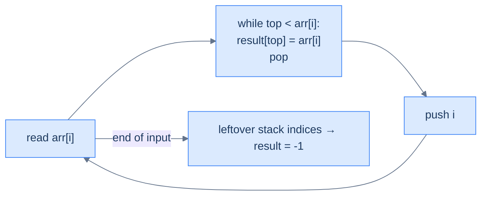
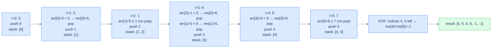
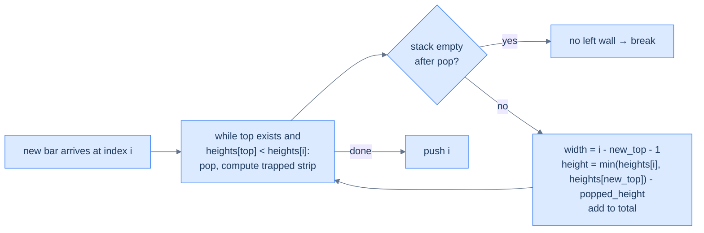
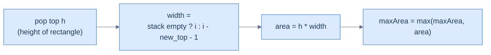

# 9. Pattern: Next Closest Occurrence

## The Hook

Same idea as the previous lesson, mirrored in time. Instead of "the closest **earlier** element greater than me", it's "the closest **later** element greater than me". Daily-temperatures, stock-span, monotonic-queue scheduling, water-trapping, the largest rectangle in a histogram — all of them are next-closest queries with a monotonic stack at their core.

There are two equally clean ways to implement next-closest. Each way is the inverse of the other:

- **Scan right-to-left** with the same monotonic-stack rule as previous-closest. The "previous" of the reversed array *is* the "next" of the original.
- **Scan left-to-right**, but **resolve answers retroactively** when an element pops. While walking forward, the current element is everyone's potential "next greater"; whenever it dominates something on the stack, that something's answer is *the current element*. The element you're holding **fills in answers for old elements** as it climbs the stack.

The second style is more elegant and is the one you'll see in real codebases — it's the same pattern that powers the "largest rectangle in histogram" closing-bracket flush, the "trapping rain water" two-bar reduction, and the linked-list-flavoured next-greater problem. This lesson covers seven problems building on it: the basic four (next greater, next smaller, both circular variants), one linked-list variant, and two classic monotonic-stack puzzles — *retained rainwater* and *largest rectangle in a histogram*.

---

## Table of contents

1. [Understanding the next closest occurrence pattern](#understanding-the-next-closest-occurrence-pattern)
2. [Identifying the next closest occurrence pattern](#identifying-the-next-closest-occurrence-pattern)
3. [Succeeding superior element](#succeeding-superior-element)
4. [Succeeding inferior element](#succeeding-inferior-element)
5. [Succeeding superior element II](#succeeding-superior-element-ii)
6. [Succeeding inferior element II](#succeeding-inferior-element-ii)
7. [Succeeding superior nodes](#succeeding-superior-nodes)
8. [Retained rainwater](#retained-rainwater)
9. [Largest rectangle area](#largest-rectangle-area)

***

# Understanding the next closest occurrence pattern

Two equivalent algorithms.

## Approach 1 — right-to-left scan (mirror of previous-closest)

Walk the array from right to left, maintaining a monotonic decreasing stack. For each `arr[i]`:

1. Pop all stack values `≤ arr[i]`.
2. The new top (if any) is `arr[i]`'s **next greater**.
3. Push `arr[i]`.

This is *literally the previous-closest algorithm with the loop reversed*. Same proof of correctness, same O(N) cost.

## Approach 2 — left-to-right with retroactive resolution

Walk left to right with a monotonic decreasing stack of **indices**. For each `arr[i]`:

1. While the stack is non-empty and `arr[stack.top()] < arr[i]`: the current element `arr[i]` is the **next greater** for `arr[stack.top()]`. Record `result[stack.top()] = arr[i]` and pop.
2. Push `i`.

Anyone left on the stack at end-of-input has *no* next-greater — leave their answer as `-1`.



<p align="center"><strong>Left-to-right next-greater — the current element <em>resolves the answers</em> of old elements as it climbs the stack. Each index is pushed once and popped at most once → O(N) total.</strong></p>

This is the more idiomatic style. Most production monotonic-stack code uses left-to-right with retroactive resolution because it generalises better to "find the next position where some predicate flips" without having to first reverse the array.

## Walkthrough — `arr = [3, 5, 1, 6, 8, 7]` (left-to-right NGE)



<p align="center"><strong>Left-to-right NGE on <code>[3, 5, 1, 6, 8, 7]</code> — when 5 arrives, it resolves index 0; when 6 arrives, it resolves indices 2 and 1; when 8 arrives, it resolves index 3. Indices 4 and 5 never get resolved → their NGE is -1.</strong></p>

## Algorithm

> **Algorithm — next greater element (NGE), left-to-right with retroactive resolution**
>
> -   **Step 1:** Initialise an empty stack and `nge[0..n-1] = -1`.
> -   **Step 2:** For `i` from 0 to n−1:
>     -   While stack non-empty and `arr[stack.top()] < arr[i]`: `nge[stack.pop()] = arr[i]`.
>     -   Push `i`.
> -   **Step 3:** Return `nge`.

For **next smaller**, swap the comparison: `arr[stack.top()] > arr[i]`.

## Implementation — generic NGE walker


```pseudocode
function nextGreater(arr):
    nge   ← array of −1, length n
    stack ← empty stack of indices
    for i from 0 to n − 1:
        while stack not empty AND arr[top] < arr[i]:
            nge[pop()] ← arr[i]   # retroactive resolution
        push i
    return nge
```

```python run
def next_greater(arr: list) -> list:
    n = len(arr)
    nge = [-1] * n
    stack = []                                  # stack of INDICES
    for i in range(n):
        while stack and arr[stack[-1]] < arr[i]:
            nge[stack.pop()] = arr[i]            # retroactive resolution
        stack.append(i)
    return nge

print(next_greater([3, 5, 1, 6, 8, 7]))   # [5, 6, 6, 8, -1, -1]
```

```java run
import java.util.*;
public class Main {
    static int[] nextGreater(int[] arr) {
        int n = arr.length;
        int[] nge = new int[n]; Arrays.fill(nge, -1);
        Deque<Integer> st = new ArrayDeque<>();
        for (int i = 0; i < n; i++) {
            while (!st.isEmpty() && arr[st.peek()] < arr[i]) nge[st.pop()] = arr[i];
            st.push(i);
        }
        return nge;
    }
    public static void main(String[] args) {
        System.out.println(Arrays.toString(nextGreater(new int[]{3,5,1,6,8,7})));
    }
}
```

```c run
#include <stdio.h>
void next_greater(int *arr, int n, int *nge) {
    int st[256]; int top = -1;
    for (int i = 0; i < n; i++) nge[i] = -1;
    for (int i = 0; i < n; i++) {
        while (top >= 0 && arr[st[top]] < arr[i]) nge[st[top--]] = arr[i];
        st[++top] = i;
    }
}
int main() {
    int a[] = {3,5,1,6,8,7}; int r[6];
    next_greater(a, 6, r);
    for (int i = 0; i < 6; i++) printf("%d ", r[i]); printf("\n");
}
```

```cpp run
#include <iostream>
#include <stack>
#include <vector>
std::vector<int> nextGreater(const std::vector<int> &arr) {
    int n = (int)arr.size();
    std::vector<int> nge(n, -1);
    std::stack<int> st;
    for (int i = 0; i < n; i++) {
        while (!st.empty() && arr[st.top()] < arr[i]) { nge[st.top()] = arr[i]; st.pop(); }
        st.push(i);
    }
    return nge;
}
int main() {
    auto r = nextGreater({3,5,1,6,8,7});
    for (int x : r) std::cout << x << " "; std::cout << "\n";
}
```

```scala run
import scala.collection.mutable
def nextGreater(arr: Array[Int]): Array[Int] = {
  val nge = Array.fill(arr.length)(-1)
  val st  = mutable.Stack[Int]()
  for (i <- arr.indices) {
    while (st.nonEmpty && arr(st.top) < arr(i)) nge(st.pop()) = arr(i)
    st.push(i)
  }
  nge
}
object Main extends App { println(nextGreater(Array(3,5,1,6,8,7)).mkString(", ")) }
```

```typescript run
function nextGreater(arr: number[]): number[] {
    const n = arr.length;
    const nge = new Array(n).fill(-1);
    const st: number[] = [];
    for (let i = 0; i < n; i++) {
        while (st.length && arr[st[st.length-1]] < arr[i]) nge[st.pop()!] = arr[i];
        st.push(i);
    }
    return nge;
}
console.log(nextGreater([3,5,1,6,8,7]));
```

```go run
package main
import "fmt"
func nextGreater(arr []int) []int {
    n := len(arr); nge := make([]int, n); for i := range nge { nge[i] = -1 }
    st := []int{}
    for i := 0; i < n; i++ {
        for len(st) > 0 && arr[st[len(st)-1]] < arr[i] {
            nge[st[len(st)-1]] = arr[i]; st = st[:len(st)-1]
        }
        st = append(st, i)
    }
    return nge
}
func main() { fmt.Println(nextGreater([]int{3,5,1,6,8,7})) }
```

```rust run
fn next_greater(arr: &[i32]) -> Vec<i32> {
    let n = arr.len();
    let mut nge = vec![-1; n];
    let mut st: Vec<usize> = Vec::new();
    for i in 0..n {
        while let Some(&top) = st.last() {
            if arr[top] < arr[i] { nge[top] = arr[i]; st.pop(); } else { break; }
        }
        st.push(i);
    }
    nge
}
fn main() { println!("{:?}", next_greater(&[3,5,1,6,8,7])); }
```


## Complexity Analysis

> **All cases** — Time: **O(N)** | Space: **O(N)**.

***

# Identifying the next closest occurrence pattern

Anywhere the answer for each position depends on **the closest later position** satisfying a monotonic predicate, this pattern fits.

**Template:**
> Walk the array left-to-right; maintain a monotonic stack of indices; on each new element, pop from the stack any index whose value is "dominated" and record the current value as that index's answer. Indices left on the stack at end-of-input have no answer (record `-1` or sentinel).

***

# Succeeding superior element

## Problem Statement

Given two arrays `arr1` and `arr2` (where `arr2` is a subset of `arr1` and all elements are unique), return for each value in `arr2` its **succeeding superior element** in `arr1` — the first strictly-greater element to its right. Return `-1` if none.

### Example 1
> -   **Input:** `arr1 = [3, 5, 1, 6, 8, 7]`, `arr2 = [3, 1, 8, 7]`
> -   **Output:** `[5, 6, -1, -1]`

### Example 2
> -   **Input:** `arr1 = [5, 9, 7, 8, 1]`, `arr2 = [5, 9, 7]`
> -   **Output:** `[9, -1, 8]`

## Solution


```pseudocode
function succeedingSuperiorElement(arr1, arr2):
    nge ← array of −1; stack ← empty; idx ← empty Map
    for i from 0 to n − 1:
        while stack not empty AND arr1[top] < arr1[i]: nge[pop()] ← arr1[i]
        push i; idx[arr1[i]] ← i
    return [nge[idx[v]] if v is in idx else −1  for v in arr2]
```

```python run
def succeeding_superior_element(arr1: list, arr2: list) -> list:
    n = len(arr1)
    nge = [-1] * n
    st = []
    for i in range(n):
        while st and arr1[st[-1]] < arr1[i]:
            nge[st.pop()] = arr1[i]
        st.append(i)
    idx = {v: i for i, v in enumerate(arr1)}
    return [nge[idx[v]] if v in idx else -1 for v in arr2]

print(succeeding_superior_element([3,5,1,6,8,7], [3,1,8,7]))   # [5, 6, -1, -1]
print(succeeding_superior_element([5,9,7,8,1], [5,9,7]))       # [9, -1, 8]
```

```java run
import java.util.*;
public class Main {
    static int[] succeedingSuperiorElement(int[] arr1, int[] arr2) {
        int n = arr1.length;
        int[] nge = new int[n]; Arrays.fill(nge, -1);
        Deque<Integer> st = new ArrayDeque<>();
        Map<Integer, Integer> idx = new HashMap<>();
        for (int i = 0; i < n; i++) {
            while (!st.isEmpty() && arr1[st.peek()] < arr1[i]) nge[st.pop()] = arr1[i];
            st.push(i); idx.put(arr1[i], i);
        }
        int[] out = new int[arr2.length];
        for (int j = 0; j < arr2.length; j++) {
            Integer i = idx.get(arr2[j]);
            out[j] = (i == null) ? -1 : nge[i];
        }
        return out;
    }
    public static void main(String[] args) {
        System.out.println(Arrays.toString(succeedingSuperiorElement(new int[]{3,5,1,6,8,7}, new int[]{3,1,8,7})));
        System.out.println(Arrays.toString(succeedingSuperiorElement(new int[]{5,9,7,8,1}, new int[]{5,9,7})));
    }
}
```

```c run
#include <stdio.h>
void succeeding_superior_element(int *arr1, int n, int *arr2, int m, int *out) {
    int nge[256], st[256]; int top = -1;
    for (int i = 0; i < n; i++) nge[i] = -1;
    int kk[256], vv[256], nn = 0;
    for (int i = 0; i < n; i++) {
        while (top >= 0 && arr1[st[top]] < arr1[i]) nge[st[top--]] = arr1[i];
        st[++top] = i;
        kk[nn] = arr1[i]; vv[nn] = i; nn++;
    }
    for (int j = 0; j < m; j++) {
        int found = -1;
        for (int k = 0; k < nn; k++) if (kk[k] == arr2[j]) { found = nge[vv[k]]; break; }
        out[j] = found;
    }
}
int main() {
    int a[] = {3,5,1,6,8,7}; int q[] = {3,1,8,7}; int r[4];
    succeeding_superior_element(a, 6, q, 4, r);
    for (int i = 0; i < 4; i++) printf("%d ", r[i]); printf("\n");
}
```

```cpp run
#include <iostream>
#include <stack>
#include <unordered_map>
#include <vector>
std::vector<int> succeedingSuperiorElement(std::vector<int> &arr1, std::vector<int> &arr2) {
    int n = (int)arr1.size();
    std::vector<int> nge(n, -1);
    std::stack<int> st;
    std::unordered_map<int, int> idx;
    for (int i = 0; i < n; i++) {
        while (!st.empty() && arr1[st.top()] < arr1[i]) { nge[st.top()] = arr1[i]; st.pop(); }
        st.push(i); idx[arr1[i]] = i;
    }
    std::vector<int> out;
    for (int v : arr2) {
        auto it = idx.find(v);
        out.push_back(it == idx.end() ? -1 : nge[it->second]);
    }
    return out;
}
int main() {
    std::vector<int> a = {3,5,1,6,8,7}, q = {3,1,8,7};
    auto r = succeedingSuperiorElement(a, q);
    for (int x : r) std::cout << x << " "; std::cout << "\n";
}
```

```scala run
import scala.collection.mutable
def succeedingSuperiorElement(arr1: Array[Int], arr2: Array[Int]): Array[Int] = {
  val nge = Array.fill(arr1.length)(-1)
  val st = mutable.Stack[Int]()
  val idx = mutable.Map[Int, Int]()
  for (i <- arr1.indices) {
    while (st.nonEmpty && arr1(st.top) < arr1(i)) nge(st.pop()) = arr1(i)
    st.push(i); idx(arr1(i)) = i
  }
  arr2.map(v => idx.get(v).map(nge(_)).getOrElse(-1))
}
object Main extends App {
  println(succeedingSuperiorElement(Array(3,5,1,6,8,7), Array(3,1,8,7)).mkString(", "))
  println(succeedingSuperiorElement(Array(5,9,7,8,1), Array(5,9,7)).mkString(", "))
}
```

```typescript run
function succeedingSuperiorElement(arr1: number[], arr2: number[]): number[] {
    const n = arr1.length;
    const nge = new Array(n).fill(-1);
    const st: number[] = []; const idx = new Map<number, number>();
    for (let i = 0; i < n; i++) {
        while (st.length && arr1[st[st.length-1]] < arr1[i]) nge[st.pop()!] = arr1[i];
        st.push(i); idx.set(arr1[i], i);
    }
    return arr2.map(v => idx.has(v) ? nge[idx.get(v)!] : -1);
}
console.log(succeedingSuperiorElement([3,5,1,6,8,7], [3,1,8,7]));
```

```go run
package main
import "fmt"
func succeedingSuperiorElement(arr1, arr2 []int) []int {
    n := len(arr1); nge := make([]int, n); for i := range nge { nge[i] = -1 }
    st := []int{}; idx := make(map[int]int)
    for i, x := range arr1 {
        for len(st) > 0 && arr1[st[len(st)-1]] < x { nge[st[len(st)-1]] = x; st = st[:len(st)-1] }
        st = append(st, i); idx[x] = i
    }
    out := make([]int, len(arr2))
    for j, v := range arr2 { if i, ok := idx[v]; ok { out[j] = nge[i] } else { out[j] = -1 } }
    return out
}
func main() {
    fmt.Println(succeedingSuperiorElement([]int{3,5,1,6,8,7}, []int{3,1,8,7}))
    fmt.Println(succeedingSuperiorElement([]int{5,9,7,8,1}, []int{5,9,7}))
}
```

```rust run
use std::collections::HashMap;
fn succeeding_superior_element(arr1: &[i32], arr2: &[i32]) -> Vec<i32> {
    let n = arr1.len();
    let mut nge = vec![-1; n];
    let mut st: Vec<usize> = Vec::new();
    let mut idx: HashMap<i32, usize> = HashMap::new();
    for i in 0..n {
        while let Some(&t) = st.last() { if arr1[t] < arr1[i] { nge[t] = arr1[i]; st.pop(); } else { break; } }
        st.push(i); idx.insert(arr1[i], i);
    }
    arr2.iter().map(|v| idx.get(v).map(|&i| nge[i]).unwrap_or(-1)).collect()
}
fn main() {
    println!("{:?}", succeeding_superior_element(&[3,5,1,6,8,7], &[3,1,8,7]));
    println!("{:?}", succeeding_superior_element(&[5,9,7,8,1], &[5,9,7]));
}
```


***

# Succeeding inferior element

## Problem Statement

Same as above but **strictly smaller**. Maintain an *increasing* monotonic stack; resolve when current value is *smaller* than the stack's top.

### Example 1
> -   **Input:** `arr1 = [3, 5, 1, 6, 8, 2]`, `arr2 = [3, 1, 8, 2]`
> -   **Output:** `[1, -1, 2, -1]`

### Example 2
> -   **Input:** `arr1 = [5, 9, 7, 8, 1]`, `arr2 = [5, 9, 7]`
> -   **Output:** `[1, 7, 1]`

## Solution


```pseudocode
function succeedingInferiorElement(arr1, arr2):
    nse ← array of −1; stack ← empty; idx ← empty Map
    for i from 0 to n − 1:
        while stack not empty AND arr1[top] > arr1[i]: nse[pop()] ← arr1[i]
        push i; idx[arr1[i]] ← i
    return [nse[idx[v]] if v is in idx else −1  for v in arr2]
```

```python run
def succeeding_inferior_element(arr1: list, arr2: list) -> list:
    n = len(arr1)
    nse = [-1] * n
    st = []
    for i in range(n):
        while st and arr1[st[-1]] > arr1[i]:
            nse[st.pop()] = arr1[i]
        st.append(i)
    idx = {v: i for i, v in enumerate(arr1)}
    return [nse[idx[v]] if v in idx else -1 for v in arr2]

print(succeeding_inferior_element([3,5,1,6,8,2], [3,1,8,2]))   # [1, -1, 2, -1]
print(succeeding_inferior_element([5,9,7,8,1], [5,9,7]))       # [1, 7, 1]
```

```java run
import java.util.*;
public class Main {
    static int[] succeedingInferiorElement(int[] arr1, int[] arr2) {
        int n = arr1.length;
        int[] nse = new int[n]; Arrays.fill(nse, -1);
        Deque<Integer> st = new ArrayDeque<>();
        Map<Integer, Integer> idx = new HashMap<>();
        for (int i = 0; i < n; i++) {
            while (!st.isEmpty() && arr1[st.peek()] > arr1[i]) nse[st.pop()] = arr1[i];
            st.push(i); idx.put(arr1[i], i);
        }
        int[] out = new int[arr2.length];
        for (int j = 0; j < arr2.length; j++) {
            Integer i = idx.get(arr2[j]);
            out[j] = (i == null) ? -1 : nse[i];
        }
        return out;
    }
    public static void main(String[] args) {
        System.out.println(Arrays.toString(succeedingInferiorElement(new int[]{3,5,1,6,8,2}, new int[]{3,1,8,2})));
        System.out.println(Arrays.toString(succeedingInferiorElement(new int[]{5,9,7,8,1}, new int[]{5,9,7})));
    }
}
```

```c run
#include <stdio.h>
void succeeding_inferior_element(int *arr1, int n, int *arr2, int m, int *out) {
    int nse[256], st[256]; int top = -1;
    for (int i = 0; i < n; i++) nse[i] = -1;
    int kk[256], vv[256], nn = 0;
    for (int i = 0; i < n; i++) {
        while (top >= 0 && arr1[st[top]] > arr1[i]) nse[st[top--]] = arr1[i];
        st[++top] = i;
        kk[nn] = arr1[i]; vv[nn] = i; nn++;
    }
    for (int j = 0; j < m; j++) {
        int found = -1;
        for (int k = 0; k < nn; k++) if (kk[k] == arr2[j]) { found = nse[vv[k]]; break; }
        out[j] = found;
    }
}
int main() {
    int a[] = {3,5,1,6,8,2}; int q[] = {3,1,8,2}; int r[4];
    succeeding_inferior_element(a, 6, q, 4, r);
    for (int i = 0; i < 4; i++) printf("%d ", r[i]); printf("\n");
}
```

```cpp run
#include <iostream>
#include <stack>
#include <unordered_map>
#include <vector>
std::vector<int> succeedingInferiorElement(std::vector<int> &arr1, std::vector<int> &arr2) {
    int n = (int)arr1.size();
    std::vector<int> nse(n, -1);
    std::stack<int> st;
    std::unordered_map<int, int> idx;
    for (int i = 0; i < n; i++) {
        while (!st.empty() && arr1[st.top()] > arr1[i]) { nse[st.top()] = arr1[i]; st.pop(); }
        st.push(i); idx[arr1[i]] = i;
    }
    std::vector<int> out;
    for (int v : arr2) {
        auto it = idx.find(v);
        out.push_back(it == idx.end() ? -1 : nse[it->second]);
    }
    return out;
}
int main() {
    std::vector<int> a = {3,5,1,6,8,2}, q = {3,1,8,2};
    auto r = succeedingInferiorElement(a, q);
    for (int x : r) std::cout << x << " "; std::cout << "\n";
}
```

```scala run
import scala.collection.mutable
def succeedingInferiorElement(arr1: Array[Int], arr2: Array[Int]): Array[Int] = {
  val nse = Array.fill(arr1.length)(-1)
  val st = mutable.Stack[Int]()
  val idx = mutable.Map[Int, Int]()
  for (i <- arr1.indices) {
    while (st.nonEmpty && arr1(st.top) > arr1(i)) nse(st.pop()) = arr1(i)
    st.push(i); idx(arr1(i)) = i
  }
  arr2.map(v => idx.get(v).map(nse(_)).getOrElse(-1))
}
object Main extends App {
  println(succeedingInferiorElement(Array(3,5,1,6,8,2), Array(3,1,8,2)).mkString(", "))
  println(succeedingInferiorElement(Array(5,9,7,8,1), Array(5,9,7)).mkString(", "))
}
```

```typescript run
function succeedingInferiorElement(arr1: number[], arr2: number[]): number[] {
    const n = arr1.length;
    const nse = new Array(n).fill(-1);
    const st: number[] = []; const idx = new Map<number, number>();
    for (let i = 0; i < n; i++) {
        while (st.length && arr1[st[st.length-1]] > arr1[i]) nse[st.pop()!] = arr1[i];
        st.push(i); idx.set(arr1[i], i);
    }
    return arr2.map(v => idx.has(v) ? nse[idx.get(v)!] : -1);
}
console.log(succeedingInferiorElement([3,5,1,6,8,2], [3,1,8,2]));
```

```go run
package main
import "fmt"
func succeedingInferiorElement(arr1, arr2 []int) []int {
    n := len(arr1); nse := make([]int, n); for i := range nse { nse[i] = -1 }
    st := []int{}; idx := make(map[int]int)
    for i, x := range arr1 {
        for len(st) > 0 && arr1[st[len(st)-1]] > x { nse[st[len(st)-1]] = x; st = st[:len(st)-1] }
        st = append(st, i); idx[x] = i
    }
    out := make([]int, len(arr2))
    for j, v := range arr2 { if i, ok := idx[v]; ok { out[j] = nse[i] } else { out[j] = -1 } }
    return out
}
func main() {
    fmt.Println(succeedingInferiorElement([]int{3,5,1,6,8,2}, []int{3,1,8,2}))
    fmt.Println(succeedingInferiorElement([]int{5,9,7,8,1}, []int{5,9,7}))
}
```

```rust run
use std::collections::HashMap;
fn succeeding_inferior_element(arr1: &[i32], arr2: &[i32]) -> Vec<i32> {
    let n = arr1.len();
    let mut nse = vec![-1; n];
    let mut st: Vec<usize> = Vec::new();
    let mut idx: HashMap<i32, usize> = HashMap::new();
    for i in 0..n {
        while let Some(&t) = st.last() { if arr1[t] > arr1[i] { nse[t] = arr1[i]; st.pop(); } else { break; } }
        st.push(i); idx.insert(arr1[i], i);
    }
    arr2.iter().map(|v| idx.get(v).map(|&i| nse[i]).unwrap_or(-1)).collect()
}
fn main() {
    println!("{:?}", succeeding_inferior_element(&[3,5,1,6,8,2], &[3,1,8,2]));
    println!("{:?}", succeeding_inferior_element(&[5,9,7,8,1], &[5,9,7]));
}
```


***

# Succeeding superior element II

## Problem Statement

Circular variant — `arr` is treated as a ring; for each element find the next strictly-greater element, allowing one wrap-around to the start of the array.

### Example 1
> -   **Input:** `arr = [2, 5, 1, 6, 10, 3]` → **Output:** `[5, 6, 6, 10, -1, 5]`

### Example 2
> -   **Input:** `arr = [6, 7, 8, 9, 8]` → **Output:** `[7, 8, 9, -1, 9]`

## Approach

Same doubled-array trick from the previous lesson — iterate `2n` indices using `i % n`. Each element gets two passes; the second one resolves answers that depend on wrap-around.

## Solution


```pseudocode
function succeedingSuperiorElementII(arr):
    n ← length(arr); res ← array of −1; stack ← empty
    for i from 0 to 2n − 1:
        idx ← i mod n
        while stack not empty AND arr[top] < arr[idx]: res[pop()] ← arr[idx]
        if i < n: push idx              # only push in first pass
    return res
```

```python run
def succeeding_superior_element_ii(arr: list) -> list:
    n = len(arr)
    res = [-1] * n
    st = []
    for i in range(2 * n):
        idx = i % n
        while st and arr[st[-1]] < arr[idx]:
            res[st.pop()] = arr[idx]
        if i < n: st.append(idx)        # only push during first pass
    return res

print(succeeding_superior_element_ii([2,5,1,6,10,3]))   # [5, 6, 6, 10, -1, 5]
print(succeeding_superior_element_ii([6,7,8,9,8]))      # [7, 8, 9, -1, 9]
```

```java run
import java.util.*;
public class Main {
    static int[] succeedingSuperiorElementII(int[] arr) {
        int n = arr.length;
        int[] res = new int[n]; Arrays.fill(res, -1);
        Deque<Integer> st = new ArrayDeque<>();
        for (int i = 0; i < 2 * n; i++) {
            int idx = i % n;
            while (!st.isEmpty() && arr[st.peek()] < arr[idx]) res[st.pop()] = arr[idx];
            if (i < n) st.push(idx);
        }
        return res;
    }
    public static void main(String[] args) {
        System.out.println(Arrays.toString(succeedingSuperiorElementII(new int[]{2,5,1,6,10,3})));
        System.out.println(Arrays.toString(succeedingSuperiorElementII(new int[]{6,7,8,9,8})));
    }
}
```

```c run
#include <stdio.h>
void succeeding_superior_element_ii(int *arr, int n, int *res) {
    int st[512]; int top = -1;
    for (int i = 0; i < n; i++) res[i] = -1;
    for (int i = 0; i < 2 * n; i++) {
        int idx = i % n;
        while (top >= 0 && arr[st[top]] < arr[idx]) res[st[top--]] = arr[idx];
        if (i < n) st[++top] = idx;
    }
}
int main() {
    int a[] = {2,5,1,6,10,3}; int r[6];
    succeeding_superior_element_ii(a, 6, r);
    for (int i = 0; i < 6; i++) printf("%d ", r[i]); printf("\n");
}
```

```cpp run
#include <iostream>
#include <stack>
#include <vector>
std::vector<int> succeedingSuperiorElementII(std::vector<int> &arr) {
    int n = (int)arr.size();
    std::vector<int> res(n, -1);
    std::stack<int> st;
    for (int i = 0; i < 2 * n; i++) {
        int idx = i % n;
        while (!st.empty() && arr[st.top()] < arr[idx]) { res[st.top()] = arr[idx]; st.pop(); }
        if (i < n) st.push(idx);
    }
    return res;
}
int main() {
    std::vector<int> a = {2,5,1,6,10,3};
    for (int x : succeedingSuperiorElementII(a)) std::cout << x << " "; std::cout << "\n";
}
```

```scala run
import scala.collection.mutable
def succeedingSuperiorElementII(arr: Array[Int]): Array[Int] = {
  val n = arr.length
  val res = Array.fill(n)(-1)
  val st = mutable.Stack[Int]()
  for (i <- 0 until 2 * n) {
    val idx = i % n
    while (st.nonEmpty && arr(st.top) < arr(idx)) res(st.pop()) = arr(idx)
    if (i < n) st.push(idx)
  }
  res
}
object Main extends App {
  println(succeedingSuperiorElementII(Array(2,5,1,6,10,3)).mkString(", "))
  println(succeedingSuperiorElementII(Array(6,7,8,9,8)).mkString(", "))
}
```

```typescript run
function succeedingSuperiorElementII(arr: number[]): number[] {
    const n = arr.length;
    const res = new Array(n).fill(-1);
    const st: number[] = [];
    for (let i = 0; i < 2 * n; i++) {
        const idx = i % n;
        while (st.length && arr[st[st.length-1]] < arr[idx]) res[st.pop()!] = arr[idx];
        if (i < n) st.push(idx);
    }
    return res;
}
console.log(succeedingSuperiorElementII([2,5,1,6,10,3]));
```

```go run
package main
import "fmt"
func succeedingSuperiorElementII(arr []int) []int {
    n := len(arr); res := make([]int, n); for i := range res { res[i] = -1 }
    st := []int{}
    for i := 0; i < 2*n; i++ {
        idx := i % n
        for len(st) > 0 && arr[st[len(st)-1]] < arr[idx] { res[st[len(st)-1]] = arr[idx]; st = st[:len(st)-1] }
        if i < n { st = append(st, idx) }
    }
    return res
}
func main() {
    fmt.Println(succeedingSuperiorElementII([]int{2,5,1,6,10,3}))
    fmt.Println(succeedingSuperiorElementII([]int{6,7,8,9,8}))
}
```

```rust run
fn succeeding_superior_element_ii(arr: &[i32]) -> Vec<i32> {
    let n = arr.len();
    let mut res = vec![-1; n];
    let mut st: Vec<usize> = Vec::new();
    for i in 0..(2 * n) {
        let idx = i % n;
        while let Some(&t) = st.last() { if arr[t] < arr[idx] { res[t] = arr[idx]; st.pop(); } else { break; } }
        if i < n { st.push(idx); }
    }
    res
}
fn main() {
    println!("{:?}", succeeding_superior_element_ii(&[2,5,1,6,10,3]));
    println!("{:?}", succeeding_superior_element_ii(&[6,7,8,9,8]));
}
```


***

# Succeeding inferior element II

## Problem Statement

Circular next-smaller. Mirror of the previous problem with the comparison flipped.

### Example 1
> -   **Input:** `arr = [2, 5, 1, 6, 10, 3]` → **Output:** `[1, 1, -1, 3, 3, 2]`

### Example 2
> -   **Input:** `arr = [6, 7, 8, 9, 8]` → **Output:** `[-1, 6, 6, 8, 6]`

## Solution


```pseudocode
function succeedingInferiorElementII(arr):
    n ← length(arr); res ← array of −1; stack ← empty
    for i from 0 to 2n − 1:
        idx ← i mod n
        while stack not empty AND arr[top] > arr[idx]: res[pop()] ← arr[idx]
        if i < n: push idx
    return res
```

```python run
def succeeding_inferior_element_ii(arr: list) -> list:
    n = len(arr)
    res = [-1] * n
    st = []
    for i in range(2 * n):
        idx = i % n
        while st and arr[st[-1]] > arr[idx]:
            res[st.pop()] = arr[idx]
        if i < n: st.append(idx)
    return res

print(succeeding_inferior_element_ii([2,5,1,6,10,3]))   # [1, 1, -1, 3, 3, 2]
print(succeeding_inferior_element_ii([6,7,8,9,8]))      # [-1, 6, 6, 8, 6]
```

```java run
import java.util.*;
public class Main {
    static int[] succeedingInferiorElementII(int[] arr) {
        int n = arr.length;
        int[] res = new int[n]; Arrays.fill(res, -1);
        Deque<Integer> st = new ArrayDeque<>();
        for (int i = 0; i < 2 * n; i++) {
            int idx = i % n;
            while (!st.isEmpty() && arr[st.peek()] > arr[idx]) res[st.pop()] = arr[idx];
            if (i < n) st.push(idx);
        }
        return res;
    }
    public static void main(String[] args) {
        System.out.println(Arrays.toString(succeedingInferiorElementII(new int[]{2,5,1,6,10,3})));
        System.out.println(Arrays.toString(succeedingInferiorElementII(new int[]{6,7,8,9,8})));
    }
}
```

```c run
#include <stdio.h>
void succeeding_inferior_element_ii(int *arr, int n, int *res) {
    int st[512]; int top = -1;
    for (int i = 0; i < n; i++) res[i] = -1;
    for (int i = 0; i < 2 * n; i++) {
        int idx = i % n;
        while (top >= 0 && arr[st[top]] > arr[idx]) res[st[top--]] = arr[idx];
        if (i < n) st[++top] = idx;
    }
}
int main() {
    int a[] = {2,5,1,6,10,3}; int r[6];
    succeeding_inferior_element_ii(a, 6, r);
    for (int i = 0; i < 6; i++) printf("%d ", r[i]); printf("\n");
}
```

```cpp run
#include <iostream>
#include <stack>
#include <vector>
std::vector<int> succeedingInferiorElementII(std::vector<int> &arr) {
    int n = (int)arr.size();
    std::vector<int> res(n, -1);
    std::stack<int> st;
    for (int i = 0; i < 2 * n; i++) {
        int idx = i % n;
        while (!st.empty() && arr[st.top()] > arr[idx]) { res[st.top()] = arr[idx]; st.pop(); }
        if (i < n) st.push(idx);
    }
    return res;
}
int main() {
    std::vector<int> a = {2,5,1,6,10,3};
    for (int x : succeedingInferiorElementII(a)) std::cout << x << " "; std::cout << "\n";
}
```

```scala run
import scala.collection.mutable
def succeedingInferiorElementII(arr: Array[Int]): Array[Int] = {
  val n = arr.length
  val res = Array.fill(n)(-1)
  val st = mutable.Stack[Int]()
  for (i <- 0 until 2 * n) {
    val idx = i % n
    while (st.nonEmpty && arr(st.top) > arr(idx)) res(st.pop()) = arr(idx)
    if (i < n) st.push(idx)
  }
  res
}
object Main extends App {
  println(succeedingInferiorElementII(Array(2,5,1,6,10,3)).mkString(", "))
  println(succeedingInferiorElementII(Array(6,7,8,9,8)).mkString(", "))
}
```

```typescript run
function succeedingInferiorElementII(arr: number[]): number[] {
    const n = arr.length;
    const res = new Array(n).fill(-1);
    const st: number[] = [];
    for (let i = 0; i < 2 * n; i++) {
        const idx = i % n;
        while (st.length && arr[st[st.length-1]] > arr[idx]) res[st.pop()!] = arr[idx];
        if (i < n) st.push(idx);
    }
    return res;
}
console.log(succeedingInferiorElementII([2,5,1,6,10,3]));
```

```go run
package main
import "fmt"
func succeedingInferiorElementII(arr []int) []int {
    n := len(arr); res := make([]int, n); for i := range res { res[i] = -1 }
    st := []int{}
    for i := 0; i < 2*n; i++ {
        idx := i % n
        for len(st) > 0 && arr[st[len(st)-1]] > arr[idx] { res[st[len(st)-1]] = arr[idx]; st = st[:len(st)-1] }
        if i < n { st = append(st, idx) }
    }
    return res
}
func main() {
    fmt.Println(succeedingInferiorElementII([]int{2,5,1,6,10,3}))
    fmt.Println(succeedingInferiorElementII([]int{6,7,8,9,8}))
}
```

```rust run
fn succeeding_inferior_element_ii(arr: &[i32]) -> Vec<i32> {
    let n = arr.len();
    let mut res = vec![-1; n];
    let mut st: Vec<usize> = Vec::new();
    for i in 0..(2 * n) {
        let idx = i % n;
        while let Some(&t) = st.last() { if arr[t] > arr[idx] { res[t] = arr[idx]; st.pop(); } else { break; } }
        if i < n { st.push(idx); }
    }
    res
}
fn main() {
    println!("{:?}", succeeding_inferior_element_ii(&[2,5,1,6,10,3]));
    println!("{:?}", succeeding_inferior_element_ii(&[6,7,8,9,8]));
}
```


***

# Succeeding superior nodes

## Problem Statement

Given the head of a singly-linked list, return an array where `result[i]` is the value of the next node strictly greater than node `i` (1-indexed). Use `0` if no such node exists.

### Example 1
> -   **Input:** `head = [2, 1, 5]` → **Output:** `[5, 5, 0]`

### Example 2
> -   **Input:** `head = [2, 7, 4, 3, 5]` → **Output:** `[7, 0, 5, 5, 0]`

## Approach

Same algorithm — but the data source is a linked list, so we walk it once with a pointer, tracking each node's index. Stack stores `(index, value)` pairs; on each new value, pop and resolve as before.

## Solution


```pseudocode
function succeedingSuperiorNodes(head):
    res ← empty list; stack ← empty stack of (index, value)
    i ← 0
    while head ≠ null:
        append 0 to res
        while stack not empty AND head.val > top.value:
            (idx, _) ← pop(); res[idx] ← head.val
        push (i, head.val)
        i ← i + 1; head ← head.next
    return res
```

```python run
class _Node:
    def __init__(self, val): self.val, self.next = val, None

def succeeding_superior_nodes(head):
    """head is a _Node-style linked list."""
    res = []
    stack = []                                 # stack of (index, value)
    i = 0
    while head is not None:
        res.append(0)
        while stack and head.val > stack[-1][1]:
            idx, _ = stack.pop()
            res[idx] = head.val
        stack.append((i, head.val))
        i += 1
        head = head.next
    return res

# Demo: build [2, 7, 4, 3, 5]
def make(values):
    dummy = _Node(0); cur = dummy
    for v in values: cur.next = _Node(v); cur = cur.next
    return dummy.next

print(succeeding_superior_nodes(make([2, 1, 5])))         # [5, 5, 0]
print(succeeding_superior_nodes(make([2, 7, 4, 3, 5])))   # [7, 0, 5, 5, 0]
```

```java run
import java.util.*;
public class Main {
    static class ListNode { int val; ListNode next; ListNode(int v){val = v;} }

    static int[] succeedingSuperiorNodes(ListNode head) {
        List<Integer> res = new ArrayList<>();
        Deque<int[]> st = new ArrayDeque<>();    // {index, value}
        int i = 0;
        while (head != null) {
            res.add(0);
            while (!st.isEmpty() && head.val > st.peek()[1]) {
                int[] top = st.pop();
                res.set(top[0], head.val);
            }
            st.push(new int[]{i++, head.val});
            head = head.next;
        }
        return res.stream().mapToInt(Integer::intValue).toArray();
    }
    public static void main(String[] args) {
        ListNode a = new ListNode(2); a.next = new ListNode(1); a.next.next = new ListNode(5);
        System.out.println(Arrays.toString(succeedingSuperiorNodes(a)));
    }
}
```

```c run
#include <stdio.h>
#include <stdlib.h>

typedef struct ListNode { int val; struct ListNode *next; } ListNode;

void succeeding_superior_nodes(ListNode *head, int *res, int *n) {
    int st_idx[256], st_val[256]; int top = -1; int i = 0;
    while (head) {
        res[i] = 0;
        while (top >= 0 && head->val > st_val[top]) { res[st_idx[top]] = head->val; top--; }
        st_idx[++top] = i; st_val[top] = head->val;
        i++; head = head->next;
    }
    *n = i;
}

ListNode* make(int *vals, int n) {
    ListNode *dummy = malloc(sizeof(ListNode)); dummy->next = NULL;
    ListNode *cur = dummy;
    for (int i = 0; i < n; i++) { ListNode *n = malloc(sizeof(ListNode)); n->val = vals[i]; n->next = NULL; cur->next = n; cur = n; }
    return dummy->next;
}

int main() {
    int v[] = {2, 7, 4, 3, 5};
    ListNode *head = make(v, 5);
    int res[5]; int n;
    succeeding_superior_nodes(head, res, &n);
    for (int i = 0; i < n; i++) printf("%d ", res[i]); printf("\n");
}
```

```cpp run
#include <iostream>
#include <stack>
#include <vector>

struct ListNode { int val; ListNode *next; ListNode(int v):val(v),next(nullptr){} };

std::vector<int> succeedingSuperiorNodes(ListNode *head) {
    std::vector<int> res;
    std::stack<std::pair<int, int>> st;        // (index, value)
    int i = 0;
    while (head) {
        res.push_back(0);
        while (!st.empty() && head->val > st.top().second) {
            res[st.top().first] = head->val; st.pop();
        }
        st.push({i++, head->val});
        head = head->next;
    }
    return res;
}

int main() {
    ListNode *h = new ListNode(2); h->next = new ListNode(7); h->next->next = new ListNode(4);
    h->next->next->next = new ListNode(3); h->next->next->next->next = new ListNode(5);
    for (int x : succeedingSuperiorNodes(h)) std::cout << x << " "; std::cout << "\n";
}
```

```scala run
import scala.collection.mutable

class ListNode(var v: Int, var next: ListNode = null)

def succeedingSuperiorNodes(head: ListNode): List[Int] = {
  val res = mutable.ArrayBuffer[Int]()
  val st = mutable.Stack[(Int, Int)]()
  var i = 0; var cur = head
  while (cur != null) {
    res.append(0)
    while (st.nonEmpty && cur.v > st.top._2) {
      val (idx, _) = st.pop(); res(idx) = cur.v
    }
    st.push((i, cur.v)); i += 1
    cur = cur.next
  }
  res.toList
}
object Main extends App {
  val h = new ListNode(2, new ListNode(7, new ListNode(4, new ListNode(3, new ListNode(5)))))
  println(succeedingSuperiorNodes(h))
}
```

```typescript run
class ListNode { val: number; next: ListNode | null;
    constructor(v: number) { this.val = v; this.next = null; }
}
function succeedingSuperiorNodes(head: ListNode | null): number[] {
    const res: number[] = [];
    const st: [number, number][] = [];
    let i = 0;
    while (head) {
        res.push(0);
        while (st.length && head.val > st[st.length-1][1]) {
            const [idx] = st.pop()!; res[idx] = head.val;
        }
        st.push([i++, head.val]);
        head = head.next;
    }
    return res;
}
const h = new ListNode(2); h.next = new ListNode(7); h.next.next = new ListNode(4);
h.next.next.next = new ListNode(3); h.next.next.next.next = new ListNode(5);
console.log(succeedingSuperiorNodes(h));
```

```go run
package main
import "fmt"

type ListNode struct { Val int; Next *ListNode }

func succeedingSuperiorNodes(head *ListNode) []int {
    res := []int{}
    type pair struct{ i, v int }
    st := []pair{}
    i := 0
    for head != nil {
        res = append(res, 0)
        for len(st) > 0 && head.Val > st[len(st)-1].v {
            res[st[len(st)-1].i] = head.Val; st = st[:len(st)-1]
        }
        st = append(st, pair{i, head.Val}); i++
        head = head.Next
    }
    return res
}

func main() {
    h := &ListNode{Val:2, Next:&ListNode{Val:7, Next:&ListNode{Val:4, Next:&ListNode{Val:3, Next:&ListNode{Val:5}}}}}
    fmt.Println(succeedingSuperiorNodes(h))
}
```

```rust run
struct ListNode { val: i32, next: Option<Box<ListNode>> }

fn succeeding_superior_nodes(head: Option<Box<ListNode>>) -> Vec<i32> {
    let mut res: Vec<i32> = Vec::new();
    let mut st: Vec<(usize, i32)> = Vec::new();
    let mut cur = head;
    let mut i = 0usize;
    while let Some(node) = cur {
        res.push(0);
        while let Some(&(idx, v)) = st.last() {
            if node.val > v { res[idx] = node.val; st.pop(); } else { break; }
        }
        st.push((i, node.val));
        i += 1;
        cur = node.next;
    }
    res
}
fn main() {
    let h = Some(Box::new(ListNode { val: 2, next:
        Some(Box::new(ListNode { val: 7, next:
            Some(Box::new(ListNode { val: 4, next:
                Some(Box::new(ListNode { val: 3, next:
                    Some(Box::new(ListNode { val: 5, next: None })) })) })) })) }));
    println!("{:?}", succeeding_superior_nodes(h));
}
```


***

# Retained rainwater

## Problem Statement

Given an array `heights` of non-negative integers representing an elevation map (each bar has width 1), compute how much water can be trapped after rain.

### Example
> -   **Input:** `heights = [0, 2, 4, 3, 0, 3, 5, 2, 0, 4, 3, 0, 2]`
> -   **Output:** `14`

## Approach

The water trapped above each "valley" is bounded by the heights of the **left and right walls**. The monotonic-stack approach: maintain a *decreasing* stack of bar indices. When a new taller bar arrives, it forms a *right wall* for everything popped off the stack; the *new top of the stack* (after popping) is the *left wall*. The trapped water on top of the popped bar is `(min(left, right) − popped_height) × (right_index − left_index − 1)`.



<p align="center"><strong>Trapping rain water — pop the "valley" bar, the new top is the left wall, the current bar is the right wall, and the area trapped on top is one strip. Sum the strips.</strong></p>

## Solution


```pseudocode
function retainedRainwater(heights):
    stack ← empty; water ← 0
    for i from 0 to n − 1:
        while stack not empty AND heights[top] < heights[i]:
            popped ← pop()
            if stack is empty: break
            left ← top; width ← i − left − 1
            height ← min(heights[i], heights[left]) − heights[popped]
            water ← water + width * height
        push i
    return water
```

```python run
def retained_rainwater(heights: list) -> int:
    st = []                                  # decreasing stack of indices
    water = 0
    for i, h in enumerate(heights):
        while st and heights[st[-1]] < h:
            popped = st.pop()                # the "valley"
            if not st: break                  # no left wall
            left = st[-1]
            width  = i - left - 1
            height = min(heights[i], heights[left]) - heights[popped]
            water += width * height
        st.append(i)
    return water

print(retained_rainwater([0,2,4,3,0,3,5,2,0,4,3,0,2]))   # 14
```

```java run
import java.util.*;
public class Main {
    static int retainedRainwater(int[] h) {
        Deque<Integer> st = new ArrayDeque<>();
        int water = 0;
        for (int i = 0; i < h.length; i++) {
            while (!st.isEmpty() && h[st.peek()] < h[i]) {
                int popped = st.pop();
                if (st.isEmpty()) break;
                int left = st.peek();
                int width = i - left - 1;
                int height = Math.min(h[i], h[left]) - h[popped];
                water += width * height;
            }
            st.push(i);
        }
        return water;
    }
    public static void main(String[] args) {
        System.out.println(retainedRainwater(new int[]{0,2,4,3,0,3,5,2,0,4,3,0,2}));
    }
}
```

```c run
#include <stdio.h>
int retained_rainwater(int *h, int n) {
    int st[256]; int top = -1; int water = 0;
    for (int i = 0; i < n; i++) {
        while (top >= 0 && h[st[top]] < h[i]) {
            int popped = st[top--];
            if (top < 0) break;
            int left = st[top];
            int width = i - left - 1;
            int height = (h[i] < h[left] ? h[i] : h[left]) - h[popped];
            water += width * height;
        }
        st[++top] = i;
    }
    return water;
}
int main() {
    int h[] = {0,2,4,3,0,3,5,2,0,4,3,0,2};
    printf("%d\n", retained_rainwater(h, 13));
}
```

```cpp run
#include <iostream>
#include <stack>
#include <vector>
#include <algorithm>
int retainedRainwater(std::vector<int> &h) {
    std::stack<int> st;
    int water = 0;
    for (int i = 0; i < (int)h.size(); i++) {
        while (!st.empty() && h[st.top()] < h[i]) {
            int popped = st.top(); st.pop();
            if (st.empty()) break;
            int left = st.top();
            int width = i - left - 1;
            int height = std::min(h[i], h[left]) - h[popped];
            water += width * height;
        }
        st.push(i);
    }
    return water;
}
int main() {
    std::vector<int> h = {0,2,4,3,0,3,5,2,0,4,3,0,2};
    std::cout << retainedRainwater(h) << "\n";
}
```

```scala run
import scala.collection.mutable
def retainedRainwater(h: Array[Int]): Int = {
  val st = mutable.Stack[Int]()
  var water = 0
  for (i <- h.indices) {
    var done = false
    while (st.nonEmpty && h(st.top) < h(i) && !done) {
      val popped = st.pop()
      if (st.isEmpty) done = true
      else {
        val left = st.top
        val width = i - left - 1
        val height = math.min(h(i), h(left)) - h(popped)
        water += width * height
      }
    }
    st.push(i)
  }
  water
}
object Main extends App {
  println(retainedRainwater(Array(0,2,4,3,0,3,5,2,0,4,3,0,2)))
}
```

```typescript run
function retainedRainwater(h: number[]): number {
    const st: number[] = [];
    let water = 0;
    for (let i = 0; i < h.length; i++) {
        while (st.length && h[st[st.length-1]] < h[i]) {
            const popped = st.pop()!;
            if (!st.length) break;
            const left = st[st.length-1];
            const width = i - left - 1;
            const height = Math.min(h[i], h[left]) - h[popped];
            water += width * height;
        }
        st.push(i);
    }
    return water;
}
console.log(retainedRainwater([0,2,4,3,0,3,5,2,0,4,3,0,2]));
```

```go run
package main
import "fmt"
func retainedRainwater(h []int) int {
    st := []int{}; water := 0
    for i := 0; i < len(h); i++ {
        for len(st) > 0 && h[st[len(st)-1]] < h[i] {
            popped := st[len(st)-1]; st = st[:len(st)-1]
            if len(st) == 0 { break }
            left := st[len(st)-1]
            width := i - left - 1
            min := h[i]; if h[left] < min { min = h[left] }
            water += width * (min - h[popped])
        }
        st = append(st, i)
    }
    return water
}
func main() { fmt.Println(retainedRainwater([]int{0,2,4,3,0,3,5,2,0,4,3,0,2})) }
```

```rust run
fn retained_rainwater(h: &[i32]) -> i32 {
    let mut st: Vec<usize> = Vec::new();
    let mut water = 0;
    for i in 0..h.len() {
        while let Some(&top) = st.last() {
            if h[top] < h[i] {
                let popped = st.pop().unwrap();
                if let Some(&left) = st.last() {
                    let width  = (i - left - 1) as i32;
                    let height = h[i].min(h[left]) - h[popped];
                    water += width * height;
                } else { break; }
            } else { break; }
        }
        st.push(i);
    }
    water
}
fn main() { println!("{}", retained_rainwater(&[0,2,4,3,0,3,5,2,0,4,3,0,2])); }
```


***

# Largest rectangle area

## Problem Statement

Given an array `histogram` of positive integers (heights of bars of unit width), return the area of the largest rectangle that can be formed.

### Example
> -   **Input:** `histogram = [2, 4, 3, 3, 5, 2, 4, 3, 2]` → **Output:** `18`

## Approach

For each bar, the largest rectangle whose *height equals this bar's height* extends from one past the **previous shorter bar** to one before the **next shorter bar**. Using a monotonic *increasing* stack of indices:

- When a new bar arrives that's shorter than the top, the top bar's "right boundary" is the new bar.
- Pop the top, look at the new top — that's the "left boundary".
- Width = `i − left − 1` (or `i` if the stack is empty after popping).
- Update the max area.

After the main loop, **flush** the stack as if a "0" bar appeared at index `n` — those bars extend all the way to the end.



<p align="center"><strong>When the increasing-stack invariant is broken, every popped bar represents a rectangle whose height is the popped value and whose horizontal extent runs from one past the new top to one before the current bar. Each pop is one candidate rectangle; the global max wins.</strong></p>

## Solution


```pseudocode
function largestRectangleArea(histogram):
    n ← length(histogram); stack ← empty; maxArea ← 0
    for i from 0 to n − 1:
        while stack not empty AND histogram[i] < histogram[top]:
            h     ← histogram[pop()]
            width ← i if stack empty else i − top − 1
            maxArea ← max(maxArea, h * width)
        push i
    while stack not empty:          # flush; treat index n as a 0-height bar
        h     ← histogram[pop()]
        width ← n if stack empty else n − top − 1
        maxArea ← max(maxArea, h * width)
    return maxArea
```

```python run
def largest_rectangle_area(histogram: list) -> int:
    n = len(histogram)
    st = []
    max_area = 0
    for i in range(n):
        while st and histogram[i] < histogram[st[-1]]:
            h = histogram[st.pop()]
            width = i if not st else i - st[-1] - 1
            max_area = max(max_area, h * width)
        st.append(i)
    # Flush remaining bars as if a 0-height bar appeared at index n
    while st:
        h = histogram[st.pop()]
        width = n if not st else n - st[-1] - 1
        max_area = max(max_area, h * width)
    return max_area

print(largest_rectangle_area([2,4,3,3,5,2,4,3,2]))   # 18
```

```java run
import java.util.*;
public class Main {
    static int largestRectangleArea(int[] h) {
        int n = h.length, max = 0;
        Deque<Integer> st = new ArrayDeque<>();
        for (int i = 0; i < n; i++) {
            while (!st.isEmpty() && h[i] < h[st.peek()]) {
                int height = h[st.pop()];
                int width  = st.isEmpty() ? i : i - st.peek() - 1;
                max = Math.max(max, height * width);
            }
            st.push(i);
        }
        while (!st.isEmpty()) {
            int height = h[st.pop()];
            int width  = st.isEmpty() ? n : n - st.peek() - 1;
            max = Math.max(max, height * width);
        }
        return max;
    }
    public static void main(String[] args) {
        System.out.println(largestRectangleArea(new int[]{2,4,3,3,5,2,4,3,2}));
    }
}
```

```c run
#include <stdio.h>
int largest_rectangle_area(int *h, int n) {
    int st[256]; int top = -1; int max = 0;
    for (int i = 0; i < n; i++) {
        while (top >= 0 && h[i] < h[st[top]]) {
            int height = h[st[top--]];
            int width = top < 0 ? i : i - st[top] - 1;
            int area = height * width;
            if (area > max) max = area;
        }
        st[++top] = i;
    }
    while (top >= 0) {
        int height = h[st[top--]];
        int width = top < 0 ? n : n - st[top] - 1;
        int area = height * width;
        if (area > max) max = area;
    }
    return max;
}
int main() {
    int h[] = {2,4,3,3,5,2,4,3,2};
    printf("%d\n", largest_rectangle_area(h, 9));
}
```

```cpp run
#include <iostream>
#include <stack>
#include <vector>
#include <algorithm>
int largestRectangleArea(std::vector<int> &h) {
    int n = (int)h.size(), maxA = 0;
    std::stack<int> st;
    for (int i = 0; i < n; i++) {
        while (!st.empty() && h[i] < h[st.top()]) {
            int height = h[st.top()]; st.pop();
            int width  = st.empty() ? i : i - st.top() - 1;
            maxA = std::max(maxA, height * width);
        }
        st.push(i);
    }
    while (!st.empty()) {
        int height = h[st.top()]; st.pop();
        int width  = st.empty() ? n : n - st.top() - 1;
        maxA = std::max(maxA, height * width);
    }
    return maxA;
}
int main() {
    std::vector<int> h = {2,4,3,3,5,2,4,3,2};
    std::cout << largestRectangleArea(h) << "\n";
}
```

```scala run
import scala.collection.mutable
def largestRectangleArea(h: Array[Int]): Int = {
  val n = h.length; val st = mutable.Stack[Int](); var max = 0
  for (i <- 0 until n) {
    while (st.nonEmpty && h(i) < h(st.top)) {
      val height = h(st.pop())
      val width  = if (st.isEmpty) i else i - st.top - 1
      max = math.max(max, height * width)
    }
    st.push(i)
  }
  while (st.nonEmpty) {
    val height = h(st.pop())
    val width  = if (st.isEmpty) n else n - st.top - 1
    max = math.max(max, height * width)
  }
  max
}
object Main extends App {
  println(largestRectangleArea(Array(2,4,3,3,5,2,4,3,2)))
}
```

```typescript run
function largestRectangleArea(h: number[]): number {
    const n = h.length; const st: number[] = []; let max = 0;
    for (let i = 0; i < n; i++) {
        while (st.length && h[i] < h[st[st.length-1]]) {
            const height = h[st.pop()!];
            const width  = st.length === 0 ? i : i - st[st.length-1] - 1;
            max = Math.max(max, height * width);
        }
        st.push(i);
    }
    while (st.length) {
        const height = h[st.pop()!];
        const width  = st.length === 0 ? n : n - st[st.length-1] - 1;
        max = Math.max(max, height * width);
    }
    return max;
}
console.log(largestRectangleArea([2,4,3,3,5,2,4,3,2]));
```

```go run
package main
import "fmt"
func largestRectangleArea(h []int) int {
    n := len(h); st := []int{}; max := 0
    for i := 0; i < n; i++ {
        for len(st) > 0 && h[i] < h[st[len(st)-1]] {
            height := h[st[len(st)-1]]; st = st[:len(st)-1]
            width := i; if len(st) > 0 { width = i - st[len(st)-1] - 1 }
            if a := height * width; a > max { max = a }
        }
        st = append(st, i)
    }
    for len(st) > 0 {
        height := h[st[len(st)-1]]; st = st[:len(st)-1]
        width := n; if len(st) > 0 { width = n - st[len(st)-1] - 1 }
        if a := height * width; a > max { max = a }
    }
    return max
}
func main() { fmt.Println(largestRectangleArea([]int{2,4,3,3,5,2,4,3,2})) }
```

```rust run
fn largest_rectangle_area(h: &[i32]) -> i32 {
    let n = h.len();
    let mut st: Vec<usize> = Vec::new();
    let mut max = 0i32;
    for i in 0..n {
        while let Some(&top) = st.last() {
            if h[i] < h[top] {
                let popped = st.pop().unwrap();
                let width = if let Some(&t) = st.last() { (i - t - 1) as i32 } else { i as i32 };
                max = max.max(h[popped] * width);
            } else { break; }
        }
        st.push(i);
    }
    while let Some(popped) = st.pop() {
        let width = if let Some(&t) = st.last() { (n - t - 1) as i32 } else { n as i32 };
        max = max.max(h[popped] * width);
    }
    max
}
fn main() { println!("{}", largest_rectangle_area(&[2,4,3,3,5,2,4,3,2])); }
```


***

## Final Takeaway

Three lessons:

1. **Left-to-right with retroactive resolution is the idiomatic style.** When a new element arrives and dominates indices on the stack, *those* indices' answers are *the new element*. The algorithm fills in the answer table as it goes; anything left on the stack at end-of-input has no answer.
2. **Indices, not values, on the stack.** Storing indices lets you compute widths (rainwater, histogram), look up arbitrary fields of the original record, and resolve answers retroactively.
3. **The same monotonic-stack skeleton powers a vast family of problems.** Next-greater, next-smaller, daily temperatures, stock span, trapping rain water, histogram rectangles, sum-of-subarray-minimums, score-of-parentheses — all variations on "pop while dominated, resolve answers, push current index". Recognise the family and the implementation almost writes itself.

> *Coming up — **sequence validation**. The next pattern uses a stack as a "matching memory" — push opening symbols, pop on closing ones, and check that everything pairs up. The canonical applications are bracket matching, palindrome checking, and a few delightful permutation-validation puzzles.*
