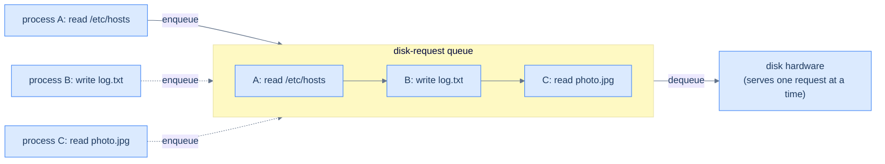
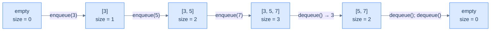
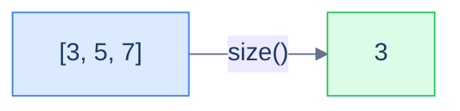
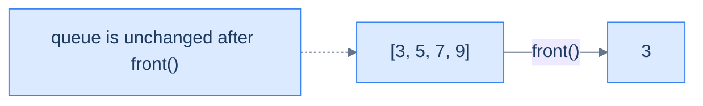
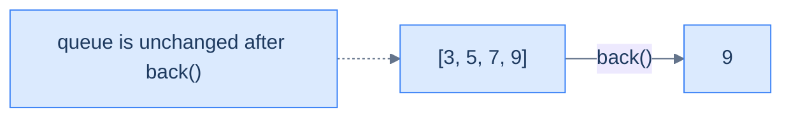

# 1. Introduction to Queues

## The Hook

Imagine the line at a coffee shop. The customer who walked in first is the one being served right now — *not* the one who sauntered in two minutes ago and tried to skip ahead. Newcomers join the back of the line and patiently wait their turn. The first person *in* is the first person *out*. Anything else would feel like cheating, and anyone who tried it would (rightly) get yelled at.

That fairness rule — **First In, First Out** — is everywhere in computing once you start looking. The print spooler queues your documents in the order you submitted them. The OS scheduler queues runnable threads. Every web server on Earth queues incoming requests. Network packets line up in router buffers. Keyboard events line up to be delivered to your application. **Breadth-first search**, the workhorse of pathfinding, level-order tree traversals, network analysis, and much of game AI, is — at its core — *just a queue*. Take that away and the algorithm doesn't work.

The data structure that makes all of these tick is called a **queue**. It's the natural counterpart to the stack: where a stack is *LIFO* (most recent first, the last plate you put on the pile is the first one you grab), a queue is *FIFO* — oldest first, fairness by construction. Two open ends, one for adding and one for removing, and a strict rule that *new arrivals go to the back, departures leave from the front*. That single rule is enough to underpin most of the asynchronous, ordered, and breadth-first computation we do.

This lesson lays the foundation: the FIFO contract, the four properties every queue tracks (capacity, size, front, back), and the five-method API (enqueue, dequeue, size, front, back). The next two lessons make it real — first with a clever circular array, then with a linked list. The lesson after that closes with two famous interview questions: *can you build a queue out of stacks, and can you build a stack out of queues?*

---

## Table of contents

1. [Understanding the problem](#understanding-the-problem)
2. [Exploring a possible solution](#exploring-a-possible-solution)
3. [Key properties of a queue](#key-properties-of-a-queue)
4. [Overview of supported operations](#overview-of-supported-operations)

***

# Understanding the problem

Some problems demand the *opposite* of a stack's discipline: data must be processed in the **same order it arrived**. The first item in must be the first one out — sometimes called **First In, First Out (FIFO)**, or equivalently **First In, Last Out... no wait**, that's wrong. The right alias is **Last In, Last Out (LILO)** — emphasising the same fact from the *other* end. Whichever name you use, the contract is identical: the order of removal mirrors the order of insertion.

```d2
direction: right

inq: "enqueue order (in)" {
  grid-columns: 4
  grid-gap: 0
  e0: "1"
  e1: "2"
  e2: "3"
  e3: "4"
}

outq: "dequeue order (out)" {
  grid-columns: 4
  grid-gap: 0
  e0: "1"
  e1: "2"
  e2: "3"
  e3: "4"
}

inq -> outq: FIFO
```

<p align="center"><strong>FIFO in one picture — items 1, 2, 3, 4 went in <em>in that order</em>; they come out in the <em>same</em> order. The earliest insertion is always the next one out. Compare this to a stack, where the order would be reversed.</strong></p>

> **First In, First Out (FIFO)** — sometimes called **Last In, Last Out (LILO)** — is the discipline of processing items in the order they arrived. The first item enqueued is the first one dequeued; the last item enqueued waits behind everything else. Fairness is built in.

Why does anyone need this? Three real-world examples that almost certainly run on your computer right now.

## Music players

Your music app's "play queue" is exactly that — a queue. You add songs to the *back* of the list. The player consumes them from the *front*. The song you queued first plays first, the one you queued last plays last. If the player swapped the order — playing the latest song first and burying the one you actually wanted — you'd uninstall the app. The FIFO contract isn't a polite preference here; it's *what makes the feature work*.

```d2
q: "play queue (front on the left, back on the right)" {
  grid-columns: 4
  grid-gap: 0
  s1: |md
    **Song A**

    (playing)
  | {style.fill: "#dcfce7"; style.stroke: "#22c55e"}
  s2: "Song B"
  s3: "Song C"
  s4: |md
    **Song D**

    just added
  | {style.fill: "#fef9c3"; style.stroke: "#f59e0b"}
}

front_label: front { shape: oval }
back_label: back { shape: oval }
front_label -> q.s1
back_label -> q.s4
```

<p align="center"><strong>Music player queue — you add to the back; the player pulls from the front. The earliest-queued song plays now; the most-recently-queued song waits behind everything else. Pure FIFO.</strong></p>

## Call centres

Pick up the phone, dial a customer service line, and you join an *invisible* queue. The system pushes your call onto the back of the waiting list. As agents free up, the system pulls calls from the front. The hold-music politeness — *"You are the seventh caller in queue"* — is literally announcing your index in a FIFO data structure. Reverse the order, and the unlucky person who called *first* would never get served as fresh callers keep cutting in front. FIFO is *fairness as code*.

```d2
direction: right

newcall: new caller { shape: oval }
agent: next available agent { shape: oval }

q: "call queue" {
  grid-columns: 4
  grid-gap: 0
  c1: |md
    **caller #4**

    longest wait
  | {style.fill: "#dcfce7"; style.stroke: "#22c55e"}
  c2: "caller #5"
  c3: "caller #6"
  c4: "caller #7"
}

newcall -> q.c4: enqueue
q.c1 -> agent: dequeue
```

<p align="center"><strong>Call-centre queueing — calls flow in from the right (newest), agents pick up from the left (oldest). The front of the queue is whoever has been waiting the longest, and that's exactly who deserves to be served next.</strong></p>

## Disk and OS scheduling

A spinning hard disk can do *one* read or write at a time. When five processes simultaneously ask the disk to fetch a file, the OS doesn't run them in parallel — it queues the requests and serves them in order. The same pattern shows up in print spoolers, network-packet buffers, the OS task scheduler, the ready-queue in any modern operating system. Anywhere a single resource is being shared by many requesters, *something* has to decide who goes next, and FIFO is the most defensible default — no one's request gets perpetually starved.



<p align="center"><strong>Disk-request scheduling — multiple processes submit requests; the OS queues them and feeds them to the hardware one at a time. Without a queue, the disk would be the contention point and requests would clobber each other or starve.</strong></p>

These three are the tip of the iceberg. **Breadth-first search** uses a queue to explore graphs level-by-level. **Producer–consumer pipelines** use queues to decouple producers from consumers. **Message brokers** (Kafka, RabbitMQ, SQS) are essentially networked queues. **Async/await runtimes** schedule tasks via queues. Once you spot the pattern, you'll see it everywhere — and the data structure that makes it all tractable is the **queue**.

***

# Exploring a possible solution

A queue is a **linear container** with a very specific restriction: data may be **added at one end** (the *back*, also called the *rear* or *tail*) and **removed from the other end** (the *front*, also called the *head*). Two open ends, each dedicated to a single direction of traffic. The opposite ends are what create the FIFO property; if both ends were interchangeable, you'd have a deque (double-ended queue), not a queue.

## Queue of people

The image is right there in the supermarket. A queue of people at a checkout till:

- A new customer joins **at the back**. (enqueue)
- The cashier serves whoever is **at the front**. (dequeue)
- The first customer to arrive is the first to leave; the last to arrive waits behind everyone else.
- Cutting in line — inserting in the middle — is forbidden by social contract (and by the data structure).

```d2
direction: right

newcomer: new customer { shape: oval }
exit_lbl: exit { shape: oval }

line: "queue at the till" {
  grid-columns: 4
  grid-gap: 0
  f: |md
    **front**

    being served
  | {style.fill: "#dcfce7"; style.stroke: "#22c55e"}
  c2: "customer 2"
  c3: "customer 3"
  b: |md
    **back**

    latest arrival
  | {style.fill: "#fef9c3"; style.stroke: "#f59e0b"}
}

newcomer -> line.b: join here
line.f -> exit_lbl: served and leaves
```

<p align="center"><strong>A queue of people at a till — a brand-new arrival joins at the back; the cashier always serves the front. Two ends, two roles. The data-structure version of a queue enforces the same etiquette by design — there is no API for "insert in the middle".</strong></p>

The supermarket analogy predicts every property of the data structure. The customer at the front is the next one to leave. To get to the customer who arrived second, you have to wait for the first to be served. Adding a customer makes the line longer; serving one makes it shorter. We're going to translate every one of those facts into code.

## Queue data structure

A **queue** is a linear data structure that stores items in an ordered sequence and permits two operations on them: **enqueue** (add to the back) and **dequeue** (remove from the front). Auxiliary read-only operations (peek at the front, peek at the back, ask for the size) round out a small, sharp interface. The whole API fits on a sticky note.

```d2
direction: right

ops: "queue API" {
  shape: text
  label: |md
    **enqueue(9)** — add to back

    **dequeue() → 3** — remove front

    **front() → 3** — peek oldest

    **back() → 7** — peek newest

    **size() → 3** — count
  |
}

q: "queue [3, 5, 7] (front on left, back on right)" {
  grid-columns: 3
  grid-gap: 0
  qf: |md
    **3**

    front
  | {style.fill: "#dcfce7"; style.stroke: "#22c55e"}
  qm: "5"
  qb: |md
    **7**

    back
  | {style.fill: "#fef9c3"; style.stroke: "#f59e0b"}
}

ops -> q
```

<p align="center"><strong>Queue interface in one diagram — <code>enqueue</code> adds to the back; <code>dequeue</code> removes (and returns) the front; <code>front</code>, <code>back</code>, and <code>size</code> just inspect. Five operations, total. No middle access. No traversal.</strong></p>

In memory, queues are conventionally drawn left-to-right with the front on the left and the back on the right (matching how we read), but you'll see them stored as arrays where the front index is some position `i` and the back index is some position `j ≥ i`. Both indices march forward as data flows through — and that subtle detail is exactly what makes the array implementation interesting in the next lesson.

```d2
arr: "queue stored as an array" {
  grid-columns: 5
  grid-gap: 0
  e0: |md
    `0`

    "—"
  |
  e1: |md
    `1`

    **3**
  | {style.fill: "#dcfce7"; style.stroke: "#22c55e"}
  e2: |md
    `2`

    5
  |
  e3: |md
    `3`

    **7**
  | {style.fill: "#fef9c3"; style.stroke: "#f59e0b"}
  e4: |md
    `4`

    "—"
  |
}

front_label: front = 1 { shape: oval }
back_label: back = 3 { shape: oval }
front_label -> arr.e1
back_label -> arr.e3
```

<p align="center"><strong>Same queue laid out as an array — front at index 1, back at index 3. <code>enqueue(9)</code> would write at index 4 and bump back; <code>dequeue()</code> would return the value at index 1 and bump front to 2. <em>Both ends move</em> — and that is why naive array queues run out of room while still half empty (the next lesson fixes this with a circular trick).</strong></p>

> *Predict before reading on — if both <code>front</code> and <code>back</code> march forward through the array as items flow in and out, what happens when <code>back</code> hits the end of the array but the front is still somewhere in the middle?*
>
> The naive answer is "we're out of room", but that's wrong — there's clearly empty space at the start (where dequeued items used to be). The clever fix is to wrap the back around to index 0 and keep going, treating the array as a *circle*. This is called a **circular array**, and it's the entire engineering trick behind the array implementation. Lesson 2 builds it.

## Stack vs queue — same shape, opposite rule

Queues and stacks are siblings. Both store an ordered sequence; both restrict access to the ends. The *only* difference is *which* end items leave from.

| | Stack (LIFO) | Queue (FIFO) |
|---|---|---|
| Add at | top | back |
| Remove from | **top** (same end) | **front** (opposite end) |
| Open ends | 1 | 2 |
| Mental model | pile of plates | line of people |
| Recency rule | most recent first | oldest first |
| BFS or DFS? | DFS (depth-first) | BFS (breadth-first) |

That last row is worth lingering on. Swap the queue in a BFS for a stack and the algorithm becomes DFS. Swap the stack in a DFS for a queue and it becomes BFS. The traversal *order* — and therefore the *answer* — depends entirely on which container you use, even when every other line of code is identical. That's the kind of leverage these tiny data structures give you.

***

# Key properties of a queue

A queue tracks four quantities. None of them surprise you after the supermarket analogy.

## Capacity

The **capacity** is the maximum number of items the queue can hold. Two flavours, just like stacks:

- **Bounded** queue — capacity fixed at construction. Enqueueing onto a full bounded queue is rejected (returns `false` or throws). Common when memory is constrained or when back-pressure is desired (e.g. a network buffer that *should* drop or block when full).
- **Unbounded** queue — capacity grows on demand, limited only by available memory. Most language standard-library queues are unbounded by default.

```d2
bnd: "bounded queue (capacity 4)" {
  grid-columns: 4
  grid-gap: 0
  b1: "3"
  b2: "5"
  b3: "7"
  b4: "9"
}

bnote: "enqueue next: REJECTED (full)" { shape: text }

und: "unbounded queue (capacity = memory)" {
  grid-columns: 4
  grid-gap: 0
  u1: "3"
  u2: "5"
  u3: "7"
  u4: "..."
}

unote: "enqueue next: grow and continue" { shape: text }

bnd -> bnote
und -> unote
```

<p align="center"><strong>Bounded vs unbounded — bounded queues reject overflow (back-pressure); unbounded queues lazily expand (convenience, at the cost of latency on resize). Real-world systems often <em>want</em> bounded queues precisely so producers feel push-back when consumers fall behind.</strong></p>

## Size

The **size** is the number of items currently in the queue. Always satisfies `0 ≤ size ≤ capacity`. Enqueue increments it by 1; dequeue decrements it by 1; size is independent of *what* is stored.

A size of zero means the queue is **empty**. Calling `dequeue`, `front`, or `back` on an empty queue is undefined behaviour — implementations either return a sentinel like `-1`, return `null`, or throw. *Always check before you peek.*



<p align="center"><strong>Size tracks the number of items — it goes up on enqueue, down on dequeue. <code>size == 0</code> is the empty check; calls to <code>front</code>, <code>back</code>, or <code>dequeue</code> on an empty queue must be guarded.</strong></p>

## Front

The **front** is the *oldest* item still in the queue — the one that has been waiting the longest. It is the *only* item that `dequeue` is allowed to remove, and it is what `front()` returns when you peek. If the queue is empty, the front is undefined.

The front is what makes a queue a queue's "exit". Every dequeue removes the current front, and the second-oldest item becomes the new front. This is the *fairness* end — whatever's there has been waiting longer than anything else, so it goes first.

## Back

The **back** (also called the **rear** or **tail**) is the *most recently added* item. It is the *only* position where `enqueue` is allowed to insert. It is what `back()` returns when you peek. If the queue is empty, the back is undefined.

The back is the queue's "entrance". Every enqueue creates a new back; the previous back becomes the second-newest item. Newcomers always land here.

```d2
direction: right

q: "queue (3, 5, 7, 9)" {
  grid-columns: 4
  grid-gap: 0
  f: |md
    **3**

    front (oldest)
  | {style.fill: "#dcfce7"; style.stroke: "#22c55e"}
  m1: "5"
  m2: "7"
  b: |md
    **9**

    back (newest)
  | {style.fill: "#fef9c3"; style.stroke: "#f59e0b"}
}

deq: "dequeue removes from here" { shape: oval }
enq: "enqueue adds after this" { shape: oval }
deq -> q.f
enq -> q.b
```

<p align="center"><strong>Two ends, two roles — the front is read-and-remove only; the back is write-only. Items flow strictly from back to front over their lifetime in the queue, and that one-way flow is what realises FIFO.</strong></p>

***

# Overview of supported operations

A queue exposes a small, sharp interface. Two **mutators** (enqueue, dequeue) and three **inspectors** (size, front, back). That's the whole API — and it's enough to build BFS, schedulers, message brokers, and most async runtimes on top of.

## Enqueue

`enqueue(x)` adds `x` to the back of the queue. The size increases by 1. `x` becomes the new back; the previous back becomes the second-newest item. The front is unaffected (unless the queue was empty, in which case `x` is simultaneously the front and the back).

```d2
direction: right

before: "before enqueue(9)" {
  grid-columns: 3
  grid-gap: 0
  b1: |md
    **3**

    front
  |
  b2: "5"
  b3: |md
    **7**

    back
  |
}

after: "after enqueue(9)" {
  grid-columns: 4
  grid-gap: 0
  a1: |md
    **3**

    front
  |
  a2: "5"
  a3: "7"
  a4: |md
    **9**

    back
  | {style.fill: "#dcfce7"; style.stroke: "#22c55e"}
}

before -> after: "enqueue(9)"
```

<p align="center"><strong>Enqueue — the new item lands at the back; the queue grows by one. Everything that was already in the queue stays put; only the back marker moves.</strong></p>

> **Why doesn't a queue support insertion in the middle, like a linked list?**
>
> Because the *whole point* of a queue is the FIFO contract. The moment you allow "insert at position k", every guarantee about ordering is gone — the next item dequeued might be one you snuck in last week. A queue *deliberately* refuses middle insertion for the same reason a stack refuses middle removal: the restriction *is* the feature. Algorithms built on a queue (BFS, schedulers) rely on the contract — break it, and they break.

## Dequeue

`dequeue()` removes and returns the item at the front. The size decreases by 1. The previous second-oldest item becomes the new front. The back is unaffected (unless the queue is now empty, in which case both front and back are undefined).

```d2
direction: right

before: "before dequeue()" {
  grid-columns: 4
  grid-gap: 0
  b1: |md
    **3**

    front (removed)
  | {style.fill: "#fee2e2"; style.stroke: "#ef4444"}
  b2: "5"
  b3: "7"
  b4: |md
    **9**

    back
  |
}

after: "after dequeue() returns 3" {
  grid-columns: 3
  grid-gap: 0
  a1: |md
    **5**

    front
  |
  a2: "7"
  a3: |md
    **9**

    back
  |
}

before -> after: "dequeue()"
```

<p align="center"><strong>Dequeue — removes and returns the front item. Calling <code>dequeue()</code> on an empty queue is an error; always check <code>size &gt; 0</code> first.</strong></p>

> **Why doesn't a queue support removing from anywhere, like a linked list?**
>
> Same reason as enqueue — the FIFO contract demands that the *only* removable item is the oldest one. Allow arbitrary removal and you've built a deque or list, not a queue. Production queues deliberately refuse the operation to *prevent* well-meaning callers from breaking the algorithms that depend on the FIFO order.

## Size

`size()` returns the number of items currently in the queue. Always O(1) — implementations maintain a counter that is updated by enqueue and dequeue.



<p align="center"><strong>Size — a constant-time read. Mostly used as the predicate for <code>isEmpty()</code> (size == 0), for guarding dequeue/front/back, and for back-pressure checks (size == capacity).</strong></p>

## Front

`front()` returns the value at the front of the queue *without removing it*. Useful when you want to inspect the next item to be served before deciding whether to consume it (priority checks, conditional dispatch, etc.).



<p align="center"><strong>Front — returns the oldest item without removing it. <code>dequeue</code> = front + remove; sometimes you only need the front, e.g. <em>"is the next caller VIP? if so, route differently"</em>.</strong></p>

## Back

`back()` (sometimes called `rear()` or `tail()`) returns the value at the back of the queue without removing it. Less commonly used than `front()`, but invaluable for sliding-window algorithms and monotonic-deque tricks (more on those much later in the course).



<p align="center"><strong>Back — returns the newest item without removing it. The queue is still <code>[3, 5, 7, 9]</code> after the call.</strong></p>

> **Why doesn't a queue support traversal, like a linked list?**
>
> A linked list and a queue serve different purposes. A linked list is a *sequence* — its job is to expose every element in order. A queue is a *workspace* — its job is to remember which item to serve next. Iterating over a queue would violate the abstraction it sells: that the only meaningful elements are the *front* (next out) and the *back* (most recent in). In practice, debuggers and language standard libraries often *do* let you walk a queue's contents — but the algorithms you write *on top* of a queue should never rely on it.

***

## Final Takeaway

The queue is one of the two foundational ordered-access data structures (the other being its sibling, the stack). Three things to walk away with:

1. **FIFO is fairness as code.** The queue's two-end restriction exists *to enforce* that the next dequeue returns the oldest still-present item. Any operation that would violate that — middle insertion, middle removal, traversal — is forbidden by design.
2. **Enqueue and dequeue are O(1).** The whole interface is constant-time. The only nuance is around capacity: a bounded queue rejects on full; an unbounded queue pays an occasional O(N) resize when its underlying storage grows.
3. **Queues power breadth-first thinking.** Anywhere you find yourself thinking *"process the oldest pending item next"* — whether it's level-order tree traversal, BFS in a graph, scheduling, message dispatch, or producer–consumer coordination — you are describing a queue. Recognising the shape is half the battle.

> *Coming up — implementations. The next lesson builds a queue on a **circular array** (the natural choice when capacity is bounded; the cyclic trick is genuinely beautiful), and the lesson after on a **linked list** (the natural choice when both ends must support O(1) work without bookkeeping). The lesson after that is the famous "queue out of stacks / stack out of queues" interview duo. Hold onto the FIFO mental model — every implementation that follows is just a different way to mechanise it.*
