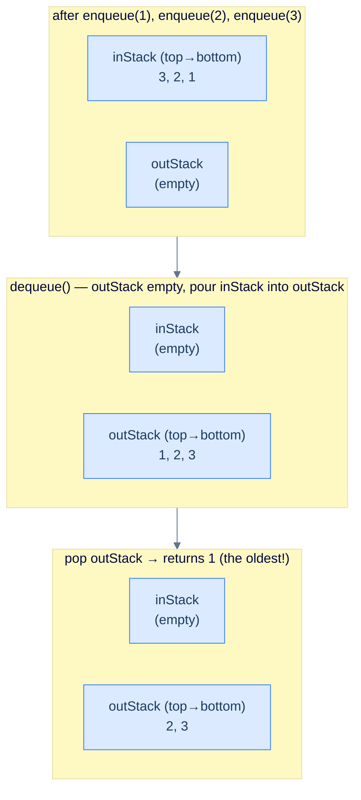
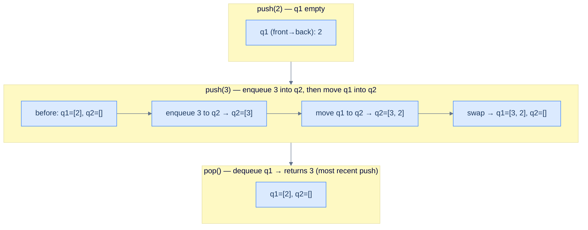
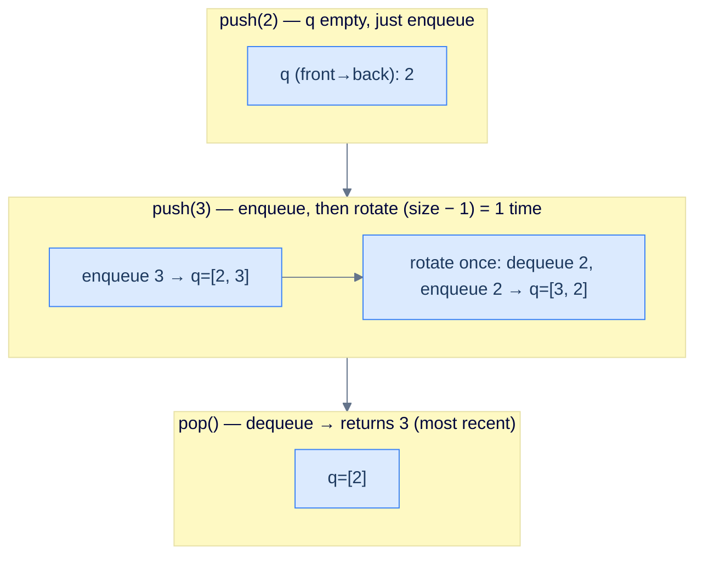

# 4. Design

## The Hook

Stacks are *LIFO*. Queues are *FIFO*. They're each other's mirror image — and at first glance you might think one cannot become the other, since their access disciplines are exactly opposite. The fun question is: **can you build a queue using only stacks? Can you build a stack using only queues?**

Both answers are *yes*, and the construction is more than a puzzle. It's a textbook demonstration of how *composition* of simple primitives can simulate behaviour that none of them has individually. A single stack is LIFO. *Two* stacks, with elements ferried between them, can simulate FIFO — because pouring a stack into another stack reverses the order, and reversing twice gets you back to the original. Combine "push everything into stack A" with "transfer to stack B when needed", and stack B's top is the queue's front.

The reverse direction — stack out of queues — is uglier but the same *idea*: shuffle elements through one or two queues so that the most-recently-pushed item ends up at the front, where dequeue can fish it out. It costs O(N) per push (or per pop), but it works.

These three constructions — **queue from two stacks**, **stack from two queues**, **stack from one queue** — show up in interview cycles year after year. They test whether you really understand FIFO and LIFO as *contracts*, and whether you can reason about composing data structures without reaching for new primitives.

This lesson builds all three end-to-end in 10 languages.

---

## Table of contents

1. [Design a queue using stacks](#design-a-queue-using-stacks)
2. [Design a stack using queues](#design-a-stack-using-queues)
3. [Design a stack using a single queue](#design-a-stack-using-a-single-queue)

***

# Design a queue using stacks

## Problem Statement

Implement a `Queue` class using **at most two stacks** as the only internal storage. All standard queue operations must be supported.

> -   **`Queue(int capacity)`** — initialise with the given capacity.
> -   **`size()`** — return current size.
> -   **`empty()`** — return `true` if empty.
> -   **`front()`** — front element, or `-1` if empty.
> -   **`back()`** — back element, or `-1` if empty.
> -   **`enqueue(int val)`** — add at the back; return `true`, or `false` if full.
> -   **`dequeue()`** — remove and return the front; `-1` if empty.

> **Constraints:**
> - Use **at most two stacks** as internal storage. No arrays, no linked lists, no deques.
> - The two stacks expose only `push`, `pop`, `top`, `empty`, and `size`.

> **Worked Example:**
>
> Input: `[Queue, enqueue, back, enqueue, front, empty, dequeue, front, enqueue, enqueue, empty]` with operands `[[2], [2], [], [3], [], [], [], [], [8], [9], []]`
>
> Output: `[null, true, 2, true, 2, false, 2, 3, true, false, false]`

## The Idea — pour-and-reverse

A stack reverses the insertion order: push 1, 2, 3 → pop returns 3, 2, 1. That's *one* reversal. If you reverse *twice*, you're back to the original order — which is exactly what a queue wants. **Reverse twice = identity = FIFO.**

Concretely:

- **inStack** receives every enqueue. Its top is the most-recent enqueue (the queue's *back*).
- **outStack** is where dequeues happen. Its top is the *oldest* enqueue (the queue's *front*).
- When `outStack` is empty and we need to dequeue, we **lazily transfer** everything from `inStack` to `outStack`, popping from one and pushing to the other. The pour reverses the order — so what was at the bottom of `inStack` (oldest) becomes the top of `outStack` (next out).



<p align="center"><strong>Pour-and-reverse — inStack's bottom (oldest) becomes outStack's top after the transfer. From then on, dequeue is O(1) for as long as outStack still has items. Only when outStack drains again does another batch transfer happen.</strong></p>

## Why amortised O(1) per dequeue

A worst-case dequeue costs O(N) (the transfer). But every item is moved *at most twice* during its lifetime in the queue: **once** into `inStack` (during enqueue) and **once** from `inStack` to `outStack` (during the lazy transfer). Spread the transfer cost across all the dequeues that the transfer enables, and the **amortised cost is O(1) per dequeue**.

This is the same accounting trick that makes dynamic-array `push_back` amortised O(1) despite occasional O(N) resizes.

## A subtle bit — `back()`

The back of the queue is the most-recent enqueue, which is the *top of inStack* — *except* if inStack is empty, in which case the most-recent enqueue is currently sitting at the *bottom of outStack*. Reaching it would be O(N).

The cleanest fix is to **maintain a separate `backVal` field** that is overwritten on every successful enqueue. Then `back()` is O(1) regardless of which stack the most-recent item lives in. This is the version we'll implement.

> *Predict before reading on — without the `backVal` cache, what's the worst-case cost of <code>back()</code>?*
>
> O(N) — you'd have to either pour outStack back into inStack (and then back again to preserve dequeue order) or peek at outStack's bottom by popping everything off into a temporary stack. The single-integer cache sidesteps that whole problem.

## Solution

```python run
class Queue:
    def __init__(self, capacity: int):
        self.capacity = capacity
        self.in_stack  = []   # push end
        self.out_stack = []   # pop end
        self.back_val  = -1   # cache of the most recent enqueue

    def size(self):  return len(self.in_stack) + len(self.out_stack)
    def empty(self): return self.size() == 0
    def back(self):  return -1 if self.empty() else self.back_val
    def front(self):
        if self.empty(): return -1
        if not self.out_stack:
            while self.in_stack:
                self.out_stack.append(self.in_stack.pop())
        return self.out_stack[-1]
    def enqueue(self, v):
        if self.size() == self.capacity: return False
        self.in_stack.append(v)
        self.back_val = v
        return True
    def dequeue(self):
        if self.empty(): return -1
        if not self.out_stack:
            while self.in_stack:
                self.out_stack.append(self.in_stack.pop())
        return self.out_stack.pop()

# Boss-fight demo
q = Queue(2)
print(q.enqueue(2), q.back())     # True 2
print(q.enqueue(3), q.front())    # True 2
print(q.empty())                  # False
print(q.dequeue(), q.front())     # 2 3
print(q.enqueue(8), q.enqueue(9)) # True False
print(q.empty())                  # False
```

```java run
import java.util.*;
public class Main {
    static class Queue {
        private final Deque<Integer> inStack  = new ArrayDeque<>();
        private final Deque<Integer> outStack = new ArrayDeque<>();
        private int backVal  = -1;
        private int capacity;
        Queue(int capacity) { this.capacity = capacity; }

        int     size()  { return inStack.size() + outStack.size(); }
        boolean empty() { return size() == 0; }
        int     back()  { return empty() ? -1 : backVal; }
        int     front() {
            if (empty()) return -1;
            if (outStack.isEmpty())
                while (!inStack.isEmpty()) outStack.push(inStack.pop());
            return outStack.peek();
        }
        boolean enqueue(int v) {
            if (size() == capacity) return false;
            inStack.push(v);
            backVal = v;
            return true;
        }
        int dequeue() {
            if (empty()) return -1;
            if (outStack.isEmpty())
                while (!inStack.isEmpty()) outStack.push(inStack.pop());
            return outStack.pop();
        }
    }
    public static void main(String[] args) {
        Queue q = new Queue(2);
        System.out.println(q.enqueue(2) + " " + q.back());
        System.out.println(q.enqueue(3) + " " + q.front());
        System.out.println(q.empty());
        System.out.println(q.dequeue() + " " + q.front());
        System.out.println(q.enqueue(8) + " " + q.enqueue(9));
        System.out.println(q.empty());
    }
}
```

```c run
#include <stdio.h>
#include <stdlib.h>
#include <stdbool.h>

typedef struct { int *arr; int top, cap; } Stack;
static Stack* stk_new(int c)        { Stack *s = malloc(sizeof(*s)); s->arr = malloc(sizeof(int)*c); s->top=-1; s->cap=c; return s; }
static int    stk_size(Stack *s)    { return s->top + 1; }
static bool   stk_empty(Stack *s)   { return s->top == -1; }
static int    stk_peek(Stack *s)    { return s->arr[s->top]; }
static void   stk_push(Stack *s, int v) { s->arr[++s->top] = v; }
static int    stk_pop(Stack *s)     { return s->arr[s->top--]; }

typedef struct {
    Stack *in, *out;
    int    capacity, backVal;
} Queue;

Queue* queue_create(int c) {
    Queue *q = malloc(sizeof(*q));
    q->in  = stk_new(c);
    q->out = stk_new(c);
    q->capacity = c; q->backVal = -1;
    return q;
}
int  queue_size (Queue *q){ return stk_size(q->in) + stk_size(q->out); }
bool queue_empty(Queue *q){ return queue_size(q) == 0; }
int  queue_back (Queue *q){ return queue_empty(q) ? -1 : q->backVal; }
int  queue_front(Queue *q){
    if (queue_empty(q)) return -1;
    if (stk_empty(q->out))
        while (!stk_empty(q->in)) stk_push(q->out, stk_pop(q->in));
    return stk_peek(q->out);
}
bool queue_enqueue(Queue *q, int v) {
    if (queue_size(q) == q->capacity) return false;
    stk_push(q->in, v);
    q->backVal = v;
    return true;
}
int  queue_dequeue(Queue *q){
    if (queue_empty(q)) return -1;
    if (stk_empty(q->out))
        while (!stk_empty(q->in)) stk_push(q->out, stk_pop(q->in));
    return stk_pop(q->out);
}

int main() {
    Queue *q = queue_create(2);
    printf("%d %d\n", queue_enqueue(q,2), queue_back(q));
    printf("%d %d\n", queue_enqueue(q,3), queue_front(q));
    printf("%d\n",    queue_empty(q));
    printf("%d %d\n", queue_dequeue(q),   queue_front(q));
    printf("%d %d\n", queue_enqueue(q,8), queue_enqueue(q,9));
    printf("%d\n",    queue_empty(q));
}
```

```cpp run
#include <iostream>
#include <stack>

class Queue {
    std::stack<int> inStack, outStack;
    int             capacity, backVal = -1;
public:
    Queue(int cap) : capacity(cap) {}
    int  size()  { return (int)(inStack.size() + outStack.size()); }
    bool empty() { return size() == 0; }
    int  back()  { return empty() ? -1 : backVal; }
    int  front() {
        if (empty()) return -1;
        if (outStack.empty())
            while (!inStack.empty()) { outStack.push(inStack.top()); inStack.pop(); }
        return outStack.top();
    }
    bool enqueue(int v) {
        if (size() == capacity) return false;
        inStack.push(v);
        backVal = v;
        return true;
    }
    int dequeue() {
        if (empty()) return -1;
        if (outStack.empty())
            while (!inStack.empty()) { outStack.push(inStack.top()); inStack.pop(); }
        int v = outStack.top(); outStack.pop();
        return v;
    }
};

int main() {
    Queue q(2);
    std::cout << q.enqueue(2) << " " << q.back()  << "\n";
    std::cout << q.enqueue(3) << " " << q.front() << "\n";
    std::cout << q.empty() << "\n";
    std::cout << q.dequeue() << " " << q.front() << "\n";
    std::cout << q.enqueue(8) << " " << q.enqueue(9) << "\n";
    std::cout << q.empty() << "\n";
}
```

```scala run
import scala.collection.mutable

class Queue(val capacity: Int) {
  private val inStack  = mutable.Stack[Int]()
  private val outStack = mutable.Stack[Int]()
  private var backVal  = -1

  def size:  Int     = inStack.size + outStack.size
  def empty: Boolean = size == 0
  def back:  Int     = if (empty) -1 else backVal
  def front: Int = {
    if (empty) return -1
    if (outStack.isEmpty)
      while (inStack.nonEmpty) outStack.push(inStack.pop())
    outStack.top
  }
  def enqueue(v: Int): Boolean = {
    if (size == capacity) return false
    inStack.push(v); backVal = v; true
  }
  def dequeue: Int = {
    if (empty) return -1
    if (outStack.isEmpty)
      while (inStack.nonEmpty) outStack.push(inStack.pop())
    outStack.pop()
  }
}

object Main extends App {
  val q = new Queue(2)
  println(s"${q.enqueue(2)} ${q.back}")
  println(s"${q.enqueue(3)} ${q.front}")
  println(q.empty)
  println(s"${q.dequeue} ${q.front}")
  println(s"${q.enqueue(8)} ${q.enqueue(9)}")
  println(q.empty)
}
```

```javascript run
class Queue {
    constructor(capacity) {
        this.capacity = capacity;
        this.inStack  = [];
        this.outStack = [];
        this.backVal  = -1;
    }
    size()  { return this.inStack.length + this.outStack.length; }
    empty() { return this.size() === 0; }
    back()  { return this.empty() ? -1 : this.backVal; }
    front() {
        if (this.empty()) return -1;
        if (this.outStack.length === 0)
            while (this.inStack.length) this.outStack.push(this.inStack.pop());
        return this.outStack[this.outStack.length - 1];
    }
    enqueue(v) {
        if (this.size() === this.capacity) return false;
        this.inStack.push(v);
        this.backVal = v;
        return true;
    }
    dequeue() {
        if (this.empty()) return -1;
        if (this.outStack.length === 0)
            while (this.inStack.length) this.outStack.push(this.inStack.pop());
        return this.outStack.pop();
    }
}

const q = new Queue(2);
console.log(q.enqueue(2), q.back());
console.log(q.enqueue(3), q.front());
console.log(q.empty());
console.log(q.dequeue(), q.front());
console.log(q.enqueue(8), q.enqueue(9));
console.log(q.empty());
```

```typescript run
class Queue {
    private capacity: number;
    private inStack:  number[] = [];
    private outStack: number[] = [];
    private backVal           = -1;
    constructor(capacity: number) { this.capacity = capacity; }

    size():  number  { return this.inStack.length + this.outStack.length; }
    empty(): boolean { return this.size() === 0; }
    back():  number  { return this.empty() ? -1 : this.backVal; }
    front(): number  {
        if (this.empty()) return -1;
        if (this.outStack.length === 0)
            while (this.inStack.length) this.outStack.push(this.inStack.pop()!);
        return this.outStack[this.outStack.length - 1];
    }
    enqueue(v: number): boolean {
        if (this.size() === this.capacity) return false;
        this.inStack.push(v);
        this.backVal = v;
        return true;
    }
    dequeue(): number {
        if (this.empty()) return -1;
        if (this.outStack.length === 0)
            while (this.inStack.length) this.outStack.push(this.inStack.pop()!);
        return this.outStack.pop()!;
    }
}

const q = new Queue(2);
console.log(q.enqueue(2), q.back());
console.log(q.enqueue(3), q.front());
console.log(q.empty());
console.log(q.dequeue(), q.front());
console.log(q.enqueue(8), q.enqueue(9));
console.log(q.empty());
```

```go run
package main
import "fmt"

type Queue struct {
    inStack, outStack []int
    capacity, backVal int
}

func NewQueue(c int) *Queue { return &Queue{capacity: c, backVal: -1} }
func (q *Queue) Size()  int  { return len(q.inStack) + len(q.outStack) }
func (q *Queue) Empty() bool { return q.Size() == 0 }
func (q *Queue) Back()  int  { if q.Empty() { return -1 }; return q.backVal }
func (q *Queue) Front() int {
    if q.Empty() { return -1 }
    if len(q.outStack) == 0 {
        for len(q.inStack) > 0 {
            n := len(q.inStack) - 1
            q.outStack = append(q.outStack, q.inStack[n])
            q.inStack  = q.inStack[:n]
        }
    }
    return q.outStack[len(q.outStack)-1]
}
func (q *Queue) Enqueue(v int) bool {
    if q.Size() == q.capacity { return false }
    q.inStack = append(q.inStack, v)
    q.backVal = v
    return true
}
func (q *Queue) Dequeue() int {
    if q.Empty() { return -1 }
    if len(q.outStack) == 0 {
        for len(q.inStack) > 0 {
            n := len(q.inStack) - 1
            q.outStack = append(q.outStack, q.inStack[n])
            q.inStack  = q.inStack[:n]
        }
    }
    n := len(q.outStack) - 1
    v := q.outStack[n]
    q.outStack = q.outStack[:n]
    return v
}

func main() {
    q := NewQueue(2)
    fmt.Println(q.Enqueue(2), q.Back())
    fmt.Println(q.Enqueue(3), q.Front())
    fmt.Println(q.Empty())
    fmt.Println(q.Dequeue(), q.Front())
    fmt.Println(q.Enqueue(8), q.Enqueue(9))
    fmt.Println(q.Empty())
}
```

```kotlin run
class Queue(private val capacity: Int) {
    private val inStack  = ArrayDeque<Int>()
    private val outStack = ArrayDeque<Int>()
    private var backVal  = -1

    fun size():  Int     = inStack.size + outStack.size
    fun empty(): Boolean = size() == 0
    fun back():  Int     = if (empty()) -1 else backVal
    fun front(): Int {
        if (empty()) return -1
        if (outStack.isEmpty())
            while (inStack.isNotEmpty()) outStack.addLast(inStack.removeLast())
        return outStack.last()
    }
    fun enqueue(v: Int): Boolean {
        if (size() == capacity) return false
        inStack.addLast(v); backVal = v; return true
    }
    fun dequeue(): Int {
        if (empty()) return -1
        if (outStack.isEmpty())
            while (inStack.isNotEmpty()) outStack.addLast(inStack.removeLast())
        return outStack.removeLast()
    }
}

fun main() {
    val q = Queue(2)
    println("${q.enqueue(2)} ${q.back()}")
    println("${q.enqueue(3)} ${q.front()}")
    println(q.empty())
    println("${q.dequeue()} ${q.front()}")
    println("${q.enqueue(8)} ${q.enqueue(9)}")
    println(q.empty())
}
```

```rust run
pub struct Queue {
    in_stack:  Vec<i32>,
    out_stack: Vec<i32>,
    capacity:  usize,
    back_val:  i32,
}

impl Queue {
    pub fn new(capacity: usize) -> Self {
        Queue { in_stack: Vec::new(), out_stack: Vec::new(), capacity, back_val: -1 }
    }
    pub fn size(&self)  -> usize { self.in_stack.len() + self.out_stack.len() }
    pub fn empty(&self) -> bool  { self.size() == 0 }
    pub fn back(&self)  -> i32   { if self.empty() { -1 } else { self.back_val } }
    pub fn front(&mut self) -> i32 {
        if self.empty() { return -1; }
        if self.out_stack.is_empty() {
            while let Some(v) = self.in_stack.pop() { self.out_stack.push(v); }
        }
        *self.out_stack.last().unwrap()
    }
    pub fn enqueue(&mut self, v: i32) -> bool {
        if self.size() == self.capacity { return false; }
        self.in_stack.push(v);
        self.back_val = v;
        true
    }
    pub fn dequeue(&mut self) -> i32 {
        if self.empty() { return -1; }
        if self.out_stack.is_empty() {
            while let Some(v) = self.in_stack.pop() { self.out_stack.push(v); }
        }
        self.out_stack.pop().unwrap()
    }
}

fn main() {
    let mut q = Queue::new(2);
    println!("{} {}", q.enqueue(2), q.back());
    println!("{} {}", q.enqueue(3), q.front());
    println!("{}",    q.empty());
    println!("{} {}", q.dequeue(), q.front());
    println!("{} {}", q.enqueue(8), q.enqueue(9));
    println!("{}",    q.empty());
}
```


## Complexity Analysis

| Operation | Worst Case | Amortised |
|---|---|---|
| `enqueue`  | O(1) | O(1) |
| `dequeue`  | O(N) (transfer) | **O(1)** |
| `front`    | O(N) (transfer) | **O(1)** |
| `back`     | O(1) | O(1) |
| `size`, `empty` | O(1) | O(1) |

Each item is moved through the system at most twice (in → in, then in → out), so the *total* work over N operations is O(N), giving O(1) amortised per operation.

***

# Design a stack using queues

## Problem Statement

Implement a `Stack` class using **at most two queues** as the only internal storage.

> -   **`Stack(int capacity)`** — initialise.
> -   **`size()`** — current size.
> -   **`empty()`** — `true` if empty.
> -   **`top()`** — top element, or `-1` if empty.
> -   **`push(int val)`** — push; return `true`, or `false` if full.
> -   **`pop()`** — remove and return the top; `-1` if empty.

> **Constraints:**
> - Use **at most two queues** internally. Each queue exposes only `enqueue`, `dequeue`, `front`, `empty`, `size`.

> **Worked Example:**
>
> Input: `[Stack, push, push, top, empty, pop, top, push, push, empty]` `[[2], [2], [3], [], [], [], [], [8], [9], []]`
>
> Output: `[null, true, true, 3, false, 3, 2, true, false, false]`

## The Idea — make every push land at the front

A queue dequeues from the *front*. A stack pops from the *top*. So the construction we want is: **after every push, the most recently pushed element is at the front of the queue**. Then `pop` is just `dequeue`, and `top` is `front` — both O(1).

To achieve that with two queues: when pushing `v`, enqueue `v` into the *empty* queue (call it `q2`), then drain the *full* queue (`q1`) into `q2` in order. Now `q2`'s front is `v` (which we just pushed), followed by all the previous items in their original order. Swap the names `q1` and `q2` (so that `q1` is always "the queue with the data") and we're done.



<p align="center"><strong>Two-queue stack — every push pays O(N) to relocate everything; in return, pop and top are O(1). The "newest in front" invariant is what makes the stack discipline emerge from queue primitives.</strong></p>

> *Predict before reading on — could you instead make pop O(N) and push O(1)?*
>
> Yes — the "lazy" mirror works too. Push by simple enqueue (O(1)). To pop, rotate all but the last element from `q1` into `q2`, then dequeue the lone remaining element from `q1` (that's the most recent push), then swap. Both designs are correct; you choose based on which operation you expect to dominate. We pick *push-heavy O(N)* here because it makes `top()` also cheap.

## Solution

```python run
from collections import deque

class Stack:
    def __init__(self, capacity: int):
        self.capacity   = capacity
        self.q1         = deque()      # active queue
        self.q2         = deque()      # scratch
        self.curr_size  = 0

    def size(self):  return self.curr_size
    def empty(self): return self.curr_size == 0
    def top(self):   return -1 if self.empty() else self.q1[0]
    def push(self, v):
        if self.curr_size == self.capacity: return False
        self.q2.append(v)
        while self.q1: self.q2.append(self.q1.popleft())
        self.q1, self.q2 = self.q2, self.q1
        self.curr_size += 1
        return True
    def pop(self):
        if self.empty(): return -1
        self.curr_size -= 1
        return self.q1.popleft()

# Boss-fight demo
s = Stack(2)
print(s.push(2), s.push(3))     # True True
print(s.top())                  # 3
print(s.empty())                # False
print(s.pop(), s.top())         # 3 2
print(s.push(8), s.push(9))     # True False (full)
print(s.empty())                # False
```

```java run
import java.util.*;
public class Main {
    static class Stack {
        private Queue<Integer> q1 = new ArrayDeque<>();
        private Queue<Integer> q2 = new ArrayDeque<>();
        private int currSize = 0, capacity;
        Stack(int capacity) { this.capacity = capacity; }

        int     size()  { return currSize; }
        boolean empty() { return currSize == 0; }
        int     top()   { return empty() ? -1 : q1.peek(); }
        boolean push(int v) {
            if (currSize == capacity) return false;
            q2.offer(v);
            while (!q1.isEmpty()) q2.offer(q1.poll());
            Queue<Integer> tmp = q1; q1 = q2; q2 = tmp;
            currSize++;
            return true;
        }
        int pop() {
            if (empty()) return -1;
            currSize--;
            return q1.poll();
        }
    }
    public static void main(String[] args) {
        Stack s = new Stack(2);
        System.out.println(s.push(2) + " " + s.push(3));
        System.out.println(s.top());
        System.out.println(s.empty());
        System.out.println(s.pop() + " " + s.top());
        System.out.println(s.push(8) + " " + s.push(9));
        System.out.println(s.empty());
    }
}
```

```c run
#include <stdio.h>
#include <stdlib.h>
#include <stdbool.h>

// Minimal int queue (fixed-size circular buffer)
typedef struct { int *arr; int front, back, size, cap; } Q;
static Q*   q_new(int c)     { Q *q = malloc(sizeof(*q)); q->arr=malloc(sizeof(int)*c); q->front=0; q->back=-1; q->size=0; q->cap=c; return q; }
static int  q_size(Q *q)     { return q->size; }
static bool q_empty(Q *q)    { return q->size == 0; }
static int  q_front(Q *q)    { return q->arr[q->front]; }
static void q_enq(Q *q, int v){ q->back = (q->back + 1) % q->cap; q->arr[q->back] = v; q->size++; }
static int  q_deq(Q *q)      { int v = q->arr[q->front]; q->front = (q->front + 1) % q->cap; q->size--; return v; }

typedef struct {
    Q *q1, *q2;
    int capacity, currSize;
} Stack;

Stack* stack_create(int c) {
    Stack *s = malloc(sizeof(*s));
    s->q1 = q_new(c); s->q2 = q_new(c);
    s->capacity = c; s->currSize = 0;
    return s;
}
int  stack_size (Stack *s){ return s->currSize; }
bool stack_empty(Stack *s){ return s->currSize == 0; }
int  stack_top  (Stack *s){ return stack_empty(s) ? -1 : q_front(s->q1); }
bool stack_push (Stack *s, int v) {
    if (s->currSize == s->capacity) return false;
    q_enq(s->q2, v);
    while (!q_empty(s->q1)) q_enq(s->q2, q_deq(s->q1));
    Q *t = s->q1; s->q1 = s->q2; s->q2 = t;
    s->currSize++;
    return true;
}
int  stack_pop  (Stack *s){
    if (stack_empty(s)) return -1;
    s->currSize--;
    return q_deq(s->q1);
}

int main() {
    Stack *s = stack_create(2);
    printf("%d %d\n", stack_push(s,2), stack_push(s,3));
    printf("%d\n",    stack_top(s));
    printf("%d\n",    stack_empty(s));
    printf("%d %d\n", stack_pop(s), stack_top(s));
    printf("%d %d\n", stack_push(s,8), stack_push(s,9));
    printf("%d\n",    stack_empty(s));
}
```

```cpp run
#include <iostream>
#include <queue>

class Stack {
    std::queue<int> q1, q2;
    int             capacity, currSize = 0;
public:
    Stack(int c) : capacity(c) {}
    int  size()  { return currSize; }
    bool empty() { return currSize == 0; }
    int  top()   { return empty() ? -1 : q1.front(); }
    bool push(int v) {
        if (currSize == capacity) return false;
        q2.push(v);
        while (!q1.empty()) { q2.push(q1.front()); q1.pop(); }
        std::swap(q1, q2);
        currSize++;
        return true;
    }
    int pop() {
        if (empty()) return -1;
        int v = q1.front(); q1.pop();
        currSize--;
        return v;
    }
};

int main() {
    Stack s(2);
    std::cout << s.push(2) << " " << s.push(3) << "\n";
    std::cout << s.top() << "\n";
    std::cout << s.empty() << "\n";
    std::cout << s.pop() << " " << s.top() << "\n";
    std::cout << s.push(8) << " " << s.push(9) << "\n";
    std::cout << s.empty() << "\n";
}
```

```scala run
import scala.collection.mutable

class Stack(val capacity: Int) {
  private var q1 = mutable.Queue[Int]()
  private var q2 = mutable.Queue[Int]()
  private var n  = 0

  def size:  Int     = n
  def empty: Boolean = n == 0
  def top:   Int     = if (empty) -1 else q1.head
  def push(v: Int): Boolean = {
    if (n == capacity) return false
    q2.enqueue(v)
    while (q1.nonEmpty) q2.enqueue(q1.dequeue())
    val t = q1; q1 = q2; q2 = t
    n += 1
    true
  }
  def pop: Int = {
    if (empty) return -1
    n -= 1
    q1.dequeue()
  }
}

object Main extends App {
  val s = new Stack(2)
  println(s"${s.push(2)} ${s.push(3)}")
  println(s.top)
  println(s.empty)
  println(s"${s.pop} ${s.top}")
  println(s"${s.push(8)} ${s.push(9)}")
  println(s.empty)
}
```

```javascript run
class Stack {
    constructor(capacity) {
        this.capacity = capacity;
        this.q1       = [];
        this.q2       = [];
        this.currSize = 0;
    }
    size()  { return this.currSize; }
    empty() { return this.currSize === 0; }
    top()   { return this.empty() ? -1 : this.q1[0]; }
    push(v) {
        if (this.currSize === this.capacity) return false;
        this.q2.push(v);
        while (this.q1.length) this.q2.push(this.q1.shift());
        [this.q1, this.q2] = [this.q2, this.q1];
        this.currSize++;
        return true;
    }
    pop() {
        if (this.empty()) return -1;
        this.currSize--;
        return this.q1.shift();
    }
}

const s = new Stack(2);
console.log(s.push(2), s.push(3));
console.log(s.top());
console.log(s.empty());
console.log(s.pop(), s.top());
console.log(s.push(8), s.push(9));
console.log(s.empty());
```

```typescript run
class Stack {
    private capacity: number;
    private q1: number[] = [];
    private q2: number[] = [];
    private currSize     = 0;
    constructor(capacity: number) { this.capacity = capacity; }

    size():  number  { return this.currSize; }
    empty(): boolean { return this.currSize === 0; }
    top():   number  { return this.empty() ? -1 : this.q1[0]; }
    push(v: number): boolean {
        if (this.currSize === this.capacity) return false;
        this.q2.push(v);
        while (this.q1.length) this.q2.push(this.q1.shift()!);
        [this.q1, this.q2] = [this.q2, this.q1];
        this.currSize++;
        return true;
    }
    pop(): number {
        if (this.empty()) return -1;
        this.currSize--;
        return this.q1.shift()!;
    }
}

const s = new Stack(2);
console.log(s.push(2), s.push(3));
console.log(s.top());
console.log(s.empty());
console.log(s.pop(), s.top());
console.log(s.push(8), s.push(9));
console.log(s.empty());
```

```go run
package main
import "fmt"

type Stack struct {
    q1, q2            []int
    capacity, currSize int
}

func NewStack(c int) *Stack { return &Stack{capacity: c} }
func (s *Stack) Size()  int  { return s.currSize }
func (s *Stack) Empty() bool { return s.currSize == 0 }
func (s *Stack) Top()   int  { if s.Empty() { return -1 }; return s.q1[0] }
func (s *Stack) Push(v int) bool {
    if s.currSize == s.capacity { return false }
    s.q2 = append(s.q2, v)
    for len(s.q1) > 0 {
        s.q2 = append(s.q2, s.q1[0])
        s.q1 = s.q1[1:]
    }
    s.q1, s.q2 = s.q2, s.q1
    s.currSize++
    return true
}
func (s *Stack) Pop() int {
    if s.Empty() { return -1 }
    v   := s.q1[0]
    s.q1 = s.q1[1:]
    s.currSize--
    return v
}

func main() {
    s := NewStack(2)
    fmt.Println(s.Push(2), s.Push(3))
    fmt.Println(s.Top())
    fmt.Println(s.Empty())
    fmt.Println(s.Pop(), s.Top())
    fmt.Println(s.Push(8), s.Push(9))
    fmt.Println(s.Empty())
}
```

```kotlin run
class Stack(private val capacity: Int) {
    private var q1       = ArrayDeque<Int>()
    private var q2       = ArrayDeque<Int>()
    private var currSize = 0

    fun size():  Int     = currSize
    fun empty(): Boolean = currSize == 0
    fun top():   Int     = if (empty()) -1 else q1.first()
    fun push(v: Int): Boolean {
        if (currSize == capacity) return false
        q2.addLast(v)
        while (q1.isNotEmpty()) q2.addLast(q1.removeFirst())
        val t = q1; q1 = q2; q2 = t
        currSize++
        return true
    }
    fun pop(): Int {
        if (empty()) return -1
        currSize--
        return q1.removeFirst()
    }
}

fun main() {
    val s = Stack(2)
    println("${s.push(2)} ${s.push(3)}")
    println(s.top())
    println(s.empty())
    println("${s.pop()} ${s.top()}")
    println("${s.push(8)} ${s.push(9)}")
    println(s.empty())
}
```

```rust run
use std::collections::VecDeque;

pub struct Stack {
    q1:        VecDeque<i32>,
    q2:        VecDeque<i32>,
    capacity:  usize,
    curr_size: usize,
}

impl Stack {
    pub fn new(capacity: usize) -> Self {
        Stack { q1: VecDeque::new(), q2: VecDeque::new(), capacity, curr_size: 0 }
    }
    pub fn size(&self)  -> usize { self.curr_size }
    pub fn empty(&self) -> bool  { self.curr_size == 0 }
    pub fn top(&self)   -> i32   {
        if self.empty() { -1 } else { *self.q1.front().unwrap() }
    }
    pub fn push(&mut self, v: i32) -> bool {
        if self.curr_size == self.capacity { return false; }
        self.q2.push_back(v);
        while let Some(x) = self.q1.pop_front() { self.q2.push_back(x); }
        std::mem::swap(&mut self.q1, &mut self.q2);
        self.curr_size += 1;
        true
    }
    pub fn pop(&mut self) -> i32 {
        if self.empty() { return -1; }
        self.curr_size -= 1;
        self.q1.pop_front().unwrap()
    }
}

fn main() {
    let mut s = Stack::new(2);
    println!("{} {}", s.push(2), s.push(3));
    println!("{}",    s.top());
    println!("{}",    s.empty());
    println!("{} {}", s.pop(), s.top());
    println!("{} {}", s.push(8), s.push(9));
    println!("{}",    s.empty());
}
```


## Complexity Analysis

| Operation | Time |
|---|---|
| `push` | **O(N)** (drain + enqueue) |
| `pop`, `top`, `size`, `empty` | **O(1)** |

Push is genuinely O(N) here — there's no amortisation, because every push relocates *every* element. This is why two-stacks-as-queue is the more common interview answer (better amortised cost) — but two-queues-as-stack is still useful when push is rare and pop/top are hot.

***

# Design a stack using a single queue

## Problem Statement

Same interface as above, but with **only one queue** internally.

> -   **`Stack(int capacity)`** — initialise.
> -   **`size()`**, **`empty()`**, **`top()`**, **`push(int val)`**, **`pop()`** — same contracts as the two-queue version.

> **Constraint:** Use **exactly one** queue internally. No second queue, no auxiliary stack.

## The Idea — rotate after every push

The two-queue solution moved data between containers to keep "newest at front". With only one queue, we use the *same* container as both source and destination — by rotating.

Concretely: after enqueueing `v` (which lands at the *back*), rotate the queue by `size − 1` positions: dequeue from the front and immediately re-enqueue at the back, `size − 1` times. The net effect: `v` ends up at the front, and the rest are behind it in their original relative order.



<p align="center"><strong>Single-queue stack — push enqueues then rotates so the new item lands at the front. Pop and top are then O(1) (just dequeue / front). The whole stack discipline emerges from O(N) work per push.</strong></p>

> **Why size − 1, not size?** After enqueueing `v`, the queue has `size` items, with `v` at the back and the rest in their old order ahead of it. Rotating `size − 1` times moves the `size − 1` *non-v* items to behind `v`, leaving `v` at the front. Rotate `size` times and you've gone all the way around — `v` is back at the back, defeating the purpose.

## Solution

```python run
from collections import deque

class Stack:
    def __init__(self, capacity: int):
        self.capacity = capacity
        self.q        = deque()

    def size(self):  return len(self.q)
    def empty(self): return not self.q
    def top(self):   return -1 if self.empty() else self.q[0]
    def push(self, v):
        if len(self.q) == self.capacity: return False
        self.q.append(v)
        for _ in range(len(self.q) - 1):
            self.q.append(self.q.popleft())   # rotate v to the front
        return True
    def pop(self):
        if self.empty(): return -1
        return self.q.popleft()

# Boss-fight demo
s = Stack(2)
print(s.push(2), s.push(3))     # True True
print(s.top())                  # 3
print(s.empty())                # False
print(s.pop(), s.top())         # 3 2
print(s.push(8), s.push(9))     # True False
print(s.empty())                # False
```

```java run
import java.util.*;
public class Main {
    static class Stack {
        private final Queue<Integer> q = new ArrayDeque<>();
        private final int capacity;
        Stack(int capacity) { this.capacity = capacity; }

        int     size()  { return q.size(); }
        boolean empty() { return q.isEmpty(); }
        int     top()   { return empty() ? -1 : q.peek(); }
        boolean push(int v) {
            if (q.size() == capacity) return false;
            q.offer(v);
            for (int i = 0; i < q.size() - 1; i++) q.offer(q.poll());
            return true;
        }
        int pop() { return empty() ? -1 : q.poll(); }
    }
    public static void main(String[] args) {
        Stack s = new Stack(2);
        System.out.println(s.push(2) + " " + s.push(3));
        System.out.println(s.top());
        System.out.println(s.empty());
        System.out.println(s.pop() + " " + s.top());
        System.out.println(s.push(8) + " " + s.push(9));
        System.out.println(s.empty());
    }
}
```

```c run
#include <stdio.h>
#include <stdlib.h>
#include <stdbool.h>

typedef struct { int *arr; int front, back, size, cap; } Q;
static Q*   q_new(int c)        { Q *q = malloc(sizeof(*q)); q->arr=malloc(sizeof(int)*c); q->front=0; q->back=-1; q->size=0; q->cap=c; return q; }
static int  q_size(Q *q)        { return q->size; }
static bool q_empty(Q *q)       { return q->size == 0; }
static int  q_front(Q *q)       { return q->arr[q->front]; }
static void q_enq(Q *q, int v)  { q->back = (q->back + 1) % q->cap; q->arr[q->back] = v; q->size++; }
static int  q_deq(Q *q)         { int v = q->arr[q->front]; q->front = (q->front + 1) % q->cap; q->size--; return v; }

typedef struct { Q *q; int capacity; } Stack;

Stack* stack_create(int c) {
    Stack *s = malloc(sizeof(*s));
    s->q = q_new(c); s->capacity = c;
    return s;
}
int  stack_size (Stack *s){ return q_size(s->q); }
bool stack_empty(Stack *s){ return q_empty(s->q); }
int  stack_top  (Stack *s){ return stack_empty(s) ? -1 : q_front(s->q); }
bool stack_push (Stack *s, int v) {
    if (q_size(s->q) == s->capacity) return false;
    q_enq(s->q, v);
    int n = q_size(s->q) - 1;
    for (int i = 0; i < n; i++) q_enq(s->q, q_deq(s->q));
    return true;
}
int  stack_pop  (Stack *s){ return stack_empty(s) ? -1 : q_deq(s->q); }

int main() {
    Stack *s = stack_create(2);
    printf("%d %d\n", stack_push(s,2), stack_push(s,3));
    printf("%d\n",    stack_top(s));
    printf("%d\n",    stack_empty(s));
    printf("%d %d\n", stack_pop(s), stack_top(s));
    printf("%d %d\n", stack_push(s,8), stack_push(s,9));
    printf("%d\n",    stack_empty(s));
}
```

```cpp run
#include <iostream>
#include <queue>

class Stack {
    std::queue<int> q;
    int             capacity;
public:
    Stack(int c) : capacity(c) {}
    int  size()  { return (int)q.size(); }
    bool empty() { return q.empty(); }
    int  top()   { return empty() ? -1 : q.front(); }
    bool push(int v) {
        if ((int)q.size() == capacity) return false;
        q.push(v);
        for (int i = 0; i < (int)q.size() - 1; i++) {
            q.push(q.front()); q.pop();
        }
        return true;
    }
    int pop() {
        if (empty()) return -1;
        int v = q.front(); q.pop();
        return v;
    }
};

int main() {
    Stack s(2);
    std::cout << s.push(2) << " " << s.push(3) << "\n";
    std::cout << s.top() << "\n";
    std::cout << s.empty() << "\n";
    std::cout << s.pop() << " " << s.top() << "\n";
    std::cout << s.push(8) << " " << s.push(9) << "\n";
    std::cout << s.empty() << "\n";
}
```

```scala run
import scala.collection.mutable

class Stack(val capacity: Int) {
  private val q = mutable.Queue[Int]()

  def size:  Int     = q.size
  def empty: Boolean = q.isEmpty
  def top:   Int     = if (empty) -1 else q.head
  def push(v: Int): Boolean = {
    if (q.size == capacity) return false
    q.enqueue(v)
    val n = q.size - 1
    for (_ <- 0 until n) q.enqueue(q.dequeue())
    true
  }
  def pop: Int = if (empty) -1 else q.dequeue()
}

object Main extends App {
  val s = new Stack(2)
  println(s"${s.push(2)} ${s.push(3)}")
  println(s.top)
  println(s.empty)
  println(s"${s.pop} ${s.top}")
  println(s"${s.push(8)} ${s.push(9)}")
  println(s.empty)
}
```

```javascript run
class Stack {
    constructor(capacity) {
        this.capacity = capacity;
        this.q        = [];
    }
    size()  { return this.q.length; }
    empty() { return this.q.length === 0; }
    top()   { return this.empty() ? -1 : this.q[0]; }
    push(v) {
        if (this.q.length === this.capacity) return false;
        this.q.push(v);
        for (let i = 0; i < this.q.length - 1; i++) this.q.push(this.q.shift());
        return true;
    }
    pop() { return this.empty() ? -1 : this.q.shift(); }
}

const s = new Stack(2);
console.log(s.push(2), s.push(3));
console.log(s.top());
console.log(s.empty());
console.log(s.pop(), s.top());
console.log(s.push(8), s.push(9));
console.log(s.empty());
```

```typescript run
class Stack {
    private capacity: number;
    private q: number[] = [];
    constructor(capacity: number) { this.capacity = capacity; }

    size():  number  { return this.q.length; }
    empty(): boolean { return this.q.length === 0; }
    top():   number  { return this.empty() ? -1 : this.q[0]; }
    push(v: number): boolean {
        if (this.q.length === this.capacity) return false;
        this.q.push(v);
        for (let i = 0; i < this.q.length - 1; i++) this.q.push(this.q.shift()!);
        return true;
    }
    pop(): number { return this.empty() ? -1 : this.q.shift()!; }
}

const s = new Stack(2);
console.log(s.push(2), s.push(3));
console.log(s.top());
console.log(s.empty());
console.log(s.pop(), s.top());
console.log(s.push(8), s.push(9));
console.log(s.empty());
```

```go run
package main
import "fmt"

type Stack struct {
    q        []int
    capacity int
}

func NewStack(c int) *Stack { return &Stack{capacity: c} }
func (s *Stack) Size()  int  { return len(s.q) }
func (s *Stack) Empty() bool { return len(s.q) == 0 }
func (s *Stack) Top()   int  { if s.Empty() { return -1 }; return s.q[0] }
func (s *Stack) Push(v int) bool {
    if len(s.q) == s.capacity { return false }
    s.q = append(s.q, v)
    n := len(s.q) - 1
    for i := 0; i < n; i++ {
        s.q = append(s.q, s.q[0])
        s.q = s.q[1:]
    }
    return true
}
func (s *Stack) Pop() int {
    if s.Empty() { return -1 }
    v   := s.q[0]
    s.q  = s.q[1:]
    return v
}

func main() {
    s := NewStack(2)
    fmt.Println(s.Push(2), s.Push(3))
    fmt.Println(s.Top())
    fmt.Println(s.Empty())
    fmt.Println(s.Pop(), s.Top())
    fmt.Println(s.Push(8), s.Push(9))
    fmt.Println(s.Empty())
}
```

```kotlin run
class Stack(private val capacity: Int) {
    private val q = ArrayDeque<Int>()

    fun size():  Int     = q.size
    fun empty(): Boolean = q.isEmpty()
    fun top():   Int     = if (empty()) -1 else q.first()
    fun push(v: Int): Boolean {
        if (q.size == capacity) return false
        q.addLast(v)
        val n = q.size - 1
        repeat(n) { q.addLast(q.removeFirst()) }
        return true
    }
    fun pop(): Int = if (empty()) -1 else q.removeFirst()
}

fun main() {
    val s = Stack(2)
    println("${s.push(2)} ${s.push(3)}")
    println(s.top())
    println(s.empty())
    println("${s.pop()} ${s.top()}")
    println("${s.push(8)} ${s.push(9)}")
    println(s.empty())
}
```

```rust run
use std::collections::VecDeque;

pub struct Stack {
    q:        VecDeque<i32>,
    capacity: usize,
}

impl Stack {
    pub fn new(capacity: usize) -> Self {
        Stack { q: VecDeque::new(), capacity }
    }
    pub fn size(&self)  -> usize { self.q.len() }
    pub fn empty(&self) -> bool  { self.q.is_empty() }
    pub fn top(&self)   -> i32   {
        if self.empty() { -1 } else { *self.q.front().unwrap() }
    }
    pub fn push(&mut self, v: i32) -> bool {
        if self.q.len() == self.capacity { return false; }
        self.q.push_back(v);
        let n = self.q.len() - 1;
        for _ in 0..n {
            let x = self.q.pop_front().unwrap();
            self.q.push_back(x);
        }
        true
    }
    pub fn pop(&mut self) -> i32 {
        if self.empty() { -1 } else { self.q.pop_front().unwrap() }
    }
}

fn main() {
    let mut s = Stack::new(2);
    println!("{} {}", s.push(2), s.push(3));
    println!("{}",    s.top());
    println!("{}",    s.empty());
    println!("{} {}", s.pop(), s.top());
    println!("{} {}", s.push(8), s.push(9));
    println!("{}",    s.empty());
}
```


## Complexity Analysis

| Operation | Time |
|---|---|
| `push` | **O(N)** (rotate after enqueue) |
| `pop`, `top`, `size`, `empty` | **O(1)** |

Same shape as the two-queue version — push pays for the abstraction; everything else is free. The single-queue version uses *less memory* (only one underlying queue) and is arguably the more elegant of the two.

***

## Final Takeaway

The three problems in this lesson all answer the same question: *can you simulate one access discipline using primitives that only support the opposite discipline?* The answer in each case is yes — but you pay for it.

1. **Queue from two stacks — amortised O(1).** The lazy transfer is the gem. Every item moves at most twice; the worst-case O(N) dequeue is paid back by the cheap dequeues that follow. This is the canonical interview answer for "queue out of stacks", and the pattern (lazy transfer) recurs in real systems — most notably in functional persistent queues (Okasaki's banker's queue uses two lazy lists with the same idea).
2. **Stack from queues — push pays the price.** Whether you use one queue or two, the cost is the same: O(N) per push, O(1) per pop. There's no clever amortisation here because the rotation/relocation has to happen on *every* push, not just occasionally. The trade-off is between memory (one queue vs two) and code clarity.
3. **The structures are duals, not equivalents.** Stacks and queues can simulate each other, but never for free. The asymmetry of cost — amortised O(1) one way, worst-case O(N) the other — reflects the fact that LIFO and FIFO are genuinely different access disciplines, and one of them has to do extra work to mimic the other. Picking the right primitive *first* is always cheaper than retrofitting.

> *Up next — the queue chapter ends here. The next chapter introduces the **binary tree** — a fundamentally different shape of data, where each node has multiple children and "first" and "last" stop being meaningful in the linear sense. The queue we just built will resurface there as the engine of breadth-first traversal — yet another reason FIFO sits at the heart of so much algorithmic work.*
