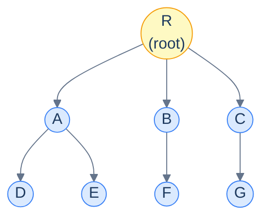
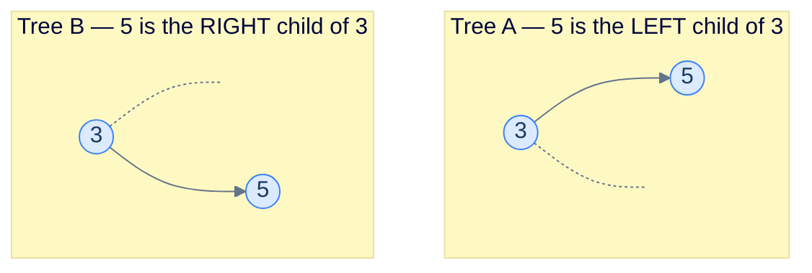
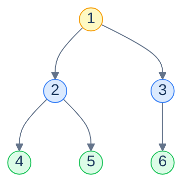
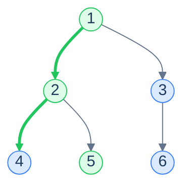
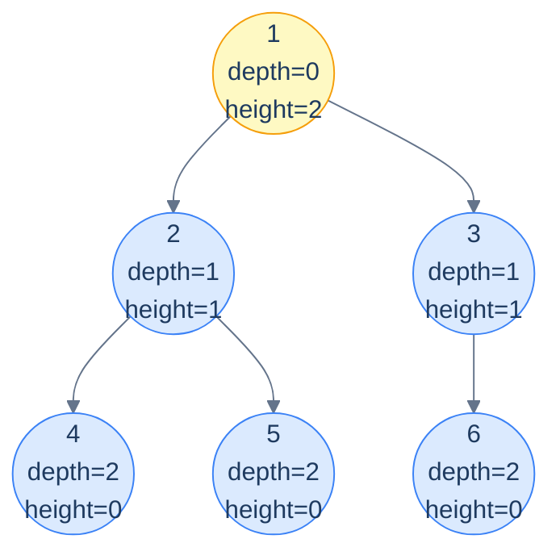
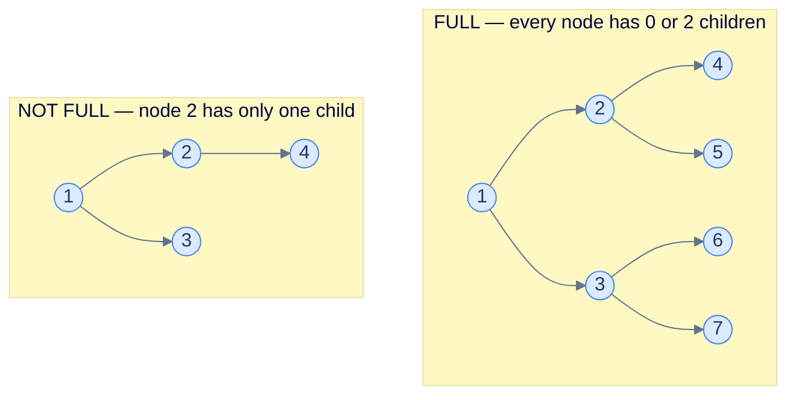
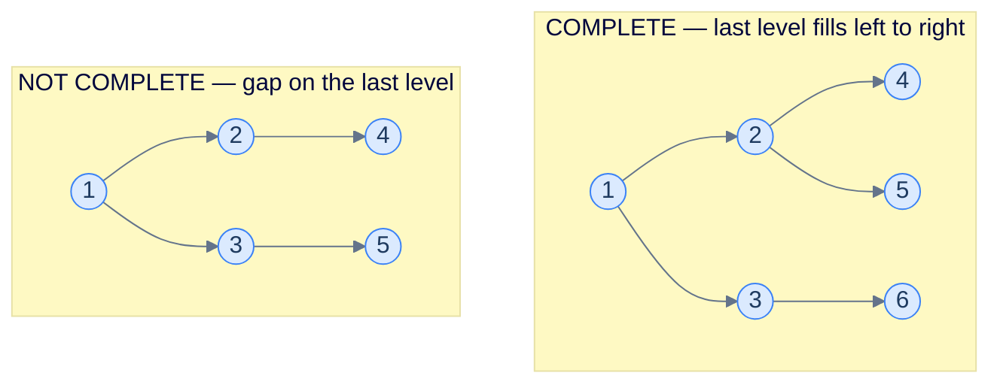
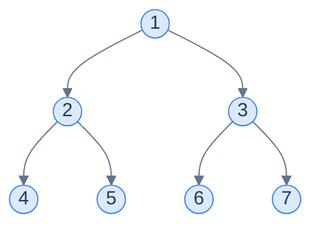
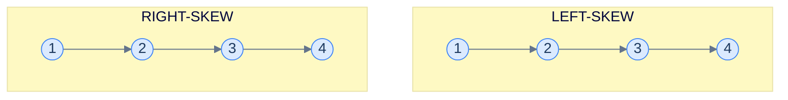
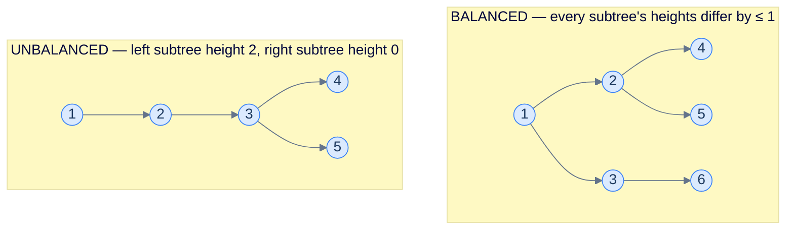

# 1. Introduction to Binary Trees

## The Hook

Up to now, every data structure in this course has been **linear**. An array, a linked list, a stack, a queue — they all lay items out along a single line, and you move *forward* or *backward* through them. One dimension, two directions, easy to picture.

Real data is hardly ever that flat. A *file system* has folders inside folders inside folders. *HTML* nests divs inside divs. The *DOM* you click through in a browser is a tree. *Source code* parses into an *abstract syntax tree*. Your *family tree*. The decision branches inside *Stockfish* or *AlphaZero*. The *organisational chart* of every company on Earth. The *taxonomy of life* — kingdom, phylum, class, order, family, genus, species. **Hierarchy is everywhere**, and the moment a problem has a notion of "parent" and "child", a linear data structure is the wrong shape.

The **tree** is the data structure that captures hierarchy directly. One special node is the *root* of the universe, every other node has exactly one parent, and any node may have any number of children. From this single rule fall *all* the structural properties — depth, height, paths, ancestry, descendants — that hierarchical reasoning needs.

This chapter is about the most-loved member of the tree family: the **binary tree**, where every node is allowed *at most two* children. That tiny restriction unlocks an enormous amount of beautiful machinery — fast search (BSTs), fast priority queues (heaps), language parsers, decision trees, range trees, segment trees, even the call stack of every recursive function you've ever written. Master this chapter, and the next four chapters of the course (BSTs, heaps, graphs, and beyond) become natural extensions of the same vocabulary.

This first lesson sets up the language: what a tree *is*, what each part is *called*, and which special shapes of binary tree get their own names. Get the vocabulary right and the rest of the chapter clicks into place.

---

## Table of contents

1. [Understanding a binary tree](#understanding-a-binary-tree)
2. [Key tree terminologies](#key-tree-terminologies)
3. [Types and properties of binary trees](#types-and-properties-of-binary-trees)

***

# Understanding a binary tree

A **tree** is a *non-linear, hierarchical* data structure. Every element is called a **node**. One node — the **root** — has no parent; every other node has exactly one parent and zero-or-more children. The connections between parent and child are called **edges**.

Three rules together define a tree (and rule out everything that isn't one):

1. There is exactly **one root**.
2. Every non-root node has **exactly one parent**.
3. There are **no cycles** — you cannot follow edges from a node and return to it.

Break rule 1 and you have a *forest* (a set of trees). Break rule 2 or rule 3 and you have a *graph* — a strictly more general structure that we'll cover in its own chapter.

<strong>A generic tree — one root <code>R</code>, edges flow from parent to child, every node has at most one parent. Notice this is <em>not</em> a binary tree: <code>R</code> has three children. A binary tree restricts every node to <em>at most two</em>.</strong>

## What makes it *binary*

A **binary tree** is a tree where every node has **at most two children**. Because two is the limit, the children get fixed names — the **left** child and the **right** child — and even when a node has only *one* child, we still distinguish whether it's the left or the right one. That distinction matters: a tree with `5` as a *left* child of `3` is a *different* tree from one with `5` as a *right* child of `3`, even if every other node is identical.

<strong>Same nodes, same edges, <em>different trees</em>. In a binary tree the left/right distinction is part of the structure — not a cosmetic detail. Algorithms like inorder traversal will produce different output for these two trees.</strong>

> *Predict before reading on — if every node has at most 2 children, what's the maximum number of nodes a binary tree of <em>height 3</em> can hold?*
>
> 15. Level 0 holds 1 node (the root), level 1 holds at most 2, level 2 at most 4, level 3 at most 8, totalling `1+2+4+8 = 15 = 2⁴ − 1`. In general a binary tree of height `h` holds at most `2^(h+1) − 1` nodes — *exponential* in the height. This is the entire reason binary trees are useful: a tree of height 30 holds **a billion** nodes, and any algorithm whose work is proportional to height is therefore extraordinarily fast on balanced trees. Hold this fact close — it underwrites everything from BSTs to heaps.

***

# Key tree terminologies

A two-dimensional structure needs a richer vocabulary than a linear one. The terms below let us *talk* about trees precisely — they're not specific to binary trees and apply to general trees as well.

## Root

The **root** is the unique node with no parent — the topmost node, from which every other node is reachable by following edges downward. Every tree has exactly one root; "root of an empty tree" is `null` (the conventional sentinel).

> The root is your *entry point* — to access *any* node in a tree, your program needs to hold on to the root reference. Lose it, and the entire tree is leaked memory.

## Leaf

A **leaf** is a node with **no children** — a "dead end" of the tree. Leaves are where every downward traversal eventually stops. A tree of one node is *both* the root *and* a leaf simultaneously.

## Internal node

An **internal node** is any node that is *not* a leaf — i.e., a node with at least one child. The root is internal *unless* the tree has exactly one node (then it's a leaf).

<strong>Yellow = root, blue = internal, green = leaves. Root and internal can overlap (the root is internal whenever it has children); leaves are the terminating nodes whose recursive traversals hit the base case.</strong>

## Degree

The **degree** of a node is the number of children it has. In a binary tree, degree ∈ `{0, 1, 2}`:

- Degree 0 ⇒ leaf.
- Degree 1 ⇒ partially-filled internal node (only one child).
- Degree 2 ⇒ fully-filled internal node (both children).

The **degree of the tree** is the maximum degree of any node in it. A binary tree has degree ≤ 2 by definition.

## Sibling

Two nodes are **siblings** if they share the same parent. In a binary tree, a node has *at most one* sibling — its parent's other child (if any).

## Path

A **path** between two nodes is the unique sequence of nodes connecting them, walking along edges. Because a tree has no cycles, the path between any two nodes is *unique* — and that uniqueness is what makes algorithms like LCA (lowest common ancestor) well-defined.

The **length** of a path can be measured in two equivalent ways: the number of *edges* it traverses, or the number of *nodes* it contains minus one. The two conventions differ by exactly one — pay attention to which a problem is using.

<strong>The unique path from root <code>1</code> to leaf <code>5</code>: <code>1 → 2 → 5</code>. Length = 2 (edges) or 3 (nodes). Trees have <em>exactly one</em> path between any two nodes — that uniqueness underpins every tree algorithm.</strong>

## Subtree

A **subtree** of node `n` is the tree consisting of `n` itself and *all of its descendants* (children, grandchildren, …). Every node is the root of its own subtree. A binary tree has a "left subtree" and a "right subtree" — the subtrees rooted at the left and right children — and most recursive tree algorithms are written in terms of these two recursive sub-problems.

> The recursive view: **a binary tree is either empty, or a root node with a left subtree and a right subtree**. This single recursive definition is the engine behind every recursive traversal, every divide-and-conquer construction, and every dynamic programming algorithm on trees in the entire course.

## Level

Every node sits at a **level** — its distance from the root. The root is at level `0`; its children at level `1`; their children at level `2`; and so on. The number of nodes at level `k` is at most `2^k` in a binary tree.

## Depth

The **depth** of a node is the number of *edges* on the path from the root to that node. The root has depth 0; its children have depth 1; and so on. *Depth is identical to level* — they're the same concept under two different names.

## Height

The **height** of a node is the number of *edges* on the *longest* path from that node *down to a leaf*. Leaves have height 0. The root's height is the **height of the tree**.

<strong>Depth grows downward (from root); height grows upward (from leaves). They meet at the root, where <code>height(root) = height of tree</code>. For this 6-node tree, height = 2.</strong>

> *Beware:* some textbooks define height in terms of nodes rather than edges — making leaves' height *1* instead of *0*. We use the **edge-counting** convention throughout this course because it's the one used by LeetCode, CLRS, and most production code. *Always check the convention* before writing a function called `height()`.

## Ancestor and descendant

If node `a` lies on the path from the root to node `b`, then `a` is an **ancestor** of `b` and `b` is a **descendant** of `a`. The root is an ancestor of every node. Every node is its own *trivial* ancestor and descendant by convention. The notion of ancestry is the basis of the *Lowest Common Ancestor (LCA)* algorithm — we'll see it later in the chapter.

***

# Types and properties of binary trees

Binary trees can be any shape — wildly skewed, perfectly balanced, half-empty. A few specific shapes show up so often that they get their own names and properties. Knowing which type you're dealing with often unlocks faster algorithms.

## Full binary tree

A **full** (or **proper**) binary tree is one in which **every node has either 0 or 2 children** — no node has exactly one. Either you have both children or none. Internal nodes are *complete*; the rest are leaves.

<strong>A full binary tree forbids "single-child" nodes. The right-side example violates that — node 2 has a left child but no right child, so the tree is not full.</strong>

> **Useful identities for a full binary tree** with `L` leaves and `I` internal nodes:
>
> - **`L = I + 1`** — there's always exactly one more leaf than internal node.
> - **Total nodes `N = 2I + 1 = 2L − 1`** — always odd.
> - **Maximum number of leaves at height `h`** = `2^h`.
>
> The first identity is a beautiful inductive fact and shows up surprisingly often — every full binary tree, no matter how lopsided, has *exactly one more leaf than internal node*.

## Complete binary tree

A **complete** binary tree fills its levels **top-to-bottom and left-to-right** — every level is full *except possibly the last*, and the last level is filled from the left with no gaps. This is the shape of a binary heap (used for priority queues) and the shape that lets binary trees be stored compactly in arrays.

<strong>The right-side tree is not complete because level 2 has a gap — node 2 has no right child even though node 3 has children. A complete tree fills every level fully, then starts the next from the left without skips.</strong>

> Complete binary trees are *the* shape that maps cleanly onto an array. We'll see in the next lesson that for a complete tree, the left child of index `i` lives at `2i + 1` and the right child at `2i + 2` — pure index arithmetic, zero pointers. This is also why heaps store as arrays rather than linked structures.

## Perfect binary tree

A **perfect** binary tree is both *full* and *complete* — every internal node has exactly two children **and** all leaves are at the same level. A perfect tree of height `h` has exactly `2^(h+1) − 1` nodes — every level is at maximum capacity.

<strong>A perfect binary tree of height 2 — exactly <code>2³ − 1 = 7</code> nodes, all four leaves on the bottom level. Both internal nodes (1, 2, 3) have two children; the tree is the densest a binary tree of that height can be.</strong>

> **Useful identities for a perfect binary tree** of height `h`:
>
> - **Total nodes `N = 2^(h+1) − 1`** — exactly one less than the next power of two.
> - **Number of leaves = `2^h`** — every leaf is on the bottom level.
> - **Height `h = log₂(N + 1) − 1`** — invert the formula above.
>
> The relationship `h ≈ log N` is the entire reason balanced binary trees give us O(log N) operations. A perfect tree of *60* levels holds about a *quintillion* nodes.

## Skew binary tree

A **skew** (or **degenerate**) binary tree is one where every internal node has *only one* child — so the tree degenerates into a linked list. Two flavours: **left-skew** (every child is a left child) and **right-skew** (every child is a right child). Skew trees are the *worst case* for almost every tree algorithm — height = `N − 1`, so any "O(height)" algorithm becomes O(N), losing all the benefit of being a tree at all.

<strong>A skew tree is morally a linked list. <code>N</code> nodes, height <code>N − 1</code>. Insert items in <em>sorted order</em> into a naive BST and you'll generate exactly this shape — the pathological case that motivates self-balancing trees (AVL, red-black) in later chapters.</strong>

## Balanced binary tree

A binary tree is **balanced** when no leaf is *too much further* from the root than any other. The exact definition varies — height-balanced trees require every node's two subtree heights to differ by at most 1 (the AVL invariant); other balance schemes are looser. The key intuition is *all balanced trees have height O(log N)*, and that's what enables the O(log N) operations of BSTs, heaps, and balanced search structures.

<strong>The balanced tree's height is <code>⌈log₂ 6⌉ = 3</code> levels (heights 0, 1, 2). The unbalanced one has height 3 with only 5 nodes — same heights, fewer nodes. Operations scale with height, so the unbalanced shape is strictly worse to query against.</strong>

***

## Final Takeaway

The vocabulary we built in this lesson — root, leaf, internal, edge, path, subtree, depth, height, level — is the language *every* tree algorithm in the rest of the chapter speaks. Three big ideas to walk away with:

1. **Trees are recursive by construction.** *A binary tree is either empty, or a root with a left subtree and a right subtree.* That two-line definition is the entire intuition for traversals, construction, height calculation, LCA — every recursive algorithm you'll write on trees mirrors that recursive shape. Train yourself to *see* a tree as "node + two smaller trees" and you'll find the recursion writing itself.
2. **Height is everything.** An algorithm that does O(1) work per level on a balanced tree is O(log N); the same algorithm on a skew tree is O(N). The tree's *shape* — not just its size — determines the cost. The whole point of *self-balancing* trees in later chapters is to *force* `O(log N)` height regardless of insertion order.
3. **Names matter — they unlock specialisations.** *Complete* trees can be stored in arrays (next lesson). *Perfect* trees have closed-form formulas for size and height. *Full* trees obey `leaves = internal + 1`. Recognising which special shape you're dealing with often saves you from re-deriving the same identities.

> *Coming up — the next two lessons cover the two ways to actually <em>store</em> a binary tree in memory: <strong>arrays</strong> (compact, index-arithmetic, perfect for complete trees and heaps) and <strong>linked nodes</strong> (flexible, the right choice for arbitrary tree shapes). After that, the chapter pivots to <em>traversals</em> — the algorithmic core of nearly every tree problem you'll ever solve.*
