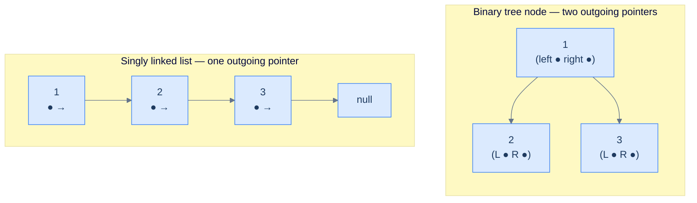
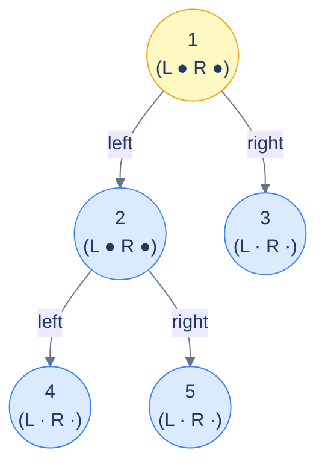
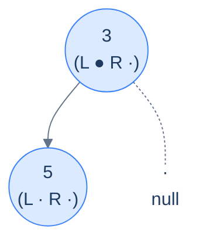
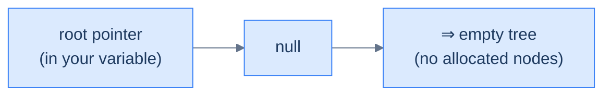

# 3. Linked-List Implementation of Binary Trees

## The Hook

Take a singly linked list. Each node holds a value and a `next` pointer. Now imagine that node had **two** outgoing pointers instead of one — a `left` and a `right`. Connect a few of those nodes together, and you've just built the bones of a binary tree.

That's the entire idea behind the linked-list (or "linked-node") representation: **a binary tree is a doubly-branching linked list**. Each node owns its own value, plus references to up-to-two child nodes. Missing children are marked with `null`. The whole tree is held together by a single reference to the *root* node — chase the pointers from there and you can reach every other node.

This representation is the *workhorse* of binary trees. Every textbook problem on LeetCode, every parser's AST, every DOM tree in every browser, every BST in every standard library — they all use this layout. Why? Because it's *shape-agnostic*: a skew tree of a million nodes uses exactly the same per-node memory as a perfect tree of a million nodes — `O(N)` either way. The array representation we just saw is dramatically more compact when the tree is *complete*, but it bleeds memory exponentially when the tree is unbalanced. The linked representation never bleeds — it just pays the constant per-node pointer overhead and gets on with life.

The trade-offs are predictable: **per-node memory is higher** (two extra pointers per node), **cache locality is worse** (each node is its own heap allocation, scattered across RAM), and **going from child to parent is O(height)** unless you also store a parent pointer. In return, you get *unlimited shape freedom* — you can sculpt the tree into any binary shape you want, insert and remove nodes anywhere, and never worry about index arithmetic.

This lesson defines the `TreeNode` type in 10 languages and shows how a tree assembles from nodes. Every lesson that follows in this chapter — recursive and iterative traversals, construction, insertion, all 11 patterns, the practice problems — uses the type defined here as its starting point. Get it right once and the rest of the chapter doesn't have to repeat it.

---

## Table of contents

1. [From singly linked list to binary tree](#from-singly-linked-list-to-binary-tree)
2. [Anatomy of a TreeNode](#anatomy-of-a-treenode)
3. [Defining TreeNode in 10 languages](#defining-treenode-in-10-languages)
4. [Assembling a tree from nodes](#assembling-a-tree-from-nodes)
5. [Memory layout — what it actually looks like](#memory-layout--what-it-actually-looks-like)
6. [The role of `null` and the root pointer](#the-role-of-null-and-the-root-pointer)

***

# From singly linked list to binary tree

Recall the singly linked list node from earlier in the course:

```text
ListNode { val, next }
```

`val` holds the data; `next` points to the *one* successor (or `null` if it's the tail). Because there's only one outgoing pointer, the data structure is one-dimensional — a single line of nodes.

A binary tree node is the same idea, generalised to *two* outgoing pointers:

```text
TreeNode { val, left, right }
```

That single change — one pointer to two — is enough to turn a flat list into a *two-dimensional* hierarchical structure. Now each node has *two* possible successors, and following one or the other branches the path you're on. Recurse this branching and you grow a tree.



<p align="center"><strong>The promotion from list to tree — the only structural change is doubling the outgoing pointers per node. The two child pointers are conventionally named <code>left</code> and <code>right</code>, and that left/right distinction is part of the tree's identity (not just a layout detail).</strong></p>

***

# Anatomy of a TreeNode

A `TreeNode` has exactly three pieces:

| Field    | Type                       | Purpose                                                |
|----------|----------------------------|--------------------------------------------------------|
| `val`    | the data type of the tree  | The value this node carries.                           |
| `left`   | reference to a `TreeNode`  | The left child (or `null` if absent).                  |
| `right`  | reference to a `TreeNode`  | The right child (or `null` if absent).                 |

```d2
n: TreeNode {
  grid-columns: 3
  grid-gap: 0
  l: "left (●)"
  v: "val"
  r: "right (●)"
}
```

<p align="center"><strong>The standard layout of a binary-tree node — value flanked by two child references. <code>null</code> in either slot means "no child on that side".</strong></p>

> **Why two pointers, even when only one child exists?** Because *which* child matters. A node with only a left child is a *different* tree from a node with only a right child — and many algorithms (inorder traversal, BST insertion, expression trees) depend on that distinction. The unused slot holds `null` rather than being omitted, so the slot's *position* tells you which side the existing child lives on.

***

# Defining TreeNode in 10 languages

Most of the rest of this chapter assumes the type definitions below. Each version exposes the same three fields and provides a small constructor. We follow the LeetCode-style convention used across the chapter: optional left/right that default to `null`.

```python run
class TreeNode:
    def __init__(self, val: int = 0, left: 'TreeNode | None' = None, right: 'TreeNode | None' = None):
        self.val   = val
        self.left  = left
        self.right = right

# Build a small tree:
#       1
#      / \
#     2   3
root = TreeNode(1, TreeNode(2), TreeNode(3))
print(root.val, root.left.val, root.right.val)   # 1 2 3
```

```java run
public class Main {
    static class TreeNode {
        int      val;
        TreeNode left, right;
        TreeNode()                                          { }
        TreeNode(int val)                                   { this.val = val; }
        TreeNode(int val, TreeNode left, TreeNode right)    { this.val = val; this.left = left; this.right = right; }
    }
    public static void main(String[] args) {
        TreeNode root = new TreeNode(1, new TreeNode(2), new TreeNode(3));
        System.out.println(root.val + " " + root.left.val + " " + root.right.val);
    }
}
```

```c run
#include <stdio.h>
#include <stdlib.h>

typedef struct TreeNode {
    int               val;
    struct TreeNode  *left;
    struct TreeNode  *right;
} TreeNode;

TreeNode* tn_new(int val) {
    TreeNode *n = malloc(sizeof(TreeNode));
    n->val = val; n->left = NULL; n->right = NULL;
    return n;
}

int main() {
    TreeNode *root = tn_new(1);
    root->left  = tn_new(2);
    root->right = tn_new(3);
    printf("%d %d %d\n", root->val, root->left->val, root->right->val);
    free(root->left); free(root->right); free(root);
}
```

```cpp run
#include <iostream>

struct TreeNode {
    int       val;
    TreeNode *left;
    TreeNode *right;
    TreeNode(int v = 0, TreeNode *l = nullptr, TreeNode *r = nullptr)
        : val(v), left(l), right(r) {}
};

int main() {
    TreeNode *root = new TreeNode(1, new TreeNode(2), new TreeNode(3));
    std::cout << root->val << " " << root->left->val << " " << root->right->val << "\n";
    delete root->left; delete root->right; delete root;
}
```

```scala run
class TreeNode(
    var value: Int            = 0,
    var left:  TreeNode = null,
    var right: TreeNode = null
)

object Main extends App {
  val root = new TreeNode(1, new TreeNode(2), new TreeNode(3))
  println(s"${root.value} ${root.left.value} ${root.right.value}")
}
```

```javascript run
class TreeNode {
    constructor(val = 0, left = null, right = null) {
        this.val   = val;
        this.left  = left;
        this.right = right;
    }
}

const root = new TreeNode(1, new TreeNode(2), new TreeNode(3));
console.log(root.val, root.left.val, root.right.val);
```

```typescript run
class TreeNode {
    val:   number;
    left:  TreeNode | null;
    right: TreeNode | null;
    constructor(val: number = 0, left: TreeNode | null = null, right: TreeNode | null = null) {
        this.val   = val;
        this.left  = left;
        this.right = right;
    }
}

const root = new TreeNode(1, new TreeNode(2), new TreeNode(3));
console.log(root.val, root.left!.val, root.right!.val);
```

```go run
package main
import "fmt"

type TreeNode struct {
    Val         int
    Left, Right *TreeNode
}

func main() {
    root := &TreeNode{Val: 1, Left: &TreeNode{Val: 2}, Right: &TreeNode{Val: 3}}
    fmt.Println(root.Val, root.Left.Val, root.Right.Val)
}
```

```kotlin run
class TreeNode(
    var value: Int             = 0,
    var left:  TreeNode? = null,
    var right: TreeNode? = null
)

fun main() {
    val root = TreeNode(1, TreeNode(2), TreeNode(3))
    println("${root.value} ${root.left?.value} ${root.right?.value}")
}
```

```rust run
// In safe Rust, child references are wrapped in Option<Box<...>>:
// Option to allow null, Box for heap allocation, so the recursive
// type has a finite size. This is the canonical idiom for owned trees.
#[derive(Debug)]
pub struct TreeNode {
    pub val:   i32,
    pub left:  Option<Box<TreeNode>>,
    pub right: Option<Box<TreeNode>>,
}

impl TreeNode {
    pub fn new(val: i32) -> Self {
        TreeNode { val, left: None, right: None }
    }
}

fn main() {
    let root = TreeNode {
        val:   1,
        left:  Some(Box::new(TreeNode::new(2))),
        right: Some(Box::new(TreeNode::new(3))),
    };
    let l = root.left.as_ref().unwrap().val;
    let r = root.right.as_ref().unwrap().val;
    println!("{} {} {}", root.val, l, r);
}
```


> **About Rust's `Option<Box<TreeNode>>`** — Rust forbids recursively-sized structs without indirection (the compiler can't compute "size of `TreeNode`" if it contains another `TreeNode` directly). `Box` provides the indirection by storing the child on the heap; `Option` provides the `null`-vs-`Some(...)` distinction. The combination is verbose to type but enforces *correctness by construction* — there's no way to accidentally dereference a null pointer or share ownership between parents.

***

# Assembling a tree from nodes

The constructor only creates *one* node at a time. To build a tree, allocate the nodes individually and stitch them together by assigning `left`/`right` references. Here's how to construct this tree:

```text
        1
       / \
      2   3
     / \
    4   5
```

Step by step:

```python run
# 1. allocate the leaves first (no children to wire)
n4 = TreeNode(4)
n5 = TreeNode(5)
n3 = TreeNode(3)

# 2. allocate the internal node and connect its children
n2 = TreeNode(2)
n2.left  = n4
n2.right = n5

# 3. allocate the root and connect it
root = TreeNode(1)
root.left  = n2
root.right = n3
```

The order doesn't matter (you could build top-down too — create `root` first, then assign children later). What *does* matter is that you only **hold on to the root** — every other node is reachable from there by following pointers, so the root is the single source of truth for the entire tree.



<p align="center"><strong>The wired-up tree — the root node holds the entire tree's identity. Lose the variable holding <code>root</code> and the whole tree becomes unreachable garbage. Every algorithm in the rest of this chapter starts from this root reference.</strong></p>

***

# Memory layout — what it actually looks like

The diagrams above show the tree as a clean hierarchy. *In RAM*, those nodes are scattered wherever the allocator decided to put them. The "tree shape" exists only in the pointers connecting the nodes, not in the addresses themselves.

```d2
direction: down

heap: "Heap memory (random addresses)" {
  grid-rows: 5
  grid-gap: 0
  n5: |md
    **@0x4180**

    val: 5

    L: null

    R: null
  |
  n1: |md
    **@0x4200**

    val: 1

    L: 0x4290

    R: 0x4310
  |
  n2: |md
    **@0x4290**

    val: 2

    L: 0x4250

    R: 0x4180
  |
  n4: |md
    **@0x4250**

    val: 4

    L: null

    R: null
  |
  n3: |md
    **@0x4310**

    val: 3

    L: null

    R: null
  |
}

heap.n1 -> heap.n2: "L" {style.stroke-dash: 3}
heap.n1 -> heap.n3: "R" {style.stroke-dash: 3}
heap.n2 -> heap.n4: "L" {style.stroke-dash: 3}
heap.n2 -> heap.n5: "R" {style.stroke-dash: 3}
```

<p align="center"><strong>The tree from the previous diagram, as it actually lives in memory — five nodes at unrelated addresses, the structure encoded entirely in the pointer fields. The "tree shape" exists only when you follow the pointers; from RAM's point of view, this is just five small heap blocks.</strong></p>

This non-locality is the *cost* the linked representation pays for its flexibility. Each parent-to-child step is potentially a cache miss — the CPU's prefetcher can't predict where the next node lives. For workloads dominated by tree *navigation* (lots of traversals, lots of lookups), this can be a meaningful slowdown vs. the array layout from the previous lesson. For workloads dominated by *structural mutation* (insertions, deletions, restructuring), the linked layout's flexibility wins.

***

# The role of `null` and the root pointer

Two `null`s play different roles in a binary tree. Don't confuse them.

## `null` child means "no child here"

A leaf node is *itself* a real, allocated node — it just has both `left` and `right` set to `null`. A node with only a left child has `right = null`. The presence of a `null` in a child slot tells *the caller* "stop recursing on this side".



<p align="center"><strong>A node with only one child — the absent <code>right</code> slot is <code>null</code>. The base case of every recursive tree algorithm is <em>checking for and handling <code>null</code> children</em>; getting that right is half the battle.</strong></p>

## `null` *root* means "empty tree"

Distinct from a `null` child slot, a `null` *root* means the tree has no nodes at all. Every algorithm that operates on a tree must handle this corner case — usually by returning early (size = 0, traversal = empty list, etc.) when the root is `null`.



<p align="center"><strong>An empty tree is represented by a <code>null</code> root reference. There are zero allocated nodes; nothing to walk; every algorithm must short-circuit when it sees this.</strong></p>

> *Predict before reading on — what should <code>height(null)</code> return?*
>
> Conventionally, **`-1`**. The reasoning: height counts edges, the height of a single-node tree is 0 (the root is also a leaf), and the recursive formula `height(n) = 1 + max(height(n.left), height(n.right))` works out to `0 = 1 + max(-1, -1)`. Defining `height(null) = -1` makes the recursion clean and uniform — no special case for leaves. (Some textbooks use `0` for empty and `1` for a single node — same idea, off-by-one shift. Pick one convention and stick to it.)

***

## Final Takeaway

The linked-node representation is the default workhorse of binary trees in real code. Three things to walk away with:

1. **A `TreeNode` is just three fields — `val`, `left`, `right`.** The structure is so minimal that you can re-derive it from memory in any language without looking it up. Once you've internalised that "a tree is a node plus two child references", every recursive algorithm in the rest of the chapter follows the *same* shape: handle the `null` base case, do something with the current node, recurse into both subtrees.
2. **Tree shape is in the pointers, not the addresses.** Nodes scatter freely in memory; what makes them a "tree" is the disciplined `left`/`right` linkage. This costs cache locality but buys total shape freedom — the data structure naturally accommodates skew, balance, sparse nodes, dense nodes, all with the same `O(N)` per-node memory.
3. **The root reference is the entire tree's identity.** Every algorithm starts from `root`. Every operation that allocates or destroys nodes must respect that — losing the root reference is losing the whole tree. Treat `root` like a precious resource: pass it down the recursion, but never let it become unreachable.

> *Coming up — with a node type defined, we can finally start <em>doing</em> things to trees. The next lesson covers the three classical recursive traversals: <strong>preorder</strong>, <strong>inorder</strong>, and <strong>postorder</strong>. Each is a three-line recursive function that visits every node once, and each uncovers the values in a different — and surprisingly useful — order.*
