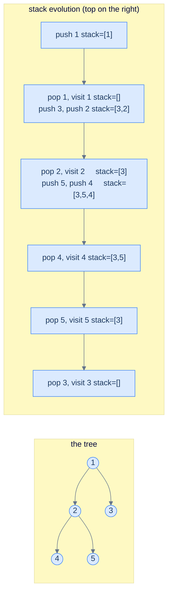
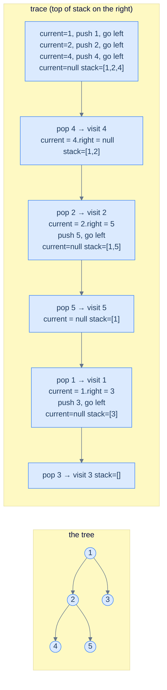
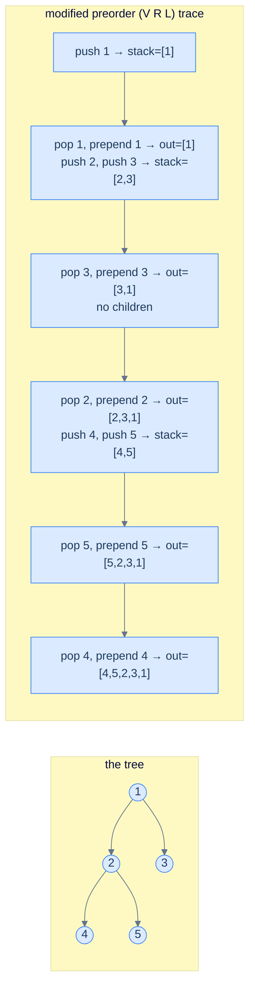
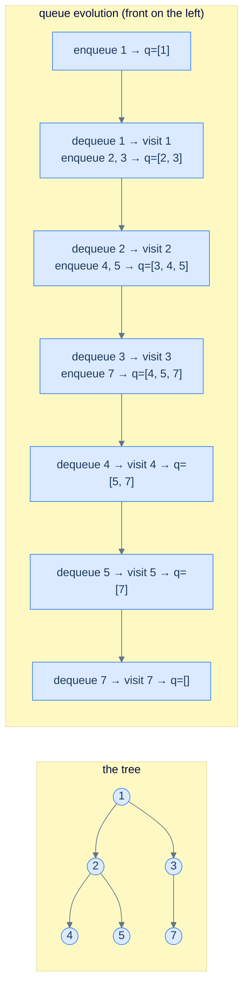

# 5. Iterative Traversals in Binary Trees

## The Hook

The recursive traversals from the last lesson are *beautiful* — three lines, no state, the tree's recursive shape mirrored exactly in the function's recursive shape. So why does this lesson exist?

Because **recursion is not free**. Every recursive call eats a frame on the **call stack** — a thread-local memory region the operating system gives every program. That stack is *small* by default: 1 MB on Linux, 512 KB on macOS, 1 MB on Windows for the main thread, much less for worker threads. A single stack frame is ~64 bytes. Do the arithmetic: a tree of height 16,000 will blow the stack on Linux. A *skew* tree of 16,000 nodes — a perfectly legal data structure — will *crash* the recursive traversal you just wrote.

Production code that processes user-supplied trees (parsers, deserialisers, deeply-nested JSON, network protocols) cannot afford this risk. The fix is to write the traversal **iteratively** — same algorithm, same output, but using an *explicit* stack we manage on the heap (which is gigabytes of headroom) instead of the call stack (which is megabytes). We trade a bit of code clarity for a guarantee that the algorithm tolerates *arbitrarily deep* trees without crashing.

Along the way, the iterative versions teach you something the recursive versions hide: **what the call stack actually is**. The recursion's "magic" turns out to be just a stack of pending work — and once you've simulated it explicitly, you understand recursion at a deeper level.

This lesson covers all four classical iterative traversals: **preorder, inorder, postorder** (each with an explicit stack), and the bonus **level-order** traversal (which uses a *queue* instead of a stack — and is what you reach for whenever a problem says "by level"). Implementations in 10 languages each.

---

## Table of contents

1. [Why iterative? — the call stack is small](#why-iterative--the-call-stack-is-small)
2. [Iterative preorder — the simplest one](#iterative-preorder--the-simplest-one)
3. [Iterative inorder — drain the left spine](#iterative-inorder--drain-the-left-spine)
4. [Iterative postorder — the elegant trick](#iterative-postorder--the-elegant-trick)
5. [Level-order traversal — using a queue](#level-order-traversal--using-a-queue)

***

# Why iterative? — the call stack is small

Every running thread in your program has a **call stack** — a fixed-size memory region used to track function calls. When a function `f` calls `g`, a *frame* for `g` is pushed onto the stack containing its local variables and return address. When `g` returns, its frame is popped and execution resumes in `f`. *Recursion* uses this same machinery — every recursive call pushes a frame; every base case + return pops one.

The catch is the stack's *size*. By default:

| Platform                    | Default main-thread stack |
|-----------------------------|---------------------------|
| Linux (most distros)        | 8 MB                      |
| macOS                       | 8 MB                      |
| Windows                     | 1 MB                      |
| Worker threads (most JVMs)  | 512 KB – 1 MB             |
| Browser JavaScript engines  | ~1 MB                     |

A typical stack frame for a tree traversal is around 64–128 bytes. Divide:

> **A 1 MB stack supports roughly 8,000–16,000 nested recursive calls.** A skewed binary tree of 50,000 nodes — which is *trivially* small — will blow it.

```d2
direction: right

cs: "Call stack — small (1-8 MB)" {
  grid-rows: 5
  grid-gap: 0
  f5: "frame: walk(node 16,000) — STACK OVERFLOW" {style.fill: "#fee2e2"; style.stroke: "#ef4444"}
  f4: "..."
  f3: "frame: walk(node 3)"
  f2: "frame: walk(node 2)"
  f1: "frame: walk(node 1)"
}

heap: "Heap stack — huge (gigabytes)" {
  grid-rows: 3
  grid-gap: 0
  h1: "explicit Stack of TreeNode"
  h2: "push, pop, peek"
  h3: "bounded only by free heap"
}
```

<p align="center"><strong>Two stacks, two scales — the call stack lives in a small fixed region; the explicit stack lives on the heap and grows as needed. Iterative traversals trade three clean lines of recursion for an explicit stack that survives deep trees.</strong></p>

The recursive form is fine for *known-bounded* trees (a parsed AST you produced yourself, a configured BST in a server with a tested depth). The iterative form is what you reach for when the input could come from anywhere — particularly anything user- or network-controlled.

***

# Iterative preorder — the simplest one

Of the three depth-first traversals, preorder is the easiest to convert to iterative form because *the visit happens first* — there's no "wait until later" complication.

## Algorithm

Push the root onto a stack. Then loop: pop a node, visit it, and push its children onto the stack — **right child first, then left child**. Because the stack is LIFO, the next iteration will pop the left child first, exactly mimicking the recursive "left before right" preference.

> **Algorithm**
>
> -   **Step 1:** Push the root onto a stack (if root is `null`, return).
> -   **Step 2:** While the stack is non-empty:
>     -   Pop the top node `n`.
>     -   Visit `n` (append `n.val` to output).
>     -   If `n.right` is non-null, push it.
>     -   If `n.left` is non-null, push it.



<p align="center"><strong>Trace of iterative preorder on the example tree — the visit order ends up <strong><code>1 → 2 → 4 → 5 → 3</code></strong>, identical to recursive preorder. Notice the right-child-first push: it's what makes the left child come out of the stack first.</strong></p>

> *Predict before reading on — what would happen if you pushed the <em>left</em> child before the <em>right</em> child?*
>
> The traversal would visit nodes in the *mirror* order — root, then *right* subtree (preorder), then *left* subtree (preorder). That's a perfectly valid traversal too (sometimes called "reverse preorder" or "right-first preorder"), useful for printing trees right-to-left or for one of the postorder tricks below. The key insight: a stack reverses the order you put things in, so to get "left first" out, push "right first" in.

## Implementation


```pseudocode
function preorderIter(root):
    if root = null: return empty list
    out ← empty list
    stack ← empty stack
    push root to stack
    while stack is not empty:
        n ← pop from stack
        append n.val to out
        if n.right ≠ null: push n.right to stack   # right first
        if n.left  ≠ null: push n.left  to stack   # so left pops next
    return out
```

```python run
from typing import List, Optional

class TreeNode:
    def __init__(self, val=0, left=None, right=None):
        self.val, self.left, self.right = val, left, right

def preorder_iter(root: Optional[TreeNode]) -> List[int]:
    if root is None: return []
    out: List[int] = []
    stack = [root]
    while stack:
        n = stack.pop()
        out.append(n.val)
        if n.right: stack.append(n.right)   # right first
        if n.left:  stack.append(n.left)    # so left is on top
    return out

# tree:    1
#         / \
#        2   3
#       / \
#      4   5
root = TreeNode(1, TreeNode(2, TreeNode(4), TreeNode(5)), TreeNode(3))
print(preorder_iter(root))   # [1, 2, 4, 5, 3]
```

```java run
import java.util.*;
public class Main {
    static class TreeNode {
        int val; TreeNode left, right;
        TreeNode(int v) { val = v; }
        TreeNode(int v, TreeNode l, TreeNode r) { val = v; left = l; right = r; }
    }
    public static List<Integer> preorderIter(TreeNode root) {
        List<Integer> out = new ArrayList<>();
        if (root == null) return out;
        Deque<TreeNode> stack = new ArrayDeque<>();
        stack.push(root);
        while (!stack.isEmpty()) {
            TreeNode n = stack.pop();
            out.add(n.val);
            if (n.right != null) stack.push(n.right);
            if (n.left  != null) stack.push(n.left);
        }
        return out;
    }
    public static void main(String[] args) {
        TreeNode root = new TreeNode(1, new TreeNode(2, new TreeNode(4), new TreeNode(5)), new TreeNode(3));
        System.out.println(preorderIter(root));
    }
}
```

```c run
#include <stdio.h>
#include <stdlib.h>

typedef struct TreeNode { int val; struct TreeNode *left, *right; } TreeNode;

static TreeNode* mk(int v, TreeNode *l, TreeNode *r) {
    TreeNode *n = malloc(sizeof(*n)); n->val = v; n->left = l; n->right = r; return n;
}

int main() {
    TreeNode *root = mk(1, mk(2, mk(4, NULL, NULL), mk(5, NULL, NULL)), mk(3, NULL, NULL));

    TreeNode *stk[64]; int top = -1;
    int out[64], k = 0;
    if (root) stk[++top] = root;
    while (top >= 0) {
        TreeNode *n = stk[top--];
        out[k++] = n->val;
        if (n->right) stk[++top] = n->right;
        if (n->left)  stk[++top] = n->left;
    }
    for (int i = 0; i < k; i++) printf("%d ", out[i]);
    printf("\n");
}
```

```cpp run
#include <iostream>
#include <stack>
#include <vector>

struct TreeNode {
    int val; TreeNode *left, *right;
    TreeNode(int v, TreeNode *l = nullptr, TreeNode *r = nullptr) : val(v), left(l), right(r) {}
};

std::vector<int> preorderIter(TreeNode *root) {
    std::vector<int> out;
    if (!root) return out;
    std::stack<TreeNode*> stk;
    stk.push(root);
    while (!stk.empty()) {
        TreeNode *n = stk.top(); stk.pop();
        out.push_back(n->val);
        if (n->right) stk.push(n->right);
        if (n->left)  stk.push(n->left);
    }
    return out;
}

int main() {
    auto root = new TreeNode(1, new TreeNode(2, new TreeNode(4), new TreeNode(5)), new TreeNode(3));
    for (int v : preorderIter(root)) std::cout << v << " ";
    std::cout << "\n";
}
```

```scala run
import scala.collection.mutable

class TreeNode(var value: Int, var left: TreeNode = null, var right: TreeNode = null)

object Main extends App {
  def preorderIter(root: TreeNode): List[Int] = {
    if (root == null) return Nil
    val out = mutable.ListBuffer[Int]()
    val stk = mutable.Stack[TreeNode](root)
    while (stk.nonEmpty) {
      val n = stk.pop()
      out += n.value
      if (n.right != null) stk.push(n.right)
      if (n.left  != null) stk.push(n.left)
    }
    out.toList
  }

  val root = new TreeNode(1, new TreeNode(2, new TreeNode(4), new TreeNode(5)), new TreeNode(3))
  println(preorderIter(root))
}
```

```typescript run
class TreeNode {
    val: number;
    left: TreeNode | null;
    right: TreeNode | null;
    constructor(val = 0, left: TreeNode | null = null, right: TreeNode | null = null) {
        this.val = val; this.left = left; this.right = right;
    }
}

function preorderIter(root: TreeNode | null): number[] {
    const out: number[] = [];
    if (!root) return out;
    const stk: TreeNode[] = [root];
    while (stk.length) {
        const n = stk.pop()!;
        out.push(n.val);
        if (n.right) stk.push(n.right);
        if (n.left)  stk.push(n.left);
    }
    return out;
}

const root = new TreeNode(1, new TreeNode(2, new TreeNode(4), new TreeNode(5)), new TreeNode(3));
console.log(preorderIter(root));
```

```go run
package main
import "fmt"

type TreeNode struct {
    Val         int
    Left, Right *TreeNode
}

func preorderIter(root *TreeNode) []int {
    var out []int
    if root == nil { return out }
    stk := []*TreeNode{root}
    for len(stk) > 0 {
        n   := stk[len(stk)-1]
        stk  = stk[:len(stk)-1]
        out  = append(out, n.Val)
        if n.Right != nil { stk = append(stk, n.Right) }
        if n.Left  != nil { stk = append(stk, n.Left) }
    }
    return out
}

func main() {
    root := &TreeNode{Val: 1,
        Left:  &TreeNode{Val: 2, Left: &TreeNode{Val: 4}, Right: &TreeNode{Val: 5}},
        Right: &TreeNode{Val: 3}}
    fmt.Println(preorderIter(root))
}
```

```rust run
#[derive(Debug)]
pub struct TreeNode {
    pub val:   i32,
    pub left:  Option<Box<TreeNode>>,
    pub right: Option<Box<TreeNode>>,
}

pub fn preorder_iter(root: &Option<Box<TreeNode>>) -> Vec<i32> {
    let mut out = Vec::new();
    let mut stk: Vec<&Box<TreeNode>> = Vec::new();
    if let Some(r) = root { stk.push(r); }
    while let Some(n) = stk.pop() {
        out.push(n.val);
        if let Some(r) = &n.right { stk.push(r); }
        if let Some(l) = &n.left  { stk.push(l); }
    }
    out
}

fn main() {
    let l4 = Some(Box::new(TreeNode { val: 4, left: None, right: None }));
    let l5 = Some(Box::new(TreeNode { val: 5, left: None, right: None }));
    let l3 = Some(Box::new(TreeNode { val: 3, left: None, right: None }));
    let n2 = Some(Box::new(TreeNode { val: 2, left: l4,   right: l5 }));
    let root = Some(Box::new(TreeNode { val: 1, left: n2, right: l3 }));
    println!("{:?}", preorder_iter(&root));
}
```


## Complexity

Each node pushed once, popped once → **O(N) time**. Stack holds at most *height* of nodes at any moment (along one root-to-leaf path) → **O(h) space**. Same as recursive — but the space is on the heap, where there's lots of room.

***

# Iterative inorder — drain the left spine

Inorder is harder. The visit happens *between* the left and right recursive calls, so we need to defer it: walk all the way down the left spine first (pushing each node we pass), then visit-and-pivot at each pop.

## Algorithm

Maintain a `current` pointer (where we are now, may be `null`) and a stack (nodes whose left subtree we've already descended into and whose visit is *pending*).

> **Algorithm**
>
> -   **Step 1:** Initialise `current = root`, empty stack.
> -   **Step 2:** While `current` is non-null *or* the stack is non-empty:
>     -   **Inner loop:** While `current` is non-null, push it and move `current = current.left`.
>     -   When `current` is null, pop a node, visit it, and set `current = popped.right`.

The inner loop drains the left spine; the outer loop pivots to the right subtree once we've drained.



<p align="center"><strong>Trace of iterative inorder — output sequence <strong><code>4 → 2 → 5 → 1 → 3</code></strong>. The "drain the left spine, then pivot right" pattern is the iterative analogue of "recurse fully into left, visit, then recurse into right".</strong></p>

## Implementation


```pseudocode
function inorderIter(root):
    out ← empty list
    stk ← empty stack
    cur ← root
    while cur ≠ null OR stk is not empty:
        while cur ≠ null:       # descend left, stacking each node
            push cur to stk
            cur ← cur.left
        cur ← pop from stk      # process leftmost unvisited node
        append cur.val to out
        cur ← cur.right         # pivot to right subtree
    return out
```

```python run
def inorder_iter(root):
    out, stk, cur = [], [], root
    while cur or stk:
        while cur:
            stk.append(cur)
            cur = cur.left
        cur = stk.pop()
        out.append(cur.val)
        cur = cur.right
    return out
```

```java run
public static List<Integer> inorderIter(TreeNode root) {
    List<Integer> out = new ArrayList<>();
    Deque<TreeNode> stk = new ArrayDeque<>();
    TreeNode cur = root;
    while (cur != null || !stk.isEmpty()) {
        while (cur != null) {
            stk.push(cur);
            cur = cur.left;
        }
        cur = stk.pop();
        out.add(cur.val);
        cur = cur.right;
    }
    return out;
}
```

```c run
// (assume mk(), TreeNode as above)
int* inorder_iter(TreeNode *root, int *count) {
    static int out[64]; int k = 0;
    TreeNode *stk[64]; int top = -1;
    TreeNode *cur = root;
    while (cur || top >= 0) {
        while (cur) {
            stk[++top] = cur;
            cur = cur->left;
        }
        cur = stk[top--];
        out[k++] = cur->val;
        cur = cur->right;
    }
    *count = k;
    return out;
}
```

```cpp run
std::vector<int> inorderIter(TreeNode *root) {
    std::vector<int> out;
    std::stack<TreeNode*> stk;
    TreeNode *cur = root;
    while (cur || !stk.empty()) {
        while (cur) {
            stk.push(cur);
            cur = cur->left;
        }
        cur = stk.top(); stk.pop();
        out.push_back(cur->val);
        cur = cur->right;
    }
    return out;
}
```

```scala run
def inorderIter(root: TreeNode): List[Int] = {
  val out = scala.collection.mutable.ListBuffer[Int]()
  val stk = scala.collection.mutable.Stack[TreeNode]()
  var cur = root
  while (cur != null || stk.nonEmpty) {
    while (cur != null) {
      stk.push(cur)
      cur = cur.left
    }
    cur = stk.pop()
    out += cur.value
    cur = cur.right
  }
  out.toList
}
```

```typescript run
function inorderIter(root: TreeNode | null): number[] {
    const out: number[] = [];
    const stk: TreeNode[] = [];
    let cur: TreeNode | null = root;
    while (cur || stk.length) {
        while (cur) {
            stk.push(cur);
            cur = cur.left;
        }
        cur = stk.pop()!;
        out.push(cur.val);
        cur = cur.right;
    }
    return out;
}
```

```go run
func inorderIter(root *TreeNode) []int {
    var out []int
    var stk []*TreeNode
    cur := root
    for cur != nil || len(stk) > 0 {
        for cur != nil {
            stk = append(stk, cur)
            cur = cur.Left
        }
        cur  = stk[len(stk)-1]
        stk  = stk[:len(stk)-1]
        out  = append(out, cur.Val)
        cur  = cur.Right
    }
    return out
}
```

```rust run
pub fn inorder_iter(root: &Option<Box<TreeNode>>) -> Vec<i32> {
    let mut out = Vec::new();
    let mut stk: Vec<&Box<TreeNode>> = Vec::new();
    let mut cur = root.as_ref();
    while cur.is_some() || !stk.is_empty() {
        while let Some(n) = cur {
            stk.push(n);
            cur = n.left.as_ref();
        }
        let n = stk.pop().unwrap();
        out.push(n.val);
        cur = n.right.as_ref();
    }
    out
}
```


## Complexity

**O(N) time, O(h) space** — same as recursive.

***

# Iterative postorder — the elegant trick

Postorder is the trickiest because you can't visit a node until *both* of its children have been processed. There are two clean approaches; we'll cover both.

## Approach 1 (recommended) — reverse-of-modified-preorder

Here's the elegant insight:

> **Postorder (L R V)** is the **reverse** of **modified-preorder (V R L)**.

That is, if you do a *preorder* traversal but visit the **right subtree before the left**, then reverse the output, you get postorder. Why? Because reversing `V R L` element-wise gives `L R V` — exactly postorder. So we run an iterative preorder with right-first, prepend each visit to the output (or append and reverse at the end), and we're done.

```text
preorder of root visits         V R L → 1 3 2 5 4
reverse                         L R V → 4 5 2 3 1
this IS the postorder!
```

> **Algorithm (reverse-of-modified-preorder)**
>
> -   **Step 1:** Push root onto stack (handle empty case).
> -   **Step 2:** While stack non-empty:
>     -   Pop `n`. Insert `n.val` at the **front** of output (or append and reverse later).
>     -   If `n.left`  is non-null, push it.
>     -   If `n.right` is non-null, push it.
>
> The push order is the *reverse* of the preorder version (left first, so right comes out first).

This is *much* simpler than the "single-stack with state-tracking" approach the original lesson uses, and uses no extra bookkeeping per node.



<p align="center"><strong>Trace — modified preorder visits in order <code>1, 3, 2, 5, 4</code>; prepending each gives <code>4, 5, 2, 3, 1</code> — the postorder of the tree. One stack, no per-node state, no node-pushed-twice trick. The reverse turns the algorithm inside-out.</strong></p>

## Approach 2 (alternative) — the "push twice" approach

The original CodeIntuition approach pushes each node onto the stack *twice* — once to mark "right subtree pending", once to mark "visit pending". When you pop a node, if the next item on the stack is the same node, you know it's the first pop (so descend right); otherwise it's the second pop (so visit). This works but doubles the stack usage and adds a conditional. The reverse-preorder approach above is cleaner; we mention this for completeness only.

## Implementation (Approach 1)

We'll push the values onto the output and reverse once at the end — *appending* is O(1) while *prepending* a list/vector is O(N). For Python's `deque` you can use `appendleft` directly.


```pseudocode
function postorderIter(root):
    if root = null: return empty list
    out ← empty deque
    stk ← empty stack
    push root to stk
    while stk is not empty:
        n ← pop from stk
        prepend n.val to out        # V R L order reversed → L R V
        if n.left  ≠ null: push n.left  to stk
        if n.right ≠ null: push n.right to stk
    return out as list
```

```python run
from collections import deque

def postorder_iter(root):
    if root is None: return []
    out = deque()
    stk = [root]
    while stk:
        n = stk.pop()
        out.appendleft(n.val)             # prepend = same as reverse-of-append
        if n.left:  stk.append(n.left)    # left first (so right comes off the stack first → V R L)
        if n.right: stk.append(n.right)
    return list(out)
```

```java run
public static List<Integer> postorderIter(TreeNode root) {
    LinkedList<Integer> out = new LinkedList<>();
    if (root == null) return out;
    Deque<TreeNode> stk = new ArrayDeque<>();
    stk.push(root);
    while (!stk.isEmpty()) {
        TreeNode n = stk.pop();
        out.addFirst(n.val);                 // prepend
        if (n.left  != null) stk.push(n.left);
        if (n.right != null) stk.push(n.right);
    }
    return out;
}
```

```c run
int* postorder_iter(TreeNode *root, int *count) {
    static int out[64]; int k = 0;
    TreeNode *stk[64]; int top = -1;
    if (root) stk[++top] = root;
    while (top >= 0) {
        TreeNode *n = stk[top--];
        out[k++] = n->val;
        if (n->left)  stk[++top] = n->left;
        if (n->right) stk[++top] = n->right;
    }
    // reverse
    for (int i = 0, j = k - 1; i < j; i++, j--) {
        int t = out[i]; out[i] = out[j]; out[j] = t;
    }
    *count = k;
    return out;
}
```

```cpp run
#include <algorithm>

std::vector<int> postorderIter(TreeNode *root) {
    std::vector<int> out;
    if (!root) return out;
    std::stack<TreeNode*> stk;
    stk.push(root);
    while (!stk.empty()) {
        TreeNode *n = stk.top(); stk.pop();
        out.push_back(n->val);
        if (n->left)  stk.push(n->left);
        if (n->right) stk.push(n->right);
    }
    std::reverse(out.begin(), out.end());
    return out;
}
```

```scala run
def postorderIter(root: TreeNode): List[Int] = {
  if (root == null) return Nil
  val out = scala.collection.mutable.ListBuffer[Int]()
  val stk = scala.collection.mutable.Stack[TreeNode](root)
  while (stk.nonEmpty) {
    val n = stk.pop()
    out.prepend(n.value)
    if (n.left  != null) stk.push(n.left)
    if (n.right != null) stk.push(n.right)
  }
  out.toList
}
```

```typescript run
function postorderIter(root: TreeNode | null): number[] {
    const out: number[] = [];
    if (!root) return out;
    const stk: TreeNode[] = [root];
    while (stk.length) {
        const n = stk.pop()!;
        out.push(n.val);
        if (n.left)  stk.push(n.left);
        if (n.right) stk.push(n.right);
    }
    return out.reverse();
}
```

```go run
func postorderIter(root *TreeNode) []int {
    var out []int
    if root == nil { return out }
    stk := []*TreeNode{root}
    for len(stk) > 0 {
        n   := stk[len(stk)-1]
        stk  = stk[:len(stk)-1]
        out  = append(out, n.Val)
        if n.Left  != nil { stk = append(stk, n.Left) }
        if n.Right != nil { stk = append(stk, n.Right) }
    }
    // reverse
    for i, j := 0, len(out)-1; i < j; i, j = i+1, j-1 {
        out[i], out[j] = out[j], out[i]
    }
    return out
}
```

```rust run
pub fn postorder_iter(root: &Option<Box<TreeNode>>) -> Vec<i32> {
    let mut out = Vec::new();
    let mut stk: Vec<&Box<TreeNode>> = Vec::new();
    if let Some(r) = root { stk.push(r); }
    while let Some(n) = stk.pop() {
        out.push(n.val);
        if let Some(l) = &n.left  { stk.push(l); }
        if let Some(r) = &n.right { stk.push(r); }
    }
    out.reverse();
    out
}
```


## Complexity

**O(N) time** (every node pushed and popped once; the reverse at the end is O(N)). **O(h) space** for the stack, plus O(N) for the output (which is unavoidable).

***

# Level-order traversal — using a queue

The fourth traversal is structurally different — it visits nodes **breadth-first**, level by level, left to right within each level.

```text
        1                  level 0:  1
       / \
      2   3                level 1:  2, 3
     / \   \
    4   5   7              level 2:  4, 5, 7

level-order: [1, 2, 3, 4, 5, 7]
```

The depth-first traversals all used a **stack** (LIFO) — implicitly via recursion or explicitly via an iterative stack. Level-order uses a **queue** (FIFO). The intuition: at any moment, the queue holds *the next nodes to visit, in the order we'll visit them*. Pop from the front, enqueue children at the back, and the FIFO discipline naturally produces level-by-level visit order.

This algorithm has a name in the wider algorithms world: **breadth-first search** (BFS). The same machinery works on graphs, on grids, on game-state spaces. Level-order is BFS specialised to trees.

## Algorithm

> **Algorithm**
>
> -   **Step 1:** Initialise a queue containing just `root` (if root is null, return).
> -   **Step 2:** While queue is non-empty:
>     -   Dequeue a node `n`.
>     -   Visit `n`.
>     -   If `n.left` is non-null, enqueue it.
>     -   If `n.right` is non-null, enqueue it.



<p align="center"><strong>Trace of level-order — output <strong><code>1 → 2 → 3 → 4 → 5 → 7</code></strong>. Every level is fully drained from the queue before the next level starts to drain, because we always enqueue children to the back and dequeue from the front. The FIFO discipline <em>is</em> the level-by-level structure.</strong></p>

> **Why a queue and not a stack?** A stack would visit one branch all the way down before backtracking — that's depth-first, which is precisely what level-order is *not*. Swap the queue for a stack and you'd get a (slightly different) preorder traversal. The choice of container is the choice of traversal *family* — DFS uses stacks, BFS uses queues.

## Implementation


```pseudocode
function levelOrder(root):
    if root = null: return empty list
    out ← empty list
    q   ← empty queue
    enqueue root to q
    while q is not empty:
        n ← dequeue from q
        append n.val to out
        if n.left  ≠ null: enqueue n.left  to q
        if n.right ≠ null: enqueue n.right to q
    return out
```

```python run
from collections import deque

def level_order(root):
    out = []
    if root is None: return out
    q = deque([root])
    while q:
        n = q.popleft()
        out.append(n.val)
        if n.left:  q.append(n.left)
        if n.right: q.append(n.right)
    return out

# tree:    1
#         / \
#        2   3
#       / \   \
#      4   5   7
root = TreeNode(1, TreeNode(2, TreeNode(4), TreeNode(5)), TreeNode(3, None, TreeNode(7)))
print(level_order(root))   # [1, 2, 3, 4, 5, 7]
```

```java run
public static List<Integer> levelOrder(TreeNode root) {
    List<Integer> out = new ArrayList<>();
    if (root == null) return out;
    Queue<TreeNode> q = new ArrayDeque<>();
    q.offer(root);
    while (!q.isEmpty()) {
        TreeNode n = q.poll();
        out.add(n.val);
        if (n.left  != null) q.offer(n.left);
        if (n.right != null) q.offer(n.right);
    }
    return out;
}
```

```c run
// Simple ring-buffer queue for the demo
int* level_order(TreeNode *root, int *count) {
    static int out[64]; int k = 0;
    TreeNode *q[64]; int head = 0, tail = 0;
    if (root) q[tail++] = root;
    while (head < tail) {
        TreeNode *n = q[head++];
        out[k++] = n->val;
        if (n->left)  q[tail++] = n->left;
        if (n->right) q[tail++] = n->right;
    }
    *count = k;
    return out;
}
```

```cpp run
#include <queue>

std::vector<int> levelOrder(TreeNode *root) {
    std::vector<int> out;
    if (!root) return out;
    std::queue<TreeNode*> q;
    q.push(root);
    while (!q.empty()) {
        TreeNode *n = q.front(); q.pop();
        out.push_back(n->val);
        if (n->left)  q.push(n->left);
        if (n->right) q.push(n->right);
    }
    return out;
}
```

```scala run
def levelOrder(root: TreeNode): List[Int] = {
  val out = scala.collection.mutable.ListBuffer[Int]()
  if (root == null) return Nil
  val q   = scala.collection.mutable.Queue[TreeNode](root)
  while (q.nonEmpty) {
    val n = q.dequeue()
    out += n.value
    if (n.left  != null) q.enqueue(n.left)
    if (n.right != null) q.enqueue(n.right)
  }
  out.toList
}
```

```typescript run
function levelOrder(root: TreeNode | null): number[] {
    const out: number[] = [];
    if (!root) return out;
    const q: TreeNode[] = [root];
    while (q.length) {
        const n = q.shift()!;
        out.push(n.val);
        if (n.left)  q.push(n.left);
        if (n.right) q.push(n.right);
    }
    return out;
}
```

```go run
func levelOrder(root *TreeNode) []int {
    var out []int
    if root == nil { return out }
    q := []*TreeNode{root}
    for len(q) > 0 {
        n   := q[0]
        q    = q[1:]
        out  = append(out, n.Val)
        if n.Left  != nil { q = append(q, n.Left) }
        if n.Right != nil { q = append(q, n.Right) }
    }
    return out
}
```

```rust run
use std::collections::VecDeque;

pub fn level_order(root: &Option<Box<TreeNode>>) -> Vec<i32> {
    let mut out = Vec::new();
    let mut q: VecDeque<&Box<TreeNode>> = VecDeque::new();
    if let Some(r) = root { q.push_back(r); }
    while let Some(n) = q.pop_front() {
        out.push(n.val);
        if let Some(l) = &n.left  { q.push_back(l); }
        if let Some(r) = &n.right { q.push_back(r); }
    }
    out
}
```


## Complexity

Each node enqueued and dequeued once → **O(N) time**. Queue holds at most one *level's* worth of nodes at a time → **O(W) space**, where `W` is the *maximum width* of the tree. For a perfect binary tree of `N` nodes, the bottom level holds about `N/2` nodes, so worst-case **O(N) space**. For a skew tree, width is 1 and space is O(1) — the *opposite* trade-off from depth-first traversals (which used O(h) space — small for skew, large for balanced).

> **Important comparison:** DFS uses O(h) space — best for **wide, shallow** trees. BFS uses O(W) space — best for **tall, narrow** trees. For balanced trees the two are roughly equivalent.

***

## Final Takeaway

Iterative traversals are the production-grade siblings of the recursive ones. Same outputs, different mechanism, different trade-offs. Three things to walk away with:

1. **Stack vs. queue is the entire DFS-vs-BFS distinction.** Swap the container in any traversal and you swap traversal *families*. Stack → DFS (preorder, inorder, postorder all variants). Queue → BFS (level-order). Memorise this — it's one of the deepest unifying ideas in algorithms, and it generalises straight from trees to graphs.
2. **Postorder gets simpler when you flip it.** The `L R V` ordering is the *reverse* of `V R L` — a modified preorder traversal that reverses left/right. Don't reach for the "push-twice" hack; reach for the reverse-of-modified-preorder trick. Clean, no per-node state, easy to remember.
3. **Iterative trades clarity for safety.** Recursive code is *much* easier to read; iterative code never blows the call stack. In a coding interview where the input is bounded and friendly, recursion is fine. In production code where the input could be adversarial (deeply nested user data, parsed protocols, untrusted JSON), iterative is mandatory. Pick based on the threat model, not on what *looks* nicer.

> *Coming up — now that we can <em>read</em> trees in any order, the next lesson tackles the inverse: <strong>building trees from traversal sequences</strong>. Given just two orderings (typically <em>preorder + inorder</em> or <em>postorder + inorder</em>), can we reconstruct the unique tree that produced them? The answer is yes — and the construction is one of the prettiest divide-and-conquer algorithms in the entire course.*
