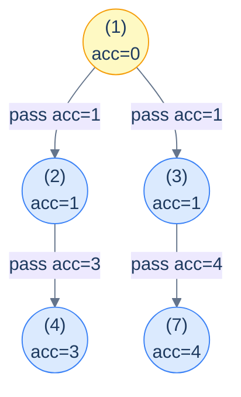
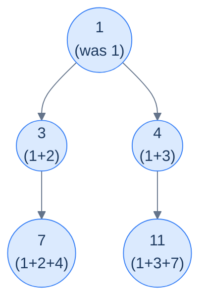
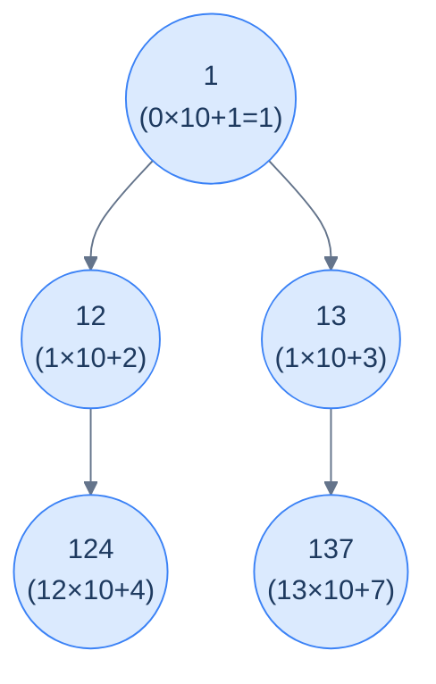
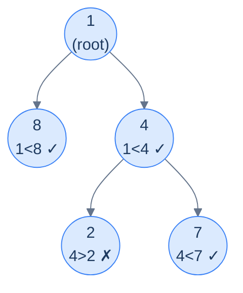

# 8. Pattern: Preorder Traversal (Stateless)

## The Hook

You're standing at the root of a binary tree, and you want every node to know something about *its ancestry* — the sum of all values on the path from the root to it, the depth at which it sits, the concatenation of all the values above it. The information *flows downward*: each node gets *its parent's accumulated answer*, applies a small update, and passes the new accumulation to its children.

That single shape — *parent accumulates, hands to children, children continue* — is the **stateless preorder pattern**. It's the most common recipe in the entire binary-tree section. Once you spot it, the implementation is mechanical: a recursive preorder traversal that carries an extra parameter (the *accumulator*) down through the recursion, and each node uses the accumulator passed in from its parent.

Why "stateless"? Because **no information needs to be shared between siblings or come back up the recursion**. Each subtree gets its own copy of the accumulator from its parent, modifies it independently, and the modifications don't leak across siblings. There's no mutable global, no return value to propagate, no "fix this on the way back up". The recursion goes one way — *down* — and you're done.

This pattern handles a *huge* range of problems: path sums, depth assignment, ancestry checks, root-to-node aggregations, ancestor-dependent computations. Once you've seen four or five examples, you'll recognise the shape on sight. This lesson gives you the recipe, the four canonical example problems, and clean implementations for each in 10 languages.

---

## Table of contents

1. [The stateless preorder pattern](#the-stateless-preorder-pattern)
2. [How to recognise it](#how-to-recognise-it)
3. [Problem 1 — Sum of path](#problem-1--sum-of-path)
4. [Problem 2 — Depth assignment](#problem-2--depth-assignment)
5. [Problem 3 — Concatenated path](#problem-3--concatenated-path)
6. [Problem 4 — Increasing path](#problem-4--increasing-path)

***

# The stateless preorder pattern

The pattern in pseudocode:

```text
preorder(node, accumulator):
  if node is null: return
  process(node, accumulator)                           # use the accumulator
  newAccumulator = update(accumulator, node.val)       # combine with this node
  preorder(node.left,  newAccumulator)                 # hand to left child
  preorder(node.right, newAccumulator)                 # hand to right child
```

The accumulator is *passed by value* (or as an immutable reference) down the recursion. Each child receives a *copy* — so changes one subtree makes never affect the other. There's no need for "back out" cleanup because there's nothing to clean up: the parent's value is already saved on its own stack frame, untouched.



<p align="center"><strong>Stateless preorder data flow — each node updates the accumulator with its own value <em>before</em> passing it to its children. The arrows on the edges show what each child receives. Notice both children of a node receive the <em>same</em> updated accumulator — the parent's contribution is included exactly once.</strong></p>

> **Why "stateless"?** Because the algorithm doesn't carry mutable state across recursive calls. Sibling subtrees see each other's work *not at all* — they each get a fresh copy of the parent's accumulator. Compare this with the *stateful* preorder pattern (next lesson), which uses a single shared mutable accumulator that needs explicit "undo" steps when a sibling subtree is finished.

## Generic pattern in 10 languages


```pseudocode
function f(acc, val):
    return acc + val               # replace with the real combiner for each problem

function statelessPreorder(node, acc):
    if node = null: return
    # use acc to process node here if needed
    newAcc ← f(acc, node.val)      # fold this node's value into the accumulator
    statelessPreorder(node.left,  newAcc)
    statelessPreorder(node.right, newAcc)
```

```python run
from typing import Optional

class TreeNode:
    def __init__(self, val=0, left=None, right=None):
        self.val, self.left, self.right = val, left, right

def f(acc, val):                       # combine the parent's acc with this node's value
    return acc + val                   # placeholder — replace with real combiner

def stateless_preorder(root: Optional[TreeNode], acc=0):
    if root is None: return
    # ... use acc here to process root if needed ...
    new_acc = f(acc, root.val)
    stateless_preorder(root.left,  new_acc)
    stateless_preorder(root.right, new_acc)
```

```java run
static int f(int acc, int val) { return acc + val; }
static void statelessPreorder(TreeNode node, int acc) {
    if (node == null) return;
    // ... use acc to process node ...
    int newAcc = f(acc, node.val);
    statelessPreorder(node.left,  newAcc);
    statelessPreorder(node.right, newAcc);
}
```

```c run
int f(int acc, int val) { return acc + val; }
void stateless_preorder(TreeNode *node, int acc) {
    if (!node) return;
    int new_acc = f(acc, node->val);
    stateless_preorder(node->left,  new_acc);
    stateless_preorder(node->right, new_acc);
}
```

```cpp run
int f(int acc, int val) { return acc + val; }
void statelessPreorder(TreeNode *node, int acc) {
    if (!node) return;
    int newAcc = f(acc, node->val);
    statelessPreorder(node->left,  newAcc);
    statelessPreorder(node->right, newAcc);
}
```

```scala run
def f(acc: Int, value: Int): Int = acc + value
def statelessPreorder(node: TreeNode, acc: Int): Unit = {
  if (node == null) return
  val newAcc = f(acc, node.value)
  statelessPreorder(node.left,  newAcc)
  statelessPreorder(node.right, newAcc)
}
```

```typescript run
const f = (acc: number, val: number): number => acc + val;
function statelessPreorder(node: TreeNode | null, acc: number = 0): void {
    if (!node) return;
    const newAcc = f(acc, node.val);
    statelessPreorder(node.left,  newAcc);
    statelessPreorder(node.right, newAcc);
}
```

```go run
func f(acc, val int) int { return acc + val }
func statelessPreorder(node *TreeNode, acc int) {
    if node == nil { return }
    newAcc := f(acc, node.Val)
    statelessPreorder(node.Left,  newAcc)
    statelessPreorder(node.Right, newAcc)
}
```

```rust run
fn f(acc: i32, val: i32) -> i32 { acc + val }
fn stateless_preorder(node: &Option<Box<TreeNode>>, acc: i32) {
    if let Some(n) = node {
        let new_acc = f(acc, n.val);
        stateless_preorder(&n.left,  new_acc);
        stateless_preorder(&n.right, new_acc);
    }
}
```


## Complexity

> **Time:** O(N) — every node is visited exactly once. **Space:** O(h) for the recursion stack.

***

# How to recognise it

A problem fits this pattern if **every node's answer depends only on the path from the root to it** — and that dependency is *summarisable* by a small piece of data (a sum, a max, a depth, a string, a flag) that can be computed *incrementally* as the recursion descends.

Look for verb phrases like:

- *"For each node, compute … from root to that node"*
- *"For each node, the value of … on the path above it"*
- *"Update each node based on its ancestors"*
- *"Mark every node where … from the root"*

Anti-pattern (does **not** fit): if the answer depends on a node's *descendants* or *both* sides of the tree at once, you want the *postorder* pattern instead. If sibling subtrees need to communicate, you want the *stateful* variant.

***

# Problem 1 — Sum of path

> Given the root of a binary tree, update each node's value by adding the sum of all node values on the path from the root to that node.
>
> **Example:** Input `[1, 2, 3, 4, null, null, 7]` → output `[1, 3, 4, 7, null, null, 11]`.



<p align="center"><strong>Sum-of-path output — each node holds the sum of all values from the root down to itself, including itself.</strong></p>

The accumulator here is the **path sum so far** (excluding the current node). At each node: write `acc + node.val` into the node, then descend with `acc + node.val` (the same value) as the new accumulator for both children.

## Solution


```pseudocode
function sumOfPath(root):
    function go(node, acc):
        if node = null: return
        node.val ← node.val + acc   # replace value with running path sum
        go(node.left,  node.val)
        go(node.right, node.val)
    go(root, 0)
```

```python run
def sum_of_path(root):
    def go(node, acc):
        if node is None: return
        node.val += acc
        go(node.left,  node.val)
        go(node.right, node.val)
    go(root, 0)
```

```java run
static void sumOfPathHelper(TreeNode node, int acc) {
    if (node == null) return;
    node.val += acc;
    sumOfPathHelper(node.left,  node.val);
    sumOfPathHelper(node.right, node.val);
}
public static void sumOfPath(TreeNode root) {
    sumOfPathHelper(root, 0);
}
```

```c run
void sum_of_path_helper(TreeNode *n, int acc) {
    if (!n) return;
    n->val += acc;
    sum_of_path_helper(n->left,  n->val);
    sum_of_path_helper(n->right, n->val);
}
void sum_of_path(TreeNode *root) { sum_of_path_helper(root, 0); }
```

```cpp run
void sumOfPathHelper(TreeNode *n, int acc) {
    if (!n) return;
    n->val += acc;
    sumOfPathHelper(n->left,  n->val);
    sumOfPathHelper(n->right, n->val);
}
void sumOfPath(TreeNode *root) { sumOfPathHelper(root, 0); }
```

```scala run
def sumOfPath(root: TreeNode): Unit = {
  def go(n: TreeNode, acc: Int): Unit = {
    if (n == null) return
    n.value += acc
    go(n.left,  n.value)
    go(n.right, n.value)
  }
  go(root, 0)
}
```

```typescript run
function sumOfPath(root: TreeNode | null): void {
    function go(n: TreeNode | null, acc: number): void {
        if (!n) return;
        n.val += acc;
        go(n.left,  n.val);
        go(n.right, n.val);
    }
    go(root, 0);
}
```

```go run
func sumOfPathHelper(n *TreeNode, acc int) {
    if n == nil { return }
    n.Val += acc
    sumOfPathHelper(n.Left,  n.Val)
    sumOfPathHelper(n.Right, n.Val)
}
func sumOfPath(root *TreeNode) { sumOfPathHelper(root, 0) }
```

```rust run
fn sum_of_path_go(node: &mut Option<Box<TreeNode>>, acc: i32) {
    if let Some(n) = node {
        n.val += acc;
        let new_acc = n.val;
        sum_of_path_go(&mut n.left,  new_acc);
        sum_of_path_go(&mut n.right, new_acc);
    }
}
pub fn sum_of_path(root: &mut Option<Box<TreeNode>>) {
    sum_of_path_go(root, 0);
}
```


***

# Problem 2 — Depth assignment

> Given the root of a binary tree, update each node's value to its depth.
>
> **Example:** Input `[1, 2, 3, 4, null, null, 7]` → output `[0, 1, 1, 2, null, null, 2]`.

The accumulator is just the **current depth**. The root starts at 0; every recursive call passes `depth + 1` to the children.

## Solution


```pseudocode
function depthAssignment(root):
    function go(node, depth):
        if node = null: return
        node.val ← depth            # overwrite value with this node's depth
        go(node.left,  depth + 1)
        go(node.right, depth + 1)
    go(root, 0)
```

```python run
def depth_assignment(root):
    def go(node, depth):
        if node is None: return
        node.val = depth
        go(node.left,  depth + 1)
        go(node.right, depth + 1)
    go(root, 0)
```

```java run
static void depthAssignmentHelper(TreeNode node, int depth) {
    if (node == null) return;
    node.val = depth;
    depthAssignmentHelper(node.left,  depth + 1);
    depthAssignmentHelper(node.right, depth + 1);
}
public static void depthAssignment(TreeNode root) {
    depthAssignmentHelper(root, 0);
}
```

```c run
void depth_assignment_helper(TreeNode *n, int d) {
    if (!n) return;
    n->val = d;
    depth_assignment_helper(n->left,  d + 1);
    depth_assignment_helper(n->right, d + 1);
}
void depth_assignment(TreeNode *root) { depth_assignment_helper(root, 0); }
```

```cpp run
void depthAssignmentHelper(TreeNode *n, int d) {
    if (!n) return;
    n->val = d;
    depthAssignmentHelper(n->left,  d + 1);
    depthAssignmentHelper(n->right, d + 1);
}
void depthAssignment(TreeNode *root) { depthAssignmentHelper(root, 0); }
```

```scala run
def depthAssignment(root: TreeNode): Unit = {
  def go(n: TreeNode, d: Int): Unit = {
    if (n == null) return
    n.value = d
    go(n.left,  d + 1)
    go(n.right, d + 1)
  }
  go(root, 0)
}
```

```typescript run
function depthAssignment(root: TreeNode | null): void {
    function go(n: TreeNode | null, d: number): void {
        if (!n) return;
        n.val = d;
        go(n.left,  d + 1);
        go(n.right, d + 1);
    }
    go(root, 0);
}
```

```go run
func depthAssignmentHelper(n *TreeNode, d int) {
    if n == nil { return }
    n.Val = d
    depthAssignmentHelper(n.Left,  d + 1)
    depthAssignmentHelper(n.Right, d + 1)
}
func depthAssignment(root *TreeNode) { depthAssignmentHelper(root, 0) }
```

```rust run
fn depth_go(node: &mut Option<Box<TreeNode>>, d: i32) {
    if let Some(n) = node {
        n.val = d;
        depth_go(&mut n.left,  d + 1);
        depth_go(&mut n.right, d + 1);
    }
}
pub fn depth_assignment(root: &mut Option<Box<TreeNode>>) { depth_go(root, 0); }
```


***

# Problem 3 — Concatenated path

> Given the root of a binary tree, update each node's value to the integer represented by concatenating all the digits from the root down to that node, in order.
>
> **Example:** Input `[1, 2, 3, 4, null, null, 7]` → output `[1, 12, 13, 124, null, null, 137]`.

The accumulator here is the **path-so-far number**. To "append digit `d`" to a number `n`, we multiply by `10^(digits in d)` and add `d`. So the per-node update is:

```text
newAcc = acc * 10^digits(node.val) + node.val
```



<p align="center"><strong>Concatenated path — each node's value is the integer formed by gluing the digits along the root-to-node path. The accumulator is the path-so-far number.</strong></p>

## Solution


```pseudocode
function concatenatedPath(root):
    function digits(x):                           # count decimal digits of x
        if x = 0: return 1
        d ← 0
        while x > 0: d ← d + 1; x ← x / 10
        return d
    function go(node, acc):
        if node = null: return
        # shift acc left by the digit-width of node.val, then append node.val
        node.val ← acc * 10^digits(node.val) + node.val
        go(node.left,  node.val)
        go(node.right, node.val)
    go(root, 0)
```

```python run
def concatenated_path(root):
    def digits(x):
        if x == 0: return 1
        d = 0
        while x > 0:
            d += 1; x //= 10
        return d
    def go(node, acc):
        if node is None: return
        node.val = acc * (10 ** digits(node.val)) + node.val
        go(node.left,  node.val)
        go(node.right, node.val)
    go(root, 0)
```

```java run
static int digits(int x) {
    if (x == 0) return 1;
    int d = 0;
    while (x > 0) { d++; x /= 10; }
    return d;
}
static int pow10(int e) { int p = 1; for (int i = 0; i < e; i++) p *= 10; return p; }
static void concatenatedPathHelper(TreeNode n, int acc) {
    if (n == null) return;
    n.val = acc * pow10(digits(n.val)) + n.val;
    concatenatedPathHelper(n.left,  n.val);
    concatenatedPathHelper(n.right, n.val);
}
public static void concatenatedPath(TreeNode root) { concatenatedPathHelper(root, 0); }
```

```c run
int digits(int x) { if (x == 0) return 1; int d = 0; while (x > 0) { d++; x /= 10; } return d; }
int pow10(int e)  { int p = 1; for (int i = 0; i < e; i++) p *= 10; return p; }
void concatenated_path_helper(TreeNode *n, int acc) {
    if (!n) return;
    n->val = acc * pow10(digits(n->val)) + n->val;
    concatenated_path_helper(n->left,  n->val);
    concatenated_path_helper(n->right, n->val);
}
void concatenated_path(TreeNode *root) { concatenated_path_helper(root, 0); }
```

```cpp run
#include <cmath>
int digits(int x) { if (x == 0) return 1; int d = 0; while (x > 0) { d++; x /= 10; } return d; }
void concatenatedPathHelper(TreeNode *n, long long acc) {
    if (!n) return;
    n->val = (int)(acc * std::pow(10, digits(n->val))) + n->val;
    concatenatedPathHelper(n->left,  n->val);
    concatenatedPathHelper(n->right, n->val);
}
void concatenatedPath(TreeNode *root) { concatenatedPathHelper(root, 0); }
```

```scala run
def concatenatedPath(root: TreeNode): Unit = {
  def digits(x: Int): Int = if (x == 0) 1 else x.toString.length
  def go(n: TreeNode, acc: Int): Unit = {
    if (n == null) return
    n.value = acc * math.pow(10, digits(n.value)).toInt + n.value
    go(n.left,  n.value)
    go(n.right, n.value)
  }
  go(root, 0)
}
```

```typescript run
function concatenatedPath(root: TreeNode | null): void {
    const digits = (x: number) => x === 0 ? 1 : Math.floor(Math.log10(Math.abs(x))) + 1;
    function go(n: TreeNode | null, acc: number): void {
        if (!n) return;
        n.val = acc * Math.pow(10, digits(n.val)) + n.val;
        go(n.left,  n.val);
        go(n.right, n.val);
    }
    go(root, 0);
}
```

```go run
func digits(x int) int {
    if x == 0 { return 1 }
    d := 0
    for x > 0 { d++; x /= 10 }
    return d
}
func pow10(e int) int { p := 1; for i := 0; i < e; i++ { p *= 10 }; return p }
func concatenatedPathHelper(n *TreeNode, acc int) {
    if n == nil { return }
    n.Val = acc * pow10(digits(n.Val)) + n.Val
    concatenatedPathHelper(n.Left,  n.Val)
    concatenatedPathHelper(n.Right, n.Val)
}
func concatenatedPath(root *TreeNode) { concatenatedPathHelper(root, 0) }
```

```rust run
fn digits(mut x: i32) -> i32 {
    if x == 0 { return 1; }
    let mut d = 0;
    while x > 0 { d += 1; x /= 10; }
    d
}
fn pow10(e: i32) -> i32 { (0..e).fold(1, |a, _| a * 10) }
fn concat_go(node: &mut Option<Box<TreeNode>>, acc: i32) {
    if let Some(n) = node {
        n.val = acc * pow10(digits(n.val)) + n.val;
        let new_acc = n.val;
        concat_go(&mut n.left,  new_acc);
        concat_go(&mut n.right, new_acc);
    }
}
pub fn concatenated_path(root: &mut Option<Box<TreeNode>>) { concat_go(root, 0); }
```


***

# Problem 4 — Increasing path

> Given the root of a binary tree, update each node's value to `1` if all values from the root to that node are strictly increasing, and `0` otherwise.
>
> **Example:** Input `[1, 8, 4, null, null, 2, 7]` → output `[1, 1, 1, null, null, 0, 1]`.

This needs **two pieces** of accumulator: (a) whether the path so far is still strictly increasing (a boolean), and (b) the previous node's *original* value so we can compare against the current. Note: we have to compare against the *original* value, not the value we're about to overwrite — which is why the implementation reads the current value *before* writing the result.



<p align="center"><strong>Increasing path — node 2 breaks the strictly-increasing chain (its parent 4 is bigger), so it gets <code>0</code>; node 7's parent is 4 and 4&lt;7, so the chain continues with <code>1</code>. The decision at each node depends only on the previous value and the current value.</strong></p>

## Solution


```pseudocode
function increasingPath(root):
    function go(node, prev, ok):
        if node = null: return
        cur ← node.val
        ok  ← ok AND (prev < cur)
        node.val ← 1 if ok else 0
        go(node.left,  cur, ok)
        go(node.right, cur, ok)
    if root = null: return
    cur ← root.val
    root.val ← 1                   # root is trivially "increasing" by itself
    go(root.left,  cur, true)
    go(root.right, cur, true)
```

```python run
def increasing_path(root):
    def go(node, prev, ok):
        if node is None: return
        cur = node.val
        ok  = ok and (prev < cur)
        node.val = 1 if ok else 0
        go(node.left,  cur, ok)
        go(node.right, cur, ok)
    if root is None: return
    # Root is always considered "increasing" by itself.
    cur = root.val
    root.val = 1
    go(root.left,  cur, True)
    go(root.right, cur, True)
```

```java run
static void incHelper(TreeNode node, int prev, boolean ok) {
    if (node == null) return;
    int cur = node.val;
    ok = ok && (prev < cur);
    node.val = ok ? 1 : 0;
    incHelper(node.left,  cur, ok);
    incHelper(node.right, cur, ok);
}
public static void increasingPath(TreeNode root) {
    if (root == null) return;
    int cur = root.val;
    root.val = 1;
    incHelper(root.left,  cur, true);
    incHelper(root.right, cur, true);
}
```

```c run
void inc_helper(TreeNode *n, int prev, int ok) {
    if (!n) return;
    int cur = n->val;
    ok = ok && (prev < cur);
    n->val = ok ? 1 : 0;
    inc_helper(n->left,  cur, ok);
    inc_helper(n->right, cur, ok);
}
void increasing_path(TreeNode *root) {
    if (!root) return;
    int cur = root->val; root->val = 1;
    inc_helper(root->left,  cur, 1);
    inc_helper(root->right, cur, 1);
}
```

```cpp run
void incHelper(TreeNode *n, int prev, bool ok) {
    if (!n) return;
    int cur = n->val;
    ok = ok && (prev < cur);
    n->val = ok ? 1 : 0;
    incHelper(n->left,  cur, ok);
    incHelper(n->right, cur, ok);
}
void increasingPath(TreeNode *root) {
    if (!root) return;
    int cur = root->val; root->val = 1;
    incHelper(root->left,  cur, true);
    incHelper(root->right, cur, true);
}
```

```scala run
def increasingPath(root: TreeNode): Unit = {
  def go(n: TreeNode, prev: Int, ok: Boolean): Unit = {
    if (n == null) return
    val cur = n.value
    val ok2 = ok && (prev < cur)
    n.value = if (ok2) 1 else 0
    go(n.left,  cur, ok2)
    go(n.right, cur, ok2)
  }
  if (root == null) return
  val cur = root.value
  root.value = 1
  go(root.left,  cur, true)
  go(root.right, cur, true)
}
```

```typescript run
function increasingPath(root: TreeNode | null): void {
    function go(n: TreeNode | null, prev: number, ok: boolean): void {
        if (!n) return;
        const cur = n.val;
        ok = ok && (prev < cur);
        n.val = ok ? 1 : 0;
        go(n.left,  cur, ok);
        go(n.right, cur, ok);
    }
    if (!root) return;
    const cur = root.val; root.val = 1;
    go(root.left,  cur, true);
    go(root.right, cur, true);
}
```

```go run
func incHelper(n *TreeNode, prev int, ok bool) {
    if n == nil { return }
    cur := n.Val
    ok = ok && (prev < cur)
    if ok { n.Val = 1 } else { n.Val = 0 }
    incHelper(n.Left,  cur, ok)
    incHelper(n.Right, cur, ok)
}
func increasingPath(root *TreeNode) {
    if root == nil { return }
    cur := root.Val
    root.Val = 1
    incHelper(root.Left,  cur, true)
    incHelper(root.Right, cur, true)
}
```

```rust run
fn inc_go(node: &mut Option<Box<TreeNode>>, prev: i32, ok: bool) {
    if let Some(n) = node {
        let cur = n.val;
        let ok2 = ok && prev < cur;
        n.val = if ok2 { 1 } else { 0 };
        inc_go(&mut n.left,  cur, ok2);
        inc_go(&mut n.right, cur, ok2);
    }
}
pub fn increasing_path(root: &mut Option<Box<TreeNode>>) {
    if let Some(r) = root {
        let cur = r.val;
        r.val = 1;
        inc_go(&mut r.left,  cur, true);
        inc_go(&mut r.right, cur, true);
    }
}
```


***

## Final Takeaway

The stateless preorder pattern is the *first* pattern most binary-tree problems will fit into. Three things to walk away with:

1. **The accumulator flows down, never up.** Each node uses what its parent passed in, updates it, and hands the new value to its children. There's no "fix it on the way back" because there's nothing to fix — the parent's value is preserved on its own stack frame.
2. **Pass by value, not by reference.** When the accumulator is an integer, this is automatic. When it's a string or list, *clone before recursing* (or use immutable collections) so sibling subtrees don't trample each other. The next lesson covers the *stateful* variant for cases where mutation is genuinely needed.
3. **The shape is the recipe.** `if null return; process; update; recurse(L, new_acc); recurse(R, new_acc)`. Whenever you read a problem and it says "for each node, given the path from the root to it, compute…" — write that skeleton first, then fill in the `update` and `process`.

> *Coming up — the <strong>stateful</strong> variant of the same pattern. When the accumulator needs to be a mutable shared collection (a path you push and pop nodes onto, a hash set of seen values, a counter), passing copies down becomes too expensive. The stateful version mutates a single shared accumulator and uses an explicit "undo" step on the way back up — the canonical backtracking template.*
