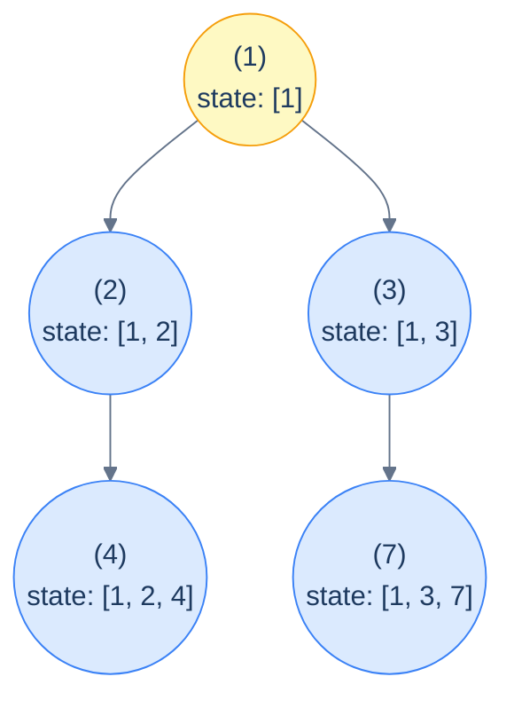
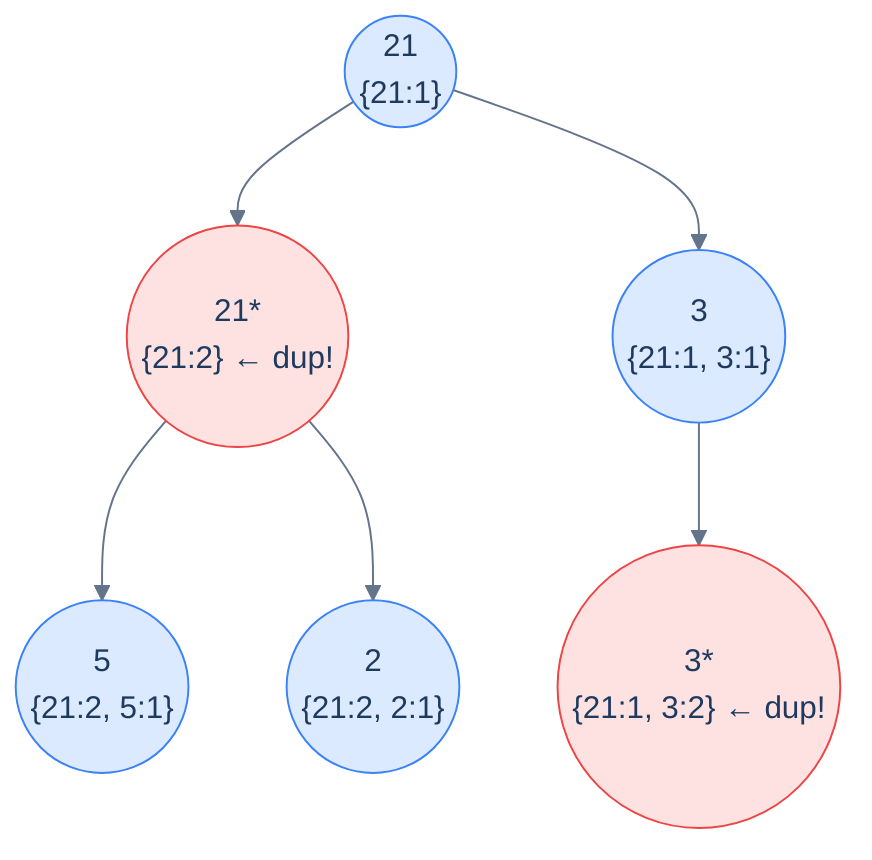
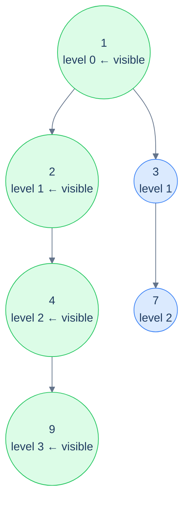

# 9. Pattern: Preorder Traversal (Stateful)

## The Hook

The previous lesson handled problems where a pure *integer* (or other small immutable value) flowed down the tree. Each recursive call got its own copy, sibling subtrees couldn't interfere with each other, and the algorithm was beautifully one-directional.

But what if the accumulator is a **mutable collection** — say, the *list of nodes on the current path*, or a *frequency map of values seen above*, or a *flag on what level we're currently at*? Copying a list at every recursive call would be O(N) per call, blowing up the entire algorithm to O(N²) or worse. We need the *same* collection to be visible across the whole traversal — but with a discipline that lets each subtree see *only* its own ancestors, not its siblings'.

The fix is **mutate then undo** — the canonical *backtracking* template. As recursion enters a node, *push* the node's contribution onto the shared accumulator. As recursion *returns* from that node (after both children are done), *pop* it off. The accumulator at any given recursive call holds *exactly* the contributions of the current node's ancestors — never its siblings, never its parents' siblings, never anything outside the current path.

This is the **stateful preorder pattern**. Same downward information flow as the stateless version, but now the accumulator is *shared* state with explicit push/pop bookkeeping. It powers an enormous range of problems: detecting cycles in paths, finding the K-th smallest, computing tree views (left view, right view, top view, bottom view), counting paths with constraints, and more.

This lesson defines the pattern precisely, distinguishes it from the stateless variant, and walks through four canonical problems that exemplify the four most common shapes of state — a **frequency map** (push/pop bookkeeping), **two scalar witnesses** (no push/pop needed), and **a level pointer** (the bookkeeping is implicit in the visit order).

---

## Table of contents

1. [The stateful preorder pattern](#the-stateful-preorder-pattern)
2. [How to recognise it](#how-to-recognise-it)
3. [Problem 1 — Duplicates in path](#problem-1--duplicates-in-path)
4. [Problem 2 — Second minimum](#problem-2--second-minimum)
5. [Problem 3 — Left view](#problem-3--left-view)
6. [Problem 4 — Right view](#problem-4--right-view)

***

# The stateful preorder pattern

The core idea — *mutate then undo*:

```text
preorder(node, sharedState):
  if node is null: return
  push(sharedState, node)              # add this node's contribution
  process(node, sharedState)
  preorder(node.left,  sharedState)
  preorder(node.right, sharedState)
  pop(sharedState, node)               # remove this node's contribution
```

The push and pop bracket the recursive calls. While we're inside the recursion for `node`'s descendants, the shared state contains exactly the path from the root to (and including) `node`. When we return from `node`, the state is restored to what it was when we *entered* `node` — which is what its parent's *other* child needs to see.



<p align="center"><strong>The shared state during a stateful preorder — at every node, the state contains <em>exactly</em> the values on the root-to-node path, no siblings, no extras. The push happens at entry; the pop happens at exit; the state is correct at every moment.</strong></p>

> *Predict before reading on — what happens if you forget the pop?*
>
> The state would *accumulate* across siblings — so after the recursion finishes node `2`'s subtree, when control moves to node `3`, the state would still contain `2` and `4` from the previous subtree's contributions. Sibling pollution. Forgetting the pop is the #1 bug in beginner backtracking code; if your solution gives wildly wrong answers on multi-branch trees but works on lopsided ones, the missing pop is almost always the culprit.

## Three flavours of state

Not every "stateful" problem needs an explicit push/pop. Here are the three shapes you'll see:

1. **Push-pop collection** (`Duplicates in path` below). The state is a list, set, or multimap. Push on entry, pop on exit. *Must* pop or sibling subtrees see each other.
2. **Monotone witnesses** (`Second minimum` below). The state is one or more scalars that *only ever increase or decrease*. No pop needed — once we've seen a smaller value somewhere, that fact is fine to keep when we move on. The state is genuinely shared and write-only-when-improved.
3. **Visit-order witnesses** (`Left view`, `Right view` below). No collection at all — just a counter that tracks *how deep we've drilled so far*. The "state" is implicit in the recursion's visit order; we exploit the fact that the *first* node visited at each new depth is the one we want.

The same pattern label applies to all three because they share the structural feature: *one shared mutable object that is read and updated as the recursion proceeds*. The mechanics of update vary; the spirit doesn't.

## Generic pattern in 10 languages

We'll show the **push-pop** flavour as the canonical generic — it's the strictest and the one most likely to bite you. The other two flavours are simpler restrictions of this template.


```pseudocode
function statefulPreorder(root):
    state ← empty list                  # shared, mutable path state
    function go(node):
        if node = null: return
        push node.val to state           # enter: extend the current path
        # use state to process node ...
        go(node.left)
        go(node.right)
        pop from state                   # exit: restore path for the parent
    go(root)
```

```python run
from typing import List, Optional

class TreeNode:
    def __init__(self, val=0, left=None, right=None):
        self.val, self.left, self.right = val, left, right

def stateful_preorder(root: Optional[TreeNode]):
    state: List[int] = []                       # shared collection
    def go(node):
        if node is None: return
        state.append(node.val)                  # push
        # ... use state to process node ...
        go(node.left)
        go(node.right)
        state.pop()                             # pop
    go(root)
```

```java run
static List<Integer> state;
static void statefulPreorderHelper(TreeNode node) {
    if (node == null) return;
    state.add(node.val);                        // push
    // process...
    statefulPreorderHelper(node.left);
    statefulPreorderHelper(node.right);
    state.remove(state.size() - 1);             // pop
}
public static void statefulPreorder(TreeNode root) {
    state = new ArrayList<>();
    statefulPreorderHelper(root);
}
```

```c run
static int state[1024];
static int top = -1;
void stateful_preorder(TreeNode *node) {
    if (!node) return;
    state[++top] = node->val;                   // push
    // process
    stateful_preorder(node->left);
    stateful_preorder(node->right);
    top--;                                      // pop
}
```

```cpp run
std::vector<int> state;
void statefulPreorder(TreeNode *node) {
    if (!node) return;
    state.push_back(node->val);                 // push
    // process
    statefulPreorder(node->left);
    statefulPreorder(node->right);
    state.pop_back();                           // pop
}
```

```scala run
val state = scala.collection.mutable.ArrayBuffer[Int]()
def statefulPreorder(node: TreeNode): Unit = {
  if (node == null) return
  state += node.value                            // push
  statefulPreorder(node.left)
  statefulPreorder(node.right)
  state.remove(state.length - 1)                 // pop
}
```

```typescript run
function statefulPreorder(root: TreeNode | null): void {
    const state: number[] = [];
    function go(n: TreeNode | null): void {
        if (!n) return;
        state.push(n.val);                       // push
        go(n.left); go(n.right);
        state.pop();                              // pop
    }
    go(root);
}
```

```go run
func statefulPreorder(root *TreeNode) {
    var state []int
    var go_ func(*TreeNode)
    go_ = func(n *TreeNode) {
        if n == nil { return }
        state = append(state, n.Val)             // push
        go_(n.Left); go_(n.Right)
        state = state[:len(state)-1]             // pop
    }
    go_(root)
}
```

```rust run
fn stateful_go(node: &Option<Box<TreeNode>>, state: &mut Vec<i32>) {
    if let Some(n) = node {
        state.push(n.val);                        // push
        stateful_go(&n.left,  state);
        stateful_go(&n.right, state);
        state.pop();                              // pop
    }
}
pub fn stateful_preorder(root: &Option<Box<TreeNode>>) {
    let mut state = Vec::new();
    stateful_go(root, &mut state);
}
```


## Complexity

> **Time:** O(N) for the traversal, plus whatever per-node work the `process` step does. Push/pop on a list/array are O(1) amortised. **Space:** O(h) for both the recursion and the path-sized state.

***

# How to recognise it

A problem fits this pattern when:

- The answer at each node depends on the **set or sequence of values on its path from the root** (not just an aggregate like a sum), *and*
- That set/sequence is too large or unwieldy to copy down at every call.

Concrete cues to look for:

- *"Find nodes whose ancestor sequence contains …"* — push-pop set/map
- *"Find the smallest / second-smallest / k-th smallest / max / max-so-far"* — monotone witnesses
- *"Return the leftmost / rightmost / first / topmost node at each level"* — visit-order witnesses
- *"Detect a cycle / repetition / pattern in the ancestry"* — push-pop set/map again

Anti-pattern: if the state really is just a number you're aggregating, use the *stateless* version (previous lesson). Don't reach for push-pop when an integer parameter would do.

***

# Problem 1 — Duplicates in path

> Given the root of a binary tree, return the number of nodes whose root-to-node path contains *another* node with the same value.

This is the canonical push-pop problem. The shared state is a **frequency map**: as we enter a node, increment its value's count; as we leave, decrement (and remove if it hits zero). At each entry, if the value's count was *already non-zero* before the increment, we've found a node whose path contained a duplicate.



<p align="center"><strong>Duplicates in path — at every node, check the frequency map: if the current value already has count ≥ 1, we've found a duplicate. Push on entry, pop on exit, count anything that was already there.</strong></p>

## Solution


```pseudocode
function duplicatesInPath(root):
    freq   ← empty Map: value → count
    result ← 0
    function go(n):
        if n = null: return
        if freq[n.val] > 0: result ← result + 1   # n.val already on current path
        freq[n.val] ← freq[n.val] + 1
        go(n.left); go(n.right)
        freq[n.val] ← freq[n.val] − 1             # undo on backtrack
        if freq[n.val] = 0: remove n.val from freq
    go(root)
    return result
```

```python run
def duplicates_in_path(root):
    freq, result = {}, [0]
    def go(n):
        if n is None: return
        if freq.get(n.val, 0) > 0:
            result[0] += 1
        freq[n.val] = freq.get(n.val, 0) + 1
        go(n.left); go(n.right)
        freq[n.val] -= 1
        if freq[n.val] == 0: del freq[n.val]
    go(root)
    return result[0]
```

```java run
static Map<Integer, Integer> freq;
static int duplicates;
static void dupHelper(TreeNode n) {
    if (n == null) return;
    if (freq.getOrDefault(n.val, 0) > 0) duplicates++;
    freq.merge(n.val, 1, Integer::sum);
    dupHelper(n.left); dupHelper(n.right);
    if (freq.get(n.val) == 1) freq.remove(n.val); else freq.merge(n.val, -1, Integer::sum);
}
public static int duplicatesInPath(TreeNode root) {
    freq = new HashMap<>(); duplicates = 0;
    dupHelper(root); return duplicates;
}
```

```c run
// freq[] hash table (open addressing) for simplicity assume keys 0..1023
static int freq[1024], duplicates;
void dup_helper(TreeNode *n) {
    if (!n) return;
    if (freq[n->val] > 0) duplicates++;
    freq[n->val]++;
    dup_helper(n->left); dup_helper(n->right);
    freq[n->val]--;
}
int duplicates_in_path(TreeNode *root) {
    duplicates = 0;
    for (int i = 0; i < 1024; i++) freq[i] = 0;
    dup_helper(root);
    return duplicates;
}
```

```cpp run
#include <unordered_map>
std::unordered_map<int,int> freq;
int duplicates;
void dupHelper(TreeNode *n) {
    if (!n) return;
    if (freq[n->val] > 0) duplicates++;
    freq[n->val]++;
    dupHelper(n->left); dupHelper(n->right);
    if (--freq[n->val] == 0) freq.erase(n->val);
}
int duplicatesInPath(TreeNode *root) {
    freq.clear(); duplicates = 0;
    dupHelper(root); return duplicates;
}
```

```scala run
def duplicatesInPath(root: TreeNode): Int = {
  val freq = scala.collection.mutable.Map[Int, Int]()
  var duplicates = 0
  def go(n: TreeNode): Unit = {
    if (n == null) return
    if (freq.getOrElse(n.value, 0) > 0) duplicates += 1
    freq(n.value) = freq.getOrElse(n.value, 0) + 1
    go(n.left); go(n.right)
    val c = freq(n.value) - 1
    if (c == 0) freq.remove(n.value) else freq(n.value) = c
  }
  go(root); duplicates
}
```

```typescript run
function duplicatesInPath(root: TreeNode | null): number {
    const freq = new Map<number, number>(); let dup = 0;
    function go(n: TreeNode | null): void {
        if (!n) return;
        if ((freq.get(n.val) || 0) > 0) dup++;
        freq.set(n.val, (freq.get(n.val) || 0) + 1);
        go(n.left); go(n.right);
        const c = (freq.get(n.val) || 0) - 1;
        if (c === 0) freq.delete(n.val); else freq.set(n.val, c);
    }
    go(root); return dup;
}
```

```go run
func duplicatesInPath(root *TreeNode) int {
    freq := make(map[int]int); dup := 0
    var go_ func(*TreeNode)
    go_ = func(n *TreeNode) {
        if n == nil { return }
        if freq[n.Val] > 0 { dup++ }
        freq[n.Val]++
        go_(n.Left); go_(n.Right)
        freq[n.Val]--
        if freq[n.Val] == 0 { delete(freq, n.Val) }
    }
    go_(root); return dup
}
```

```rust run
use std::collections::HashMap;
fn dup_go(node: &Option<Box<TreeNode>>, freq: &mut HashMap<i32, i32>, dup: &mut i32) {
    if let Some(n) = node {
        if *freq.get(&n.val).unwrap_or(&0) > 0 { *dup += 1; }
        *freq.entry(n.val).or_insert(0) += 1;
        dup_go(&n.left,  freq, dup);
        dup_go(&n.right, freq, dup);
        let c = freq.get_mut(&n.val).unwrap();
        *c -= 1;
        if *c == 0 { freq.remove(&n.val); }
    }
}
pub fn duplicates_in_path(root: &Option<Box<TreeNode>>) -> i32 {
    let mut freq = HashMap::new(); let mut dup = 0;
    dup_go(root, &mut freq, &mut dup);
    dup
}
```


***

# Problem 2 — Second minimum

> Given the root of a binary tree, find and return the second-smallest distinct value. If there's no second minimum, return `-1`.

This is the **monotone witnesses** flavour. The state is two integers, `min` and `secondMin`, both shared across the recursion. Each visit either improves `min` (and demotes the old min to `secondMin`) or improves `secondMin`. No push/pop needed — once we've seen a smaller value, that's a global fact, not a path-local one.

## Solution


```pseudocode
function findSecondMinimum(root):
    if root = null: return −1
    min ← root.val; secondMin ← −1
    function go(n):
        if n = null: return
        v ← n.val
        if v < min:
            secondMin ← min; min ← v
        else if v > min AND (secondMin = −1 OR v < secondMin):
            secondMin ← v
        go(n.left); go(n.right)
    go(root)
    return secondMin
```

```python run
def find_second_minimum(root):
    if root is None: return -1
    state = [root.val, -1]                       # [min, secondMin]
    def go(n):
        if n is None: return
        v = n.val
        if v < state[0]:
            state[1] = state[0]
            state[0] = v
        elif v > state[0] and (state[1] == -1 or v < state[1]):
            state[1] = v
        go(n.left); go(n.right)
    go(root)
    return state[1]
```

```java run
static int min, secondMin;
static void smHelper(TreeNode n) {
    if (n == null) return;
    int v = n.val;
    if (v < min) { secondMin = min; min = v; }
    else if (v > min && (secondMin == -1 || v < secondMin)) secondMin = v;
    smHelper(n.left); smHelper(n.right);
}
public static int findSecondMinimum(TreeNode root) {
    if (root == null) return -1;
    min = root.val; secondMin = -1;
    smHelper(root); return secondMin;
}
```

```c run
static int g_min, g_second;
void sm_helper(TreeNode *n) {
    if (!n) return;
    int v = n->val;
    if (v < g_min) { g_second = g_min; g_min = v; }
    else if (v > g_min && (g_second == -1 || v < g_second)) g_second = v;
    sm_helper(n->left); sm_helper(n->right);
}
int find_second_minimum(TreeNode *root) {
    if (!root) return -1;
    g_min = root->val; g_second = -1;
    sm_helper(root); return g_second;
}
```

```cpp run
int g_min, g_second;
void smHelper(TreeNode *n) {
    if (!n) return;
    int v = n->val;
    if (v < g_min) { g_second = g_min; g_min = v; }
    else if (v > g_min && (g_second == -1 || v < g_second)) g_second = v;
    smHelper(n->left); smHelper(n->right);
}
int findSecondMinimum(TreeNode *root) {
    if (!root) return -1;
    g_min = root->val; g_second = -1;
    smHelper(root); return g_second;
}
```

```scala run
def findSecondMinimum(root: TreeNode): Int = {
  if (root == null) return -1
  var minV = root.value
  var secV = -1
  def go(n: TreeNode): Unit = {
    if (n == null) return
    val v = n.value
    if (v < minV) { secV = minV; minV = v }
    else if (v > minV && (secV == -1 || v < secV)) secV = v
    go(n.left); go(n.right)
  }
  go(root); secV
}
```

```typescript run
function findSecondMinimum(root: TreeNode | null): number {
    if (!root) return -1;
    let minV = root.val, secV = -1;
    function go(n: TreeNode | null): void {
        if (!n) return;
        const v = n.val;
        if (v < minV)        { secV = minV; minV = v; }
        else if (v > minV && (secV === -1 || v < secV)) secV = v;
        go(n.left); go(n.right);
    }
    go(root); return secV;
}
```

```go run
func findSecondMinimum(root *TreeNode) int {
    if root == nil { return -1 }
    minV, secV := root.Val, -1
    var go_ func(*TreeNode)
    go_ = func(n *TreeNode) {
        if n == nil { return }
        v := n.Val
        if v < minV { secV = minV; minV = v
        } else if v > minV && (secV == -1 || v < secV) { secV = v }
        go_(n.Left); go_(n.Right)
    }
    go_(root); return secV
}
```

```rust run
fn sm_go(node: &Option<Box<TreeNode>>, min_v: &mut i32, sec_v: &mut i32) {
    if let Some(n) = node {
        let v = n.val;
        if v < *min_v { *sec_v = *min_v; *min_v = v; }
        else if v > *min_v && (*sec_v == -1 || v < *sec_v) { *sec_v = v; }
        sm_go(&n.left,  min_v, sec_v);
        sm_go(&n.right, min_v, sec_v);
    }
}
pub fn find_second_minimum(root: &Option<Box<TreeNode>>) -> i32 {
    match root {
        None => -1,
        Some(r) => { let mut m = r.val; let mut s = -1; sm_go(root, &mut m, &mut s); s }
    }
}
```


***

# Problem 3 — Left view

> Given the root of a binary tree, return the values of the leftmost node *at each level* of the tree, top to bottom.
>
> **Example:** tree `[1, 2, 3, 4, null, null, 7, 9]` → `[1, 2, 4, 9]`.

This is the **visit-order witnesses** flavour. The state is just one integer: `maxLevelReached` — the deepest level we've already added a node from. Recurse into the *left* subtree before the right; whenever the current call's level *equals* `maxLevelReached`, we know we're seeing a *new* level for the first time, so the current node is the leftmost at that level.



<p align="center"><strong>Left view — recurse left-first; the first node visited at each new level is the leftmost. The state is a single counter that ratchets forward each time we see a deeper level.</strong></p>

## Solution


```pseudocode
function leftView(root):
    out ← empty list
    function go(n, level):
        if n = null: return
        if level = length(out): append n.val to out   # first node at this depth
        go(n.left,  level + 1)                        # left-first ensures leftmost wins
        go(n.right, level + 1)
    go(root, 0)
    return out
```

```python run
def left_view(root):
    out = []
    def go(n, level):
        if n is None: return
        if level == len(out): out.append(n.val)
        go(n.left,  level + 1)               # left first
        go(n.right, level + 1)
    go(root, 0)
    return out
```

```java run
static void lvHelper(TreeNode n, int level, List<Integer> out) {
    if (n == null) return;
    if (level == out.size()) out.add(n.val);
    lvHelper(n.left,  level + 1, out);
    lvHelper(n.right, level + 1, out);
}
public static List<Integer> leftView(TreeNode root) {
    List<Integer> out = new ArrayList<>();
    lvHelper(root, 0, out);
    return out;
}
```

```c run
void lv_helper(TreeNode *n, int level, int *out, int *k) {
    if (!n) return;
    if (level == *k) out[(*k)++] = n->val;
    lv_helper(n->left,  level + 1, out, k);
    lv_helper(n->right, level + 1, out, k);
}
int* left_view(TreeNode *root, int *count) {
    static int out[64]; *count = 0;
    lv_helper(root, 0, out, count);
    return out;
}
```

```cpp run
void lvHelper(TreeNode *n, int level, std::vector<int>& out) {
    if (!n) return;
    if ((int)out.size() == level) out.push_back(n->val);
    lvHelper(n->left,  level + 1, out);
    lvHelper(n->right, level + 1, out);
}
std::vector<int> leftView(TreeNode *root) {
    std::vector<int> out;
    lvHelper(root, 0, out);
    return out;
}
```

```scala run
def leftView(root: TreeNode): List[Int] = {
  val out = scala.collection.mutable.ListBuffer[Int]()
  def go(n: TreeNode, level: Int): Unit = {
    if (n == null) return
    if (level == out.length) out += n.value
    go(n.left,  level + 1)
    go(n.right, level + 1)
  }
  go(root, 0); out.toList
}
```

```typescript run
function leftView(root: TreeNode | null): number[] {
    const out: number[] = [];
    function go(n: TreeNode | null, level: number): void {
        if (!n) return;
        if (level === out.length) out.push(n.val);
        go(n.left,  level + 1);
        go(n.right, level + 1);
    }
    go(root, 0); return out;
}
```

```go run
func leftView(root *TreeNode) []int {
    var out []int
    var go_ func(*TreeNode, int)
    go_ = func(n *TreeNode, level int) {
        if n == nil { return }
        if level == len(out) { out = append(out, n.Val) }
        go_(n.Left,  level + 1)
        go_(n.Right, level + 1)
    }
    go_(root, 0); return out
}
```

```rust run
fn lv_go(node: &Option<Box<TreeNode>>, level: usize, out: &mut Vec<i32>) {
    if let Some(n) = node {
        if level == out.len() { out.push(n.val); }
        lv_go(&n.left,  level + 1, out);
        lv_go(&n.right, level + 1, out);
    }
}
pub fn left_view(root: &Option<Box<TreeNode>>) -> Vec<i32> {
    let mut out = Vec::new();
    lv_go(root, 0, &mut out);
    out
}
```


***

# Problem 4 — Right view

> Same as the left view, but from the right side. Tree `[1, 2, 3, 4, null, null, 7, 9]` → `[1, 3, 7, 9]`.

The trick is *identical* to the left view, with one swap: recurse **right before left**. The first node visited at each new level is now the rightmost.

## Solution


```pseudocode
function rightView(root):
    out ← empty list
    function go(n, level):
        if n = null: return
        if level = length(out): append n.val to out   # first node at this depth
        go(n.right, level + 1)                        # right-first ensures rightmost wins
        go(n.left,  level + 1)
    go(root, 0)
    return out
```

```python run
def right_view(root):
    out = []
    def go(n, level):
        if n is None: return
        if level == len(out): out.append(n.val)
        go(n.right, level + 1)               # right first
        go(n.left,  level + 1)
    go(root, 0)
    return out
```

```java run
static void rvHelper(TreeNode n, int level, List<Integer> out) {
    if (n == null) return;
    if (level == out.size()) out.add(n.val);
    rvHelper(n.right, level + 1, out);
    rvHelper(n.left,  level + 1, out);
}
public static List<Integer> rightView(TreeNode root) {
    List<Integer> out = new ArrayList<>();
    rvHelper(root, 0, out); return out;
}
```

```c run
void rv_helper(TreeNode *n, int level, int *out, int *k) {
    if (!n) return;
    if (level == *k) out[(*k)++] = n->val;
    rv_helper(n->right, level + 1, out, k);
    rv_helper(n->left,  level + 1, out, k);
}
int* right_view(TreeNode *root, int *count) {
    static int out[64]; *count = 0;
    rv_helper(root, 0, out, count); return out;
}
```

```cpp run
void rvHelper(TreeNode *n, int level, std::vector<int>& out) {
    if (!n) return;
    if ((int)out.size() == level) out.push_back(n->val);
    rvHelper(n->right, level + 1, out);
    rvHelper(n->left,  level + 1, out);
}
std::vector<int> rightView(TreeNode *root) {
    std::vector<int> out; rvHelper(root, 0, out); return out;
}
```

```scala run
def rightView(root: TreeNode): List[Int] = {
  val out = scala.collection.mutable.ListBuffer[Int]()
  def go(n: TreeNode, level: Int): Unit = {
    if (n == null) return
    if (level == out.length) out += n.value
    go(n.right, level + 1)
    go(n.left,  level + 1)
  }
  go(root, 0); out.toList
}
```

```typescript run
function rightView(root: TreeNode | null): number[] {
    const out: number[] = [];
    function go(n: TreeNode | null, level: number): void {
        if (!n) return;
        if (level === out.length) out.push(n.val);
        go(n.right, level + 1);
        go(n.left,  level + 1);
    }
    go(root, 0); return out;
}
```

```go run
func rightView(root *TreeNode) []int {
    var out []int
    var go_ func(*TreeNode, int)
    go_ = func(n *TreeNode, level int) {
        if n == nil { return }
        if level == len(out) { out = append(out, n.Val) }
        go_(n.Right, level + 1)
        go_(n.Left,  level + 1)
    }
    go_(root, 0); return out
}
```

```rust run
fn rv_go(node: &Option<Box<TreeNode>>, level: usize, out: &mut Vec<i32>) {
    if let Some(n) = node {
        if level == out.len() { out.push(n.val); }
        rv_go(&n.right, level + 1, out);
        rv_go(&n.left,  level + 1, out);
    }
}
pub fn right_view(root: &Option<Box<TreeNode>>) -> Vec<i32> {
    let mut out = Vec::new();
    rv_go(root, 0, &mut out);
    out
}
```


***

## Final Takeaway

The stateful preorder pattern is the second-most-common shape in the chapter. Three things to walk away with:

1. **Push then recurse then pop.** When the state is a mutable collection, the discipline is sacred: push on entry, both recursions, pop on exit. Forgetting the pop is the canonical "my answer is way too big" backtracking bug. *Always* check that every push has a paired pop on every code path.
2. **Not every "shared mutable" is push-pop.** Monotone witnesses (min/max/best-so-far) and visit-order witnesses (first-at-each-level) share a mutable across the recursion *without* needing pop, because their updates are inherently global facts (or because the visit order itself encodes the bookkeeping).
3. **Left-vs-right preference is what gives "first" its meaning.** The view problems all turn on which child you recurse into *first*. Left view: left first. Right view: right first. Top view: process by level *and* horizontal distance. Generalise this — whenever a problem says "first / leftmost / rightmost / topmost", the *recursion order* is doing the work.

> *Coming up — the chapter pivots from the downward-flowing preorder patterns to the upward-flowing <strong>postorder</strong> patterns. Where preorder hands data <em>from parent to child</em>, postorder gathers data <em>from children to parent</em>. The next two lessons (stateless and stateful postorder) cover heights, sums, diameters, and a wealth of other "compute the answer at each node from its subtrees' answers" problems.*
