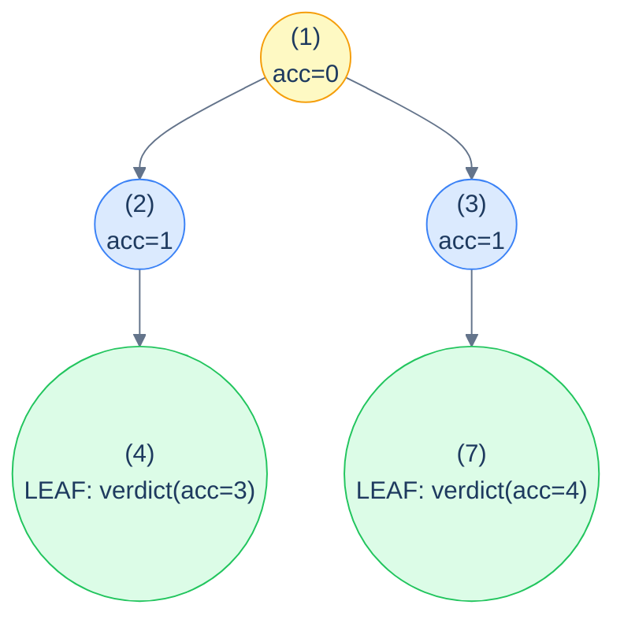
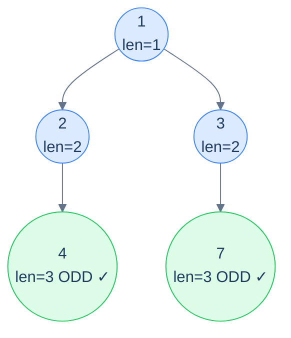

# 12. Pattern: Root-to-Leaf Path (Stateless)

## The Hook

The previous patterns all asked questions about *individual nodes*. The preorder ones gave each node info about its ancestors; the postorder ones gave each node info about its descendants. This lesson zooms out one more level — the **whole root-to-leaf path** is the unit of interest.

A root-to-leaf path is exactly what it sounds like: the sequence of nodes from the root, walking child references, ending at a leaf. Every leaf defines exactly one such path. *"Does any root-to-leaf path sum to N?"* — yes if and only if at least one leaf can be reached with an accumulator that ends up at N. *"How many root-to-leaf paths have an odd length?"* — count the leaves whose path-length is odd. *"Is there a path where every node is even?"* — does a leaf exist whose path was all-even on the way down?

Each of these problems is the *same recipe*: the **accumulator descends preorder-style** from the root, the **answer is decided at leaves** (where the path completes), and **internal nodes combine the children's answers postorder-style**. It's a hybrid of preorder and postorder, written as a single recursive function.

The "stateless" qualifier carries the same meaning as before — the accumulator is a small immutable value (a number, a flag, a count) that's *passed down* the recursion by parameter. No mutable shared state. The recursive shape is unmistakably similar to what you've already seen, but the *interpretation* shifts: each leaf says "here's my path's verdict", and the OR / + / max combiner up the tree decides what the answer for the *whole* tree is.

This lesson sets up the recipe and walks through four canonical problems — *path sum exists*, *binary summation of leaf paths*, *all-even path exists*, and *count of odd-length paths*. Each gets a clean implementation in 10 languages.

---

## Table of contents

1. [The stateless root-to-leaf path pattern](#the-stateless-root-to-leaf-path-pattern)
2. [How to recognise it](#how-to-recognise-it)
3. [Problem 1 — Root to leaf path (sum check)](#problem-1--root-to-leaf-path-sum-check)
4. [Problem 2 — Binary summation of tree](#problem-2--binary-summation-of-tree)
5. [Problem 3 — Even path](#problem-3--even-path)
6. [Problem 4 — Odd count](#problem-4--odd-count)

***

# The stateless root-to-leaf path pattern

```text
recurse(node, accumulator):
  if node is null: return identity            # propagate "no path here"
  newAcc = update(accumulator, node)
  if node is a leaf:                          # path is complete
    return verdict(newAcc)
  leftAnswer  = recurse(node.left,  newAcc)
  rightAnswer = recurse(node.right, newAcc)
  return combine(leftAnswer, rightAnswer)
```

Three pieces to specialise:

1. **`update`** — how the accumulator changes as we descend through the current node (preorder-style).
2. **`verdict`** — at a leaf, what's the answer for *this* root-to-leaf path?
3. **`combine`** — how to combine two children's answers into one parent answer (postorder-style). Common combinators: `OR` for "any path satisfies …", `+` for "count / sum across paths", `max` for "best path".

The *identity* in the base case is whatever value makes `combine` ignore the empty subtree — `false` for OR, `0` for sum, `-∞` for max.



<p align="center"><strong>Stateless root-to-leaf path pattern — accumulator <strong>descends</strong> with updates from each node; leaves <strong>emit</strong> their per-path verdict; internal nodes <strong>combine</strong> their children's verdicts back up. It's preorder going down + postorder coming up, fused into one recursion.</strong></p>

> *Predict before reading on — what's the difference between this pattern and the stateless preorder pattern from lesson 8?*
>
> Stateless preorder *processes every node* — the answer is whatever each node computes from its ancestor chain. Root-to-leaf-path *only emits an answer at leaves* — the answer for an internal node is combined from its descendants' leaf-emissions. They share the "accumulator down" mechanic but differ in *where* the answer is born and how it propagates back up.

## Generic pattern in 10 languages

We'll show "does any root-to-leaf path sum to target?" as the canonical generic example.

```python run
from typing import Optional

class TreeNode:
    def __init__(self, val=0, left=None, right=None):
        self.val, self.left, self.right = val, left, right

def has_path_sum(root: Optional[TreeNode], target: int) -> bool:
    def go(n, remaining):
        if n is None: return False                     # identity for OR
        remaining -= n.val
        if n.left is None and n.right is None:         # leaf
            return remaining == 0                      # verdict
        return go(n.left, remaining) or go(n.right, remaining)
    return go(root, target)
```

```java run
public static boolean hasPathSum(TreeNode root, int target) {
    if (root == null) return false;
    target -= root.val;
    if (root.left == null && root.right == null) return target == 0;
    return hasPathSum(root.left, target) || hasPathSum(root.right, target);
}
```

```c run
int has_path_sum(TreeNode *root, int target) {
    if (!root) return 0;
    target -= root->val;
    if (!root->left && !root->right) return target == 0;
    return has_path_sum(root->left, target) || has_path_sum(root->right, target);
}
```

```cpp run
bool hasPathSum(TreeNode *root, int target) {
    if (!root) return false;
    target -= root->val;
    if (!root->left && !root->right) return target == 0;
    return hasPathSum(root->left, target) || hasPathSum(root->right, target);
}
```

```scala run
def hasPathSum(root: TreeNode, target: Int): Boolean = {
  if (root == null) return false
  val rem = target - root.value
  if (root.left == null && root.right == null) return rem == 0
  hasPathSum(root.left, rem) || hasPathSum(root.right, rem)
}
```

```javascript run
function hasPathSum(root, target) {
    if (!root) return false;
    target -= root.val;
    if (!root.left && !root.right) return target === 0;
    return hasPathSum(root.left, target) || hasPathSum(root.right, target);
}
```

```typescript run
function hasPathSum(root: TreeNode | null, target: number): boolean {
    if (!root) return false;
    target -= root.val;
    if (!root.left && !root.right) return target === 0;
    return hasPathSum(root.left, target) || hasPathSum(root.right, target);
}
```

```go run
func hasPathSum(root *TreeNode, target int) bool {
    if root == nil { return false }
    target -= root.Val
    if root.Left == nil && root.Right == nil { return target == 0 }
    return hasPathSum(root.Left, target) || hasPathSum(root.Right, target)
}
```

```kotlin run
fun hasPathSum(root: TreeNode?, target: Int): Boolean {
    if (root == null) return false
    val rem = target - root.value
    if (root.left == null && root.right == null) return rem == 0
    return hasPathSum(root.left, rem) || hasPathSum(root.right, rem)
}
```

```rust run
pub fn has_path_sum(root: &Option<Box<TreeNode>>, target: i32) -> bool {
    match root {
        None => false,
        Some(n) => {
            let rem = target - n.val;
            if n.left.is_none() && n.right.is_none() { return rem == 0; }
            has_path_sum(&n.left, rem) || has_path_sum(&n.right, rem)
        }
    }
}
```


## Complexity

> **Time:** O(N). **Space:** O(h) for recursion.

***

# How to recognise it

The pattern fits when:

- The unit of interest is a **complete root-to-leaf path** (not an arbitrary path inside the tree).
- The check at each leaf depends on info accumulated *along the way down* (path sum, parity status, depth, concatenated value).
- The whole-tree answer combines per-leaf verdicts via `OR` (does any path …), `AND` (do all paths …), `+` (count / sum), or `max` / `min` (best path).

Concrete cues:

- *"Does any root-to-leaf path …"* → `OR` combiner.
- *"Do all root-to-leaf paths …"* → `AND` combiner.
- *"Count root-to-leaf paths where …"* → `+` combiner.
- *"What's the max / min root-to-leaf path …"* → `max` / `min` combiner.

Anti-pattern: if the path can start or end *anywhere* (not just root and leaf), this isn't the right pattern — use the postorder stateful one (diameter, longest monotonic) instead. If the answer needs the *list of nodes* in each path (not just an aggregate), use the *stateful* root-to-leaf-path pattern (next lesson).

***

# Problem 1 — Root to leaf path (sum check)

> Return `true` if there exists at least one root-to-leaf path whose node values sum to `target`.

Already covered in the generic skeleton. The accumulator is the *remaining target after subtracting nodes seen*; the verdict at a leaf is *"is remaining exactly 0?"*; the combine is `OR`.

The implementation is exactly the generic template — see the 10-language code block above.

***

# Problem 2 — Binary summation of tree

> Each node's value is `0` or `1`. Each root-to-leaf path is a binary number (most significant bit at root). Return the sum of these binary numbers, in decimal.
>
> **Example:** `[1, 0, 1, 1, null, null, 1]` → paths `[1,0,1,1]=11(₂)=11(₁₀)`... wait, the example output is 12. Let me recompute. The tree:
> ```
>     1
>    / \
>   0   1
>  / \   \
> 1       1
> ```
> Paths from root to leaves:
> - `1 → 0 → 1` = binary `101` = 5
> - `1 → 1 → 1` = binary `111` = 7
>
> Sum = 5 + 7 = **12**.

The accumulator is the *binary number so far* — at each node, shift left and OR in the current bit (`acc = (acc << 1) | node.val`). At a leaf, *return the accumulator itself*. Internal nodes sum their children.

## Solution

```python run
def binary_summation_of_tree(root):
    def go(n, acc):
        if n is None: return 0
        acc = (acc << 1) | n.val
        if n.left is None and n.right is None: return acc
        return go(n.left, acc) + go(n.right, acc)
    return go(root, 0)
```

```java run
static int bsHelper(TreeNode n, int acc) {
    if (n == null) return 0;
    acc = (acc << 1) | n.val;
    if (n.left == null && n.right == null) return acc;
    return bsHelper(n.left, acc) + bsHelper(n.right, acc);
}
public static int binarySummationOfTree(TreeNode root) { return bsHelper(root, 0); }
```

```c run
int bs_helper(TreeNode *n, int acc) {
    if (!n) return 0;
    acc = (acc << 1) | n->val;
    if (!n->left && !n->right) return acc;
    return bs_helper(n->left, acc) + bs_helper(n->right, acc);
}
int binary_summation_of_tree(TreeNode *root) { return bs_helper(root, 0); }
```

```cpp run
int bsHelper(TreeNode *n, int acc) {
    if (!n) return 0;
    acc = (acc << 1) | n->val;
    if (!n->left && !n->right) return acc;
    return bsHelper(n->left, acc) + bsHelper(n->right, acc);
}
int binarySummationOfTree(TreeNode *root) { return bsHelper(root, 0); }
```

```scala run
def binarySummationOfTree(root: TreeNode): Int = {
  def go(n: TreeNode, acc: Int): Int = {
    if (n == null) return 0
    val a = (acc << 1) | n.value
    if (n.left == null && n.right == null) return a
    go(n.left, a) + go(n.right, a)
  }
  go(root, 0)
}
```

```javascript run
function binarySummationOfTree(root) {
    function go(n, acc) {
        if (!n) return 0;
        acc = (acc << 1) | n.val;
        if (!n.left && !n.right) return acc;
        return go(n.left, acc) + go(n.right, acc);
    }
    return go(root, 0);
}
```

```typescript run
function binarySummationOfTree(root: TreeNode | null): number {
    function go(n: TreeNode | null, acc: number): number {
        if (!n) return 0;
        acc = (acc << 1) | n.val;
        if (!n.left && !n.right) return acc;
        return go(n.left, acc) + go(n.right, acc);
    }
    return go(root, 0);
}
```

```go run
func binarySummationOfTree(root *TreeNode) int {
    var go_ func(*TreeNode, int) int
    go_ = func(n *TreeNode, acc int) int {
        if n == nil { return 0 }
        acc = (acc << 1) | n.Val
        if n.Left == nil && n.Right == nil { return acc }
        return go_(n.Left, acc) + go_(n.Right, acc)
    }
    return go_(root, 0)
}
```

```kotlin run
fun binarySummationOfTree(root: TreeNode?): Int {
    fun go(n: TreeNode?, acc: Int): Int {
        if (n == null) return 0
        val a = (acc shl 1) or n.value
        if (n.left == null && n.right == null) return a
        return go(n.left, a) + go(n.right, a)
    }
    return go(root, 0)
}
```

```rust run
fn bs_go(node: &Option<Box<TreeNode>>, acc: i32) -> i32 {
    match node {
        None => 0,
        Some(n) => {
            let a = (acc << 1) | n.val;
            if n.left.is_none() && n.right.is_none() { return a; }
            bs_go(&n.left, a) + bs_go(&n.right, a)
        }
    }
}
pub fn binary_summation_of_tree(root: &Option<Box<TreeNode>>) -> i32 { bs_go(root, 0) }
```


***

# Problem 3 — Even path

> Return `true` if there's at least one root-to-leaf path where *every* value is even.

The accumulator is a *boolean*: "has the path so far been all-even?". Update at each node: `still_even = previously_even AND (current is even)`. At a leaf, return `still_even`. Combine with OR.

## Solution

```python run
def even_path(root):
    if root is None: return False
    def go(n, ok):
        if n is None: return False
        ok = ok and (n.val % 2 == 0)
        if n.left is None and n.right is None: return ok
        return go(n.left, ok) or go(n.right, ok)
    return go(root, True)
```

```java run
static boolean evenHelper(TreeNode n, boolean ok) {
    if (n == null) return false;
    ok = ok && (n.val % 2 == 0);
    if (n.left == null && n.right == null) return ok;
    return evenHelper(n.left, ok) || evenHelper(n.right, ok);
}
public static boolean evenPath(TreeNode root) {
    if (root == null) return false;
    return evenHelper(root, true);
}
```

```c run
int even_helper(TreeNode *n, int ok) {
    if (!n) return 0;
    ok = ok && (n->val % 2 == 0);
    if (!n->left && !n->right) return ok;
    return even_helper(n->left, ok) || even_helper(n->right, ok);
}
int even_path(TreeNode *root) {
    if (!root) return 0;
    return even_helper(root, 1);
}
```

```cpp run
bool evenHelper(TreeNode *n, bool ok) {
    if (!n) return false;
    ok = ok && (n->val % 2 == 0);
    if (!n->left && !n->right) return ok;
    return evenHelper(n->left, ok) || evenHelper(n->right, ok);
}
bool evenPath(TreeNode *root) { if (!root) return false; return evenHelper(root, true); }
```

```scala run
def evenPath(root: TreeNode): Boolean = {
  if (root == null) return false
  def go(n: TreeNode, ok: Boolean): Boolean = {
    if (n == null) return false
    val ok2 = ok && (n.value % 2 == 0)
    if (n.left == null && n.right == null) return ok2
    go(n.left, ok2) || go(n.right, ok2)
  }
  go(root, true)
}
```

```javascript run
function evenPath(root) {
    if (!root) return false;
    function go(n, ok) {
        if (!n) return false;
        ok = ok && (n.val % 2 === 0);
        if (!n.left && !n.right) return ok;
        return go(n.left, ok) || go(n.right, ok);
    }
    return go(root, true);
}
```

```typescript run
function evenPath(root: TreeNode | null): boolean {
    if (!root) return false;
    function go(n: TreeNode | null, ok: boolean): boolean {
        if (!n) return false;
        ok = ok && (n.val % 2 === 0);
        if (!n.left && !n.right) return ok;
        return go(n.left, ok) || go(n.right, ok);
    }
    return go(root, true);
}
```

```go run
func evenPath(root *TreeNode) bool {
    if root == nil { return false }
    var go_ func(*TreeNode, bool) bool
    go_ = func(n *TreeNode, ok bool) bool {
        if n == nil { return false }
        ok = ok && (n.Val % 2 == 0)
        if n.Left == nil && n.Right == nil { return ok }
        return go_(n.Left, ok) || go_(n.Right, ok)
    }
    return go_(root, true)
}
```

```kotlin run
fun evenPath(root: TreeNode?): Boolean {
    if (root == null) return false
    fun go(n: TreeNode?, ok: Boolean): Boolean {
        if (n == null) return false
        val ok2 = ok && (n.value % 2 == 0)
        if (n.left == null && n.right == null) return ok2
        return go(n.left, ok2) || go(n.right, ok2)
    }
    return go(root, true)
}
```

```rust run
fn ep_go(node: &Option<Box<TreeNode>>, ok: bool) -> bool {
    match node {
        None => false,
        Some(n) => {
            let ok2 = ok && (n.val % 2 == 0);
            if n.left.is_none() && n.right.is_none() { return ok2; }
            ep_go(&n.left, ok2) || ep_go(&n.right, ok2)
        }
    }
}
pub fn even_path(root: &Option<Box<TreeNode>>) -> bool {
    if root.is_none() { return false; }
    ep_go(root, true)
}
```


***

# Problem 4 — Odd count

> Count the number of root-to-leaf paths whose **length** (number of nodes) is odd.

Accumulator: current path length (just an integer counter). At a leaf, verdict is `1` if length is odd, `0` otherwise. Combine via `+` to count across all paths.



<p align="center"><strong>Odd count — both leaves are at depth 3 (path length 3, which is odd), so the answer is <strong>2</strong>. Each leaf's verdict is bubbled up via <code>+</code>.</strong></p>

## Solution

```python run
def odd_count(root):
    def go(n, length):
        if n is None: return 0
        length += 1
        if n.left is None and n.right is None:
            return 1 if length % 2 == 1 else 0
        return go(n.left, length) + go(n.right, length)
    return go(root, 0)
```

```java run
static int ocHelper(TreeNode n, int length) {
    if (n == null) return 0;
    length++;
    if (n.left == null && n.right == null) return length % 2 == 1 ? 1 : 0;
    return ocHelper(n.left, length) + ocHelper(n.right, length);
}
public static int oddCount(TreeNode root) { return ocHelper(root, 0); }
```

```c run
int oc_helper(TreeNode *n, int length) {
    if (!n) return 0;
    length++;
    if (!n->left && !n->right) return length % 2 == 1 ? 1 : 0;
    return oc_helper(n->left, length) + oc_helper(n->right, length);
}
int odd_count(TreeNode *root) { return oc_helper(root, 0); }
```

```cpp run
int ocHelper(TreeNode *n, int length) {
    if (!n) return 0;
    length++;
    if (!n->left && !n->right) return length % 2 == 1 ? 1 : 0;
    return ocHelper(n->left, length) + ocHelper(n->right, length);
}
int oddCount(TreeNode *root) { return ocHelper(root, 0); }
```

```scala run
def oddCount(root: TreeNode): Int = {
  def go(n: TreeNode, length: Int): Int = {
    if (n == null) return 0
    val l2 = length + 1
    if (n.left == null && n.right == null) return if (l2 % 2 == 1) 1 else 0
    go(n.left, l2) + go(n.right, l2)
  }
  go(root, 0)
}
```

```javascript run
function oddCount(root) {
    function go(n, length) {
        if (!n) return 0;
        length++;
        if (!n.left && !n.right) return length % 2 === 1 ? 1 : 0;
        return go(n.left, length) + go(n.right, length);
    }
    return go(root, 0);
}
```

```typescript run
function oddCount(root: TreeNode | null): number {
    function go(n: TreeNode | null, length: number): number {
        if (!n) return 0;
        length++;
        if (!n.left && !n.right) return length % 2 === 1 ? 1 : 0;
        return go(n.left, length) + go(n.right, length);
    }
    return go(root, 0);
}
```

```go run
func oddCount(root *TreeNode) int {
    var go_ func(*TreeNode, int) int
    go_ = func(n *TreeNode, length int) int {
        if n == nil { return 0 }
        length++
        if n.Left == nil && n.Right == nil {
            if length % 2 == 1 { return 1 }
            return 0
        }
        return go_(n.Left, length) + go_(n.Right, length)
    }
    return go_(root, 0)
}
```

```kotlin run
fun oddCount(root: TreeNode?): Int {
    fun go(n: TreeNode?, length: Int): Int {
        if (n == null) return 0
        val l2 = length + 1
        if (n.left == null && n.right == null) return if (l2 % 2 == 1) 1 else 0
        return go(n.left, l2) + go(n.right, l2)
    }
    return go(root, 0)
}
```

```rust run
fn oc_go(node: &Option<Box<TreeNode>>, length: i32) -> i32 {
    match node {
        None => 0,
        Some(n) => {
            let l2 = length + 1;
            if n.left.is_none() && n.right.is_none() {
                return if l2 % 2 == 1 { 1 } else { 0 };
            }
            oc_go(&n.left, l2) + oc_go(&n.right, l2)
        }
    }
}
pub fn odd_count(root: &Option<Box<TreeNode>>) -> i32 { oc_go(root, 0) }
```


***

## Final Takeaway

The stateless root-to-leaf path pattern fuses preorder and postorder mechanics: **descend with an accumulator, decide at leaves, combine on the way back up**. Three things to walk away with:

1. **The combinator picks the question.** `OR` answers "does *any* path …?". `AND` answers "do *all* paths …?". `+` counts. `max`/`min` find the extreme. The accumulator and verdict change with the problem; the combinator changes with the question.
2. **Leaves are special — internal nodes are not.** Only leaves emit a verdict. Internal nodes are pass-through routers that combine. This is the structural difference from preorder-stateless (where every node is a "process" point) — root-to-leaf-path explicitly waits until the path is *complete*.
3. **The base case identity matters.** When `node` is `null`, return whatever value makes the combine ignore that subtree: `false` for OR, `true` for AND (yes — for AND, an empty subtree should *not* defeat its sibling), `0` for `+`, `-∞` for `max`. Get the identity wrong and you'll silently produce garbage on degenerate trees.

> *Coming up — the <strong>stateful</strong> root-to-leaf path pattern. When you need not just a per-path verdict but the actual <em>nodes</em> in each path (e.g., "list every root-to-leaf path that sums to N"), the accumulator becomes a mutable list with the canonical push-pop discipline. Same recipe, but now we collect actual paths instead of just counting them.*
