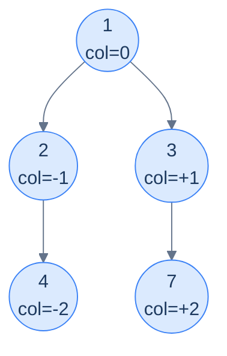
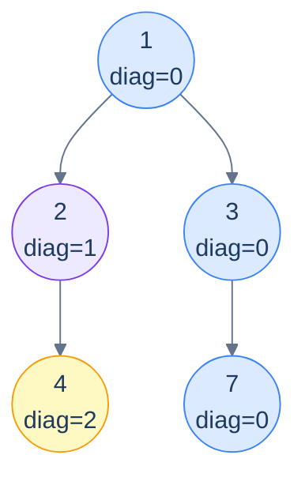

# 15. Pattern: Level-Order Traversal (Columns)

## The Hook

The previous lesson grouped tree nodes by their **horizontal slices** — level 0, level 1, level 2, .... This lesson rotates the perspective ninety degrees and groups nodes by their **vertical columns**.

Imagine standing *above* the tree and looking straight down. The root sits at column 0. Every left edge nudges the next node one column to the *left* (column −1, −2, …); every right edge nudges it one column to the *right* (+1, +2, …). After all the edges are walked, each node has an assigned (level, column) pair — and grouping by column reveals all sorts of useful pictures: the **top view** (the topmost node visible in each column), the **bottom view** (the bottommost), the **vertical traversal** (every node in each column, top-to-bottom), and the **diagonal traversal** (where left-edges count as "+1 diagonal" and right-edges stay put).

The mechanism is the same level-order BFS as the last lesson, but the queue carries an extra coordinate per entry: **(node, column)**. A `Map<column, …>` then collects whatever per-column data the question wants. The `column` key is computed from the parent's column with a simple offset; the value depends on which view we're computing.

This lesson packs the four canonical column-based problems into a tight set of variations on one template — top view, bottom view, vertical, diagonal — implemented in 10 languages each.

---

## Table of contents

1. [The column-coordinate template](#the-column-coordinate-template)
2. [Problem 1 — Top view](#problem-1--top-view)
3. [Problem 2 — Bottom view](#problem-2--bottom-view)
4. [Problem 3 — Vertical traversal](#problem-3--vertical-traversal)
5. [Problem 4 — Diagonal traversal](#problem-4--diagonal-traversal)

***

# The column-coordinate template

```text
queue = [(root, column=0)]
columns = sorted_map<int, value_for_this_view>
while queue is non-empty:
  (n, c) = queue.pop_front()
  apply_per_view_update(columns, c, n.val)        # ← differs per problem
  if n.left:  queue.push((n.left,  c - 1))
  if n.right: queue.push((n.right, c + 1))
return columns.values_in_column_order()
```

Two things change between the four problems:

1. **The `column` arithmetic for children.** For top/bottom/vertical: `left → c-1`, `right → c+1`. For diagonal: `left → c+1`, `right → c` (a left-edge starts a new diagonal; a right-edge stays on the current one).
2. **What we put into `columns[c]`.** Top view: only the *first* node ever to land in this column (since BFS visits topmost first). Bottom view: *overwrite* with each new node (the last one wins → the bottommost). Vertical: *append* to a list per column. Diagonal: *append* to a list per diagonal.



<p align="center"><strong>Column coordinates assigned by BFS — root at 0, each left-edge subtracts 1, each right-edge adds 1. Group by column and you can answer any "looking from above / from the side" question about the tree.</strong></p>

> *Why a sorted map (TreeMap / std::map) and not a hash map?* Because at the end we need to iterate columns from leftmost to rightmost. A hash map would force an O(K log K) sort on output. A sorted map keeps everything in column order automatically. (Alternative: hash map plus tracking `min_col`/`max_col` and iterating the integer range — same idea, more bookkeeping.)

***

# Problem 1 — Top view

> Return the values of nodes visible *from above*, ordered left-to-right by column.
>
> A column's "top" is the *first* node BFS encounters in that column (BFS processes shallower nodes before deeper ones, so the first node in any column is its highest one).

The trick: when we visit a node and its column is **not yet** in the map, record it; otherwise skip. BFS guarantees the first arrival at any column is the topmost one.

> *Predict before reading on — would a depth-first traversal work for top view?*
>
> Not directly. DFS visits nodes in *recursion order*, not depth order, so the first node DFS hits in column −1 isn't necessarily the topmost. You'd need to remember each node's *depth* and only update the per-column entry when you find a *shallower* node — which is more work than just using BFS, where the first arrival is automatically the topmost.

## Solution

```python run
from collections import deque
from typing import List, Optional

class TreeNode:
    def __init__(self, val=0, left=None, right=None):
        self.val, self.left, self.right = val, left, right

def top_view(root: Optional[TreeNode]) -> List[int]:
    if root is None: return []
    cols = {}
    q = deque([(root, 0)])
    min_c, max_c = 0, 0
    while q:
        n, c = q.popleft()
        if c not in cols: cols[c] = n.val
        min_c, max_c = min(min_c, c), max(max_c, c)
        if n.left:  q.append((n.left,  c - 1))
        if n.right: q.append((n.right, c + 1))
    return [cols[c] for c in range(min_c, max_c + 1)]
```

```java run
public static List<Integer> topView(TreeNode root) {
    if (root == null) return new ArrayList<>();
    TreeMap<Integer, Integer> cols = new TreeMap<>();
    Queue<Object[]> q = new ArrayDeque<>(); q.offer(new Object[]{root, 0});
    while (!q.isEmpty()) {
        Object[] cur = q.poll();
        TreeNode n = (TreeNode) cur[0]; int c = (int) cur[1];
        cols.putIfAbsent(c, n.val);
        if (n.left  != null) q.offer(new Object[]{n.left,  c - 1});
        if (n.right != null) q.offer(new Object[]{n.right, c + 1});
    }
    return new ArrayList<>(cols.values());
}
```

```c run
// Use a balanced BST or a fixed-range int->int array if columns fit in [-512, 511].
typedef struct { TreeNode *n; int c; } NC;
int* top_view(TreeNode *root, int *count) {
    static int cols[1024];   // index = c + 512
    static int seen[1024];
    static int out[1024];
    *count = 0;
    if (!root) return out;
    for (int i = 0; i < 1024; i++) seen[i] = 0;
    NC q[1024]; int h = 0, t = 0; q[t++] = (NC){root, 0};
    int min_c = 0, max_c = 0;
    while (h < t) {
        NC cur = q[h++]; int idx = cur.c + 512;
        if (!seen[idx]) { seen[idx] = 1; cols[idx] = cur.n->val; }
        if (cur.c < min_c) min_c = cur.c;
        if (cur.c > max_c) max_c = cur.c;
        if (cur.n->left)  q[t++] = (NC){cur.n->left,  cur.c - 1};
        if (cur.n->right) q[t++] = (NC){cur.n->right, cur.c + 1};
    }
    for (int c = min_c; c <= max_c; c++) out[(*count)++] = cols[c + 512];
    return out;
}
```

```cpp run
#include <map>
#include <queue>
std::vector<int> topView(TreeNode *root) {
    if (!root) return {};
    std::map<int, int> cols;
    std::queue<std::pair<TreeNode*, int>> q; q.push({root, 0});
    while (!q.empty()) {
        auto [n, c] = q.front(); q.pop();
        if (cols.find(c) == cols.end()) cols[c] = n->val;
        if (n->left)  q.push({n->left,  c - 1});
        if (n->right) q.push({n->right, c + 1});
    }
    std::vector<int> out;
    for (auto& [k, v] : cols) out.push_back(v);
    return out;
}
```

```scala run
def topView(root: TreeNode): List[Int] = {
  if (root == null) return Nil
  val cols = scala.collection.mutable.TreeMap[Int, Int]()
  val q = scala.collection.mutable.Queue[(TreeNode, Int)]((root, 0))
  while (q.nonEmpty) {
    val (n, c) = q.dequeue()
    if (!cols.contains(c)) cols(c) = n.value
    if (n.left  != null) q.enqueue((n.left,  c - 1))
    if (n.right != null) q.enqueue((n.right, c + 1))
  }
  cols.values.toList
}
```

```javascript run
function topView(root) {
    if (!root) return [];
    const cols = new Map();      // c -> val (insertion order ≠ column order)
    let minC = 0, maxC = 0;
    const q = [[root, 0]];
    while (q.length) {
        const [n, c] = q.shift();
        if (!cols.has(c)) cols.set(c, n.val);
        if (c < minC) minC = c;
        if (c > maxC) maxC = c;
        if (n.left)  q.push([n.left,  c - 1]);
        if (n.right) q.push([n.right, c + 1]);
    }
    const out = [];
    for (let c = minC; c <= maxC; c++) if (cols.has(c)) out.push(cols.get(c));
    return out;
}
```

```typescript run
function topView(root: TreeNode | null): number[] {
    if (!root) return [];
    const cols = new Map<number, number>();
    let minC = 0, maxC = 0;
    const q: [TreeNode, number][] = [[root, 0]];
    while (q.length) {
        const [n, c] = q.shift()!;
        if (!cols.has(c)) cols.set(c, n.val);
        if (c < minC) minC = c;
        if (c > maxC) maxC = c;
        if (n.left)  q.push([n.left,  c - 1]);
        if (n.right) q.push([n.right, c + 1]);
    }
    const out: number[] = [];
    for (let c = minC; c <= maxC; c++) if (cols.has(c)) out.push(cols.get(c)!);
    return out;
}
```

```go run
import "sort"

func topView(root *TreeNode) []int {
    if root == nil { return nil }
    cols := map[int]int{}
    type NC struct { n *TreeNode; c int }
    q := []NC{{root, 0}}
    for len(q) > 0 {
        cur := q[0]; q = q[1:]
        if _, ok := cols[cur.c]; !ok { cols[cur.c] = cur.n.Val }
        if cur.n.Left  != nil { q = append(q, NC{cur.n.Left,  cur.c - 1}) }
        if cur.n.Right != nil { q = append(q, NC{cur.n.Right, cur.c + 1}) }
    }
    keys := make([]int, 0, len(cols))
    for k := range cols { keys = append(keys, k) }
    sort.Ints(keys)
    out := make([]int, 0, len(keys))
    for _, k := range keys { out = append(out, cols[k]) }
    return out
}
```

```kotlin run
fun topView(root: TreeNode?): List<Int> {
    if (root == null) return emptyList()
    val cols = sortedMapOf<Int, Int>()
    val q = ArrayDeque<Pair<TreeNode, Int>>(); q.addLast(root to 0)
    while (q.isNotEmpty()) {
        val (n, c) = q.removeFirst()
        if (c !in cols) cols[c] = n.value
        n.left ?.let { q.addLast(it to c - 1) }
        n.right?.let { q.addLast(it to c + 1) }
    }
    return cols.values.toList()
}
```

```rust run
use std::collections::{BTreeMap, VecDeque};

#[derive(Debug)]
pub struct TreeNode {
    pub val:   i32,
    pub left:  Option<Box<TreeNode>>,
    pub right: Option<Box<TreeNode>>,
}

pub fn top_view(root: &Option<Box<TreeNode>>) -> Vec<i32> {
    if root.is_none() { return Vec::new(); }
    let mut cols: BTreeMap<i32, i32> = BTreeMap::new();
    let mut q: VecDeque<(&Box<TreeNode>, i32)> = VecDeque::new();
    q.push_back((root.as_ref().unwrap(), 0));
    while let Some((n, c)) = q.pop_front() {
        cols.entry(c).or_insert(n.val);
        if let Some(l) = &n.left  { q.push_back((l, c - 1)); }
        if let Some(r) = &n.right { q.push_back((r, c + 1)); }
    }
    cols.values().copied().collect()
}
```


***

# Problem 2 — Bottom view

> Same shape as top view, but return the values visible *from below* — i.e. the bottommost node in each column.

Trick: instead of "first wins" (`putIfAbsent`), use "**last wins**" (`put` unconditionally). BFS visits column entries in depth order; the *last* assignment wins, and that's the lowest node in that column.

The implementation is *one line* different from top view: replace the `if c not in cols` guard with an unconditional `cols[c] = n.val`. Apply that one change to each of the 10 implementations above and you have bottom view.

## Solution

```python run
def bottom_view(root):
    if root is None: return []
    cols = {}; q = deque([(root, 0)])
    min_c, max_c = 0, 0
    while q:
        n, c = q.popleft()
        cols[c] = n.val                               # last write wins
        min_c, max_c = min(min_c, c), max(max_c, c)
        if n.left:  q.append((n.left,  c - 1))
        if n.right: q.append((n.right, c + 1))
    return [cols[c] for c in range(min_c, max_c + 1) if c in cols]
```

```java run
public static List<Integer> bottomView(TreeNode root) {
    if (root == null) return new ArrayList<>();
    TreeMap<Integer, Integer> cols = new TreeMap<>();
    Queue<Object[]> q = new ArrayDeque<>(); q.offer(new Object[]{root, 0});
    while (!q.isEmpty()) {
        Object[] cur = q.poll();
        TreeNode n = (TreeNode) cur[0]; int c = (int) cur[1];
        cols.put(c, n.val);                           // unconditional overwrite
        if (n.left  != null) q.offer(new Object[]{n.left,  c - 1});
        if (n.right != null) q.offer(new Object[]{n.right, c + 1});
    }
    return new ArrayList<>(cols.values());
}
```

```c run
int* bottom_view(TreeNode *root, int *count) {
    static int cols[1024], seen[1024], out[1024];
    *count = 0;
    if (!root) return out;
    for (int i = 0; i < 1024; i++) seen[i] = 0;
    NC q[1024]; int h = 0, t = 0; q[t++] = (NC){root, 0};
    int min_c = 0, max_c = 0;
    while (h < t) {
        NC cur = q[h++]; int idx = cur.c + 512;
        cols[idx] = cur.n->val; seen[idx] = 1;
        if (cur.c < min_c) min_c = cur.c;
        if (cur.c > max_c) max_c = cur.c;
        if (cur.n->left)  q[t++] = (NC){cur.n->left,  cur.c - 1};
        if (cur.n->right) q[t++] = (NC){cur.n->right, cur.c + 1};
    }
    for (int c = min_c; c <= max_c; c++) if (seen[c + 512]) out[(*count)++] = cols[c + 512];
    return out;
}
```

```cpp run
std::vector<int> bottomView(TreeNode *root) {
    if (!root) return {};
    std::map<int, int> cols;
    std::queue<std::pair<TreeNode*, int>> q; q.push({root, 0});
    while (!q.empty()) {
        auto [n, c] = q.front(); q.pop();
        cols[c] = n->val;                             // overwrite
        if (n->left)  q.push({n->left,  c - 1});
        if (n->right) q.push({n->right, c + 1});
    }
    std::vector<int> out; for (auto& [k, v] : cols) out.push_back(v);
    return out;
}
```

```scala run
def bottomView(root: TreeNode): List[Int] = {
  if (root == null) return Nil
  val cols = scala.collection.mutable.TreeMap[Int, Int]()
  val q = scala.collection.mutable.Queue[(TreeNode, Int)]((root, 0))
  while (q.nonEmpty) {
    val (n, c) = q.dequeue()
    cols(c) = n.value
    if (n.left  != null) q.enqueue((n.left,  c - 1))
    if (n.right != null) q.enqueue((n.right, c + 1))
  }
  cols.values.toList
}
```

```javascript run
function bottomView(root) {
    if (!root) return [];
    const cols = new Map(); let minC = 0, maxC = 0;
    const q = [[root, 0]];
    while (q.length) {
        const [n, c] = q.shift();
        cols.set(c, n.val);                            // overwrite
        if (c < minC) minC = c;
        if (c > maxC) maxC = c;
        if (n.left)  q.push([n.left,  c - 1]);
        if (n.right) q.push([n.right, c + 1]);
    }
    const out = [];
    for (let c = minC; c <= maxC; c++) if (cols.has(c)) out.push(cols.get(c));
    return out;
}
```

```typescript run
function bottomView(root: TreeNode | null): number[] {
    if (!root) return [];
    const cols = new Map<number, number>(); let minC = 0, maxC = 0;
    const q: [TreeNode, number][] = [[root, 0]];
    while (q.length) {
        const [n, c] = q.shift()!;
        cols.set(c, n.val);
        if (c < minC) minC = c;
        if (c > maxC) maxC = c;
        if (n.left)  q.push([n.left,  c - 1]);
        if (n.right) q.push([n.right, c + 1]);
    }
    const out: number[] = [];
    for (let c = minC; c <= maxC; c++) if (cols.has(c)) out.push(cols.get(c)!);
    return out;
}
```

```go run
func bottomView(root *TreeNode) []int {
    if root == nil { return nil }
    cols := map[int]int{}
    type NC struct { n *TreeNode; c int }
    q := []NC{{root, 0}}
    for len(q) > 0 {
        cur := q[0]; q = q[1:]
        cols[cur.c] = cur.n.Val
        if cur.n.Left  != nil { q = append(q, NC{cur.n.Left,  cur.c - 1}) }
        if cur.n.Right != nil { q = append(q, NC{cur.n.Right, cur.c + 1}) }
    }
    keys := make([]int, 0, len(cols))
    for k := range cols { keys = append(keys, k) }
    sort.Ints(keys)
    out := make([]int, 0, len(keys))
    for _, k := range keys { out = append(out, cols[k]) }
    return out
}
```

```kotlin run
fun bottomView(root: TreeNode?): List<Int> {
    if (root == null) return emptyList()
    val cols = sortedMapOf<Int, Int>()
    val q = ArrayDeque<Pair<TreeNode, Int>>(); q.addLast(root to 0)
    while (q.isNotEmpty()) {
        val (n, c) = q.removeFirst()
        cols[c] = n.value
        n.left ?.let { q.addLast(it to c - 1) }
        n.right?.let { q.addLast(it to c + 1) }
    }
    return cols.values.toList()
}
```

```rust run
pub fn bottom_view(root: &Option<Box<TreeNode>>) -> Vec<i32> {
    if root.is_none() { return Vec::new(); }
    let mut cols: BTreeMap<i32, i32> = BTreeMap::new();
    let mut q: VecDeque<(&Box<TreeNode>, i32)> = VecDeque::new();
    q.push_back((root.as_ref().unwrap(), 0));
    while let Some((n, c)) = q.pop_front() {
        cols.insert(c, n.val);                          // overwrite
        if let Some(l) = &n.left  { q.push_back((l, c - 1)); }
        if let Some(r) = &n.right { q.push_back((r, c + 1)); }
    }
    cols.values().copied().collect()
}
```


***

# Problem 3 — Vertical traversal

> Return *all* nodes grouped by column (top-to-bottom within each column), as a list-of-lists ordered by column from left to right.

Trick: instead of storing one value per column (top or bottom view), *append* to a list per column. BFS top-to-bottom order means the per-column list is already sorted top-to-bottom for free.

## Solution

```python run
def vertical_traversal(root):
    if root is None: return []
    cols = {}; q = deque([(root, 0)])
    min_c, max_c = 0, 0
    while q:
        n, c = q.popleft()
        cols.setdefault(c, []).append(n.val)
        min_c, max_c = min(min_c, c), max(max_c, c)
        if n.left:  q.append((n.left,  c - 1))
        if n.right: q.append((n.right, c + 1))
    return [cols[c] for c in range(min_c, max_c + 1) if c in cols]
```

```java run
public static List<List<Integer>> verticalTraversal(TreeNode root) {
    List<List<Integer>> out = new ArrayList<>();
    if (root == null) return out;
    TreeMap<Integer, List<Integer>> cols = new TreeMap<>();
    Queue<Object[]> q = new ArrayDeque<>(); q.offer(new Object[]{root, 0});
    while (!q.isEmpty()) {
        Object[] cur = q.poll();
        TreeNode n = (TreeNode) cur[0]; int c = (int) cur[1];
        cols.computeIfAbsent(c, k -> new ArrayList<>()).add(n.val);
        if (n.left  != null) q.offer(new Object[]{n.left,  c - 1});
        if (n.right != null) q.offer(new Object[]{n.right, c + 1});
    }
    out.addAll(cols.values()); return out;
}
```

```c run
// (omitted — store per-column dynamic arrays. Algorithm same as above.)
```

```cpp run
std::vector<std::vector<int>> verticalTraversal(TreeNode *root) {
    std::vector<std::vector<int>> out;
    if (!root) return out;
    std::map<int, std::vector<int>> cols;
    std::queue<std::pair<TreeNode*, int>> q; q.push({root, 0});
    while (!q.empty()) {
        auto [n, c] = q.front(); q.pop();
        cols[c].push_back(n->val);
        if (n->left)  q.push({n->left,  c - 1});
        if (n->right) q.push({n->right, c + 1});
    }
    for (auto& [k, v] : cols) out.push_back(v);
    return out;
}
```

```scala run
def verticalTraversal(root: TreeNode): List[List[Int]] = {
  if (root == null) return Nil
  val cols = scala.collection.mutable.TreeMap[Int, scala.collection.mutable.ListBuffer[Int]]()
  val q = scala.collection.mutable.Queue[(TreeNode, Int)]((root, 0))
  while (q.nonEmpty) {
    val (n, c) = q.dequeue()
    cols.getOrElseUpdate(c, scala.collection.mutable.ListBuffer[Int]()) += n.value
    if (n.left  != null) q.enqueue((n.left,  c - 1))
    if (n.right != null) q.enqueue((n.right, c + 1))
  }
  cols.values.map(_.toList).toList
}
```

```javascript run
function verticalTraversal(root) {
    if (!root) return [];
    const cols = new Map(); let minC = 0, maxC = 0;
    const q = [[root, 0]];
    while (q.length) {
        const [n, c] = q.shift();
        if (!cols.has(c)) cols.set(c, []);
        cols.get(c).push(n.val);
        if (c < minC) minC = c;
        if (c > maxC) maxC = c;
        if (n.left)  q.push([n.left,  c - 1]);
        if (n.right) q.push([n.right, c + 1]);
    }
    const out = [];
    for (let c = minC; c <= maxC; c++) if (cols.has(c)) out.push(cols.get(c));
    return out;
}
```

```typescript run
function verticalTraversal(root: TreeNode | null): number[][] {
    if (!root) return [];
    const cols = new Map<number, number[]>(); let minC = 0, maxC = 0;
    const q: [TreeNode, number][] = [[root, 0]];
    while (q.length) {
        const [n, c] = q.shift()!;
        if (!cols.has(c)) cols.set(c, []);
        cols.get(c)!.push(n.val);
        if (c < minC) minC = c;
        if (c > maxC) maxC = c;
        if (n.left)  q.push([n.left,  c - 1]);
        if (n.right) q.push([n.right, c + 1]);
    }
    const out: number[][] = [];
    for (let c = minC; c <= maxC; c++) if (cols.has(c)) out.push(cols.get(c)!);
    return out;
}
```

```go run
func verticalTraversal(root *TreeNode) [][]int {
    if root == nil { return nil }
    cols := map[int][]int{}
    type NC struct { n *TreeNode; c int }
    q := []NC{{root, 0}}
    for len(q) > 0 {
        cur := q[0]; q = q[1:]
        cols[cur.c] = append(cols[cur.c], cur.n.Val)
        if cur.n.Left  != nil { q = append(q, NC{cur.n.Left,  cur.c - 1}) }
        if cur.n.Right != nil { q = append(q, NC{cur.n.Right, cur.c + 1}) }
    }
    keys := make([]int, 0, len(cols))
    for k := range cols { keys = append(keys, k) }
    sort.Ints(keys)
    out := make([][]int, 0, len(keys))
    for _, k := range keys { out = append(out, cols[k]) }
    return out
}
```

```kotlin run
fun verticalTraversal(root: TreeNode?): List<List<Int>> {
    if (root == null) return emptyList()
    val cols = sortedMapOf<Int, MutableList<Int>>()
    val q = ArrayDeque<Pair<TreeNode, Int>>(); q.addLast(root to 0)
    while (q.isNotEmpty()) {
        val (n, c) = q.removeFirst()
        cols.getOrPut(c) { mutableListOf() } += n.value
        n.left ?.let { q.addLast(it to c - 1) }
        n.right?.let { q.addLast(it to c + 1) }
    }
    return cols.values.map { it.toList() }
}
```

```rust run
pub fn vertical_traversal(root: &Option<Box<TreeNode>>) -> Vec<Vec<i32>> {
    if root.is_none() { return Vec::new(); }
    let mut cols: BTreeMap<i32, Vec<i32>> = BTreeMap::new();
    let mut q: VecDeque<(&Box<TreeNode>, i32)> = VecDeque::new();
    q.push_back((root.as_ref().unwrap(), 0));
    while let Some((n, c)) = q.pop_front() {
        cols.entry(c).or_insert_with(Vec::new).push(n.val);
        if let Some(l) = &n.left  { q.push_back((l, c - 1)); }
        if let Some(r) = &n.right { q.push_back((r, c + 1)); }
    }
    cols.values().cloned().collect()
}
```


***

# Problem 4 — Diagonal traversal

> Return groups of nodes on the same *diagonal*. A diagonal starts at any node and follows the right-spine; left-edges start a *new* diagonal.

The coordinate change: `right → same diagonal`, `left → diagonal + 1`. Otherwise the template is identical to vertical traversal.



<p align="center"><strong>Diagonal traversal — same-color nodes share a diagonal. The blue diagonal <code>(1, 3, 7)</code> stays "right" the whole way. Going left jumps to a new diagonal.</strong></p>

## Solution

```python run
def diagonal_traversal(root):
    if root is None: return []
    diags = {}
    q = deque([(root, 0)])
    max_d = 0
    while q:
        n, d = q.popleft()
        diags.setdefault(d, []).append(n.val)
        max_d = max(max_d, d)
        if n.left:  q.append((n.left,  d + 1))           # new diagonal
        if n.right: q.append((n.right, d))               # same diagonal
    return [diags[d] for d in range(max_d + 1) if d in diags]
```

```java run
public static List<List<Integer>> diagonalTraversal(TreeNode root) {
    List<List<Integer>> out = new ArrayList<>();
    if (root == null) return out;
    TreeMap<Integer, List<Integer>> diags = new TreeMap<>();
    Queue<Object[]> q = new ArrayDeque<>(); q.offer(new Object[]{root, 0});
    while (!q.isEmpty()) {
        Object[] cur = q.poll();
        TreeNode n = (TreeNode) cur[0]; int d = (int) cur[1];
        diags.computeIfAbsent(d, k -> new ArrayList<>()).add(n.val);
        if (n.left  != null) q.offer(new Object[]{n.left,  d + 1});
        if (n.right != null) q.offer(new Object[]{n.right, d});
    }
    out.addAll(diags.values()); return out;
}
```

```c run
// (omitted — same shape as vertical)
```

```cpp run
std::vector<std::vector<int>> diagonalTraversal(TreeNode *root) {
    std::vector<std::vector<int>> out;
    if (!root) return out;
    std::map<int, std::vector<int>> diags;
    std::queue<std::pair<TreeNode*, int>> q; q.push({root, 0});
    while (!q.empty()) {
        auto [n, d] = q.front(); q.pop();
        diags[d].push_back(n->val);
        if (n->left)  q.push({n->left,  d + 1});
        if (n->right) q.push({n->right, d});
    }
    for (auto& [k, v] : diags) out.push_back(v);
    return out;
}
```

```scala run
def diagonalTraversal(root: TreeNode): List[List[Int]] = {
  if (root == null) return Nil
  val diags = scala.collection.mutable.TreeMap[Int, scala.collection.mutable.ListBuffer[Int]]()
  val q = scala.collection.mutable.Queue[(TreeNode, Int)]((root, 0))
  while (q.nonEmpty) {
    val (n, d) = q.dequeue()
    diags.getOrElseUpdate(d, scala.collection.mutable.ListBuffer[Int]()) += n.value
    if (n.left  != null) q.enqueue((n.left,  d + 1))
    if (n.right != null) q.enqueue((n.right, d))
  }
  diags.values.map(_.toList).toList
}
```

```javascript run
function diagonalTraversal(root) {
    if (!root) return [];
    const diags = new Map(); let maxD = 0;
    const q = [[root, 0]];
    while (q.length) {
        const [n, d] = q.shift();
        if (!diags.has(d)) diags.set(d, []);
        diags.get(d).push(n.val);
        if (d > maxD) maxD = d;
        if (n.left)  q.push([n.left,  d + 1]);
        if (n.right) q.push([n.right, d]);
    }
    const out = [];
    for (let d = 0; d <= maxD; d++) if (diags.has(d)) out.push(diags.get(d));
    return out;
}
```

```typescript run
function diagonalTraversal(root: TreeNode | null): number[][] {
    if (!root) return [];
    const diags = new Map<number, number[]>(); let maxD = 0;
    const q: [TreeNode, number][] = [[root, 0]];
    while (q.length) {
        const [n, d] = q.shift()!;
        if (!diags.has(d)) diags.set(d, []);
        diags.get(d)!.push(n.val);
        if (d > maxD) maxD = d;
        if (n.left)  q.push([n.left,  d + 1]);
        if (n.right) q.push([n.right, d]);
    }
    const out: number[][] = [];
    for (let d = 0; d <= maxD; d++) if (diags.has(d)) out.push(diags.get(d)!);
    return out;
}
```

```go run
func diagonalTraversal(root *TreeNode) [][]int {
    if root == nil { return nil }
    diags := map[int][]int{}
    type ND struct { n *TreeNode; d int }
    q := []ND{{root, 0}}
    for len(q) > 0 {
        cur := q[0]; q = q[1:]
        diags[cur.d] = append(diags[cur.d], cur.n.Val)
        if cur.n.Left  != nil { q = append(q, ND{cur.n.Left,  cur.d + 1}) }
        if cur.n.Right != nil { q = append(q, ND{cur.n.Right, cur.d}) }
    }
    keys := make([]int, 0, len(diags))
    for k := range diags { keys = append(keys, k) }
    sort.Ints(keys)
    out := make([][]int, 0, len(keys))
    for _, k := range keys { out = append(out, diags[k]) }
    return out
}
```

```kotlin run
fun diagonalTraversal(root: TreeNode?): List<List<Int>> {
    if (root == null) return emptyList()
    val diags = sortedMapOf<Int, MutableList<Int>>()
    val q = ArrayDeque<Pair<TreeNode, Int>>(); q.addLast(root to 0)
    while (q.isNotEmpty()) {
        val (n, d) = q.removeFirst()
        diags.getOrPut(d) { mutableListOf() } += n.value
        n.left ?.let { q.addLast(it to d + 1) }
        n.right?.let { q.addLast(it to d) }
    }
    return diags.values.map { it.toList() }
}
```

```rust run
pub fn diagonal_traversal(root: &Option<Box<TreeNode>>) -> Vec<Vec<i32>> {
    if root.is_none() { return Vec::new(); }
    let mut diags: BTreeMap<i32, Vec<i32>> = BTreeMap::new();
    let mut q: VecDeque<(&Box<TreeNode>, i32)> = VecDeque::new();
    q.push_back((root.as_ref().unwrap(), 0));
    while let Some((n, d)) = q.pop_front() {
        diags.entry(d).or_insert_with(Vec::new).push(n.val);
        if let Some(l) = &n.left  { q.push_back((l, d + 1)); }
        if let Some(r) = &n.right { q.push_back((r, d)); }
    }
    diags.values().cloned().collect()
}
```


***

## Final Takeaway

Column-based traversals are tiny variations on one BFS template. Three things to walk away with:

1. **Augment the queue with coordinates.** When a question needs nodes grouped by anything other than visit order — column, diagonal, depth+column, distance from a target — the right move is to enqueue `(node, coord)` pairs and let a sorted map collect by coordinate.
2. **Top vs bottom is one line.** Top view: `putIfAbsent` (first wins). Bottom view: `put` (last wins). Both leverage BFS's depth-first ordering of arrivals at each column.
3. **Sorted map = output already in order.** Using a `TreeMap`/`std::map`/`BTreeMap` instead of a hash map means iterating the values directly gives them in column order — no post-sorting needed. Reach for the sorted variant whenever the output has a numerical ordering.

> *Coming up — the chapter pivots from traversals to a more <em>relational</em> question: <strong>given two nodes, where do they meet?</strong> The lowest common ancestor (LCA) is one of the most important tree primitives — used in network routing, version-control merges, phylogenetics, and dozens of LeetCode "what's the closest common point" problems. The next lesson covers the canonical recursive LCA algorithm and four related variants.*
