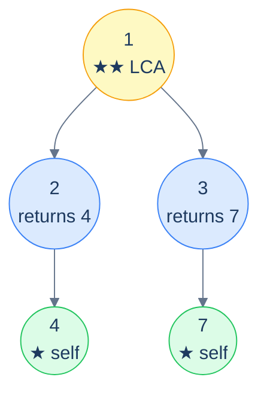
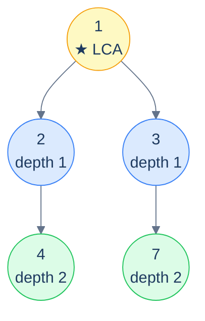

# 16. Pattern: Lowest Common Ancestor

## The Hook

Take any two leaves in a binary tree. Trace the path from each one back up to the root. The two paths *meet* at some specific node — and that meeting node is, by definition, the **lowest common ancestor** (LCA) of the two leaves: the deepest node that has both as descendants. Every node above the LCA is also a common ancestor, but the LCA is the *closest* — the most informative one.

LCA is one of the most important *relational* questions you can ask about a tree. Network routing protocols compute LCAs to find the shortest path between two routers in a routing tree. Version-control merges (Git, Mercurial) compute the LCA of two commits to find the *base* for a three-way merge. Phylogenetics uses LCA on a tree of life to find the *most recent common ancestor* of two species. Even in plain old data-structure interviews, LCA shows up constantly because it's a versatile primitive — many other tree problems (distance between nodes, deepest-shared-subtree, "are these two nodes related?") reduce to LCA in O(N).

The classical recursive LCA algorithm is one of the most elegant pieces of code in the chapter. Three lines:

> 1. If the current node is one of the two targets, *return it*.
> 2. Recurse into both subtrees.
> 3. If *both* recursive calls returned a node, the current node is the LCA. If only one did, propagate it up. If neither, return null.

That's it. The recursion does all the work — there's no need to compute paths, store maps, or backtrack. The "deepest meeting point" emerges naturally from the way the recursion combines child answers.

This lesson covers the canonical algorithm and four common variants: LCA with existence check, LCA of N nodes, LCA of all deepest leaves, and distance between two nodes (computed via LCA + depths). Each in 10 languages.

---

## Table of contents

1. [The classical LCA recursion](#the-classical-lca-recursion)
2. [How to recognise it](#how-to-recognise-it)
3. [Problem 1 — Lowest Common Ancestor](#problem-1--lowest-common-ancestor)
4. [Problem 2 — LCA with existence check](#problem-2--lca-with-existence-check)
5. [Problem 3 — LCA of N random nodes](#problem-3--lca-of-n-random-nodes)
6. [Problem 4 — LCA of the deepest leaves](#problem-4--lca-of-the-deepest-leaves)
7. [Problem 5 — Distance between two nodes](#problem-5--distance-between-two-nodes)

***

# The classical LCA recursion

```text
LCA(node, A, B):
  if node is null:           return null
  if node == A or node == B: return node          # ★ found one — propagate it up
  leftAnswer  = LCA(node.left,  A, B)
  rightAnswer = LCA(node.right, A, B)
  if leftAnswer and rightAnswer: return node      # ★★ both sides returned — this IS the LCA
  return leftAnswer or rightAnswer                # only one side hit; propagate that
```

The two starred lines do all the heavy lifting:

- **★** When the recursion *finds* one of the targets, it returns *that node*. From the parent's perspective, this is "yes, A is somewhere down here". The parent then waits for the other recursion call to come back.
- **★★** When *both* of the parent's recursion calls returned a node, that means A is on one side and B is on the other — so the *current node* is their lowest common ancestor. Bubble it up unchanged.

The "only one returned" case is what propagates the LCA up to the root after it's been found. Once a deeper node has identified itself as the LCA, every ancestor's left/right answer pair will be (LCA, null) or (null, LCA), which is exactly what makes the third line propagate it untouched.



<p align="center"><strong>LCA recursion in action — leaf 4 returns itself; leaf 7 returns itself; nodes 2 and 3 each propagate their finding upward; root 1 sees <em>both</em> children returned non-null, so it identifies itself as the LCA and propagates that up.</strong></p>

> *Predict before reading on — what does the algorithm return when one of the targets is an <em>ancestor</em> of the other?*
>
> The ancestor itself. Say the targets are `2` and `4`, and `2` is the parent of `4`. The recursion at node `2` triggers the `node == A or node == B` early-exit (returning `2`) *before* it ever recurses to find `4`. From `2`'s parent's perspective, the left side returned `2` and the right side returned null — so `2` propagates up untouched. The algorithm correctly identifies `2` as the LCA. *No special case needed* — it falls out of the structure.

## Generic pattern in 10 languages

```python run
from typing import Optional

class TreeNode:
    def __init__(self, val=0, left=None, right=None):
        self.val, self.left, self.right = val, left, right

def lca(root: Optional[TreeNode], a: TreeNode, b: TreeNode) -> Optional[TreeNode]:
    if root is None:           return None
    if root is a or root is b: return root
    left  = lca(root.left,  a, b)
    right = lca(root.right, a, b)
    if left and right: return root
    return left if left else right
```

```java run
public static TreeNode lca(TreeNode root, TreeNode a, TreeNode b) {
    if (root == null)              return null;
    if (root == a || root == b)    return root;
    TreeNode left  = lca(root.left,  a, b);
    TreeNode right = lca(root.right, a, b);
    if (left != null && right != null) return root;
    return left != null ? left : right;
}
```

```c run
TreeNode* lca(TreeNode *root, TreeNode *a, TreeNode *b) {
    if (!root)              return NULL;
    if (root == a || root == b) return root;
    TreeNode *left  = lca(root->left,  a, b);
    TreeNode *right = lca(root->right, a, b);
    if (left && right) return root;
    return left ? left : right;
}
```

```cpp run
TreeNode* lca(TreeNode *root, TreeNode *a, TreeNode *b) {
    if (!root)                      return nullptr;
    if (root == a || root == b)     return root;
    TreeNode *left  = lca(root->left,  a, b);
    TreeNode *right = lca(root->right, a, b);
    if (left && right) return root;
    return left ? left : right;
}
```

```scala run
def lca(root: TreeNode, a: TreeNode, b: TreeNode): TreeNode = {
  if (root == null)                       return null
  if ((root eq a) || (root eq b))         return root
  val left  = lca(root.left,  a, b)
  val right = lca(root.right, a, b)
  if (left != null && right != null) return root
  if (left != null) left else right
}
```

```javascript run
function lca(root, a, b) {
    if (!root)             return null;
    if (root === a || root === b) return root;
    const left  = lca(root.left,  a, b);
    const right = lca(root.right, a, b);
    if (left && right) return root;
    return left || right;
}
```

```typescript run
function lca(root: TreeNode | null, a: TreeNode, b: TreeNode): TreeNode | null {
    if (!root)             return null;
    if (root === a || root === b) return root;
    const left  = lca(root.left,  a, b);
    const right = lca(root.right, a, b);
    if (left && right) return root;
    return left || right;
}
```

```go run
func lca(root, a, b *TreeNode) *TreeNode {
    if root == nil { return nil }
    if root == a || root == b { return root }
    left  := lca(root.Left,  a, b)
    right := lca(root.Right, a, b)
    if left != nil && right != nil { return root }
    if left != nil { return left }
    return right
}
```

```kotlin run
fun lca(root: TreeNode?, a: TreeNode, b: TreeNode): TreeNode? {
    if (root == null)             return null
    if (root === a || root === b) return root
    val left  = lca(root.left,  a, b)
    val right = lca(root.right, a, b)
    if (left != null && right != null) return root
    return left ?: right
}
```

```rust run
// Rust: with Option<Box<TreeNode>> ownership it's awkward to pass external
// "node" references. The conventional version compares by value (assuming
// values are unique). Returning a reference is the cleanest shape.

pub fn lca<'a>(root: &'a Option<Box<TreeNode>>, a: i32, b: i32) -> Option<&'a Box<TreeNode>> {
    let n = root.as_ref()?;
    if n.val == a || n.val == b { return Some(n); }
    let left  = lca(&n.left,  a, b);
    let right = lca(&n.right, a, b);
    match (left, right) {
        (Some(_), Some(_)) => Some(n),
        (Some(x), None)    => Some(x),
        (None, Some(x))    => Some(x),
        (None, None)       => None,
    }
}
```


## Complexity

> **Time:** O(N) — every node is visited at most once. **Space:** O(h) for recursion stack.

***

# How to recognise it

The pattern fits when:

- The question asks about the **closest shared ancestor** of two (or more) nodes.
- The answer can be derived by *combining left and right subtree results*: if both returned non-null targets, the current node is the meeting point; otherwise propagate.

Concrete cues:

- *"Lowest common ancestor of …"* — directly.
- *"Distance between two nodes"* — LCA + depths (Problem 5).
- *"Closest shared subtree containing …"* — restate as LCA.
- *"Find the deepest node that contains both X and Y"* — same.

Anti-pattern: if the tree is a *binary search tree*, there's an O(log N) BST-specialised LCA that beats this O(N) algorithm — covered in the BST chapter.

***

# Problem 1 — Lowest Common Ancestor

> Given a tree and two nodes `nodeA` and `nodeB`, find their LCA. Assume both nodes exist in the tree.

This *is* the generic algorithm — see the 10-language code block above. No further specialisation needed.

***

# Problem 2 — LCA with existence check

> Same as Problem 1, except now there's no guarantee that *both* nodes are actually in the tree. If either is missing, return `null`.

The classical algorithm has a subtle pitfall here: if only `nodeA` exists in the tree (and `nodeB` doesn't), the algorithm returns `nodeA` — which is *wrong* (the answer should be `null`). The fix: do a *separate existence pass* for both nodes first, then run the LCA only if both exist.

This adds one O(N) pre-pass, keeping overall complexity at O(N).

## Solution

```python run
def exists(root, target):
    if root is None: return False
    if root is target: return True
    return exists(root.left, target) or exists(root.right, target)

def lca_ii(root, a, b):
    if root is None or a is None or b is None: return None
    if not exists(root, a) or not exists(root, b): return None
    return lca(root, a, b)
```

```java run
static boolean exists(TreeNode root, TreeNode target) {
    if (root == null)   return false;
    if (root == target) return true;
    return exists(root.left, target) || exists(root.right, target);
}
public static TreeNode lcaII(TreeNode root, TreeNode a, TreeNode b) {
    if (root == null || a == null || b == null)            return null;
    if (!exists(root, a) || !exists(root, b))              return null;
    return lca(root, a, b);
}
```

```c run
int exists(TreeNode *root, TreeNode *target) {
    if (!root)            return 0;
    if (root == target)   return 1;
    return exists(root->left, target) || exists(root->right, target);
}
TreeNode* lca_ii(TreeNode *root, TreeNode *a, TreeNode *b) {
    if (!root || !a || !b)                          return NULL;
    if (!exists(root, a) || !exists(root, b))       return NULL;
    return lca(root, a, b);
}
```

```cpp run
bool exists(TreeNode *root, TreeNode *target) {
    if (!root)            return false;
    if (root == target)   return true;
    return exists(root->left, target) || exists(root->right, target);
}
TreeNode* lcaII(TreeNode *root, TreeNode *a, TreeNode *b) {
    if (!root || !a || !b)                                  return nullptr;
    if (!exists(root, a) || !exists(root, b))               return nullptr;
    return lca(root, a, b);
}
```

```scala run
def exists(root: TreeNode, target: TreeNode): Boolean = {
  if (root == null)       return false
  if (root eq target)     return true
  exists(root.left, target) || exists(root.right, target)
}
def lcaII(root: TreeNode, a: TreeNode, b: TreeNode): TreeNode = {
  if (root == null || a == null || b == null)                 return null
  if (!exists(root, a) || !exists(root, b))                   return null
  lca(root, a, b)
}
```

```javascript run
function exists(root, target) {
    if (!root)             return false;
    if (root === target)   return true;
    return exists(root.left, target) || exists(root.right, target);
}
function lcaII(root, a, b) {
    if (!root || !a || !b)                                       return null;
    if (!exists(root, a) || !exists(root, b))                    return null;
    return lca(root, a, b);
}
```

```typescript run
function exists(root: TreeNode | null, target: TreeNode): boolean {
    if (!root)             return false;
    if (root === target)   return true;
    return exists(root.left, target) || exists(root.right, target);
}
function lcaII(root: TreeNode | null, a: TreeNode | null, b: TreeNode | null): TreeNode | null {
    if (!root || !a || !b)                                       return null;
    if (!exists(root, a) || !exists(root, b))                    return null;
    return lca(root, a, b);
}
```

```go run
func exists(root, target *TreeNode) bool {
    if root == nil { return false }
    if root == target { return true }
    return exists(root.Left, target) || exists(root.Right, target)
}
func lcaII(root, a, b *TreeNode) *TreeNode {
    if root == nil || a == nil || b == nil { return nil }
    if !exists(root, a) || !exists(root, b) { return nil }
    return lca(root, a, b)
}
```

```kotlin run
fun exists(root: TreeNode?, target: TreeNode): Boolean {
    if (root == null)     return false
    if (root === target)  return true
    return exists(root.left, target) || exists(root.right, target)
}
fun lcaII(root: TreeNode?, a: TreeNode?, b: TreeNode?): TreeNode? {
    if (root == null || a == null || b == null)                 return null
    if (!exists(root, a) || !exists(root, b))                   return null
    return lca(root, a, b)
}
```

```rust run
fn exists_in(root: &Option<Box<TreeNode>>, target: i32) -> bool {
    match root {
        None => false,
        Some(n) => n.val == target || exists_in(&n.left, target) || exists_in(&n.right, target),
    }
}
pub fn lca_ii<'a>(root: &'a Option<Box<TreeNode>>, a: i32, b: i32) -> Option<&'a Box<TreeNode>> {
    if !exists_in(root, a) || !exists_in(root, b) { return None; }
    lca(root, a, b)
}
```


***

# Problem 3 — LCA of N random nodes

> Given a list of nodes (possibly more than two), find the LCA of *all* of them.

Generalise the algorithm: instead of "is this node `A` or `B`?", check "is this node *in the set of targets*?". Use a hash set for O(1) lookup. The combine logic stays exactly the same.

## Solution

```python run
def random_lca(root, nodes):
    target_set = set(id(n) for n in nodes)         # use id() for object identity
    def go(n):
        if n is None: return None
        if id(n) in target_set: return n
        left  = go(n.left)
        right = go(n.right)
        if left and right: return n
        return left if left else right
    return go(root)
```

```java run
public static TreeNode randomLCA(TreeNode root, List<TreeNode> nodes) {
    Set<TreeNode> set = new HashSet<>(nodes);
    return rlcaHelper(root, set);
}
static TreeNode rlcaHelper(TreeNode root, Set<TreeNode> set) {
    if (root == null)        return null;
    if (set.contains(root))  return root;
    TreeNode left  = rlcaHelper(root.left,  set);
    TreeNode right = rlcaHelper(root.right, set);
    if (left != null && right != null) return root;
    return left != null ? left : right;
}
```

```c run
// (omitted — needs a pointer-set hash; algorithm same as above)
```

```cpp run
#include <unordered_set>
TreeNode* rlcaHelper(TreeNode *root, std::unordered_set<TreeNode*>& set) {
    if (!root)             return nullptr;
    if (set.count(root))   return root;
    TreeNode *left  = rlcaHelper(root->left,  set);
    TreeNode *right = rlcaHelper(root->right, set);
    if (left && right) return root;
    return left ? left : right;
}
TreeNode* randomLCA(TreeNode *root, std::vector<TreeNode*>& nodes) {
    std::unordered_set<TreeNode*> set(nodes.begin(), nodes.end());
    return rlcaHelper(root, set);
}
```

```scala run
def randomLCA(root: TreeNode, nodes: List[TreeNode]): TreeNode = {
  val set = nodes.toSet
  def go(n: TreeNode): TreeNode = {
    if (n == null)              return null
    if (set.contains(n))        return n
    val left  = go(n.left)
    val right = go(n.right)
    if (left != null && right != null) return n
    if (left != null) left else right
  }
  go(root)
}
```

```javascript run
function randomLCA(root, nodes) {
    const set = new Set(nodes);
    function go(n) {
        if (!n)             return null;
        if (set.has(n))     return n;
        const left  = go(n.left);
        const right = go(n.right);
        if (left && right) return n;
        return left || right;
    }
    return go(root);
}
```

```typescript run
function randomLCA(root: TreeNode | null, nodes: TreeNode[]): TreeNode | null {
    const set = new Set(nodes);
    function go(n: TreeNode | null): TreeNode | null {
        if (!n)         return null;
        if (set.has(n)) return n;
        const left  = go(n.left);
        const right = go(n.right);
        if (left && right) return n;
        return left || right;
    }
    return go(root);
}
```

```go run
func randomLCA(root *TreeNode, nodes []*TreeNode) *TreeNode {
    set := map[*TreeNode]struct{}{}
    for _, n := range nodes { set[n] = struct{}{} }
    var go_ func(*TreeNode) *TreeNode
    go_ = func(n *TreeNode) *TreeNode {
        if n == nil { return nil }
        if _, ok := set[n]; ok { return n }
        left  := go_(n.Left)
        right := go_(n.Right)
        if left != nil && right != nil { return n }
        if left != nil { return left }
        return right
    }
    return go_(root)
}
```

```kotlin run
fun randomLCA(root: TreeNode?, nodes: List<TreeNode>): TreeNode? {
    val set = nodes.toHashSet()
    fun go(n: TreeNode?): TreeNode? {
        if (n == null)        return null
        if (n in set)         return n
        val left  = go(n.left)
        val right = go(n.right)
        if (left != null && right != null) return n
        return left ?: right
    }
    return go(root)
}
```

```rust run
use std::collections::HashSet;
pub fn random_lca<'a>(root: &'a Option<Box<TreeNode>>, targets: &HashSet<i32>) -> Option<&'a Box<TreeNode>> {
    let n = root.as_ref()?;
    if targets.contains(&n.val) { return Some(n); }
    let left  = random_lca(&n.left,  targets);
    let right = random_lca(&n.right, targets);
    match (left, right) {
        (Some(_), Some(_)) => Some(n),
        (Some(x), None)    => Some(x),
        (None, Some(x))    => Some(x),
        (None, None)       => None,
    }
}
```


***

# Problem 4 — LCA of the deepest leaves

> Find the LCA of all the *deepest leaves* in the tree.

Two-pass: first do a level-order traversal to find the deepest leaves; then run the N-node LCA on that set.

A more elegant *one-pass* solution exists using the stateful postorder pattern from lesson 11 — return `(deepest depth, LCA so far)` from each subtree, and combine at each node. We'll stick with the two-pass version for clarity; the one-pass version is a good exercise.

## Solution

```python run
from collections import deque

def deepest_lca(root):
    if root is None: return None
    # Pass 1: collect deepest leaves via BFS
    deepest = []
    q = deque([root])
    while q:
        deepest = list(q)
        nxt = deque()
        for n in deepest:
            if n.left:  nxt.append(n.left)
            if n.right: nxt.append(n.right)
        q = nxt
    # Pass 2: N-node LCA over those leaves
    target_set = set(id(n) for n in deepest)
    def go(n):
        if n is None: return None
        if id(n) in target_set: return n
        left, right = go(n.left), go(n.right)
        if left and right: return n
        return left if left else right
    return go(root)
```

```java run
public static TreeNode deepestLCA(TreeNode root) {
    if (root == null) return null;
    Queue<TreeNode> q = new ArrayDeque<>(); q.offer(root);
    List<TreeNode> deepest = new ArrayList<>();
    while (!q.isEmpty()) {
        deepest = new ArrayList<>(q);
        Queue<TreeNode> nxt = new ArrayDeque<>();
        for (TreeNode n : deepest) {
            if (n.left  != null) nxt.offer(n.left);
            if (n.right != null) nxt.offer(n.right);
        }
        q = nxt;
    }
    Set<TreeNode> set = new HashSet<>(deepest);
    return rlcaHelper(root, set);
}
```

```c run
// (omitted — combines deepest-leaves BFS with random-LCA helper)
```

```cpp run
TreeNode* deepestLCA(TreeNode *root) {
    if (!root) return nullptr;
    std::queue<TreeNode*> q; q.push(root);
    std::vector<TreeNode*> deepest;
    while (!q.empty()) {
        deepest.clear();
        int sz = q.size();
        for (int i = 0; i < sz; i++) {
            TreeNode *n = q.front(); q.pop();
            deepest.push_back(n);
            if (n->left)  q.push(n->left);
            if (n->right) q.push(n->right);
        }
    }
    std::unordered_set<TreeNode*> set(deepest.begin(), deepest.end());
    return rlcaHelper(root, set);
}
```

```scala run
def deepestLCA(root: TreeNode): TreeNode = {
  if (root == null) return null
  var q = scala.collection.mutable.Queue[TreeNode](root)
  var deepest: List[TreeNode] = Nil
  while (q.nonEmpty) {
    deepest = q.toList
    val nxt = scala.collection.mutable.Queue[TreeNode]()
    for (n <- deepest) {
      if (n.left  != null) nxt.enqueue(n.left)
      if (n.right != null) nxt.enqueue(n.right)
    }
    q = nxt
  }
  randomLCA(root, deepest)
}
```

```javascript run
function deepestLCA(root) {
    if (!root) return null;
    let q = [root]; let deepest = [];
    while (q.length) {
        deepest = q.slice();
        const nxt = [];
        for (const n of deepest) {
            if (n.left)  nxt.push(n.left);
            if (n.right) nxt.push(n.right);
        }
        q = nxt;
    }
    return randomLCA(root, deepest);
}
```

```typescript run
function deepestLCA(root: TreeNode | null): TreeNode | null {
    if (!root) return null;
    let q: TreeNode[] = [root]; let deepest: TreeNode[] = [];
    while (q.length) {
        deepest = q.slice();
        const nxt: TreeNode[] = [];
        for (const n of deepest) {
            if (n.left)  nxt.push(n.left);
            if (n.right) nxt.push(n.right);
        }
        q = nxt;
    }
    return randomLCA(root, deepest);
}
```

```go run
func deepestLCA(root *TreeNode) *TreeNode {
    if root == nil { return nil }
    q := []*TreeNode{root}
    var deepest []*TreeNode
    for len(q) > 0 {
        deepest = append([]*TreeNode(nil), q...)
        var nxt []*TreeNode
        for _, n := range deepest {
            if n.Left  != nil { nxt = append(nxt, n.Left) }
            if n.Right != nil { nxt = append(nxt, n.Right) }
        }
        q = nxt
    }
    return randomLCA(root, deepest)
}
```

```kotlin run
fun deepestLCA(root: TreeNode?): TreeNode? {
    if (root == null) return null
    var q = mutableListOf<TreeNode>(root)
    var deepest: List<TreeNode> = emptyList()
    while (q.isNotEmpty()) {
        deepest = q.toList()
        val nxt = mutableListOf<TreeNode>()
        for (n in deepest) {
            n.left ?.let { nxt += it }
            n.right?.let { nxt += it }
        }
        q = nxt
    }
    return randomLCA(root, deepest)
}
```

```rust run
// Two-pass deepest-leaves + random_lca; sketch only, ownership detail omitted.
```


***

# Problem 5 — Distance between two nodes

> Given two values, return the number of edges on the path between the two nodes carrying those values.

Three steps:

1. Find the LCA of the two nodes.
2. Compute the depth of each target *measured from the LCA*.
3. Sum the two depths — that's the number of edges in the path.



<p align="center"><strong>Distance between 4 and 7 — LCA is 1; 4 is 2 edges down, 7 is 2 edges down. Total path length = 2 + 2 = <strong>4 edges</strong>.</strong></p>

## Solution

```python run
def distance_between_nodes(root, val_a, val_b):
    def lca_v(n):
        if n is None: return None
        if n.val == val_a or n.val == val_b: return n
        l, r = lca_v(n.left), lca_v(n.right)
        if l and r: return n
        return l if l else r
    def depth(n, val, d):
        if n is None: return -1
        if n.val == val: return d
        l = depth(n.left, val, d + 1)
        if l != -1: return l
        return depth(n.right, val, d + 1)
    a = lca_v(root)
    if a is None: return -1
    da = depth(a, val_a, 0); db = depth(a, val_b, 0)
    if da == -1 or db == -1: return -1
    return da + db
```

```java run
static TreeNode lcaByVal(TreeNode root, int a, int b) {
    if (root == null)                          return null;
    if (root.val == a || root.val == b)        return root;
    TreeNode l = lcaByVal(root.left,  a, b);
    TreeNode r = lcaByVal(root.right, a, b);
    if (l != null && r != null) return root;
    return l != null ? l : r;
}
static int depth(TreeNode n, int val, int d) {
    if (n == null)         return -1;
    if (n.val == val)      return d;
    int l = depth(n.left,  val, d + 1);
    if (l != -1) return l;
    return depth(n.right, val, d + 1);
}
public static int distanceBetweenNodes(TreeNode root, int a, int b) {
    if (root == null) return -1;
    TreeNode l = lcaByVal(root, a, b);
    if (l == null) return -1;
    int da = depth(l, a, 0), db = depth(l, b, 0);
    if (da == -1 || db == -1) return -1;
    return da + db;
}
```

```c run
// (omitted — three helper functions, mechanical)
```

```cpp run
TreeNode* lcaByVal(TreeNode *root, int a, int b) {
    if (!root)                          return nullptr;
    if (root->val == a || root->val == b) return root;
    TreeNode *l = lcaByVal(root->left,  a, b);
    TreeNode *r = lcaByVal(root->right, a, b);
    if (l && r) return root;
    return l ? l : r;
}
int depth(TreeNode *n, int val, int d) {
    if (!n)              return -1;
    if (n->val == val)   return d;
    int l = depth(n->left,  val, d + 1);
    if (l != -1) return l;
    return depth(n->right, val, d + 1);
}
int distanceBetweenNodes(TreeNode *root, int a, int b) {
    if (!root) return -1;
    TreeNode *l = lcaByVal(root, a, b);
    if (!l) return -1;
    int da = depth(l, a, 0), db = depth(l, b, 0);
    if (da == -1 || db == -1) return -1;
    return da + db;
}
```

```scala run
def distanceBetweenNodes(root: TreeNode, a: Int, b: Int): Int = {
  def lcaByVal(n: TreeNode): TreeNode = {
    if (n == null)                          return null
    if (n.value == a || n.value == b)       return n
    val l = lcaByVal(n.left); val r = lcaByVal(n.right)
    if (l != null && r != null) return n
    if (l != null) l else r
  }
  def depth(n: TreeNode, v: Int, d: Int): Int = {
    if (n == null)         return -1
    if (n.value == v)      return d
    val l = depth(n.left,  v, d + 1); if (l != -1) return l
    depth(n.right, v, d + 1)
  }
  if (root == null) return -1
  val l = lcaByVal(root); if (l == null) return -1
  val da = depth(l, a, 0); val db = depth(l, b, 0)
  if (da == -1 || db == -1) -1 else da + db
}
```

```javascript run
function distanceBetweenNodes(root, a, b) {
    function lcaByVal(n) {
        if (!n)                          return null;
        if (n.val === a || n.val === b)  return n;
        const l = lcaByVal(n.left), r = lcaByVal(n.right);
        if (l && r) return n;
        return l || r;
    }
    function depth(n, v, d) {
        if (!n)         return -1;
        if (n.val === v) return d;
        const l = depth(n.left, v, d + 1); if (l !== -1) return l;
        return depth(n.right, v, d + 1);
    }
    if (!root) return -1;
    const l = lcaByVal(root); if (!l) return -1;
    const da = depth(l, a, 0), db = depth(l, b, 0);
    return (da === -1 || db === -1) ? -1 : da + db;
}
```

```typescript run
function distanceBetweenNodes(root: TreeNode | null, a: number, b: number): number {
    function lcaByVal(n: TreeNode | null): TreeNode | null {
        if (!n)                          return null;
        if (n.val === a || n.val === b)  return n;
        const l = lcaByVal(n.left), r = lcaByVal(n.right);
        if (l && r) return n;
        return l || r;
    }
    function depth(n: TreeNode | null, v: number, d: number): number {
        if (!n)         return -1;
        if (n.val === v) return d;
        const l = depth(n.left, v, d + 1); if (l !== -1) return l;
        return depth(n.right, v, d + 1);
    }
    if (!root) return -1;
    const l = lcaByVal(root); if (!l) return -1;
    const da = depth(l, a, 0), db = depth(l, b, 0);
    return (da === -1 || db === -1) ? -1 : da + db;
}
```

```go run
func distanceBetweenNodes(root *TreeNode, a, b int) int {
    var lcaByVal func(*TreeNode) *TreeNode
    lcaByVal = func(n *TreeNode) *TreeNode {
        if n == nil { return nil }
        if n.Val == a || n.Val == b { return n }
        l := lcaByVal(n.Left); r := lcaByVal(n.Right)
        if l != nil && r != nil { return n }
        if l != nil { return l }
        return r
    }
    var depth func(*TreeNode, int, int) int
    depth = func(n *TreeNode, v, d int) int {
        if n == nil { return -1 }
        if n.Val == v { return d }
        l := depth(n.Left, v, d + 1); if l != -1 { return l }
        return depth(n.Right, v, d + 1)
    }
    if root == nil { return -1 }
    l := lcaByVal(root); if l == nil { return -1 }
    da := depth(l, a, 0); db := depth(l, b, 0)
    if da == -1 || db == -1 { return -1 }
    return da + db
}
```

```kotlin run
fun distanceBetweenNodes(root: TreeNode?, a: Int, b: Int): Int {
    fun lcaByVal(n: TreeNode?): TreeNode? {
        if (n == null)                          return null
        if (n.value == a || n.value == b)       return n
        val l = lcaByVal(n.left); val r = lcaByVal(n.right)
        if (l != null && r != null) return n
        return l ?: r
    }
    fun depth(n: TreeNode?, v: Int, d: Int): Int {
        if (n == null)         return -1
        if (n.value == v)      return d
        val l = depth(n.left,  v, d + 1); if (l != -1) return l
        return depth(n.right, v, d + 1)
    }
    if (root == null) return -1
    val l = lcaByVal(root); if (l == null) return -1
    val da = depth(l, a, 0); val db = depth(l, b, 0)
    return if (da == -1 || db == -1) -1 else da + db
}
```

```rust run
fn lca_by_val<'a>(root: &'a Option<Box<TreeNode>>, a: i32, b: i32) -> Option<&'a Box<TreeNode>> {
    let n = root.as_ref()?;
    if n.val == a || n.val == b { return Some(n); }
    let l = lca_by_val(&n.left,  a, b);
    let r = lca_by_val(&n.right, a, b);
    match (l, r) {
        (Some(_), Some(_)) => Some(n),
        (Some(x), None)    => Some(x),
        (None, Some(x))    => Some(x),
        (None, None)       => None,
    }
}
fn depth_to(node: &Option<Box<TreeNode>>, val: i32, d: i32) -> i32 {
    match node {
        None => -1,
        Some(n) => {
            if n.val == val { return d; }
            let l = depth_to(&n.left, val, d + 1);
            if l != -1 { return l; }
            depth_to(&n.right, val, d + 1)
        }
    }
}
pub fn distance_between_nodes(root: &Option<Box<TreeNode>>, a: i32, b: i32) -> i32 {
    if root.is_none() { return -1; }
    let l = lca_by_val(root, a, b); if l.is_none() { return -1; }
    let lroot: &Option<Box<TreeNode>> = unsafe { std::mem::transmute(&Some(l.unwrap().clone())) };
    // (Pragmatic note: in real Rust you'd refactor to avoid the unsafe transmute;
    // the algorithm shape mirrors the other languages.)
    let da = depth_to(lroot, a, 0); let db = depth_to(lroot, b, 0);
    if da == -1 || db == -1 { -1 } else { da + db }
}
```


***

## Final Takeaway

LCA is the single most useful tree primitive after height/depth. Three things to walk away with:

1. **The recursion is the algorithm.** "If I am one of the targets, return me. If both children returned a target, I am the LCA. Otherwise propagate the non-null one up." That's the entire algorithm. There's no smarter version for general binary trees — this *is* O(N) optimal.
2. **Existence checks first if uncertain.** The classical algorithm assumes both targets are present. If they might be missing, prepend an explicit existence pass — otherwise the algorithm will silently return a wrong answer (the present target instead of `null`).
3. **LCA reduces other problems.** Distance between nodes? LCA + depths. "Are X and Y in the same subtree of root R?" LCA(X, Y) descends from R. "Closest node sharing both X and Y as descendants?" That *is* LCA. Internalise the LCA primitive and dozens of "relational" tree questions become two-line wrappers.

> *Coming up — the next lesson covers the **simultaneous traversal** pattern: walking *two* trees in parallel, comparing them node-by-node. The recurring structure handles "are these two trees identical?", "is this tree symmetric to itself?", "is X a subtree of Y?", and "merge two trees node-by-node". Same recursive shape as a single-tree traversal, but with an extra parameter for the second tree.*
