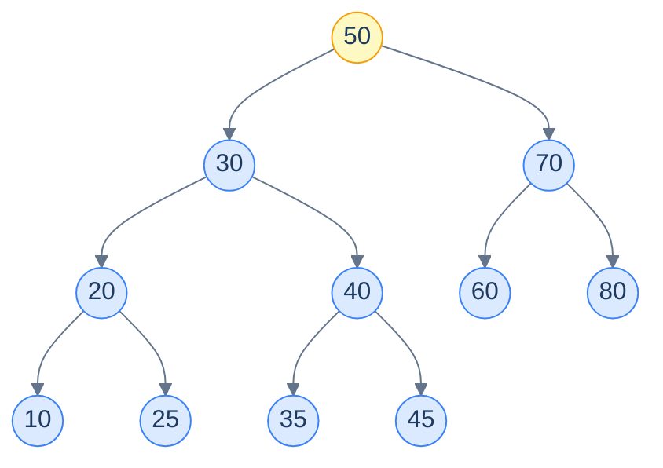
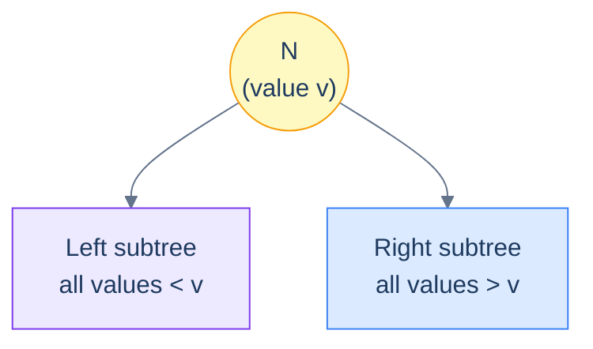
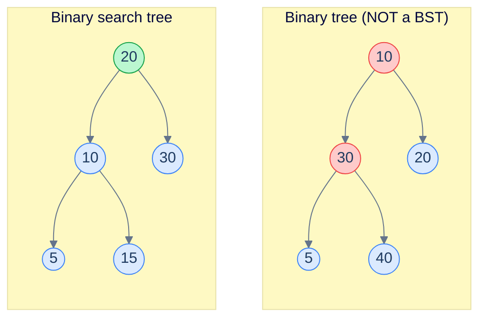
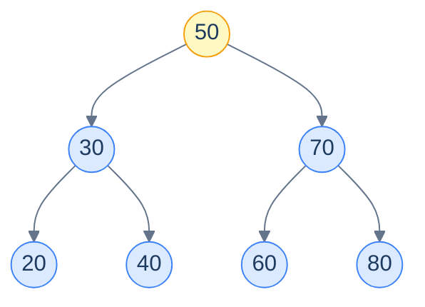
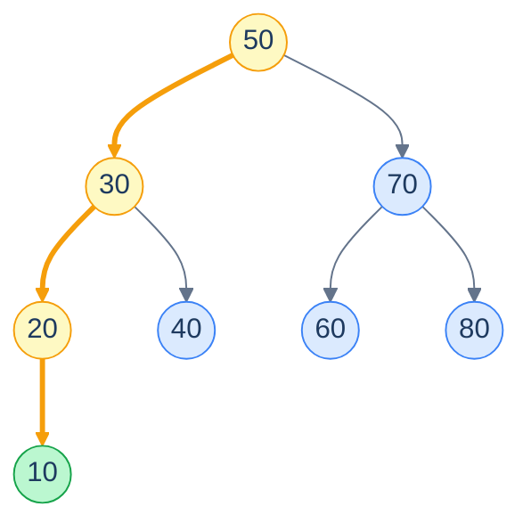
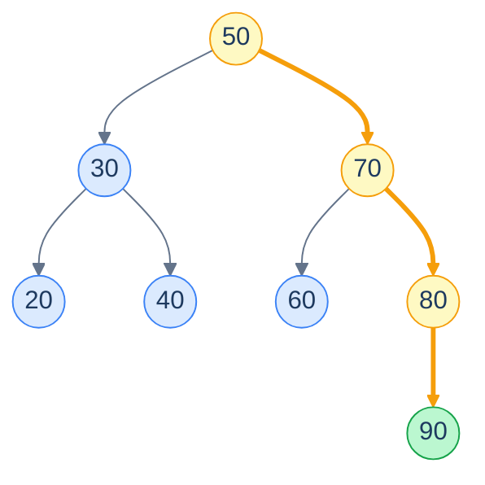
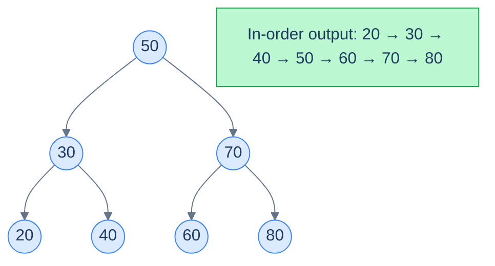
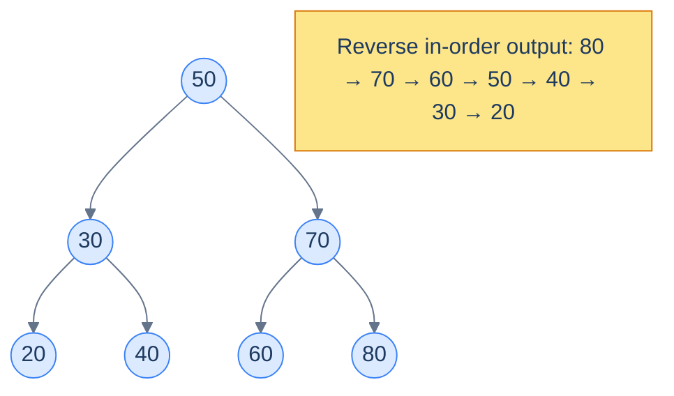
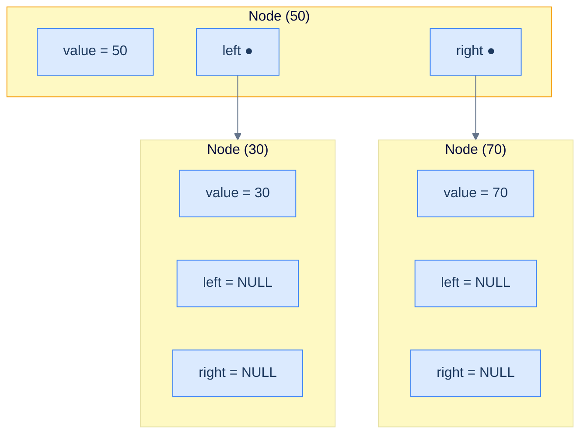

# 1. Introduction to Binary Search Trees

## The Hook

A plain binary tree gives you **shape** — parent, child, left, right — but it tells you *nothing* about where any specific value lives. Looking for the number `42` in a tree of a million nodes? You have to walk every branch. The structure is hierarchical, but the data inside it is still chaos.

Now imagine a tiny extra rule: at every node, **smaller values must live to the left, larger values must live to the right**. That single constraint turns the tree into a *map*. Looking for `42` is no longer a search — it's a *descent*. At each step, one comparison eliminates an entire subtree. A million-node search collapses into roughly twenty hops.

That rule is the **binary search property**, and the tree that obeys it is the **binary search tree (BST)** — the data structure that powers `std::map`, `TreeMap`, the indexes in your filesystem, and the ordered-set primitives your favourite database queries against. This first lesson is about the rule itself: what it says, why it's so powerful, what shapes count as a BST, and what an in-order walk through one looks like.

---

## Table of contents

1. [Understanding a binary search tree](#understanding-a-binary-search-tree)
2. [Structure of a binary search tree](#structure-of-a-binary-search-tree)
3. [Characteristics of a binary search tree](#characteristics-of-a-binary-search-tree)
4. [Implementation of binary search trees](#implementation-of-binary-search-trees)

***

# Understanding a binary search tree

A **binary search tree** is a binary tree with a *single extra rule* baked into every node: anything smaller must live in the left subtree, anything larger must live in the right subtree. The shape is identical to an ordinary binary tree — same nodes, same left/right children, same edges — but the *positions* of the values are now meaningful.

That meaning is what makes the structure pay off. In an ordinary binary tree you cannot *predict* where a value lives, so you must look everywhere. In a BST, every node is a signpost: comparing your target to the value at the node tells you which half of the remaining tree to throw away. Each step halves the work.

<strong>A binary search tree rooted at <code>50</code>. Every value to the left of <code>50</code> is smaller; every value to the right is larger. The same rule holds at <em>every</em> node — including <code>30</code>, <code>70</code>, and the rest.</strong>

The pay-off is enormous. Insertions, deletions, and lookups in a balanced BST take **O(log n)** time, not O(n). Every operation we'll meet in this chapter — search, insert, delete, range queries, lowest common ancestor, ordered iteration — is just a *different way of walking the tree while obeying the BST rule*. Learn the rule once and the whole chapter falls into place.

***

# Structure of a binary search tree

What turns a binary tree into a binary *search* tree is one constraint, applied at *every* node — not just the root.

> For every node **N** in the binary search tree:
>
> - All the values stored in the **left subtree** of `N` are **less than** the value stored in **N**.
> - All the values stored in the **right subtree** of **N** are **greater than** the value stored in **N**.

That phrase "for every node" matters. It's not enough that the root's left child is smaller — *every descendant* of the left child must also be smaller. The property is **recursive**: every subtree of a BST is itself a BST.

<strong>The binary search property at a single node. The same picture must hold at every node in the tree.</strong>

Almost every BST operation we'll meet in this chapter exploits this property to deliver **blazingly fast** runtimes. Search uses it to discard half the tree at each step. Insert uses it to find the unique correct slot. Even the in-order traversal — which we'll see in a moment — uses it to produce a sorted list as a *side-effect* of the structure.

## All BSTs are binary trees, but not the other way around

Every BST is a binary tree (it has the right shape: at most two children per node). But not every binary tree is a BST — most aren't, because most arrangements of numbers violate the rule somewhere.

<strong>Left: a perfectly valid binary tree, but <code>30</code> sits to the left of <code>10</code> — the BST rule is violated. Right: a binary tree that <em>does</em> satisfy the rule at every node, so it qualifies as a BST.</strong>

The lesson is that "binary search tree" is a *strictly stronger* category than "binary tree". The shape is the same; the discipline on the values is what's new.

## Example

Let's pin down what a valid BST looks like with one concrete tree we can verify by inspection.

<strong>An example BST. Verify: at every node, the left subtree only holds smaller values and the right subtree only holds larger ones.</strong>

Walk the tree node by node and check the rule:

- At `50`: left subtree is `{30, 20, 40}` (all `< 50`), right subtree is `{70, 60, 80}` (all `> 50`). ✓
- At `30`: left is `{20}` (`< 30`), right is `{40}` (`> 30`). ✓
- At `70`: left is `{60}` (`< 70`), right is `{80}` (`> 70`). ✓
- Leaves (`20`, `40`, `60`, `80`) have no children, so the rule is vacuously satisfied.

Every node passes, so the entire tree is a BST.

***

# Characteristics of a binary search tree

The BST rule has consequences. Three of them — minimum, maximum, and the in-order walk — fall out for free, without writing a single line of search code. Recognising them now will make every algorithm in the chapter feel obvious.

## Minimum

The rule says: *smaller values live to the left*. So if you keep walking left, you keep moving toward smaller values. When you can't walk left any more — when a node's left child is missing — you've reached the smallest value in the tree.

<strong>Walking left from the root: <code>50 → 30 → 20 → 10</code>. <code>10</code> has no left child, so it's the minimum.</strong>

Equivalently, the minimum is the **first value emitted by an in-order traversal** — the leftmost node in the tree. We'll lean on this later when we build BST iterators and ordered range queries.

## Maximum

The mirror image: *larger values live to the right*. Keep walking right, you keep moving toward larger values. The last node you reach — the one whose right child is missing — is the maximum.

<strong>Walking right from the root: <code>50 → 70 → 80 → 90</code>. <code>90</code> has no right child, so it's the maximum.</strong>

Equivalently, the maximum is the **first value emitted by a reverse in-order traversal** — the rightmost node in the tree.

## Inorder traversal

Recall the in-order traversal of a binary tree: visit the *left* subtree, then the *node itself*, then the *right* subtree. In a BST this rule has a magical consequence: the values come out **sorted in ascending order**. Always. For free.

Why? Look at the rule one more time. Everything in the left subtree is smaller than the node, and everything in the right subtree is bigger. So `(everything left) < node < (everything right)`. If we recursively process the left subtree first, then emit the node, then process the right subtree, we are guaranteed a sorted output at every level.

<strong>Visiting left, then node, then right at every step yields a fully sorted list. The BST <em>is</em> a sorted sequence — just stored as a tree.</strong>

This single fact powers half of the patterns we'll meet later: ordered iteration, the k-th smallest element, two-pointer techniques on a BST, range sums, validation, and more. Whenever you need values in sorted order, an in-order walk over a BST gives them to you in O(n).

## Reverse inorder traversal

Mirror the in-order rule and you get the reverse: visit *right*, then *node*, then *left*. The values now come out in **descending order**.

<strong>Visiting right, then node, then left at every step yields a list in descending order — useful whenever you need the k-th largest, or want to walk a sorted set backwards.</strong>

***

# Implementation of binary search trees

A BST is just a binary tree with a discipline on its values, so its *physical* representation is exactly what you'd use for any binary tree: a **linked structure** of nodes, each holding a value and pointers to its left and right children.

In principle you *could* store a BST in an array (the way heaps do, with index `2i+1` for the left child and `2i+2` for the right). In practice, almost no real BST does. Here's why.

**Why are binary search trees stored as linked structures?**

- BST operations rarely need to move *upwards* — most of them descend from the root. A linked structure with only `left`/`right` pointers is enough; we don't need a parent pointer or random access.
- BSTs grow and shrink at unpredictable positions. Inserting `15` into the tree above might make `15` the *left child of 20*, deep inside the tree. Doing that in an array would require shifting nodes around to keep the index formula valid. With a linked structure you just allocate a new node and wire one pointer.
- A linked structure is naturally sparse. A BST does not have to be complete or balanced — it can be tall and skinny on one side. An array representation wastes huge amounts of space on missing slots in such trees.

So every node in a BST holds three things: a **value**, a pointer to its **left** child, and a pointer to its **right** child. Linking these together gives you the full tree.

<strong>The physical layout of a BST: identical to a generic binary tree's linked representation. The BST property lives in <em>where</em> values are placed, not in how nodes are wired.</strong>

Throughout this chapter, when we write `node.left` or `node.right`, this is the picture in your head — a small struct with a value and two child pointers. That's the entire physical machinery. Everything else — search, insert, delete, balance — is just smart traversal over this skeleton.

The next lesson sharpens an idea you've already met informally: a BST can be tall and skinny, or short and bushy, and that *shape* is what decides whether your operations run in O(log n) or in catastrophic O(n). We'll formalise it as **height** and **balance** — the two numbers that quietly govern every BST's performance.
