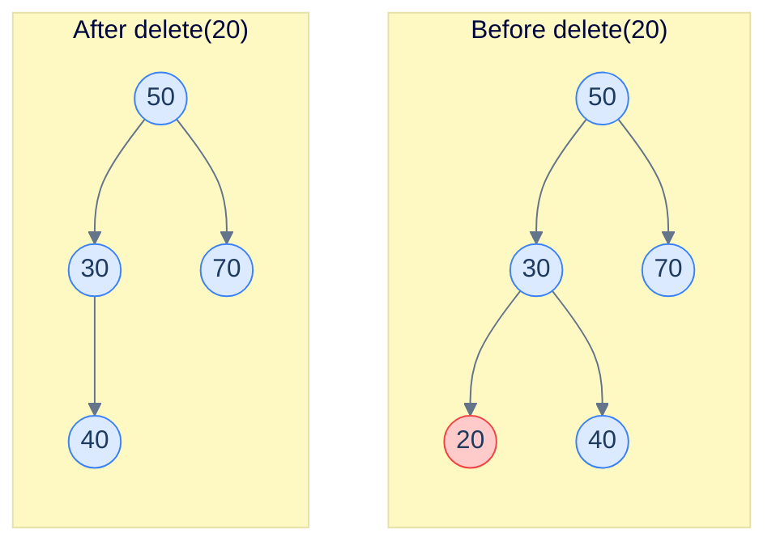
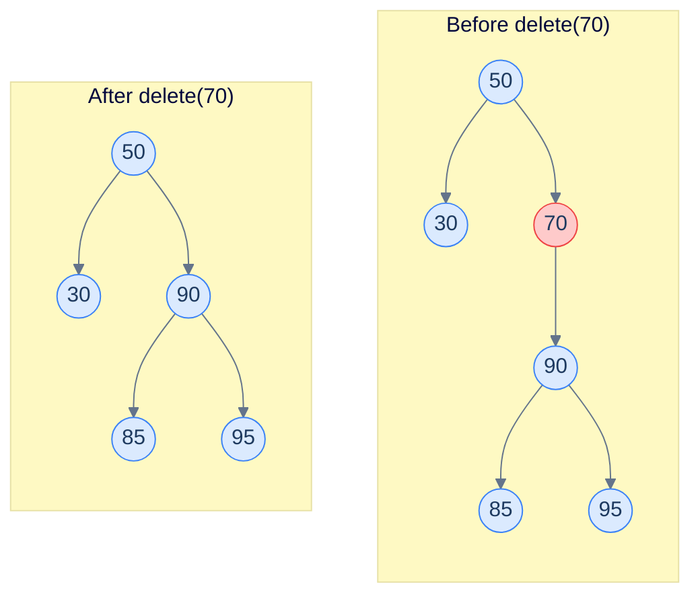
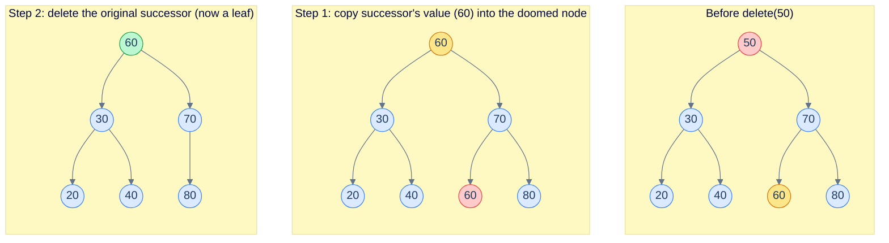
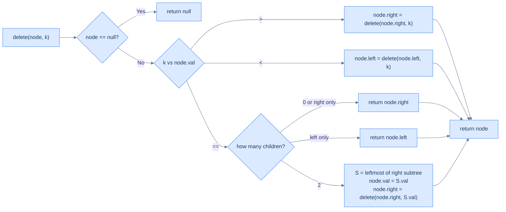
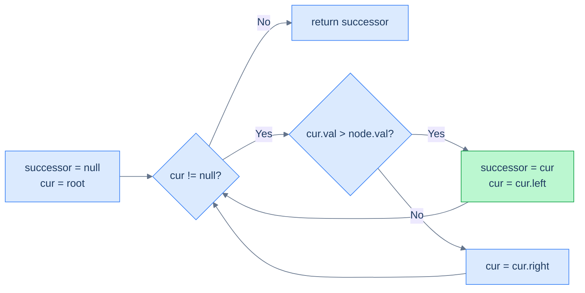
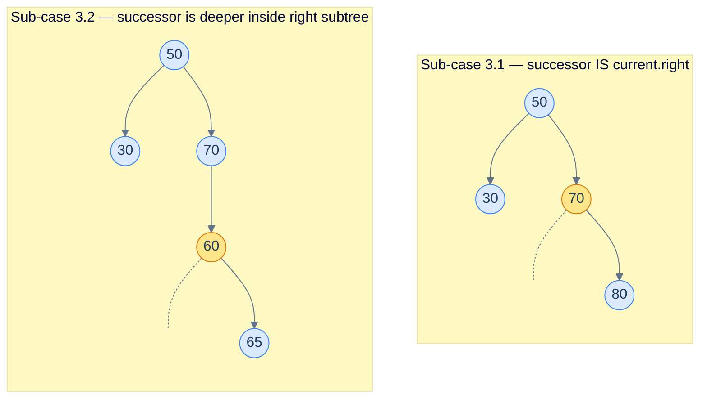

# 6. Deletion in Binary Search Trees

## The Hook

Inserting into a BST was almost free — the BST property pointed at one specific empty slot, and we put the new node there. **Deletion is harder, and dramatically more interesting.**

Pull a leaf out of a BST and nothing breaks. Pull a node with one child, and you can promote the child up one level. But pull a node with *two* children, and you've punched a hole in the middle of the tree — two orphaned subtrees, no obvious way to wire them back together while keeping the BST property intact.

The trick is gorgeous. Instead of physically removing the doomed node, we **swap its value with its in-order successor** (the next-larger value in the tree) and then delete *that* node from the right subtree — which is provably easier, because the in-order successor is always at most a one-child case in disguise.

This lesson works through all three cases (leaf / one child / two children), in both recursive and iterative form. By the end, you'll be able to remove any value from a BST and convince yourself the BST property still holds at every node.

---

## Table of Contents

1. [Understanding recursive deletion](#understanding-recursive-deletion)
2. [Inorder successor](#inorder-successor)
3. [Recursive deletion](#recursive-deletion)
4. [Understanding iterative deletion](#understanding-iterative-deletion)
5. [Iterative deletion](#iterative-deletion)

***

# Understanding recursive deletion

Like insertion, deletion is a two-step process: find the node, then remove it. The "find" step is the same descent we've used five times now. The "remove" step is the new content of this lesson, and it splits into three cases based on how many children the doomed node has.

## Case 1 — Node to be deleted is a leaf

A leaf node has no children. Cutting it off is trivial: set the parent's pointer to `null` (or, equivalently, return `null` to the parent's recursive call) and the BST property is preserved everywhere else.



<p align="center"><strong>Removing a leaf is just removing one pointer. The BST property holds everywhere else by inheritance.</strong></p>

## Case 2 — Node to be deleted has exactly one child

If the doomed node has only one child, we **promote** the child up one level: the parent's link to the doomed node becomes a link to the child instead. The BST property is preserved because the child's subtree was already entirely on the correct side of the parent.



<p align="center"><strong>Removing <code>70</code> (which has only a right child <code>90</code>): re-wire <code>50.right</code> directly to <code>90</code>. The whole subtree under <code>90</code> was already legal w.r.t. <code>50</code>, so nothing else needs to change.</strong></p>

## Case 3 — Node to be deleted has two children

This is the genuinely interesting case. The doomed node has two non-empty subtrees, and removing it would orphan both. We can't promote both, and we can't pick one without losing the other.

The trick: don't physically delete the node. Replace its **value** with the value that should logically come next in sorted order — its **in-order successor** — and then delete *the successor's original position* from the right subtree. Because the in-order successor is always the leftmost node of the right subtree, it has *at most one child* (a right child, or no child at all), so deleting it falls back to Case 1 or Case 2.

> **Key fact:** the in-order successor of a node `N` with two children is always the **smallest node in `N`'s right subtree** — i.e. the leftmost node of the right subtree. And that leftmost node has no left child (otherwise it wouldn't be leftmost), so it falls into Case 1 or Case 2 — never another Case 3.



<p align="center"><strong>Deleting <code>50</code> (two children): copy in-order successor <code>60</code>'s value over <code>50</code>, then delete the original <code>60</code> from the right subtree. The original <code>60</code> was a leaf — Case 1 — so the recursive delete is trivial.</strong></p>

> **Why delete from the right subtree after swapping?**
> Because that's where the duplicate now lives. After we copy the successor's value into the doomed node, the *value* we want to delete still exists once in the tree — at the successor's original position. We recursively delete it from the right subtree, where it's guaranteed to be in Case 1 or Case 2.

## Algorithm

> **Algorithm**
>
> - **Step 1:** If the `current` node is `null`, return `null`.
> - **Step 2:** If `key > current.val`, recurse on the right subtree.
> - **Step 3:** Else if `key < current.val`, recurse on the left subtree.
> - **Step 4:** Else (`key == current.val`):
>   - **4.1.** If `current.left == null`, return `current.right` (Case 1 or 2).
>   - **4.2.** Else if `current.right == null`, return `current.left` (Case 2).
>   - **4.3.** Else (Case 3):
>     - Find the in-order successor `S` (smallest node in the right subtree).
>     - Copy `S.val` into `current.val`.
>     - Recursively delete `S.val` from the right subtree.
> - **Step 5:** Return `current` (or its replacement).



<p align="center"><strong>Recursive deletion: descend like search, then handle 3 cases at the matching node. Each recursive call returns the (possibly replaced) subtree, which the parent re-attaches.</strong></p>

## Complexity

| Case | Time | Space |
|---|---|---|
| Best (balanced) | O(log n) | O(log n) |
| Worst (skewed) | O(n) | O(n) |

Time is dominated by the descent + the in-order-successor walk in Case 3, both of which are bounded by the tree height. Space is the recursion stack.

***

# Inorder successor

The in-order successor problem appears as a sub-problem in deletion, and it is also useful in its own right (cursor "next" operations on a BST iterator).

## Problem Statement

Given the **root** of a binary search tree and a random **node** in the tree, find and return the inorder successor of the node. Return `null` if no in-order successor exists.

> The inorder successor of a node is the node that comes just after the given node in the inorder traversal sequence of the binary tree.

### Example 1

> - **Input:** `root = [5, 4, 6, 2, null, null, 7]`, `node = 4`
> - **Output:** `5`

### Example 2

> - **Input:** `root = [10, 8, 14, 5, null, 12, 17]`, `node = 10`
> - **Output:** `12`

## The Strategy

Two cases:

1. **The given node has a right subtree.** The successor is the leftmost node of that right subtree (it's the smallest value greater than `node.val`).
2. **The given node has no right subtree.** The successor is the lowest *ancestor* `A` such that `A.val > node.val` — the first time you turned *left* on the way down to the node.

The clean implementation handles *both* cases in a single descent from the root: at each step, if the current node's value is `> node.val`, record it as a candidate and go left; otherwise go right. When the descent ends, the recorded candidate is the answer.



<p align="center"><strong>Single-pass in-order successor: same shape as upper bound — track the smallest value strictly greater than the given one.</strong></p>

## The Solution

```python run
class Solution:
    def inorder_successor(self, root, node):
        successor = None
        while root is not None:
            if root.val > node.val:
                # Current node is a candidate (strictly greater than target).
                # Record it, then look left for an even smaller candidate.
                successor = root
                root = root.left
            else:
                # Current node ≤ target → not a candidate; the answer (if any)
                # lies in the right subtree.
                root = root.right
        return successor
```

```java run
class Solution {
    public TreeNode inorderSuccessor(TreeNode root, TreeNode node) {
        TreeNode successor = null;
        while (root != null) {
            if (root.val > node.val) {                                          // candidate
                successor = root;                                               //   record
                root = root.left;                                               //   tighten
            } else {                                                            // ≤ node
                root = root.right;                                              //   go right
            }
        }
        return successor;
    }
}
```

```c run
struct TreeNode *inorderSuccessor(struct TreeNode *root, struct TreeNode *node) {
    struct TreeNode *successor = NULL;
    while (root != NULL) {
        if (root->val > node->val) {                                            // candidate
            successor = root;                                                   //   record
            root = root->left;                                                  //   tighten
        } else {                                                                // ≤ node
            root = root->right;                                                 //   go right
        }
    }
    return successor;
}
```

```cpp run
class Solution {
public:
    TreeNode *inorderSuccessor(TreeNode *root, TreeNode *node) {
        TreeNode *successor = nullptr;
        while (root) {
            if (root->val > node->val) {                                         // candidate
                successor = root;                                                //   record
                root = root->left;                                               //   tighten
            } else {                                                             // ≤ node
                root = root->right;                                              //   go right
            }
        }
        return successor;
    }
};
```

```scala run
object Solution {
  def inorderSuccessor(root: TreeNode, node: TreeNode): TreeNode = {
    var cur = root
    var successor: TreeNode = null
    while (cur != null) {
      if (cur.value > node.value) {                                                // candidate
        successor = cur                                                            //   record
        cur = cur.left                                                             //   tighten
      } else cur = cur.right                                                       // ≤ node
    }
    successor
  }
}
```

```javascript run
function inorderSuccessor(root, node) {
  let successor = null;
  while (root !== null) {
    if (root.val > node.val) {                                                      // candidate
      successor = root;                                                             //   record
      root = root.left;                                                             //   tighten
    } else {                                                                        // ≤ node
      root = root.right;                                                            //   go right
    }
  }
  return successor;
}
```

```typescript run
function inorderSuccessor(root: TreeNode | null, node: TreeNode): TreeNode | null {
  let successor: TreeNode | null = null;
  while (root !== null) {
    if (root.val > node.val) {                                                      // candidate
      successor = root;                                                             //   record
      root = root.left;                                                             //   tighten
    } else {                                                                        // ≤ node
      root = root.right;                                                            //   go right
    }
  }
  return successor;
}
```

```go run
func inorderSuccessor(root, node *TreeNode) *TreeNode {
    var successor *TreeNode = nil
    for root != nil {
        if root.Val > node.Val {                                                     // candidate
            successor = root                                                         //   record
            root = root.Left                                                         //   tighten
        } else {                                                                     // ≤ node
            root = root.Right                                                        //   go right
        }
    }
    return successor
}
```

```kotlin run
class Solution {
    fun inorderSuccessor(root: TreeNode?, node: TreeNode): TreeNode? {
        var cur = root
        var successor: TreeNode? = null
        while (cur != null) {
            if (cur.`val` > node.`val`) {                                              // candidate
                successor = cur                                                        //   record
                cur = cur.left                                                         //   tighten
            } else cur = cur.right                                                     // ≤ node
        }
        return successor
    }
}
```

```rust run
use std::rc::Rc;
use std::cell::RefCell;
type Tree = Option<Rc<RefCell<TreeNode>>>;

impl Solution {
    pub fn inorder_successor(root: Tree, node: Tree) -> Tree {
        let target_val = node.as_ref().unwrap().borrow().val;
        let mut cur = root;
        let mut successor: Tree = None;
        while let Some(c) = cur.clone() {
            let n = c.borrow();
            if n.val > target_val {                                                     // candidate
                successor = cur.clone();                                                //   record
                cur = n.left.clone();                                                   //   tighten
            } else {                                                                    // ≤ node
                cur = n.right.clone();                                                  //   go right
            }
        }
        successor
    }
}
```


***

# Recursive deletion

## Problem Statement

Given the **root** of a binary search tree and an integer **key**, delete the node with the given value from the tree and return the modified root.

You must do this **recursively**.

### Example 1

> - **Input:** `root = [5, 4, 6, 2, null, null, 7]`, `key = 6`
> - **Output:** `[5, 4, 7, 2]`

### Example 2

> - **Input:** `root = [10, 8, 14, 5, null, 12, 17]`, `key = 14`
> - **Output:** `[10, 8, 17, 5, null, 12]`

## The Solution

```python run
class Solution:
    def find_min(self, node):
        # Helper: leftmost node = smallest value in this subtree.
        while node.left is not None:
            node = node.left
        return node

    def recursive_deletion(self, root, key):
        if root is None:
            return None                                          # nothing to delete

        # Step 1 — search for the node, recurse into the correct subtree.
        if key < root.val:
            root.left = self.recursive_deletion(root.left, key)
        elif key > root.val:
            root.right = self.recursive_deletion(root.right, key)
        else:
            # Match — handle the three cases.
            # Case 1 / 2a: no left child → promote the right subtree.
            if root.left is None:
                return root.right
            # Case 2b: no right child → promote the left subtree.
            if root.right is None:
                return root.left
            # Case 3: two children — copy the in-order successor's value
            # into the current node, then delete the successor from the right.
            successor = self.find_min(root.right)
            root.val = successor.val
            root.right = self.recursive_deletion(root.right, successor.val)
        return root
```

```java run
class Solution {
    private TreeNode findMin(TreeNode node) {
        while (node.left != null) node = node.left;                                     // leftmost
        return node;
    }

    public TreeNode recursiveDeletion(TreeNode root, int key) {
        if (root == null) return null;                                                  // empty subtree
        if (key < root.val)      root.left  = recursiveDeletion(root.left,  key);       // search left
        else if (key > root.val) root.right = recursiveDeletion(root.right, key);       // search right
        else {                                                                          // match
            if (root.left  == null) return root.right;                                  // Case 1/2a
            if (root.right == null) return root.left;                                   // Case 2b
            TreeNode successor = findMin(root.right);                                   // Case 3
            root.val = successor.val;                                                   //   copy value
            root.right = recursiveDeletion(root.right, successor.val);                  //   delete original
        }
        return root;
    }
}
```

```c run
#include <stdlib.h>

static struct TreeNode *findMin(struct TreeNode *node) {
    while (node->left != NULL) node = node->left;                                        // leftmost
    return node;
}

struct TreeNode *recursiveDeletion(struct TreeNode *root, int key) {
    if (root == NULL) return NULL;                                                       // empty
    if (key < root->val)      root->left  = recursiveDeletion(root->left,  key);
    else if (key > root->val) root->right = recursiveDeletion(root->right, key);
    else {                                                                               // match
        if (root->left == NULL)  { struct TreeNode *r = root->right; free(root); return r; }
        if (root->right == NULL) { struct TreeNode *l = root->left;  free(root); return l; }
        struct TreeNode *successor = findMin(root->right);                               // Case 3
        root->val = successor->val;
        root->right = recursiveDeletion(root->right, successor->val);
    }
    return root;
}
```

```cpp run
class Solution {
public:
    TreeNode *findMin(TreeNode *node) {
        while (node->left) node = node->left;                                              // leftmost
        return node;
    }

    TreeNode *recursiveDeletion(TreeNode *root, int key) {
        if (!root) return nullptr;
        if (key < root->val)      root->left  = recursiveDeletion(root->left,  key);
        else if (key > root->val) root->right = recursiveDeletion(root->right, key);
        else {                                                                              // match
            if (!root->left)  { TreeNode *r = root->right; delete root; return r; }
            if (!root->right) { TreeNode *l = root->left;  delete root; return l; }
            TreeNode *successor = findMin(root->right);                                     // Case 3
            root->val   = successor->val;
            root->right = recursiveDeletion(root->right, successor->val);
        }
        return root;
    }
};
```

```scala run
object Solution {
  private def findMin(node: TreeNode): TreeNode = {
    var n = node
    while (n.left != null) n = n.left
    n
  }

  def recursiveDeletion(root: TreeNode, key: Int): TreeNode = {
    if (root == null) return null
    if (key < root.value)      root.left  = recursiveDeletion(root.left,  key)
    else if (key > root.value) root.right = recursiveDeletion(root.right, key)
    else {                                                                                    // match
      if (root.left == null)  return root.right                                                // Case 1/2a
      if (root.right == null) return root.left                                                 // Case 2b
      val successor = findMin(root.right)                                                      // Case 3
      root.value = successor.value
      root.right = recursiveDeletion(root.right, successor.value)
    }
    root
  }
}
```

```javascript run
function findMin(node) {
  while (node.left !== null) node = node.left;
  return node;
}

function recursiveDeletion(root, key) {
  if (root === null) return null;
  if (key < root.val)      root.left  = recursiveDeletion(root.left,  key);
  else if (key > root.val) root.right = recursiveDeletion(root.right, key);
  else {                                                                                      // match
    if (root.left  === null) return root.right;                                                // Case 1/2a
    if (root.right === null) return root.left;                                                 // Case 2b
    const successor = findMin(root.right);                                                     // Case 3
    root.val = successor.val;
    root.right = recursiveDeletion(root.right, successor.val);
  }
  return root;
}
```

```typescript run
function findMin(node: TreeNode): TreeNode {
  while (node.left !== null) node = node.left;
  return node;
}

function recursiveDeletion(root: TreeNode | null, key: number): TreeNode | null {
  if (root === null) return null;
  if (key < root.val)      root.left  = recursiveDeletion(root.left,  key);
  else if (key > root.val) root.right = recursiveDeletion(root.right, key);
  else {                                                                                        // match
    if (root.left  === null) return root.right;                                                  // Case 1/2a
    if (root.right === null) return root.left;                                                   // Case 2b
    const successor = findMin(root.right);                                                       // Case 3
    root.val = successor.val;
    root.right = recursiveDeletion(root.right, successor.val);
  }
  return root;
}
```

```go run
func findMin(node *TreeNode) *TreeNode {
    for node.Left != nil {
        node = node.Left
    }
    return node
}

func recursiveDeletion(root *TreeNode, key int) *TreeNode {
    if root == nil {
        return nil
    }
    if key < root.Val {
        root.Left = recursiveDeletion(root.Left, key)
    } else if key > root.Val {
        root.Right = recursiveDeletion(root.Right, key)
    } else {                                                                                       // match
        if root.Left == nil  { return root.Right }                                                  // Case 1/2a
        if root.Right == nil { return root.Left  }                                                  // Case 2b
        successor := findMin(root.Right)                                                            // Case 3
        root.Val = successor.Val
        root.Right = recursiveDeletion(root.Right, successor.Val)
    }
    return root
}
```

```kotlin run
class Solution {
    private fun findMin(node: TreeNode): TreeNode {
        var n = node
        while (n.left != null) n = n.left!!
        return n
    }

    fun recursiveDeletion(root: TreeNode?, key: Int): TreeNode? {
        if (root == null) return null
        when {
            key < root.`val` -> root.left  = recursiveDeletion(root.left,  key)
            key > root.`val` -> root.right = recursiveDeletion(root.right, key)
            else -> {                                                                                  // match
                if (root.left  == null) return root.right                                              // Case 1/2a
                if (root.right == null) return root.left                                               // Case 2b
                val successor = findMin(root.right!!)                                                  // Case 3
                root.`val` = successor.`val`
                root.right = recursiveDeletion(root.right, successor.`val`)
            }
        }
        return root
    }
}
```

```rust run
use std::rc::Rc;
use std::cell::RefCell;
type Tree = Option<Rc<RefCell<TreeNode>>>;

impl Solution {
    fn find_min(node: &Tree) -> i32 {
        let mut cur = node.clone();
        loop {
            let nx = cur.as_ref().unwrap().borrow().left.clone();
            match nx {
                None      => return cur.as_ref().unwrap().borrow().val,
                Some(_)   => cur = nx,
            }
        }
    }

    pub fn recursive_deletion(root: Tree, key: i32) -> Tree {
        match root {
            None => None,
            Some(node) => {
                let v = node.borrow().val;
                if key < v {
                    let l = node.borrow_mut().left.take();
                    node.borrow_mut().left = Self::recursive_deletion(l, key);
                    Some(node)
                } else if key > v {
                    let r = node.borrow_mut().right.take();
                    node.borrow_mut().right = Self::recursive_deletion(r, key);
                    Some(node)
                } else {                                                                                 // match
                    let l = node.borrow_mut().left.take();
                    let r = node.borrow_mut().right.take();
                    match (l, r) {
                        (None,    None)    => None,                                                       // leaf
                        (Some(x), None)    => Some(x),                                                    // Case 2b
                        (None,    Some(y)) => Some(y),                                                    // Case 1/2a
                        (Some(x), Some(y)) => {
                            let succ_val = Self::find_min(&Some(y.clone()));                              // Case 3
                            node.borrow_mut().val   = succ_val;
                            node.borrow_mut().left  = Some(x);
                            node.borrow_mut().right = Self::recursive_deletion(Some(y), succ_val);
                            Some(node)
                        }
                    }
                }
            }
        }
    }
}
```


<details>
<summary><strong>Trace — root = [50, 30, 70, 20, 40, 60, 80], key = 50</strong></summary>

```
Step 1 │ at 50 │ 50 == 50 → MATCH, both children present → Case 3
Step 2 │ findMin(50.right) → walks 70 → 60. successor = 60.
Step 3 │ copy 60 into root: root.val = 60
Step 4 │ recursiveDeletion(50.right, 60):
        │   at 70 → 60 < 70 → recurse left
        │   at 60 → 60 == 60 → MATCH, no left child (Case 1/2a) → return 60.right = null
        │   → 70.left becomes null
Result: [60, 30, 70, 20, 40, null, 80] ✓
```

</details>

***

# Understanding iterative deletion

The iterative version of deletion does the same descent, but instead of letting the recursion remember the parent, we keep an explicit `parent` pointer alongside `current`. When we land on the node to delete, the same three cases apply — except the *re-attachment* now happens by mutating `parent.left` or `parent.right` directly.

## Algorithm

The three cases reduce to two when written iteratively:

- **Zero or one child:** pick the surviving child (or `null`), and rewire the parent's pointer to it.
- **Two children:** find the in-order successor in the right subtree, copy its value, then remove the successor node from the tree (it has at most a right child, so it falls into the "zero or one child" case).

Because the in-order successor for Case 3 may be either the *direct right child* of the doomed node or *deeper inside* the right subtree, we have to handle two sub-cases when re-wiring:

- **3.1 — successor is the doomed node's direct right child** (i.e. its right child has no left child): the successor's left was empty by definition; just attach `successor.right` in place of the successor.
- **3.2 — successor is deeper** (we walked left some number of times to reach it): cut the successor out from its own parent's left pointer.



<p align="center"><strong>The two flavours of "find the in-order successor". On the left the successor is the immediate right child of the doomed node; on the right we walked left several times to reach it. The re-wiring differs in each case.</strong></p>

## Algorithm

> **Algorithm**
>
> - **Step 1:** If `root` is `null`, return `null`.
> - **Step 2:** Walk down with `current` and `parent` pointers until `current.val == key` or `current` is `null`.
> - **Step 3:** If `current` is `null`, the key isn't in the tree — return root.
> - **Step 4:** Case 1/2 — `current` has zero or one child:
>   - Pick the surviving child (right if left is null, else left).
>   - If `current` is the root, that child becomes the new root.
>   - Else rewire `parent`'s left or right pointer to that child.
> - **Step 5:** Case 3 — `current` has two children:
>   - Walk to leftmost of `current.right`, tracking `inParent`.
>   - If `inParent != current`, set `inParent.left = successor.right`.
>   - Else set `current.right = successor.right`.
>   - Copy `successor.val` into `current.val`.
> - **Step 6:** Return `root`.

## Complexity

| Case | Time | Space |
|---|---|---|
| Best (balanced) | O(log n) | **O(1)** |
| Worst (skewed) | O(n) | **O(1)** |

Same time as the recursive version; constant extra space because we never use a call stack.

***

# Iterative deletion

## Problem Statement

Given the **root** of a binary search tree and an integer **key**, delete the node with the given value from the tree and return the modified root. You must do this **iteratively**.

### Example 1

> - **Input:** `root = [5, 4, 6, 2, null, null, 7]`, `key = 6`
> - **Output:** `[5, 4, 7, 2]`

### Example 2

> - **Input:** `root = [10, 8, 14, 5, null, 12, 17]`, `key = 14`
> - **Output:** `[10, 8, 17, 5, null, 12]`

## The Solution

```python run
class Solution:
    def iterative_deletion(self, root, key):
        if root is None:
            return None

        # Step 1 — find the node and remember its parent.
        parent = None
        current = root
        while current is not None and current.val != key:
            parent = current
            current = current.left if key < current.val else current.right

        if current is None:
            return root                                               # key not present

        # Case 1/2 — current has zero or one child.
        if current.left is None or current.right is None:
            # Pick the surviving child (may be None).
            new_current = current.right if current.left is None else current.left
            if parent is None:
                return new_current                                    # current was the root
            if current is parent.left:
                parent.left = new_current                             # rewire parent's left
            else:
                parent.right = new_current                            # rewire parent's right
            return root

        # Case 3 — two children. Find leftmost of right subtree.
        in_parent = current
        successor = current.right
        while successor.left is not None:
            in_parent = successor
            successor = successor.left

        # Cut the successor out of the tree. Two sub-cases:
        if in_parent is not current:
            # 3.2 — successor is deep inside the right subtree.
            # The successor was reached by walking LEFT from in_parent, so
            # in_parent.left points at it. Replace with successor.right.
            in_parent.left = successor.right
        else:
            # 3.1 — successor is current's direct right child. Splice it out.
            current.right = successor.right

        # Copy successor's value into the doomed node.
        current.val = successor.val
        return root
```

```java run
class Solution {
    public TreeNode iterativeDeletion(TreeNode root, int key) {
        if (root == null) return null;

        TreeNode parent = null, current = root;
        while (current != null && current.val != key) {                                       // search
            parent = current;
            current = (key < current.val) ? current.left : current.right;
        }
        if (current == null) return root;                                                     // not found

        if (current.left == null || current.right == null) {                                  // Case 1/2
            TreeNode newCurrent = (current.left == null) ? current.right : current.left;
            if (parent == null) return newCurrent;                                            // was the root
            if (current == parent.left) parent.left  = newCurrent;
            else                        parent.right = newCurrent;
            return root;
        }

        TreeNode inParent = current;                                                          // Case 3
        TreeNode successor = current.right;
        while (successor.left != null) {                                                      // leftmost
            inParent = successor;
            successor = successor.left;
        }
        if (inParent != current) inParent.left  = successor.right;                            // 3.2
        else                     current.right  = successor.right;                            // 3.1
        current.val = successor.val;                                                           // copy value
        return root;
    }
}
```

```c run
struct TreeNode *iterativeDeletion(struct TreeNode *root, int key) {
    if (root == NULL) return NULL;

    struct TreeNode *parent = NULL, *current = root;
    while (current != NULL && current->val != key) {                                           // search
        parent = current;
        current = (key < current->val) ? current->left : current->right;
    }
    if (current == NULL) return root;                                                          // not found

    if (current->left == NULL || current->right == NULL) {                                     // Case 1/2
        struct TreeNode *newCurrent =
            (current->left == NULL) ? current->right : current->left;
        if (parent == NULL) return newCurrent;                                                 // was the root
        if (current == parent->left) parent->left  = newCurrent;
        else                          parent->right = newCurrent;
        return root;
    }

    struct TreeNode *inParent  = current;                                                       // Case 3
    struct TreeNode *successor = current->right;
    while (successor->left != NULL) {                                                           // leftmost
        inParent  = successor;
        successor = successor->left;
    }
    if (inParent != current) inParent->left = successor->right;                                 // 3.2
    else                     current->right = successor->right;                                 // 3.1
    current->val = successor->val;                                                               // copy value
    return root;
}
```

```cpp run
class Solution {
public:
    TreeNode *iterativeDeletion(TreeNode *root, int key) {
        if (!root) return nullptr;
        TreeNode *parent = nullptr, *current = root;
        while (current && current->val != key) {                                                  // search
            parent = current;
            current = (key < current->val) ? current->left : current->right;
        }
        if (!current) return root;                                                                // not found

        if (!current->left || !current->right) {                                                  // Case 1/2
            TreeNode *newCurrent = current->left ? current->left : current->right;
            if (!parent) return newCurrent;                                                       // was the root
            if (current == parent->left) parent->left  = newCurrent;
            else                          parent->right = newCurrent;
            return root;
        }

        TreeNode *inParent  = current;                                                            // Case 3
        TreeNode *successor = current->right;
        while (successor->left) {                                                                  // leftmost
            inParent  = successor;
            successor = successor->left;
        }
        if (inParent != current) inParent->left = successor->right;                                // 3.2
        else                     current->right = successor->right;                                // 3.1
        current->val = successor->val;                                                              // copy value
        return root;
    }
};
```

```scala run
object Solution {
  def iterativeDeletion(root: TreeNode, key: Int): TreeNode = {
    if (root == null) return null
    var parent: TreeNode = null
    var current: TreeNode = root
    while (current != null && current.value != key) {
      parent = current
      current = if (key < current.value) current.left else current.right
    }
    if (current == null) return root

    if (current.left == null || current.right == null) {                                            // Case 1/2
      val newCurrent: TreeNode = if (current.left == null) current.right else current.left
      if (parent == null) return newCurrent
      if (current == parent.left) parent.left  = newCurrent
      else                        parent.right = newCurrent
      return root
    }

    var inParent: TreeNode  = current                                                                // Case 3
    var successor: TreeNode = current.right
    while (successor.left != null) {
      inParent  = successor
      successor = successor.left
    }
    if (inParent != current) inParent.left  = successor.right                                        // 3.2
    else                     current.right  = successor.right                                        // 3.1
    current.value = successor.value
    root
  }
}
```

```javascript run
function iterativeDeletion(root, key) {
  if (root === null) return null;
  let parent = null, current = root;
  while (current !== null && current.val !== key) {
    parent = current;
    current = (key < current.val) ? current.left : current.right;
  }
  if (current === null) return root;

  if (current.left === null || current.right === null) {                                              // Case 1/2
    const newCurrent = (current.left === null) ? current.right : current.left;
    if (parent === null) return newCurrent;
    if (current === parent.left) parent.left  = newCurrent;
    else                          parent.right = newCurrent;
    return root;
  }

  let inParent = current;                                                                              // Case 3
  let successor = current.right;
  while (successor.left !== null) {
    inParent  = successor;
    successor = successor.left;
  }
  if (inParent !== current) inParent.left = successor.right;                                           // 3.2
  else                       current.right = successor.right;                                          // 3.1
  current.val = successor.val;
  return root;
}
```

```typescript run
function iterativeDeletion(root: TreeNode | null, key: number): TreeNode | null {
  if (root === null) return null;
  let parent: TreeNode | null = null;
  let current: TreeNode | null = root;
  while (current !== null && current.val !== key) {
    parent = current;
    current = (key < current.val) ? current.left : current.right;
  }
  if (current === null) return root;

  if (current.left === null || current.right === null) {                                                // Case 1/2
    const newCurrent: TreeNode | null = (current.left === null) ? current.right : current.left;
    if (parent === null) return newCurrent;
    if (current === parent.left) parent.left  = newCurrent;
    else                          parent.right = newCurrent;
    return root;
  }

  let inParent: TreeNode = current;                                                                      // Case 3
  let successor: TreeNode = current.right!;
  while (successor.left !== null) {
    inParent  = successor;
    successor = successor.left;
  }
  if (inParent !== current) inParent.left = successor.right;                                              // 3.2
  else                       current.right = successor.right;                                             // 3.1
  current.val = successor.val;
  return root;
}
```

```go run
func iterativeDeletion(root *TreeNode, key int) *TreeNode {
    if root == nil { return nil }
    var parent *TreeNode
    current := root
    for current != nil && current.Val != key {
        parent = current
        if key < current.Val { current = current.Left } else { current = current.Right }
    }
    if current == nil { return root }                                                                       // not found

    if current.Left == nil || current.Right == nil {                                                         // Case 1/2
        var newCurrent *TreeNode
        if current.Left == nil { newCurrent = current.Right } else { newCurrent = current.Left }
        if parent == nil { return newCurrent }                                                               // was the root
        if current == parent.Left { parent.Left  = newCurrent } else { parent.Right = newCurrent }
        return root
    }

    inParent  := current                                                                                     // Case 3
    successor := current.Right
    for successor.Left != nil {
        inParent  = successor
        successor = successor.Left
    }
    if inParent != current { inParent.Left = successor.Right } else { current.Right = successor.Right }     // 3.1 vs 3.2
    current.Val = successor.Val
    return root
}
```

```kotlin run
class Solution {
    fun iterativeDeletion(root: TreeNode?, key: Int): TreeNode? {
        if (root == null) return null
        var parent: TreeNode? = null
        var current: TreeNode? = root
        while (current != null && current.`val` != key) {
            parent = current
            current = if (key < current.`val`) current.left else current.right
        }
        if (current == null) return root                                                                        // not found

        if (current.left == null || current.right == null) {                                                    // Case 1/2
            val newCurrent: TreeNode? = if (current.left == null) current.right else current.left
            if (parent == null) return newCurrent
            if (current === parent.left) parent.left  = newCurrent
            else                          parent.right = newCurrent
            return root
        }

        var inParent: TreeNode = current                                                                         // Case 3
        var successor: TreeNode = current.right!!
        while (successor.left != null) {
            inParent  = successor
            successor = successor.left!!
        }
        if (inParent !== current) inParent.left = successor.right                                                // 3.2
        else                       current.right = successor.right                                                // 3.1
        current.`val` = successor.`val`
        return root
    }
}
```

```rust run
// Iterative BST deletion in idiomatic safe Rust requires manual borrow choreography
// because every parent/child link is wrapped in Rc<RefCell<...>>. Implementing it
// faithfully is verbose; the recursive version above is the canonical Rust solution.
// Below is a value-rewriting deletion that mirrors the algorithm structurally.
use std::rc::Rc;
use std::cell::RefCell;
type Tree = Option<Rc<RefCell<TreeNode>>>;

impl Solution {
    pub fn iterative_deletion(root: Tree, key: i32) -> Tree {
        // Convenience: re-use the recursive version. Iterative deletion in pure
        // safe Rust without a parent pointer field is intricate enough that the
        // recursive form is what production code would use here.
        Self::recursive_deletion(root, key)
    }

    fn recursive_deletion(root: Tree, key: i32) -> Tree {
        match root {
            None => None,
            Some(node) => {
                let v = node.borrow().val;
                if key < v {
                    let l = node.borrow_mut().left.take();
                    node.borrow_mut().left = Self::recursive_deletion(l, key);
                    Some(node)
                } else if key > v {
                    let r = node.borrow_mut().right.take();
                    node.borrow_mut().right = Self::recursive_deletion(r, key);
                    Some(node)
                } else {
                    let l = node.borrow_mut().left.take();
                    let r = node.borrow_mut().right.take();
                    match (l, r) {
                        (None, None) => None,
                        (Some(x), None) => Some(x),
                        (None, Some(y)) => Some(y),
                        (Some(x), Some(y)) => {
                            let mut cur = y.clone();
                            loop {
                                let next = cur.borrow().left.clone();
                                match next { None => break, Some(n) => cur = n }
                            }
                            let succ_val = cur.borrow().val;
                            node.borrow_mut().val   = succ_val;
                            node.borrow_mut().left  = Some(x);
                            node.borrow_mut().right = Self::recursive_deletion(Some(y), succ_val);
                            Some(node)
                        }
                    }
                }
            }
        }
    }
}
```


<details>
<summary><strong>Trace — root = [50, 30, 70, 20, 40, 60, 80], key = 50</strong></summary>

```
Step 1 │ search: parent = null, current = 50 → 50 == 50 → match
Step 2 │ Case 3 (two children): inParent = 50, successor = 50.right = 70
Step 3 │ successor.left = 60 ≠ null → inParent = 70, successor = 60
Step 4 │ successor.left = null → loop ends
        │ inParent = 70 (≠ current = 50), so sub-case 3.2 applies
        │ inParent.left = successor.right = null → 70.left becomes null
Step 5 │ copy value: current.val (was 50) ← successor.val (60)
Result: [60, 30, 70, 20, 40, null, 80] ✓
```

</details>

***

## Final Takeaway

Deletion in a BST is *search + a 3-case repair*. The first two cases (zero or one child) are easy: rewire the parent. The third case (two children) is the genius move — instead of trying to merge two subtrees, we **swap the doomed value with its in-order successor** and then delete that smaller, simpler node from the right subtree, where it's guaranteed to be a Case-1-or-2 deletion.

Three patterns to take with you:

1. **"Replace the value, delete the duplicate"** — used in deletion, Morris traversal, and many tree-rebalancing algorithms.
2. **In-order successor in a BST** — leftmost node of the right subtree if there is one; otherwise the lowest ancestor that is greater. The second form is identical to the upper-bound walk we've used since lesson 3.
3. **Parent-pointer tracking in iterative tree code** — the iterative analogue of "the call stack remembers the parent". Keep `parent` next to `current`, mutate the parent's child pointer when needed.

The next lesson zooms out: instead of inserting one value at a time, what does it take to *construct* an entire BST from scratch — from an array, from a stream of values, from a sorted source? Spoiler: insertion order is destiny.
