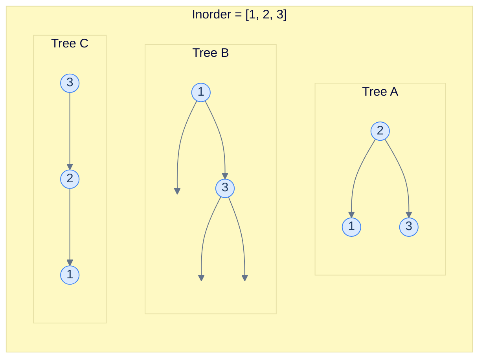
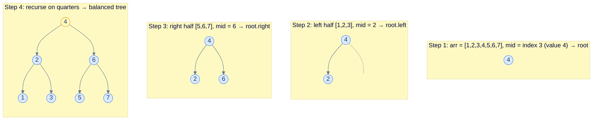
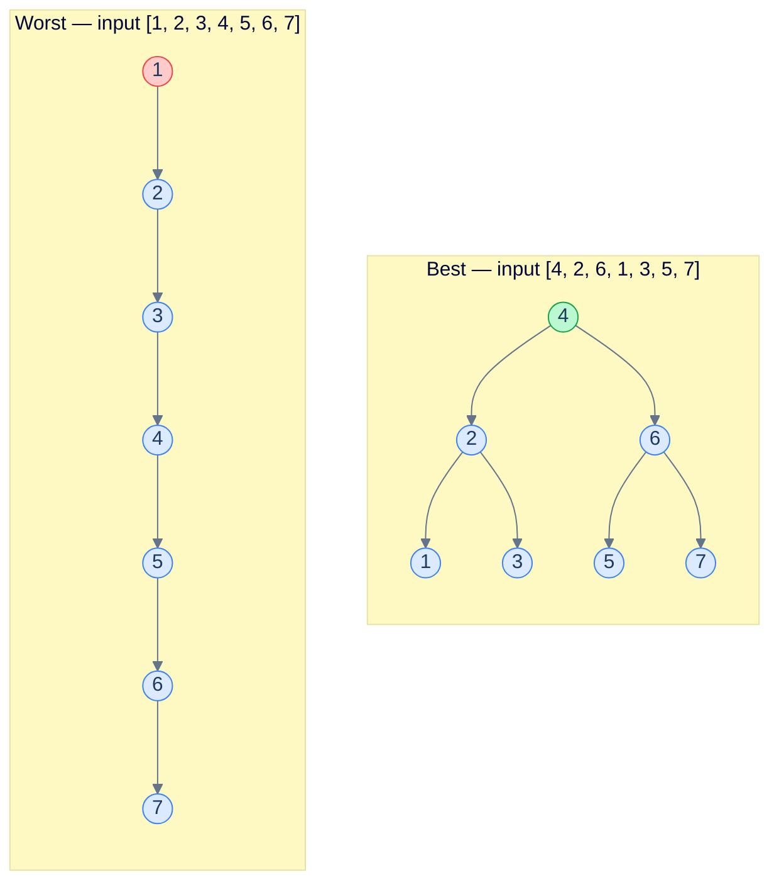
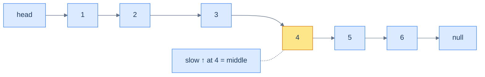

# 7. Constructing a Binary Search Tree

## The Hook

You've been searching, inserting, and deleting one node at a time. Now zoom out: how do you build the *entire* tree in the first place?

This is where the previous lesson's quiet warning comes due. Insertion order is destiny. Hand a BST a sorted array `[1, 2, 3, 4, 5, …, n]` and call `insert` once per element, and you get a **right-skewed vine** of depth `n` — a tree with O(n) operations baked in. The same `n` values, rebuilt with a smarter strategy, can give you a perfectly balanced O(log n) tree.

This lesson covers three constructions: the smart one (sorted array → balanced BST in O(n)), the lazy one (unsorted array → BST via repeated insertion, fast on lucky inputs and quadratic on cursed ones), and a slightly trickier variant of the smart one for sorted **linked lists**, where you don't have random access to the middle.

---

## Table of Contents

1. [Understanding construction from a sorted array](#understanding-construction-from-a-sorted-array)
2. [Sorted array to BST](#sorted-array-to-bst)
3. [Understanding construction from an unsorted array](#understanding-construction-from-an-unsorted-array)
4. [Unsorted array to BST](#unsorted-array-to-bst)
5. [Sorted linked list to BST](#sorted-linked-list-to-bst)

***

# Understanding construction from a sorted array

A sorted array is the *in-order traversal* of some BST. So in principle, you can rebuild a BST from it. The only question is *which* BST.

## Resolving ambiguity

In a generic binary tree, the in-order traversal alone is *not* enough to reconstruct the tree — there are infinitely many trees with the same in-order sequence. That's why standard "rebuild a binary tree" problems also give you the pre-order or post-order traversal: the pre/post sequence pins down the root at every level, breaking the ambiguity.



<p align="center"><strong>Three different binary trees, all with in-order traversal <code>[1, 2, 3]</code>. Without extra information you cannot tell which one to rebuild.</strong></p>

For BSTs we have a *different* tie-breaker available: instead of demanding the pre-order, we can demand that the result is **height-balanced**. That single constraint forces a unique answer for every level: the *middle* of the current range becomes the root. The left half builds the left subtree, the right half builds the right subtree.

## Construction

The recipe is:

1. Take the middle of the sorted array. Make it the root.
2. The left half (everything before the middle) is the in-order traversal of the **left subtree**. Recurse on it.
3. The right half (everything after the middle) is the in-order traversal of the **right subtree**. Recurse on it.



<p align="center"><strong>Building a height-balanced BST from a sorted array. Each recursive call picks the midpoint of its subarray as the subtree root.</strong></p>

By always picking the middle, the left and right subtrees end up with sizes differing by at most 1, which forces height-balance at every node. And it does this in **a single linear pass** — no comparisons, no per-element insertion, no logarithmic factor.

## Algorithm

The recursive function is parameterised by `start` and `end` indices into the sorted array, and never copies the array.

> **Algorithm**
>
> - **Step 1:** If `start > end`, return `null`.
> - **Step 2:** Let `mid = (start + end) / 2`.
> - **Step 3:** Create a new node with value `arr[mid]`.
> - **Step 4:** Recursively build the left subtree from `arr[start..mid-1]`, attach as `node.left`.
> - **Step 5:** Recursively build the right subtree from `arr[mid+1..end]`, attach as `node.right`.
> - **Step 6:** Return the new node.

## Complexity

| Case | Time | Space |
|---|---|---|
| All cases | O(n) | O(n) |

Time is linear because every element is visited exactly once. Space is linear because we allocate `n` nodes; the recursion stack adds an additional O(log n) which is dominated by the node space.

***

# Sorted array to BST

## Problem Statement

Given a sorted array `arr`, construct a height-balanced binary search tree from it and return the root of the constructed tree.

### Example 1

> - **Input:** `arr = [1, 2, 3, 4, 5, 6]`
> - **Output:** `[3, 1, 5, null, 2, 4, 6]`

### Example 2

> - **Input:** `arr = [4, 5, 9, 10, 11]`
> - **Output:** `[9, 4, 10, null, 5, null, 11]`

## The Solution


```pseudocode
function buildTree(arr, st, en):
    if st > en: return null          # empty range — no node to create
    mid ← (st + en) / 2
    node ← new TreeNode(arr[mid])    # middle element becomes the subtree root
    node.left  ← buildTree(arr, st, mid − 1)
    node.right ← buildTree(arr, mid + 1, en)
    return node

function sortedArrayToBST(arr):
    return buildTree(arr, 0, length(arr) − 1)
```

```python run
class Solution:
    def build_tree(self, arr, st, en):
        # Base case: no elements left in this subrange.
        if st > en:
            return None
        # Pick the middle element as the root — keeps subtrees balanced.
        mid = (st + en) // 2
        node = TreeNode(arr[mid])
        # Recurse on the two halves; they are themselves sorted.
        node.left  = self.build_tree(arr, st, mid - 1)
        node.right = self.build_tree(arr, mid + 1, en)
        return node

    def sorted_array_to_bst(self, arr):
        return self.build_tree(arr, 0, len(arr) - 1)
```

```java run
class Solution {
    private TreeNode buildTree(int[] arr, int st, int en) {
        if (st > en) return null;                                                  // empty range
        int mid = (st + en) / 2;                                                   // middle as root
        TreeNode node = new TreeNode(arr[mid]);
        node.left  = buildTree(arr, st, mid - 1);                                  // left half
        node.right = buildTree(arr, mid + 1, en);                                  // right half
        return node;
    }

    public TreeNode sortedArrayToBST(int[] arr) {
        return buildTree(arr, 0, arr.length - 1);
    }
}
```

```c run
#include <stdlib.h>

static struct TreeNode *build_tree(int *arr, int st, int en) {
    if (st > en) return NULL;                                                       // empty range
    int mid = (st + en) / 2;                                                        // middle as root
    struct TreeNode *node = malloc(sizeof(*node));
    node->val = arr[mid];
    node->left  = build_tree(arr, st, mid - 1);                                     // left half
    node->right = build_tree(arr, mid + 1, en);                                     // right half
    return node;
}

struct TreeNode *sortedArrayToBST(int *arr, int n) {
    return build_tree(arr, 0, n - 1);
}
```

```cpp run
class Solution {
public:
    TreeNode *buildTree(std::vector<int> &arr, int st, int en) {
        if (st > en) return nullptr;                                                  // empty range
        int mid = (st + en) / 2;                                                      // middle as root
        TreeNode *node = new TreeNode(arr[mid]);
        node->left  = buildTree(arr, st, mid - 1);
        node->right = buildTree(arr, mid + 1, en);
        return node;
    }
    TreeNode *sortedArrayToBST(std::vector<int> &arr) {
        return buildTree(arr, 0, (int)arr.size() - 1);
    }
};
```

```scala run
object Solution {
  private def buildTree(arr: Array[Int], st: Int, en: Int): TreeNode = {
    if (st > en) null                                                                  // empty range
    else {
      val mid = (st + en) / 2                                                          // middle as root
      val node = new TreeNode(arr(mid))
      node.left  = buildTree(arr, st, mid - 1)
      node.right = buildTree(arr, mid + 1, en)
      node
    }
  }
  def sortedArrayToBST(arr: Array[Int]): TreeNode = buildTree(arr, 0, arr.length - 1)
}
```

```typescript run
function buildTree(arr: number[], st: number, en: number): TreeNode | null {
  if (st > en) return null;                                                                // empty range
  const mid = Math.floor((st + en) / 2);                                                   // middle
  const node = new TreeNode(arr[mid]);
  node.left  = buildTree(arr, st, mid - 1);
  node.right = buildTree(arr, mid + 1, en);
  return node;
}

function sortedArrayToBST(arr: number[]): TreeNode | null {
  return buildTree(arr, 0, arr.length - 1);
}
```

```go run
func buildTree(arr []int, st, en int) *TreeNode {
    if st > en {
        return nil                                                                          // empty range
    }
    mid := (st + en) / 2                                                                    // middle
    node := &TreeNode{Val: arr[mid]}
    node.Left  = buildTree(arr, st, mid-1)
    node.Right = buildTree(arr, mid+1, en)
    return node
}

func sortedArrayToBST(arr []int) *TreeNode {
    return buildTree(arr, 0, len(arr)-1)
}
```

```rust run
use std::rc::Rc;
use std::cell::RefCell;
type Tree = Option<Rc<RefCell<TreeNode>>>;

impl Solution {
    fn build_tree(arr: &[i32], st: i32, en: i32) -> Tree {
        if st > en { return None; }                                                            // empty range
        let mid = (st + en) / 2;                                                               // middle
        let node = Rc::new(RefCell::new(TreeNode::new(arr[mid as usize])));
        node.borrow_mut().left  = Self::build_tree(arr, st, mid - 1);
        node.borrow_mut().right = Self::build_tree(arr, mid + 1, en);
        Some(node)
    }

    pub fn sorted_array_to_bst(arr: Vec<i32>) -> Tree {
        Self::build_tree(&arr, 0, arr.len() as i32 - 1)
    }
}
```


***

# Understanding construction from an unsorted array

If the input is unsorted, the elegant midpoint trick is gone — there's no `mid` that means "middle in sorted order" without first sorting. The simplest fallback is to **insert the values one at a time** into an initially empty BST.

## Algorithm

> **Algorithm**
>
> - **Step 1:** Initialise `root = null`.
> - **Step 2:** For each element `v` in the input array, set `root = insert(root, v)`.
> - **Step 3:** Return `root`.

That's it. Every insert is the same recursive descent we wrote in lesson 5.

## Complexity — best vs worst

This is where insertion order becomes consequential.

> *Friction prompt — predict before reading on. Given the same set of values, what input order makes this construction fast? What order makes it slow? Why?*

**Best case** — every insert lands in O(log n). This requires the tree to *stay* balanced after every insertion. Inputs that achieve this look exactly like the **level-order traversal of a balanced BST**: insert the median first, then the medians of the left/right halves, then the medians of the quarters, etc. Each insert hits a nearly-full tree's lowest empty level, never extending the height.

**Worst case** — every insert lands in O(n). This happens when the input is *monotonic* (sorted ascending or descending). Each new value is bigger than everything in the tree (or smaller), so every insert walks the full current depth and adds one to it. The tree becomes a vine.



<p align="center"><strong>Same 7 values, two input orders. The level-order order produces a balanced tree (height 3); the sorted order produces a vine (height 7).</strong></p>

| Case | Time | Space |
|---|---|---|
| Best (level-order of a balanced BST) | O(n log n) | O(n) |
| Worst (monotonic input) | **O(n²)** | O(n) |

The total time is `n` insertions × `O(log n)` per insertion in the best case = `O(n log n)`. In the worst case, every insertion walks deeper than the last one (depths `1, 2, 3, ..., n`), giving the classic `1 + 2 + … + n = O(n²)` total.

This is why production code rarely uses naive BSTs for unknown inputs — and why **self-balancing** BSTs (AVL, red-black) exist: they perform a small repair after every insert that keeps the tree height ≤ O(log n) regardless of input order.

***

# Unsorted array to BST

## Problem Statement

Given an unsorted array `arr`, construct a binary search tree by inserting nodes in the order given in the array, and return the root.

### Example 1

> - **Input:** `arr = [2, 1, 6, 5, 3, 4]`
> - **Output:** `[2, 1, 6, null, null, 5, null, 3, null, null, 4]`

### Example 2

> - **Input:** `arr = [10, 5, 9, 4, 11]`
> - **Output:** `[10, 5, 11, 4, 9]`

## The Solution


```pseudocode
function insertBST(root, data):
    if root is null: return new TreeNode(data)
    if data < root.val: root.left  ← insertBST(root.left,  data)
    else:               root.right ← insertBST(root.right, data)
    return root

function unsortedArrayToBST(arr):
    root ← null
    for each v in arr:
        root ← insertBST(root, v)  # insertion order determines tree shape
    return root
```

```python run
class Solution:
    def insert(self, root, data):
        if root is None:
            return TreeNode(data)
        if data < root.val:
            root.left = self.insert(root.left, data)
        else:
            root.right = self.insert(root.right, data)
        return root

    def unsorted_array_to_bst(self, arr):
        # Start with an empty tree; each insertion grows it by one node.
        root = None
        for v in arr:
            root = self.insert(root, v)
        return root
```

```java run
class Solution {
    public TreeNode insert(TreeNode root, int data) {
        if (root == null) return new TreeNode(data);
        if (data < root.val) root.left  = insert(root.left,  data);
        else                 root.right = insert(root.right, data);
        return root;
    }

    public TreeNode unsortedArrayToBST(int[] arr) {
        TreeNode root = null;
        for (int v : arr) root = insert(root, v);                                        // grow one at a time
        return root;
    }
}
```

```c run
#include <stdlib.h>

struct TreeNode *insert_node(struct TreeNode *root, int data) {
    if (root == NULL) {
        struct TreeNode *node = malloc(sizeof(*node));
        node->val = data; node->left = node->right = NULL;
        return node;
    }
    if (data < root->val) root->left  = insert_node(root->left,  data);
    else                  root->right = insert_node(root->right, data);
    return root;
}

struct TreeNode *unsortedArrayToBST(int *arr, int n) {
    struct TreeNode *root = NULL;
    for (int i = 0; i < n; i++) root = insert_node(root, arr[i]);                         // grow one at a time
    return root;
}
```

```cpp run
class Solution {
public:
    TreeNode *insert(TreeNode *root, int data) {
        if (!root) return new TreeNode(data);
        if (data < root->val) root->left  = insert(root->left,  data);
        else                  root->right = insert(root->right, data);
        return root;
    }
    TreeNode *unsortedArrayToBST(std::vector<int> &arr) {
        TreeNode *root = nullptr;
        for (int v : arr) root = insert(root, v);                                          // grow one at a time
        return root;
    }
};
```

```scala run
object Solution {
  private def insert(root: TreeNode, data: Int): TreeNode = {
    if (root == null) new TreeNode(data)
    else {
      if (data < root.value) root.left  = insert(root.left,  data)
      else                   root.right = insert(root.right, data)
      root
    }
  }

  def unsortedArrayToBST(arr: Array[Int]): TreeNode = {
    var root: TreeNode = null
    for (v <- arr) root = insert(root, v)                                                   // grow one at a time
    root
  }
}
```

```typescript run
function insertNode(root: TreeNode | null, data: number): TreeNode {
  if (root === null) return new TreeNode(data);
  if (data < root.val) root.left  = insertNode(root.left,  data);
  else                 root.right = insertNode(root.right, data);
  return root;
}

function unsortedArrayToBST(arr: number[]): TreeNode | null {
  let root: TreeNode | null = null;
  for (const v of arr) root = insertNode(root, v);                                            // grow one at a time
  return root;
}
```

```go run
func insertNode(root *TreeNode, data int) *TreeNode {
    if root == nil {
        return &TreeNode{Val: data}
    }
    if data < root.Val { root.Left  = insertNode(root.Left,  data) }
    else               { root.Right = insertNode(root.Right, data) }
    return root
}

func unsortedArrayToBST(arr []int) *TreeNode {
    var root *TreeNode = nil
    for _, v := range arr {
        root = insertNode(root, v)                                                              // grow one at a time
    }
    return root
}
```

```rust run
use std::rc::Rc;
use std::cell::RefCell;
type Tree = Option<Rc<RefCell<TreeNode>>>;

impl Solution {
    fn insert_node(root: Tree, data: i32) -> Tree {
        match root {
            None => Some(Rc::new(RefCell::new(TreeNode::new(data)))),
            Some(node) => {
                {
                    let mut n = node.borrow_mut();
                    if data < n.val {
                        n.left  = Self::insert_node(n.left.take(),  data);
                    } else {
                        n.right = Self::insert_node(n.right.take(), data);
                    }
                }
                Some(node)
            }
        }
    }

    pub fn unsorted_array_to_bst(arr: Vec<i32>) -> Tree {
        let mut root: Tree = None;
        for v in arr { root = Self::insert_node(root, v); }                                        // grow one at a time
        root
    }
}
```


***

# Sorted linked list to BST

## Problem Statement

Given the **head** of a sorted singly linked list, construct a height-balanced binary search tree from it and return the root of the constructed tree.

### Example 1

> - **Input:** `head = [1, 2, 3, 4, 5, 6]`
> - **Output:** `[4, 2, 6, 1, 3, 5]`

### Example 2

> - **Input:** `head = [4, 5, 9, 10, 11]`
> - **Output:** `[9, 5, 11, 4, null, 10]`

## The Strategy

The high-level idea is identical to the sorted-array case: pick the middle element as the root, recurse on the two halves. The wrinkle is that **a singly linked list does not support O(1) random access**. To find the middle of an `n`-element list we need an O(n) walk — once per recursive call.

The classic trick to find the middle of a linked list is the **slow/fast pointer** (Floyd's "tortoise and hare") technique: a slow pointer moves one step per iteration, a fast pointer moves two. When fast falls off the end, slow is sitting on the middle.

To keep the recursion tidy, we also **split the list** at that middle: cut the link from the previous node, so the left half ends at the node just before the middle, and the right half starts at `middle.next`.



<p align="center"><strong>Slow/fast walk on a 6-element sorted list. When fast reaches the end, slow has reached the middle (<code>4</code>). The list is then split into <code>[1,2,3]</code> and <code>[5,6]</code>, and the algorithm recurses.</strong></p>

The total work per recursion level is O(n) (the slow/fast walk over n nodes), and there are O(log n) levels, so the total time is **O(n log n)**.

> *Aside — there's an O(n) version that walks the list once and builds the tree in-order using a closure that advances the head pointer as it consumes nodes. It's a beautiful trick but harder to read; we'll use the cleaner O(n log n) version here.*

## Complexity

| Case | Time | Space |
|---|---|---|
| All cases | O(n log n) | O(n) |

`n` is the number of list nodes; the resulting tree has the same number of nodes.

## The Solution


```pseudocode
function findMiddleAndSplit(head):
    slow ← head
    fast ← head
    prev ← null
    while fast is NOT null AND fast.next is NOT null:
        prev ← slow
        slow ← slow.next
        fast ← fast.next.next
    if prev is NOT null: prev.next ← null   # cut the list just before slow
    return slow                             # slow is the middle node

function sortedLinkedListToBST(head):
    if head is null: return null
    middle ← findMiddleAndSplit(head)
    root ← new TreeNode(middle.val)
    if head = middle: return root           # single-element list
    root.left  ← sortedLinkedListToBST(head)         # left half
    root.right ← sortedLinkedListToBST(middle.next)  # right half
    return root
```

```python run
class Solution:
    def find_middle_and_split(self, head):
        # Slow/fast walk: when fast reaches the end, slow is at the middle.
        slow = head
        fast = head
        previous = None
        while fast is not None and fast.next is not None:
            previous = slow
            slow = slow.next
            fast = fast.next.next
        # Cut the list just before slow, so the left half ends cleanly.
        if previous is not None:
            previous.next = None
        return slow

    def sorted_linked_list_to_bst(self, head):
        if head is None:
            return None
        # Split the list around its middle node.
        middle = self.find_middle_and_split(head)
        # The middle becomes the subtree's root.
        root = TreeNode(middle.val)
        # Single-element list — head and middle are the same node; no recursion.
        if head is middle:
            return root
        # Recurse on the two halves.
        root.left  = self.sorted_linked_list_to_bst(head)            # nodes before middle
        root.right = self.sorted_linked_list_to_bst(middle.next)     # nodes after middle
        return root
```

```java run
class Solution {
    private ListNode findMiddleAndSplit(ListNode head) {
        ListNode slow = head, fast = head, previous = null;
        while (fast != null && fast.next != null) {
            previous = slow;
            slow = slow.next;
            fast = fast.next.next;
        }
        if (previous != null) previous.next = null;                                              // split
        return slow;
    }

    public TreeNode sortedLinkedListToBST(ListNode head) {
        if (head == null) return null;
        ListNode middle = findMiddleAndSplit(head);
        TreeNode root = new TreeNode(middle.val);
        if (head == middle) return root;                                                          // single element
        root.left  = sortedLinkedListToBST(head);
        root.right = sortedLinkedListToBST(middle.next);
        return root;
    }
}
```

```c run
#include <stdlib.h>

static struct ListNode *find_middle_and_split(struct ListNode *head) {
    struct ListNode *slow = head, *fast = head, *previous = NULL;
    while (fast != NULL && fast->next != NULL) {
        previous = slow;
        slow = slow->next;
        fast = fast->next->next;
    }
    if (previous != NULL) previous->next = NULL;                                                   // split
    return slow;
}

struct TreeNode *sortedLinkedListToBST(struct ListNode *head) {
    if (head == NULL) return NULL;
    struct ListNode *middle = find_middle_and_split(head);
    struct TreeNode *root = malloc(sizeof(*root));
    root->val = middle->val; root->left = root->right = NULL;
    if (head == middle) return root;                                                                // single element
    root->left  = sortedLinkedListToBST(head);
    root->right = sortedLinkedListToBST(middle->next);
    return root;
}
```

```cpp run
class Solution {
public:
    ListNode *findMiddleAndSplit(ListNode *head) {
        ListNode *slow = head, *fast = head, *previous = nullptr;
        while (fast != nullptr && fast->next != nullptr) {
            previous = slow;
            slow = slow->next;
            fast = fast->next->next;
        }
        if (previous != nullptr) previous->next = nullptr;                                            // split
        return slow;
    }

    TreeNode *sortedLinkedListToBST(ListNode *head) {
        if (head == nullptr) return nullptr;
        ListNode *middle = findMiddleAndSplit(head);
        TreeNode *root = new TreeNode(middle->val);
        if (head == middle) return root;                                                              // single element
        root->left  = sortedLinkedListToBST(head);
        root->right = sortedLinkedListToBST(middle->next);
        return root;
    }
};
```

```scala run
object Solution {
  private def findMiddleAndSplit(head: ListNode): ListNode = {
    var slow = head; var fast = head; var previous: ListNode = null
    while (fast != null && fast.next != null) {
      previous = slow
      slow = slow.next
      fast = fast.next.next
    }
    if (previous != null) previous.next = null                                                          // split
    slow
  }

  def sortedLinkedListToBST(head: ListNode): TreeNode = {
    if (head == null) return null
    val middle = findMiddleAndSplit(head)
    val root = new TreeNode(middle.value)
    if (head == middle) return root                                                                     // single element
    root.left  = sortedLinkedListToBST(head)
    root.right = sortedLinkedListToBST(middle.next)
    root
  }
}
```

```typescript run
function findMiddleAndSplit(head: ListNode | null): ListNode {
  let slow: ListNode = head!, fast: ListNode | null = head, previous: ListNode | null = null;
  while (fast !== null && fast.next !== null) {
    previous = slow;
    slow = slow.next!;
    fast = fast.next.next;
  }
  if (previous !== null) previous.next = null;                                                              // split
  return slow;
}

function sortedLinkedListToBST(head: ListNode | null): TreeNode | null {
  if (head === null) return null;
  const middle = findMiddleAndSplit(head);
  const root = new TreeNode(middle.val);
  if (head === middle) return root;                                                                         // single element
  root.left  = sortedLinkedListToBST(head);
  root.right = sortedLinkedListToBST(middle.next);
  return root;
}
```

```go run
func findMiddleAndSplit(head *ListNode) *ListNode {
    slow, fast := head, head
    var previous *ListNode = nil
    for fast != nil && fast.Next != nil {
        previous = slow
        slow = slow.Next
        fast = fast.Next.Next
    }
    if previous != nil { previous.Next = nil }                                                                // split
    return slow
}

func sortedLinkedListToBST(head *ListNode) *TreeNode {
    if head == nil { return nil }
    middle := findMiddleAndSplit(head)
    root := &TreeNode{Val: middle.Val}
    if head == middle { return root }                                                                          // single element
    root.Left  = sortedLinkedListToBST(head)
    root.Right = sortedLinkedListToBST(middle.Next)
    return root
}
```

```rust run
// Singly linked lists with shared mutability are atypical in Rust — most idiomatic
// solutions first walk the list into a Vec<i32> and then call sorted_array_to_bst.
// That's O(n) extra space but produces a clean, safe implementation.
use std::rc::Rc;
use std::cell::RefCell;
type Tree = Option<Rc<RefCell<TreeNode>>>;

impl Solution {
    pub fn sorted_list_to_bst(head: Option<Box<ListNode>>) -> Tree {
        // Step 1 — collect values into a Vec.
        let mut values = Vec::new();
        let mut cur = head;
        while let Some(node) = cur {
            values.push(node.val);
            cur = node.next;
        }
        // Step 2 — same as sorted_array_to_bst.
        Self::build(&values, 0, values.len() as i32 - 1)
    }

    fn build(arr: &[i32], st: i32, en: i32) -> Tree {
        if st > en { return None; }
        let mid = (st + en) / 2;
        let node = Rc::new(RefCell::new(TreeNode::new(arr[mid as usize])));
        node.borrow_mut().left  = Self::build(arr, st, mid - 1);
        node.borrow_mut().right = Self::build(arr, mid + 1, en);
        Some(node)
    }
}
```


<details>
<summary><strong>Trace — head = [1, 2, 3, 4, 5, 6]</strong></summary>

```
Call 1 │ list = [1,2,3,4,5,6] → middle = 4 → split into [1,2,3] | [5,6]
        │ root = TreeNode(4)
Call 2 │ list = [1,2,3]       → middle = 2 → split into [1]     | [3]
        │ root = TreeNode(2)
Call 3 │ list = [1]           → middle = 1 → root = TreeNode(1) (single-element shortcut)
Call 4 │ list = [3]           → middle = 3 → root = TreeNode(3)
Call 5 │ list = [5,6]         → middle = 6 → split into [5]     | []
        │ root = TreeNode(6)
Call 6 │ list = [5]           → middle = 5 → root = TreeNode(5)
Call 7 │ list = empty         → returns null
Result: tree = [4, 2, 6, 1, 3, 5] ✓
```

</details>

***

## Final Takeaway

Three constructions, three different cost profiles:

| Source | Strategy | Time | Output |
|---|---|---|---|
| Sorted array | "midpoint as root" recursion | **O(n)** | guaranteed balanced BST |
| Unsorted array | repeated insert into empty BST | O(n log n) best, **O(n²)** worst | shape depends on input order |
| Sorted linked list | midpoint-split with slow/fast pointer | O(n log n) | guaranteed balanced BST |

Two ideas worth banking:

1. **The midpoint-as-root idea is what gives BSTs their best-case shape.** Self-balancing BSTs (AVL, red-black) effectively re-create this shape *incrementally*, after every insert and delete, by performing local rotations to restore balance. The same midpoint instinct is what powers segment trees and merge-sort trees in competitive programming.
2. **Insertion order is destiny for naive BSTs.** Sorted input is the adversarial worst case — and unfortunately, sorted input shows up everywhere in the real world (chronological IDs, alphabetised keys, monotone counters). Production code should either pre-shuffle input or use a self-balancing BST.

The next lesson finally puts our shiny new BST to work on a classic interview problem: the **Lowest Common Ancestor**. The BST property turns what would be an O(n) traversal in a generic binary tree into a one-pass O(h) descent.
