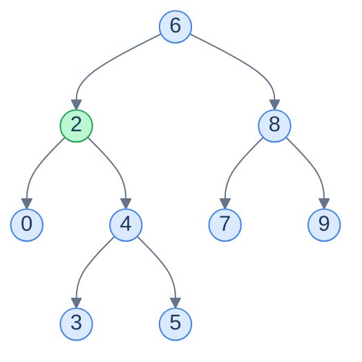
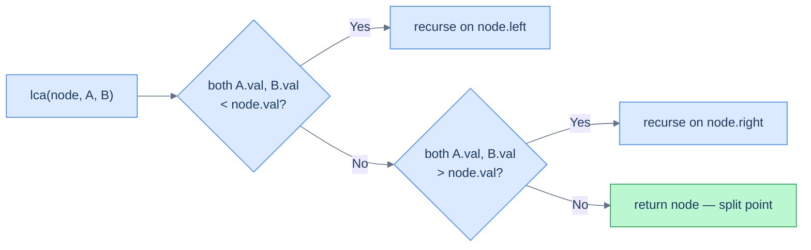
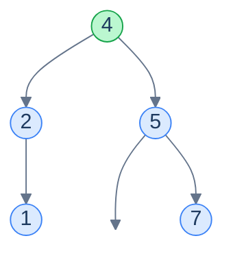

# 8. Lowest Common Ancestor in Binary Search Trees

## The Hook

You're sitting in a meeting room called *Engineering* on the 3rd floor of building *B*. Your colleague Priya is in *Lounge*, on the 1st floor of the same building. To meet, you both walk down to the **lowest common building** — the lowest point in the company's "org tree of physical spaces" that contains *both* of your locations. From there, going further down splits the tree (different rooms), and going further up wastes time (you're already inside the same building).

The **lowest common ancestor** in a tree is exactly that intuition: given two nodes, find the lowest node such that both targets are in its subtree. In a generic binary tree, you have to search both subtrees and combine results — O(n). In a BST, the **values themselves tell you which way to go**: if both targets are smaller than the current node, both live in the left subtree; if both are larger, both live in the right subtree; if one is smaller and one is larger, you've **landed on the LCA**. One descent. O(h). Done.

This lesson is short — the BST property cuts straight to the answer.

---

## Table of Contents

1. [Understanding the lowest common ancestor](#understanding-the-lowest-common-ancestor)
2. [Lowest common ancestor](#lowest-common-ancestor)

***

# Understanding the lowest common ancestor

> The **lowest common ancestor (LCA)** of two nodes `A` and `B` in a binary tree is the lowest node from the root that has both `A` and `B` as descendants. A node may be its own ancestor — so if `A` is itself an ancestor of `B`, then `A` is the LCA.



<p align="center"><strong>The LCA of <code>0</code> and <code>5</code> is <code>2</code> — the lowest node whose subtree contains both. (LCA of <code>0</code> and <code>9</code> would be the root <code>6</code>; LCA of <code>2</code> and <code>5</code> would be <code>2</code> itself.)</strong></p>

In a generic binary tree, finding the LCA requires a postorder-ish search of both subtrees — every node is potentially the answer, and you can't decide without visiting the entire subtree below. That's O(n).

A BST's *values* let us short-circuit the search.

## Algorithm

Three cases. At every node `cur` on the descent:

1. **Both `A.val` and `B.val` are less than `cur.val`** → both nodes live in the left subtree → the LCA lives in the left subtree. Recurse left.
2. **Both `A.val` and `B.val` are greater than `cur.val`** → both nodes live in the right subtree → recurse right.
3. **One value is `< cur.val`, the other is `≥ cur.val`** (or one of them *equals* `cur.val`, meaning `cur` itself is `A` or `B`) → `A` and `B` are *split* by `cur`. There is no node deeper than `cur` that has both as descendants — `cur` is the LCA.



<p align="center"><strong>The decision tree at every node: descend to the side that contains both targets, or stop at the split point.</strong></p>

> *Friction prompt — predict before reading on. What happens if `A` is itself an ancestor of `B`? E.g. <code>A = 2, B = 5</code> in the tree above. Walk through the recursion mentally — what's the LCA, and how does the algorithm reach it?*

At the root `6`: `2 < 6` and `5 < 6` → both targets are smaller → recurse left to node `2`. At node `2`: `2.val == 2`, which means we've hit `A` itself. The condition `both > node.val` is false (since `2 == node.val`, not strictly greater), and `both < node.val` is also false (same reason). So we return `node` — that's `A`. **`A` is its own ancestor, and the LCA.**

This is why the implementation typically also has a base case `node == A || node == B → return node` for clarity, even though the value-comparison logic handles it correctly when values are unique.

> **Algorithm**
>
> **lowestCommonAncestor(node, A, B):**
>
> - **Step 1:** If `node == null`, `node == A`, or `node == B`, return `node`.
> - **Step 2:** If `node.val > A.val` AND `node.val > B.val`, recurse on `node.left`.
> - **Step 3:** If `node.val < A.val` AND `node.val < B.val`, recurse on `node.right`.
> - **Step 4:** Otherwise — the targets are split — return `node`.

## A worked example

Find the LCA of `1` and `7` in:



<p align="center"><strong>At root <code>4</code>: <code>1 &lt; 4</code> but <code>7 &gt; 4</code> → targets split → return <code>4</code>. The LCA of <code>1</code> and <code>7</code> is <code>4</code>.</strong></p>

A single comparison at the root resolved the entire problem.

## Complexity

| Case | Time | Space |
|---|---|---|
| Best (balanced) | O(log n) | O(log n) |
| Worst (skewed) | O(n) | O(n) |

Time is the same as a single search descent. Space is the recursion stack, which mirrors the descent depth. (An iterative version trivially achieves O(1) space — same shape, while loop instead of recursion.)

***

# Lowest common ancestor

## Problem Statement

Given the **root** of a binary search tree and two random nodes, `nodeA` and `nodeB`, find and return the node that is the lowest common ancestor of `nodeA` and `nodeB`.

> The lowest common ancestor is the lowest node in the tree that has both `nodeA` and `nodeB` as descendants (where a node is allowed to be a descendant of itself).

### Example 1

> - **Input:** `root = [4, 2, 5, 1, null, null, 7]`, `nodeA = 1`, `nodeB = 7`
> - **Output:** `4`

### Example 2

> - **Input:** `root = [5, 1, 8, null, null, 6, 9]`, `nodeA = 6`, `nodeB = 9`
> - **Output:** `8`

## The Solution


```pseudocode
function lowestCommonAncestor(root, nodeA, nodeB):
    if root is null OR root = nodeA OR root = nodeB:
        return root                                        # base case — or A/B is its own ancestor
    if root.val > nodeA.val AND root.val > nodeB.val:
        return lowestCommonAncestor(root.left, nodeA, nodeB)   # both targets in left subtree
    if root.val < nodeA.val AND root.val < nodeB.val:
        return lowestCommonAncestor(root.right, nodeA, nodeB)  # both targets in right subtree
    return root                                            # targets straddle this node — LCA found
```

```python run
class Solution:
    def lowest_common_ancestor(self, root, node_a, node_b):
        # Walked off the tree, or this node IS one of the targets — that's our answer.
        if root is None or root is node_a or root is node_b:
            return root
        # Both targets live in the left subtree → recurse left.
        if root.val > node_a.val and root.val > node_b.val:
            return self.lowest_common_ancestor(root.left, node_a, node_b)
        # Both targets live in the right subtree → recurse right.
        if root.val < node_a.val and root.val < node_b.val:
            return self.lowest_common_ancestor(root.right, node_a, node_b)
        # Otherwise the targets straddle this node — it's the LCA.
        return root
```

```java run
class Solution {
    public TreeNode lowestCommonAncestor(TreeNode root, TreeNode nodeA, TreeNode nodeB) {
        if (root == null || root == nodeA || root == nodeB) return root;                    // base case
        if (root.val > nodeA.val && root.val > nodeB.val)
            return lowestCommonAncestor(root.left,  nodeA, nodeB);                          // both on the left
        if (root.val < nodeA.val && root.val < nodeB.val)
            return lowestCommonAncestor(root.right, nodeA, nodeB);                          // both on the right
        return root;                                                                        // split point
    }
}
```

```c run
struct TreeNode *lowestCommonAncestor(
    struct TreeNode *root,
    struct TreeNode *nodeA,
    struct TreeNode *nodeB) {
    if (root == NULL || root == nodeA || root == nodeB) return root;                         // base case
    if (root->val > nodeA->val && root->val > nodeB->val)
        return lowestCommonAncestor(root->left,  nodeA, nodeB);                              // both on the left
    if (root->val < nodeA->val && root->val < nodeB->val)
        return lowestCommonAncestor(root->right, nodeA, nodeB);                              // both on the right
    return root;                                                                              // split point
}
```

```cpp run
class Solution {
public:
    TreeNode *lowestCommonAncestor(TreeNode *root, TreeNode *nodeA, TreeNode *nodeB) {
        if (!root || root == nodeA || root == nodeB) return root;                             // base case
        if (root->val > nodeA->val && root->val > nodeB->val)
            return lowestCommonAncestor(root->left,  nodeA, nodeB);                           // both on the left
        if (root->val < nodeA->val && root->val < nodeB->val)
            return lowestCommonAncestor(root->right, nodeA, nodeB);                           // both on the right
        return root;                                                                           // split point
    }
};
```

```scala run
object Solution {
  def lowestCommonAncestor(root: TreeNode, nodeA: TreeNode, nodeB: TreeNode): TreeNode = {
    if (root == null || root == nodeA || root == nodeB) root                                    // base case
    else if (root.value > nodeA.value && root.value > nodeB.value)
      lowestCommonAncestor(root.left,  nodeA, nodeB)                                            // both on the left
    else if (root.value < nodeA.value && root.value < nodeB.value)
      lowestCommonAncestor(root.right, nodeA, nodeB)                                            // both on the right
    else root                                                                                    // split point
  }
}
```

```typescript run
function lowestCommonAncestor(
  root: TreeNode | null,
  nodeA: TreeNode | null,
  nodeB: TreeNode | null
): TreeNode | null {
  if (root === null || root === nodeA || root === nodeB) return root;                             // base case
  if (root.val > nodeA!.val && root.val > nodeB!.val)
    return lowestCommonAncestor(root.left,  nodeA, nodeB);                                        // both on the left
  if (root.val < nodeA!.val && root.val < nodeB!.val)
    return lowestCommonAncestor(root.right, nodeA, nodeB);                                        // both on the right
  return root;                                                                                     // split point
}
```

```go run
func lowestCommonAncestor(root, nodeA, nodeB *TreeNode) *TreeNode {
    if root == nil || root == nodeA || root == nodeB { return root }                                // base case
    if root.Val > nodeA.Val && root.Val > nodeB.Val {
        return lowestCommonAncestor(root.Left,  nodeA, nodeB)                                       // both on the left
    }
    if root.Val < nodeA.Val && root.Val < nodeB.Val {
        return lowestCommonAncestor(root.Right, nodeA, nodeB)                                       // both on the right
    }
    return root                                                                                      // split point
}
```

```rust run
use std::rc::Rc;
use std::cell::RefCell;
type Tree = Option<Rc<RefCell<TreeNode>>>;

impl Solution {
    pub fn lowest_common_ancestor(root: Tree, p: Tree, q: Tree) -> Tree {
        let pv = p.as_ref().unwrap().borrow().val;
        let qv = q.as_ref().unwrap().borrow().val;
        let mut cur = root;
        while let Some(node) = cur.clone() {
            let v = node.borrow().val;
            if v > pv && v > qv {                                                                         // both on the left
                cur = node.borrow().left.clone();
            } else if v < pv && v < qv {                                                                  // both on the right
                cur = node.borrow().right.clone();
            } else {                                                                                       // split point
                return cur;
            }
        }
        None
    }
}
```


<details>
<summary><strong>Trace — root = [4, 2, 5, 1, null, null, 7], A = 1, B = 7</strong></summary>

```
Step 1 │ at 4 │ 4 > 1 but 4 < 7 → split → return 4
Result: LCA = 4 ✓ (single comparison)
```

</details>

<details>
<summary><strong>Trace — root = [6, 2, 8, 0, 4, 7, 9, null, null, 3, 5], A = 0, B = 5</strong></summary>

```
Step 1 │ at 6 │ 6 > 0 AND 6 > 5 → both on left → recurse left
Step 2 │ at 2 │ 2 > 0 but 2 < 5 → split → return 2
Result: LCA = 2 ✓
```

</details>

***

## Final Takeaway

In a generic binary tree, finding the LCA needs a full O(n) search. In a BST, **the values are signposts**: if both targets are smaller than the current node, both live to the left; if both are larger, both live to the right; if they straddle the current node, you've found the LCA.

This single observation collapses an O(n) algorithm into an O(h) descent. It's the same lever that's powered every BST operation in this chapter — search, insert, delete, range queries, lower/upper bounds — *and* the same lever that motivates B-trees, segment trees, and ordered indices in databases. **Whenever values impose a total order on a tree's structure, comparisons become navigation.**

Two patterns to keep:

1. **The "split point" idiom** — wherever you have a sorted hierarchy and need the lowest place that separates two values, the BST descent gives you the answer in O(h). It's the same idea as `floor` of `min(A, B)` and `ceiling` of `max(A, B)` aligning at the same node.
2. **Generic tree algorithms collapse on a BST** — postorder LCA, inorder validation, level-order construction — all of these have BST-specialised forms that turn O(n) into O(h). Whenever you face a tree problem on a BST, ask *"what does the BST property let me skip?"* before you reach for the generic algorithm.

The next lesson takes a different angle: instead of *searching* for one value, we'll build a **stateful iterator** over the BST that produces values one at a time in sorted order. That's where a BST starts to behave like a *sorted set* — and the iterator pattern unlocks half the remaining problems in this chapter.
