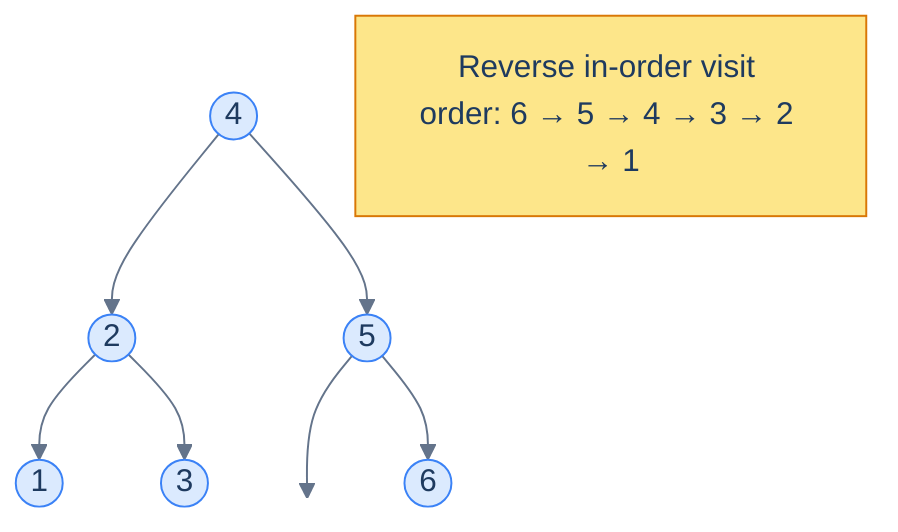
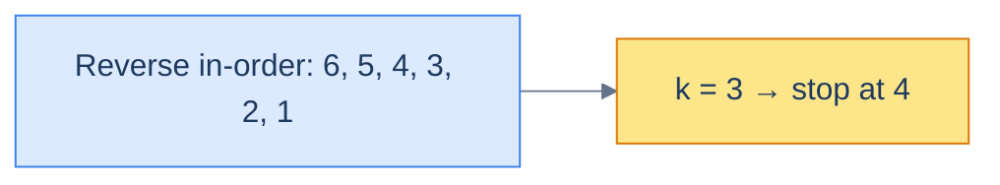

# 11. Pattern: Reversed Sorted Traversal

## The Hook

The previous lesson lit up half the BST landscape with one observation: an in-order walk emits values in ascending order. Mirror that observation — visit *right-node-left* instead of *left-node-right* — and you get the *descending* version for free.

That sounds trivial. It is — *and* it unlocks an entire family of problems whose elegant solutions are otherwise invisible. **K-th largest** rather than k-th smallest. **Greater-than-X sums** rather than less-than-X sums. **Ranks descending from the top** rather than from the bottom. **Tree mutations driven by running totals from the top end of the sorted sequence** instead of the bottom.

This lesson is the descending-order companion to lesson 10. Same template, different traversal direction. Four hands-on problems make the pattern stick.

---

## Table of Contents

1. [Understanding the reversed sorted traversal pattern](#understanding-the-reversed-sorted-traversal-pattern)
2. [Identifying the reverse sorted traversal pattern](#identifying-the-reverse-sorted-traversal-pattern)
3. [Rank nodes](#rank-nodes)
4. [Kth largest element](#kth-largest-element)
5. [Enriched sum tree](#enriched-sum-tree)
6. [Multiple replacement](#multiple-replacement)

***

# Understanding the reversed sorted traversal pattern

The **reverse in-order** traversal visits each node in the order *right → node → left*. Because the right subtree of any BST node holds *larger* values, the reverse-in-order walk lists values in **descending sorted order** — the perfect mirror of the in-order walk.



<p align="center"><strong>Reverse in-order traversal of a BST visits values in descending order. The pattern mirrors lesson 10's sorted traversal.</strong></p>

## The technique

Same structure as the sorted-traversal template, with the recursive calls swapped:

> **Algorithm**
>
> - **Step 1:** Initialise running state in the enclosing scope.
> - **Step 2:** Call `reverseInorder(root)`.
>
> **reverseInorder(node):**
>
> - **Step 1:** If `node` is `null`, return.
> - **Step 2:** `reverseInorder(node.right)` — visit larger values first.
> - **Step 3:** Process the current node — apply `f`; fold into the aggregate via `g`.
> - **Step 4:** `reverseInorder(node.left)`.

## Generic template

```python run
class Solution:
    def __init__(self):
        self.aggregate = 0          # running state shared across the walk

    def reverse_inorder(self, node):
        if node is None:
            return
        self.reverse_inorder(node.right)            # 1. larger values first
        output = self.f(node.val)                   # 2. process node
        self.aggregate = self.g(self.aggregate, output)  # 3. fold
        self.reverse_inorder(node.left)             # 4. smaller values

    def calling_function(self, root):
        self.aggregate = 0
        self.reverse_inorder(root)
        return self.aggregate
```

```java run
class Solution {
    private int aggregate = 0;

    private void reverseInorder(TreeNode node) {
        if (node == null) return;
        reverseInorder(node.right);                                                  // larger first
        int output = f(node.val);                                                    // process
        aggregate = g(aggregate, output);                                            // fold
        reverseInorder(node.left);                                                   // smaller next
    }

    public int callingFunction(TreeNode root) {
        aggregate = 0;
        reverseInorder(root);
        return aggregate;
    }
    int f(int v)                  { return v; }
    int g(int agg, int out)       { return agg + out; }
}
```

```c run
static int aggregate;

static int f(int v)            { return v; }
static int g(int agg, int out) { return agg + out; }

static void reverse_inorder(struct TreeNode *node) {
    if (node == NULL) return;
    reverse_inorder(node->right);                                                     // larger first
    int output = f(node->val);                                                        // process
    aggregate = g(aggregate, output);                                                 // fold
    reverse_inorder(node->left);                                                      // smaller next
}

int callingFunction(struct TreeNode *root) {
    aggregate = 0;
    reverse_inorder(root);
    return aggregate;
}
```

```cpp run
class Solution {
public:
    int aggregate = 0;

    int f(int v)            { return v; }
    int g(int agg, int out) { return agg + out; }

    void reverseInorder(TreeNode *node) {
        if (!node) return;
        reverseInorder(node->right);                                                    // larger first
        int output = f(node->val);                                                      // process
        aggregate = g(aggregate, output);                                               // fold
        reverseInorder(node->left);                                                     // smaller next
    }

    int callingFunction(TreeNode *root) {
        aggregate = 0;
        reverseInorder(root);
        return aggregate;
    }
};
```

```scala run
class Solution {
  private var aggregate: Int = 0
  private def f(v: Int): Int            = v
  private def g(agg: Int, out: Int): Int = agg + out

  private def reverseInorder(node: TreeNode): Unit = {
    if (node == null) return
    reverseInorder(node.right)                                                            // larger first
    val output = f(node.value)                                                            // process
    aggregate = g(aggregate, output)                                                      // fold
    reverseInorder(node.left)                                                             // smaller next
  }

  def callingFunction(root: TreeNode): Int = {
    aggregate = 0
    reverseInorder(root)
    aggregate
  }
}
```

```javascript run
class Solution {
  callingFunction(root) {
    this.aggregate = 0;
    this.reverseInorder(root);
    return this.aggregate;
  }
  reverseInorder(node) {
    if (node === null) return;
    this.reverseInorder(node.right);                                                          // larger first
    const output = this.f(node.val);                                                          // process
    this.aggregate = this.g(this.aggregate, output);                                          // fold
    this.reverseInorder(node.left);                                                           // smaller next
  }
  f(v) { return v; }
  g(agg, out) { return agg + out; }
}
```

```typescript run
class Solution {
  aggregate: number = 0;

  callingFunction(root: TreeNode | null): number {
    this.aggregate = 0;
    this.reverseInorder(root);
    return this.aggregate;
  }

  reverseInorder(node: TreeNode | null): void {
    if (node === null) return;
    this.reverseInorder(node.right);                                                            // larger first
    const output = this.f(node.val);                                                            // process
    this.aggregate = this.g(this.aggregate, output);                                            // fold
    this.reverseInorder(node.left);                                                             // smaller next
  }
  f(v: number): number              { return v; }
  g(agg: number, out: number): number { return agg + out; }
}
```

```go run
type genericState struct{ aggregate int }

func (s *genericState) f(v int) int            { return v }
func (s *genericState) g(agg int, out int) int { return agg + out }

func (s *genericState) reverseInorder(node *TreeNode) {
    if node == nil { return }
    s.reverseInorder(node.Right)                                                                  // larger first
    out := s.f(node.Val)                                                                          // process
    s.aggregate = s.g(s.aggregate, out)                                                           // fold
    s.reverseInorder(node.Left)                                                                   // smaller next
}

func callingFunction(root *TreeNode) int {
    s := &genericState{}
    s.reverseInorder(root)
    return s.aggregate
}
```

```kotlin run
class Solution {
    private var aggregate = 0

    fun callingFunction(root: TreeNode?): Int {
        aggregate = 0
        reverseInorder(root)
        return aggregate
    }

    private fun reverseInorder(node: TreeNode?) {
        if (node == null) return
        reverseInorder(node.right)                                                                   // larger first
        val output = f(node.`val`)                                                                   // process
        aggregate = g(aggregate, output)                                                             // fold
        reverseInorder(node.left)                                                                    // smaller next
    }
    private fun f(v: Int)                = v
    private fun g(agg: Int, out: Int)    = agg + out
}
```

```rust run
use std::rc::Rc;
use std::cell::RefCell;
type Tree = Option<Rc<RefCell<TreeNode>>>;

#[derive(Default)]
struct Generic { aggregate: i32 }

impl Generic {
    fn f(&self, v: i32) -> i32             { v }
    fn g(&self, agg: i32, out: i32) -> i32 { agg + out }

    fn reverse_inorder(&mut self, node: &Tree) {
        if let Some(n) = node {
            let n = n.borrow();
            self.reverse_inorder(&n.right);                                                            // larger first
            let out = self.f(n.val);                                                                   // process
            self.aggregate = self.g(self.aggregate, out);                                              // fold
            self.reverse_inorder(&n.left);                                                             // smaller next
        }
    }
}
```


## Complexity

| Operation | Time | Space |
|---|---|---|
| Reverse in-order walk + O(1) work per node | O(n) | O(h) |

Identical to the sorted-traversal pattern — same number of node visits, same recursion depth, mirrored direction.

***

# Identifying the reverse sorted traversal pattern

Use this pattern when the problem cares about *the sorted sequence in descending order* — i.e. you need to process larger values first, often because the result for a node depends on values strictly greater than itself.

Tell-tale signals:

- **K-th largest, top-K, percentile-from-top.**
- **Suffix sums / "sum of all values greater than this node"** — typical of problems that decorate every node with information about everything above it.
- **Descending ranks** — each node's rank is `1 + (number of strictly larger nodes already seen)`.
- **Pairwise checks against the *previous-larger* value** (the mirror of "previous-smaller" from lesson 10).

If your mental model is "iterate from biggest to smallest while remembering a running tally", reach for reverse in-order.

## Worked example — k-th largest element

> **Problem:** Given a BST and an integer `k`, return the value of the k-th largest element.

The reverse in-order walk emits nodes in descending order. So the k-th node it visits *is* the k-th largest. We just need a counter and an early-exit:

- Maintain a `count` (number of nodes processed so far) and a `result` slot.
- At each node, recurse right first, increment count, check if `count == k` (record `result`, stop). Otherwise recurse left.



<p align="center"><strong>For k = 3, the third value emitted by the reverse in-order walk is the answer (here, <code>4</code>). We can stop as soon as we hit it.</strong></p>

The "stop early" detail is what makes this O(h + k) rather than O(n) — we don't visit any node smaller than the answer.

***

# Rank nodes

## Problem Statement

Given the **root** of a binary search tree, replace each node's value with its **rank in descending order** (largest = rank 1).

### Example 1

> - **Input:** `root = [4, 2, 5, 1, 3, null, 6]`
> - **Output:** `[3, 5, 2, 6, 4, null, 1]`

### Example 2

> - **Input:** `root = [5, 4, 10, null, null, 9, 11]`
> - **Output:** `[4, 5, 2, null, null, 3, 1]`

## The Strategy

Walk the tree in reverse in-order. The first node visited (the largest) gets rank `1`; the next gets `2`; and so on. Just maintain a running `rank` counter; every node overwrites its own value with the current `rank`, then increments it.

## The Solution

```python run
class Solution:
    def __init__(self):
        self.rank = 1                        # next rank to assign

    def rank_nodes(self, root):
        if root is None:
            return root
        self._walk(root)
        return root

    def _walk(self, node):
        if node is None:
            return
        self._walk(node.right)               # larger values first
        node.val = self.rank                 # assign current rank
        self.rank += 1                       # next visit gets the next rank
        self._walk(node.left)
```

```java run
class Solution {
    private int rank = 1;

    private void walk(TreeNode node) {
        if (node == null) return;
        walk(node.right);                                                                          // larger first
        node.val = rank++;                                                                         // assign + increment
        walk(node.left);
    }

    public TreeNode rankNodes(TreeNode root) {
        rank = 1;
        walk(root);
        return root;
    }
}
```

```c run
static int rank_counter;

static void walk(struct TreeNode *node) {
    if (node == NULL) return;
    walk(node->right);                                                                              // larger first
    node->val = rank_counter++;                                                                     // assign + increment
    walk(node->left);
}

struct TreeNode *rankNodes(struct TreeNode *root) {
    rank_counter = 1;
    walk(root);
    return root;
}
```

```cpp run
class Solution {
public:
    int rank = 1;

    void walk(TreeNode *node) {
        if (!node) return;
        walk(node->right);                                                                            // larger first
        node->val = rank++;                                                                           // assign + increment
        walk(node->left);
    }

    TreeNode *rankNodes(TreeNode *root) {
        rank = 1;
        walk(root);
        return root;
    }
};
```

```scala run
class Solution {
  private var rank: Int = 1

  private def walk(node: TreeNode): Unit = {
    if (node == null) return
    walk(node.right)                                                                                   // larger first
    node.value = rank
    rank += 1
    walk(node.left)
  }

  def rankNodes(root: TreeNode): TreeNode = {
    rank = 1
    walk(root)
    root
  }
}
```

```javascript run
class Solution {
  rankNodes(root) {
    this.rank = 1;
    this._walk(root);
    return root;
  }

  _walk(node) {
    if (node === null) return;
    this._walk(node.right);                                                                              // larger first
    node.val = this.rank++;                                                                              // assign + increment
    this._walk(node.left);
  }
}
```

```typescript run
class Solution {
  rank: number = 1;

  rankNodes(root: TreeNode | null): TreeNode | null {
    this.rank = 1;
    this.walk(root);
    return root;
  }

  walk(node: TreeNode | null): void {
    if (node === null) return;
    this.walk(node.right);                                                                                 // larger first
    node.val = this.rank++;                                                                                // assign + increment
    this.walk(node.left);
  }
}
```

```go run
type rankState struct{ rank int }

func (s *rankState) walk(node *TreeNode) {
    if node == nil { return }
    s.walk(node.Right)                                                                                       // larger first
    node.Val = s.rank
    s.rank++
    s.walk(node.Left)
}

func rankNodes(root *TreeNode) *TreeNode {
    s := &rankState{rank: 1}
    s.walk(root)
    return root
}
```

```kotlin run
class Solution {
    private var rank = 1

    private fun walk(node: TreeNode?) {
        if (node == null) return
        walk(node.right)                                                                                       // larger first
        node.`val` = rank
        rank += 1
        walk(node.left)
    }

    fun rankNodes(root: TreeNode?): TreeNode? {
        rank = 1
        walk(root)
        return root
    }
}
```

```rust run
use std::rc::Rc;
use std::cell::RefCell;
type Tree = Option<Rc<RefCell<TreeNode>>>;

impl Solution {
    pub fn rank_nodes(root: Tree) -> Tree {
        let mut rank = 1i32;
        Self::walk(&root, &mut rank);
        root
    }

    fn walk(node: &Tree, rank: &mut i32) {
        if let Some(n) = node {
            let nb = n.borrow();
            Self::walk(&nb.right, rank);                                                                        // larger first
            drop(nb);
            n.borrow_mut().val = *rank;
            *rank += 1;
            Self::walk(&n.borrow().left, rank);
        }
    }
}
```


***

# Kth largest element

## Problem Statement

Given the **root** of a binary search tree and an integer `k`, return the k-th largest element. Return `0` if no such element exists.

### Example 1

> - **Input:** `root = [4, 2, 5, 1, 3, null, 6]`, `k = 3`
> - **Output:** `4`

### Example 2

> - **Input:** `root = [5, 4, 10, null, null, 9, 11]`, `k = 2`
> - **Output:** `10`

## The Strategy

Walk reverse in-order; the k-th node visited is the k-th largest. Critically — **stop traversing the moment the answer is found**, so the cost is O(h + k), not O(n).

## The Solution

```python run
class Solution:
    def __init__(self):
        self.count = 0
        self.result = 0
        self.found = False

    def reverse_in_order(self, root, k):
        # Skip work as soon as the answer is locked in.
        if root is None or self.found:
            return
        self.reverse_in_order(root.right, k)
        if self.found:                            # could have just been set in the right subtree
            return
        self.count += 1
        if self.count == k:                       # this node is the k-th largest
            self.result = root.val
            self.found = True
            return
        self.reverse_in_order(root.left, k)

    def kth_largest_element(self, root, k):
        self.count, self.result, self.found = 0, 0, False
        self.reverse_in_order(root, k)
        return self.result
```

```java run
class Solution {
    private int count = 0, result = 0;
    private boolean found = false;

    private void reverseInOrder(TreeNode root, int k) {
        if (root == null || found) return;
        reverseInOrder(root.right, k);
        if (found) return;
        count++;
        if (count == k) { result = root.val; found = true; return; }                                              // hit
        reverseInOrder(root.left, k);
    }

    public int kthLargestElement(TreeNode root, int k) {
        count = 0; result = 0; found = false;
        reverseInOrder(root, k);
        return result;
    }
}
```

```c run
#include <stdbool.h>

static int count_, result_;
static bool found_;

static void reverse_in_order(struct TreeNode *root, int k) {
    if (root == NULL || found_) return;
    reverse_in_order(root->right, k);
    if (found_) return;
    count_++;
    if (count_ == k) { result_ = root->val; found_ = true; return; }                                                // hit
    reverse_in_order(root->left, k);
}

int kthLargestElement(struct TreeNode *root, int k) {
    count_ = 0; result_ = 0; found_ = false;
    reverse_in_order(root, k);
    return result_;
}
```

```cpp run
class Solution {
public:
    int count = 0, result = 0;
    bool found = false;

    void reverseInOrder(TreeNode *root, int k) {
        if (!root || found) return;
        reverseInOrder(root->right, k);
        if (found) return;
        count++;
        if (count == k) { result = root->val; found = true; return; }                                                 // hit
        reverseInOrder(root->left, k);
    }

    int kthLargestElement(TreeNode *root, int k) {
        count = 0; result = 0; found = false;
        reverseInOrder(root, k);
        return result;
    }
};
```

```scala run
class Solution {
  private var count: Int  = 0
  private var result: Int = 0
  private var found: Boolean = false

  private def reverseInOrder(root: TreeNode, k: Int): Unit = {
    if (root == null || found) return
    reverseInOrder(root.right, k)
    if (found) return
    count += 1
    if (count == k) { result = root.value; found = true; return }                                                       // hit
    reverseInOrder(root.left, k)
  }

  def kthLargestElement(root: TreeNode, k: Int): Int = {
    count = 0; result = 0; found = false
    reverseInOrder(root, k)
    result
  }
}
```

```javascript run
class Solution {
  reverseInOrder(root, k) {
    if (root === null || this.found) return;
    this.reverseInOrder(root.right, k);
    if (this.found) return;
    this.count++;
    if (this.count === k) { this.result = root.val; this.found = true; return; }                                        // hit
    this.reverseInOrder(root.left, k);
  }

  kthLargestElement(root, k) {
    this.count = 0; this.result = 0; this.found = false;
    this.reverseInOrder(root, k);
    return this.result;
  }
}
```

```typescript run
class Solution {
  count = 0; result = 0; found = false;

  reverseInOrder(root: TreeNode | null, k: number): void {
    if (root === null || this.found) return;
    this.reverseInOrder(root.right, k);
    if (this.found) return;
    this.count++;
    if (this.count === k) { this.result = root.val; this.found = true; return; }                                          // hit
    this.reverseInOrder(root.left, k);
  }

  kthLargestElement(root: TreeNode | null, k: number): number {
    this.count = 0; this.result = 0; this.found = false;
    this.reverseInOrder(root, k);
    return this.result;
  }
}
```

```go run
type kthLargestState struct {
    count, result int
    found         bool
}

func (s *kthLargestState) reverseInOrder(root *TreeNode, k int) {
    if root == nil || s.found { return }
    s.reverseInOrder(root.Right, k)
    if s.found { return }
    s.count++
    if s.count == k { s.result = root.Val; s.found = true; return }                                                          // hit
    s.reverseInOrder(root.Left, k)
}

func kthLargestElement(root *TreeNode, k int) int {
    s := &kthLargestState{}
    s.reverseInOrder(root, k)
    return s.result
}
```

```kotlin run
class Solution {
    private var count = 0
    private var result = 0
    private var found = false

    private fun reverseInOrder(root: TreeNode?, k: Int) {
        if (root == null || found) return
        reverseInOrder(root.right, k)
        if (found) return
        count += 1
        if (count == k) { result = root.`val`; found = true; return }                                                          // hit
        reverseInOrder(root.left, k)
    }

    fun kthLargestElement(root: TreeNode?, k: Int): Int {
        count = 0; result = 0; found = false
        reverseInOrder(root, k)
        return result
    }
}
```

```rust run
use std::rc::Rc;
use std::cell::RefCell;
type Tree = Option<Rc<RefCell<TreeNode>>>;

impl Solution {
    pub fn kth_largest_element(root: Tree, k: i32) -> i32 {
        let mut count = 0i32;
        let mut result = 0i32;
        let mut found = false;
        Self::walk(&root, k, &mut count, &mut result, &mut found);
        result
    }

    fn walk(node: &Tree, k: i32, count: &mut i32, result: &mut i32, found: &mut bool) {
        if *found { return; }
        if let Some(n) = node {
            let n = n.borrow();
            Self::walk(&n.right, k, count, result, found);
            if *found { return; }
            *count += 1;
            if *count == k { *result = n.val; *found = true; return; }                                                            // hit
            Self::walk(&n.left, k, count, result, found);
        }
    }
}
```


***

# Enriched sum tree

## Problem Statement

Given the **root** of a binary search tree, replace every node's value with the sum of its original value and the values of *all nodes greater than it*. The resulting tree is called an **enriched sum tree** (sometimes "greater-tree").

### Example 1

> - **Input:** `root = [4, 2, 5, 1, 3, null, 6]`
> - **Output:** `[15, 20, 11, 21, 18, null, 6]`

### Example 2

> - **Input:** `root = [5, 4, 10, null, null, 9, 11]`
> - **Output:** `[35, 39, 21, null, null, 30, 11]`

## The Strategy

Reverse in-order visits nodes from largest to smallest. Maintain a running `sum`; at each node:

1. Add the current node's value to `sum`.
2. Overwrite the current node's value with `sum`.

By the time we visit a node, `sum` already contains the total of every strictly larger node we've already passed *plus* the current node — exactly the value the problem asks for.

## The Solution

```python run
class Solution:
    def __init__(self):
        self.sum = 0

    def enriched_sum_tree(self, root):
        if root is None:
            return root
        self._walk(root)
        return root

    def _walk(self, node):
        if node is None:
            return
        self._walk(node.right)            # process larger values first
        self.sum += node.val              # add original value to running total
        node.val = self.sum               # overwrite with running total (greater-equal sum)
        self._walk(node.left)
```

```java run
class Solution {
    private int sum = 0;

    private void walk(TreeNode node) {
        if (node == null) return;
        walk(node.right);                                                                                                  // larger first
        sum += node.val;                                                                                                   // accumulate
        node.val = sum;                                                                                                    // overwrite
        walk(node.left);
    }

    public TreeNode enrichedSumTree(TreeNode root) {
        sum = 0;
        walk(root);
        return root;
    }
}
```

```c run
static int running_sum;

static void walk(struct TreeNode *node) {
    if (node == NULL) return;
    walk(node->right);                                                                                                       // larger first
    running_sum += node->val;
    node->val    = running_sum;
    walk(node->left);
}

struct TreeNode *enrichedSumTree(struct TreeNode *root) {
    running_sum = 0;
    walk(root);
    return root;
}
```

```cpp run
class Solution {
public:
    int sum = 0;

    void walk(TreeNode *node) {
        if (!node) return;
        walk(node->right);                                                                                                     // larger first
        sum     += node->val;
        node->val = sum;
        walk(node->left);
    }

    TreeNode *enrichedSumTree(TreeNode *root) {
        sum = 0;
        walk(root);
        return root;
    }
};
```

```scala run
class Solution {
  private var sum: Int = 0

  private def walk(node: TreeNode): Unit = {
    if (node == null) return
    walk(node.right)                                                                                                              // larger first
    sum += node.value
    node.value = sum
    walk(node.left)
  }

  def enrichedSumTree(root: TreeNode): TreeNode = {
    sum = 0
    walk(root)
    root
  }
}
```

```javascript run
class Solution {
  enrichedSumTree(root) {
    this.sum = 0;
    this._walk(root);
    return root;
  }

  _walk(node) {
    if (node === null) return;
    this._walk(node.right);                                                                                                          // larger first
    this.sum += node.val;
    node.val  = this.sum;
    this._walk(node.left);
  }
}
```

```typescript run
class Solution {
  sum: number = 0;

  enrichedSumTree(root: TreeNode | null): TreeNode | null {
    this.sum = 0;
    this.walk(root);
    return root;
  }

  walk(node: TreeNode | null): void {
    if (node === null) return;
    this.walk(node.right);                                                                                                              // larger first
    this.sum += node.val;
    node.val  = this.sum;
    this.walk(node.left);
  }
}
```

```go run
type sumState struct{ sum int }

func (s *sumState) walk(node *TreeNode) {
    if node == nil { return }
    s.walk(node.Right)                                                                                                                    // larger first
    s.sum += node.Val
    node.Val = s.sum
    s.walk(node.Left)
}

func enrichedSumTree(root *TreeNode) *TreeNode {
    s := &sumState{}
    s.walk(root)
    return root
}
```

```kotlin run
class Solution {
    private var sum = 0

    private fun walk(node: TreeNode?) {
        if (node == null) return
        walk(node.right)                                                                                                                     // larger first
        sum += node.`val`
        node.`val` = sum
        walk(node.left)
    }

    fun enrichedSumTree(root: TreeNode?): TreeNode? {
        sum = 0
        walk(root)
        return root
    }
}
```

```rust run
use std::rc::Rc;
use std::cell::RefCell;
type Tree = Option<Rc<RefCell<TreeNode>>>;

impl Solution {
    pub fn enriched_sum_tree(root: Tree) -> Tree {
        let mut sum = 0i32;
        Self::walk(&root, &mut sum);
        root
    }

    fn walk(node: &Tree, sum: &mut i32) {
        if let Some(n) = node {
            let right = n.borrow().right.clone();
            Self::walk(&right, sum);                                                                                                          // larger first
            *sum += n.borrow().val;
            n.borrow_mut().val = *sum;
            let left = n.borrow().left.clone();
            Self::walk(&left, sum);
        }
    }
}
```


<details>
<summary><strong>Trace — root = [4, 2, 5, 1, 3, null, 6]</strong></summary>

```
sum = 0, visit order: 6, 5, 4, 3, 2, 1
visit 6 │ sum = 0 + 6 = 6   → node.val = 6
visit 5 │ sum = 6 + 5 = 11  → node.val = 11
visit 4 │ sum = 11 + 4 = 15 → node.val = 15
visit 3 │ sum = 15 + 3 = 18 → node.val = 18
visit 2 │ sum = 18 + 2 = 20 → node.val = 20
visit 1 │ sum = 20 + 1 = 21 → node.val = 21
Result: [15, 20, 11, 21, 18, null, 6] ✓
```

</details>

***

# Multiple replacement

## Problem Statement

Given the **root** of a binary search tree, replace each node's value with `0` if its **inorder predecessor's** value (the value just *larger* than it in sorted order) is a non-zero multiple of its own value.

### Example 1

> - **Input:** `root = [6, 2, 5, 1, 4, null, 10]`
> - **Output:** `[6, 0, 0, 0, 4, null, 10]`

### Example 2

> - **Input:** `root = [5, 4, 10, null, null, 9, 11]`
> - **Output:** `[5, 4, 10, null, null, 9, 11]`

## The Strategy

The trick word is **predecessor**. Inside a reverse-in-order walk, each node's *previous-visited* node is the next-larger value in sorted order — exactly the "successor's value" the problem asks about (the problem statement's wording is slightly confusing, but the example outputs confirm: we compare each node to the value *larger* than it).

So:

- Maintain a `prev_val` that holds the most recently visited (i.e. larger) node's *original* value.
- At each node, if `prev_val % current.val == 0` and `prev_val != 0`, set the current node to `0`.
- *Then* update `prev_val` to the current node's original value (not the possibly-zeroed one) before recursing left.

The "save the original first" detail is the trap that catches careless implementations.

## The Solution

```python run
class Solution:
    def __init__(self):
        self.prev_val = 0
        self.has_prev = False

    def multiple_replacement(self, root):
        if root is None:
            return root
        self._walk(root)
        return root

    def _walk(self, node):
        if node is None:
            return
        self._walk(node.right)                                  # process the larger neighbour first
        original = node.val                                      # remember BEFORE we possibly overwrite
        if self.has_prev and self.prev_val != 0 and self.prev_val % node.val == 0:
            # The just-larger value is a non-zero multiple of this one → zero it.
            node.val = 0
        self.prev_val = original                                 # always store the unmodified value
        self.has_prev = True
        self._walk(node.left)
```

```java run
class Solution {
    private int prevVal = 0;
    private boolean hasPrev = false;

    private void walk(TreeNode node) {
        if (node == null) return;
        walk(node.right);                                                                                                                            // larger first
        int original = node.val;
        if (hasPrev && prevVal != 0 && prevVal % node.val == 0) node.val = 0;
        prevVal = original;
        hasPrev = true;
        walk(node.left);
    }

    public TreeNode multipleReplacement(TreeNode root) {
        prevVal = 0; hasPrev = false;
        walk(root);
        return root;
    }
}
```

```c run
#include <stdbool.h>

static int prev_val;
static bool has_prev;

static void walk(struct TreeNode *node) {
    if (node == NULL) return;
    walk(node->right);                                                                                                                                  // larger first
    int original = node->val;
    if (has_prev && prev_val != 0 && prev_val % node->val == 0) node->val = 0;
    prev_val = original;
    has_prev = true;
    walk(node->left);
}

struct TreeNode *multipleReplacement(struct TreeNode *root) {
    prev_val = 0; has_prev = false;
    walk(root);
    return root;
}
```

```cpp run
class Solution {
public:
    int prevVal = 0;
    bool hasPrev = false;

    void walk(TreeNode *node) {
        if (!node) return;
        walk(node->right);                                                                                                                                // larger first
        int original = node->val;
        if (hasPrev && prevVal != 0 && prevVal % node->val == 0) node->val = 0;
        prevVal = original;
        hasPrev = true;
        walk(node->left);
    }

    TreeNode *multipleReplacement(TreeNode *root) {
        prevVal = 0; hasPrev = false;
        walk(root);
        return root;
    }
};
```

```scala run
class Solution {
  private var prevVal: Int = 0
  private var hasPrev: Boolean = false

  private def walk(node: TreeNode): Unit = {
    if (node == null) return
    walk(node.right)                                                                                                                                       // larger first
    val original = node.value
    if (hasPrev && prevVal != 0 && prevVal % node.value == 0) node.value = 0
    prevVal = original
    hasPrev = true
    walk(node.left)
  }

  def multipleReplacement(root: TreeNode): TreeNode = {
    prevVal = 0; hasPrev = false
    walk(root)
    root
  }
}
```

```javascript run
class Solution {
  multipleReplacement(root) {
    this.prevVal = 0;
    this.hasPrev = false;
    this._walk(root);
    return root;
  }

  _walk(node) {
    if (node === null) return;
    this._walk(node.right);                                                                                                                                  // larger first
    const original = node.val;
    if (this.hasPrev && this.prevVal !== 0 && this.prevVal % node.val === 0) node.val = 0;
    this.prevVal = original;
    this.hasPrev = true;
    this._walk(node.left);
  }
}
```

```typescript run
class Solution {
  prevVal: number = 0;
  hasPrev: boolean = false;

  multipleReplacement(root: TreeNode | null): TreeNode | null {
    this.prevVal = 0; this.hasPrev = false;
    this.walk(root);
    return root;
  }

  walk(node: TreeNode | null): void {
    if (node === null) return;
    this.walk(node.right);                                                                                                                                     // larger first
    const original = node.val;
    if (this.hasPrev && this.prevVal !== 0 && this.prevVal % node.val === 0) node.val = 0;
    this.prevVal = original;
    this.hasPrev = true;
    this.walk(node.left);
  }
}
```

```go run
type multReplaceState struct {
    prevVal int
    hasPrev bool
}

func (s *multReplaceState) walk(node *TreeNode) {
    if node == nil { return }
    s.walk(node.Right)                                                                                                                                          // larger first
    original := node.Val
    if s.hasPrev && s.prevVal != 0 && s.prevVal % node.Val == 0 {
        node.Val = 0
    }
    s.prevVal = original
    s.hasPrev = true
    s.walk(node.Left)
}

func multipleReplacement(root *TreeNode) *TreeNode {
    s := &multReplaceState{}
    s.walk(root)
    return root
}
```

```kotlin run
class Solution {
    private var prevVal = 0
    private var hasPrev = false

    private fun walk(node: TreeNode?) {
        if (node == null) return
        walk(node.right)                                                                                                                                          // larger first
        val original = node.`val`
        if (hasPrev && prevVal != 0 && prevVal % node.`val` == 0) node.`val` = 0
        prevVal = original
        hasPrev = true
        walk(node.left)
    }

    fun multipleReplacement(root: TreeNode?): TreeNode? {
        prevVal = 0; hasPrev = false
        walk(root)
        return root
    }
}
```

```rust run
use std::rc::Rc;
use std::cell::RefCell;
type Tree = Option<Rc<RefCell<TreeNode>>>;

impl Solution {
    pub fn multiple_replacement(root: Tree) -> Tree {
        let mut prev: Option<i32> = None;
        Self::walk(&root, &mut prev);
        root
    }

    fn walk(node: &Tree, prev: &mut Option<i32>) {
        if let Some(n) = node {
            let right = n.borrow().right.clone();
            Self::walk(&right, prev);                                                                                                                                // larger first
            let original = n.borrow().val;
            if let Some(pv) = *prev {
                if pv != 0 && pv % original == 0 {
                    n.borrow_mut().val = 0;
                }
            }
            *prev = Some(original);
            let left = n.borrow().left.clone();
            Self::walk(&left, prev);
        }
    }
}
```


***

## Final Takeaway

Reverse in-order is the descending dual of in-order. Whenever the problem cares about *the largest values first* — k-th largest, ranks from the top, suffix sums by value, comparisons against the next-larger node — flip the recursion direction and the same template applies. Most reverse-sorted-traversal problems are *easy* because the BST has done the sorting for you.

Three patterns to keep:

1. **"Carry the previous-larger value"** — mirror of lesson 10's "carry the previous-smaller". Useful for any pairwise check that runs against the next-larger value (multiples, ratios, ranges, monotonicity).
2. **"Running total over the descending sequence"** — solves *enriched sum tree*, but the same shape solves "sum of values strictly greater than X", "convert to suffix-sum array", "decorate node with `(num greater, sum greater)`".
3. **"Save original before overwriting"** — the trap in `multiple replacement`. When a traversal both *reads* and *writes* the same field, capture the read into a local before the write — your future self will thank you.

The next lesson introduces a new pattern that breaks the "always traverse all nodes" pattern from the last two lessons: **range postorder**, where the BST property lets us *prune* entire subtrees that can't contribute to the answer.
