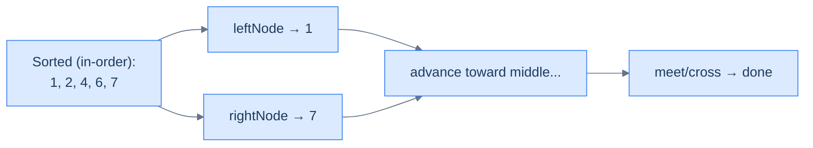
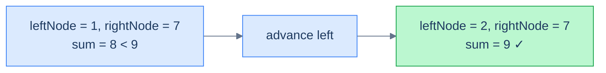

# 13. Pattern: Two Pointer

## The Hook

The previous lesson on iterators gave us *one* useful object: a way to walk a BST in sorted order, on demand, with O(h) memory. Useful — but not yet a superpower.

The superpower shows up the moment you spin up **two** of them. Run a *forward* iterator from the smallest value and a *reverse* iterator from the largest, and let them march toward each other. You're now walking the BST's hidden sorted sequence from **both ends simultaneously** — the same trick that powers two-sum on a sorted array, but **without ever materialising the array**.

Every classic two-pointer problem from the array world transfers directly: pair sum, pairs that satisfy a relation (multiple, GCD, distance), median computation by closing in from both ends, and even *cross-tree* pair sum where the left iterator runs over one BST and the right iterator over a different one. All in **O(n) time** and **O(h) space**, and all on tree-structured data with no array conversion.

This final lesson shows how. Four problems make the pattern click.

---

## Table of Contents

1. [Understanding the two pointer pattern](#understanding-the-two-pointer-pattern)
2. [Identifying the two pointer pattern](#identifying-the-two-pointer-pattern)
3. [Two sum on BST](#two-sum-on-bst)
4. [Multiple tree](#multiple-tree)
5. [Median in BST](#median-in-bst)
6. [BST pair sum](#bst-pair-sum)

***

# Understanding the two pointer pattern

A BST stores values in a structure that *implicitly* sorts them. The forward iterator emits ascending order, the reverse iterator descending. Run them simultaneously, and you have a working pair `(leftNode, rightNode)` that always satisfies `leftNode.val < rightNode.val` until they cross — i.e. you're holding the smallest unseen value and the largest unseen value at the same time.



<p align="center"><strong>Two pointers walking the implicit sorted sequence of a BST. Forward iterator advances from the small end; reverse iterator advances from the large end. They meet in the middle.</strong></p>

## The technique

The same logic as two-pointer on a sorted array — drive a decision at each step using both pointers, and advance whichever one the decision tells you to:

> **Algorithm**
>
> - **Step 1:** Build a forward iterator `left` over the BST.
> - **Step 2:** Build a reverse iterator `right` over the BST.
> - **Step 3:** Initialise `leftNode = left.next()`, `rightNode = right.next()`.
> - **Step 4:** While `leftNode.val < rightNode.val` (i.e. they haven't crossed):
>   - **Step 4.1:** Process the pair `(leftNode, rightNode)`.
>   - **Step 4.2:** Decide whether to advance the left or right pointer (or both).

The terminating condition `leftNode.val < rightNode.val` is the BST analogue of `i < j` in the array version. Once they cross, every pair has been considered.

## Complexity

| Operation | Time | Space |
|---|---|---|
| Initialising both iterators | O(h) | O(h) |
| Loop body per step | O(1) (amortised by the iterator) | — |
| Whole walk | O(n) | O(h) |

Each iterator visits every node at most once. Because both iterators never overlap (one walks ascending, the other descending), every node is visited at most twice across both iterators. Total time **O(n)**.

***

# Identifying the two pointer pattern

Use this pattern when:

- The problem reduces to **finding/checking pairs** of values from the BST that satisfy some relation (sum equals target, ratio is a multiple, distance ≤ d, etc.).
- The relation has a **monotone** property — increasing one operand makes the relation move in one direction, increasing the other moves it in the opposite direction. (Sum is the cleanest example: increase either operand, the sum goes up.)
- A naive O(n²) solution would compare every pair, but the BST's hidden sortedness lets us prune.
- The problem might involve **two BSTs** at once — one source for the left pointer, another for the right.

If you find yourself reaching for an in-memory hash set or a sorted array conversion to solve a "pair" problem on a BST, two-pointer iterators are usually the better answer: same time, much less memory.

## Worked example — two-sum on a BST

> **Problem:** Given a BST and a target, return `true` iff there exist two distinct nodes whose values sum to `target`.

The decision rule is exactly the array two-sum:

- If `leftNode.val + rightNode.val == target`, return `true`.
- If the sum is **too small**, the only way to grow it is to **move the left pointer** rightward (forward iterator → next, larger).
- If the sum is **too big**, the only way to shrink it is to **move the right pointer** leftward (reverse iterator → next, smaller).

Loop until the iterators cross.



<p align="center"><strong>Tree <code>[4, 2, 6, 1, null, null, 7]</code>, target <code>9</code>. Two pointers find the pair <code>(2, 7)</code> after one step.</strong></p>

The fit with the template:

- **f** = "compare sum to target → which way to step".
- **state** = the running pair.

***

# Two sum on BST

## Problem Statement

Given the **root** of a BST and an integer **target**, return `true` if some pair of nodes in the tree has values summing to `target`. Return `false` otherwise.

### Example 1

> - **Input:** `root = [4, 2, 6, 1, null, null, 7]`, `target = 9`
> - **Output:** `true`
> - **Explanation:** Nodes `2` and `7` sum to `9`.

### Example 2

> - **Input:** `root = [2, 1, 4, null, null, 3, 7]`, `target = 16`
> - **Output:** `false`

## The Solution

```python run
class ForwardBstIterator:
    def __init__(self, root):
        self.stack = []
        self._push_all_left(root)
    def _push_all_left(self, node):
        while node:
            self.stack.append(node); node = node.left
    def has_next(self):  return bool(self.stack)
    def next(self):
        node = self.stack.pop()
        self._push_all_left(node.right)
        return node

class ReverseBstIterator:
    def __init__(self, root):
        self.stack = []
        self._push_all_right(root)
    def _push_all_right(self, node):
        while node:
            self.stack.append(node); node = node.right
    def has_next(self):  return bool(self.stack)
    def next(self):
        node = self.stack.pop()
        self._push_all_right(node.left)
        return node

class Solution:
    def two_sum_on_bst(self, root, target):
        if root is None:
            return False
        left  = ForwardBstIterator(root)
        right = ReverseBstIterator(root)
        left_node, right_node = left.next(), right.next()
        # Loop while pointers haven't crossed.
        while left_node and right_node and left_node.val < right_node.val:
            s = left_node.val + right_node.val
            if s == target:                   # exact pair found
                return True
            if s < target:
                # Sum too small → grow it by advancing the smaller (left) pointer.
                left_node = left.next()
            else:
                # Sum too large → shrink it by advancing the larger (right) pointer.
                right_node = right.next()
        return False
```

```java run
import java.util.*;

class ForwardBstIterator {
    Deque<TreeNode> stack = new ArrayDeque<>();
    ForwardBstIterator(TreeNode root) { pushAllLeft(root); }
    private void pushAllLeft(TreeNode n) { while (n != null) { stack.push(n); n = n.left; } }
    boolean hasNext() { return !stack.isEmpty(); }
    TreeNode next() { TreeNode n = stack.pop(); pushAllLeft(n.right); return n; }
}

class ReverseBstIterator {
    Deque<TreeNode> stack = new ArrayDeque<>();
    ReverseBstIterator(TreeNode root) { pushAllRight(root); }
    private void pushAllRight(TreeNode n) { while (n != null) { stack.push(n); n = n.right; } }
    boolean hasNext() { return !stack.isEmpty(); }
    TreeNode next() { TreeNode n = stack.pop(); pushAllRight(n.left); return n; }
}

class Solution {
    public boolean twoSumOnBST(TreeNode root, int target) {
        if (root == null) return false;
        ForwardBstIterator left  = new ForwardBstIterator(root);
        ReverseBstIterator right = new ReverseBstIterator(root);
        TreeNode leftNode = left.next(), rightNode = right.next();
        while (leftNode != null && rightNode != null && leftNode.val < rightNode.val) {
            int s = leftNode.val + rightNode.val;
            if (s == target) return true;
            if (s < target) leftNode  = left.next();                                                                                // grow
            else            rightNode = right.next();                                                                               // shrink
        }
        return false;
    }
}
```

```c run
#include <stdlib.h>
#include <stdbool.h>

typedef struct { struct TreeNode **stack; int top; } Iter;

static Iter *iter_new(int cap) {
    Iter *it = malloc(sizeof(*it));
    it->stack = malloc(sizeof(struct TreeNode *) * cap);
    it->top = -1;
    return it;
}

static void push_left(Iter *it, struct TreeNode *n)  { while (n) { it->stack[++it->top] = n; n = n->left;  } }
static void push_right(Iter *it, struct TreeNode *n) { while (n) { it->stack[++it->top] = n; n = n->right; } }

static struct TreeNode *fwd_next(Iter *it) {
    if (it->top < 0) return NULL;
    struct TreeNode *n = it->stack[it->top--];
    push_left(it, n->right);
    return n;
}
static struct TreeNode *rev_next(Iter *it) {
    if (it->top < 0) return NULL;
    struct TreeNode *n = it->stack[it->top--];
    push_right(it, n->left);
    return n;
}

bool twoSumOnBST(struct TreeNode *root, int target) {
    if (!root) return false;
    Iter *left  = iter_new(1024); push_left(left,  root);
    Iter *right = iter_new(1024); push_right(right, root);
    struct TreeNode *l = fwd_next(left), *r = rev_next(right);
    bool ans = false;
    while (l && r && l->val < r->val) {
        int s = l->val + r->val;
        if (s == target)      { ans = true; break; }
        else if (s < target)  l = fwd_next(left);                                                                                          // grow
        else                  r = rev_next(right);                                                                                          // shrink
    }
    free(left->stack); free(left); free(right->stack); free(right);
    return ans;
}
```

```cpp run
#include <stack>

class ForwardBstIterator {
    std::stack<TreeNode *> st;
    void pushAllLeft(TreeNode *n)  { while (n) { st.push(n); n = n->left;  } }
public:
    ForwardBstIterator(TreeNode *root) { pushAllLeft(root); }
    bool hasNext() { return !st.empty(); }
    TreeNode *next() { TreeNode *n = st.top(); st.pop(); pushAllLeft(n->right); return n; }
};

class ReverseBstIterator {
    std::stack<TreeNode *> st;
    void pushAllRight(TreeNode *n) { while (n) { st.push(n); n = n->right; } }
public:
    ReverseBstIterator(TreeNode *root) { pushAllRight(root); }
    bool hasNext() { return !st.empty(); }
    TreeNode *next() { TreeNode *n = st.top(); st.pop(); pushAllRight(n->left); return n; }
};

class Solution {
public:
    bool twoSumOnBST(TreeNode *root, int target) {
        if (!root) return false;
        ForwardBstIterator left(root);
        ReverseBstIterator right(root);
        TreeNode *l = left.next(), *r = right.next();
        while (l && r && l->val < r->val) {
            int s = l->val + r->val;
            if (s == target) return true;
            if (s < target) l = left.next();                                                                                                  // grow
            else            r = right.next();                                                                                                 // shrink
        }
        return false;
    }
};
```

```scala run
import scala.collection.mutable

class ForwardBstIterator(root: TreeNode) {
  private val stack = mutable.Stack[TreeNode]()
  pushAllLeft(root)
  private def pushAllLeft(n: TreeNode): Unit = { var x = n; while (x != null) { stack.push(x); x = x.left  } }
  def hasNext: Boolean = stack.nonEmpty
  def next: TreeNode = { val n = stack.pop(); pushAllLeft(n.right); n }
}

class ReverseBstIterator(root: TreeNode) {
  private val stack = mutable.Stack[TreeNode]()
  pushAllRight(root)
  private def pushAllRight(n: TreeNode): Unit = { var x = n; while (x != null) { stack.push(x); x = x.right } }
  def hasNext: Boolean = stack.nonEmpty
  def next: TreeNode = { val n = stack.pop(); pushAllRight(n.left); n }
}

object Solution {
  def twoSumOnBST(root: TreeNode, target: Int): Boolean = {
    if (root == null) return false
    val left  = new ForwardBstIterator(root)
    val right = new ReverseBstIterator(root)
    var l: TreeNode = left.next
    var r: TreeNode = right.next
    while (l != null && r != null && l.value < r.value) {
      val s = l.value + r.value
      if (s == target)      return true
      else if (s < target)  l = left.next
      else                  r = right.next
    }
    false
  }
}
```

```javascript run
class ForwardBstIterator {
  constructor(root) { this.stack = []; this._left(root); }
  _left(n)  { while (n) { this.stack.push(n); n = n.left;  } }
  hasNext() { return this.stack.length > 0; }
  next()    { const n = this.stack.pop(); this._left(n.right);  return n; }
}
class ReverseBstIterator {
  constructor(root) { this.stack = []; this._right(root); }
  _right(n) { while (n) { this.stack.push(n); n = n.right; } }
  hasNext() { return this.stack.length > 0; }
  next()    { const n = this.stack.pop(); this._right(n.left); return n; }
}

function twoSumOnBST(root, target) {
  if (root === null) return false;
  const left = new ForwardBstIterator(root), right = new ReverseBstIterator(root);
  let l = left.next(), r = right.next();
  while (l && r && l.val < r.val) {
    const s = l.val + r.val;
    if (s === target) return true;
    if (s < target) l = left.next();                                                                                                              // grow
    else            r = right.next();                                                                                                             // shrink
  }
  return false;
}
```

```typescript run
class ForwardBstIterator {
  private stack: TreeNode[] = [];
  constructor(root: TreeNode | null) { this.left(root); }
  private left(n: TreeNode | null)  { while (n !== null) { this.stack.push(n); n = n.left;  } }
  hasNext(): boolean { return this.stack.length > 0; }
  next(): TreeNode   { const n = this.stack.pop()!; this.left(n.right);  return n; }
}
class ReverseBstIterator {
  private stack: TreeNode[] = [];
  constructor(root: TreeNode | null) { this.right(root); }
  private right(n: TreeNode | null) { while (n !== null) { this.stack.push(n); n = n.right; } }
  hasNext(): boolean { return this.stack.length > 0; }
  next(): TreeNode   { const n = this.stack.pop()!; this.right(n.left); return n; }
}

function twoSumOnBST(root: TreeNode | null, target: number): boolean {
  if (root === null) return false;
  const left = new ForwardBstIterator(root), right = new ReverseBstIterator(root);
  let l: TreeNode | null = left.next(), r: TreeNode | null = right.next();
  while (l && r && l.val < r.val) {
    const s = l.val + r.val;
    if (s === target) return true;
    if (s < target) l = left.hasNext()  ? left.next()  : null;                                                                                       // grow
    else            r = right.hasNext() ? right.next() : null;                                                                                       // shrink
  }
  return false;
}
```

```go run
type ForwardBstIterator struct{ stack []*TreeNode }
func newForward(root *TreeNode) *ForwardBstIterator {
    it := &ForwardBstIterator{}
    it.pushLeft(root)
    return it
}
func (it *ForwardBstIterator) pushLeft(n *TreeNode) { for n != nil { it.stack = append(it.stack, n); n = n.Left } }
func (it *ForwardBstIterator) hasNext() bool { return len(it.stack) > 0 }
func (it *ForwardBstIterator) next() *TreeNode {
    if !it.hasNext() { return nil }
    k := len(it.stack) - 1
    n := it.stack[k]; it.stack = it.stack[:k]
    it.pushLeft(n.Right)
    return n
}

type ReverseBstIterator struct{ stack []*TreeNode }
func newReverse(root *TreeNode) *ReverseBstIterator {
    it := &ReverseBstIterator{}
    it.pushRight(root)
    return it
}
func (it *ReverseBstIterator) pushRight(n *TreeNode) { for n != nil { it.stack = append(it.stack, n); n = n.Right } }
func (it *ReverseBstIterator) hasNext() bool { return len(it.stack) > 0 }
func (it *ReverseBstIterator) next() *TreeNode {
    if !it.hasNext() { return nil }
    k := len(it.stack) - 1
    n := it.stack[k]; it.stack = it.stack[:k]
    it.pushRight(n.Left)
    return n
}

func twoSumOnBST(root *TreeNode, target int) bool {
    if root == nil { return false }
    left  := newForward(root)
    right := newReverse(root)
    l, r := left.next(), right.next()
    for l != nil && r != nil && l.Val < r.Val {
        s := l.Val + r.Val
        if s == target { return true }
        if s < target  { l = left.next()  } else { r = right.next() }
    }
    return false
}
```

```kotlin run
class ForwardBstIterator(root: TreeNode?) {
    private val stack = ArrayDeque<TreeNode>()
    init { pushLeft(root) }
    private fun pushLeft(start: TreeNode?) { var n = start; while (n != null) { stack.addLast(n); n = n.left } }
    fun hasNext() = stack.isNotEmpty()
    fun next(): TreeNode { val n = stack.removeLast(); pushLeft(n.right); return n }
}

class ReverseBstIterator(root: TreeNode?) {
    private val stack = ArrayDeque<TreeNode>()
    init { pushRight(root) }
    private fun pushRight(start: TreeNode?) { var n = start; while (n != null) { stack.addLast(n); n = n.right } }
    fun hasNext() = stack.isNotEmpty()
    fun next(): TreeNode { val n = stack.removeLast(); pushRight(n.left); return n }
}

class Solution {
    fun twoSumOnBST(root: TreeNode?, target: Int): Boolean {
        if (root == null) return false
        val left  = ForwardBstIterator(root)
        val right = ReverseBstIterator(root)
        var l: TreeNode? = left.next()
        var r: TreeNode? = right.next()
        while (l != null && r != null && l.`val` < r.`val`) {
            val s = l.`val` + r.`val`
            when {
                s == target -> return true
                s <  target -> l = if (left.hasNext())  left.next()  else null                                                                          // grow
                else        -> r = if (right.hasNext()) right.next() else null                                                                          // shrink
            }
        }
        return false
    }
}
```

```rust run
use std::rc::Rc;
use std::cell::RefCell;
type Tree = Option<Rc<RefCell<TreeNode>>>;

pub struct ForwardBstIterator { stack: Vec<Rc<RefCell<TreeNode>>> }
impl ForwardBstIterator {
    pub fn new(root: Tree) -> Self {
        let mut it = Self { stack: Vec::new() };
        it.push_left(root);
        it
    }
    fn push_left(&mut self, mut n: Tree) {
        while let Some(x) = n.clone() { self.stack.push(x.clone()); n = x.borrow().left.clone(); }
    }
    pub fn next(&mut self) -> Tree {
        let n = self.stack.pop()?;
        let right = n.borrow().right.clone();
        self.push_left(right);
        Some(n)
    }
}

pub struct ReverseBstIterator { stack: Vec<Rc<RefCell<TreeNode>>> }
impl ReverseBstIterator {
    pub fn new(root: Tree) -> Self {
        let mut it = Self { stack: Vec::new() };
        it.push_right(root);
        it
    }
    fn push_right(&mut self, mut n: Tree) {
        while let Some(x) = n.clone() { self.stack.push(x.clone()); n = x.borrow().right.clone(); }
    }
    pub fn next(&mut self) -> Tree {
        let n = self.stack.pop()?;
        let left = n.borrow().left.clone();
        self.push_right(left);
        Some(n)
    }
}

impl Solution {
    pub fn two_sum_on_bst(root: Tree, target: i32) -> bool {
        if root.is_none() { return false; }
        let mut left  = ForwardBstIterator::new(root.clone());
        let mut right = ReverseBstIterator::new(root);
        let mut l = left.next(); let mut r = right.next();
        while let (Some(ln), Some(rn)) = (l.clone(), r.clone()) {
            let lv = ln.borrow().val; let rv = rn.borrow().val;
            if lv >= rv { break; }
            let s = lv + rv;
            if s == target { return true; }
            if s < target { l = left.next(); } else { r = right.next(); }
        }
        false
    }
}
```


<details>
<summary><strong>Trace — root = [4, 2, 6, 1, null, null, 7], target = 9</strong></summary>

```
Sorted view: [1, 2, 4, 6, 7]

Step 1 │ leftNode=1, rightNode=7 │ sum=8 < 9 → advance left
Step 2 │ leftNode=2, rightNode=7 │ sum=9 ✓  → return true
```

</details>

***

# Multiple tree

## Problem Statement

Given the **root** of a BST, return `true` if for **every** pair of nodes formed by taking one from the start and one from the end of the in-order traversal, the *end* node's value is a positive multiple of the *start* node's value. Return `false` otherwise.

### Example 1

> - **Input:** `root = [4, 2, 6, 1, null, null, 7]`
> - **Output:** `true`
> - **Explanation:** Sorted: `[1, 2, 4, 6, 7]`. Pairs: `(1, 7)`, `(2, 6)`, `(4, 4)`. Each `right % left == 0`.

### Example 2

> - **Input:** `root = [2, 1, 5, null, null, 3, 7]`
> - **Output:** `false`
> - **Explanation:** Sorted: `[1, 2, 3, 5, 7]`. Pair `(2, 5)` fails (`5 % 2 ≠ 0`).

## The Strategy

Same shape as two-sum, but the predicate is "right.val % left.val == 0", and we always advance both pointers (each iteration consumes a unique pair). Stop early on any failure.

## The Solution

```python run
# Reuse the iterator classes defined in the previous problem.
class Solution:
    def multiple_tree(self, root):
        if root is None:
            return False
        left  = ForwardBstIterator(root)
        right = ReverseBstIterator(root)
        l, r = left.next(), right.next()
        # Step both pointers in tandem: each pair is (i-th smallest, i-th largest).
        while l and r and l.val < r.val:
            if r.val % l.val != 0:        # any pair failing kills the whole answer
                return False
            l, r = left.next(), right.next()
        return True
```

```java run
class Solution {
    public boolean multipleTree(TreeNode root) {
        if (root == null) return false;
        ForwardBstIterator left  = new ForwardBstIterator(root);
        ReverseBstIterator right = new ReverseBstIterator(root);
        TreeNode l = left.next(), r = right.next();
        while (l != null && r != null && l.val < r.val) {
            if (r.val % l.val != 0) return false;                                                                                                                // failure
            l = left.next(); r = right.next();                                                                                                                   // advance both
        }
        return true;
    }
}
```

```c run
// Re-uses the Iter helpers from "Two sum on BST".
bool multipleTree(struct TreeNode *root) {
    if (!root) return false;
    Iter *left  = iter_new(1024); push_left(left,  root);
    Iter *right = iter_new(1024); push_right(right, root);
    struct TreeNode *l = fwd_next(left), *r = rev_next(right);
    bool ans = true;
    while (l && r && l->val < r->val) {
        if (r->val % l->val != 0) { ans = false; break; }                                                                                                          // failure
        l = fwd_next(left); r = rev_next(right);
    }
    free(left->stack); free(left); free(right->stack); free(right);
    return ans;
}
```

```cpp run
class Solution {
public:
    bool multipleTree(TreeNode *root) {
        if (!root) return false;
        ForwardBstIterator left(root);
        ReverseBstIterator right(root);
        TreeNode *l = left.next(), *r = right.next();
        while (l && r && l->val < r->val) {
            if (r->val % l->val != 0) return false;                                                                                                                // failure
            l = left.next(); r = right.next();
        }
        return true;
    }
};
```

```scala run
object MultipleSolution {
  def multipleTree(root: TreeNode): Boolean = {
    if (root == null) return false
    val left  = new ForwardBstIterator(root)
    val right = new ReverseBstIterator(root)
    var l = left.next; var r = right.next
    while (l != null && r != null && l.value < r.value) {
      if (r.value % l.value != 0) return false                                                                                                                      // failure
      l = left.next; r = right.next
    }
    true
  }
}
```

```javascript run
function multipleTree(root) {
  if (root === null) return false;
  const left  = new ForwardBstIterator(root);
  const right = new ReverseBstIterator(root);
  let l = left.next(), r = right.next();
  while (l && r && l.val < r.val) {
    if (r.val % l.val !== 0) return false;                                                                                                                          // failure
    l = left.next(); r = right.next();                                                                                                                              // advance both
  }
  return true;
}
```

```typescript run
function multipleTree(root: TreeNode | null): boolean {
  if (root === null) return false;
  const left  = new ForwardBstIterator(root);
  const right = new ReverseBstIterator(root);
  let l: TreeNode | null = left.next();
  let r: TreeNode | null = right.next();
  while (l && r && l.val < r.val) {
    if (r.val % l.val !== 0) return false;                                                                                                                            // failure
    l = left.hasNext()  ? left.next()  : null;
    r = right.hasNext() ? right.next() : null;
  }
  return true;
}
```

```go run
func multipleTree(root *TreeNode) bool {
    if root == nil { return false }
    left  := newForward(root)
    right := newReverse(root)
    l, r := left.next(), right.next()
    for l != nil && r != nil && l.Val < r.Val {
        if r.Val % l.Val != 0 { return false }                                                                                                                          // failure
        l = left.next(); r = right.next()
    }
    return true
}
```

```kotlin run
class MultipleSolution {
    fun multipleTree(root: TreeNode?): Boolean {
        if (root == null) return false
        val left  = ForwardBstIterator(root)
        val right = ReverseBstIterator(root)
        var l: TreeNode? = left.next()
        var r: TreeNode? = right.next()
        while (l != null && r != null && l.`val` < r.`val`) {
            if (r.`val` % l.`val` != 0) return false                                                                                                                     // failure
            l = if (left.hasNext())  left.next()  else null
            r = if (right.hasNext()) right.next() else null
        }
        return true
    }
}
```

```rust run
impl Solution {
    pub fn multiple_tree(root: Tree) -> bool {
        if root.is_none() { return false; }
        let mut left  = ForwardBstIterator::new(root.clone());
        let mut right = ReverseBstIterator::new(root);
        let mut l = left.next(); let mut r = right.next();
        while let (Some(ln), Some(rn)) = (l.clone(), r.clone()) {
            let lv = ln.borrow().val; let rv = rn.borrow().val;
            if lv >= rv { break; }
            if rv % lv != 0 { return false; }                                                                                                                           // failure
            l = left.next(); r = right.next();
        }
        true
    }
}
```


***

# Median in BST

## Problem Statement

Given the **root** of a BST, return the **median** value, rounded down to the nearest integer.

> The median is the middle value of the sorted in-order sequence. If the count is odd, it's the single middle value. If even, it's the average of the two middle values, rounded down (integer division).

### Example 1

> - **Input:** `root = [5, 4, 6, 2, null, null, 7]`
> - **Output:** `5`
> - **Explanation:** Sorted: `[2, 4, 5, 6, 7]`. Middle: `5`.

### Example 2

> - **Input:** `root = [10, 8, 14, 5, null, 13, 17]`
> - **Output:** `11`
> - **Explanation:** Sorted: `[5, 8, 10, 13, 14, 17]`. Middle pair: `(10, 13)`. Average: `11`.

## The Strategy

The two-pointer pattern *naturally* finds the median: walk both iterators forward step-by-step. If the count is odd, eventually `leftNode == rightNode` — that single node's value is the median. If even, the loop ends when the two pointers cross, with `leftNode` and `rightNode` straddling the middle — the most recent pair's *average* is the median (rounded down).

## The Solution

```python run
class Solution:
    def median_in_bst(self, root):
        if root is None:
            return -1
        left  = ForwardBstIterator(root)
        right = ReverseBstIterator(root)
        l, r = left.next(), right.next()
        median = -1
        # Each iteration advances *both* pointers, eating one pair at a time.
        while l and r and l.val < r.val:
            # Even-count case: the last l, r before crossing are the two middles.
            median = (l.val + r.val) // 2
            l, r = left.next(), right.next()
        # If we exited because l and r met at the same node, count was odd → that's the median.
        if l is r and l is not None:
            return l.val
        return median
```

```java run
class Solution {
    public int medianInBst(TreeNode root) {
        if (root == null) return -1;
        ForwardBstIterator left  = new ForwardBstIterator(root);
        ReverseBstIterator right = new ReverseBstIterator(root);
        TreeNode l = left.next(), r = right.next();
        int median = -1;
        while (l != null && r != null && l.val < r.val) {
            median = (l.val + r.val) / 2;                                                                                                                                  // straddle pair
            l = left.next(); r = right.next();
        }
        if (l == r && l != null) return l.val;                                                                                                                              // odd count
        return median;
    }
}
```

```c run
int medianInBst(struct TreeNode *root) {
    if (!root) return -1;
    Iter *left  = iter_new(1024); push_left(left,  root);
    Iter *right = iter_new(1024); push_right(right, root);
    struct TreeNode *l = fwd_next(left), *r = rev_next(right);
    int median = -1;
    while (l && r && l->val < r->val) {
        median = (l->val + r->val) / 2;                                                                                                                                       // straddle pair
        l = fwd_next(left); r = rev_next(right);
    }
    int ans = (l == r && l != NULL) ? l->val : median;
    free(left->stack); free(left); free(right->stack); free(right);
    return ans;
}
```

```cpp run
class Solution {
public:
    int medianInBst(TreeNode *root) {
        if (!root) return -1;
        ForwardBstIterator left(root);
        ReverseBstIterator right(root);
        TreeNode *l = left.next(), *r = right.next();
        int median = -1;
        while (l && r && l->val < r->val) {
            median = (l->val + r->val) / 2;                                                                                                                                     // straddle pair
            l = left.next(); r = right.next();
        }
        if (l == r && l != nullptr) return l->val;                                                                                                                              // odd count
        return median;
    }
};
```

```scala run
object MedianSolution {
  def medianInBst(root: TreeNode): Int = {
    if (root == null) return -1
    val left  = new ForwardBstIterator(root)
    val right = new ReverseBstIterator(root)
    var l = left.next; var r = right.next
    var median = -1
    while (l != null && r != null && l.value < r.value) {
      median = (l.value + r.value) / 2
      l = left.next; r = right.next
    }
    if (l == r && l != null) l.value else median
  }
}
```

```javascript run
function medianInBst(root) {
  if (root === null) return -1;
  const left  = new ForwardBstIterator(root);
  const right = new ReverseBstIterator(root);
  let l = left.next(), r = right.next();
  let median = -1;
  while (l && r && l.val < r.val) {
    median = Math.floor((l.val + r.val) / 2);                                                                                                                                     // straddle pair
    l = left.next(); r = right.next();
  }
  if (l === r && l !== null) return l.val;                                                                                                                                        // odd count
  return median;
}
```

```typescript run
function medianInBst(root: TreeNode | null): number {
  if (root === null) return -1;
  const left  = new ForwardBstIterator(root);
  const right = new ReverseBstIterator(root);
  let l: TreeNode | null = left.next(), r: TreeNode | null = right.next();
  let median = -1;
  while (l && r && l.val < r.val) {
    median = Math.floor((l.val + r.val) / 2);                                                                                                                                       // straddle pair
    l = left.hasNext()  ? left.next()  : null;
    r = right.hasNext() ? right.next() : null;
  }
  if (l === r && l !== null) return l.val;                                                                                                                                          // odd count
  return median;
}
```

```go run
func medianInBst(root *TreeNode) int {
    if root == nil { return -1 }
    left  := newForward(root)
    right := newReverse(root)
    l, r := left.next(), right.next()
    median := -1
    for l != nil && r != nil && l.Val < r.Val {
        median = (l.Val + r.Val) / 2                                                                                                                                                 // straddle pair
        l = left.next(); r = right.next()
    }
    if l == r && l != nil { return l.Val }                                                                                                                                            // odd count
    return median
}
```

```kotlin run
class MedianSolution {
    fun medianInBst(root: TreeNode?): Int {
        if (root == null) return -1
        val left  = ForwardBstIterator(root)
        val right = ReverseBstIterator(root)
        var l: TreeNode? = left.next()
        var r: TreeNode? = right.next()
        var median = -1
        while (l != null && r != null && l.`val` < r.`val`) {
            median = (l.`val` + r.`val`) / 2
            l = if (left.hasNext())  left.next()  else null
            r = if (right.hasNext()) right.next() else null
        }
        return if (l === r && l != null) l.`val` else median                                                                                                                            // odd count vs even count
    }
}
```

```rust run
impl Solution {
    pub fn median_in_bst(root: Tree) -> i32 {
        if root.is_none() { return -1; }
        let mut left  = ForwardBstIterator::new(root.clone());
        let mut right = ReverseBstIterator::new(root);
        let mut l = left.next(); let mut r = right.next();
        let mut median = -1;
        while let (Some(ln), Some(rn)) = (l.clone(), r.clone()) {
            let lv = ln.borrow().val; let rv = rn.borrow().val;
            if lv >= rv { break; }
            median = (lv + rv) / 2;
            l = left.next(); r = right.next();
        }
        match (l, r) {
            (Some(ln), Some(rn)) if Rc::ptr_eq(&ln, &rn) => ln.borrow().val,                                                                                                              // odd count
            _ => median,
        }
    }
}
```


<details>
<summary><strong>Trace — root = [10, 8, 14, 5, null, 13, 17]</strong></summary>

```
Sorted: [5, 8, 10, 13, 14, 17]  (even count = 6)

Step 1 │ l=5, r=17 │ 5 < 17 → median candidate = (5+17)/2 = 11 → advance both
Step 2 │ l=8, r=14 │ 8 < 14 → median candidate = (8+14)/2 = 11 → advance both
Step 3 │ l=10, r=13 │ 10 < 13 → median candidate = (10+13)/2 = 11 → advance both
Step 4 │ l=13, r=10 │ 13 > 10 → loop exits (crossed)
l != r → even count → return 11 ✓
```

</details>

***

# BST pair sum

## Problem Statement

Given the **roots** of two BSTs `rootA` and `rootB`, and an integer **target**, return `true` if there's a pair of nodes (one from each tree) whose values sum to `target`. Return `false` otherwise.

### Example 1

> - **Input:** `rootA = [4, 2, 6, 1, null, null, 7]`, `rootB = [2, 1, 4, null, null, 3, 8]`, `target = 15`
> - **Output:** `true`
> - **Explanation:** `7 (from A) + 8 (from B) = 15`.

### Example 2

> - **Input:** `rootA = [4, 2, 6, 1, null, null, 7]`, `rootB = [2, 1, 4, null, null, 3, 8]`, `target = 35`
> - **Output:** `false`

## The Strategy

This is the multi-tree generalisation of "two sum on BST". Run the **forward iterator on the first tree** and the **reverse iterator on the second tree**, and apply the same step rule. The crossing condition no longer applies — we stop when *either* iterator runs out (it won't cross because the two trees are independent).

## The Solution

```python run
class Solution:
    def bst_pair_sum(self, root_a, root_b, target):
        if root_a is None or root_b is None:
            return False
        left  = ForwardBstIterator(root_a)            # ascending across tree A
        right = ReverseBstIterator(root_b)            # descending across tree B
        l, r = left.next(), right.next()
        while l and r:
            s = l.val + r.val
            if s == target:
                return True
            if s < target:
                # Sum too small → grow it from A's side.
                l = left.next() if left.has_next() else None
            else:
                # Sum too large → shrink from B's side.
                r = right.next() if right.has_next() else None
        return False
```

```java run
class Solution {
    public boolean bstPairSum(TreeNode rootA, TreeNode rootB, int target) {
        if (rootA == null || rootB == null) return false;
        ForwardBstIterator left  = new ForwardBstIterator(rootA);
        ReverseBstIterator right = new ReverseBstIterator(rootB);
        TreeNode l = left.next(), r = right.next();
        while (l != null && r != null) {
            int s = l.val + r.val;
            if (s == target) return true;
            if (s < target) l = left.hasNext()  ? left.next()  : null;                                                                                                                  // grow from A
            else            r = right.hasNext() ? right.next() : null;                                                                                                                  // shrink from B
        }
        return false;
    }
}
```

```c run
bool bstPairSum(struct TreeNode *rootA, struct TreeNode *rootB, int target) {
    if (!rootA || !rootB) return false;
    Iter *left  = iter_new(1024); push_left(left,  rootA);
    Iter *right = iter_new(1024); push_right(right, rootB);
    struct TreeNode *l = fwd_next(left), *r = rev_next(right);
    bool ans = false;
    while (l && r) {
        int s = l->val + r->val;
        if (s == target)      { ans = true; break; }
        else if (s < target)  l = fwd_next(left);                                                                                                                                          // grow from A
        else                  r = rev_next(right);                                                                                                                                          // shrink from B
    }
    free(left->stack); free(left); free(right->stack); free(right);
    return ans;
}
```

```cpp run
class Solution {
public:
    bool bstPairSum(TreeNode *rootA, TreeNode *rootB, int target) {
        if (!rootA || !rootB) return false;
        ForwardBstIterator left(rootA);
        ReverseBstIterator right(rootB);
        TreeNode *l = left.next(), *r = right.next();
        while (l && r) {
            int s = l->val + r->val;
            if (s == target) return true;
            if (s < target) l = left.next();                                                                                                                                                  // grow
            else            r = right.next();                                                                                                                                                 // shrink
        }
        return false;
    }
};
```

```scala run
object PairSumSolution {
  def bstPairSum(rootA: TreeNode, rootB: TreeNode, target: Int): Boolean = {
    if (rootA == null || rootB == null) return false
    val left  = new ForwardBstIterator(rootA)
    val right = new ReverseBstIterator(rootB)
    var l = left.next; var r = right.next
    while (l != null && r != null) {
      val s = l.value + r.value
      if (s == target)      return true
      else if (s < target)  l = left.next
      else                  r = right.next
    }
    false
  }
}
```

```javascript run
function bstPairSum(rootA, rootB, target) {
  if (rootA === null || rootB === null) return false;
  const left  = new ForwardBstIterator(rootA);
  const right = new ReverseBstIterator(rootB);
  let l = left.next(), r = right.next();
  while (l && r) {
    const s = l.val + r.val;
    if (s === target) return true;
    if (s < target) l = left.next();                                                                                                                                                            // grow
    else            r = right.next();                                                                                                                                                           // shrink
  }
  return false;
}
```

```typescript run
function bstPairSum(rootA: TreeNode | null, rootB: TreeNode | null, target: number): boolean {
  if (rootA === null || rootB === null) return false;
  const left  = new ForwardBstIterator(rootA);
  const right = new ReverseBstIterator(rootB);
  let l: TreeNode | null = left.next(), r: TreeNode | null = right.next();
  while (l && r) {
    const s = l.val + r.val;
    if (s === target) return true;
    if (s < target) l = left.hasNext()  ? left.next()  : null;                                                                                                                                    // grow
    else            r = right.hasNext() ? right.next() : null;                                                                                                                                    // shrink
  }
  return false;
}
```

```go run
func bstPairSum(rootA, rootB *TreeNode, target int) bool {
    if rootA == nil || rootB == nil { return false }
    left  := newForward(rootA)
    right := newReverse(rootB)
    l, r := left.next(), right.next()
    for l != nil && r != nil {
        s := l.Val + r.Val
        if s == target { return true }
        if s < target  { l = left.next()  } else { r = right.next() }
    }
    return false
}
```

```kotlin run
class PairSumSolution {
    fun bstPairSum(rootA: TreeNode?, rootB: TreeNode?, target: Int): Boolean {
        if (rootA == null || rootB == null) return false
        val left  = ForwardBstIterator(rootA)
        val right = ReverseBstIterator(rootB)
        var l: TreeNode? = left.next()
        var r: TreeNode? = right.next()
        while (l != null && r != null) {
            val s = l.`val` + r.`val`
            when {
                s == target -> return true
                s <  target -> l = if (left.hasNext())  left.next()  else null                                                                                                                       // grow
                else        -> r = if (right.hasNext()) right.next() else null                                                                                                                       // shrink
            }
        }
        return false
    }
}
```

```rust run
impl Solution {
    pub fn bst_pair_sum(root_a: Tree, root_b: Tree, target: i32) -> bool {
        if root_a.is_none() || root_b.is_none() { return false; }
        let mut left  = ForwardBstIterator::new(root_a);
        let mut right = ReverseBstIterator::new(root_b);
        let mut l = left.next(); let mut r = right.next();
        while let (Some(ln), Some(rn)) = (l.clone(), r.clone()) {
            let lv = ln.borrow().val; let rv = rn.borrow().val;
            let s = lv + rv;
            if s == target { return true; }
            if s < target { l = left.next(); } else { r = right.next(); }
        }
        false
    }
}
```


<details>
<summary><strong>Trace — rootA = [4, 2, 6, 1, null, null, 7], rootB = [2, 1, 4, null, null, 3, 8], target = 15</strong></summary>

```
A sorted: [1, 2, 4, 6, 7]
B sorted: [1, 2, 3, 4, 8]

Step 1 │ l=1 (from A), r=8 (from B) │ sum=9  < 15 → advance left
Step 2 │ l=2, r=8                  │ sum=10 < 15 → advance left
Step 3 │ l=4, r=8                  │ sum=12 < 15 → advance left
Step 4 │ l=6, r=8                  │ sum=14 < 15 → advance left
Step 5 │ l=7, r=8                  │ sum=15 ✓   → return true
```

</details>

***

## Final Takeaway

The Two Pointer pattern on BSTs is the meeting of two ideas you've already mastered: **iterators** that walk a BST in sorted order on demand (lesson 9), and **two-pointer reductions** familiar from sorted arrays. Run a forward iterator and a reverse iterator simultaneously, and you have a working `(small, large)` pair you can use to drive any sum/multiple/distance/comparison decision — without ever materialising the sorted array.

The pay-off is striking: many "pair" problems on BSTs that would naively be O(n²) (compare every pair) or O(n) memory (flatten to array, then two-pointer) collapse to **O(n) time, O(h) space** with this pattern.

Three patterns to keep:

1. **Iterators turn BSTs into sorted streams.** Once you can `next()` and `hasNext()`, every algorithm that works on sorted arrays generalises directly to BSTs. The conversion is *free* in terms of memory.
2. **Two iterators, two directions.** This is the BST analogue of the array two-pointer template — and it solves the same problem family (sum-to-target, pair properties, median, ranges).
3. **Two BSTs at once.** Different sources of the left and right pointers gives us cross-tree operations like *bst-pair-sum*. The same trick scales further: streaming joins between two sorted indexes in a database use exactly this idea.

---

## Closing the Chapter

You started this chapter with a static binary tree decorated with one extra rule, and you finish it able to **search, insert, delete, validate, range-query, iterate, and pair-traverse** with confidence. The single thread tying every lesson together is the **binary search property** — the small invariant that turns "look at every node" into "look at one path", and that turns ordered-set problems into single-pass tree walks. Every BST operation, every pattern, every pair of iterators in this chapter is a different way of leaning on that one rule.

Heaps, the next chapter, change the rule — instead of "left smaller, right larger" it's "parent smaller than children". The shape becomes a different tool, optimised not for sorted iteration but for repeatedly extracting the minimum (or maximum). The mental model you've built here will transfer cleanly: it's still a tree, still a property, still a discipline on where values live. Different rule, different superpower.
