# 1. Introduction to Heaps

## The Hook

Picture a hospital ER on a Friday night. Three doctors. Forty patients. New people arrive every minute — a sprained ankle, a chest pain, a child with a fever, a heart attack. Doctors finish with one patient and immediately need *the next-most-critical case*, **right now**, no scanning, no waiting.

This is the **streaming maximum** problem, and it's everywhere. Operating-system process schedulers picking the highest-priority thread to run. Web servers picking which request to process first. Dijkstra's shortest-path algorithm picking the closest unvisited node. Event simulations picking the next event to fire by timestamp. Network routers picking the next packet to send. Every one of them needs the same primitive: a data structure that **always knows the smallest (or largest) value it's holding**, and lets you yank it out in microseconds even when items are flying in and out at the same time.

A linked list will do it — slowly. A sorted array will do it — slowly. A balanced BST will do it — well, but with overhead. The data structure built specifically for this job, used by every standard library on the planet under the name `priority_queue` / `PriorityQueue` / `heapq`, is the **heap**: a tree with a single elegant rule that gives you O(log n) insert and O(log n) extract-min — *and* fits in a flat array, no pointers, no allocations per node.

This first lesson sets up the language: what problem heaps solve, what makes a heap a heap, the two flavours (max and min), and the operations every heap supports. The next lesson is where the magic shows up: how to store this whole tree-shaped thing in a plain old array using nothing but index arithmetic.

---

## Table of Contents

1. [Understanding the problem](#understanding-the-problem)
2. [Exploring a possible solution](#exploring-a-possible-solution)
3. [Understanding a heap](#understanding-a-heap)
4. [Types of heaps](#types-of-heaps)
5. [Overview of supported operations](#overview-of-supported-operations)
6. [Tree heap validator](#tree-heap-validator)

***

# Understanding the problem

Consider a busy hospital emergency ward: a small number of doctors, an unbounded stream of incoming patients, and every patient tagged with a *priority* number measuring how urgent their case is. The rule is simple — whenever a doctor becomes free, they treat **the highest-priority patient currently waiting**. Lower priorities wait, regardless of how long they've been queued.

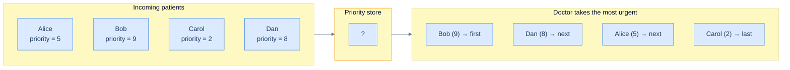

<p align="center"><strong>The streaming-priority problem: arbitrary insertions, but every <em>extract</em> must produce the highest-priority item.</strong></p>

A natural first attempt: keep all patients in a **linked list**. Insertion is easy — append to the head, O(1). But what about finding the highest-priority patient when a doctor frees up? You have to **scan the whole list**.

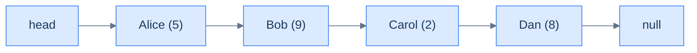

<p align="center"><strong>Patients in a linked list. Insertion at the head is O(1), but finding the maximum priority requires walking every node.</strong></p>

Inserting a new patient is still cheap:

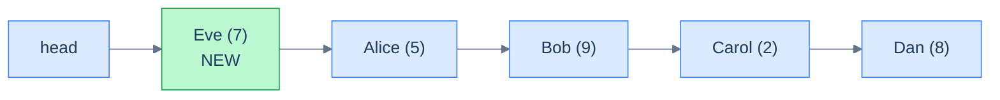

<p align="center"><strong>A new patient is inserted at the head — O(1).</strong></p>

But the *extract-max* path — which is the operation we run every time a doctor opens up — is brutal:

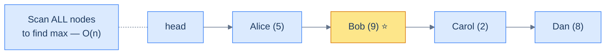

<p align="center"><strong>Finding the highest-priority patient in a linked list requires a linear scan of every node. Scaling to a 100k-patient national emergency system, this is hopeless.</strong></p>

## Limitations of a linked list

Two problems with the linked-list approach:

1. **Extra space.** Every node carries `next` (and `prev` if doubly-linked) pointers. For a million-element queue, that's millions of pointer bytes burnt on bookkeeping.
2. **Performance.** The most frequent operation — find-and-extract-the-max — is O(n). At a national 911 scale with hundreds of thousands of cases live at once, an O(n) scan per dispatch is unworkable.

We need a *purpose-built* data structure for this job — one that gives us **O(1) peek** at the maximum and **O(log n) insert and extract**. That structure is the **priority queue**, and the most popular implementation of a priority queue is the **heap**.

***

# Exploring a possible solution

A **priority queue** is the *abstract* solution to the streaming-priority problem: a container that always exposes the highest-priority item and lets you efficiently push new items at any priority.

## What is a priority queue?

A priority queue stores `(value, priority)` pairs. It supports two main operations:

- **Push** — insert a new item with a given priority (no fixed position; the queue figures out where it goes).
- **Extract** — remove and return the item with the **highest priority**. (Or lowest, depending on the flavour.)

It looks like an ordinary queue from the outside — items go in, items come out — but the order is *priority-driven*, not arrival-driven. Two items with the same priority are typically served in FIFO order (insertion order) as a tiebreaker.

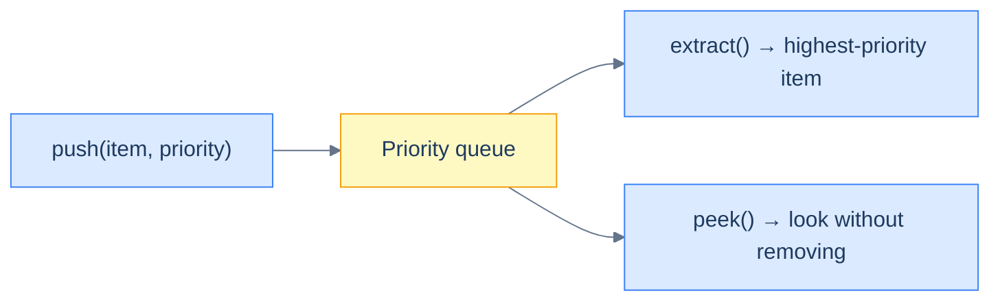

<p align="center"><strong>The priority-queue ADT. <code>push</code> goes in anywhere; <code>extract</code> always pulls the maximum.</strong></p>

## Real life example

Back to the ER. With a priority queue:

- **A new patient arrives** → `push((patient, urgency))`. O(log n).
- **A doctor frees up** → `extract()` returns the most urgent patient. O(log n).

That's it. The priority queue does the bookkeeping; the dispatch loop is a tight five lines.


<p align="center"><strong>The dispatch loop, expressed in priority-queue calls.</strong></p>

A priority queue is an **abstract data type** — it specifies *what* operations are supported and their semantics, not *how* they're implemented. Many implementations exist: sorted arrays, unsorted arrays, balanced BSTs, leftist trees, Fibonacci heaps. The one that wins on simplicity, cache friendliness, and constant factors is the **binary heap** — a tree whose physical layout is just a flat array.

That's what the rest of this chapter is about.

***

# Understanding a heap

A **heap** is a binary tree that obeys two rules at all times:

> 1. The tree is a **complete binary tree**.
> 2. Every node satisfies the **heap ordering property** — its value is more important (higher priority) than both of its children's values.

These two rules together are what make heap operations cheap. The completeness rule guarantees the tree is *as balanced as it can be* (no path is much longer than another), so every operation runs in O(log n). The ordering rule guarantees the highest-priority value is *always at the root*, so peeking is O(1).

## Complete binary tree

A **complete binary tree** is a binary tree where every level is fully filled, **except possibly the last**, which fills **left-to-right**. No gaps in the middle, no missing nodes on the left while the right is occupied — the tree is packed.

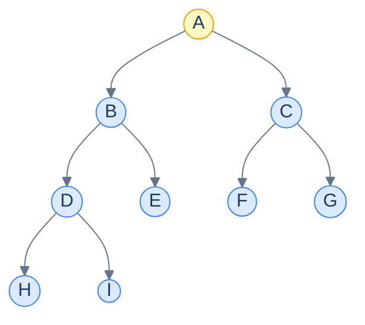

<p align="center"><strong>A complete binary tree of 9 nodes. Every level is fully filled except the last; the last level is filled from the left without gaps.</strong></p>

Why does completeness matter? Two reasons:

1. **Height stays logarithmic.** A complete binary tree of `n` nodes has height exactly `⌊log₂ n⌋`. Operations that walk a single root-to-leaf path are O(log n).
2. **The tree fits in an array.** Because the structure is rigid (no missing internal nodes), we can store it index-by-index in a flat array — and the parent/child relationships become arithmetic, not pointer chases. The next lesson will derive these formulas in detail.

## Heap ordering property

The second rule is what gives the heap its *name* and its **superpower**:

> **Heap ordering property:** every node has higher priority than both of its children.

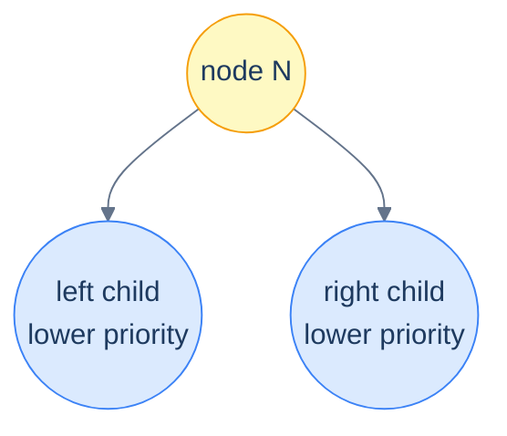

<p align="center"><strong>The heap-ordering property at a single node. The same picture must hold at every node in the tree.</strong></p>

Pause and notice what this rule does **NOT** say:

- It says nothing about left vs right (unlike a BST). The two children just have to be lower-priority than the parent — the *order between them doesn't matter*.
- It says nothing about a node's relationship to its grandchildren. Just parent-vs-child, applied recursively.

The first omission is the cheap-insert escape hatch: when you push a new value, you don't have to find a *specific* slot like in a BST — any vacancy that fixes the parent comparison is fine. This is what gives the heap its O(log n) insert.

The two consequences together — *completeness* + *parent-bigger-than-children* — produce one beautiful invariant: **the maximum (or minimum) priority is always at the root**. Peek is O(1).

***

# Types of Heaps

Whether "high priority" means "big number" or "small number" is a problem-specific choice. Two flavours:

| Flavour | Ordering rule | Root holds |
|---|---|---|
| **Max heap** | Every node ≥ both children | Maximum value |
| **Min heap** | Every node ≤ both children | Minimum value |

### Max heap

A max heap is the heap where bigger numbers are higher priority. It's used when "highest score wins": top-K largest values, leaderboards, top-load servers, recently-most-used caches with size scores.

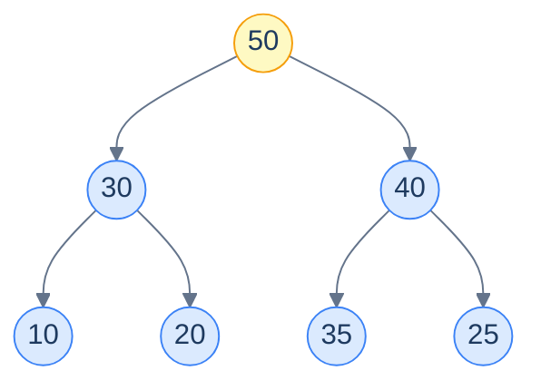

<p align="center"><strong>A max heap with 7 nodes. Each parent (e.g. <code>50, 30, 40, ...</code>) is at least as big as both its children. The maximum value <code>50</code> sits at the root.</strong></p>

### Min Heap

A min heap is the mirror — smaller numbers win. It's used when "lowest cost wins": Dijkstra's shortest path (closest unvisited node), event simulators (next event by timestamp), deadline schedulers (earliest deadline), and any "extract the smallest" workload.

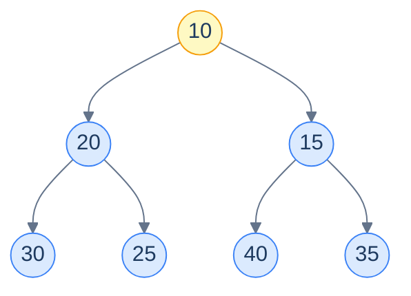

<p align="center"><strong>A min heap with 7 nodes. Each parent is no greater than its children; the minimum <code>10</code> sits at the root.</strong></p>

The two flavours are symmetric — every algorithm in this chapter has a mirror version that swaps `<` for `>`. Most languages' standard libraries default to one (Python's `heapq` is min-heap; Java's `PriorityQueue` is min-heap; C++'s `std::priority_queue` is max-heap) and let you flip the comparator to get the other. We'll meet comparators in lesson 4.

***

# Overview of supported operations

Five operations cover virtually everything you'll ever do with a heap. Each one keeps the two heap rules — completeness and ordering — invariant.

## Insert

**`insert(value)`** — add a new value to the heap. Place it in the next "complete" slot (so completeness is preserved), then **bubble it up** the tree, swapping with its parent whenever it's higher-priority than the parent. Stops when the parent is higher-priority or we hit the root. O(log n).

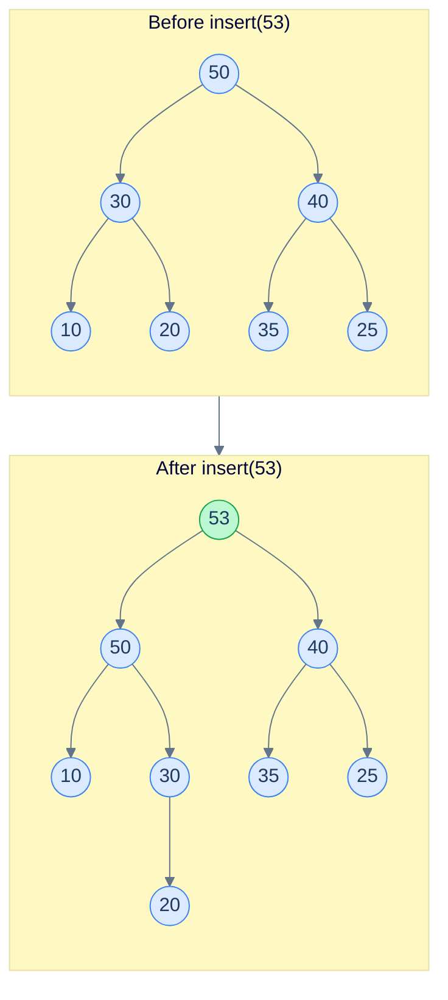

<p align="center"><strong>Insert <code>53</code> into a max-heap. New value lands in the next complete slot (under <code>30</code>), then bubbles up because <code>53 &gt; 30</code> and <code>53 &gt; 50</code>. Final position: the root.</strong></p>

## Delete

**`delete(value)`** — remove a specific value from the heap. Find it (linear scan, since heaps are not searchable like BSTs), replace it with the last node in the tree, then either bubble up or sift down to restore the ordering property. O(n) for the find + O(log n) for the fix; usually we don't need this operation in raw heaps — `extract` covers most use cases.

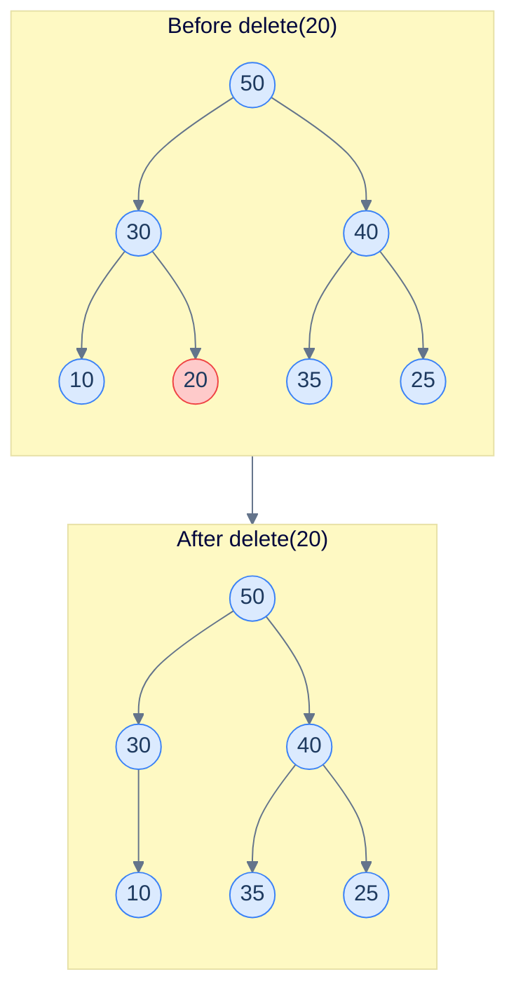

<p align="center"><strong>Delete <code>20</code> from a max-heap. The last node <code>25</code> takes <code>20</code>'s place, then sifts as needed (here no sifting is required; the heap shape is preserved).</strong></p>

## Peek

**`peek()`** — return the root's value without removing it. The root *is* the highest-priority item by the heap-ordering property, so this is just `arr[0]`. **O(1)**, the cheapest operation in the heap toolkit.

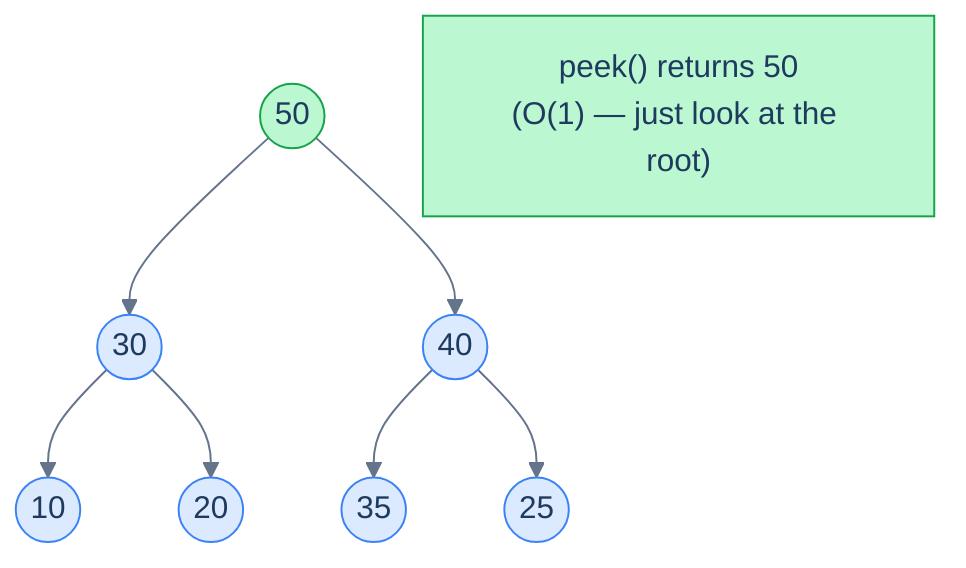

<p align="center"><strong><code>peek()</code> on a max-heap reads the root in O(1) — no traversal, no comparisons.</strong></p>

## Extract

**`extract()`** — remove **and** return the highest-priority value. Take the root, replace it with the last node, then **sift the new root down** the tree by swapping with the higher-priority of its two children whenever they out-prioritise the parent. Stops when both children are lower-priority or we hit a leaf. O(log n).

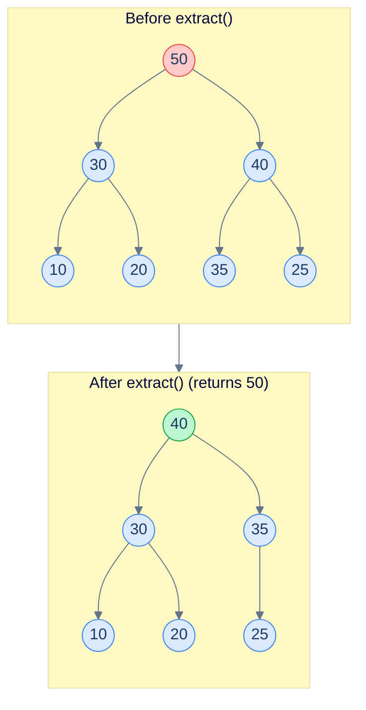

<p align="center"><strong>Extract the maximum. The root <code>50</code> is removed and returned. The last node <code>25</code> moves to the root, then sifts down (swap with the larger child <code>40</code>; further sifts not needed because <code>40 ≥ 35, 25</code>).</strong></p>

## Construct

**`construct(values)`** — build a heap from an existing array of values. The naive approach is to insert one-by-one (O(n log n) total), but there's a clever bottom-up "heapify" algorithm that does it in **O(n)**. We'll see it in detail in lesson 2.

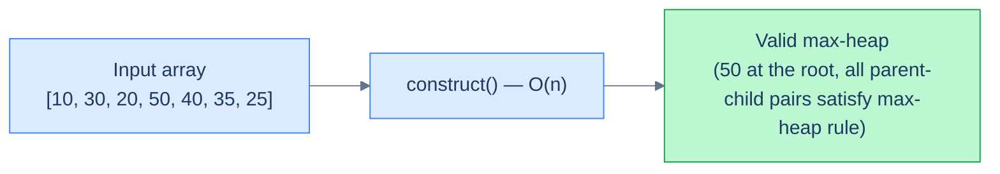

<p align="center"><strong>Constructing a heap from an unsorted array. The bottom-up algorithm runs in O(n), faster than n separate inserts.</strong></p>

We'll meet all five operations in detail in the next lesson, where we replace the "imaginary tree" picture with a flat array and watch the index arithmetic do all the work.

***

# Tree heap validator

Before we build heaps, let's verify what one *is* — by writing a function that checks whether a given binary tree satisfies the **min-heap ordering property**. (We'll skip the completeness check here for brevity; in practice you'd verify both rules.)

## Problem Statement

Given the **root** of a binary tree, return `true` if the tree represents a valid **min heap**, `false` otherwise.

> A valid min heap requires every node's value to be **≤** the values of both its children. (We'll assume the tree is already complete — i.e. structurally a heap shape.)

### Example 1

> - **Input:** `root = [1, 2, 3, 4, 5, 6, 7]`
> - **Output:** `true`

### Example 2

> - **Input:** `root = [1, 4, 3, 2, 5, 6, 7]`
> - **Output:** `false`
> - **Explanation:** `2` (left grandchild of root) is less than its parent `4`, violating the min-heap rule.

## The Strategy

The min-heap rule is purely local: every node's value is `≥` its parent's value. Walk the tree recursively, passing the parent's value down. At each node:

- If the node's value `< parent.val`, the rule is violated → return `false`.
- Otherwise recurse into both children with this node as the new parent.

The root has no parent, so we use `-∞` as a sentinel — it's smaller than anything, so any root passes.

## The Solution

```python run
class Solution:
    def is_valid_heap(self, root, parent_val):
        # Empty subtree trivially satisfies the heap rule.
        if root is None:
            return True
        # Min-heap rule: each node must be ≥ its parent.
        if root.val < parent_val:
            return False
        # Recurse into both children, passing this node as their parent.
        return (self.is_valid_heap(root.left,  root.val) and
                self.is_valid_heap(root.right, root.val))

    def tree_heap_validator(self, root):
        if root is None:                          # empty tree is a valid heap by convention
            return True
        # Use -infinity as the sentinel parent for the root.
        return self.is_valid_heap(root, float("-inf"))
```

```java run
class Solution {
    private boolean isValidHeap(TreeNode root, int parentVal) {
        if (root == null) return true;                                                                                                          // empty subtree → valid
        if (root.val < parentVal) return false;                                                                                                 // min-heap rule violated
        return isValidHeap(root.left,  root.val)
            && isValidHeap(root.right, root.val);                                                                                               // recurse with this node as parent
    }

    public boolean treeHeapValidator(TreeNode root) {
        if (root == null) return true;
        return isValidHeap(root, Integer.MIN_VALUE);                                                                                            // -∞ sentinel for the root
    }
}
```

```c run
#include <limits.h>
#include <stdbool.h>

static bool is_valid_heap(struct TreeNode *root, int parent_val) {
    if (root == NULL) return true;                                                                                                                // empty subtree
    if (root->val < parent_val) return false;                                                                                                     // min-heap violation
    return is_valid_heap(root->left,  root->val)
        && is_valid_heap(root->right, root->val);
}

bool treeHeapValidator(struct TreeNode *root) {
    if (root == NULL) return true;
    return is_valid_heap(root, INT_MIN);                                                                                                          // -∞ sentinel
}
```

```cpp run
#include <climits>

class Solution {
public:
    bool isValidHeap(TreeNode *root, int parentVal) {
        if (!root) return true;                                                                                                                     // empty subtree
        if (root->val < parentVal) return false;                                                                                                    // min-heap violation
        return isValidHeap(root->left,  root->val)
            && isValidHeap(root->right, root->val);
    }

    bool treeHeapValidator(TreeNode *root) {
        if (!root) return true;
        return isValidHeap(root, INT_MIN);                                                                                                          // -∞ sentinel
    }
};
```

```scala run
object Solution {
  private def isValidHeap(root: TreeNode, parentVal: Int): Boolean = {
    if (root == null) return true                                                                                                                     // empty subtree
    if (root.value < parentVal) return false                                                                                                          // min-heap violation
    isValidHeap(root.left,  root.value) && isValidHeap(root.right, root.value)
  }

  def treeHeapValidator(root: TreeNode): Boolean = {
    if (root == null) return true
    isValidHeap(root, Int.MinValue)                                                                                                                   // -∞ sentinel
  }
}
```

```javascript run
class Solution {
  isValidHeap(root, parentVal) {
    if (root === null) return true;                                                                                                                    // empty subtree
    if (root.val < parentVal) return false;                                                                                                            // min-heap violation
    return this.isValidHeap(root.left,  root.val)
        && this.isValidHeap(root.right, root.val);
  }

  treeHeapValidator(root) {
    if (root === null) return true;
    return this.isValidHeap(root, Number.NEGATIVE_INFINITY);                                                                                           // -∞ sentinel
  }
}
```

```typescript run
class Solution {
  isValidHeap(root: TreeNode | null, parentVal: number): boolean {
    if (root === null) return true;                                                                                                                     // empty subtree
    if (root.val < parentVal) return false;                                                                                                             // min-heap violation
    return this.isValidHeap(root.left,  root.val)
        && this.isValidHeap(root.right, root.val);
  }

  treeHeapValidator(root: TreeNode | null): boolean {
    if (root === null) return true;
    return this.isValidHeap(root, Number.NEGATIVE_INFINITY);                                                                                            // -∞ sentinel
  }
}
```

```go run
import "math"

func isValidHeap(root *TreeNode, parentVal int) bool {
    if root == nil { return true }                                                                                                                       // empty subtree
    if root.Val < parentVal { return false }                                                                                                             // min-heap violation
    return isValidHeap(root.Left,  root.Val) && isValidHeap(root.Right, root.Val)
}

func treeHeapValidator(root *TreeNode) bool {
    if root == nil { return true }
    return isValidHeap(root, math.MinInt32)                                                                                                              // -∞ sentinel
}
```

```kotlin run
class Solution {
    private fun isValidHeap(root: TreeNode?, parentVal: Int): Boolean {
        if (root == null) return true                                                                                                                     // empty subtree
        if (root.`val` < parentVal) return false                                                                                                          // min-heap violation
        return isValidHeap(root.left,  root.`val`) && isValidHeap(root.right, root.`val`)
    }

    fun treeHeapValidator(root: TreeNode?): Boolean {
        if (root == null) return true
        return isValidHeap(root, Int.MIN_VALUE)                                                                                                           // -∞ sentinel
    }
}
```

```rust run
use std::rc::Rc;
use std::cell::RefCell;
type Tree = Option<Rc<RefCell<TreeNode>>>;

impl Solution {
    fn is_valid_heap(root: &Tree, parent_val: i32) -> bool {
        match root {
            None => true,                                                                                                                                    // empty subtree
            Some(n) => {
                let n = n.borrow();
                if n.val < parent_val { return false; }                                                                                                      // min-heap violation
                Self::is_valid_heap(&n.left,  n.val)
                    && Self::is_valid_heap(&n.right, n.val)
            }
        }
    }

    pub fn tree_heap_validator(root: Tree) -> bool {
        Self::is_valid_heap(&root, i32::MIN)                                                                                                                 // -∞ sentinel
    }
}
```


<details>
<summary><strong>Trace — root = [1, 4, 3, 2, 5, 6, 7]</strong></summary>

```
Tree shape (level order: [1, 4, 3, 2, 5, 6, 7]):
            1
          /   \
         4     3
        / \   / \
       2   5 6   7

Step 1 │ root=1, parent=−∞ → 1 ≥ −∞ ✓ → recurse with parent=1
Step 2 │ root=4, parent=1  → 4 ≥ 1  ✓ → recurse with parent=4
Step 3 │ root=2, parent=4  → 2 < 4  ✗ → return FALSE
Result: false ✓ (the rule fails at node 2)
```

</details>

***

## Final Takeaway

A heap is a binary tree with two simple invariants — **completeness** and **heap-ordering** — that together give you O(1) peek at the highest-priority value, O(log n) insert, and O(log n) extract. It's the data structure behind every priority queue you've ever seen: ER triage, Dijkstra, schedulers, event simulators, top-K leaderboards.

Three patterns to internalise from this lesson:

1. **Two invariants do all the work.** Completeness keeps the tree shallow (height O(log n)); the ordering rule keeps the root the most-important value. Every operation in the chapter is "do something simple, then restore both invariants".
2. **Heaps don't sort, they prioritise.** A heap is *not* a sorted array. Looking at any non-root node tells you *nothing* about the relative order of its descendants beyond the parent-child rule. The cheap O(log n) operations are the trade-off for not maintaining a full ordering.
3. **The two flavours are mirrors.** Min-heap and max-heap have identical algorithms with `<` swapped for `>`. Pick whichever fits your "high priority" definition — and language libraries make it a one-line comparator change.

The next lesson is where the magic shows up: we'll forget the imaginary tree and store the heap as **a flat array**. Parent and child indices become arithmetic, no pointers, no allocations per node — and every operation we just sketched compiles into 5–10 lines of tight, cache-friendly code.
