# 2. Array Implementation of Heaps

## The Hook

In the previous lesson we drew heaps as binary trees. Beautiful, conceptual, easy to reason about — and **wildly inefficient in memory**. A linked tree node carries the value, a left pointer, and a right pointer; on a 64-bit machine that's 24 bytes for what should be a single integer. Every push allocates. Every pop frees. The CPU's L1 cache, which loves to prefetch sequential memory, gets zero benefit from the scattered allocations.

Now look at this fact again: **a heap is always a complete binary tree.** "Complete" means *every level fully filled, last level filling left-to-right, no gaps*. The structure is so rigid you don't need pointers to describe it — you can describe it with **arithmetic**.

Number the nodes in level-order starting at index `0`: root, root's left child, root's right child, then row 2 left to right, then row 3 left to right. Look at the indices. The root's children are at `1` and `2`. Node `1`'s children are at `3` and `4`. Node `2`'s children are at `5` and `6`. The pattern is **`children of i are at 2i+1 and 2i+2`**, and **`parent of i is at (i-1)/2`** (integer division).

That's it. Pointers gone. Allocations gone. The whole tree lives in a single flat array. Iterating "down a path" becomes a tight loop with `i = 2*i + 1`. The CPU prefetcher loves you. Every operation in this lesson — insert, delete, peek, extract, construct — collapses into 5–10 lines of array code with no recursion required.

This lesson is where the heap actually pays for its reputation. We'll derive the index formulas, then implement all five operations on top of them, watching each one preserve the *completeness* and *heap-ordering* invariants.

---

## Table of Contents

1. [Structure of array based heap](#structure-of-array-based-heap)
2. [Inserting an item in the heap](#inserting-an-item-in-the-heap)
3. [Deleting an item from the heap](#deleting-an-item-from-the-heap)
4. [Peeking the top item in the heap](#peeking-the-top-item-in-the-heap)
5. [Extracting the top item from the heap](#extracting-the-top-item-from-the-heap)
6. [Constructing a heap](#constructing-a-heap)
7. [Min heap to max heap](#min-heap-to-max-heap)
8. [Max heap to min heap](#max-heap-to-min-heap)

***

# Structure of array based heap

Number the nodes of a complete binary tree in level-order starting at `0`. The root is `0`, the second-row nodes are `1, 2`, the third-row nodes are `3, 4, 5, 6`, and so on.

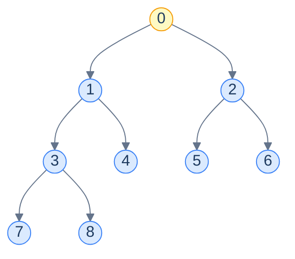

<p align="center"><strong>Level-order indices for a complete binary tree of 9 nodes. The labels here are the array positions, not values.</strong></p>

Now stare at the indices and find the pattern:

| Node | Index | Left child | Right child | Parent |
|---|---|---|---|---|
| Root | 0 | 1 | 2 | — |
| Node `1` | 1 | 3 | 4 | 0 |
| Node `2` | 2 | 5 | 6 | 0 |
| Node `3` | 3 | 7 | 8 | 1 |

The arithmetic falls out:

> For any node at index `i`:
>
> - **Parent** = `(i − 1) / 2` (integer division)
> - **Left child** = `2i + 1`
> - **Right child** = `2i + 2`

> *Friction prompt — predict before reading on. If we numbered from `1` instead of `0` (some textbooks do), what would the formulas become?*

Numbering from `1`: parent = `i/2`, left = `2i`, right = `2i+1`. Slightly cleaner — it's why some textbooks prefer 1-indexing — but every modern language defaults to 0-indexed arrays, so we'll stick with the 0-indexed forms.

Stored in an array, the level-order numbering becomes the *physical* layout — element `i` of the array IS the node at index `i` in the tree.

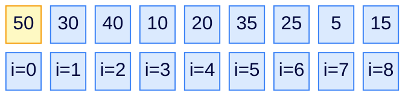

<p align="center"><strong>Array representation of a max-heap. Index <code>0</code> is the root. The tree structure is captured entirely by index arithmetic — no pointers stored.</strong></p>

## Structure of a node

A heap node is just an array slot — a value. No `left` field, no `right` field, no `parent` field. The tree topology is implicit in the indices. This is what gives heap operations their stupendous constant factors: every comparison, every swap, every navigation is a single array access, and every contiguous slice of the heap fits in a CPU cache line.

## Structure in memory

What looks like a tree on paper is, in RAM, a single contiguous block of elements:

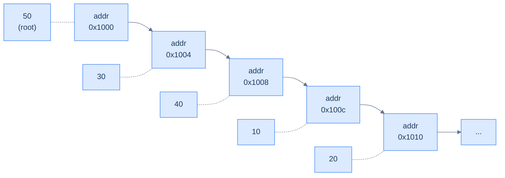

<p align="center"><strong>Heap in memory: just a contiguous int array. Cache-friendly, allocation-free per push.</strong></p>

With this single observation — *parent and child indices are arithmetic* — every heap operation in the rest of this lesson can be written without any tree code at all.

***

# Inserting an item in the heap

To insert a value into the heap, we have two invariants to preserve: completeness and heap-ordering. Completeness pins down *where* the new node has to go physically — the next free position in the array (i.e. just past the current last element). That preserves the "fill last level left-to-right" rule. The heap-ordering rule is what we have to *fix*, by bubbling the new value up if it out-prioritises its parent.

## Algorithm

> **Algorithm**
>
> - **Step 1:** Append the new value at the end of the array.
> - **Step 2:** Bubble it up: while it has a parent and is bigger than the parent (max-heap), swap with the parent.

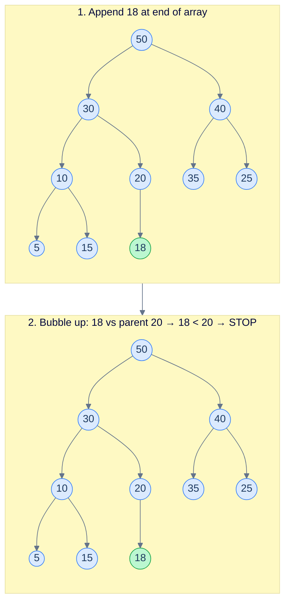

<p align="center"><strong>Insert <code>18</code> into a max-heap. It lands at the next complete slot (under <code>20</code>). Then check parent: <code>18 &lt; 20</code>, no swap needed — the heap rule already holds. Done in O(log n) worst case.</strong></p>

## Up Heapify

The "bubble up" loop is called **up-heapify** (also "sift up"). It's the workhorse subroutine used whenever a node's value *increases* (e.g., after insert) and the *parents* might now be out of order. It walks up from a starting index, swapping with the parent each step, until either the parent is bigger or we hit the root.

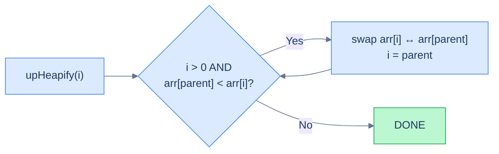

<p align="center"><strong>The up-heapify loop. Walk up from <code>i</code>, swap with parent whenever the heap rule is violated, stop at the root or when the rule is satisfied.</strong></p>

## Implementation


```pseudocode
function upHeapify(heap, index):
    parent ← (index − 1) / 2
    while index > 0 AND heap[parent] < heap[index]:
        swap heap[index] and heap[parent]
        index ← parent
        parent ← (index − 1) / 2

function insert(heap, val):
    append val to heap               # preserves completeness
    upHeapify(heap, length(heap) − 1) # restore ordering property
```

```python run
class MaxHeap:
    def __init__(self):
        self.heap = []

    # Restore the max-heap property going UP from `index`. Used after insert.
    def up_heapify(self, index: int) -> None:
        # While we're not at the root and the parent is smaller, swap.
        parent = (index - 1) // 2
        while index > 0 and self.heap[parent] < self.heap[index]:
            self.heap[index], self.heap[parent] = self.heap[parent], self.heap[index]
            index = parent
            parent = (index - 1) // 2

    def insert(self, val: int) -> None:
        self.heap.append(val)              # Step 1: append at the end (preserves completeness)
        self.up_heapify(len(self.heap) - 1) # Step 2: bubble up to restore ordering
```

```java run
import java.util.*;

class MaxHeap {
    List<Integer> heap = new ArrayList<>();

    private void swap(int i, int j) {
        int t = heap.get(i); heap.set(i, heap.get(j)); heap.set(j, t);
    }

    // Restore the max-heap property going UP from `index`. Used after insert.
    private void upHeapify(int index) {
        int parent = (index - 1) / 2;
        while (index > 0 && heap.get(parent) < heap.get(index)) {
            swap(index, parent);
            index = parent;
            parent = (index - 1) / 2;
        }
    }

    public void insert(int val) {
        heap.add(val);                                                          // append (completeness)
        upHeapify(heap.size() - 1);                                             // sift up (ordering)
    }
}
```

```c run
#include <stdlib.h>

typedef struct {
    int *data; int size; int cap;
} MaxHeap;

static void heap_swap(int *a, int *b) { int t = *a; *a = *b; *b = t; }

static void up_heapify(MaxHeap *h, int index) {
    int parent = (index - 1) / 2;
    while (index > 0 && h->data[parent] < h->data[index]) {
        heap_swap(&h->data[parent], &h->data[index]);
        index = parent;
        parent = (index - 1) / 2;
    }
}

void heap_insert(MaxHeap *h, int val) {
    if (h->size == h->cap) {                                                    // grow if needed
        h->cap = h->cap ? h->cap * 2 : 8;
        h->data = realloc(h->data, sizeof(int) * h->cap);
    }
    h->data[h->size++] = val;                                                   // append (completeness)
    up_heapify(h, h->size - 1);                                                 // sift up (ordering)
}
```

```cpp run
#include <vector>

class MaxHeap {
public:
    std::vector<int> heap;

    // Restore the max-heap property going UP from `index`. Used after insert.
    void upHeapify(int index) {
        int parent = (index - 1) / 2;
        while (index > 0 && heap[parent] < heap[index]) {
            std::swap(heap[parent], heap[index]);
            index = parent;
            parent = (index - 1) / 2;
        }
    }

    void insert(int val) {
        heap.push_back(val);                                                      // append (completeness)
        upHeapify(heap.size() - 1);                                                // sift up (ordering)
    }
};
```

```scala run
import scala.collection.mutable.ArrayBuffer

class MaxHeap {
  val heap: ArrayBuffer[Int] = ArrayBuffer.empty[Int]

  private def swap(i: Int, j: Int): Unit = {
    val t = heap(i); heap(i) = heap(j); heap(j) = t
  }

  // Restore the max-heap property going UP from `index`. Used after insert.
  private def upHeapify(start: Int): Unit = {
    var index = start
    var parent = (index - 1) / 2
    while (index > 0 && heap(parent) < heap(index)) {
      swap(index, parent)
      index = parent
      parent = (index - 1) / 2
    }
  }

  def insert(v: Int): Unit = {
    heap += v                                                                       // append
    upHeapify(heap.length - 1)                                                      // sift up
  }
}
```

```typescript run
class MaxHeap {
  heap: number[] = [];

  swap(i: number, j: number): void {
    [this.heap[i], this.heap[j]] = [this.heap[j], this.heap[i]];
  }

  // Restore the max-heap property going UP from `index`. Used after insert.
  upHeapify(index: number): void {
    let parent = Math.floor((index - 1) / 2);
    while (index > 0 && this.heap[parent] < this.heap[index]) {
      this.swap(index, parent);
      index = parent;
      parent = Math.floor((index - 1) / 2);
    }
  }

  insert(val: number): void {
    this.heap.push(val);                                                                // append
    this.upHeapify(this.heap.length - 1);                                                // sift up
  }
}
```

```go run
type MaxHeap struct{ data []int }

// Restore the max-heap property going UP from `index`. Used after insert.
func (h *MaxHeap) upHeapify(index int) {
    parent := (index - 1) / 2
    for index > 0 && h.data[parent] < h.data[index] {
        h.data[parent], h.data[index] = h.data[index], h.data[parent]
        index = parent
        parent = (index - 1) / 2
    }
}

func (h *MaxHeap) Insert(val int) {
    h.data = append(h.data, val)                                                          // append
    h.upHeapify(len(h.data) - 1)                                                          // sift up
}
```

```rust run
pub struct MaxHeap { data: Vec<i32> }

impl MaxHeap {
    pub fn new() -> Self { Self { data: Vec::new() } }

    // Restore the max-heap property going UP from `index`. Used after insert.
    fn up_heapify(&mut self, mut index: usize) {
        while index > 0 {
            let parent = (index - 1) / 2;
            if self.data[parent] < self.data[index] {
                self.data.swap(parent, index);
                index = parent;
            } else { break; }
        }
    }

    pub fn insert(&mut self, val: i32) {
        self.data.push(val);                                                                  // append
        let last = self.data.len() - 1;
        self.up_heapify(last);                                                                // sift up
    }
}
```


## Complexity analysis

`insert` does an O(1) append, then walks at most one root-to-leaf path during up-heapify — that's at most `⌊log₂ n⌋` comparison-and-swap steps.

| Case | Time | Space |
|---|---|---|
| Best (new value ≤ parent) | O(1) | O(1) |
| Worst (new value > everything) | **O(log n)** | O(1) |

The space cost is constant — the heap grows in place, no auxiliary structures.

***

# Deleting an item from the heap

`delete(index)` removes the value at a specific index. The trick: we can't punch a hole in the middle of the array (it would break completeness). Instead, we **swap the doomed slot with the last element**, drop the (now-trailing) doomed value off the end, and then *fix* the slot we just over-wrote — which may need to bubble up *or* sift down depending on the new value.

For the most common case — deleting the root (which is what `extract` does) — the new root almost certainly needs to sift *down*. So we'll focus the operation around `down_heapify`.

## Algorithm

> **Algorithm**
>
> - **Step 1:** Swap `heap[index]` with `heap[last]`.
> - **Step 2:** Pop the last element (now the value we wanted to delete).
> - **Step 3:** From `index`, run `down_heapify` to restore the heap rule downward. (For non-root index in a max-heap, also consider running `up_heapify` — the new value might be larger than the original parent. The simpler implementation just sifts down, which is correct for `extract` and for any case where the replacement is smaller.)

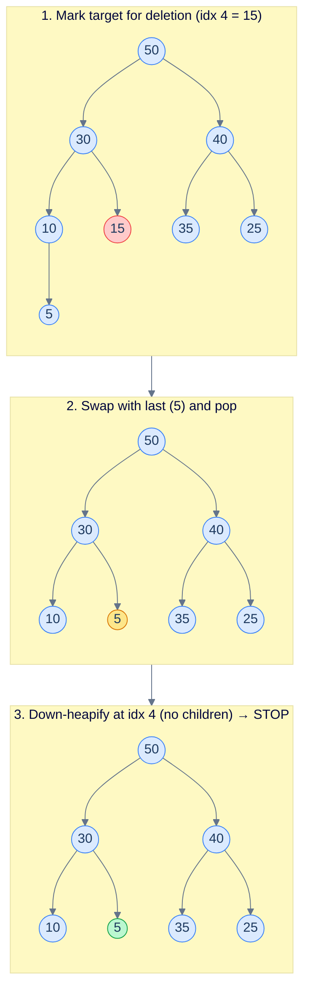

<p align="center"><strong>Delete the value at index 4 (<code>15</code>): swap with last (<code>5</code>), pop, then sift down from index 4 — here a leaf, so no further work.</strong></p>

## Down Heapify

The "sift down" loop is called **down-heapify**. It's the dual of up-heapify — used whenever a node's value *decreases* and its descendants might now violate the heap rule. At each step, find the larger of the two children; if it's larger than the current node, swap, and continue from the swapped slot. Stop when both children are smaller or the node has no children.

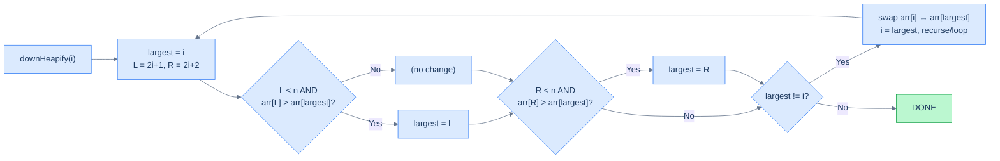

<p align="center"><strong>The down-heapify loop. At each step pick the larger of the two children and swap if it beats the parent.</strong></p>

## Implementation


```pseudocode
function downHeapify(heap, index):
    n ← length(heap)
    while true:
        largest ← index
        left  ← 2 * index + 1
        right ← 2 * index + 2
        if left  < n AND heap[left]  > heap[largest]: largest ← left
        if right < n AND heap[right] > heap[largest]: largest ← right
        if largest = index: return           # heap rule satisfied
        swap heap[index] and heap[largest]
        index ← largest

function remove(heap, index):
    heap[index] ← heap[length(heap) − 1]   # overwrite target with last value
    remove last element from heap
    if index < length(heap):
        downHeapify(heap, index)            # restore ordering from the replaced slot
```

```python run
class MaxHeap:
    def __init__(self):
        self.heap = []

    def up_heapify(self, index):
        parent = (index - 1) // 2
        while index > 0 and self.heap[parent] < self.heap[index]:
            self.heap[index], self.heap[parent] = self.heap[parent], self.heap[index]
            index = parent
            parent = (index - 1) // 2

    # Restore the max-heap property going DOWN from `index`. Used after delete/extract.
    def down_heapify(self, index):
        n = len(self.heap)
        while True:
            largest = index
            left, right = 2 * index + 1, 2 * index + 2
            # Pick the bigger child (if any) and check against current node.
            if left  < n and self.heap[left]  > self.heap[largest]: largest = left
            if right < n and self.heap[right] > self.heap[largest]: largest = right
            if largest == index:
                return                                  # heap rule satisfied
            self.heap[index], self.heap[largest] = self.heap[largest], self.heap[index]
            index = largest                              # continue from the swapped slot

    def insert(self, val):
        self.heap.append(val)
        self.up_heapify(len(self.heap) - 1)

    def remove(self, index):
        last = len(self.heap) - 1
        self.heap[index] = self.heap[last]              # overwrite with last value
        self.heap.pop()                                 # drop the now-duplicate tail
        if index < len(self.heap):
            self.down_heapify(index)
```

```java run
import java.util.*;

class MaxHeap {
    List<Integer> heap = new ArrayList<>();

    private void swap(int i, int j) { int t = heap.get(i); heap.set(i, heap.get(j)); heap.set(j, t); }

    private void upHeapify(int index) {
        int parent = (index - 1) / 2;
        while (index > 0 && heap.get(parent) < heap.get(index)) {
            swap(index, parent); index = parent; parent = (index - 1) / 2;
        }
    }

    // Restore the max-heap property going DOWN from `index`. Used after delete/extract.
    private void downHeapify(int index) {
        int n = heap.size();
        while (true) {
            int largest = index;
            int left = 2 * index + 1, right = 2 * index + 2;
            if (left  < n && heap.get(left)  > heap.get(largest)) largest = left;
            if (right < n && heap.get(right) > heap.get(largest)) largest = right;
            if (largest == index) return;
            swap(index, largest);
            index = largest;
        }
    }

    public void insert(int val) {
        heap.add(val);
        upHeapify(heap.size() - 1);
    }

    public void remove(int index) {
        int last = heap.size() - 1;
        heap.set(index, heap.get(last));                                                                   // overwrite
        heap.remove(last);                                                                                  // drop tail
        if (index < heap.size()) downHeapify(index);
    }
}
```

```c run
#include <stdlib.h>

typedef struct { int *data; int size; int cap; } MaxHeap;

static void hsswap(int *a, int *b) { int t = *a; *a = *b; *b = t; }

static void up_heapify(MaxHeap *h, int index) {
    int parent = (index - 1) / 2;
    while (index > 0 && h->data[parent] < h->data[index]) {
        hsswap(&h->data[parent], &h->data[index]);
        index = parent;
        parent = (index - 1) / 2;
    }
}

static void down_heapify(MaxHeap *h, int index) {
    while (1) {
        int largest = index;
        int left  = 2 * index + 1, right = 2 * index + 2;
        if (left  < h->size && h->data[left]  > h->data[largest]) largest = left;
        if (right < h->size && h->data[right] > h->data[largest]) largest = right;
        if (largest == index) return;
        hsswap(&h->data[index], &h->data[largest]);
        index = largest;
    }
}

void heap_insert(MaxHeap *h, int val) {
    if (h->size == h->cap) { h->cap = h->cap ? h->cap * 2 : 8; h->data = realloc(h->data, sizeof(int) * h->cap); }
    h->data[h->size++] = val;
    up_heapify(h, h->size - 1);
}

void heap_remove(MaxHeap *h, int index) {
    h->data[index] = h->data[--h->size];                                                                            // overwrite + shrink
    if (index < h->size) down_heapify(h, index);
}
```

```cpp run
#include <vector>

class MaxHeap {
public:
    std::vector<int> heap;

    void upHeapify(int index) {
        int parent = (index - 1) / 2;
        while (index > 0 && heap[parent] < heap[index]) {
            std::swap(heap[parent], heap[index]);
            index = parent;
            parent = (index - 1) / 2;
        }
    }

    void downHeapify(int index) {
        int n = (int)heap.size();
        while (true) {
            int largest = index;
            int left  = 2 * index + 1, right = 2 * index + 2;
            if (left  < n && heap[left]  > heap[largest]) largest = left;
            if (right < n && heap[right] > heap[largest]) largest = right;
            if (largest == index) return;
            std::swap(heap[index], heap[largest]);
            index = largest;
        }
    }

    void insert(int val) {
        heap.push_back(val);
        upHeapify((int)heap.size() - 1);
    }

    void remove(int index) {
        heap[index] = heap.back();
        heap.pop_back();
        if (index < (int)heap.size()) downHeapify(index);
    }
};
```

```scala run
import scala.collection.mutable.ArrayBuffer

class MaxHeap {
  val heap = ArrayBuffer.empty[Int]

  private def swap(i: Int, j: Int): Unit = { val t = heap(i); heap(i) = heap(j); heap(j) = t }

  private def upHeapify(start: Int): Unit = {
    var index = start
    var parent = (index - 1) / 2
    while (index > 0 && heap(parent) < heap(index)) {
      swap(index, parent); index = parent; parent = (index - 1) / 2
    }
  }

  private def downHeapify(start: Int): Unit = {
    var index = start
    val n = heap.length
    var keepGoing = true
    while (keepGoing) {
      var largest = index
      val left  = 2 * index + 1
      val right = 2 * index + 2
      if (left  < n && heap(left)  > heap(largest)) largest = left
      if (right < n && heap(right) > heap(largest)) largest = right
      if (largest == index) keepGoing = false
      else { swap(index, largest); index = largest }
    }
  }

  def insert(v: Int): Unit = { heap += v; upHeapify(heap.length - 1) }

  def remove(index: Int): Unit = {
    val last = heap.length - 1
    heap(index) = heap(last)
    heap.remove(last)
    if (index < heap.length) downHeapify(index)
  }
}
```

```typescript run
class MaxHeap {
  heap: number[] = [];
  swap(i: number, j: number): void { [this.heap[i], this.heap[j]] = [this.heap[j], this.heap[i]]; }

  upHeapify(index: number): void {
    let parent = Math.floor((index - 1) / 2);
    while (index > 0 && this.heap[parent] < this.heap[index]) {
      this.swap(index, parent);
      index = parent;
      parent = Math.floor((index - 1) / 2);
    }
  }

  downHeapify(index: number): void {
    const n = this.heap.length;
    while (true) {
      let largest = index;
      const left = 2 * index + 1, right = 2 * index + 2;
      if (left  < n && this.heap[left]  > this.heap[largest]) largest = left;
      if (right < n && this.heap[right] > this.heap[largest]) largest = right;
      if (largest === index) return;
      this.swap(index, largest);
      index = largest;
    }
  }

  insert(val: number): void { this.heap.push(val); this.upHeapify(this.heap.length - 1); }

  remove(index: number): void {
    const last = this.heap.length - 1;
    this.heap[index] = this.heap[last];
    this.heap.pop();
    if (index < this.heap.length) this.downHeapify(index);
  }
}
```

```go run
type MaxHeap struct{ data []int }

func (h *MaxHeap) upHeapify(index int) {
    parent := (index - 1) / 2
    for index > 0 && h.data[parent] < h.data[index] {
        h.data[parent], h.data[index] = h.data[index], h.data[parent]
        index = parent
        parent = (index - 1) / 2
    }
}

func (h *MaxHeap) downHeapify(index int) {
    n := len(h.data)
    for {
        largest := index
        left, right := 2*index+1, 2*index+2
        if left  < n && h.data[left]  > h.data[largest] { largest = left  }
        if right < n && h.data[right] > h.data[largest] { largest = right }
        if largest == index { return }
        h.data[index], h.data[largest] = h.data[largest], h.data[index]
        index = largest
    }
}

func (h *MaxHeap) Insert(val int) {
    h.data = append(h.data, val)
    h.upHeapify(len(h.data) - 1)
}

func (h *MaxHeap) Remove(index int) {
    last := len(h.data) - 1
    h.data[index] = h.data[last]
    h.data = h.data[:last]
    if index < len(h.data) { h.downHeapify(index) }
}
```

```rust run
pub struct MaxHeap { data: Vec<i32> }

impl MaxHeap {
    pub fn new() -> Self { Self { data: Vec::new() } }

    fn up_heapify(&mut self, mut index: usize) {
        while index > 0 {
            let parent = (index - 1) / 2;
            if self.data[parent] < self.data[index] {
                self.data.swap(parent, index);
                index = parent;
            } else { break; }
        }
    }

    fn down_heapify(&mut self, mut index: usize) {
        let n = self.data.len();
        loop {
            let mut largest = index;
            let left  = 2 * index + 1;
            let right = 2 * index + 2;
            if left  < n && self.data[left]  > self.data[largest] { largest = left;  }
            if right < n && self.data[right] > self.data[largest] { largest = right; }
            if largest == index { return; }
            self.data.swap(index, largest);
            index = largest;
        }
    }

    pub fn insert(&mut self, val: i32) {
        self.data.push(val);
        let last = self.data.len() - 1;
        self.up_heapify(last);
    }

    pub fn remove(&mut self, index: usize) {
        let last = self.data.len() - 1;
        self.data.swap(index, last);
        self.data.pop();
        if index < self.data.len() { self.down_heapify(index); }
    }
}
```


## Complexity analysis

`remove` does an O(1) swap-and-pop, then walks at most one root-to-leaf path during down-heapify.

| Case | Time | Space |
|---|---|---|
| Best (replacement value is the largest in its subtree) | O(1) | O(1) |
| Worst (replacement sifts to a leaf) | **O(log n)** | O(1) |

***

# Peeking the top item in the heap

Of the five operations, **`peek` is the easiest** — it doesn't even touch the heap. The root is `arr[0]` by definition, and the heap rule guarantees that's the maximum.

## Algorithm

> **Algorithm**
>
> - **Step 1:** If the heap is empty, signal an error or return `null`.
> - **Step 2:** Return `heap[0]`.

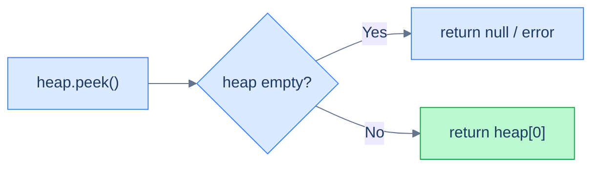

<p align="center"><strong>Peek is just an array read at index 0. O(1).</strong></p>

## Implementation


```pseudocode
function peek(heap):
    if heap is empty: return null
    return heap[0]          # root is always the maximum — O(1) read
```

```python run
class MaxHeap:
    def __init__(self):
        self.heap = []

    def peek(self):
        # Empty heap → no top element. Convention: return None.
        if not self.heap:
            return None
        return self.heap[0]            # the root IS the max — read O(1)
```

```java run
class MaxHeap {
    List<Integer> heap = new ArrayList<>();

    public Integer peek() {
        if (heap.isEmpty()) return null;                        // empty heap → no top
        return heap.get(0);                                     // root is the max
    }
}
```

```c run
#include <stdbool.h>

bool heap_peek(MaxHeap *h, int *out) {
    if (h->size == 0) return false;                              // empty heap → caller knows
    *out = h->data[0];                                           // root is the max
    return true;
}
```

```cpp run
#include <optional>
class MaxHeap {
public:
    std::vector<int> heap;
    std::optional<int> peek() const {
        if (heap.empty()) return std::nullopt;                    // empty → no value
        return heap[0];                                           // root is the max
    }
};
```

```scala run
class MaxHeap {
  val heap = scala.collection.mutable.ArrayBuffer.empty[Int]
  def peek: Option[Int] =
    if (heap.isEmpty) None else Some(heap(0))                     // root is the max
}
```

```typescript run
class MaxHeap {
  heap: number[] = [];
  peek(): number | null {
    if (this.heap.length === 0) return null;                        // empty
    return this.heap[0];                                            // root is the max
  }
}
```

```go run
type MaxHeap struct{ data []int }

func (h *MaxHeap) Peek() (int, bool) {
    if len(h.data) == 0 { return 0, false }                          // empty
    return h.data[0], true                                           // root is the max
}
```

```rust run
pub struct MaxHeap { data: Vec<i32> }

impl MaxHeap {
    pub fn peek(&self) -> Option<i32> {
        self.data.first().copied()                                     // root is the max
    }
}
```


## Complexity analysis

| Case | Time | Space |
|---|---|---|
| All cases | **O(1)** | O(1) |

***

# Extracting the top item from the heap

`extract` is the workhorse of any priority queue: return the highest-priority value AND remove it. We've already built the pieces — extract is just `peek` followed by `delete(0)` (delete the root).

## Algorithm

> **Algorithm**
>
> - **Step 1:** If the heap is empty, signal an error or return `null`.
> - **Step 2:** Save the root value (`heap[0]`).
> - **Step 3:** Move the last element to index `0`.
> - **Step 4:** Pop the last element.
> - **Step 5:** Run `down_heapify(0)` to restore the heap rule.
> - **Step 6:** Return the saved root value.

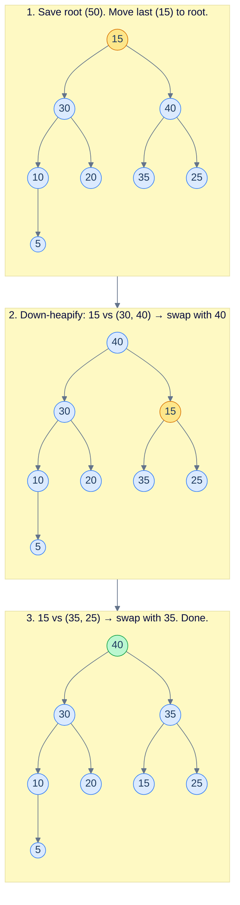

<p align="center"><strong>Extract: pull the root <code>50</code>, move <code>15</code> to the root, sift down twice. The new max <code>40</code> is now at the top.</strong></p>

## Implementation


```pseudocode
function extract(heap):
    if heap is empty: return null
    top ← heap[0]                       # save the root (maximum)
    last ← remove last element from heap
    if heap is NOT empty:
        heap[0] ← last                  # move the tail to the root
        downHeapify(heap, 0)            # sift down to restore ordering
    return top
```

```python run
class MaxHeap:
    def __init__(self):
        self.heap = []

    def down_heapify(self, index):
        n = len(self.heap)
        while True:
            largest = index
            left, right = 2 * index + 1, 2 * index + 2
            if left  < n and self.heap[left]  > self.heap[largest]: largest = left
            if right < n and self.heap[right] > self.heap[largest]: largest = right
            if largest == index:
                return
            self.heap[index], self.heap[largest] = self.heap[largest], self.heap[index]
            index = largest

    def extract(self):
        if not self.heap:
            return None                                # empty — nothing to return
        top = self.heap[0]                             # save the root (the max)
        last = self.heap.pop()                         # remove the last element
        if self.heap:                                  # if heap is not empty after pop
            self.heap[0] = last                        # move it to the root
            self.down_heapify(0)                       # restore the heap rule
        return top
```

```java run
class MaxHeap {
    List<Integer> heap = new ArrayList<>();

    private void swap(int i, int j) { int t = heap.get(i); heap.set(i, heap.get(j)); heap.set(j, t); }

    private void downHeapify(int index) {
        int n = heap.size();
        while (true) {
            int largest = index;
            int left = 2 * index + 1, right = 2 * index + 2;
            if (left  < n && heap.get(left)  > heap.get(largest)) largest = left;
            if (right < n && heap.get(right) > heap.get(largest)) largest = right;
            if (largest == index) return;
            swap(index, largest);
            index = largest;
        }
    }

    public Integer extract() {
        if (heap.isEmpty()) return null;
        int top = heap.get(0);                                                                                      // save the root
        int last = heap.remove(heap.size() - 1);                                                                     // pop tail
        if (!heap.isEmpty()) {
            heap.set(0, last);                                                                                       // tail → root
            downHeapify(0);                                                                                          // restore
        }
        return top;
    }
}
```

```c run
#include <stdbool.h>

bool heap_extract(MaxHeap *h, int *out) {
    if (h->size == 0) return false;
    *out = h->data[0];                                                                                                // save root
    int last = h->data[--h->size];                                                                                    // pop
    if (h->size > 0) {
        h->data[0] = last;                                                                                            // last → root
        down_heapify(h, 0);                                                                                           // restore
    }
    return true;
}
```

```cpp run
#include <optional>

class MaxHeap {
public:
    std::vector<int> heap;

    void downHeapify(int index) {
        int n = (int)heap.size();
        while (true) {
            int largest = index;
            int left  = 2 * index + 1, right = 2 * index + 2;
            if (left  < n && heap[left]  > heap[largest]) largest = left;
            if (right < n && heap[right] > heap[largest]) largest = right;
            if (largest == index) return;
            std::swap(heap[index], heap[largest]);
            index = largest;
        }
    }

    std::optional<int> extract() {
        if (heap.empty()) return std::nullopt;
        int top = heap[0];
        int last = heap.back(); heap.pop_back();
        if (!heap.empty()) {
            heap[0] = last;
            downHeapify(0);
        }
        return top;
    }
};
```

```scala run
class MaxHeap {
  val heap = scala.collection.mutable.ArrayBuffer.empty[Int]

  private def swap(i: Int, j: Int): Unit = { val t = heap(i); heap(i) = heap(j); heap(j) = t }

  private def downHeapify(start: Int): Unit = {
    var index = start; val n = heap.length
    var go = true
    while (go) {
      var largest = index
      val left = 2 * index + 1; val right = 2 * index + 2
      if (left  < n && heap(left)  > heap(largest)) largest = left
      if (right < n && heap(right) > heap(largest)) largest = right
      if (largest == index) go = false
      else { swap(index, largest); index = largest }
    }
  }

  def extract: Option[Int] = {
    if (heap.isEmpty) None
    else {
      val top = heap(0)
      val last = heap.remove(heap.length - 1)
      if (heap.nonEmpty) { heap(0) = last; downHeapify(0) }
      Some(top)
    }
  }
}
```

```typescript run
class MaxHeap {
  heap: number[] = [];
  swap(i: number, j: number): void { [this.heap[i], this.heap[j]] = [this.heap[j], this.heap[i]]; }

  downHeapify(index: number): void {
    const n = this.heap.length;
    while (true) {
      let largest = index;
      const left = 2 * index + 1, right = 2 * index + 2;
      if (left  < n && this.heap[left]  > this.heap[largest]) largest = left;
      if (right < n && this.heap[right] > this.heap[largest]) largest = right;
      if (largest === index) return;
      this.swap(index, largest);
      index = largest;
    }
  }

  extract(): number | null {
    if (this.heap.length === 0) return null;
    const top = this.heap[0];
    const last = this.heap.pop()!;
    if (this.heap.length > 0) {
      this.heap[0] = last;
      this.downHeapify(0);
    }
    return top;
  }
}
```

```go run
type MaxHeap struct{ data []int }

func (h *MaxHeap) downHeapify(index int) {
    n := len(h.data)
    for {
        largest := index
        left, right := 2*index+1, 2*index+2
        if left  < n && h.data[left]  > h.data[largest] { largest = left  }
        if right < n && h.data[right] > h.data[largest] { largest = right }
        if largest == index { return }
        h.data[index], h.data[largest] = h.data[largest], h.data[index]
        index = largest
    }
}

func (h *MaxHeap) Extract() (int, bool) {
    if len(h.data) == 0 { return 0, false }
    top := h.data[0]
    last := h.data[len(h.data)-1]
    h.data = h.data[:len(h.data)-1]
    if len(h.data) > 0 {
        h.data[0] = last
        h.downHeapify(0)
    }
    return top, true
}
```

```rust run
pub struct MaxHeap { data: Vec<i32> }

impl MaxHeap {
    fn down_heapify(&mut self, mut index: usize) {
        let n = self.data.len();
        loop {
            let mut largest = index;
            let left  = 2 * index + 1;
            let right = 2 * index + 2;
            if left  < n && self.data[left]  > self.data[largest] { largest = left;  }
            if right < n && self.data[right] > self.data[largest] { largest = right; }
            if largest == index { return; }
            self.data.swap(index, largest);
            index = largest;
        }
    }

    pub fn extract(&mut self) -> Option<i32> {
        if self.data.is_empty() { return None; }
        let top = self.data[0];
        let last = self.data.pop().unwrap();
        if !self.data.is_empty() {
            self.data[0] = last;
            self.down_heapify(0);
        }
        Some(top)
    }
}
```


## Complexity analysis

| Case | Time | Space |
|---|---|---|
| Best (heap of size ≤ 1) | O(1) | O(1) |
| Worst (sift down to a leaf) | **O(log n)** | O(1) |

The root is *always* deleted, so unlike `delete(index)` for arbitrary index, `extract` doesn't have a hyper-fast best case — it always walks at least one comparison.

***

# Constructing a heap

Suppose you've already got an array of `n` values and you want to make it a heap. The naive approach is `n` separate `insert` calls — that's `O(n log n)` total.

There's a much cleaner approach that runs in **O(n)** total: think of the array as already being a *complete binary tree* (it is — the array layout *is* a complete binary tree, just in level-order), and **walk it bottom-up, calling `down_heapify` at every internal node**.

## Algorithm

The crucial observation: **leaves are already valid one-element heaps**. They have no children, so the heap rule is satisfied trivially. So we don't need to call `down_heapify` on them — we can skip directly to the last *internal* node, which lives at index `n/2 − 1` in a 0-indexed array. From there, we walk backwards to index `0`.

By the time we reach any internal node, both of its subtrees are already heaps (because we processed them earlier in the bottom-up walk). A single `down_heapify` call from this node restores the heap rule across its whole subtree.

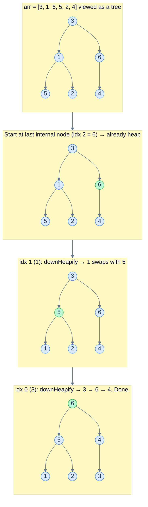

<p align="center"><strong>Bottom-up heap construction. Skip the leaves; from the last internal node (<code>n/2−1</code>) walk back to index 0 calling <code>down_heapify</code>. Total work is O(n) — proven below.</strong></p>

> **Algorithm**
>
> - **Step 1:** For `i = n/2 − 1` down to `0` (inclusive), call `down_heapify(i)`.

## Implementation


```pseudocode
function construct(arr):
    heap ← arr
    n ← length(heap)
    # Skip leaves (index ≥ n/2); process internal nodes bottom-up so every
    # subtree is a valid heap before we heapify its parent.
    for i from n/2 − 1 down to 0:
        downHeapify(heap, i, n)
```

```python run
class MaxHeap:
    def __init__(self):
        self.heap = []

    def down_heapify(self, index, n):
        while True:
            largest = index
            left, right = 2 * index + 1, 2 * index + 2
            if left  < n and self.heap[left]  > self.heap[largest]: largest = left
            if right < n and self.heap[right] > self.heap[largest]: largest = right
            if largest == index:
                return
            self.heap[index], self.heap[largest] = self.heap[largest], self.heap[index]
            index = largest

    def construct(self, arr):
        # Take ownership of the input array (no copy needed for this in-place approach).
        self.heap = arr
        n = len(self.heap)
        # Skip the leaf range [n/2, n-1]; they're already trivial heaps.
        # Process internal nodes bottom-up.
        for i in range(n // 2 - 1, -1, -1):
            self.down_heapify(i, n)
```

```java run
class MaxHeap {
    int[] heap;

    private void swap(int i, int j) { int t = heap[i]; heap[i] = heap[j]; heap[j] = t; }

    private void downHeapify(int index, int n) {
        while (true) {
            int largest = index;
            int left = 2 * index + 1, right = 2 * index + 2;
            if (left  < n && heap[left]  > heap[largest]) largest = left;
            if (right < n && heap[right] > heap[largest]) largest = right;
            if (largest == index) return;
            swap(index, largest);
            index = largest;
        }
    }

    public void construct(int[] arr) {
        this.heap = arr;
        int n = heap.length;
        for (int i = n / 2 - 1; i >= 0; i--) downHeapify(i, n);
    }
}
```

```c run
static void down_heapify_n(int *arr, int n, int index) {
    while (1) {
        int largest = index;
        int left = 2 * index + 1, right = 2 * index + 2;
        if (left  < n && arr[left]  > arr[largest]) largest = left;
        if (right < n && arr[right] > arr[largest]) largest = right;
        if (largest == index) return;
        int t = arr[index]; arr[index] = arr[largest]; arr[largest] = t;
        index = largest;
    }
}

void heap_construct(int *arr, int n) {
    for (int i = n / 2 - 1; i >= 0; i--) down_heapify_n(arr, n, i);
}
```

```cpp run
class MaxHeap {
public:
    std::vector<int> heap;

    void downHeapify(int index, int n) {
        while (true) {
            int largest = index;
            int left = 2 * index + 1, right = 2 * index + 2;
            if (left  < n && heap[left]  > heap[largest]) largest = left;
            if (right < n && heap[right] > heap[largest]) largest = right;
            if (largest == index) return;
            std::swap(heap[index], heap[largest]);
            index = largest;
        }
    }

    void construct(std::vector<int> &arr) {
        heap = std::move(arr);
        int n = (int)heap.size();
        for (int i = n / 2 - 1; i >= 0; i--) downHeapify(i, n);
    }
};
```

```scala run
class MaxHeap {
  var heap: Array[Int] = Array.empty[Int]

  private def swap(i: Int, j: Int): Unit = { val t = heap(i); heap(i) = heap(j); heap(j) = t }

  private def downHeapify(start: Int, n: Int): Unit = {
    var index = start; var go = true
    while (go) {
      var largest = index
      val left = 2 * index + 1; val right = 2 * index + 2
      if (left  < n && heap(left)  > heap(largest)) largest = left
      if (right < n && heap(right) > heap(largest)) largest = right
      if (largest == index) go = false
      else { swap(index, largest); index = largest }
    }
  }

  def construct(arr: Array[Int]): Unit = {
    heap = arr
    val n = heap.length
    var i = n / 2 - 1
    while (i >= 0) { downHeapify(i, n); i -= 1 }
  }
}
```

```typescript run
class MaxHeap {
  heap: number[] = [];
  swap(i: number, j: number): void { [this.heap[i], this.heap[j]] = [this.heap[j], this.heap[i]]; }

  downHeapify(index: number, n: number): void {
    while (true) {
      let largest = index;
      const left = 2 * index + 1, right = 2 * index + 2;
      if (left  < n && this.heap[left]  > this.heap[largest]) largest = left;
      if (right < n && this.heap[right] > this.heap[largest]) largest = right;
      if (largest === index) return;
      this.swap(index, largest);
      index = largest;
    }
  }

  construct(arr: number[]): void {
    this.heap = arr;
    const n = this.heap.length;
    for (let i = Math.floor(n / 2) - 1; i >= 0; i--) this.downHeapify(i, n);
  }
}
```

```go run
type MaxHeap struct{ data []int }

func (h *MaxHeap) downHeapifyN(index, n int) {
    for {
        largest := index
        left, right := 2*index+1, 2*index+2
        if left  < n && h.data[left]  > h.data[largest] { largest = left  }
        if right < n && h.data[right] > h.data[largest] { largest = right }
        if largest == index { return }
        h.data[index], h.data[largest] = h.data[largest], h.data[index]
        index = largest
    }
}

func (h *MaxHeap) Construct(arr []int) {
    h.data = arr
    n := len(h.data)
    for i := n/2 - 1; i >= 0; i-- {
        h.downHeapifyN(i, n)
    }
}
```

```rust run
pub struct MaxHeap { data: Vec<i32> }

impl MaxHeap {
    fn down_heapify_n(&mut self, mut index: usize, n: usize) {
        loop {
            let mut largest = index;
            let left  = 2 * index + 1;
            let right = 2 * index + 2;
            if left  < n && self.data[left]  > self.data[largest] { largest = left;  }
            if right < n && self.data[right] > self.data[largest] { largest = right; }
            if largest == index { return; }
            self.data.swap(index, largest);
            index = largest;
        }
    }

    pub fn construct(&mut self, arr: Vec<i32>) {
        self.data = arr;
        let n = self.data.len();
        if n == 0 { return; }
        for i in (0..=(n / 2 - 1)).rev() {
            self.down_heapify_n(i, n);
        }
    }
}
```


## Complexity analysis

The `n` separate inserts approach gives `O(n log n)`. The bottom-up construct gives **`O(n)`** — *strictly faster*. The reason is that **most nodes are leaves** (about half of them), and they cost zero. Internal nodes cost progressively more — the deepest internal nodes are *just above* the leaves and only do at most one swap; shallower internal nodes can do more swaps but there are *fewer of them*.

Formally: for a complete binary tree of height `h` with `n` nodes:

- Number of nodes at height `j` (counting from 0 at the leaves) ≈ `n / 2^(j+1)`.
- A `down_heapify` call from a node at height `j` does at most `j` swaps.

So the total cost is bounded by:

```
Σ (n / 2^(j+1)) × j  for j = 0 to log n
= n × Σ j / 2^(j+1)
= n × (1/2 × Σ j / 2^j)
< n × 2  (the infinite sum Σ j / 2^j converges to 2)
= O(n)
```

| Case | Time | Space |
|---|---|---|
| All cases | **O(n)** | O(1) (in place) |

This is one of the most surprising results in elementary algorithms: the bottom-up heap build is **linear**, not log-linear, despite each individual `down_heapify` being O(log n).

***

# Min heap to max heap

## Problem Statement

Given an array `arr` that is the array representation of a **min heap**, convert it to a **max heap** **in place** in amortised linear time.

### Example 1

> - **Input:** `arr = [-2, 1, 5, 9, 4, 6, 7]`
> - **Output:** `[9, 4, 7, 1, -2, 6, 5]`
> - **Explanation:** A valid max-heap rearrangement of the same multiset.

### Example 2

> - **Input:** `arr = [3, 5]`
> - **Output:** `[5, 3]`

## The Strategy

**The input being a min heap doesn't help us at all** — the result has to be a max heap, and that's a different ordering. The fastest way to build a max heap from any starting array is the bottom-up `construct` algorithm we just built. So this problem reduces to: **call `construct` with max-heap semantics**.

The two invariants we change to `>`:

- `down_heapify` picks the *larger* of the two children (instead of smaller).
- We swap whenever the current node is *smaller* than the larger child.

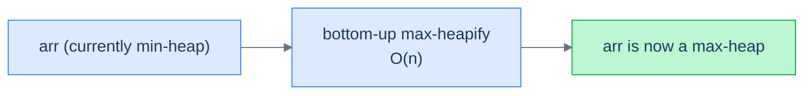

<p align="center"><strong>Min-to-max conversion is just bottom-up max-heapification of the same array. O(n).</strong></p>

## The Solution


```pseudocode
function maxHeapify(arr, n, index):   # down-heapify using > (max-heap ordering)
    while true:
        largest ← index
        left ← 2 * index + 1; right ← 2 * index + 2
        if left  < n AND arr[left]  > arr[largest]: largest ← left
        if right < n AND arr[right] > arr[largest]: largest ← right
        if largest = index: return
        swap arr[index] and arr[largest]; index ← largest

function minHeapToMaxHeap(arr):
    n ← length(arr)
    for i from n/2 − 1 down to 0:
        maxHeapify(arr, n, i)          # bottom-up rebuild with max ordering
```

```python run
class Solution:
    def max_heapify(self, arr, n, index):
        # Standard down-heapify with `>` (max-heap variant).
        while True:
            largest = index
            left, right = 2 * index + 1, 2 * index + 2
            if left  < n and arr[left]  > arr[largest]: largest = left
            if right < n and arr[right] > arr[largest]: largest = right
            if largest == index:
                return
            arr[index], arr[largest] = arr[largest], arr[index]
            index = largest

    def min_heap_to_max_heap(self, arr):
        n = len(arr)
        # Bottom-up: skip leaves, walk internal nodes from last to first.
        for i in range(n // 2 - 1, -1, -1):
            self.max_heapify(arr, n, i)
```

```java run
class Solution {
    private void swap(int[] arr, int i, int j) { int t = arr[i]; arr[i] = arr[j]; arr[j] = t; }

    public void maxHeapify(int[] arr, int n, int index) {
        while (true) {
            int largest = index;
            int left = 2 * index + 1, right = 2 * index + 2;
            if (left  < n && arr[left]  > arr[largest]) largest = left;
            if (right < n && arr[right] > arr[largest]) largest = right;
            if (largest == index) return;
            swap(arr, index, largest);
            index = largest;
        }
    }

    public void minHeapToMaxHeap(int[] arr) {
        int n = arr.length;
        for (int i = n / 2 - 1; i >= 0; i--) maxHeapify(arr, n, i);
    }
}
```

```c run
static void max_heapify(int *arr, int n, int index) {
    while (1) {
        int largest = index;
        int left = 2 * index + 1, right = 2 * index + 2;
        if (left  < n && arr[left]  > arr[largest]) largest = left;
        if (right < n && arr[right] > arr[largest]) largest = right;
        if (largest == index) return;
        int t = arr[index]; arr[index] = arr[largest]; arr[largest] = t;
        index = largest;
    }
}

void minHeapToMaxHeap(int *arr, int n) {
    for (int i = n / 2 - 1; i >= 0; i--) max_heapify(arr, n, i);
}
```

```cpp run
class Solution {
public:
    void maxHeapify(std::vector<int> &arr, int n, int index) {
        while (true) {
            int largest = index;
            int left = 2 * index + 1, right = 2 * index + 2;
            if (left  < n && arr[left]  > arr[largest]) largest = left;
            if (right < n && arr[right] > arr[largest]) largest = right;
            if (largest == index) return;
            std::swap(arr[index], arr[largest]);
            index = largest;
        }
    }

    void minHeapToMaxHeap(std::vector<int> &arr) {
        int n = (int)arr.size();
        for (int i = n / 2 - 1; i >= 0; i--) maxHeapify(arr, n, i);
    }
};
```

```scala run
object Solution {
  private def swap(arr: Array[Int], i: Int, j: Int): Unit = { val t = arr(i); arr(i) = arr(j); arr(j) = t }

  def maxHeapify(arr: Array[Int], n: Int, start: Int): Unit = {
    var index = start; var go = true
    while (go) {
      var largest = index
      val left = 2 * index + 1; val right = 2 * index + 2
      if (left  < n && arr(left)  > arr(largest)) largest = left
      if (right < n && arr(right) > arr(largest)) largest = right
      if (largest == index) go = false
      else { swap(arr, index, largest); index = largest }
    }
  }

  def minHeapToMaxHeap(arr: Array[Int]): Unit = {
    val n = arr.length
    var i = n / 2 - 1
    while (i >= 0) { maxHeapify(arr, n, i); i -= 1 }
  }
}
```

```typescript run
class Solution {
  maxHeapify(arr: number[], n: number, index: number): void {
    while (true) {
      let largest = index;
      const left = 2 * index + 1, right = 2 * index + 2;
      if (left  < n && arr[left]  > arr[largest]) largest = left;
      if (right < n && arr[right] > arr[largest]) largest = right;
      if (largest === index) return;
      [arr[index], arr[largest]] = [arr[largest], arr[index]];
      index = largest;
    }
  }

  minHeapToMaxHeap(arr: number[]): void {
    const n = arr.length;
    for (let i = Math.floor(n / 2) - 1; i >= 0; i--) this.maxHeapify(arr, n, i);
  }
}
```

```go run
func maxHeapifyArr(arr []int, n, index int) {
    for {
        largest := index
        left, right := 2*index+1, 2*index+2
        if left  < n && arr[left]  > arr[largest] { largest = left  }
        if right < n && arr[right] > arr[largest] { largest = right }
        if largest == index { return }
        arr[index], arr[largest] = arr[largest], arr[index]
        index = largest
    }
}

func minHeapToMaxHeap(arr []int) {
    n := len(arr)
    for i := n/2 - 1; i >= 0; i-- { maxHeapifyArr(arr, n, i) }
}
```

```rust run
impl Solution {
    fn max_heapify(arr: &mut [i32], n: usize, mut index: usize) {
        loop {
            let mut largest = index;
            let left  = 2 * index + 1;
            let right = 2 * index + 2;
            if left  < n && arr[left]  > arr[largest] { largest = left;  }
            if right < n && arr[right] > arr[largest] { largest = right; }
            if largest == index { return; }
            arr.swap(index, largest);
            index = largest;
        }
    }

    pub fn min_heap_to_max_heap(arr: &mut Vec<i32>) {
        let n = arr.len();
        if n == 0 { return; }
        for i in (0..=(n / 2 - 1)).rev() {
            Self::max_heapify(arr, n, i);
        }
    }
}
```


***

# Max heap to min heap

## Problem Statement

Mirror image: given an array `arr` that is the array representation of a **max heap**, convert it to a **min heap** in place in amortised linear time.

### Example 1

> - **Input:** `arr = [9, 4, 7, 1, -2, 6, 5]`
> - **Output:** `[-2, 1, 5, 9, 4, 6, 7]`

### Example 2

> - **Input:** `arr = [5, 3]`
> - **Output:** `[3, 5]`

## The Strategy

Same as the previous problem — just flip the comparator. Bottom-up `min_heapify` walks internal nodes from `n/2 − 1` to `0`, picking the **smaller** child each step.

## The Solution


```pseudocode
function minHeapify(arr, n, index):   # down-heapify using < (min-heap ordering)
    while true:
        smallest ← index
        left ← 2 * index + 1; right ← 2 * index + 2
        if left  < n AND arr[left]  < arr[smallest]: smallest ← left
        if right < n AND arr[right] < arr[smallest]: smallest ← right
        if smallest = index: return
        swap arr[index] and arr[smallest]; index ← smallest

function maxHeapToMinHeap(arr):
    n ← length(arr)
    for i from n/2 − 1 down to 0:
        minHeapify(arr, n, i)          # bottom-up rebuild with min ordering
```

```python run
class Solution:
    def min_heapify(self, arr, n, index):
        # Down-heapify with `<` (min-heap variant).
        while True:
            smallest = index
            left, right = 2 * index + 1, 2 * index + 2
            if left  < n and arr[left]  < arr[smallest]: smallest = left
            if right < n and arr[right] < arr[smallest]: smallest = right
            if smallest == index:
                return
            arr[index], arr[smallest] = arr[smallest], arr[index]
            index = smallest

    def max_heap_to_min_heap(self, arr):
        n = len(arr)
        for i in range(n // 2 - 1, -1, -1):
            self.min_heapify(arr, n, i)
```

```java run
class Solution {
    private void swap(int[] arr, int i, int j) { int t = arr[i]; arr[i] = arr[j]; arr[j] = t; }

    public void minHeapify(int[] arr, int n, int index) {
        while (true) {
            int smallest = index;
            int left = 2 * index + 1, right = 2 * index + 2;
            if (left  < n && arr[left]  < arr[smallest]) smallest = left;
            if (right < n && arr[right] < arr[smallest]) smallest = right;
            if (smallest == index) return;
            swap(arr, index, smallest);
            index = smallest;
        }
    }

    public void maxHeapToMinHeap(int[] arr) {
        int n = arr.length;
        for (int i = n / 2 - 1; i >= 0; i--) minHeapify(arr, n, i);
    }
}
```

```c run
static void min_heapify(int *arr, int n, int index) {
    while (1) {
        int smallest = index;
        int left = 2 * index + 1, right = 2 * index + 2;
        if (left  < n && arr[left]  < arr[smallest]) smallest = left;
        if (right < n && arr[right] < arr[smallest]) smallest = right;
        if (smallest == index) return;
        int t = arr[index]; arr[index] = arr[smallest]; arr[smallest] = t;
        index = smallest;
    }
}

void maxHeapToMinHeap(int *arr, int n) {
    for (int i = n / 2 - 1; i >= 0; i--) min_heapify(arr, n, i);
}
```

```cpp run
class Solution {
public:
    void minHeapify(std::vector<int> &arr, int n, int index) {
        while (true) {
            int smallest = index;
            int left = 2 * index + 1, right = 2 * index + 2;
            if (left  < n && arr[left]  < arr[smallest]) smallest = left;
            if (right < n && arr[right] < arr[smallest]) smallest = right;
            if (smallest == index) return;
            std::swap(arr[index], arr[smallest]);
            index = smallest;
        }
    }

    void maxHeapToMinHeap(std::vector<int> &arr) {
        int n = (int)arr.size();
        for (int i = n / 2 - 1; i >= 0; i--) minHeapify(arr, n, i);
    }
};
```

```scala run
object Solution {
  private def swap(arr: Array[Int], i: Int, j: Int): Unit = { val t = arr(i); arr(i) = arr(j); arr(j) = t }

  def minHeapify(arr: Array[Int], n: Int, start: Int): Unit = {
    var index = start; var go = true
    while (go) {
      var smallest = index
      val left = 2 * index + 1; val right = 2 * index + 2
      if (left  < n && arr(left)  < arr(smallest)) smallest = left
      if (right < n && arr(right) < arr(smallest)) smallest = right
      if (smallest == index) go = false
      else { swap(arr, index, smallest); index = smallest }
    }
  }

  def maxHeapToMinHeap(arr: Array[Int]): Unit = {
    val n = arr.length
    var i = n / 2 - 1
    while (i >= 0) { minHeapify(arr, n, i); i -= 1 }
  }
}
```

```typescript run
class Solution {
  minHeapify(arr: number[], n: number, index: number): void {
    while (true) {
      let smallest = index;
      const left = 2 * index + 1, right = 2 * index + 2;
      if (left  < n && arr[left]  < arr[smallest]) smallest = left;
      if (right < n && arr[right] < arr[smallest]) smallest = right;
      if (smallest === index) return;
      [arr[index], arr[smallest]] = [arr[smallest], arr[index]];
      index = smallest;
    }
  }

  maxHeapToMinHeap(arr: number[]): void {
    const n = arr.length;
    for (let i = Math.floor(n / 2) - 1; i >= 0; i--) this.minHeapify(arr, n, i);
  }
}
```

```go run
func minHeapifyArr(arr []int, n, index int) {
    for {
        smallest := index
        left, right := 2*index+1, 2*index+2
        if left  < n && arr[left]  < arr[smallest] { smallest = left  }
        if right < n && arr[right] < arr[smallest] { smallest = right }
        if smallest == index { return }
        arr[index], arr[smallest] = arr[smallest], arr[index]
        index = smallest
    }
}

func maxHeapToMinHeap(arr []int) {
    n := len(arr)
    for i := n/2 - 1; i >= 0; i-- { minHeapifyArr(arr, n, i) }
}
```

```rust run
impl Solution {
    fn min_heapify(arr: &mut [i32], n: usize, mut index: usize) {
        loop {
            let mut smallest = index;
            let left  = 2 * index + 1;
            let right = 2 * index + 2;
            if left  < n && arr[left]  < arr[smallest] { smallest = left;  }
            if right < n && arr[right] < arr[smallest] { smallest = right; }
            if smallest == index { return; }
            arr.swap(index, smallest);
            index = smallest;
        }
    }

    pub fn max_heap_to_min_heap(arr: &mut Vec<i32>) {
        let n = arr.len();
        if n == 0 { return; }
        for i in (0..=(n / 2 - 1)).rev() {
            Self::min_heapify(arr, n, i);
        }
    }
}
```


***

## Final Takeaway

Three index formulas — `parent = (i−1)/2`, `left = 2i+1`, `right = 2i+2` — collapse the entire tree-shaped heap into a flat array. From there, every operation we sketched in lesson 1 fits in a tight loop with no recursion required:

| Operation | Idea | Time |
|---|---|---|
| `peek` | `heap[0]` | **O(1)** |
| `insert(v)` | append + bubble up | O(log n) |
| `remove(i)` / `extract()` | swap with last + sift down | O(log n) |
| `construct(arr)` | bottom-up sift downs | **O(n)** |

Three patterns to lock in:

1. **Two helpers do all the work.** `up_heapify` (after a value increases) and `down_heapify` (after a value decreases) cover every restoration scenario. Insert uses up; delete and extract use down; construct is just `n/2` calls to down. *That's the whole heap*.
2. **Bottom-up `construct` beats `n × insert`.** The `n × insert` approach is O(n log n); the bottom-up approach is O(n). The reason — most nodes are leaves, and they cost zero — is the canonical example of why amortised analysis matters in algorithm design.
3. **Min and max are mirrors.** Every algorithm in this lesson has a `<`-for-`>` mirror. Languages that ship one flavour (Python `heapq` is min; Java `PriorityQueue` is min; C++ is max) let you fake the other with a comparator inversion — which is the focus of lesson 4.

Now that we have a full priority queue at our fingertips, the next two lessons answer the natural question: **what do you actually do with it?** Lesson 3 introduces the **top-K elements pattern**, the single most common application of heaps in coding interviews and real systems. Lesson 4 generalises the heap to *any* ordering by way of comparators — opening the door to heaps of strings, structs, tuples, and anything else with a defined ordering relation.
