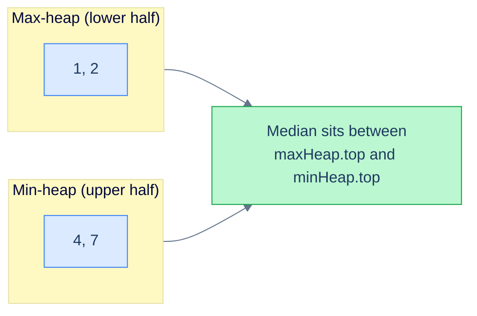
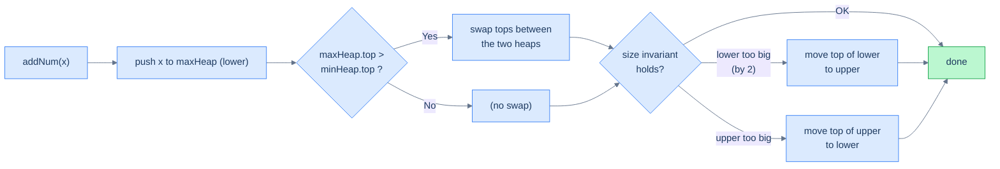

# 5. Design

## The Hook

The previous four lessons built the heap, drilled the operations, and applied them through patterns. This last lesson asks the harder question: **can you design a heap-based data structure from scratch?** Most real engineering work isn't "use the library priority queue" — it's "design a class that wraps one (or two) priority queues to support a non-standard API". Median over a stream. Sliding-window maximum. K-most-frequent-recent. Top-K with deletion. Every one of these is a custom data structure layered on top of one or more heaps.

This lesson covers three design problems that appear in interviews and real systems alike:

1. **Design a Max Heap** — implement the data structure itself, no library shortcuts. Tests whether you internalised lesson 2.
2. **Design a Min Heap** — the mirror, again from scratch. Cements the symmetry.
3. **Design a Median Finder** — the canonical *two-heaps* design pattern, where you balance a max-heap of "small half" and a min-heap of "big half" so the median is always at one of the two roots.

This third one is the payoff. It teaches the **dual-heap balancing** technique that you'll reach for whenever a problem says "running median", "running middle K", or "online order-statistics".

---

## Table of Contents

1. [Design a max heap](#design-a-max-heap)
2. [Design a min heap](#design-a-min-heap)
3. [Design a median finder](#design-a-median-finder)

***

# Design a max heap

## Problem Statement

Implement a `MaxHeap` class **without using any built-in heap library**. The class should support:

- `MaxHeap()` — initialise an empty heap.
- `insert(val)` — push a value onto the heap.
- `remove(index)` — remove the value at `heap[index]`.
- `getMax()` — return the maximum value (without removing it).
- `extractMax()` — remove and return the maximum value.

### Example

> - **Input ops:** `[MaxHeap, insert, insert, remove, getMax, extractMax]`
> - **Input args:** `[[], [5], [3], [1], [], []]`
> - **Output:** `[null, null, null, null, 5, 5]`
>
> Walkthrough:
> - `insert(5)` → heap = `[5]`
> - `insert(3)` → heap = `[5, 3]`
> - `remove(1)` (removes the value at index 1) → heap = `[5]`
> - `getMax()` → returns `5`, heap unchanged
> - `extractMax()` → returns `5`, heap = `[]`

## The Strategy

This is exactly the implementation we built in lesson 2, packaged as a class. The pieces:

- **Storage:** a single resizable array.
- **`upHeapify(i)`** — bubble up after an insert.
- **`downHeapify(i)`** — sift down after a remove.
- **`insert`** — append + `upHeapify`.
- **`remove`** — swap-with-last + pop + `downHeapify`.
- **`getMax`** — read `heap[0]`.
- **`extractMax`** — read `heap[0]`, then `remove(0)`.

## The Solution


```pseudocode
class MaxHeap:
    heap ← []

    function upHeapify(index):
        parent ← (index − 1) / 2
        while index > 0 AND heap[parent] < heap[index]:
            swap heap[index] and heap[parent]
            index ← parent; parent ← (index − 1) / 2

    function downHeapify(index):
        n ← length(heap)
        while true:
            largest ← index; left ← 2*index+1; right ← 2*index+2
            if left  < n AND heap[left]  > heap[largest]: largest ← left
            if right < n AND heap[right] > heap[largest]: largest ← right
            if largest = index: return
            swap heap[index] and heap[largest]; index ← largest

    function insert(val):
        append val to heap; upHeapify(length(heap) − 1)

    function remove(index):
        last ← pop last element from heap
        if index < length(heap):
            heap[index] ← last; downHeapify(index)

    function getMax(): return heap[0] if heap is NOT empty else −1

    function extractMax():
        if heap is empty: return −1
        top ← heap[0]; remove(0); return top
```

```python run
from typing import List

class MaxHeap:
    def __init__(self) -> None:
        self.heap: List[int] = []

    def _up_heapify(self, index: int) -> None:
        # Restore heap rule going UP from index.
        parent = (index - 1) // 2
        while index > 0 and self.heap[parent] < self.heap[index]:
            self.heap[index], self.heap[parent] = self.heap[parent], self.heap[index]
            index = parent
            parent = (index - 1) // 2

    def _down_heapify(self, index: int) -> None:
        # Restore heap rule going DOWN from index.
        n = len(self.heap)
        while True:
            largest = index
            left, right = 2 * index + 1, 2 * index + 2
            if left  < n and self.heap[left]  > self.heap[largest]: largest = left
            if right < n and self.heap[right] > self.heap[largest]: largest = right
            if largest == index:
                return
            self.heap[index], self.heap[largest] = self.heap[largest], self.heap[index]
            index = largest

    def insert(self, val: int) -> None:
        self.heap.append(val)
        self._up_heapify(len(self.heap) - 1)

    def remove(self, index: int) -> None:
        last = self.heap.pop()
        if index < len(self.heap):
            self.heap[index] = last
            self._down_heapify(index)

    def get_max(self) -> int:
        return self.heap[0] if self.heap else -1

    def extract_max(self) -> int:
        if not self.heap:
            return -1
        top = self.heap[0]
        self.remove(0)
        return top
```

```java run
import java.util.*;

class MaxHeap {
    private final List<Integer> heap = new ArrayList<>();

    private void swap(int i, int j) { int t = heap.get(i); heap.set(i, heap.get(j)); heap.set(j, t); }

    private void upHeapify(int index) {
        int parent = (index - 1) / 2;
        while (index > 0 && heap.get(parent) < heap.get(index)) {
            swap(index, parent); index = parent; parent = (index - 1) / 2;
        }
    }

    private void downHeapify(int index) {
        int n = heap.size();
        while (true) {
            int largest = index;
            int left = 2 * index + 1, right = 2 * index + 2;
            if (left  < n && heap.get(left)  > heap.get(largest)) largest = left;
            if (right < n && heap.get(right) > heap.get(largest)) largest = right;
            if (largest == index) return;
            swap(index, largest);
            index = largest;
        }
    }

    public void insert(int val) {
        heap.add(val);
        upHeapify(heap.size() - 1);
    }

    public void remove(int index) {
        int last = heap.remove(heap.size() - 1);
        if (index < heap.size()) {
            heap.set(index, last);
            downHeapify(index);
        }
    }

    public int getMax() { return heap.isEmpty() ? -1 : heap.get(0); }

    public int extractMax() {
        if (heap.isEmpty()) return -1;
        int top = heap.get(0);
        remove(0);
        return top;
    }
}
```

```c run
#include <stdlib.h>

typedef struct { int *data; int size; int cap; } MaxHeap;

static void mh_swap(int *a, int *b) { int t = *a; *a = *b; *b = t; }

static void mh_up(MaxHeap *h, int index) {
    int parent = (index - 1) / 2;
    while (index > 0 && h->data[parent] < h->data[index]) {
        mh_swap(&h->data[parent], &h->data[index]);
        index = parent;
        parent = (index - 1) / 2;
    }
}

static void mh_down(MaxHeap *h, int index) {
    while (1) {
        int largest = index;
        int left = 2 * index + 1, right = 2 * index + 2;
        if (left  < h->size && h->data[left]  > h->data[largest]) largest = left;
        if (right < h->size && h->data[right] > h->data[largest]) largest = right;
        if (largest == index) return;
        mh_swap(&h->data[index], &h->data[largest]);
        index = largest;
    }
}

MaxHeap *maxHeapCreate(void) { return calloc(1, sizeof(MaxHeap)); }

void maxHeapInsert(MaxHeap *h, int val) {
    if (h->size == h->cap) { h->cap = h->cap ? h->cap * 2 : 8; h->data = realloc(h->data, sizeof(int) * h->cap); }
    h->data[h->size++] = val;
    mh_up(h, h->size - 1);
}

void maxHeapRemove(MaxHeap *h, int index) {
    int last = h->data[--h->size];
    if (index < h->size) {
        h->data[index] = last;
        mh_down(h, index);
    }
}

int maxHeapGetMax(MaxHeap *h) { return h->size == 0 ? -1 : h->data[0]; }

int maxHeapExtractMax(MaxHeap *h) {
    if (h->size == 0) return -1;
    int top = h->data[0];
    maxHeapRemove(h, 0);
    return top;
}

void maxHeapFree(MaxHeap *h) { free(h->data); free(h); }
```

```cpp run
#include <vector>

class MaxHeap {
    std::vector<int> heap;

    void upHeapify(int index) {
        int parent = (index - 1) / 2;
        while (index > 0 && heap[parent] < heap[index]) {
            std::swap(heap[parent], heap[index]);
            index = parent;
            parent = (index - 1) / 2;
        }
    }

    void downHeapify(int index) {
        int n = (int)heap.size();
        while (true) {
            int largest = index;
            int left = 2 * index + 1, right = 2 * index + 2;
            if (left  < n && heap[left]  > heap[largest]) largest = left;
            if (right < n && heap[right] > heap[largest]) largest = right;
            if (largest == index) return;
            std::swap(heap[index], heap[largest]);
            index = largest;
        }
    }
public:
    void insert(int val) { heap.push_back(val); upHeapify((int)heap.size() - 1); }

    void remove(int index) {
        int last = heap.back(); heap.pop_back();
        if (index < (int)heap.size()) {
            heap[index] = last;
            downHeapify(index);
        }
    }

    int getMax()     { return heap.empty() ? -1 : heap[0]; }
    int extractMax() {
        if (heap.empty()) return -1;
        int top = heap[0];
        remove(0);
        return top;
    }
};
```

```scala run
import scala.collection.mutable.ArrayBuffer

class MaxHeap {
  private val heap = ArrayBuffer.empty[Int]

  private def swap(i: Int, j: Int): Unit = { val t = heap(i); heap(i) = heap(j); heap(j) = t }

  private def upHeapify(start: Int): Unit = {
    var index = start; var parent = (index - 1) / 2
    while (index > 0 && heap(parent) < heap(index)) { swap(index, parent); index = parent; parent = (index - 1) / 2 }
  }

  private def downHeapify(start: Int): Unit = {
    var index = start; val n = heap.length; var go = true
    while (go) {
      var largest = index
      val left = 2 * index + 1; val right = 2 * index + 2
      if (left  < n && heap(left)  > heap(largest)) largest = left
      if (right < n && heap(right) > heap(largest)) largest = right
      if (largest == index) go = false else { swap(index, largest); index = largest }
    }
  }

  def insert(v: Int): Unit = { heap += v; upHeapify(heap.length - 1) }

  def remove(index: Int): Unit = {
    val last = heap.remove(heap.length - 1)
    if (index < heap.length) { heap(index) = last; downHeapify(index) }
  }

  def getMax: Int = if (heap.isEmpty) -1 else heap(0)

  def extractMax: Int = {
    if (heap.isEmpty) -1
    else { val top = heap(0); remove(0); top }
  }
}
```

```typescript run
class MaxHeap {
  private heap: number[] = [];

  private swap(i: number, j: number): void { [this.heap[i], this.heap[j]] = [this.heap[j], this.heap[i]]; }

  private upHeapify(index: number): void {
    let parent = Math.floor((index - 1) / 2);
    while (index > 0 && this.heap[parent] < this.heap[index]) {
      this.swap(index, parent); index = parent; parent = Math.floor((index - 1) / 2);
    }
  }

  private downHeapify(index: number): void {
    const n = this.heap.length;
    while (true) {
      let largest = index;
      const left = 2 * index + 1, right = 2 * index + 2;
      if (left  < n && this.heap[left]  > this.heap[largest]) largest = left;
      if (right < n && this.heap[right] > this.heap[largest]) largest = right;
      if (largest === index) return;
      this.swap(index, largest); index = largest;
    }
  }

  insert(val: number): void { this.heap.push(val); this.upHeapify(this.heap.length - 1); }

  remove(index: number): void {
    const last = this.heap.pop()!;
    if (index < this.heap.length) { this.heap[index] = last; this.downHeapify(index); }
  }

  getMax(): number { return this.heap.length === 0 ? -1 : this.heap[0]; }

  extractMax(): number {
    if (this.heap.length === 0) return -1;
    const top = this.heap[0];
    this.remove(0);
    return top;
  }
}
```

```go run
type MaxHeap struct{ data []int }

func NewMaxHeap() *MaxHeap { return &MaxHeap{} }

func (h *MaxHeap) up(index int) {
    parent := (index - 1) / 2
    for index > 0 && h.data[parent] < h.data[index] {
        h.data[parent], h.data[index] = h.data[index], h.data[parent]
        index = parent
        parent = (index - 1) / 2
    }
}

func (h *MaxHeap) down(index int) {
    n := len(h.data)
    for {
        largest := index
        left, right := 2*index+1, 2*index+2
        if left  < n && h.data[left]  > h.data[largest] { largest = left  }
        if right < n && h.data[right] > h.data[largest] { largest = right }
        if largest == index { return }
        h.data[index], h.data[largest] = h.data[largest], h.data[index]
        index = largest
    }
}

func (h *MaxHeap) Insert(val int) {
    h.data = append(h.data, val)
    h.up(len(h.data) - 1)
}

func (h *MaxHeap) Remove(index int) {
    last := h.data[len(h.data)-1]
    h.data = h.data[:len(h.data)-1]
    if index < len(h.data) { h.data[index] = last; h.down(index) }
}

func (h *MaxHeap) GetMax() int {
    if len(h.data) == 0 { return -1 }
    return h.data[0]
}

func (h *MaxHeap) ExtractMax() int {
    if len(h.data) == 0 { return -1 }
    top := h.data[0]
    h.Remove(0)
    return top
}
```

```rust run
pub struct MaxHeap { data: Vec<i32> }

impl MaxHeap {
    pub fn new() -> Self { Self { data: Vec::new() } }

    fn up(&mut self, mut index: usize) {
        while index > 0 {
            let parent = (index - 1) / 2;
            if self.data[parent] < self.data[index] {
                self.data.swap(parent, index);
                index = parent;
            } else { break; }
        }
    }

    fn down(&mut self, mut index: usize) {
        let n = self.data.len();
        loop {
            let mut largest = index;
            let left  = 2 * index + 1;
            let right = 2 * index + 2;
            if left  < n && self.data[left]  > self.data[largest] { largest = left;  }
            if right < n && self.data[right] > self.data[largest] { largest = right; }
            if largest == index { return; }
            self.data.swap(index, largest);
            index = largest;
        }
    }

    pub fn insert(&mut self, val: i32) {
        self.data.push(val);
        let last = self.data.len() - 1;
        self.up(last);
    }

    pub fn remove(&mut self, index: usize) {
        let last = self.data.pop().unwrap();
        if index < self.data.len() {
            self.data[index] = last;
            self.down(index);
        }
    }

    pub fn get_max(&self) -> i32 { *self.data.first().unwrap_or(&-1) }

    pub fn extract_max(&mut self) -> i32 {
        if self.data.is_empty() { return -1; }
        let top = self.data[0];
        self.remove(0);
        top
    }
}
```


***

# Design a min heap

## Problem Statement

Mirror image: implement a `MinHeap` class without built-in libraries. API:

- `MinHeap()` — initialise.
- `insert(val)` — push.
- `remove(index)` — remove the value at `heap[index]`.
- `getMin()` — return the minimum.
- `extractMin()` — remove and return the minimum.

### Example

> - **Input ops:** `[MinHeap, insert, insert, remove, getMin, extractMin]`
> - **Input args:** `[[], [5], [3], [1], [], []]`
> - **Output:** `[null, null, null, null, 3, 3]`

## The Strategy

Identical to the max-heap, with `<` swapped for `>`. We name the helper "smallest" instead of "largest" for clarity, but the algorithm is mechanically the same.

## The Solution


```pseudocode
class MinHeap:
    heap ← []

    function upHeapify(index):
        parent ← (index − 1) / 2
        while index > 0 AND heap[parent] > heap[index]:   # > for min-heap
            swap heap[index] and heap[parent]
            index ← parent; parent ← (index − 1) / 2

    function downHeapify(index):
        n ← length(heap)
        while true:
            smallest ← index; left ← 2*index+1; right ← 2*index+2
            if left  < n AND heap[left]  < heap[smallest]: smallest ← left
            if right < n AND heap[right] < heap[smallest]: smallest ← right
            if smallest = index: return
            swap heap[index] and heap[smallest]; index ← smallest

    function insert(val):
        append val to heap; upHeapify(length(heap) − 1)

    function remove(index):
        last ← pop last element from heap
        if index < length(heap):
            heap[index] ← last; downHeapify(index)

    function getMin(): return heap[0] if heap is NOT empty else −1

    function extractMin():
        if heap is empty: return −1
        top ← heap[0]; remove(0); return top
```

```python run
from typing import List

class MinHeap:
    def __init__(self) -> None:
        self.heap: List[int] = []

    def _up_heapify(self, index: int) -> None:
        parent = (index - 1) // 2
        while index > 0 and self.heap[parent] > self.heap[index]:                # `>` for min-heap
            self.heap[index], self.heap[parent] = self.heap[parent], self.heap[index]
            index = parent
            parent = (index - 1) // 2

    def _down_heapify(self, index: int) -> None:
        n = len(self.heap)
        while True:
            smallest = index
            left, right = 2 * index + 1, 2 * index + 2
            if left  < n and self.heap[left]  < self.heap[smallest]: smallest = left
            if right < n and self.heap[right] < self.heap[smallest]: smallest = right
            if smallest == index:
                return
            self.heap[index], self.heap[smallest] = self.heap[smallest], self.heap[index]
            index = smallest

    def insert(self, val: int) -> None:
        self.heap.append(val)
        self._up_heapify(len(self.heap) - 1)

    def remove(self, index: int) -> None:
        last = self.heap.pop()
        if index < len(self.heap):
            self.heap[index] = last
            self._down_heapify(index)

    def get_min(self) -> int:
        return self.heap[0] if self.heap else -1

    def extract_min(self) -> int:
        if not self.heap:
            return -1
        top = self.heap[0]
        self.remove(0)
        return top
```

```java run
import java.util.*;

class MinHeap {
    private final List<Integer> heap = new ArrayList<>();

    private void swap(int i, int j) { int t = heap.get(i); heap.set(i, heap.get(j)); heap.set(j, t); }

    private void upHeapify(int index) {
        int parent = (index - 1) / 2;
        while (index > 0 && heap.get(parent) > heap.get(index)) {
            swap(index, parent); index = parent; parent = (index - 1) / 2;
        }
    }

    private void downHeapify(int index) {
        int n = heap.size();
        while (true) {
            int smallest = index;
            int left = 2 * index + 1, right = 2 * index + 2;
            if (left  < n && heap.get(left)  < heap.get(smallest)) smallest = left;
            if (right < n && heap.get(right) < heap.get(smallest)) smallest = right;
            if (smallest == index) return;
            swap(index, smallest); index = smallest;
        }
    }

    public void insert(int val) { heap.add(val); upHeapify(heap.size() - 1); }

    public void remove(int index) {
        int last = heap.remove(heap.size() - 1);
        if (index < heap.size()) { heap.set(index, last); downHeapify(index); }
    }

    public int getMin() { return heap.isEmpty() ? -1 : heap.get(0); }

    public int extractMin() {
        if (heap.isEmpty()) return -1;
        int top = heap.get(0); remove(0); return top;
    }
}
```

```c run
#include <stdlib.h>

typedef struct { int *data; int size; int cap; } MinHeap;

static void mh_swap2(int *a, int *b) { int t = *a; *a = *b; *b = t; }

static void min_up(MinHeap *h, int index) {
    int parent = (index - 1) / 2;
    while (index > 0 && h->data[parent] > h->data[index]) {
        mh_swap2(&h->data[parent], &h->data[index]);
        index = parent;
        parent = (index - 1) / 2;
    }
}

static void min_down(MinHeap *h, int index) {
    while (1) {
        int smallest = index;
        int left = 2 * index + 1, right = 2 * index + 2;
        if (left  < h->size && h->data[left]  < h->data[smallest]) smallest = left;
        if (right < h->size && h->data[right] < h->data[smallest]) smallest = right;
        if (smallest == index) return;
        mh_swap2(&h->data[index], &h->data[smallest]);
        index = smallest;
    }
}

MinHeap *minHeapCreate(void) { return calloc(1, sizeof(MinHeap)); }

void minHeapInsert(MinHeap *h, int val) {
    if (h->size == h->cap) { h->cap = h->cap ? h->cap * 2 : 8; h->data = realloc(h->data, sizeof(int) * h->cap); }
    h->data[h->size++] = val;
    min_up(h, h->size - 1);
}

void minHeapRemove(MinHeap *h, int index) {
    int last = h->data[--h->size];
    if (index < h->size) { h->data[index] = last; min_down(h, index); }
}

int minHeapGetMin(MinHeap *h) { return h->size == 0 ? -1 : h->data[0]; }

int minHeapExtractMin(MinHeap *h) {
    if (h->size == 0) return -1;
    int top = h->data[0];
    minHeapRemove(h, 0);
    return top;
}

void minHeapFree(MinHeap *h) { free(h->data); free(h); }
```

```cpp run
#include <vector>

class MinHeap {
    std::vector<int> heap;

    void upHeapify(int index) {
        int parent = (index - 1) / 2;
        while (index > 0 && heap[parent] > heap[index]) {
            std::swap(heap[parent], heap[index]);
            index = parent;
            parent = (index - 1) / 2;
        }
    }

    void downHeapify(int index) {
        int n = (int)heap.size();
        while (true) {
            int smallest = index;
            int left = 2 * index + 1, right = 2 * index + 2;
            if (left  < n && heap[left]  < heap[smallest]) smallest = left;
            if (right < n && heap[right] < heap[smallest]) smallest = right;
            if (smallest == index) return;
            std::swap(heap[index], heap[smallest]);
            index = smallest;
        }
    }
public:
    void insert(int val) { heap.push_back(val); upHeapify((int)heap.size() - 1); }

    void remove(int index) {
        int last = heap.back(); heap.pop_back();
        if (index < (int)heap.size()) { heap[index] = last; downHeapify(index); }
    }

    int getMin()     { return heap.empty() ? -1 : heap[0]; }
    int extractMin() {
        if (heap.empty()) return -1;
        int top = heap[0]; remove(0); return top;
    }
};
```

```scala run
import scala.collection.mutable.ArrayBuffer

class MinHeap {
  private val heap = ArrayBuffer.empty[Int]

  private def swap(i: Int, j: Int): Unit = { val t = heap(i); heap(i) = heap(j); heap(j) = t }

  private def upHeapify(start: Int): Unit = {
    var index = start; var parent = (index - 1) / 2
    while (index > 0 && heap(parent) > heap(index)) { swap(index, parent); index = parent; parent = (index - 1) / 2 }
  }

  private def downHeapify(start: Int): Unit = {
    var index = start; val n = heap.length; var go = true
    while (go) {
      var smallest = index
      val left = 2 * index + 1; val right = 2 * index + 2
      if (left  < n && heap(left)  < heap(smallest)) smallest = left
      if (right < n && heap(right) < heap(smallest)) smallest = right
      if (smallest == index) go = false else { swap(index, smallest); index = smallest }
    }
  }

  def insert(v: Int): Unit = { heap += v; upHeapify(heap.length - 1) }

  def remove(index: Int): Unit = {
    val last = heap.remove(heap.length - 1)
    if (index < heap.length) { heap(index) = last; downHeapify(index) }
  }

  def getMin: Int = if (heap.isEmpty) -1 else heap(0)

  def extractMin: Int = {
    if (heap.isEmpty) -1 else { val top = heap(0); remove(0); top }
  }
}
```

```typescript run
class MinHeap {
  private heap: number[] = [];

  private swap(i: number, j: number): void { [this.heap[i], this.heap[j]] = [this.heap[j], this.heap[i]]; }

  private upHeapify(index: number): void {
    let parent = Math.floor((index - 1) / 2);
    while (index > 0 && this.heap[parent] > this.heap[index]) {
      this.swap(index, parent); index = parent; parent = Math.floor((index - 1) / 2);
    }
  }

  private downHeapify(index: number): void {
    const n = this.heap.length;
    while (true) {
      let smallest = index;
      const left = 2 * index + 1, right = 2 * index + 2;
      if (left  < n && this.heap[left]  < this.heap[smallest]) smallest = left;
      if (right < n && this.heap[right] < this.heap[smallest]) smallest = right;
      if (smallest === index) return;
      this.swap(index, smallest); index = smallest;
    }
  }

  insert(val: number): void { this.heap.push(val); this.upHeapify(this.heap.length - 1); }

  remove(index: number): void {
    const last = this.heap.pop()!;
    if (index < this.heap.length) { this.heap[index] = last; this.downHeapify(index); }
  }

  getMin(): number { return this.heap.length === 0 ? -1 : this.heap[0]; }

  extractMin(): number {
    if (this.heap.length === 0) return -1;
    const top = this.heap[0]; this.remove(0); return top;
  }
}
```

```go run
type MinHeap struct{ data []int }

func NewMinHeap() *MinHeap { return &MinHeap{} }

func (h *MinHeap) up(index int) {
    parent := (index - 1) / 2
    for index > 0 && h.data[parent] > h.data[index] {
        h.data[parent], h.data[index] = h.data[index], h.data[parent]
        index = parent
        parent = (index - 1) / 2
    }
}

func (h *MinHeap) down(index int) {
    n := len(h.data)
    for {
        smallest := index
        left, right := 2*index+1, 2*index+2
        if left  < n && h.data[left]  < h.data[smallest] { smallest = left  }
        if right < n && h.data[right] < h.data[smallest] { smallest = right }
        if smallest == index { return }
        h.data[index], h.data[smallest] = h.data[smallest], h.data[index]
        index = smallest
    }
}

func (h *MinHeap) Insert(val int) {
    h.data = append(h.data, val)
    h.up(len(h.data) - 1)
}

func (h *MinHeap) Remove(index int) {
    last := h.data[len(h.data)-1]
    h.data = h.data[:len(h.data)-1]
    if index < len(h.data) { h.data[index] = last; h.down(index) }
}

func (h *MinHeap) GetMin() int { if len(h.data) == 0 { return -1 }; return h.data[0] }

func (h *MinHeap) ExtractMin() int {
    if len(h.data) == 0 { return -1 }
    top := h.data[0]
    h.Remove(0)
    return top
}
```

```rust run
pub struct MinHeap { data: Vec<i32> }

impl MinHeap {
    pub fn new() -> Self { Self { data: Vec::new() } }

    fn up(&mut self, mut index: usize) {
        while index > 0 {
            let parent = (index - 1) / 2;
            if self.data[parent] > self.data[index] {
                self.data.swap(parent, index);
                index = parent;
            } else { break; }
        }
    }

    fn down(&mut self, mut index: usize) {
        let n = self.data.len();
        loop {
            let mut smallest = index;
            let left  = 2 * index + 1;
            let right = 2 * index + 2;
            if left  < n && self.data[left]  < self.data[smallest] { smallest = left;  }
            if right < n && self.data[right] < self.data[smallest] { smallest = right; }
            if smallest == index { return; }
            self.data.swap(index, smallest);
            index = smallest;
        }
    }

    pub fn insert(&mut self, val: i32) {
        self.data.push(val);
        let last = self.data.len() - 1;
        self.up(last);
    }

    pub fn remove(&mut self, index: usize) {
        let last = self.data.pop().unwrap();
        if index < self.data.len() {
            self.data[index] = last;
            self.down(index);
        }
    }

    pub fn get_min(&self) -> i32 { *self.data.first().unwrap_or(&-1) }

    pub fn extract_min(&mut self) -> i32 {
        if self.data.is_empty() { return -1; }
        let top = self.data[0];
        self.remove(0);
        top
    }
}
```


***

# Design a median finder

## Problem Statement

Implement a `MedianFinder` class that maintains the median of a *running stream* of integers. API:

- `MedianFinder()` — initialise.
- `addNum(num)` — insert a number into the stream.
- `findMedian()` — return the current median. (For even count, return the average of the two middles, as a `double`.)

### Example

> - **Input ops:** `[MedianFinder, addNum, addNum, addNum, findMedian]`
> - **Input args:** `[[], [1], [2], [4], []]`
> - **Output:** `[null, null, null, null, 2.0]`
>
> After the three adds, the sorted stream is `[1, 2, 4]`. Median = `2`.

(With `[1, 2]` it would be `1.5`; with `[1, 2, 3, 4]` it would be `2.5`.)

## The Strategy

The naive approach maintains a sorted list and inserts in O(N) per `addNum` — too slow at scale. A heap-based approach gets us O(log N) per add and O(1) per median query.

**The core trick — two heaps:**



<p align="center"><strong>Two-heap median: a max-heap for the lower half, a min-heap for the upper half. The roots of the two heaps are the candidates for the median.</strong></p>

We split the stream into two halves:

- A **max-heap** `lower` holds the smaller half. Its top is the *largest of the smaller half*.
- A **min-heap** `upper` holds the larger half. Its top is the *smallest of the larger half*.

Two invariants:

1. **Size:** `len(lower) == len(upper)` OR `len(lower) == len(upper) + 1`. (We let `lower` carry the extra element when the count is odd.)
2. **Order:** every element in `lower` ≤ every element in `upper`. Equivalently, `lower.top() <= upper.top()`.

If invariant 1 holds, the median is:

- `lower.top()` when the total count is **odd** (`lower` has one extra element).
- `(lower.top() + upper.top()) / 2.0` when the total count is **even**.

### addNum

Pushing a new number is a two-step rebalance:

1. Push to `lower`.
2. **Order rebalance:** if `lower.top() > upper.top()`, swap the tops by extracting both and re-inserting on the opposite side. (This keeps invariant 2.)
3. **Size rebalance:** if `len(lower) > len(upper) + 1`, move `lower.top()` to `upper`. Conversely, if `len(upper) > len(lower)`, move `upper.top()` to `lower`. (This keeps invariant 1.)



<p align="center"><strong>Two-step rebalance: order first, then size. Each step touches at most one element on each side.</strong></p>

Each step is O(log N), so `addNum` is O(log N) overall.

### findMedian

If `lower.size > upper.size`, the median is `lower.top()` (count is odd). Otherwise the count is even and the median is the average of the two tops. **O(1)**.

## The Solution


```pseudocode
class MedianFinder:
    lower ← empty max-heap   # holds the smaller half
    upper ← empty min-heap   # holds the larger half

    function addNum(num):
        push num onto lower                                    # 1. always push to the lower half first
        if upper is NOT empty AND peek(lower) > peek(upper):  # 2. order rebalance: tops crossed
            a ← pop from lower; b ← pop from upper
            push b onto lower; push a onto upper
        if size(lower) > size(upper) + 1:                     # 3. size rebalance: lower overfull
            push (pop from lower) onto upper
        else if size(upper) > size(lower):                     #    or upper overfull
            push (pop from upper) onto lower

    function findMedian():
        if size(lower) > size(upper): return peek(lower)       # odd count → exact middle
        return (peek(lower) + peek(upper)) / 2.0               # even count → average of two middles
```

```python run
import heapq

class MedianFinder:
    def __init__(self) -> None:
        # Python heapq is min-only. Negate everything in `lower` to make it a max-heap.
        self.lower: list = []  # max-heap (stored as negated values) — lower half
        self.upper: list = []  # min-heap — upper half

    def add_num(self, num: int) -> None:
        # 1. Push to lower (max-heap).
        heapq.heappush(self.lower, -num)
        # 2. Order rebalance: if lower's top > upper's top, swap them.
        if self.upper and -self.lower[0] > self.upper[0]:
            largest_of_lower = -heapq.heappop(self.lower)
            smallest_of_upper = heapq.heappop(self.upper)
            heapq.heappush(self.lower, -smallest_of_upper)
            heapq.heappush(self.upper, largest_of_lower)
        # 3. Size rebalance: keep |lower| ∈ {|upper|, |upper| + 1}.
        if len(self.lower) > len(self.upper) + 1:
            heapq.heappush(self.upper, -heapq.heappop(self.lower))
        elif len(self.upper) > len(self.lower):
            heapq.heappush(self.lower, -heapq.heappop(self.upper))

    def find_median(self) -> float:
        if len(self.lower) > len(self.upper):
            return float(-self.lower[0])               # odd count → top of lower
        return (-self.lower[0] + self.upper[0]) / 2.0  # even count → average of tops
```

```java run
import java.util.*;

class MedianFinder {
    private final PriorityQueue<Integer> lower = new PriorityQueue<>(Comparator.reverseOrder());   // max-heap
    private final PriorityQueue<Integer> upper = new PriorityQueue<>();                             // min-heap

    public void addNum(int num) {
        lower.add(num);
        if (!upper.isEmpty() && lower.peek() > upper.peek()) {                                       // order rebalance
            int a = lower.poll(), b = upper.poll();
            lower.add(b); upper.add(a);
        }
        if (lower.size() > upper.size() + 1) upper.add(lower.poll());                                // size rebalance
        else if (upper.size() > lower.size()) lower.add(upper.poll());
    }

    public double findMedian() {
        if (lower.size() > upper.size()) return lower.peek();
        return (lower.peek() + upper.peek()) / 2.0;
    }
}
```

```c run
// Reuses MaxHeap/MinHeap from the previous two problems in this lesson.
typedef struct {
    MaxHeap *lower;   // max-heap on smaller half
    MinHeap *upper;   // min-heap on larger half
} MedianFinder;

MedianFinder *medianFinderCreate(void) {
    MedianFinder *m = malloc(sizeof(*m));
    m->lower = maxHeapCreate();
    m->upper = minHeapCreate();
    return m;
}

void medianFinderAddNum(MedianFinder *m, int num) {
    maxHeapInsert(m->lower, num);
    if (m->upper->size && maxHeapGetMax(m->lower) > minHeapGetMin(m->upper)) {                       // order rebalance
        int a = maxHeapExtractMax(m->lower);
        int b = minHeapExtractMin(m->upper);
        maxHeapInsert(m->lower, b);
        minHeapInsert(m->upper, a);
    }
    if (m->lower->size > m->upper->size + 1) {                                                       // size rebalance
        minHeapInsert(m->upper, maxHeapExtractMax(m->lower));
    } else if (m->upper->size > m->lower->size) {
        maxHeapInsert(m->lower, minHeapExtractMin(m->upper));
    }
}

double medianFinderFindMedian(MedianFinder *m) {
    if (m->lower->size > m->upper->size) return (double)maxHeapGetMax(m->lower);
    return (maxHeapGetMax(m->lower) + minHeapGetMin(m->upper)) / 2.0;
}

void medianFinderFree(MedianFinder *m) { maxHeapFree(m->lower); minHeapFree(m->upper); free(m); }
```

```cpp run
#include <queue>
#include <vector>

class MedianFinder {
    std::priority_queue<int> lower;                                                                    // max-heap
    std::priority_queue<int, std::vector<int>, std::greater<int>> upper;                               // min-heap
public:
    MedianFinder() {}

    void addNum(int num) {
        lower.push(num);
        if (!upper.empty() && lower.top() > upper.top()) {                                              // order rebalance
            int a = lower.top(); lower.pop();
            int b = upper.top(); upper.pop();
            lower.push(b); upper.push(a);
        }
        if ((int)lower.size() > (int)upper.size() + 1) {                                                 // size rebalance
            upper.push(lower.top()); lower.pop();
        } else if ((int)upper.size() > (int)lower.size()) {
            lower.push(upper.top()); upper.pop();
        }
    }

    double findMedian() {
        if (lower.size() > upper.size()) return lower.top();
        return (lower.top() + upper.top()) / 2.0;
    }
};
```

```scala run
import scala.collection.mutable.PriorityQueue

class MedianFinder {
  private val lower = PriorityQueue.empty[Int]                                                             // max-heap (default)
  private val upper = PriorityQueue.empty[Int](Ordering[Int].reverse)                                       // min-heap

  def addNum(num: Int): Unit = {
    lower.enqueue(num)
    if (upper.nonEmpty && lower.head > upper.head) {                                                        // order rebalance
      val a = lower.dequeue(); val b = upper.dequeue()
      lower.enqueue(b); upper.enqueue(a)
    }
    if (lower.size > upper.size + 1) upper.enqueue(lower.dequeue())                                          // size rebalance
    else if (upper.size > lower.size) lower.enqueue(upper.dequeue())
  }

  def findMedian: Double =
    if (lower.size > upper.size) lower.head.toDouble
    else (lower.head + upper.head) / 2.0
}
```

```typescript run
class MedianFinder {
  private lower = new MaxHeap();
  private upper = new MinHeap();

  addNum(num: number): void {
    this.lower.insert(num);
    const lowerArr = (this.lower as unknown as { heap: number[] }).heap;
    const upperArr = (this.upper as unknown as { heap: number[] }).heap;
    if (upperArr.length > 0 && lowerArr[0] > upperArr[0]) {
      const a = this.lower.extractMax();
      const b = this.upper.extractMin();
      this.lower.insert(b);
      this.upper.insert(a);
    }
    if (lowerArr.length > upperArr.length + 1) {
      this.upper.insert(this.lower.extractMax());
    } else if (upperArr.length > lowerArr.length) {
      this.lower.insert(this.upper.extractMin());
    }
  }

  findMedian(): number {
    const lowerArr = (this.lower as unknown as { heap: number[] }).heap;
    const upperArr = (this.upper as unknown as { heap: number[] }).heap;
    if (lowerArr.length > upperArr.length) return lowerArr[0];
    return (lowerArr[0] + upperArr[0]) / 2.0;
  }
}
```

```go run
type MedianFinder struct {
    lower *MaxHeap   // smaller half
    upper *MinHeap   // larger half
}

func NewMedianFinder() *MedianFinder {
    return &MedianFinder{lower: NewMaxHeap(), upper: NewMinHeap()}
}

func (m *MedianFinder) AddNum(num int) {
    m.lower.Insert(num)
    if len(m.upper.data) > 0 && m.lower.GetMax() > m.upper.GetMin() {                                              // order rebalance
        a := m.lower.ExtractMax()
        b := m.upper.ExtractMin()
        m.lower.Insert(b)
        m.upper.Insert(a)
    }
    if len(m.lower.data) > len(m.upper.data) + 1 {                                                                 // size rebalance
        m.upper.Insert(m.lower.ExtractMax())
    } else if len(m.upper.data) > len(m.lower.data) {
        m.lower.Insert(m.upper.ExtractMin())
    }
}

func (m *MedianFinder) FindMedian() float64 {
    if len(m.lower.data) > len(m.upper.data) {
        return float64(m.lower.GetMax())
    }
    return float64(m.lower.GetMax() + m.upper.GetMin()) / 2.0
}
```

```rust run
use std::collections::BinaryHeap;
use std::cmp::Reverse;

pub struct MedianFinder {
    lower: BinaryHeap<i32>,                 // max-heap
    upper: BinaryHeap<Reverse<i32>>,        // min-heap
}

impl MedianFinder {
    pub fn new() -> Self {
        Self { lower: BinaryHeap::new(), upper: BinaryHeap::new() }
    }

    pub fn add_num(&mut self, num: i32) {
        self.lower.push(num);
        if let (Some(&l), Some(&Reverse(u))) = (self.lower.peek(), self.upper.peek()) {                                 // order rebalance
            if l > u {
                let a = self.lower.pop().unwrap();
                let Reverse(b) = self.upper.pop().unwrap();
                self.lower.push(b);
                self.upper.push(Reverse(a));
            }
        }
        if self.lower.len() > self.upper.len() + 1 {                                                                    // size rebalance
            let v = self.lower.pop().unwrap();
            self.upper.push(Reverse(v));
        } else if self.upper.len() > self.lower.len() {
            let Reverse(v) = self.upper.pop().unwrap();
            self.lower.push(v);
        }
    }

    pub fn find_median(&self) -> f64 {
        if self.lower.len() > self.upper.len() {
            *self.lower.peek().unwrap() as f64
        } else {
            let l = *self.lower.peek().unwrap() as f64;
            let Reverse(u) = *self.upper.peek().unwrap();
            (l + u as f64) / 2.0
        }
    }
}
```


<details>
<summary><strong>Trace — addNum(1), addNum(2), addNum(4); then findMedian()</strong></summary>

```
Initial │ lower = [], upper = []

addNum(1)
  push 1 to lower    → lower = [1],     upper = []
  order check        → upper empty, skip
  size check         → |lower|=1, |upper|=0 → OK (lower has the extra)
  state: lower = [1], upper = []

addNum(2)
  push 2 to lower    → lower = [2, 1],  upper = []
  order check        → upper empty, skip
  size check         → |lower|=2, |upper|=0 → 2 > 0+1 → move top of lower to upper
                       lower = [1], upper = [2]
  state: lower = [1], upper = [2]

addNum(4)
  push 4 to lower    → lower = [4, 1],  upper = [2]
  order check        → lower.top=4 > upper.top=2 → SWAP
                       lower = [2, 1], upper = [4]
  size check         → |lower|=2, |upper|=1 → OK
  state: lower = [2, 1], upper = [4]

findMedian()
  |lower|=2, |upper|=1 → odd total → return lower.top() = 2.0
Result: 2.0 ✓
```

</details>

***

## Final Takeaway

You've now built three pieces of heap-based machinery from scratch: a max-heap, a min-heap, and the **two-heap median finder** — the canonical illustration of how to compose two heaps into a higher-level data structure.

The two-heap pattern is the lever to remember:

- **Two complementary heaps** — typically a max-heap on the *small* side and a min-heap on the *large* side — give you O(log N) updates with O(1) access to the *middle* of the sorted stream.
- **Two invariants** — order (`lower.top() ≤ upper.top()`) and size (sizes equal, or `lower` ahead by 1). Every update first restores order, then size.
- **It generalises.** The same idea solves "find the K-th order statistic in a stream", "windowed median over the last K elements", and "balanced workload between two queues" problems.

Three closing patterns from the chapter:

1. **Heap = sorted-stream-with-cheap-updates.** When you need partial order on dynamic data, the heap is almost always the right answer.
2. **K-bounded heaps win on streams.** Top-K, K-way merge, K-sorted sort — every one of these wraps a small heap around an unboundedly large input. Memory bounded by K, time `O(N log K)`.
3. **Custom orderings via comparators.** Once you can plug in a comparator, the heap works on records, structs, distances, frequencies, anything totally ordered. The same five operations cover them all.

The next chapter takes the heap's "implicit tree in an array" idea even further: **graphs** — the most general structure of all, where nodes connect to arbitrary other nodes and the heap reappears as the workhorse inside Dijkstra, Prim, A*, and every weighted-shortest-path algorithm.
