# 1. Introduction to graphs

This section introduces the **graph** — the data structure that powers Google Maps, Facebook's friend suggestions, the dependency resolver in `npm`, and almost every "find the best route / connection / order" problem you will ever meet.

## Table of contents

1. [Why every other data structure fails](#why-every-other-data-structure-fails)
2. [Enter the graph](#enter-the-graph)
3. [Solving the travel problem with a graph](#solving-the-travel-problem-with-a-graph)
4. [Graph terminology](#graph-terminology)
5. [Types of graphs](#types-of-graphs)

***

# Why Every Other Data Structure Fails

Open Google Maps and ask for directions from Bangalore to Tokyo. In about 200 milliseconds you get a route, alternates, ETAs, and a price. The system is searching through **millions of flight legs and connections** between hundreds of airports — and it does it before you blink.

Now imagine trying to store that same information in an array. Or a linked list. Or a tree. Pick any data structure you've learned so far and try to design it. You will fail — not because you aren't clever enough, but because **none of them can express what you need**.

This lesson is about why they all fail, and the elegant structure that solves the problem so cleanly that it is the foundation of every modern routing, search, and recommendation system you use.

> *Before reading on — picture a flight network with 6 cities. Each city connects to 2-3 others. How would you store that in a single array? Linked list? Binary tree? Spend 30 seconds on each before scrolling.*

---

## What Linear Structures Can (And Can't) Do

Every data structure you've met so far falls into one of two families:

- **Linear structures** — arrays, linked lists, stacks, queues. They store data **sequentially**: each item has at most one "next" item.
- **Hierarchical structures** — binary trees, heaps. They store data with a **parent-child** relationship: each item has one parent and possibly many children.

Both families are great at what they do — but each carries a hidden assumption.

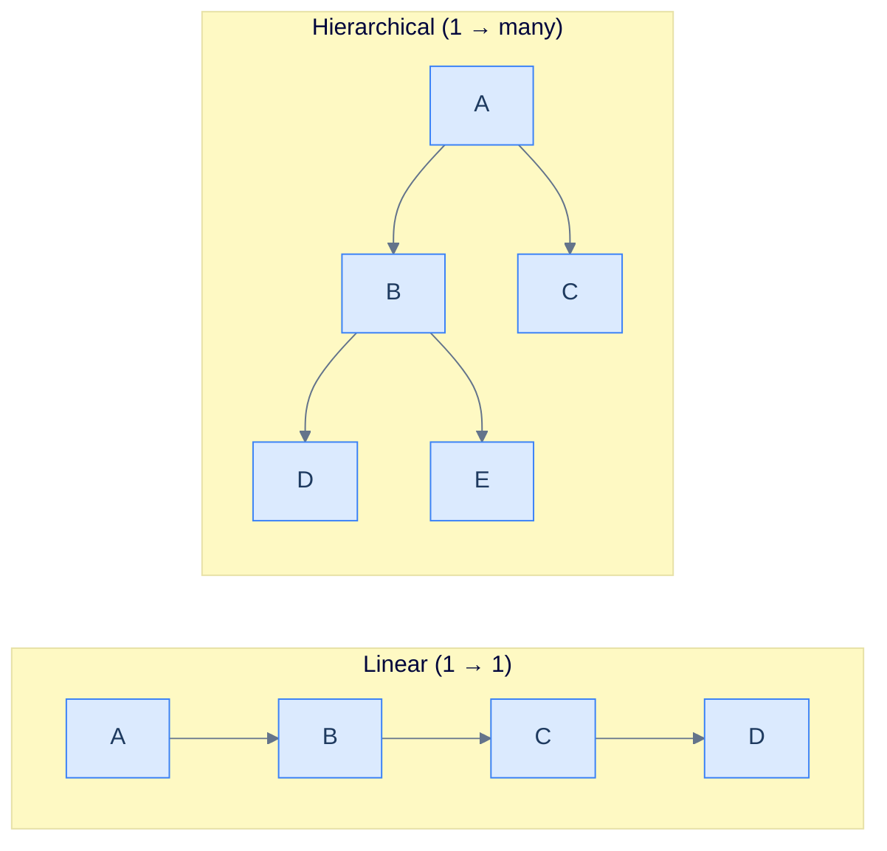

<p align="center"><strong>Linear structures express one-to-one chains. Trees express one-to-many hierarchies. Neither expresses many-to-many.</strong></p>

When the problem you're modelling is a **many-to-many relationship** — where each item connects to many others *and* those others connect to many others — both families collapse. Let's see exactly how.

---

## The Travel Booking Problem

Consider a travel booking website that shows flight connections between cities. You'll need to answer two questions:

1. *What's the minimum number of hops between two cities?*
2. *What's the maximum number of flights I can take from city A on a $600 budget?*

The raw data is a list of direct flights — say between six cities A through F:

```d2
direction: right

flights: Flight Connections {
  grid-rows: 6
  grid-columns: 1
  grid-gap: 0
  f1: "A ↔ B"
  f2: "A ↔ C"
  f3: "B ↔ D"
  f4: "C ↔ D"
  f5: "C ↔ E"
  f6: "D ↔ F"
}
```

<p align="center"><strong>Raw flight data — a list of city pairs that have direct connections.</strong></p>

This data has a property that should immediately set off alarm bells: **A connects to B and C. C connects to A, D, and E. D connects to B, C, and F.** Every city points to multiple cities, and those cities point back. There are also **cycles** — A → B → D → C → A.

Now try to store this in something we already know.

### Attempt 1 — A tree

A tree forbids cycles. The moment you draw `A → B → D → C → A`, you have a cycle, and the structure is no longer a tree. Most flight networks have cycles. **Trees are out.**

### Attempt 2 — Multiple linked lists, one per edge

You could store every connection as a tiny 2-node linked list — `(A → B)`, `(A → C)`, `(B → D)`, and so on.

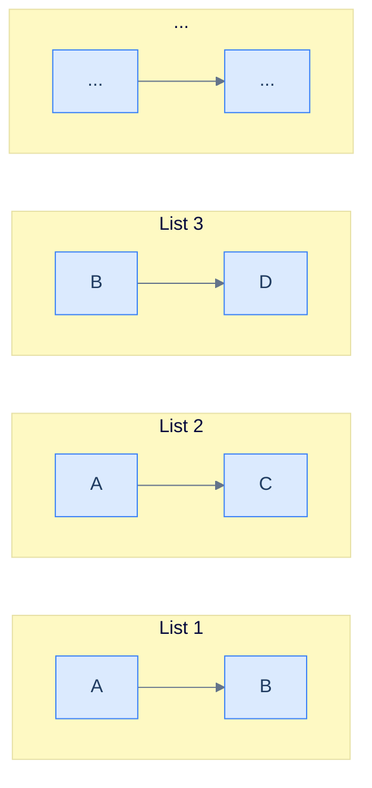

<p align="center"><strong>Storing each flight as its own 2-node linked list. Technically possible — but watch what answering a query costs.</strong></p>

It works as **storage**. But to answer *"minimum hops from A to F"*, you'd need to:
1. Scan every list to find one starting with A.
2. From every neighbour found, scan every list again.
3. Repeat until you find F — branching combinatorially.

Each query forces you to re-search the entire dataset because the structure has no notion of "neighbour". **Lists are out.**

### Attempt 3 — Storing airfare too

Now add airfare to each connection. Where does the price live in your linked-list approach? On a list node? On a separate parallel list? Whatever you pick, you've confirmed the data structure is fighting you instead of helping.

```d2
direction: right

flights: "Flight + Fare" {
  grid-rows: 6
  grid-columns: 1
  grid-gap: 0
  f1: "A ↔ B   \$100"
  f2: "A ↔ C   \$200"
  f3: "B ↔ D   \$150"
  f4: "C ↔ D   \$250"
  f5: "C ↔ E   \$300"
  f6: "D ↔ F   \$400"
}
```

<p align="center"><strong>Each connection now carries weight (airfare). Linear structures have no clean place to put this extra dimension.</strong></p>

The pattern is now obvious: we don't need a structure that stores *items*. We need one that stores **relationships between items** — including extra data on each relationship. None of the structures we've seen does this naturally.

> Linear structures store sequence. Trees store hierarchy. We need something that stores a **network**.

What does a structure built around relationships even look like?

***

# Enter the Graph

A **graph** is a non-linear data structure made of two things:

- **Nodes** (also called **vertices**) — the items themselves (cities, people, web pages, courses, ...)
- **Edges** — the connections between items (flights, friendships, hyperlinks, prerequisites, ...)

Each edge represents one relationship. That's it. The whole structure is just *items + the relationships between them*.

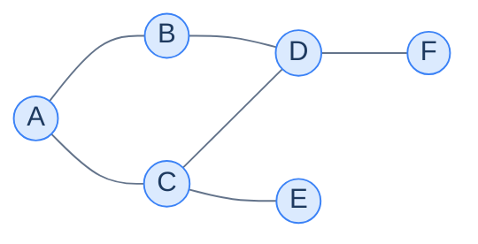

<p align="center"><strong>A graph — six nodes connected by six edges. The shape is whatever the data demands; cycles, branches, and disconnected pieces are all allowed.</strong></p>

Notice how this picture is *exactly* the mental model you'd draw on a napkin to explain flights between cities to a friend. That's not coincidence — it's the entire point. The graph is the data structure that **looks like the problem**.

---

## Edges Can Carry Data

A plain edge says "A connects to B". A more useful edge can carry **weight** — a number describing the connection. In flight terms, weight is airfare. In road maps, it's distance. In a social network, it could be a closeness score. A graph with weighted edges is called — predictably — a **weighted graph**.

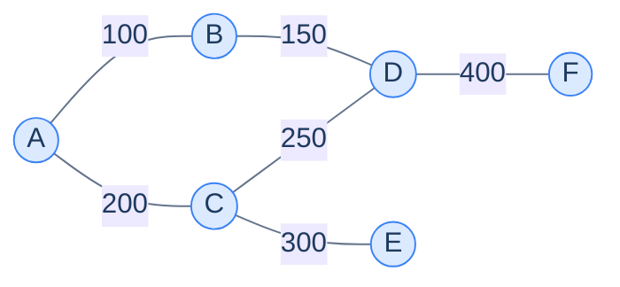

<p align="center"><strong>A weighted graph — each edge labels its connection with a numeric value (here, dollars of airfare).</strong></p>

The structure is still nodes and edges. The only difference is each edge now stores a number. Adding weight to a graph is *additive*; it doesn't change the underlying mechanics.

This is already enough machinery to model the travel-booking problem cleanly. Let's go back to it.

***

# Solving the Travel Problem With a Graph

We have six cities, six connections, and six fares. With a graph, the data structure *is* the picture. There's no encoding step — the cities become nodes, the flights become edges, the fares become weights.


<p align="center"><strong>The travel network as a weighted graph. Adding a new city is one new node; adding a new flight is one new edge.</strong></p>

Adding a new city (say G) means adding one node and one edge to its neighbour. Adding a new flight is one new edge. **The maintenance cost scales with what changed**, not with the size of the dataset.

---

## Query 1 — Minimum Hops Between Two Cities

*What's the smallest number of flights from A to F?*

Walk it by hand. Start at A. Every neighbour you can reach in one hop is at distance 1. Every neighbour of *those* is at distance 2. Keep expanding outward like ripples on a pond, and the moment you touch F, the number of ripples you used is the answer.

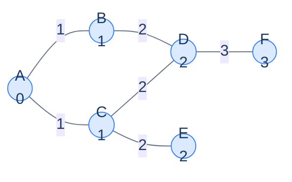

<p align="center"><strong>Numbers inside each node show the minimum hops from A. F is reachable in 3 hops via A → B → D → F or A → C → D → F.</strong></p>

You just performed (informally) the most famous graph algorithm in existence — **breadth-first search**. We'll formalise it later. Notice you did not need to learn anything new — the graph let your intuition drive the search.

---

## Query 2 — Maximum Flights for $600

Now the harder one: starting at A with a budget of $600, what's the maximum number of flights you can take? Destination doesn't matter — we want to maximise hops, not minimise.

This is a different kind of search. You start at A and **trace every path you can afford**, summing fares as you go, backtracking when you run out of money.

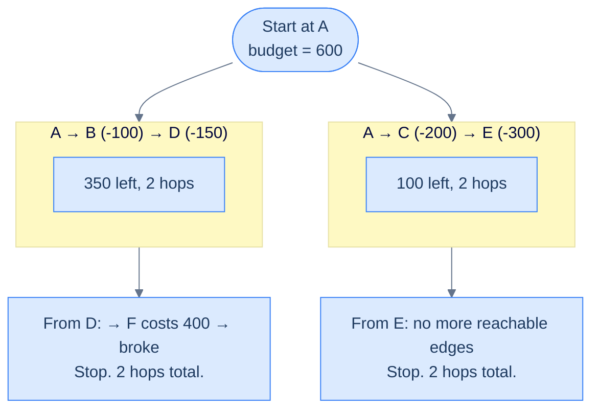

<p align="center"><strong>Tracing two distinct paths, summing fares as you go. When you can't afford another hop, you record how many you took. The best result wins.</strong></p>

Both routes give 2 hops. The answer is 2. (And again, you just informally simulated **depth-first search with backtracking** — another core graph algorithm.)

> *Before reading on — would the answer change if we had $700 instead of $600? Try tracing one path mentally before you scroll.*

The takeaway isn't the specific algorithms (we'll cover those in detail later). The takeaway is that **once your data is in a graph, the algorithm reads almost like the question itself**. "Find the shortest path" → "ripple outward from start". "Find the most flights I can afford" → "explore deep, backtrack when broke". The graph isn't fighting you anymore.

But to *implement* this rather than draw it on paper, we need vocabulary — names for the parts of a graph and for the kinds of graphs we'll meet. Without those names, we'd have no way to write algorithms down precisely.

***

# Graph Terminology

A graph can be drawn many different ways. Two graphs that look completely different on paper may be identical structurally. To talk about graphs without resorting to pictures, we need precise terms for the parts. Each term below is a piece of the same vocabulary you'll see in every graph algorithm for the rest of your career.

---

## Vertex (Node)

A **vertex** is one item in a graph. The two words *vertex* and *node* are used interchangeably. A vertex usually holds two things: the **data value** for that item (a city name, a person, a course code) and **references to its neighbours** (the other vertices it connects to).

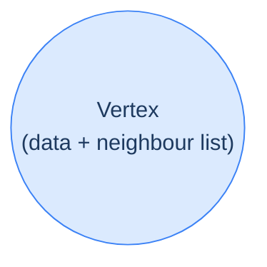

<p align="center"><strong>A vertex — the basic unit of a graph. Holds a data value and a list of references to its neighbours.</strong></p>

---

## Edge

An **edge** connects two vertices. It's the *relationship*. There are two flavours:

- **Undirected edge** — a two-way connection. If A is connected to B, B is also connected to A. Think roads between two cities.
- **Directed edge** — a one-way connection. A connects *to* B, but not necessarily back. Think Twitter follows or one-way streets.

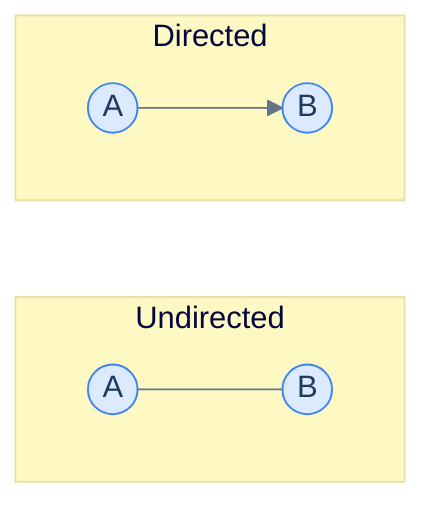

<p align="center"><strong>Undirected edges (left) work in both directions. Directed edges (right) only one way. A graph can mix both.</strong></p>

A graph can have all undirected edges, all directed edges, or even both kinds at once.

---

## Degree

The **degree** of a vertex is *how many edges touch it*. A vertex with three edges has degree 3.

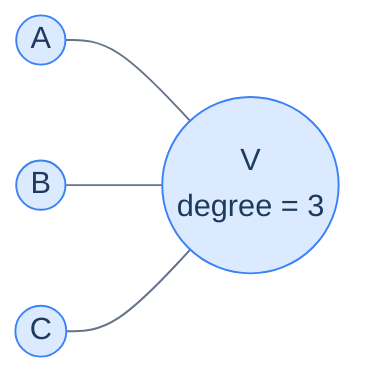

<p align="center"><strong>Vertex V touches three edges, so its degree is 3.</strong></p>

Degree is the simplest "shape" measure of a graph. Sum the degrees of every vertex and you get *exactly twice* the total edge count, because each edge contributes 1 to each of its two endpoints — a small but useful sanity check.

---

## Indegree and Outdegree

In a directed graph, "how many edges touch this vertex" splits into two distinct questions:

- **Indegree** — how many edges arrive *at* this vertex
- **Outdegree** — how many edges leave *from* this vertex

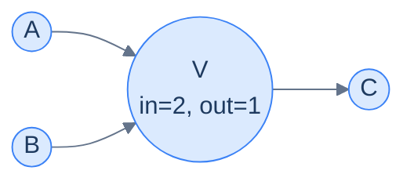

<p align="center"><strong>Vertex V has indegree 2 (from A and B) and outdegree 1 (to C).</strong></p>

This split shows up naturally in many problems. Topological sort uses indegree as its main signal; PageRank uses indegree-weighted importance.

---

## Path

A **path** is a sequence of edges that links a sequence of distinct vertices. In plainer terms: walk from one node to another using edges, never repeating a node, and the route you took is a path.

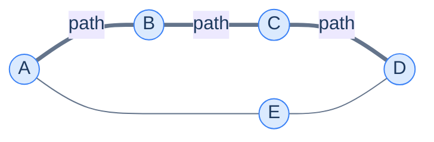

<p align="center"><strong>The thick edges show one path A → B → C → D. There's also another path A → E → D — graphs usually have many paths between the same pair of nodes.</strong></p>

Most "interesting" graph questions are really questions *about* paths: "is there a path?" (connectivity), "what's the shortest path?" (BFS, Dijkstra), "is there a path that returns to itself?" (cycle detection). Every algorithm we cover later in this chapter will be a clever way to find a particular kind of path.

So with vocabulary in hand — what kinds of graphs will we actually meet in the wild?

***

# Types of Graphs

Graphs aren't a single thing. The combination of *which kinds of edges they have* and *how those edges connect* gives rise to several distinct flavours, each with its own typical use cases and algorithms. The good news is the categories are **not mutually exclusive** — a single graph can be (for example) directed *and* weighted *and* acyclic all at once.

> **Memory trick:** Each "type" is just a constraint or extra capability layered on the basic graph. Stack the labels you need.

---

## Undirected Graph

Every edge is bidirectional. Used for relationships that are inherently symmetric: distance between cities, mutual friendships, whether two atoms share a bond.

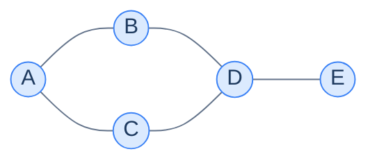

<p align="center"><strong>An undirected graph — every edge can be traversed in either direction.</strong></p>

---

## Directed Graph (Digraph)

Every edge is directed. Used for relationships with an asymmetric flavour: Twitter follows, web links, job dependencies, function calls.

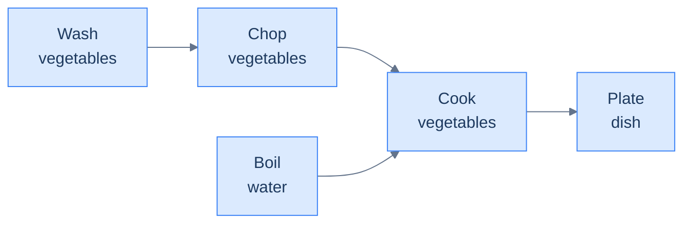

<p align="center"><strong>A directed graph showing a recipe — each arrow says "do this before that". Cooking can't start until both chopping and boiling are done.</strong></p>

The arrow on every edge is the direction. Reading that arrow tells you what *can* be reached and what *cannot* — a crucial difference from undirected graphs.

---

## Weighted Graph

Every edge carries a number — the weight. Used whenever the *strength* of a relationship matters: distances, costs, capacities, probabilities.

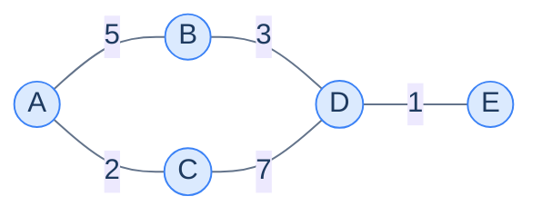

<p align="center"><strong>A weighted graph — every edge carries a numeric value. Weights and direction are independent: you can have weighted-directed, weighted-undirected, or even mixed.</strong></p>

---

## Connected vs Disconnected

A graph is **connected** if you can reach every vertex from every other vertex (treating directed edges as bidirectional for this discussion). It is **disconnected** if at least one pair of vertices has no path between them.

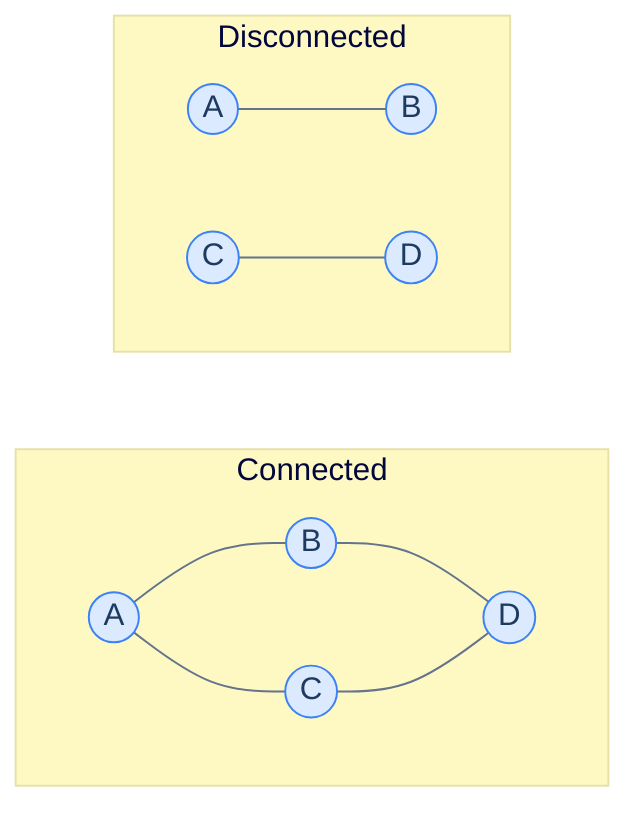

<p align="center"><strong>The connected graph (left) lets you reach any node from any other. The disconnected graph (right) splits into two isolated pieces — A↔B and C↔D — with no path between them.</strong></p>

A disconnected graph is really a collection of two or more **connected components**. We'll spend a whole pattern lesson on detecting and counting them.

---

## Cyclic Graph

A **cycle** is a path that starts and ends at the same vertex without repeating any *other* vertex along the way. A graph with at least one cycle is called **cyclic**.

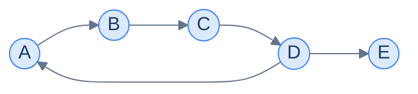

<p align="center"><strong>A cyclic directed graph — A → B → C → D → A is a cycle. Cycles often represent feedback loops, stuck states, or circular dependencies.</strong></p>

Cycles are sometimes desired (feedback loops in control systems) and sometimes catastrophic (a circular dependency in a build system). One of the most-asked graph algorithms is *"does this graph have a cycle?"* — we'll cover it in the cycle-detection lesson.

---

## Directed Acyclic Graph (DAG)

A **DAG** is a directed graph with no cycles. DAGs are the unsung heroes of computer science — they're how we model:

- Build dependencies (Make, Bazel, npm)
- Course prerequisites
- Family trees and ancestry
- Spreadsheet formula evaluation
- Git commit history

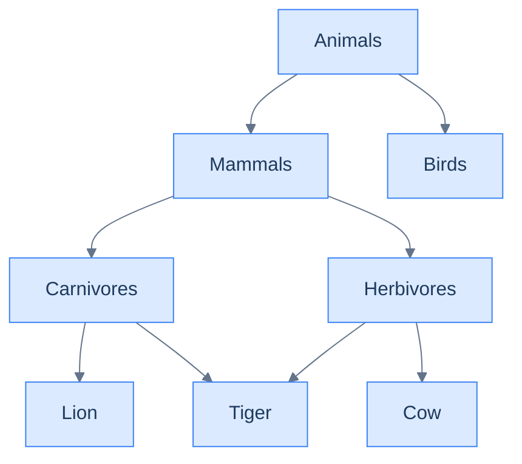

<p align="center"><strong>A DAG modelling animal classification. Tiger has two parents (Carnivores and Herbivores) — impossible in a tree, perfectly fine in a DAG.</strong></p>

A DAG superficially looks like a tree, but it isn't one: a node in a DAG can have **multiple parents** (e.g. tiger above), which a tree forbids. This extra flexibility is what makes DAGs a strict superset of trees and why so many real-world hierarchies live more naturally in DAGs.

---

## Bipartite Graph

A **bipartite graph** has two disjoint sets of vertices, with edges only between sets — never within a set. Used to model **matching** problems: assignments, allocations, pairings.

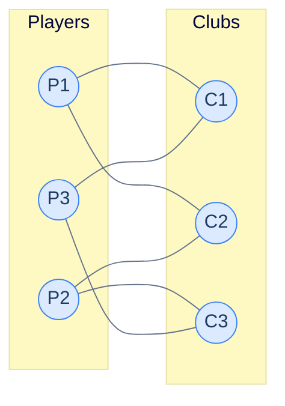

<p align="center"><strong>A bipartite graph between players and clubs. Edges represent "this player is interested in this club". No edges run player ↔ player or club ↔ club.</strong></p>

If you can colour a graph using only two colours so that no edge connects two same-coloured nodes, the graph is bipartite. This two-colouring check is itself a famous graph algorithm — and we'll meet it later in the patterns chapter.

---

## Putting It All Together

A real graph in the wild is usually **several types at once**. The travel network we started this lesson with is *undirected* (flights are symmetric), *weighted* (fares), *cyclic* (you can fly A → B → D → C → A), and probably *connected* (any city can reach any other through enough hops).

The same underlying machinery — nodes and edges — handles every flavour. The richness comes from how you constrain or augment the basic structure.

---

## Final Takeaway

A graph isn't a fancier tree — it's the **most general** data structure in this whole course. Linear structures and trees are both *special cases* of graphs (a linear list is a graph where every node has at most two neighbours; a tree is a connected acyclic graph). Mastering graphs unlocks the entire family.

You now have the vocabulary to describe any graph precisely: **vertices, edges, direction, weight, degree, paths, connectedness, cycles, DAGs, bipartite**. Next time you face a problem about "connections", "dependencies", "shortest path", "matching", or "reachability", you won't ask *which data structure?* — you'll already know it's a graph and the only question is *which kind*.

But knowing what a graph is on paper is half the story. To run algorithms on one we need to **store it in memory**. Should each node carry a list of neighbours? Should we use a giant matrix? Each choice has different speed and memory trade-offs — and that's exactly what the next lesson tackles.

> **Transfer challenge.** Pick any system around you — your contacts list, your favourite recipe, the dependencies between courses in your degree, the hyperlinks on a Wikipedia page. Try to model it as a graph. What are the nodes? What are the edges? Are the edges directed or undirected? Weighted or unweighted? Acyclic? You'll be surprised how many things look like graphs once you know how to look.
