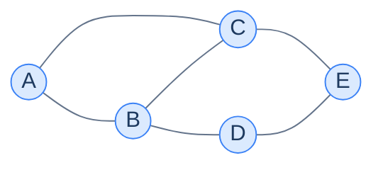
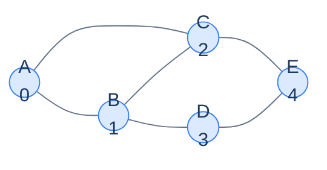
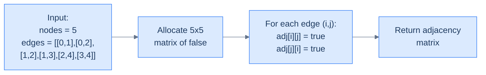

# 2. Adjacency matrix representation

This lesson introduces the **adjacency matrix** — the most compact, fastest-to-query, and (sometimes) most wasteful way to put a graph into memory. By the end you'll know exactly when to reach for it and when to run from it.

## Table of contents

1. [The translation problem](#the-translation-problem)
2. [Structure of an adjacency matrix](#structure-of-an-adjacency-matrix)
3. [Implementation](#implementation)
4. [Storing weighted edges](#storing-weighted-edges)
5. [Storing data on nodes](#storing-data-on-nodes)
6. [Complexity analysis](#complexity-analysis)
7. [When to use it](#when-to-use-it)

***

# The Translation Problem

You have a graph drawn on paper — circles for nodes, lines for edges. The CPU does not know what a "circle" or a "line" is. The CPU knows two things: arrays and arithmetic.

The question this lesson answers is the **translation problem**: how do you take that beautiful network of circles and lines and squeeze it into a flat block of memory the CPU can actually work with?

There are two famous answers — adjacency matrix and adjacency list — and they trade off **memory** against **query speed** in opposite directions. We'll meet the adjacency matrix first, because it's the simpler of the two and the trade-offs become much sharper once you've felt them in code.

> *Before reading on — if your only tool was a 2D array, where would you start? What would the rows mean? The columns? The cells? Spend 20 seconds before scrolling.*

***

# Structure of an Adjacency Matrix

Take a small graph. Five nodes, six edges, undirected.



<p align="center"><strong>An example graph with 5 nodes and 6 edges. We'll use this same graph for every translation in this lesson.</strong></p>

If we look at the graph as a **set of pairs** — every edge is "node X relates to node Y" — the simplest possible storage is a giant lookup table that answers, for any two nodes, "is there an edge between them?"

That's literally a 2D array. Rows = "from" node. Columns = "to" node. Cell = `true` / `false`.

But there's a snag: we need a way to *index into* that array. Right now our nodes are labelled `A, B, C, D, E`. The CPU doesn't index by letters — it indexes by integers `0, 1, 2, …`.

---

## Step 1 — Enumerate the Nodes

Assign every node an integer from `0` to `N-1`, where `N` is the total number of nodes. Pick any mapping you like; it just has to be consistent.



<p align="center"><strong>Each node now has a unique integer ID from 0 to 4. From here on, the algorithm sees only the IDs — the letters are just for human reading.</strong></p>

Why integers `0` to `N-1` and not `1` to `N`? Same reason arrays are 0-indexed: the integer is going to be used directly as an array index, and shifting by one would mean wasting row 0 and column 0. Stay zero-based and the math is clean.

---

## Step 2 — Build the NxN Matrix

Now create an `N x N` 2D boolean array. Initialise every cell to `false`. For each edge `(i, j)` in the graph, set both `adj[i][j] = true` and `adj[j][i] = true` (because the edge is undirected — it goes both ways).

```d2
direction: right

matrix: "Adjacency matrix" {
  grid-rows: 6
  grid-columns: 6
  grid-gap: 0
  h00: " "
  h01: "0 (A)"
  h02: "1 (B)"
  h03: "2 (C)"
  h04: "3 (D)"
  h05: "4 (E)"
  r00: "0 (A)"
  r01: "F"
  r02: "T"
  r03: "T"
  r04: "F"
  r05: "F"
  r10: "1 (B)"
  r11: "T"
  r12: "F"
  r13: "T"
  r14: "T"
  r15: "F"
  r20: "2 (C)"
  r21: "T"
  r22: "T"
  r23: "F"
  r24: "F"
  r25: "T"
  r30: "3 (D)"
  r31: "F"
  r32: "T"
  r33: "F"
  r34: "F"
  r35: "T"
  r40: "4 (E)"
  r41: "F"
  r42: "F"
  r43: "T"
  r44: "T"
  r45: "F"
}
```

<p align="center"><strong>The 5×5 adjacency matrix for our graph. <code>T</code> means "edge exists between this row and this column"; <code>F</code> means "no edge". Notice the matrix is symmetric across the diagonal — that's the signature of an undirected graph.</strong></p>

To check *"is there an edge between nodes 1 and 3?"*, you read `adj[1][3]`. That's a single array index — **O(1)** time. No iteration. No search. The hardware does it in one instruction.

The diagonal (`adj[i][i]`) is always `false` here because no node has an edge to itself — but it doesn't have to be. If your graph allows self-loops (a node with an edge to itself, like a YouTuber subscribing to their own channel), those go on the diagonal.

---

## How It Lives in Memory

Logically the matrix is two-dimensional. **In memory it's one dimension** — the rows are laid out one after another in a contiguous block, just like any 2D array.

```d2
direction: right

logical: "Logical view (NxN)" {
  grid-rows: 5
  grid-columns: 5
  grid-gap: 0
  v00: "F"
  v01: "T"
  v02: "T"
  v03: "F"
  v04: "F"
  v10: "T"
  v11: "F"
  v12: "T"
  v13: "T"
  v14: "F"
  v20: "T"
  v21: "T"
  v22: "F"
  v23: "F"
  v24: "T"
  v30: "F"
  v31: "T"
  v32: "F"
  v33: "F"
  v34: "T"
  v40: "F"
  v41: "F"
  v42: "T"
  v43: "T"
  v44: "F"
}

memory: "Physical layout in RAM (1D)" {
  grid-rows: 1
  grid-columns: 25
  grid-gap: 0
  m0: "F"
  m1: "T"
  m2: "T"
  m3: "F"
  m4: "F"
  m5: "T"
  m6: "F"
  m7: "T"
  m8: "T"
  m9: "F"
  m10: "T"
  m11: "T"
  m12: "F"
  m13: "F"
  m14: "T"
  m15: "F"
  m16: "T"
  m17: "F"
  m18: "F"
  m19: "T"
  m20: "F"
  m21: "F"
  m22: "T"
  m23: "T"
  m24: "F"
}

logical -> memory: "row-major flatten"
```

<p align="center"><strong>The 5×5 matrix flattened to one row of 25 contiguous bytes. To read <code>adj[i][j]</code> the CPU computes <code>i * N + j</code> and jumps directly to that offset.</strong></p>

That single multiplication-and-add is why `adj[i][j]` is genuinely O(1). The CPU doesn't search; it computes the address and fetches it. This is the same trick that makes 1D arrays fast — adjacency matrices ride on top of it.

So far so good — but how do we actually *build* this in code from a list of edges?

***

# Implementation

The function `createGraph` takes two inputs — the number of nodes `N` and a list of edges — and returns the `N x N` boolean matrix.

The algorithm has only two real steps:

1. Allocate an `N x N` matrix filled with `false`.
2. For each edge `(i, j)`, set `adj[i][j] = true` and `adj[j][i] = true` (the second line is the "undirected" part).

That's it. No clever insights, no optimisation tricks — just translate the picture into the array.



<p align="center"><strong>Two steps to build the adjacency matrix from a node count and edge list.</strong></p>

Here's the same algorithm in ten languages. Pick whichever you read most fluently — the logic is identical across all of them.


```pseudocode
function createGraph(nodes, edges):
    adj ← N×N matrix of false
    for each (u, v) in edges:
        adj[u][v] ← true
        adj[v][u] ← true   # undirected: set both directions
    return adj
```

```python run
from typing import List

def create_graph(nodes: int, edges: List[List[int]]) -> List[List[bool]]:
    # Allocate an N x N matrix of False. Build with nested comprehension —
    # using [[False] * n] * n creates n references to the SAME list, so
    # mutating one row mutates them all (a classic Python footgun).
    adj = [[False] * nodes for _ in range(nodes)]

    for u, v in edges:
        # Set the cell both ways — undirected edges have no direction,
        # so the matrix must be symmetric across the diagonal.
        adj[u][v] = True
        adj[v][u] = True

    return adj


# Example: the 5-node graph from this lesson.
edges = [[0, 1], [0, 2], [1, 2], [1, 3], [2, 4], [3, 4]]
matrix = create_graph(5, edges)
for row in matrix:
    print(row)
```

```java run
import java.util.Arrays;

public class Main {
    public static boolean[][] createGraph(int nodes, int[][] edges) {
        // Java initialises boolean arrays to false by default — no manual fill needed.
        boolean[][] adj = new boolean[nodes][nodes];

        for (int[] edge : edges) {
            // Set the cell both ways for undirected edges.
            adj[edge[0]][edge[1]] = true;
            adj[edge[1]][edge[0]] = true;
        }
        return adj;
    }

    public static void main(String[] args) {
        int[][] edges = {{0, 1}, {0, 2}, {1, 2}, {1, 3}, {2, 4}, {3, 4}};
        boolean[][] matrix = createGraph(5, edges);
        for (boolean[] row : matrix) System.out.println(Arrays.toString(row));
    }
}
```

```c run
#include <stdio.h>
#include <stdbool.h>
#include <stdlib.h>

bool** create_graph(int nodes, int edges[][2], int edge_count) {
    // Allocate an N x N matrix on the heap; row of pointers, then each row's cells.
    bool** adj = malloc(nodes * sizeof(bool*));
    for (int i = 0; i < nodes; i++) {
        // calloc zeroes memory; false == 0, so this initialises everything to false.
        adj[i] = calloc(nodes, sizeof(bool));
    }

    for (int i = 0; i < edge_count; i++) {
        // Set the cell both ways for undirected edges.
        adj[edges[i][0]][edges[i][1]] = true;
        adj[edges[i][1]][edges[i][0]] = true;
    }
    return adj;
}

int main() {
    int edges[][2] = {{0, 1}, {0, 2}, {1, 2}, {1, 3}, {2, 4}, {3, 4}};
    bool** adj = create_graph(5, edges, 6);

    for (int i = 0; i < 5; i++) {
        for (int j = 0; j < 5; j++) printf("%d ", adj[i][j]);
        printf("\n");
        free(adj[i]);
    }
    free(adj);
    return 0;
}
```

```cpp run
#include <iostream>
#include <vector>

std::vector<std::vector<bool>> createGraph(int nodes, std::vector<std::vector<int>>& edges) {
    // Default constructor of bool initialises to false — second arg fills with false.
    std::vector<std::vector<bool>> adj(nodes, std::vector<bool>(nodes, false));

    for (auto& edge : edges) {
        // Symmetric assignment for undirected edges.
        adj[edge[0]][edge[1]] = true;
        adj[edge[1]][edge[0]] = true;
    }
    return adj;
}

int main() {
    std::vector<std::vector<int>> edges = {{0, 1}, {0, 2}, {1, 2}, {1, 3}, {2, 4}, {3, 4}};
    auto matrix = createGraph(5, edges);
    for (auto& row : matrix) {
        for (auto v : row) std::cout << v << " ";
        std::cout << "\n";
    }
}
```

```scala run
object Main extends App {
  def createGraph(nodes: Int, edges: Array[Array[Int]]): Array[Array[Boolean]] = {
    // Array.ofDim allocates an N x N grid; Boolean defaults to false.
    val adj = Array.ofDim[Boolean](nodes, nodes)

    for (edge <- edges) {
      // Symmetric assignment for undirected edges.
      adj(edge(0))(edge(1)) = true
      adj(edge(1))(edge(0)) = true
    }
    adj
  }

  val edges = Array(Array(0, 1), Array(0, 2), Array(1, 2), Array(1, 3), Array(2, 4), Array(3, 4))
  val matrix = createGraph(5, edges)
  matrix.foreach(row => println(row.mkString(" ")))
}
```

```typescript run
function createGraph(nodes: number, edges: number[][]): boolean[][] {
    // Same fresh-row trick as JS — must use a factory so each row is its own array.
    const adj: boolean[][] = Array.from({length: nodes}, () => Array(nodes).fill(false));

    for (const [u, v] of edges) {
        // Symmetric assignment for undirected edges.
        adj[u][v] = true;
        adj[v][u] = true;
    }
    return adj;
}

const edges: number[][] = [[0, 1], [0, 2], [1, 2], [1, 3], [2, 4], [3, 4]];
const matrix = createGraph(5, edges);
matrix.forEach(row => console.log(row.join(" ")));
```

```go run
package main

import "fmt"

func createGraph(nodes int, edges [][2]int) [][]bool {
    // Allocate one slice of slices; Go zero-initialises bool slices to false.
    adj := make([][]bool, nodes)
    for i := range adj {
        adj[i] = make([]bool, nodes)
    }

    for _, edge := range edges {
        // Symmetric assignment for undirected edges.
        adj[edge[0]][edge[1]] = true
        adj[edge[1]][edge[0]] = true
    }
    return adj
}

func main() {
    edges := [][2]int{{0, 1}, {0, 2}, {1, 2}, {1, 3}, {2, 4}, {3, 4}}
    matrix := createGraph(5, edges)
    for _, row := range matrix {
        fmt.Println(row)
    }
}
```

```rust run
fn create_graph(nodes: usize, edges: &[[usize; 2]]) -> Vec<Vec<bool>> {
    // vec![false; n] makes a fresh row; outer vec! repeats it n times via Clone — safe here.
    let mut adj = vec![vec![false; nodes]; nodes];

    for edge in edges {
        // Symmetric assignment for undirected edges.
        adj[edge[0]][edge[1]] = true;
        adj[edge[1]][edge[0]] = true;
    }
    adj
}

fn main() {
    let edges = [[0, 1], [0, 2], [1, 2], [1, 3], [2, 4], [3, 4]];
    let matrix = create_graph(5, &edges);
    for row in &matrix {
        println!("{:?}", row);
    }
}
```


The implementation is small enough to fit on one screen, but it does carry one common-language gotcha: in **Python and JavaScript**, `[[false] * n] * n` and `Array(n).fill(Array(n).fill(false))` *both* create `n` references to the **same** inner row, so mutating one cell mutates the entire column. The fix in both languages is to build the inner rows with a factory (list comprehension or `Array.from`). It's the same trap, in two languages, for the same reason — both store rows by reference, not by value.

> *Before reading on — what would the matrix look like for a **directed** graph? Sketch it for the same edges before scrolling.*

For a directed graph you'd just drop the second line in the loop — only `adj[i][j] = true`, never `adj[j][i] = true`. The matrix would no longer be symmetric, and the asymmetry tells you the edges are one-way.

***

# Storing Weighted Edges

The basic boolean matrix tells you "is there an edge?" but not "how much does it cost?". For weighted graphs, we need the cell to hold **the actual weight** — a number — instead of a boolean.

There's an immediate question: what value means "no edge"? With booleans the answer was easy — `false`. With numbers, **any** number could be a valid weight. We need a value that's reserved as "definitely not a real weight" — a **sentinel value**.

Common sentinel choices:

| Sentinel | Works when |
|---|---|
| `-1` | Weights are non-negative |
| `0` | Weights are strictly positive (no zero-weight edges) |
| `+∞` (`INT_MAX`) | Useful for shortest-path algorithms — non-edge looks "infinitely far" |
| `null` / `None` | Cell stores an `Optional<int>` |

Picking the wrong sentinel can introduce silent bugs. A graph with negative weights and a sentinel of `-1` will treat real `-1` edges as missing. **Pick a sentinel that's structurally impossible** in your data, or store both a "present" flag and the weight separately.

```d2
direction: right

graph: "Weighted graph (5 nodes)" {
  grid-rows: 1
  grid-columns: 1
  grid-gap: 0
  g: |md
    A↔B: 5  &nbsp;&nbsp; A↔C: 2

    B↔C: 1  &nbsp;&nbsp; B↔D: 7

    C↔E: 4  &nbsp;&nbsp; D↔E: 3
  |
}

matrix: "Weighted adjacency matrix (sentinel = -1)" {
  grid-rows: 6
  grid-columns: 6
  grid-gap: 0
  h00: " "
  h01: "0"
  h02: "1"
  h03: "2"
  h04: "3"
  h05: "4"
  r00: "0"
  r01: "-1"
  r02: "5"
  r03: "2"
  r04: "-1"
  r05: "-1"
  r10: "1"
  r11: "5"
  r12: "-1"
  r13: "1"
  r14: "7"
  r15: "-1"
  r20: "2"
  r21: "2"
  r22: "1"
  r23: "-1"
  r24: "-1"
  r25: "4"
  r30: "3"
  r31: "-1"
  r32: "7"
  r33: "-1"
  r34: "-1"
  r35: "3"
  r40: "4"
  r41: "-1"
  r42: "-1"
  r43: "4"
  r44: "3"
  r45: "-1"
}
```

<p align="center"><strong>The same 5-node graph with weights. Cells holding <code>-1</code> mean "no edge"; cells holding any other number give both the existence and the weight of an edge in one read.</strong></p>

The implementation is almost identical to the boolean version — swap `bool` for `int` and the sentinel for `-1`.


```pseudocode
function createWeightedGraph(nodes, edges):
    adj ← N×N matrix filled with NO_EDGE   # NO_EDGE sentinel = -1
    for each (u, v, w) in edges:
        adj[u][v] ← w
        adj[v][u] ← w   # undirected: set both directions
    return adj
```

```python run
from typing import List

NO_EDGE = -1  # Sentinel — must be unreachable as a real weight.

def create_weighted_graph(nodes: int, edges: List[List[int]]) -> List[List[int]]:
    # Initialise the matrix with the sentinel everywhere.
    adj = [[NO_EDGE] * nodes for _ in range(nodes)]

    for u, v, w in edges:
        # Each edge entry is (u, v, w). Set both ways for an undirected graph.
        adj[u][v] = w
        adj[v][u] = w

    return adj


edges = [[0, 1, 5], [0, 2, 2], [1, 2, 1], [1, 3, 7], [2, 4, 4], [3, 4, 3]]
matrix = create_weighted_graph(5, edges)
for row in matrix:
    print(row)
```

```java run
import java.util.Arrays;

public class Main {
    static final int NO_EDGE = -1;

    public static int[][] createWeightedGraph(int nodes, int[][] edges) {
        int[][] adj = new int[nodes][nodes];
        // Java doesn't auto-fill ints to anything except 0; we want -1 as the sentinel.
        for (int[] row : adj) Arrays.fill(row, NO_EDGE);

        for (int[] e : edges) {
            // (u, v, w) — set both directions for undirected.
            adj[e[0]][e[1]] = e[2];
            adj[e[1]][e[0]] = e[2];
        }
        return adj;
    }

    public static void main(String[] args) {
        int[][] edges = {{0, 1, 5}, {0, 2, 2}, {1, 2, 1}, {1, 3, 7}, {2, 4, 4}, {3, 4, 3}};
        int[][] matrix = createWeightedGraph(5, edges);
        for (int[] row : matrix) System.out.println(Arrays.toString(row));
    }
}
```

```c run
#include <stdio.h>
#include <stdlib.h>

#define NO_EDGE -1

int** create_weighted_graph(int nodes, int edges[][3], int edge_count) {
    int** adj = malloc(nodes * sizeof(int*));
    for (int i = 0; i < nodes; i++) {
        adj[i] = malloc(nodes * sizeof(int));
        // Manual fill — calloc would zero, which clashes with NO_EDGE if 0 were a sentinel.
        for (int j = 0; j < nodes; j++) adj[i][j] = NO_EDGE;
    }

    for (int i = 0; i < edge_count; i++) {
        // (u, v, w) — set both directions.
        adj[edges[i][0]][edges[i][1]] = edges[i][2];
        adj[edges[i][1]][edges[i][0]] = edges[i][2];
    }
    return adj;
}

int main() {
    int edges[][3] = {{0,1,5},{0,2,2},{1,2,1},{1,3,7},{2,4,4},{3,4,3}};
    int** adj = create_weighted_graph(5, edges, 6);
    for (int i = 0; i < 5; i++) {
        for (int j = 0; j < 5; j++) printf("%3d ", adj[i][j]);
        printf("\n");
        free(adj[i]);
    }
    free(adj);
    return 0;
}
```

```cpp run
#include <iostream>
#include <vector>

constexpr int NO_EDGE = -1;

std::vector<std::vector<int>> createWeightedGraph(int nodes, std::vector<std::vector<int>>& edges) {
    // Pre-fill every cell with the sentinel.
    std::vector<std::vector<int>> adj(nodes, std::vector<int>(nodes, NO_EDGE));

    for (auto& e : edges) {
        // (u, v, w) — set both directions.
        adj[e[0]][e[1]] = e[2];
        adj[e[1]][e[0]] = e[2];
    }
    return adj;
}

int main() {
    std::vector<std::vector<int>> edges = {{0,1,5},{0,2,2},{1,2,1},{1,3,7},{2,4,4},{3,4,3}};
    auto matrix = createWeightedGraph(5, edges);
    for (auto& row : matrix) {
        for (auto v : row) std::cout << v << " ";
        std::cout << "\n";
    }
}
```

```scala run
object Main extends App {
  val NO_EDGE = -1

  def createWeightedGraph(nodes: Int, edges: Array[Array[Int]]): Array[Array[Int]] = {
    val adj = Array.fill(nodes, nodes)(NO_EDGE)

    for (e <- edges) {
      // (u, v, w) — set both directions.
      adj(e(0))(e(1)) = e(2)
      adj(e(1))(e(0)) = e(2)
    }
    adj
  }

  val edges = Array(Array(0,1,5), Array(0,2,2), Array(1,2,1),
                    Array(1,3,7), Array(2,4,4), Array(3,4,3))
  val matrix = createWeightedGraph(5, edges)
  matrix.foreach(row => println(row.mkString(" ")))
}
```

```typescript run
const NO_EDGE = -1;

function createWeightedGraph(nodes: number, edges: number[][]): number[][] {
    const adj: number[][] = Array.from({length: nodes}, () => Array(nodes).fill(NO_EDGE));

    for (const [u, v, w] of edges) {
        adj[u][v] = w;
        adj[v][u] = w;
    }
    return adj;
}

const edges: number[][] = [[0,1,5],[0,2,2],[1,2,1],[1,3,7],[2,4,4],[3,4,3]];
const matrix = createWeightedGraph(5, edges);
matrix.forEach(row => console.log(row.join(" ")));
```

```go run
package main

import "fmt"

const NO_EDGE = -1

func createWeightedGraph(nodes int, edges [][3]int) [][]int {
    adj := make([][]int, nodes)
    for i := range adj {
        adj[i] = make([]int, nodes)
        for j := range adj[i] {
            adj[i][j] = NO_EDGE
        }
    }

    for _, e := range edges {
        adj[e[0]][e[1]] = e[2]
        adj[e[1]][e[0]] = e[2]
    }
    return adj
}

func main() {
    edges := [][3]int{{0,1,5},{0,2,2},{1,2,1},{1,3,7},{2,4,4},{3,4,3}}
    matrix := createWeightedGraph(5, edges)
    for _, row := range matrix {
        fmt.Println(row)
    }
}
```

```rust run
const NO_EDGE: i32 = -1;

fn create_weighted_graph(nodes: usize, edges: &[[i32; 3]]) -> Vec<Vec<i32>> {
    let mut adj = vec![vec![NO_EDGE; nodes]; nodes];

    for e in edges {
        let (u, v, w) = (e[0] as usize, e[1] as usize, e[2]);
        adj[u][v] = w;
        adj[v][u] = w;
    }
    adj
}

fn main() {
    let edges = [[0,1,5],[0,2,2],[1,2,1],[1,3,7],[2,4,4],[3,4,3]];
    let matrix = create_weighted_graph(5, &edges);
    for row in &matrix {
        println!("{:?}", row);
    }
}
```


The single change from boolean to weighted is the cell type. **Everything else** — the symmetric assignment, the row-major flattening, the O(1) lookup — stays the same. The matrix scales gracefully from boolean to numeric to anything else: complex objects, structs, even pointers. We've stored *the weight on each edge*, but we still haven't stored *anything about the nodes themselves*.

***

# Storing Data on Nodes

A vertex isn't just an ID — usually it carries a value. A city has a name. A user has a profile. A web page has a URL. The matrix structure has no place for any of this; it only stores edge information.

The fix is dead simple: **a parallel 1D array indexed the same way as the matrix**.

```d2
direction: right

nodes: "Node data array" {
  grid-rows: 1
  grid-columns: 5
  grid-gap: 0
  n0: |md
    **0**

    Bangalore
  |
  n1: |md
    **1**

    Tokyo
  |
  n2: |md
    **2**

    Paris
  |
  n3: |md
    **3**

    NYC
  |
  n4: |md
    **4**

    London
  |
}

matrix: "Edge weights (5x5)" {
  grid-rows: 5
  grid-columns: 5
  grid-gap: 0
  m00: "-1"
  m01: "5"
  m02: "2"
  m03: "-1"
  m04: "-1"
  m10: "5"
  m11: "-1"
  m12: "1"
  m13: "7"
  m14: "-1"
  m20: "2"
  m21: "1"
  m22: "-1"
  m23: "-1"
  m24: "4"
  m30: "-1"
  m31: "7"
  m32: "-1"
  m33: "-1"
  m34: "3"
  m40: "-1"
  m41: "-1"
  m42: "4"
  m43: "3"
  m44: "-1"
}
```

<p align="center"><strong>Two arrays, indexed the same way. <code>nodes[i]</code> gives the data for node <code>i</code>; <code>adj[i][j]</code> gives the weight of the edge between nodes <code>i</code> and <code>j</code>. Combined, they describe the complete graph.</strong></p>

The two-array trick is the standard pattern. Storing node data inside the matrix is wasteful (you'd be duplicating it `N` times — once per row); a separate 1D array uses N cells exactly.

Here's a small example that builds both arrays together.


```pseudocode
function createGraph(nodeData, edges):
    n ← length of nodeData
    adj ← N×N matrix filled with NO_EDGE
    for each (u, v, w) in edges:
        adj[u][v] ← w
        adj[v][u] ← w   # undirected: both directions
    return nodeData, adj  # parallel arrays: nodeData[i] and adj[i][j]
```

```python run
from typing import List, Tuple

NO_EDGE = -1

def create_graph(node_data: List[str], edges: List[List[int]]) -> Tuple[List[str], List[List[int]]]:
    n = len(node_data)
    # Edge matrix indexed 0..n-1 in lockstep with node_data.
    adj = [[NO_EDGE] * n for _ in range(n)]
    for u, v, w in edges:
        adj[u][v] = w
        adj[v][u] = w
    return node_data, adj


cities = ["Bangalore", "Tokyo", "Paris", "NYC", "London"]
edges  = [[0, 1, 5], [0, 2, 2], [1, 2, 1], [1, 3, 7], [2, 4, 4], [3, 4, 3]]
data, adj = create_graph(cities, edges)
print("Node data:", data)
print("Edge between Tokyo (1) and Paris (2):", adj[1][2])
```

```java run
import java.util.Arrays;

public class Main {
    static final int NO_EDGE = -1;

    static class Graph {
        String[] nodeData;
        int[][] adj;
        Graph(String[] d, int[][] a) { nodeData = d; adj = a; }
    }

    public static Graph createGraph(String[] nodeData, int[][] edges) {
        int n = nodeData.length;
        int[][] adj = new int[n][n];
        for (int[] row : adj) Arrays.fill(row, NO_EDGE);
        for (int[] e : edges) {
            adj[e[0]][e[1]] = e[2];
            adj[e[1]][e[0]] = e[2];
        }
        return new Graph(nodeData, adj);
    }

    public static void main(String[] args) {
        String[] cities = {"Bangalore", "Tokyo", "Paris", "NYC", "London"};
        int[][] edges = {{0,1,5},{0,2,2},{1,2,1},{1,3,7},{2,4,4},{3,4,3}};
        Graph g = createGraph(cities, edges);
        System.out.println("Node data: " + Arrays.toString(g.nodeData));
        System.out.println("Edge Tokyo-Paris: " + g.adj[1][2]);
    }
}
```

```c run
#include <stdio.h>
#include <stdlib.h>
#include <string.h>

#define NO_EDGE -1

typedef struct {
    char** node_data;
    int** adj;
    int n;
} Graph;

Graph create_graph(const char* names[], int n, int edges[][3], int edge_count) {
    Graph g;
    g.n = n;
    g.node_data = malloc(n * sizeof(char*));
    for (int i = 0; i < n; i++) g.node_data[i] = strdup(names[i]);

    g.adj = malloc(n * sizeof(int*));
    for (int i = 0; i < n; i++) {
        g.adj[i] = malloc(n * sizeof(int));
        for (int j = 0; j < n; j++) g.adj[i][j] = NO_EDGE;
    }
    for (int i = 0; i < edge_count; i++) {
        g.adj[edges[i][0]][edges[i][1]] = edges[i][2];
        g.adj[edges[i][1]][edges[i][0]] = edges[i][2];
    }
    return g;
}

int main() {
    const char* names[] = {"Bangalore", "Tokyo", "Paris", "NYC", "London"};
    int edges[][3] = {{0,1,5},{0,2,2},{1,2,1},{1,3,7},{2,4,4},{3,4,3}};
    Graph g = create_graph(names, 5, edges, 6);
    printf("Node 1 data: %s\n", g.node_data[1]);
    printf("Edge 1-2 weight: %d\n", g.adj[1][2]);

    for (int i = 0; i < g.n; i++) { free(g.node_data[i]); free(g.adj[i]); }
    free(g.node_data); free(g.adj);
    return 0;
}
```

```cpp run
#include <iostream>
#include <vector>
#include <string>

constexpr int NO_EDGE = -1;

struct Graph {
    std::vector<std::string> nodeData;
    std::vector<std::vector<int>> adj;
};

Graph createGraph(std::vector<std::string> nodeData, std::vector<std::vector<int>>& edges) {
    int n = (int)nodeData.size();
    std::vector<std::vector<int>> adj(n, std::vector<int>(n, NO_EDGE));
    for (auto& e : edges) {
        adj[e[0]][e[1]] = e[2];
        adj[e[1]][e[0]] = e[2];
    }
    return {std::move(nodeData), std::move(adj)};
}

int main() {
    std::vector<std::string> cities = {"Bangalore", "Tokyo", "Paris", "NYC", "London"};
    std::vector<std::vector<int>> edges = {{0,1,5},{0,2,2},{1,2,1},{1,3,7},{2,4,4},{3,4,3}};
    Graph g = createGraph(cities, edges);
    std::cout << "Node 1: " << g.nodeData[1] << "\n";
    std::cout << "Edge 1-2: " << g.adj[1][2] << "\n";
}
```

```scala run
object Main extends App {
  val NO_EDGE = -1

  case class Graph(nodeData: Array[String], adj: Array[Array[Int]])

  def createGraph(nodeData: Array[String], edges: Array[Array[Int]]): Graph = {
    val n = nodeData.length
    val adj = Array.fill(n, n)(NO_EDGE)
    for (e <- edges) {
      adj(e(0))(e(1)) = e(2)
      adj(e(1))(e(0)) = e(2)
    }
    Graph(nodeData, adj)
  }

  val cities = Array("Bangalore", "Tokyo", "Paris", "NYC", "London")
  val edges = Array(Array(0,1,5), Array(0,2,2), Array(1,2,1),
                    Array(1,3,7), Array(2,4,4), Array(3,4,3))
  val g = createGraph(cities, edges)
  println(s"Node 1: ${g.nodeData(1)}")
  println(s"Edge 1-2: ${g.adj(1)(2)}")
}
```

```typescript run
const NO_EDGE = -1;

interface Graph { nodeData: string[]; adj: number[][]; }

function createGraph(nodeData: string[], edges: number[][]): Graph {
    const n = nodeData.length;
    const adj: number[][] = Array.from({length: n}, () => Array(n).fill(NO_EDGE));
    for (const [u, v, w] of edges) {
        adj[u][v] = w;
        adj[v][u] = w;
    }
    return { nodeData, adj };
}

const cities: string[] = ["Bangalore", "Tokyo", "Paris", "NYC", "London"];
const edges: number[][] = [[0,1,5],[0,2,2],[1,2,1],[1,3,7],[2,4,4],[3,4,3]];
const g = createGraph(cities, edges);
console.log("Node 1:", g.nodeData[1]);
console.log("Edge 1-2:", g.adj[1][2]);
```

```go run
package main

import "fmt"

const NO_EDGE = -1

type Graph struct {
    NodeData []string
    Adj      [][]int
}

func createGraph(nodeData []string, edges [][3]int) Graph {
    n := len(nodeData)
    adj := make([][]int, n)
    for i := range adj {
        adj[i] = make([]int, n)
        for j := range adj[i] {
            adj[i][j] = NO_EDGE
        }
    }
    for _, e := range edges {
        adj[e[0]][e[1]] = e[2]
        adj[e[1]][e[0]] = e[2]
    }
    return Graph{nodeData, adj}
}

func main() {
    cities := []string{"Bangalore", "Tokyo", "Paris", "NYC", "London"}
    edges := [][3]int{{0,1,5},{0,2,2},{1,2,1},{1,3,7},{2,4,4},{3,4,3}}
    g := createGraph(cities, edges)
    fmt.Println("Node 1:", g.NodeData[1])
    fmt.Println("Edge 1-2:", g.Adj[1][2])
}
```

```rust run
const NO_EDGE: i32 = -1;

struct Graph {
    node_data: Vec<String>,
    adj: Vec<Vec<i32>>,
}

fn create_graph(node_data: Vec<String>, edges: &[[i32; 3]]) -> Graph {
    let n = node_data.len();
    let mut adj = vec![vec![NO_EDGE; n]; n];
    for e in edges {
        let (u, v, w) = (e[0] as usize, e[1] as usize, e[2]);
        adj[u][v] = w;
        adj[v][u] = w;
    }
    Graph { node_data, adj }
}

fn main() {
    let cities = vec!["Bangalore", "Tokyo", "Paris", "NYC", "London"]
        .into_iter().map(String::from).collect();
    let edges = [[0,1,5],[0,2,2],[1,2,1],[1,3,7],[2,4,4],[3,4,3]];
    let g = create_graph(cities, &edges);
    println!("Node 1: {}", g.node_data[1]);
    println!("Edge 1-2: {}", g.adj[1][2]);
}
```


Now we have the complete picture: a 1D array for node data, a 2D array for edge data. Together they encode every kind of graph we've seen — directed, undirected, weighted, unweighted, with or without per-node payloads.

So we can store every kind of graph. But what does that storage actually *cost*?

***

# Complexity Analysis

| Operation | Complexity | Why |
|---|---|---|
| **Build** | O(N² + E) | Initialise the N×N matrix to a sentinel + iterate every edge once |
| **Check edge `(i, j)`** | O(1) | Single array index — `adj[i][j]` |
| **Get all neighbours of node `i`** | O(N) | Scan the entire row of size N, even if the node has very few neighbours |
| **Add an edge** | O(1) | Two assignments |
| **Remove an edge** | O(1) | Two assignments to the sentinel |
| **Add a node** | O(N²) | Re-allocate a bigger matrix and copy every cell over |
| **Space** | O(N²) | Always N×N cells, regardless of how few edges exist |

The killer trade-off lives in the last row. The matrix uses `N²` cells **whether the graph has 0 edges or N² edges**. For dense graphs that's optimal; for sparse graphs it's wildly wasteful.

> **A concrete waste:** A social network with 1 billion users averaging 1 000 friends each. The matrix wants `(10⁹)² = 10¹⁸` cells. The actual edges are about `10¹²`. The matrix wastes a factor of **a million**. Adjacency matrix is structurally wrong for this problem.

> *Before reading on — for which kinds of real graphs would N² space actually be **fine**? Think about graphs where almost every pair of nodes is connected.*

Examples where adjacency matrix shines:
- Tournament results (every team plays every other team — graph is dense)
- Distance matrices in routing where every node-to-node distance matters
- Small graphs (`N ≤ 100`) where memory cost is negligible
- Algorithms whose bottleneck is "is there an edge here?" queries (Floyd-Warshall, for instance, runs O(N³) over the matrix and benefits massively from O(1) edge checks)

***

# When To Use It

Picking between adjacency matrix and adjacency list (next lesson) is one of the most common practical decisions in graph code. Here's the cheat sheet:

```d2
direction: right

decision: "Choose your representation" {
  q1: |md
    **Is the graph dense?**

    (E close to N²)
  |
  q2: |md
    **Need O(1) edge queries?**

    (e.g. Floyd-Warshall)
  |
  q3: |md
    **Memory tight?**

    (large N, sparse edges)
  |

  matrix: |md
    **Adjacency matrix**

    O(N²) space

    O(1) edge lookup
  |

  list: |md
    **Adjacency list**

    O(N + E) space

    O(degree) lookup
  |

  q1 -> matrix: yes
  q2 -> matrix: yes
  q3 -> list: yes
  q1 -> list: no
}
```

<p align="center"><strong>The classic decision tree. Density and lookup-frequency push you toward matrix; sparsity and memory budget push you toward list.</strong></p>

A useful rule of thumb: if you're not sure, **default to adjacency list** — most real-world graphs are sparse (`E` is closer to `N` than to `N²`). The matrix is the special case, not the default.

---

## Final Takeaway

An adjacency matrix is the *most concrete* graph representation: every possible edge is a real cell with a real address, and the existence question is answered in one CPU instruction. That speed is bought at a quadratic memory cost which only pays off for dense graphs and edge-query-heavy algorithms.

You now know what an adjacency matrix is, how to build one, how to extend it for weighted edges and node data, and the trade-offs that decide when to pick it. Next up: the **adjacency list**, which makes the opposite trade — slower edge lookup but linear-in-edges memory — and is the right default for almost everything else.

> **Transfer challenge.** You're modelling a chess engine. Every position is a node; every legal move from position A to position B is a directed edge. Estimate `N` (positions) and `E` (legal moves out of each). Would you store this as an adjacency matrix? Why or why not? *(Hint: chess has roughly 10⁴⁰ legal positions but only ~30 legal moves per position — does that smell sparse or dense?)*
