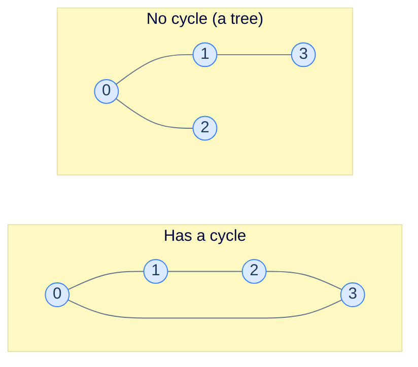
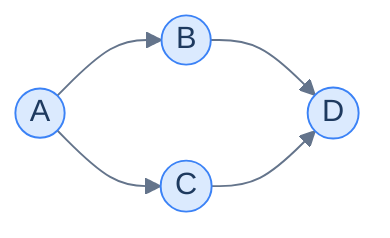

# 6. Cycle detection

This lesson teaches you to answer one of the most common questions asked of graphs: **"is there a cycle?"** — and shows you why the answer is *one* algorithm for undirected graphs and a *different* algorithm for directed graphs, even though both look like DFS at first glance.

## Table of contents

1. [Why cycles matter](#why-cycles-matter)
2. [Cycle detection in an undirected graph](#cycle-detection-in-an-undirected-graph)
3. [Undirected — implementation](#undirected--implementation)
4. [Why directed graphs need a different rule](#why-directed-graphs-need-a-different-rule)
5. [Cycle detection in a directed graph](#cycle-detection-in-a-directed-graph)
6. [Directed — implementation](#directed--implementation)

***

# Why Cycles Matter

A **cycle** is a path that starts and ends at the same node without crossing any other node twice. Cycles aren't just an academic curiosity — they decide whether a piece of software actually works:

- **Build systems** (Make, Bazel, npm) refuse to compile when their dependency graph has a cycle. *"Module A imports B which imports A"* is unrunnable.
- **Spreadsheets** must reject `A1 = B1 + 1; B1 = A1 + 1` — a circular reference. Excel literally pops up an error.
- **Operating-system schedulers** detect cycles in resource-acquisition graphs to avoid deadlock.
- **Course planners** can't grant you a degree if the prerequisite graph has cycles.

So the question "does this graph have a cycle?" lives at the heart of dozens of real systems. The catch: the answer differs based on whether the graph is **undirected** or **directed**.

> *Before reading on — sketch a 4-node undirected graph and a 4-node directed graph. For each, find the smallest example with a cycle. Notice anything different about what counts as a cycle in each case?*

In an undirected graph, any cycle has at least 3 nodes (you can't form a cycle with just 2 — the edge would have to be both "there" and "back" simultaneously). In a directed graph, cycles can be tighter: even a single self-loop or a 2-node `A → B → A` qualifies. That structural difference is what forces two different algorithms.

***

# Cycle Detection in an Undirected Graph



<p align="center"><strong>Two undirected graphs of 4 nodes. The left has the 4-cycle 0→1→2→3→0; the right is a tree.</strong></p>

The simplest possible rule for cycle detection in an undirected graph is also the right one:

> **During a DFS, if you reach a node you've already visited (and that node isn't the parent you just came from), there's a cycle.**

That's the entire algorithm. Run DFS, track which nodes you've seen, and when you cross an edge to a *non-parent* visited node, you've closed a loop.

---

## Why "Non-Parent"?

Without the parent exclusion, every undirected edge would falsely register as a cycle. Walk through it concretely:

```mermaid
---
config:
  theme: base
  themeVariables:
    primaryColor: "#dbeafe"
    primaryBorderColor: "#3b82f6"
    primaryTextColor: "#1e3a5f"
    lineColor: "#64748b"
    secondaryColor: "#ede9fe"
    tertiaryColor: "#fef9c3"
---
flowchart LR
    A((A)) --- B((B))
```



A trivial 2-node, 1-edge graph. Run DFS from A:

1. Mark A visited.
2. Walk to B (A's neighbour). Mark B visited.
3. From B, look at neighbours. B's only neighbour is **A** — and A is already visited!
4. If we naively cried "cycle!", we'd be wrong: the only "loop" is just walking back across the same edge.

The fix is to remember which node we came *from* — A is B's parent in the DFS tree. When we look at B's neighbours, we ignore the one that's our parent. Now A→B and walking-back-to-A is silent. **A real cycle would require visiting a non-parent visited node.**

> *Before reading on — does the parent rule still work for a 3-cycle 0–1–2–0? Trace it once before scrolling.*

DFS from 0: visit 0. Visit 1 (parent=0). From 1's neighbours: 0 (parent → skip), 2 (unvisited → recurse). Visit 2 (parent=1). From 2's neighbours: 1 (parent → skip), 0 (visited, non-parent → **cycle!**). Yes — the rule fires exactly where we want.

---

## The Algorithm

> **`hasCycle(node, parent, graph, visited)`**
> 1. Mark `node` as visited.
> 2. For each `neighbour` in `graph[node]`:
>    - If `neighbour` is not visited, recursively call `hasCycle(neighbour, node, …)`. If it returns `true`, propagate `true`.
>    - Otherwise (neighbour is visited): if `neighbour != parent`, return `true` — a cycle.
> 3. Return `false`.
>
> **`detectCycleUndirected(graph)`**
> 1. Create empty `visited` set.
> 2. For each `node`: if not visited, call `hasCycle(node, -1, …)`. If it returns `true`, return `true`.
> 3. Return `false`.

The outer loop covers disconnected graphs — a cycle could live in a component that's unreachable from node 0.

---

## Proof of Correctness (Sketch)

Why is "non-parent visited neighbour" both *necessary* and *sufficient* for a cycle in an undirected graph?

**Sufficient direction.** If during DFS from `a` we reach `x` and find a non-parent visited neighbour `v`, then `v` was visited earlier in the *same* DFS tree (we'll defend that in a second). Both `v` and `x` are in the current DFS tree, so there's a tree path from `a → v` and a tree path from `a → x`. Joining them via the edge `x – v` closes a loop. Cycle.

**Why "same DFS tree"?** If `v` had been visited in some *earlier* DFS (a different connected component), then since `v` is connected to `x` via an undirected edge, that earlier DFS would have walked across the edge `v – x` and visited `x` too — contradicting our assumption that `x` was just being entered fresh.

**Necessary direction.** If a cycle exists, DFS from any of its nodes must eventually walk around the loop and bump into a visited non-parent. (DFS visits everything reachable; a cycle is reachable from every node on it.)

That's the whole proof. The key insight: **the parent check is the precise filter that distinguishes "I'm walking back across the edge I just came in on" from "I'm closing a loop"**.

***

# Undirected — Implementation

```python run
from typing import List, Set

class Solution:
    def has_cycle(self,
                  graph: List[List[int]],
                  node: int,
                  parent: int,
                  visited: Set[int]) -> bool:
        visited.add(node)
        for neighbour in graph[node]:
            if neighbour not in visited:
                # Recurse — pass current node as the new parent.
                if self.has_cycle(graph, neighbour, node, visited):
                    return True
            elif neighbour != parent:
                # Visited AND not our parent → we just closed a loop.
                return True
        return False

    def detect_cycle_undirected(self, graph: List[List[int]]) -> bool:
        visited: Set[int] = set()
        for node in range(len(graph)):
            if node not in visited:
                # -1 is the sentinel "no parent" for the first node of a DFS root.
                if self.has_cycle(graph, node, -1, visited):
                    return True
        return False


graph = [[1, 2], [0, 2], [0, 1, 3], [2]]   # 0–1–2 forms a triangle
print(Solution().detect_cycle_undirected(graph))   # True
```

```java run
import java.util.*;

public class Main {
    static class Solution {
        public boolean hasCycle(List<List<Integer>> graph, int node, int parent, Set<Integer> visited) {
            visited.add(node);
            for (int neighbour : graph.get(node)) {
                if (!visited.contains(neighbour)) {
                    if (hasCycle(graph, neighbour, node, visited)) return true;
                } else if (neighbour != parent) {
                    return true;
                }
            }
            return false;
        }

        public boolean detectCycleUndirected(List<List<Integer>> graph) {
            Set<Integer> visited = new HashSet<>();
            for (int node = 0; node < graph.size(); node++) {
                if (!visited.contains(node)) {
                    if (hasCycle(graph, node, -1, visited)) return true;
                }
            }
            return false;
        }
    }

    public static void main(String[] args) {
        List<List<Integer>> graph = List.of(
            List.of(1, 2), List.of(0, 2), List.of(0, 1, 3), List.of(2));
        System.out.println(new Solution().detectCycleUndirected(graph));
    }
}
```

```c run
#include <stdio.h>
#include <stdlib.h>
#include <stdbool.h>

typedef struct { int* data; int size; } AdjList;

static bool has_cycle(AdjList* graph, int node, int parent, bool* visited) {
    visited[node] = true;
    for (int i = 0; i < graph[node].size; i++) {
        int neighbour = graph[node].data[i];
        if (!visited[neighbour]) {
            if (has_cycle(graph, neighbour, node, visited)) return true;
        } else if (neighbour != parent) {
            return true;
        }
    }
    return false;
}

bool detect_cycle_undirected(AdjList* graph, int n) {
    bool* visited = calloc(n, sizeof(bool));
    bool result = false;
    for (int node = 0; node < n; node++) {
        if (!visited[node]) {
            if (has_cycle(graph, node, -1, visited)) { result = true; break; }
        }
    }
    free(visited);
    return result;
}

int main() {
    int n0[] = {1, 2}, n1[] = {0, 2}, n2[] = {0, 1, 3}, n3[] = {2};
    AdjList g[] = {{n0, 2}, {n1, 2}, {n2, 3}, {n3, 1}};
    printf("%s\n", detect_cycle_undirected(g, 4) ? "true" : "false");
    return 0;
}
```

```cpp run
#include <iostream>
#include <vector>
#include <unordered_set>

class Solution {
public:
    bool hasCycle(std::vector<std::vector<int>>& graph, int node, int parent,
                  std::unordered_set<int>& visited) {
        visited.insert(node);
        for (int neighbour : graph[node]) {
            if (visited.find(neighbour) == visited.end()) {
                if (hasCycle(graph, neighbour, node, visited)) return true;
            } else if (neighbour != parent) {
                return true;
            }
        }
        return false;
    }

    bool detectCycleUndirected(std::vector<std::vector<int>>& graph) {
        std::unordered_set<int> visited;
        for (int node = 0; node < (int)graph.size(); node++) {
            if (visited.find(node) == visited.end()) {
                if (hasCycle(graph, node, -1, visited)) return true;
            }
        }
        return false;
    }
};

int main() {
    std::vector<std::vector<int>> graph = {{1, 2}, {0, 2}, {0, 1, 3}, {2}};
    std::cout << std::boolalpha << Solution().detectCycleUndirected(graph) << "\n";
}
```

```scala run
import scala.collection.mutable.HashSet

object Main extends App {
  class Solution {
    def hasCycle(graph: Array[Array[Int]], node: Int, parent: Int, visited: HashSet[Int]): Boolean = {
      visited.add(node)
      for (neighbour <- graph(node)) {
        if (!visited.contains(neighbour)) {
          if (hasCycle(graph, neighbour, node, visited)) return true
        } else if (neighbour != parent) {
          return true
        }
      }
      false
    }

    def detectCycleUndirected(graph: Array[Array[Int]]): Boolean = {
      val visited = HashSet.empty[Int]
      for (node <- graph.indices if !visited.contains(node)) {
        if (hasCycle(graph, node, -1, visited)) return true
      }
      false
    }
  }

  val graph = Array(Array(1, 2), Array(0, 2), Array(0, 1, 3), Array(2))
  println(new Solution().detectCycleUndirected(graph))
}
```

```javascript run
class Solution {
    hasCycle(graph, node, parent, visited) {
        visited.add(node);
        for (const neighbour of graph[node]) {
            if (!visited.has(neighbour)) {
                if (this.hasCycle(graph, neighbour, node, visited)) return true;
            } else if (neighbour !== parent) {
                return true;
            }
        }
        return false;
    }

    detectCycleUndirected(graph) {
        const visited = new Set();
        for (let node = 0; node < graph.length; node++) {
            if (!visited.has(node)) {
                if (this.hasCycle(graph, node, -1, visited)) return true;
            }
        }
        return false;
    }
}

const graph = [[1, 2], [0, 2], [0, 1, 3], [2]];
console.log(new Solution().detectCycleUndirected(graph));
```

```typescript run
class Solution {
    hasCycle(graph: number[][], node: number, parent: number, visited: Set<number>): boolean {
        visited.add(node);
        for (const neighbour of graph[node]) {
            if (!visited.has(neighbour)) {
                if (this.hasCycle(graph, neighbour, node, visited)) return true;
            } else if (neighbour !== parent) {
                return true;
            }
        }
        return false;
    }

    detectCycleUndirected(graph: number[][]): boolean {
        const visited = new Set<number>();
        for (let node = 0; node < graph.length; node++) {
            if (!visited.has(node)) {
                if (this.hasCycle(graph, node, -1, visited)) return true;
            }
        }
        return false;
    }
}

const graph: number[][] = [[1, 2], [0, 2], [0, 1, 3], [2]];
console.log(new Solution().detectCycleUndirected(graph));
```

```go run
package main

import "fmt"

func hasCycleUndirected(graph [][]int, node, parent int, visited []bool) bool {
    visited[node] = true
    for _, neighbour := range graph[node] {
        if !visited[neighbour] {
            if hasCycleUndirected(graph, neighbour, node, visited) {
                return true
            }
        } else if neighbour != parent {
            return true
        }
    }
    return false
}

func detectCycleUndirected(graph [][]int) bool {
    visited := make([]bool, len(graph))
    for node := 0; node < len(graph); node++ {
        if !visited[node] {
            if hasCycleUndirected(graph, node, -1, visited) {
                return true
            }
        }
    }
    return false
}

func main() {
    graph := [][]int{{1, 2}, {0, 2}, {0, 1, 3}, {2}}
    fmt.Println(detectCycleUndirected(graph))
}
```

```kotlin run
class Solution {
    fun hasCycle(graph: List<List<Int>>, node: Int, parent: Int, visited: MutableSet<Int>): Boolean {
        visited.add(node)
        for (neighbour in graph[node]) {
            if (neighbour !in visited) {
                if (hasCycle(graph, neighbour, node, visited)) return true
            } else if (neighbour != parent) {
                return true
            }
        }
        return false
    }

    fun detectCycleUndirected(graph: List<List<Int>>): Boolean {
        val visited = mutableSetOf<Int>()
        for (node in graph.indices) {
            if (node !in visited) {
                if (hasCycle(graph, node, -1, visited)) return true
            }
        }
        return false
    }
}

fun main() {
    val graph = listOf(listOf(1, 2), listOf(0, 2), listOf(0, 1, 3), listOf(2))
    println(Solution().detectCycleUndirected(graph))
}
```

```rust run
fn has_cycle(graph: &[Vec<usize>], node: usize, parent: i32, visited: &mut Vec<bool>) -> bool {
    visited[node] = true;
    for &neighbour in &graph[node] {
        if !visited[neighbour] {
            if has_cycle(graph, neighbour, node as i32, visited) {
                return true;
            }
        } else if neighbour as i32 != parent {
            return true;
        }
    }
    false
}

fn detect_cycle_undirected(graph: &[Vec<usize>]) -> bool {
    let n = graph.len();
    let mut visited = vec![false; n];
    for node in 0..n {
        if !visited[node] && has_cycle(graph, node, -1, &mut visited) {
            return true;
        }
    }
    false
}

fn main() {
    let graph: Vec<Vec<usize>> = vec![vec![1, 2], vec![0, 2], vec![0, 1, 3], vec![2]];
    println!("{}", detect_cycle_undirected(&graph));
}
```


## Complexity Analysis

| | Complexity | Reasoning |
|---|---|---|
| **Time** | O(N + E) | Each node is visited at most once; each edge is examined at most twice (once per endpoint) |
| **Space** | O(N) | Visited set + recursion stack are both bounded by N |

The early-return on cycle detection means we may terminate well before O(N + E) in practice — but worst-case (a long acyclic chain) we examine the whole graph.

***

# Why Directed Graphs Need a Different Rule

Try to apply the undirected algorithm to this directed graph:



<p align="center"><strong>A "diamond" DAG. No cycle exists, but a naive DFS will see <code>D</code> twice.</strong></p>

DFS from A: visit A → B → D. Backtrack. Try A → C → **D — already visited!** A naive "visited node = cycle" rule would falsely declare a cycle. But there isn't one — D was just reached by a *different* path from A. The diamond is acyclic.

The undirected parent trick doesn't save us either, because the *direction* of the edges matters: in a directed graph, the path A → C → D wasn't going "back across" any edge we just came in on.

So we need a stricter rule: **a cycle exists only when DFS reaches a node that's currently on the stack — i.e. on the path from the DFS root to the current node**, not just any visited node.

---

## Three States Per Node

The cleanest way to capture this distinction is to give each node *one of three states* during DFS:

| State | Meaning |
|---|---|
| **White / unvisited** | DFS hasn't seen this node yet |
| **Grey / in current path** | DFS entered this node and hasn't finished it yet — it's on the recursion stack |
| **Black / fully done** | DFS has finished this node and all its descendants |

```d2
direction: right

states: "Three node states during DFS" {
  grid-rows: 3
  grid-columns: 1
  grid-gap: 0
  white: |md
    **WHITE** — never visited
  |
  grey: |md
    **GREY** — entered, not yet finished (on the call stack)
  |
  black: |md
    **BLACK** — fully processed (popped off the stack)
  |
}
```

<p align="center"><strong>Each node passes through White → Grey → Black exactly once. Hitting a Grey neighbour during DFS is the unmistakable signature of a cycle.</strong></p>

The rule is now sharp: **if you find a directed edge to a Grey node, you've closed a loop**. Hitting a Black node is fine — that's just the diamond case (a node finished long ago, on a different path).

In practice we don't usually maintain three explicit colours; we maintain two sets — `visited` (= grey ∪ black) and `nodesInPath` (= grey). A node is "grey" if it's in `nodesInPath`. We *add* to `nodesInPath` on entry and *remove* on exit; that's how a node transitions Grey → Black.

> *Before reading on — for the diamond DAG above, walk through the DFS and write down each node's state at each step. Where does each transition happen?*

Steps for the diamond:

| Step | Action | A | B | C | D |
|---|---|---|---|---|---|
| 1 | enter A | grey | white | white | white |
| 2 | enter B | grey | grey | white | white |
| 3 | enter D from B | grey | grey | white | grey |
| 4 | leave D (no neighbours) | grey | grey | white | **black** |
| 5 | leave B | grey | **black** | white | black |
| 6 | enter C | grey | black | grey | black |
| 7 | from C, look at D — D is **black**, not grey → no cycle | grey | black | grey | black |
| 8 | leave C, leave A | **black** | black | **black** | black |

No grey hit ⇒ no cycle. Now repeat the trace with an extra edge `D → A`:

| Step | Action | A | B | C | D |
|---|---|---|---|---|---|
| 1 | enter A | grey | white | white | white |
| 2 | enter B | grey | grey | white | white |
| 3 | enter D | grey | grey | white | grey |
| 4 | from D, look at A — A is **grey** → **cycle!** | | | | |

Grey hit ⇒ cycle. The state machine catches the difference between "diamond" and "loop" perfectly.

***

# Cycle Detection in a Directed Graph

The algorithm:

> **`hasCycle(node, graph, visited, nodesInPath)`**
> 1. Mark `node` as visited.
> 2. Add `node` to `nodesInPath` (= turn it grey).
> 3. For each `neighbour` in `graph[node]`:
>    - If `neighbour` is in `nodesInPath` → return `true` (cycle).
>    - Else if `neighbour` is not visited → recurse; if it returns `true`, propagate.
> 4. Remove `node` from `nodesInPath` (= turn it black).
> 5. Return `false`.
>
> **`detectCycleDirected(graph)`**
> 1. Create empty `visited` and `nodesInPath` sets.
> 2. For each `node`: if not visited, call `hasCycle`. If true, return true.
> 3. Return `false`.

The crucial line is `nodesInPath.remove(node)` at step 4 — the **back-tracking** step that flips a finished node from Grey to Black. Without it, every visited node would stay grey forever and the diamond would falsely register as a cycle.

***

# Directed — Implementation

```python run
from typing import List, Set

class Solution:
    def has_cycle(self,
                  graph: List[List[int]],
                  node: int,
                  visited: Set[int],
                  in_path: Set[int]) -> bool:
        visited.add(node)
        in_path.add(node)               # mark grey

        for neighbour in graph[node]:
            if neighbour in in_path:
                # Edge into a node currently on the DFS stack → cycle.
                return True
            if neighbour not in visited:
                if self.has_cycle(graph, neighbour, visited, in_path):
                    return True

        in_path.discard(node)           # back-track: grey → black
        return False

    def detect_cycle_directed(self, graph: List[List[int]]) -> bool:
        visited: Set[int] = set()
        in_path: Set[int] = set()
        for node in range(len(graph)):
            if node not in visited:
                if self.has_cycle(graph, node, visited, in_path):
                    return True
        return False


graph_dag     = [[1, 2], [3], [3], []]            # diamond, no cycle
graph_cyclic  = [[1], [2], [0]]                   # 0 → 1 → 2 → 0

print(Solution().detect_cycle_directed(graph_dag))      # False
print(Solution().detect_cycle_directed(graph_cyclic))   # True
```

```java run
import java.util.*;

public class Main {
    static class Solution {
        public boolean hasCycle(List<List<Integer>> graph, int node,
                                Set<Integer> visited, Set<Integer> inPath) {
            visited.add(node);
            inPath.add(node);
            for (int neighbour : graph.get(node)) {
                if (inPath.contains(neighbour)) return true;
                if (!visited.contains(neighbour)) {
                    if (hasCycle(graph, neighbour, visited, inPath)) return true;
                }
            }
            inPath.remove(node);
            return false;
        }

        public boolean detectCycleDirected(List<List<Integer>> graph) {
            Set<Integer> visited = new HashSet<>();
            Set<Integer> inPath = new HashSet<>();
            for (int node = 0; node < graph.size(); node++) {
                if (!visited.contains(node)) {
                    if (hasCycle(graph, node, visited, inPath)) return true;
                }
            }
            return false;
        }
    }

    public static void main(String[] args) {
        var dag = List.of(List.of(1, 2), List.of(3), List.of(3), List.of());
        var cyclic = List.of(List.of(1), List.of(2), List.of(0));
        System.out.println(new Solution().detectCycleDirected(dag));
        System.out.println(new Solution().detectCycleDirected(cyclic));
    }
}
```

```c run
#include <stdio.h>
#include <stdlib.h>
#include <stdbool.h>

typedef struct { int* data; int size; } AdjList;

static bool has_cycle(AdjList* graph, int node, bool* visited, bool* in_path) {
    visited[node] = true;
    in_path[node] = true;
    for (int i = 0; i < graph[node].size; i++) {
        int neighbour = graph[node].data[i];
        if (in_path[neighbour]) return true;
        if (!visited[neighbour]) {
            if (has_cycle(graph, neighbour, visited, in_path)) return true;
        }
    }
    in_path[node] = false;
    return false;
}

bool detect_cycle_directed(AdjList* graph, int n) {
    bool* visited = calloc(n, sizeof(bool));
    bool* in_path = calloc(n, sizeof(bool));
    bool result = false;
    for (int node = 0; node < n; node++) {
        if (!visited[node] && has_cycle(graph, node, visited, in_path)) {
            result = true; break;
        }
    }
    free(visited); free(in_path);
    return result;
}

int main() {
    int n0[] = {1, 2}, n1[] = {3}, n2[] = {3}, n3[] = {0};
    AdjList dag[] = {{n0, 2}, {n1, 1}, {n2, 1}, {(int[]){0}, 0}};
    dag[3].data = NULL; dag[3].size = 0;

    int c0[] = {1}, c1[] = {2}, c2[] = {0};
    AdjList cyc[] = {{c0, 1}, {c1, 1}, {c2, 1}};

    printf("%s\n", detect_cycle_directed(dag, 4) ? "true" : "false");
    printf("%s\n", detect_cycle_directed(cyc, 3) ? "true" : "false");
    return 0;
}
```

```cpp run
#include <iostream>
#include <vector>
#include <unordered_set>

class Solution {
public:
    bool hasCycle(std::vector<std::vector<int>>& graph, int node,
                  std::unordered_set<int>& visited, std::unordered_set<int>& inPath) {
        visited.insert(node);
        inPath.insert(node);
        for (int neighbour : graph[node]) {
            if (inPath.find(neighbour) != inPath.end()) return true;
            if (visited.find(neighbour) == visited.end()) {
                if (hasCycle(graph, neighbour, visited, inPath)) return true;
            }
        }
        inPath.erase(node);
        return false;
    }

    bool detectCycleDirected(std::vector<std::vector<int>>& graph) {
        std::unordered_set<int> visited, inPath;
        for (int node = 0; node < (int)graph.size(); node++) {
            if (visited.find(node) == visited.end()) {
                if (hasCycle(graph, node, visited, inPath)) return true;
            }
        }
        return false;
    }
};

int main() {
    std::vector<std::vector<int>> dag = {{1, 2}, {3}, {3}, {}};
    std::vector<std::vector<int>> cyc = {{1}, {2}, {0}};
    std::cout << std::boolalpha << Solution().detectCycleDirected(dag) << "\n";
    std::cout << std::boolalpha << Solution().detectCycleDirected(cyc) << "\n";
}
```

```scala run
import scala.collection.mutable.HashSet

object Main extends App {
  class Solution {
    def hasCycle(graph: Array[Array[Int]], node: Int,
                 visited: HashSet[Int], inPath: HashSet[Int]): Boolean = {
      visited.add(node); inPath.add(node)
      for (neighbour <- graph(node)) {
        if (inPath.contains(neighbour)) return true
        if (!visited.contains(neighbour)) {
          if (hasCycle(graph, neighbour, visited, inPath)) return true
        }
      }
      inPath.remove(node)
      false
    }

    def detectCycleDirected(graph: Array[Array[Int]]): Boolean = {
      val visited = HashSet.empty[Int]
      val inPath  = HashSet.empty[Int]
      for (node <- graph.indices if !visited.contains(node))
        if (hasCycle(graph, node, visited, inPath)) return true
      false
    }
  }

  val dag = Array(Array(1, 2), Array(3), Array(3), Array.empty[Int])
  val cyc = Array(Array(1), Array(2), Array(0))
  println(new Solution().detectCycleDirected(dag))
  println(new Solution().detectCycleDirected(cyc))
}
```

```javascript run
class Solution {
    hasCycle(graph, node, visited, inPath) {
        visited.add(node);
        inPath.add(node);
        for (const neighbour of graph[node]) {
            if (inPath.has(neighbour)) return true;
            if (!visited.has(neighbour)) {
                if (this.hasCycle(graph, neighbour, visited, inPath)) return true;
            }
        }
        inPath.delete(node);
        return false;
    }

    detectCycleDirected(graph) {
        const visited = new Set();
        const inPath = new Set();
        for (let node = 0; node < graph.length; node++) {
            if (!visited.has(node)) {
                if (this.hasCycle(graph, node, visited, inPath)) return true;
            }
        }
        return false;
    }
}

console.log(new Solution().detectCycleDirected([[1, 2], [3], [3], []]));
console.log(new Solution().detectCycleDirected([[1], [2], [0]]));
```

```typescript run
class Solution {
    hasCycle(graph: number[][], node: number, visited: Set<number>, inPath: Set<number>): boolean {
        visited.add(node);
        inPath.add(node);
        for (const neighbour of graph[node]) {
            if (inPath.has(neighbour)) return true;
            if (!visited.has(neighbour)) {
                if (this.hasCycle(graph, neighbour, visited, inPath)) return true;
            }
        }
        inPath.delete(node);
        return false;
    }

    detectCycleDirected(graph: number[][]): boolean {
        const visited = new Set<number>();
        const inPath = new Set<number>();
        for (let node = 0; node < graph.length; node++) {
            if (!visited.has(node)) {
                if (this.hasCycle(graph, node, visited, inPath)) return true;
            }
        }
        return false;
    }
}

console.log(new Solution().detectCycleDirected([[1, 2], [3], [3], []]));
console.log(new Solution().detectCycleDirected([[1], [2], [0]]));
```

```go run
package main

import "fmt"

func hasCycleDirected(graph [][]int, node int, visited, inPath []bool) bool {
    visited[node] = true
    inPath[node] = true
    for _, neighbour := range graph[node] {
        if inPath[neighbour] {
            return true
        }
        if !visited[neighbour] && hasCycleDirected(graph, neighbour, visited, inPath) {
            return true
        }
    }
    inPath[node] = false
    return false
}

func detectCycleDirected(graph [][]int) bool {
    n := len(graph)
    visited := make([]bool, n)
    inPath := make([]bool, n)
    for node := 0; node < n; node++ {
        if !visited[node] && hasCycleDirected(graph, node, visited, inPath) {
            return true
        }
    }
    return false
}

func main() {
    fmt.Println(detectCycleDirected([][]int{{1, 2}, {3}, {3}, {}}))
    fmt.Println(detectCycleDirected([][]int{{1}, {2}, {0}}))
}
```

```kotlin run
class Solution {
    fun hasCycle(graph: List<List<Int>>, node: Int,
                 visited: MutableSet<Int>, inPath: MutableSet<Int>): Boolean {
        visited.add(node); inPath.add(node)
        for (neighbour in graph[node]) {
            if (neighbour in inPath) return true
            if (neighbour !in visited && hasCycle(graph, neighbour, visited, inPath)) return true
        }
        inPath.remove(node)
        return false
    }

    fun detectCycleDirected(graph: List<List<Int>>): Boolean {
        val visited = mutableSetOf<Int>()
        val inPath  = mutableSetOf<Int>()
        for (node in graph.indices) {
            if (node !in visited && hasCycle(graph, node, visited, inPath)) return true
        }
        return false
    }
}

fun main() {
    println(Solution().detectCycleDirected(listOf(listOf(1, 2), listOf(3), listOf(3), listOf())))
    println(Solution().detectCycleDirected(listOf(listOf(1), listOf(2), listOf(0))))
}
```

```rust run
fn has_cycle(graph: &[Vec<usize>], node: usize, visited: &mut Vec<bool>, in_path: &mut Vec<bool>) -> bool {
    visited[node] = true;
    in_path[node] = true;
    for &neighbour in &graph[node] {
        if in_path[neighbour] { return true; }
        if !visited[neighbour] && has_cycle(graph, neighbour, visited, in_path) {
            return true;
        }
    }
    in_path[node] = false;
    false
}

fn detect_cycle_directed(graph: &[Vec<usize>]) -> bool {
    let n = graph.len();
    let mut visited = vec![false; n];
    let mut in_path = vec![false; n];
    for node in 0..n {
        if !visited[node] && has_cycle(graph, node, &mut visited, &mut in_path) {
            return true;
        }
    }
    false
}

fn main() {
    let dag: Vec<Vec<usize>> = vec![vec![1, 2], vec![3], vec![3], vec![]];
    let cyc: Vec<Vec<usize>> = vec![vec![1], vec![2], vec![0]];
    println!("{}", detect_cycle_directed(&dag));
    println!("{}", detect_cycle_directed(&cyc));
}
```


<details>
<summary><strong>Trace — graph = [[1], [2], [0]] (a 3-cycle)</strong></summary>

```
Step │ Stack      │ Action                            │ visited   │ in_path
─────┼────────────┼───────────────────────────────────┼───────────┼─────────
1    │ dfs(0)     │ enter 0; mark visited+in_path     │ {0}       │ {0}
2    │ dfs(1)     │ neighbour 1 unvisited; recurse    │ {0,1}     │ {0,1}
3    │ dfs(2)     │ neighbour 2 unvisited; recurse    │ {0,1,2}   │ {0,1,2}
4    │ dfs(2)     │ from 2, neighbour 0 IN in_path!   │           │
       │            │ → return true (cycle)             │           │
Result: true ✓
```

</details>

## Complexity Analysis

| | Complexity | Reasoning |
|---|---|---|
| **Time** | O(N + E) | Each node visited at most once; each edge examined at most once |
| **Space** | O(N) | Visited and inPath sets each hold up to N entries; recursion stack at most N deep |

The complexity is identical to the undirected case — the directed version simply tracks an extra bit (`inPath`) per node.

---

## Final Takeaway

The two algorithms differ in *exactly* one place:

- **Undirected:** "visited and not parent" → cycle.
- **Directed:** "in current DFS path" → cycle.

Both ride on top of a standard DFS. Both handle disconnected graphs the same way. Once you internalise the *reason* the rules differ — undirected edges are bidirectional and need a parent guard; directed edges aren't and need the path-membership test — you'll never confuse them.

Cycle detection is also the gateway to one of the most useful directed-graph algorithms in existence: **topological sort**, which orders nodes such that every edge points "forward" — and which is only possible *if and only if* the graph has no cycles. That's the next lesson.

> **Transfer challenge.** You have a build system with 1 000 packages and 5 000 dependency edges. A circular import is reported. Write the 4-line algorithm sketch (no language) that locates not just *whether* there's a cycle but *which packages* are in it. *(Hint: when you detect a cycle, the path from the cycle node back to itself is sitting on the DFS stack.)*

<details>
<summary><strong>Sketch</strong></summary>

1. Run the directed-graph DFS. Maintain a `parent[]` array recording, for each grey node, who DFS came from.
2. When the DFS finds an edge `cur → grey_node`, you have a cycle.
3. Walk `parent[]` backwards from `cur` until you re-encounter `grey_node` — collecting nodes as you go.
4. Reverse the collected list and prepend `grey_node` to get the cycle in path order.

Same algorithm as detection — only the bookkeeping changes.

</details>
