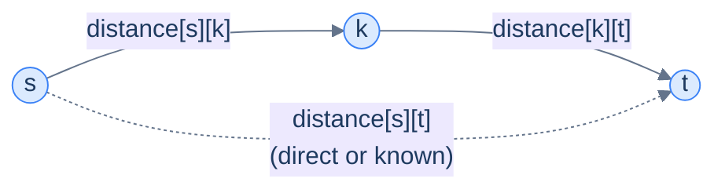
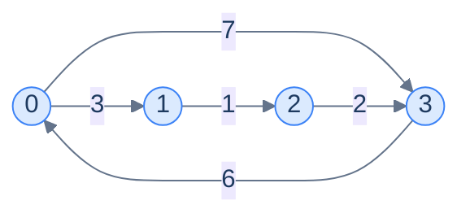

# 9. All pairs shortest path

This lesson teaches you the **all-pairs shortest path** problem — what's the shortest distance between *every* pair of nodes? — and the surprisingly elegant 4-line algorithm (Floyd-Warshall) that solves it.

## Table of contents

1. [The all-pairs problem](#the-all-pairs-problem)
2. [Why running Dijkstra N times can be too slow](#why-running-dijkstra-n-times-can-be-too-slow)
3. [The Floyd-Warshall idea](#the-floyd-warshall-idea)
4. [Implementation](#implementation)
5. [When to use which all-pairs strategy](#when-to-use-which-all-pairs-strategy)

***

# The All-Pairs Problem

In the previous lesson, **single-source** shortest path answered: *from this one node, what's the cheapest way to every other node?* Now flip the question:

> **All-pairs shortest path (APSP).** For *every* pair of nodes `(s, t)`, what's the shortest distance from `s` to `t`?

The answer isn't a 1D array of distances anymore — it's an **N × N matrix** where cell `(s, t)` is the shortest path cost from `s` to `t`.

```d2
direction: right

example: "All-pairs distance matrix" {
  grid-rows: 5
  grid-columns: 5
  grid-gap: 0
  h00: " "
  h01: "0"
  h02: "1"
  h03: "2"
  h04: "3"
  r00: "0"
  r01: "0"
  r02: "3"
  r03: "1"
  r04: "4"
  r10: "1"
  r11: "3"
  r12: "0"
  r13: "2"
  r14: "1"
  r20: "2"
  r21: "1"
  r22: "2"
  r23: "0"
  r24: "3"
  r30: "3"
  r31: "4"
  r32: "1"
  r33: "3"
  r34: "0"
}
```

<p align="center"><strong>An all-pairs shortest-path matrix for a 4-node graph. Cell <code>(s, t)</code> = shortest distance from node <code>s</code> to node <code>t</code>. Diagonal is always 0 (a node to itself). The whole matrix is symmetric for undirected graphs.</strong></p>

Real-world examples:

- **Logistics rebalancing.** A retailer with 200 warehouses needs to know how cheap it is to ship from any warehouse to any other — they don't know in advance which one will run out of stock.
- **Social network suggestions.** "People you may know" works partly off the all-pairs distance in the friendship graph — the shorter the shortest path, the stronger the suggestion.
- **Routing tables.** Internet routers precompute distances to every other router; the routing table is essentially one row of the APSP matrix.
- **Game maps.** RTS game pathfinding precomputes APSP on the static map so units can plan routes instantly.

> *Before reading on — given a 4-node graph, how many `(s, t)` pairs are there? For 100 nodes? For 10,000? Notice anything alarming?*

There are `N²` pairs (or `N × (N-1) / 2` if undirected and we ignore self-loops). For 10 000 nodes, that's **100 million** pairs. The output alone is huge — and the algorithm to compute it has to do at least O(N²) work just to fill the matrix.

***

# Why Running Dijkstra N Times Can Be Too Slow

The most obvious solution: just run Dijkstra `N` times, once with each node as source. Each Dijkstra is O((N+E) log N), so the total cost is **O(N (N+E) log N)**.

For dense graphs where `E ≈ N²`, that's **O(N³ log N)**. For sparse graphs, it's closer to **O(N² log N)**.

This works *if* every weight is non-negative. If you have negative weights, you'd switch to Bellman-Ford `N` times instead, costing **O(N² × E) = O(N⁴)** for a dense graph — painful.

The Floyd-Warshall algorithm offers a **clean O(N³) solution** that:

- Handles negative edges (just not negative cycles).
- Has a tiny, easily memorisable implementation (literally three nested loops).
- Has *much* better constant factors than Bellman-Ford-N-times — just simple integer additions and comparisons.

For dense graphs, Floyd-Warshall beats N-Dijkstras by a `log N` factor and beats N-Bellman-Fords by a full N. For sparse graphs, N-Dijkstras can win on raw asymptotic time, but Floyd-Warshall's simplicity and cache-friendliness still make it a strong choice in practice — especially below ~10⁴ nodes.

***

# The Floyd-Warshall Idea

Floyd-Warshall is a beautiful application of **dynamic programming**. The state we track is:

> `distance[s][t]` = shortest known path from `s` to `t` using **only the first `k` nodes as possible intermediates**.

We iterate `k = 0, 1, 2, …, N-1`, expanding the set of allowed intermediate nodes one at a time. After `k = N-1`, every node is allowed as an intermediate — so `distance[s][t]` is the *true* shortest path.

---

## The Recurrence

For each step `k`, we ask of every pair `(s, t)`:

> Could going through node `k` be cheaper than the current shortest known path?

That is:

```
distance[s][t] = min(
    distance[s][t],                  # path that doesn't use k
    distance[s][k] + distance[k][t]  # path that does use k
)
```

This single line — applied for every `k`, every `s`, every `t` — is the entire algorithm.



<p align="center"><strong>For each pair (s, t) and each intermediate k, ask: is the s→k→t path cheaper than what I have? If yes, update.</strong></p>

The brilliance is in the *order*: by allowing intermediates in lockstep (`k = 0` first, then `k = 1`, …), every recurrence step uses already-correct values from the previous step.

---

## Why It Works

Consider any shortest path from `s` to `t`. Its intermediate nodes form some set; call the largest-numbered intermediate `k_max`. When the outer loop reaches `k = k_max`:

- `distance[s][k_max]` is already the shortest path from `s` to `k_max` using only nodes `0..k_max-1` as intermediates — which by definition is correct, since `k_max` is the largest intermediate on the original path.
- `distance[k_max][t]` is similarly correct.
- The algorithm checks `distance[s][k_max] + distance[k_max][t]` and takes the min — capturing exactly the path we cared about.

After processing all values of `k`, every shortest path's `k_max` has been considered. Done.

---

## The Implementation Outline

> **`floydWarshall(graph)`**
> 1. Initialise `distance[N][N]` to `∞`.
> 2. Set `distance[i][i] = 0` for every `i`.
> 3. For each edge `(u, v, w)`: `distance[u][v] = w`.
> 4. For `k` from 0 to N-1:
>    For `s` from 0 to N-1:
>      For `t` from 0 to N-1:
>        `distance[s][t] = min(distance[s][t], distance[s][k] + distance[k][t])`
> 5. Return `distance`.

That's it. **Three nested loops, four lines of body**, total O(N³) time and O(N²) space.

---

## Walked Example

Take this 4-node directed graph:



Initial matrix (∞ shown as `-`):

| s\t | 0 | 1 | 2 | 3 |
|---|---|---|---|---|
| 0 | 0 | 3 | - | 7 |
| 1 | - | 0 | 1 | - |
| 2 | - | - | 0 | 2 |
| 3 | 6 | - | - | 0 |

After `k = 0`: paths through node 0 (mostly nothing new — node 0 has limited reach so far).

After `k = 1`: now `0 → 1 → 2 = 4`, so `distance[0][2] = 4`. (Was ∞.)

After `k = 2`: now `0 → 1 → 2 → 3 = 6`, so `distance[0][3] = min(7, 6) = 6`. Also `1 → 2 → 3 = 3`, so `distance[1][3] = 3`.

After `k = 3`: paths through node 3: `0 → 3 → 0 = 6 + 6 = 12` (no improvement); `1 → 3 → 0 = 3 + 6 = 9`, so `distance[1][0] = 9`. `2 → 3 → 0 = 2 + 6 = 8`, so `distance[2][0] = 8`. `2 → 3 → 0 → 1 = 8 + 3 = 11`, so `distance[2][1] = 11`. Continue similarly.

Final matrix:

| s\t | 0 | 1 | 2 | 3 |
|---|---|---|---|---|
| 0 | 0 | 3 | 4 | 6 |
| 1 | 9 | 0 | 1 | 3 |
| 2 | 8 | 11 | 0 | 2 |
| 3 | 6 | 9 | 10 | 0 |

> *Before reading on — what would `distance[3][2]` capture? Trace it through the iterations.*

`3 → 0 → 1 → 2 = 6 + 3 + 1 = 10`. The `k=2` round wouldn't help (we'd need `3 → ? → 2`, and the best route through 2 isn't useful here). The `k=1` round finds `3 → 0 → 1 = 9` (`distance[3][1]`). Then in the `k=2` round, `3 → 1 → 2 = 9 + 1 = 10` updates `distance[3][2]`. Final: 10. ✓

***

# Implementation

The graph is given as an adjacency list of `(neighbour, weight)` pairs. We initialise the distance matrix from the adjacency list, then run the triple loop.

```python run
from typing import List, Tuple

INF = float('inf')

def floyd_warshall(graph: List[List[Tuple[int, int]]]) -> List[List[float]]:
    n = len(graph)

    # Step 1 — initialise NxN distance matrix.
    distance = [[INF] * n for _ in range(n)]

    # Step 2 — distance to self is 0.
    for i in range(n):
        distance[i][i] = 0

    # Step 3 — direct edges.
    for u in range(n):
        for v, w in graph[u]:
            distance[u][v] = w

    # Step 4 — the famous triple loop. ORDER MATTERS: k must be the OUTERMOST loop.
    # Putting k inside would compute incorrect results.
    for k in range(n):
        for s in range(n):
            for t in range(n):
                if distance[s][k] + distance[k][t] < distance[s][t]:
                    distance[s][t] = distance[s][k] + distance[k][t]

    return distance


graph = [
    [(1, 3), (3, 7)],
    [(2, 1)],
    [(3, 2)],
    [(0, 6)],
]
for row in floyd_warshall(graph):
    print(row)
```

```java run
import java.util.*;

public class Main {
    public static int[][] floydWarshall(List<List<int[]>> graph) {
        int n = graph.size();
        int[][] distance = new int[n][n];
        for (int[] row : distance) Arrays.fill(row, Integer.MAX_VALUE / 2);   // /2 avoids overflow on add
        for (int i = 0; i < n; i++) distance[i][i] = 0;
        for (int u = 0; u < n; u++)
            for (int[] e : graph.get(u))
                distance[u][e[0]] = e[1];

        // Triple loop — k must be outermost.
        for (int k = 0; k < n; k++)
            for (int s = 0; s < n; s++)
                for (int t = 0; t < n; t++)
                    if (distance[s][k] + distance[k][t] < distance[s][t])
                        distance[s][t] = distance[s][k] + distance[k][t];

        return distance;
    }

    public static void main(String[] args) {
        List<List<int[]>> g = List.of(
            List.of(new int[]{1, 3}, new int[]{3, 7}),
            List.of(new int[]{2, 1}),
            List.of(new int[]{3, 2}),
            List.of(new int[]{0, 6}));
        for (int[] row : floydWarshall(g)) System.out.println(Arrays.toString(row));
    }
}
```

```c run
#include <stdio.h>
#include <stdlib.h>
#include <limits.h>

#define INF (INT_MAX / 2)

typedef struct { int to, weight; } Edge;
typedef struct { Edge* data; int size; } AdjList;

int** floyd_warshall(AdjList* graph, int n) {
    int** d = malloc(n * sizeof(int*));
    for (int i = 0; i < n; i++) {
        d[i] = malloc(n * sizeof(int));
        for (int j = 0; j < n; j++) d[i][j] = (i == j) ? 0 : INF;
    }
    for (int u = 0; u < n; u++)
        for (int j = 0; j < graph[u].size; j++)
            d[u][graph[u].data[j].to] = graph[u].data[j].weight;

    for (int k = 0; k < n; k++)
        for (int s = 0; s < n; s++)
            for (int t = 0; t < n; t++)
                if (d[s][k] + d[k][t] < d[s][t])
                    d[s][t] = d[s][k] + d[k][t];
    return d;
}

int main() {
    Edge e0[] = {{1,3},{3,7}};
    Edge e1[] = {{2,1}};
    Edge e2[] = {{3,2}};
    Edge e3[] = {{0,6}};
    AdjList g[] = {{e0,2},{e1,1},{e2,1},{e3,1}};
    int** d = floyd_warshall(g, 4);
    for (int i = 0; i < 4; i++) {
        for (int j = 0; j < 4; j++) printf("%d ", d[i][j]);
        printf("\n"); free(d[i]);
    }
    free(d);
    return 0;
}
```

```cpp run
#include <iostream>
#include <vector>
#include <climits>

constexpr int INF = INT_MAX / 2;

std::vector<std::vector<int>> floydWarshall(std::vector<std::vector<std::pair<int, int>>>& graph) {
    int n = (int)graph.size();
    std::vector<std::vector<int>> distance(n, std::vector<int>(n, INF));
    for (int i = 0; i < n; i++) distance[i][i] = 0;
    for (int u = 0; u < n; u++)
        for (auto& [v, w] : graph[u])
            distance[u][v] = w;

    for (int k = 0; k < n; k++)
        for (int s = 0; s < n; s++)
            for (int t = 0; t < n; t++)
                if (distance[s][k] + distance[k][t] < distance[s][t])
                    distance[s][t] = distance[s][k] + distance[k][t];
    return distance;
}

int main() {
    std::vector<std::vector<std::pair<int, int>>> g = {
        {{1, 3}, {3, 7}}, {{2, 1}}, {{3, 2}}, {{0, 6}}};
    for (auto& row : floydWarshall(g)) {
        for (int v : row) std::cout << v << " ";
        std::cout << "\n";
    }
}
```

```scala run
object Main extends App {
  val INF = Int.MaxValue / 2

  def floydWarshall(graph: Array[Array[(Int, Int)]]): Array[Array[Int]] = {
    val n = graph.length
    val d = Array.fill(n, n)(INF)
    for (i <- 0 until n) d(i)(i) = 0
    for (u <- 0 until n; (v, w) <- graph(u)) d(u)(v) = w

    for (k <- 0 until n; s <- 0 until n; t <- 0 until n) {
      if (d(s)(k) + d(k)(t) < d(s)(t))
        d(s)(t) = d(s)(k) + d(k)(t)
    }
    d
  }

  val g = Array(
    Array((1, 3), (3, 7)), Array((2, 1)), Array((3, 2)), Array((0, 6)))
  floydWarshall(g).foreach(r => println(r.mkString(" ")))
}
```

```javascript run
const INF = Infinity;

function floydWarshall(graph) {
    const n = graph.length;
    const d = Array.from({length: n}, () => Array(n).fill(INF));
    for (let i = 0; i < n; i++) d[i][i] = 0;
    for (let u = 0; u < n; u++)
        for (const [v, w] of graph[u]) d[u][v] = w;

    for (let k = 0; k < n; k++)
        for (let s = 0; s < n; s++)
            for (let t = 0; t < n; t++)
                if (d[s][k] + d[k][t] < d[s][t])
                    d[s][t] = d[s][k] + d[k][t];
    return d;
}

const graph = [[[1,3],[3,7]], [[2,1]], [[3,2]], [[0,6]]];
console.log(floydWarshall(graph));
```

```typescript run
const INF = Infinity;

function floydWarshall(graph: [number, number][][]): number[][] {
    const n = graph.length;
    const d: number[][] = Array.from({length: n}, () => Array(n).fill(INF));
    for (let i = 0; i < n; i++) d[i][i] = 0;
    for (let u = 0; u < n; u++)
        for (const [v, w] of graph[u]) d[u][v] = w;

    for (let k = 0; k < n; k++)
        for (let s = 0; s < n; s++)
            for (let t = 0; t < n; t++)
                if (d[s][k] + d[k][t] < d[s][t])
                    d[s][t] = d[s][k] + d[k][t];
    return d;
}

const graph: [number, number][][] = [[[1,3],[3,7]], [[2,1]], [[3,2]], [[0,6]]];
console.log(floydWarshall(graph));
```

```go run
package main

import (
    "fmt"
    "math"
)

func floydWarshall(graph [][][2]int) [][]int {
    n := len(graph)
    INF := math.MaxInt32 / 2
    d := make([][]int, n)
    for i := range d {
        d[i] = make([]int, n)
        for j := range d[i] {
            if i == j {
                d[i][j] = 0
            } else {
                d[i][j] = INF
            }
        }
    }
    for u := 0; u < n; u++ {
        for _, e := range graph[u] {
            d[u][e[0]] = e[1]
        }
    }
    for k := 0; k < n; k++ {
        for s := 0; s < n; s++ {
            for t := 0; t < n; t++ {
                if d[s][k]+d[k][t] < d[s][t] {
                    d[s][t] = d[s][k] + d[k][t]
                }
            }
        }
    }
    return d
}

func main() {
    g := [][][2]int{
        {{1, 3}, {3, 7}}, {{2, 1}}, {{3, 2}}, {{0, 6}}}
    for _, r := range floydWarshall(g) {
        fmt.Println(r)
    }
}
```

```kotlin run
fun floydWarshall(graph: List<List<IntArray>>): Array<IntArray> {
    val n = graph.size
    val INF = Int.MAX_VALUE / 2
    val d = Array(n) { IntArray(n) { INF } }
    for (i in 0 until n) d[i][i] = 0
    for (u in 0 until n) for (e in graph[u]) d[u][e[0]] = e[1]

    for (k in 0 until n)
        for (s in 0 until n)
            for (t in 0 until n)
                if (d[s][k] + d[k][t] < d[s][t])
                    d[s][t] = d[s][k] + d[k][t]
    return d
}

fun main() {
    val g = listOf(
        listOf(intArrayOf(1, 3), intArrayOf(3, 7)),
        listOf(intArrayOf(2, 1)),
        listOf(intArrayOf(3, 2)),
        listOf(intArrayOf(0, 6)))
    floydWarshall(g).forEach { println(it.toList()) }
}
```

```rust run
const INF: i32 = i32::MAX / 2;

fn floyd_warshall(graph: &Vec<Vec<(usize, i32)>>) -> Vec<Vec<i32>> {
    let n = graph.len();
    let mut d = vec![vec![INF; n]; n];
    for i in 0..n { d[i][i] = 0; }
    for u in 0..n {
        for &(v, w) in &graph[u] { d[u][v] = w; }
    }
    for k in 0..n {
        for s in 0..n {
            for t in 0..n {
                if d[s][k] + d[k][t] < d[s][t] {
                    d[s][t] = d[s][k] + d[k][t];
                }
            }
        }
    }
    d
}

fn main() {
    let g: Vec<Vec<(usize, i32)>> = vec![
        vec![(1, 3), (3, 7)], vec![(2, 1)], vec![(3, 2)], vec![(0, 6)]];
    for r in floyd_warshall(&g) { println!("{:?}", r); }
}
```


> **Implementation note.** Use `INT_MAX / 2` instead of `INT_MAX` as the "infinity" sentinel. With `INT_MAX`, `INF + INF` overflows to a negative number and silently produces wrong results. Halving keeps additions safe.

## Complexity Analysis

| | Complexity | Reasoning |
|---|---|---|
| **Time** | O(N³) | Three nested loops over N nodes |
| **Space** | O(N²) | The distance matrix |

The constant factor is *tiny* — each inner-loop iteration is one comparison and (sometimes) one addition. There are no heap operations, no priority queues, no recursion. On modern hardware this is one of the fastest "complex" graph algorithms per unit of work.

***

# When to Use Which All-Pairs Strategy

```d2
direction: right

decision: "All-pairs shortest path: pick a strategy" {
  q1: |md
    **N small enough**

    that N³ is OK (≤ ~5000)?
  |
  q2: |md
    **Negative edges?**
  |
  q3: |md
    **Sparse graph**

    (E ≪ N²)?
  |

  fw: |md
    **Floyd-Warshall**

    O(N³), simple, handles negatives
  |
  dij: |md
    **N × Dijkstra**

    O(N (N+E) log N), best for sparse non-negative
  |
  bf: |md
    **N × Bellman-Ford**

    O(N² E), fallback for sparse + negatives
  |

  q1 -> fw: yes
  q1 -> q2: no
  q2 -> bf: yes
  q2 -> dij: no
  q3 -> dij: yes
}
```

<p align="center"><strong>The triage. Floyd-Warshall is the default until your graph is big enough to make N³ painful. Then density and weight signs decide between N-Dijkstras and N-Bellman-Fords.</strong></p>

For most "interview-sized" inputs (N ≤ 1000), Floyd-Warshall wins on simplicity, generality, and constant factor. Production systems with big graphs use the Dijkstra-N variant with parallelism (each source runs in its own thread).

---

## Caveat — Negative Cycles

Floyd-Warshall **does not detect negative cycles automatically**. After the algorithm, if any `distance[i][i] < 0`, then the path from `i` back to `i` is negative — which is only possible via a negative cycle through `i`. So a one-line post-check (`any(d[i][i] < 0 for i in range(n))`) does the job.

---

## Final Takeaway

The all-pairs shortest path problem looks daunting at first — *every* pair? *every* node? — but the algorithm is one of the prettiest in computer science: three nested loops, four lines of body, O(N³). Floyd-Warshall handles negative edges, undirected and directed graphs alike, and gets to the answer with a clarity that's hard to beat.

The pattern Floyd-Warshall pioneers — **dynamic programming over a sequence of allowed states** — generalises to dozens of other graph problems: transitive closure, matrix-chain multiplication, optimal binary search trees, the list goes on. Once you've internalised the "expand the allowed set one element at a time, take the min" recipe, you'll start seeing it everywhere.

Up next is something completely different: **max flow**. Instead of "what's the shortest path", we ask "given a network with edge capacities (e.g. pipes with bandwidth limits), what's the maximum amount of stuff we can push from source to sink?" The answer comes from another famous algorithm — Ford-Fulkerson — and a strikingly elegant theorem.

> **Transfer challenge.** You have a 100×100 distance matrix from Floyd-Warshall. The boss now asks: *"What's the **diameter** of the graph?"* (Diameter = longest shortest path between any two nodes — i.e. the max over the matrix.) Write the one-line answer in your favourite language. Then think: would Floyd-Warshall be helpful for finding the *median* shortest path?

<details>
<summary><strong>Solution</strong></summary>

Diameter: `max(d[i][j] for i in range(n) for j in range(n) if d[i][j] < INF)` — one O(N²) scan over the matrix.

For median, you'd flatten all the finite distances into one list and take the median, also O(N²). Floyd-Warshall makes both queries trivial because the matrix already contains every answer. This is *the* point of all-pairs algorithms — once computed, every pairwise question is O(1) lookup.

</details>
