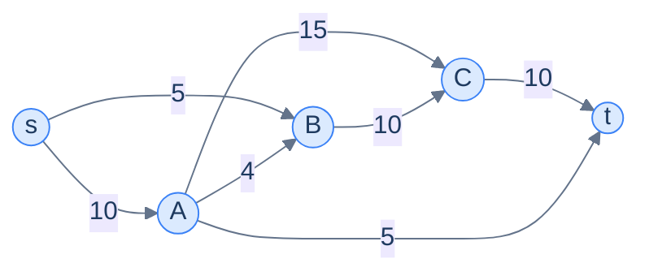
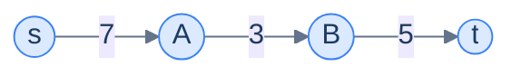
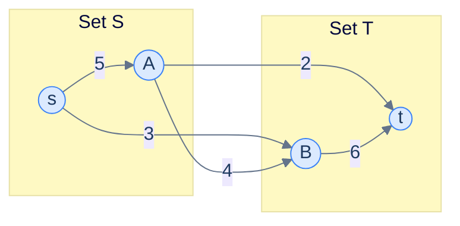
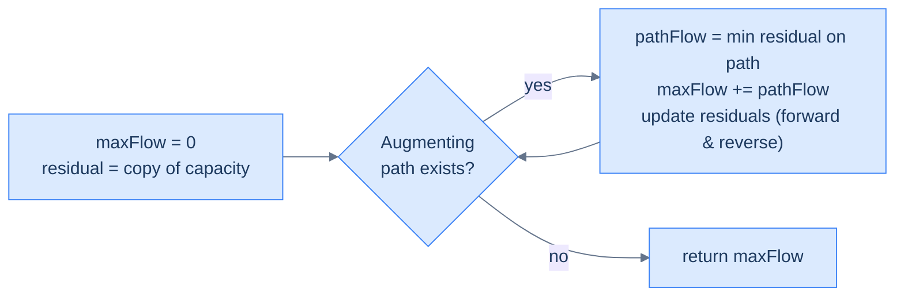
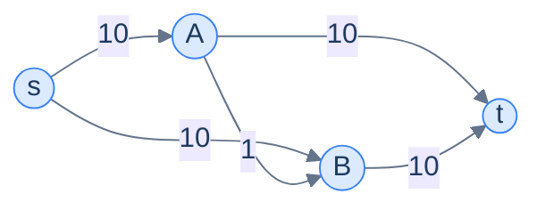

# 10. Max-flow min-cut theorem

This lesson teaches you to answer "given a network of pipes with capacities, what's the most water (or traffic, or data, or merchandise) we can push through it?" — and reveals the deep, beautiful theorem that links the answer to the **weakest link** in the network.

## Table of contents

1. [The maximum flow problem](#the-maximum-flow-problem)
2. [Three pieces of vocabulary](#three-pieces-of-vocabulary)
3. [The max-flow min-cut theorem](#the-max-flow-min-cut-theorem)
4. [The Ford-Fulkerson method](#the-ford-fulkerson-method)
5. [Why we need reverse edges](#why-we-need-reverse-edges)
6. [Implementation](#implementation)

***

# The Maximum Flow Problem

Take any directed graph where each edge carries a **capacity** — a maximum amount it can transmit. Pick a **source** node `s` and a **sink** node `t`. The question:

> *What is the maximum amount of "stuff" you can push from `s` to `t`* — given that no edge can carry more than its capacity, and that no node (other than `s` and `t`) can hoard or invent stuff (everything coming in must go out)?

That last rule is **conservation of flow**: an internal node is a junction, not a tank.



<p align="center"><strong>A flow network. Each edge label is the maximum capacity. Find the maximum amount that can flow from <code>s</code> to <code>t</code> obeying capacities and conservation.</strong></p>

This pattern shows up in surprisingly many places:

- **Road networks.** Edges = roads, capacities = lanes × speed limit. Maximum flow = peak traffic that can move through the network.
- **Heating systems.** Edges = pipes, capacities = pipe diameters. Maximum flow = peak water deliverable to all houses.
- **Data centres.** Edges = network cables, capacities = bandwidth. Maximum flow = bytes/sec deliverable from server to client.
- **Logistics.** Edges = trucking routes, capacities = trucks × payload. Maximum flow = goods/day deliverable.
- **Bipartite matching.** A surprising one — you can solve "match every applicant to a job" by reducing it to max-flow. We'll cover that in the next lesson.

> *Before reading on — for the network above, what's the answer? Try to push flow by hand and see what the maximum total turns out to be. Spend 60 seconds before scrolling.*

The answer is 15. There are several ways to achieve it; one is `s → A → C → t` (flow 10) plus `s → A → t` (flow 5) plus `s → B → C → t` (flow 5), but the last would require routing around the bottleneck — and the actual max stops at 15 because of capacity constraints on edges into `t`. The maximum flow is hard to pin down by inspection — and that's the point of the algorithm we'll learn.

***

# Three Pieces of Vocabulary

Before we attack the algorithm, we need three concepts that everyone in the field uses interchangeably with their abbreviations.

---

## 1. Residual Graph

When some flow has already been pushed through the network, each edge has *less remaining capacity* than its original. The **residual graph** is the same network but each edge's weight is its **remaining (unused) capacity**.

```d2
direction: right

orig: "Original capacity" {
  grid-rows: 1
  grid-columns: 1
  grid-gap: 0
  e: "u → v: cap = 10"
}

flow: "Push flow 6 along u → v" {
  grid-rows: 1
  grid-columns: 1
  grid-gap: 0
  e: "flow now uses 6 of 10"
}

resid: "Residual graph" {
  grid-rows: 2
  grid-columns: 1
  grid-gap: 0
  e1: "u → v: residual = 10 - 6 = 4"
  e2: "v → u: residual = 6 (REVERSE edge!)"
}

orig -> flow -> resid
```

<p align="center"><strong>Pushing flow updates the residual graph. The forward edge loses capacity equal to the flow; a reverse edge appears (or grows) carrying capacity equal to the flow.</strong></p>

The **reverse edge** is the bit that surprises everyone. We'll dedicate a section to why it matters — but the mechanical rule is simple: every time you push flow `f` along `u → v`, decrease the forward edge's residual by `f` and *increase* the reverse edge's residual by `f`.

---

## 2. Augmenting Path

An **augmenting path** in the residual graph is any simple `s → … → t` path where every edge has *positive remaining capacity*. The amount of flow you can push along an augmenting path is the **minimum residual capacity** of any edge on it (the bottleneck).



<p align="center"><strong>Augmenting path <code>s → A → B → t</code> with residual capacities 7, 3, 5. The bottleneck is 3, so 3 units can be pushed along this path.</strong></p>

If we push 3 units along this path, the residuals become 4, 0, 2. Edge `A → B` is now saturated and can't carry any more flow.

---

## 3. Cut

A **cut** `(S, T)` partitions the graph's nodes into two sets — `S` containing the source, `T` containing the sink — such that any edge from `S` to `T` is "crossed" by the cut.

The **capacity of a cut** is the sum of capacities of all edges going *from* `S` *to* `T` (reverse-direction edges don't count).



<p align="center"><strong>Cut <code>(S, T)</code> with <code>S = {s, A}</code>, <code>T = {B, t}</code>. Edges crossing the cut left-to-right: <code>s→B (3)</code>, <code>A→B (4)</code>, <code>A→t (2)</code>. Capacity of this cut = 3 + 4 + 2 = 9.</strong></p>

A graph has many possible cuts. Each one represents a possible "wall" separating source from sink — and the capacity of that cut is the maximum amount of flow that can ever cross it. The smallest such wall is therefore the **bottleneck of the entire network**.

***

# The Max-Flow Min-Cut Theorem

> **Theorem.** In any flow network, the **maximum flow** from source to sink equals the **minimum capacity of any cut** separating them.

In symbols:

```
max flow = min cut capacity
```

This is one of the most beautiful results in graph theory. It says: *"the most you can push is exactly limited by your weakest wall."* Intuitive in retrospect, dazzling at first encounter.

> *Before reading on — read the theorem twice. Why must max-flow ≤ min-cut be obvious? Why is the equality much harder?*

The "≤" direction is easy: every flow must cross every cut, so it can't exceed any cut's capacity (and certainly not the min). The "≥" direction is the surprise — it says we can *always* find a flow as big as the min cut. Why aren't there gaps?

## The Proof in One Paragraph

Suppose the max flow `f_max` has no augmenting path in its residual graph (otherwise we could push more flow and `f_max` wasn't max). Define `S` as all nodes reachable from `s` in the residual graph and `T` as the rest. Source ∈ `S`; sink ∈ `T` (sink unreachable in the residual graph by assumption). Now look at every edge `u → v` with `u ∈ S, v ∈ T` in the original graph: it must be saturated (zero residual) — otherwise `v` would be reachable from `s`. So all `S → T` edges are full. The total flow is the total capacity of the `(S, T)` cut. Hence `f_max = capacity(S, T) ≥ min cut`. Combined with the easy direction, equality. ∎

The corollary that drives every max-flow algorithm:

> **A flow is maximum if and only if no augmenting path exists in its residual graph.**

This gives us the algorithmic recipe: **keep finding augmenting paths and pushing flow until you can't**. That's exactly Ford-Fulkerson.

***

# The Ford-Fulkerson Method

> **Repeat:** find any augmenting path in the residual graph; push as much flow along it as possible; update the residual graph; record the contribution to total flow. **Stop** when no augmenting path remains.

The word "method" (rather than "algorithm") is intentional: Ford-Fulkerson **doesn't specify** how to find the augmenting path. You can use DFS (any path will do), BFS (shortest path — leads to the **Edmonds-Karp** specialisation with cleaner runtime guarantees), or anything that finds *some* path with all edges having positive residual.



<p align="center"><strong>The Ford-Fulkerson outer loop. Each iteration finds one augmenting path and squeezes the bottleneck flow out of it. Stop when the residual graph has no s–t path left.</strong></p>

***

# Why We Need Reverse Edges

The single most important — and confusing — part of Ford-Fulkerson is the **reverse edge**. When we push flow `f` along `u → v`, we add (or grow) a residual edge from `v` back to `u` with capacity `f`. Why?

Because the algorithm is allowed to make **mistakes early** that it can later **undo**.

Consider this graph:



Suppose DFS first finds the path `s → A → B → t` and pushes 1 unit (the `A → B` edge is the bottleneck at 1). Now `A → B` has 0 residual; total flow = 1.

Without reverse edges, DFS could next find `s → A → t` (push 9) and `s → B → t` (push 10). Total = 1 + 9 + 10 = **20**. But we pushed 1 unit through `A → B` at the start, which was wasteful — the *true* max flow is 20, but it requires us to *not* use `A → B`.

Now suppose DFS first picked the bad path and got stuck. With reverse edges:

- After `s → A → B → t (1)`, the residual graph has a reverse edge `B → A` with capacity 1.
- DFS finds `s → B → A → t` (using the reverse edge). Bottleneck = 1. Push 1.
- This effectively *cancels* the original flow through `A → B` — flow on `A → B` is back to 0, while we've "rerouted" through `s → B → A → t` instead.
- Total: 2 units flow = 1 (s→A→B→t) + 1 (s→B→A→t). The 1 on `A→B` and 1 on `B→A` cancel, leaving 0 on `A→B` and 1 unit `s→B→...→t` and 1 unit `s→...→A→t`. (This is what the maths says.)
- DFS keeps finding paths until done. Final answer: 20.

> **The reverse-edge insight.** Reverse edges let the algorithm *undo* a poor early choice. They convert Ford-Fulkerson from "greedy and wrong" into "explorative and provably optimal".

Without reverse edges, you'd have to be clever about which augmenting path to choose; with them, you can pick *any* path each iteration and the algorithm still converges to the maximum.

***

# Implementation

We use a **2D residual matrix** `residual[u][v]` instead of an adjacency list — it makes adding reverse edges and updating residuals trivial (just two cell updates per edge per push). For each iteration we DFS from source to sink, find the path's bottleneck, and update.

The graph is given as an adjacency list of `(neighbour, capacity)` pairs.


```pseudocode
function dfs(residual, visited, path, node, sink):
    add node to visited
    append node to path
    if node = sink: return true
    for neighbor from 0 to N−1:
        if neighbor is not in visited AND residual[node][neighbor] > 0:
            if dfs(residual, visited, path, neighbor, sink):
                return true
    pop from path
    return false

function maxFlow(graph, source, sink):
    residual ← N×N matrix of 0
    for u in graph:
        for (v, cap) in graph[u]:
            residual[u][v] ← cap
    total ← 0
    while true:
        visited ← empty set
        path ← empty list
        if NOT dfs(residual, visited, path, source, sink): break
        bottleneck ← min residual[path[i]][path[i+1]] for consecutive pairs
        for each consecutive (u, v) in path:
            residual[u][v] ← residual[u][v] − bottleneck
            residual[v][u] ← residual[v][u] + bottleneck
        total ← total + bottleneck
    return total
```

```python run
from typing import List, Tuple

INF = float('inf')

class Solution:
    def dfs(self,
            residual: List[List[int]],
            visited: set,
            path: List[int],
            node: int,
            sink: int) -> bool:
        visited.add(node)
        path.append(node)
        if node == sink:
            return True
        # Try every potential neighbour with positive residual capacity.
        for neighbour in range(len(residual)):
            if neighbour not in visited and residual[node][neighbour] > 0:
                if self.dfs(residual, visited, path, neighbour, sink):
                    return True
        path.pop()
        return False

    def max_flow(self,
                 graph: List[List[Tuple[int, int]]],
                 source: int,
                 sink: int) -> int:
        n = len(graph)
        if n == 0:
            return 0

        # Build NxN residual matrix from adjacency list.
        residual = [[0] * n for _ in range(n)]
        for u in range(n):
            for v, cap in graph[u]:
                residual[u][v] = cap

        max_flow = 0
        while True:
            visited: set = set()
            path: List[int] = []
            if not self.dfs(residual, visited, path, source, sink):
                break

            # Bottleneck — minimum residual on the augmenting path.
            path_flow = INF
            for i in range(len(path) - 1):
                u, v = path[i], path[i + 1]
                path_flow = min(path_flow, residual[u][v])

            # Push: subtract from forward edges, add to reverse edges.
            for i in range(len(path) - 1):
                u, v = path[i], path[i + 1]
                residual[u][v] -= path_flow
                residual[v][u] += path_flow      # reverse edge — the magic step.

            max_flow += path_flow
        return max_flow


# Example: 6-node network.
graph = [
    [(1, 10), (2, 10)],     # s = 0
    [(2, 2), (3, 4), (4, 8)],
    [(4, 9)],
    [(5, 10)],
    [(3, 6), (5, 10)],
    [],                     # t = 5
]
print(Solution().max_flow(graph, 0, 5))   # 19
```

```java run
import java.util.*;

public class Main {
    static class Solution {
        public boolean dfs(int[][] residual, Set<Integer> visited,
                           List<Integer> path, int node, int sink) {
            visited.add(node);
            path.add(node);
            if (node == sink) return true;
            for (int neighbour = 0; neighbour < residual.length; neighbour++) {
                if (!visited.contains(neighbour) && residual[node][neighbour] > 0) {
                    if (dfs(residual, visited, path, neighbour, sink)) return true;
                }
            }
            path.remove(path.size() - 1);
            return false;
        }

        public int maxFlow(List<List<int[]>> graph, int source, int sink) {
            int n = graph.size();
            if (n == 0) return 0;
            int[][] residual = new int[n][n];
            for (int u = 0; u < n; u++)
                for (int[] e : graph.get(u))
                    residual[u][e[0]] = e[1];

            int maxFlow = 0;
            while (true) {
                Set<Integer> visited = new HashSet<>();
                List<Integer> path = new ArrayList<>();
                if (!dfs(residual, visited, path, source, sink)) break;

                int pathFlow = Integer.MAX_VALUE;
                for (int i = 0; i < path.size() - 1; i++)
                    pathFlow = Math.min(pathFlow, residual[path.get(i)][path.get(i + 1)]);

                for (int i = 0; i < path.size() - 1; i++) {
                    int u = path.get(i), v = path.get(i + 1);
                    residual[u][v] -= pathFlow;
                    residual[v][u] += pathFlow;
                }
                maxFlow += pathFlow;
            }
            return maxFlow;
        }
    }

    public static void main(String[] args) {
        List<List<int[]>> graph = List.of(
            List.of(new int[]{1, 10}, new int[]{2, 10}),
            List.of(new int[]{2, 2}, new int[]{3, 4}, new int[]{4, 8}),
            List.of(new int[]{4, 9}),
            List.of(new int[]{5, 10}),
            List.of(new int[]{3, 6}, new int[]{5, 10}),
            List.of());
        System.out.println(new Solution().maxFlow(graph, 0, 5));
    }
}
```

```c run
#include <stdio.h>
#include <stdlib.h>
#include <stdbool.h>
#include <limits.h>

typedef struct { int to, cap; } Edge;
typedef struct { Edge* data; int size; } AdjList;

static bool dfs(int** residual, int n, bool* visited, int* path, int* path_size,
                int node, int sink) {
    visited[node] = true;
    path[(*path_size)++] = node;
    if (node == sink) return true;
    for (int neighbour = 0; neighbour < n; neighbour++) {
        if (!visited[neighbour] && residual[node][neighbour] > 0) {
            if (dfs(residual, n, visited, path, path_size, neighbour, sink)) return true;
        }
    }
    (*path_size)--;
    return false;
}

int max_flow(AdjList* graph, int n, int source, int sink) {
    int** r = malloc(n * sizeof(int*));
    for (int i = 0; i < n; i++) r[i] = calloc(n, sizeof(int));
    for (int u = 0; u < n; u++)
        for (int j = 0; j < graph[u].size; j++)
            r[u][graph[u].data[j].to] = graph[u].data[j].cap;

    int max_flow = 0;
    while (true) {
        bool* visited = calloc(n, sizeof(bool));
        int* path = malloc(n * sizeof(int));
        int path_size = 0;
        if (!dfs(r, n, visited, path, &path_size, source, sink)) {
            free(visited); free(path); break;
        }
        int path_flow = INT_MAX;
        for (int i = 0; i < path_size - 1; i++)
            if (r[path[i]][path[i+1]] < path_flow) path_flow = r[path[i]][path[i+1]];
        for (int i = 0; i < path_size - 1; i++) {
            r[path[i]][path[i+1]] -= path_flow;
            r[path[i+1]][path[i]] += path_flow;
        }
        max_flow += path_flow;
        free(visited); free(path);
    }
    for (int i = 0; i < n; i++) free(r[i]);
    free(r);
    return max_flow;
}

int main() {
    Edge e0[] = {{1,10},{2,10}};
    Edge e1[] = {{2,2},{3,4},{4,8}};
    Edge e2[] = {{4,9}};
    Edge e3[] = {{5,10}};
    Edge e4[] = {{3,6},{5,10}};
    AdjList g[] = {{e0,2},{e1,3},{e2,1},{e3,1},{e4,2},{NULL,0}};
    printf("%d\n", max_flow(g, 6, 0, 5));
    return 0;
}
```

```cpp run
#include <iostream>
#include <vector>
#include <unordered_set>
#include <climits>

class Solution {
public:
    bool dfs(std::vector<std::vector<int>>& residual,
             std::unordered_set<int>& visited, std::vector<int>& path,
             int node, int sink) {
        visited.insert(node);
        path.push_back(node);
        if (node == sink) return true;
        for (int neighbour = 0; neighbour < (int)residual.size(); neighbour++) {
            if (visited.find(neighbour) == visited.end() && residual[node][neighbour] > 0) {
                if (dfs(residual, visited, path, neighbour, sink)) return true;
            }
        }
        path.pop_back();
        return false;
    }

    int maxFlow(std::vector<std::vector<std::pair<int, int>>>& graph, int source, int sink) {
        int n = (int)graph.size();
        std::vector<std::vector<int>> residual(n, std::vector<int>(n, 0));
        for (int u = 0; u < n; u++)
            for (auto& [v, cap] : graph[u]) residual[u][v] = cap;

        int maxFlow = 0;
        while (true) {
            std::unordered_set<int> visited;
            std::vector<int> path;
            if (!dfs(residual, visited, path, source, sink)) break;

            int pathFlow = INT_MAX;
            for (int i = 0; i < (int)path.size() - 1; i++)
                pathFlow = std::min(pathFlow, residual[path[i]][path[i+1]]);
            for (int i = 0; i < (int)path.size() - 1; i++) {
                residual[path[i]][path[i+1]] -= pathFlow;
                residual[path[i+1]][path[i]] += pathFlow;
            }
            maxFlow += pathFlow;
        }
        return maxFlow;
    }
};

int main() {
    std::vector<std::vector<std::pair<int, int>>> g = {
        {{1, 10}, {2, 10}}, {{2, 2}, {3, 4}, {4, 8}},
        {{4, 9}}, {{5, 10}}, {{3, 6}, {5, 10}}, {}};
    std::cout << Solution().maxFlow(g, 0, 5) << "\n";
}
```

```scala run
import scala.collection.mutable

object Main extends App {
  class Solution {
    def dfs(residual: Array[Array[Int]], visited: mutable.Set[Int],
            path: mutable.ArrayBuffer[Int], node: Int, sink: Int): Boolean = {
      visited.add(node); path.append(node)
      if (node == sink) return true
      for (neighbour <- residual.indices) {
        if (!visited.contains(neighbour) && residual(node)(neighbour) > 0) {
          if (dfs(residual, visited, path, neighbour, sink)) return true
        }
      }
      path.remove(path.length - 1)
      false
    }

    def maxFlow(graph: Array[Array[(Int, Int)]], source: Int, sink: Int): Int = {
      val n = graph.length
      val residual = Array.ofDim[Int](n, n)
      for (u <- 0 until n; (v, cap) <- graph(u)) residual(u)(v) = cap

      var total = 0
      var continue = true
      while (continue) {
        val visited = mutable.Set.empty[Int]
        val path = mutable.ArrayBuffer.empty[Int]
        if (!dfs(residual, visited, path, source, sink)) {
          continue = false
        } else {
          var pathFlow = Int.MaxValue
          for (i <- 0 until path.length - 1) pathFlow = math.min(pathFlow, residual(path(i))(path(i+1)))
          for (i <- 0 until path.length - 1) {
            residual(path(i))(path(i+1)) -= pathFlow
            residual(path(i+1))(path(i)) += pathFlow
          }
          total += pathFlow
        }
      }
      total
    }
  }

  val g = Array(
    Array((1, 10), (2, 10)), Array((2, 2), (3, 4), (4, 8)),
    Array((4, 9)), Array((5, 10)), Array((3, 6), (5, 10)),
    Array.empty[(Int, Int)])
  println(new Solution().maxFlow(g, 0, 5))
}
```

```typescript run
class Solution {
    dfs(residual: number[][], visited: Set<number>, path: number[],
        node: number, sink: number): boolean {
        visited.add(node); path.push(node);
        if (node === sink) return true;
        for (let n = 0; n < residual.length; n++) {
            if (!visited.has(n) && residual[node][n] > 0) {
                if (this.dfs(residual, visited, path, n, sink)) return true;
            }
        }
        path.pop();
        return false;
    }

    maxFlow(graph: [number, number][][], source: number, sink: number): number {
        const n = graph.length;
        const residual: number[][] = Array.from({length: n}, () => Array(n).fill(0));
        for (let u = 0; u < n; u++)
            for (const [v, cap] of graph[u]) residual[u][v] = cap;

        let total = 0;
        while (true) {
            const visited = new Set<number>();
            const path: number[] = [];
            if (!this.dfs(residual, visited, path, source, sink)) break;
            let pathFlow = Infinity;
            for (let i = 0; i < path.length - 1; i++)
                pathFlow = Math.min(pathFlow, residual[path[i]][path[i+1]]);
            for (let i = 0; i < path.length - 1; i++) {
                residual[path[i]][path[i+1]] -= pathFlow;
                residual[path[i+1]][path[i]] += pathFlow;
            }
            total += pathFlow;
        }
        return total;
    }
}

const graph: [number, number][][] = [
    [[1,10],[2,10]], [[2,2],[3,4],[4,8]], [[4,9]],
    [[5,10]], [[3,6],[5,10]], []];
console.log(new Solution().maxFlow(graph, 0, 5));
```

```go run
package main

import (
    "fmt"
    "math"
)

func dfsMF(residual [][]int, visited []bool, path *[]int, node, sink int) bool {
    visited[node] = true
    *path = append(*path, node)
    if node == sink {
        return true
    }
    for n := range residual {
        if !visited[n] && residual[node][n] > 0 {
            if dfsMF(residual, visited, path, n, sink) {
                return true
            }
        }
    }
    *path = (*path)[:len(*path)-1]
    return false
}

func maxFlow(graph [][][2]int, source, sink int) int {
    n := len(graph)
    residual := make([][]int, n)
    for i := range residual {
        residual[i] = make([]int, n)
    }
    for u := 0; u < n; u++ {
        for _, e := range graph[u] {
            residual[u][e[0]] = e[1]
        }
    }

    total := 0
    for {
        visited := make([]bool, n)
        path := []int{}
        if !dfsMF(residual, visited, &path, source, sink) {
            break
        }
        pathFlow := math.MaxInt32
        for i := 0; i < len(path)-1; i++ {
            if residual[path[i]][path[i+1]] < pathFlow {
                pathFlow = residual[path[i]][path[i+1]]
            }
        }
        for i := 0; i < len(path)-1; i++ {
            residual[path[i]][path[i+1]] -= pathFlow
            residual[path[i+1]][path[i]] += pathFlow
        }
        total += pathFlow
    }
    return total
}

func main() {
    g := [][][2]int{
        {{1, 10}, {2, 10}}, {{2, 2}, {3, 4}, {4, 8}}, {{4, 9}},
        {{5, 10}}, {{3, 6}, {5, 10}}, {}}
    fmt.Println(maxFlow(g, 0, 5))
}
```

```rust run
fn dfs(residual: &mut Vec<Vec<i32>>, visited: &mut Vec<bool>,
       path: &mut Vec<usize>, node: usize, sink: usize) -> bool {
    visited[node] = true;
    path.push(node);
    if node == sink { return true; }
    let n = residual.len();
    for neighbour in 0..n {
        if !visited[neighbour] && residual[node][neighbour] > 0 {
            if dfs(residual, visited, path, neighbour, sink) { return true; }
        }
    }
    path.pop();
    false
}

fn max_flow(graph: &Vec<Vec<(usize, i32)>>, source: usize, sink: usize) -> i32 {
    let n = graph.len();
    let mut residual: Vec<Vec<i32>> = vec![vec![0; n]; n];
    for u in 0..n {
        for &(v, cap) in &graph[u] {
            residual[u][v] = cap;
        }
    }
    let mut total = 0;
    loop {
        let mut visited = vec![false; n];
        let mut path: Vec<usize> = Vec::new();
        if !dfs(&mut residual, &mut visited, &mut path, source, sink) { break; }
        let mut path_flow = i32::MAX;
        for i in 0..path.len() - 1 {
            path_flow = path_flow.min(residual[path[i]][path[i + 1]]);
        }
        for i in 0..path.len() - 1 {
            residual[path[i]][path[i + 1]] -= path_flow;
            residual[path[i + 1]][path[i]] += path_flow;
        }
        total += path_flow;
    }
    total
}

fn main() {
    let g: Vec<Vec<(usize, i32)>> = vec![
        vec![(1, 10), (2, 10)],
        vec![(2, 2), (3, 4), (4, 8)],
        vec![(4, 9)],
        vec![(5, 10)],
        vec![(3, 6), (5, 10)],
        vec![]];
    println!("{}", max_flow(&g, 0, 5));
}
```


## Complexity Analysis

| | Complexity | Reasoning |
|---|---|---|
| **Time** | O(E × max_flow) | Each augmenting path adds at least 1 to the flow; finding a path costs O(E) |
| **Space** | O(N²) | The residual matrix |

The worst-case time is *pathological*: if the algorithm picks bad augmenting paths, it can take as many iterations as the *value* of the max flow — exponential in the number of edges in the worst case. **Edmonds-Karp** (Ford-Fulkerson with BFS for path-finding) fixes this — its bound is O(V × E²), polynomial regardless of capacity values. In practice, both are fast for small networks.

---

## Final Takeaway

The max-flow / min-cut duality is one of the deepest ideas in graph theory: *the most you can push equals the weakest wall*. Ford-Fulkerson turns the theorem into an algorithm by greedily filling augmenting paths and using **reverse edges** to undo any earlier wrong turns. The result is correct *no matter which augmenting path you pick* — a rare property that makes the algorithm both elegant and forgiving.

Once you have max-flow, a startling number of seemingly unrelated problems collapse into it. The next lesson covers the most famous one: **bipartite matching** — assigning workers to jobs, students to schools, content to viewers — solved by reducing it to a max-flow problem with capacity 1 on every edge.

> **Transfer challenge.** A scheduling system has 5 servers, each with a CPU capacity. 8 jobs arrive, each with a CPU requirement. Each job can run on a subset of servers (compatibility list). Sketch how to model "what's the maximum number of jobs we can schedule?" as a max-flow problem.

<details>
<summary><strong>Sketch</strong></summary>

Build a graph with:
- A source `s`.
- One node per job; edge from `s` to each job-node with capacity = job's CPU requirement.
- One node per server; edge from each server-node to a sink `t` with capacity = server's CPU capacity.
- For each (job, compatible server) pair: edge from job-node to server-node with capacity = job's CPU requirement.

Run Ford-Fulkerson from `s` to `t`. The max-flow equals the maximum CPU-weighted job throughput. The "what assignment?" answer is read off the saturated edges in the residual graph.

This is one of dozens of problems where max-flow shows up disguised as something else.

</details>
