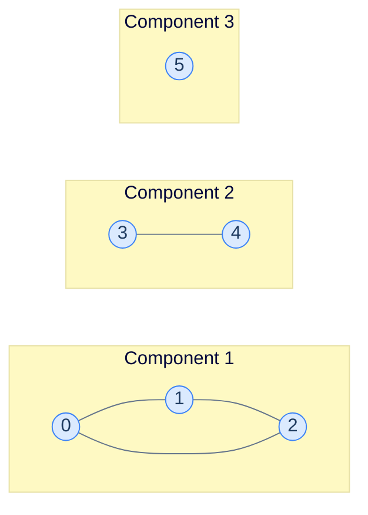
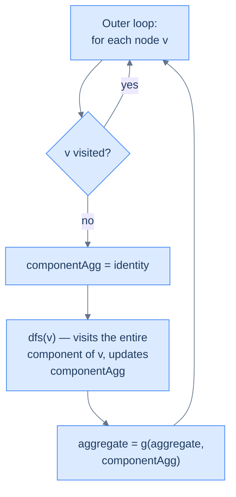

# 13. Pattern: Connected components

This lesson teaches you the **connected-components pattern** — the recipe for finding, counting, or summarising the disjoint pieces of an undirected graph (or grid).

## Table of contents

1. [What is a connected component?](#what-is-a-connected-component)
2. [The pattern template](#the-pattern-template)
3. [Identifying the pattern](#identifying-the-pattern)
4. [Problem: Find connected components](#problem-find-connected-components)
5. [Problem: Sum of minimums](#problem-sum-of-minimums)
6. [Problem: Island count](#problem-island-count)
7. [Problem: Size of largest island](#problem-size-of-largest-island)

***

# What Is a Connected Component?

Take any undirected graph. Walk it. The set of nodes you can reach from your starting point is a **connected component** — a maximal subgraph where every node has a path to every other.



<p align="center"><strong>Three connected components: a triangle (0-1-2), an edge (3-4), and a singleton (5). No edges go between components.</strong></p>

A connected graph has *exactly one* component. A disconnected graph has more — and many real-world questions are really questions about components: *"how many islands?"*, *"how many distinct social cliques?"*, *"how many isolated computers?"*

> **Note.** "Connected component" is the term for *undirected* graphs. Directed graphs have a more complex structure called *strongly connected components* (where you can reach every node *and* return). We're keeping things to undirected here.

***

# The Pattern Template

The pattern problem looks like this:

> Aggregate some function `f` over the nodes of *every* connected component, then aggregate those per-component values across all components using `g`.

| Problem | `f` (per node) | `g` (across components) |
|---|---|---|
| Count components | +1 | Sum (or just count) |
| List nodes per component | Append node to list | Append list to result |
| Sum of minimum values | Take min of value seen so far | Sum |
| Largest component size | +1 | Max |
| Count islands | (visit a cell) | +1 (each DFS-init = one new island) |

The structure is **identical across all of them**. Loop over every node; whenever you find an unvisited node, run DFS from it to absorb its entire component into a per-component aggregate; combine that aggregate into the global result.

---

## The Generic Algorithm

```
componentPattern(graph):
    visited = empty set
    aggregate = identity_g                        # default for g
    
    for each node v in graph:
        if v not visited:
            componentAggregate = identity_f       # reset per component
            dfs(v, ..., componentAggregate, visited)
            aggregate = g(aggregate, componentAggregate)
    
    return aggregate

dfs(node, ..., componentAggregate, visited):
    visited.add(node)
    componentAggregate = f(componentAggregate, node)
    
    for each neighbour n of node:
        if n not in visited:
            dfs(n, ..., componentAggregate, visited)
```

The pattern's defining feature: **the per-component aggregate is reset between components**, but the visited set is **not** — visited is global, accumulating across all components.



<p align="center"><strong>The two-level loop. The outer loop discovers components; the inner DFS exhausts each one. The reset-on-discovery is the heartbeat of the pattern.</strong></p>

***

# Identifying the Pattern

The signal-words to look for in problem statements:

- *"How many groups / cliques / islands / regions / components?"*
- *"For each disconnected piece, return …"*
- *"Find the largest / smallest / sum / min / max over all components"*
- *"Process every isolated subgraph"*

If the problem talks about **independent groups** of nodes/cells, with **no interaction** between groups, you're looking at the connected-components pattern. The graph might be explicit (adjacency list) or implicit (a grid).

We'll work through four problems — two graph-flavoured, two grid-flavoured — to cement the recipe.

***

# Problem: Find Connected Components

## The Problem

Given an undirected graph and a `values` array, return a list of all connected components — but only of the *visitable* nodes (`values[i] > 0`).

```
Input:  graph = [[1], [0, 2], [1, 3], [2, 4], [3, 5], [4, 6], [5]],
        values = [1, 0, 1, 0, 1, 0, 1]
Output: [[0], [2], [4], [6]]
```

The "visitable" twist makes the problem more interesting: nodes with `values[i] == 0` block the DFS entirely, so a chain of zeros isolates the visitable nodes from each other.

## Pattern Mapping

- `f`: append node to current component's list.
- `g`: append the component to the master result list.
- *Visitability filter*: only descend into neighbours where `values[neighbour] > 0`.

## The Solution


```pseudocode
function dfs(graph, node, values, visited, component):
    add node to visited
    append node to component
    for neighbor in graph[node]:
        if neighbor is not in visited AND values[neighbor] > 0:
            dfs(graph, neighbor, values, visited, component)

function connectedComponents(graph, values):
    visited ← empty set
    components ← empty list
    for node from 0 to N−1:
        if values[node] > 0 AND node is not in visited:
            component ← empty list
            dfs(graph, node, values, visited, component)
            append component to components
    return components
```

```python run
from typing import List, Set

class Solution:
    def dfs(self,
            graph: List[List[int]],
            node: int,
            values: List[int],
            visited: Set[int],
            component: List[int]) -> None:
        visited.add(node)
        component.append(node)
        for neighbour in graph[node]:
            # Two filters: not visited yet AND visitable.
            if neighbour not in visited and values[neighbour] > 0:
                self.dfs(graph, neighbour, values, visited, component)

    def connected_components(self,
                             graph: List[List[int]],
                             values: List[int]) -> List[List[int]]:
        n = len(graph)
        visited: Set[int] = set()
        components: List[List[int]] = []
        for node in range(n):
            # Skip non-visitable nodes outright; skip already-visited ones.
            if values[node] > 0 and node not in visited:
                component: List[int] = []
                self.dfs(graph, node, values, visited, component)
                components.append(component)
        return components


graph = [[1], [0, 2], [1, 3], [2, 4], [3, 5], [4, 6], [5]]
values = [1, 0, 1, 0, 1, 0, 1]
print(Solution().connected_components(graph, values))
```

```java run
import java.util.*;

public class Main {
    static class Solution {
        public void dfs(List<List<Integer>> graph, int node, int[] values,
                        Set<Integer> visited, List<Integer> component) {
            visited.add(node);
            component.add(node);
            for (int n : graph.get(node)) {
                if (!visited.contains(n) && values[n] > 0)
                    dfs(graph, n, values, visited, component);
            }
        }

        public List<List<Integer>> connectedComponents(List<List<Integer>> graph, int[] values) {
            int n = graph.size();
            Set<Integer> visited = new HashSet<>();
            List<List<Integer>> components = new ArrayList<>();
            for (int node = 0; node < n; node++) {
                if (values[node] > 0 && !visited.contains(node)) {
                    List<Integer> component = new ArrayList<>();
                    dfs(graph, node, values, visited, component);
                    components.add(component);
                }
            }
            return components;
        }
    }

    public static void main(String[] args) {
        var graph = List.of(List.of(1), List.of(0, 2), List.of(1, 3),
                            List.of(2, 4), List.of(3, 5), List.of(4, 6), List.of(5));
        int[] values = {1, 0, 1, 0, 1, 0, 1};
        System.out.println(new Solution().connectedComponents(graph, values));
    }
}
```

```c run
#include <stdio.h>
#include <stdlib.h>
#include <stdbool.h>

typedef struct { int* data; int size; } AdjList;

static int** components; static int* component_sizes; static int component_count;

static void dfs(AdjList* graph, int node, int* values, bool* visited, int** comp, int* comp_size) {
    visited[node] = true;
    *comp = realloc(*comp, (*comp_size + 1) * sizeof(int));
    (*comp)[(*comp_size)++] = node;
    for (int i = 0; i < graph[node].size; i++) {
        int n = graph[node].data[i];
        if (!visited[n] && values[n] > 0) dfs(graph, n, values, visited, comp, comp_size);
    }
}

int main() {
    int g0[]={1}, g1[]={0,2}, g2[]={1,3}, g3[]={2,4}, g4[]={3,5}, g5[]={4,6}, g6[]={5};
    AdjList graph[]={{g0,1},{g1,2},{g2,2},{g3,2},{g4,2},{g5,2},{g6,1}};
    int values[]={1,0,1,0,1,0,1};
    int n = 7;
    bool visited[7] = {false};
    components = NULL; component_sizes = NULL; component_count = 0;
    for (int i = 0; i < n; i++) {
        if (values[i] > 0 && !visited[i]) {
            int* comp = NULL; int comp_size = 0;
            dfs(graph, i, values, visited, &comp, &comp_size);
            components = realloc(components, (component_count + 1) * sizeof(int*));
            component_sizes = realloc(component_sizes, (component_count + 1) * sizeof(int));
            components[component_count] = comp;
            component_sizes[component_count++] = comp_size;
        }
    }
    for (int i = 0; i < component_count; i++) {
        for (int j = 0; j < component_sizes[i]; j++) printf("%d ", components[i][j]);
        printf("\n"); free(components[i]);
    }
    free(components); free(component_sizes);
    return 0;
}
```

```cpp run
#include <iostream>
#include <vector>
#include <unordered_set>

class Solution {
public:
    void dfs(std::vector<std::vector<int>>& graph, int node, std::vector<int>& values,
             std::unordered_set<int>& visited, std::vector<int>& component) {
        visited.insert(node);
        component.push_back(node);
        for (int n : graph[node])
            if (visited.find(n) == visited.end() && values[n] > 0)
                dfs(graph, n, values, visited, component);
    }

    std::vector<std::vector<int>> connectedComponents(std::vector<std::vector<int>>& graph,
                                                       std::vector<int>& values) {
        int n = (int)graph.size();
        std::unordered_set<int> visited;
        std::vector<std::vector<int>> components;
        for (int node = 0; node < n; node++) {
            if (values[node] > 0 && visited.find(node) == visited.end()) {
                std::vector<int> component;
                dfs(graph, node, values, visited, component);
                components.push_back(component);
            }
        }
        return components;
    }
};

int main() {
    std::vector<std::vector<int>> g = {{1}, {0, 2}, {1, 3}, {2, 4}, {3, 5}, {4, 6}, {5}};
    std::vector<int> values = {1, 0, 1, 0, 1, 0, 1};
    for (auto& c : Solution().connectedComponents(g, values)) {
        for (int v : c) std::cout << v << " ";
        std::cout << "\n";
    }
}
```

```scala run
import scala.collection.mutable

object Main extends App {
  class Solution {
    def dfs(graph: Array[Array[Int]], node: Int, values: Array[Int],
            visited: mutable.Set[Int], component: mutable.ArrayBuffer[Int]): Unit = {
      visited.add(node); component.append(node)
      for (n <- graph(node) if !visited.contains(n) && values(n) > 0)
        dfs(graph, n, values, visited, component)
    }

    def connectedComponents(graph: Array[Array[Int]], values: Array[Int]): Seq[Seq[Int]] = {
      val visited = mutable.Set.empty[Int]
      val components = mutable.ArrayBuffer.empty[Seq[Int]]
      for (node <- graph.indices if values(node) > 0 && !visited.contains(node)) {
        val comp = mutable.ArrayBuffer.empty[Int]
        dfs(graph, node, values, visited, comp)
        components.append(comp.toSeq)
      }
      components.toSeq
    }
  }

  val g = Array(Array(1), Array(0, 2), Array(1, 3), Array(2, 4), Array(3, 5), Array(4, 6), Array(5))
  val v = Array(1, 0, 1, 0, 1, 0, 1)
  println(new Solution().connectedComponents(g, v))
}
```

```typescript run
class Solution {
    dfs(graph: number[][], node: number, values: number[],
        visited: Set<number>, component: number[]): void {
        visited.add(node); component.push(node);
        for (const n of graph[node])
            if (!visited.has(n) && values[n] > 0) this.dfs(graph, n, values, visited, component);
    }

    connectedComponents(graph: number[][], values: number[]): number[][] {
        const visited = new Set<number>(); const components: number[][] = [];
        for (let node = 0; node < graph.length; node++) {
            if (values[node] > 0 && !visited.has(node)) {
                const component: number[] = [];
                this.dfs(graph, node, values, visited, component);
                components.push(component);
            }
        }
        return components;
    }
}

const graph: number[][] = [[1], [0, 2], [1, 3], [2, 4], [3, 5], [4, 6], [5]];
const values: number[] = [1, 0, 1, 0, 1, 0, 1];
console.log(new Solution().connectedComponents(graph, values));
```

```go run
package main

import "fmt"

func dfsCC(graph [][]int, node int, values []int, visited []bool, component *[]int) {
    visited[node] = true
    *component = append(*component, node)
    for _, n := range graph[node] {
        if !visited[n] && values[n] > 0 {
            dfsCC(graph, n, values, visited, component)
        }
    }
}

func connectedComponents(graph [][]int, values []int) [][]int {
    visited := make([]bool, len(graph))
    components := [][]int{}
    for node := 0; node < len(graph); node++ {
        if values[node] > 0 && !visited[node] {
            component := []int{}
            dfsCC(graph, node, values, visited, &component)
            components = append(components, component)
        }
    }
    return components
}

func main() {
    g := [][]int{{1}, {0, 2}, {1, 3}, {2, 4}, {3, 5}, {4, 6}, {5}}
    values := []int{1, 0, 1, 0, 1, 0, 1}
    fmt.Println(connectedComponents(g, values))
}
```

```rust run
fn dfs(graph: &[Vec<usize>], node: usize, values: &[i32],
       visited: &mut Vec<bool>, component: &mut Vec<usize>) {
    visited[node] = true;
    component.push(node);
    for &n in &graph[node] {
        if !visited[n] && values[n] > 0 {
            dfs(graph, n, values, visited, component);
        }
    }
}

fn connected_components(graph: &[Vec<usize>], values: &[i32]) -> Vec<Vec<usize>> {
    let n = graph.len();
    let mut visited = vec![false; n];
    let mut components = Vec::new();
    for node in 0..n {
        if values[node] > 0 && !visited[node] {
            let mut component = Vec::new();
            dfs(graph, node, values, &mut visited, &mut component);
            components.push(component);
        }
    }
    components
}

fn main() {
    let g: Vec<Vec<usize>> = vec![
        vec![1], vec![0, 2], vec![1, 3], vec![2, 4], vec![3, 5], vec![4, 6], vec![5]];
    let v = vec![1, 0, 1, 0, 1, 0, 1];
    println!("{:?}", connected_components(&g, &v));
}
```


***

# Problem: Sum of Minimums

## The Problem

For each connected component, find the minimum `value` among its nodes. Return the **sum of those minima** across all components.

```
Input:  graph = [[1], [0, 4], [3], [2], [1]], values = [2, 5, 1, 6, 7]
Output: 3
Explanation: Component {0, 1, 4} has min(2, 5, 7) = 2.
             Component {2, 3} has min(1, 6) = 1.
             2 + 1 = 3.
```

## Pattern Mapping

- `f`: take min of running component-min and current node's value.
- `g`: sum across components.

The DFS now *returns* the component min instead of building a list. That's a small but important variation: the per-component aggregate doesn't need to be a parameter — it can be the function's return value.

## The Solution


```pseudocode
function dfs(graph, node, visited, values):
    add node to visited
    minSoFar ← values[node]
    for neighbor in graph[node]:
        if neighbor is not in visited:
            childMin ← dfs(graph, neighbor, visited, values)
            if childMin < minSoFar:
                minSoFar ← childMin
    return minSoFar

function sumOfMinimums(graph, values):
    visited ← empty set
    total ← 0
    for node from 0 to N−1:
        if node is not in visited:
            total ← total + dfs(graph, node, visited, values)
    return total
```

```python run
from typing import List, Set

class Solution:
    def dfs(self,
            graph: List[List[int]],
            node: int,
            visited: Set[int],
            values: List[int]) -> int:
        visited.add(node)
        # Initialise component-min as this node's value; reduce as we walk neighbours.
        minimum_so_far = values[node]
        for neighbour in graph[node]:
            if neighbour not in visited:
                child_min = self.dfs(graph, neighbour, visited, values)
                if child_min < minimum_so_far:
                    minimum_so_far = child_min
        return minimum_so_far

    def sum_of_minimums(self,
                        graph: List[List[int]],
                        values: List[int]) -> int:
        visited: Set[int] = set()
        total = 0
        for node in range(len(graph)):
            if node not in visited:
                total += self.dfs(graph, node, visited, values)
        return total


graph = [[1], [0, 4], [3], [2], [1]]
values = [2, 5, 1, 6, 7]
print(Solution().sum_of_minimums(graph, values))   # 3
```

```java run
import java.util.*;

public class Main {
    static class Solution {
        public int dfs(List<List<Integer>> graph, int node, Set<Integer> visited, int[] values) {
            visited.add(node);
            int minSoFar = values[node];
            for (int n : graph.get(node)) {
                if (!visited.contains(n))
                    minSoFar = Math.min(minSoFar, dfs(graph, n, visited, values));
            }
            return minSoFar;
        }

        public int sumOfMinimums(List<List<Integer>> graph, int[] values) {
            Set<Integer> visited = new HashSet<>();
            int total = 0;
            for (int node = 0; node < graph.size(); node++) {
                if (!visited.contains(node)) total += dfs(graph, node, visited, values);
            }
            return total;
        }
    }

    public static void main(String[] args) {
        var g = List.of(List.of(1), List.of(0, 4), List.of(3), List.of(2), List.of(1));
        int[] values = {2, 5, 1, 6, 7};
        System.out.println(new Solution().sumOfMinimums(g, values));
    }
}
```

```c run
#include <stdio.h>
#include <stdlib.h>
#include <stdbool.h>

typedef struct { int* data; int size; } AdjList;

static int dfs(AdjList* g, int node, bool* visited, int* values) {
    visited[node] = true;
    int min_so_far = values[node];
    for (int i = 0; i < g[node].size; i++) {
        int n = g[node].data[i];
        if (!visited[n]) {
            int child = dfs(g, n, visited, values);
            if (child < min_so_far) min_so_far = child;
        }
    }
    return min_so_far;
}

int main() {
    int g0[]={1}, g1[]={0,4}, g2[]={3}, g3[]={2}, g4[]={1};
    AdjList g[]={{g0,1},{g1,2},{g2,1},{g3,1},{g4,1}};
    int values[]={2,5,1,6,7};
    bool visited[5]={false};
    int total = 0;
    for (int i = 0; i < 5; i++) {
        if (!visited[i]) total += dfs(g, i, visited, values);
    }
    printf("%d\n", total);
    return 0;
}
```

```cpp run
#include <iostream>
#include <vector>
#include <unordered_set>

class Solution {
public:
    int dfs(std::vector<std::vector<int>>& graph, int node,
            std::unordered_set<int>& visited, std::vector<int>& values) {
        visited.insert(node);
        int minSoFar = values[node];
        for (int n : graph[node]) {
            if (visited.find(n) == visited.end())
                minSoFar = std::min(minSoFar, dfs(graph, n, visited, values));
        }
        return minSoFar;
    }

    int sumOfMinimums(std::vector<std::vector<int>>& graph, std::vector<int>& values) {
        std::unordered_set<int> visited;
        int total = 0;
        for (int node = 0; node < (int)graph.size(); node++) {
            if (visited.find(node) == visited.end()) total += dfs(graph, node, visited, values);
        }
        return total;
    }
};

int main() {
    std::vector<std::vector<int>> g = {{1}, {0, 4}, {3}, {2}, {1}};
    std::vector<int> values = {2, 5, 1, 6, 7};
    std::cout << Solution().sumOfMinimums(g, values) << "\n";
}
```

```scala run
import scala.collection.mutable

object Main extends App {
  class Solution {
    def dfs(graph: Array[Array[Int]], node: Int,
            visited: mutable.Set[Int], values: Array[Int]): Int = {
      visited.add(node)
      var minSoFar = values(node)
      for (n <- graph(node) if !visited.contains(n))
        minSoFar = math.min(minSoFar, dfs(graph, n, visited, values))
      minSoFar
    }

    def sumOfMinimums(graph: Array[Array[Int]], values: Array[Int]): Int = {
      val visited = mutable.Set.empty[Int]
      var total = 0
      for (node <- graph.indices if !visited.contains(node))
        total += dfs(graph, node, visited, values)
      total
    }
  }

  val g = Array(Array(1), Array(0, 4), Array(3), Array(2), Array(1))
  println(new Solution().sumOfMinimums(g, Array(2, 5, 1, 6, 7)))
}
```

```typescript run
class Solution {
    dfs(graph: number[][], node: number, visited: Set<number>, values: number[]): number {
        visited.add(node);
        let minSoFar = values[node];
        for (const n of graph[node]) {
            if (!visited.has(n)) minSoFar = Math.min(minSoFar, this.dfs(graph, n, visited, values));
        }
        return minSoFar;
    }

    sumOfMinimums(graph: number[][], values: number[]): number {
        const visited = new Set<number>();
        let total = 0;
        for (let node = 0; node < graph.length; node++) {
            if (!visited.has(node)) total += this.dfs(graph, node, visited, values);
        }
        return total;
    }
}

console.log(new Solution().sumOfMinimums([[1], [0, 4], [3], [2], [1]], [2, 5, 1, 6, 7]));
```

```go run
package main

import "fmt"

func dfsSM(graph [][]int, node int, visited []bool, values []int) int {
    visited[node] = true
    minSoFar := values[node]
    for _, n := range graph[node] {
        if !visited[n] {
            child := dfsSM(graph, n, visited, values)
            if child < minSoFar {
                minSoFar = child
            }
        }
    }
    return minSoFar
}

func sumOfMinimums(graph [][]int, values []int) int {
    visited := make([]bool, len(graph))
    total := 0
    for node := 0; node < len(graph); node++ {
        if !visited[node] {
            total += dfsSM(graph, node, visited, values)
        }
    }
    return total
}

func main() {
    g := [][]int{{1}, {0, 4}, {3}, {2}, {1}}
    fmt.Println(sumOfMinimums(g, []int{2, 5, 1, 6, 7}))
}
```

```rust run
fn dfs(graph: &[Vec<usize>], node: usize, visited: &mut Vec<bool>, values: &[i32]) -> i32 {
    visited[node] = true;
    let mut min_so_far = values[node];
    for &n in &graph[node] {
        if !visited[n] {
            min_so_far = min_so_far.min(dfs(graph, n, visited, values));
        }
    }
    min_so_far
}

fn sum_of_minimums(graph: &[Vec<usize>], values: &[i32]) -> i32 {
    let n = graph.len();
    let mut visited = vec![false; n];
    let mut total = 0;
    for node in 0..n {
        if !visited[node] { total += dfs(graph, node, &mut visited, values); }
    }
    total
}

fn main() {
    let g: Vec<Vec<usize>> = vec![vec![1], vec![0, 4], vec![3], vec![2], vec![1]];
    println!("{}", sum_of_minimums(&g, &[2, 5, 1, 6, 7]));
}
```


***

# Problem: Island Count

## The Problem

A grid of `0`s and `1`s. `1` = land, `0` = water. An **island** is a maximal group of connected `1`s. Two land cells are connected if they're adjacent in **any of 8 directions** (cardinals + diagonals).

Return the number of islands.

```
Input:  grid = [[1, 1, 0, 0],
                [0, 0, 1, 1],
                [1, 0, 1, 1],
                [1, 0, 0, 0]]
Output: 2
```

## Pattern Mapping

The grid is just a graph in disguise. Each cell is a node. Each "is-adjacent" relation is an edge.

- `f`: nothing per-cell (just visit).
- `g`: +1 per island found.
- *Connectivity*: 8 directions instead of 4.

The 8-direction array is the only structural change from grid traversal in lesson 5.

## The Solution


```pseudocode
function dfs(grid, r, c, visited):   # 8-direction DFS
    visited[r][c] ← true
    for each (dr, dc) in DIRS_8:
        nr, nc ← r+dr, c+dc
        if isValid(grid, nr, nc) AND NOT visited[nr][nc]:
            dfs(grid, nr, nc, visited)

function islandCount(grid):
    visited ← rows×cols matrix of false
    count ← 0
    for r from 0 to rows−1:
        for c from 0 to cols−1:
            if grid[r][c] = 1 AND NOT visited[r][c]:
                dfs(grid, r, c, visited)
                count ← count + 1   # one DFS init = one island
    return count
```

```python run
from typing import List

# 8 directions: 4 cardinals + 4 diagonals.
DIRS_8 = [(-1, 0), (-1, 1), (0, 1), (1, 1),
          (1, 0), (1, -1), (0, -1), (-1, -1)]

class Solution:
    def is_valid(self, grid: List[List[int]], r: int, c: int) -> bool:
        rows, cols = len(grid), len(grid[0])
        return 0 <= r < rows and 0 <= c < cols and grid[r][c] == 1

    def dfs(self,
            grid: List[List[int]],
            r: int, c: int,
            visited: List[List[bool]]) -> None:
        visited[r][c] = True
        for dr, dc in DIRS_8:
            nr, nc = r + dr, c + dc
            if self.is_valid(grid, nr, nc) and not visited[nr][nc]:
                self.dfs(grid, nr, nc, visited)

    def island_count(self, grid: List[List[int]]) -> int:
        if not grid or not grid[0]:
            return 0
        rows, cols = len(grid), len(grid[0])
        visited = [[False] * cols for _ in range(rows)]
        count = 0
        for r in range(rows):
            for c in range(cols):
                if grid[r][c] == 1 and not visited[r][c]:
                    self.dfs(grid, r, c, visited)
                    count += 1                    # one DFS = one island
        return count


grid = [[1, 1, 0, 0],
        [0, 0, 1, 1],
        [1, 0, 1, 1],
        [1, 0, 0, 0]]
print(Solution().island_count(grid))     # 2
```

```java run
import java.util.*;

public class Main {
    static class Solution {
        static final int[][] DIRS_8 = {{-1, 0}, {-1, 1}, {0, 1}, {1, 1},
                                       {1, 0}, {1, -1}, {0, -1}, {-1, -1}};

        boolean isValid(int[][] grid, int r, int c) {
            return r >= 0 && r < grid.length && c >= 0 && c < grid[0].length && grid[r][c] == 1;
        }

        void dfs(int[][] grid, int r, int c, boolean[][] visited) {
            visited[r][c] = true;
            for (int[] d : DIRS_8) {
                int nr = r + d[0], nc = c + d[1];
                if (isValid(grid, nr, nc) && !visited[nr][nc]) dfs(grid, nr, nc, visited);
            }
        }

        int islandCount(int[][] grid) {
            if (grid.length == 0) return 0;
            int rows = grid.length, cols = grid[0].length;
            boolean[][] visited = new boolean[rows][cols];
            int count = 0;
            for (int r = 0; r < rows; r++)
                for (int c = 0; c < cols; c++)
                    if (grid[r][c] == 1 && !visited[r][c]) {
                        dfs(grid, r, c, visited); count++;
                    }
            return count;
        }
    }

    public static void main(String[] args) {
        int[][] grid = {{1, 1, 0, 0}, {0, 0, 1, 1}, {1, 0, 1, 1}, {1, 0, 0, 0}};
        System.out.println(new Solution().islandCount(grid));
    }
}
```

```c run
#include <stdio.h>
#include <stdlib.h>
#include <stdbool.h>

static const int DIRS_8[8][2] = {
    {-1, 0}, {-1, 1}, {0, 1}, {1, 1},
    {1, 0}, {1, -1}, {0, -1}, {-1, -1}};

static void dfs(int** grid, int rows, int cols, int r, int c, bool** visited) {
    visited[r][c] = true;
    for (int d = 0; d < 8; d++) {
        int nr = r + DIRS_8[d][0], nc = c + DIRS_8[d][1];
        if (nr >= 0 && nr < rows && nc >= 0 && nc < cols
            && grid[nr][nc] == 1 && !visited[nr][nc])
            dfs(grid, rows, cols, nr, nc, visited);
    }
}

int main() {
    int data[4][4] = {{1,1,0,0},{0,0,1,1},{1,0,1,1},{1,0,0,0}};
    int* grid[4];
    bool* visited[4];
    for (int i = 0; i < 4; i++) {
        grid[i] = data[i];
        visited[i] = calloc(4, sizeof(bool));
    }
    int count = 0;
    for (int r = 0; r < 4; r++)
        for (int c = 0; c < 4; c++)
            if (grid[r][c] == 1 && !visited[r][c]) {
                dfs(grid, 4, 4, r, c, visited);
                count++;
            }
    printf("%d\n", count);
    for (int i = 0; i < 4; i++) free(visited[i]);
    return 0;
}
```

```cpp run
#include <iostream>
#include <vector>

class Solution {
    static constexpr int DIRS_8[8][2] = {
        {-1, 0}, {-1, 1}, {0, 1}, {1, 1},
        {1, 0}, {1, -1}, {0, -1}, {-1, -1}};
public:
    bool isValid(std::vector<std::vector<int>>& grid, int r, int c) {
        return r >= 0 && r < (int)grid.size() && c >= 0 &&
               c < (int)grid[0].size() && grid[r][c] == 1;
    }

    void dfs(std::vector<std::vector<int>>& grid, int r, int c,
             std::vector<std::vector<bool>>& visited) {
        visited[r][c] = true;
        for (auto& d : DIRS_8) {
            int nr = r + d[0], nc = c + d[1];
            if (isValid(grid, nr, nc) && !visited[nr][nc]) dfs(grid, nr, nc, visited);
        }
    }

    int islandCount(std::vector<std::vector<int>>& grid) {
        if (grid.empty()) return 0;
        int rows = grid.size(), cols = grid[0].size();
        std::vector<std::vector<bool>> visited(rows, std::vector<bool>(cols, false));
        int count = 0;
        for (int r = 0; r < rows; r++)
            for (int c = 0; c < cols; c++)
                if (grid[r][c] == 1 && !visited[r][c]) { dfs(grid, r, c, visited); count++; }
        return count;
    }
};

int main() {
    std::vector<std::vector<int>> grid = {{1, 1, 0, 0}, {0, 0, 1, 1}, {1, 0, 1, 1}, {1, 0, 0, 0}};
    std::cout << Solution().islandCount(grid) << "\n";
}
```

```scala run
object Main extends App {
  val DIRS_8 = Array(
    (-1, 0), (-1, 1), (0, 1), (1, 1), (1, 0), (1, -1), (0, -1), (-1, -1))

  class Solution {
    def isValid(grid: Array[Array[Int]], r: Int, c: Int): Boolean =
      r >= 0 && r < grid.length && c >= 0 && c < grid(0).length && grid(r)(c) == 1

    def dfs(grid: Array[Array[Int]], r: Int, c: Int, visited: Array[Array[Boolean]]): Unit = {
      visited(r)(c) = true
      for ((dr, dc) <- DIRS_8) {
        val nr = r + dr; val nc = c + dc
        if (isValid(grid, nr, nc) && !visited(nr)(nc)) dfs(grid, nr, nc, visited)
      }
    }

    def islandCount(grid: Array[Array[Int]]): Int = {
      if (grid.isEmpty) return 0
      val rows = grid.length; val cols = grid(0).length
      val visited = Array.ofDim[Boolean](rows, cols)
      var count = 0
      for (r <- 0 until rows; c <- 0 until cols
           if grid(r)(c) == 1 && !visited(r)(c)) { dfs(grid, r, c, visited); count += 1 }
      count
    }
  }

  val grid = Array(Array(1, 1, 0, 0), Array(0, 0, 1, 1), Array(1, 0, 1, 1), Array(1, 0, 0, 0))
  println(new Solution().islandCount(grid))
}
```

```typescript run
const DIRS_8: [number, number][] = [[-1, 0], [-1, 1], [0, 1], [1, 1],
                                    [1, 0], [1, -1], [0, -1], [-1, -1]];

class Solution {
    isValid(grid: number[][], r: number, c: number): boolean {
        return r >= 0 && r < grid.length && c >= 0 && c < grid[0].length && grid[r][c] === 1;
    }

    dfs(grid: number[][], r: number, c: number, visited: boolean[][]): void {
        visited[r][c] = true;
        for (const [dr, dc] of DIRS_8) {
            const nr = r + dr, nc = c + dc;
            if (this.isValid(grid, nr, nc) && !visited[nr][nc]) this.dfs(grid, nr, nc, visited);
        }
    }

    islandCount(grid: number[][]): number {
        if (grid.length === 0) return 0;
        const rows = grid.length, cols = grid[0].length;
        const visited: boolean[][] = Array.from({length: rows}, () => Array(cols).fill(false));
        let count = 0;
        for (let r = 0; r < rows; r++)
            for (let c = 0; c < cols; c++)
                if (grid[r][c] === 1 && !visited[r][c]) { this.dfs(grid, r, c, visited); count++; }
        return count;
    }
}

const grid: number[][] = [[1, 1, 0, 0], [0, 0, 1, 1], [1, 0, 1, 1], [1, 0, 0, 0]];
console.log(new Solution().islandCount(grid));
```

```go run
package main

import "fmt"

var DIRS_8 = [8][2]int{
    {-1, 0}, {-1, 1}, {0, 1}, {1, 1},
    {1, 0}, {1, -1}, {0, -1}, {-1, -1}}

func isValidIsland(grid [][]int, r, c int) bool {
    return r >= 0 && r < len(grid) && c >= 0 && c < len(grid[0]) && grid[r][c] == 1
}

func dfsIsland(grid [][]int, r, c int, visited [][]bool) {
    visited[r][c] = true
    for _, d := range DIRS_8 {
        nr, nc := r+d[0], c+d[1]
        if isValidIsland(grid, nr, nc) && !visited[nr][nc] {
            dfsIsland(grid, nr, nc, visited)
        }
    }
}

func islandCount(grid [][]int) int {
    if len(grid) == 0 {
        return 0
    }
    rows, cols := len(grid), len(grid[0])
    visited := make([][]bool, rows)
    for i := range visited {
        visited[i] = make([]bool, cols)
    }
    count := 0
    for r := 0; r < rows; r++ {
        for c := 0; c < cols; c++ {
            if grid[r][c] == 1 && !visited[r][c] {
                dfsIsland(grid, r, c, visited)
                count++
            }
        }
    }
    return count
}

func main() {
    grid := [][]int{{1, 1, 0, 0}, {0, 0, 1, 1}, {1, 0, 1, 1}, {1, 0, 0, 0}}
    fmt.Println(islandCount(grid))
}
```

```rust run
const DIRS_8: [(i32, i32); 8] = [
    (-1, 0), (-1, 1), (0, 1), (1, 1),
    (1, 0), (1, -1), (0, -1), (-1, -1)];

fn is_valid(grid: &[Vec<i32>], r: i32, c: i32) -> bool {
    r >= 0 && (r as usize) < grid.len()
        && c >= 0 && (c as usize) < grid[0].len()
        && grid[r as usize][c as usize] == 1
}

fn dfs(grid: &[Vec<i32>], r: i32, c: i32, visited: &mut Vec<Vec<bool>>) {
    visited[r as usize][c as usize] = true;
    for (dr, dc) in DIRS_8 {
        let nr = r + dr; let nc = c + dc;
        if is_valid(grid, nr, nc) && !visited[nr as usize][nc as usize] {
            dfs(grid, nr, nc, visited);
        }
    }
}

fn island_count(grid: &[Vec<i32>]) -> i32 {
    if grid.is_empty() { return 0; }
    let rows = grid.len(); let cols = grid[0].len();
    let mut visited = vec![vec![false; cols]; rows];
    let mut count = 0;
    for r in 0..rows {
        for c in 0..cols {
            if grid[r][c] == 1 && !visited[r][c] {
                dfs(grid, r as i32, c as i32, &mut visited);
                count += 1;
            }
        }
    }
    count
}

fn main() {
    let grid = vec![
        vec![1, 1, 0, 0], vec![0, 0, 1, 1], vec![1, 0, 1, 1], vec![1, 0, 0, 0]];
    println!("{}", island_count(&grid));
}
```


***

# Problem: Size of Largest Island

## The Problem

Same grid, same 8-direction connectivity. Now return the **size** (cell count) of the *largest* island.

```
Input:  same grid as before
Output: 6
```

## Pattern Mapping

- `f`: +1 per cell visited.
- `g`: max across components.

The key change: DFS now **returns the size** of the component instead of just side-effecting visited.

## The Solution


```pseudocode
function dfs(grid, r, c, visited):   # 8-direction DFS, returns island size
    visited[r][c] ← true
    size ← 1
    for each (dr, dc) in DIRS_8:
        nr, nc ← r+dr, c+dc
        if isValid(grid, nr, nc) AND NOT visited[nr][nc]:
            size ← size + dfs(grid, nr, nc, visited)
    return size

function sizeOfLargestIsland(grid):
    visited ← rows×cols matrix of false
    largest ← 0
    for r from 0 to rows−1:
        for c from 0 to cols−1:
            if grid[r][c] = 1 AND NOT visited[r][c]:
                size ← dfs(grid, r, c, visited)
                if size > largest: largest ← size
    return largest
```

```python run
from typing import List

DIRS_8 = [(-1, 0), (-1, 1), (0, 1), (1, 1),
          (1, 0), (1, -1), (0, -1), (-1, -1)]

class Solution:
    def is_valid(self, grid: List[List[int]], r: int, c: int) -> bool:
        rows, cols = len(grid), len(grid[0])
        return 0 <= r < rows and 0 <= c < cols and grid[r][c] == 1

    def dfs(self,
            grid: List[List[int]],
            r: int, c: int,
            visited: List[List[bool]]) -> int:
        visited[r][c] = True
        size = 1                                 # this cell counts
        for dr, dc in DIRS_8:
            nr, nc = r + dr, c + dc
            if self.is_valid(grid, nr, nc) and not visited[nr][nc]:
                size += self.dfs(grid, nr, nc, visited)
        return size

    def size_of_largest_island(self, grid: List[List[int]]) -> int:
        if not grid or not grid[0]:
            return 0
        rows, cols = len(grid), len(grid[0])
        visited = [[False] * cols for _ in range(rows)]
        largest = 0
        for r in range(rows):
            for c in range(cols):
                if grid[r][c] == 1 and not visited[r][c]:
                    size = self.dfs(grid, r, c, visited)
                    if size > largest:
                        largest = size
        return largest


grid = [[1, 1, 0, 0], [0, 0, 1, 1], [1, 0, 1, 1], [1, 0, 0, 0]]
print(Solution().size_of_largest_island(grid))   # 6
```

```java run
public class Main {
    static class Solution {
        static final int[][] DIRS_8 = {{-1, 0}, {-1, 1}, {0, 1}, {1, 1},
                                       {1, 0}, {1, -1}, {0, -1}, {-1, -1}};

        boolean isValid(int[][] g, int r, int c) {
            return r >= 0 && r < g.length && c >= 0 && c < g[0].length && g[r][c] == 1;
        }

        int dfs(int[][] g, int r, int c, boolean[][] visited) {
            visited[r][c] = true;
            int size = 1;
            for (int[] d : DIRS_8) {
                int nr = r + d[0], nc = c + d[1];
                if (isValid(g, nr, nc) && !visited[nr][nc]) size += dfs(g, nr, nc, visited);
            }
            return size;
        }

        int sizeOfLargestIsland(int[][] g) {
            if (g.length == 0) return 0;
            int rows = g.length, cols = g[0].length;
            boolean[][] visited = new boolean[rows][cols];
            int largest = 0;
            for (int r = 0; r < rows; r++)
                for (int c = 0; c < cols; c++)
                    if (g[r][c] == 1 && !visited[r][c])
                        largest = Math.max(largest, dfs(g, r, c, visited));
            return largest;
        }
    }

    public static void main(String[] args) {
        int[][] grid = {{1, 1, 0, 0}, {0, 0, 1, 1}, {1, 0, 1, 1}, {1, 0, 0, 0}};
        System.out.println(new Solution().sizeOfLargestIsland(grid));
    }
}
```

```c run
#include <stdio.h>
#include <stdlib.h>
#include <stdbool.h>

static const int DIRS[8][2] = {
    {-1, 0}, {-1, 1}, {0, 1}, {1, 1},
    {1, 0}, {1, -1}, {0, -1}, {-1, -1}};

static int dfs(int** g, int rows, int cols, int r, int c, bool** visited) {
    visited[r][c] = true;
    int size = 1;
    for (int d = 0; d < 8; d++) {
        int nr = r + DIRS[d][0], nc = c + DIRS[d][1];
        if (nr >= 0 && nr < rows && nc >= 0 && nc < cols
            && g[nr][nc] == 1 && !visited[nr][nc])
            size += dfs(g, rows, cols, nr, nc, visited);
    }
    return size;
}

int main() {
    int data[4][4] = {{1,1,0,0},{0,0,1,1},{1,0,1,1},{1,0,0,0}};
    int* grid[4]; bool* visited[4];
    for (int i = 0; i < 4; i++) {
        grid[i] = data[i]; visited[i] = calloc(4, sizeof(bool));
    }
    int largest = 0;
    for (int r = 0; r < 4; r++)
        for (int c = 0; c < 4; c++)
            if (grid[r][c] == 1 && !visited[r][c]) {
                int s = dfs(grid, 4, 4, r, c, visited);
                if (s > largest) largest = s;
            }
    printf("%d\n", largest);
    for (int i = 0; i < 4; i++) free(visited[i]);
    return 0;
}
```

```cpp run
#include <iostream>
#include <vector>

class Solution {
    static constexpr int DIRS_8[8][2] = {
        {-1, 0}, {-1, 1}, {0, 1}, {1, 1},
        {1, 0}, {1, -1}, {0, -1}, {-1, -1}};
public:
    bool isValid(std::vector<std::vector<int>>& g, int r, int c) {
        return r >= 0 && r < (int)g.size() && c >= 0 && c < (int)g[0].size() && g[r][c] == 1;
    }

    int dfs(std::vector<std::vector<int>>& g, int r, int c, std::vector<std::vector<bool>>& visited) {
        visited[r][c] = true;
        int size = 1;
        for (auto& d : DIRS_8) {
            int nr = r + d[0], nc = c + d[1];
            if (isValid(g, nr, nc) && !visited[nr][nc]) size += dfs(g, nr, nc, visited);
        }
        return size;
    }

    int sizeOfLargestIsland(std::vector<std::vector<int>>& g) {
        if (g.empty()) return 0;
        int rows = g.size(), cols = g[0].size();
        std::vector<std::vector<bool>> visited(rows, std::vector<bool>(cols, false));
        int largest = 0;
        for (int r = 0; r < rows; r++)
            for (int c = 0; c < cols; c++)
                if (g[r][c] == 1 && !visited[r][c])
                    largest = std::max(largest, dfs(g, r, c, visited));
        return largest;
    }
};

int main() {
    std::vector<std::vector<int>> grid = {{1, 1, 0, 0}, {0, 0, 1, 1}, {1, 0, 1, 1}, {1, 0, 0, 0}};
    std::cout << Solution().sizeOfLargestIsland(grid) << "\n";
}
```

```scala run
object Main extends App {
  val DIRS_8 = Array(
    (-1, 0), (-1, 1), (0, 1), (1, 1), (1, 0), (1, -1), (0, -1), (-1, -1))

  class Solution {
    def isValid(g: Array[Array[Int]], r: Int, c: Int): Boolean =
      r >= 0 && r < g.length && c >= 0 && c < g(0).length && g(r)(c) == 1

    def dfs(g: Array[Array[Int]], r: Int, c: Int, visited: Array[Array[Boolean]]): Int = {
      visited(r)(c) = true
      var size = 1
      for ((dr, dc) <- DIRS_8) {
        val nr = r + dr; val nc = c + dc
        if (isValid(g, nr, nc) && !visited(nr)(nc)) size += dfs(g, nr, nc, visited)
      }
      size
    }

    def sizeOfLargestIsland(g: Array[Array[Int]]): Int = {
      if (g.isEmpty) return 0
      val rows = g.length; val cols = g(0).length
      val visited = Array.ofDim[Boolean](rows, cols)
      var largest = 0
      for (r <- 0 until rows; c <- 0 until cols
           if g(r)(c) == 1 && !visited(r)(c))
        largest = math.max(largest, dfs(g, r, c, visited))
      largest
    }
  }

  val grid = Array(Array(1, 1, 0, 0), Array(0, 0, 1, 1), Array(1, 0, 1, 1), Array(1, 0, 0, 0))
  println(new Solution().sizeOfLargestIsland(grid))
}
```

```typescript run
const DIRS_8: [number, number][] = [[-1, 0], [-1, 1], [0, 1], [1, 1],
                                    [1, 0], [1, -1], [0, -1], [-1, -1]];

class Solution {
    isValid(g: number[][], r: number, c: number): boolean {
        return r >= 0 && r < g.length && c >= 0 && c < g[0].length && g[r][c] === 1;
    }

    dfs(g: number[][], r: number, c: number, visited: boolean[][]): number {
        visited[r][c] = true;
        let size = 1;
        for (const [dr, dc] of DIRS_8) {
            const nr = r + dr, nc = c + dc;
            if (this.isValid(g, nr, nc) && !visited[nr][nc]) size += this.dfs(g, nr, nc, visited);
        }
        return size;
    }

    sizeOfLargestIsland(g: number[][]): number {
        if (g.length === 0) return 0;
        const rows = g.length, cols = g[0].length;
        const visited: boolean[][] = Array.from({length: rows}, () => Array(cols).fill(false));
        let largest = 0;
        for (let r = 0; r < rows; r++)
            for (let c = 0; c < cols; c++)
                if (g[r][c] === 1 && !visited[r][c])
                    largest = Math.max(largest, this.dfs(g, r, c, visited));
        return largest;
    }
}

const grid: number[][] = [[1, 1, 0, 0], [0, 0, 1, 1], [1, 0, 1, 1], [1, 0, 0, 0]];
console.log(new Solution().sizeOfLargestIsland(grid));
```

```go run
package main

import "fmt"

var DIRS_8L = [8][2]int{
    {-1, 0}, {-1, 1}, {0, 1}, {1, 1},
    {1, 0}, {1, -1}, {0, -1}, {-1, -1}}

func isValidL(g [][]int, r, c int) bool {
    return r >= 0 && r < len(g) && c >= 0 && c < len(g[0]) && g[r][c] == 1
}

func dfsLargest(g [][]int, r, c int, visited [][]bool) int {
    visited[r][c] = true
    size := 1
    for _, d := range DIRS_8L {
        nr, nc := r+d[0], c+d[1]
        if isValidL(g, nr, nc) && !visited[nr][nc] {
            size += dfsLargest(g, nr, nc, visited)
        }
    }
    return size
}

func sizeOfLargestIsland(g [][]int) int {
    if len(g) == 0 {
        return 0
    }
    rows, cols := len(g), len(g[0])
    visited := make([][]bool, rows)
    for i := range visited {
        visited[i] = make([]bool, cols)
    }
    largest := 0
    for r := 0; r < rows; r++ {
        for c := 0; c < cols; c++ {
            if g[r][c] == 1 && !visited[r][c] {
                s := dfsLargest(g, r, c, visited)
                if s > largest {
                    largest = s
                }
            }
        }
    }
    return largest
}

func main() {
    grid := [][]int{{1, 1, 0, 0}, {0, 0, 1, 1}, {1, 0, 1, 1}, {1, 0, 0, 0}}
    fmt.Println(sizeOfLargestIsland(grid))
}
```

```rust run
const DIRS_8: [(i32, i32); 8] = [
    (-1, 0), (-1, 1), (0, 1), (1, 1),
    (1, 0), (1, -1), (0, -1), (-1, -1)];

fn is_valid(g: &[Vec<i32>], r: i32, c: i32) -> bool {
    r >= 0 && (r as usize) < g.len()
        && c >= 0 && (c as usize) < g[0].len()
        && g[r as usize][c as usize] == 1
}

fn dfs(g: &[Vec<i32>], r: i32, c: i32, visited: &mut Vec<Vec<bool>>) -> i32 {
    visited[r as usize][c as usize] = true;
    let mut size = 1;
    for (dr, dc) in DIRS_8 {
        let nr = r + dr; let nc = c + dc;
        if is_valid(g, nr, nc) && !visited[nr as usize][nc as usize] {
            size += dfs(g, nr, nc, visited);
        }
    }
    size
}

fn size_of_largest_island(g: &[Vec<i32>]) -> i32 {
    if g.is_empty() { return 0; }
    let rows = g.len(); let cols = g[0].len();
    let mut visited = vec![vec![false; cols]; rows];
    let mut largest = 0;
    for r in 0..rows {
        for c in 0..cols {
            if g[r][c] == 1 && !visited[r][c] {
                largest = largest.max(dfs(g, r as i32, c as i32, &mut visited));
            }
        }
    }
    largest
}

fn main() {
    let grid = vec![
        vec![1, 1, 0, 0], vec![0, 0, 1, 1], vec![1, 0, 1, 1], vec![1, 0, 0, 0]];
    println!("{}", size_of_largest_island(&grid));
}
```


## Complexity Analysis

| Problem | Time | Space |
|---|---|---|
| Connected components | O(N + E) | O(N) |
| Sum of minimums | O(N + E) | O(N) |
| Island count | O(R × C) | O(R × C) |
| Size of largest island | O(R × C) | O(R × C) |

Each cell or node is visited exactly once, total. The pattern's strength is that **any number of components** sums to the same `O(N + E)` because each node/edge is processed exactly once across *all* DFS calls combined — the outer-loop iterations don't multiply work, they just spread it.

---

## Final Takeaway

The connected-components pattern is a tiny structural addition over a plain traversal: **a per-component aggregate that resets between components**. Once you see this two-level structure, dozens of "find / count / process every group" problems fold into the same template.

The pattern works equally on graphs (use the adjacency list) and grids (use the direction array). 4-direction or 8-direction connectivity is a trivial change. The choice between DFS and BFS doesn't matter — both walk the component once, in different orders.

Coming up: **two-colouring** — a cousin of the connected-components pattern that uses DFS/BFS to *paint* every node and check for a contradiction. It's the algorithm that decides whether a graph is bipartite.

> **Transfer challenge.** A photo of a chessboard has been corrupted — some squares are white, some black, some grey (unknown). You're told the original was a valid chessboard (white and black alternate). Sketch how connected-components could detect whether the corruption is consistent with an original chessboard.

<details>
<summary><strong>Sketch</strong></summary>

Treat each non-grey cell as a node; connect cells sharing an edge that are *both* non-grey. For each component, check every adjacent pair: are their colours opposite (W next to B, B next to W)? If yes for every adjacency in every component, the corruption is consistent. If no, it's not.

This is *almost* two-colouring (next lesson) — components do the partitioning, two-colouring does the consistency check. Combining both gives the full chessboard test.

</details>
