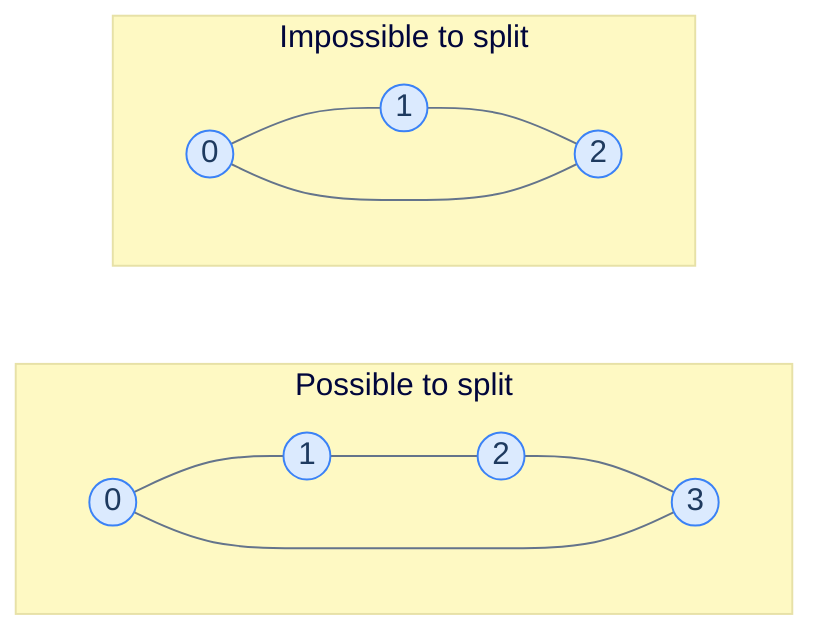

# 14. Pattern: Two colouring

This lesson teaches you the **two-colouring pattern** — the algorithm that decides "can the items in this graph be split into two camps such that every edge crosses the divide?" It's the test for **bipartiteness**, and a workhorse for problems involving conflicts, factions, or alternation.

## Table of contents

1. [The two-camps question](#the-two-camps-question)
2. [Two-colourable = bipartite](#two-colourable--bipartite)
3. [The colouring algorithm](#the-colouring-algorithm)
4. [Implementation](#implementation)
5. [Problem: Two colourable](#problem-two-colourable)
6. [Problem: Dislike pairs](#problem-dislike-pairs)
7. [Problem: Colour repair](#problem-colour-repair)

***

# The Two-Camps Question

You have a group of people, and a list of **dislike** pairs — pairs that *cannot* sit at the same table. You have only **two** tables. Can you seat everyone such that no two enemies share a table?



<p align="center"><strong>The 4-cycle on the left can be 2-coloured: {0, 2} red, {1, 3} blue. The 3-cycle on the right cannot — every assignment of colours forces *some* edge to have same-coloured endpoints.</strong></p>

The pattern shows up wherever you need to detect **antagonism** or **alternation**:

- **Conflict groups.** Can these students be assigned to two project teams so no two who dislike each other are paired?
- **Bipartite verification.** Is this assignment-style problem actually bipartite?
- **Chess-board colouring.** Can these tiles be painted black/white so no adjacent pair is same-coloured?
- **Job scheduling.** Can these jobs be split between two machines so no conflicting jobs run on the same one?
- **Network analysis.** Are these nodes really in two factions, or do internal conflicts make that decomposition impossible?

> *Before reading on — for the 4-cycle above, walk the colouring by hand: start with 0 = red. What must the other three colours be? Which edge is the "tightest"?*

Starting with 0 = red, then 1 must be blue (edge 0-1). Then 2 must be red (edge 1-2). Then 3 must be blue (edge 2-3). Now the closing edge: 3-0 = blue-red. ✓ All edges have opposite-coloured endpoints. Two-colourable.

For the 3-cycle: 0 = red, 1 = blue, 2 must be red (edge 1-2 forces opposite of blue). But edge 2-0: red-red. ✗ Conflict. Not two-colourable.

***

# Two-Colourable = Bipartite

A graph is **two-colourable** if and only if it is **bipartite**. The two terms describe the same property from different angles:

- **Two-colourable** is the algorithmic phrasing: "can I assign one of two labels to each node so adjacent labels differ?"
- **Bipartite** is the structural phrasing: "can the nodes be split into two sets `L` and `R` such that every edge crosses between sets?"

If you can two-colour, just declare "all reds = L, all blues = R" — the colour boundaries become the bipartition. Conversely, if the graph is bipartite, paint `L` red and `R` blue and you have a valid two-colouring.

Both views matter. The two-colour view drives the *algorithm*; the bipartite view drives the *application* (matching, network flow, …).

A famous theorem nails down when two-colouring works:

> **Theorem.** A graph is two-colourable if and only if it has no **odd-length cycle**.

The intuition: walking around an odd cycle, you flip the colour at each step, and after an odd number of flips you arrive back at the start with the *opposite* colour to where you began — a contradiction. Walking an even cycle returns you to the starting colour, no conflict. The 3-cycle above is a tiny version of this argument; any odd cycle, of any length, breaks colouring.

***

# The Colouring Algorithm

Use any traversal — DFS or BFS — and assign a colour at every step. The first node gets colour 0; every neighbour gets colour 1; their neighbours colour 0; and so on, alternating with depth.

The trick is the *check*: when you encounter a *visited* neighbour, verify that its colour is the *opposite* of the current node's. If not, it's a conflict, and the graph isn't two-colourable.

> **`colourGraph(node, graph, colour, colourValue)`**
> 1. `colour[node] = colourValue`
> 2. For each `neighbour` in `graph[node]`:
>    - If `neighbour` is uncoloured: recursively call with `1 - colourValue`. If the recursion returns false, return false.
>    - Else if `colour[neighbour] == colourValue` → return false (same-colour conflict).
> 3. Return true.
>
> **`isTwoColourable(graph)`**
> 1. Initialise `colour` map (empty).
> 2. For each unconnected component (= each uncoloured node): call `colourGraph` starting with colour 0. Return false if any component fails.
> 3. Return true.

The outer-loop wrapper handles disconnected graphs — a graph can have multiple components, each individually 2-colourable. We need *all* of them to succeed.

> *Before reading on — what does the algorithm look like with BFS instead of DFS? Sketch the change in one sentence.*

With BFS: maintain a queue, push the source with colour 0, pop nodes, paint each neighbour the opposite colour and push it. The conflict check is the same. The choice between DFS and BFS doesn't matter for correctness; both walk every component and propagate the colour rule.

***

# Implementation

We'll use DFS — it's slightly more compact recursively. Colour values are 0 and 1 (or `false`/`true`); flipping is `1 - colour` (or `!colour`).

```python run
from typing import List, Dict

class Solution:
    def colour_graph(self,
                     graph: List[List[int]],
                     node: int,
                     colour: Dict[int, int],
                     colour_value: int) -> bool:
        colour[node] = colour_value
        for neighbour in graph[node]:
            if neighbour not in colour:
                # Flip the colour for the next layer.
                if not self.colour_graph(graph, neighbour, colour, 1 - colour_value):
                    return False
            elif colour[neighbour] == colour_value:
                # Same colour on both endpoints of an edge → not bipartite.
                return False
        return True

    def is_two_colourable(self, graph: List[List[int]]) -> bool:
        colour: Dict[int, int] = {}
        for node in range(len(graph)):
            if node not in colour:
                if not self.colour_graph(graph, node, colour, 0):
                    return False
        return True


print(Solution().is_two_colourable([[1, 3], [0, 2], [1, 3], [0, 2]]))   # True
print(Solution().is_two_colourable([[1, 2], [0, 2], [0, 1]]))           # False (triangle)
```

```java run
import java.util.*;

public class Main {
    static class Solution {
        public boolean colourGraph(List<List<Integer>> graph, int node,
                                   Map<Integer, Integer> colour, int value) {
            colour.put(node, value);
            for (int n : graph.get(node)) {
                if (!colour.containsKey(n)) {
                    if (!colourGraph(graph, n, colour, 1 - value)) return false;
                } else if (colour.get(n) == value) {
                    return false;
                }
            }
            return true;
        }

        public boolean isTwoColourable(List<List<Integer>> graph) {
            Map<Integer, Integer> colour = new HashMap<>();
            for (int node = 0; node < graph.size(); node++) {
                if (!colour.containsKey(node))
                    if (!colourGraph(graph, node, colour, 0)) return false;
            }
            return true;
        }
    }

    public static void main(String[] args) {
        var g1 = List.of(List.of(1, 3), List.of(0, 2), List.of(1, 3), List.of(0, 2));
        var g2 = List.of(List.of(1, 2), List.of(0, 2), List.of(0, 1));
        System.out.println(new Solution().isTwoColourable(g1));
        System.out.println(new Solution().isTwoColourable(g2));
    }
}
```

```c run
#include <stdio.h>
#include <stdlib.h>
#include <stdbool.h>

#define UNCOLOURED -1

typedef struct { int* data; int size; } AdjList;

static bool colour_graph(AdjList* graph, int node, int* colour, int value) {
    colour[node] = value;
    for (int i = 0; i < graph[node].size; i++) {
        int n = graph[node].data[i];
        if (colour[n] == UNCOLOURED) {
            if (!colour_graph(graph, n, colour, 1 - value)) return false;
        } else if (colour[n] == value) {
            return false;
        }
    }
    return true;
}

bool is_two_colourable(AdjList* graph, int n) {
    int* colour = malloc(n * sizeof(int));
    for (int i = 0; i < n; i++) colour[i] = UNCOLOURED;
    bool result = true;
    for (int node = 0; node < n; node++) {
        if (colour[node] == UNCOLOURED && !colour_graph(graph, node, colour, 0)) {
            result = false; break;
        }
    }
    free(colour);
    return result;
}

int main() {
    int g0[]={1,3}, g1[]={0,2}, g2[]={1,3}, g3[]={0,2};
    AdjList g[]={{g0,2},{g1,2},{g2,2},{g3,2}};
    printf("%s\n", is_two_colourable(g, 4) ? "true" : "false");
    int t0[]={1,2}, t1[]={0,2}, t2[]={0,1};
    AdjList t[]={{t0,2},{t1,2},{t2,2}};
    printf("%s\n", is_two_colourable(t, 3) ? "true" : "false");
    return 0;
}
```

```cpp run
#include <iostream>
#include <vector>
#include <unordered_map>

class Solution {
public:
    bool colourGraph(std::vector<std::vector<int>>& graph, int node,
                     std::unordered_map<int, int>& colour, int value) {
        colour[node] = value;
        for (int n : graph[node]) {
            if (colour.find(n) == colour.end()) {
                if (!colourGraph(graph, n, colour, 1 - value)) return false;
            } else if (colour[n] == value) {
                return false;
            }
        }
        return true;
    }

    bool isTwoColourable(std::vector<std::vector<int>>& graph) {
        std::unordered_map<int, int> colour;
        for (int node = 0; node < (int)graph.size(); node++) {
            if (colour.find(node) == colour.end())
                if (!colourGraph(graph, node, colour, 0)) return false;
        }
        return true;
    }
};

int main() {
    std::vector<std::vector<int>> g1 = {{1, 3}, {0, 2}, {1, 3}, {0, 2}};
    std::vector<std::vector<int>> g2 = {{1, 2}, {0, 2}, {0, 1}};
    std::cout << std::boolalpha << Solution().isTwoColourable(g1) << "\n";
    std::cout << std::boolalpha << Solution().isTwoColourable(g2) << "\n";
}
```

```scala run
import scala.collection.mutable

object Main extends App {
  class Solution {
    def colourGraph(graph: Array[Array[Int]], node: Int,
                    colour: mutable.Map[Int, Int], value: Int): Boolean = {
      colour(node) = value
      for (n <- graph(node)) {
        if (!colour.contains(n)) {
          if (!colourGraph(graph, n, colour, 1 - value)) return false
        } else if (colour(n) == value) {
          return false
        }
      }
      true
    }

    def isTwoColourable(graph: Array[Array[Int]]): Boolean = {
      val colour = mutable.Map.empty[Int, Int]
      for (node <- graph.indices) {
        if (!colour.contains(node))
          if (!colourGraph(graph, node, colour, 0)) return false
      }
      true
    }
  }

  println(new Solution().isTwoColourable(Array(Array(1, 3), Array(0, 2), Array(1, 3), Array(0, 2))))
  println(new Solution().isTwoColourable(Array(Array(1, 2), Array(0, 2), Array(0, 1))))
}
```

```javascript run
class Solution {
    colourGraph(graph, node, colour, value) {
        colour.set(node, value);
        for (const n of graph[node]) {
            if (!colour.has(n)) {
                if (!this.colourGraph(graph, n, colour, 1 - value)) return false;
            } else if (colour.get(n) === value) {
                return false;
            }
        }
        return true;
    }

    isTwoColourable(graph) {
        const colour = new Map();
        for (let node = 0; node < graph.length; node++) {
            if (!colour.has(node))
                if (!this.colourGraph(graph, node, colour, 0)) return false;
        }
        return true;
    }
}

console.log(new Solution().isTwoColourable([[1, 3], [0, 2], [1, 3], [0, 2]]));
console.log(new Solution().isTwoColourable([[1, 2], [0, 2], [0, 1]]));
```

```typescript run
class Solution {
    colourGraph(graph: number[][], node: number, colour: Map<number, number>, value: number): boolean {
        colour.set(node, value);
        for (const n of graph[node]) {
            if (!colour.has(n)) {
                if (!this.colourGraph(graph, n, colour, 1 - value)) return false;
            } else if (colour.get(n) === value) {
                return false;
            }
        }
        return true;
    }

    isTwoColourable(graph: number[][]): boolean {
        const colour = new Map<number, number>();
        for (let node = 0; node < graph.length; node++) {
            if (!colour.has(node))
                if (!this.colourGraph(graph, node, colour, 0)) return false;
        }
        return true;
    }
}

console.log(new Solution().isTwoColourable([[1, 3], [0, 2], [1, 3], [0, 2]]));
console.log(new Solution().isTwoColourable([[1, 2], [0, 2], [0, 1]]));
```

```go run
package main

import "fmt"

func colourGraph(graph [][]int, node int, colour map[int]int, value int) bool {
    colour[node] = value
    for _, n := range graph[node] {
        if _, ok := colour[n]; !ok {
            if !colourGraph(graph, n, colour, 1-value) {
                return false
            }
        } else if colour[n] == value {
            return false
        }
    }
    return true
}

func isTwoColourable(graph [][]int) bool {
    colour := map[int]int{}
    for node := 0; node < len(graph); node++ {
        if _, ok := colour[node]; !ok {
            if !colourGraph(graph, node, colour, 0) {
                return false
            }
        }
    }
    return true
}

func main() {
    fmt.Println(isTwoColourable([][]int{{1, 3}, {0, 2}, {1, 3}, {0, 2}}))
    fmt.Println(isTwoColourable([][]int{{1, 2}, {0, 2}, {0, 1}}))
}
```

```kotlin run
class Solution {
    fun colourGraph(graph: List<List<Int>>, node: Int,
                    colour: MutableMap<Int, Int>, value: Int): Boolean {
        colour[node] = value
        for (n in graph[node]) {
            if (n !in colour) {
                if (!colourGraph(graph, n, colour, 1 - value)) return false
            } else if (colour[n] == value) {
                return false
            }
        }
        return true
    }

    fun isTwoColourable(graph: List<List<Int>>): Boolean {
        val colour = mutableMapOf<Int, Int>()
        for (node in graph.indices) {
            if (node !in colour)
                if (!colourGraph(graph, node, colour, 0)) return false
        }
        return true
    }
}

fun main() {
    println(Solution().isTwoColourable(listOf(listOf(1, 3), listOf(0, 2), listOf(1, 3), listOf(0, 2))))
    println(Solution().isTwoColourable(listOf(listOf(1, 2), listOf(0, 2), listOf(0, 1))))
}
```

```rust run
use std::collections::HashMap;

fn colour_graph(graph: &[Vec<usize>], node: usize, colour: &mut HashMap<usize, i32>, value: i32) -> bool {
    colour.insert(node, value);
    for &n in &graph[node] {
        if !colour.contains_key(&n) {
            if !colour_graph(graph, n, colour, 1 - value) { return false; }
        } else if colour[&n] == value {
            return false;
        }
    }
    true
}

fn is_two_colourable(graph: &[Vec<usize>]) -> bool {
    let mut colour: HashMap<usize, i32> = HashMap::new();
    for node in 0..graph.len() {
        if !colour.contains_key(&node) && !colour_graph(graph, node, &mut colour, 0) {
            return false;
        }
    }
    true
}

fn main() {
    let g1: Vec<Vec<usize>> = vec![vec![1, 3], vec![0, 2], vec![1, 3], vec![0, 2]];
    let g2: Vec<Vec<usize>> = vec![vec![1, 2], vec![0, 2], vec![0, 1]];
    println!("{}", is_two_colourable(&g1));
    println!("{}", is_two_colourable(&g2));
}
```


## Complexity Analysis

| | Complexity | Reasoning |
|---|---|---|
| **Time** | O(N + E) | Each node coloured once; each edge inspected once |
| **Space** | O(N) | Colour map + recursion stack |

The pattern is as cheap as a plain DFS — adding the colour check costs O(1) per edge.

***

# Problem: Two Colourable

The example above is the canonical version. Same code as the implementation; same complexity.

***

# Problem: Dislike Pairs

## The Problem

`N` people, a list of `dislikes` pairs. Can the people be split into two groups such that no two who dislike each other end up in the same group?

```
Input:  N = 4, dislikes = [[1, 3], [0, 2], [1, 3], [0, 2]]
Output: true (groups {0, 2} and {1, 3})

Input:  N = 3, dislikes = [[0, 1], [1, 2], [2, 0]]
Output: false (3-cycle of dislikes)
```

## Pattern Mapping

This is *literally* two-colourable in disguise:

- People = nodes.
- Dislike pairs = edges.
- "Same group" = same colour.
- "No same-group dislikes" = no same-colour edge endpoints.

Build the adjacency list from the dislikes list (undirected — both directions), then run two-colouring.

> *Before reading on — why is the dislikes graph **undirected**? What would change if we were told "A dislikes B but B's feelings toward A aren't given"?*

Dislikes here are mutual: if A dislikes B, the conflict is the same as if B dislikes A. The graph is undirected. If the dislikes were one-way, you could *still* use this same algorithm — antagonism in a graph is asymmetric only when one side feels it, but the *seating constraint* ("don't put them together") is symmetric. So even a directed-dislikes input would be solved by treating each edge as undirected.

The implementation just adds an edge-list-to-adjacency-list build step in front of the colouring code:

```python run
from typing import List

class Solution:
    def colour_graph(self, graph, node, colour, value):
        colour[node] = value
        for neighbour in graph[node]:
            if neighbour not in colour:
                if not self.colour_graph(graph, neighbour, colour, 1 - value):
                    return False
            elif colour[neighbour] == value:
                return False
        return True

    def dislike_pairs(self, n: int, dislikes: List[List[int]]) -> bool:
        # Build adjacency list — dislikes are mutual, so add both directions.
        graph: List[List[int]] = [[] for _ in range(n)]
        for a, b in dislikes:
            graph[a].append(b)
            graph[b].append(a)

        colour: dict = {}
        for node in range(n):
            if node not in colour:
                if not self.colour_graph(graph, node, colour, 0):
                    return False
        return True


print(Solution().dislike_pairs(4, [[1, 3], [0, 2], [1, 3], [0, 2]]))   # True
print(Solution().dislike_pairs(3, [[0, 1], [1, 2], [2, 0]]))           # False
```

```java run
import java.util.*;

public class Main {
    static class Solution {
        boolean colourGraph(List<List<Integer>> graph, int node,
                            Map<Integer, Integer> colour, int value) {
            colour.put(node, value);
            for (int n : graph.get(node)) {
                if (!colour.containsKey(n)) {
                    if (!colourGraph(graph, n, colour, 1 - value)) return false;
                } else if (colour.get(n) == value) return false;
            }
            return true;
        }

        public boolean dislikePairs(int n, int[][] dislikes) {
            List<List<Integer>> graph = new ArrayList<>();
            for (int i = 0; i < n; i++) graph.add(new ArrayList<>());
            for (int[] d : dislikes) {
                graph.get(d[0]).add(d[1]);
                graph.get(d[1]).add(d[0]);
            }
            Map<Integer, Integer> colour = new HashMap<>();
            for (int node = 0; node < n; node++) {
                if (!colour.containsKey(node))
                    if (!colourGraph(graph, node, colour, 0)) return false;
            }
            return true;
        }
    }

    public static void main(String[] args) {
        System.out.println(new Solution().dislikePairs(4,
            new int[][]{{1, 3}, {0, 2}, {1, 3}, {0, 2}}));
        System.out.println(new Solution().dislikePairs(3,
            new int[][]{{0, 1}, {1, 2}, {2, 0}}));
    }
}
```

```c run
#include <stdio.h>
#include <stdlib.h>
#include <stdbool.h>

#define UNCOLOURED -1

typedef struct { int* data; int size; int capacity; } Vec;

static void vec_push(Vec* v, int x) {
    if (v->size == v->capacity) {
        v->capacity = v->capacity ? v->capacity * 2 : 4;
        v->data = realloc(v->data, v->capacity * sizeof(int));
    }
    v->data[v->size++] = x;
}

static bool colour_graph(Vec* g, int node, int* colour, int value) {
    colour[node] = value;
    for (int i = 0; i < g[node].size; i++) {
        int n = g[node].data[i];
        if (colour[n] == UNCOLOURED) {
            if (!colour_graph(g, n, colour, 1 - value)) return false;
        } else if (colour[n] == value) return false;
    }
    return true;
}

bool dislike_pairs(int n, int dislikes[][2], int dn) {
    Vec* graph = calloc(n, sizeof(Vec));
    for (int i = 0; i < dn; i++) {
        vec_push(&graph[dislikes[i][0]], dislikes[i][1]);
        vec_push(&graph[dislikes[i][1]], dislikes[i][0]);
    }
    int* colour = malloc(n * sizeof(int));
    for (int i = 0; i < n; i++) colour[i] = UNCOLOURED;
    bool ok = true;
    for (int node = 0; node < n; node++) {
        if (colour[node] == UNCOLOURED && !colour_graph(graph, node, colour, 0)) {
            ok = false; break;
        }
    }
    for (int i = 0; i < n; i++) free(graph[i].data);
    free(graph); free(colour);
    return ok;
}

int main() {
    int d1[][2] = {{1,3},{0,2},{1,3},{0,2}};
    int d2[][2] = {{0,1},{1,2},{2,0}};
    printf("%s\n", dislike_pairs(4, d1, 4) ? "true" : "false");
    printf("%s\n", dislike_pairs(3, d2, 3) ? "true" : "false");
    return 0;
}
```

```cpp run
#include <iostream>
#include <vector>
#include <unordered_map>

class Solution {
public:
    bool colourGraph(std::vector<std::vector<int>>& g, int node,
                     std::unordered_map<int, int>& colour, int value) {
        colour[node] = value;
        for (int n : g[node]) {
            if (colour.find(n) == colour.end()) {
                if (!colourGraph(g, n, colour, 1 - value)) return false;
            } else if (colour[n] == value) return false;
        }
        return true;
    }

    bool dislikePairs(int n, std::vector<std::vector<int>>& dislikes) {
        std::vector<std::vector<int>> g(n);
        for (auto& d : dislikes) { g[d[0]].push_back(d[1]); g[d[1]].push_back(d[0]); }
        std::unordered_map<int, int> colour;
        for (int node = 0; node < n; node++) {
            if (colour.find(node) == colour.end())
                if (!colourGraph(g, node, colour, 0)) return false;
        }
        return true;
    }
};

int main() {
    std::vector<std::vector<int>> d1 = {{1,3},{0,2},{1,3},{0,2}};
    std::vector<std::vector<int>> d2 = {{0,1},{1,2},{2,0}};
    std::cout << std::boolalpha << Solution().dislikePairs(4, d1) << "\n";
    std::cout << std::boolalpha << Solution().dislikePairs(3, d2) << "\n";
}
```

```scala run
import scala.collection.mutable

object Main extends App {
  class Solution {
    def colourGraph(g: Array[mutable.ArrayBuffer[Int]], node: Int,
                    colour: mutable.Map[Int, Int], value: Int): Boolean = {
      colour(node) = value
      for (n <- g(node)) {
        if (!colour.contains(n)) {
          if (!colourGraph(g, n, colour, 1 - value)) return false
        } else if (colour(n) == value) return false
      }
      true
    }

    def dislikePairs(n: Int, dislikes: Array[Array[Int]]): Boolean = {
      val g = Array.fill(n)(mutable.ArrayBuffer.empty[Int])
      for (d <- dislikes) { g(d(0)).append(d(1)); g(d(1)).append(d(0)) }
      val colour = mutable.Map.empty[Int, Int]
      for (node <- 0 until n if !colour.contains(node))
        if (!colourGraph(g, node, colour, 0)) return false
      true
    }
  }

  println(new Solution().dislikePairs(4, Array(Array(1,3), Array(0,2), Array(1,3), Array(0,2))))
  println(new Solution().dislikePairs(3, Array(Array(0,1), Array(1,2), Array(2,0))))
}
```

```javascript run
class Solution {
    colourGraph(g, node, colour, value) {
        colour.set(node, value);
        for (const n of g[node]) {
            if (!colour.has(n)) {
                if (!this.colourGraph(g, n, colour, 1 - value)) return false;
            } else if (colour.get(n) === value) return false;
        }
        return true;
    }

    dislikePairs(n, dislikes) {
        const g = Array.from({length: n}, () => []);
        for (const [a, b] of dislikes) { g[a].push(b); g[b].push(a); }
        const colour = new Map();
        for (let node = 0; node < n; node++) {
            if (!colour.has(node))
                if (!this.colourGraph(g, node, colour, 0)) return false;
        }
        return true;
    }
}

console.log(new Solution().dislikePairs(4, [[1, 3], [0, 2], [1, 3], [0, 2]]));
console.log(new Solution().dislikePairs(3, [[0, 1], [1, 2], [2, 0]]));
```

```typescript run
class Solution {
    colourGraph(g: number[][], node: number, colour: Map<number, number>, value: number): boolean {
        colour.set(node, value);
        for (const n of g[node]) {
            if (!colour.has(n)) {
                if (!this.colourGraph(g, n, colour, 1 - value)) return false;
            } else if (colour.get(n) === value) return false;
        }
        return true;
    }

    dislikePairs(n: number, dislikes: number[][]): boolean {
        const g: number[][] = Array.from({length: n}, () => []);
        for (const [a, b] of dislikes) { g[a].push(b); g[b].push(a); }
        const colour = new Map<number, number>();
        for (let node = 0; node < n; node++) {
            if (!colour.has(node))
                if (!this.colourGraph(g, node, colour, 0)) return false;
        }
        return true;
    }
}

console.log(new Solution().dislikePairs(4, [[1, 3], [0, 2], [1, 3], [0, 2]]));
console.log(new Solution().dislikePairs(3, [[0, 1], [1, 2], [2, 0]]));
```

```go run
package main

import "fmt"

func colourGraphDP(g [][]int, node int, colour map[int]int, value int) bool {
    colour[node] = value
    for _, n := range g[node] {
        if _, ok := colour[n]; !ok {
            if !colourGraphDP(g, n, colour, 1-value) {
                return false
            }
        } else if colour[n] == value {
            return false
        }
    }
    return true
}

func dislikePairs(n int, dislikes [][2]int) bool {
    g := make([][]int, n)
    for _, d := range dislikes {
        g[d[0]] = append(g[d[0]], d[1])
        g[d[1]] = append(g[d[1]], d[0])
    }
    colour := map[int]int{}
    for node := 0; node < n; node++ {
        if _, ok := colour[node]; !ok {
            if !colourGraphDP(g, node, colour, 0) {
                return false
            }
        }
    }
    return true
}

func main() {
    fmt.Println(dislikePairs(4, [][2]int{{1, 3}, {0, 2}, {1, 3}, {0, 2}}))
    fmt.Println(dislikePairs(3, [][2]int{{0, 1}, {1, 2}, {2, 0}}))
}
```

```kotlin run
class Solution {
    fun colourGraph(g: Array<MutableList<Int>>, node: Int,
                    colour: MutableMap<Int, Int>, value: Int): Boolean {
        colour[node] = value
        for (n in g[node]) {
            if (n !in colour) {
                if (!colourGraph(g, n, colour, 1 - value)) return false
            } else if (colour[n] == value) return false
        }
        return true
    }

    fun dislikePairs(n: Int, dislikes: Array<IntArray>): Boolean {
        val g = Array(n) { mutableListOf<Int>() }
        for (d in dislikes) { g[d[0]].add(d[1]); g[d[1]].add(d[0]) }
        val colour = mutableMapOf<Int, Int>()
        for (node in 0 until n) {
            if (node !in colour) if (!colourGraph(g, node, colour, 0)) return false
        }
        return true
    }
}

fun main() {
    println(Solution().dislikePairs(4, arrayOf(intArrayOf(1, 3), intArrayOf(0, 2),
                                                intArrayOf(1, 3), intArrayOf(0, 2))))
    println(Solution().dislikePairs(3, arrayOf(intArrayOf(0, 1), intArrayOf(1, 2),
                                                intArrayOf(2, 0))))
}
```

```rust run
use std::collections::HashMap;

fn colour_graph(g: &[Vec<usize>], node: usize, colour: &mut HashMap<usize, i32>, value: i32) -> bool {
    colour.insert(node, value);
    for &n in &g[node] {
        if !colour.contains_key(&n) {
            if !colour_graph(g, n, colour, 1 - value) { return false; }
        } else if colour[&n] == value { return false; }
    }
    true
}

fn dislike_pairs(n: usize, dislikes: &[[usize; 2]]) -> bool {
    let mut g: Vec<Vec<usize>> = vec![Vec::new(); n];
    for d in dislikes {
        g[d[0]].push(d[1]);
        g[d[1]].push(d[0]);
    }
    let mut colour: HashMap<usize, i32> = HashMap::new();
    for node in 0..n {
        if !colour.contains_key(&node) && !colour_graph(&g, node, &mut colour, 0) {
            return false;
        }
    }
    true
}

fn main() {
    println!("{}", dislike_pairs(4, &[[1, 3], [0, 2], [1, 3], [0, 2]]));
    println!("{}", dislike_pairs(3, &[[0, 1], [1, 2], [2, 0]]));
}
```


***

# Problem: Colour Repair

## The Problem

A graph that's *almost* two-colourable: it can be made bipartite by removing **at most one** edge. Return `true` if so, `false` otherwise.

```
Input:  graph = [[1, 3], [0, 2, 3], [1, 3], [0, 1, 2]]
Output: true (remove edge 1-3)
```

## Pattern Mapping

The trick: instead of returning `false` immediately at a colour conflict, **record the conflicting edge** and keep colouring. At the end, count distinct conflicts:

- 0 conflicts → already two-colourable; trivially repairable.
- 1 conflict → removing that one edge restores bipartiteness.
- 2+ conflicts → can't be fixed with a single edge removal.

Because the graph is undirected, each conflict edge gets recorded twice (once from each endpoint). Divide the count by 2 to get distinct conflicts.

## The Solution

```python run
from typing import List, Tuple

class Solution:
    def colour_graph(self,
                     graph: List[List[int]],
                     node: int,
                     colour: dict,
                     value: int,
                     conflicts: List[Tuple[int, int]]) -> None:
        colour[node] = value
        for neighbour in graph[node]:
            if neighbour not in colour:
                self.colour_graph(graph, neighbour, colour, 1 - value, conflicts)
            elif colour[neighbour] == value:
                # Don't bail — record the conflict edge and keep going.
                conflicts.append((node, neighbour))

    def colour_repair(self, graph: List[List[int]]) -> bool:
        colour: dict = {}
        conflicts: List[Tuple[int, int]] = []
        for node in range(len(graph)):
            if node not in colour:
                self.colour_graph(graph, node, colour, 0, conflicts)
        # Each conflict edge gets recorded twice in undirected graphs.
        return len(conflicts) // 2 <= 1


print(Solution().colour_repair([[1, 3], [0, 2, 3], [1, 3], [0, 1, 2]]))     # True
print(Solution().colour_repair([[1, 2, 3], [0, 2], [0, 1], [0]]))           # True
```

```java run
import java.util.*;

public class Main {
    static class Solution {
        public void colourGraph(List<List<Integer>> graph, int node,
                                Map<Integer, Integer> colour, int value, List<int[]> conflicts) {
            colour.put(node, value);
            for (int n : graph.get(node)) {
                if (!colour.containsKey(n)) colourGraph(graph, n, colour, 1 - value, conflicts);
                else if (colour.get(n) == value) conflicts.add(new int[]{node, n});
            }
        }

        public boolean colourRepair(List<List<Integer>> graph) {
            Map<Integer, Integer> colour = new HashMap<>();
            List<int[]> conflicts = new ArrayList<>();
            for (int node = 0; node < graph.size(); node++)
                if (!colour.containsKey(node)) colourGraph(graph, node, colour, 0, conflicts);
            return conflicts.size() / 2 <= 1;
        }
    }

    public static void main(String[] args) {
        var g = List.of(List.of(1, 3), List.of(0, 2, 3), List.of(1, 3), List.of(0, 1, 2));
        System.out.println(new Solution().colourRepair(g));
    }
}
```

```c run
#include <stdio.h>
#include <stdlib.h>
#include <stdbool.h>

#define UNCOLOURED -1

typedef struct { int* data; int size; } AdjList;

static int conflict_count = 0;

static void colour_graph(AdjList* g, int node, int* colour, int value) {
    colour[node] = value;
    for (int i = 0; i < g[node].size; i++) {
        int n = g[node].data[i];
        if (colour[n] == UNCOLOURED) colour_graph(g, n, colour, 1 - value);
        else if (colour[n] == value) conflict_count++;
    }
}

bool colour_repair(AdjList* g, int n) {
    int* colour = malloc(n * sizeof(int));
    for (int i = 0; i < n; i++) colour[i] = UNCOLOURED;
    conflict_count = 0;
    for (int node = 0; node < n; node++) {
        if (colour[node] == UNCOLOURED) colour_graph(g, node, colour, 0);
    }
    free(colour);
    return conflict_count / 2 <= 1;
}

int main() {
    int g0[]={1,3}, g1[]={0,2,3}, g2[]={1,3}, g3[]={0,1,2};
    AdjList g[]={{g0,2},{g1,3},{g2,2},{g3,3}};
    printf("%s\n", colour_repair(g, 4) ? "true" : "false");
    return 0;
}
```

```cpp run
#include <iostream>
#include <vector>
#include <unordered_map>

class Solution {
public:
    void colourGraph(std::vector<std::vector<int>>& g, int node,
                     std::unordered_map<int, int>& colour, int value,
                     std::vector<std::pair<int, int>>& conflicts) {
        colour[node] = value;
        for (int n : g[node]) {
            if (colour.find(n) == colour.end()) colourGraph(g, n, colour, 1 - value, conflicts);
            else if (colour[n] == value) conflicts.emplace_back(node, n);
        }
    }

    bool colourRepair(std::vector<std::vector<int>>& g) {
        std::unordered_map<int, int> colour;
        std::vector<std::pair<int, int>> conflicts;
        for (int node = 0; node < (int)g.size(); node++)
            if (colour.find(node) == colour.end()) colourGraph(g, node, colour, 0, conflicts);
        return (int)conflicts.size() / 2 <= 1;
    }
};

int main() {
    std::vector<std::vector<int>> g = {{1, 3}, {0, 2, 3}, {1, 3}, {0, 1, 2}};
    std::cout << std::boolalpha << Solution().colourRepair(g) << "\n";
}
```

```scala run
import scala.collection.mutable

object Main extends App {
  class Solution {
    def colourGraph(g: Array[Array[Int]], node: Int,
                    colour: mutable.Map[Int, Int], value: Int,
                    conflicts: mutable.ArrayBuffer[(Int, Int)]): Unit = {
      colour(node) = value
      for (n <- g(node)) {
        if (!colour.contains(n)) colourGraph(g, n, colour, 1 - value, conflicts)
        else if (colour(n) == value) conflicts.append((node, n))
      }
    }

    def colourRepair(g: Array[Array[Int]]): Boolean = {
      val colour = mutable.Map.empty[Int, Int]
      val conflicts = mutable.ArrayBuffer.empty[(Int, Int)]
      for (node <- g.indices if !colour.contains(node))
        colourGraph(g, node, colour, 0, conflicts)
      conflicts.length / 2 <= 1
    }
  }

  val g = Array(Array(1, 3), Array(0, 2, 3), Array(1, 3), Array(0, 1, 2))
  println(new Solution().colourRepair(g))
}
```

```javascript run
class Solution {
    colourGraph(g, node, colour, value, conflicts) {
        colour.set(node, value);
        for (const n of g[node]) {
            if (!colour.has(n)) this.colourGraph(g, n, colour, 1 - value, conflicts);
            else if (colour.get(n) === value) conflicts.push([node, n]);
        }
    }

    colourRepair(g) {
        const colour = new Map();
        const conflicts = [];
        for (let node = 0; node < g.length; node++)
            if (!colour.has(node)) this.colourGraph(g, node, colour, 0, conflicts);
        return Math.floor(conflicts.length / 2) <= 1;
    }
}

console.log(new Solution().colourRepair([[1, 3], [0, 2, 3], [1, 3], [0, 1, 2]]));
```

```typescript run
class Solution {
    colourGraph(g: number[][], node: number, colour: Map<number, number>,
                value: number, conflicts: [number, number][]): void {
        colour.set(node, value);
        for (const n of g[node]) {
            if (!colour.has(n)) this.colourGraph(g, n, colour, 1 - value, conflicts);
            else if (colour.get(n) === value) conflicts.push([node, n]);
        }
    }

    colourRepair(g: number[][]): boolean {
        const colour = new Map<number, number>();
        const conflicts: [number, number][] = [];
        for (let node = 0; node < g.length; node++)
            if (!colour.has(node)) this.colourGraph(g, node, colour, 0, conflicts);
        return Math.floor(conflicts.length / 2) <= 1;
    }
}

console.log(new Solution().colourRepair([[1, 3], [0, 2, 3], [1, 3], [0, 1, 2]]));
```

```go run
package main

import "fmt"

func colourGraphCR(g [][]int, node int, colour map[int]int, value int, conflicts *[][2]int) {
    colour[node] = value
    for _, n := range g[node] {
        if _, ok := colour[n]; !ok {
            colourGraphCR(g, n, colour, 1-value, conflicts)
        } else if colour[n] == value {
            *conflicts = append(*conflicts, [2]int{node, n})
        }
    }
}

func colourRepair(g [][]int) bool {
    colour := map[int]int{}
    conflicts := [][2]int{}
    for node := 0; node < len(g); node++ {
        if _, ok := colour[node]; !ok {
            colourGraphCR(g, node, colour, 0, &conflicts)
        }
    }
    return len(conflicts)/2 <= 1
}

func main() {
    fmt.Println(colourRepair([][]int{{1, 3}, {0, 2, 3}, {1, 3}, {0, 1, 2}}))
}
```

```kotlin run
class Solution {
    fun colourGraph(g: List<List<Int>>, node: Int,
                    colour: MutableMap<Int, Int>, value: Int,
                    conflicts: MutableList<Pair<Int, Int>>) {
        colour[node] = value
        for (n in g[node]) {
            if (n !in colour) colourGraph(g, n, colour, 1 - value, conflicts)
            else if (colour[n] == value) conflicts.add(node to n)
        }
    }

    fun colourRepair(g: List<List<Int>>): Boolean {
        val colour = mutableMapOf<Int, Int>()
        val conflicts = mutableListOf<Pair<Int, Int>>()
        for (node in g.indices)
            if (node !in colour) colourGraph(g, node, colour, 0, conflicts)
        return conflicts.size / 2 <= 1
    }
}

fun main() {
    println(Solution().colourRepair(listOf(listOf(1, 3), listOf(0, 2, 3), listOf(1, 3), listOf(0, 1, 2))))
}
```

```rust run
use std::collections::HashMap;

fn colour_graph(g: &[Vec<usize>], node: usize, colour: &mut HashMap<usize, i32>,
                value: i32, conflicts: &mut Vec<(usize, usize)>) {
    colour.insert(node, value);
    for &n in &g[node] {
        if !colour.contains_key(&n) {
            colour_graph(g, n, colour, 1 - value, conflicts);
        } else if colour[&n] == value {
            conflicts.push((node, n));
        }
    }
}

fn colour_repair(g: &[Vec<usize>]) -> bool {
    let mut colour: HashMap<usize, i32> = HashMap::new();
    let mut conflicts: Vec<(usize, usize)> = Vec::new();
    for node in 0..g.len() {
        if !colour.contains_key(&node) {
            colour_graph(g, node, &mut colour, 0, &mut conflicts);
        }
    }
    conflicts.len() / 2 <= 1
}

fn main() {
    let g: Vec<Vec<usize>> = vec![vec![1, 3], vec![0, 2, 3], vec![1, 3], vec![0, 1, 2]];
    println!("{}", colour_repair(&g));
}
```


---

## Final Takeaway

Two-colouring is a deceptively simple algorithm — alternate colours during DFS, conflict on same-colour adjacency — that decides one of the most fundamental properties of a graph: **bipartiteness**. Once you can compute it, an entire family of "split into two" problems becomes a 10-line function.

The key idea: **treat structural questions as colouring questions**. Whenever a problem asks *"can these be split into two camps?"*, *"is this an alternating arrangement?"*, *"can pairings avoid conflicts?"* — reach for two-colouring. If you can colour the graph, the structural property holds; if you find a conflict, it doesn't.

Two more pattern lessons remain — **shortest path with BFS** (the unweighted version) and **shortest path with Dijkstra** (the weighted version). They wrap algorithms you've already met into the pattern-recognition framework that makes them easy to deploy.

> **Transfer challenge.** A meeting room can host two parallel sessions. You have a list of "incompatible-session" pairs (because of overlapping speakers, shared equipment, etc.). Sketch how you'd decide whether you can schedule all sessions in two streams without conflicts.

<details>
<summary><strong>Sketch</strong></summary>

Build an undirected graph with sessions as nodes and incompatibility pairs as edges. Run two-colouring. If the graph is two-colourable, the colour assignment *is* the stream assignment — colour 0 = stream A, colour 1 = stream B. If not, you can't fit everything in two streams (you'd need more rooms or some sessions to be cancelled).

This is *literally* the dislike-pairs problem with sessions instead of people. Same algorithm, same code.

</details>
