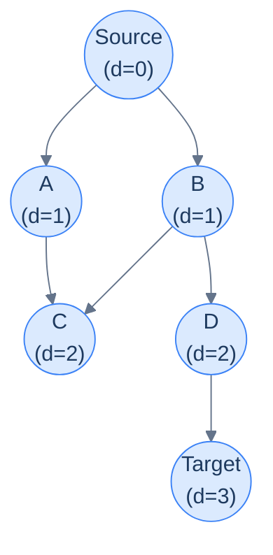
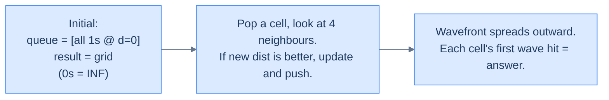

# 15. Pattern: Shortest path (Breadth-first search)

This lesson teaches you the **BFS-shortest-path pattern** — the recipe for any "minimum steps in an unweighted graph" problem. It's the cleanest, fastest path-finding pattern you have, and it works whenever every edge counts the same.

## Table of contents

1. [When BFS is the answer](#when-bfs-is-the-answer)
2. [The BFS shortest-path template](#the-bfs-shortest-path-template)
3. [Identifying the pattern](#identifying-the-pattern)
4. [Problem: Minimum steps in a grid](#problem-minimum-steps-in-a-grid)
5. [Problem: Nearest distance (multi-source BFS)](#problem-nearest-distance-multi-source-bfs)
6. [Problem: Shortest word transformation](#problem-shortest-word-transformation)

***

# When BFS Is the Answer

Earlier in the chapter you met BFS as a *traversal* — a way to visit every node ring-by-ring outward. That ring-by-ring property has a hidden superpower: **the depth at which BFS first encounters a node is exactly its shortest distance from the source** (in number of edges, not weighted distance).

That single fact turns BFS into the simplest, fastest algorithm for *unweighted* shortest-path problems. No priority queue, no relaxation, no clever proofs needed — the FIFO queue alone guarantees correctness.



<p align="center"><strong>BFS layers from the source. Every node's <code>d</code> value is its minimum number of hops from S. The first time BFS sees a node, that's the answer.</strong></p>

The pattern shows up wherever distance == hop-count:

- *"Minimum steps from start to end on an unweighted maze"*
- *"Number of moves from initial chess board state to checkmate"*
- *"Minimum word transformations connecting two dictionary words"*
- *"Closest restaurant within N hops"*
- *"Time for a flood/fire/infection to reach every cell"*
- *"Degrees of separation between two people in a network"*

For all of these, weight per edge is uniform (every step costs 1). BFS solves them in O(V + E).

> *Before reading on — for a 4-cycle 0–1–2–3, what's the shortest distance from 0 to 2? From 0 to 3?*

`0 → 2`: 2 hops (via 1 or via 3). `0 → 3`: 1 hop (direct edge). BFS would discover them in that order at depths 1 and 2 — the queue's FIFO order does the work for you.

***

# The BFS Shortest-Path Template

The plain BFS code is *almost* the pattern; we just need to (a) record distance, and (b) stop when we hit the target.

```
shortestPathBFS(graph, source, target):
    queue = [(source, 0)]
    visited = {source}
    while queue not empty:
        (node, dist) = queue.popleft()
        if node == target:
            return dist
        for neighbour in graph[node]:
            if neighbour not in visited:
                visited.add(neighbour)
                queue.push((neighbour, dist + 1))
    return -1   # target unreachable
```

Two important habits, lifted from the BFS lesson:

1. **Mark visited at PUSH time, not POP time.** A node could otherwise enter the queue multiple times via different parents, ballooning queue size and (worse) producing wrong answers in some variants.
2. **Carry the distance with each queue entry.** This avoids a separate `dist[]` array and makes the early-exit at the target trivial.

For grid problems, the graph is implicit and "neighbours" are computed via a 4- or 8-direction array — no adjacency list construction needed.

***

# Identifying the Pattern

Look for these signals in problem statements:

- *"Minimum number of steps / moves / changes / transformations"*
- *"Shortest path"* in an **unweighted** graph (no edge weights, or all weights are 1)
- *"Minimum jumps"*, *"fewest hops"*
- *"Time to reach every cell from a source"* (for spreading processes)
- The word **"BFS"** is *almost* a giveaway, but more useful is the implicit *"each move costs the same"*

If the problem includes weighted edges with varying costs, you're past BFS — that's Dijkstra (next lesson). If the problem asks for *all paths* rather than *shortest*, that's the DFS pattern.

***

# Problem: Minimum Steps in a Grid

## The Problem

In an N×M grid where `1` = walkable and `0` = wall, find the minimum number of cardinal-direction moves from `(0, 0)` to `(N-1, M-1)`. Return -1 if no path exists.

```
Input:  grid = [[1, 0, 1, 1],
                [1, 1, 1, 1],
                [0, 1, 0, 1]]
Output: 5
```

## Pattern Mapping

The grid is a graph with implicit edges. BFS from `(0,0)`. As soon as the dequeued cell is `(N-1, M-1)`, return the carried distance. If the queue empties without finding the destination, return -1.

## The Solution

```python run
from typing import List
from collections import deque

DIRS = [(-1, 0), (0, 1), (1, 0), (0, -1)]

class Solution:
    def is_valid(self, grid: List[List[int]], r: int, c: int) -> bool:
        rows, cols = len(grid), len(grid[0])
        return 0 <= r < rows and 0 <= c < cols and grid[r][c] == 1

    def minimum_steps_in_a_grid(self, grid: List[List[int]]) -> int:
        if not grid or not grid[0]:
            return -1
        rows, cols = len(grid), len(grid[0])
        if grid[0][0] == 0 or grid[rows - 1][cols - 1] == 0:
            return -1                          # start or end is a wall

        visited = [[False] * cols for _ in range(rows)]
        # Queue carries (row, col, steps_so_far).
        queue = deque([(0, 0, 0)])
        visited[0][0] = True

        while queue:
            r, c, steps = queue.popleft()
            # Early exit: BFS guarantees this is the minimum.
            if r == rows - 1 and c == cols - 1:
                return steps
            for dr, dc in DIRS:
                nr, nc = r + dr, c + dc
                if self.is_valid(grid, nr, nc) and not visited[nr][nc]:
                    visited[nr][nc] = True       # mark at PUSH
                    queue.append((nr, nc, steps + 1))
        return -1


grid = [[1, 0, 1, 1], [1, 1, 1, 1], [0, 1, 0, 1]]
print(Solution().minimum_steps_in_a_grid(grid))   # 5
```

```java run
import java.util.*;

public class Main {
    static class Solution {
        static final int[][] DIRS = {{-1, 0}, {0, 1}, {1, 0}, {0, -1}};

        boolean isValid(int[][] grid, int r, int c) {
            return r >= 0 && r < grid.length && c >= 0 && c < grid[0].length && grid[r][c] == 1;
        }

        public int minimumStepsInAGrid(int[][] grid) {
            int rows = grid.length, cols = grid[0].length;
            if (grid[0][0] == 0 || grid[rows-1][cols-1] == 0) return -1;
            boolean[][] visited = new boolean[rows][cols];
            Queue<int[]> q = new ArrayDeque<>();
            q.offer(new int[]{0, 0, 0});
            visited[0][0] = true;
            while (!q.isEmpty()) {
                int[] cur = q.poll();
                if (cur[0] == rows - 1 && cur[1] == cols - 1) return cur[2];
                for (int[] d : DIRS) {
                    int nr = cur[0] + d[0], nc = cur[1] + d[1];
                    if (isValid(grid, nr, nc) && !visited[nr][nc]) {
                        visited[nr][nc] = true;
                        q.offer(new int[]{nr, nc, cur[2] + 1});
                    }
                }
            }
            return -1;
        }
    }

    public static void main(String[] args) {
        int[][] grid = {{1, 0, 1, 1}, {1, 1, 1, 1}, {0, 1, 0, 1}};
        System.out.println(new Solution().minimumStepsInAGrid(grid));
    }
}
```

```c run
#include <stdio.h>
#include <stdlib.h>
#include <stdbool.h>

static const int DIRS[4][2] = {{-1, 0}, {0, 1}, {1, 0}, {0, -1}};

int minimum_steps_in_a_grid(int** grid, int rows, int cols) {
    if (grid[0][0] == 0 || grid[rows-1][cols-1] == 0) return -1;
    bool** visited = malloc(rows * sizeof(bool*));
    for (int i = 0; i < rows; i++) visited[i] = calloc(cols, sizeof(bool));
    int (*queue)[3] = malloc(rows * cols * sizeof(*queue));
    int head = 0, tail = 0;
    queue[tail][0] = 0; queue[tail][1] = 0; queue[tail][2] = 0; tail++;
    visited[0][0] = true;
    int answer = -1;
    while (head < tail) {
        int r = queue[head][0], c = queue[head][1], steps = queue[head][2]; head++;
        if (r == rows - 1 && c == cols - 1) { answer = steps; break; }
        for (int d = 0; d < 4; d++) {
            int nr = r + DIRS[d][0], nc = c + DIRS[d][1];
            if (nr >= 0 && nr < rows && nc >= 0 && nc < cols
                && grid[nr][nc] == 1 && !visited[nr][nc]) {
                visited[nr][nc] = true;
                queue[tail][0] = nr; queue[tail][1] = nc; queue[tail][2] = steps + 1; tail++;
            }
        }
    }
    free(queue);
    for (int i = 0; i < rows; i++) free(visited[i]);
    free(visited);
    return answer;
}

int main() {
    int data[3][4] = {{1, 0, 1, 1}, {1, 1, 1, 1}, {0, 1, 0, 1}};
    int* grid[3];
    for (int i = 0; i < 3; i++) grid[i] = data[i];
    printf("%d\n", minimum_steps_in_a_grid(grid, 3, 4));
    return 0;
}
```

```cpp run
#include <iostream>
#include <vector>
#include <queue>

class Solution {
    static constexpr int DIRS[4][2] = {{-1, 0}, {0, 1}, {1, 0}, {0, -1}};
public:
    bool isValid(std::vector<std::vector<int>>& grid, int r, int c) {
        return r >= 0 && r < (int)grid.size() && c >= 0 &&
               c < (int)grid[0].size() && grid[r][c] == 1;
    }

    int minimumStepsInAGrid(std::vector<std::vector<int>>& grid) {
        int rows = grid.size(), cols = grid[0].size();
        if (grid[0][0] == 0 || grid[rows-1][cols-1] == 0) return -1;
        std::vector<std::vector<bool>> visited(rows, std::vector<bool>(cols, false));
        std::queue<std::tuple<int, int, int>> q;
        q.push({0, 0, 0});
        visited[0][0] = true;
        while (!q.empty()) {
            auto [r, c, steps] = q.front(); q.pop();
            if (r == rows - 1 && c == cols - 1) return steps;
            for (auto& d : DIRS) {
                int nr = r + d[0], nc = c + d[1];
                if (isValid(grid, nr, nc) && !visited[nr][nc]) {
                    visited[nr][nc] = true;
                    q.push({nr, nc, steps + 1});
                }
            }
        }
        return -1;
    }
};

int main() {
    std::vector<std::vector<int>> grid = {{1, 0, 1, 1}, {1, 1, 1, 1}, {0, 1, 0, 1}};
    std::cout << Solution().minimumStepsInAGrid(grid) << "\n";
}
```

```scala run
import scala.collection.mutable

object Main extends App {
  val DIRS = Array((-1, 0), (0, 1), (1, 0), (0, -1))

  class Solution {
    def isValid(grid: Array[Array[Int]], r: Int, c: Int): Boolean =
      r >= 0 && r < grid.length && c >= 0 && c < grid(0).length && grid(r)(c) == 1

    def minimumStepsInAGrid(grid: Array[Array[Int]]): Int = {
      val rows = grid.length; val cols = grid(0).length
      if (grid(0)(0) == 0 || grid(rows-1)(cols-1) == 0) return -1
      val visited = Array.ofDim[Boolean](rows, cols)
      val q = mutable.Queue[(Int, Int, Int)]()
      q.enqueue((0, 0, 0))
      visited(0)(0) = true
      while (q.nonEmpty) {
        val (r, c, steps) = q.dequeue()
        if (r == rows - 1 && c == cols - 1) return steps
        for ((dr, dc) <- DIRS) {
          val nr = r + dr; val nc = c + dc
          if (isValid(grid, nr, nc) && !visited(nr)(nc)) {
            visited(nr)(nc) = true
            q.enqueue((nr, nc, steps + 1))
          }
        }
      }
      -1
    }
  }

  val grid = Array(Array(1, 0, 1, 1), Array(1, 1, 1, 1), Array(0, 1, 0, 1))
  println(new Solution().minimumStepsInAGrid(grid))
}
```

```javascript run
const DIRS = [[-1, 0], [0, 1], [1, 0], [0, -1]];

class Solution {
    isValid(grid, r, c) {
        return r >= 0 && r < grid.length && c >= 0 && c < grid[0].length && grid[r][c] === 1;
    }

    minimumStepsInAGrid(grid) {
        const rows = grid.length, cols = grid[0].length;
        if (grid[0][0] === 0 || grid[rows-1][cols-1] === 0) return -1;
        const visited = Array.from({length: rows}, () => Array(cols).fill(false));
        const queue = [[0, 0, 0]];
        visited[0][0] = true;
        let head = 0;
        while (head < queue.length) {
            const [r, c, steps] = queue[head++];
            if (r === rows - 1 && c === cols - 1) return steps;
            for (const [dr, dc] of DIRS) {
                const nr = r + dr, nc = c + dc;
                if (this.isValid(grid, nr, nc) && !visited[nr][nc]) {
                    visited[nr][nc] = true;
                    queue.push([nr, nc, steps + 1]);
                }
            }
        }
        return -1;
    }
}

console.log(new Solution().minimumStepsInAGrid([[1, 0, 1, 1], [1, 1, 1, 1], [0, 1, 0, 1]]));
```

```typescript run
const DIRS: [number, number][] = [[-1, 0], [0, 1], [1, 0], [0, -1]];

class Solution {
    isValid(grid: number[][], r: number, c: number): boolean {
        return r >= 0 && r < grid.length && c >= 0 && c < grid[0].length && grid[r][c] === 1;
    }

    minimumStepsInAGrid(grid: number[][]): number {
        const rows = grid.length, cols = grid[0].length;
        if (grid[0][0] === 0 || grid[rows-1][cols-1] === 0) return -1;
        const visited: boolean[][] = Array.from({length: rows}, () => Array(cols).fill(false));
        const queue: [number, number, number][] = [[0, 0, 0]];
        visited[0][0] = true;
        let head = 0;
        while (head < queue.length) {
            const [r, c, steps] = queue[head++];
            if (r === rows - 1 && c === cols - 1) return steps;
            for (const [dr, dc] of DIRS) {
                const nr = r + dr, nc = c + dc;
                if (this.isValid(grid, nr, nc) && !visited[nr][nc]) {
                    visited[nr][nc] = true;
                    queue.push([nr, nc, steps + 1]);
                }
            }
        }
        return -1;
    }
}

console.log(new Solution().minimumStepsInAGrid([[1, 0, 1, 1], [1, 1, 1, 1], [0, 1, 0, 1]]));
```

```go run
package main

import "fmt"

var DIRS = [4][2]int{{-1, 0}, {0, 1}, {1, 0}, {0, -1}}

func minimumStepsInAGrid(grid [][]int) int {
    rows, cols := len(grid), len(grid[0])
    if grid[0][0] == 0 || grid[rows-1][cols-1] == 0 {
        return -1
    }
    visited := make([][]bool, rows)
    for i := range visited {
        visited[i] = make([]bool, cols)
    }
    queue := [][3]int{{0, 0, 0}}
    visited[0][0] = true
    for len(queue) > 0 {
        cur := queue[0]
        queue = queue[1:]
        r, c, steps := cur[0], cur[1], cur[2]
        if r == rows-1 && c == cols-1 {
            return steps
        }
        for _, d := range DIRS {
            nr, nc := r+d[0], c+d[1]
            if nr >= 0 && nr < rows && nc >= 0 && nc < cols &&
                grid[nr][nc] == 1 && !visited[nr][nc] {
                visited[nr][nc] = true
                queue = append(queue, [3]int{nr, nc, steps + 1})
            }
        }
    }
    return -1
}

func main() {
    grid := [][]int{{1, 0, 1, 1}, {1, 1, 1, 1}, {0, 1, 0, 1}}
    fmt.Println(minimumStepsInAGrid(grid))
}
```

```kotlin run
import java.util.ArrayDeque

val DIRS = arrayOf(intArrayOf(-1, 0), intArrayOf(0, 1), intArrayOf(1, 0), intArrayOf(0, -1))

class Solution {
    fun isValid(grid: Array<IntArray>, r: Int, c: Int): Boolean =
        r in grid.indices && c in grid[0].indices && grid[r][c] == 1

    fun minimumStepsInAGrid(grid: Array<IntArray>): Int {
        val rows = grid.size; val cols = grid[0].size
        if (grid[0][0] == 0 || grid[rows-1][cols-1] == 0) return -1
        val visited = Array(rows) { BooleanArray(cols) }
        val q = ArrayDeque<IntArray>()
        q.add(intArrayOf(0, 0, 0))
        visited[0][0] = true
        while (q.isNotEmpty()) {
            val (r, c, steps) = q.poll()
            if (r == rows - 1 && c == cols - 1) return steps
            for (d in DIRS) {
                val nr = r + d[0]; val nc = c + d[1]
                if (isValid(grid, nr, nc) && !visited[nr][nc]) {
                    visited[nr][nc] = true
                    q.add(intArrayOf(nr, nc, steps + 1))
                }
            }
        }
        return -1
    }
}

fun main() {
    val grid = arrayOf(intArrayOf(1, 0, 1, 1), intArrayOf(1, 1, 1, 1), intArrayOf(0, 1, 0, 1))
    println(Solution().minimumStepsInAGrid(grid))
}
```

```rust run
use std::collections::VecDeque;

const DIRS: [(i32, i32); 4] = [(-1, 0), (0, 1), (1, 0), (0, -1)];

fn is_valid(grid: &[Vec<i32>], r: i32, c: i32) -> bool {
    r >= 0 && (r as usize) < grid.len()
        && c >= 0 && (c as usize) < grid[0].len()
        && grid[r as usize][c as usize] == 1
}

fn minimum_steps_in_a_grid(grid: &[Vec<i32>]) -> i32 {
    let rows = grid.len(); let cols = grid[0].len();
    if grid[0][0] == 0 || grid[rows-1][cols-1] == 0 { return -1; }
    let mut visited = vec![vec![false; cols]; rows];
    let mut q: VecDeque<(usize, usize, i32)> = VecDeque::new();
    q.push_back((0, 0, 0));
    visited[0][0] = true;
    while let Some((r, c, steps)) = q.pop_front() {
        if r == rows - 1 && c == cols - 1 { return steps; }
        for (dr, dc) in DIRS {
            let nr = r as i32 + dr; let nc = c as i32 + dc;
            if is_valid(grid, nr, nc) {
                let (nr, nc) = (nr as usize, nc as usize);
                if !visited[nr][nc] {
                    visited[nr][nc] = true;
                    q.push_back((nr, nc, steps + 1));
                }
            }
        }
    }
    -1
}

fn main() {
    let grid = vec![vec![1, 0, 1, 1], vec![1, 1, 1, 1], vec![0, 1, 0, 1]];
    println!("{}", minimum_steps_in_a_grid(&grid));
}
```


***

# Problem: Nearest Distance (Multi-Source BFS)

## The Problem

Grid of `0`s and `1`s. For *every* cell, return its distance to the nearest `1` (Manhattan distance, only horizontal/vertical movement).

```
Input:  grid = [[0, 0, 0, 0],
                [0, 0, 1, 0],
                [0, 0, 0, 0],
                [0, 0, 0, 0]]
Output: [[3, 2, 1, 2],
         [2, 1, 0, 1],
         [3, 2, 1, 2],
         [4, 3, 2, 3]]
```

## Pattern Mapping — Multi-Source BFS

The trick: instead of running BFS from each `1` separately (`O(N * (R*C))`), **enqueue every `1` simultaneously at distance 0**, then BFS once. This is **multi-source BFS** — and it's a beautiful, common, often-missed pattern.

The wavefront expands from *all* the 1s in lockstep. The first time any wave reaches a cell, that's the distance to the nearest 1.



<p align="center"><strong>Multi-source BFS. Seed all 1s at distance 0; the unified wavefront races outward and fills the rest of the grid.</strong></p>

> *Before reading on — why does enqueueing every 1 at distance 0 work? Why doesn't it confuse the algorithm?*

Because BFS is **breadth-first** — it dequeues all distance-0 nodes before any distance-1 node, all distance-1 before any distance-2, and so on. The starting set is just bigger than usual; the order property still holds. Every cell still gets reached at its true minimum distance to *any* 1.

## The Solution

```python run
from typing import List
from collections import deque

DIRS = [(-1, 0), (0, 1), (1, 0), (0, -1)]
INF = float('inf')

class Solution:
    def nearest_distance(self, grid: List[List[int]]) -> List[List[int]]:
        rows, cols = len(grid), len(grid[0])
        result = [[INF] * cols for _ in range(rows)]
        queue = deque()

        # Multi-source BFS: enqueue every '1' at distance 0.
        for r in range(rows):
            for c in range(cols):
                if grid[r][c] == 1:
                    result[r][c] = 0
                    queue.append((r, c, 0))

        while queue:
            r, c, d = queue.popleft()
            for dr, dc in DIRS:
                nr, nc = r + dr, c + dc
                if 0 <= nr < rows and 0 <= nc < cols and d + 1 < result[nr][nc]:
                    # Update only when strictly better — naturally avoids re-queues.
                    result[nr][nc] = d + 1
                    queue.append((nr, nc, d + 1))
        return result


grid = [[0, 0, 0, 0], [0, 0, 1, 0], [0, 0, 0, 0], [0, 0, 0, 0]]
for row in Solution().nearest_distance(grid):
    print(row)
```

```java run
import java.util.*;

public class Main {
    static class Solution {
        static final int[][] DIRS = {{-1, 0}, {0, 1}, {1, 0}, {0, -1}};

        public int[][] nearestDistance(int[][] grid) {
            int rows = grid.length, cols = grid[0].length;
            int[][] result = new int[rows][cols];
            for (int[] row : result) Arrays.fill(row, Integer.MAX_VALUE);
            Queue<int[]> q = new ArrayDeque<>();

            for (int r = 0; r < rows; r++)
                for (int c = 0; c < cols; c++)
                    if (grid[r][c] == 1) { result[r][c] = 0; q.offer(new int[]{r, c, 0}); }

            while (!q.isEmpty()) {
                int[] cur = q.poll();
                int r = cur[0], c = cur[1], d = cur[2];
                for (int[] dir : DIRS) {
                    int nr = r + dir[0], nc = c + dir[1];
                    if (nr >= 0 && nr < rows && nc >= 0 && nc < cols && d + 1 < result[nr][nc]) {
                        result[nr][nc] = d + 1;
                        q.offer(new int[]{nr, nc, d + 1});
                    }
                }
            }
            return result;
        }
    }

    public static void main(String[] args) {
        int[][] grid = {{0, 0, 0, 0}, {0, 0, 1, 0}, {0, 0, 0, 0}, {0, 0, 0, 0}};
        for (int[] r : new Solution().nearestDistance(grid)) System.out.println(Arrays.toString(r));
    }
}
```

```c run
#include <stdio.h>
#include <stdlib.h>
#include <limits.h>

static const int DIRS[4][2] = {{-1, 0}, {0, 1}, {1, 0}, {0, -1}};

int** nearest_distance(int** grid, int rows, int cols) {
    int** result = malloc(rows * sizeof(int*));
    for (int i = 0; i < rows; i++) {
        result[i] = malloc(cols * sizeof(int));
        for (int j = 0; j < cols; j++) result[i][j] = INT_MAX;
    }
    int (*queue)[3] = malloc(rows * cols * 4 * sizeof(*queue));
    int head = 0, tail = 0;
    for (int r = 0; r < rows; r++)
        for (int c = 0; c < cols; c++)
            if (grid[r][c] == 1) {
                result[r][c] = 0;
                queue[tail][0] = r; queue[tail][1] = c; queue[tail][2] = 0; tail++;
            }
    while (head < tail) {
        int r = queue[head][0], c = queue[head][1], d = queue[head][2]; head++;
        for (int dd = 0; dd < 4; dd++) {
            int nr = r + DIRS[dd][0], nc = c + DIRS[dd][1];
            if (nr >= 0 && nr < rows && nc >= 0 && nc < cols && d + 1 < result[nr][nc]) {
                result[nr][nc] = d + 1;
                queue[tail][0] = nr; queue[tail][1] = nc; queue[tail][2] = d + 1; tail++;
            }
        }
    }
    free(queue);
    return result;
}

int main() {
    int data[4][4] = {{0, 0, 0, 0}, {0, 0, 1, 0}, {0, 0, 0, 0}, {0, 0, 0, 0}};
    int* grid[4];
    for (int i = 0; i < 4; i++) grid[i] = data[i];
    int** r = nearest_distance(grid, 4, 4);
    for (int i = 0; i < 4; i++) {
        for (int j = 0; j < 4; j++) printf("%d ", r[i][j]);
        printf("\n");
        free(r[i]);
    }
    free(r);
    return 0;
}
```

```cpp run
#include <iostream>
#include <vector>
#include <queue>
#include <climits>

class Solution {
    static constexpr int DIRS[4][2] = {{-1, 0}, {0, 1}, {1, 0}, {0, -1}};
public:
    std::vector<std::vector<int>> nearestDistance(std::vector<std::vector<int>>& grid) {
        int rows = grid.size(), cols = grid[0].size();
        std::vector<std::vector<int>> result(rows, std::vector<int>(cols, INT_MAX));
        std::queue<std::tuple<int, int, int>> q;
        for (int r = 0; r < rows; r++)
            for (int c = 0; c < cols; c++)
                if (grid[r][c] == 1) { result[r][c] = 0; q.push({r, c, 0}); }
        while (!q.empty()) {
            auto [r, c, d] = q.front(); q.pop();
            for (auto& dir : DIRS) {
                int nr = r + dir[0], nc = c + dir[1];
                if (nr >= 0 && nr < rows && nc >= 0 && nc < cols && d + 1 < result[nr][nc]) {
                    result[nr][nc] = d + 1;
                    q.push({nr, nc, d + 1});
                }
            }
        }
        return result;
    }
};

int main() {
    std::vector<std::vector<int>> grid = {{0, 0, 0, 0}, {0, 0, 1, 0}, {0, 0, 0, 0}, {0, 0, 0, 0}};
    for (auto& row : Solution().nearestDistance(grid)) {
        for (int v : row) std::cout << v << " ";
        std::cout << "\n";
    }
}
```

```scala run
import scala.collection.mutable

object Main extends App {
  val DIRS = Array((-1, 0), (0, 1), (1, 0), (0, -1))

  class Solution {
    def nearestDistance(grid: Array[Array[Int]]): Array[Array[Int]] = {
      val rows = grid.length; val cols = grid(0).length
      val result = Array.fill(rows, cols)(Int.MaxValue)
      val q = mutable.Queue[(Int, Int, Int)]()
      for (r <- 0 until rows; c <- 0 until cols if grid(r)(c) == 1) {
        result(r)(c) = 0; q.enqueue((r, c, 0))
      }
      while (q.nonEmpty) {
        val (r, c, d) = q.dequeue()
        for ((dr, dc) <- DIRS) {
          val nr = r + dr; val nc = c + dc
          if (nr >= 0 && nr < rows && nc >= 0 && nc < cols && d + 1 < result(nr)(nc)) {
            result(nr)(nc) = d + 1
            q.enqueue((nr, nc, d + 1))
          }
        }
      }
      result
    }
  }

  val grid = Array(Array(0, 0, 0, 0), Array(0, 0, 1, 0), Array(0, 0, 0, 0), Array(0, 0, 0, 0))
  new Solution().nearestDistance(grid).foreach(r => println(r.mkString(" ")))
}
```

```javascript run
const DIRS = [[-1, 0], [0, 1], [1, 0], [0, -1]];

class Solution {
    nearestDistance(grid) {
        const rows = grid.length, cols = grid[0].length;
        const result = Array.from({length: rows}, () => Array(cols).fill(Infinity));
        const queue = [];
        for (let r = 0; r < rows; r++)
            for (let c = 0; c < cols; c++)
                if (grid[r][c] === 1) { result[r][c] = 0; queue.push([r, c, 0]); }
        let head = 0;
        while (head < queue.length) {
            const [r, c, d] = queue[head++];
            for (const [dr, dc] of DIRS) {
                const nr = r + dr, nc = c + dc;
                if (nr >= 0 && nr < rows && nc >= 0 && nc < cols && d + 1 < result[nr][nc]) {
                    result[nr][nc] = d + 1;
                    queue.push([nr, nc, d + 1]);
                }
            }
        }
        return result;
    }
}

const grid = [[0, 0, 0, 0], [0, 0, 1, 0], [0, 0, 0, 0], [0, 0, 0, 0]];
console.log(new Solution().nearestDistance(grid));
```

```typescript run
const DIRS: [number, number][] = [[-1, 0], [0, 1], [1, 0], [0, -1]];

class Solution {
    nearestDistance(grid: number[][]): number[][] {
        const rows = grid.length, cols = grid[0].length;
        const result: number[][] = Array.from({length: rows}, () => Array(cols).fill(Infinity));
        const queue: [number, number, number][] = [];
        for (let r = 0; r < rows; r++)
            for (let c = 0; c < cols; c++)
                if (grid[r][c] === 1) { result[r][c] = 0; queue.push([r, c, 0]); }
        let head = 0;
        while (head < queue.length) {
            const [r, c, d] = queue[head++];
            for (const [dr, dc] of DIRS) {
                const nr = r + dr, nc = c + dc;
                if (nr >= 0 && nr < rows && nc >= 0 && nc < cols && d + 1 < result[nr][nc]) {
                    result[nr][nc] = d + 1;
                    queue.push([nr, nc, d + 1]);
                }
            }
        }
        return result;
    }
}

const grid: number[][] = [[0, 0, 0, 0], [0, 0, 1, 0], [0, 0, 0, 0], [0, 0, 0, 0]];
console.log(new Solution().nearestDistance(grid));
```

```go run
package main

import (
    "fmt"
    "math"
)

var DIRS_ND = [4][2]int{{-1, 0}, {0, 1}, {1, 0}, {0, -1}}

func nearestDistance(grid [][]int) [][]int {
    rows, cols := len(grid), len(grid[0])
    result := make([][]int, rows)
    for i := range result {
        result[i] = make([]int, cols)
        for j := range result[i] {
            result[i][j] = math.MaxInt32
        }
    }
    queue := [][3]int{}
    for r := 0; r < rows; r++ {
        for c := 0; c < cols; c++ {
            if grid[r][c] == 1 {
                result[r][c] = 0
                queue = append(queue, [3]int{r, c, 0})
            }
        }
    }
    for len(queue) > 0 {
        cur := queue[0]; queue = queue[1:]
        r, c, d := cur[0], cur[1], cur[2]
        for _, dir := range DIRS_ND {
            nr, nc := r+dir[0], c+dir[1]
            if nr >= 0 && nr < rows && nc >= 0 && nc < cols && d+1 < result[nr][nc] {
                result[nr][nc] = d + 1
                queue = append(queue, [3]int{nr, nc, d + 1})
            }
        }
    }
    return result
}

func main() {
    grid := [][]int{{0, 0, 0, 0}, {0, 0, 1, 0}, {0, 0, 0, 0}, {0, 0, 0, 0}}
    for _, r := range nearestDistance(grid) {
        fmt.Println(r)
    }
}
```

```kotlin run
import java.util.ArrayDeque

val DIRS_ND = arrayOf(intArrayOf(-1, 0), intArrayOf(0, 1), intArrayOf(1, 0), intArrayOf(0, -1))

class Solution {
    fun nearestDistance(grid: Array<IntArray>): Array<IntArray> {
        val rows = grid.size; val cols = grid[0].size
        val result = Array(rows) { IntArray(cols) { Int.MAX_VALUE } }
        val q = ArrayDeque<IntArray>()
        for (r in 0 until rows) for (c in 0 until cols) {
            if (grid[r][c] == 1) { result[r][c] = 0; q.add(intArrayOf(r, c, 0)) }
        }
        while (q.isNotEmpty()) {
            val (r, c, d) = q.poll()
            for (dir in DIRS_ND) {
                val nr = r + dir[0]; val nc = c + dir[1]
                if (nr in 0 until rows && nc in 0 until cols && d + 1 < result[nr][nc]) {
                    result[nr][nc] = d + 1
                    q.add(intArrayOf(nr, nc, d + 1))
                }
            }
        }
        return result
    }
}

fun main() {
    val grid = arrayOf(intArrayOf(0, 0, 0, 0), intArrayOf(0, 0, 1, 0),
                       intArrayOf(0, 0, 0, 0), intArrayOf(0, 0, 0, 0))
    for (r in Solution().nearestDistance(grid)) println(r.toList())
}
```

```rust run
use std::collections::VecDeque;

const DIRS: [(i32, i32); 4] = [(-1, 0), (0, 1), (1, 0), (0, -1)];

fn nearest_distance(grid: &[Vec<i32>]) -> Vec<Vec<i32>> {
    let rows = grid.len(); let cols = grid[0].len();
    let mut result = vec![vec![i32::MAX; cols]; rows];
    let mut q: VecDeque<(usize, usize, i32)> = VecDeque::new();
    for r in 0..rows {
        for c in 0..cols {
            if grid[r][c] == 1 {
                result[r][c] = 0;
                q.push_back((r, c, 0));
            }
        }
    }
    while let Some((r, c, d)) = q.pop_front() {
        for (dr, dc) in DIRS {
            let nr = r as i32 + dr; let nc = c as i32 + dc;
            if nr >= 0 && (nr as usize) < rows && nc >= 0 && (nc as usize) < cols
                && d + 1 < result[nr as usize][nc as usize] {
                result[nr as usize][nc as usize] = d + 1;
                q.push_back((nr as usize, nc as usize, d + 1));
            }
        }
    }
    result
}

fn main() {
    let grid = vec![
        vec![0, 0, 0, 0], vec![0, 0, 1, 0], vec![0, 0, 0, 0], vec![0, 0, 0, 0]];
    for r in nearest_distance(&grid) { println!("{:?}", r); }
}
```


The multi-source pattern is **massively** more efficient than running BFS once per source (`O(K * R*C)` where K = number of sources). Multi-source BFS is `O(R*C)` regardless of how many sources you start with. Same algorithm, fundamentally better complexity.

***

# Problem: Shortest Word Transformation

## The Problem

Given two words `source` and `target` and a `wordList`, find the minimum number of words in a transformation chain `source → s1 → s2 → … → target`, where:

- Each consecutive pair differs by exactly one letter.
- Every word `s1, s2, …, target` is in `wordList`.

Return 0 if no transformation exists.

```
Input:  source = "hit", target = "cog", wordList = ["hot", "dot", "dog", "lot", "log", "cog"]
Output: 5  (hit → hot → dot → dog → cog)
```

## Pattern Mapping

The graph is **implicit**:

- Node = a word.
- Edge = "differ by exactly one letter".

The graph is unweighted (each transformation costs 1), and we want minimum hops. **BFS shortest path.**

The trick is generating neighbours efficiently. Two main approaches:

1. **Per-position substitution.** For each character position, try every other letter; check if the mutated word is in `wordList`. O(L × 26) neighbours per word, where L = word length.
2. **Pattern keys.** Pre-build a map from "h*t" → ["hit", "hot", "hat", …]. Each word has L neighbour-pattern keys.

We'll use approach 1 — simpler to code, still fast for typical inputs. The implementation builds the adjacency on the fly during BFS.

## The Solution (per-position substitution)

```python run
from typing import List
from collections import deque

class Solution:
    def shortest_word_transformation(self,
                                      source: str,
                                      target: str,
                                      word_list: List[str]) -> int:
        word_set = set(word_list)
        if target not in word_set:
            return 0

        queue = deque([(source, 1)])     # (word, level)
        visited = {source}

        while queue:
            word, level = queue.popleft()
            if word == target:
                return level

            # Try every single-letter mutation.
            for i in range(len(word)):
                for ch in 'abcdefghijklmnopqrstuvwxyz':
                    if ch == word[i]:
                        continue
                    candidate = word[:i] + ch + word[i+1:]
                    if candidate in word_set and candidate not in visited:
                        visited.add(candidate)
                        queue.append((candidate, level + 1))
        return 0


print(Solution().shortest_word_transformation("hit", "cog",
                                              ["hot", "dot", "dog", "lot", "log", "cog"]))
```

```java run
import java.util.*;

public class Main {
    static class Solution {
        public int shortestWordTransformation(String source, String target, List<String> wordList) {
            Set<String> wordSet = new HashSet<>(wordList);
            if (!wordSet.contains(target)) return 0;
            Queue<String[]> q = new ArrayDeque<>();
            q.offer(new String[]{source, "1"});
            Set<String> visited = new HashSet<>();
            visited.add(source);
            while (!q.isEmpty()) {
                String[] cur = q.poll();
                String word = cur[0]; int level = Integer.parseInt(cur[1]);
                if (word.equals(target)) return level;
                char[] chars = word.toCharArray();
                for (int i = 0; i < chars.length; i++) {
                    char orig = chars[i];
                    for (char c = 'a'; c <= 'z'; c++) {
                        if (c == orig) continue;
                        chars[i] = c;
                        String cand = new String(chars);
                        if (wordSet.contains(cand) && !visited.contains(cand)) {
                            visited.add(cand);
                            q.offer(new String[]{cand, Integer.toString(level + 1)});
                        }
                    }
                    chars[i] = orig;
                }
            }
            return 0;
        }
    }

    public static void main(String[] args) {
        System.out.println(new Solution().shortestWordTransformation(
            "hit", "cog", List.of("hot", "dot", "dog", "lot", "log", "cog")));
    }
}
```

```c run
#include <stdio.h>
#include <stdlib.h>
#include <string.h>
#include <stdbool.h>

// Tiny linear scan word lookup — fine for small lists.
static bool in_list(char* w, char** list, int n) {
    for (int i = 0; i < n; i++) if (strcmp(w, list[i]) == 0) return true;
    return false;
}

int shortest_word_transformation(const char* source, const char* target, char** word_list, int n) {
    if (!in_list((char*)target, word_list, n)) return 0;
    int len = strlen(source);
    char** queue_words = malloc(10000 * sizeof(char*));
    int* queue_levels = malloc(10000 * sizeof(int));
    int head = 0, tail = 0;
    queue_words[tail] = strdup(source); queue_levels[tail] = 1; tail++;
    char** visited = malloc(10000 * sizeof(char*));
    int v_count = 0;
    visited[v_count++] = strdup(source);
    int answer = 0;
    while (head < tail) {
        char* word = queue_words[head]; int level = queue_levels[head]; head++;
        if (strcmp(word, target) == 0) { answer = level; break; }
        char buf[64]; strcpy(buf, word);
        for (int i = 0; i < len; i++) {
            char orig = buf[i];
            for (char c = 'a'; c <= 'z'; c++) {
                if (c == orig) continue;
                buf[i] = c;
                if (in_list(buf, word_list, n)) {
                    bool seen = false;
                    for (int k = 0; k < v_count; k++)
                        if (strcmp(visited[k], buf) == 0) { seen = true; break; }
                    if (!seen) {
                        visited[v_count++] = strdup(buf);
                        queue_words[tail] = strdup(buf); queue_levels[tail] = level + 1; tail++;
                    }
                }
            }
            buf[i] = orig;
        }
    }
    for (int i = 0; i < tail; i++) free(queue_words[i]);
    for (int i = 0; i < v_count; i++) free(visited[i]);
    free(queue_words); free(queue_levels); free(visited);
    return answer;
}

int main() {
    char* list[] = {"hot", "dot", "dog", "lot", "log", "cog"};
    printf("%d\n", shortest_word_transformation("hit", "cog", list, 6));
    return 0;
}
```

```cpp run
#include <iostream>
#include <vector>
#include <queue>
#include <unordered_set>
#include <string>

class Solution {
public:
    int shortestWordTransformation(std::string source, std::string target,
                                   std::vector<std::string>& wordList) {
        std::unordered_set<std::string> wordSet(wordList.begin(), wordList.end());
        if (wordSet.find(target) == wordSet.end()) return 0;
        std::queue<std::pair<std::string, int>> q;
        q.push({source, 1});
        std::unordered_set<std::string> visited{source};
        while (!q.empty()) {
            auto [word, level] = q.front(); q.pop();
            if (word == target) return level;
            for (int i = 0; i < (int)word.size(); i++) {
                char orig = word[i];
                for (char c = 'a'; c <= 'z'; c++) {
                    if (c == orig) continue;
                    word[i] = c;
                    if (wordSet.find(word) != wordSet.end() && visited.find(word) == visited.end()) {
                        visited.insert(word);
                        q.push({word, level + 1});
                    }
                }
                word[i] = orig;
            }
        }
        return 0;
    }
};

int main() {
    std::vector<std::string> list = {"hot", "dot", "dog", "lot", "log", "cog"};
    std::cout << Solution().shortestWordTransformation("hit", "cog", list) << "\n";
}
```

```scala run
import scala.collection.mutable

object Main extends App {
  class Solution {
    def shortestWordTransformation(source: String, target: String, wordList: List[String]): Int = {
      val wordSet = wordList.toSet
      if (!wordSet.contains(target)) return 0
      val q = mutable.Queue[(String, Int)]()
      q.enqueue((source, 1))
      val visited = mutable.Set(source)
      while (q.nonEmpty) {
        val (word, level) = q.dequeue()
        if (word == target) return level
        for (i <- word.indices) {
          val orig = word(i)
          for (c <- 'a' to 'z' if c != orig) {
            val candidate = word.updated(i, c)
            if (wordSet.contains(candidate) && !visited.contains(candidate)) {
              visited.add(candidate); q.enqueue((candidate, level + 1))
            }
          }
        }
      }
      0
    }
  }

  println(new Solution().shortestWordTransformation(
    "hit", "cog", List("hot", "dot", "dog", "lot", "log", "cog")))
}
```

```javascript run
class Solution {
    shortestWordTransformation(source, target, wordList) {
        const wordSet = new Set(wordList);
        if (!wordSet.has(target)) return 0;
        const queue = [[source, 1]];
        const visited = new Set([source]);
        let head = 0;
        while (head < queue.length) {
            const [word, level] = queue[head++];
            if (word === target) return level;
            const arr = word.split("");
            for (let i = 0; i < arr.length; i++) {
                const orig = arr[i];
                for (let c = 97; c <= 122; c++) {
                    const ch = String.fromCharCode(c);
                    if (ch === orig) continue;
                    arr[i] = ch;
                    const cand = arr.join("");
                    if (wordSet.has(cand) && !visited.has(cand)) {
                        visited.add(cand);
                        queue.push([cand, level + 1]);
                    }
                }
                arr[i] = orig;
            }
        }
        return 0;
    }
}

console.log(new Solution().shortestWordTransformation(
    "hit", "cog", ["hot", "dot", "dog", "lot", "log", "cog"]));
```

```typescript run
class Solution {
    shortestWordTransformation(source: string, target: string, wordList: string[]): number {
        const wordSet = new Set(wordList);
        if (!wordSet.has(target)) return 0;
        const queue: [string, number][] = [[source, 1]];
        const visited = new Set<string>([source]);
        let head = 0;
        while (head < queue.length) {
            const [word, level] = queue[head++];
            if (word === target) return level;
            const arr = word.split("");
            for (let i = 0; i < arr.length; i++) {
                const orig = arr[i];
                for (let c = 97; c <= 122; c++) {
                    const ch = String.fromCharCode(c);
                    if (ch === orig) continue;
                    arr[i] = ch;
                    const cand = arr.join("");
                    if (wordSet.has(cand) && !visited.has(cand)) {
                        visited.add(cand);
                        queue.push([cand, level + 1]);
                    }
                }
                arr[i] = orig;
            }
        }
        return 0;
    }
}

console.log(new Solution().shortestWordTransformation(
    "hit", "cog", ["hot", "dot", "dog", "lot", "log", "cog"]));
```

```go run
package main

import "fmt"

func shortestWordTransformation(source, target string, wordList []string) int {
    wordSet := map[string]bool{}
    for _, w := range wordList { wordSet[w] = true }
    if !wordSet[target] { return 0 }
    type entry struct{ word string; level int }
    queue := []entry{{source, 1}}
    visited := map[string]bool{source: true}
    for len(queue) > 0 {
        cur := queue[0]; queue = queue[1:]
        if cur.word == target { return cur.level }
        runes := []byte(cur.word)
        for i := 0; i < len(runes); i++ {
            orig := runes[i]
            for c := byte('a'); c <= 'z'; c++ {
                if c == orig { continue }
                runes[i] = c
                cand := string(runes)
                if wordSet[cand] && !visited[cand] {
                    visited[cand] = true
                    queue = append(queue, entry{cand, cur.level + 1})
                }
            }
            runes[i] = orig
        }
    }
    return 0
}

func main() {
    fmt.Println(shortestWordTransformation("hit", "cog",
        []string{"hot", "dot", "dog", "lot", "log", "cog"}))
}
```

```kotlin run
import java.util.ArrayDeque

class Solution {
    fun shortestWordTransformation(source: String, target: String, wordList: List<String>): Int {
        val wordSet = wordList.toHashSet()
        if (target !in wordSet) return 0
        val queue = ArrayDeque<Pair<String, Int>>()
        queue.add(source to 1)
        val visited = mutableSetOf(source)
        while (queue.isNotEmpty()) {
            val (word, level) = queue.poll()
            if (word == target) return level
            val arr = word.toCharArray()
            for (i in arr.indices) {
                val orig = arr[i]
                for (c in 'a'..'z') {
                    if (c == orig) continue
                    arr[i] = c
                    val cand = String(arr)
                    if (cand in wordSet && cand !in visited) {
                        visited.add(cand); queue.add(cand to level + 1)
                    }
                }
                arr[i] = orig
            }
        }
        return 0
    }
}

fun main() {
    println(Solution().shortestWordTransformation(
        "hit", "cog", listOf("hot", "dot", "dog", "lot", "log", "cog")))
}
```

```rust run
use std::collections::{HashSet, VecDeque};

fn shortest_word_transformation(source: &str, target: &str, word_list: Vec<String>) -> i32 {
    let word_set: HashSet<String> = word_list.into_iter().collect();
    if !word_set.contains(target) { return 0; }
    let mut q: VecDeque<(String, i32)> = VecDeque::new();
    q.push_back((source.to_string(), 1));
    let mut visited: HashSet<String> = HashSet::new();
    visited.insert(source.to_string());
    while let Some((word, level)) = q.pop_front() {
        if word == target { return level; }
        let bytes: Vec<u8> = word.bytes().collect();
        for i in 0..bytes.len() {
            let orig = bytes[i];
            for c in b'a'..=b'z' {
                if c == orig { continue; }
                let mut nb = bytes.clone();
                nb[i] = c;
                let cand = String::from_utf8(nb).unwrap();
                if word_set.contains(&cand) && !visited.contains(&cand) {
                    visited.insert(cand.clone());
                    q.push_back((cand, level + 1));
                }
            }
        }
    }
    0
}

fn main() {
    let list = vec!["hot", "dot", "dog", "lot", "log", "cog"]
        .into_iter().map(String::from).collect();
    println!("{}", shortest_word_transformation("hit", "cog", list));
}
```


## Complexity Analysis

| Problem | Time | Space |
|---|---|---|
| Minimum steps in a grid | O(R × C) | O(R × C) |
| Nearest distance (multi-source) | O(R × C) | O(R × C) |
| Shortest word transformation | O(N × L × 26) | O(N × L) |

Where N = words, L = word length. The word problem is dominated by the per-word neighbour generation (L positions × 26 letters).

---

## Final Takeaway

BFS shortest path is the **simplest, most reliable, fastest** algorithm for *unweighted* shortest-path problems. The recipe is dead easy: queue with distance, mark on push, early exit at target. The two power-ups — **multi-source BFS** (seed every starting point at d=0) and **implicit graphs** (compute neighbours on the fly) — turn the same algorithm into a swiss-army knife for grid, word-ladder, and graph-shortest-path problems alike.

When BFS isn't enough — when edges have varying weights — you upgrade to Dijkstra, the next pattern. The mental shift is small: replace the FIFO queue with a min-heap that orders by *cumulative weight* instead of *insertion order*. Same shape, different ordering principle.

> **Transfer challenge.** A virus enters a hospital ward modelled as a grid. Initially several rooms are infected. Each minute, the virus spreads to all empty 4-cardinal neighbours. Find the minimum minutes until every room is infected, or `-1` if some rooms can never be reached. *Hint: this is multi-source BFS in disguise.*

<details>
<summary><strong>Sketch</strong></summary>

Multi-source BFS from all initially-infected rooms, distance 0. Carry distance with each cell; the maximum distance reached is the answer. If any "empty" room remains unvisited at the end, return -1 (it can never be reached). Same code as nearest-distance, with one extra max-tracking variable.

This is *exactly* LeetCode's "Rotting Oranges" problem. Multi-source BFS = the right tool.

</details>
