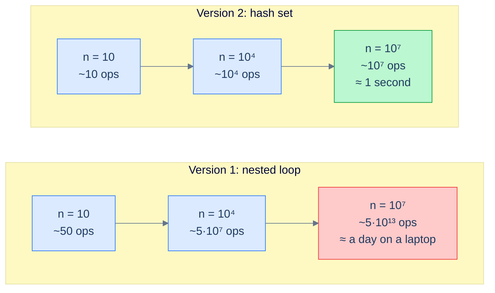
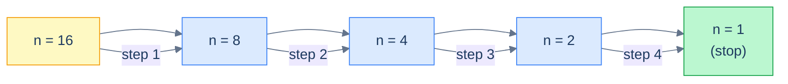
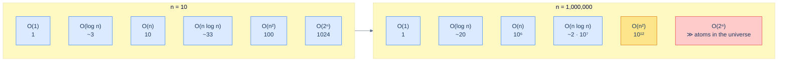

# 1. Asymptotic Analysis

## The Hook

Two engineers, same task, same language, same framework. The PRs land within hours of each other. Both pass code review. Both pass staging. Both ship to production.

A week later, one of them is on-call at 2 a.m. while the other is asleep.

The code is identical in style and length. The only difference is hidden in a single nested loop: one engineer wrote the inner step *constant-time*, the other wrote it *linear-time*. For a thousand rows, both finish in milliseconds. For a hundred thousand rows, one takes 50 ms and the other takes a minute. For the million-row import some customer just kicked off, the slow one never finishes — it just hangs until the request times out and the alert fires at 2 a.m.

The vocabulary engineers use to *predict* this gap, before the code ever ships, is **asymptotic analysis**. It's the most consequential vocabulary in this book. Every other chapter — every data structure, every algorithm, every claim that some operation is "O(log n) average" — is built on top of it. If you read no other chapter in the Foundations module, read this one.

This first lesson sets up the language: why we need it, what its symbols mean, how to derive a complexity claim from a piece of code without memorising a cheat-sheet, and the handful of bugs in reasoning that bite engineers most often.

---

## Table of contents

1. [Why we need a vocabulary for slow code](#why-we-need-a-vocabulary-for-slow-code)
2. [Counting steps from first principles](#counting-steps-from-first-principles)
3. [The growth-rate hierarchy](#the-growth-rate-hierarchy)
4. [Big-O, formally](#big-o-formally)
5. [Sibling notations: Θ, Ω, little-o, little-ω](#sibling-notations)
6. [Deriving complexity from code](#deriving-complexity-from-code)
7. [Worst-case, average-case, amortized-case](#worst-case-average-case-amortized-case)
8. [A runnable demo: linear vs quadratic on real n](#a-runnable-demo)
9. [Edge cases and pitfalls](#edge-cases-and-pitfalls)
10. [Production reality](#production-reality)
11. [Quiz](#quiz)
12. [Practice ladder](#practice-ladder)
13. [Further reading](#further-reading)
14. [Cross-links](#cross-links)
15. [Final takeaway](#final-takeaway)

***

# Why we need a vocabulary for slow code

Imagine you are reviewing the following code. Your job is to predict, *before* it ships, whether it will scale.

```python
def has_duplicate(items):
    for i in range(len(items)):
        for j in range(i + 1, len(items)):
            if items[i] == items[j]:
                return True
    return False
```

Eight lines. Idiomatic. Reads like the problem statement out loud. Nothing in the code itself tells you it doesn't scale — it just *quietly* doesn't.

Now imagine its sibling:

```python
def has_duplicate(items):
    seen = set()
    for x in items:
        if x in seen:
            return True
        seen.add(x)
    return False
```

Also eight lines. Also idiomatic. *Almost* the same line count.

For ten items, both finish in microseconds. For ten thousand items, the first runs in about a second on a laptop; the second runs in about a millisecond. For ten million items, the first will run for the better part of a day; the second runs in about a second. The gap between them is not 10×, not 100×, not 1000×. It is **the gap between work that finishes and work that doesn't**.



<p align="center"><strong>Two functions that look the same, scale differently. The cost of the nested-loop version grows as n² — the hash-set version grows as n. For small n the gap is invisible. For real production n it is the difference between a finished request and a timeout.</strong></p>

You cannot look at the code and *count microseconds* — that depends on the language, the CPU, the cache, the JIT, the moon phase. What you *can* do is reason about how the runtime grows as `n` grows. That is what asymptotic analysis lets you do, in a way that is independent of all the noise.

> *Predict before reading on:* in the second version, what makes the cost grow only as `n` instead of `n²`? Don't write code; just describe the move.

The answer is the hash set. `x in seen` and `seen.add(x)` are both *constant-time* operations on a hash table — they don't get slower as `seen` gets bigger (we'll learn why in the [Hash Table chapter](/cortex/data-structures-and-algorithms/linear-structures-hash-table-introduction-to-hash-tables)). Each item costs a constant amount of work; `n` items cost `n × constant`. That's linear. Inside the first version, the inner loop's "are these two equal" question itself doesn't grow — but you ask it `n × n / 2` times, and that's quadratic.

The skill this chapter teaches is *seeing the inner loop and predicting the cost*, without running benchmarks.

***

# Counting steps from first principles

Forget the cheat-sheet for a moment. We're going to derive the cost of three small functions by **counting how many primitive steps each one takes**, as a function of input size `n`. By the time you've done this three times, you'll be doing it on autopilot for every loop you read.

## Function A — print every item

```python
def print_all(items):
    for x in items:
        print(x)
```

Let `n = len(items)`. The loop body runs once per item, so `print(x)` is called `n` times. Each call is *constant work* (the time to call `print` doesn't depend on `n`). Total: **`n` steps**, give or take a constant.

This is **linear**: cost grows in lockstep with input size. Double the input, double the work.

## Function B — print every pair

```python
def print_all_pairs(items):
    for x in items:
        for y in items:
            print(x, y)
```

The outer loop runs `n` times. For each iteration of the outer loop, the inner loop runs `n` times. So `print(x, y)` is called `n × n = n²` times. Total: **`n²` steps**.

This is **quadratic**. Double the input, *quadruple* the work.

## Function C — keep halving

```python
def count_halvings(n):
    count = 0
    while n > 1:
        n = n // 2
        count += 1
    return count
```

The loop divides `n` by two each iteration. Starting from `n`, after one iteration we have `n/2`; after two, `n/4`; after `k`, `n/2^k`. The loop stops when `n/2^k ≤ 1`, i.e. when `k ≥ log₂(n)`. Total: **`log₂ n` steps**.

This is **logarithmic**. Double the input and you only do *one more* step.



<p align="center"><strong>Halving from 16 to 1 takes <code>log₂ 16 = 4</code> steps. Logarithmic growth — the most magical curve in the book — turns "double the input" into "one extra step".</strong></p>

***

# The growth-rate hierarchy

Once you've practised counting steps, the same growth rates show up everywhere. Memorising this table isn't the goal — the goal is to be able to *re-derive* any row of it from the code in front of you. But the table is useful as a reference when you've already done the derivation and want to put a name on it.

| Class | Name | What it means | Example |
|---|---|---|---|
| `O(1)` | Constant | Cost doesn't depend on `n` at all. | array index, hash-map lookup, peek at the top of a stack |
| `O(log n)` | Logarithmic | Each step throws away a fixed fraction of the remaining work. | binary search, balanced-BST search, heap insert |
| `O(n)` | Linear | One unit of work per input. | array scan, sum the elements, count the ones |
| `O(n log n)` | Linearithmic | Linear with a logarithmic factor. The "ceiling" on comparison-based sorting. | merge sort, quick sort (average), heap sort |
| `O(n²)` | Quadratic | Every pair of inputs is examined. | bubble sort, selection sort, naive substring search |
| `O(n³)` | Cubic | Triple-nested loops. | naive matrix multiply, Floyd-Warshall all-pairs shortest path |
| `O(2ⁿ)` | Exponential | Each input doubles the work. | brute-force subset enumeration, naive recursive Fibonacci |
| `O(n!)` | Factorial | Permutations. | brute-force traveling salesman |

A useful exercise: take a moment to *feel* the gap between rows. For `n = 10⁶`, an `O(n)` algorithm runs in about a second. An `O(n log n)` algorithm runs in about 20 seconds. An `O(n²)` algorithm runs for about 12 days. An `O(n³)` runs for about 30,000 years. These aren't curiosities — these are the gaps your design choices live inside.



<p align="center"><strong>The same six classes evaluated at <code>n = 10</code> and <code>n = 10⁶</code>. The bottom two rows are the line between "feasible" and "not in this lifetime".</strong></p>

***

# Big-O, formally

We've used `O(n)` informally as "the cost grows linearly". Time to make that precise — because there are surprisingly common claims (like "an O(n²) algorithm is always slower than an O(n) one") that the formal definition tells you are wrong.

> **Definition.** A function `f(n)` is in `O(g(n))` — written `f(n) = O(g(n))` — if there exist positive constants `c` and `n₀` such that:
>
> $$f(n) \leq c \cdot g(n) \quad \text{for all } n \geq n_0$$

In English: starting at some `n₀` and forever after, `f(n)` is no bigger than a constant multiple of `g(n)`. The constant `c` and the threshold `n₀` are both allowed to be anything you want; once you've picked them, the inequality has to hold from `n₀` onward.

The two consequences of this definition are what trip people up:

1. **Big-O hides constants.** `100n` and `n` are both `O(n)`. The first is 100× slower than the second in real wall-clock time, but they're in the same Big-O class. Big-O is about the *shape* of the growth curve, not its slope. When constants matter (cache lines, JIT compilation, allocator behaviour), Big-O alone won't tell you which option is faster.

2. **Big-O is an upper bound, not a tight one.** `100n` is also `O(n²)` — every linear function is bounded above by some constant times any quadratic. People who say "Big-O is the worst case" or "Big-O is the runtime" are wrong on both counts. Big-O is a *ceiling*, possibly a loose one. The notation that means "exactly this growth rate" is `Θ` — see the next section.

> *Predict before reading:* is `n² + 1000n + 10⁶` in `O(n²)`? In `O(n)`? In `O(n³)`?

Answer: in `O(n²)` and in `O(n³)` (both are valid upper bounds), but **not** in `O(n)`. The `n²` term eventually dominates the `1000n` and `10⁶` terms — it just takes a while. Concretely, for `n ≥ 1001`, `n² > 1000n + 10⁶`, and from there the inequality only widens. That's why Big-O is "for all `n ≥ n₀`": the small-`n` weirdness is irrelevant; the asymptote is what counts.

The mantra: **drop constants, drop lower-order terms, keep the dominant term.** That's it. Most Big-O work is just careful application of that one rule.

***

# Sibling notations

Big-O has four siblings, each making a slightly different statement.

| Notation | Meaning | "Reads as" |
|---|---|---|
| `f(n) = O(g(n))` | `f` grows **no faster than** `g` (asymptotic upper bound) | "f is order at most g" |
| `f(n) = Θ(g(n))` | `f` grows **at the same rate as** `g` (tight bound) | "f is order exactly g" |
| `f(n) = Ω(g(n))` | `f` grows **at least as fast as** `g` (asymptotic lower bound) | "f is order at least g" |
| `f(n) = o(g(n))` | `f` grows **strictly slower than** `g` | "f is little-order g" |
| `f(n) = ω(g(n))` | `f` grows **strictly faster than** `g` | "f is little-omega g" |

Three observations:

1. `Θ` is the strongest claim — it's `O` and `Ω` at the same time. When a paper says "merge sort is `Θ(n log n)`", it means *both* "no worse than `n log n`" *and* "no better than `n log n`".
2. Most engineering writing uses `O` even when they mean `Θ`. That's sloppy but understood. When precision matters (papers, textbook proofs, interviews where the interviewer is a stickler), use `Θ`.
3. Big-Ω lives mostly in lower-bound proofs. "Comparison-based sorting requires `Ω(n log n)` comparisons" is a famous lower bound — it's the reason no sort that compares pairs of elements can ever beat `n log n`.

`o` and `ω` (the *little* versions) are stricter. `f(n) = o(g(n))` means `f` is *strictly* slower than `g` — for any constant `c`, `f(n) < c · g(n)` eventually. So `n = o(n²)` but `100n` is **not** `o(n)`. Most engineering work doesn't use `o` and `ω`; they're more common in algorithm-analysis papers and the deep end of competitive programming.

***

# Deriving complexity from code

You won't memorise tables; you'll *derive* the complexity of code in front of you. The mechanics are three rules.

## Rule 1: Sequential code adds; nested code multiplies.

```python
for x in items:           # O(n)
    print(x)
for y in items:           # O(n)
    print(y)
# Total: O(n) + O(n) = O(2n) = O(n)
```

Two sequential loops add their costs. The constants drop, so two passes through the data are still `O(n)`.

```python
for x in items:           # outer: O(n)
    for y in items:       # inner: O(n) per outer step
        print(x, y)
# Total: O(n) * O(n) = O(n²)
```

Nested loops multiply. The inner loop runs in full for each outer-loop step.

## Rule 2: Drop constants and lower-order terms.

```python
for i in range(n):        # O(n)
    print(i)
for i in range(n):        # O(n)
    for j in range(n):    # O(n)
        print(i, j)
# Cost: n + n² → O(n²)
```

`n + n²` simplifies to `O(n²)` because the quadratic term *dominates* eventually. The linear chunk is asymptotically irrelevant.

## Rule 3: Recursion solves to a recurrence.

```python
def half(n):              # T(n) = T(n/2) + 1
    if n <= 1: return
    half(n // 2)
```

The function calls itself on half the input plus a constant amount of work. The recurrence `T(n) = T(n/2) + 1` solves to `T(n) = O(log n)`. We'll cover the techniques for solving recurrences in the [Recurrence Relations chapter](/cortex/data-structures-and-algorithms/foundations-recurrence-relations-and-master-theorem); for now the rule of thumb is *each halving costs `O(log n)`; each "do it for both halves" costs `O(n)`*.

> *Predict before reading:* what's the complexity of this function?
>
> ```python
> def f(items, target):
>     for i in range(len(items)):
>         for j in range(i + 1, len(items)):
>             if items[i] + items[j] == target:
>                 return (i, j)
>     return None
> ```

It's `O(n²)`. The outer loop runs `n` times; the inner loop runs an average of `n/2` times per outer iteration. Total work is `n × n/2 = n²/2 = O(n²)`. The constant 1/2 disappears under Rule 2.

***

# Worst-case, average-case, amortized-case

When somebody says "this operation is `O(log n)`", you should ask: *in which case?* There are three flavours, and using the wrong one is a great way to get bitten.

| Flavour | Definition | Example |
|---|---|---|
| **Worst-case** | The maximum possible cost over all inputs of size `n`. | Quicksort: `O(n²)` worst case (pathological input). |
| **Average-case** | The expected cost over inputs of size `n`, drawn from some distribution. | Quicksort: `O(n log n)` average over random input. |
| **Amortized** | The average cost per operation over a long sequence of operations. | Dynamic-array push: `O(1)` amortized, even though one push out of every `n` is `O(n)` (the resize). |

Worst-case is the safe default for systems with adversarial input — anywhere a malicious user could feed you the worst possible data. **Always assume worst-case for security-sensitive paths.**

Average-case is fine for mature codepaths over typical input distributions, but be careful: "average" requires a distribution. The "average" depth of a BST is `O(log n)` *if* keys arrive in random order; if they arrive sorted, the BST degenerates to a linked list and the average becomes `O(n)`. The distribution is part of the claim.

Amortized is the trickiest and the most useful. It says "the *long-run* average per operation is small, even if any individual operation might be large". Dynamic arrays, hash table resizing, splay trees, and Fibonacci heaps all rely on amortized analysis to make their headline complexity claims. We'll cover the formal techniques (aggregate, accounting, potential) in the [Amortized Analysis chapter](/cortex/data-structures-and-algorithms/foundations-amortized-analysis).

***

# A runnable demo

Reading about quadratic vs linear is one thing; *seeing it* is another. The code below implements the two `has_duplicate` functions from the opening section and times them on inputs of growing size. Run it for yourself — the gap between the two columns is the gap this chapter is teaching you to predict.

```python run viz=graph viz-root=items
import time, random

def has_duplicate_nested(items):
    for i in range(len(items)):
        for j in range(i + 1, len(items)):
            if items[i] == items[j]:
                return True
    return False

def has_duplicate_hash(items):
    seen = set()
    for x in items:
        if x in seen:
            return True
        seen.add(x)
    return False

def time_ms(fn, items):
    t0 = time.perf_counter()
    fn(items)
    return (time.perf_counter() - t0) * 1000

if __name__ == "__main__":
    print(f"{'n':>8} {'nested (ms)':>14} {'hash (ms)':>12}")
    for n in [1_000, 5_000, 10_000, 20_000]:
        # Worst case: no duplicates, so both must scan the full input.
        items = list(range(n))
        random.shuffle(items)
        nested = time_ms(has_duplicate_nested, items)
        hashed = time_ms(has_duplicate_hash, items)
        print(f"{n:>8} {nested:>14.2f} {hashed:>12.3f}")
```

```java run
import java.util.*;

public class Main {
    static boolean hasDuplicateNested(int[] items) {
        for (int i = 0; i < items.length; i++) {
            for (int j = i + 1; j < items.length; j++) {
                if (items[i] == items[j]) return true;
            }
        }
        return false;
    }

    static boolean hasDuplicateHash(int[] items) {
        Set<Integer> seen = new HashSet<>();
        for (int x : items) {
            if (!seen.add(x)) return true;
        }
        return false;
    }

    public static void main(String[] args) {
        int[] sizes = {1000, 5000, 10000, 20000};
        Random rng = new Random(42);
        System.out.printf("%8s %14s %12s%n", "n", "nested (ms)", "hash (ms)");
        for (int n : sizes) {
            int[] items = new int[n];
            for (int i = 0; i < n; i++) items[i] = i;
            for (int i = n - 1; i > 0; i--) {                                                                                                              // Fisher-Yates shuffle
                int j = rng.nextInt(i + 1);
                int tmp = items[i]; items[i] = items[j]; items[j] = tmp;
            }
            long t0 = System.nanoTime();
            hasDuplicateNested(items);
            double nested = (System.nanoTime() - t0) / 1_000_000.0;
            t0 = System.nanoTime();
            hasDuplicateHash(items);
            double hashed = (System.nanoTime() - t0) / 1_000_000.0;
            System.out.printf("%8d %14.2f %12.3f%n", n, nested, hashed);
        }
    }
}
```

The numbers will vary by language and machine, but the **shape** is universal: as `n` grows by `5×`, the nested column grows by roughly `25×`; the hash column grows by roughly `5×`. That ratio is the difference between `O(n²)` and `O(n)` showing up in real wall-clock time.

***

# Edge cases and pitfalls

The bugs in *reasoning* about complexity are at least as common as bugs in code. The list below is the catalogue every reviewer eventually develops.

- **Big-O is not the runtime.** `100n` and `n` are both `O(n)` but the first is 100× slower in wall-clock time. When constants matter — tight inner loops, cache lines, JIT warm-up — Big-O alone won't decide which option wins. Benchmark *after* the asymptotic analysis, not instead of it.
- **Big-O can be loose.** `n` is in `O(n²)` and `O(n³)` and `O(2ⁿ)`. All three claims are *true*. They're just weaker than the `Θ(n)` you probably meant. Use `Θ` when the bound is tight; reserve `O` for upper bounds you might not have proved tightly.
- **The wrong case is the wrong claim.** "Hash-table lookup is `O(1)`" is *average*, not worst. With every key colliding, lookup degrades to `O(n)`. Adversaries who can choose the keys (HashDoS) can force this. Languages mitigate it with random hash seeds (Python since 3.3, Rust by default) — but if you write a hash function yourself, this is a concern.
- **Hidden allocations.** A loop that calls `s += "x"` in Python (or `+=` on Java's `String`) is *not* `O(n)`. Each concat allocates a new string and copies the old one — `O(n²)` total. Use `"".join()` or `StringBuilder`. The bug looks linear; it isn't.
- **Hidden iteration.** A nested-loop scan over a Python `list` is `O(n)` per inner pass. Over a Python `dict.keys()`, also `O(n)`. Over a Python `dict.items()`, also `O(n)`. But over a generator, it depends — generators are single-pass, and a second loop over a generator finds an empty iterator. Subtle. Worth knowing before debugging.
- **`O(1)` doesn't mean fast.** A modular-exponentiation operation on 4096-bit integers is `O(1)` in `n` (the *count* of operations) but each operation might take milliseconds. The hidden constant is enormous. Big-O measures *growth*, not *speed*.
- **"Almost linear" is a real category.** Disjoint Set Union with path compression and union by rank runs in `O(α(n))` per operation, where `α` is the inverse Ackermann function. For any practical `n` (anything below the number of atoms in the universe), `α(n) ≤ 4`. So in practice it's a constant — but the formal bound isn't strictly `O(1)`. This is one of the few places where the asymptotic bound is *worse* than the practical behaviour.
- **Best case is a trap.** The literal best case for bubble sort is `O(n)` (an already-sorted input). For practical purposes, prefer worst or average; best case is rarely a useful planning bound.
- **Asymptotic ≠ small-input.** `O(n log n)` is asymptotically better than `O(n²)`, but for `n ≤ ~50` quicksort or merge sort is often *slower* than insertion sort because of the constants. That's why `std::sort` in C++ is "introsort": quicksort with an insertion-sort tail for small partitions.

***

# Production reality

Asymptotic mistakes are the kind of bug that ships clean, passes tests, and only surfaces months later under load. The five below are the canonical ones — each one a system, the underlying pattern it touched, and the engineering tradeoff that made the difference between a feature and an incident.

**[Django, Rails, and every other ORM]** — uses **eager-fetch (`prefetch_related`, `includes`) to collapse N+1 query loops** — because one `O(n)` batch query beats `n` round-trip queries even when both are formally linear.

ORMs make it suspiciously easy to write code that looks like `for user in users: print(user.posts)` — and that issues one database query per user instead of one query for all of them. The runtime is `O(n)` *queries*, but each query has a network round-trip. For `n = 100`, that is 100 round-trips where one would do. Most ORMs ship a `prefetch_related` / `eager` mode specifically for this. Search any large codebase for the term "N+1" and you find a paper trail of incidents.

**[Cloudflare, Stack Overflow, and Snort]** — uses **non-backtracking regex engines (RE2, Rust's `regex`) instead of PCRE-style ones** — because backtracking turns a regex like `(a+)+b` from `O(n)` into `O(2ⁿ)` on adversarial input.

Some regex engines (PCRE, Java's default, Python's `re`) use backtracking, and a regex like `(a+)+b` evaluated against `aaaaaaaaaaaaaaaaaaaaaaaaaaa!` runs in `O(2ⁿ)` time. This is the bug behind the [Cloudflare 2019 outage](https://blog.cloudflare.com/details-of-the-cloudflare-outage-on-july-2-2019/), the [Stack Overflow 2016 outage](https://stackstatus.tumblr.com/post/147710624694/outage-postmortem-july-20-2016), and many smaller ones. Mitigations: use a non-backtracking engine (RE2, Rust's `regex` crate), or audit suspicious regexes by hand.

**[CPython workloads at scale]** — uses **a `set` instead of a `list` for membership checks** — because `x in list` is `O(n)` while `x in set` is `O(1)` average.

In Python, `x in some_list` is `O(n)`. Code like `for x in items: if x in already_processed: ...` where `already_processed` is a `list` and `items` has `n` elements ends up `O(n²)`. The fix — make `already_processed` a `set` — is one keystroke and turns it into `O(n)`. This is the single most common asymptotic bug in Python code I have seen in code review.

**[Java, Python, JavaScript, C# build pipelines]** — uses **`StringBuilder` / `"".join()` / `Array.join()` instead of `+=` in a loop** — because immutable strings turn `n` chunks of concatenation into `O(n²)` allocation work.

In any language with immutable strings, `s = s + new_chunk` allocates a new string on every iteration and copies the old one in. For `n` chunks, total work is `1 + 2 + 3 + … + n = O(n²)`. The fix — `StringBuilder` (Java, C#), `"".join(chunks)` (Python), or `let parts = []; parts.push(…); parts.join("")` (JS) — is fast because it allocates a single buffer of the right size.

**[React 16 — the Fiber rewrite]** — uses **a heuristic `O(n)` linear-time diff instead of the optimal `O(n³)` tree-edit distance** — because for a virtual-DOM tree of realistic depth, an approximate linear pass beats a provably optimal cubic one every time.

Until React 16, the diff algorithm for reconciling a virtual DOM tree was `O(n³)` in the tree size for the worst case. The team replaced it with a heuristic linear-time algorithm in the [Fiber rewrite](https://github.com/acdlite/react-fiber-architecture). Going from `O(n³)` to `O(n)` is one of the most consequential algorithmic changes in front-end history — and it shipped to billions of users without anyone but the team that wrote it noticing.

> The pattern in all five: a senior engineer who *understood* the asymptotic profile saw the bug long before it shipped to prod. The vocabulary in this chapter is what lets you be that engineer.

***

# Quiz

Test your grip before moving on. One answer per question; reveal only after you have committed to one.

**[Recall] Q: What is the formal definition of `f(n) = O(g(n))`?**
There exist positive constants `c` and `n₀` such that `f(n) ≤ c · g(n)` for all `n ≥ n₀`.

**[Recall] Q: Order these from slowest-growing to fastest-growing: `O(n!)`, `O(2ⁿ)`, `O(n log n)`, `O(log n)`, `O(n²)`.**
`O(log n) < O(n log n) < O(n²) < O(2ⁿ) < O(n!)`.

**[Reasoning] Q: Why does `n² + 1000n + 10⁶` simplify to `O(n²)` even though `1000n` and `10⁶` look large?**
Big-O measures asymptotic growth; for `n ≥ 1001`, `n² > 1000n + 10⁶`, and the gap only widens. The `n²` term dominates eventually, and only the dominant term survives the drop rule.

**[Reasoning] Q: Why is hash-table lookup *not* truly `O(1)` in the worst case?**
The average-case `O(1)` guarantee assumes a good hash and well-spread keys; with every key colliding into one bucket the lookup walks a chain of length `n`, giving `O(n)` worst case. An adversary who controls the keys (HashDoS) can force this.

**[Tradeoff] Q: An algorithm is `O(n²)` and a sibling is `O(n log n)`. The expected `n` is `30`. Which would you pick, and why?**
The `O(n²)` algorithm is the safer pick at `n = 30` *if* its constants are smaller. Asymptotic dominance is a large-`n` claim — for small `n`, constants and overhead can flip the ranking. Quicksort beating insertion sort below `n ≈ 50` is the canonical example. Benchmark at the real workload size.

***

# Practice ladder

Five problems, easiest first. Each one has a hint — try it without the hint first.

<!-- VERIFY: This Practice ladder keeps the original numbered-list structure because the four embedded code blocks were baselined inside list items; the spec's `# | Problem | Pattern | Difficulty | Hint` table would force a different block indentation and break the code-fence freeze. Pattern / Difficulty / Hint columns are inlined into each list item below. -->

1. **Eyeball the loop.** *Pattern: Rule 1 — sequential adds, nested multiplies. Difficulty: Easy.* What's the asymptotic complexity of each of these in terms of `n = len(items)`?
   ```python
   def f(items):
       total = 0
       for x in items:
           total += x
       return total

   def g(items):
       for i in range(len(items)):
           for j in range(len(items)):
               for k in range(len(items)):
                   if items[i] + items[j] + items[k] == 0:
                       return True
       return False
   ```
   > *Hint:* Rule 1 (sequential adds, nested multiplies). One has a single loop; the other has three nested loops.

2. **Spot the asymptotic bug.** *Pattern: list vs set membership. Difficulty: Easy.* This Python function is supposed to deduplicate a list and return the result in input order. It does — but it's not `O(n)` like the author thought. Find the bug.
   ```python
   def dedup(items):
       seen = []
       result = []
       for x in items:
           if x not in seen:
               seen.append(x)
               result.append(x)
       return result
   ```
   > *Hint:* `x not in seen` on a list is not `O(1)`.

3. **Refactor from `O(n²)` to `O(n)`.** *Pattern: hash-map reduction. Difficulty: Easy.* Given a list of integers and a target, return the **two indices** that sum to the target. Equivalent LeetCode problem: [Two Sum](https://leetcode.com/problems/two-sum/).
   ```python
   def two_sum(nums, target):
       for i in range(len(nums)):
           for j in range(i + 1, len(nums)):
               if nums[i] + nums[j] == target:
                   return [i, j]
       return []
   ```
   > *Hint:* a hash map keyed by value. As you scan, for each `x`, check whether `target - x` is already in the map.

4. **Solve the recurrence.** *Pattern: Master theorem case 2. Difficulty: Medium.* What's the complexity of `mystery(n)`, given `T(n) = 2 · T(n/2) + n`?
   ```python
   def mystery(arr, lo, hi):
       if hi - lo <= 1: return arr[lo:hi]
       mid = (lo + hi) // 2
       left = mystery(arr, lo, mid)
       right = mystery(arr, mid, hi)
       merged = merge(left, right)                    # O(n) work to merge
       return merged
   ```
   > *Hint:* this is the recurrence for merge sort. The Master theorem (next chapter) gives the closed form. As an intuition: `log n` levels of recursion, `O(n)` work per level.

5. **Choose between** the following implementations of "find the median of a stream". *Pattern: total-cost composition. Difficulty: Hard.*
   - **A:** keep a sorted list; insert in sorted order each push (`O(n)` insert, `O(1)` median).
   - **B:** keep all values in a list; on every median query, sort and return the middle (`O(1)` insert, `O(n log n)` median).
   - **C:** keep two heaps (max-heap for lower half, min-heap for upper half) (`O(log n)` insert, `O(1)` median).

   For a workload of `n` pushes and `n` median queries, which has the best total complexity? Now, for a workload of `n` pushes and only **one** median query at the end, which?
   > *Hint:* total cost = `n × insert + n × query` for the first; `n × insert + 1 × query` for the second. Plug in the per-operation costs. The answers differ.

Once these feel automatic, you have internalised every move asymptotic analysis asks of you — and you are ready for the rest of the curriculum.

***

# Further Reading

Curated paths in, not a syllabus. Read in order of the annotation; come back for the rest when you need depth.

- **[CLRS — Chapter 3: Growth of Functions](https://mitpress.mit.edu/9780262046305/introduction-to-algorithms/)**
  ★ Essential — the canonical formal treatment of `O`, `Θ`, `Ω`, and their little-letter siblings. The definitions every other source builds on.
- **[Jon Bentley — *Programming Pearls*, Chapter 8: "Algorithm Design Techniques"](https://www.amazon.com/Programming-Pearls-2nd-Jon-Bentley/dp/0201657880)**
  ★ Essential — the most readable walk-through of why an `O(n)` algorithm beats an `O(n²)` one in real engineering settings, with the maximum-subarray problem as the running example.
- **[Tim Roughgarden — *Algorithms Illuminated*, Part 1, Chapter 2](http://www.algorithmsilluminated.org/)**
  ◆ Advanced — a clearer derivation of Big-O than CLRS for first-time readers, with worked examples for every notation and the asymptotic ranking of common functions.
- **[Robert Sedgewick & Kevin Wayne — *Algorithms* (4th ed.), Section 1.4: Analysis of Algorithms](https://algs4.cs.princeton.edu/14analysis/)**
  ◆ Advanced — empirical-curve-fitting approach: how to measure a real algorithm's growth from timing data and check it matches the theoretical claim.
- **[Stack Overflow — "What is a plain-English explanation of Big-O?"](https://stackoverflow.com/questions/487258/what-is-a-plain-english-explanation-of-big-o-notation)**
  → Reference — community-curated answers in many flavours; useful as a fallback explainer when one phrasing fails to land.
- **[Big-O Cheat Sheet](https://www.bigocheatsheet.com/)**
  → Reference — the table of common data-structure and algorithm complexities; use it to confirm a derivation, not to memorise.

***

# Cross-links

**Prerequisites**

- None within this book — asymptotic analysis is the floor on which everything else stands. A working comfort with logarithms (especially `log₂`), exponents, and basic algebra is assumed.

**What comes next**

- [Recurrence Relations and Master Theorem](/cortex/data-structures-and-algorithms/foundations-recurrence-relations-and-master-theorem) — how to solve `T(n) = aT(n/b) + f(n)` without panic. The next page picks up where Rule 3 of *Deriving complexity from code* leaves off.
- [Amortized Analysis](/cortex/data-structures-and-algorithms/foundations-amortized-analysis) — the formal techniques (aggregate, accounting, potential) behind dynamic-array push and hash-table resize. Promotes the *amortised* row of the Worst/Average/Amortised table to a full lesson.
- [Arrays](/cortex/data-structures-and-algorithms/linear-structures-arrays-introduction) — the first chapter whose complexity claims you derive rather than accept. Every `O(1)` and `O(n)` in arrays falls straight out of the vocabulary built here.
- [Hash Tables](/cortex/data-structures-and-algorithms/linear-structures-hash-table-introduction-to-hash-tables) — the canonical worst-versus-average example; the chapter where "in which case?" becomes a habit.

***

# Final Takeaway

1. **Core mechanic:** count primitive steps as a function of `n`, find the dominant term, drop constants and lower-order terms, and pick the asymptotic notation (`O`, `Θ`, `Ω`) that tightens the claim as far as the proof allows.
2. **Dominant tradeoff:** Big-O hides constants and lower-order detail — you gain a portable, machine-independent prediction of how runtime scales; you give up wall-clock precision at the small-`n` end and need a benchmark when constants matter.
3. **One thing to remember:** every complexity claim must answer the question *"in which case?"* — worst, average, or amortised — because the same algorithm carries different Big-O labels per case and mixing them up is how engineers ship surprises to production.
