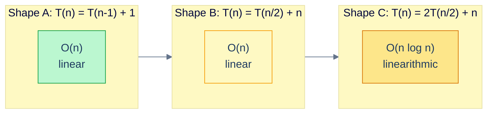
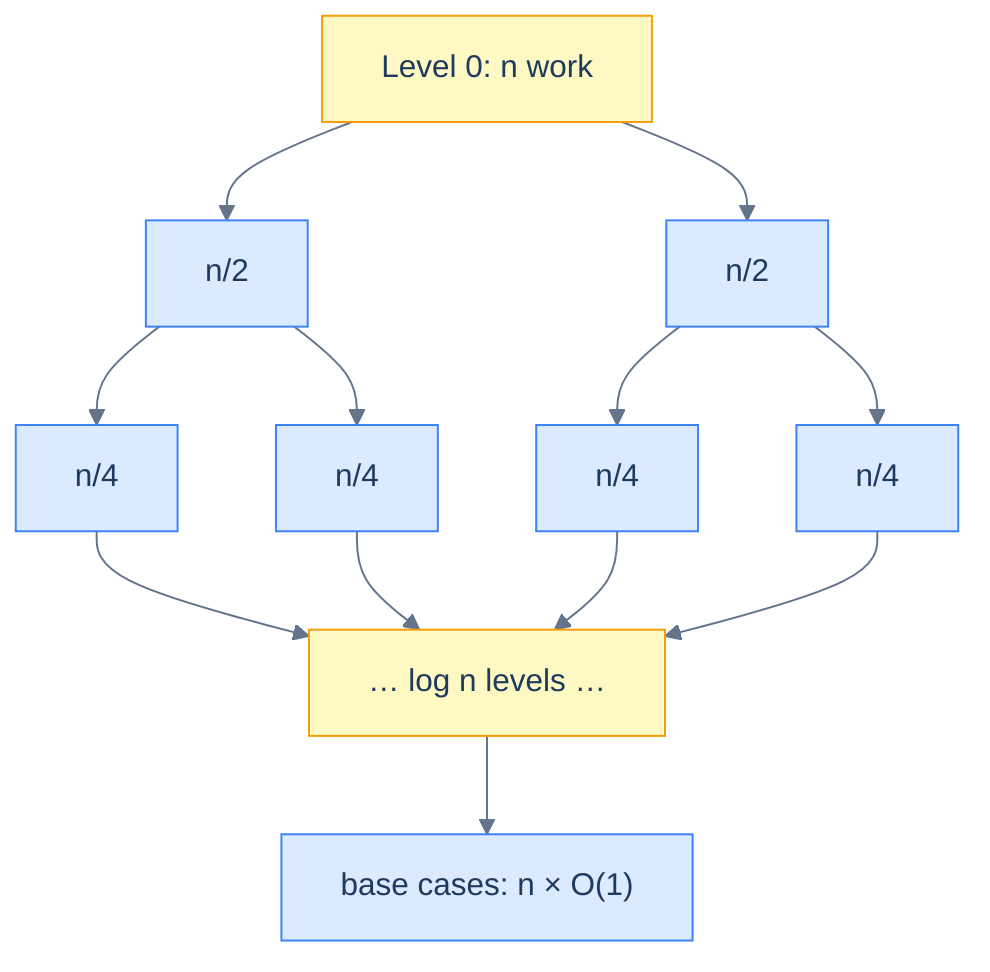
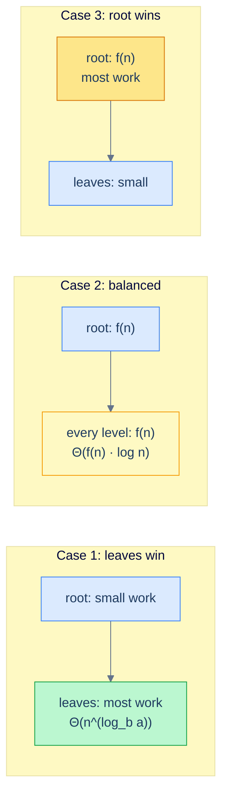

# 2. Recurrence Relations and the Master Theorem

## The Hook

How do you know merge sort runs in `O(n log n)`?

Read the code: it splits the array in half, recurses on each half, and merges the two sorted halves with a single pass. There is no loop running `n log n` times you can point to — the `n log n` is *hidden* in the call structure. The line "this is `O(n log n)`" is not a measurement; it's a *theorem*, and the theorem is proved by solving an equation about how the function calls itself.

```
T(n) = 2 · T(n/2) + n
```

That equation is a **recurrence relation**. It says "the cost of merge-sorting `n` elements equals the cost of merge-sorting two halves of `n/2` elements, plus the linear cost of merging them." Every divide-and-conquer algorithm has one. Quicksort, binary search, Karatsuba multiplication, the FFT, the Strassen matrix multiplication — every line of "this is `O(stuff)`" you've ever read about a recursive algorithm is that algorithm's recurrence solved.

This chapter is the solver. By the end of it you'll be able to look at any standard divide-and-conquer recurrence, write down the closed-form complexity, and explain *why* without reaching for a textbook.

---

## Table of contents

1. [Why recursive algorithms hide their cost](#why-recursive-algorithms-hide-their-cost)
2. [Reading a recurrence](#reading-a-recurrence)
3. [The recursion-tree method](#the-recursion-tree-method)
4. [The substitution method](#the-substitution-method)
5. [The Master theorem](#the-master-theorem)
6. [Worked examples](#worked-examples)
7. [When the Master theorem doesn't apply](#when-the-master-theorem-doesnt-apply)
8. [A runnable demo: solver + benchmark](#a-runnable-demo)
9. [Edge cases and pitfalls](#edge-cases-and-pitfalls)
10. [Production reality](#production-reality)
11. [Practice ladder](#practice-ladder)
12. [Cross-links](#cross-links)
13. [Final takeaway](#final-takeaway)

***

# Why recursive algorithms hide their cost

A loop's cost is visible. You can stand the loop next to its iteration count and read off the work: `for i in range(n): …` is `n` iterations of whatever's inside, total cost `O(n × inside)`.

A recursive algorithm doesn't show you its iteration count. The call structure unfolds at runtime, branching, recombining, eventually bottoming out at a base case. Counting "how many times does the inner work run" is no longer a stare; it's a calculation.

Consider three recursive shapes you'll meet over and over:

```python
def shape_A(n):
    if n == 0: return
    do_constant_work()      # 1 step
    shape_A(n - 1)          # one recursive call on n-1

def shape_B(n):
    if n == 0: return
    do_n_work(n)            # n steps
    shape_B(n // 2)         # one recursive call on n/2

def shape_C(n):
    if n == 0: return
    do_n_work(n)            # n steps
    shape_C(n // 2)         # two recursive calls
    shape_C(n // 2)         # on n/2 each
```

You can probably guess the costs: A is linear, B is linear, C is `n log n`. But until you've solved each as a recurrence, the guesses are exactly that. The recurrence is what gives you a *proof*, and a proof is what lets you stand by the complexity claim under load testing six months from now.



<p align="center"><strong>Three small differences in shape produce three different complexity classes. The shape matters more than any individual line of code.</strong></p>

***

# Reading a recurrence

A recurrence relation for an algorithm has two parts:

1. **The recursive case.** A formula that expresses `T(n)` in terms of `T` at smaller inputs.
2. **The base case.** A constant for the smallest inputs the algorithm handles directly without recursing.

Standard form for the divide-and-conquer recurrences this chapter focuses on:

$$T(n) = a \cdot T(n/b) + f(n)$$

with `a ≥ 1` recursive calls, each on a problem of size `n/b` (`b > 1`), plus `f(n)` non-recursive work to split the problem and combine the answers.

Examples drawn from real algorithms:

| Algorithm | Recurrence | Spoken |
|---|---|---|
| Merge sort | `T(n) = 2T(n/2) + n` | two halves of size n/2; linear merge |
| Binary search | `T(n) = T(n/2) + 1` | one half; constant comparison |
| Quicksort (best/avg) | `T(n) = 2T(n/2) + n` | balanced split; linear partition |
| Quicksort (worst) | `T(n) = T(n-1) + n` | unbalanced split; linear partition |
| Karatsuba multiply | `T(n) = 3T(n/2) + n` | three sub-multiplications |
| Strassen matrix mul | `T(n) = 7T(n/2) + n²` | seven sub-multiplications |
| Tree traversal | `T(n) = T(k) + T(n-1-k) + 1` | unknown left/right split |
| Tower of Hanoi | `T(n) = 2T(n-1) + 1` | two recursive moves of n-1 disks |

The shape of the recurrence is everything. `2T(n/2)` is fundamentally different from `T(n-1)` — one halves the problem, the other shaves one off — and that difference shows up as `log n` vs `n` in the closed form.

**Base cases are usually `T(1) = O(1)`** and we usually leave them implicit. The algebra works out for any constant base case; you only need to be careful when the base case itself depends on `n` (rare in practice, common in textbook traps).

***

# The recursion-tree method

The most intuitive solver: draw the tree of recursive calls, write the work at each node, sum across levels.

For `T(n) = 2T(n/2) + n`:

- **Level 0** has one node doing `n` work.
- **Level 1** has two nodes, each doing `n/2` work. Total at this level: `2 × n/2 = n`.
- **Level 2** has four nodes, each doing `n/4` work. Total: `4 × n/4 = n`.
- ...
- **Level k** has `2^k` nodes, each doing `n/2^k` work. Total: `n`.
- The tree bottoms out when `n/2^k = 1`, i.e. at depth `k = log₂ n`.



<p align="center"><strong>Merge sort's recursion tree. Each level does <code>n</code> work; there are <code>log n</code> levels; total <code>n × log n</code>.</strong></p>

The total work is *number-of-levels × work-per-level* = `log n × n = n log n`. Done.

The recursion-tree method is great when:
- You want intuition for *where* the work lives (top-heavy, balanced, leaf-heavy).
- The work-per-level has a simple closed form.
- You want to spot-check your Master-theorem application.

It struggles when:
- Levels do non-uniform work.
- The recursion isn't balanced (e.g. `T(n) = T(n/3) + T(2n/3) + n`, the unbalanced quicksort recurrence).

***

# The substitution method

The most rigorous solver: *guess* the closed form, then *prove* it by induction.

For `T(n) = T(n-1) + 1, T(0) = 0`, guess `T(n) = n`. Prove by induction:

- **Base:** `T(0) = 0 = 0`. ✓
- **Step:** Assume `T(n-1) = n - 1`. Then `T(n) = T(n-1) + 1 = (n-1) + 1 = n`. ✓

So `T(n) = n`, exactly. `T(n) = O(n)`, asymptotically.

The substitution method is great when:
- You already have a guess (often from the recursion-tree method).
- You need a formal proof for a paper or textbook context.

It struggles when:
- Your guess is wrong (you'll find out, but only after wasted algebra).
- The recurrence isn't standard form (you may need messy algebra to push through).

In practice: use the recursion tree to guess, the substitution method to verify, and the Master theorem to skip both.

***

# The Master Theorem

For the standard form `T(n) = a · T(n/b) + f(n)` with `a ≥ 1`, `b > 1`, the Master theorem gives a closed form by comparing `f(n)` against `n^(log_b a)`.

> **Master theorem:** Let `T(n) = a · T(n/b) + f(n)`. Define the **threshold** `n^(log_b a)`. Compare `f(n)` to it.
>
> - **Case 1:** `f(n) = O(n^(log_b a − ε))` for some `ε > 0` *(threshold dominates)*. Then `T(n) = Θ(n^(log_b a))`.
> - **Case 2:** `f(n) = Θ(n^(log_b a))` *(they're equal)*. Then `T(n) = Θ(n^(log_b a) · log n)`.
> - **Case 3:** `f(n) = Ω(n^(log_b a + ε))` for some `ε > 0` and a regularity condition (`a · f(n/b) ≤ c · f(n)` for some `c < 1`) *(`f` dominates)*. Then `T(n) = Θ(f(n))`.

In English:

- **Case 1:** the leaves of the recursion tree do most of the work. The `n^(log_b a)` "leaf count" wins.
- **Case 2:** every level does the same amount of work. Total = work-per-level × number-of-levels = `f(n) · log n`.
- **Case 3:** the root does most of the work. The `f(n)` non-recursive cost wins.



<p align="center"><strong>The three Master-theorem cases as recursion-tree pictures. The case is decided by where the work lives.</strong></p>

***

# Worked examples

## Merge sort: `T(n) = 2T(n/2) + n`

`a = 2, b = 2, f(n) = n`. Threshold: `n^(log₂ 2) = n^1 = n`. `f(n) = Θ(n)` matches the threshold exactly → **Case 2**. So `T(n) = Θ(n log n)`. ✓

## Binary search: `T(n) = T(n/2) + 1`

`a = 1, b = 2, f(n) = 1`. Threshold: `n^(log₂ 1) = n^0 = 1`. `f(n) = Θ(1)` matches → **Case 2**. So `T(n) = Θ(log n)`. ✓

## Linear maximum: `T(n) = T(n/2) + n` *(scan-then-recurse, found in some streaming algorithms)*

`a = 1, b = 2, f(n) = n`. Threshold: `n^0 = 1`. `f(n) = n` is asymptotically larger → **Case 3** (regularity holds: `1 × (n/2) ≤ c · n` for `c = 0.5`). So `T(n) = Θ(n)`.

The intuition: the root of the recursion tree does `n` work, the next level does `n/2`, then `n/4`, … This is a *geometric* series summing to `2n`, dominated by the root. The recursive part is asymptotically free.

## Karatsuba multiplication: `T(n) = 3T(n/2) + n`

Karatsuba is the divide-and-conquer integer multiplication that reduces a multiplication of two `n`-digit numbers to *three* multiplications of `n/2`-digit numbers, plus linear addition.

`a = 3, b = 2, f(n) = n`. Threshold: `n^(log₂ 3) ≈ n^1.585`. `f(n) = n` is asymptotically smaller → **Case 1**. So `T(n) = Θ(n^(log₂ 3)) ≈ Θ(n^1.585)`.

This is *better* than the textbook `Θ(n²)` long-multiplication algorithm — and is the reason Python's built-in arbitrary-precision integers use Karatsuba above a threshold.

## Strassen matrix multiplication: `T(n) = 7T(n/2) + n²`

Strassen multiplies two `n × n` matrices via *seven* multiplications of `n/2 × n/2` submatrices plus quadratic-cost additions.

`a = 7, b = 2, f(n) = n²`. Threshold: `n^(log₂ 7) ≈ n^2.807`. `f(n) = n²` is asymptotically smaller → **Case 1**. So `T(n) = Θ(n^(log₂ 7)) ≈ Θ(n^2.807)`.

Better than the cubic textbook matrix multiply. Theoretical algorithms (Coppersmith-Winograd, Le Gall) push this lower; in practice Strassen is the largest-coefficient improvement actually implemented in real linear-algebra libraries.

## Worst-case quicksort: `T(n) = T(n-1) + n`

This is *not* in standard `T(n) = aT(n/b) + f(n)` form (the recursion is on `n-1`, not `n/b`). Master theorem doesn't apply directly. Use the recursion tree:

- Level 0: `n` work
- Level 1: `n-1` work
- Level 2: `n-2` work
- ...
- Level n: 1 work

Sum: `n + (n-1) + (n-2) + … + 1 = n(n+1)/2 = Θ(n²)`.

The pathological-input quicksort that drops to `O(n²)` is exactly this case: each pivot peels off one element, the recursion is one-sided, and the linear-cost partitions add up to a quadratic.

***

# When the Master theorem doesn't apply

The Master theorem covers a wide but bounded slice of recurrences. It *doesn't* cover:

1. **Subtractive recurrences** like `T(n) = T(n-1) + n` (use recursion-tree or substitution).
2. **Polylogarithmic factors** like `T(n) = 2T(n/2) + n log n` — falls between Case 2 and 3, needing the *generalised* Master theorem (or its extension by Akra-Bazzi).
3. **Non-constant `a` or `b`** — `T(n) = nT(n/2) + n` doesn't fit; the work is exotic.
4. **Unbalanced recursive calls** — `T(n) = T(n/3) + T(2n/3) + n` is unbalanced. For *some* unbalanced recurrences, the recursion-tree method shows that as long as the cuts are *fractional* (not subtractive), the analysis still gives `Θ(n log n)` — because every root-to-leaf path is `O(log n)` long. But the standard Master theorem doesn't apply.
5. **Recurrences where `f(n)` is between Case 2 and Case 3** — i.e. `f(n)` is asymptotically larger than `n^(log_b a)` but only by a logarithmic factor, like `T(n) = 2T(n/2) + n log n`. Then `T(n) = Θ(n log² n)`. This is sometimes called the "generalised Case 2" or the "Master theorem with polylog gap".

The serious tool for irregular recurrences is the **Akra-Bazzi theorem** — a strict generalisation of the Master theorem that handles uneven splits and polylog factors. We won't derive it here; the rule of thumb is: recursion-tree first, Master if it fits, Akra-Bazzi if you need to publish.

***

# A runnable demo

The code below implements three recursive algorithms and times them as `n` grows. Run it; the columns should match the closed-form complexities the Master theorem predicts.

```pseudocode
function mergeSort(arr):                          # T(n) = 2T(n/2) + n  →  Θ(n log n)
    if length(arr) ≤ 1:
        return arr
    mid ← length(arr) / 2
    left  ← mergeSort(arr[0..mid])
    right ← mergeSort(arr[mid..length(arr)])
    return merge(left, right)

function binarySearch(arr, target):               # T(n) = T(n/2) + 1   →  Θ(log n)
    lo ← 0; hi ← length(arr) − 1
    while lo ≤ hi:
        mid ← lo + (hi − lo) / 2
        if arr[mid] = target: return mid
        else if arr[mid] < target: lo ← mid + 1
        else: hi ← mid − 1
    return −1

function maxOneSided(arr, lo, hi):                # T(n) = T(n/2) + n   →  Θ(n)
    if lo = hi: return arr[lo]
    best ← arr[lo]
    for i from lo+1 to hi: if arr[i] > best: best ← arr[i]
    return max(best, maxOneSided(arr, lo, (lo + hi) / 2))
```

```python run
import time, random

def merge_sort(a):
    if len(a) <= 1: return a
    mid = len(a) // 2
    left = merge_sort(a[:mid])
    right = merge_sort(a[mid:])
    out, i, j = [], 0, 0
    while i < len(left) and j < len(right):
        if left[i] <= right[j]: out.append(left[i]); i += 1
        else: out.append(right[j]); j += 1
    out.extend(left[i:]); out.extend(right[j:])
    return out

def binary_search(a, target):
    lo, hi = 0, len(a) - 1
    while lo <= hi:
        mid = lo + (hi - lo) // 2
        if a[mid] == target: return mid
        if a[mid] < target: lo = mid + 1
        else: hi = mid - 1
    return -1

def time_ms(fn):
    t0 = time.perf_counter()
    fn()
    return (time.perf_counter() - t0) * 1000

if __name__ == "__main__":
    print(f"{'n':>10} {'merge_sort (ms)':>18} {'binary_search (µs)':>22}")
    for n in [10_000, 100_000, 1_000_000]:
        a = [random.randint(0, 10**9) for _ in range(n)]
        ms = time_ms(lambda: merge_sort(a))
        sa = sorted(a)
        us = time_ms(lambda: [binary_search(sa, sa[i]) for i in range(0, n, max(1, n // 100))]) * 10  # ~100 lookups
        print(f"{n:>10} {ms:>18.1f} {us:>22.1f}")
```

```java run
import java.util.*;

class Solution {
    static int[] mergeSort(int[] a) {
        if (a.length <= 1) return a;
        int mid = a.length / 2;
        int[] left = mergeSort(Arrays.copyOfRange(a, 0, mid));
        int[] right = mergeSort(Arrays.copyOfRange(a, mid, a.length));
        int[] out = new int[a.length];
        int i = 0, j = 0, k = 0;
        while (i < left.length && j < right.length) {
            if (left[i] <= right[j]) out[k++] = left[i++];
            else out[k++] = right[j++];
        }
        while (i < left.length) out[k++] = left[i++];
        while (j < right.length) out[k++] = right[j++];
        return out;
    }

    static int binarySearch(int[] a, int target) {
        int lo = 0, hi = a.length - 1;
        while (lo <= hi) {
            int mid = lo + (hi - lo) / 2;
            if (a[mid] == target) return mid;
            if (a[mid] < target) lo = mid + 1;
            else hi = mid - 1;
        }
        return -1;
    }

    public static void main(String[] args) {
        int[] sizes = {10_000, 100_000, 1_000_000};
        Random rng = new Random(42);
        System.out.printf("%10s %18s %22s%n", "n", "merge_sort (ms)", "binary_search (µs)");
        for (int n : sizes) {
            int[] a = new int[n];
            for (int i = 0; i < n; i++) a[i] = rng.nextInt(1_000_000_000);
            long t0 = System.nanoTime();
            int[] sorted = mergeSort(a);
            double ms = (System.nanoTime() - t0) / 1_000_000.0;
            t0 = System.nanoTime();
            int step = Math.max(1, n / 100);
            for (int i = 0; i < n; i += step) binarySearch(sorted, sorted[i]);
            double us = (System.nanoTime() - t0) / 1_000.0;
            System.out.printf("%10d %18.1f %22.1f%n", n, ms, us);
        }
    }
}
```

```c run
#include <stdio.h>
#include <stdlib.h>
#include <time.h>

static void merge_sort_inplace(int *a, int *buf, int lo, int hi) {
    if (hi - lo <= 1) return;
    int mid = lo + (hi - lo) / 2;
    merge_sort_inplace(a, buf, lo, mid);
    merge_sort_inplace(a, buf, mid, hi);
    int i = lo, j = mid, k = lo;
    while (i < mid && j < hi) buf[k++] = (a[i] <= a[j]) ? a[i++] : a[j++];
    while (i < mid) buf[k++] = a[i++];
    while (j < hi)  buf[k++] = a[j++];
    for (int t = lo; t < hi; t++) a[t] = buf[t];
}

static int binary_search(const int *a, int n, int target) {
    int lo = 0, hi = n - 1;
    while (lo <= hi) {
        int mid = lo + (hi - lo) / 2;
        if (a[mid] == target) return mid;
        if (a[mid] < target) lo = mid + 1;
        else hi = mid - 1;
    }
    return -1;
}

int main(void) {
    int sizes[] = {10000, 100000, 1000000};
    srand(42);
    printf("%10s %18s %22s\n", "n", "merge_sort (ms)", "binary_search (us)");
    for (int s = 0; s < 3; s++) {
        int n = sizes[s];
        int *a = malloc(n * sizeof(int));
        int *buf = malloc(n * sizeof(int));
        for (int i = 0; i < n; i++) a[i] = rand() % 1000000000;
        clock_t t0 = clock();
        merge_sort_inplace(a, buf, 0, n);
        double ms = (double)(clock() - t0) * 1000.0 / CLOCKS_PER_SEC;
        t0 = clock();
        int step = n / 100; if (step < 1) step = 1;
        for (int i = 0; i < n; i += step) binary_search(a, n, a[i]);
        double us = (double)(clock() - t0) * 1000000.0 / CLOCKS_PER_SEC;
        printf("%10d %18.1f %22.1f\n", n, ms, us);
        free(a); free(buf);
    }
    return 0;
}
```

```scala run
import scala.util.Random

object Solution {
  def mergeSort(a: Array[Int]): Array[Int] = {
    if (a.length <= 1) return a
    val mid = a.length / 2
    val left = mergeSort(a.slice(0, mid))
    val right = mergeSort(a.slice(mid, a.length))
    val out = new Array[Int](a.length)
    var i = 0; var j = 0; var k = 0
    while (i < left.length && j < right.length) {
      if (left(i) <= right(j)) { out(k) = left(i); i += 1 } else { out(k) = right(j); j += 1 }
      k += 1
    }
    while (i < left.length) { out(k) = left(i); i += 1; k += 1 }
    while (j < right.length) { out(k) = right(j); j += 1; k += 1 }
    out
  }

  def binarySearch(a: Array[Int], target: Int): Int = {
    var lo = 0; var hi = a.length - 1
    while (lo <= hi) {
      val mid = lo + (hi - lo) / 2
      if (a(mid) == target) return mid
      else if (a(mid) < target) lo = mid + 1
      else hi = mid - 1
    }
    -1
  }

  def main(args: Array[String]): Unit = {
    val sizes = Array(10000, 100000, 1000000)
    val rng = new Random(42)
    println(f"${"n"}%10s ${"merge_sort (ms)"}%18s ${"binary_search (µs)"}%22s")
    for (n <- sizes) {
      val a = Array.fill(n)(rng.nextInt(1000000000))
      var t0 = System.nanoTime()
      val sorted = mergeSort(a)
      val ms = (System.nanoTime() - t0) / 1e6
      t0 = System.nanoTime()
      val step = math.max(1, n / 100)
      for (i <- 0 until n by step) binarySearch(sorted, sorted(i))
      val us = (System.nanoTime() - t0) / 1e3
      println(f"$n%10d $ms%18.1f $us%22.1f")
    }
  }
}
```

The merge-sort column should grow roughly as `n log n` (going `n × 10` should go runtime `× 11` or so). The binary-search column should grow logarithmically with the array size — almost constant per lookup.

***

# Edge cases and pitfalls

- **Wrong-form recurrences and the Master theorem.** The Master theorem applies *only* to `T(n) = aT(n/b) + f(n)`. Subtractive recurrences (`T(n-1) + 1`) need the recursion tree or substitution. Throwing the Master theorem at `T(n) = T(n-1) + 1` and getting `Θ(1)` is a common interview mistake.
- **Forgetting the regularity condition in Case 3.** `f(n)` being asymptotically larger than `n^(log_b a)` isn't enough. You also need `a · f(n/b) ≤ c · f(n)` for some `c < 1`. The condition fails for pathological `f(n)` like `f(n) = n^2 · sin(n)` — they oscillate. For all polynomially-bounded `f(n)`, the regularity condition holds automatically; you only think about it when `f(n)` is exotic.
- **The polylog gap.** `T(n) = 2T(n/2) + n log n` is *not* covered by the standard Master theorem — `f(n) = n log n` is asymptotically larger than `n^1` but only by a polylog factor, not polynomially. The "generalised Case 2" gives `Θ(n log² n)`. Get this wrong and you'll claim merge-sort-with-merge-step-doing-extra-log-work is `Θ(n log n)` when it's `Θ(n log² n)`.
- **Hidden loops in `f(n)`.** If your recursive function has a loop *inside* the recursion at each level, the loop counts as part of `f(n)`. People sometimes forget the loop and analyse the recursion alone, getting `Θ(log n)` for an algorithm that's actually `Θ(n log n)`.
- **Different base cases change the constant, not the asymptotic.** Whether `T(0) = 0` or `T(1) = 5` or `T(10) = 100`, the asymptotic complexity is identical. Don't waste time fiddling with the base case unless you're computing exact runtime.
- **Worst-case-vs-average recursion shape.** Quicksort's recurrence depends on pivot quality. The recurrence `T(n) = 2T(n/2) + n` (best/average) gives `n log n`. The recurrence `T(n) = T(n-1) + n` (worst) gives `n²`. Both are valid — they describe different *cases* of the same algorithm.

***

# Production Reality

- **Python's integer multiplication.** CPython's `Lib/_pylong.py` and the C runtime in `Objects/longobject.c` switch from grade-school multiply to **Karatsuba** above a digit-count threshold (`KARATSUBA_CUTOFF`), which is roughly 70 digits. The recurrence `T(n) = 3T(n/2) + n → Θ(n^1.585)` is what saves you when multiplying 10,000-digit numbers; without it, RSA signing would take seconds longer.
- **Linear-algebra libraries.** Major BLAS implementations (Intel MKL, OpenBLAS) use **Strassen** for matrix multiplication above a size threshold (typically 64 or 128). The crossover happens because Strassen's `Θ(n^2.807)` only beats the cubic algorithm once `n` is big enough to amortise its larger constants. For smaller `n`, the cubic algorithm wins on cache friendliness — the asymptotically-worse algorithm is faster in practice up to thousands of rows.
- **Sorting hybrids.** `std::sort` (C++ STL), `Arrays.sort` (Java for primitive arrays), and CPython's Timsort all use a divide-and-conquer with a *small-input cutoff*. Below the cutoff (often 16 elements), they switch to insertion sort. The recurrence becomes `T(n) = 2T(n/2) + n` only for the part of the tree above the cutoff; below it, the work is `Θ(n)` per call. Total: still `Θ(n log n)`, but the constant is lower than pure merge sort.
- **The Cooley-Tukey FFT.** The Fast Fourier Transform is `T(n) = 2T(n/2) + n → Θ(n log n)`, and it's the algorithm behind every audio codec, every signal-processing library, every medium-sized polynomial multiplication. The Master theorem is a one-line proof that audio compression is feasible.
- **Map-reduce and parallel algorithms.** When you parallelise a divide-and-conquer onto `p` processors, the recurrence has a different structure — you're no longer summing across all leaves but along the critical path. The Master theorem still applies but to a *different* recurrence. We'll touch on this in [Concurrency and Systems](/cortex/data-structures-and-algorithms/concurrency-and-systems-index).

***

# Practice ladder

Five problems, hardest at the end. Try each *without* the hint first.

1. **Solve directly.** `T(n) = T(n/3) + 1`. What's the closed form?
   > *Hint:* `a=1, b=3, f(n)=1`. Threshold `n^(log_3 1) = n^0 = 1`. Case 2.

2. **Tower of Hanoi.** `T(n) = 2T(n-1) + 1, T(0) = 0`. Solve via recursion tree (Master theorem doesn't apply).
   > *Hint:* the tree has `2^n` leaves, each doing `O(1)` work. Total: `Θ(2^n)`. The exact value is `2^n − 1` if you do the substitution.

3. **Identify the algorithm.** Which classical algorithm has the recurrence `T(n) = 7T(n/2) + n²`? Without computing the closed form, what's its complexity class?
   > *Hint:* a=7, b=2, threshold = `n^(log₂ 7)`. f(n) = n² is asymptotically smaller (`log₂ 7 ≈ 2.807 > 2`). Case 1: `Θ(n^2.807)`. The algorithm is Strassen.

4. **Spot the gotcha.** A junior engineer claims their algorithm has the recurrence `T(n) = 4T(n/2) + n²`, which by the Master theorem (Case 2 with `a/b² = 1`) gives `Θ(n² log n)`. Is the analysis correct?
   > *Hint:* check the threshold. `n^(log₂ 4) = n²`. `f(n) = n² = Θ(n²)` matches threshold → Case 2 → `Θ(n² log n)`. The analysis is right. (This is the recurrence for the *naive* recursive matrix multiply that splits each n×n matrix into four n/2×n/2 blocks.)

5. **Solve the unbalanced recurrence.** `T(n) = T(n/3) + T(2n/3) + n, T(1) = O(1)`. The Master theorem doesn't apply (uneven split). Use a recursion tree.
   > *Hint:* every level still does `n` work (the splits sum to `n` at each level). The longest root-to-leaf path is `log_{3/2} n`. Total: `Θ(n log n)`. This is the recurrence for "median-of-medians" style worst-case-balanced quicksort.

***

# Cross-links

- **Prerequisite:** [Asymptotic Analysis](/cortex/data-structures-and-algorithms/foundations-asymptotic-analysis) — the vocabulary `Θ`, `O`, `Ω` used throughout.
- **Cited from:** every divide-and-conquer chapter in [Algorithms by Strategy](/cortex/data-structures-and-algorithms/algorithms-by-strategy-index), every `Θ(n log n)` claim in [Sorting](/cortex/data-structures-and-algorithms/sorting-and-searching-sorting-index), every binary-search-tree complexity claim in [Trees](/cortex/data-structures-and-algorithms/trees-index).
- **Generalises in:** [Amortized Analysis](/cortex/data-structures-and-algorithms/foundations-amortized-analysis) — *stub* — when the per-operation cost varies but a long sequence averages out.
- **Production parallel:** the Karatsuba and Strassen examples come back in [DSA in Real Systems: Postgres B-Tree](/cortex/data-structures-and-algorithms/dsa-in-real-systems-postgres-b-tree-and-the-write-path) — *stub* — where similar recurrence reasoning gives the cost of a B-tree write.

***

# Final Takeaway

A recurrence relation is the equation an algorithm's cost satisfies; the Master theorem is the closed-form solver for the most common shape. The chapter's three patterns to internalise:

1. **Recognise the shape, not memorise the answer.** `2T(n/2) + n` is `Θ(n log n)`. `T(n/2) + 1` is `Θ(log n)`. `2T(n-1) + 1` is `Θ(2^n)`. Once you've seen each shape three times, the closed form is automatic.
2. **Use the right tool for the job.** Master theorem when the recurrence is in standard form. Recursion tree for intuition or when the Master theorem fails. Substitution for rigorous proofs.
3. **Where the work lives is everything.** Case 1 of the Master theorem says "leaves dominate"; Case 2 says "every level matches"; Case 3 says "the root dominates". The case is the geometry of the recursion tree, and the geometry tells you which algorithms compose well (most leaves are cheap, divide-and-conquer is fast) and which ones don't (worst-case quicksort, where the tree degenerates to a linked list).

The next chapter moves from recursive cost-per-call to *amortized* cost — operations whose individual cost varies wildly but whose long-run average is small. That's where dynamic arrays, hash-table resizes, and Fibonacci heaps make their headline complexity claims.
